cola Report for Consensus Partitioning
==================

**Date**: 2019-12-03 18:15:29 CET, **cola version**: 1.3.2

----------------------------------------------------------------

<style type='text/css'>

body, td, th {
   font-family: Arial,Helvetica,sans-serif;
   background-color: white;
   font-size: 13px;
  max-width: 800px;
  margin: auto;
  margin-left:210px;
  padding: 0px 10px 0px 10px;
  border-left: 1px solid #EEEEEE;
  line-height: 150%;
}

tt, code, pre {
   font-family: 'DejaVu Sans Mono', 'Droid Sans Mono', 'Lucida Console', Consolas, Monaco, 

monospace;
}

h1 {
   font-size:2.2em;
}

h2 {
   font-size:1.8em;
}

h3 {
   font-size:1.4em;
}

h4 {
   font-size:1.0em;
}

h5 {
   font-size:0.9em;
}

h6 {
   font-size:0.8em;
}

a {
  text-decoration: none;
  color: #0366d6;
}

a:hover {
  text-decoration: underline;
}

a:visited {
   color: #0366d6;
}

pre, img {
  max-width: 100%;
}
pre {
  overflow-x: auto;
}
pre code {
   display: block; padding: 0.5em;
}

code {
  font-size: 92%;
  border: 1px solid #ccc;
}

code[class] {
  background-color: #F8F8F8;
}

table, td, th {
  border: 1px solid #ccc;
}

blockquote {
   color:#666666;
   margin:0;
   padding-left: 1em;
   border-left: 0.5em #EEE solid;
}

hr {
   height: 0px;
   border-bottom: none;
   border-top-width: thin;
   border-top-style: dotted;
   border-top-color: #999999;
}

@media print {
   * {
      background: transparent !important;
      color: black !important;
      filter:none !important;
      -ms-filter: none !important;
   }

   body {
      font-size:12pt;
      max-width:100%;
   }

   a, a:visited {
      text-decoration: underline;
   }

   hr {
      visibility: hidden;
      page-break-before: always;
   }

   pre, blockquote {
      padding-right: 1em;
      page-break-inside: avoid;
   }

   tr, img {
      page-break-inside: avoid;
   }

   img {
      max-width: 100% !important;
   }

   @page :left {
      margin: 15mm 20mm 15mm 10mm;
   }

   @page :right {
      margin: 15mm 10mm 15mm 20mm;
   }

   p, h2, h3 {
      orphans: 3; widows: 3;
   }

   h2, h3 {
      page-break-after: avoid;
   }
}
</style>


## Summary


All available functions which can be applied to this `res_list` object:


```r
res_list
```

```
#> A 'ConsensusPartitionList' object with 24 methods.
#>   On a matrix with 51941 rows and 174 columns.
#>   Top rows are extracted by 'SD, CV, MAD, ATC' methods.
#>   Subgroups are detected by 'hclust, kmeans, skmeans, pam, mclust, NMF' method.
#>   Number of partitions are tried for k = 2, 3, 4, 5, 6.
#>   Performed in total 30000 partitions by row resampling.
#> 
#> Following methods can be applied to this 'ConsensusPartitionList' object:
#>  [1] "cola_report"           "collect_classes"       "collect_plots"         "collect_stats"        
#>  [5] "colnames"              "functional_enrichment" "get_anno_col"          "get_anno"             
#>  [9] "get_classes"           "get_matrix"            "get_membership"        "get_stats"            
#> [13] "is_best_k"             "is_stable_k"           "ncol"                  "nrow"                 
#> [17] "rownames"              "show"                  "suggest_best_k"        "test_to_known_factors"
#> [21] "top_rows_heatmap"      "top_rows_overlap"     
#> 
#> You can get result for a single method by, e.g. object["SD", "hclust"] or object["SD:hclust"]
#> or a subset of methods by object[c("SD", "CV")], c("hclust", "kmeans")]
```

The call of `run_all_consensus_partition_methods()` was:


```
#> run_all_consensus_partition_methods(data = mat, mc.cores = 4, anno = anno)
```

Dimension of the input matrix:


```r
mat = get_matrix(res_list)
dim(mat)
```

```
#> [1] 51941   174
```

### Density distribution

The density distribution for each sample is visualized as in one column in the
following heatmap. The clustering is based on the distance which is the
Kolmogorov-Smirnov statistic between two distributions.


```r
library(ComplexHeatmap)
densityHeatmap(mat, top_annotation = HeatmapAnnotation(df = get_anno(res_list), 
    col = get_anno_col(res_list)), ylab = "value", cluster_columns = TRUE, show_column_names = FALSE,
    mc.cores = 4)
```


### Suggest the best k


Folowing table shows the best `k` (number of partitions) for each combination
of top-value methods and partition methods. Clicking on the method name in
the table goes to the section for a single combination of methods.

[The cola vignette](http://bioconductor.org/packages/devel/bioc/vignettes/cola/inst/doc/cola.html#toc_13)
explains the definition of the metrics used for determining the best
number of partitions.


```r
suggest_best_k(res_list)
```


|                            | The best k| 1-PAC| Mean silhouette| Concordance|   |Optional k |
|:---------------------------|----------:|-----:|---------------:|-----------:|:--|:----------|
|[CV:skmeans](#CV-skmeans)   |          2| 1.000|           0.964|       0.979|** |           |
|[ATC:skmeans](#ATC-skmeans) |          3| 1.000|           0.991|       0.997|** |2          |
|[ATC:pam](#ATC-pam)         |          4| 1.000|           0.985|       0.994|** |2          |
|[ATC:mclust](#ATC-mclust)   |          4| 1.000|           0.984|       0.993|** |2          |
|[SD:pam](#SD-pam)           |          4| 1.000|           0.968|       0.988|** |2,3        |
|[MAD:pam](#MAD-pam)         |          4| 0.991|           0.955|       0.978|** |3          |
|[CV:pam](#CV-pam)           |          4| 0.991|           0.951|       0.980|** |3          |
|[SD:skmeans](#SD-skmeans)   |          3| 0.970|           0.932|       0.967|** |           |
|[ATC:kmeans](#ATC-kmeans)   |          2| 0.955|           0.958|       0.975|** |           |
|[CV:NMF](#CV-NMF)           |          6| 0.932|           0.916|       0.956|*  |3          |
|[MAD:hclust](#MAD-hclust)   |          6| 0.929|           0.915|       0.936|*  |           |
|[SD:NMF](#SD-NMF)           |          6| 0.926|           0.892|       0.951|*  |3          |
|[ATC:NMF](#ATC-NMF)         |          4| 0.925|           0.894|       0.961|*  |           |
|[MAD:NMF](#MAD-NMF)         |          5| 0.914|           0.921|       0.952|*  |4          |
|[ATC:hclust](#ATC-hclust)   |          6| 0.902|           0.951|       0.974|*  |           |
|[CV:hclust](#CV-hclust)     |          4| 0.821|           0.939|       0.944|   |           |
|[MAD:mclust](#MAD-mclust)   |          4| 0.732|           0.853|       0.919|   |           |
|[CV:mclust](#CV-mclust)     |          4| 0.727|           0.820|       0.912|   |           |
|[SD:hclust](#SD-hclust)     |          3| 0.727|           0.886|       0.923|   |           |
|[MAD:skmeans](#MAD-skmeans) |          2| 0.719|           0.903|       0.952|   |           |
|[SD:mclust](#SD-mclust)     |          4| 0.714|           0.840|       0.895|   |           |
|[CV:kmeans](#CV-kmeans)     |          4| 0.521|           0.766|       0.790|   |           |
|[SD:kmeans](#SD-kmeans)     |          2| 0.292|           0.627|       0.810|   |           |
|[MAD:kmeans](#MAD-kmeans)   |          2| 0.288|           0.784|       0.852|   |           |

\*\*: 1-PAC > 0.95, \*: 1-PAC > 0.9


### CDF of consensus matrices

Cumulative distribution function curves of consensus matrix for all methods.


```r
collect_plots(res_list, fun = plot_ecdf)
```


### Consensus heatmap

Consensus heatmaps for all methods. ([What is a consensus heatmap?](http://bioconductor.org/packages/devel/bioc/vignettes/cola/inst/doc/cola.html#toc_9))


<style type='text/css'>


.ui-helper-hidden {
	display: none;
}
.ui-helper-hidden-accessible {
	border: 0;
	clip: rect(0 0 0 0);
	height: 1px;
	margin: -1px;
	overflow: hidden;
	padding: 0;
	position: absolute;
	width: 1px;
}
.ui-helper-reset {
	margin: 0;
	padding: 0;
	border: 0;
	outline: 0;
	line-height: 1.3;
	text-decoration: none;
	font-size: 100%;
	list-style: none;
}
.ui-helper-clearfix:before,
.ui-helper-clearfix:after {
	content: "";
	display: table;
	border-collapse: collapse;
}
.ui-helper-clearfix:after {
	clear: both;
}
.ui-helper-zfix {
	width: 100%;
	height: 100%;
	top: 0;
	left: 0;
	position: absolute;
	opacity: 0;
	filter:Alpha(Opacity=0); 
}

.ui-front {
	z-index: 100;
}


.ui-state-disabled {
	cursor: default !important;
	pointer-events: none;
}


.ui-icon {
	display: inline-block;
	vertical-align: middle;
	margin-top: -.25em;
	position: relative;
	text-indent: -99999px;
	overflow: hidden;
	background-repeat: no-repeat;
}

.ui-widget-icon-block {
	left: 50%;
	margin-left: -8px;
	display: block;
}


.ui-widget-overlay {
	position: fixed;
	top: 0;
	left: 0;
	width: 100%;
	height: 100%;
}
.ui-accordion .ui-accordion-header {
	display: block;
	cursor: pointer;
	position: relative;
	margin: 2px 0 0 0;
	padding: .5em .5em .5em .7em;
	font-size: 100%;
}
.ui-accordion .ui-accordion-content {
	padding: 1em 2.2em;
	border-top: 0;
	overflow: auto;
}
.ui-autocomplete {
	position: absolute;
	top: 0;
	left: 0;
	cursor: default;
}
.ui-menu {
	list-style: none;
	padding: 0;
	margin: 0;
	display: block;
	outline: 0;
}
.ui-menu .ui-menu {
	position: absolute;
}
.ui-menu .ui-menu-item {
	margin: 0;
	cursor: pointer;
	
	list-style-image: url("data:image/gif;base64,R0lGODlhAQABAIAAAAAAAP///yH5BAEAAAAALAAAAAABAAEAAAIBRAA7");
}
.ui-menu .ui-menu-item-wrapper {
	position: relative;
	padding: 3px 1em 3px .4em;
}
.ui-menu .ui-menu-divider {
	margin: 5px 0;
	height: 0;
	font-size: 0;
	line-height: 0;
	border-width: 1px 0 0 0;
}
.ui-menu .ui-state-focus,
.ui-menu .ui-state-active {
	margin: -1px;
}


.ui-menu-icons {
	position: relative;
}
.ui-menu-icons .ui-menu-item-wrapper {
	padding-left: 2em;
}


.ui-menu .ui-icon {
	position: absolute;
	top: 0;
	bottom: 0;
	left: .2em;
	margin: auto 0;
}


.ui-menu .ui-menu-icon {
	left: auto;
	right: 0;
}
.ui-button {
	padding: .4em 1em;
	display: inline-block;
	position: relative;
	line-height: normal;
	margin-right: .1em;
	cursor: pointer;
	vertical-align: middle;
	text-align: center;
	-webkit-user-select: none;
	-moz-user-select: none;
	-ms-user-select: none;
	user-select: none;

	
	overflow: visible;
}

.ui-button,
.ui-button:link,
.ui-button:visited,
.ui-button:hover,
.ui-button:active {
	text-decoration: none;
}


.ui-button-icon-only {
	width: 2em;
	box-sizing: border-box;
	text-indent: -9999px;
	white-space: nowrap;
}


input.ui-button.ui-button-icon-only {
	text-indent: 0;
}


.ui-button-icon-only .ui-icon {
	position: absolute;
	top: 50%;
	left: 50%;
	margin-top: -8px;
	margin-left: -8px;
}

.ui-button.ui-icon-notext .ui-icon {
	padding: 0;
	width: 2.1em;
	height: 2.1em;
	text-indent: -9999px;
	white-space: nowrap;

}

input.ui-button.ui-icon-notext .ui-icon {
	width: auto;
	height: auto;
	text-indent: 0;
	white-space: normal;
	padding: .4em 1em;
}


input.ui-button::-moz-focus-inner,
button.ui-button::-moz-focus-inner {
	border: 0;
	padding: 0;
}
.ui-controlgroup {
	vertical-align: middle;
	display: inline-block;
}
.ui-controlgroup > .ui-controlgroup-item {
	float: left;
	margin-left: 0;
	margin-right: 0;
}
.ui-controlgroup > .ui-controlgroup-item:focus,
.ui-controlgroup > .ui-controlgroup-item.ui-visual-focus {
	z-index: 9999;
}
.ui-controlgroup-vertical > .ui-controlgroup-item {
	display: block;
	float: none;
	width: 100%;
	margin-top: 0;
	margin-bottom: 0;
	text-align: left;
}
.ui-controlgroup-vertical .ui-controlgroup-item {
	box-sizing: border-box;
}
.ui-controlgroup .ui-controlgroup-label {
	padding: .4em 1em;
}
.ui-controlgroup .ui-controlgroup-label span {
	font-size: 80%;
}
.ui-controlgroup-horizontal .ui-controlgroup-label + .ui-controlgroup-item {
	border-left: none;
}
.ui-controlgroup-vertical .ui-controlgroup-label + .ui-controlgroup-item {
	border-top: none;
}
.ui-controlgroup-horizontal .ui-controlgroup-label.ui-widget-content {
	border-right: none;
}
.ui-controlgroup-vertical .ui-controlgroup-label.ui-widget-content {
	border-bottom: none;
}


.ui-controlgroup-vertical .ui-spinner-input {

	
	width: 75%;
	width: calc( 100% - 2.4em );
}
.ui-controlgroup-vertical .ui-spinner .ui-spinner-up {
	border-top-style: solid;
}

.ui-checkboxradio-label .ui-icon-background {
	box-shadow: inset 1px 1px 1px #ccc;
	border-radius: .12em;
	border: none;
}
.ui-checkboxradio-radio-label .ui-icon-background {
	width: 16px;
	height: 16px;
	border-radius: 1em;
	overflow: visible;
	border: none;
}
.ui-checkboxradio-radio-label.ui-checkboxradio-checked .ui-icon,
.ui-checkboxradio-radio-label.ui-checkboxradio-checked:hover .ui-icon {
	background-image: none;
	width: 8px;
	height: 8px;
	border-width: 4px;
	border-style: solid;
}
.ui-checkboxradio-disabled {
	pointer-events: none;
}
.ui-datepicker {
	width: 17em;
	padding: .2em .2em 0;
	display: none;
}
.ui-datepicker .ui-datepicker-header {
	position: relative;
	padding: .2em 0;
}
.ui-datepicker .ui-datepicker-prev,
.ui-datepicker .ui-datepicker-next {
	position: absolute;
	top: 2px;
	width: 1.8em;
	height: 1.8em;
}
.ui-datepicker .ui-datepicker-prev-hover,
.ui-datepicker .ui-datepicker-next-hover {
	top: 1px;
}
.ui-datepicker .ui-datepicker-prev {
	left: 2px;
}
.ui-datepicker .ui-datepicker-next {
	right: 2px;
}
.ui-datepicker .ui-datepicker-prev-hover {
	left: 1px;
}
.ui-datepicker .ui-datepicker-next-hover {
	right: 1px;
}
.ui-datepicker .ui-datepicker-prev span,
.ui-datepicker .ui-datepicker-next span {
	display: block;
	position: absolute;
	left: 50%;
	margin-left: -8px;
	top: 50%;
	margin-top: -8px;
}
.ui-datepicker .ui-datepicker-title {
	margin: 0 2.3em;
	line-height: 1.8em;
	text-align: center;
}
.ui-datepicker .ui-datepicker-title select {
	font-size: 1em;
	margin: 1px 0;
}
.ui-datepicker select.ui-datepicker-month,
.ui-datepicker select.ui-datepicker-year {
	width: 45%;
}
.ui-datepicker table {
	width: 100%;
	font-size: .9em;
	border-collapse: collapse;
	margin: 0 0 .4em;
}
.ui-datepicker th {
	padding: .7em .3em;
	text-align: center;
	font-weight: bold;
	border: 0;
}
.ui-datepicker td {
	border: 0;
	padding: 1px;
}
.ui-datepicker td span,
.ui-datepicker td a {
	display: block;
	padding: .2em;
	text-align: right;
	text-decoration: none;
}
.ui-datepicker .ui-datepicker-buttonpane {
	background-image: none;
	margin: .7em 0 0 0;
	padding: 0 .2em;
	border-left: 0;
	border-right: 0;
	border-bottom: 0;
}
.ui-datepicker .ui-datepicker-buttonpane button {
	float: right;
	margin: .5em .2em .4em;
	cursor: pointer;
	padding: .2em .6em .3em .6em;
	width: auto;
	overflow: visible;
}
.ui-datepicker .ui-datepicker-buttonpane button.ui-datepicker-current {
	float: left;
}


.ui-datepicker.ui-datepicker-multi {
	width: auto;
}
.ui-datepicker-multi .ui-datepicker-group {
	float: left;
}
.ui-datepicker-multi .ui-datepicker-group table {
	width: 95%;
	margin: 0 auto .4em;
}
.ui-datepicker-multi-2 .ui-datepicker-group {
	width: 50%;
}
.ui-datepicker-multi-3 .ui-datepicker-group {
	width: 33.3%;
}
.ui-datepicker-multi-4 .ui-datepicker-group {
	width: 25%;
}
.ui-datepicker-multi .ui-datepicker-group-last .ui-datepicker-header,
.ui-datepicker-multi .ui-datepicker-group-middle .ui-datepicker-header {
	border-left-width: 0;
}
.ui-datepicker-multi .ui-datepicker-buttonpane {
	clear: left;
}
.ui-datepicker-row-break {
	clear: both;
	width: 100%;
	font-size: 0;
}


.ui-datepicker-rtl {
	direction: rtl;
}
.ui-datepicker-rtl .ui-datepicker-prev {
	right: 2px;
	left: auto;
}
.ui-datepicker-rtl .ui-datepicker-next {
	left: 2px;
	right: auto;
}
.ui-datepicker-rtl .ui-datepicker-prev:hover {
	right: 1px;
	left: auto;
}
.ui-datepicker-rtl .ui-datepicker-next:hover {
	left: 1px;
	right: auto;
}
.ui-datepicker-rtl .ui-datepicker-buttonpane {
	clear: right;
}
.ui-datepicker-rtl .ui-datepicker-buttonpane button {
	float: left;
}
.ui-datepicker-rtl .ui-datepicker-buttonpane button.ui-datepicker-current,
.ui-datepicker-rtl .ui-datepicker-group {
	float: right;
}
.ui-datepicker-rtl .ui-datepicker-group-last .ui-datepicker-header,
.ui-datepicker-rtl .ui-datepicker-group-middle .ui-datepicker-header {
	border-right-width: 0;
	border-left-width: 1px;
}


.ui-datepicker .ui-icon {
	display: block;
	text-indent: -99999px;
	overflow: hidden;
	background-repeat: no-repeat;
	left: .5em;
	top: .3em;
}
.ui-dialog {
	position: absolute;
	top: 0;
	left: 0;
	padding: .2em;
	outline: 0;
}
.ui-dialog .ui-dialog-titlebar {
	padding: .4em 1em;
	position: relative;
}
.ui-dialog .ui-dialog-title {
	float: left;
	margin: .1em 0;
	white-space: nowrap;
	width: 90%;
	overflow: hidden;
	text-overflow: ellipsis;
}
.ui-dialog .ui-dialog-titlebar-close {
	position: absolute;
	right: .3em;
	top: 50%;
	width: 20px;
	margin: -10px 0 0 0;
	padding: 1px;
	height: 20px;
}
.ui-dialog .ui-dialog-content {
	position: relative;
	border: 0;
	padding: .5em 1em;
	background: none;
	overflow: auto;
}
.ui-dialog .ui-dialog-buttonpane {
	text-align: left;
	border-width: 1px 0 0 0;
	background-image: none;
	margin-top: .5em;
	padding: .3em 1em .5em .4em;
}
.ui-dialog .ui-dialog-buttonpane .ui-dialog-buttonset {
	float: right;
}
.ui-dialog .ui-dialog-buttonpane button {
	margin: .5em .4em .5em 0;
	cursor: pointer;
}
.ui-dialog .ui-resizable-n {
	height: 2px;
	top: 0;
}
.ui-dialog .ui-resizable-e {
	width: 2px;
	right: 0;
}
.ui-dialog .ui-resizable-s {
	height: 2px;
	bottom: 0;
}
.ui-dialog .ui-resizable-w {
	width: 2px;
	left: 0;
}
.ui-dialog .ui-resizable-se,
.ui-dialog .ui-resizable-sw,
.ui-dialog .ui-resizable-ne,
.ui-dialog .ui-resizable-nw {
	width: 7px;
	height: 7px;
}
.ui-dialog .ui-resizable-se {
	right: 0;
	bottom: 0;
}
.ui-dialog .ui-resizable-sw {
	left: 0;
	bottom: 0;
}
.ui-dialog .ui-resizable-ne {
	right: 0;
	top: 0;
}
.ui-dialog .ui-resizable-nw {
	left: 0;
	top: 0;
}
.ui-draggable .ui-dialog-titlebar {
	cursor: move;
}
.ui-draggable-handle {
	-ms-touch-action: none;
	touch-action: none;
}
.ui-resizable {
	position: relative;
}
.ui-resizable-handle {
	position: absolute;
	font-size: 0.1px;
	display: block;
	-ms-touch-action: none;
	touch-action: none;
}
.ui-resizable-disabled .ui-resizable-handle,
.ui-resizable-autohide .ui-resizable-handle {
	display: none;
}
.ui-resizable-n {
	cursor: n-resize;
	height: 7px;
	width: 100%;
	top: -5px;
	left: 0;
}
.ui-resizable-s {
	cursor: s-resize;
	height: 7px;
	width: 100%;
	bottom: -5px;
	left: 0;
}
.ui-resizable-e {
	cursor: e-resize;
	width: 7px;
	right: -5px;
	top: 0;
	height: 100%;
}
.ui-resizable-w {
	cursor: w-resize;
	width: 7px;
	left: -5px;
	top: 0;
	height: 100%;
}
.ui-resizable-se {
	cursor: se-resize;
	width: 12px;
	height: 12px;
	right: 1px;
	bottom: 1px;
}
.ui-resizable-sw {
	cursor: sw-resize;
	width: 9px;
	height: 9px;
	left: -5px;
	bottom: -5px;
}
.ui-resizable-nw {
	cursor: nw-resize;
	width: 9px;
	height: 9px;
	left: -5px;
	top: -5px;
}
.ui-resizable-ne {
	cursor: ne-resize;
	width: 9px;
	height: 9px;
	right: -5px;
	top: -5px;
}
.ui-progressbar {
	height: 2em;
	text-align: left;
	overflow: hidden;
}
.ui-progressbar .ui-progressbar-value {
	margin: -1px;
	height: 100%;
}
.ui-progressbar .ui-progressbar-overlay {
	background: url("data:image/gif;base64,R0lGODlhKAAoAIABAAAAAP///yH/C05FVFNDQVBFMi4wAwEAAAAh+QQJAQABACwAAAAAKAAoAAACkYwNqXrdC52DS06a7MFZI+4FHBCKoDeWKXqymPqGqxvJrXZbMx7Ttc+w9XgU2FB3lOyQRWET2IFGiU9m1frDVpxZZc6bfHwv4c1YXP6k1Vdy292Fb6UkuvFtXpvWSzA+HycXJHUXiGYIiMg2R6W459gnWGfHNdjIqDWVqemH2ekpObkpOlppWUqZiqr6edqqWQAAIfkECQEAAQAsAAAAACgAKAAAApSMgZnGfaqcg1E2uuzDmmHUBR8Qil95hiPKqWn3aqtLsS18y7G1SzNeowWBENtQd+T1JktP05nzPTdJZlR6vUxNWWjV+vUWhWNkWFwxl9VpZRedYcflIOLafaa28XdsH/ynlcc1uPVDZxQIR0K25+cICCmoqCe5mGhZOfeYSUh5yJcJyrkZWWpaR8doJ2o4NYq62lAAACH5BAkBAAEALAAAAAAoACgAAAKVDI4Yy22ZnINRNqosw0Bv7i1gyHUkFj7oSaWlu3ovC8GxNso5fluz3qLVhBVeT/Lz7ZTHyxL5dDalQWPVOsQWtRnuwXaFTj9jVVh8pma9JjZ4zYSj5ZOyma7uuolffh+IR5aW97cHuBUXKGKXlKjn+DiHWMcYJah4N0lYCMlJOXipGRr5qdgoSTrqWSq6WFl2ypoaUAAAIfkECQEAAQAsAAAAACgAKAAAApaEb6HLgd/iO7FNWtcFWe+ufODGjRfoiJ2akShbueb0wtI50zm02pbvwfWEMWBQ1zKGlLIhskiEPm9R6vRXxV4ZzWT2yHOGpWMyorblKlNp8HmHEb/lCXjcW7bmtXP8Xt229OVWR1fod2eWqNfHuMjXCPkIGNileOiImVmCOEmoSfn3yXlJWmoHGhqp6ilYuWYpmTqKUgAAIfkECQEAAQAsAAAAACgAKAAAApiEH6kb58biQ3FNWtMFWW3eNVcojuFGfqnZqSebuS06w5V80/X02pKe8zFwP6EFWOT1lDFk8rGERh1TTNOocQ61Hm4Xm2VexUHpzjymViHrFbiELsefVrn6XKfnt2Q9G/+Xdie499XHd2g4h7ioOGhXGJboGAnXSBnoBwKYyfioubZJ2Hn0RuRZaflZOil56Zp6iioKSXpUAAAh+QQJAQABACwAAAAAKAAoAAACkoQRqRvnxuI7kU1a1UU5bd5tnSeOZXhmn5lWK3qNTWvRdQxP8qvaC+/yaYQzXO7BMvaUEmJRd3TsiMAgswmNYrSgZdYrTX6tSHGZO73ezuAw2uxuQ+BbeZfMxsexY35+/Qe4J1inV0g4x3WHuMhIl2jXOKT2Q+VU5fgoSUI52VfZyfkJGkha6jmY+aaYdirq+lQAACH5BAkBAAEALAAAAAAoACgAAAKWBIKpYe0L3YNKToqswUlvznigd4wiR4KhZrKt9Upqip61i9E3vMvxRdHlbEFiEXfk9YARYxOZZD6VQ2pUunBmtRXo1Lf8hMVVcNl8JafV38aM2/Fu5V16Bn63r6xt97j09+MXSFi4BniGFae3hzbH9+hYBzkpuUh5aZmHuanZOZgIuvbGiNeomCnaxxap2upaCZsq+1kAACH5BAkBAAEALAAAAAAoACgAAAKXjI8By5zf4kOxTVrXNVlv1X0d8IGZGKLnNpYtm8Lr9cqVeuOSvfOW79D9aDHizNhDJidFZhNydEahOaDH6nomtJjp1tutKoNWkvA6JqfRVLHU/QUfau9l2x7G54d1fl995xcIGAdXqMfBNadoYrhH+Mg2KBlpVpbluCiXmMnZ2Sh4GBqJ+ckIOqqJ6LmKSllZmsoq6wpQAAAh+QQJAQABACwAAAAAKAAoAAAClYx/oLvoxuJDkU1a1YUZbJ59nSd2ZXhWqbRa2/gF8Gu2DY3iqs7yrq+xBYEkYvFSM8aSSObE+ZgRl1BHFZNr7pRCavZ5BW2142hY3AN/zWtsmf12p9XxxFl2lpLn1rseztfXZjdIWIf2s5dItwjYKBgo9yg5pHgzJXTEeGlZuenpyPmpGQoKOWkYmSpaSnqKileI2FAAACH5BAkBAAEALAAAAAAoACgAAAKVjB+gu+jG4kORTVrVhRlsnn2dJ3ZleFaptFrb+CXmO9OozeL5VfP99HvAWhpiUdcwkpBH3825AwYdU8xTqlLGhtCosArKMpvfa1mMRae9VvWZfeB2XfPkeLmm18lUcBj+p5dnN8jXZ3YIGEhYuOUn45aoCDkp16hl5IjYJvjWKcnoGQpqyPlpOhr3aElaqrq56Bq7VAAAOw==");
	height: 100%;
	filter: alpha(opacity=25); 
	opacity: 0.25;
}
.ui-progressbar-indeterminate .ui-progressbar-value {
	background-image: none;
}
.ui-selectable {
	-ms-touch-action: none;
	touch-action: none;
}
.ui-selectable-helper {
	position: absolute;
	z-index: 100;
	border: 1px dotted black;
}
.ui-selectmenu-menu {
	padding: 0;
	margin: 0;
	position: absolute;
	top: 0;
	left: 0;
	display: none;
}
.ui-selectmenu-menu .ui-menu {
	overflow: auto;
	overflow-x: hidden;
	padding-bottom: 1px;
}
.ui-selectmenu-menu .ui-menu .ui-selectmenu-optgroup {
	font-size: 1em;
	font-weight: bold;
	line-height: 1.5;
	padding: 2px 0.4em;
	margin: 0.5em 0 0 0;
	height: auto;
	border: 0;
}
.ui-selectmenu-open {
	display: block;
}
.ui-selectmenu-text {
	display: block;
	margin-right: 20px;
	overflow: hidden;
	text-overflow: ellipsis;
}
.ui-selectmenu-button.ui-button {
	text-align: left;
	white-space: nowrap;
	width: 14em;
}
.ui-selectmenu-icon.ui-icon {
	float: right;
	margin-top: 0;
}
.ui-slider {
	position: relative;
	text-align: left;
}
.ui-slider .ui-slider-handle {
	position: absolute;
	z-index: 2;
	width: 1.2em;
	height: 1.2em;
	cursor: default;
	-ms-touch-action: none;
	touch-action: none;
}
.ui-slider .ui-slider-range {
	position: absolute;
	z-index: 1;
	font-size: .7em;
	display: block;
	border: 0;
	background-position: 0 0;
}


.ui-slider.ui-state-disabled .ui-slider-handle,
.ui-slider.ui-state-disabled .ui-slider-range {
	filter: inherit;
}

.ui-slider-horizontal {
	height: .8em;
}
.ui-slider-horizontal .ui-slider-handle {
	top: -.3em;
	margin-left: -.6em;
}
.ui-slider-horizontal .ui-slider-range {
	top: 0;
	height: 100%;
}
.ui-slider-horizontal .ui-slider-range-min {
	left: 0;
}
.ui-slider-horizontal .ui-slider-range-max {
	right: 0;
}

.ui-slider-vertical {
	width: .8em;
	height: 100px;
}
.ui-slider-vertical .ui-slider-handle {
	left: -.3em;
	margin-left: 0;
	margin-bottom: -.6em;
}
.ui-slider-vertical .ui-slider-range {
	left: 0;
	width: 100%;
}
.ui-slider-vertical .ui-slider-range-min {
	bottom: 0;
}
.ui-slider-vertical .ui-slider-range-max {
	top: 0;
}
.ui-sortable-handle {
	-ms-touch-action: none;
	touch-action: none;
}
.ui-spinner {
	position: relative;
	display: inline-block;
	overflow: hidden;
	padding: 0;
	vertical-align: middle;
}
.ui-spinner-input {
	border: none;
	background: none;
	color: inherit;
	padding: .222em 0;
	margin: .2em 0;
	vertical-align: middle;
	margin-left: .4em;
	margin-right: 2em;
}
.ui-spinner-button {
	width: 1.6em;
	height: 50%;
	font-size: .5em;
	padding: 0;
	margin: 0;
	text-align: center;
	position: absolute;
	cursor: default;
	display: block;
	overflow: hidden;
	right: 0;
}

.ui-spinner a.ui-spinner-button {
	border-top-style: none;
	border-bottom-style: none;
	border-right-style: none;
}
.ui-spinner-up {
	top: 0;
}
.ui-spinner-down {
	bottom: 0;
}
.ui-tabs {
	position: relative;
	padding: .2em;
}
.ui-tabs .ui-tabs-nav {
	margin: 0;
	padding: .2em .2em 0;
}
.ui-tabs .ui-tabs-nav li {
	list-style: none;
	float: left;
	position: relative;
	top: 0;
	margin: 1px .2em 0 0;
	border-bottom-width: 0;
	padding: 0;
	white-space: nowrap;
}
.ui-tabs .ui-tabs-nav .ui-tabs-anchor {
	float: left;
	padding: .5em 1em;
	text-decoration: none;
}
.ui-tabs .ui-tabs-nav li.ui-tabs-active {
	margin-bottom: -1px;
	padding-bottom: 1px;
}
.ui-tabs .ui-tabs-nav li.ui-tabs-active .ui-tabs-anchor,
.ui-tabs .ui-tabs-nav li.ui-state-disabled .ui-tabs-anchor,
.ui-tabs .ui-tabs-nav li.ui-tabs-loading .ui-tabs-anchor {
	cursor: text;
}
.ui-tabs-collapsible .ui-tabs-nav li.ui-tabs-active .ui-tabs-anchor {
	cursor: pointer;
}
.ui-tabs .ui-tabs-panel {
	display: block;
	border-width: 0;
	padding: 1em 1.4em;
	background: none;
}
.ui-tooltip {
	padding: 8px;
	position: absolute;
	z-index: 9999;
	max-width: 300px;
}
body .ui-tooltip {
	border-width: 2px;
}

.ui-widget {
	font-family: Arial,Helvetica,sans-serif;
	font-size: 1em;
}
.ui-widget .ui-widget {
	font-size: 1em;
}
.ui-widget input,
.ui-widget select,
.ui-widget textarea,
.ui-widget button {
	font-family: Arial,Helvetica,sans-serif;
	font-size: 1em;
}
.ui-widget.ui-widget-content {
	border: 1px solid #c5c5c5;
}
.ui-widget-content {
	border: 1px solid #dddddd;
	background: #ffffff;
	color: #333333;
}
.ui-widget-content a {
	color: #333333;
}
.ui-widget-header {
	border: 1px solid #dddddd;
	background: #e9e9e9;
	color: #333333;
	font-weight: bold;
}
.ui-widget-header a {
	color: #333333;
}


.ui-state-default,
.ui-widget-content .ui-state-default,
.ui-widget-header .ui-state-default,
.ui-button,


html .ui-button.ui-state-disabled:hover,
html .ui-button.ui-state-disabled:active {
	border: 1px solid #c5c5c5;
	background: #f6f6f6;
	font-weight: normal;
	color: #454545;
}
.ui-state-default a,
.ui-state-default a:link,
.ui-state-default a:visited,
a.ui-button,
a:link.ui-button,
a:visited.ui-button,
.ui-button {
	color: #454545;
	text-decoration: none;
}
.ui-state-hover,
.ui-widget-content .ui-state-hover,
.ui-widget-header .ui-state-hover,
.ui-state-focus,
.ui-widget-content .ui-state-focus,
.ui-widget-header .ui-state-focus,
.ui-button:hover,
.ui-button:focus {
	border: 1px solid #cccccc;
	background: #ededed;
	font-weight: normal;
	color: #2b2b2b;
}
.ui-state-hover a,
.ui-state-hover a:hover,
.ui-state-hover a:link,
.ui-state-hover a:visited,
.ui-state-focus a,
.ui-state-focus a:hover,
.ui-state-focus a:link,
.ui-state-focus a:visited,
a.ui-button:hover,
a.ui-button:focus {
	color: #2b2b2b;
	text-decoration: none;
}

.ui-visual-focus {
	box-shadow: 0 0 3px 1px rgb(94, 158, 214);
}
.ui-state-active,
.ui-widget-content .ui-state-active,
.ui-widget-header .ui-state-active,
a.ui-button:active,
.ui-button:active,
.ui-button.ui-state-active:hover {
	border: 1px solid #003eff;
	background: #007fff;
	font-weight: normal;
	color: #ffffff;
}
.ui-icon-background,
.ui-state-active .ui-icon-background {
	border: #003eff;
	background-color: #ffffff;
}
.ui-state-active a,
.ui-state-active a:link,
.ui-state-active a:visited {
	color: #ffffff;
	text-decoration: none;
}


.ui-state-highlight,
.ui-widget-content .ui-state-highlight,
.ui-widget-header .ui-state-highlight {
	border: 1px solid #dad55e;
	background: #fffa90;
	color: #777620;
}
.ui-state-checked {
	border: 1px solid #dad55e;
	background: #fffa90;
}
.ui-state-highlight a,
.ui-widget-content .ui-state-highlight a,
.ui-widget-header .ui-state-highlight a {
	color: #777620;
}
.ui-state-error,
.ui-widget-content .ui-state-error,
.ui-widget-header .ui-state-error {
	border: 1px solid #f1a899;
	background: #fddfdf;
	color: #5f3f3f;
}
.ui-state-error a,
.ui-widget-content .ui-state-error a,
.ui-widget-header .ui-state-error a {
	color: #5f3f3f;
}
.ui-state-error-text,
.ui-widget-content .ui-state-error-text,
.ui-widget-header .ui-state-error-text {
	color: #5f3f3f;
}
.ui-priority-primary,
.ui-widget-content .ui-priority-primary,
.ui-widget-header .ui-priority-primary {
	font-weight: bold;
}
.ui-priority-secondary,
.ui-widget-content .ui-priority-secondary,
.ui-widget-header .ui-priority-secondary {
	opacity: .7;
	filter:Alpha(Opacity=70); 
	font-weight: normal;
}
.ui-state-disabled,
.ui-widget-content .ui-state-disabled,
.ui-widget-header .ui-state-disabled {
	opacity: .35;
	filter:Alpha(Opacity=35); 
	background-image: none;
}
.ui-state-disabled .ui-icon {
	filter:Alpha(Opacity=35); 
}


.ui-icon {
	width: 16px;
	height: 16px;
}
.ui-icon,
.ui-widget-content .ui-icon {
	background-image: url("images/ui-icons_444444_256x240.png");
}
.ui-widget-header .ui-icon {
	background-image: url("images/ui-icons_444444_256x240.png");
}
.ui-state-hover .ui-icon,
.ui-state-focus .ui-icon,
.ui-button:hover .ui-icon,
.ui-button:focus .ui-icon {
	background-image: url("images/ui-icons_555555_256x240.png");
}
.ui-state-active .ui-icon,
.ui-button:active .ui-icon {
	background-image: url("images/ui-icons_ffffff_256x240.png");
}
.ui-state-highlight .ui-icon,
.ui-button .ui-state-highlight.ui-icon {
	background-image: url("images/ui-icons_777620_256x240.png");
}
.ui-state-error .ui-icon,
.ui-state-error-text .ui-icon {
	background-image: url("images/ui-icons_cc0000_256x240.png");
}
.ui-button .ui-icon {
	background-image: url("images/ui-icons_777777_256x240.png");
}


.ui-icon-blank { background-position: 16px 16px; }
.ui-icon-caret-1-n { background-position: 0 0; }
.ui-icon-caret-1-ne { background-position: -16px 0; }
.ui-icon-caret-1-e { background-position: -32px 0; }
.ui-icon-caret-1-se { background-position: -48px 0; }
.ui-icon-caret-1-s { background-position: -65px 0; }
.ui-icon-caret-1-sw { background-position: -80px 0; }
.ui-icon-caret-1-w { background-position: -96px 0; }
.ui-icon-caret-1-nw { background-position: -112px 0; }
.ui-icon-caret-2-n-s { background-position: -128px 0; }
.ui-icon-caret-2-e-w { background-position: -144px 0; }
.ui-icon-triangle-1-n { background-position: 0 -16px; }
.ui-icon-triangle-1-ne { background-position: -16px -16px; }
.ui-icon-triangle-1-e { background-position: -32px -16px; }
.ui-icon-triangle-1-se { background-position: -48px -16px; }
.ui-icon-triangle-1-s { background-position: -65px -16px; }
.ui-icon-triangle-1-sw { background-position: -80px -16px; }
.ui-icon-triangle-1-w { background-position: -96px -16px; }
.ui-icon-triangle-1-nw { background-position: -112px -16px; }
.ui-icon-triangle-2-n-s { background-position: -128px -16px; }
.ui-icon-triangle-2-e-w { background-position: -144px -16px; }
.ui-icon-arrow-1-n { background-position: 0 -32px; }
.ui-icon-arrow-1-ne { background-position: -16px -32px; }
.ui-icon-arrow-1-e { background-position: -32px -32px; }
.ui-icon-arrow-1-se { background-position: -48px -32px; }
.ui-icon-arrow-1-s { background-position: -65px -32px; }
.ui-icon-arrow-1-sw { background-position: -80px -32px; }
.ui-icon-arrow-1-w { background-position: -96px -32px; }
.ui-icon-arrow-1-nw { background-position: -112px -32px; }
.ui-icon-arrow-2-n-s { background-position: -128px -32px; }
.ui-icon-arrow-2-ne-sw { background-position: -144px -32px; }
.ui-icon-arrow-2-e-w { background-position: -160px -32px; }
.ui-icon-arrow-2-se-nw { background-position: -176px -32px; }
.ui-icon-arrowstop-1-n { background-position: -192px -32px; }
.ui-icon-arrowstop-1-e { background-position: -208px -32px; }
.ui-icon-arrowstop-1-s { background-position: -224px -32px; }
.ui-icon-arrowstop-1-w { background-position: -240px -32px; }
.ui-icon-arrowthick-1-n { background-position: 1px -48px; }
.ui-icon-arrowthick-1-ne { background-position: -16px -48px; }
.ui-icon-arrowthick-1-e { background-position: -32px -48px; }
.ui-icon-arrowthick-1-se { background-position: -48px -48px; }
.ui-icon-arrowthick-1-s { background-position: -64px -48px; }
.ui-icon-arrowthick-1-sw { background-position: -80px -48px; }
.ui-icon-arrowthick-1-w { background-position: -96px -48px; }
.ui-icon-arrowthick-1-nw { background-position: -112px -48px; }
.ui-icon-arrowthick-2-n-s { background-position: -128px -48px; }
.ui-icon-arrowthick-2-ne-sw { background-position: -144px -48px; }
.ui-icon-arrowthick-2-e-w { background-position: -160px -48px; }
.ui-icon-arrowthick-2-se-nw { background-position: -176px -48px; }
.ui-icon-arrowthickstop-1-n { background-position: -192px -48px; }
.ui-icon-arrowthickstop-1-e { background-position: -208px -48px; }
.ui-icon-arrowthickstop-1-s { background-position: -224px -48px; }
.ui-icon-arrowthickstop-1-w { background-position: -240px -48px; }
.ui-icon-arrowreturnthick-1-w { background-position: 0 -64px; }
.ui-icon-arrowreturnthick-1-n { background-position: -16px -64px; }
.ui-icon-arrowreturnthick-1-e { background-position: -32px -64px; }
.ui-icon-arrowreturnthick-1-s { background-position: -48px -64px; }
.ui-icon-arrowreturn-1-w { background-position: -64px -64px; }
.ui-icon-arrowreturn-1-n { background-position: -80px -64px; }
.ui-icon-arrowreturn-1-e { background-position: -96px -64px; }
.ui-icon-arrowreturn-1-s { background-position: -112px -64px; }
.ui-icon-arrowrefresh-1-w { background-position: -128px -64px; }
.ui-icon-arrowrefresh-1-n { background-position: -144px -64px; }
.ui-icon-arrowrefresh-1-e { background-position: -160px -64px; }
.ui-icon-arrowrefresh-1-s { background-position: -176px -64px; }
.ui-icon-arrow-4 { background-position: 0 -80px; }
.ui-icon-arrow-4-diag { background-position: -16px -80px; }
.ui-icon-extlink { background-position: -32px -80px; }
.ui-icon-newwin { background-position: -48px -80px; }
.ui-icon-refresh { background-position: -64px -80px; }
.ui-icon-shuffle { background-position: -80px -80px; }
.ui-icon-transfer-e-w { background-position: -96px -80px; }
.ui-icon-transferthick-e-w { background-position: -112px -80px; }
.ui-icon-folder-collapsed { background-position: 0 -96px; }
.ui-icon-folder-open { background-position: -16px -96px; }
.ui-icon-document { background-position: -32px -96px; }
.ui-icon-document-b { background-position: -48px -96px; }
.ui-icon-note { background-position: -64px -96px; }
.ui-icon-mail-closed { background-position: -80px -96px; }
.ui-icon-mail-open { background-position: -96px -96px; }
.ui-icon-suitcase { background-position: -112px -96px; }
.ui-icon-comment { background-position: -128px -96px; }
.ui-icon-person { background-position: -144px -96px; }
.ui-icon-print { background-position: -160px -96px; }
.ui-icon-trash { background-position: -176px -96px; }
.ui-icon-locked { background-position: -192px -96px; }
.ui-icon-unlocked { background-position: -208px -96px; }
.ui-icon-bookmark { background-position: -224px -96px; }
.ui-icon-tag { background-position: -240px -96px; }
.ui-icon-home { background-position: 0 -112px; }
.ui-icon-flag { background-position: -16px -112px; }
.ui-icon-calendar { background-position: -32px -112px; }
.ui-icon-cart { background-position: -48px -112px; }
.ui-icon-pencil { background-position: -64px -112px; }
.ui-icon-clock { background-position: -80px -112px; }
.ui-icon-disk { background-position: -96px -112px; }
.ui-icon-calculator { background-position: -112px -112px; }
.ui-icon-zoomin { background-position: -128px -112px; }
.ui-icon-zoomout { background-position: -144px -112px; }
.ui-icon-search { background-position: -160px -112px; }
.ui-icon-wrench { background-position: -176px -112px; }
.ui-icon-gear { background-position: -192px -112px; }
.ui-icon-heart { background-position: -208px -112px; }
.ui-icon-star { background-position: -224px -112px; }
.ui-icon-link { background-position: -240px -112px; }
.ui-icon-cancel { background-position: 0 -128px; }
.ui-icon-plus { background-position: -16px -128px; }
.ui-icon-plusthick { background-position: -32px -128px; }
.ui-icon-minus { background-position: -48px -128px; }
.ui-icon-minusthick { background-position: -64px -128px; }
.ui-icon-close { background-position: -80px -128px; }
.ui-icon-closethick { background-position: -96px -128px; }
.ui-icon-key { background-position: -112px -128px; }
.ui-icon-lightbulb { background-position: -128px -128px; }
.ui-icon-scissors { background-position: -144px -128px; }
.ui-icon-clipboard { background-position: -160px -128px; }
.ui-icon-copy { background-position: -176px -128px; }
.ui-icon-contact { background-position: -192px -128px; }
.ui-icon-image { background-position: -208px -128px; }
.ui-icon-video { background-position: -224px -128px; }
.ui-icon-script { background-position: -240px -128px; }
.ui-icon-alert { background-position: 0 -144px; }
.ui-icon-info { background-position: -16px -144px; }
.ui-icon-notice { background-position: -32px -144px; }
.ui-icon-help { background-position: -48px -144px; }
.ui-icon-check { background-position: -64px -144px; }
.ui-icon-bullet { background-position: -80px -144px; }
.ui-icon-radio-on { background-position: -96px -144px; }
.ui-icon-radio-off { background-position: -112px -144px; }
.ui-icon-pin-w { background-position: -128px -144px; }
.ui-icon-pin-s { background-position: -144px -144px; }
.ui-icon-play { background-position: 0 -160px; }
.ui-icon-pause { background-position: -16px -160px; }
.ui-icon-seek-next { background-position: -32px -160px; }
.ui-icon-seek-prev { background-position: -48px -160px; }
.ui-icon-seek-end { background-position: -64px -160px; }
.ui-icon-seek-start { background-position: -80px -160px; }

.ui-icon-seek-first { background-position: -80px -160px; }
.ui-icon-stop { background-position: -96px -160px; }
.ui-icon-eject { background-position: -112px -160px; }
.ui-icon-volume-off { background-position: -128px -160px; }
.ui-icon-volume-on { background-position: -144px -160px; }
.ui-icon-power { background-position: 0 -176px; }
.ui-icon-signal-diag { background-position: -16px -176px; }
.ui-icon-signal { background-position: -32px -176px; }
.ui-icon-battery-0 { background-position: -48px -176px; }
.ui-icon-battery-1 { background-position: -64px -176px; }
.ui-icon-battery-2 { background-position: -80px -176px; }
.ui-icon-battery-3 { background-position: -96px -176px; }
.ui-icon-circle-plus { background-position: 0 -192px; }
.ui-icon-circle-minus { background-position: -16px -192px; }
.ui-icon-circle-close { background-position: -32px -192px; }
.ui-icon-circle-triangle-e { background-position: -48px -192px; }
.ui-icon-circle-triangle-s { background-position: -64px -192px; }
.ui-icon-circle-triangle-w { background-position: -80px -192px; }
.ui-icon-circle-triangle-n { background-position: -96px -192px; }
.ui-icon-circle-arrow-e { background-position: -112px -192px; }
.ui-icon-circle-arrow-s { background-position: -128px -192px; }
.ui-icon-circle-arrow-w { background-position: -144px -192px; }
.ui-icon-circle-arrow-n { background-position: -160px -192px; }
.ui-icon-circle-zoomin { background-position: -176px -192px; }
.ui-icon-circle-zoomout { background-position: -192px -192px; }
.ui-icon-circle-check { background-position: -208px -192px; }
.ui-icon-circlesmall-plus { background-position: 0 -208px; }
.ui-icon-circlesmall-minus { background-position: -16px -208px; }
.ui-icon-circlesmall-close { background-position: -32px -208px; }
.ui-icon-squaresmall-plus { background-position: -48px -208px; }
.ui-icon-squaresmall-minus { background-position: -64px -208px; }
.ui-icon-squaresmall-close { background-position: -80px -208px; }
.ui-icon-grip-dotted-vertical { background-position: 0 -224px; }
.ui-icon-grip-dotted-horizontal { background-position: -16px -224px; }
.ui-icon-grip-solid-vertical { background-position: -32px -224px; }
.ui-icon-grip-solid-horizontal { background-position: -48px -224px; }
.ui-icon-gripsmall-diagonal-se { background-position: -64px -224px; }
.ui-icon-grip-diagonal-se { background-position: -80px -224px; }


.ui-corner-all,
.ui-corner-top,
.ui-corner-left,
.ui-corner-tl {
	border-top-left-radius: 3px;
}
.ui-corner-all,
.ui-corner-top,
.ui-corner-right,
.ui-corner-tr {
	border-top-right-radius: 3px;
}
.ui-corner-all,
.ui-corner-bottom,
.ui-corner-left,
.ui-corner-bl {
	border-bottom-left-radius: 3px;
}
.ui-corner-all,
.ui-corner-bottom,
.ui-corner-right,
.ui-corner-br {
	border-bottom-right-radius: 3px;
}


.ui-widget-overlay {
	background: #aaaaaa;
	opacity: .3;
	filter: Alpha(Opacity=30); 
}
.ui-widget-shadow {
	-webkit-box-shadow: 0px 0px 5px #666666;
	box-shadow: 0px 0px 5px #666666;
} 
</style>
<script src='js/jquery-1.12.4.js'></script>
<script src='js/jquery-ui.js'></script>

<script>
$( function() {
	$( '#tabs-collect-consensus-heatmap' ).tabs();
} );
</script>
<div id='tabs-collect-consensus-heatmap'>
<ul>
<li><a href='#tab-collect-consensus-heatmap-1'>k = 2</a></li>
<li><a href='#tab-collect-consensus-heatmap-2'>k = 3</a></li>
<li><a href='#tab-collect-consensus-heatmap-3'>k = 4</a></li>
<li><a href='#tab-collect-consensus-heatmap-4'>k = 5</a></li>
<li><a href='#tab-collect-consensus-heatmap-5'>k = 6</a></li>
</ul>
<div id='tab-collect-consensus-heatmap-1'>
<pre><code class="r">collect_plots(res_list, k = 2, fun = consensus_heatmap, mc.cores = 4)
</code></pre>

<p></p>

</div>
<div id='tab-collect-consensus-heatmap-2'>
<pre><code class="r">collect_plots(res_list, k = 3, fun = consensus_heatmap, mc.cores = 4)
</code></pre>

<p></p>

</div>
<div id='tab-collect-consensus-heatmap-3'>
<pre><code class="r">collect_plots(res_list, k = 4, fun = consensus_heatmap, mc.cores = 4)
</code></pre>

<p></p>

</div>
<div id='tab-collect-consensus-heatmap-4'>
<pre><code class="r">collect_plots(res_list, k = 5, fun = consensus_heatmap, mc.cores = 4)
</code></pre>

<p></p>

</div>
<div id='tab-collect-consensus-heatmap-5'>
<pre><code class="r">collect_plots(res_list, k = 6, fun = consensus_heatmap, mc.cores = 4)
</code></pre>

<p></p>

</div>
</div>


### Membership heatmap

Membership heatmaps for all methods. ([What is a membership heatmap?](http://bioconductor.org/packages/devel/bioc/vignettes/cola/inst/doc/cola.html#toc_12))


<script>
$( function() {
	$( '#tabs-collect-membership-heatmap' ).tabs();
} );
</script>
<div id='tabs-collect-membership-heatmap'>
<ul>
<li><a href='#tab-collect-membership-heatmap-1'>k = 2</a></li>
<li><a href='#tab-collect-membership-heatmap-2'>k = 3</a></li>
<li><a href='#tab-collect-membership-heatmap-3'>k = 4</a></li>
<li><a href='#tab-collect-membership-heatmap-4'>k = 5</a></li>
<li><a href='#tab-collect-membership-heatmap-5'>k = 6</a></li>
</ul>
<div id='tab-collect-membership-heatmap-1'>
<pre><code class="r">collect_plots(res_list, k = 2, fun = membership_heatmap, mc.cores = 4)
</code></pre>

<p></p>

</div>
<div id='tab-collect-membership-heatmap-2'>
<pre><code class="r">collect_plots(res_list, k = 3, fun = membership_heatmap, mc.cores = 4)
</code></pre>

<p>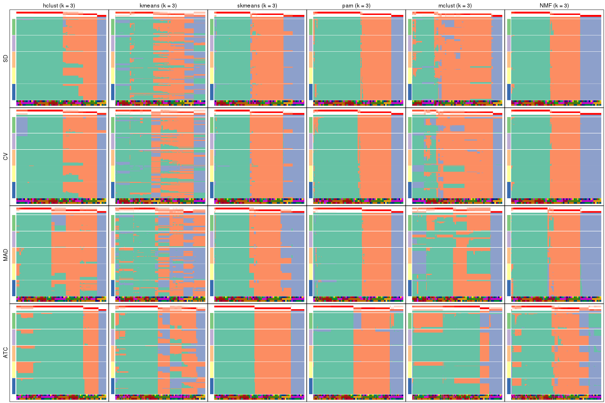</p>

</div>
<div id='tab-collect-membership-heatmap-3'>
<pre><code class="r">collect_plots(res_list, k = 4, fun = membership_heatmap, mc.cores = 4)
</code></pre>

<p></p>

</div>
<div id='tab-collect-membership-heatmap-4'>
<pre><code class="r">collect_plots(res_list, k = 5, fun = membership_heatmap, mc.cores = 4)
</code></pre>

<p></p>

</div>
<div id='tab-collect-membership-heatmap-5'>
<pre><code class="r">collect_plots(res_list, k = 6, fun = membership_heatmap, mc.cores = 4)
</code></pre>

<p></p>

</div>
</div>


### Signature heatmap

Signature heatmaps for all methods. ([What is a signature heatmap?](http://bioconductor.org/packages/devel/bioc/vignettes/cola/inst/doc/cola.html#toc_22))


Note in following heatmaps, rows are scaled.


<script>
$( function() {
	$( '#tabs-collect-get-signatures' ).tabs();
} );
</script>
<div id='tabs-collect-get-signatures'>
<ul>
<li><a href='#tab-collect-get-signatures-1'>k = 2</a></li>
<li><a href='#tab-collect-get-signatures-2'>k = 3</a></li>
<li><a href='#tab-collect-get-signatures-3'>k = 4</a></li>
<li><a href='#tab-collect-get-signatures-4'>k = 5</a></li>
<li><a href='#tab-collect-get-signatures-5'>k = 6</a></li>
</ul>
<div id='tab-collect-get-signatures-1'>
<pre><code class="r">collect_plots(res_list, k = 2, fun = get_signatures, mc.cores = 4)
</code></pre>

<p></p>

</div>
<div id='tab-collect-get-signatures-2'>
<pre><code class="r">collect_plots(res_list, k = 3, fun = get_signatures, mc.cores = 4)
</code></pre>

<p></p>

</div>
<div id='tab-collect-get-signatures-3'>
<pre><code class="r">collect_plots(res_list, k = 4, fun = get_signatures, mc.cores = 4)
</code></pre>

<p></p>

</div>
<div id='tab-collect-get-signatures-4'>
<pre><code class="r">collect_plots(res_list, k = 5, fun = get_signatures, mc.cores = 4)
</code></pre>

<p></p>

</div>
<div id='tab-collect-get-signatures-5'>
<pre><code class="r">collect_plots(res_list, k = 6, fun = get_signatures, mc.cores = 4)
</code></pre>

<p></p>

</div>
</div>


### Statistics table

The statistics used for measuring the stability of consensus partitioning.
([How are they
defined?](http://bioconductor.org/packages/devel/bioc/vignettes/cola/inst/doc/cola.html#toc_13))


<script>
$( function() {
	$( '#tabs-get-stats-from-consensus-partition-list' ).tabs();
} );
</script>
<div id='tabs-get-stats-from-consensus-partition-list'>
<ul>
<li><a href='#tab-get-stats-from-consensus-partition-list-1'>k = 2</a></li>
<li><a href='#tab-get-stats-from-consensus-partition-list-2'>k = 3</a></li>
<li><a href='#tab-get-stats-from-consensus-partition-list-3'>k = 4</a></li>
<li><a href='#tab-get-stats-from-consensus-partition-list-4'>k = 5</a></li>
<li><a href='#tab-get-stats-from-consensus-partition-list-5'>k = 6</a></li>
</ul>
<div id='tab-get-stats-from-consensus-partition-list-1'>
<pre><code class="r">get_stats(res_list, k = 2)
</code></pre>

<pre><code>#&gt;             k 1-PAC mean_silhouette concordance area_increased  Rand Jaccard
#&gt; SD:NMF      2 0.837           0.888       0.956          0.491 0.510   0.510
#&gt; CV:NMF      2 0.593           0.845       0.890          0.489 0.500   0.500
#&gt; MAD:NMF     2 0.795           0.900       0.956          0.491 0.501   0.501
#&gt; ATC:NMF     2 0.874           0.912       0.963          0.461 0.529   0.529
#&gt; SD:skmeans  2 0.677           0.914       0.954          0.502 0.499   0.499
#&gt; CV:skmeans  2 1.000           0.964       0.979          0.502 0.499   0.499
#&gt; MAD:skmeans 2 0.719           0.903       0.952          0.502 0.498   0.498
#&gt; ATC:skmeans 2 1.000           0.982       0.992          0.489 0.514   0.514
#&gt; SD:mclust   2 0.630           0.878       0.935          0.370 0.638   0.638
#&gt; CV:mclust   2 0.646           0.763       0.892          0.378 0.603   0.603
#&gt; MAD:mclust  2 0.612           0.869       0.937          0.331 0.657   0.657
#&gt; ATC:mclust  2 1.000           0.979       0.991          0.361 0.638   0.638
#&gt; SD:kmeans   2 0.292           0.627       0.810          0.430 0.569   0.569
#&gt; CV:kmeans   2 0.218           0.699       0.757          0.434 0.501   0.501
#&gt; MAD:kmeans  2 0.288           0.784       0.852          0.450 0.519   0.519
#&gt; ATC:kmeans  2 0.955           0.958       0.975          0.410 0.578   0.578
#&gt; SD:pam      2 0.952           0.945       0.961          0.447 0.546   0.546
#&gt; CV:pam      2 0.468           0.757       0.810          0.323 0.769   0.769
#&gt; MAD:pam     2 0.858           0.913       0.963          0.457 0.553   0.553
#&gt; ATC:pam     2 0.975           0.961       0.983          0.494 0.508   0.508
#&gt; SD:hclust   2 0.447           0.807       0.886          0.298 0.813   0.813
#&gt; CV:hclust   2 0.335           0.777       0.834          0.399 0.498   0.498
#&gt; MAD:hclust  2 0.728           0.952       0.970          0.224 0.813   0.813
#&gt; ATC:hclust  2 0.733           0.938       0.942          0.317 0.614   0.614
</code></pre>

</div>
<div id='tab-get-stats-from-consensus-partition-list-2'>
<pre><code class="r">get_stats(res_list, k = 3)
</code></pre>

<pre><code>#&gt;             k 1-PAC mean_silhouette concordance area_increased  Rand Jaccard
#&gt; SD:NMF      3 1.000           0.980       0.991          0.326 0.751   0.550
#&gt; CV:NMF      3 1.000           0.983       0.993          0.333 0.733   0.522
#&gt; MAD:NMF     3 0.897           0.910       0.963          0.334 0.782   0.591
#&gt; ATC:NMF     3 0.553           0.660       0.840          0.339 0.721   0.520
#&gt; SD:skmeans  3 0.970           0.932       0.967          0.305 0.795   0.609
#&gt; CV:skmeans  3 0.900           0.948       0.972          0.300 0.791   0.602
#&gt; MAD:skmeans 3 0.827           0.884       0.938          0.298 0.746   0.534
#&gt; ATC:skmeans 3 1.000           0.991       0.997          0.263 0.864   0.737
#&gt; SD:mclust   3 0.615           0.791       0.897          0.511 0.774   0.663
#&gt; CV:mclust   3 0.557           0.745       0.850          0.469 0.859   0.770
#&gt; MAD:mclust  3 0.430           0.579       0.745          0.757 0.621   0.469
#&gt; ATC:mclust  3 0.678           0.856       0.844          0.356 0.952   0.925
#&gt; SD:kmeans   3 0.353           0.678       0.775          0.376 0.606   0.400
#&gt; CV:kmeans   3 0.260           0.732       0.781          0.357 0.864   0.736
#&gt; MAD:kmeans  3 0.418           0.498       0.670          0.365 0.731   0.527
#&gt; ATC:kmeans  3 0.503           0.553       0.788          0.462 0.651   0.478
#&gt; SD:pam      3 0.969           0.950       0.981          0.330 0.861   0.745
#&gt; CV:pam      3 0.959           0.935       0.976          0.863 0.629   0.517
#&gt; MAD:pam     3 0.995           0.953       0.977          0.305 0.848   0.728
#&gt; ATC:pam     3 0.833           0.934       0.937          0.224 0.862   0.731
#&gt; SD:hclust   3 0.727           0.886       0.923          0.808 0.605   0.515
#&gt; CV:hclust   3 0.620           0.886       0.924          0.435 0.921   0.841
#&gt; MAD:hclust  3 0.500           0.848       0.895          1.562 0.602   0.511
#&gt; ATC:hclust  3 0.702           0.881       0.939          0.432 0.970   0.951
</code></pre>

</div>
<div id='tab-get-stats-from-consensus-partition-list-3'>
<pre><code class="r">get_stats(res_list, k = 4)
</code></pre>

<pre><code>#&gt;             k 1-PAC mean_silhouette concordance area_increased  Rand Jaccard
#&gt; SD:NMF      4 0.828           0.917       0.930         0.0577 0.972   0.921
#&gt; CV:NMF      4 0.785           0.904       0.913         0.0612 0.972   0.921
#&gt; MAD:NMF     4 0.964           0.946       0.972         0.0524 0.957   0.876
#&gt; ATC:NMF     4 0.925           0.894       0.961         0.1282 0.908   0.753
#&gt; SD:skmeans  4 0.807           0.856       0.892         0.0929 0.931   0.807
#&gt; CV:skmeans  4 0.748           0.864       0.890         0.0972 0.936   0.819
#&gt; MAD:skmeans 4 0.713           0.789       0.845         0.1034 0.915   0.759
#&gt; ATC:skmeans 4 0.790           0.744       0.832         0.1307 0.943   0.850
#&gt; SD:mclust   4 0.714           0.840       0.895         0.1917 0.707   0.457
#&gt; CV:mclust   4 0.727           0.820       0.912         0.2155 0.697   0.443
#&gt; MAD:mclust  4 0.732           0.853       0.919         0.1715 0.817   0.577
#&gt; ATC:mclust  4 1.000           0.984       0.993         0.3865 0.704   0.513
#&gt; SD:kmeans   4 0.485           0.759       0.782         0.1563 0.948   0.854
#&gt; CV:kmeans   4 0.521           0.766       0.790         0.1616 0.917   0.792
#&gt; MAD:kmeans  4 0.522           0.713       0.747         0.1246 0.819   0.576
#&gt; ATC:kmeans  4 0.766           0.856       0.893         0.1269 0.891   0.742
#&gt; SD:pam      4 1.000           0.968       0.988         0.0951 0.935   0.840
#&gt; CV:pam      4 0.991           0.951       0.980         0.0998 0.944   0.859
#&gt; MAD:pam     4 0.991           0.955       0.978         0.0904 0.937   0.849
#&gt; ATC:pam     4 1.000           0.985       0.994         0.1122 0.945   0.856
#&gt; SD:hclust   4 0.700           0.803       0.846         0.2684 0.870   0.694
#&gt; CV:hclust   4 0.821           0.939       0.944         0.1647 0.901   0.763
#&gt; MAD:hclust  4 0.827           0.853       0.896         0.2019 0.888   0.732
#&gt; ATC:hclust  4 0.609           0.829       0.879         0.2985 0.778   0.624
</code></pre>

</div>
<div id='tab-get-stats-from-consensus-partition-list-4'>
<pre><code class="r">get_stats(res_list, k = 5)
</code></pre>

<pre><code>#&gt;             k 1-PAC mean_silhouette concordance area_increased  Rand Jaccard
#&gt; SD:NMF      5 0.764           0.757       0.889         0.1185 0.805   0.474
#&gt; CV:NMF      5 0.777           0.794       0.893         0.1172 0.806   0.481
#&gt; MAD:NMF     5 0.914           0.921       0.952         0.1065 0.897   0.683
#&gt; ATC:NMF     5 0.773           0.724       0.870         0.0879 0.864   0.600
#&gt; SD:skmeans  5 0.728           0.700       0.835         0.0902 0.843   0.525
#&gt; CV:skmeans  5 0.715           0.700       0.831         0.0863 0.901   0.679
#&gt; MAD:skmeans 5 0.705           0.715       0.834         0.0888 0.846   0.524
#&gt; ATC:skmeans 5 0.833           0.696       0.849         0.1096 0.843   0.548
#&gt; SD:mclust   5 0.663           0.711       0.830         0.1087 0.784   0.441
#&gt; CV:mclust   5 0.743           0.776       0.888         0.1177 0.789   0.434
#&gt; MAD:mclust  5 0.764           0.818       0.855         0.1273 0.881   0.622
#&gt; ATC:mclust  5 0.784           0.748       0.800         0.1152 1.000   1.000
#&gt; SD:kmeans   5 0.631           0.529       0.699         0.0870 0.960   0.875
#&gt; CV:kmeans   5 0.602           0.566       0.687         0.0938 0.869   0.613
#&gt; MAD:kmeans  5 0.632           0.709       0.710         0.0899 0.899   0.694
#&gt; ATC:kmeans  5 0.733           0.714       0.809         0.1067 0.892   0.684
#&gt; SD:pam      5 0.768           0.806       0.888         0.1295 0.892   0.698
#&gt; CV:pam      5 0.754           0.533       0.763         0.1322 0.879   0.648
#&gt; MAD:pam     5 0.857           0.914       0.921         0.1469 0.868   0.635
#&gt; ATC:pam     5 0.821           0.887       0.943         0.1377 0.852   0.580
#&gt; SD:hclust   5 0.840           0.895       0.902         0.0838 0.920   0.748
#&gt; CV:hclust   5 0.834           0.912       0.903         0.1225 0.930   0.781
#&gt; MAD:hclust  5 0.895           0.856       0.906         0.0489 0.991   0.971
#&gt; ATC:hclust  5 0.795           0.849       0.912         0.1962 0.837   0.615
</code></pre>

</div>
<div id='tab-get-stats-from-consensus-partition-list-5'>
<pre><code class="r">get_stats(res_list, k = 6)
</code></pre>

<pre><code>#&gt;             k 1-PAC mean_silhouette concordance area_increased  Rand Jaccard
#&gt; SD:NMF      6 0.926           0.892       0.951         0.0752 0.887   0.556
#&gt; CV:NMF      6 0.932           0.916       0.956         0.0717 0.880   0.542
#&gt; MAD:NMF     6 0.812           0.828       0.884         0.0721 0.920   0.671
#&gt; ATC:NMF     6 0.740           0.695       0.822         0.0555 0.899   0.624
#&gt; SD:skmeans  6 0.760           0.742       0.833         0.0523 0.934   0.708
#&gt; CV:skmeans  6 0.786           0.744       0.838         0.0540 0.913   0.637
#&gt; MAD:skmeans 6 0.764           0.757       0.823         0.0482 0.932   0.701
#&gt; ATC:skmeans 6 0.802           0.757       0.851         0.0331 0.934   0.722
#&gt; SD:mclust   6 0.826           0.789       0.891         0.1013 0.880   0.563
#&gt; CV:mclust   6 0.833           0.776       0.887         0.0728 0.850   0.461
#&gt; MAD:mclust  6 0.878           0.849       0.919         0.0724 0.926   0.679
#&gt; ATC:mclust  6 0.820           0.845       0.902         0.0668 0.850   0.546
#&gt; SD:kmeans   6 0.657           0.714       0.715         0.0602 0.846   0.493
#&gt; CV:kmeans   6 0.641           0.629       0.680         0.0426 0.908   0.635
#&gt; MAD:kmeans  6 0.635           0.689       0.708         0.0513 0.917   0.664
#&gt; ATC:kmeans  6 0.750           0.676       0.781         0.0553 0.879   0.562
#&gt; SD:pam      6 0.836           0.824       0.894         0.0631 0.949   0.805
#&gt; CV:pam      6 0.762           0.656       0.840         0.0699 0.845   0.449
#&gt; MAD:pam     6 0.758           0.728       0.829         0.0805 0.940   0.748
#&gt; ATC:pam     6 0.812           0.856       0.906         0.0608 0.944   0.762
#&gt; SD:hclust   6 0.856           0.898       0.919         0.0261 0.997   0.988
#&gt; CV:hclust   6 0.781           0.858       0.851         0.0346 1.000   1.000
#&gt; MAD:hclust  6 0.929           0.915       0.936         0.0642 0.941   0.800
#&gt; ATC:hclust  6 0.902           0.951       0.974         0.0533 0.952   0.844
</code></pre>

</div>
</div>

Following heatmap plots the partition for each combination of methods and the
lightness correspond to the silhouette scores for samples in each method. On
top the consensus subgroup is inferred from all methods by taking the mean
silhouette scores as weight.


<script>
$( function() {
	$( '#tabs-collect-stats-from-consensus-partition-list' ).tabs();
} );
</script>
<div id='tabs-collect-stats-from-consensus-partition-list'>
<ul>
<li><a href='#tab-collect-stats-from-consensus-partition-list-1'>k = 2</a></li>
<li><a href='#tab-collect-stats-from-consensus-partition-list-2'>k = 3</a></li>
<li><a href='#tab-collect-stats-from-consensus-partition-list-3'>k = 4</a></li>
<li><a href='#tab-collect-stats-from-consensus-partition-list-4'>k = 5</a></li>
<li><a href='#tab-collect-stats-from-consensus-partition-list-5'>k = 6</a></li>
</ul>
<div id='tab-collect-stats-from-consensus-partition-list-1'>
<pre><code class="r">collect_stats(res_list, k = 2)
</code></pre>

<p></p>

</div>
<div id='tab-collect-stats-from-consensus-partition-list-2'>
<pre><code class="r">collect_stats(res_list, k = 3)
</code></pre>

<p></p>

</div>
<div id='tab-collect-stats-from-consensus-partition-list-3'>
<pre><code class="r">collect_stats(res_list, k = 4)
</code></pre>

<p></p>

</div>
<div id='tab-collect-stats-from-consensus-partition-list-4'>
<pre><code class="r">collect_stats(res_list, k = 5)
</code></pre>

<p></p>

</div>
<div id='tab-collect-stats-from-consensus-partition-list-5'>
<pre><code class="r">collect_stats(res_list, k = 6)
</code></pre>

<p></p>

</div>
</div>

### Partition from all methods


Collect partitions from all methods:


<script>
$( function() {
	$( '#tabs-collect-classes-from-consensus-partition-list' ).tabs();
} );
</script>
<div id='tabs-collect-classes-from-consensus-partition-list'>
<ul>
<li><a href='#tab-collect-classes-from-consensus-partition-list-1'>k = 2</a></li>
<li><a href='#tab-collect-classes-from-consensus-partition-list-2'>k = 3</a></li>
<li><a href='#tab-collect-classes-from-consensus-partition-list-3'>k = 4</a></li>
<li><a href='#tab-collect-classes-from-consensus-partition-list-4'>k = 5</a></li>
<li><a href='#tab-collect-classes-from-consensus-partition-list-5'>k = 6</a></li>
</ul>
<div id='tab-collect-classes-from-consensus-partition-list-1'>
<pre><code class="r">collect_classes(res_list, k = 2)
</code></pre>

<p></p>

</div>
<div id='tab-collect-classes-from-consensus-partition-list-2'>
<pre><code class="r">collect_classes(res_list, k = 3)
</code></pre>

<p></p>

</div>
<div id='tab-collect-classes-from-consensus-partition-list-3'>
<pre><code class="r">collect_classes(res_list, k = 4)
</code></pre>

<p></p>

</div>
<div id='tab-collect-classes-from-consensus-partition-list-4'>
<pre><code class="r">collect_classes(res_list, k = 5)
</code></pre>

<p></p>

</div>
<div id='tab-collect-classes-from-consensus-partition-list-5'>
<pre><code class="r">collect_classes(res_list, k = 6)
</code></pre>

<p></p>

</div>
</div>


### Top rows overlap


Overlap of top rows from different top-row methods:


<script>
$( function() {
	$( '#tabs-top-rows-overlap-by-euler' ).tabs();
} );
</script>
<div id='tabs-top-rows-overlap-by-euler'>
<ul>
<li><a href='#tab-top-rows-overlap-by-euler-1'>top_n = 1000</a></li>
<li><a href='#tab-top-rows-overlap-by-euler-2'>top_n = 2000</a></li>
<li><a href='#tab-top-rows-overlap-by-euler-3'>top_n = 3000</a></li>
<li><a href='#tab-top-rows-overlap-by-euler-4'>top_n = 4000</a></li>
<li><a href='#tab-top-rows-overlap-by-euler-5'>top_n = 5000</a></li>
</ul>
<div id='tab-top-rows-overlap-by-euler-1'>
<pre><code class="r">top_rows_overlap(res_list, top_n = 1000, method = &quot;euler&quot;)
</code></pre>

<p></p>

</div>
<div id='tab-top-rows-overlap-by-euler-2'>
<pre><code class="r">top_rows_overlap(res_list, top_n = 2000, method = &quot;euler&quot;)
</code></pre>

<p></p>

</div>
<div id='tab-top-rows-overlap-by-euler-3'>
<pre><code class="r">top_rows_overlap(res_list, top_n = 3000, method = &quot;euler&quot;)
</code></pre>

<p></p>

</div>
<div id='tab-top-rows-overlap-by-euler-4'>
<pre><code class="r">top_rows_overlap(res_list, top_n = 4000, method = &quot;euler&quot;)
</code></pre>

<p></p>

</div>
<div id='tab-top-rows-overlap-by-euler-5'>
<pre><code class="r">top_rows_overlap(res_list, top_n = 5000, method = &quot;euler&quot;)
</code></pre>

<p></p>

</div>
</div>

Also visualize the correspondance of rankings between different top-row methods:


<script>
$( function() {
	$( '#tabs-top-rows-overlap-by-correspondance' ).tabs();
} );
</script>
<div id='tabs-top-rows-overlap-by-correspondance'>
<ul>
<li><a href='#tab-top-rows-overlap-by-correspondance-1'>top_n = 1000</a></li>
<li><a href='#tab-top-rows-overlap-by-correspondance-2'>top_n = 2000</a></li>
<li><a href='#tab-top-rows-overlap-by-correspondance-3'>top_n = 3000</a></li>
<li><a href='#tab-top-rows-overlap-by-correspondance-4'>top_n = 4000</a></li>
<li><a href='#tab-top-rows-overlap-by-correspondance-5'>top_n = 5000</a></li>
</ul>
<div id='tab-top-rows-overlap-by-correspondance-1'>
<pre><code class="r">top_rows_overlap(res_list, top_n = 1000, method = &quot;correspondance&quot;)
</code></pre>

<p></p>

</div>
<div id='tab-top-rows-overlap-by-correspondance-2'>
<pre><code class="r">top_rows_overlap(res_list, top_n = 2000, method = &quot;correspondance&quot;)
</code></pre>

<p></p>

</div>
<div id='tab-top-rows-overlap-by-correspondance-3'>
<pre><code class="r">top_rows_overlap(res_list, top_n = 3000, method = &quot;correspondance&quot;)
</code></pre>

<p></p>

</div>
<div id='tab-top-rows-overlap-by-correspondance-4'>
<pre><code class="r">top_rows_overlap(res_list, top_n = 4000, method = &quot;correspondance&quot;)
</code></pre>

<p></p>

</div>
<div id='tab-top-rows-overlap-by-correspondance-5'>
<pre><code class="r">top_rows_overlap(res_list, top_n = 5000, method = &quot;correspondance&quot;)
</code></pre>

<p></p>

</div>
</div>


Heatmaps of the top rows:


<script>
$( function() {
	$( '#tabs-top-rows-heatmap' ).tabs();
} );
</script>
<div id='tabs-top-rows-heatmap'>
<ul>
<li><a href='#tab-top-rows-heatmap-1'>top_n = 1000</a></li>
<li><a href='#tab-top-rows-heatmap-2'>top_n = 2000</a></li>
<li><a href='#tab-top-rows-heatmap-3'>top_n = 3000</a></li>
<li><a href='#tab-top-rows-heatmap-4'>top_n = 4000</a></li>
<li><a href='#tab-top-rows-heatmap-5'>top_n = 5000</a></li>
</ul>
<div id='tab-top-rows-heatmap-1'>
<pre><code class="r">top_rows_heatmap(res_list, top_n = 1000)
</code></pre>

<p></p>

</div>
<div id='tab-top-rows-heatmap-2'>
<pre><code class="r">top_rows_heatmap(res_list, top_n = 2000)
</code></pre>

<p></p>

</div>
<div id='tab-top-rows-heatmap-3'>
<pre><code class="r">top_rows_heatmap(res_list, top_n = 3000)
</code></pre>

<p></p>

</div>
<div id='tab-top-rows-heatmap-4'>
<pre><code class="r">top_rows_heatmap(res_list, top_n = 4000)
</code></pre>

<p></p>

</div>
<div id='tab-top-rows-heatmap-5'>
<pre><code class="r">top_rows_heatmap(res_list, top_n = 5000)
</code></pre>

<p></p>

</div>
</div>


### Test to known annotations


Test correlation between subgroups and known annotations. If the known
annotation is numeric, one-way ANOVA test is applied, and if the known
annotation is discrete, chi-squared contingency table test is applied.


<script>
$( function() {
	$( '#tabs-test-to-known-factors-from-consensus-partition-list' ).tabs();
} );
</script>
<div id='tabs-test-to-known-factors-from-consensus-partition-list'>
<ul>
<li><a href='#tab-test-to-known-factors-from-consensus-partition-list-1'>k = 2</a></li>
<li><a href='#tab-test-to-known-factors-from-consensus-partition-list-2'>k = 3</a></li>
<li><a href='#tab-test-to-known-factors-from-consensus-partition-list-3'>k = 4</a></li>
<li><a href='#tab-test-to-known-factors-from-consensus-partition-list-4'>k = 5</a></li>
<li><a href='#tab-test-to-known-factors-from-consensus-partition-list-5'>k = 6</a></li>
</ul>
<div id='tab-test-to-known-factors-from-consensus-partition-list-1'>
<pre><code class="r">test_to_known_factors(res_list, k = 2)
</code></pre>

<pre><code>#&gt;               n cell.line(p) tissue(p) disease.state(p) k
#&gt; SD:NMF      163     1.25e-12  1.69e-15         4.22e-11 2
#&gt; CV:NMF      159     1.59e-12  1.19e-16         3.84e-11 2
#&gt; MAD:NMF     167     5.64e-13  1.51e-20         2.86e-12 2
#&gt; ATC:NMF     165     3.34e-12  2.56e-19         8.81e-10 2
#&gt; SD:skmeans  174     3.98e-13  1.11e-21         5.51e-13 2
#&gt; CV:skmeans  173     5.58e-13  8.19e-22         3.49e-13 2
#&gt; MAD:skmeans 173     5.58e-13  1.04e-16         1.36e-10 2
#&gt; ATC:skmeans 173     1.45e-12  5.14e-18         4.89e-10 2
#&gt; SD:mclust   174     1.60e-13  2.28e-30         1.02e-24 2
#&gt; CV:mclust   151     7.90e-12  8.05e-27         4.75e-23 2
#&gt; MAD:mclust  171     2.53e-13  1.30e-29         1.36e-24 2
#&gt; ATC:mclust  172     3.16e-13  6.96e-31         2.44e-24 2
#&gt; SD:kmeans   128     2.24e-10  4.98e-18         4.17e-08 2
#&gt; CV:kmeans   141     4.42e-11  2.17e-16         8.52e-10 2
#&gt; MAD:kmeans  174     1.60e-13  5.92e-19         1.64e-10 2
#&gt; ATC:kmeans  173     2.25e-13  5.36e-25         2.29e-10 2
#&gt; SD:pam      170     6.23e-13  1.01e-18         1.09e-10 2
#&gt; CV:pam      174     1.60e-13  1.29e-28         1.02e-24 2
#&gt; MAD:pam     165     1.94e-12  1.61e-17         6.85e-11 2
#&gt; ATC:pam     172     4.91e-12  4.94e-16         7.59e-09 2
#&gt; SD:hclust   174     1.60e-13  1.87e-33         1.02e-24 2
#&gt; CV:hclust   174     1.60e-13  2.96e-22         1.15e-13 2
#&gt; MAD:hclust  174     1.60e-13  1.87e-33         1.02e-24 2
#&gt; ATC:hclust  174     1.60e-13  1.59e-29         7.29e-12 2
</code></pre>

</div>
<div id='tab-test-to-known-factors-from-consensus-partition-list-2'>
<pre><code class="r">test_to_known_factors(res_list, k = 3)
</code></pre>

<pre><code>#&gt;               n cell.line(p) tissue(p) disease.state(p) k
#&gt; SD:NMF      174     1.68e-24  3.71e-44         1.43e-29 3
#&gt; CV:NMF      174     1.68e-24  3.71e-44         1.43e-29 3
#&gt; MAD:NMF     166     1.21e-23  6.96e-43         3.18e-29 3
#&gt; ATC:NMF     135     1.85e-18  6.18e-37         2.87e-24 3
#&gt; SD:skmeans  171     1.84e-23  2.11e-43         4.79e-30 3
#&gt; CV:skmeans  173     3.21e-24  6.05e-45         1.99e-31 3
#&gt; MAD:skmeans 172     8.07e-24  2.61e-44         1.17e-27 3
#&gt; ATC:skmeans 173     2.86e-24  1.50e-47         1.46e-30 3
#&gt; SD:mclust   158     9.47e-23  9.74e-51         8.11e-39 3
#&gt; CV:mclust   159     4.82e-23  4.72e-58         4.44e-44 3
#&gt; MAD:mclust  130     6.79e-19  1.06e-35         6.12e-23 3
#&gt; ATC:mclust  173     4.18e-24  3.58e-62         6.22e-46 3
#&gt; SD:kmeans   148     2.86e-21  3.57e-37         4.08e-28 3
#&gt; CV:kmeans   150     2.25e-21  7.93e-38         4.03e-29 3
#&gt; MAD:kmeans  108     7.15e-09  2.48e-18         4.57e-07 3
#&gt; ATC:kmeans   93     7.31e-08  2.99e-17         4.16e-12 3
#&gt; SD:pam      170     7.47e-24  1.80e-42         6.16e-31 3
#&gt; CV:pam      170     2.13e-23  2.19e-43         2.86e-31 3
#&gt; MAD:pam     171     1.26e-24  5.12e-47         8.70e-32 3
#&gt; ATC:pam     174     1.47e-24  7.20e-48         7.89e-31 3
#&gt; SD:hclust   174     5.09e-25  1.47e-51         2.11e-34 3
#&gt; CV:hclust   174     5.09e-25  1.47e-51         2.11e-34 3
#&gt; MAD:hclust  174     1.41e-24  1.75e-48         6.04e-34 3
#&gt; ATC:hclust  174     5.09e-25  6.26e-50         2.25e-29 3
</code></pre>

</div>
<div id='tab-test-to-known-factors-from-consensus-partition-list-3'>
<pre><code class="r">test_to_known_factors(res_list, k = 4)
</code></pre>

<pre><code>#&gt;               n cell.line(p) tissue(p) disease.state(p) k
#&gt; SD:NMF      172     4.53e-35  2.07e-72         1.90e-51 4
#&gt; CV:NMF      174     6.10e-36  4.07e-73         8.79e-52 4
#&gt; MAD:NMF     173     5.08e-36  2.00e-68         3.25e-48 4
#&gt; ATC:NMF     164     5.24e-33  3.68e-73         1.83e-48 4
#&gt; SD:skmeans  168     7.91e-34  8.10e-68         7.93e-44 4
#&gt; CV:skmeans  171     2.08e-34  1.09e-68         5.27e-44 4
#&gt; MAD:skmeans 169     5.41e-35  1.15e-69         5.20e-44 4
#&gt; ATC:skmeans 140     1.70e-28  4.84e-50         9.15e-38 4
#&gt; SD:mclust   167     2.54e-34  4.15e-71         7.70e-51 4
#&gt; CV:mclust   158     2.37e-32  3.77e-67         1.94e-49 4
#&gt; MAD:mclust  169     1.91e-34  1.52e-62         1.54e-43 4
#&gt; ATC:mclust  173     1.35e-34  5.49e-69         6.97e-50 4
#&gt; SD:kmeans   173     1.62e-35  1.36e-73         1.72e-53 4
#&gt; CV:kmeans   171     3.77e-35  2.98e-73         2.27e-53 4
#&gt; MAD:kmeans  158     3.76e-32  9.60e-65         5.14e-45 4
#&gt; ATC:kmeans  167     2.55e-34  3.98e-72         1.98e-49 4
#&gt; SD:pam      172     1.39e-35  2.80e-71         3.31e-50 4
#&gt; CV:pam      171     1.35e-34  7.29e-71         3.05e-50 4
#&gt; MAD:pam     171     7.23e-36  1.44e-76         1.85e-50 4
#&gt; ATC:pam     174     6.20e-36  1.03e-68         9.31e-51 4
#&gt; SD:hclust   168     2.70e-34  1.88e-70         1.17e-50 4
#&gt; CV:hclust   174     1.92e-35  2.61e-73         1.08e-53 4
#&gt; MAD:hclust  168     1.98e-34  1.34e-68         1.52e-46 4
#&gt; ATC:hclust  149     2.73e-31  1.39e-56         1.00e-26 4
</code></pre>

</div>
<div id='tab-test-to-known-factors-from-consensus-partition-list-4'>
<pre><code class="r">test_to_known_factors(res_list, k = 5)
</code></pre>

<pre><code>#&gt;               n cell.line(p) tissue(p) disease.state(p) k
#&gt; SD:NMF      148     2.25e-41  2.62e-78         2.53e-53 5
#&gt; CV:NMF      155     1.44e-42  8.83e-81         1.21e-57 5
#&gt; MAD:NMF     172     6.52e-46  4.34e-89         2.06e-53 5
#&gt; ATC:NMF     133     1.31e-32  2.28e-62         4.64e-40 5
#&gt; SD:skmeans  137     7.62e-38  3.27e-77         3.67e-50 5
#&gt; CV:skmeans  146     3.31e-40  8.99e-80         9.53e-51 5
#&gt; MAD:skmeans 143     1.80e-38  5.03e-74         1.99e-49 5
#&gt; ATC:skmeans 135     2.56e-35  2.16e-53         2.57e-39 5
#&gt; SD:mclust   149     4.79e-40  1.06e-94         1.40e-55 5
#&gt; CV:mclust   156     3.76e-43  2.52e-90         1.34e-62 5
#&gt; MAD:mclust  165     1.47e-44  8.66e-79         7.44e-58 5
#&gt; ATC:mclust  159     4.43e-32  1.10e-66         3.22e-49 5
#&gt; SD:kmeans   103     1.49e-29  6.77e-59         3.61e-46 5
#&gt; CV:kmeans   111     4.95e-24  5.15e-48         1.36e-34 5
#&gt; MAD:kmeans  155     2.36e-41  6.94e-82         3.83e-59 5
#&gt; ATC:kmeans  137     5.25e-37  9.61e-78         3.42e-41 5
#&gt; SD:pam      162     1.19e-41  1.21e-70         4.86e-46 5
#&gt; CV:pam       87     1.60e-13  7.25e-31         1.02e-24 5
#&gt; MAD:pam     169     6.36e-46  5.23e-94         8.51e-69 5
#&gt; ATC:pam     171     3.10e-42  1.30e-80         1.42e-54 5
#&gt; SD:hclust   174     7.39e-47  1.51e-97         3.66e-54 5
#&gt; CV:hclust   174     7.39e-47  1.51e-97         3.66e-54 5
#&gt; MAD:hclust  168     2.69e-45  3.18e-76         1.41e-46 5
#&gt; ATC:hclust  174     2.45e-47  1.13e-68         1.33e-58 5
</code></pre>

</div>
<div id='tab-test-to-known-factors-from-consensus-partition-list-5'>
<pre><code class="r">test_to_known_factors(res_list, k = 6)
</code></pre>

<pre><code>#&gt;               n cell.line(p) tissue(p) disease.state(p) k
#&gt; SD:NMF      164     2.05e-54 3.33e-110         1.06e-66 6
#&gt; CV:NMF      167     7.87e-56 8.34e-108         1.44e-66 6
#&gt; MAD:NMF     161     1.62e-53 1.22e-109         8.02e-66 6
#&gt; ATC:NMF     146     1.87e-45  2.63e-84         1.38e-45 6
#&gt; SD:skmeans  150     2.07e-51  1.09e-87         7.29e-56 6
#&gt; CV:skmeans  148     3.70e-51  1.04e-90         8.02e-55 6
#&gt; MAD:skmeans 158     2.14e-52  3.11e-89         6.35e-54 6
#&gt; ATC:skmeans 156     1.23e-50  7.77e-86         3.85e-48 6
#&gt; SD:mclust   151     2.69e-50 9.56e-102         1.30e-57 6
#&gt; CV:mclust   145     5.62e-49 9.86e-103         1.42e-58 6
#&gt; MAD:mclust  164     1.70e-53  2.07e-96         1.85e-54 6
#&gt; ATC:mclust  168     9.78e-55  5.09e-95         5.05e-54 6
#&gt; SD:kmeans   144     4.48e-47 2.21e-101         1.24e-55 6
#&gt; CV:kmeans   130     4.64e-44 6.14e-105         1.23e-56 6
#&gt; MAD:kmeans  138     2.15e-46  1.12e-93         1.52e-52 6
#&gt; ATC:kmeans  135     1.95e-44  4.73e-79         1.30e-38 6
#&gt; SD:pam      163     2.46e-50  7.45e-78         3.19e-52 6
#&gt; CV:pam      128     1.28e-42  3.42e-88         6.27e-52 6
#&gt; MAD:pam     155     2.65e-50 2.27e-100         6.57e-58 6
#&gt; ATC:pam     169     2.55e-50  1.43e-99         9.88e-70 6
#&gt; SD:hclust   174     2.93e-58  1.01e-92         3.16e-76 6
#&gt; CV:hclust   168     2.55e-45 5.11e-100         1.38e-51 6
#&gt; MAD:hclust  168     2.63e-56 3.94e-100         7.87e-49 6
#&gt; ATC:hclust  174     2.80e-58  2.07e-86         5.40e-74 6
</code></pre>

</div>
</div>


 
## Results for each method


---------------------------------------------------


### SD:hclust


The object with results only for a single top-value method and a single partition method 
can be extracted as:

```r
res = res_list["SD", "hclust"]
# you can also extract it by
# res = res_list["SD:hclust"]
```

A summary of `res` and all the functions that can be applied to it:

```r
res
```

```
#> A 'ConsensusPartition' object with k = 2, 3, 4, 5, 6.
#>   On a matrix with 51941 rows and 174 columns.
#>   Top rows (1000, 2000, 3000, 4000, 5000) are extracted by 'SD' method.
#>   Subgroups are detected by 'hclust' method.
#>   Performed in total 1250 partitions by row resampling.
#>   Best k for subgroups seems to be 3.
#> 
#> Following methods can be applied to this 'ConsensusPartition' object:
#>  [1] "cola_report"             "collect_classes"         "collect_plots"          
#>  [4] "collect_stats"           "colnames"                "compare_signatures"     
#>  [7] "consensus_heatmap"       "dimension_reduction"     "functional_enrichment"  
#> [10] "get_anno_col"            "get_anno"                "get_classes"            
#> [13] "get_consensus"           "get_matrix"              "get_membership"         
#> [16] "get_param"               "get_signatures"          "get_stats"              
#> [19] "is_best_k"               "is_stable_k"             "membership_heatmap"     
#> [22] "ncol"                    "nrow"                    "plot_ecdf"              
#> [25] "rownames"                "select_partition_number" "show"                   
#> [28] "suggest_best_k"          "test_to_known_factors"
```

`collect_plots()` function collects all the plots made from `res` for all `k` (number of partitions)
into one single page to provide an easy and fast comparison between different `k`.

```r
collect_plots(res)
```


The plots are:

- The first row: a plot of the ECDF (Empirical cumulative distribution
  function) curves of the consensus matrix for each `k` and the heatmap of
  predicted classes for each `k`.
- The second row: heatmaps of the consensus matrix for each `k`.
- The third row: heatmaps of the membership matrix for each `k`.
- The fouth row: heatmaps of the signatures for each `k`.

All the plots in panels can be made by individual functions and they are
plotted later in this section.

`select_partition_number()` produces several plots showing different
statistics for choosing "optimized" `k`. There are following statistics:

- ECDF curves of the consensus matrix for each `k`;
- 1-PAC. [The PAC
  score](https://en.wikipedia.org/wiki/Consensus_clustering#Over-interpretation_potential_of_consensus_clustering)
  measures the proportion of the ambiguous subgrouping.
- Mean silhouette score.
- Concordance. The mean probability of fiting the consensus class ids in all
  partitions.
- Area increased. Denote $A_k$ as the area under the ECDF curve for current
  `k`, the area increased is defined as $A_k - A_{k-1}$.
- Rand index. The percent of pairs of samples that are both in a same cluster
  or both are not in a same cluster in the partition of k and k-1.
- Jaccard index. The ratio of pairs of samples are both in a same cluster in
  the partition of k and k-1 and the pairs of samples are both in a same
  cluster in the partition k or k-1.

The detailed explanations of these statistics can be found in [the cola
vignette](http://bioconductor.org/packages/devel/bioc/vignettes/cola/inst/doc/cola.html#toc_13).

Generally speaking, lower PAC score, higher mean silhouette score or higher
concordance corresponds to better partition. Rand index and Jaccard index
measure how similar the current partition is compared to partition with `k-1`.
If they are too similar, we won't accept `k` is better than `k-1`.

```r
select_partition_number(res)
```


The numeric values for all these statistics can be obtained by `get_stats()`.

```r
get_stats(res)
```

```
#>   k 1-PAC mean_silhouette concordance area_increased  Rand Jaccard
#> 2 2 0.447           0.807       0.886         0.2975 0.813   0.813
#> 3 3 0.727           0.886       0.923         0.8077 0.605   0.515
#> 4 4 0.700           0.803       0.846         0.2684 0.870   0.694
#> 5 5 0.840           0.895       0.902         0.0838 0.920   0.748
#> 6 6 0.856           0.898       0.919         0.0261 0.997   0.988
```

`suggest_best_k()` suggests the best $k$ based on these statistics. The rules are as follows:

- All $k$ with Jaccard index larger than 0.95 are removed because the increase of
  the partition number does not provides enough extra information. If all $k$ are removed,
  the best $k$ is assigned by `NA`.
- For $k$ with 1-PAC larger than 0.9, the maximal $k$ is taken as the "best k". Other $k$ is called "optional k".
- If it does not fit the second rule. The $k$ with the highest vote of highest
  1-PAC, mean silhouette and concordance is taken as the "best k".

```r
suggest_best_k(res)
```

```
#> [1] 3
```


Following shows the table of the partitions (You need to click the **show/hide
code output** link to see it). The membership matrix (columns with name `p*`)
is inferred by
[`clue::cl_consensus()`](https://www.rdocumentation.org/link/cl_consensus?package=clue)
function with the `SE` method. Basically the value in the membership matrix
represents the probability to belong to a certain group. The finall class
label for an item is determined with the group with highest probability it
belongs to.

In `get_classes()` function, the entropy is calculated from the membership
matrix and the silhouette score is calculated from the consensus matrix.


<script>
$( function() {
	$( '#tabs-SD-hclust-get-classes' ).tabs();
} );
</script>
<div id='tabs-SD-hclust-get-classes'>
<ul>
<li><a href='#tab-SD-hclust-get-classes-1'>k = 2</a></li>
<li><a href='#tab-SD-hclust-get-classes-2'>k = 3</a></li>
<li><a href='#tab-SD-hclust-get-classes-3'>k = 4</a></li>
<li><a href='#tab-SD-hclust-get-classes-4'>k = 5</a></li>
<li><a href='#tab-SD-hclust-get-classes-5'>k = 6</a></li>
</ul>

<div id='tab-SD-hclust-get-classes-1'>
<p><a id='tab-SD-hclust-get-classes-1-a' style='color:#0366d6' href='#'>show/hide code output</a></p>
<pre><code class="r">cbind(get_classes(res, k = 2), get_membership(res, k = 2))
</code></pre>

<pre><code>#&gt;           class entropy silhouette    p1    p2
#&gt; GSM803615     2  0.0000      1.000 0.000 1.000
#&gt; GSM803674     2  0.0000      1.000 0.000 1.000
#&gt; GSM803733     2  0.0000      1.000 0.000 1.000
#&gt; GSM803616     2  0.0000      1.000 0.000 1.000
#&gt; GSM803675     2  0.0000      1.000 0.000 1.000
#&gt; GSM803734     2  0.0000      1.000 0.000 1.000
#&gt; GSM803617     2  0.0000      1.000 0.000 1.000
#&gt; GSM803676     2  0.0000      1.000 0.000 1.000
#&gt; GSM803735     2  0.0000      1.000 0.000 1.000
#&gt; GSM803618     2  0.0000      1.000 0.000 1.000
#&gt; GSM803677     2  0.0000      1.000 0.000 1.000
#&gt; GSM803736     2  0.0000      1.000 0.000 1.000
#&gt; GSM803619     2  0.0000      1.000 0.000 1.000
#&gt; GSM803678     2  0.0000      1.000 0.000 1.000
#&gt; GSM803737     2  0.0000      1.000 0.000 1.000
#&gt; GSM803620     2  0.0000      1.000 0.000 1.000
#&gt; GSM803679     2  0.0000      1.000 0.000 1.000
#&gt; GSM803738     2  0.0000      1.000 0.000 1.000
#&gt; GSM803621     1  0.0000      0.860 1.000 0.000
#&gt; GSM803680     1  0.0000      0.860 1.000 0.000
#&gt; GSM803739     1  0.0000      0.860 1.000 0.000
#&gt; GSM803622     1  0.0000      0.860 1.000 0.000
#&gt; GSM803681     1  0.0000      0.860 1.000 0.000
#&gt; GSM803740     1  0.0000      0.860 1.000 0.000
#&gt; GSM803623     1  0.9833      0.536 0.576 0.424
#&gt; GSM803682     1  0.9833      0.536 0.576 0.424
#&gt; GSM803741     1  0.9833      0.536 0.576 0.424
#&gt; GSM803624     1  0.0672      0.861 0.992 0.008
#&gt; GSM803683     1  0.0672      0.861 0.992 0.008
#&gt; GSM803742     1  0.0672      0.861 0.992 0.008
#&gt; GSM803625     1  0.0000      0.860 1.000 0.000
#&gt; GSM803684     1  0.0000      0.860 1.000 0.000
#&gt; GSM803743     1  0.0000      0.860 1.000 0.000
#&gt; GSM803626     1  0.0938      0.861 0.988 0.012
#&gt; GSM803685     1  0.0000      0.860 1.000 0.000
#&gt; GSM803744     1  0.0938      0.861 0.988 0.012
#&gt; GSM803627     1  0.0000      0.860 1.000 0.000
#&gt; GSM803686     1  0.0000      0.860 1.000 0.000
#&gt; GSM803745     1  0.0000      0.860 1.000 0.000
#&gt; GSM803628     1  0.0000      0.860 1.000 0.000
#&gt; GSM803687     1  0.0000      0.860 1.000 0.000
#&gt; GSM803746     1  0.0000      0.860 1.000 0.000
#&gt; GSM803629     1  0.0000      0.860 1.000 0.000
#&gt; GSM803688     1  0.0000      0.860 1.000 0.000
#&gt; GSM803747     1  0.0000      0.860 1.000 0.000
#&gt; GSM803630     1  0.0000      0.860 1.000 0.000
#&gt; GSM803689     1  0.0000      0.860 1.000 0.000
#&gt; GSM803748     1  0.0000      0.860 1.000 0.000
#&gt; GSM803631     1  0.0000      0.860 1.000 0.000
#&gt; GSM803690     1  0.0000      0.860 1.000 0.000
#&gt; GSM803749     1  0.0000      0.860 1.000 0.000
#&gt; GSM803632     1  0.0000      0.860 1.000 0.000
#&gt; GSM803691     1  0.0000      0.860 1.000 0.000
#&gt; GSM803750     1  0.0000      0.860 1.000 0.000
#&gt; GSM803633     1  0.9833      0.536 0.576 0.424
#&gt; GSM803692     1  0.9833      0.536 0.576 0.424
#&gt; GSM803751     1  0.9833      0.536 0.576 0.424
#&gt; GSM803634     1  0.9833      0.536 0.576 0.424
#&gt; GSM803693     1  0.9833      0.536 0.576 0.424
#&gt; GSM803752     1  0.9833      0.536 0.576 0.424
#&gt; GSM803635     1  0.9833      0.536 0.576 0.424
#&gt; GSM803694     1  0.9833      0.536 0.576 0.424
#&gt; GSM803753     1  0.9833      0.536 0.576 0.424
#&gt; GSM803636     1  0.9833      0.536 0.576 0.424
#&gt; GSM803695     1  0.9833      0.536 0.576 0.424
#&gt; GSM803754     1  0.9833      0.536 0.576 0.424
#&gt; GSM803637     1  0.9833      0.536 0.576 0.424
#&gt; GSM803696     1  0.9833      0.536 0.576 0.424
#&gt; GSM803755     1  0.9833      0.536 0.576 0.424
#&gt; GSM803638     1  0.9833      0.536 0.576 0.424
#&gt; GSM803697     1  0.9833      0.536 0.576 0.424
#&gt; GSM803756     1  0.9833      0.536 0.576 0.424
#&gt; GSM803639     1  0.9833      0.536 0.576 0.424
#&gt; GSM803698     1  0.9833      0.536 0.576 0.424
#&gt; GSM803757     1  0.9833      0.536 0.576 0.424
#&gt; GSM803640     1  0.0000      0.860 1.000 0.000
#&gt; GSM803699     1  0.0000      0.860 1.000 0.000
#&gt; GSM803758     1  0.0000      0.860 1.000 0.000
#&gt; GSM803641     1  0.0000      0.860 1.000 0.000
#&gt; GSM803700     1  0.0000      0.860 1.000 0.000
#&gt; GSM803759     1  0.0000      0.860 1.000 0.000
#&gt; GSM803642     1  0.0000      0.860 1.000 0.000
#&gt; GSM803701     1  0.0000      0.860 1.000 0.000
#&gt; GSM803760     1  0.0000      0.860 1.000 0.000
#&gt; GSM803643     1  0.0000      0.860 1.000 0.000
#&gt; GSM803702     1  0.0000      0.860 1.000 0.000
#&gt; GSM803644     1  0.0000      0.860 1.000 0.000
#&gt; GSM803703     1  0.0000      0.860 1.000 0.000
#&gt; GSM803761     1  0.0000      0.860 1.000 0.000
#&gt; GSM803645     1  0.0672      0.861 0.992 0.008
#&gt; GSM803704     1  0.0672      0.861 0.992 0.008
#&gt; GSM803762     1  0.0672      0.861 0.992 0.008
#&gt; GSM803646     1  0.0000      0.860 1.000 0.000
#&gt; GSM803705     1  0.0000      0.860 1.000 0.000
#&gt; GSM803763     1  0.0000      0.860 1.000 0.000
#&gt; GSM803647     1  0.0000      0.860 1.000 0.000
#&gt; GSM803706     1  0.0000      0.860 1.000 0.000
#&gt; GSM803764     1  0.0000      0.860 1.000 0.000
#&gt; GSM803648     1  0.6973      0.798 0.812 0.188
#&gt; GSM803707     1  0.6973      0.798 0.812 0.188
#&gt; GSM803765     1  0.6973      0.798 0.812 0.188
#&gt; GSM803649     1  0.6973      0.798 0.812 0.188
#&gt; GSM803708     1  0.6973      0.798 0.812 0.188
#&gt; GSM803766     1  0.6973      0.798 0.812 0.188
#&gt; GSM803650     1  0.0000      0.860 1.000 0.000
#&gt; GSM803709     1  0.0000      0.860 1.000 0.000
#&gt; GSM803767     1  0.0000      0.860 1.000 0.000
#&gt; GSM803651     1  0.0000      0.860 1.000 0.000
#&gt; GSM803710     1  0.0000      0.860 1.000 0.000
#&gt; GSM803768     1  0.0000      0.860 1.000 0.000
#&gt; GSM803652     1  0.0000      0.860 1.000 0.000
#&gt; GSM803711     1  0.0000      0.860 1.000 0.000
#&gt; GSM803653     1  0.7139      0.794 0.804 0.196
#&gt; GSM803712     1  0.7139      0.794 0.804 0.196
#&gt; GSM803769     1  0.7139      0.794 0.804 0.196
#&gt; GSM803654     1  0.8608      0.719 0.716 0.284
#&gt; GSM803713     1  0.8608      0.719 0.716 0.284
#&gt; GSM803770     1  0.8608      0.719 0.716 0.284
#&gt; GSM803655     1  0.6801      0.802 0.820 0.180
#&gt; GSM803714     1  0.6801      0.802 0.820 0.180
#&gt; GSM803771     1  0.6801      0.802 0.820 0.180
#&gt; GSM803656     1  0.6973      0.799 0.812 0.188
#&gt; GSM803715     1  0.6973      0.799 0.812 0.188
#&gt; GSM803772     1  0.6973      0.799 0.812 0.188
#&gt; GSM803657     1  0.7056      0.795 0.808 0.192
#&gt; GSM803716     1  0.7056      0.795 0.808 0.192
#&gt; GSM803773     1  0.7056      0.795 0.808 0.192
#&gt; GSM803658     1  0.8608      0.719 0.716 0.284
#&gt; GSM803717     1  0.8608      0.719 0.716 0.284
#&gt; GSM803774     1  0.8608      0.719 0.716 0.284
#&gt; GSM803659     1  0.8608      0.719 0.716 0.284
#&gt; GSM803718     1  0.8608      0.719 0.716 0.284
#&gt; GSM803775     1  0.8608      0.719 0.716 0.284
#&gt; GSM803660     1  0.6148      0.814 0.848 0.152
#&gt; GSM803719     1  0.6148      0.814 0.848 0.152
#&gt; GSM803776     1  0.6148      0.814 0.848 0.152
#&gt; GSM803661     1  0.0672      0.861 0.992 0.008
#&gt; GSM803720     1  0.0672      0.861 0.992 0.008
#&gt; GSM803777     1  0.0672      0.861 0.992 0.008
#&gt; GSM803662     1  0.7056      0.795 0.808 0.192
#&gt; GSM803732     1  0.7056      0.795 0.808 0.192
#&gt; GSM803778     1  0.7056      0.795 0.808 0.192
#&gt; GSM803663     1  0.7139      0.793 0.804 0.196
#&gt; GSM803721     1  0.7139      0.793 0.804 0.196
#&gt; GSM803779     1  0.7139      0.793 0.804 0.196
#&gt; GSM803664     1  0.6801      0.802 0.820 0.180
#&gt; GSM803722     1  0.6801      0.802 0.820 0.180
#&gt; GSM803780     1  0.6801      0.802 0.820 0.180
#&gt; GSM803665     1  0.0672      0.861 0.992 0.008
#&gt; GSM803723     1  0.0672      0.861 0.992 0.008
#&gt; GSM803781     1  0.0672      0.861 0.992 0.008
#&gt; GSM803666     1  0.0938      0.861 0.988 0.012
#&gt; GSM803724     1  0.0938      0.861 0.988 0.012
#&gt; GSM803782     1  0.0938      0.861 0.988 0.012
#&gt; GSM803667     1  0.0938      0.861 0.988 0.012
#&gt; GSM803725     1  0.0938      0.861 0.988 0.012
#&gt; GSM803783     1  0.0938      0.861 0.988 0.012
#&gt; GSM803668     1  0.0938      0.861 0.988 0.012
#&gt; GSM803726     1  0.0938      0.861 0.988 0.012
#&gt; GSM803784     1  0.0938      0.861 0.988 0.012
#&gt; GSM803669     1  0.0938      0.861 0.988 0.012
#&gt; GSM803727     1  0.0938      0.861 0.988 0.012
#&gt; GSM803670     1  0.0938      0.861 0.988 0.012
#&gt; GSM803728     1  0.0938      0.861 0.988 0.012
#&gt; GSM803785     1  0.0938      0.861 0.988 0.012
#&gt; GSM803671     1  0.0938      0.861 0.988 0.012
#&gt; GSM803729     1  0.0938      0.861 0.988 0.012
#&gt; GSM803786     1  0.0938      0.861 0.988 0.012
#&gt; GSM803672     1  0.0938      0.861 0.988 0.012
#&gt; GSM803730     1  0.0938      0.861 0.988 0.012
#&gt; GSM803787     1  0.0938      0.861 0.988 0.012
#&gt; GSM803673     1  0.9833      0.536 0.576 0.424
#&gt; GSM803731     1  0.9833      0.536 0.576 0.424
#&gt; GSM803788     1  0.9833      0.536 0.576 0.424
</code></pre>

<script>
$('#tab-SD-hclust-get-classes-1-a').parent().next().next().hide();
$('#tab-SD-hclust-get-classes-1-a').click(function(){
  $('#tab-SD-hclust-get-classes-1-a').parent().next().next().toggle();
  return(false);
});
</script>
</div>

<div id='tab-SD-hclust-get-classes-2'>
<p><a id='tab-SD-hclust-get-classes-2-a' style='color:#0366d6' href='#'>show/hide code output</a></p>
<pre><code class="r">cbind(get_classes(res, k = 3), get_membership(res, k = 3))
</code></pre>

<pre><code>#&gt;           class entropy silhouette    p1    p2    p3
#&gt; GSM803615     3  0.0237      1.000 0.000 0.004 0.996
#&gt; GSM803674     3  0.0237      1.000 0.000 0.004 0.996
#&gt; GSM803733     3  0.0237      1.000 0.000 0.004 0.996
#&gt; GSM803616     3  0.0237      1.000 0.000 0.004 0.996
#&gt; GSM803675     3  0.0237      1.000 0.000 0.004 0.996
#&gt; GSM803734     3  0.0237      1.000 0.000 0.004 0.996
#&gt; GSM803617     3  0.0237      1.000 0.000 0.004 0.996
#&gt; GSM803676     3  0.0237      1.000 0.000 0.004 0.996
#&gt; GSM803735     3  0.0237      1.000 0.000 0.004 0.996
#&gt; GSM803618     3  0.0237      1.000 0.000 0.004 0.996
#&gt; GSM803677     3  0.0237      1.000 0.000 0.004 0.996
#&gt; GSM803736     3  0.0237      1.000 0.000 0.004 0.996
#&gt; GSM803619     3  0.0237      1.000 0.000 0.004 0.996
#&gt; GSM803678     3  0.0237      1.000 0.000 0.004 0.996
#&gt; GSM803737     3  0.0237      1.000 0.000 0.004 0.996
#&gt; GSM803620     3  0.0237      1.000 0.000 0.004 0.996
#&gt; GSM803679     3  0.0237      1.000 0.000 0.004 0.996
#&gt; GSM803738     3  0.0237      1.000 0.000 0.004 0.996
#&gt; GSM803621     1  0.0000      0.994 1.000 0.000 0.000
#&gt; GSM803680     1  0.0000      0.994 1.000 0.000 0.000
#&gt; GSM803739     1  0.0000      0.994 1.000 0.000 0.000
#&gt; GSM803622     1  0.0000      0.994 1.000 0.000 0.000
#&gt; GSM803681     1  0.0000      0.994 1.000 0.000 0.000
#&gt; GSM803740     1  0.0000      0.994 1.000 0.000 0.000
#&gt; GSM803623     2  0.0000      0.713 0.000 1.000 0.000
#&gt; GSM803682     2  0.0000      0.713 0.000 1.000 0.000
#&gt; GSM803741     2  0.0000      0.713 0.000 1.000 0.000
#&gt; GSM803624     1  0.0661      0.991 0.988 0.004 0.008
#&gt; GSM803683     1  0.0661      0.991 0.988 0.004 0.008
#&gt; GSM803742     1  0.0661      0.991 0.988 0.004 0.008
#&gt; GSM803625     1  0.0000      0.994 1.000 0.000 0.000
#&gt; GSM803684     1  0.0000      0.994 1.000 0.000 0.000
#&gt; GSM803743     1  0.0000      0.994 1.000 0.000 0.000
#&gt; GSM803626     1  0.0829      0.989 0.984 0.004 0.012
#&gt; GSM803685     1  0.0000      0.994 1.000 0.000 0.000
#&gt; GSM803744     1  0.0829      0.989 0.984 0.004 0.012
#&gt; GSM803627     1  0.0000      0.994 1.000 0.000 0.000
#&gt; GSM803686     1  0.0000      0.994 1.000 0.000 0.000
#&gt; GSM803745     1  0.0000      0.994 1.000 0.000 0.000
#&gt; GSM803628     1  0.0000      0.994 1.000 0.000 0.000
#&gt; GSM803687     1  0.0000      0.994 1.000 0.000 0.000
#&gt; GSM803746     1  0.0000      0.994 1.000 0.000 0.000
#&gt; GSM803629     1  0.0000      0.994 1.000 0.000 0.000
#&gt; GSM803688     1  0.0000      0.994 1.000 0.000 0.000
#&gt; GSM803747     1  0.0000      0.994 1.000 0.000 0.000
#&gt; GSM803630     1  0.0000      0.994 1.000 0.000 0.000
#&gt; GSM803689     1  0.0000      0.994 1.000 0.000 0.000
#&gt; GSM803748     1  0.0000      0.994 1.000 0.000 0.000
#&gt; GSM803631     1  0.0000      0.994 1.000 0.000 0.000
#&gt; GSM803690     1  0.0000      0.994 1.000 0.000 0.000
#&gt; GSM803749     1  0.0000      0.994 1.000 0.000 0.000
#&gt; GSM803632     1  0.0000      0.994 1.000 0.000 0.000
#&gt; GSM803691     1  0.0000      0.994 1.000 0.000 0.000
#&gt; GSM803750     1  0.0000      0.994 1.000 0.000 0.000
#&gt; GSM803633     2  0.0000      0.713 0.000 1.000 0.000
#&gt; GSM803692     2  0.0000      0.713 0.000 1.000 0.000
#&gt; GSM803751     2  0.0000      0.713 0.000 1.000 0.000
#&gt; GSM803634     2  0.0000      0.713 0.000 1.000 0.000
#&gt; GSM803693     2  0.0000      0.713 0.000 1.000 0.000
#&gt; GSM803752     2  0.0000      0.713 0.000 1.000 0.000
#&gt; GSM803635     2  0.0000      0.713 0.000 1.000 0.000
#&gt; GSM803694     2  0.0000      0.713 0.000 1.000 0.000
#&gt; GSM803753     2  0.0000      0.713 0.000 1.000 0.000
#&gt; GSM803636     2  0.0000      0.713 0.000 1.000 0.000
#&gt; GSM803695     2  0.0000      0.713 0.000 1.000 0.000
#&gt; GSM803754     2  0.0000      0.713 0.000 1.000 0.000
#&gt; GSM803637     2  0.0000      0.713 0.000 1.000 0.000
#&gt; GSM803696     2  0.0000      0.713 0.000 1.000 0.000
#&gt; GSM803755     2  0.0000      0.713 0.000 1.000 0.000
#&gt; GSM803638     2  0.0000      0.713 0.000 1.000 0.000
#&gt; GSM803697     2  0.0000      0.713 0.000 1.000 0.000
#&gt; GSM803756     2  0.0000      0.713 0.000 1.000 0.000
#&gt; GSM803639     2  0.0000      0.713 0.000 1.000 0.000
#&gt; GSM803698     2  0.0000      0.713 0.000 1.000 0.000
#&gt; GSM803757     2  0.0000      0.713 0.000 1.000 0.000
#&gt; GSM803640     1  0.0000      0.994 1.000 0.000 0.000
#&gt; GSM803699     1  0.0000      0.994 1.000 0.000 0.000
#&gt; GSM803758     1  0.0000      0.994 1.000 0.000 0.000
#&gt; GSM803641     1  0.0000      0.994 1.000 0.000 0.000
#&gt; GSM803700     1  0.0000      0.994 1.000 0.000 0.000
#&gt; GSM803759     1  0.0000      0.994 1.000 0.000 0.000
#&gt; GSM803642     1  0.0000      0.994 1.000 0.000 0.000
#&gt; GSM803701     1  0.0000      0.994 1.000 0.000 0.000
#&gt; GSM803760     1  0.0000      0.994 1.000 0.000 0.000
#&gt; GSM803643     1  0.0000      0.994 1.000 0.000 0.000
#&gt; GSM803702     1  0.0000      0.994 1.000 0.000 0.000
#&gt; GSM803644     1  0.0000      0.994 1.000 0.000 0.000
#&gt; GSM803703     1  0.0000      0.994 1.000 0.000 0.000
#&gt; GSM803761     1  0.0000      0.994 1.000 0.000 0.000
#&gt; GSM803645     1  0.0661      0.991 0.988 0.004 0.008
#&gt; GSM803704     1  0.0661      0.991 0.988 0.004 0.008
#&gt; GSM803762     1  0.0661      0.991 0.988 0.004 0.008
#&gt; GSM803646     1  0.0000      0.994 1.000 0.000 0.000
#&gt; GSM803705     1  0.0000      0.994 1.000 0.000 0.000
#&gt; GSM803763     1  0.0000      0.994 1.000 0.000 0.000
#&gt; GSM803647     1  0.0000      0.994 1.000 0.000 0.000
#&gt; GSM803706     1  0.0000      0.994 1.000 0.000 0.000
#&gt; GSM803764     1  0.0000      0.994 1.000 0.000 0.000
#&gt; GSM803648     2  0.5810      0.733 0.336 0.664 0.000
#&gt; GSM803707     2  0.5810      0.733 0.336 0.664 0.000
#&gt; GSM803765     2  0.5810      0.733 0.336 0.664 0.000
#&gt; GSM803649     2  0.5810      0.733 0.336 0.664 0.000
#&gt; GSM803708     2  0.5810      0.733 0.336 0.664 0.000
#&gt; GSM803766     2  0.5810      0.733 0.336 0.664 0.000
#&gt; GSM803650     1  0.0000      0.994 1.000 0.000 0.000
#&gt; GSM803709     1  0.0000      0.994 1.000 0.000 0.000
#&gt; GSM803767     1  0.0000      0.994 1.000 0.000 0.000
#&gt; GSM803651     1  0.0000      0.994 1.000 0.000 0.000
#&gt; GSM803710     1  0.0000      0.994 1.000 0.000 0.000
#&gt; GSM803768     1  0.0000      0.994 1.000 0.000 0.000
#&gt; GSM803652     1  0.0000      0.994 1.000 0.000 0.000
#&gt; GSM803711     1  0.0000      0.994 1.000 0.000 0.000
#&gt; GSM803653     2  0.8488      0.600 0.384 0.520 0.096
#&gt; GSM803712     2  0.8488      0.600 0.384 0.520 0.096
#&gt; GSM803769     2  0.8488      0.600 0.384 0.520 0.096
#&gt; GSM803654     2  0.4121      0.760 0.168 0.832 0.000
#&gt; GSM803713     2  0.4121      0.760 0.168 0.832 0.000
#&gt; GSM803770     2  0.4121      0.760 0.168 0.832 0.000
#&gt; GSM803655     2  0.5859      0.725 0.344 0.656 0.000
#&gt; GSM803714     2  0.5859      0.725 0.344 0.656 0.000
#&gt; GSM803771     2  0.5859      0.725 0.344 0.656 0.000
#&gt; GSM803656     2  0.8535      0.560 0.404 0.500 0.096
#&gt; GSM803715     2  0.8535      0.560 0.404 0.500 0.096
#&gt; GSM803772     2  0.8535      0.560 0.404 0.500 0.096
#&gt; GSM803657     2  0.5785      0.736 0.332 0.668 0.000
#&gt; GSM803716     2  0.5785      0.736 0.332 0.668 0.000
#&gt; GSM803773     2  0.5785      0.736 0.332 0.668 0.000
#&gt; GSM803658     2  0.4121      0.760 0.168 0.832 0.000
#&gt; GSM803717     2  0.4121      0.760 0.168 0.832 0.000
#&gt; GSM803774     2  0.4121      0.760 0.168 0.832 0.000
#&gt; GSM803659     2  0.4121      0.760 0.168 0.832 0.000
#&gt; GSM803718     2  0.4121      0.760 0.168 0.832 0.000
#&gt; GSM803775     2  0.4121      0.760 0.168 0.832 0.000
#&gt; GSM803660     2  0.6154      0.629 0.408 0.592 0.000
#&gt; GSM803719     2  0.6154      0.629 0.408 0.592 0.000
#&gt; GSM803776     2  0.6154      0.629 0.408 0.592 0.000
#&gt; GSM803661     1  0.0661      0.991 0.988 0.004 0.008
#&gt; GSM803720     1  0.0661      0.991 0.988 0.004 0.008
#&gt; GSM803777     1  0.0661      0.991 0.988 0.004 0.008
#&gt; GSM803662     2  0.5785      0.736 0.332 0.668 0.000
#&gt; GSM803732     2  0.5785      0.736 0.332 0.668 0.000
#&gt; GSM803778     2  0.5785      0.736 0.332 0.668 0.000
#&gt; GSM803663     2  0.5835      0.728 0.340 0.660 0.000
#&gt; GSM803721     2  0.5835      0.728 0.340 0.660 0.000
#&gt; GSM803779     2  0.5835      0.728 0.340 0.660 0.000
#&gt; GSM803664     2  0.5859      0.725 0.344 0.656 0.000
#&gt; GSM803722     2  0.5859      0.725 0.344 0.656 0.000
#&gt; GSM803780     2  0.5859      0.725 0.344 0.656 0.000
#&gt; GSM803665     1  0.0661      0.991 0.988 0.004 0.008
#&gt; GSM803723     1  0.0661      0.991 0.988 0.004 0.008
#&gt; GSM803781     1  0.0661      0.991 0.988 0.004 0.008
#&gt; GSM803666     1  0.0829      0.989 0.984 0.004 0.012
#&gt; GSM803724     1  0.0829      0.989 0.984 0.004 0.012
#&gt; GSM803782     1  0.0829      0.989 0.984 0.004 0.012
#&gt; GSM803667     1  0.0829      0.989 0.984 0.004 0.012
#&gt; GSM803725     1  0.0829      0.989 0.984 0.004 0.012
#&gt; GSM803783     1  0.0829      0.989 0.984 0.004 0.012
#&gt; GSM803668     1  0.0829      0.989 0.984 0.004 0.012
#&gt; GSM803726     1  0.0829      0.989 0.984 0.004 0.012
#&gt; GSM803784     1  0.0829      0.989 0.984 0.004 0.012
#&gt; GSM803669     1  0.0829      0.989 0.984 0.004 0.012
#&gt; GSM803727     1  0.0829      0.989 0.984 0.004 0.012
#&gt; GSM803670     1  0.0829      0.989 0.984 0.004 0.012
#&gt; GSM803728     1  0.0829      0.989 0.984 0.004 0.012
#&gt; GSM803785     1  0.0829      0.989 0.984 0.004 0.012
#&gt; GSM803671     1  0.0829      0.989 0.984 0.004 0.012
#&gt; GSM803729     1  0.0829      0.989 0.984 0.004 0.012
#&gt; GSM803786     1  0.0829      0.989 0.984 0.004 0.012
#&gt; GSM803672     1  0.0829      0.989 0.984 0.004 0.012
#&gt; GSM803730     1  0.0829      0.989 0.984 0.004 0.012
#&gt; GSM803787     1  0.0829      0.989 0.984 0.004 0.012
#&gt; GSM803673     2  0.0000      0.713 0.000 1.000 0.000
#&gt; GSM803731     2  0.0000      0.713 0.000 1.000 0.000
#&gt; GSM803788     2  0.0000      0.713 0.000 1.000 0.000
</code></pre>

<script>
$('#tab-SD-hclust-get-classes-2-a').parent().next().next().hide();
$('#tab-SD-hclust-get-classes-2-a').click(function(){
  $('#tab-SD-hclust-get-classes-2-a').parent().next().next().toggle();
  return(false);
});
</script>
</div>

<div id='tab-SD-hclust-get-classes-3'>
<p><a id='tab-SD-hclust-get-classes-3-a' style='color:#0366d6' href='#'>show/hide code output</a></p>
<pre><code class="r">cbind(get_classes(res, k = 4), get_membership(res, k = 4))
</code></pre>

<pre><code>#&gt;           class entropy silhouette    p1    p2    p3    p4
#&gt; GSM803615     4   0.495      0.737 0.000 0.000 0.440 0.560
#&gt; GSM803674     4   0.495      0.737 0.000 0.000 0.440 0.560
#&gt; GSM803733     4   0.495      0.737 0.000 0.000 0.440 0.560
#&gt; GSM803616     4   0.495      0.737 0.000 0.000 0.440 0.560
#&gt; GSM803675     4   0.495      0.737 0.000 0.000 0.440 0.560
#&gt; GSM803734     4   0.495      0.737 0.000 0.000 0.440 0.560
#&gt; GSM803617     4   0.495      0.737 0.000 0.000 0.440 0.560
#&gt; GSM803676     4   0.495      0.737 0.000 0.000 0.440 0.560
#&gt; GSM803735     4   0.495      0.737 0.000 0.000 0.440 0.560
#&gt; GSM803618     4   0.495      0.737 0.000 0.000 0.440 0.560
#&gt; GSM803677     4   0.495      0.737 0.000 0.000 0.440 0.560
#&gt; GSM803736     4   0.495      0.737 0.000 0.000 0.440 0.560
#&gt; GSM803619     4   0.495      0.737 0.000 0.000 0.440 0.560
#&gt; GSM803678     4   0.495      0.737 0.000 0.000 0.440 0.560
#&gt; GSM803737     4   0.495      0.737 0.000 0.000 0.440 0.560
#&gt; GSM803620     4   0.495      0.737 0.000 0.000 0.440 0.560
#&gt; GSM803679     4   0.495      0.737 0.000 0.000 0.440 0.560
#&gt; GSM803738     4   0.495      0.737 0.000 0.000 0.440 0.560
#&gt; GSM803621     1   0.000      0.970 1.000 0.000 0.000 0.000
#&gt; GSM803680     1   0.000      0.970 1.000 0.000 0.000 0.000
#&gt; GSM803739     1   0.000      0.970 1.000 0.000 0.000 0.000
#&gt; GSM803622     1   0.000      0.970 1.000 0.000 0.000 0.000
#&gt; GSM803681     1   0.000      0.970 1.000 0.000 0.000 0.000
#&gt; GSM803740     1   0.000      0.970 1.000 0.000 0.000 0.000
#&gt; GSM803623     2   0.220      0.740 0.000 0.916 0.004 0.080
#&gt; GSM803682     2   0.220      0.740 0.000 0.916 0.004 0.080
#&gt; GSM803741     2   0.220      0.740 0.000 0.916 0.004 0.080
#&gt; GSM803624     1   0.328      0.844 0.872 0.000 0.032 0.096
#&gt; GSM803683     1   0.328      0.844 0.872 0.000 0.032 0.096
#&gt; GSM803742     1   0.328      0.844 0.872 0.000 0.032 0.096
#&gt; GSM803625     1   0.000      0.970 1.000 0.000 0.000 0.000
#&gt; GSM803684     1   0.000      0.970 1.000 0.000 0.000 0.000
#&gt; GSM803743     1   0.000      0.970 1.000 0.000 0.000 0.000
#&gt; GSM803626     3   0.716      1.000 0.240 0.000 0.556 0.204
#&gt; GSM803685     1   0.000      0.970 1.000 0.000 0.000 0.000
#&gt; GSM803744     3   0.716      1.000 0.240 0.000 0.556 0.204
#&gt; GSM803627     1   0.000      0.970 1.000 0.000 0.000 0.000
#&gt; GSM803686     1   0.000      0.970 1.000 0.000 0.000 0.000
#&gt; GSM803745     1   0.000      0.970 1.000 0.000 0.000 0.000
#&gt; GSM803628     1   0.000      0.970 1.000 0.000 0.000 0.000
#&gt; GSM803687     1   0.000      0.970 1.000 0.000 0.000 0.000
#&gt; GSM803746     1   0.000      0.970 1.000 0.000 0.000 0.000
#&gt; GSM803629     1   0.000      0.970 1.000 0.000 0.000 0.000
#&gt; GSM803688     1   0.000      0.970 1.000 0.000 0.000 0.000
#&gt; GSM803747     1   0.000      0.970 1.000 0.000 0.000 0.000
#&gt; GSM803630     1   0.000      0.970 1.000 0.000 0.000 0.000
#&gt; GSM803689     1   0.000      0.970 1.000 0.000 0.000 0.000
#&gt; GSM803748     1   0.000      0.970 1.000 0.000 0.000 0.000
#&gt; GSM803631     1   0.000      0.970 1.000 0.000 0.000 0.000
#&gt; GSM803690     1   0.000      0.970 1.000 0.000 0.000 0.000
#&gt; GSM803749     1   0.000      0.970 1.000 0.000 0.000 0.000
#&gt; GSM803632     1   0.000      0.970 1.000 0.000 0.000 0.000
#&gt; GSM803691     1   0.000      0.970 1.000 0.000 0.000 0.000
#&gt; GSM803750     1   0.000      0.970 1.000 0.000 0.000 0.000
#&gt; GSM803633     2   0.000      0.725 0.000 1.000 0.000 0.000
#&gt; GSM803692     2   0.000      0.725 0.000 1.000 0.000 0.000
#&gt; GSM803751     2   0.000      0.725 0.000 1.000 0.000 0.000
#&gt; GSM803634     2   0.000      0.725 0.000 1.000 0.000 0.000
#&gt; GSM803693     2   0.000      0.725 0.000 1.000 0.000 0.000
#&gt; GSM803752     2   0.000      0.725 0.000 1.000 0.000 0.000
#&gt; GSM803635     2   0.000      0.725 0.000 1.000 0.000 0.000
#&gt; GSM803694     2   0.000      0.725 0.000 1.000 0.000 0.000
#&gt; GSM803753     2   0.000      0.725 0.000 1.000 0.000 0.000
#&gt; GSM803636     2   0.000      0.725 0.000 1.000 0.000 0.000
#&gt; GSM803695     2   0.000      0.725 0.000 1.000 0.000 0.000
#&gt; GSM803754     2   0.000      0.725 0.000 1.000 0.000 0.000
#&gt; GSM803637     2   0.000      0.725 0.000 1.000 0.000 0.000
#&gt; GSM803696     2   0.000      0.725 0.000 1.000 0.000 0.000
#&gt; GSM803755     2   0.000      0.725 0.000 1.000 0.000 0.000
#&gt; GSM803638     2   0.000      0.725 0.000 1.000 0.000 0.000
#&gt; GSM803697     2   0.000      0.725 0.000 1.000 0.000 0.000
#&gt; GSM803756     2   0.000      0.725 0.000 1.000 0.000 0.000
#&gt; GSM803639     2   0.000      0.725 0.000 1.000 0.000 0.000
#&gt; GSM803698     2   0.000      0.725 0.000 1.000 0.000 0.000
#&gt; GSM803757     2   0.000      0.725 0.000 1.000 0.000 0.000
#&gt; GSM803640     1   0.000      0.970 1.000 0.000 0.000 0.000
#&gt; GSM803699     1   0.000      0.970 1.000 0.000 0.000 0.000
#&gt; GSM803758     1   0.000      0.970 1.000 0.000 0.000 0.000
#&gt; GSM803641     1   0.000      0.970 1.000 0.000 0.000 0.000
#&gt; GSM803700     1   0.000      0.970 1.000 0.000 0.000 0.000
#&gt; GSM803759     1   0.000      0.970 1.000 0.000 0.000 0.000
#&gt; GSM803642     1   0.000      0.970 1.000 0.000 0.000 0.000
#&gt; GSM803701     1   0.000      0.970 1.000 0.000 0.000 0.000
#&gt; GSM803760     1   0.000      0.970 1.000 0.000 0.000 0.000
#&gt; GSM803643     1   0.000      0.970 1.000 0.000 0.000 0.000
#&gt; GSM803702     1   0.000      0.970 1.000 0.000 0.000 0.000
#&gt; GSM803644     1   0.000      0.970 1.000 0.000 0.000 0.000
#&gt; GSM803703     1   0.000      0.970 1.000 0.000 0.000 0.000
#&gt; GSM803761     1   0.000      0.970 1.000 0.000 0.000 0.000
#&gt; GSM803645     1   0.321      0.848 0.876 0.000 0.032 0.092
#&gt; GSM803704     1   0.321      0.848 0.876 0.000 0.032 0.092
#&gt; GSM803762     1   0.321      0.848 0.876 0.000 0.032 0.092
#&gt; GSM803646     1   0.000      0.970 1.000 0.000 0.000 0.000
#&gt; GSM803705     1   0.000      0.970 1.000 0.000 0.000 0.000
#&gt; GSM803763     1   0.000      0.970 1.000 0.000 0.000 0.000
#&gt; GSM803647     1   0.000      0.970 1.000 0.000 0.000 0.000
#&gt; GSM803706     1   0.000      0.970 1.000 0.000 0.000 0.000
#&gt; GSM803764     1   0.000      0.970 1.000 0.000 0.000 0.000
#&gt; GSM803648     2   0.537      0.705 0.012 0.548 0.000 0.440
#&gt; GSM803707     2   0.537      0.705 0.012 0.548 0.000 0.440
#&gt; GSM803765     2   0.537      0.705 0.012 0.548 0.000 0.440
#&gt; GSM803649     2   0.537      0.705 0.012 0.548 0.000 0.440
#&gt; GSM803708     2   0.537      0.705 0.012 0.548 0.000 0.440
#&gt; GSM803766     2   0.537      0.705 0.012 0.548 0.000 0.440
#&gt; GSM803650     1   0.000      0.970 1.000 0.000 0.000 0.000
#&gt; GSM803709     1   0.000      0.970 1.000 0.000 0.000 0.000
#&gt; GSM803767     1   0.000      0.970 1.000 0.000 0.000 0.000
#&gt; GSM803651     1   0.000      0.970 1.000 0.000 0.000 0.000
#&gt; GSM803710     1   0.000      0.970 1.000 0.000 0.000 0.000
#&gt; GSM803768     1   0.000      0.970 1.000 0.000 0.000 0.000
#&gt; GSM803652     1   0.000      0.970 1.000 0.000 0.000 0.000
#&gt; GSM803711     1   0.000      0.970 1.000 0.000 0.000 0.000
#&gt; GSM803653     4   0.655     -0.526 0.004 0.400 0.068 0.528
#&gt; GSM803712     4   0.655     -0.526 0.004 0.400 0.068 0.528
#&gt; GSM803769     4   0.655     -0.526 0.004 0.400 0.068 0.528
#&gt; GSM803654     2   0.425      0.751 0.000 0.724 0.000 0.276
#&gt; GSM803713     2   0.425      0.751 0.000 0.724 0.000 0.276
#&gt; GSM803770     2   0.425      0.751 0.000 0.724 0.000 0.276
#&gt; GSM803655     2   0.557      0.701 0.020 0.540 0.000 0.440
#&gt; GSM803714     2   0.557      0.701 0.020 0.540 0.000 0.440
#&gt; GSM803771     2   0.557      0.701 0.020 0.540 0.000 0.440
#&gt; GSM803656     4   0.671     -0.491 0.000 0.376 0.096 0.528
#&gt; GSM803715     4   0.671     -0.491 0.000 0.376 0.096 0.528
#&gt; GSM803772     4   0.671     -0.491 0.000 0.376 0.096 0.528
#&gt; GSM803657     2   0.525      0.706 0.008 0.552 0.000 0.440
#&gt; GSM803716     2   0.525      0.706 0.008 0.552 0.000 0.440
#&gt; GSM803773     2   0.525      0.706 0.008 0.552 0.000 0.440
#&gt; GSM803658     2   0.425      0.751 0.000 0.724 0.000 0.276
#&gt; GSM803717     2   0.425      0.751 0.000 0.724 0.000 0.276
#&gt; GSM803774     2   0.425      0.751 0.000 0.724 0.000 0.276
#&gt; GSM803659     2   0.425      0.751 0.000 0.724 0.000 0.276
#&gt; GSM803718     2   0.425      0.751 0.000 0.724 0.000 0.276
#&gt; GSM803775     2   0.425      0.751 0.000 0.724 0.000 0.276
#&gt; GSM803660     2   0.670      0.629 0.088 0.476 0.000 0.436
#&gt; GSM803719     2   0.670      0.629 0.088 0.476 0.000 0.436
#&gt; GSM803776     2   0.670      0.629 0.088 0.476 0.000 0.436
#&gt; GSM803661     1   0.328      0.844 0.872 0.000 0.032 0.096
#&gt; GSM803720     1   0.328      0.844 0.872 0.000 0.032 0.096
#&gt; GSM803777     1   0.328      0.844 0.872 0.000 0.032 0.096
#&gt; GSM803662     2   0.525      0.706 0.008 0.552 0.000 0.440
#&gt; GSM803732     2   0.525      0.706 0.008 0.552 0.000 0.440
#&gt; GSM803778     2   0.525      0.706 0.008 0.552 0.000 0.440
#&gt; GSM803663     2   0.556      0.703 0.020 0.544 0.000 0.436
#&gt; GSM803721     2   0.556      0.703 0.020 0.544 0.000 0.436
#&gt; GSM803779     2   0.556      0.703 0.020 0.544 0.000 0.436
#&gt; GSM803664     2   0.557      0.701 0.020 0.540 0.000 0.440
#&gt; GSM803722     2   0.557      0.701 0.020 0.540 0.000 0.440
#&gt; GSM803780     2   0.557      0.701 0.020 0.540 0.000 0.440
#&gt; GSM803665     1   0.328      0.844 0.872 0.000 0.032 0.096
#&gt; GSM803723     1   0.328      0.844 0.872 0.000 0.032 0.096
#&gt; GSM803781     1   0.328      0.844 0.872 0.000 0.032 0.096
#&gt; GSM803666     3   0.716      1.000 0.240 0.000 0.556 0.204
#&gt; GSM803724     3   0.716      1.000 0.240 0.000 0.556 0.204
#&gt; GSM803782     3   0.716      1.000 0.240 0.000 0.556 0.204
#&gt; GSM803667     3   0.716      1.000 0.240 0.000 0.556 0.204
#&gt; GSM803725     3   0.716      1.000 0.240 0.000 0.556 0.204
#&gt; GSM803783     3   0.716      1.000 0.240 0.000 0.556 0.204
#&gt; GSM803668     3   0.716      1.000 0.240 0.000 0.556 0.204
#&gt; GSM803726     3   0.716      1.000 0.240 0.000 0.556 0.204
#&gt; GSM803784     3   0.716      1.000 0.240 0.000 0.556 0.204
#&gt; GSM803669     3   0.716      1.000 0.240 0.000 0.556 0.204
#&gt; GSM803727     3   0.716      1.000 0.240 0.000 0.556 0.204
#&gt; GSM803670     3   0.716      1.000 0.240 0.000 0.556 0.204
#&gt; GSM803728     3   0.716      1.000 0.240 0.000 0.556 0.204
#&gt; GSM803785     3   0.716      1.000 0.240 0.000 0.556 0.204
#&gt; GSM803671     3   0.716      1.000 0.240 0.000 0.556 0.204
#&gt; GSM803729     3   0.716      1.000 0.240 0.000 0.556 0.204
#&gt; GSM803786     3   0.716      1.000 0.240 0.000 0.556 0.204
#&gt; GSM803672     3   0.716      1.000 0.240 0.000 0.556 0.204
#&gt; GSM803730     3   0.716      1.000 0.240 0.000 0.556 0.204
#&gt; GSM803787     3   0.716      1.000 0.240 0.000 0.556 0.204
#&gt; GSM803673     2   0.220      0.740 0.000 0.916 0.004 0.080
#&gt; GSM803731     2   0.220      0.740 0.000 0.916 0.004 0.080
#&gt; GSM803788     2   0.220      0.740 0.000 0.916 0.004 0.080
</code></pre>

<script>
$('#tab-SD-hclust-get-classes-3-a').parent().next().next().hide();
$('#tab-SD-hclust-get-classes-3-a').click(function(){
  $('#tab-SD-hclust-get-classes-3-a').parent().next().next().toggle();
  return(false);
});
</script>
</div>

<div id='tab-SD-hclust-get-classes-4'>
<p><a id='tab-SD-hclust-get-classes-4-a' style='color:#0366d6' href='#'>show/hide code output</a></p>
<pre><code class="r">cbind(get_classes(res, k = 5), get_membership(res, k = 5))
</code></pre>

<pre><code>#&gt;           class entropy silhouette    p1    p2    p3    p4    p5
#&gt; GSM803615     4  0.0000      1.000 0.000 0.000 0.000 1.000 0.000
#&gt; GSM803674     4  0.0000      1.000 0.000 0.000 0.000 1.000 0.000
#&gt; GSM803733     4  0.0000      1.000 0.000 0.000 0.000 1.000 0.000
#&gt; GSM803616     4  0.0000      1.000 0.000 0.000 0.000 1.000 0.000
#&gt; GSM803675     4  0.0000      1.000 0.000 0.000 0.000 1.000 0.000
#&gt; GSM803734     4  0.0000      1.000 0.000 0.000 0.000 1.000 0.000
#&gt; GSM803617     4  0.0000      1.000 0.000 0.000 0.000 1.000 0.000
#&gt; GSM803676     4  0.0000      1.000 0.000 0.000 0.000 1.000 0.000
#&gt; GSM803735     4  0.0000      1.000 0.000 0.000 0.000 1.000 0.000
#&gt; GSM803618     4  0.0000      1.000 0.000 0.000 0.000 1.000 0.000
#&gt; GSM803677     4  0.0000      1.000 0.000 0.000 0.000 1.000 0.000
#&gt; GSM803736     4  0.0000      1.000 0.000 0.000 0.000 1.000 0.000
#&gt; GSM803619     4  0.0000      1.000 0.000 0.000 0.000 1.000 0.000
#&gt; GSM803678     4  0.0000      1.000 0.000 0.000 0.000 1.000 0.000
#&gt; GSM803737     4  0.0000      1.000 0.000 0.000 0.000 1.000 0.000
#&gt; GSM803620     4  0.0000      1.000 0.000 0.000 0.000 1.000 0.000
#&gt; GSM803679     4  0.0000      1.000 0.000 0.000 0.000 1.000 0.000
#&gt; GSM803738     4  0.0000      1.000 0.000 0.000 0.000 1.000 0.000
#&gt; GSM803621     1  0.0000      0.975 1.000 0.000 0.000 0.000 0.000
#&gt; GSM803680     1  0.0000      0.975 1.000 0.000 0.000 0.000 0.000
#&gt; GSM803739     1  0.0000      0.975 1.000 0.000 0.000 0.000 0.000
#&gt; GSM803622     1  0.0000      0.975 1.000 0.000 0.000 0.000 0.000
#&gt; GSM803681     1  0.0000      0.975 1.000 0.000 0.000 0.000 0.000
#&gt; GSM803740     1  0.0000      0.975 1.000 0.000 0.000 0.000 0.000
#&gt; GSM803623     2  0.4060      0.585 0.000 0.640 0.000 0.000 0.360
#&gt; GSM803682     2  0.4060      0.585 0.000 0.640 0.000 0.000 0.360
#&gt; GSM803741     2  0.4060      0.585 0.000 0.640 0.000 0.000 0.360
#&gt; GSM803624     1  0.2899      0.884 0.872 0.028 0.004 0.000 0.096
#&gt; GSM803683     1  0.2899      0.884 0.872 0.028 0.004 0.000 0.096
#&gt; GSM803742     1  0.2899      0.884 0.872 0.028 0.004 0.000 0.096
#&gt; GSM803625     1  0.0162      0.975 0.996 0.000 0.000 0.000 0.004
#&gt; GSM803684     1  0.0162      0.975 0.996 0.000 0.000 0.000 0.004
#&gt; GSM803743     1  0.0162      0.975 0.996 0.000 0.000 0.000 0.004
#&gt; GSM803626     3  0.0000      1.000 0.000 0.000 1.000 0.000 0.000
#&gt; GSM803685     1  0.0000      0.975 1.000 0.000 0.000 0.000 0.000
#&gt; GSM803744     3  0.0000      1.000 0.000 0.000 1.000 0.000 0.000
#&gt; GSM803627     1  0.0000      0.975 1.000 0.000 0.000 0.000 0.000
#&gt; GSM803686     1  0.0000      0.975 1.000 0.000 0.000 0.000 0.000
#&gt; GSM803745     1  0.0000      0.975 1.000 0.000 0.000 0.000 0.000
#&gt; GSM803628     1  0.0000      0.975 1.000 0.000 0.000 0.000 0.000
#&gt; GSM803687     1  0.0000      0.975 1.000 0.000 0.000 0.000 0.000
#&gt; GSM803746     1  0.0000      0.975 1.000 0.000 0.000 0.000 0.000
#&gt; GSM803629     1  0.0000      0.975 1.000 0.000 0.000 0.000 0.000
#&gt; GSM803688     1  0.0000      0.975 1.000 0.000 0.000 0.000 0.000
#&gt; GSM803747     1  0.0000      0.975 1.000 0.000 0.000 0.000 0.000
#&gt; GSM803630     1  0.0000      0.975 1.000 0.000 0.000 0.000 0.000
#&gt; GSM803689     1  0.0000      0.975 1.000 0.000 0.000 0.000 0.000
#&gt; GSM803748     1  0.0000      0.975 1.000 0.000 0.000 0.000 0.000
#&gt; GSM803631     1  0.0000      0.975 1.000 0.000 0.000 0.000 0.000
#&gt; GSM803690     1  0.0000      0.975 1.000 0.000 0.000 0.000 0.000
#&gt; GSM803749     1  0.0000      0.975 1.000 0.000 0.000 0.000 0.000
#&gt; GSM803632     1  0.0000      0.975 1.000 0.000 0.000 0.000 0.000
#&gt; GSM803691     1  0.0000      0.975 1.000 0.000 0.000 0.000 0.000
#&gt; GSM803750     1  0.0000      0.975 1.000 0.000 0.000 0.000 0.000
#&gt; GSM803633     2  0.3895      0.907 0.000 0.680 0.000 0.000 0.320
#&gt; GSM803692     2  0.3895      0.907 0.000 0.680 0.000 0.000 0.320
#&gt; GSM803751     2  0.3895      0.907 0.000 0.680 0.000 0.000 0.320
#&gt; GSM803634     2  0.3895      0.907 0.000 0.680 0.000 0.000 0.320
#&gt; GSM803693     2  0.3895      0.907 0.000 0.680 0.000 0.000 0.320
#&gt; GSM803752     2  0.3895      0.907 0.000 0.680 0.000 0.000 0.320
#&gt; GSM803635     2  0.3895      0.907 0.000 0.680 0.000 0.000 0.320
#&gt; GSM803694     2  0.3895      0.907 0.000 0.680 0.000 0.000 0.320
#&gt; GSM803753     2  0.3895      0.907 0.000 0.680 0.000 0.000 0.320
#&gt; GSM803636     2  0.3895      0.907 0.000 0.680 0.000 0.000 0.320
#&gt; GSM803695     2  0.3895      0.907 0.000 0.680 0.000 0.000 0.320
#&gt; GSM803754     2  0.3895      0.907 0.000 0.680 0.000 0.000 0.320
#&gt; GSM803637     2  0.3895      0.907 0.000 0.680 0.000 0.000 0.320
#&gt; GSM803696     2  0.3895      0.907 0.000 0.680 0.000 0.000 0.320
#&gt; GSM803755     2  0.3895      0.907 0.000 0.680 0.000 0.000 0.320
#&gt; GSM803638     2  0.3895      0.907 0.000 0.680 0.000 0.000 0.320
#&gt; GSM803697     2  0.3895      0.907 0.000 0.680 0.000 0.000 0.320
#&gt; GSM803756     2  0.3895      0.907 0.000 0.680 0.000 0.000 0.320
#&gt; GSM803639     2  0.3895      0.907 0.000 0.680 0.000 0.000 0.320
#&gt; GSM803698     2  0.3895      0.907 0.000 0.680 0.000 0.000 0.320
#&gt; GSM803757     2  0.3895      0.907 0.000 0.680 0.000 0.000 0.320
#&gt; GSM803640     1  0.0162      0.975 0.996 0.000 0.000 0.000 0.004
#&gt; GSM803699     1  0.0162      0.975 0.996 0.000 0.000 0.000 0.004
#&gt; GSM803758     1  0.0162      0.975 0.996 0.000 0.000 0.000 0.004
#&gt; GSM803641     1  0.0162      0.975 0.996 0.000 0.000 0.000 0.004
#&gt; GSM803700     1  0.0162      0.975 0.996 0.000 0.000 0.000 0.004
#&gt; GSM803759     1  0.0162      0.975 0.996 0.000 0.000 0.000 0.004
#&gt; GSM803642     1  0.0162      0.975 0.996 0.000 0.000 0.000 0.004
#&gt; GSM803701     1  0.0162      0.975 0.996 0.000 0.000 0.000 0.004
#&gt; GSM803760     1  0.0162      0.975 0.996 0.000 0.000 0.000 0.004
#&gt; GSM803643     1  0.0162      0.975 0.996 0.000 0.000 0.000 0.004
#&gt; GSM803702     1  0.0162      0.975 0.996 0.000 0.000 0.000 0.004
#&gt; GSM803644     1  0.0162      0.975 0.996 0.000 0.000 0.000 0.004
#&gt; GSM803703     1  0.0162      0.975 0.996 0.000 0.000 0.000 0.004
#&gt; GSM803761     1  0.0162      0.975 0.996 0.000 0.000 0.000 0.004
#&gt; GSM803645     1  0.2844      0.888 0.876 0.028 0.004 0.000 0.092
#&gt; GSM803704     1  0.2844      0.888 0.876 0.028 0.004 0.000 0.092
#&gt; GSM803762     1  0.2844      0.888 0.876 0.028 0.004 0.000 0.092
#&gt; GSM803646     1  0.0162      0.975 0.996 0.000 0.000 0.000 0.004
#&gt; GSM803705     1  0.0162      0.975 0.996 0.000 0.000 0.000 0.004
#&gt; GSM803763     1  0.0162      0.975 0.996 0.000 0.000 0.000 0.004
#&gt; GSM803647     1  0.0162      0.975 0.996 0.000 0.000 0.000 0.004
#&gt; GSM803706     1  0.0162      0.975 0.996 0.000 0.000 0.000 0.004
#&gt; GSM803764     1  0.0162      0.975 0.996 0.000 0.000 0.000 0.004
#&gt; GSM803648     5  0.0290      0.823 0.008 0.000 0.000 0.000 0.992
#&gt; GSM803707     5  0.0290      0.823 0.008 0.000 0.000 0.000 0.992
#&gt; GSM803765     5  0.0290      0.823 0.008 0.000 0.000 0.000 0.992
#&gt; GSM803649     5  0.0290      0.823 0.008 0.000 0.000 0.000 0.992
#&gt; GSM803708     5  0.0290      0.823 0.008 0.000 0.000 0.000 0.992
#&gt; GSM803766     5  0.0290      0.823 0.008 0.000 0.000 0.000 0.992
#&gt; GSM803650     1  0.0000      0.975 1.000 0.000 0.000 0.000 0.000
#&gt; GSM803709     1  0.0000      0.975 1.000 0.000 0.000 0.000 0.000
#&gt; GSM803767     1  0.0000      0.975 1.000 0.000 0.000 0.000 0.000
#&gt; GSM803651     1  0.0162      0.975 0.996 0.000 0.000 0.000 0.004
#&gt; GSM803710     1  0.0162      0.975 0.996 0.000 0.000 0.000 0.004
#&gt; GSM803768     1  0.0162      0.975 0.996 0.000 0.000 0.000 0.004
#&gt; GSM803652     1  0.0162      0.975 0.996 0.000 0.000 0.000 0.004
#&gt; GSM803711     1  0.0162      0.975 0.996 0.000 0.000 0.000 0.004
#&gt; GSM803653     5  0.4074      0.601 0.004 0.268 0.004 0.004 0.720
#&gt; GSM803712     5  0.4074      0.601 0.004 0.268 0.004 0.004 0.720
#&gt; GSM803769     5  0.4074      0.601 0.004 0.268 0.004 0.004 0.720
#&gt; GSM803654     5  0.3109      0.564 0.000 0.200 0.000 0.000 0.800
#&gt; GSM803713     5  0.3109      0.564 0.000 0.200 0.000 0.000 0.800
#&gt; GSM803770     5  0.3109      0.564 0.000 0.200 0.000 0.000 0.800
#&gt; GSM803655     5  0.0510      0.822 0.016 0.000 0.000 0.000 0.984
#&gt; GSM803714     5  0.0510      0.822 0.016 0.000 0.000 0.000 0.984
#&gt; GSM803771     5  0.0510      0.822 0.016 0.000 0.000 0.000 0.984
#&gt; GSM803656     5  0.4200      0.549 0.000 0.320 0.004 0.004 0.672
#&gt; GSM803715     5  0.4200      0.549 0.000 0.320 0.004 0.004 0.672
#&gt; GSM803772     5  0.4200      0.549 0.000 0.320 0.004 0.004 0.672
#&gt; GSM803657     5  0.0162      0.821 0.004 0.000 0.000 0.000 0.996
#&gt; GSM803716     5  0.0162      0.821 0.004 0.000 0.000 0.000 0.996
#&gt; GSM803773     5  0.0162      0.821 0.004 0.000 0.000 0.000 0.996
#&gt; GSM803658     5  0.3109      0.564 0.000 0.200 0.000 0.000 0.800
#&gt; GSM803717     5  0.3109      0.564 0.000 0.200 0.000 0.000 0.800
#&gt; GSM803774     5  0.3109      0.564 0.000 0.200 0.000 0.000 0.800
#&gt; GSM803659     5  0.3109      0.564 0.000 0.200 0.000 0.000 0.800
#&gt; GSM803718     5  0.3109      0.564 0.000 0.200 0.000 0.000 0.800
#&gt; GSM803775     5  0.3109      0.564 0.000 0.200 0.000 0.000 0.800
#&gt; GSM803660     5  0.1792      0.747 0.084 0.000 0.000 0.000 0.916
#&gt; GSM803719     5  0.1792      0.747 0.084 0.000 0.000 0.000 0.916
#&gt; GSM803776     5  0.1792      0.747 0.084 0.000 0.000 0.000 0.916
#&gt; GSM803661     1  0.2899      0.884 0.872 0.028 0.004 0.000 0.096
#&gt; GSM803720     1  0.2899      0.884 0.872 0.028 0.004 0.000 0.096
#&gt; GSM803777     1  0.2899      0.884 0.872 0.028 0.004 0.000 0.096
#&gt; GSM803662     5  0.0162      0.821 0.004 0.000 0.000 0.000 0.996
#&gt; GSM803732     5  0.0162      0.821 0.004 0.000 0.000 0.000 0.996
#&gt; GSM803778     5  0.0162      0.821 0.004 0.000 0.000 0.000 0.996
#&gt; GSM803663     5  0.0898      0.816 0.020 0.008 0.000 0.000 0.972
#&gt; GSM803721     5  0.0898      0.816 0.020 0.008 0.000 0.000 0.972
#&gt; GSM803779     5  0.0898      0.816 0.020 0.008 0.000 0.000 0.972
#&gt; GSM803664     5  0.0510      0.822 0.016 0.000 0.000 0.000 0.984
#&gt; GSM803722     5  0.0510      0.822 0.016 0.000 0.000 0.000 0.984
#&gt; GSM803780     5  0.0510      0.822 0.016 0.000 0.000 0.000 0.984
#&gt; GSM803665     1  0.2899      0.884 0.872 0.028 0.004 0.000 0.096
#&gt; GSM803723     1  0.2899      0.884 0.872 0.028 0.004 0.000 0.096
#&gt; GSM803781     1  0.2899      0.884 0.872 0.028 0.004 0.000 0.096
#&gt; GSM803666     3  0.0000      1.000 0.000 0.000 1.000 0.000 0.000
#&gt; GSM803724     3  0.0000      1.000 0.000 0.000 1.000 0.000 0.000
#&gt; GSM803782     3  0.0000      1.000 0.000 0.000 1.000 0.000 0.000
#&gt; GSM803667     3  0.0000      1.000 0.000 0.000 1.000 0.000 0.000
#&gt; GSM803725     3  0.0000      1.000 0.000 0.000 1.000 0.000 0.000
#&gt; GSM803783     3  0.0000      1.000 0.000 0.000 1.000 0.000 0.000
#&gt; GSM803668     3  0.0000      1.000 0.000 0.000 1.000 0.000 0.000
#&gt; GSM803726     3  0.0000      1.000 0.000 0.000 1.000 0.000 0.000
#&gt; GSM803784     3  0.0000      1.000 0.000 0.000 1.000 0.000 0.000
#&gt; GSM803669     3  0.0000      1.000 0.000 0.000 1.000 0.000 0.000
#&gt; GSM803727     3  0.0000      1.000 0.000 0.000 1.000 0.000 0.000
#&gt; GSM803670     3  0.0000      1.000 0.000 0.000 1.000 0.000 0.000
#&gt; GSM803728     3  0.0000      1.000 0.000 0.000 1.000 0.000 0.000
#&gt; GSM803785     3  0.0000      1.000 0.000 0.000 1.000 0.000 0.000
#&gt; GSM803671     3  0.0000      1.000 0.000 0.000 1.000 0.000 0.000
#&gt; GSM803729     3  0.0000      1.000 0.000 0.000 1.000 0.000 0.000
#&gt; GSM803786     3  0.0000      1.000 0.000 0.000 1.000 0.000 0.000
#&gt; GSM803672     3  0.0000      1.000 0.000 0.000 1.000 0.000 0.000
#&gt; GSM803730     3  0.0000      1.000 0.000 0.000 1.000 0.000 0.000
#&gt; GSM803787     3  0.0000      1.000 0.000 0.000 1.000 0.000 0.000
#&gt; GSM803673     2  0.4060      0.585 0.000 0.640 0.000 0.000 0.360
#&gt; GSM803731     2  0.4060      0.585 0.000 0.640 0.000 0.000 0.360
#&gt; GSM803788     2  0.4060      0.585 0.000 0.640 0.000 0.000 0.360
</code></pre>

<script>
$('#tab-SD-hclust-get-classes-4-a').parent().next().next().hide();
$('#tab-SD-hclust-get-classes-4-a').click(function(){
  $('#tab-SD-hclust-get-classes-4-a').parent().next().next().toggle();
  return(false);
});
</script>
</div>

<div id='tab-SD-hclust-get-classes-5'>
<p><a id='tab-SD-hclust-get-classes-5-a' style='color:#0366d6' href='#'>show/hide code output</a></p>
<pre><code class="r">cbind(get_classes(res, k = 6), get_membership(res, k = 6))
</code></pre>

<pre><code>#&gt;           class entropy silhouette    p1    p2 p3    p4    p5    p6
#&gt; GSM803615     4  0.0000      1.000 0.000 0.000  0 1.000 0.000 0.000
#&gt; GSM803674     4  0.0000      1.000 0.000 0.000  0 1.000 0.000 0.000
#&gt; GSM803733     4  0.0000      1.000 0.000 0.000  0 1.000 0.000 0.000
#&gt; GSM803616     4  0.0000      1.000 0.000 0.000  0 1.000 0.000 0.000
#&gt; GSM803675     4  0.0000      1.000 0.000 0.000  0 1.000 0.000 0.000
#&gt; GSM803734     4  0.0000      1.000 0.000 0.000  0 1.000 0.000 0.000
#&gt; GSM803617     4  0.0000      1.000 0.000 0.000  0 1.000 0.000 0.000
#&gt; GSM803676     4  0.0000      1.000 0.000 0.000  0 1.000 0.000 0.000
#&gt; GSM803735     4  0.0000      1.000 0.000 0.000  0 1.000 0.000 0.000
#&gt; GSM803618     4  0.0000      1.000 0.000 0.000  0 1.000 0.000 0.000
#&gt; GSM803677     4  0.0000      1.000 0.000 0.000  0 1.000 0.000 0.000
#&gt; GSM803736     4  0.0000      1.000 0.000 0.000  0 1.000 0.000 0.000
#&gt; GSM803619     6  0.3464      1.000 0.000 0.000  0 0.312 0.000 0.688
#&gt; GSM803678     6  0.3464      1.000 0.000 0.000  0 0.312 0.000 0.688
#&gt; GSM803737     6  0.3464      1.000 0.000 0.000  0 0.312 0.000 0.688
#&gt; GSM803620     4  0.0000      1.000 0.000 0.000  0 1.000 0.000 0.000
#&gt; GSM803679     4  0.0000      1.000 0.000 0.000  0 1.000 0.000 0.000
#&gt; GSM803738     4  0.0000      1.000 0.000 0.000  0 1.000 0.000 0.000
#&gt; GSM803621     1  0.0260      0.943 0.992 0.000  0 0.000 0.000 0.008
#&gt; GSM803680     1  0.0260      0.943 0.992 0.000  0 0.000 0.000 0.008
#&gt; GSM803739     1  0.0260      0.943 0.992 0.000  0 0.000 0.000 0.008
#&gt; GSM803622     1  0.0260      0.943 0.992 0.000  0 0.000 0.000 0.008
#&gt; GSM803681     1  0.0260      0.943 0.992 0.000  0 0.000 0.000 0.008
#&gt; GSM803740     1  0.0260      0.943 0.992 0.000  0 0.000 0.000 0.008
#&gt; GSM803623     2  0.4707      0.644 0.000 0.676  0 0.000 0.204 0.120
#&gt; GSM803682     2  0.4707      0.644 0.000 0.676  0 0.000 0.204 0.120
#&gt; GSM803741     2  0.4707      0.644 0.000 0.676  0 0.000 0.204 0.120
#&gt; GSM803624     1  0.2510      0.863 0.872 0.000  0 0.000 0.100 0.028
#&gt; GSM803683     1  0.2510      0.863 0.872 0.000  0 0.000 0.100 0.028
#&gt; GSM803742     1  0.2510      0.863 0.872 0.000  0 0.000 0.100 0.028
#&gt; GSM803625     1  0.1524      0.938 0.932 0.000  0 0.000 0.008 0.060
#&gt; GSM803684     1  0.1524      0.938 0.932 0.000  0 0.000 0.008 0.060
#&gt; GSM803743     1  0.1524      0.938 0.932 0.000  0 0.000 0.008 0.060
#&gt; GSM803626     3  0.0000      1.000 0.000 0.000  1 0.000 0.000 0.000
#&gt; GSM803685     1  0.0260      0.943 0.992 0.000  0 0.000 0.000 0.008
#&gt; GSM803744     3  0.0000      1.000 0.000 0.000  1 0.000 0.000 0.000
#&gt; GSM803627     1  0.0260      0.943 0.992 0.000  0 0.000 0.000 0.008
#&gt; GSM803686     1  0.0260      0.943 0.992 0.000  0 0.000 0.000 0.008
#&gt; GSM803745     1  0.0260      0.943 0.992 0.000  0 0.000 0.000 0.008
#&gt; GSM803628     1  0.0260      0.943 0.992 0.000  0 0.000 0.000 0.008
#&gt; GSM803687     1  0.0260      0.943 0.992 0.000  0 0.000 0.000 0.008
#&gt; GSM803746     1  0.0260      0.943 0.992 0.000  0 0.000 0.000 0.008
#&gt; GSM803629     1  0.0260      0.943 0.992 0.000  0 0.000 0.000 0.008
#&gt; GSM803688     1  0.0260      0.943 0.992 0.000  0 0.000 0.000 0.008
#&gt; GSM803747     1  0.0260      0.943 0.992 0.000  0 0.000 0.000 0.008
#&gt; GSM803630     1  0.0260      0.943 0.992 0.000  0 0.000 0.000 0.008
#&gt; GSM803689     1  0.0260      0.943 0.992 0.000  0 0.000 0.000 0.008
#&gt; GSM803748     1  0.0260      0.943 0.992 0.000  0 0.000 0.000 0.008
#&gt; GSM803631     1  0.0260      0.943 0.992 0.000  0 0.000 0.000 0.008
#&gt; GSM803690     1  0.0260      0.943 0.992 0.000  0 0.000 0.000 0.008
#&gt; GSM803749     1  0.0260      0.943 0.992 0.000  0 0.000 0.000 0.008
#&gt; GSM803632     1  0.0260      0.943 0.992 0.000  0 0.000 0.000 0.008
#&gt; GSM803691     1  0.0260      0.943 0.992 0.000  0 0.000 0.000 0.008
#&gt; GSM803750     1  0.0260      0.943 0.992 0.000  0 0.000 0.000 0.008
#&gt; GSM803633     2  0.0363      0.915 0.000 0.988  0 0.000 0.012 0.000
#&gt; GSM803692     2  0.0363      0.915 0.000 0.988  0 0.000 0.012 0.000
#&gt; GSM803751     2  0.0363      0.915 0.000 0.988  0 0.000 0.012 0.000
#&gt; GSM803634     2  0.0363      0.915 0.000 0.988  0 0.000 0.012 0.000
#&gt; GSM803693     2  0.0363      0.915 0.000 0.988  0 0.000 0.012 0.000
#&gt; GSM803752     2  0.0363      0.915 0.000 0.988  0 0.000 0.012 0.000
#&gt; GSM803635     2  0.0363      0.915 0.000 0.988  0 0.000 0.012 0.000
#&gt; GSM803694     2  0.0363      0.915 0.000 0.988  0 0.000 0.012 0.000
#&gt; GSM803753     2  0.0363      0.915 0.000 0.988  0 0.000 0.012 0.000
#&gt; GSM803636     2  0.0363      0.915 0.000 0.988  0 0.000 0.012 0.000
#&gt; GSM803695     2  0.0363      0.915 0.000 0.988  0 0.000 0.012 0.000
#&gt; GSM803754     2  0.0363      0.915 0.000 0.988  0 0.000 0.012 0.000
#&gt; GSM803637     2  0.0363      0.915 0.000 0.988  0 0.000 0.012 0.000
#&gt; GSM803696     2  0.0363      0.915 0.000 0.988  0 0.000 0.012 0.000
#&gt; GSM803755     2  0.0363      0.915 0.000 0.988  0 0.000 0.012 0.000
#&gt; GSM803638     2  0.0363      0.915 0.000 0.988  0 0.000 0.012 0.000
#&gt; GSM803697     2  0.0363      0.915 0.000 0.988  0 0.000 0.012 0.000
#&gt; GSM803756     2  0.0363      0.915 0.000 0.988  0 0.000 0.012 0.000
#&gt; GSM803639     2  0.0363      0.915 0.000 0.988  0 0.000 0.012 0.000
#&gt; GSM803698     2  0.0363      0.915 0.000 0.988  0 0.000 0.012 0.000
#&gt; GSM803757     2  0.0363      0.915 0.000 0.988  0 0.000 0.012 0.000
#&gt; GSM803640     1  0.1686      0.936 0.924 0.000  0 0.000 0.012 0.064
#&gt; GSM803699     1  0.1686      0.936 0.924 0.000  0 0.000 0.012 0.064
#&gt; GSM803758     1  0.1686      0.936 0.924 0.000  0 0.000 0.012 0.064
#&gt; GSM803641     1  0.1686      0.936 0.924 0.000  0 0.000 0.012 0.064
#&gt; GSM803700     1  0.1686      0.936 0.924 0.000  0 0.000 0.012 0.064
#&gt; GSM803759     1  0.1686      0.936 0.924 0.000  0 0.000 0.012 0.064
#&gt; GSM803642     1  0.1686      0.936 0.924 0.000  0 0.000 0.012 0.064
#&gt; GSM803701     1  0.1686      0.936 0.924 0.000  0 0.000 0.012 0.064
#&gt; GSM803760     1  0.1686      0.936 0.924 0.000  0 0.000 0.012 0.064
#&gt; GSM803643     1  0.1686      0.936 0.924 0.000  0 0.000 0.012 0.064
#&gt; GSM803702     1  0.1686      0.936 0.924 0.000  0 0.000 0.012 0.064
#&gt; GSM803644     1  0.1686      0.936 0.924 0.000  0 0.000 0.012 0.064
#&gt; GSM803703     1  0.1686      0.936 0.924 0.000  0 0.000 0.012 0.064
#&gt; GSM803761     1  0.1686      0.936 0.924 0.000  0 0.000 0.012 0.064
#&gt; GSM803645     1  0.2462      0.866 0.876 0.000  0 0.000 0.096 0.028
#&gt; GSM803704     1  0.2462      0.866 0.876 0.000  0 0.000 0.096 0.028
#&gt; GSM803762     1  0.2462      0.866 0.876 0.000  0 0.000 0.096 0.028
#&gt; GSM803646     1  0.1686      0.936 0.924 0.000  0 0.000 0.012 0.064
#&gt; GSM803705     1  0.1686      0.936 0.924 0.000  0 0.000 0.012 0.064
#&gt; GSM803763     1  0.1686      0.936 0.924 0.000  0 0.000 0.012 0.064
#&gt; GSM803647     1  0.1686      0.936 0.924 0.000  0 0.000 0.012 0.064
#&gt; GSM803706     1  0.1686      0.936 0.924 0.000  0 0.000 0.012 0.064
#&gt; GSM803764     1  0.1686      0.936 0.924 0.000  0 0.000 0.012 0.064
#&gt; GSM803648     5  0.2048      0.863 0.000 0.120  0 0.000 0.880 0.000
#&gt; GSM803707     5  0.2048      0.863 0.000 0.120  0 0.000 0.880 0.000
#&gt; GSM803765     5  0.2048      0.863 0.000 0.120  0 0.000 0.880 0.000
#&gt; GSM803649     5  0.2048      0.863 0.000 0.120  0 0.000 0.880 0.000
#&gt; GSM803708     5  0.2048      0.863 0.000 0.120  0 0.000 0.880 0.000
#&gt; GSM803766     5  0.2048      0.863 0.000 0.120  0 0.000 0.880 0.000
#&gt; GSM803650     1  0.0508      0.943 0.984 0.000  0 0.000 0.004 0.012
#&gt; GSM803709     1  0.0508      0.943 0.984 0.000  0 0.000 0.004 0.012
#&gt; GSM803767     1  0.0508      0.943 0.984 0.000  0 0.000 0.004 0.012
#&gt; GSM803651     1  0.1524      0.938 0.932 0.000  0 0.000 0.008 0.060
#&gt; GSM803710     1  0.1524      0.938 0.932 0.000  0 0.000 0.008 0.060
#&gt; GSM803768     1  0.1524      0.938 0.932 0.000  0 0.000 0.008 0.060
#&gt; GSM803652     1  0.1049      0.941 0.960 0.000  0 0.000 0.008 0.032
#&gt; GSM803711     1  0.1049      0.941 0.960 0.000  0 0.000 0.008 0.032
#&gt; GSM803653     5  0.3183      0.619 0.000 0.008  0 0.004 0.788 0.200
#&gt; GSM803712     5  0.3183      0.619 0.000 0.008  0 0.004 0.788 0.200
#&gt; GSM803769     5  0.3183      0.619 0.000 0.008  0 0.004 0.788 0.200
#&gt; GSM803654     5  0.3515      0.690 0.000 0.324  0 0.000 0.676 0.000
#&gt; GSM803713     5  0.3515      0.690 0.000 0.324  0 0.000 0.676 0.000
#&gt; GSM803770     5  0.3515      0.690 0.000 0.324  0 0.000 0.676 0.000
#&gt; GSM803655     5  0.2302      0.862 0.008 0.120  0 0.000 0.872 0.000
#&gt; GSM803714     5  0.2302      0.862 0.008 0.120  0 0.000 0.872 0.000
#&gt; GSM803771     5  0.2302      0.862 0.008 0.120  0 0.000 0.872 0.000
#&gt; GSM803656     5  0.3559      0.544 0.000 0.012  0 0.004 0.744 0.240
#&gt; GSM803715     5  0.3559      0.544 0.000 0.012  0 0.004 0.744 0.240
#&gt; GSM803772     5  0.3559      0.544 0.000 0.012  0 0.004 0.744 0.240
#&gt; GSM803657     5  0.2191      0.863 0.000 0.120  0 0.000 0.876 0.004
#&gt; GSM803716     5  0.2191      0.863 0.000 0.120  0 0.000 0.876 0.004
#&gt; GSM803773     5  0.2191      0.863 0.000 0.120  0 0.000 0.876 0.004
#&gt; GSM803658     5  0.3515      0.690 0.000 0.324  0 0.000 0.676 0.000
#&gt; GSM803717     5  0.3515      0.690 0.000 0.324  0 0.000 0.676 0.000
#&gt; GSM803774     5  0.3515      0.690 0.000 0.324  0 0.000 0.676 0.000
#&gt; GSM803659     5  0.3515      0.690 0.000 0.324  0 0.000 0.676 0.000
#&gt; GSM803718     5  0.3515      0.690 0.000 0.324  0 0.000 0.676 0.000
#&gt; GSM803775     5  0.3515      0.690 0.000 0.324  0 0.000 0.676 0.000
#&gt; GSM803660     5  0.3533      0.810 0.052 0.100  0 0.000 0.824 0.024
#&gt; GSM803719     5  0.3533      0.810 0.052 0.100  0 0.000 0.824 0.024
#&gt; GSM803776     5  0.3533      0.810 0.052 0.100  0 0.000 0.824 0.024
#&gt; GSM803661     1  0.2510      0.863 0.872 0.000  0 0.000 0.100 0.028
#&gt; GSM803720     1  0.2510      0.863 0.872 0.000  0 0.000 0.100 0.028
#&gt; GSM803777     1  0.2510      0.863 0.872 0.000  0 0.000 0.100 0.028
#&gt; GSM803662     5  0.2191      0.863 0.000 0.120  0 0.000 0.876 0.004
#&gt; GSM803732     5  0.2191      0.863 0.000 0.120  0 0.000 0.876 0.004
#&gt; GSM803778     5  0.2191      0.863 0.000 0.120  0 0.000 0.876 0.004
#&gt; GSM803663     5  0.2581      0.858 0.016 0.128  0 0.000 0.856 0.000
#&gt; GSM803721     5  0.2581      0.858 0.016 0.128  0 0.000 0.856 0.000
#&gt; GSM803779     5  0.2581      0.858 0.016 0.128  0 0.000 0.856 0.000
#&gt; GSM803664     5  0.2302      0.862 0.008 0.120  0 0.000 0.872 0.000
#&gt; GSM803722     5  0.2302      0.862 0.008 0.120  0 0.000 0.872 0.000
#&gt; GSM803780     5  0.2302      0.862 0.008 0.120  0 0.000 0.872 0.000
#&gt; GSM803665     1  0.2510      0.863 0.872 0.000  0 0.000 0.100 0.028
#&gt; GSM803723     1  0.2510      0.863 0.872 0.000  0 0.000 0.100 0.028
#&gt; GSM803781     1  0.2510      0.863 0.872 0.000  0 0.000 0.100 0.028
#&gt; GSM803666     3  0.0000      1.000 0.000 0.000  1 0.000 0.000 0.000
#&gt; GSM803724     3  0.0000      1.000 0.000 0.000  1 0.000 0.000 0.000
#&gt; GSM803782     3  0.0000      1.000 0.000 0.000  1 0.000 0.000 0.000
#&gt; GSM803667     3  0.0000      1.000 0.000 0.000  1 0.000 0.000 0.000
#&gt; GSM803725     3  0.0000      1.000 0.000 0.000  1 0.000 0.000 0.000
#&gt; GSM803783     3  0.0000      1.000 0.000 0.000  1 0.000 0.000 0.000
#&gt; GSM803668     3  0.0000      1.000 0.000 0.000  1 0.000 0.000 0.000
#&gt; GSM803726     3  0.0000      1.000 0.000 0.000  1 0.000 0.000 0.000
#&gt; GSM803784     3  0.0000      1.000 0.000 0.000  1 0.000 0.000 0.000
#&gt; GSM803669     3  0.0000      1.000 0.000 0.000  1 0.000 0.000 0.000
#&gt; GSM803727     3  0.0000      1.000 0.000 0.000  1 0.000 0.000 0.000
#&gt; GSM803670     3  0.0000      1.000 0.000 0.000  1 0.000 0.000 0.000
#&gt; GSM803728     3  0.0000      1.000 0.000 0.000  1 0.000 0.000 0.000
#&gt; GSM803785     3  0.0000      1.000 0.000 0.000  1 0.000 0.000 0.000
#&gt; GSM803671     3  0.0000      1.000 0.000 0.000  1 0.000 0.000 0.000
#&gt; GSM803729     3  0.0000      1.000 0.000 0.000  1 0.000 0.000 0.000
#&gt; GSM803786     3  0.0000      1.000 0.000 0.000  1 0.000 0.000 0.000
#&gt; GSM803672     3  0.0000      1.000 0.000 0.000  1 0.000 0.000 0.000
#&gt; GSM803730     3  0.0000      1.000 0.000 0.000  1 0.000 0.000 0.000
#&gt; GSM803787     3  0.0000      1.000 0.000 0.000  1 0.000 0.000 0.000
#&gt; GSM803673     2  0.4707      0.644 0.000 0.676  0 0.000 0.204 0.120
#&gt; GSM803731     2  0.4707      0.644 0.000 0.676  0 0.000 0.204 0.120
#&gt; GSM803788     2  0.4707      0.644 0.000 0.676  0 0.000 0.204 0.120
</code></pre>

<script>
$('#tab-SD-hclust-get-classes-5-a').parent().next().next().hide();
$('#tab-SD-hclust-get-classes-5-a').click(function(){
  $('#tab-SD-hclust-get-classes-5-a').parent().next().next().toggle();
  return(false);
});
</script>
</div>
</div>

Heatmaps for the consensus matrix. It visualizes the probability of two
samples to be in a same group.


<script>
$( function() {
	$( '#tabs-SD-hclust-consensus-heatmap' ).tabs();
} );
</script>
<div id='tabs-SD-hclust-consensus-heatmap'>
<ul>
<li><a href='#tab-SD-hclust-consensus-heatmap-1'>k = 2</a></li>
<li><a href='#tab-SD-hclust-consensus-heatmap-2'>k = 3</a></li>
<li><a href='#tab-SD-hclust-consensus-heatmap-3'>k = 4</a></li>
<li><a href='#tab-SD-hclust-consensus-heatmap-4'>k = 5</a></li>
<li><a href='#tab-SD-hclust-consensus-heatmap-5'>k = 6</a></li>
</ul>
<div id='tab-SD-hclust-consensus-heatmap-1'>
<pre><code class="r">consensus_heatmap(res, k = 2)
</code></pre>

<p></p>

</div>
<div id='tab-SD-hclust-consensus-heatmap-2'>
<pre><code class="r">consensus_heatmap(res, k = 3)
</code></pre>

<p></p>

</div>
<div id='tab-SD-hclust-consensus-heatmap-3'>
<pre><code class="r">consensus_heatmap(res, k = 4)
</code></pre>

<p></p>

</div>
<div id='tab-SD-hclust-consensus-heatmap-4'>
<pre><code class="r">consensus_heatmap(res, k = 5)
</code></pre>

<p></p>

</div>
<div id='tab-SD-hclust-consensus-heatmap-5'>
<pre><code class="r">consensus_heatmap(res, k = 6)
</code></pre>

<p></p>

</div>
</div>

Heatmaps for the membership of samples in all partitions to see how consistent they are:


<script>
$( function() {
	$( '#tabs-SD-hclust-membership-heatmap' ).tabs();
} );
</script>
<div id='tabs-SD-hclust-membership-heatmap'>
<ul>
<li><a href='#tab-SD-hclust-membership-heatmap-1'>k = 2</a></li>
<li><a href='#tab-SD-hclust-membership-heatmap-2'>k = 3</a></li>
<li><a href='#tab-SD-hclust-membership-heatmap-3'>k = 4</a></li>
<li><a href='#tab-SD-hclust-membership-heatmap-4'>k = 5</a></li>
<li><a href='#tab-SD-hclust-membership-heatmap-5'>k = 6</a></li>
</ul>
<div id='tab-SD-hclust-membership-heatmap-1'>
<pre><code class="r">membership_heatmap(res, k = 2)
</code></pre>

<p></p>

</div>
<div id='tab-SD-hclust-membership-heatmap-2'>
<pre><code class="r">membership_heatmap(res, k = 3)
</code></pre>

<p></p>

</div>
<div id='tab-SD-hclust-membership-heatmap-3'>
<pre><code class="r">membership_heatmap(res, k = 4)
</code></pre>

<p></p>

</div>
<div id='tab-SD-hclust-membership-heatmap-4'>
<pre><code class="r">membership_heatmap(res, k = 5)
</code></pre>

<p></p>

</div>
<div id='tab-SD-hclust-membership-heatmap-5'>
<pre><code class="r">membership_heatmap(res, k = 6)
</code></pre>

<p></p>

</div>
</div>

As soon as we have had the classes for columns, we can look for signatures
which are significantly different between classes which can be candidate marks
for certain classes. Following are the heatmaps for signatures.


Signature heatmaps where rows are scaled:


<script>
$( function() {
	$( '#tabs-SD-hclust-get-signatures' ).tabs();
} );
</script>
<div id='tabs-SD-hclust-get-signatures'>
<ul>
<li><a href='#tab-SD-hclust-get-signatures-1'>k = 2</a></li>
<li><a href='#tab-SD-hclust-get-signatures-2'>k = 3</a></li>
<li><a href='#tab-SD-hclust-get-signatures-3'>k = 4</a></li>
<li><a href='#tab-SD-hclust-get-signatures-4'>k = 5</a></li>
<li><a href='#tab-SD-hclust-get-signatures-5'>k = 6</a></li>
</ul>
<div id='tab-SD-hclust-get-signatures-1'>
<pre><code class="r">get_signatures(res, k = 2)
</code></pre>

<p></p>

</div>
<div id='tab-SD-hclust-get-signatures-2'>
<pre><code class="r">get_signatures(res, k = 3)
</code></pre>

<p></p>

</div>
<div id='tab-SD-hclust-get-signatures-3'>
<pre><code class="r">get_signatures(res, k = 4)
</code></pre>

<pre><code>#&gt; Error: The width or height of the raster image is zero, maybe you forget to turn off the
#&gt; previous graphic device or it was corrupted. Run `dev.off()` to close it.
</code></pre>

<p></p>

</div>
<div id='tab-SD-hclust-get-signatures-4'>
<pre><code class="r">get_signatures(res, k = 5)
</code></pre>

<p></p>

</div>
<div id='tab-SD-hclust-get-signatures-5'>
<pre><code class="r">get_signatures(res, k = 6)
</code></pre>

<pre><code>#&gt; Error in mat[ceiling(1:nr/h_ratio), ceiling(1:nc/w_ratio), drop = FALSE]: subscript out of bounds
</code></pre>

<p></p>

</div>
</div>


Signature heatmaps where rows are not scaled:


<script>
$( function() {
	$( '#tabs-SD-hclust-get-signatures-no-scale' ).tabs();
} );
</script>
<div id='tabs-SD-hclust-get-signatures-no-scale'>
<ul>
<li><a href='#tab-SD-hclust-get-signatures-no-scale-1'>k = 2</a></li>
<li><a href='#tab-SD-hclust-get-signatures-no-scale-2'>k = 3</a></li>
<li><a href='#tab-SD-hclust-get-signatures-no-scale-3'>k = 4</a></li>
<li><a href='#tab-SD-hclust-get-signatures-no-scale-4'>k = 5</a></li>
<li><a href='#tab-SD-hclust-get-signatures-no-scale-5'>k = 6</a></li>
</ul>
<div id='tab-SD-hclust-get-signatures-no-scale-1'>
<pre><code class="r">get_signatures(res, k = 2, scale_rows = FALSE)
</code></pre>

<p></p>

</div>
<div id='tab-SD-hclust-get-signatures-no-scale-2'>
<pre><code class="r">get_signatures(res, k = 3, scale_rows = FALSE)
</code></pre>

<p></p>

</div>
<div id='tab-SD-hclust-get-signatures-no-scale-3'>
<pre><code class="r">get_signatures(res, k = 4, scale_rows = FALSE)
</code></pre>

<p></p>

</div>
<div id='tab-SD-hclust-get-signatures-no-scale-4'>
<pre><code class="r">get_signatures(res, k = 5, scale_rows = FALSE)
</code></pre>

<p></p>

</div>
<div id='tab-SD-hclust-get-signatures-no-scale-5'>
<pre><code class="r">get_signatures(res, k = 6, scale_rows = FALSE)
</code></pre>

<p></p>

</div>
</div>


Compare the overlap of signatures from different k:

```r
compare_signatures(res)
```


`get_signature()` returns a data frame invisibly. TO get the list of signatures, the function
call should be assigned to a variable explicitly. In following code, if `plot` argument is set
to `FALSE`, no heatmap is plotted while only the differential analysis is performed.

```r
# code only for demonstration
tb = get_signature(res, k = ..., plot = FALSE)
```

An example of the output of `tb` is:

```
#>   which_row         fdr    mean_1    mean_2 scaled_mean_1 scaled_mean_2 km
#> 1        38 0.042760348  8.373488  9.131774    -0.5533452     0.5164555  1
#> 2        40 0.018707592  7.106213  8.469186    -0.6173731     0.5762149  1
#> 3        55 0.019134737 10.221463 11.207825    -0.6159697     0.5749050  1
#> 4        59 0.006059896  5.921854  7.869574    -0.6899429     0.6439467  1
#> 5        60 0.018055526  8.928898 10.211722    -0.6204761     0.5791110  1
#> 6        98 0.009384629 15.714769 14.887706     0.6635654    -0.6193277  2
...
```

The columns in `tb` are:

1. `which_row`: row indices corresponding to the input matrix.
2. `fdr`: FDR for the differential test. 
3. `mean_x`: The mean value in group x.
4. `scaled_mean_x`: The mean value in group x after rows are scaled.
5. `km`: Row groups if k-means clustering is applied to rows.


UMAP plot which shows how samples are separated.


<script>
$( function() {
	$( '#tabs-SD-hclust-dimension-reduction' ).tabs();
} );
</script>
<div id='tabs-SD-hclust-dimension-reduction'>
<ul>
<li><a href='#tab-SD-hclust-dimension-reduction-1'>k = 2</a></li>
<li><a href='#tab-SD-hclust-dimension-reduction-2'>k = 3</a></li>
<li><a href='#tab-SD-hclust-dimension-reduction-3'>k = 4</a></li>
<li><a href='#tab-SD-hclust-dimension-reduction-4'>k = 5</a></li>
<li><a href='#tab-SD-hclust-dimension-reduction-5'>k = 6</a></li>
</ul>
<div id='tab-SD-hclust-dimension-reduction-1'>
<pre><code class="r">dimension_reduction(res, k = 2, method = &quot;UMAP&quot;)
</code></pre>

<p></p>

</div>
<div id='tab-SD-hclust-dimension-reduction-2'>
<pre><code class="r">dimension_reduction(res, k = 3, method = &quot;UMAP&quot;)
</code></pre>

<p></p>

</div>
<div id='tab-SD-hclust-dimension-reduction-3'>
<pre><code class="r">dimension_reduction(res, k = 4, method = &quot;UMAP&quot;)
</code></pre>

<p></p>

</div>
<div id='tab-SD-hclust-dimension-reduction-4'>
<pre><code class="r">dimension_reduction(res, k = 5, method = &quot;UMAP&quot;)
</code></pre>

<p></p>

</div>
<div id='tab-SD-hclust-dimension-reduction-5'>
<pre><code class="r">dimension_reduction(res, k = 6, method = &quot;UMAP&quot;)
</code></pre>

<p></p>

</div>
</div>


Following heatmap shows how subgroups are split when increasing `k`:

```r
collect_classes(res)
```


Test correlation between subgroups and known annotations. If the known
annotation is numeric, one-way ANOVA test is applied, and if the known
annotation is discrete, chi-squared contingency table test is applied.

```r
test_to_known_factors(res)
```

```
#>             n cell.line(p) tissue(p) disease.state(p) k
#> SD:hclust 174     1.60e-13  1.87e-33         1.02e-24 2
#> SD:hclust 174     5.09e-25  1.47e-51         2.11e-34 3
#> SD:hclust 168     2.70e-34  1.88e-70         1.17e-50 4
#> SD:hclust 174     7.39e-47  1.51e-97         3.66e-54 5
#> SD:hclust 174     2.93e-58  1.01e-92         3.16e-76 6
```


If matrix rows can be associated to genes, consider to use `GO_Enrichment(res,
...)` to perform function enrichment for the signature genes.


 

---------------------------------------------------


### SD:kmeans


The object with results only for a single top-value method and a single partition method 
can be extracted as:

```r
res = res_list["SD", "kmeans"]
# you can also extract it by
# res = res_list["SD:kmeans"]
```

A summary of `res` and all the functions that can be applied to it:

```r
res
```

```
#> A 'ConsensusPartition' object with k = 2, 3, 4, 5, 6.
#>   On a matrix with 51941 rows and 174 columns.
#>   Top rows (1000, 2000, 3000, 4000, 5000) are extracted by 'SD' method.
#>   Subgroups are detected by 'kmeans' method.
#>   Performed in total 1250 partitions by row resampling.
#>   Best k for subgroups seems to be 2.
#> 
#> Following methods can be applied to this 'ConsensusPartition' object:
#>  [1] "cola_report"             "collect_classes"         "collect_plots"          
#>  [4] "collect_stats"           "colnames"                "compare_signatures"     
#>  [7] "consensus_heatmap"       "dimension_reduction"     "functional_enrichment"  
#> [10] "get_anno_col"            "get_anno"                "get_classes"            
#> [13] "get_consensus"           "get_matrix"              "get_membership"         
#> [16] "get_param"               "get_signatures"          "get_stats"              
#> [19] "is_best_k"               "is_stable_k"             "membership_heatmap"     
#> [22] "ncol"                    "nrow"                    "plot_ecdf"              
#> [25] "rownames"                "select_partition_number" "show"                   
#> [28] "suggest_best_k"          "test_to_known_factors"
```

`collect_plots()` function collects all the plots made from `res` for all `k` (number of partitions)
into one single page to provide an easy and fast comparison between different `k`.

```r
collect_plots(res)
```


The plots are:

- The first row: a plot of the ECDF (Empirical cumulative distribution
  function) curves of the consensus matrix for each `k` and the heatmap of
  predicted classes for each `k`.
- The second row: heatmaps of the consensus matrix for each `k`.
- The third row: heatmaps of the membership matrix for each `k`.
- The fouth row: heatmaps of the signatures for each `k`.

All the plots in panels can be made by individual functions and they are
plotted later in this section.

`select_partition_number()` produces several plots showing different
statistics for choosing "optimized" `k`. There are following statistics:

- ECDF curves of the consensus matrix for each `k`;
- 1-PAC. [The PAC
  score](https://en.wikipedia.org/wiki/Consensus_clustering#Over-interpretation_potential_of_consensus_clustering)
  measures the proportion of the ambiguous subgrouping.
- Mean silhouette score.
- Concordance. The mean probability of fiting the consensus class ids in all
  partitions.
- Area increased. Denote $A_k$ as the area under the ECDF curve for current
  `k`, the area increased is defined as $A_k - A_{k-1}$.
- Rand index. The percent of pairs of samples that are both in a same cluster
  or both are not in a same cluster in the partition of k and k-1.
- Jaccard index. The ratio of pairs of samples are both in a same cluster in
  the partition of k and k-1 and the pairs of samples are both in a same
  cluster in the partition k or k-1.

The detailed explanations of these statistics can be found in [the cola
vignette](http://bioconductor.org/packages/devel/bioc/vignettes/cola/inst/doc/cola.html#toc_13).

Generally speaking, lower PAC score, higher mean silhouette score or higher
concordance corresponds to better partition. Rand index and Jaccard index
measure how similar the current partition is compared to partition with `k-1`.
If they are too similar, we won't accept `k` is better than `k-1`.

```r
select_partition_number(res)
```


The numeric values for all these statistics can be obtained by `get_stats()`.

```r
get_stats(res)
```

```
#>   k 1-PAC mean_silhouette concordance area_increased  Rand Jaccard
#> 2 2 0.292           0.627       0.810         0.4299 0.569   0.569
#> 3 3 0.353           0.678       0.775         0.3756 0.606   0.400
#> 4 4 0.485           0.759       0.782         0.1563 0.948   0.854
#> 5 5 0.631           0.529       0.699         0.0870 0.960   0.875
#> 6 6 0.657           0.714       0.715         0.0602 0.846   0.493
```

`suggest_best_k()` suggests the best $k$ based on these statistics. The rules are as follows:

- All $k$ with Jaccard index larger than 0.95 are removed because the increase of
  the partition number does not provides enough extra information. If all $k$ are removed,
  the best $k$ is assigned by `NA`.
- For $k$ with 1-PAC larger than 0.9, the maximal $k$ is taken as the "best k". Other $k$ is called "optional k".
- If it does not fit the second rule. The $k$ with the highest vote of highest
  1-PAC, mean silhouette and concordance is taken as the "best k".

```r
suggest_best_k(res)
```

```
#> [1] 2
```


Following shows the table of the partitions (You need to click the **show/hide
code output** link to see it). The membership matrix (columns with name `p*`)
is inferred by
[`clue::cl_consensus()`](https://www.rdocumentation.org/link/cl_consensus?package=clue)
function with the `SE` method. Basically the value in the membership matrix
represents the probability to belong to a certain group. The finall class
label for an item is determined with the group with highest probability it
belongs to.

In `get_classes()` function, the entropy is calculated from the membership
matrix and the silhouette score is calculated from the consensus matrix.


<script>
$( function() {
	$( '#tabs-SD-kmeans-get-classes' ).tabs();
} );
</script>
<div id='tabs-SD-kmeans-get-classes'>
<ul>
<li><a href='#tab-SD-kmeans-get-classes-1'>k = 2</a></li>
<li><a href='#tab-SD-kmeans-get-classes-2'>k = 3</a></li>
<li><a href='#tab-SD-kmeans-get-classes-3'>k = 4</a></li>
<li><a href='#tab-SD-kmeans-get-classes-4'>k = 5</a></li>
<li><a href='#tab-SD-kmeans-get-classes-5'>k = 6</a></li>
</ul>

<div id='tab-SD-kmeans-get-classes-1'>
<p><a id='tab-SD-kmeans-get-classes-1-a' style='color:#0366d6' href='#'>show/hide code output</a></p>
<pre><code class="r">cbind(get_classes(res, k = 2), get_membership(res, k = 2))
</code></pre>

<pre><code>#&gt;           class entropy silhouette    p1    p2
#&gt; GSM803615     2  0.3733      0.782 0.072 0.928
#&gt; GSM803674     2  0.3733      0.782 0.072 0.928
#&gt; GSM803733     2  0.3733      0.782 0.072 0.928
#&gt; GSM803616     2  0.3733      0.782 0.072 0.928
#&gt; GSM803675     2  0.3733      0.782 0.072 0.928
#&gt; GSM803734     2  0.3733      0.782 0.072 0.928
#&gt; GSM803617     2  0.3733      0.782 0.072 0.928
#&gt; GSM803676     2  0.3733      0.782 0.072 0.928
#&gt; GSM803735     2  0.3733      0.782 0.072 0.928
#&gt; GSM803618     2  0.3733      0.782 0.072 0.928
#&gt; GSM803677     2  0.3733      0.782 0.072 0.928
#&gt; GSM803736     2  0.3733      0.782 0.072 0.928
#&gt; GSM803619     2  0.3733      0.782 0.072 0.928
#&gt; GSM803678     2  0.3733      0.782 0.072 0.928
#&gt; GSM803737     2  0.3733      0.782 0.072 0.928
#&gt; GSM803620     2  0.3733      0.782 0.072 0.928
#&gt; GSM803679     2  0.3733      0.782 0.072 0.928
#&gt; GSM803738     2  0.3733      0.782 0.072 0.928
#&gt; GSM803621     1  0.2423      0.754 0.960 0.040
#&gt; GSM803680     1  0.2423      0.754 0.960 0.040
#&gt; GSM803739     1  0.2423      0.754 0.960 0.040
#&gt; GSM803622     1  0.2603      0.753 0.956 0.044
#&gt; GSM803681     1  0.2603      0.753 0.956 0.044
#&gt; GSM803740     1  0.2603      0.753 0.956 0.044
#&gt; GSM803623     2  0.7815      0.847 0.232 0.768
#&gt; GSM803682     2  0.7815      0.847 0.232 0.768
#&gt; GSM803741     2  0.7815      0.847 0.232 0.768
#&gt; GSM803624     1  0.6531      0.645 0.832 0.168
#&gt; GSM803683     1  0.0672      0.759 0.992 0.008
#&gt; GSM803742     1  0.0672      0.759 0.992 0.008
#&gt; GSM803625     1  0.0376      0.760 0.996 0.004
#&gt; GSM803684     1  0.0376      0.760 0.996 0.004
#&gt; GSM803743     1  0.0376      0.760 0.996 0.004
#&gt; GSM803626     1  0.9833      0.413 0.576 0.424
#&gt; GSM803685     1  0.4562      0.718 0.904 0.096
#&gt; GSM803744     1  0.9833      0.413 0.576 0.424
#&gt; GSM803627     1  0.2778      0.751 0.952 0.048
#&gt; GSM803686     1  0.2778      0.751 0.952 0.048
#&gt; GSM803745     1  0.2778      0.751 0.952 0.048
#&gt; GSM803628     1  0.2778      0.751 0.952 0.048
#&gt; GSM803687     1  0.2778      0.751 0.952 0.048
#&gt; GSM803746     1  0.2778      0.751 0.952 0.048
#&gt; GSM803629     1  0.2778      0.751 0.952 0.048
#&gt; GSM803688     1  0.2778      0.751 0.952 0.048
#&gt; GSM803747     1  0.2778      0.751 0.952 0.048
#&gt; GSM803630     1  0.2778      0.751 0.952 0.048
#&gt; GSM803689     1  0.2778      0.751 0.952 0.048
#&gt; GSM803748     1  0.2778      0.751 0.952 0.048
#&gt; GSM803631     1  0.2778      0.751 0.952 0.048
#&gt; GSM803690     1  0.2778      0.751 0.952 0.048
#&gt; GSM803749     1  0.2778      0.751 0.952 0.048
#&gt; GSM803632     1  0.2778      0.751 0.952 0.048
#&gt; GSM803691     1  0.2778      0.751 0.952 0.048
#&gt; GSM803750     1  0.2778      0.751 0.952 0.048
#&gt; GSM803633     2  0.7950      0.848 0.240 0.760
#&gt; GSM803692     2  0.7950      0.848 0.240 0.760
#&gt; GSM803751     2  0.7950      0.848 0.240 0.760
#&gt; GSM803634     2  0.8081      0.848 0.248 0.752
#&gt; GSM803693     2  0.8081      0.848 0.248 0.752
#&gt; GSM803752     2  0.8081      0.848 0.248 0.752
#&gt; GSM803635     2  0.8081      0.848 0.248 0.752
#&gt; GSM803694     2  0.8081      0.848 0.248 0.752
#&gt; GSM803753     2  0.8081      0.848 0.248 0.752
#&gt; GSM803636     2  0.8081      0.848 0.248 0.752
#&gt; GSM803695     2  0.8081      0.848 0.248 0.752
#&gt; GSM803754     2  0.8081      0.848 0.248 0.752
#&gt; GSM803637     2  0.8081      0.848 0.248 0.752
#&gt; GSM803696     2  0.8081      0.848 0.248 0.752
#&gt; GSM803755     2  0.8081      0.848 0.248 0.752
#&gt; GSM803638     2  0.8081      0.848 0.248 0.752
#&gt; GSM803697     2  0.8081      0.848 0.248 0.752
#&gt; GSM803756     2  0.8081      0.848 0.248 0.752
#&gt; GSM803639     2  0.8081      0.848 0.248 0.752
#&gt; GSM803698     2  0.8081      0.848 0.248 0.752
#&gt; GSM803757     2  0.8081      0.848 0.248 0.752
#&gt; GSM803640     1  0.0672      0.759 0.992 0.008
#&gt; GSM803699     1  0.0672      0.759 0.992 0.008
#&gt; GSM803758     1  0.0672      0.759 0.992 0.008
#&gt; GSM803641     1  0.0672      0.759 0.992 0.008
#&gt; GSM803700     1  0.0672      0.759 0.992 0.008
#&gt; GSM803759     1  0.0672      0.759 0.992 0.008
#&gt; GSM803642     1  0.0938      0.758 0.988 0.012
#&gt; GSM803701     1  0.0938      0.758 0.988 0.012
#&gt; GSM803760     1  0.0938      0.758 0.988 0.012
#&gt; GSM803643     1  0.0938      0.758 0.988 0.012
#&gt; GSM803702     1  0.0938      0.758 0.988 0.012
#&gt; GSM803644     1  0.0376      0.760 0.996 0.004
#&gt; GSM803703     1  0.0376      0.760 0.996 0.004
#&gt; GSM803761     1  0.0376      0.760 0.996 0.004
#&gt; GSM803645     1  0.0376      0.760 0.996 0.004
#&gt; GSM803704     1  0.0376      0.760 0.996 0.004
#&gt; GSM803762     1  0.0376      0.760 0.996 0.004
#&gt; GSM803646     1  0.1633      0.751 0.976 0.024
#&gt; GSM803705     1  0.1633      0.751 0.976 0.024
#&gt; GSM803763     1  0.1633      0.751 0.976 0.024
#&gt; GSM803647     1  0.0672      0.759 0.992 0.008
#&gt; GSM803706     1  0.0672      0.759 0.992 0.008
#&gt; GSM803764     1  0.0672      0.759 0.992 0.008
#&gt; GSM803648     1  0.8955      0.394 0.688 0.312
#&gt; GSM803707     1  0.8955      0.394 0.688 0.312
#&gt; GSM803765     1  0.8955      0.394 0.688 0.312
#&gt; GSM803649     1  0.7139      0.599 0.804 0.196
#&gt; GSM803708     1  0.7139      0.599 0.804 0.196
#&gt; GSM803766     1  0.7139      0.599 0.804 0.196
#&gt; GSM803650     1  0.0376      0.760 0.996 0.004
#&gt; GSM803709     1  0.0376      0.760 0.996 0.004
#&gt; GSM803767     1  0.0376      0.760 0.996 0.004
#&gt; GSM803651     1  0.0376      0.760 0.996 0.004
#&gt; GSM803710     1  0.0376      0.760 0.996 0.004
#&gt; GSM803768     1  0.0376      0.760 0.996 0.004
#&gt; GSM803652     1  0.0376      0.760 0.996 0.004
#&gt; GSM803711     1  0.0376      0.760 0.996 0.004
#&gt; GSM803653     2  0.9922      0.423 0.448 0.552
#&gt; GSM803712     2  0.9922      0.423 0.448 0.552
#&gt; GSM803769     2  0.9922      0.423 0.448 0.552
#&gt; GSM803654     2  0.9000      0.750 0.316 0.684
#&gt; GSM803713     2  0.9000      0.750 0.316 0.684
#&gt; GSM803770     2  0.9000      0.750 0.316 0.684
#&gt; GSM803655     1  0.9635      0.189 0.612 0.388
#&gt; GSM803714     1  0.9635      0.189 0.612 0.388
#&gt; GSM803771     1  0.9635      0.189 0.612 0.388
#&gt; GSM803656     2  0.8267      0.798 0.260 0.740
#&gt; GSM803715     2  0.8267      0.798 0.260 0.740
#&gt; GSM803772     2  0.8267      0.798 0.260 0.740
#&gt; GSM803657     1  1.0000     -0.228 0.504 0.496
#&gt; GSM803716     1  1.0000     -0.228 0.504 0.496
#&gt; GSM803773     1  1.0000     -0.228 0.504 0.496
#&gt; GSM803658     1  1.0000     -0.228 0.504 0.496
#&gt; GSM803717     1  1.0000     -0.228 0.504 0.496
#&gt; GSM803774     1  1.0000     -0.228 0.504 0.496
#&gt; GSM803659     1  1.0000     -0.228 0.504 0.496
#&gt; GSM803718     1  1.0000     -0.228 0.504 0.496
#&gt; GSM803775     1  1.0000     -0.228 0.504 0.496
#&gt; GSM803660     1  0.8016      0.524 0.756 0.244
#&gt; GSM803719     1  0.8016      0.524 0.756 0.244
#&gt; GSM803776     1  0.8016      0.524 0.756 0.244
#&gt; GSM803661     1  0.0672      0.759 0.992 0.008
#&gt; GSM803720     1  0.0672      0.759 0.992 0.008
#&gt; GSM803777     1  0.0672      0.759 0.992 0.008
#&gt; GSM803662     1  0.6343      0.634 0.840 0.160
#&gt; GSM803732     1  0.1184      0.756 0.984 0.016
#&gt; GSM803778     1  0.1184      0.756 0.984 0.016
#&gt; GSM803663     1  0.9286      0.323 0.656 0.344
#&gt; GSM803721     1  0.9286      0.323 0.656 0.344
#&gt; GSM803779     1  0.9286      0.323 0.656 0.344
#&gt; GSM803664     1  0.9977     -0.125 0.528 0.472
#&gt; GSM803722     1  0.9977     -0.125 0.528 0.472
#&gt; GSM803780     1  0.9977     -0.125 0.528 0.472
#&gt; GSM803665     1  0.2948      0.749 0.948 0.052
#&gt; GSM803723     1  0.2948      0.749 0.948 0.052
#&gt; GSM803781     1  0.2948      0.749 0.948 0.052
#&gt; GSM803666     1  0.9833      0.413 0.576 0.424
#&gt; GSM803724     1  0.9833      0.413 0.576 0.424
#&gt; GSM803782     1  0.9833      0.413 0.576 0.424
#&gt; GSM803667     1  0.9833      0.413 0.576 0.424
#&gt; GSM803725     1  0.9833      0.413 0.576 0.424
#&gt; GSM803783     1  0.9833      0.413 0.576 0.424
#&gt; GSM803668     1  0.9833      0.413 0.576 0.424
#&gt; GSM803726     1  0.9833      0.413 0.576 0.424
#&gt; GSM803784     1  0.9833      0.413 0.576 0.424
#&gt; GSM803669     1  0.9833      0.413 0.576 0.424
#&gt; GSM803727     1  0.9833      0.413 0.576 0.424
#&gt; GSM803670     1  0.9833      0.413 0.576 0.424
#&gt; GSM803728     1  0.9833      0.413 0.576 0.424
#&gt; GSM803785     1  0.9833      0.413 0.576 0.424
#&gt; GSM803671     1  0.9833      0.413 0.576 0.424
#&gt; GSM803729     1  0.9833      0.413 0.576 0.424
#&gt; GSM803786     1  0.9833      0.413 0.576 0.424
#&gt; GSM803672     1  0.9833      0.413 0.576 0.424
#&gt; GSM803730     1  0.9833      0.413 0.576 0.424
#&gt; GSM803787     1  0.9833      0.413 0.576 0.424
#&gt; GSM803673     2  0.8081      0.848 0.248 0.752
#&gt; GSM803731     2  0.8081      0.848 0.248 0.752
#&gt; GSM803788     2  0.8081      0.848 0.248 0.752
</code></pre>

<script>
$('#tab-SD-kmeans-get-classes-1-a').parent().next().next().hide();
$('#tab-SD-kmeans-get-classes-1-a').click(function(){
  $('#tab-SD-kmeans-get-classes-1-a').parent().next().next().toggle();
  return(false);
});
</script>
</div>

<div id='tab-SD-kmeans-get-classes-2'>
<p><a id='tab-SD-kmeans-get-classes-2-a' style='color:#0366d6' href='#'>show/hide code output</a></p>
<pre><code class="r">cbind(get_classes(res, k = 3), get_membership(res, k = 3))
</code></pre>

<pre><code>#&gt;           class entropy silhouette    p1    p2    p3
#&gt; GSM803615     3   0.749      0.443 0.040 0.408 0.552
#&gt; GSM803674     3   0.749      0.443 0.040 0.408 0.552
#&gt; GSM803733     3   0.749      0.443 0.040 0.408 0.552
#&gt; GSM803616     3   0.748      0.443 0.040 0.404 0.556
#&gt; GSM803675     3   0.748      0.443 0.040 0.404 0.556
#&gt; GSM803734     3   0.748      0.443 0.040 0.404 0.556
#&gt; GSM803617     3   0.749      0.443 0.040 0.408 0.552
#&gt; GSM803676     3   0.749      0.443 0.040 0.408 0.552
#&gt; GSM803735     3   0.748      0.443 0.040 0.404 0.556
#&gt; GSM803618     3   0.748      0.443 0.040 0.404 0.556
#&gt; GSM803677     3   0.748      0.443 0.040 0.404 0.556
#&gt; GSM803736     3   0.748      0.443 0.040 0.404 0.556
#&gt; GSM803619     3   0.748      0.443 0.040 0.404 0.556
#&gt; GSM803678     3   0.748      0.443 0.040 0.404 0.556
#&gt; GSM803737     3   0.748      0.443 0.040 0.404 0.556
#&gt; GSM803620     3   0.750      0.443 0.040 0.412 0.548
#&gt; GSM803679     3   0.750      0.443 0.040 0.412 0.548
#&gt; GSM803738     3   0.750      0.443 0.040 0.412 0.548
#&gt; GSM803621     1   0.350      0.802 0.880 0.004 0.116
#&gt; GSM803680     1   0.350      0.802 0.880 0.004 0.116
#&gt; GSM803739     1   0.350      0.802 0.880 0.004 0.116
#&gt; GSM803622     1   0.375      0.789 0.856 0.000 0.144
#&gt; GSM803681     1   0.375      0.789 0.856 0.000 0.144
#&gt; GSM803740     1   0.375      0.789 0.856 0.000 0.144
#&gt; GSM803623     2   0.357      0.737 0.060 0.900 0.040
#&gt; GSM803682     2   0.357      0.737 0.060 0.900 0.040
#&gt; GSM803741     2   0.357      0.737 0.060 0.900 0.040
#&gt; GSM803624     1   0.555      0.595 0.768 0.212 0.020
#&gt; GSM803683     1   0.183      0.844 0.956 0.036 0.008
#&gt; GSM803742     1   0.183      0.844 0.956 0.036 0.008
#&gt; GSM803625     1   0.116      0.848 0.972 0.028 0.000
#&gt; GSM803684     1   0.116      0.848 0.972 0.028 0.000
#&gt; GSM803743     1   0.116      0.848 0.972 0.028 0.000
#&gt; GSM803626     3   0.772      0.579 0.296 0.076 0.628
#&gt; GSM803685     1   0.625      0.362 0.620 0.004 0.376
#&gt; GSM803744     3   0.772      0.579 0.296 0.076 0.628
#&gt; GSM803627     1   0.375      0.789 0.856 0.000 0.144
#&gt; GSM803686     1   0.375      0.789 0.856 0.000 0.144
#&gt; GSM803745     1   0.375      0.789 0.856 0.000 0.144
#&gt; GSM803628     1   0.375      0.789 0.856 0.000 0.144
#&gt; GSM803687     1   0.375      0.789 0.856 0.000 0.144
#&gt; GSM803746     1   0.375      0.789 0.856 0.000 0.144
#&gt; GSM803629     1   0.375      0.789 0.856 0.000 0.144
#&gt; GSM803688     1   0.375      0.789 0.856 0.000 0.144
#&gt; GSM803747     1   0.375      0.789 0.856 0.000 0.144
#&gt; GSM803630     1   0.382      0.785 0.852 0.000 0.148
#&gt; GSM803689     1   0.382      0.785 0.852 0.000 0.148
#&gt; GSM803748     1   0.382      0.785 0.852 0.000 0.148
#&gt; GSM803631     1   0.382      0.785 0.852 0.000 0.148
#&gt; GSM803690     1   0.382      0.785 0.852 0.000 0.148
#&gt; GSM803749     1   0.382      0.785 0.852 0.000 0.148
#&gt; GSM803632     1   0.382      0.785 0.852 0.000 0.148
#&gt; GSM803691     1   0.382      0.785 0.852 0.000 0.148
#&gt; GSM803750     1   0.382      0.785 0.852 0.000 0.148
#&gt; GSM803633     2   0.418      0.742 0.072 0.876 0.052
#&gt; GSM803692     2   0.418      0.742 0.072 0.876 0.052
#&gt; GSM803751     2   0.418      0.742 0.072 0.876 0.052
#&gt; GSM803634     2   0.418      0.742 0.072 0.876 0.052
#&gt; GSM803693     2   0.418      0.742 0.072 0.876 0.052
#&gt; GSM803752     2   0.418      0.742 0.072 0.876 0.052
#&gt; GSM803635     2   0.309      0.752 0.072 0.912 0.016
#&gt; GSM803694     2   0.309      0.752 0.072 0.912 0.016
#&gt; GSM803753     2   0.309      0.752 0.072 0.912 0.016
#&gt; GSM803636     2   0.418      0.742 0.072 0.876 0.052
#&gt; GSM803695     2   0.418      0.742 0.072 0.876 0.052
#&gt; GSM803754     2   0.418      0.742 0.072 0.876 0.052
#&gt; GSM803637     2   0.408      0.744 0.072 0.880 0.048
#&gt; GSM803696     2   0.408      0.744 0.072 0.880 0.048
#&gt; GSM803755     2   0.408      0.744 0.072 0.880 0.048
#&gt; GSM803638     2   0.418      0.742 0.072 0.876 0.052
#&gt; GSM803697     2   0.418      0.742 0.072 0.876 0.052
#&gt; GSM803756     2   0.418      0.742 0.072 0.876 0.052
#&gt; GSM803639     2   0.408      0.742 0.072 0.880 0.048
#&gt; GSM803698     2   0.408      0.742 0.072 0.880 0.048
#&gt; GSM803757     2   0.408      0.742 0.072 0.880 0.048
#&gt; GSM803640     1   0.191      0.845 0.956 0.028 0.016
#&gt; GSM803699     1   0.191      0.845 0.956 0.028 0.016
#&gt; GSM803758     1   0.191      0.845 0.956 0.028 0.016
#&gt; GSM803641     1   0.191      0.845 0.956 0.028 0.016
#&gt; GSM803700     1   0.191      0.845 0.956 0.028 0.016
#&gt; GSM803759     1   0.191      0.845 0.956 0.028 0.016
#&gt; GSM803642     1   0.191      0.845 0.956 0.028 0.016
#&gt; GSM803701     1   0.191      0.845 0.956 0.028 0.016
#&gt; GSM803760     1   0.191      0.845 0.956 0.028 0.016
#&gt; GSM803643     1   0.191      0.845 0.956 0.028 0.016
#&gt; GSM803702     1   0.191      0.845 0.956 0.028 0.016
#&gt; GSM803644     1   0.205      0.846 0.952 0.028 0.020
#&gt; GSM803703     1   0.205      0.846 0.952 0.028 0.020
#&gt; GSM803761     1   0.205      0.846 0.952 0.028 0.020
#&gt; GSM803645     1   0.129      0.847 0.968 0.032 0.000
#&gt; GSM803704     1   0.129      0.847 0.968 0.032 0.000
#&gt; GSM803762     1   0.129      0.847 0.968 0.032 0.000
#&gt; GSM803646     1   0.530      0.649 0.804 0.164 0.032
#&gt; GSM803705     1   0.530      0.649 0.804 0.164 0.032
#&gt; GSM803763     1   0.530      0.649 0.804 0.164 0.032
#&gt; GSM803647     1   0.191      0.845 0.956 0.028 0.016
#&gt; GSM803706     1   0.191      0.845 0.956 0.028 0.016
#&gt; GSM803764     1   0.191      0.845 0.956 0.028 0.016
#&gt; GSM803648     2   0.732      0.556 0.420 0.548 0.032
#&gt; GSM803707     2   0.732      0.556 0.420 0.548 0.032
#&gt; GSM803765     2   0.732      0.556 0.420 0.548 0.032
#&gt; GSM803649     1   0.730     -0.404 0.488 0.484 0.028
#&gt; GSM803708     1   0.730     -0.404 0.488 0.484 0.028
#&gt; GSM803766     1   0.730     -0.404 0.488 0.484 0.028
#&gt; GSM803650     1   0.116      0.848 0.972 0.028 0.000
#&gt; GSM803709     1   0.116      0.848 0.972 0.028 0.000
#&gt; GSM803767     1   0.116      0.848 0.972 0.028 0.000
#&gt; GSM803651     1   0.116      0.848 0.972 0.028 0.000
#&gt; GSM803710     1   0.116      0.848 0.972 0.028 0.000
#&gt; GSM803768     1   0.116      0.848 0.972 0.028 0.000
#&gt; GSM803652     1   0.116      0.848 0.972 0.028 0.000
#&gt; GSM803711     1   0.116      0.848 0.972 0.028 0.000
#&gt; GSM803653     2   0.700      0.726 0.268 0.680 0.052
#&gt; GSM803712     2   0.700      0.726 0.268 0.680 0.052
#&gt; GSM803769     2   0.700      0.726 0.268 0.680 0.052
#&gt; GSM803654     2   0.487      0.761 0.144 0.828 0.028
#&gt; GSM803713     2   0.487      0.761 0.144 0.828 0.028
#&gt; GSM803770     2   0.487      0.761 0.144 0.828 0.028
#&gt; GSM803655     2   0.742      0.643 0.364 0.592 0.044
#&gt; GSM803714     2   0.742      0.643 0.364 0.592 0.044
#&gt; GSM803771     2   0.742      0.643 0.364 0.592 0.044
#&gt; GSM803656     2   0.589      0.700 0.108 0.796 0.096
#&gt; GSM803715     2   0.589      0.700 0.108 0.796 0.096
#&gt; GSM803772     2   0.589      0.700 0.108 0.796 0.096
#&gt; GSM803657     2   0.684      0.747 0.240 0.704 0.056
#&gt; GSM803716     2   0.684      0.747 0.240 0.704 0.056
#&gt; GSM803773     2   0.684      0.747 0.240 0.704 0.056
#&gt; GSM803658     2   0.662      0.750 0.228 0.720 0.052
#&gt; GSM803717     2   0.662      0.750 0.228 0.720 0.052
#&gt; GSM803774     2   0.662      0.750 0.228 0.720 0.052
#&gt; GSM803659     2   0.666      0.750 0.232 0.716 0.052
#&gt; GSM803718     2   0.666      0.750 0.232 0.716 0.052
#&gt; GSM803775     2   0.666      0.750 0.232 0.716 0.052
#&gt; GSM803660     2   0.717      0.469 0.460 0.516 0.024
#&gt; GSM803719     2   0.717      0.469 0.460 0.516 0.024
#&gt; GSM803776     2   0.717      0.469 0.460 0.516 0.024
#&gt; GSM803661     1   0.183      0.844 0.956 0.036 0.008
#&gt; GSM803720     1   0.183      0.844 0.956 0.036 0.008
#&gt; GSM803777     1   0.183      0.844 0.956 0.036 0.008
#&gt; GSM803662     2   0.776      0.420 0.464 0.488 0.048
#&gt; GSM803732     1   0.605      0.549 0.756 0.204 0.040
#&gt; GSM803778     1   0.614      0.531 0.748 0.212 0.040
#&gt; GSM803663     2   0.726      0.596 0.400 0.568 0.032
#&gt; GSM803721     2   0.726      0.596 0.400 0.568 0.032
#&gt; GSM803779     2   0.726      0.596 0.400 0.568 0.032
#&gt; GSM803664     2   0.680      0.728 0.280 0.680 0.040
#&gt; GSM803722     2   0.680      0.728 0.280 0.680 0.040
#&gt; GSM803780     2   0.680      0.728 0.280 0.680 0.040
#&gt; GSM803665     1   0.385      0.790 0.860 0.004 0.136
#&gt; GSM803723     1   0.385      0.790 0.860 0.004 0.136
#&gt; GSM803781     1   0.385      0.790 0.860 0.004 0.136
#&gt; GSM803666     3   0.772      0.579 0.296 0.076 0.628
#&gt; GSM803724     3   0.772      0.579 0.296 0.076 0.628
#&gt; GSM803782     3   0.772      0.579 0.296 0.076 0.628
#&gt; GSM803667     3   0.780      0.579 0.296 0.080 0.624
#&gt; GSM803725     3   0.780      0.579 0.296 0.080 0.624
#&gt; GSM803783     3   0.780      0.579 0.296 0.080 0.624
#&gt; GSM803668     3   0.772      0.579 0.296 0.076 0.628
#&gt; GSM803726     3   0.772      0.579 0.296 0.076 0.628
#&gt; GSM803784     3   0.772      0.579 0.296 0.076 0.628
#&gt; GSM803669     3   0.780      0.579 0.296 0.080 0.624
#&gt; GSM803727     3   0.780      0.579 0.296 0.080 0.624
#&gt; GSM803670     3   0.780      0.579 0.296 0.080 0.624
#&gt; GSM803728     3   0.780      0.579 0.296 0.080 0.624
#&gt; GSM803785     3   0.780      0.579 0.296 0.080 0.624
#&gt; GSM803671     3   0.780      0.579 0.296 0.080 0.624
#&gt; GSM803729     3   0.780      0.579 0.296 0.080 0.624
#&gt; GSM803786     3   0.780      0.579 0.296 0.080 0.624
#&gt; GSM803672     3   0.764      0.574 0.296 0.072 0.632
#&gt; GSM803730     3   0.764      0.574 0.296 0.072 0.632
#&gt; GSM803787     3   0.764      0.574 0.296 0.072 0.632
#&gt; GSM803673     2   0.328      0.749 0.068 0.908 0.024
#&gt; GSM803731     2   0.328      0.749 0.068 0.908 0.024
#&gt; GSM803788     2   0.328      0.749 0.068 0.908 0.024
</code></pre>

<script>
$('#tab-SD-kmeans-get-classes-2-a').parent().next().next().hide();
$('#tab-SD-kmeans-get-classes-2-a').click(function(){
  $('#tab-SD-kmeans-get-classes-2-a').parent().next().next().toggle();
  return(false);
});
</script>
</div>

<div id='tab-SD-kmeans-get-classes-3'>
<p><a id='tab-SD-kmeans-get-classes-3-a' style='color:#0366d6' href='#'>show/hide code output</a></p>
<pre><code class="r">cbind(get_classes(res, k = 4), get_membership(res, k = 4))
</code></pre>

<pre><code>#&gt;           class entropy silhouette    p1    p2    p3    p4
#&gt; GSM803615     4  0.5608     0.9900 0.004 0.140 0.120 0.736
#&gt; GSM803674     4  0.5608     0.9900 0.004 0.140 0.120 0.736
#&gt; GSM803733     4  0.5608     0.9900 0.004 0.140 0.120 0.736
#&gt; GSM803616     4  0.5501     0.9905 0.004 0.140 0.112 0.744
#&gt; GSM803675     4  0.5501     0.9905 0.004 0.140 0.112 0.744
#&gt; GSM803734     4  0.5501     0.9905 0.004 0.140 0.112 0.744
#&gt; GSM803617     4  0.5608     0.9900 0.004 0.140 0.120 0.736
#&gt; GSM803676     4  0.5608     0.9900 0.004 0.140 0.120 0.736
#&gt; GSM803735     4  0.5501     0.9905 0.004 0.140 0.112 0.744
#&gt; GSM803618     4  0.5710     0.9862 0.004 0.140 0.128 0.728
#&gt; GSM803677     4  0.5710     0.9862 0.004 0.140 0.128 0.728
#&gt; GSM803736     4  0.5710     0.9862 0.004 0.140 0.128 0.728
#&gt; GSM803619     4  0.5613     0.9842 0.004 0.132 0.128 0.736
#&gt; GSM803678     4  0.5613     0.9842 0.004 0.132 0.128 0.736
#&gt; GSM803737     4  0.5613     0.9842 0.004 0.132 0.128 0.736
#&gt; GSM803620     4  0.5655     0.9871 0.004 0.144 0.120 0.732
#&gt; GSM803679     4  0.5655     0.9871 0.004 0.144 0.120 0.732
#&gt; GSM803738     4  0.5655     0.9871 0.004 0.144 0.120 0.732
#&gt; GSM803621     1  0.5397     0.7369 0.752 0.004 0.108 0.136
#&gt; GSM803680     1  0.5397     0.7369 0.752 0.004 0.108 0.136
#&gt; GSM803739     1  0.5397     0.7369 0.752 0.004 0.108 0.136
#&gt; GSM803622     1  0.5559     0.7285 0.740 0.004 0.120 0.136
#&gt; GSM803681     1  0.5559     0.7285 0.740 0.004 0.120 0.136
#&gt; GSM803740     1  0.5559     0.7285 0.740 0.004 0.120 0.136
#&gt; GSM803623     2  0.5349     0.6063 0.008 0.732 0.048 0.212
#&gt; GSM803682     2  0.5349     0.6063 0.008 0.732 0.048 0.212
#&gt; GSM803741     2  0.5349     0.6063 0.008 0.732 0.048 0.212
#&gt; GSM803624     1  0.5549     0.5587 0.704 0.248 0.032 0.016
#&gt; GSM803683     1  0.3723     0.7522 0.856 0.108 0.024 0.012
#&gt; GSM803742     1  0.3723     0.7522 0.856 0.108 0.024 0.012
#&gt; GSM803625     1  0.2636     0.7935 0.916 0.052 0.012 0.020
#&gt; GSM803684     1  0.2636     0.7935 0.916 0.052 0.012 0.020
#&gt; GSM803743     1  0.2636     0.7935 0.916 0.052 0.012 0.020
#&gt; GSM803626     3  0.4075     0.9946 0.128 0.032 0.832 0.008
#&gt; GSM803685     1  0.7273     0.0667 0.452 0.000 0.400 0.148
#&gt; GSM803744     3  0.4075     0.9946 0.128 0.032 0.832 0.008
#&gt; GSM803627     1  0.5510     0.7293 0.744 0.004 0.120 0.132
#&gt; GSM803686     1  0.5510     0.7293 0.744 0.004 0.120 0.132
#&gt; GSM803745     1  0.5510     0.7293 0.744 0.004 0.120 0.132
#&gt; GSM803628     1  0.5608     0.7267 0.736 0.004 0.120 0.140
#&gt; GSM803687     1  0.5608     0.7267 0.736 0.004 0.120 0.140
#&gt; GSM803746     1  0.5608     0.7267 0.736 0.004 0.120 0.140
#&gt; GSM803629     1  0.5608     0.7267 0.736 0.004 0.120 0.140
#&gt; GSM803688     1  0.5608     0.7267 0.736 0.004 0.120 0.140
#&gt; GSM803747     1  0.5608     0.7267 0.736 0.004 0.120 0.140
#&gt; GSM803630     1  0.5655     0.7243 0.732 0.004 0.120 0.144
#&gt; GSM803689     1  0.5655     0.7243 0.732 0.004 0.120 0.144
#&gt; GSM803748     1  0.5655     0.7243 0.732 0.004 0.120 0.144
#&gt; GSM803631     1  0.5608     0.7267 0.736 0.004 0.120 0.140
#&gt; GSM803690     1  0.5608     0.7267 0.736 0.004 0.120 0.140
#&gt; GSM803749     1  0.5608     0.7267 0.736 0.004 0.120 0.140
#&gt; GSM803632     1  0.5655     0.7243 0.732 0.004 0.120 0.144
#&gt; GSM803691     1  0.5655     0.7243 0.732 0.004 0.120 0.144
#&gt; GSM803750     1  0.5655     0.7243 0.732 0.004 0.120 0.144
#&gt; GSM803633     2  0.5325     0.6070 0.012 0.748 0.052 0.188
#&gt; GSM803692     2  0.5325     0.6070 0.012 0.748 0.052 0.188
#&gt; GSM803751     2  0.5325     0.6070 0.012 0.748 0.052 0.188
#&gt; GSM803634     2  0.5325     0.6070 0.012 0.748 0.052 0.188
#&gt; GSM803693     2  0.5325     0.6070 0.012 0.748 0.052 0.188
#&gt; GSM803752     2  0.5325     0.6070 0.012 0.748 0.052 0.188
#&gt; GSM803635     2  0.3953     0.6611 0.012 0.848 0.036 0.104
#&gt; GSM803694     2  0.3953     0.6611 0.012 0.848 0.036 0.104
#&gt; GSM803753     2  0.3953     0.6611 0.012 0.848 0.036 0.104
#&gt; GSM803636     2  0.5244     0.6122 0.012 0.756 0.052 0.180
#&gt; GSM803695     2  0.5244     0.6122 0.012 0.756 0.052 0.180
#&gt; GSM803754     2  0.5244     0.6122 0.012 0.756 0.052 0.180
#&gt; GSM803637     2  0.5325     0.6070 0.012 0.748 0.052 0.188
#&gt; GSM803696     2  0.5325     0.6070 0.012 0.748 0.052 0.188
#&gt; GSM803755     2  0.5325     0.6070 0.012 0.748 0.052 0.188
#&gt; GSM803638     2  0.5325     0.6070 0.012 0.748 0.052 0.188
#&gt; GSM803697     2  0.5325     0.6070 0.012 0.748 0.052 0.188
#&gt; GSM803756     2  0.5325     0.6070 0.012 0.748 0.052 0.188
#&gt; GSM803639     2  0.5285     0.6094 0.012 0.752 0.052 0.184
#&gt; GSM803698     2  0.5285     0.6094 0.012 0.752 0.052 0.184
#&gt; GSM803757     2  0.5285     0.6094 0.012 0.752 0.052 0.184
#&gt; GSM803640     1  0.3103     0.7876 0.900 0.036 0.020 0.044
#&gt; GSM803699     1  0.3103     0.7876 0.900 0.036 0.020 0.044
#&gt; GSM803758     1  0.3103     0.7876 0.900 0.036 0.020 0.044
#&gt; GSM803641     1  0.3103     0.7876 0.900 0.036 0.020 0.044
#&gt; GSM803700     1  0.3103     0.7876 0.900 0.036 0.020 0.044
#&gt; GSM803759     1  0.3103     0.7876 0.900 0.036 0.020 0.044
#&gt; GSM803642     1  0.3213     0.7842 0.896 0.040 0.024 0.040
#&gt; GSM803701     1  0.3213     0.7842 0.896 0.040 0.024 0.040
#&gt; GSM803760     1  0.3213     0.7842 0.896 0.040 0.024 0.040
#&gt; GSM803643     1  0.3213     0.7842 0.896 0.040 0.024 0.040
#&gt; GSM803702     1  0.3213     0.7842 0.896 0.040 0.024 0.040
#&gt; GSM803644     1  0.2421     0.7930 0.924 0.008 0.020 0.048
#&gt; GSM803703     1  0.2421     0.7930 0.924 0.008 0.020 0.048
#&gt; GSM803761     1  0.2421     0.7930 0.924 0.008 0.020 0.048
#&gt; GSM803645     1  0.2099     0.7951 0.936 0.044 0.012 0.008
#&gt; GSM803704     1  0.2099     0.7951 0.936 0.044 0.012 0.008
#&gt; GSM803762     1  0.2099     0.7951 0.936 0.044 0.012 0.008
#&gt; GSM803646     1  0.5505     0.6501 0.744 0.188 0.028 0.040
#&gt; GSM803705     1  0.5505     0.6501 0.744 0.188 0.028 0.040
#&gt; GSM803763     1  0.5505     0.6501 0.744 0.188 0.028 0.040
#&gt; GSM803647     1  0.3030     0.7874 0.904 0.036 0.024 0.036
#&gt; GSM803706     1  0.3030     0.7874 0.904 0.036 0.024 0.036
#&gt; GSM803764     1  0.3030     0.7874 0.904 0.036 0.024 0.036
#&gt; GSM803648     2  0.5795     0.6216 0.284 0.668 0.032 0.016
#&gt; GSM803707     2  0.5795     0.6216 0.284 0.668 0.032 0.016
#&gt; GSM803765     2  0.5795     0.6216 0.284 0.668 0.032 0.016
#&gt; GSM803649     2  0.6068     0.5416 0.336 0.616 0.032 0.016
#&gt; GSM803708     2  0.6068     0.5416 0.336 0.616 0.032 0.016
#&gt; GSM803766     2  0.6068     0.5416 0.336 0.616 0.032 0.016
#&gt; GSM803650     1  0.1443     0.7991 0.960 0.008 0.004 0.028
#&gt; GSM803709     1  0.1443     0.7991 0.960 0.008 0.004 0.028
#&gt; GSM803767     1  0.1443     0.7991 0.960 0.008 0.004 0.028
#&gt; GSM803651     1  0.2197     0.7994 0.936 0.028 0.012 0.024
#&gt; GSM803710     1  0.2197     0.7994 0.936 0.028 0.012 0.024
#&gt; GSM803768     1  0.2197     0.7994 0.936 0.028 0.012 0.024
#&gt; GSM803652     1  0.0672     0.8011 0.984 0.008 0.000 0.008
#&gt; GSM803711     1  0.0672     0.8011 0.984 0.008 0.000 0.008
#&gt; GSM803653     2  0.5439     0.6852 0.140 0.768 0.064 0.028
#&gt; GSM803712     2  0.5439     0.6852 0.140 0.768 0.064 0.028
#&gt; GSM803769     2  0.5439     0.6852 0.140 0.768 0.064 0.028
#&gt; GSM803654     2  0.2605     0.6990 0.040 0.920 0.016 0.024
#&gt; GSM803713     2  0.2605     0.6990 0.040 0.920 0.016 0.024
#&gt; GSM803770     2  0.2605     0.6990 0.040 0.920 0.016 0.024
#&gt; GSM803655     2  0.5936     0.6403 0.248 0.688 0.036 0.028
#&gt; GSM803714     2  0.5936     0.6403 0.248 0.688 0.036 0.028
#&gt; GSM803771     2  0.5936     0.6403 0.248 0.688 0.036 0.028
#&gt; GSM803656     2  0.6692     0.6076 0.048 0.688 0.096 0.168
#&gt; GSM803715     2  0.6692     0.6076 0.048 0.688 0.096 0.168
#&gt; GSM803772     2  0.6692     0.6076 0.048 0.688 0.096 0.168
#&gt; GSM803657     2  0.4462     0.7002 0.104 0.828 0.044 0.024
#&gt; GSM803716     2  0.4462     0.7002 0.104 0.828 0.044 0.024
#&gt; GSM803773     2  0.4462     0.7002 0.104 0.828 0.044 0.024
#&gt; GSM803658     2  0.4473     0.7028 0.092 0.832 0.044 0.032
#&gt; GSM803717     2  0.4473     0.7028 0.092 0.832 0.044 0.032
#&gt; GSM803774     2  0.4473     0.7028 0.092 0.832 0.044 0.032
#&gt; GSM803659     2  0.4598     0.7022 0.100 0.824 0.044 0.032
#&gt; GSM803718     2  0.4598     0.7022 0.100 0.824 0.044 0.032
#&gt; GSM803775     2  0.4598     0.7022 0.100 0.824 0.044 0.032
#&gt; GSM803660     2  0.5933     0.5867 0.308 0.644 0.032 0.016
#&gt; GSM803719     2  0.5933     0.5867 0.308 0.644 0.032 0.016
#&gt; GSM803776     2  0.5933     0.5867 0.308 0.644 0.032 0.016
#&gt; GSM803661     1  0.3723     0.7522 0.856 0.108 0.024 0.012
#&gt; GSM803720     1  0.3723     0.7522 0.856 0.108 0.024 0.012
#&gt; GSM803777     1  0.3723     0.7522 0.856 0.108 0.024 0.012
#&gt; GSM803662     2  0.6266     0.5418 0.336 0.608 0.032 0.024
#&gt; GSM803732     1  0.5713     0.5547 0.692 0.256 0.020 0.032
#&gt; GSM803778     1  0.5713     0.5547 0.692 0.256 0.020 0.032
#&gt; GSM803663     2  0.5658     0.6257 0.280 0.676 0.032 0.012
#&gt; GSM803721     2  0.5658     0.6257 0.280 0.676 0.032 0.012
#&gt; GSM803779     2  0.5658     0.6257 0.280 0.676 0.032 0.012
#&gt; GSM803664     2  0.4523     0.7013 0.128 0.816 0.036 0.020
#&gt; GSM803722     2  0.4523     0.7013 0.128 0.816 0.036 0.020
#&gt; GSM803780     2  0.4523     0.7013 0.128 0.816 0.036 0.020
#&gt; GSM803665     1  0.5670     0.7416 0.752 0.020 0.128 0.100
#&gt; GSM803723     1  0.5670     0.7416 0.752 0.020 0.128 0.100
#&gt; GSM803781     1  0.5670     0.7416 0.752 0.020 0.128 0.100
#&gt; GSM803666     3  0.3932     0.9956 0.128 0.032 0.836 0.004
#&gt; GSM803724     3  0.3932     0.9956 0.128 0.032 0.836 0.004
#&gt; GSM803782     3  0.3932     0.9956 0.128 0.032 0.836 0.004
#&gt; GSM803667     3  0.3842     0.9962 0.128 0.036 0.836 0.000
#&gt; GSM803725     3  0.3842     0.9962 0.128 0.036 0.836 0.000
#&gt; GSM803783     3  0.3842     0.9962 0.128 0.036 0.836 0.000
#&gt; GSM803668     3  0.4075     0.9946 0.128 0.032 0.832 0.008
#&gt; GSM803726     3  0.4075     0.9946 0.128 0.032 0.832 0.008
#&gt; GSM803784     3  0.4075     0.9946 0.128 0.032 0.832 0.008
#&gt; GSM803669     3  0.3842     0.9962 0.128 0.036 0.836 0.000
#&gt; GSM803727     3  0.3842     0.9962 0.128 0.036 0.836 0.000
#&gt; GSM803670     3  0.3842     0.9962 0.128 0.036 0.836 0.000
#&gt; GSM803728     3  0.3842     0.9962 0.128 0.036 0.836 0.000
#&gt; GSM803785     3  0.3842     0.9962 0.128 0.036 0.836 0.000
#&gt; GSM803671     3  0.3842     0.9962 0.128 0.036 0.836 0.000
#&gt; GSM803729     3  0.3842     0.9962 0.128 0.036 0.836 0.000
#&gt; GSM803786     3  0.3842     0.9962 0.128 0.036 0.836 0.000
#&gt; GSM803672     3  0.3932     0.9956 0.128 0.032 0.836 0.004
#&gt; GSM803730     3  0.3932     0.9956 0.128 0.032 0.836 0.004
#&gt; GSM803787     3  0.3932     0.9956 0.128 0.032 0.836 0.004
#&gt; GSM803673     2  0.4955     0.6342 0.008 0.772 0.048 0.172
#&gt; GSM803731     2  0.4955     0.6342 0.008 0.772 0.048 0.172
#&gt; GSM803788     2  0.4955     0.6342 0.008 0.772 0.048 0.172
</code></pre>

<script>
$('#tab-SD-kmeans-get-classes-3-a').parent().next().next().hide();
$('#tab-SD-kmeans-get-classes-3-a').click(function(){
  $('#tab-SD-kmeans-get-classes-3-a').parent().next().next().toggle();
  return(false);
});
</script>
</div>

<div id='tab-SD-kmeans-get-classes-4'>
<p><a id='tab-SD-kmeans-get-classes-4-a' style='color:#0366d6' href='#'>show/hide code output</a></p>
<pre><code class="r">cbind(get_classes(res, k = 5), get_membership(res, k = 5))
</code></pre>

<pre><code>#&gt;           class entropy silhouette    p1    p2    p3    p4    p5
#&gt; GSM803615     4   0.324     0.9795 0.004 0.036 0.068 0.872 0.020
#&gt; GSM803674     4   0.324     0.9795 0.004 0.036 0.068 0.872 0.020
#&gt; GSM803733     4   0.324     0.9795 0.004 0.036 0.068 0.872 0.020
#&gt; GSM803616     4   0.261     0.9820 0.004 0.036 0.056 0.900 0.004
#&gt; GSM803675     4   0.261     0.9820 0.004 0.036 0.056 0.900 0.004
#&gt; GSM803734     4   0.261     0.9820 0.004 0.036 0.056 0.900 0.004
#&gt; GSM803617     4   0.324     0.9795 0.004 0.036 0.068 0.872 0.020
#&gt; GSM803676     4   0.324     0.9795 0.004 0.036 0.068 0.872 0.020
#&gt; GSM803735     4   0.261     0.9820 0.004 0.036 0.056 0.900 0.004
#&gt; GSM803618     4   0.297     0.9782 0.000 0.040 0.056 0.884 0.020
#&gt; GSM803677     4   0.297     0.9782 0.000 0.040 0.056 0.884 0.020
#&gt; GSM803736     4   0.297     0.9782 0.000 0.040 0.056 0.884 0.020
#&gt; GSM803619     4   0.321     0.9772 0.004 0.032 0.060 0.876 0.028
#&gt; GSM803678     4   0.321     0.9772 0.004 0.032 0.060 0.876 0.028
#&gt; GSM803737     4   0.321     0.9772 0.004 0.032 0.060 0.876 0.028
#&gt; GSM803620     4   0.323     0.9741 0.004 0.036 0.056 0.876 0.028
#&gt; GSM803679     4   0.323     0.9741 0.004 0.036 0.056 0.876 0.028
#&gt; GSM803738     4   0.323     0.9741 0.004 0.036 0.056 0.876 0.028
#&gt; GSM803621     1   0.201     0.5710 0.928 0.000 0.044 0.008 0.020
#&gt; GSM803680     1   0.201     0.5710 0.928 0.000 0.044 0.008 0.020
#&gt; GSM803739     1   0.201     0.5710 0.928 0.000 0.044 0.008 0.020
#&gt; GSM803622     1   0.128     0.5731 0.952 0.000 0.044 0.004 0.000
#&gt; GSM803681     1   0.128     0.5731 0.952 0.000 0.044 0.004 0.000
#&gt; GSM803740     1   0.128     0.5731 0.952 0.000 0.044 0.004 0.000
#&gt; GSM803623     2   0.559     0.5231 0.000 0.676 0.024 0.208 0.092
#&gt; GSM803682     2   0.559     0.5231 0.000 0.676 0.024 0.208 0.092
#&gt; GSM803741     2   0.559     0.5231 0.000 0.676 0.024 0.208 0.092
#&gt; GSM803624     1   0.746    -0.3031 0.424 0.244 0.020 0.012 0.300
#&gt; GSM803683     1   0.621    -0.0659 0.576 0.128 0.004 0.008 0.284
#&gt; GSM803742     1   0.621    -0.0659 0.576 0.128 0.004 0.008 0.284
#&gt; GSM803625     1   0.514     0.0783 0.624 0.048 0.000 0.004 0.324
#&gt; GSM803684     1   0.514     0.0783 0.624 0.048 0.000 0.004 0.324
#&gt; GSM803743     1   0.514     0.0783 0.624 0.048 0.000 0.004 0.324
#&gt; GSM803626     3   0.309     0.9715 0.048 0.008 0.884 0.016 0.044
#&gt; GSM803685     1   0.591     0.3202 0.664 0.004 0.216 0.044 0.072
#&gt; GSM803744     3   0.309     0.9715 0.048 0.008 0.884 0.016 0.044
#&gt; GSM803627     1   0.170     0.5728 0.940 0.000 0.044 0.008 0.008
#&gt; GSM803686     1   0.170     0.5728 0.940 0.000 0.044 0.008 0.008
#&gt; GSM803745     1   0.170     0.5728 0.940 0.000 0.044 0.008 0.008
#&gt; GSM803628     1   0.251     0.5655 0.908 0.000 0.044 0.024 0.024
#&gt; GSM803687     1   0.251     0.5655 0.908 0.000 0.044 0.024 0.024
#&gt; GSM803746     1   0.251     0.5655 0.908 0.000 0.044 0.024 0.024
#&gt; GSM803629     1   0.144     0.5727 0.948 0.000 0.044 0.004 0.004
#&gt; GSM803688     1   0.144     0.5727 0.948 0.000 0.044 0.004 0.004
#&gt; GSM803747     1   0.144     0.5727 0.948 0.000 0.044 0.004 0.004
#&gt; GSM803630     1   0.302     0.5586 0.888 0.004 0.044 0.032 0.032
#&gt; GSM803689     1   0.302     0.5586 0.888 0.004 0.044 0.032 0.032
#&gt; GSM803748     1   0.302     0.5586 0.888 0.004 0.044 0.032 0.032
#&gt; GSM803631     1   0.242     0.5661 0.912 0.000 0.044 0.020 0.024
#&gt; GSM803690     1   0.242     0.5661 0.912 0.000 0.044 0.020 0.024
#&gt; GSM803749     1   0.242     0.5661 0.912 0.000 0.044 0.020 0.024
#&gt; GSM803632     1   0.302     0.5586 0.888 0.004 0.044 0.032 0.032
#&gt; GSM803691     1   0.302     0.5586 0.888 0.004 0.044 0.032 0.032
#&gt; GSM803750     1   0.302     0.5586 0.888 0.004 0.044 0.032 0.032
#&gt; GSM803633     2   0.590     0.4720 0.000 0.616 0.012 0.256 0.116
#&gt; GSM803692     2   0.590     0.4720 0.000 0.616 0.012 0.256 0.116
#&gt; GSM803751     2   0.590     0.4720 0.000 0.616 0.012 0.256 0.116
#&gt; GSM803634     2   0.590     0.4720 0.000 0.616 0.012 0.256 0.116
#&gt; GSM803693     2   0.590     0.4720 0.000 0.616 0.012 0.256 0.116
#&gt; GSM803752     2   0.590     0.4720 0.000 0.616 0.012 0.256 0.116
#&gt; GSM803635     2   0.513     0.5465 0.000 0.716 0.012 0.172 0.100
#&gt; GSM803694     2   0.513     0.5465 0.000 0.716 0.012 0.172 0.100
#&gt; GSM803753     2   0.513     0.5465 0.000 0.716 0.012 0.172 0.100
#&gt; GSM803636     2   0.588     0.4766 0.000 0.620 0.012 0.252 0.116
#&gt; GSM803695     2   0.588     0.4766 0.000 0.620 0.012 0.252 0.116
#&gt; GSM803754     2   0.588     0.4766 0.000 0.620 0.012 0.252 0.116
#&gt; GSM803637     2   0.586     0.4862 0.000 0.632 0.016 0.240 0.112
#&gt; GSM803696     2   0.586     0.4862 0.000 0.632 0.016 0.240 0.112
#&gt; GSM803755     2   0.586     0.4862 0.000 0.632 0.016 0.240 0.112
#&gt; GSM803638     2   0.595     0.4708 0.000 0.612 0.012 0.256 0.120
#&gt; GSM803697     2   0.595     0.4708 0.000 0.612 0.012 0.256 0.120
#&gt; GSM803756     2   0.595     0.4708 0.000 0.612 0.012 0.256 0.120
#&gt; GSM803639     2   0.599     0.4693 0.000 0.608 0.012 0.256 0.124
#&gt; GSM803698     2   0.599     0.4693 0.000 0.608 0.012 0.256 0.124
#&gt; GSM803757     2   0.599     0.4693 0.000 0.608 0.012 0.256 0.124
#&gt; GSM803640     1   0.501    -0.3173 0.536 0.016 0.004 0.004 0.440
#&gt; GSM803699     1   0.501    -0.3173 0.536 0.016 0.004 0.004 0.440
#&gt; GSM803758     1   0.501    -0.3173 0.536 0.016 0.004 0.004 0.440
#&gt; GSM803641     1   0.501    -0.3034 0.536 0.016 0.004 0.004 0.440
#&gt; GSM803700     1   0.501    -0.3034 0.536 0.016 0.004 0.004 0.440
#&gt; GSM803759     1   0.501    -0.3034 0.536 0.016 0.004 0.004 0.440
#&gt; GSM803642     5   0.498     0.4993 0.476 0.028 0.000 0.000 0.496
#&gt; GSM803701     5   0.498     0.4993 0.476 0.028 0.000 0.000 0.496
#&gt; GSM803760     5   0.498     0.4993 0.476 0.028 0.000 0.000 0.496
#&gt; GSM803643     5   0.498     0.4782 0.484 0.028 0.000 0.000 0.488
#&gt; GSM803702     5   0.498     0.4782 0.484 0.028 0.000 0.000 0.488
#&gt; GSM803644     1   0.486    -0.1313 0.580 0.008 0.008 0.004 0.400
#&gt; GSM803703     1   0.486    -0.1313 0.580 0.008 0.008 0.004 0.400
#&gt; GSM803761     1   0.486    -0.1313 0.580 0.008 0.008 0.004 0.400
#&gt; GSM803645     1   0.502     0.2315 0.684 0.056 0.000 0.008 0.252
#&gt; GSM803704     1   0.502     0.2315 0.684 0.056 0.000 0.008 0.252
#&gt; GSM803762     1   0.502     0.2315 0.684 0.056 0.000 0.008 0.252
#&gt; GSM803646     5   0.616     0.5951 0.344 0.112 0.004 0.004 0.536
#&gt; GSM803705     5   0.616     0.5951 0.344 0.112 0.004 0.004 0.536
#&gt; GSM803763     5   0.616     0.5951 0.344 0.112 0.004 0.004 0.536
#&gt; GSM803647     1   0.483    -0.4268 0.508 0.020 0.000 0.000 0.472
#&gt; GSM803706     1   0.483    -0.4268 0.508 0.020 0.000 0.000 0.472
#&gt; GSM803764     1   0.483    -0.4268 0.508 0.020 0.000 0.000 0.472
#&gt; GSM803648     2   0.585     0.4893 0.072 0.640 0.020 0.008 0.260
#&gt; GSM803707     2   0.585     0.4893 0.072 0.640 0.020 0.008 0.260
#&gt; GSM803765     2   0.585     0.4893 0.072 0.640 0.020 0.008 0.260
#&gt; GSM803649     2   0.623     0.4277 0.092 0.596 0.020 0.008 0.284
#&gt; GSM803708     2   0.623     0.4277 0.092 0.596 0.020 0.008 0.284
#&gt; GSM803766     2   0.623     0.4277 0.092 0.596 0.020 0.008 0.284
#&gt; GSM803650     1   0.365     0.3956 0.784 0.012 0.000 0.004 0.200
#&gt; GSM803709     1   0.365     0.3956 0.784 0.012 0.000 0.004 0.200
#&gt; GSM803767     1   0.369     0.3959 0.780 0.012 0.000 0.004 0.204
#&gt; GSM803651     1   0.471     0.2039 0.672 0.032 0.000 0.004 0.292
#&gt; GSM803710     1   0.471     0.2039 0.672 0.032 0.000 0.004 0.292
#&gt; GSM803768     1   0.471     0.2039 0.672 0.032 0.000 0.004 0.292
#&gt; GSM803652     1   0.410     0.3290 0.744 0.020 0.000 0.004 0.232
#&gt; GSM803711     1   0.410     0.3290 0.744 0.020 0.000 0.004 0.232
#&gt; GSM803653     2   0.576     0.5775 0.060 0.688 0.032 0.016 0.204
#&gt; GSM803712     2   0.576     0.5775 0.060 0.688 0.032 0.016 0.204
#&gt; GSM803769     2   0.576     0.5775 0.060 0.688 0.032 0.016 0.204
#&gt; GSM803654     2   0.133     0.6385 0.000 0.956 0.004 0.008 0.032
#&gt; GSM803713     2   0.133     0.6385 0.000 0.956 0.004 0.008 0.032
#&gt; GSM803770     2   0.133     0.6385 0.000 0.956 0.004 0.008 0.032
#&gt; GSM803655     2   0.623     0.5076 0.080 0.640 0.032 0.016 0.232
#&gt; GSM803714     2   0.623     0.5076 0.080 0.640 0.032 0.016 0.232
#&gt; GSM803771     2   0.623     0.5076 0.080 0.640 0.032 0.016 0.232
#&gt; GSM803656     2   0.723     0.5530 0.032 0.584 0.044 0.184 0.156
#&gt; GSM803715     2   0.723     0.5530 0.032 0.584 0.044 0.184 0.156
#&gt; GSM803772     2   0.723     0.5530 0.032 0.584 0.044 0.184 0.156
#&gt; GSM803657     2   0.565     0.5972 0.040 0.716 0.040 0.032 0.172
#&gt; GSM803716     2   0.565     0.5972 0.040 0.716 0.040 0.032 0.172
#&gt; GSM803773     2   0.565     0.5972 0.040 0.716 0.040 0.032 0.172
#&gt; GSM803658     2   0.519     0.6154 0.040 0.756 0.036 0.028 0.140
#&gt; GSM803717     2   0.519     0.6154 0.040 0.756 0.036 0.028 0.140
#&gt; GSM803774     2   0.519     0.6154 0.040 0.756 0.036 0.028 0.140
#&gt; GSM803659     2   0.523     0.6136 0.040 0.752 0.036 0.028 0.144
#&gt; GSM803718     2   0.523     0.6136 0.040 0.752 0.036 0.028 0.144
#&gt; GSM803775     2   0.523     0.6136 0.040 0.752 0.036 0.028 0.144
#&gt; GSM803660     2   0.597     0.3930 0.088 0.596 0.020 0.000 0.296
#&gt; GSM803719     2   0.597     0.3930 0.088 0.596 0.020 0.000 0.296
#&gt; GSM803776     2   0.597     0.3930 0.088 0.596 0.020 0.000 0.296
#&gt; GSM803661     1   0.621    -0.0659 0.576 0.128 0.004 0.008 0.284
#&gt; GSM803720     1   0.621    -0.0659 0.576 0.128 0.004 0.008 0.284
#&gt; GSM803777     1   0.621    -0.0659 0.576 0.128 0.004 0.008 0.284
#&gt; GSM803662     2   0.672     0.3114 0.100 0.544 0.024 0.016 0.316
#&gt; GSM803732     5   0.759     0.3617 0.236 0.360 0.020 0.016 0.368
#&gt; GSM803778     5   0.757     0.3502 0.232 0.364 0.020 0.016 0.368
#&gt; GSM803663     2   0.564     0.4986 0.080 0.660 0.016 0.004 0.240
#&gt; GSM803721     2   0.564     0.4986 0.080 0.660 0.016 0.004 0.240
#&gt; GSM803779     2   0.564     0.4986 0.080 0.660 0.016 0.004 0.240
#&gt; GSM803664     2   0.503     0.6124 0.052 0.760 0.036 0.012 0.140
#&gt; GSM803722     2   0.503     0.6124 0.052 0.760 0.036 0.012 0.140
#&gt; GSM803780     2   0.503     0.6124 0.052 0.760 0.036 0.012 0.140
#&gt; GSM803665     1   0.448     0.5216 0.796 0.020 0.052 0.012 0.120
#&gt; GSM803723     1   0.448     0.5216 0.796 0.020 0.052 0.012 0.120
#&gt; GSM803781     1   0.448     0.5216 0.796 0.020 0.052 0.012 0.120
#&gt; GSM803666     3   0.246     0.9774 0.052 0.008 0.912 0.012 0.016
#&gt; GSM803724     3   0.246     0.9774 0.052 0.008 0.912 0.012 0.016
#&gt; GSM803782     3   0.246     0.9774 0.052 0.008 0.912 0.012 0.016
#&gt; GSM803667     3   0.222     0.9756 0.052 0.008 0.920 0.004 0.016
#&gt; GSM803725     3   0.222     0.9756 0.052 0.008 0.920 0.004 0.016
#&gt; GSM803783     3   0.222     0.9756 0.052 0.008 0.920 0.004 0.016
#&gt; GSM803668     3   0.262     0.9775 0.052 0.008 0.904 0.008 0.028
#&gt; GSM803726     3   0.262     0.9775 0.052 0.008 0.904 0.008 0.028
#&gt; GSM803784     3   0.262     0.9775 0.052 0.008 0.904 0.008 0.028
#&gt; GSM803669     3   0.188     0.9776 0.052 0.008 0.932 0.004 0.004
#&gt; GSM803727     3   0.188     0.9776 0.052 0.008 0.932 0.004 0.004
#&gt; GSM803670     3   0.252     0.9739 0.044 0.008 0.908 0.004 0.036
#&gt; GSM803728     3   0.252     0.9739 0.044 0.008 0.908 0.004 0.036
#&gt; GSM803785     3   0.252     0.9739 0.044 0.008 0.908 0.004 0.036
#&gt; GSM803671     3   0.222     0.9756 0.052 0.008 0.920 0.004 0.016
#&gt; GSM803729     3   0.222     0.9756 0.052 0.008 0.920 0.004 0.016
#&gt; GSM803786     3   0.222     0.9756 0.052 0.008 0.920 0.004 0.016
#&gt; GSM803672     3   0.296     0.9692 0.060 0.004 0.884 0.008 0.044
#&gt; GSM803730     3   0.296     0.9692 0.060 0.004 0.884 0.008 0.044
#&gt; GSM803787     3   0.296     0.9692 0.060 0.004 0.884 0.008 0.044
#&gt; GSM803673     2   0.480     0.5647 0.000 0.752 0.024 0.160 0.064
#&gt; GSM803731     2   0.480     0.5647 0.000 0.752 0.024 0.160 0.064
#&gt; GSM803788     2   0.480     0.5647 0.000 0.752 0.024 0.160 0.064
</code></pre>

<script>
$('#tab-SD-kmeans-get-classes-4-a').parent().next().next().hide();
$('#tab-SD-kmeans-get-classes-4-a').click(function(){
  $('#tab-SD-kmeans-get-classes-4-a').parent().next().next().toggle();
  return(false);
});
</script>
</div>

<div id='tab-SD-kmeans-get-classes-5'>
<p><a id='tab-SD-kmeans-get-classes-5-a' style='color:#0366d6' href='#'>show/hide code output</a></p>
<pre><code class="r">cbind(get_classes(res, k = 6), get_membership(res, k = 6))
</code></pre>

<pre><code>#&gt;           class entropy silhouette    p1    p2    p3    p4    p5    p6
#&gt; GSM803615     4  0.3935      0.980 0.000 0.136 0.060 0.788 0.008 0.008
#&gt; GSM803674     4  0.3935      0.980 0.000 0.136 0.060 0.788 0.008 0.008
#&gt; GSM803733     4  0.3935      0.980 0.000 0.136 0.060 0.788 0.008 0.008
#&gt; GSM803616     4  0.3627      0.981 0.000 0.136 0.056 0.800 0.008 0.000
#&gt; GSM803675     4  0.3627      0.981 0.000 0.136 0.056 0.800 0.008 0.000
#&gt; GSM803734     4  0.3627      0.981 0.000 0.136 0.056 0.800 0.008 0.000
#&gt; GSM803617     4  0.3935      0.980 0.000 0.136 0.060 0.788 0.008 0.008
#&gt; GSM803676     4  0.3935      0.980 0.000 0.136 0.060 0.788 0.008 0.008
#&gt; GSM803735     4  0.3627      0.981 0.000 0.136 0.056 0.800 0.008 0.000
#&gt; GSM803618     4  0.4014      0.979 0.000 0.136 0.060 0.784 0.004 0.016
#&gt; GSM803677     4  0.4014      0.979 0.000 0.136 0.060 0.784 0.004 0.016
#&gt; GSM803736     4  0.4014      0.979 0.000 0.136 0.060 0.784 0.004 0.016
#&gt; GSM803619     4  0.4415      0.961 0.000 0.120 0.056 0.776 0.028 0.020
#&gt; GSM803678     4  0.4415      0.961 0.000 0.120 0.056 0.776 0.028 0.020
#&gt; GSM803737     4  0.4415      0.961 0.000 0.120 0.056 0.776 0.028 0.020
#&gt; GSM803620     4  0.4033      0.975 0.000 0.136 0.060 0.784 0.008 0.012
#&gt; GSM803679     4  0.4033      0.975 0.000 0.136 0.060 0.784 0.008 0.012
#&gt; GSM803738     4  0.4033      0.975 0.000 0.136 0.060 0.784 0.008 0.012
#&gt; GSM803621     6  0.5597      0.816 0.256 0.000 0.024 0.024 0.068 0.628
#&gt; GSM803680     6  0.5597      0.816 0.256 0.000 0.024 0.024 0.068 0.628
#&gt; GSM803739     6  0.5597      0.816 0.256 0.000 0.024 0.024 0.068 0.628
#&gt; GSM803622     6  0.5185      0.858 0.264 0.000 0.032 0.020 0.032 0.652
#&gt; GSM803681     6  0.5185      0.858 0.264 0.000 0.032 0.020 0.032 0.652
#&gt; GSM803740     6  0.5185      0.858 0.264 0.000 0.032 0.020 0.032 0.652
#&gt; GSM803623     2  0.4871      0.579 0.000 0.672 0.000 0.028 0.244 0.056
#&gt; GSM803682     2  0.4871      0.579 0.000 0.672 0.000 0.028 0.244 0.056
#&gt; GSM803741     2  0.4871      0.579 0.000 0.672 0.000 0.028 0.244 0.056
#&gt; GSM803624     5  0.6977     -0.299 0.368 0.020 0.004 0.036 0.408 0.164
#&gt; GSM803683     1  0.6285      0.533 0.496 0.000 0.000 0.032 0.292 0.180
#&gt; GSM803742     1  0.6285      0.533 0.496 0.000 0.000 0.032 0.292 0.180
#&gt; GSM803625     1  0.5664      0.618 0.620 0.000 0.000 0.032 0.180 0.168
#&gt; GSM803684     1  0.5664      0.618 0.620 0.000 0.000 0.032 0.180 0.168
#&gt; GSM803743     1  0.5664      0.618 0.620 0.000 0.000 0.032 0.180 0.168
#&gt; GSM803626     3  0.2051      0.973 0.024 0.000 0.924 0.008 0.016 0.028
#&gt; GSM803685     6  0.5225      0.696 0.116 0.000 0.128 0.008 0.044 0.704
#&gt; GSM803744     3  0.2051      0.973 0.024 0.000 0.924 0.008 0.016 0.028
#&gt; GSM803627     6  0.5063      0.854 0.256 0.000 0.032 0.016 0.032 0.664
#&gt; GSM803686     6  0.5063      0.854 0.256 0.000 0.032 0.016 0.032 0.664
#&gt; GSM803745     6  0.5063      0.854 0.256 0.000 0.032 0.016 0.032 0.664
#&gt; GSM803628     6  0.4426      0.868 0.244 0.000 0.032 0.008 0.012 0.704
#&gt; GSM803687     6  0.4426      0.868 0.244 0.000 0.032 0.008 0.012 0.704
#&gt; GSM803746     6  0.4426      0.868 0.244 0.000 0.032 0.008 0.012 0.704
#&gt; GSM803629     6  0.4791      0.868 0.252 0.000 0.032 0.008 0.028 0.680
#&gt; GSM803688     6  0.4791      0.868 0.252 0.000 0.032 0.008 0.028 0.680
#&gt; GSM803747     6  0.4791      0.868 0.252 0.000 0.032 0.008 0.028 0.680
#&gt; GSM803630     6  0.4963      0.853 0.236 0.000 0.032 0.008 0.044 0.680
#&gt; GSM803689     6  0.4963      0.853 0.236 0.000 0.032 0.008 0.044 0.680
#&gt; GSM803748     6  0.4963      0.853 0.236 0.000 0.032 0.008 0.044 0.680
#&gt; GSM803631     6  0.4320      0.869 0.244 0.000 0.032 0.012 0.004 0.708
#&gt; GSM803690     6  0.4320      0.869 0.244 0.000 0.032 0.012 0.004 0.708
#&gt; GSM803749     6  0.4320      0.869 0.244 0.000 0.032 0.012 0.004 0.708
#&gt; GSM803632     6  0.4963      0.853 0.236 0.000 0.032 0.008 0.044 0.680
#&gt; GSM803691     6  0.4963      0.853 0.236 0.000 0.032 0.008 0.044 0.680
#&gt; GSM803750     6  0.4963      0.853 0.236 0.000 0.032 0.008 0.044 0.680
#&gt; GSM803633     2  0.0912      0.804 0.000 0.972 0.004 0.012 0.004 0.008
#&gt; GSM803692     2  0.0912      0.804 0.000 0.972 0.004 0.012 0.004 0.008
#&gt; GSM803751     2  0.0912      0.804 0.000 0.972 0.004 0.012 0.004 0.008
#&gt; GSM803634     2  0.0653      0.805 0.000 0.980 0.004 0.012 0.000 0.004
#&gt; GSM803693     2  0.0653      0.805 0.000 0.980 0.004 0.012 0.000 0.004
#&gt; GSM803752     2  0.0653      0.805 0.000 0.980 0.004 0.012 0.000 0.004
#&gt; GSM803635     2  0.3000      0.686 0.000 0.824 0.000 0.004 0.156 0.016
#&gt; GSM803694     2  0.3000      0.686 0.000 0.824 0.000 0.004 0.156 0.016
#&gt; GSM803753     2  0.3000      0.686 0.000 0.824 0.000 0.004 0.156 0.016
#&gt; GSM803636     2  0.0964      0.806 0.000 0.968 0.000 0.012 0.016 0.004
#&gt; GSM803695     2  0.0964      0.806 0.000 0.968 0.000 0.012 0.016 0.004
#&gt; GSM803754     2  0.0964      0.806 0.000 0.968 0.000 0.012 0.016 0.004
#&gt; GSM803637     2  0.1235      0.802 0.000 0.960 0.008 0.008 0.016 0.008
#&gt; GSM803696     2  0.1235      0.802 0.000 0.960 0.008 0.008 0.016 0.008
#&gt; GSM803755     2  0.1235      0.802 0.000 0.960 0.008 0.008 0.016 0.008
#&gt; GSM803638     2  0.0767      0.805 0.000 0.976 0.004 0.012 0.000 0.008
#&gt; GSM803697     2  0.0767      0.805 0.000 0.976 0.004 0.012 0.000 0.008
#&gt; GSM803756     2  0.0767      0.805 0.000 0.976 0.004 0.012 0.000 0.008
#&gt; GSM803639     2  0.1458      0.802 0.000 0.948 0.000 0.016 0.020 0.016
#&gt; GSM803698     2  0.1458      0.802 0.000 0.948 0.000 0.016 0.020 0.016
#&gt; GSM803757     2  0.1458      0.802 0.000 0.948 0.000 0.016 0.020 0.016
#&gt; GSM803640     1  0.0891      0.700 0.968 0.000 0.000 0.008 0.000 0.024
#&gt; GSM803699     1  0.0891      0.700 0.968 0.000 0.000 0.008 0.000 0.024
#&gt; GSM803758     1  0.0891      0.700 0.968 0.000 0.000 0.008 0.000 0.024
#&gt; GSM803641     1  0.0993      0.699 0.964 0.000 0.000 0.012 0.000 0.024
#&gt; GSM803700     1  0.0993      0.699 0.964 0.000 0.000 0.012 0.000 0.024
#&gt; GSM803759     1  0.0993      0.699 0.964 0.000 0.000 0.012 0.000 0.024
#&gt; GSM803642     1  0.1268      0.708 0.952 0.000 0.000 0.004 0.036 0.008
#&gt; GSM803701     1  0.1268      0.708 0.952 0.000 0.000 0.004 0.036 0.008
#&gt; GSM803760     1  0.1268      0.708 0.952 0.000 0.000 0.004 0.036 0.008
#&gt; GSM803643     1  0.1194      0.709 0.956 0.000 0.000 0.004 0.032 0.008
#&gt; GSM803702     1  0.1194      0.709 0.956 0.000 0.000 0.004 0.032 0.008
#&gt; GSM803644     1  0.1901      0.645 0.912 0.000 0.000 0.008 0.004 0.076
#&gt; GSM803703     1  0.1901      0.645 0.912 0.000 0.000 0.008 0.004 0.076
#&gt; GSM803761     1  0.1901      0.645 0.912 0.000 0.000 0.008 0.004 0.076
#&gt; GSM803645     1  0.5957      0.551 0.560 0.000 0.000 0.024 0.208 0.208
#&gt; GSM803704     1  0.5957      0.551 0.560 0.000 0.000 0.024 0.208 0.208
#&gt; GSM803762     1  0.5957      0.551 0.560 0.000 0.000 0.024 0.208 0.208
#&gt; GSM803646     1  0.2890      0.645 0.852 0.008 0.000 0.016 0.120 0.004
#&gt; GSM803705     1  0.2890      0.645 0.852 0.008 0.000 0.016 0.120 0.004
#&gt; GSM803763     1  0.2890      0.645 0.852 0.008 0.000 0.016 0.120 0.004
#&gt; GSM803647     1  0.0820      0.709 0.972 0.000 0.000 0.000 0.016 0.012
#&gt; GSM803706     1  0.0820      0.709 0.972 0.000 0.000 0.000 0.016 0.012
#&gt; GSM803764     1  0.0820      0.709 0.972 0.000 0.000 0.000 0.016 0.012
#&gt; GSM803648     5  0.6625      0.653 0.192 0.256 0.008 0.008 0.508 0.028
#&gt; GSM803707     5  0.6625      0.653 0.192 0.256 0.008 0.008 0.508 0.028
#&gt; GSM803765     5  0.6625      0.653 0.192 0.256 0.008 0.008 0.508 0.028
#&gt; GSM803649     5  0.6612      0.653 0.212 0.228 0.008 0.008 0.516 0.028
#&gt; GSM803708     5  0.6612      0.653 0.212 0.228 0.008 0.008 0.516 0.028
#&gt; GSM803766     5  0.6612      0.653 0.212 0.228 0.008 0.008 0.516 0.028
#&gt; GSM803650     1  0.5541      0.449 0.600 0.000 0.000 0.024 0.112 0.264
#&gt; GSM803709     1  0.5541      0.449 0.600 0.000 0.000 0.024 0.112 0.264
#&gt; GSM803767     1  0.5560      0.453 0.600 0.000 0.000 0.024 0.116 0.260
#&gt; GSM803651     1  0.5323      0.627 0.664 0.000 0.000 0.032 0.140 0.164
#&gt; GSM803710     1  0.5323      0.627 0.664 0.000 0.000 0.032 0.140 0.164
#&gt; GSM803768     1  0.5323      0.627 0.664 0.000 0.000 0.032 0.140 0.164
#&gt; GSM803652     1  0.5489      0.561 0.636 0.000 0.000 0.032 0.124 0.208
#&gt; GSM803711     1  0.5489      0.561 0.636 0.000 0.000 0.032 0.124 0.208
#&gt; GSM803653     5  0.5680      0.601 0.064 0.204 0.008 0.020 0.664 0.040
#&gt; GSM803712     5  0.5680      0.601 0.064 0.204 0.008 0.020 0.664 0.040
#&gt; GSM803769     5  0.5680      0.601 0.064 0.204 0.008 0.020 0.664 0.040
#&gt; GSM803654     2  0.4992      0.181 0.024 0.600 0.000 0.020 0.344 0.012
#&gt; GSM803713     2  0.4992      0.181 0.024 0.600 0.000 0.020 0.344 0.012
#&gt; GSM803770     2  0.4992      0.181 0.024 0.600 0.000 0.020 0.344 0.012
#&gt; GSM803655     5  0.6515      0.657 0.144 0.252 0.008 0.012 0.548 0.036
#&gt; GSM803714     5  0.6515      0.657 0.144 0.252 0.008 0.012 0.548 0.036
#&gt; GSM803771     5  0.6515      0.657 0.144 0.252 0.008 0.012 0.548 0.036
#&gt; GSM803656     5  0.6694      0.322 0.004 0.296 0.012 0.112 0.512 0.064
#&gt; GSM803715     5  0.6694      0.322 0.004 0.296 0.012 0.112 0.512 0.064
#&gt; GSM803772     5  0.6694      0.322 0.004 0.296 0.012 0.112 0.512 0.064
#&gt; GSM803657     5  0.7073      0.468 0.088 0.324 0.012 0.068 0.480 0.028
#&gt; GSM803716     5  0.7073      0.468 0.088 0.324 0.012 0.068 0.480 0.028
#&gt; GSM803773     5  0.7073      0.468 0.088 0.324 0.012 0.068 0.480 0.028
#&gt; GSM803658     5  0.7003      0.332 0.068 0.400 0.008 0.068 0.420 0.036
#&gt; GSM803717     5  0.7003      0.332 0.068 0.400 0.008 0.068 0.420 0.036
#&gt; GSM803774     5  0.7003      0.332 0.068 0.400 0.008 0.068 0.420 0.036
#&gt; GSM803659     5  0.7080      0.355 0.076 0.396 0.008 0.068 0.416 0.036
#&gt; GSM803718     5  0.7080      0.355 0.076 0.396 0.008 0.068 0.416 0.036
#&gt; GSM803775     5  0.7080      0.355 0.076 0.396 0.008 0.068 0.416 0.036
#&gt; GSM803660     5  0.6737      0.620 0.260 0.244 0.008 0.008 0.460 0.020
#&gt; GSM803719     5  0.6737      0.620 0.260 0.244 0.008 0.008 0.460 0.020
#&gt; GSM803776     5  0.6737      0.620 0.260 0.244 0.008 0.008 0.460 0.020
#&gt; GSM803661     1  0.6285      0.533 0.496 0.000 0.000 0.032 0.292 0.180
#&gt; GSM803720     1  0.6285      0.533 0.496 0.000 0.000 0.032 0.292 0.180
#&gt; GSM803777     1  0.6285      0.533 0.496 0.000 0.000 0.032 0.292 0.180
#&gt; GSM803662     5  0.6922      0.611 0.268 0.152 0.008 0.040 0.508 0.024
#&gt; GSM803732     5  0.6109      0.337 0.392 0.040 0.004 0.040 0.496 0.028
#&gt; GSM803778     5  0.6109      0.337 0.392 0.040 0.004 0.040 0.496 0.028
#&gt; GSM803663     5  0.6137      0.657 0.188 0.260 0.008 0.004 0.532 0.008
#&gt; GSM803721     5  0.6137      0.657 0.188 0.260 0.008 0.004 0.532 0.008
#&gt; GSM803779     5  0.6137      0.657 0.188 0.260 0.008 0.004 0.532 0.008
#&gt; GSM803664     5  0.6133      0.497 0.084 0.400 0.008 0.016 0.476 0.016
#&gt; GSM803722     5  0.6133      0.497 0.084 0.400 0.008 0.016 0.476 0.016
#&gt; GSM803780     5  0.6133      0.497 0.084 0.400 0.008 0.016 0.476 0.016
#&gt; GSM803665     6  0.6838      0.376 0.344 0.000 0.032 0.024 0.164 0.436
#&gt; GSM803723     6  0.6838      0.376 0.344 0.000 0.032 0.024 0.164 0.436
#&gt; GSM803781     6  0.6838      0.376 0.344 0.000 0.032 0.024 0.164 0.436
#&gt; GSM803666     3  0.1321      0.976 0.024 0.000 0.952 0.000 0.004 0.020
#&gt; GSM803724     3  0.1321      0.976 0.024 0.000 0.952 0.000 0.004 0.020
#&gt; GSM803782     3  0.1321      0.976 0.024 0.000 0.952 0.000 0.004 0.020
#&gt; GSM803667     3  0.1794      0.971 0.024 0.000 0.936 0.020 0.008 0.012
#&gt; GSM803725     3  0.1794      0.971 0.024 0.000 0.936 0.020 0.008 0.012
#&gt; GSM803783     3  0.1794      0.971 0.024 0.000 0.936 0.020 0.008 0.012
#&gt; GSM803668     3  0.1971      0.973 0.024 0.000 0.928 0.016 0.008 0.024
#&gt; GSM803726     3  0.1971      0.973 0.024 0.000 0.928 0.016 0.008 0.024
#&gt; GSM803784     3  0.1971      0.973 0.024 0.000 0.928 0.016 0.008 0.024
#&gt; GSM803669     3  0.1036      0.976 0.024 0.000 0.964 0.004 0.000 0.008
#&gt; GSM803727     3  0.1036      0.976 0.024 0.000 0.964 0.004 0.000 0.008
#&gt; GSM803670     3  0.2132      0.968 0.020 0.000 0.920 0.008 0.032 0.020
#&gt; GSM803728     3  0.2132      0.968 0.020 0.000 0.920 0.008 0.032 0.020
#&gt; GSM803785     3  0.2132      0.968 0.020 0.000 0.920 0.008 0.032 0.020
#&gt; GSM803671     3  0.1448      0.973 0.024 0.000 0.948 0.012 0.000 0.016
#&gt; GSM803729     3  0.1448      0.973 0.024 0.000 0.948 0.012 0.000 0.016
#&gt; GSM803786     3  0.1448      0.973 0.024 0.000 0.948 0.012 0.000 0.016
#&gt; GSM803672     3  0.2139      0.972 0.024 0.000 0.920 0.020 0.008 0.028
#&gt; GSM803730     3  0.2139      0.972 0.024 0.000 0.920 0.020 0.008 0.028
#&gt; GSM803787     3  0.2139      0.972 0.024 0.000 0.920 0.020 0.008 0.028
#&gt; GSM803673     2  0.5192      0.486 0.000 0.616 0.000 0.032 0.296 0.056
#&gt; GSM803731     2  0.5192      0.486 0.000 0.616 0.000 0.032 0.296 0.056
#&gt; GSM803788     2  0.5192      0.486 0.000 0.616 0.000 0.032 0.296 0.056
</code></pre>

<script>
$('#tab-SD-kmeans-get-classes-5-a').parent().next().next().hide();
$('#tab-SD-kmeans-get-classes-5-a').click(function(){
  $('#tab-SD-kmeans-get-classes-5-a').parent().next().next().toggle();
  return(false);
});
</script>
</div>
</div>

Heatmaps for the consensus matrix. It visualizes the probability of two
samples to be in a same group.


<script>
$( function() {
	$( '#tabs-SD-kmeans-consensus-heatmap' ).tabs();
} );
</script>
<div id='tabs-SD-kmeans-consensus-heatmap'>
<ul>
<li><a href='#tab-SD-kmeans-consensus-heatmap-1'>k = 2</a></li>
<li><a href='#tab-SD-kmeans-consensus-heatmap-2'>k = 3</a></li>
<li><a href='#tab-SD-kmeans-consensus-heatmap-3'>k = 4</a></li>
<li><a href='#tab-SD-kmeans-consensus-heatmap-4'>k = 5</a></li>
<li><a href='#tab-SD-kmeans-consensus-heatmap-5'>k = 6</a></li>
</ul>
<div id='tab-SD-kmeans-consensus-heatmap-1'>
<pre><code class="r">consensus_heatmap(res, k = 2)
</code></pre>

<p></p>

</div>
<div id='tab-SD-kmeans-consensus-heatmap-2'>
<pre><code class="r">consensus_heatmap(res, k = 3)
</code></pre>

<p></p>

</div>
<div id='tab-SD-kmeans-consensus-heatmap-3'>
<pre><code class="r">consensus_heatmap(res, k = 4)
</code></pre>

<p></p>

</div>
<div id='tab-SD-kmeans-consensus-heatmap-4'>
<pre><code class="r">consensus_heatmap(res, k = 5)
</code></pre>

<p></p>

</div>
<div id='tab-SD-kmeans-consensus-heatmap-5'>
<pre><code class="r">consensus_heatmap(res, k = 6)
</code></pre>

<p></p>

</div>
</div>

Heatmaps for the membership of samples in all partitions to see how consistent they are:


<script>
$( function() {
	$( '#tabs-SD-kmeans-membership-heatmap' ).tabs();
} );
</script>
<div id='tabs-SD-kmeans-membership-heatmap'>
<ul>
<li><a href='#tab-SD-kmeans-membership-heatmap-1'>k = 2</a></li>
<li><a href='#tab-SD-kmeans-membership-heatmap-2'>k = 3</a></li>
<li><a href='#tab-SD-kmeans-membership-heatmap-3'>k = 4</a></li>
<li><a href='#tab-SD-kmeans-membership-heatmap-4'>k = 5</a></li>
<li><a href='#tab-SD-kmeans-membership-heatmap-5'>k = 6</a></li>
</ul>
<div id='tab-SD-kmeans-membership-heatmap-1'>
<pre><code class="r">membership_heatmap(res, k = 2)
</code></pre>

<p></p>

</div>
<div id='tab-SD-kmeans-membership-heatmap-2'>
<pre><code class="r">membership_heatmap(res, k = 3)
</code></pre>

<p></p>

</div>
<div id='tab-SD-kmeans-membership-heatmap-3'>
<pre><code class="r">membership_heatmap(res, k = 4)
</code></pre>

<p></p>

</div>
<div id='tab-SD-kmeans-membership-heatmap-4'>
<pre><code class="r">membership_heatmap(res, k = 5)
</code></pre>

<p></p>

</div>
<div id='tab-SD-kmeans-membership-heatmap-5'>
<pre><code class="r">membership_heatmap(res, k = 6)
</code></pre>

<p></p>

</div>
</div>

As soon as we have had the classes for columns, we can look for signatures
which are significantly different between classes which can be candidate marks
for certain classes. Following are the heatmaps for signatures.


Signature heatmaps where rows are scaled:


<script>
$( function() {
	$( '#tabs-SD-kmeans-get-signatures' ).tabs();
} );
</script>
<div id='tabs-SD-kmeans-get-signatures'>
<ul>
<li><a href='#tab-SD-kmeans-get-signatures-1'>k = 2</a></li>
<li><a href='#tab-SD-kmeans-get-signatures-2'>k = 3</a></li>
<li><a href='#tab-SD-kmeans-get-signatures-3'>k = 4</a></li>
<li><a href='#tab-SD-kmeans-get-signatures-4'>k = 5</a></li>
<li><a href='#tab-SD-kmeans-get-signatures-5'>k = 6</a></li>
</ul>
<div id='tab-SD-kmeans-get-signatures-1'>
<pre><code class="r">get_signatures(res, k = 2)
</code></pre>

<pre><code>#&gt; Error: The width or height of the raster image is zero, maybe you forget to turn off the
#&gt; previous graphic device or it was corrupted. Run `dev.off()` to close it.
</code></pre>

<p></p>

</div>
<div id='tab-SD-kmeans-get-signatures-2'>
<pre><code class="r">get_signatures(res, k = 3)
</code></pre>

<pre><code>#&gt; Error: The width or height of the raster image is zero, maybe you forget to turn off the
#&gt; previous graphic device or it was corrupted. Run `dev.off()` to close it.
</code></pre>

<p></p>

</div>
<div id='tab-SD-kmeans-get-signatures-3'>
<pre><code class="r">get_signatures(res, k = 4)
</code></pre>

<pre><code>#&gt; Error: The width or height of the raster image is zero, maybe you forget to turn off the
#&gt; previous graphic device or it was corrupted. Run `dev.off()` to close it.
</code></pre>

<p></p>

</div>
<div id='tab-SD-kmeans-get-signatures-4'>
<pre><code class="r">get_signatures(res, k = 5)
</code></pre>

<pre><code>#&gt; Error: The width or height of the raster image is zero, maybe you forget to turn off the
#&gt; previous graphic device or it was corrupted. Run `dev.off()` to close it.
</code></pre>

<p></p>

</div>
<div id='tab-SD-kmeans-get-signatures-5'>
<pre><code class="r">get_signatures(res, k = 6)
</code></pre>

<pre><code>#&gt; Error: The width or height of the raster image is zero, maybe you forget to turn off the
#&gt; previous graphic device or it was corrupted. Run `dev.off()` to close it.
</code></pre>

<p></p>

</div>
</div>


Signature heatmaps where rows are not scaled:


<script>
$( function() {
	$( '#tabs-SD-kmeans-get-signatures-no-scale' ).tabs();
} );
</script>
<div id='tabs-SD-kmeans-get-signatures-no-scale'>
<ul>
<li><a href='#tab-SD-kmeans-get-signatures-no-scale-1'>k = 2</a></li>
<li><a href='#tab-SD-kmeans-get-signatures-no-scale-2'>k = 3</a></li>
<li><a href='#tab-SD-kmeans-get-signatures-no-scale-3'>k = 4</a></li>
<li><a href='#tab-SD-kmeans-get-signatures-no-scale-4'>k = 5</a></li>
<li><a href='#tab-SD-kmeans-get-signatures-no-scale-5'>k = 6</a></li>
</ul>
<div id='tab-SD-kmeans-get-signatures-no-scale-1'>
<pre><code class="r">get_signatures(res, k = 2, scale_rows = FALSE)
</code></pre>

<p></p>

</div>
<div id='tab-SD-kmeans-get-signatures-no-scale-2'>
<pre><code class="r">get_signatures(res, k = 3, scale_rows = FALSE)
</code></pre>

<p></p>

</div>
<div id='tab-SD-kmeans-get-signatures-no-scale-3'>
<pre><code class="r">get_signatures(res, k = 4, scale_rows = FALSE)
</code></pre>

<pre><code>#&gt; Error in mat[ceiling(1:nr/h_ratio), ceiling(1:nc/w_ratio), drop = FALSE]: subscript out of bounds
</code></pre>

<p></p>

</div>
<div id='tab-SD-kmeans-get-signatures-no-scale-4'>
<pre><code class="r">get_signatures(res, k = 5, scale_rows = FALSE)
</code></pre>

<pre><code>#&gt; Error in mat[ceiling(1:nr/h_ratio), ceiling(1:nc/w_ratio), drop = FALSE]: subscript out of bounds
</code></pre>

<p></p>

</div>
<div id='tab-SD-kmeans-get-signatures-no-scale-5'>
<pre><code class="r">get_signatures(res, k = 6, scale_rows = FALSE)
</code></pre>

<p></p>

</div>
</div>


Compare the overlap of signatures from different k:

```r
compare_signatures(res)
```


`get_signature()` returns a data frame invisibly. TO get the list of signatures, the function
call should be assigned to a variable explicitly. In following code, if `plot` argument is set
to `FALSE`, no heatmap is plotted while only the differential analysis is performed.

```r
# code only for demonstration
tb = get_signature(res, k = ..., plot = FALSE)
```

An example of the output of `tb` is:

```
#>   which_row         fdr    mean_1    mean_2 scaled_mean_1 scaled_mean_2 km
#> 1        38 0.042760348  8.373488  9.131774    -0.5533452     0.5164555  1
#> 2        40 0.018707592  7.106213  8.469186    -0.6173731     0.5762149  1
#> 3        55 0.019134737 10.221463 11.207825    -0.6159697     0.5749050  1
#> 4        59 0.006059896  5.921854  7.869574    -0.6899429     0.6439467  1
#> 5        60 0.018055526  8.928898 10.211722    -0.6204761     0.5791110  1
#> 6        98 0.009384629 15.714769 14.887706     0.6635654    -0.6193277  2
...
```

The columns in `tb` are:

1. `which_row`: row indices corresponding to the input matrix.
2. `fdr`: FDR for the differential test. 
3. `mean_x`: The mean value in group x.
4. `scaled_mean_x`: The mean value in group x after rows are scaled.
5. `km`: Row groups if k-means clustering is applied to rows.


UMAP plot which shows how samples are separated.


<script>
$( function() {
	$( '#tabs-SD-kmeans-dimension-reduction' ).tabs();
} );
</script>
<div id='tabs-SD-kmeans-dimension-reduction'>
<ul>
<li><a href='#tab-SD-kmeans-dimension-reduction-1'>k = 2</a></li>
<li><a href='#tab-SD-kmeans-dimension-reduction-2'>k = 3</a></li>
<li><a href='#tab-SD-kmeans-dimension-reduction-3'>k = 4</a></li>
<li><a href='#tab-SD-kmeans-dimension-reduction-4'>k = 5</a></li>
<li><a href='#tab-SD-kmeans-dimension-reduction-5'>k = 6</a></li>
</ul>
<div id='tab-SD-kmeans-dimension-reduction-1'>
<pre><code class="r">dimension_reduction(res, k = 2, method = &quot;UMAP&quot;)
</code></pre>

<p></p>

</div>
<div id='tab-SD-kmeans-dimension-reduction-2'>
<pre><code class="r">dimension_reduction(res, k = 3, method = &quot;UMAP&quot;)
</code></pre>

<p></p>

</div>
<div id='tab-SD-kmeans-dimension-reduction-3'>
<pre><code class="r">dimension_reduction(res, k = 4, method = &quot;UMAP&quot;)
</code></pre>

<p></p>

</div>
<div id='tab-SD-kmeans-dimension-reduction-4'>
<pre><code class="r">dimension_reduction(res, k = 5, method = &quot;UMAP&quot;)
</code></pre>

<p></p>

</div>
<div id='tab-SD-kmeans-dimension-reduction-5'>
<pre><code class="r">dimension_reduction(res, k = 6, method = &quot;UMAP&quot;)
</code></pre>

<p></p>

</div>
</div>


Following heatmap shows how subgroups are split when increasing `k`:

```r
collect_classes(res)
```


Test correlation between subgroups and known annotations. If the known
annotation is numeric, one-way ANOVA test is applied, and if the known
annotation is discrete, chi-squared contingency table test is applied.

```r
test_to_known_factors(res)
```

```
#>             n cell.line(p) tissue(p) disease.state(p) k
#> SD:kmeans 128     2.24e-10  4.98e-18         4.17e-08 2
#> SD:kmeans 148     2.86e-21  3.57e-37         4.08e-28 3
#> SD:kmeans 173     1.62e-35  1.36e-73         1.72e-53 4
#> SD:kmeans 103     1.49e-29  6.77e-59         3.61e-46 5
#> SD:kmeans 144     4.48e-47 2.21e-101         1.24e-55 6
```


If matrix rows can be associated to genes, consider to use `GO_Enrichment(res,
...)` to perform function enrichment for the signature genes.


 

---------------------------------------------------


### SD:skmeans**


The object with results only for a single top-value method and a single partition method 
can be extracted as:

```r
res = res_list["SD", "skmeans"]
# you can also extract it by
# res = res_list["SD:skmeans"]
```

A summary of `res` and all the functions that can be applied to it:

```r
res
```

```
#> A 'ConsensusPartition' object with k = 2, 3, 4, 5, 6.
#>   On a matrix with 51941 rows and 174 columns.
#>   Top rows (1000, 2000, 3000, 4000, 5000) are extracted by 'SD' method.
#>   Subgroups are detected by 'skmeans' method.
#>   Performed in total 1250 partitions by row resampling.
#>   Best k for subgroups seems to be 3.
#> 
#> Following methods can be applied to this 'ConsensusPartition' object:
#>  [1] "cola_report"             "collect_classes"         "collect_plots"          
#>  [4] "collect_stats"           "colnames"                "compare_signatures"     
#>  [7] "consensus_heatmap"       "dimension_reduction"     "functional_enrichment"  
#> [10] "get_anno_col"            "get_anno"                "get_classes"            
#> [13] "get_consensus"           "get_matrix"              "get_membership"         
#> [16] "get_param"               "get_signatures"          "get_stats"              
#> [19] "is_best_k"               "is_stable_k"             "membership_heatmap"     
#> [22] "ncol"                    "nrow"                    "plot_ecdf"              
#> [25] "rownames"                "select_partition_number" "show"                   
#> [28] "suggest_best_k"          "test_to_known_factors"
```

`collect_plots()` function collects all the plots made from `res` for all `k` (number of partitions)
into one single page to provide an easy and fast comparison between different `k`.

```r
collect_plots(res)
```


The plots are:

- The first row: a plot of the ECDF (Empirical cumulative distribution
  function) curves of the consensus matrix for each `k` and the heatmap of
  predicted classes for each `k`.
- The second row: heatmaps of the consensus matrix for each `k`.
- The third row: heatmaps of the membership matrix for each `k`.
- The fouth row: heatmaps of the signatures for each `k`.

All the plots in panels can be made by individual functions and they are
plotted later in this section.

`select_partition_number()` produces several plots showing different
statistics for choosing "optimized" `k`. There are following statistics:

- ECDF curves of the consensus matrix for each `k`;
- 1-PAC. [The PAC
  score](https://en.wikipedia.org/wiki/Consensus_clustering#Over-interpretation_potential_of_consensus_clustering)
  measures the proportion of the ambiguous subgrouping.
- Mean silhouette score.
- Concordance. The mean probability of fiting the consensus class ids in all
  partitions.
- Area increased. Denote $A_k$ as the area under the ECDF curve for current
  `k`, the area increased is defined as $A_k - A_{k-1}$.
- Rand index. The percent of pairs of samples that are both in a same cluster
  or both are not in a same cluster in the partition of k and k-1.
- Jaccard index. The ratio of pairs of samples are both in a same cluster in
  the partition of k and k-1 and the pairs of samples are both in a same
  cluster in the partition k or k-1.

The detailed explanations of these statistics can be found in [the cola
vignette](http://bioconductor.org/packages/devel/bioc/vignettes/cola/inst/doc/cola.html#toc_13).

Generally speaking, lower PAC score, higher mean silhouette score or higher
concordance corresponds to better partition. Rand index and Jaccard index
measure how similar the current partition is compared to partition with `k-1`.
If they are too similar, we won't accept `k` is better than `k-1`.

```r
select_partition_number(res)
```


The numeric values for all these statistics can be obtained by `get_stats()`.

```r
get_stats(res)
```

```
#>   k 1-PAC mean_silhouette concordance area_increased  Rand Jaccard
#> 2 2 0.677           0.914       0.954         0.5020 0.499   0.499
#> 3 3 0.970           0.932       0.967         0.3048 0.795   0.609
#> 4 4 0.807           0.856       0.892         0.0929 0.931   0.807
#> 5 5 0.728           0.700       0.835         0.0902 0.843   0.525
#> 6 6 0.760           0.742       0.833         0.0523 0.934   0.708
```

`suggest_best_k()` suggests the best $k$ based on these statistics. The rules are as follows:

- All $k$ with Jaccard index larger than 0.95 are removed because the increase of
  the partition number does not provides enough extra information. If all $k$ are removed,
  the best $k$ is assigned by `NA`.
- For $k$ with 1-PAC larger than 0.9, the maximal $k$ is taken as the "best k". Other $k$ is called "optional k".
- If it does not fit the second rule. The $k$ with the highest vote of highest
  1-PAC, mean silhouette and concordance is taken as the "best k".

```r
suggest_best_k(res)
```

```
#> [1] 3
```


Following shows the table of the partitions (You need to click the **show/hide
code output** link to see it). The membership matrix (columns with name `p*`)
is inferred by
[`clue::cl_consensus()`](https://www.rdocumentation.org/link/cl_consensus?package=clue)
function with the `SE` method. Basically the value in the membership matrix
represents the probability to belong to a certain group. The finall class
label for an item is determined with the group with highest probability it
belongs to.

In `get_classes()` function, the entropy is calculated from the membership
matrix and the silhouette score is calculated from the consensus matrix.


<script>
$( function() {
	$( '#tabs-SD-skmeans-get-classes' ).tabs();
} );
</script>
<div id='tabs-SD-skmeans-get-classes'>
<ul>
<li><a href='#tab-SD-skmeans-get-classes-1'>k = 2</a></li>
<li><a href='#tab-SD-skmeans-get-classes-2'>k = 3</a></li>
<li><a href='#tab-SD-skmeans-get-classes-3'>k = 4</a></li>
<li><a href='#tab-SD-skmeans-get-classes-4'>k = 5</a></li>
<li><a href='#tab-SD-skmeans-get-classes-5'>k = 6</a></li>
</ul>

<div id='tab-SD-skmeans-get-classes-1'>
<p><a id='tab-SD-skmeans-get-classes-1-a' style='color:#0366d6' href='#'>show/hide code output</a></p>
<pre><code class="r">cbind(get_classes(res, k = 2), get_membership(res, k = 2))
</code></pre>

<pre><code>#&gt;           class entropy silhouette    p1    p2
#&gt; GSM803615     2   0.000      0.956 0.000 1.000
#&gt; GSM803674     2   0.000      0.956 0.000 1.000
#&gt; GSM803733     2   0.000      0.956 0.000 1.000
#&gt; GSM803616     2   0.000      0.956 0.000 1.000
#&gt; GSM803675     2   0.000      0.956 0.000 1.000
#&gt; GSM803734     2   0.000      0.956 0.000 1.000
#&gt; GSM803617     2   0.000      0.956 0.000 1.000
#&gt; GSM803676     2   0.000      0.956 0.000 1.000
#&gt; GSM803735     2   0.000      0.956 0.000 1.000
#&gt; GSM803618     2   0.000      0.956 0.000 1.000
#&gt; GSM803677     2   0.000      0.956 0.000 1.000
#&gt; GSM803736     2   0.000      0.956 0.000 1.000
#&gt; GSM803619     2   0.000      0.956 0.000 1.000
#&gt; GSM803678     2   0.000      0.956 0.000 1.000
#&gt; GSM803737     2   0.000      0.956 0.000 1.000
#&gt; GSM803620     2   0.000      0.956 0.000 1.000
#&gt; GSM803679     2   0.000      0.956 0.000 1.000
#&gt; GSM803738     2   0.000      0.956 0.000 1.000
#&gt; GSM803621     1   0.000      0.943 1.000 0.000
#&gt; GSM803680     1   0.000      0.943 1.000 0.000
#&gt; GSM803739     1   0.000      0.943 1.000 0.000
#&gt; GSM803622     1   0.000      0.943 1.000 0.000
#&gt; GSM803681     1   0.000      0.943 1.000 0.000
#&gt; GSM803740     1   0.000      0.943 1.000 0.000
#&gt; GSM803623     2   0.000      0.956 0.000 1.000
#&gt; GSM803682     2   0.000      0.956 0.000 1.000
#&gt; GSM803741     2   0.000      0.956 0.000 1.000
#&gt; GSM803624     1   0.932      0.533 0.652 0.348
#&gt; GSM803683     1   0.000      0.943 1.000 0.000
#&gt; GSM803742     1   0.000      0.943 1.000 0.000
#&gt; GSM803625     1   0.000      0.943 1.000 0.000
#&gt; GSM803684     1   0.000      0.943 1.000 0.000
#&gt; GSM803743     1   0.000      0.943 1.000 0.000
#&gt; GSM803626     1   0.714      0.808 0.804 0.196
#&gt; GSM803685     1   0.000      0.943 1.000 0.000
#&gt; GSM803744     1   0.714      0.808 0.804 0.196
#&gt; GSM803627     1   0.000      0.943 1.000 0.000
#&gt; GSM803686     1   0.000      0.943 1.000 0.000
#&gt; GSM803745     1   0.000      0.943 1.000 0.000
#&gt; GSM803628     1   0.000      0.943 1.000 0.000
#&gt; GSM803687     1   0.000      0.943 1.000 0.000
#&gt; GSM803746     1   0.000      0.943 1.000 0.000
#&gt; GSM803629     1   0.000      0.943 1.000 0.000
#&gt; GSM803688     1   0.000      0.943 1.000 0.000
#&gt; GSM803747     1   0.000      0.943 1.000 0.000
#&gt; GSM803630     1   0.000      0.943 1.000 0.000
#&gt; GSM803689     1   0.000      0.943 1.000 0.000
#&gt; GSM803748     1   0.000      0.943 1.000 0.000
#&gt; GSM803631     1   0.000      0.943 1.000 0.000
#&gt; GSM803690     1   0.000      0.943 1.000 0.000
#&gt; GSM803749     1   0.000      0.943 1.000 0.000
#&gt; GSM803632     1   0.000      0.943 1.000 0.000
#&gt; GSM803691     1   0.000      0.943 1.000 0.000
#&gt; GSM803750     1   0.000      0.943 1.000 0.000
#&gt; GSM803633     2   0.000      0.956 0.000 1.000
#&gt; GSM803692     2   0.000      0.956 0.000 1.000
#&gt; GSM803751     2   0.000      0.956 0.000 1.000
#&gt; GSM803634     2   0.000      0.956 0.000 1.000
#&gt; GSM803693     2   0.000      0.956 0.000 1.000
#&gt; GSM803752     2   0.000      0.956 0.000 1.000
#&gt; GSM803635     2   0.000      0.956 0.000 1.000
#&gt; GSM803694     2   0.000      0.956 0.000 1.000
#&gt; GSM803753     2   0.000      0.956 0.000 1.000
#&gt; GSM803636     2   0.000      0.956 0.000 1.000
#&gt; GSM803695     2   0.000      0.956 0.000 1.000
#&gt; GSM803754     2   0.000      0.956 0.000 1.000
#&gt; GSM803637     2   0.000      0.956 0.000 1.000
#&gt; GSM803696     2   0.000      0.956 0.000 1.000
#&gt; GSM803755     2   0.000      0.956 0.000 1.000
#&gt; GSM803638     2   0.000      0.956 0.000 1.000
#&gt; GSM803697     2   0.000      0.956 0.000 1.000
#&gt; GSM803756     2   0.000      0.956 0.000 1.000
#&gt; GSM803639     2   0.000      0.956 0.000 1.000
#&gt; GSM803698     2   0.000      0.956 0.000 1.000
#&gt; GSM803757     2   0.000      0.956 0.000 1.000
#&gt; GSM803640     1   0.000      0.943 1.000 0.000
#&gt; GSM803699     1   0.000      0.943 1.000 0.000
#&gt; GSM803758     1   0.000      0.943 1.000 0.000
#&gt; GSM803641     1   0.000      0.943 1.000 0.000
#&gt; GSM803700     1   0.000      0.943 1.000 0.000
#&gt; GSM803759     1   0.000      0.943 1.000 0.000
#&gt; GSM803642     1   0.000      0.943 1.000 0.000
#&gt; GSM803701     1   0.000      0.943 1.000 0.000
#&gt; GSM803760     1   0.000      0.943 1.000 0.000
#&gt; GSM803643     1   0.000      0.943 1.000 0.000
#&gt; GSM803702     1   0.000      0.943 1.000 0.000
#&gt; GSM803644     1   0.000      0.943 1.000 0.000
#&gt; GSM803703     1   0.000      0.943 1.000 0.000
#&gt; GSM803761     1   0.000      0.943 1.000 0.000
#&gt; GSM803645     1   0.000      0.943 1.000 0.000
#&gt; GSM803704     1   0.000      0.943 1.000 0.000
#&gt; GSM803762     1   0.000      0.943 1.000 0.000
#&gt; GSM803646     1   0.000      0.943 1.000 0.000
#&gt; GSM803705     1   0.000      0.943 1.000 0.000
#&gt; GSM803763     1   0.000      0.943 1.000 0.000
#&gt; GSM803647     1   0.000      0.943 1.000 0.000
#&gt; GSM803706     1   0.000      0.943 1.000 0.000
#&gt; GSM803764     1   0.000      0.943 1.000 0.000
#&gt; GSM803648     2   0.714      0.791 0.196 0.804
#&gt; GSM803707     2   0.714      0.791 0.196 0.804
#&gt; GSM803765     2   0.714      0.791 0.196 0.804
#&gt; GSM803649     2   0.821      0.718 0.256 0.744
#&gt; GSM803708     2   0.821      0.718 0.256 0.744
#&gt; GSM803766     2   0.821      0.718 0.256 0.744
#&gt; GSM803650     1   0.000      0.943 1.000 0.000
#&gt; GSM803709     1   0.000      0.943 1.000 0.000
#&gt; GSM803767     1   0.000      0.943 1.000 0.000
#&gt; GSM803651     1   0.000      0.943 1.000 0.000
#&gt; GSM803710     1   0.000      0.943 1.000 0.000
#&gt; GSM803768     1   0.000      0.943 1.000 0.000
#&gt; GSM803652     1   0.000      0.943 1.000 0.000
#&gt; GSM803711     1   0.000      0.943 1.000 0.000
#&gt; GSM803653     2   0.000      0.956 0.000 1.000
#&gt; GSM803712     2   0.000      0.956 0.000 1.000
#&gt; GSM803769     2   0.000      0.956 0.000 1.000
#&gt; GSM803654     2   0.000      0.956 0.000 1.000
#&gt; GSM803713     2   0.000      0.956 0.000 1.000
#&gt; GSM803770     2   0.000      0.956 0.000 1.000
#&gt; GSM803655     2   0.662      0.815 0.172 0.828
#&gt; GSM803714     2   0.662      0.815 0.172 0.828
#&gt; GSM803771     2   0.662      0.815 0.172 0.828
#&gt; GSM803656     2   0.000      0.956 0.000 1.000
#&gt; GSM803715     2   0.000      0.956 0.000 1.000
#&gt; GSM803772     2   0.000      0.956 0.000 1.000
#&gt; GSM803657     2   0.000      0.956 0.000 1.000
#&gt; GSM803716     2   0.000      0.956 0.000 1.000
#&gt; GSM803773     2   0.000      0.956 0.000 1.000
#&gt; GSM803658     2   0.000      0.956 0.000 1.000
#&gt; GSM803717     2   0.000      0.956 0.000 1.000
#&gt; GSM803774     2   0.000      0.956 0.000 1.000
#&gt; GSM803659     2   0.000      0.956 0.000 1.000
#&gt; GSM803718     2   0.000      0.956 0.000 1.000
#&gt; GSM803775     2   0.000      0.956 0.000 1.000
#&gt; GSM803660     2   0.714      0.791 0.196 0.804
#&gt; GSM803719     2   0.714      0.791 0.196 0.804
#&gt; GSM803776     2   0.714      0.791 0.196 0.804
#&gt; GSM803661     1   0.000      0.943 1.000 0.000
#&gt; GSM803720     1   0.000      0.943 1.000 0.000
#&gt; GSM803777     1   0.000      0.943 1.000 0.000
#&gt; GSM803662     2   0.722      0.787 0.200 0.800
#&gt; GSM803732     1   0.000      0.943 1.000 0.000
#&gt; GSM803778     1   0.204      0.919 0.968 0.032
#&gt; GSM803663     2   0.714      0.791 0.196 0.804
#&gt; GSM803721     2   0.714      0.791 0.196 0.804
#&gt; GSM803779     2   0.714      0.791 0.196 0.804
#&gt; GSM803664     2   0.000      0.956 0.000 1.000
#&gt; GSM803722     2   0.000      0.956 0.000 1.000
#&gt; GSM803780     2   0.000      0.956 0.000 1.000
#&gt; GSM803665     1   0.000      0.943 1.000 0.000
#&gt; GSM803723     1   0.000      0.943 1.000 0.000
#&gt; GSM803781     1   0.000      0.943 1.000 0.000
#&gt; GSM803666     1   0.714      0.808 0.804 0.196
#&gt; GSM803724     1   0.714      0.808 0.804 0.196
#&gt; GSM803782     1   0.714      0.808 0.804 0.196
#&gt; GSM803667     1   0.714      0.808 0.804 0.196
#&gt; GSM803725     1   0.714      0.808 0.804 0.196
#&gt; GSM803783     1   0.714      0.808 0.804 0.196
#&gt; GSM803668     1   0.714      0.808 0.804 0.196
#&gt; GSM803726     1   0.714      0.808 0.804 0.196
#&gt; GSM803784     1   0.714      0.808 0.804 0.196
#&gt; GSM803669     1   0.714      0.808 0.804 0.196
#&gt; GSM803727     1   0.714      0.808 0.804 0.196
#&gt; GSM803670     1   0.714      0.808 0.804 0.196
#&gt; GSM803728     1   0.714      0.808 0.804 0.196
#&gt; GSM803785     1   0.714      0.808 0.804 0.196
#&gt; GSM803671     1   0.714      0.808 0.804 0.196
#&gt; GSM803729     1   0.714      0.808 0.804 0.196
#&gt; GSM803786     1   0.714      0.808 0.804 0.196
#&gt; GSM803672     1   0.714      0.808 0.804 0.196
#&gt; GSM803730     1   0.714      0.808 0.804 0.196
#&gt; GSM803787     1   0.714      0.808 0.804 0.196
#&gt; GSM803673     2   0.000      0.956 0.000 1.000
#&gt; GSM803731     2   0.000      0.956 0.000 1.000
#&gt; GSM803788     2   0.000      0.956 0.000 1.000
</code></pre>

<script>
$('#tab-SD-skmeans-get-classes-1-a').parent().next().next().hide();
$('#tab-SD-skmeans-get-classes-1-a').click(function(){
  $('#tab-SD-skmeans-get-classes-1-a').parent().next().next().toggle();
  return(false);
});
</script>
</div>

<div id='tab-SD-skmeans-get-classes-2'>
<p><a id='tab-SD-skmeans-get-classes-2-a' style='color:#0366d6' href='#'>show/hide code output</a></p>
<pre><code class="r">cbind(get_classes(res, k = 3), get_membership(res, k = 3))
</code></pre>

<pre><code>#&gt;           class entropy silhouette    p1    p2    p3
#&gt; GSM803615     3  0.2796    0.94147 0.000 0.092 0.908
#&gt; GSM803674     3  0.2796    0.94147 0.000 0.092 0.908
#&gt; GSM803733     3  0.2796    0.94147 0.000 0.092 0.908
#&gt; GSM803616     3  0.2796    0.94147 0.000 0.092 0.908
#&gt; GSM803675     3  0.2796    0.94147 0.000 0.092 0.908
#&gt; GSM803734     3  0.2796    0.94147 0.000 0.092 0.908
#&gt; GSM803617     3  0.2796    0.94147 0.000 0.092 0.908
#&gt; GSM803676     3  0.2796    0.94147 0.000 0.092 0.908
#&gt; GSM803735     3  0.2796    0.94147 0.000 0.092 0.908
#&gt; GSM803618     3  0.2796    0.94147 0.000 0.092 0.908
#&gt; GSM803677     3  0.2796    0.94147 0.000 0.092 0.908
#&gt; GSM803736     3  0.2796    0.94147 0.000 0.092 0.908
#&gt; GSM803619     3  0.2796    0.94147 0.000 0.092 0.908
#&gt; GSM803678     3  0.2796    0.94147 0.000 0.092 0.908
#&gt; GSM803737     3  0.2796    0.94147 0.000 0.092 0.908
#&gt; GSM803620     3  0.2796    0.94147 0.000 0.092 0.908
#&gt; GSM803679     3  0.2796    0.94147 0.000 0.092 0.908
#&gt; GSM803738     3  0.2796    0.94147 0.000 0.092 0.908
#&gt; GSM803621     1  0.0424    0.97615 0.992 0.000 0.008
#&gt; GSM803680     1  0.0424    0.97615 0.992 0.000 0.008
#&gt; GSM803739     1  0.0424    0.97615 0.992 0.000 0.008
#&gt; GSM803622     1  0.0424    0.97615 0.992 0.000 0.008
#&gt; GSM803681     1  0.0424    0.97615 0.992 0.000 0.008
#&gt; GSM803740     1  0.0424    0.97615 0.992 0.000 0.008
#&gt; GSM803623     2  0.0000    0.95565 0.000 1.000 0.000
#&gt; GSM803682     2  0.0000    0.95565 0.000 1.000 0.000
#&gt; GSM803741     2  0.0000    0.95565 0.000 1.000 0.000
#&gt; GSM803624     1  0.5307    0.78837 0.820 0.056 0.124
#&gt; GSM803683     1  0.0000    0.97783 1.000 0.000 0.000
#&gt; GSM803742     1  0.0000    0.97783 1.000 0.000 0.000
#&gt; GSM803625     1  0.0000    0.97783 1.000 0.000 0.000
#&gt; GSM803684     1  0.0000    0.97783 1.000 0.000 0.000
#&gt; GSM803743     1  0.0000    0.97783 1.000 0.000 0.000
#&gt; GSM803626     3  0.0000    0.95494 0.000 0.000 1.000
#&gt; GSM803685     1  0.5291    0.67470 0.732 0.000 0.268
#&gt; GSM803744     3  0.0000    0.95494 0.000 0.000 1.000
#&gt; GSM803627     1  0.0424    0.97615 0.992 0.000 0.008
#&gt; GSM803686     1  0.0424    0.97615 0.992 0.000 0.008
#&gt; GSM803745     1  0.0424    0.97615 0.992 0.000 0.008
#&gt; GSM803628     1  0.0424    0.97615 0.992 0.000 0.008
#&gt; GSM803687     1  0.0424    0.97615 0.992 0.000 0.008
#&gt; GSM803746     1  0.0424    0.97615 0.992 0.000 0.008
#&gt; GSM803629     1  0.0424    0.97615 0.992 0.000 0.008
#&gt; GSM803688     1  0.0424    0.97615 0.992 0.000 0.008
#&gt; GSM803747     1  0.0424    0.97615 0.992 0.000 0.008
#&gt; GSM803630     1  0.0424    0.97615 0.992 0.000 0.008
#&gt; GSM803689     1  0.0424    0.97615 0.992 0.000 0.008
#&gt; GSM803748     1  0.0424    0.97615 0.992 0.000 0.008
#&gt; GSM803631     1  0.0424    0.97615 0.992 0.000 0.008
#&gt; GSM803690     1  0.0424    0.97615 0.992 0.000 0.008
#&gt; GSM803749     1  0.0424    0.97615 0.992 0.000 0.008
#&gt; GSM803632     1  0.0424    0.97615 0.992 0.000 0.008
#&gt; GSM803691     1  0.0424    0.97615 0.992 0.000 0.008
#&gt; GSM803750     1  0.0424    0.97615 0.992 0.000 0.008
#&gt; GSM803633     2  0.0000    0.95565 0.000 1.000 0.000
#&gt; GSM803692     2  0.0000    0.95565 0.000 1.000 0.000
#&gt; GSM803751     2  0.0000    0.95565 0.000 1.000 0.000
#&gt; GSM803634     2  0.0000    0.95565 0.000 1.000 0.000
#&gt; GSM803693     2  0.0000    0.95565 0.000 1.000 0.000
#&gt; GSM803752     2  0.0000    0.95565 0.000 1.000 0.000
#&gt; GSM803635     2  0.0000    0.95565 0.000 1.000 0.000
#&gt; GSM803694     2  0.0000    0.95565 0.000 1.000 0.000
#&gt; GSM803753     2  0.0000    0.95565 0.000 1.000 0.000
#&gt; GSM803636     2  0.0000    0.95565 0.000 1.000 0.000
#&gt; GSM803695     2  0.0000    0.95565 0.000 1.000 0.000
#&gt; GSM803754     2  0.0000    0.95565 0.000 1.000 0.000
#&gt; GSM803637     2  0.0000    0.95565 0.000 1.000 0.000
#&gt; GSM803696     2  0.0000    0.95565 0.000 1.000 0.000
#&gt; GSM803755     2  0.0000    0.95565 0.000 1.000 0.000
#&gt; GSM803638     2  0.0000    0.95565 0.000 1.000 0.000
#&gt; GSM803697     2  0.0000    0.95565 0.000 1.000 0.000
#&gt; GSM803756     2  0.0000    0.95565 0.000 1.000 0.000
#&gt; GSM803639     2  0.0000    0.95565 0.000 1.000 0.000
#&gt; GSM803698     2  0.0000    0.95565 0.000 1.000 0.000
#&gt; GSM803757     2  0.0000    0.95565 0.000 1.000 0.000
#&gt; GSM803640     1  0.0000    0.97783 1.000 0.000 0.000
#&gt; GSM803699     1  0.0000    0.97783 1.000 0.000 0.000
#&gt; GSM803758     1  0.0000    0.97783 1.000 0.000 0.000
#&gt; GSM803641     1  0.0000    0.97783 1.000 0.000 0.000
#&gt; GSM803700     1  0.0000    0.97783 1.000 0.000 0.000
#&gt; GSM803759     1  0.0000    0.97783 1.000 0.000 0.000
#&gt; GSM803642     1  0.0000    0.97783 1.000 0.000 0.000
#&gt; GSM803701     1  0.0000    0.97783 1.000 0.000 0.000
#&gt; GSM803760     1  0.0000    0.97783 1.000 0.000 0.000
#&gt; GSM803643     1  0.0000    0.97783 1.000 0.000 0.000
#&gt; GSM803702     1  0.0000    0.97783 1.000 0.000 0.000
#&gt; GSM803644     1  0.0000    0.97783 1.000 0.000 0.000
#&gt; GSM803703     1  0.0000    0.97783 1.000 0.000 0.000
#&gt; GSM803761     1  0.0000    0.97783 1.000 0.000 0.000
#&gt; GSM803645     1  0.0000    0.97783 1.000 0.000 0.000
#&gt; GSM803704     1  0.0000    0.97783 1.000 0.000 0.000
#&gt; GSM803762     1  0.0000    0.97783 1.000 0.000 0.000
#&gt; GSM803646     1  0.0000    0.97783 1.000 0.000 0.000
#&gt; GSM803705     1  0.0000    0.97783 1.000 0.000 0.000
#&gt; GSM803763     1  0.0000    0.97783 1.000 0.000 0.000
#&gt; GSM803647     1  0.0000    0.97783 1.000 0.000 0.000
#&gt; GSM803706     1  0.0000    0.97783 1.000 0.000 0.000
#&gt; GSM803764     1  0.0000    0.97783 1.000 0.000 0.000
#&gt; GSM803648     2  0.1031    0.93996 0.024 0.976 0.000
#&gt; GSM803707     2  0.1031    0.93996 0.024 0.976 0.000
#&gt; GSM803765     2  0.1031    0.93996 0.024 0.976 0.000
#&gt; GSM803649     2  0.3267    0.85071 0.116 0.884 0.000
#&gt; GSM803708     2  0.3267    0.85071 0.116 0.884 0.000
#&gt; GSM803766     2  0.3267    0.85071 0.116 0.884 0.000
#&gt; GSM803650     1  0.0000    0.97783 1.000 0.000 0.000
#&gt; GSM803709     1  0.0000    0.97783 1.000 0.000 0.000
#&gt; GSM803767     1  0.0000    0.97783 1.000 0.000 0.000
#&gt; GSM803651     1  0.0000    0.97783 1.000 0.000 0.000
#&gt; GSM803710     1  0.0000    0.97783 1.000 0.000 0.000
#&gt; GSM803768     1  0.0000    0.97783 1.000 0.000 0.000
#&gt; GSM803652     1  0.0000    0.97783 1.000 0.000 0.000
#&gt; GSM803711     1  0.0000    0.97783 1.000 0.000 0.000
#&gt; GSM803653     2  0.2356    0.89302 0.000 0.928 0.072
#&gt; GSM803712     2  0.2356    0.89302 0.000 0.928 0.072
#&gt; GSM803769     2  0.2356    0.89302 0.000 0.928 0.072
#&gt; GSM803654     2  0.0000    0.95565 0.000 1.000 0.000
#&gt; GSM803713     2  0.0000    0.95565 0.000 1.000 0.000
#&gt; GSM803770     2  0.0000    0.95565 0.000 1.000 0.000
#&gt; GSM803655     2  0.0592    0.94881 0.012 0.988 0.000
#&gt; GSM803714     2  0.0592    0.94881 0.012 0.988 0.000
#&gt; GSM803771     2  0.0592    0.94881 0.012 0.988 0.000
#&gt; GSM803656     2  0.6302    0.00856 0.000 0.520 0.480
#&gt; GSM803715     2  0.6302    0.00856 0.000 0.520 0.480
#&gt; GSM803772     2  0.6302    0.00856 0.000 0.520 0.480
#&gt; GSM803657     2  0.0000    0.95565 0.000 1.000 0.000
#&gt; GSM803716     2  0.0000    0.95565 0.000 1.000 0.000
#&gt; GSM803773     2  0.0000    0.95565 0.000 1.000 0.000
#&gt; GSM803658     2  0.0000    0.95565 0.000 1.000 0.000
#&gt; GSM803717     2  0.0000    0.95565 0.000 1.000 0.000
#&gt; GSM803774     2  0.0000    0.95565 0.000 1.000 0.000
#&gt; GSM803659     2  0.0000    0.95565 0.000 1.000 0.000
#&gt; GSM803718     2  0.0000    0.95565 0.000 1.000 0.000
#&gt; GSM803775     2  0.0000    0.95565 0.000 1.000 0.000
#&gt; GSM803660     2  0.2625    0.88299 0.084 0.916 0.000
#&gt; GSM803719     2  0.2625    0.88299 0.084 0.916 0.000
#&gt; GSM803776     2  0.2625    0.88299 0.084 0.916 0.000
#&gt; GSM803661     1  0.0000    0.97783 1.000 0.000 0.000
#&gt; GSM803720     1  0.0000    0.97783 1.000 0.000 0.000
#&gt; GSM803777     1  0.0000    0.97783 1.000 0.000 0.000
#&gt; GSM803662     2  0.2878    0.87358 0.096 0.904 0.000
#&gt; GSM803732     1  0.0424    0.97179 0.992 0.008 0.000
#&gt; GSM803778     1  0.0592    0.96810 0.988 0.012 0.000
#&gt; GSM803663     2  0.0424    0.95143 0.008 0.992 0.000
#&gt; GSM803721     2  0.0424    0.95143 0.008 0.992 0.000
#&gt; GSM803779     2  0.0424    0.95143 0.008 0.992 0.000
#&gt; GSM803664     2  0.0000    0.95565 0.000 1.000 0.000
#&gt; GSM803722     2  0.0000    0.95565 0.000 1.000 0.000
#&gt; GSM803780     2  0.0000    0.95565 0.000 1.000 0.000
#&gt; GSM803665     1  0.5560    0.61740 0.700 0.000 0.300
#&gt; GSM803723     1  0.5560    0.61740 0.700 0.000 0.300
#&gt; GSM803781     1  0.5560    0.61740 0.700 0.000 0.300
#&gt; GSM803666     3  0.0000    0.95494 0.000 0.000 1.000
#&gt; GSM803724     3  0.0000    0.95494 0.000 0.000 1.000
#&gt; GSM803782     3  0.0000    0.95494 0.000 0.000 1.000
#&gt; GSM803667     3  0.0000    0.95494 0.000 0.000 1.000
#&gt; GSM803725     3  0.0000    0.95494 0.000 0.000 1.000
#&gt; GSM803783     3  0.0000    0.95494 0.000 0.000 1.000
#&gt; GSM803668     3  0.0000    0.95494 0.000 0.000 1.000
#&gt; GSM803726     3  0.0000    0.95494 0.000 0.000 1.000
#&gt; GSM803784     3  0.0000    0.95494 0.000 0.000 1.000
#&gt; GSM803669     3  0.0000    0.95494 0.000 0.000 1.000
#&gt; GSM803727     3  0.0000    0.95494 0.000 0.000 1.000
#&gt; GSM803670     3  0.0000    0.95494 0.000 0.000 1.000
#&gt; GSM803728     3  0.0000    0.95494 0.000 0.000 1.000
#&gt; GSM803785     3  0.0000    0.95494 0.000 0.000 1.000
#&gt; GSM803671     3  0.0000    0.95494 0.000 0.000 1.000
#&gt; GSM803729     3  0.0000    0.95494 0.000 0.000 1.000
#&gt; GSM803786     3  0.0000    0.95494 0.000 0.000 1.000
#&gt; GSM803672     3  0.0000    0.95494 0.000 0.000 1.000
#&gt; GSM803730     3  0.0000    0.95494 0.000 0.000 1.000
#&gt; GSM803787     3  0.0000    0.95494 0.000 0.000 1.000
#&gt; GSM803673     2  0.0000    0.95565 0.000 1.000 0.000
#&gt; GSM803731     2  0.0000    0.95565 0.000 1.000 0.000
#&gt; GSM803788     2  0.0000    0.95565 0.000 1.000 0.000
</code></pre>

<script>
$('#tab-SD-skmeans-get-classes-2-a').parent().next().next().hide();
$('#tab-SD-skmeans-get-classes-2-a').click(function(){
  $('#tab-SD-skmeans-get-classes-2-a').parent().next().next().toggle();
  return(false);
});
</script>
</div>

<div id='tab-SD-skmeans-get-classes-3'>
<p><a id='tab-SD-skmeans-get-classes-3-a' style='color:#0366d6' href='#'>show/hide code output</a></p>
<pre><code class="r">cbind(get_classes(res, k = 4), get_membership(res, k = 4))
</code></pre>

<pre><code>#&gt;           class entropy silhouette    p1    p2    p3    p4
#&gt; GSM803615     4  0.2751      0.948 0.000 0.040 0.056 0.904
#&gt; GSM803674     4  0.2751      0.948 0.000 0.040 0.056 0.904
#&gt; GSM803733     4  0.2751      0.948 0.000 0.040 0.056 0.904
#&gt; GSM803616     4  0.2751      0.948 0.000 0.040 0.056 0.904
#&gt; GSM803675     4  0.2751      0.948 0.000 0.040 0.056 0.904
#&gt; GSM803734     4  0.2751      0.948 0.000 0.040 0.056 0.904
#&gt; GSM803617     4  0.2751      0.948 0.000 0.040 0.056 0.904
#&gt; GSM803676     4  0.2751      0.948 0.000 0.040 0.056 0.904
#&gt; GSM803735     4  0.2751      0.948 0.000 0.040 0.056 0.904
#&gt; GSM803618     4  0.2751      0.948 0.000 0.040 0.056 0.904
#&gt; GSM803677     4  0.2751      0.948 0.000 0.040 0.056 0.904
#&gt; GSM803736     4  0.2751      0.948 0.000 0.040 0.056 0.904
#&gt; GSM803619     4  0.2751      0.948 0.000 0.040 0.056 0.904
#&gt; GSM803678     4  0.2751      0.948 0.000 0.040 0.056 0.904
#&gt; GSM803737     4  0.2751      0.948 0.000 0.040 0.056 0.904
#&gt; GSM803620     4  0.2751      0.948 0.000 0.040 0.056 0.904
#&gt; GSM803679     4  0.2751      0.948 0.000 0.040 0.056 0.904
#&gt; GSM803738     4  0.2751      0.948 0.000 0.040 0.056 0.904
#&gt; GSM803621     1  0.1474      0.915 0.948 0.000 0.000 0.052
#&gt; GSM803680     1  0.1474      0.915 0.948 0.000 0.000 0.052
#&gt; GSM803739     1  0.1474      0.915 0.948 0.000 0.000 0.052
#&gt; GSM803622     1  0.1474      0.915 0.948 0.000 0.000 0.052
#&gt; GSM803681     1  0.1474      0.915 0.948 0.000 0.000 0.052
#&gt; GSM803740     1  0.1474      0.915 0.948 0.000 0.000 0.052
#&gt; GSM803623     2  0.4564      0.695 0.000 0.672 0.000 0.328
#&gt; GSM803682     2  0.4564      0.695 0.000 0.672 0.000 0.328
#&gt; GSM803741     2  0.4564      0.695 0.000 0.672 0.000 0.328
#&gt; GSM803624     4  0.5050      0.579 0.268 0.028 0.000 0.704
#&gt; GSM803683     1  0.1151      0.919 0.968 0.024 0.000 0.008
#&gt; GSM803742     1  0.1151      0.919 0.968 0.024 0.000 0.008
#&gt; GSM803625     1  0.1042      0.920 0.972 0.008 0.000 0.020
#&gt; GSM803684     1  0.1042      0.920 0.972 0.008 0.000 0.020
#&gt; GSM803743     1  0.1042      0.920 0.972 0.008 0.000 0.020
#&gt; GSM803626     3  0.0000      0.995 0.000 0.000 1.000 0.000
#&gt; GSM803685     3  0.2759      0.888 0.044 0.000 0.904 0.052
#&gt; GSM803744     3  0.0000      0.995 0.000 0.000 1.000 0.000
#&gt; GSM803627     1  0.1474      0.915 0.948 0.000 0.000 0.052
#&gt; GSM803686     1  0.1474      0.915 0.948 0.000 0.000 0.052
#&gt; GSM803745     1  0.1474      0.915 0.948 0.000 0.000 0.052
#&gt; GSM803628     1  0.1474      0.915 0.948 0.000 0.000 0.052
#&gt; GSM803687     1  0.1474      0.915 0.948 0.000 0.000 0.052
#&gt; GSM803746     1  0.1474      0.915 0.948 0.000 0.000 0.052
#&gt; GSM803629     1  0.1474      0.915 0.948 0.000 0.000 0.052
#&gt; GSM803688     1  0.1474      0.915 0.948 0.000 0.000 0.052
#&gt; GSM803747     1  0.1474      0.915 0.948 0.000 0.000 0.052
#&gt; GSM803630     1  0.1474      0.915 0.948 0.000 0.000 0.052
#&gt; GSM803689     1  0.1474      0.915 0.948 0.000 0.000 0.052
#&gt; GSM803748     1  0.1474      0.915 0.948 0.000 0.000 0.052
#&gt; GSM803631     1  0.1474      0.915 0.948 0.000 0.000 0.052
#&gt; GSM803690     1  0.1474      0.915 0.948 0.000 0.000 0.052
#&gt; GSM803749     1  0.1474      0.915 0.948 0.000 0.000 0.052
#&gt; GSM803632     1  0.1474      0.915 0.948 0.000 0.000 0.052
#&gt; GSM803691     1  0.1474      0.915 0.948 0.000 0.000 0.052
#&gt; GSM803750     1  0.1474      0.915 0.948 0.000 0.000 0.052
#&gt; GSM803633     2  0.4072      0.781 0.000 0.748 0.000 0.252
#&gt; GSM803692     2  0.4072      0.781 0.000 0.748 0.000 0.252
#&gt; GSM803751     2  0.4072      0.781 0.000 0.748 0.000 0.252
#&gt; GSM803634     2  0.4072      0.781 0.000 0.748 0.000 0.252
#&gt; GSM803693     2  0.4072      0.781 0.000 0.748 0.000 0.252
#&gt; GSM803752     2  0.4072      0.781 0.000 0.748 0.000 0.252
#&gt; GSM803635     2  0.4072      0.781 0.000 0.748 0.000 0.252
#&gt; GSM803694     2  0.4072      0.781 0.000 0.748 0.000 0.252
#&gt; GSM803753     2  0.4072      0.781 0.000 0.748 0.000 0.252
#&gt; GSM803636     2  0.4072      0.781 0.000 0.748 0.000 0.252
#&gt; GSM803695     2  0.4072      0.781 0.000 0.748 0.000 0.252
#&gt; GSM803754     2  0.4072      0.781 0.000 0.748 0.000 0.252
#&gt; GSM803637     2  0.4072      0.781 0.000 0.748 0.000 0.252
#&gt; GSM803696     2  0.4072      0.781 0.000 0.748 0.000 0.252
#&gt; GSM803755     2  0.4072      0.781 0.000 0.748 0.000 0.252
#&gt; GSM803638     2  0.4072      0.781 0.000 0.748 0.000 0.252
#&gt; GSM803697     2  0.4072      0.781 0.000 0.748 0.000 0.252
#&gt; GSM803756     2  0.4072      0.781 0.000 0.748 0.000 0.252
#&gt; GSM803639     2  0.4072      0.781 0.000 0.748 0.000 0.252
#&gt; GSM803698     2  0.4072      0.781 0.000 0.748 0.000 0.252
#&gt; GSM803757     2  0.4072      0.781 0.000 0.748 0.000 0.252
#&gt; GSM803640     1  0.2319      0.908 0.924 0.040 0.000 0.036
#&gt; GSM803699     1  0.2319      0.908 0.924 0.040 0.000 0.036
#&gt; GSM803758     1  0.2319      0.908 0.924 0.040 0.000 0.036
#&gt; GSM803641     1  0.2319      0.908 0.924 0.040 0.000 0.036
#&gt; GSM803700     1  0.2319      0.908 0.924 0.040 0.000 0.036
#&gt; GSM803759     1  0.2319      0.908 0.924 0.040 0.000 0.036
#&gt; GSM803642     1  0.2586      0.903 0.912 0.048 0.000 0.040
#&gt; GSM803701     1  0.2586      0.903 0.912 0.048 0.000 0.040
#&gt; GSM803760     1  0.2586      0.903 0.912 0.048 0.000 0.040
#&gt; GSM803643     1  0.2586      0.903 0.912 0.048 0.000 0.040
#&gt; GSM803702     1  0.2586      0.903 0.912 0.048 0.000 0.040
#&gt; GSM803644     1  0.2131      0.911 0.932 0.032 0.000 0.036
#&gt; GSM803703     1  0.2131      0.911 0.932 0.032 0.000 0.036
#&gt; GSM803761     1  0.2131      0.911 0.932 0.032 0.000 0.036
#&gt; GSM803645     1  0.0376      0.921 0.992 0.004 0.000 0.004
#&gt; GSM803704     1  0.0376      0.921 0.992 0.004 0.000 0.004
#&gt; GSM803762     1  0.0376      0.921 0.992 0.004 0.000 0.004
#&gt; GSM803646     1  0.4831      0.758 0.752 0.208 0.000 0.040
#&gt; GSM803705     1  0.4831      0.758 0.752 0.208 0.000 0.040
#&gt; GSM803763     1  0.4831      0.758 0.752 0.208 0.000 0.040
#&gt; GSM803647     1  0.2586      0.903 0.912 0.048 0.000 0.040
#&gt; GSM803706     1  0.2586      0.903 0.912 0.048 0.000 0.040
#&gt; GSM803764     1  0.2586      0.903 0.912 0.048 0.000 0.040
#&gt; GSM803648     2  0.2124      0.761 0.040 0.932 0.000 0.028
#&gt; GSM803707     2  0.2124      0.761 0.040 0.932 0.000 0.028
#&gt; GSM803765     2  0.2124      0.761 0.040 0.932 0.000 0.028
#&gt; GSM803649     2  0.2871      0.734 0.072 0.896 0.000 0.032
#&gt; GSM803708     2  0.2871      0.734 0.072 0.896 0.000 0.032
#&gt; GSM803766     2  0.2871      0.734 0.072 0.896 0.000 0.032
#&gt; GSM803650     1  0.0592      0.921 0.984 0.000 0.000 0.016
#&gt; GSM803709     1  0.0592      0.921 0.984 0.000 0.000 0.016
#&gt; GSM803767     1  0.0592      0.921 0.984 0.000 0.000 0.016
#&gt; GSM803651     1  0.1042      0.920 0.972 0.008 0.000 0.020
#&gt; GSM803710     1  0.1042      0.920 0.972 0.008 0.000 0.020
#&gt; GSM803768     1  0.1042      0.920 0.972 0.008 0.000 0.020
#&gt; GSM803652     1  0.0657      0.921 0.984 0.004 0.000 0.012
#&gt; GSM803711     1  0.0657      0.921 0.984 0.004 0.000 0.012
#&gt; GSM803653     4  0.4049      0.790 0.000 0.212 0.008 0.780
#&gt; GSM803712     4  0.4049      0.790 0.000 0.212 0.008 0.780
#&gt; GSM803769     4  0.4049      0.790 0.000 0.212 0.008 0.780
#&gt; GSM803654     2  0.1211      0.802 0.000 0.960 0.000 0.040
#&gt; GSM803713     2  0.1211      0.802 0.000 0.960 0.000 0.040
#&gt; GSM803770     2  0.1211      0.802 0.000 0.960 0.000 0.040
#&gt; GSM803655     2  0.5318      0.354 0.012 0.624 0.004 0.360
#&gt; GSM803714     2  0.5318      0.354 0.012 0.624 0.004 0.360
#&gt; GSM803771     2  0.5318      0.354 0.012 0.624 0.004 0.360
#&gt; GSM803656     4  0.3143      0.906 0.000 0.100 0.024 0.876
#&gt; GSM803715     4  0.3143      0.906 0.000 0.100 0.024 0.876
#&gt; GSM803772     4  0.3143      0.906 0.000 0.100 0.024 0.876
#&gt; GSM803657     2  0.0707      0.796 0.000 0.980 0.000 0.020
#&gt; GSM803716     2  0.0707      0.796 0.000 0.980 0.000 0.020
#&gt; GSM803773     2  0.0707      0.796 0.000 0.980 0.000 0.020
#&gt; GSM803658     2  0.1211      0.802 0.000 0.960 0.000 0.040
#&gt; GSM803717     2  0.1211      0.802 0.000 0.960 0.000 0.040
#&gt; GSM803774     2  0.1211      0.802 0.000 0.960 0.000 0.040
#&gt; GSM803659     2  0.1211      0.800 0.000 0.960 0.000 0.040
#&gt; GSM803718     2  0.1211      0.800 0.000 0.960 0.000 0.040
#&gt; GSM803775     2  0.1211      0.800 0.000 0.960 0.000 0.040
#&gt; GSM803660     2  0.2214      0.758 0.044 0.928 0.000 0.028
#&gt; GSM803719     2  0.2214      0.758 0.044 0.928 0.000 0.028
#&gt; GSM803776     2  0.2214      0.758 0.044 0.928 0.000 0.028
#&gt; GSM803661     1  0.1151      0.919 0.968 0.024 0.000 0.008
#&gt; GSM803720     1  0.1151      0.919 0.968 0.024 0.000 0.008
#&gt; GSM803777     1  0.1151      0.919 0.968 0.024 0.000 0.008
#&gt; GSM803662     2  0.2675      0.746 0.048 0.908 0.000 0.044
#&gt; GSM803732     1  0.5420      0.673 0.684 0.272 0.000 0.044
#&gt; GSM803778     1  0.5446      0.668 0.680 0.276 0.000 0.044
#&gt; GSM803663     2  0.2021      0.764 0.040 0.936 0.000 0.024
#&gt; GSM803721     2  0.2021      0.764 0.040 0.936 0.000 0.024
#&gt; GSM803779     2  0.2021      0.764 0.040 0.936 0.000 0.024
#&gt; GSM803664     2  0.1389      0.803 0.000 0.952 0.000 0.048
#&gt; GSM803722     2  0.1389      0.803 0.000 0.952 0.000 0.048
#&gt; GSM803780     2  0.1389      0.803 0.000 0.952 0.000 0.048
#&gt; GSM803665     1  0.6856      0.427 0.576 0.000 0.284 0.140
#&gt; GSM803723     1  0.6856      0.427 0.576 0.000 0.284 0.140
#&gt; GSM803781     1  0.6856      0.427 0.576 0.000 0.284 0.140
#&gt; GSM803666     3  0.0000      0.995 0.000 0.000 1.000 0.000
#&gt; GSM803724     3  0.0000      0.995 0.000 0.000 1.000 0.000
#&gt; GSM803782     3  0.0000      0.995 0.000 0.000 1.000 0.000
#&gt; GSM803667     3  0.0000      0.995 0.000 0.000 1.000 0.000
#&gt; GSM803725     3  0.0000      0.995 0.000 0.000 1.000 0.000
#&gt; GSM803783     3  0.0000      0.995 0.000 0.000 1.000 0.000
#&gt; GSM803668     3  0.0000      0.995 0.000 0.000 1.000 0.000
#&gt; GSM803726     3  0.0000      0.995 0.000 0.000 1.000 0.000
#&gt; GSM803784     3  0.0000      0.995 0.000 0.000 1.000 0.000
#&gt; GSM803669     3  0.0000      0.995 0.000 0.000 1.000 0.000
#&gt; GSM803727     3  0.0000      0.995 0.000 0.000 1.000 0.000
#&gt; GSM803670     3  0.0000      0.995 0.000 0.000 1.000 0.000
#&gt; GSM803728     3  0.0000      0.995 0.000 0.000 1.000 0.000
#&gt; GSM803785     3  0.0000      0.995 0.000 0.000 1.000 0.000
#&gt; GSM803671     3  0.0000      0.995 0.000 0.000 1.000 0.000
#&gt; GSM803729     3  0.0000      0.995 0.000 0.000 1.000 0.000
#&gt; GSM803786     3  0.0000      0.995 0.000 0.000 1.000 0.000
#&gt; GSM803672     3  0.0000      0.995 0.000 0.000 1.000 0.000
#&gt; GSM803730     3  0.0000      0.995 0.000 0.000 1.000 0.000
#&gt; GSM803787     3  0.0000      0.995 0.000 0.000 1.000 0.000
#&gt; GSM803673     2  0.4193      0.756 0.000 0.732 0.000 0.268
#&gt; GSM803731     2  0.4193      0.756 0.000 0.732 0.000 0.268
#&gt; GSM803788     2  0.4193      0.756 0.000 0.732 0.000 0.268
</code></pre>

<script>
$('#tab-SD-skmeans-get-classes-3-a').parent().next().next().hide();
$('#tab-SD-skmeans-get-classes-3-a').click(function(){
  $('#tab-SD-skmeans-get-classes-3-a').parent().next().next().toggle();
  return(false);
});
</script>
</div>

<div id='tab-SD-skmeans-get-classes-4'>
<p><a id='tab-SD-skmeans-get-classes-4-a' style='color:#0366d6' href='#'>show/hide code output</a></p>
<pre><code class="r">cbind(get_classes(res, k = 5), get_membership(res, k = 5))
</code></pre>

<pre><code>#&gt;           class entropy silhouette    p1    p2    p3    p4    p5
#&gt; GSM803615     4  0.1195     0.8755 0.000 0.028 0.012 0.960 0.000
#&gt; GSM803674     4  0.1195     0.8755 0.000 0.028 0.012 0.960 0.000
#&gt; GSM803733     4  0.1195     0.8755 0.000 0.028 0.012 0.960 0.000
#&gt; GSM803616     4  0.1195     0.8755 0.000 0.028 0.012 0.960 0.000
#&gt; GSM803675     4  0.1195     0.8755 0.000 0.028 0.012 0.960 0.000
#&gt; GSM803734     4  0.1195     0.8755 0.000 0.028 0.012 0.960 0.000
#&gt; GSM803617     4  0.1195     0.8755 0.000 0.028 0.012 0.960 0.000
#&gt; GSM803676     4  0.1195     0.8755 0.000 0.028 0.012 0.960 0.000
#&gt; GSM803735     4  0.1195     0.8755 0.000 0.028 0.012 0.960 0.000
#&gt; GSM803618     4  0.1195     0.8755 0.000 0.028 0.012 0.960 0.000
#&gt; GSM803677     4  0.1195     0.8755 0.000 0.028 0.012 0.960 0.000
#&gt; GSM803736     4  0.1195     0.8755 0.000 0.028 0.012 0.960 0.000
#&gt; GSM803619     4  0.1195     0.8755 0.000 0.028 0.012 0.960 0.000
#&gt; GSM803678     4  0.1195     0.8755 0.000 0.028 0.012 0.960 0.000
#&gt; GSM803737     4  0.1195     0.8755 0.000 0.028 0.012 0.960 0.000
#&gt; GSM803620     4  0.1195     0.8755 0.000 0.028 0.012 0.960 0.000
#&gt; GSM803679     4  0.1195     0.8755 0.000 0.028 0.012 0.960 0.000
#&gt; GSM803738     4  0.1195     0.8755 0.000 0.028 0.012 0.960 0.000
#&gt; GSM803621     1  0.0000     0.8469 1.000 0.000 0.000 0.000 0.000
#&gt; GSM803680     1  0.0000     0.8469 1.000 0.000 0.000 0.000 0.000
#&gt; GSM803739     1  0.0000     0.8469 1.000 0.000 0.000 0.000 0.000
#&gt; GSM803622     1  0.0162     0.8488 0.996 0.000 0.000 0.000 0.004
#&gt; GSM803681     1  0.0162     0.8488 0.996 0.000 0.000 0.000 0.004
#&gt; GSM803740     1  0.0162     0.8488 0.996 0.000 0.000 0.000 0.004
#&gt; GSM803623     2  0.2677     0.8953 0.000 0.872 0.000 0.112 0.016
#&gt; GSM803682     2  0.2677     0.8953 0.000 0.872 0.000 0.112 0.016
#&gt; GSM803741     2  0.2677     0.8953 0.000 0.872 0.000 0.112 0.016
#&gt; GSM803624     4  0.6991    -0.0037 0.228 0.012 0.000 0.392 0.368
#&gt; GSM803683     5  0.4895     0.1293 0.452 0.008 0.000 0.012 0.528
#&gt; GSM803742     5  0.4895     0.1293 0.452 0.008 0.000 0.012 0.528
#&gt; GSM803625     5  0.4359     0.3765 0.412 0.000 0.000 0.004 0.584
#&gt; GSM803684     5  0.4359     0.3765 0.412 0.000 0.000 0.004 0.584
#&gt; GSM803743     5  0.4359     0.3765 0.412 0.000 0.000 0.004 0.584
#&gt; GSM803626     3  0.0000     0.9808 0.000 0.000 1.000 0.000 0.000
#&gt; GSM803685     3  0.4150     0.4470 0.388 0.000 0.612 0.000 0.000
#&gt; GSM803744     3  0.0000     0.9808 0.000 0.000 1.000 0.000 0.000
#&gt; GSM803627     1  0.0000     0.8469 1.000 0.000 0.000 0.000 0.000
#&gt; GSM803686     1  0.0000     0.8469 1.000 0.000 0.000 0.000 0.000
#&gt; GSM803745     1  0.0000     0.8469 1.000 0.000 0.000 0.000 0.000
#&gt; GSM803628     1  0.0162     0.8488 0.996 0.000 0.000 0.000 0.004
#&gt; GSM803687     1  0.0162     0.8488 0.996 0.000 0.000 0.000 0.004
#&gt; GSM803746     1  0.0162     0.8488 0.996 0.000 0.000 0.000 0.004
#&gt; GSM803629     1  0.0162     0.8488 0.996 0.000 0.000 0.000 0.004
#&gt; GSM803688     1  0.0162     0.8488 0.996 0.000 0.000 0.000 0.004
#&gt; GSM803747     1  0.0162     0.8488 0.996 0.000 0.000 0.000 0.004
#&gt; GSM803630     1  0.0162     0.8488 0.996 0.000 0.000 0.000 0.004
#&gt; GSM803689     1  0.0162     0.8488 0.996 0.000 0.000 0.000 0.004
#&gt; GSM803748     1  0.0162     0.8488 0.996 0.000 0.000 0.000 0.004
#&gt; GSM803631     1  0.0162     0.8488 0.996 0.000 0.000 0.000 0.004
#&gt; GSM803690     1  0.0162     0.8488 0.996 0.000 0.000 0.000 0.004
#&gt; GSM803749     1  0.0162     0.8488 0.996 0.000 0.000 0.000 0.004
#&gt; GSM803632     1  0.0162     0.8488 0.996 0.000 0.000 0.000 0.004
#&gt; GSM803691     1  0.0162     0.8488 0.996 0.000 0.000 0.000 0.004
#&gt; GSM803750     1  0.0162     0.8488 0.996 0.000 0.000 0.000 0.004
#&gt; GSM803633     2  0.1851     0.9202 0.000 0.912 0.000 0.088 0.000
#&gt; GSM803692     2  0.1851     0.9202 0.000 0.912 0.000 0.088 0.000
#&gt; GSM803751     2  0.1851     0.9202 0.000 0.912 0.000 0.088 0.000
#&gt; GSM803634     2  0.1851     0.9202 0.000 0.912 0.000 0.088 0.000
#&gt; GSM803693     2  0.1851     0.9202 0.000 0.912 0.000 0.088 0.000
#&gt; GSM803752     2  0.1851     0.9202 0.000 0.912 0.000 0.088 0.000
#&gt; GSM803635     2  0.1732     0.9194 0.000 0.920 0.000 0.080 0.000
#&gt; GSM803694     2  0.1732     0.9194 0.000 0.920 0.000 0.080 0.000
#&gt; GSM803753     2  0.1732     0.9194 0.000 0.920 0.000 0.080 0.000
#&gt; GSM803636     2  0.1851     0.9202 0.000 0.912 0.000 0.088 0.000
#&gt; GSM803695     2  0.1851     0.9202 0.000 0.912 0.000 0.088 0.000
#&gt; GSM803754     2  0.1851     0.9202 0.000 0.912 0.000 0.088 0.000
#&gt; GSM803637     2  0.1851     0.9202 0.000 0.912 0.000 0.088 0.000
#&gt; GSM803696     2  0.1851     0.9202 0.000 0.912 0.000 0.088 0.000
#&gt; GSM803755     2  0.1851     0.9202 0.000 0.912 0.000 0.088 0.000
#&gt; GSM803638     2  0.1851     0.9202 0.000 0.912 0.000 0.088 0.000
#&gt; GSM803697     2  0.1851     0.9202 0.000 0.912 0.000 0.088 0.000
#&gt; GSM803756     2  0.1851     0.9202 0.000 0.912 0.000 0.088 0.000
#&gt; GSM803639     2  0.1851     0.9202 0.000 0.912 0.000 0.088 0.000
#&gt; GSM803698     2  0.1851     0.9202 0.000 0.912 0.000 0.088 0.000
#&gt; GSM803757     2  0.1851     0.9202 0.000 0.912 0.000 0.088 0.000
#&gt; GSM803640     5  0.3707     0.5622 0.284 0.000 0.000 0.000 0.716
#&gt; GSM803699     5  0.3707     0.5622 0.284 0.000 0.000 0.000 0.716
#&gt; GSM803758     5  0.3707     0.5622 0.284 0.000 0.000 0.000 0.716
#&gt; GSM803641     5  0.3707     0.5622 0.284 0.000 0.000 0.000 0.716
#&gt; GSM803700     5  0.3707     0.5622 0.284 0.000 0.000 0.000 0.716
#&gt; GSM803759     5  0.3707     0.5622 0.284 0.000 0.000 0.000 0.716
#&gt; GSM803642     5  0.3534     0.5748 0.256 0.000 0.000 0.000 0.744
#&gt; GSM803701     5  0.3534     0.5748 0.256 0.000 0.000 0.000 0.744
#&gt; GSM803760     5  0.3534     0.5748 0.256 0.000 0.000 0.000 0.744
#&gt; GSM803643     5  0.3534     0.5748 0.256 0.000 0.000 0.000 0.744
#&gt; GSM803702     5  0.3534     0.5748 0.256 0.000 0.000 0.000 0.744
#&gt; GSM803644     5  0.3816     0.5425 0.304 0.000 0.000 0.000 0.696
#&gt; GSM803703     5  0.3816     0.5425 0.304 0.000 0.000 0.000 0.696
#&gt; GSM803761     5  0.3816     0.5425 0.304 0.000 0.000 0.000 0.696
#&gt; GSM803645     1  0.4522     0.0467 0.552 0.000 0.000 0.008 0.440
#&gt; GSM803704     1  0.4522     0.0467 0.552 0.000 0.000 0.008 0.440
#&gt; GSM803762     1  0.4522     0.0467 0.552 0.000 0.000 0.008 0.440
#&gt; GSM803646     5  0.2179     0.5680 0.100 0.004 0.000 0.000 0.896
#&gt; GSM803705     5  0.2179     0.5680 0.100 0.004 0.000 0.000 0.896
#&gt; GSM803763     5  0.2179     0.5680 0.100 0.004 0.000 0.000 0.896
#&gt; GSM803647     5  0.3636     0.5685 0.272 0.000 0.000 0.000 0.728
#&gt; GSM803706     5  0.3636     0.5685 0.272 0.000 0.000 0.000 0.728
#&gt; GSM803764     5  0.3636     0.5685 0.272 0.000 0.000 0.000 0.728
#&gt; GSM803648     5  0.4861     0.0753 0.000 0.428 0.000 0.024 0.548
#&gt; GSM803707     5  0.4861     0.0753 0.000 0.428 0.000 0.024 0.548
#&gt; GSM803765     5  0.4861     0.0753 0.000 0.428 0.000 0.024 0.548
#&gt; GSM803649     5  0.4522     0.3390 0.000 0.316 0.000 0.024 0.660
#&gt; GSM803708     5  0.4522     0.3390 0.000 0.316 0.000 0.024 0.660
#&gt; GSM803766     5  0.4522     0.3390 0.000 0.316 0.000 0.024 0.660
#&gt; GSM803650     1  0.3969     0.4033 0.692 0.000 0.000 0.004 0.304
#&gt; GSM803709     1  0.3969     0.4033 0.692 0.000 0.000 0.004 0.304
#&gt; GSM803767     1  0.3838     0.4564 0.716 0.000 0.000 0.004 0.280
#&gt; GSM803651     5  0.4397     0.3400 0.432 0.000 0.000 0.004 0.564
#&gt; GSM803710     5  0.4397     0.3400 0.432 0.000 0.000 0.004 0.564
#&gt; GSM803768     5  0.4397     0.3400 0.432 0.000 0.000 0.004 0.564
#&gt; GSM803652     1  0.4440    -0.0978 0.528 0.000 0.000 0.004 0.468
#&gt; GSM803711     1  0.4440    -0.0978 0.528 0.000 0.000 0.004 0.468
#&gt; GSM803653     4  0.4219     0.7492 0.000 0.104 0.000 0.780 0.116
#&gt; GSM803712     4  0.4219     0.7492 0.000 0.104 0.000 0.780 0.116
#&gt; GSM803769     4  0.4219     0.7492 0.000 0.104 0.000 0.780 0.116
#&gt; GSM803654     2  0.1386     0.8777 0.000 0.952 0.000 0.016 0.032
#&gt; GSM803713     2  0.1386     0.8777 0.000 0.952 0.000 0.016 0.032
#&gt; GSM803770     2  0.1386     0.8777 0.000 0.952 0.000 0.016 0.032
#&gt; GSM803655     4  0.6807     0.1504 0.000 0.328 0.000 0.368 0.304
#&gt; GSM803714     4  0.6807     0.1504 0.000 0.328 0.000 0.368 0.304
#&gt; GSM803771     4  0.6807     0.1504 0.000 0.328 0.000 0.368 0.304
#&gt; GSM803656     4  0.2228     0.8439 0.000 0.048 0.000 0.912 0.040
#&gt; GSM803715     4  0.2228     0.8439 0.000 0.048 0.000 0.912 0.040
#&gt; GSM803772     4  0.2228     0.8439 0.000 0.048 0.000 0.912 0.040
#&gt; GSM803657     2  0.3055     0.8260 0.000 0.840 0.000 0.016 0.144
#&gt; GSM803716     2  0.3055     0.8260 0.000 0.840 0.000 0.016 0.144
#&gt; GSM803773     2  0.3055     0.8260 0.000 0.840 0.000 0.016 0.144
#&gt; GSM803658     2  0.2669     0.8565 0.000 0.876 0.000 0.020 0.104
#&gt; GSM803717     2  0.2669     0.8565 0.000 0.876 0.000 0.020 0.104
#&gt; GSM803774     2  0.2669     0.8565 0.000 0.876 0.000 0.020 0.104
#&gt; GSM803659     2  0.2824     0.8496 0.000 0.864 0.000 0.020 0.116
#&gt; GSM803718     2  0.2824     0.8496 0.000 0.864 0.000 0.020 0.116
#&gt; GSM803775     2  0.2824     0.8496 0.000 0.864 0.000 0.020 0.116
#&gt; GSM803660     5  0.4538     0.2828 0.000 0.364 0.000 0.016 0.620
#&gt; GSM803719     5  0.4538     0.2828 0.000 0.364 0.000 0.016 0.620
#&gt; GSM803776     5  0.4538     0.2828 0.000 0.364 0.000 0.016 0.620
#&gt; GSM803661     5  0.4895     0.1293 0.452 0.008 0.000 0.012 0.528
#&gt; GSM803720     5  0.4895     0.1293 0.452 0.008 0.000 0.012 0.528
#&gt; GSM803777     5  0.4895     0.1293 0.452 0.008 0.000 0.012 0.528
#&gt; GSM803662     5  0.3419     0.4962 0.000 0.180 0.000 0.016 0.804
#&gt; GSM803732     5  0.2853     0.5405 0.040 0.068 0.000 0.008 0.884
#&gt; GSM803778     5  0.2853     0.5405 0.040 0.068 0.000 0.008 0.884
#&gt; GSM803663     5  0.4906    -0.0755 0.000 0.480 0.000 0.024 0.496
#&gt; GSM803721     5  0.4906    -0.0755 0.000 0.480 0.000 0.024 0.496
#&gt; GSM803779     5  0.4906    -0.0755 0.000 0.480 0.000 0.024 0.496
#&gt; GSM803664     2  0.2653     0.8377 0.000 0.880 0.000 0.024 0.096
#&gt; GSM803722     2  0.2653     0.8377 0.000 0.880 0.000 0.024 0.096
#&gt; GSM803780     2  0.2653     0.8377 0.000 0.880 0.000 0.024 0.096
#&gt; GSM803665     1  0.2720     0.7220 0.880 0.000 0.096 0.020 0.004
#&gt; GSM803723     1  0.2720     0.7220 0.880 0.000 0.096 0.020 0.004
#&gt; GSM803781     1  0.2720     0.7220 0.880 0.000 0.096 0.020 0.004
#&gt; GSM803666     3  0.0000     0.9808 0.000 0.000 1.000 0.000 0.000
#&gt; GSM803724     3  0.0000     0.9808 0.000 0.000 1.000 0.000 0.000
#&gt; GSM803782     3  0.0000     0.9808 0.000 0.000 1.000 0.000 0.000
#&gt; GSM803667     3  0.0000     0.9808 0.000 0.000 1.000 0.000 0.000
#&gt; GSM803725     3  0.0000     0.9808 0.000 0.000 1.000 0.000 0.000
#&gt; GSM803783     3  0.0000     0.9808 0.000 0.000 1.000 0.000 0.000
#&gt; GSM803668     3  0.0000     0.9808 0.000 0.000 1.000 0.000 0.000
#&gt; GSM803726     3  0.0000     0.9808 0.000 0.000 1.000 0.000 0.000
#&gt; GSM803784     3  0.0000     0.9808 0.000 0.000 1.000 0.000 0.000
#&gt; GSM803669     3  0.0000     0.9808 0.000 0.000 1.000 0.000 0.000
#&gt; GSM803727     3  0.0000     0.9808 0.000 0.000 1.000 0.000 0.000
#&gt; GSM803670     3  0.0000     0.9808 0.000 0.000 1.000 0.000 0.000
#&gt; GSM803728     3  0.0000     0.9808 0.000 0.000 1.000 0.000 0.000
#&gt; GSM803785     3  0.0000     0.9808 0.000 0.000 1.000 0.000 0.000
#&gt; GSM803671     3  0.0000     0.9808 0.000 0.000 1.000 0.000 0.000
#&gt; GSM803729     3  0.0000     0.9808 0.000 0.000 1.000 0.000 0.000
#&gt; GSM803786     3  0.0000     0.9808 0.000 0.000 1.000 0.000 0.000
#&gt; GSM803672     3  0.0000     0.9808 0.000 0.000 1.000 0.000 0.000
#&gt; GSM803730     3  0.0000     0.9808 0.000 0.000 1.000 0.000 0.000
#&gt; GSM803787     3  0.0000     0.9808 0.000 0.000 1.000 0.000 0.000
#&gt; GSM803673     2  0.2046     0.9084 0.000 0.916 0.000 0.068 0.016
#&gt; GSM803731     2  0.2046     0.9084 0.000 0.916 0.000 0.068 0.016
#&gt; GSM803788     2  0.2046     0.9084 0.000 0.916 0.000 0.068 0.016
</code></pre>

<script>
$('#tab-SD-skmeans-get-classes-4-a').parent().next().next().hide();
$('#tab-SD-skmeans-get-classes-4-a').click(function(){
  $('#tab-SD-skmeans-get-classes-4-a').parent().next().next().toggle();
  return(false);
});
</script>
</div>

<div id='tab-SD-skmeans-get-classes-5'>
<p><a id='tab-SD-skmeans-get-classes-5-a' style='color:#0366d6' href='#'>show/hide code output</a></p>
<pre><code class="r">cbind(get_classes(res, k = 6), get_membership(res, k = 6))
</code></pre>

<pre><code>#&gt;           class entropy silhouette    p1    p2    p3    p4    p5    p6
#&gt; GSM803615     4  0.0405    0.95840 0.000 0.008 0.004 0.988 0.000 0.000
#&gt; GSM803674     4  0.0405    0.95840 0.000 0.008 0.004 0.988 0.000 0.000
#&gt; GSM803733     4  0.0405    0.95840 0.000 0.008 0.004 0.988 0.000 0.000
#&gt; GSM803616     4  0.0405    0.95840 0.000 0.008 0.004 0.988 0.000 0.000
#&gt; GSM803675     4  0.0405    0.95840 0.000 0.008 0.004 0.988 0.000 0.000
#&gt; GSM803734     4  0.0405    0.95840 0.000 0.008 0.004 0.988 0.000 0.000
#&gt; GSM803617     4  0.0405    0.95840 0.000 0.008 0.004 0.988 0.000 0.000
#&gt; GSM803676     4  0.0405    0.95840 0.000 0.008 0.004 0.988 0.000 0.000
#&gt; GSM803735     4  0.0405    0.95840 0.000 0.008 0.004 0.988 0.000 0.000
#&gt; GSM803618     4  0.0405    0.95840 0.000 0.008 0.004 0.988 0.000 0.000
#&gt; GSM803677     4  0.0405    0.95840 0.000 0.008 0.004 0.988 0.000 0.000
#&gt; GSM803736     4  0.0405    0.95840 0.000 0.008 0.004 0.988 0.000 0.000
#&gt; GSM803619     4  0.0405    0.95840 0.000 0.008 0.004 0.988 0.000 0.000
#&gt; GSM803678     4  0.0405    0.95840 0.000 0.008 0.004 0.988 0.000 0.000
#&gt; GSM803737     4  0.0405    0.95840 0.000 0.008 0.004 0.988 0.000 0.000
#&gt; GSM803620     4  0.0405    0.95840 0.000 0.008 0.004 0.988 0.000 0.000
#&gt; GSM803679     4  0.0405    0.95840 0.000 0.008 0.004 0.988 0.000 0.000
#&gt; GSM803738     4  0.0405    0.95840 0.000 0.008 0.004 0.988 0.000 0.000
#&gt; GSM803621     6  0.0951    0.90870 0.008 0.000 0.000 0.004 0.020 0.968
#&gt; GSM803680     6  0.0951    0.90870 0.008 0.000 0.000 0.004 0.020 0.968
#&gt; GSM803739     6  0.0951    0.90870 0.008 0.000 0.000 0.004 0.020 0.968
#&gt; GSM803622     6  0.0717    0.91385 0.008 0.000 0.000 0.000 0.016 0.976
#&gt; GSM803681     6  0.0717    0.91385 0.008 0.000 0.000 0.000 0.016 0.976
#&gt; GSM803740     6  0.0717    0.91385 0.008 0.000 0.000 0.000 0.016 0.976
#&gt; GSM803623     2  0.3654    0.75364 0.004 0.792 0.000 0.060 0.144 0.000
#&gt; GSM803682     2  0.3654    0.75364 0.004 0.792 0.000 0.060 0.144 0.000
#&gt; GSM803741     2  0.3654    0.75364 0.004 0.792 0.000 0.060 0.144 0.000
#&gt; GSM803624     1  0.7271    0.29876 0.356 0.000 0.000 0.120 0.336 0.188
#&gt; GSM803683     1  0.6121    0.42608 0.428 0.000 0.000 0.004 0.316 0.252
#&gt; GSM803742     1  0.6121    0.42608 0.428 0.000 0.000 0.004 0.316 0.252
#&gt; GSM803625     1  0.5096    0.61200 0.616 0.000 0.000 0.000 0.132 0.252
#&gt; GSM803684     1  0.5096    0.61200 0.616 0.000 0.000 0.000 0.132 0.252
#&gt; GSM803743     1  0.5096    0.61200 0.616 0.000 0.000 0.000 0.132 0.252
#&gt; GSM803626     3  0.0000    0.97257 0.000 0.000 1.000 0.000 0.000 0.000
#&gt; GSM803685     3  0.3869    0.07155 0.000 0.000 0.500 0.000 0.000 0.500
#&gt; GSM803744     3  0.0000    0.97257 0.000 0.000 1.000 0.000 0.000 0.000
#&gt; GSM803627     6  0.0806    0.90517 0.008 0.000 0.000 0.000 0.020 0.972
#&gt; GSM803686     6  0.0806    0.90517 0.008 0.000 0.000 0.000 0.020 0.972
#&gt; GSM803745     6  0.0806    0.90517 0.008 0.000 0.000 0.000 0.020 0.972
#&gt; GSM803628     6  0.0363    0.91530 0.012 0.000 0.000 0.000 0.000 0.988
#&gt; GSM803687     6  0.0363    0.91530 0.012 0.000 0.000 0.000 0.000 0.988
#&gt; GSM803746     6  0.0363    0.91530 0.012 0.000 0.000 0.000 0.000 0.988
#&gt; GSM803629     6  0.0405    0.91602 0.008 0.000 0.000 0.000 0.004 0.988
#&gt; GSM803688     6  0.0405    0.91602 0.008 0.000 0.000 0.000 0.004 0.988
#&gt; GSM803747     6  0.0405    0.91602 0.008 0.000 0.000 0.000 0.004 0.988
#&gt; GSM803630     6  0.0363    0.91530 0.012 0.000 0.000 0.000 0.000 0.988
#&gt; GSM803689     6  0.0363    0.91530 0.012 0.000 0.000 0.000 0.000 0.988
#&gt; GSM803748     6  0.0363    0.91530 0.012 0.000 0.000 0.000 0.000 0.988
#&gt; GSM803631     6  0.0260    0.91588 0.008 0.000 0.000 0.000 0.000 0.992
#&gt; GSM803690     6  0.0260    0.91588 0.008 0.000 0.000 0.000 0.000 0.992
#&gt; GSM803749     6  0.0260    0.91588 0.008 0.000 0.000 0.000 0.000 0.992
#&gt; GSM803632     6  0.0363    0.91530 0.012 0.000 0.000 0.000 0.000 0.988
#&gt; GSM803691     6  0.0363    0.91530 0.012 0.000 0.000 0.000 0.000 0.988
#&gt; GSM803750     6  0.0363    0.91530 0.012 0.000 0.000 0.000 0.000 0.988
#&gt; GSM803633     2  0.0363    0.82802 0.000 0.988 0.000 0.012 0.000 0.000
#&gt; GSM803692     2  0.0363    0.82802 0.000 0.988 0.000 0.012 0.000 0.000
#&gt; GSM803751     2  0.0363    0.82802 0.000 0.988 0.000 0.012 0.000 0.000
#&gt; GSM803634     2  0.0363    0.82802 0.000 0.988 0.000 0.012 0.000 0.000
#&gt; GSM803693     2  0.0363    0.82802 0.000 0.988 0.000 0.012 0.000 0.000
#&gt; GSM803752     2  0.0363    0.82802 0.000 0.988 0.000 0.012 0.000 0.000
#&gt; GSM803635     2  0.0508    0.82631 0.004 0.984 0.000 0.012 0.000 0.000
#&gt; GSM803694     2  0.0508    0.82631 0.004 0.984 0.000 0.012 0.000 0.000
#&gt; GSM803753     2  0.0508    0.82631 0.004 0.984 0.000 0.012 0.000 0.000
#&gt; GSM803636     2  0.0363    0.82802 0.000 0.988 0.000 0.012 0.000 0.000
#&gt; GSM803695     2  0.0363    0.82802 0.000 0.988 0.000 0.012 0.000 0.000
#&gt; GSM803754     2  0.0363    0.82802 0.000 0.988 0.000 0.012 0.000 0.000
#&gt; GSM803637     2  0.0363    0.82802 0.000 0.988 0.000 0.012 0.000 0.000
#&gt; GSM803696     2  0.0363    0.82802 0.000 0.988 0.000 0.012 0.000 0.000
#&gt; GSM803755     2  0.0363    0.82802 0.000 0.988 0.000 0.012 0.000 0.000
#&gt; GSM803638     2  0.0363    0.82802 0.000 0.988 0.000 0.012 0.000 0.000
#&gt; GSM803697     2  0.0363    0.82802 0.000 0.988 0.000 0.012 0.000 0.000
#&gt; GSM803756     2  0.0363    0.82802 0.000 0.988 0.000 0.012 0.000 0.000
#&gt; GSM803639     2  0.0363    0.82802 0.000 0.988 0.000 0.012 0.000 0.000
#&gt; GSM803698     2  0.0363    0.82802 0.000 0.988 0.000 0.012 0.000 0.000
#&gt; GSM803757     2  0.0363    0.82802 0.000 0.988 0.000 0.012 0.000 0.000
#&gt; GSM803640     1  0.2048    0.70170 0.880 0.000 0.000 0.000 0.000 0.120
#&gt; GSM803699     1  0.2048    0.70170 0.880 0.000 0.000 0.000 0.000 0.120
#&gt; GSM803758     1  0.2048    0.70170 0.880 0.000 0.000 0.000 0.000 0.120
#&gt; GSM803641     1  0.2092    0.70153 0.876 0.000 0.000 0.000 0.000 0.124
#&gt; GSM803700     1  0.2092    0.70153 0.876 0.000 0.000 0.000 0.000 0.124
#&gt; GSM803759     1  0.2092    0.70153 0.876 0.000 0.000 0.000 0.000 0.124
#&gt; GSM803642     1  0.2121    0.69411 0.892 0.000 0.000 0.000 0.012 0.096
#&gt; GSM803701     1  0.2121    0.69411 0.892 0.000 0.000 0.000 0.012 0.096
#&gt; GSM803760     1  0.2121    0.69411 0.892 0.000 0.000 0.000 0.012 0.096
#&gt; GSM803643     1  0.2121    0.69411 0.892 0.000 0.000 0.000 0.012 0.096
#&gt; GSM803702     1  0.2121    0.69411 0.892 0.000 0.000 0.000 0.012 0.096
#&gt; GSM803644     1  0.2135    0.70141 0.872 0.000 0.000 0.000 0.000 0.128
#&gt; GSM803703     1  0.2135    0.70141 0.872 0.000 0.000 0.000 0.000 0.128
#&gt; GSM803761     1  0.2135    0.70141 0.872 0.000 0.000 0.000 0.000 0.128
#&gt; GSM803645     1  0.6162    0.34860 0.392 0.000 0.000 0.004 0.252 0.352
#&gt; GSM803704     1  0.6162    0.34860 0.392 0.000 0.000 0.004 0.252 0.352
#&gt; GSM803762     1  0.6162    0.34860 0.392 0.000 0.000 0.004 0.252 0.352
#&gt; GSM803646     1  0.1700    0.61505 0.928 0.000 0.000 0.000 0.048 0.024
#&gt; GSM803705     1  0.1700    0.61505 0.928 0.000 0.000 0.000 0.048 0.024
#&gt; GSM803763     1  0.1700    0.61505 0.928 0.000 0.000 0.000 0.048 0.024
#&gt; GSM803647     1  0.2070    0.69803 0.892 0.000 0.000 0.000 0.008 0.100
#&gt; GSM803706     1  0.2070    0.69803 0.892 0.000 0.000 0.000 0.008 0.100
#&gt; GSM803764     1  0.2070    0.69803 0.892 0.000 0.000 0.000 0.008 0.100
#&gt; GSM803648     5  0.5298    0.74404 0.248 0.160 0.000 0.000 0.592 0.000
#&gt; GSM803707     5  0.5298    0.74404 0.248 0.160 0.000 0.000 0.592 0.000
#&gt; GSM803765     5  0.5298    0.74404 0.248 0.160 0.000 0.000 0.592 0.000
#&gt; GSM803649     5  0.4989    0.71242 0.292 0.088 0.000 0.000 0.616 0.004
#&gt; GSM803708     5  0.4989    0.71242 0.292 0.088 0.000 0.000 0.616 0.004
#&gt; GSM803766     5  0.4989    0.71242 0.292 0.088 0.000 0.000 0.616 0.004
#&gt; GSM803650     6  0.4786    0.12886 0.352 0.000 0.000 0.000 0.064 0.584
#&gt; GSM803709     6  0.4786    0.12886 0.352 0.000 0.000 0.000 0.064 0.584
#&gt; GSM803767     6  0.4835    0.17250 0.336 0.000 0.000 0.000 0.072 0.592
#&gt; GSM803651     1  0.4874    0.61345 0.640 0.000 0.000 0.000 0.108 0.252
#&gt; GSM803710     1  0.4874    0.61345 0.640 0.000 0.000 0.000 0.108 0.252
#&gt; GSM803768     1  0.4874    0.61345 0.640 0.000 0.000 0.000 0.108 0.252
#&gt; GSM803652     1  0.5329    0.45946 0.520 0.000 0.000 0.004 0.096 0.380
#&gt; GSM803711     1  0.5329    0.45946 0.520 0.000 0.000 0.004 0.096 0.380
#&gt; GSM803653     5  0.4802    0.19933 0.020 0.028 0.000 0.368 0.584 0.000
#&gt; GSM803712     5  0.4802    0.19933 0.020 0.028 0.000 0.368 0.584 0.000
#&gt; GSM803769     5  0.4802    0.19933 0.020 0.028 0.000 0.368 0.584 0.000
#&gt; GSM803654     2  0.2737    0.75858 0.004 0.832 0.000 0.004 0.160 0.000
#&gt; GSM803713     2  0.2737    0.75858 0.004 0.832 0.000 0.004 0.160 0.000
#&gt; GSM803770     2  0.2700    0.76125 0.004 0.836 0.000 0.004 0.156 0.000
#&gt; GSM803655     5  0.6010    0.68992 0.072 0.176 0.000 0.144 0.608 0.000
#&gt; GSM803714     5  0.6010    0.68992 0.072 0.176 0.000 0.144 0.608 0.000
#&gt; GSM803771     5  0.6010    0.68992 0.072 0.176 0.000 0.144 0.608 0.000
#&gt; GSM803656     4  0.4132    0.69986 0.016 0.036 0.000 0.736 0.212 0.000
#&gt; GSM803715     4  0.4132    0.69986 0.016 0.036 0.000 0.736 0.212 0.000
#&gt; GSM803772     4  0.4132    0.69986 0.016 0.036 0.000 0.736 0.212 0.000
#&gt; GSM803657     2  0.5200    0.40119 0.068 0.500 0.000 0.008 0.424 0.000
#&gt; GSM803716     2  0.5200    0.40119 0.068 0.500 0.000 0.008 0.424 0.000
#&gt; GSM803773     2  0.5200    0.40119 0.068 0.500 0.000 0.008 0.424 0.000
#&gt; GSM803658     2  0.4646    0.58491 0.036 0.600 0.000 0.008 0.356 0.000
#&gt; GSM803717     2  0.4646    0.58491 0.036 0.600 0.000 0.008 0.356 0.000
#&gt; GSM803774     2  0.4646    0.58491 0.036 0.600 0.000 0.008 0.356 0.000
#&gt; GSM803659     2  0.4708    0.57990 0.040 0.596 0.000 0.008 0.356 0.000
#&gt; GSM803718     2  0.4708    0.57990 0.040 0.596 0.000 0.008 0.356 0.000
#&gt; GSM803775     2  0.4708    0.57990 0.040 0.596 0.000 0.008 0.356 0.000
#&gt; GSM803660     5  0.5713    0.63459 0.352 0.172 0.000 0.000 0.476 0.000
#&gt; GSM803719     5  0.5713    0.63459 0.352 0.172 0.000 0.000 0.476 0.000
#&gt; GSM803776     5  0.5713    0.63459 0.352 0.172 0.000 0.000 0.476 0.000
#&gt; GSM803661     1  0.6121    0.42608 0.428 0.000 0.000 0.004 0.316 0.252
#&gt; GSM803720     1  0.6121    0.42608 0.428 0.000 0.000 0.004 0.316 0.252
#&gt; GSM803777     1  0.6121    0.42608 0.428 0.000 0.000 0.004 0.316 0.252
#&gt; GSM803662     1  0.4887   -0.19324 0.536 0.044 0.000 0.008 0.412 0.000
#&gt; GSM803732     1  0.4572   -0.00518 0.600 0.012 0.000 0.008 0.368 0.012
#&gt; GSM803778     1  0.4572   -0.00518 0.600 0.012 0.000 0.008 0.368 0.012
#&gt; GSM803663     5  0.4449    0.72572 0.124 0.164 0.000 0.000 0.712 0.000
#&gt; GSM803721     5  0.4449    0.72572 0.124 0.164 0.000 0.000 0.712 0.000
#&gt; GSM803779     5  0.4449    0.72572 0.124 0.164 0.000 0.000 0.712 0.000
#&gt; GSM803664     2  0.3259    0.63511 0.012 0.772 0.000 0.000 0.216 0.000
#&gt; GSM803722     2  0.3259    0.63511 0.012 0.772 0.000 0.000 0.216 0.000
#&gt; GSM803780     2  0.3259    0.63511 0.012 0.772 0.000 0.000 0.216 0.000
#&gt; GSM803665     6  0.3416    0.79564 0.036 0.000 0.040 0.000 0.088 0.836
#&gt; GSM803723     6  0.3416    0.79564 0.036 0.000 0.040 0.000 0.088 0.836
#&gt; GSM803781     6  0.3557    0.79261 0.036 0.000 0.040 0.004 0.088 0.832
#&gt; GSM803666     3  0.0000    0.97257 0.000 0.000 1.000 0.000 0.000 0.000
#&gt; GSM803724     3  0.0000    0.97257 0.000 0.000 1.000 0.000 0.000 0.000
#&gt; GSM803782     3  0.0000    0.97257 0.000 0.000 1.000 0.000 0.000 0.000
#&gt; GSM803667     3  0.0146    0.97112 0.000 0.000 0.996 0.000 0.004 0.000
#&gt; GSM803725     3  0.0146    0.97112 0.000 0.000 0.996 0.000 0.004 0.000
#&gt; GSM803783     3  0.0146    0.97112 0.000 0.000 0.996 0.000 0.004 0.000
#&gt; GSM803668     3  0.0000    0.97257 0.000 0.000 1.000 0.000 0.000 0.000
#&gt; GSM803726     3  0.0000    0.97257 0.000 0.000 1.000 0.000 0.000 0.000
#&gt; GSM803784     3  0.0000    0.97257 0.000 0.000 1.000 0.000 0.000 0.000
#&gt; GSM803669     3  0.0000    0.97257 0.000 0.000 1.000 0.000 0.000 0.000
#&gt; GSM803727     3  0.0000    0.97257 0.000 0.000 1.000 0.000 0.000 0.000
#&gt; GSM803670     3  0.0000    0.97257 0.000 0.000 1.000 0.000 0.000 0.000
#&gt; GSM803728     3  0.0000    0.97257 0.000 0.000 1.000 0.000 0.000 0.000
#&gt; GSM803785     3  0.0000    0.97257 0.000 0.000 1.000 0.000 0.000 0.000
#&gt; GSM803671     3  0.0146    0.97112 0.000 0.000 0.996 0.000 0.004 0.000
#&gt; GSM803729     3  0.0146    0.97112 0.000 0.000 0.996 0.000 0.004 0.000
#&gt; GSM803786     3  0.0146    0.97112 0.000 0.000 0.996 0.000 0.004 0.000
#&gt; GSM803672     3  0.0000    0.97257 0.000 0.000 1.000 0.000 0.000 0.000
#&gt; GSM803730     3  0.0000    0.97257 0.000 0.000 1.000 0.000 0.000 0.000
#&gt; GSM803787     3  0.0000    0.97257 0.000 0.000 1.000 0.000 0.000 0.000
#&gt; GSM803673     2  0.3203    0.76344 0.004 0.812 0.000 0.024 0.160 0.000
#&gt; GSM803731     2  0.3203    0.76344 0.004 0.812 0.000 0.024 0.160 0.000
#&gt; GSM803788     2  0.3203    0.76344 0.004 0.812 0.000 0.024 0.160 0.000
</code></pre>

<script>
$('#tab-SD-skmeans-get-classes-5-a').parent().next().next().hide();
$('#tab-SD-skmeans-get-classes-5-a').click(function(){
  $('#tab-SD-skmeans-get-classes-5-a').parent().next().next().toggle();
  return(false);
});
</script>
</div>
</div>

Heatmaps for the consensus matrix. It visualizes the probability of two
samples to be in a same group.


<script>
$( function() {
	$( '#tabs-SD-skmeans-consensus-heatmap' ).tabs();
} );
</script>
<div id='tabs-SD-skmeans-consensus-heatmap'>
<ul>
<li><a href='#tab-SD-skmeans-consensus-heatmap-1'>k = 2</a></li>
<li><a href='#tab-SD-skmeans-consensus-heatmap-2'>k = 3</a></li>
<li><a href='#tab-SD-skmeans-consensus-heatmap-3'>k = 4</a></li>
<li><a href='#tab-SD-skmeans-consensus-heatmap-4'>k = 5</a></li>
<li><a href='#tab-SD-skmeans-consensus-heatmap-5'>k = 6</a></li>
</ul>
<div id='tab-SD-skmeans-consensus-heatmap-1'>
<pre><code class="r">consensus_heatmap(res, k = 2)
</code></pre>

<p></p>

</div>
<div id='tab-SD-skmeans-consensus-heatmap-2'>
<pre><code class="r">consensus_heatmap(res, k = 3)
</code></pre>

<p></p>

</div>
<div id='tab-SD-skmeans-consensus-heatmap-3'>
<pre><code class="r">consensus_heatmap(res, k = 4)
</code></pre>

<p></p>

</div>
<div id='tab-SD-skmeans-consensus-heatmap-4'>
<pre><code class="r">consensus_heatmap(res, k = 5)
</code></pre>

<p></p>

</div>
<div id='tab-SD-skmeans-consensus-heatmap-5'>
<pre><code class="r">consensus_heatmap(res, k = 6)
</code></pre>

<p></p>

</div>
</div>

Heatmaps for the membership of samples in all partitions to see how consistent they are:


<script>
$( function() {
	$( '#tabs-SD-skmeans-membership-heatmap' ).tabs();
} );
</script>
<div id='tabs-SD-skmeans-membership-heatmap'>
<ul>
<li><a href='#tab-SD-skmeans-membership-heatmap-1'>k = 2</a></li>
<li><a href='#tab-SD-skmeans-membership-heatmap-2'>k = 3</a></li>
<li><a href='#tab-SD-skmeans-membership-heatmap-3'>k = 4</a></li>
<li><a href='#tab-SD-skmeans-membership-heatmap-4'>k = 5</a></li>
<li><a href='#tab-SD-skmeans-membership-heatmap-5'>k = 6</a></li>
</ul>
<div id='tab-SD-skmeans-membership-heatmap-1'>
<pre><code class="r">membership_heatmap(res, k = 2)
</code></pre>

<p></p>

</div>
<div id='tab-SD-skmeans-membership-heatmap-2'>
<pre><code class="r">membership_heatmap(res, k = 3)
</code></pre>

<p></p>

</div>
<div id='tab-SD-skmeans-membership-heatmap-3'>
<pre><code class="r">membership_heatmap(res, k = 4)
</code></pre>

<p></p>

</div>
<div id='tab-SD-skmeans-membership-heatmap-4'>
<pre><code class="r">membership_heatmap(res, k = 5)
</code></pre>

<p></p>

</div>
<div id='tab-SD-skmeans-membership-heatmap-5'>
<pre><code class="r">membership_heatmap(res, k = 6)
</code></pre>

<p></p>

</div>
</div>

As soon as we have had the classes for columns, we can look for signatures
which are significantly different between classes which can be candidate marks
for certain classes. Following are the heatmaps for signatures.


Signature heatmaps where rows are scaled:


<script>
$( function() {
	$( '#tabs-SD-skmeans-get-signatures' ).tabs();
} );
</script>
<div id='tabs-SD-skmeans-get-signatures'>
<ul>
<li><a href='#tab-SD-skmeans-get-signatures-1'>k = 2</a></li>
<li><a href='#tab-SD-skmeans-get-signatures-2'>k = 3</a></li>
<li><a href='#tab-SD-skmeans-get-signatures-3'>k = 4</a></li>
<li><a href='#tab-SD-skmeans-get-signatures-4'>k = 5</a></li>
<li><a href='#tab-SD-skmeans-get-signatures-5'>k = 6</a></li>
</ul>
<div id='tab-SD-skmeans-get-signatures-1'>
<pre><code class="r">get_signatures(res, k = 2)
</code></pre>

<p></p>

</div>
<div id='tab-SD-skmeans-get-signatures-2'>
<pre><code class="r">get_signatures(res, k = 3)
</code></pre>

<pre><code>#&gt; Error: The width or height of the raster image is zero, maybe you forget to turn off the
#&gt; previous graphic device or it was corrupted. Run `dev.off()` to close it.
</code></pre>

<p></p>

</div>
<div id='tab-SD-skmeans-get-signatures-3'>
<pre><code class="r">get_signatures(res, k = 4)
</code></pre>

<pre><code>#&gt; Error: The width or height of the raster image is zero, maybe you forget to turn off the
#&gt; previous graphic device or it was corrupted. Run `dev.off()` to close it.
</code></pre>

<p></p>

</div>
<div id='tab-SD-skmeans-get-signatures-4'>
<pre><code class="r">get_signatures(res, k = 5)
</code></pre>

<pre><code>#&gt; Error: The width or height of the raster image is zero, maybe you forget to turn off the
#&gt; previous graphic device or it was corrupted. Run `dev.off()` to close it.
</code></pre>

<p></p>

</div>
<div id='tab-SD-skmeans-get-signatures-5'>
<pre><code class="r">get_signatures(res, k = 6)
</code></pre>

<pre><code>#&gt; Error: The width or height of the raster image is zero, maybe you forget to turn off the
#&gt; previous graphic device or it was corrupted. Run `dev.off()` to close it.
</code></pre>

<p></p>

</div>
</div>


Signature heatmaps where rows are not scaled:


<script>
$( function() {
	$( '#tabs-SD-skmeans-get-signatures-no-scale' ).tabs();
} );
</script>
<div id='tabs-SD-skmeans-get-signatures-no-scale'>
<ul>
<li><a href='#tab-SD-skmeans-get-signatures-no-scale-1'>k = 2</a></li>
<li><a href='#tab-SD-skmeans-get-signatures-no-scale-2'>k = 3</a></li>
<li><a href='#tab-SD-skmeans-get-signatures-no-scale-3'>k = 4</a></li>
<li><a href='#tab-SD-skmeans-get-signatures-no-scale-4'>k = 5</a></li>
<li><a href='#tab-SD-skmeans-get-signatures-no-scale-5'>k = 6</a></li>
</ul>
<div id='tab-SD-skmeans-get-signatures-no-scale-1'>
<pre><code class="r">get_signatures(res, k = 2, scale_rows = FALSE)
</code></pre>

<p></p>

</div>
<div id='tab-SD-skmeans-get-signatures-no-scale-2'>
<pre><code class="r">get_signatures(res, k = 3, scale_rows = FALSE)
</code></pre>

<pre><code>#&gt; Error in mat[ceiling(1:nr/h_ratio), ceiling(1:nc/w_ratio), drop = FALSE]: subscript out of bounds
</code></pre>

<p></p>

</div>
<div id='tab-SD-skmeans-get-signatures-no-scale-3'>
<pre><code class="r">get_signatures(res, k = 4, scale_rows = FALSE)
</code></pre>

<p></p>

</div>
<div id='tab-SD-skmeans-get-signatures-no-scale-4'>
<pre><code class="r">get_signatures(res, k = 5, scale_rows = FALSE)
</code></pre>

<p></p>

</div>
<div id='tab-SD-skmeans-get-signatures-no-scale-5'>
<pre><code class="r">get_signatures(res, k = 6, scale_rows = FALSE)
</code></pre>

<p></p>

</div>
</div>


Compare the overlap of signatures from different k:

```r
compare_signatures(res)
```

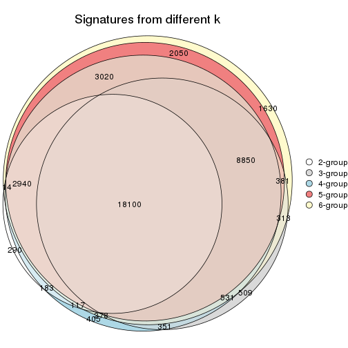

`get_signature()` returns a data frame invisibly. TO get the list of signatures, the function
call should be assigned to a variable explicitly. In following code, if `plot` argument is set
to `FALSE`, no heatmap is plotted while only the differential analysis is performed.

```r
# code only for demonstration
tb = get_signature(res, k = ..., plot = FALSE)
```

An example of the output of `tb` is:

```
#>   which_row         fdr    mean_1    mean_2 scaled_mean_1 scaled_mean_2 km
#> 1        38 0.042760348  8.373488  9.131774    -0.5533452     0.5164555  1
#> 2        40 0.018707592  7.106213  8.469186    -0.6173731     0.5762149  1
#> 3        55 0.019134737 10.221463 11.207825    -0.6159697     0.5749050  1
#> 4        59 0.006059896  5.921854  7.869574    -0.6899429     0.6439467  1
#> 5        60 0.018055526  8.928898 10.211722    -0.6204761     0.5791110  1
#> 6        98 0.009384629 15.714769 14.887706     0.6635654    -0.6193277  2
...
```

The columns in `tb` are:

1. `which_row`: row indices corresponding to the input matrix.
2. `fdr`: FDR for the differential test. 
3. `mean_x`: The mean value in group x.
4. `scaled_mean_x`: The mean value in group x after rows are scaled.
5. `km`: Row groups if k-means clustering is applied to rows.


UMAP plot which shows how samples are separated.


<script>
$( function() {
	$( '#tabs-SD-skmeans-dimension-reduction' ).tabs();
} );
</script>
<div id='tabs-SD-skmeans-dimension-reduction'>
<ul>
<li><a href='#tab-SD-skmeans-dimension-reduction-1'>k = 2</a></li>
<li><a href='#tab-SD-skmeans-dimension-reduction-2'>k = 3</a></li>
<li><a href='#tab-SD-skmeans-dimension-reduction-3'>k = 4</a></li>
<li><a href='#tab-SD-skmeans-dimension-reduction-4'>k = 5</a></li>
<li><a href='#tab-SD-skmeans-dimension-reduction-5'>k = 6</a></li>
</ul>
<div id='tab-SD-skmeans-dimension-reduction-1'>
<pre><code class="r">dimension_reduction(res, k = 2, method = &quot;UMAP&quot;)
</code></pre>

<p></p>

</div>
<div id='tab-SD-skmeans-dimension-reduction-2'>
<pre><code class="r">dimension_reduction(res, k = 3, method = &quot;UMAP&quot;)
</code></pre>

<p></p>

</div>
<div id='tab-SD-skmeans-dimension-reduction-3'>
<pre><code class="r">dimension_reduction(res, k = 4, method = &quot;UMAP&quot;)
</code></pre>

<p></p>

</div>
<div id='tab-SD-skmeans-dimension-reduction-4'>
<pre><code class="r">dimension_reduction(res, k = 5, method = &quot;UMAP&quot;)
</code></pre>

<p></p>

</div>
<div id='tab-SD-skmeans-dimension-reduction-5'>
<pre><code class="r">dimension_reduction(res, k = 6, method = &quot;UMAP&quot;)
</code></pre>

<p></p>

</div>
</div>


Following heatmap shows how subgroups are split when increasing `k`:

```r
collect_classes(res)
```


Test correlation between subgroups and known annotations. If the known
annotation is numeric, one-way ANOVA test is applied, and if the known
annotation is discrete, chi-squared contingency table test is applied.

```r
test_to_known_factors(res)
```

```
#>              n cell.line(p) tissue(p) disease.state(p) k
#> SD:skmeans 174     3.98e-13  1.11e-21         5.51e-13 2
#> SD:skmeans 171     1.84e-23  2.11e-43         4.79e-30 3
#> SD:skmeans 168     7.91e-34  8.10e-68         7.93e-44 4
#> SD:skmeans 137     7.62e-38  3.27e-77         3.67e-50 5
#> SD:skmeans 150     2.07e-51  1.09e-87         7.29e-56 6
```


If matrix rows can be associated to genes, consider to use `GO_Enrichment(res,
...)` to perform function enrichment for the signature genes.


 

---------------------------------------------------


### SD:pam**


The object with results only for a single top-value method and a single partition method 
can be extracted as:

```r
res = res_list["SD", "pam"]
# you can also extract it by
# res = res_list["SD:pam"]
```

A summary of `res` and all the functions that can be applied to it:

```r
res
```

```
#> A 'ConsensusPartition' object with k = 2, 3, 4, 5, 6.
#>   On a matrix with 51941 rows and 174 columns.
#>   Top rows (1000, 2000, 3000, 4000, 5000) are extracted by 'SD' method.
#>   Subgroups are detected by 'pam' method.
#>   Performed in total 1250 partitions by row resampling.
#>   Best k for subgroups seems to be 4.
#> 
#> Following methods can be applied to this 'ConsensusPartition' object:
#>  [1] "cola_report"             "collect_classes"         "collect_plots"          
#>  [4] "collect_stats"           "colnames"                "compare_signatures"     
#>  [7] "consensus_heatmap"       "dimension_reduction"     "functional_enrichment"  
#> [10] "get_anno_col"            "get_anno"                "get_classes"            
#> [13] "get_consensus"           "get_matrix"              "get_membership"         
#> [16] "get_param"               "get_signatures"          "get_stats"              
#> [19] "is_best_k"               "is_stable_k"             "membership_heatmap"     
#> [22] "ncol"                    "nrow"                    "plot_ecdf"              
#> [25] "rownames"                "select_partition_number" "show"                   
#> [28] "suggest_best_k"          "test_to_known_factors"
```

`collect_plots()` function collects all the plots made from `res` for all `k` (number of partitions)
into one single page to provide an easy and fast comparison between different `k`.

```r
collect_plots(res)
```


The plots are:

- The first row: a plot of the ECDF (Empirical cumulative distribution
  function) curves of the consensus matrix for each `k` and the heatmap of
  predicted classes for each `k`.
- The second row: heatmaps of the consensus matrix for each `k`.
- The third row: heatmaps of the membership matrix for each `k`.
- The fouth row: heatmaps of the signatures for each `k`.

All the plots in panels can be made by individual functions and they are
plotted later in this section.

`select_partition_number()` produces several plots showing different
statistics for choosing "optimized" `k`. There are following statistics:

- ECDF curves of the consensus matrix for each `k`;
- 1-PAC. [The PAC
  score](https://en.wikipedia.org/wiki/Consensus_clustering#Over-interpretation_potential_of_consensus_clustering)
  measures the proportion of the ambiguous subgrouping.
- Mean silhouette score.
- Concordance. The mean probability of fiting the consensus class ids in all
  partitions.
- Area increased. Denote $A_k$ as the area under the ECDF curve for current
  `k`, the area increased is defined as $A_k - A_{k-1}$.
- Rand index. The percent of pairs of samples that are both in a same cluster
  or both are not in a same cluster in the partition of k and k-1.
- Jaccard index. The ratio of pairs of samples are both in a same cluster in
  the partition of k and k-1 and the pairs of samples are both in a same
  cluster in the partition k or k-1.

The detailed explanations of these statistics can be found in [the cola
vignette](http://bioconductor.org/packages/devel/bioc/vignettes/cola/inst/doc/cola.html#toc_13).

Generally speaking, lower PAC score, higher mean silhouette score or higher
concordance corresponds to better partition. Rand index and Jaccard index
measure how similar the current partition is compared to partition with `k-1`.
If they are too similar, we won't accept `k` is better than `k-1`.

```r
select_partition_number(res)
```


The numeric values for all these statistics can be obtained by `get_stats()`.

```r
get_stats(res)
```

```
#>   k 1-PAC mean_silhouette concordance area_increased  Rand Jaccard
#> 2 2 0.952           0.945       0.961         0.4474 0.546   0.546
#> 3 3 0.969           0.950       0.981         0.3297 0.861   0.745
#> 4 4 1.000           0.968       0.988         0.0951 0.935   0.840
#> 5 5 0.768           0.806       0.888         0.1295 0.892   0.698
#> 6 6 0.836           0.824       0.894         0.0631 0.949   0.805
```

`suggest_best_k()` suggests the best $k$ based on these statistics. The rules are as follows:

- All $k$ with Jaccard index larger than 0.95 are removed because the increase of
  the partition number does not provides enough extra information. If all $k$ are removed,
  the best $k$ is assigned by `NA`.
- For $k$ with 1-PAC larger than 0.9, the maximal $k$ is taken as the "best k". Other $k$ is called "optional k".
- If it does not fit the second rule. The $k$ with the highest vote of highest
  1-PAC, mean silhouette and concordance is taken as the "best k".

```r
suggest_best_k(res)
```

```
#> [1] 4
#> attr(,"optional")
#> [1] 2 3
```

There is also optional best $k$ = 2 3 that is worth to check.

Following shows the table of the partitions (You need to click the **show/hide
code output** link to see it). The membership matrix (columns with name `p*`)
is inferred by
[`clue::cl_consensus()`](https://www.rdocumentation.org/link/cl_consensus?package=clue)
function with the `SE` method. Basically the value in the membership matrix
represents the probability to belong to a certain group. The finall class
label for an item is determined with the group with highest probability it
belongs to.

In `get_classes()` function, the entropy is calculated from the membership
matrix and the silhouette score is calculated from the consensus matrix.


<script>
$( function() {
	$( '#tabs-SD-pam-get-classes' ).tabs();
} );
</script>
<div id='tabs-SD-pam-get-classes'>
<ul>
<li><a href='#tab-SD-pam-get-classes-1'>k = 2</a></li>
<li><a href='#tab-SD-pam-get-classes-2'>k = 3</a></li>
<li><a href='#tab-SD-pam-get-classes-3'>k = 4</a></li>
<li><a href='#tab-SD-pam-get-classes-4'>k = 5</a></li>
<li><a href='#tab-SD-pam-get-classes-5'>k = 6</a></li>
</ul>

<div id='tab-SD-pam-get-classes-1'>
<p><a id='tab-SD-pam-get-classes-1-a' style='color:#0366d6' href='#'>show/hide code output</a></p>
<pre><code class="r">cbind(get_classes(res, k = 2), get_membership(res, k = 2))
</code></pre>

<pre><code>#&gt;           class entropy silhouette    p1    p2
#&gt; GSM803615     2  0.0000      0.976 0.000 1.000
#&gt; GSM803674     2  0.0000      0.976 0.000 1.000
#&gt; GSM803733     2  0.0000      0.976 0.000 1.000
#&gt; GSM803616     2  0.0000      0.976 0.000 1.000
#&gt; GSM803675     2  0.0000      0.976 0.000 1.000
#&gt; GSM803734     2  0.0000      0.976 0.000 1.000
#&gt; GSM803617     2  0.0000      0.976 0.000 1.000
#&gt; GSM803676     2  0.0000      0.976 0.000 1.000
#&gt; GSM803735     2  0.0000      0.976 0.000 1.000
#&gt; GSM803618     2  0.0000      0.976 0.000 1.000
#&gt; GSM803677     2  0.0000      0.976 0.000 1.000
#&gt; GSM803736     2  0.0000      0.976 0.000 1.000
#&gt; GSM803619     1  0.9896      0.287 0.560 0.440
#&gt; GSM803678     1  0.9775      0.370 0.588 0.412
#&gt; GSM803737     1  0.9000      0.600 0.684 0.316
#&gt; GSM803620     2  0.0000      0.976 0.000 1.000
#&gt; GSM803679     2  0.0000      0.976 0.000 1.000
#&gt; GSM803738     2  0.0000      0.976 0.000 1.000
#&gt; GSM803621     1  0.2603      0.972 0.956 0.044
#&gt; GSM803680     1  0.2603      0.972 0.956 0.044
#&gt; GSM803739     1  0.2603      0.972 0.956 0.044
#&gt; GSM803622     1  0.2603      0.972 0.956 0.044
#&gt; GSM803681     1  0.2603      0.972 0.956 0.044
#&gt; GSM803740     1  0.2603      0.972 0.956 0.044
#&gt; GSM803623     2  0.0000      0.976 0.000 1.000
#&gt; GSM803682     2  0.0000      0.976 0.000 1.000
#&gt; GSM803741     2  0.0000      0.976 0.000 1.000
#&gt; GSM803624     1  0.2603      0.972 0.956 0.044
#&gt; GSM803683     1  0.2603      0.972 0.956 0.044
#&gt; GSM803742     1  0.2603      0.972 0.956 0.044
#&gt; GSM803625     1  0.2603      0.972 0.956 0.044
#&gt; GSM803684     1  0.2603      0.972 0.956 0.044
#&gt; GSM803743     1  0.2603      0.972 0.956 0.044
#&gt; GSM803626     1  0.0938      0.945 0.988 0.012
#&gt; GSM803685     1  0.0000      0.948 1.000 0.000
#&gt; GSM803744     1  0.1184      0.943 0.984 0.016
#&gt; GSM803627     1  0.2603      0.972 0.956 0.044
#&gt; GSM803686     1  0.2603      0.972 0.956 0.044
#&gt; GSM803745     1  0.2603      0.972 0.956 0.044
#&gt; GSM803628     1  0.2423      0.971 0.960 0.040
#&gt; GSM803687     1  0.2423      0.971 0.960 0.040
#&gt; GSM803746     1  0.2423      0.971 0.960 0.040
#&gt; GSM803629     1  0.2423      0.971 0.960 0.040
#&gt; GSM803688     1  0.2423      0.971 0.960 0.040
#&gt; GSM803747     1  0.2423      0.971 0.960 0.040
#&gt; GSM803630     1  0.2423      0.971 0.960 0.040
#&gt; GSM803689     1  0.2423      0.971 0.960 0.040
#&gt; GSM803748     1  0.2423      0.971 0.960 0.040
#&gt; GSM803631     1  0.2423      0.971 0.960 0.040
#&gt; GSM803690     1  0.2423      0.971 0.960 0.040
#&gt; GSM803749     1  0.2423      0.971 0.960 0.040
#&gt; GSM803632     1  0.2423      0.971 0.960 0.040
#&gt; GSM803691     1  0.2423      0.971 0.960 0.040
#&gt; GSM803750     1  0.2423      0.971 0.960 0.040
#&gt; GSM803633     2  0.0000      0.976 0.000 1.000
#&gt; GSM803692     2  0.0000      0.976 0.000 1.000
#&gt; GSM803751     2  0.0000      0.976 0.000 1.000
#&gt; GSM803634     2  0.0000      0.976 0.000 1.000
#&gt; GSM803693     2  0.0000      0.976 0.000 1.000
#&gt; GSM803752     2  0.0000      0.976 0.000 1.000
#&gt; GSM803635     2  0.0000      0.976 0.000 1.000
#&gt; GSM803694     2  0.0000      0.976 0.000 1.000
#&gt; GSM803753     2  0.0000      0.976 0.000 1.000
#&gt; GSM803636     2  0.0000      0.976 0.000 1.000
#&gt; GSM803695     2  0.0000      0.976 0.000 1.000
#&gt; GSM803754     2  0.0000      0.976 0.000 1.000
#&gt; GSM803637     2  0.0000      0.976 0.000 1.000
#&gt; GSM803696     2  0.0000      0.976 0.000 1.000
#&gt; GSM803755     2  0.0000      0.976 0.000 1.000
#&gt; GSM803638     2  0.0000      0.976 0.000 1.000
#&gt; GSM803697     2  0.0000      0.976 0.000 1.000
#&gt; GSM803756     2  0.0000      0.976 0.000 1.000
#&gt; GSM803639     2  0.0000      0.976 0.000 1.000
#&gt; GSM803698     2  0.0000      0.976 0.000 1.000
#&gt; GSM803757     2  0.0000      0.976 0.000 1.000
#&gt; GSM803640     1  0.2603      0.972 0.956 0.044
#&gt; GSM803699     1  0.2603      0.972 0.956 0.044
#&gt; GSM803758     1  0.2603      0.972 0.956 0.044
#&gt; GSM803641     1  0.2603      0.972 0.956 0.044
#&gt; GSM803700     1  0.2603      0.972 0.956 0.044
#&gt; GSM803759     1  0.2603      0.972 0.956 0.044
#&gt; GSM803642     1  0.2603      0.972 0.956 0.044
#&gt; GSM803701     1  0.2603      0.972 0.956 0.044
#&gt; GSM803760     1  0.2603      0.972 0.956 0.044
#&gt; GSM803643     1  0.2603      0.972 0.956 0.044
#&gt; GSM803702     1  0.2603      0.972 0.956 0.044
#&gt; GSM803644     1  0.2603      0.972 0.956 0.044
#&gt; GSM803703     1  0.2603      0.972 0.956 0.044
#&gt; GSM803761     1  0.2603      0.972 0.956 0.044
#&gt; GSM803645     1  0.2603      0.972 0.956 0.044
#&gt; GSM803704     1  0.2603      0.972 0.956 0.044
#&gt; GSM803762     1  0.2603      0.972 0.956 0.044
#&gt; GSM803646     1  0.2603      0.972 0.956 0.044
#&gt; GSM803705     1  0.2603      0.972 0.956 0.044
#&gt; GSM803763     1  0.2603      0.972 0.956 0.044
#&gt; GSM803647     1  0.2603      0.972 0.956 0.044
#&gt; GSM803706     1  0.2603      0.972 0.956 0.044
#&gt; GSM803764     1  0.2603      0.972 0.956 0.044
#&gt; GSM803648     1  0.2603      0.972 0.956 0.044
#&gt; GSM803707     1  0.2603      0.972 0.956 0.044
#&gt; GSM803765     1  0.2603      0.972 0.956 0.044
#&gt; GSM803649     1  0.2603      0.972 0.956 0.044
#&gt; GSM803708     1  0.2603      0.972 0.956 0.044
#&gt; GSM803766     1  0.2603      0.972 0.956 0.044
#&gt; GSM803650     1  0.2603      0.972 0.956 0.044
#&gt; GSM803709     1  0.2603      0.972 0.956 0.044
#&gt; GSM803767     1  0.2603      0.972 0.956 0.044
#&gt; GSM803651     1  0.2603      0.972 0.956 0.044
#&gt; GSM803710     1  0.2603      0.972 0.956 0.044
#&gt; GSM803768     1  0.2603      0.972 0.956 0.044
#&gt; GSM803652     1  0.2603      0.972 0.956 0.044
#&gt; GSM803711     1  0.2603      0.972 0.956 0.044
#&gt; GSM803653     1  0.6343      0.854 0.840 0.160
#&gt; GSM803712     1  0.5294      0.901 0.880 0.120
#&gt; GSM803769     1  0.3114      0.964 0.944 0.056
#&gt; GSM803654     2  0.0000      0.976 0.000 1.000
#&gt; GSM803713     2  0.0000      0.976 0.000 1.000
#&gt; GSM803770     2  0.0000      0.976 0.000 1.000
#&gt; GSM803655     1  0.2603      0.972 0.956 0.044
#&gt; GSM803714     1  0.2603      0.972 0.956 0.044
#&gt; GSM803771     1  0.2603      0.972 0.956 0.044
#&gt; GSM803656     2  0.5519      0.839 0.128 0.872
#&gt; GSM803715     2  0.3431      0.914 0.064 0.936
#&gt; GSM803772     2  0.8081      0.653 0.248 0.752
#&gt; GSM803657     2  0.0000      0.976 0.000 1.000
#&gt; GSM803716     2  0.0000      0.976 0.000 1.000
#&gt; GSM803773     2  0.0000      0.976 0.000 1.000
#&gt; GSM803658     2  0.0376      0.973 0.004 0.996
#&gt; GSM803717     2  0.0376      0.973 0.004 0.996
#&gt; GSM803774     2  0.0376      0.973 0.004 0.996
#&gt; GSM803659     2  0.0000      0.976 0.000 1.000
#&gt; GSM803718     2  0.0000      0.976 0.000 1.000
#&gt; GSM803775     2  0.0000      0.976 0.000 1.000
#&gt; GSM803660     1  0.2603      0.972 0.956 0.044
#&gt; GSM803719     1  0.2603      0.972 0.956 0.044
#&gt; GSM803776     1  0.2603      0.972 0.956 0.044
#&gt; GSM803661     1  0.2603      0.972 0.956 0.044
#&gt; GSM803720     1  0.2603      0.972 0.956 0.044
#&gt; GSM803777     1  0.2603      0.972 0.956 0.044
#&gt; GSM803662     1  0.7815      0.751 0.768 0.232
#&gt; GSM803732     1  0.2603      0.972 0.956 0.044
#&gt; GSM803778     1  0.2603      0.972 0.956 0.044
#&gt; GSM803663     2  0.9323      0.437 0.348 0.652
#&gt; GSM803721     2  0.6148      0.806 0.152 0.848
#&gt; GSM803779     2  0.9427      0.403 0.360 0.640
#&gt; GSM803664     1  0.7219      0.800 0.800 0.200
#&gt; GSM803722     1  0.7745      0.759 0.772 0.228
#&gt; GSM803780     1  0.4161      0.939 0.916 0.084
#&gt; GSM803665     1  0.2423      0.971 0.960 0.040
#&gt; GSM803723     1  0.2423      0.971 0.960 0.040
#&gt; GSM803781     1  0.2423      0.971 0.960 0.040
#&gt; GSM803666     1  0.0000      0.948 1.000 0.000
#&gt; GSM803724     1  0.0000      0.948 1.000 0.000
#&gt; GSM803782     1  0.0000      0.948 1.000 0.000
#&gt; GSM803667     1  0.0000      0.948 1.000 0.000
#&gt; GSM803725     1  0.0000      0.948 1.000 0.000
#&gt; GSM803783     1  0.0000      0.948 1.000 0.000
#&gt; GSM803668     1  0.0000      0.948 1.000 0.000
#&gt; GSM803726     1  0.0000      0.948 1.000 0.000
#&gt; GSM803784     1  0.0000      0.948 1.000 0.000
#&gt; GSM803669     1  0.0000      0.948 1.000 0.000
#&gt; GSM803727     1  0.0000      0.948 1.000 0.000
#&gt; GSM803670     1  0.0000      0.948 1.000 0.000
#&gt; GSM803728     1  0.0000      0.948 1.000 0.000
#&gt; GSM803785     1  0.0000      0.948 1.000 0.000
#&gt; GSM803671     1  0.0000      0.948 1.000 0.000
#&gt; GSM803729     1  0.0000      0.948 1.000 0.000
#&gt; GSM803786     1  0.0000      0.948 1.000 0.000
#&gt; GSM803672     1  0.0000      0.948 1.000 0.000
#&gt; GSM803730     1  0.0000      0.948 1.000 0.000
#&gt; GSM803787     1  0.0000      0.948 1.000 0.000
#&gt; GSM803673     2  0.0000      0.976 0.000 1.000
#&gt; GSM803731     2  0.0000      0.976 0.000 1.000
#&gt; GSM803788     2  0.0000      0.976 0.000 1.000
</code></pre>

<script>
$('#tab-SD-pam-get-classes-1-a').parent().next().next().hide();
$('#tab-SD-pam-get-classes-1-a').click(function(){
  $('#tab-SD-pam-get-classes-1-a').parent().next().next().toggle();
  return(false);
});
</script>
</div>

<div id='tab-SD-pam-get-classes-2'>
<p><a id='tab-SD-pam-get-classes-2-a' style='color:#0366d6' href='#'>show/hide code output</a></p>
<pre><code class="r">cbind(get_classes(res, k = 3), get_membership(res, k = 3))
</code></pre>

<pre><code>#&gt;           class entropy silhouette    p1    p2 p3
#&gt; GSM803615     2  0.0000      0.970 0.000 1.000  0
#&gt; GSM803674     2  0.0000      0.970 0.000 1.000  0
#&gt; GSM803733     2  0.0000      0.970 0.000 1.000  0
#&gt; GSM803616     2  0.0000      0.970 0.000 1.000  0
#&gt; GSM803675     2  0.0000      0.970 0.000 1.000  0
#&gt; GSM803734     2  0.0000      0.970 0.000 1.000  0
#&gt; GSM803617     2  0.0000      0.970 0.000 1.000  0
#&gt; GSM803676     2  0.0000      0.970 0.000 1.000  0
#&gt; GSM803735     2  0.0000      0.970 0.000 1.000  0
#&gt; GSM803618     2  0.0000      0.970 0.000 1.000  0
#&gt; GSM803677     2  0.0000      0.970 0.000 1.000  0
#&gt; GSM803736     2  0.0000      0.970 0.000 1.000  0
#&gt; GSM803619     1  0.6235      0.225 0.564 0.436  0
#&gt; GSM803678     1  0.6154      0.310 0.592 0.408  0
#&gt; GSM803737     1  0.5650      0.547 0.688 0.312  0
#&gt; GSM803620     2  0.0000      0.970 0.000 1.000  0
#&gt; GSM803679     2  0.0000      0.970 0.000 1.000  0
#&gt; GSM803738     2  0.0000      0.970 0.000 1.000  0
#&gt; GSM803621     1  0.0000      0.975 1.000 0.000  0
#&gt; GSM803680     1  0.0000      0.975 1.000 0.000  0
#&gt; GSM803739     1  0.0000      0.975 1.000 0.000  0
#&gt; GSM803622     1  0.0000      0.975 1.000 0.000  0
#&gt; GSM803681     1  0.0000      0.975 1.000 0.000  0
#&gt; GSM803740     1  0.0000      0.975 1.000 0.000  0
#&gt; GSM803623     2  0.0000      0.970 0.000 1.000  0
#&gt; GSM803682     2  0.0000      0.970 0.000 1.000  0
#&gt; GSM803741     2  0.0000      0.970 0.000 1.000  0
#&gt; GSM803624     1  0.0000      0.975 1.000 0.000  0
#&gt; GSM803683     1  0.0000      0.975 1.000 0.000  0
#&gt; GSM803742     1  0.0000      0.975 1.000 0.000  0
#&gt; GSM803625     1  0.0000      0.975 1.000 0.000  0
#&gt; GSM803684     1  0.0000      0.975 1.000 0.000  0
#&gt; GSM803743     1  0.0000      0.975 1.000 0.000  0
#&gt; GSM803626     3  0.0000      1.000 0.000 0.000  1
#&gt; GSM803685     3  0.0000      1.000 0.000 0.000  1
#&gt; GSM803744     3  0.0000      1.000 0.000 0.000  1
#&gt; GSM803627     1  0.0000      0.975 1.000 0.000  0
#&gt; GSM803686     1  0.0000      0.975 1.000 0.000  0
#&gt; GSM803745     1  0.0000      0.975 1.000 0.000  0
#&gt; GSM803628     1  0.0000      0.975 1.000 0.000  0
#&gt; GSM803687     1  0.0000      0.975 1.000 0.000  0
#&gt; GSM803746     1  0.0000      0.975 1.000 0.000  0
#&gt; GSM803629     1  0.0000      0.975 1.000 0.000  0
#&gt; GSM803688     1  0.0000      0.975 1.000 0.000  0
#&gt; GSM803747     1  0.0000      0.975 1.000 0.000  0
#&gt; GSM803630     1  0.0000      0.975 1.000 0.000  0
#&gt; GSM803689     1  0.0000      0.975 1.000 0.000  0
#&gt; GSM803748     1  0.0000      0.975 1.000 0.000  0
#&gt; GSM803631     1  0.0000      0.975 1.000 0.000  0
#&gt; GSM803690     1  0.0000      0.975 1.000 0.000  0
#&gt; GSM803749     1  0.0000      0.975 1.000 0.000  0
#&gt; GSM803632     1  0.0000      0.975 1.000 0.000  0
#&gt; GSM803691     1  0.0000      0.975 1.000 0.000  0
#&gt; GSM803750     1  0.0000      0.975 1.000 0.000  0
#&gt; GSM803633     2  0.0000      0.970 0.000 1.000  0
#&gt; GSM803692     2  0.0000      0.970 0.000 1.000  0
#&gt; GSM803751     2  0.0000      0.970 0.000 1.000  0
#&gt; GSM803634     2  0.0000      0.970 0.000 1.000  0
#&gt; GSM803693     2  0.0000      0.970 0.000 1.000  0
#&gt; GSM803752     2  0.0000      0.970 0.000 1.000  0
#&gt; GSM803635     2  0.0000      0.970 0.000 1.000  0
#&gt; GSM803694     2  0.0000      0.970 0.000 1.000  0
#&gt; GSM803753     2  0.0000      0.970 0.000 1.000  0
#&gt; GSM803636     2  0.0000      0.970 0.000 1.000  0
#&gt; GSM803695     2  0.0000      0.970 0.000 1.000  0
#&gt; GSM803754     2  0.0000      0.970 0.000 1.000  0
#&gt; GSM803637     2  0.0000      0.970 0.000 1.000  0
#&gt; GSM803696     2  0.0000      0.970 0.000 1.000  0
#&gt; GSM803755     2  0.0000      0.970 0.000 1.000  0
#&gt; GSM803638     2  0.0000      0.970 0.000 1.000  0
#&gt; GSM803697     2  0.0000      0.970 0.000 1.000  0
#&gt; GSM803756     2  0.0000      0.970 0.000 1.000  0
#&gt; GSM803639     2  0.0000      0.970 0.000 1.000  0
#&gt; GSM803698     2  0.0000      0.970 0.000 1.000  0
#&gt; GSM803757     2  0.0000      0.970 0.000 1.000  0
#&gt; GSM803640     1  0.0000      0.975 1.000 0.000  0
#&gt; GSM803699     1  0.0000      0.975 1.000 0.000  0
#&gt; GSM803758     1  0.0000      0.975 1.000 0.000  0
#&gt; GSM803641     1  0.0000      0.975 1.000 0.000  0
#&gt; GSM803700     1  0.0000      0.975 1.000 0.000  0
#&gt; GSM803759     1  0.0000      0.975 1.000 0.000  0
#&gt; GSM803642     1  0.0000      0.975 1.000 0.000  0
#&gt; GSM803701     1  0.0000      0.975 1.000 0.000  0
#&gt; GSM803760     1  0.0000      0.975 1.000 0.000  0
#&gt; GSM803643     1  0.0000      0.975 1.000 0.000  0
#&gt; GSM803702     1  0.0000      0.975 1.000 0.000  0
#&gt; GSM803644     1  0.0000      0.975 1.000 0.000  0
#&gt; GSM803703     1  0.0000      0.975 1.000 0.000  0
#&gt; GSM803761     1  0.0000      0.975 1.000 0.000  0
#&gt; GSM803645     1  0.0000      0.975 1.000 0.000  0
#&gt; GSM803704     1  0.0000      0.975 1.000 0.000  0
#&gt; GSM803762     1  0.0000      0.975 1.000 0.000  0
#&gt; GSM803646     1  0.0000      0.975 1.000 0.000  0
#&gt; GSM803705     1  0.0000      0.975 1.000 0.000  0
#&gt; GSM803763     1  0.0000      0.975 1.000 0.000  0
#&gt; GSM803647     1  0.0000      0.975 1.000 0.000  0
#&gt; GSM803706     1  0.0000      0.975 1.000 0.000  0
#&gt; GSM803764     1  0.0000      0.975 1.000 0.000  0
#&gt; GSM803648     1  0.0000      0.975 1.000 0.000  0
#&gt; GSM803707     1  0.0000      0.975 1.000 0.000  0
#&gt; GSM803765     1  0.0000      0.975 1.000 0.000  0
#&gt; GSM803649     1  0.0000      0.975 1.000 0.000  0
#&gt; GSM803708     1  0.0000      0.975 1.000 0.000  0
#&gt; GSM803766     1  0.0000      0.975 1.000 0.000  0
#&gt; GSM803650     1  0.0000      0.975 1.000 0.000  0
#&gt; GSM803709     1  0.0000      0.975 1.000 0.000  0
#&gt; GSM803767     1  0.0000      0.975 1.000 0.000  0
#&gt; GSM803651     1  0.0000      0.975 1.000 0.000  0
#&gt; GSM803710     1  0.0000      0.975 1.000 0.000  0
#&gt; GSM803768     1  0.0000      0.975 1.000 0.000  0
#&gt; GSM803652     1  0.0000      0.975 1.000 0.000  0
#&gt; GSM803711     1  0.0000      0.975 1.000 0.000  0
#&gt; GSM803653     1  0.3340      0.847 0.880 0.120  0
#&gt; GSM803712     1  0.2537      0.893 0.920 0.080  0
#&gt; GSM803769     1  0.0592      0.964 0.988 0.012  0
#&gt; GSM803654     2  0.0000      0.970 0.000 1.000  0
#&gt; GSM803713     2  0.0000      0.970 0.000 1.000  0
#&gt; GSM803770     2  0.0000      0.970 0.000 1.000  0
#&gt; GSM803655     1  0.0000      0.975 1.000 0.000  0
#&gt; GSM803714     1  0.0000      0.975 1.000 0.000  0
#&gt; GSM803771     1  0.0000      0.975 1.000 0.000  0
#&gt; GSM803656     2  0.3482      0.812 0.128 0.872  0
#&gt; GSM803715     2  0.2165      0.895 0.064 0.936  0
#&gt; GSM803772     2  0.5098      0.636 0.248 0.752  0
#&gt; GSM803657     2  0.0000      0.970 0.000 1.000  0
#&gt; GSM803716     2  0.0000      0.970 0.000 1.000  0
#&gt; GSM803773     2  0.0000      0.970 0.000 1.000  0
#&gt; GSM803658     2  0.0237      0.966 0.004 0.996  0
#&gt; GSM803717     2  0.0237      0.966 0.004 0.996  0
#&gt; GSM803774     2  0.0237      0.966 0.004 0.996  0
#&gt; GSM803659     2  0.0000      0.970 0.000 1.000  0
#&gt; GSM803718     2  0.0000      0.970 0.000 1.000  0
#&gt; GSM803775     2  0.0000      0.970 0.000 1.000  0
#&gt; GSM803660     1  0.0000      0.975 1.000 0.000  0
#&gt; GSM803719     1  0.0000      0.975 1.000 0.000  0
#&gt; GSM803776     1  0.0000      0.975 1.000 0.000  0
#&gt; GSM803661     1  0.0000      0.975 1.000 0.000  0
#&gt; GSM803720     1  0.0000      0.975 1.000 0.000  0
#&gt; GSM803777     1  0.0000      0.975 1.000 0.000  0
#&gt; GSM803662     1  0.4399      0.759 0.812 0.188  0
#&gt; GSM803732     1  0.0000      0.975 1.000 0.000  0
#&gt; GSM803778     1  0.0000      0.975 1.000 0.000  0
#&gt; GSM803663     2  0.5988      0.421 0.368 0.632  0
#&gt; GSM803721     2  0.3941      0.771 0.156 0.844  0
#&gt; GSM803779     2  0.5968      0.429 0.364 0.636  0
#&gt; GSM803664     1  0.3941      0.802 0.844 0.156  0
#&gt; GSM803722     1  0.4346      0.766 0.816 0.184  0
#&gt; GSM803780     1  0.1529      0.936 0.960 0.040  0
#&gt; GSM803665     1  0.0000      0.975 1.000 0.000  0
#&gt; GSM803723     1  0.0000      0.975 1.000 0.000  0
#&gt; GSM803781     1  0.0000      0.975 1.000 0.000  0
#&gt; GSM803666     3  0.0000      1.000 0.000 0.000  1
#&gt; GSM803724     3  0.0000      1.000 0.000 0.000  1
#&gt; GSM803782     3  0.0000      1.000 0.000 0.000  1
#&gt; GSM803667     3  0.0000      1.000 0.000 0.000  1
#&gt; GSM803725     3  0.0000      1.000 0.000 0.000  1
#&gt; GSM803783     3  0.0000      1.000 0.000 0.000  1
#&gt; GSM803668     3  0.0000      1.000 0.000 0.000  1
#&gt; GSM803726     3  0.0000      1.000 0.000 0.000  1
#&gt; GSM803784     3  0.0000      1.000 0.000 0.000  1
#&gt; GSM803669     3  0.0000      1.000 0.000 0.000  1
#&gt; GSM803727     3  0.0000      1.000 0.000 0.000  1
#&gt; GSM803670     3  0.0000      1.000 0.000 0.000  1
#&gt; GSM803728     3  0.0000      1.000 0.000 0.000  1
#&gt; GSM803785     3  0.0000      1.000 0.000 0.000  1
#&gt; GSM803671     3  0.0000      1.000 0.000 0.000  1
#&gt; GSM803729     3  0.0000      1.000 0.000 0.000  1
#&gt; GSM803786     3  0.0000      1.000 0.000 0.000  1
#&gt; GSM803672     3  0.0000      1.000 0.000 0.000  1
#&gt; GSM803730     3  0.0000      1.000 0.000 0.000  1
#&gt; GSM803787     3  0.0000      1.000 0.000 0.000  1
#&gt; GSM803673     2  0.0000      0.970 0.000 1.000  0
#&gt; GSM803731     2  0.0000      0.970 0.000 1.000  0
#&gt; GSM803788     2  0.0000      0.970 0.000 1.000  0
</code></pre>

<script>
$('#tab-SD-pam-get-classes-2-a').parent().next().next().hide();
$('#tab-SD-pam-get-classes-2-a').click(function(){
  $('#tab-SD-pam-get-classes-2-a').parent().next().next().toggle();
  return(false);
});
</script>
</div>

<div id='tab-SD-pam-get-classes-3'>
<p><a id='tab-SD-pam-get-classes-3-a' style='color:#0366d6' href='#'>show/hide code output</a></p>
<pre><code class="r">cbind(get_classes(res, k = 4), get_membership(res, k = 4))
</code></pre>

<pre><code>#&gt;           class entropy silhouette    p1    p2 p3 p4
#&gt; GSM803615     4  0.0000      1.000 0.000 0.000  0  1
#&gt; GSM803674     4  0.0000      1.000 0.000 0.000  0  1
#&gt; GSM803733     4  0.0000      1.000 0.000 0.000  0  1
#&gt; GSM803616     4  0.0000      1.000 0.000 0.000  0  1
#&gt; GSM803675     4  0.0000      1.000 0.000 0.000  0  1
#&gt; GSM803734     4  0.0000      1.000 0.000 0.000  0  1
#&gt; GSM803617     4  0.0000      1.000 0.000 0.000  0  1
#&gt; GSM803676     4  0.0000      1.000 0.000 0.000  0  1
#&gt; GSM803735     4  0.0000      1.000 0.000 0.000  0  1
#&gt; GSM803618     4  0.0000      1.000 0.000 0.000  0  1
#&gt; GSM803677     4  0.0000      1.000 0.000 0.000  0  1
#&gt; GSM803736     4  0.0000      1.000 0.000 0.000  0  1
#&gt; GSM803619     4  0.0000      1.000 0.000 0.000  0  1
#&gt; GSM803678     4  0.0000      1.000 0.000 0.000  0  1
#&gt; GSM803737     4  0.0000      1.000 0.000 0.000  0  1
#&gt; GSM803620     4  0.0000      1.000 0.000 0.000  0  1
#&gt; GSM803679     4  0.0000      1.000 0.000 0.000  0  1
#&gt; GSM803738     4  0.0000      1.000 0.000 0.000  0  1
#&gt; GSM803621     1  0.0000      0.990 1.000 0.000  0  0
#&gt; GSM803680     1  0.0000      0.990 1.000 0.000  0  0
#&gt; GSM803739     1  0.0000      0.990 1.000 0.000  0  0
#&gt; GSM803622     1  0.0000      0.990 1.000 0.000  0  0
#&gt; GSM803681     1  0.0000      0.990 1.000 0.000  0  0
#&gt; GSM803740     1  0.0000      0.990 1.000 0.000  0  0
#&gt; GSM803623     2  0.0000      0.956 0.000 1.000  0  0
#&gt; GSM803682     2  0.0000      0.956 0.000 1.000  0  0
#&gt; GSM803741     2  0.0000      0.956 0.000 1.000  0  0
#&gt; GSM803624     1  0.0000      0.990 1.000 0.000  0  0
#&gt; GSM803683     1  0.0000      0.990 1.000 0.000  0  0
#&gt; GSM803742     1  0.0000      0.990 1.000 0.000  0  0
#&gt; GSM803625     1  0.0000      0.990 1.000 0.000  0  0
#&gt; GSM803684     1  0.0000      0.990 1.000 0.000  0  0
#&gt; GSM803743     1  0.0000      0.990 1.000 0.000  0  0
#&gt; GSM803626     3  0.0000      1.000 0.000 0.000  1  0
#&gt; GSM803685     3  0.0000      1.000 0.000 0.000  1  0
#&gt; GSM803744     3  0.0000      1.000 0.000 0.000  1  0
#&gt; GSM803627     1  0.0000      0.990 1.000 0.000  0  0
#&gt; GSM803686     1  0.0000      0.990 1.000 0.000  0  0
#&gt; GSM803745     1  0.0000      0.990 1.000 0.000  0  0
#&gt; GSM803628     1  0.0000      0.990 1.000 0.000  0  0
#&gt; GSM803687     1  0.0000      0.990 1.000 0.000  0  0
#&gt; GSM803746     1  0.0000      0.990 1.000 0.000  0  0
#&gt; GSM803629     1  0.0000      0.990 1.000 0.000  0  0
#&gt; GSM803688     1  0.0000      0.990 1.000 0.000  0  0
#&gt; GSM803747     1  0.0000      0.990 1.000 0.000  0  0
#&gt; GSM803630     1  0.0000      0.990 1.000 0.000  0  0
#&gt; GSM803689     1  0.0000      0.990 1.000 0.000  0  0
#&gt; GSM803748     1  0.0000      0.990 1.000 0.000  0  0
#&gt; GSM803631     1  0.0000      0.990 1.000 0.000  0  0
#&gt; GSM803690     1  0.0000      0.990 1.000 0.000  0  0
#&gt; GSM803749     1  0.0000      0.990 1.000 0.000  0  0
#&gt; GSM803632     1  0.0000      0.990 1.000 0.000  0  0
#&gt; GSM803691     1  0.0000      0.990 1.000 0.000  0  0
#&gt; GSM803750     1  0.0000      0.990 1.000 0.000  0  0
#&gt; GSM803633     2  0.0000      0.956 0.000 1.000  0  0
#&gt; GSM803692     2  0.0000      0.956 0.000 1.000  0  0
#&gt; GSM803751     2  0.0000      0.956 0.000 1.000  0  0
#&gt; GSM803634     2  0.0000      0.956 0.000 1.000  0  0
#&gt; GSM803693     2  0.0000      0.956 0.000 1.000  0  0
#&gt; GSM803752     2  0.0000      0.956 0.000 1.000  0  0
#&gt; GSM803635     2  0.0000      0.956 0.000 1.000  0  0
#&gt; GSM803694     2  0.0000      0.956 0.000 1.000  0  0
#&gt; GSM803753     2  0.0000      0.956 0.000 1.000  0  0
#&gt; GSM803636     2  0.0000      0.956 0.000 1.000  0  0
#&gt; GSM803695     2  0.0000      0.956 0.000 1.000  0  0
#&gt; GSM803754     2  0.0000      0.956 0.000 1.000  0  0
#&gt; GSM803637     2  0.0000      0.956 0.000 1.000  0  0
#&gt; GSM803696     2  0.0000      0.956 0.000 1.000  0  0
#&gt; GSM803755     2  0.0000      0.956 0.000 1.000  0  0
#&gt; GSM803638     2  0.0000      0.956 0.000 1.000  0  0
#&gt; GSM803697     2  0.0000      0.956 0.000 1.000  0  0
#&gt; GSM803756     2  0.0000      0.956 0.000 1.000  0  0
#&gt; GSM803639     2  0.0000      0.956 0.000 1.000  0  0
#&gt; GSM803698     2  0.0000      0.956 0.000 1.000  0  0
#&gt; GSM803757     2  0.0000      0.956 0.000 1.000  0  0
#&gt; GSM803640     1  0.0000      0.990 1.000 0.000  0  0
#&gt; GSM803699     1  0.0000      0.990 1.000 0.000  0  0
#&gt; GSM803758     1  0.0000      0.990 1.000 0.000  0  0
#&gt; GSM803641     1  0.0000      0.990 1.000 0.000  0  0
#&gt; GSM803700     1  0.0000      0.990 1.000 0.000  0  0
#&gt; GSM803759     1  0.0000      0.990 1.000 0.000  0  0
#&gt; GSM803642     1  0.0000      0.990 1.000 0.000  0  0
#&gt; GSM803701     1  0.0000      0.990 1.000 0.000  0  0
#&gt; GSM803760     1  0.0000      0.990 1.000 0.000  0  0
#&gt; GSM803643     1  0.0000      0.990 1.000 0.000  0  0
#&gt; GSM803702     1  0.0000      0.990 1.000 0.000  0  0
#&gt; GSM803644     1  0.0000      0.990 1.000 0.000  0  0
#&gt; GSM803703     1  0.0000      0.990 1.000 0.000  0  0
#&gt; GSM803761     1  0.0000      0.990 1.000 0.000  0  0
#&gt; GSM803645     1  0.0000      0.990 1.000 0.000  0  0
#&gt; GSM803704     1  0.0000      0.990 1.000 0.000  0  0
#&gt; GSM803762     1  0.0000      0.990 1.000 0.000  0  0
#&gt; GSM803646     1  0.0000      0.990 1.000 0.000  0  0
#&gt; GSM803705     1  0.0000      0.990 1.000 0.000  0  0
#&gt; GSM803763     1  0.0000      0.990 1.000 0.000  0  0
#&gt; GSM803647     1  0.0000      0.990 1.000 0.000  0  0
#&gt; GSM803706     1  0.0000      0.990 1.000 0.000  0  0
#&gt; GSM803764     1  0.0000      0.990 1.000 0.000  0  0
#&gt; GSM803648     1  0.0000      0.990 1.000 0.000  0  0
#&gt; GSM803707     1  0.0000      0.990 1.000 0.000  0  0
#&gt; GSM803765     1  0.0000      0.990 1.000 0.000  0  0
#&gt; GSM803649     1  0.0000      0.990 1.000 0.000  0  0
#&gt; GSM803708     1  0.0000      0.990 1.000 0.000  0  0
#&gt; GSM803766     1  0.0000      0.990 1.000 0.000  0  0
#&gt; GSM803650     1  0.0000      0.990 1.000 0.000  0  0
#&gt; GSM803709     1  0.0000      0.990 1.000 0.000  0  0
#&gt; GSM803767     1  0.0000      0.990 1.000 0.000  0  0
#&gt; GSM803651     1  0.0000      0.990 1.000 0.000  0  0
#&gt; GSM803710     1  0.0000      0.990 1.000 0.000  0  0
#&gt; GSM803768     1  0.0000      0.990 1.000 0.000  0  0
#&gt; GSM803652     1  0.0000      0.990 1.000 0.000  0  0
#&gt; GSM803711     1  0.0000      0.990 1.000 0.000  0  0
#&gt; GSM803653     1  0.2647      0.857 0.880 0.120  0  0
#&gt; GSM803712     1  0.2011      0.905 0.920 0.080  0  0
#&gt; GSM803769     1  0.0469      0.978 0.988 0.012  0  0
#&gt; GSM803654     2  0.0000      0.956 0.000 1.000  0  0
#&gt; GSM803713     2  0.0000      0.956 0.000 1.000  0  0
#&gt; GSM803770     2  0.0000      0.956 0.000 1.000  0  0
#&gt; GSM803655     1  0.0000      0.990 1.000 0.000  0  0
#&gt; GSM803714     1  0.0000      0.990 1.000 0.000  0  0
#&gt; GSM803771     1  0.0000      0.990 1.000 0.000  0  0
#&gt; GSM803656     2  0.2760      0.796 0.128 0.872  0  0
#&gt; GSM803715     2  0.1716      0.881 0.064 0.936  0  0
#&gt; GSM803772     2  0.4040      0.616 0.248 0.752  0  0
#&gt; GSM803657     2  0.0000      0.956 0.000 1.000  0  0
#&gt; GSM803716     2  0.0000      0.956 0.000 1.000  0  0
#&gt; GSM803773     2  0.0000      0.956 0.000 1.000  0  0
#&gt; GSM803658     2  0.0188      0.952 0.004 0.996  0  0
#&gt; GSM803717     2  0.0188      0.952 0.004 0.996  0  0
#&gt; GSM803774     2  0.0188      0.952 0.004 0.996  0  0
#&gt; GSM803659     2  0.0000      0.956 0.000 1.000  0  0
#&gt; GSM803718     2  0.0000      0.956 0.000 1.000  0  0
#&gt; GSM803775     2  0.0000      0.956 0.000 1.000  0  0
#&gt; GSM803660     1  0.0000      0.990 1.000 0.000  0  0
#&gt; GSM803719     1  0.0000      0.990 1.000 0.000  0  0
#&gt; GSM803776     1  0.0000      0.990 1.000 0.000  0  0
#&gt; GSM803661     1  0.0000      0.990 1.000 0.000  0  0
#&gt; GSM803720     1  0.0000      0.990 1.000 0.000  0  0
#&gt; GSM803777     1  0.0000      0.990 1.000 0.000  0  0
#&gt; GSM803662     1  0.3486      0.767 0.812 0.188  0  0
#&gt; GSM803732     1  0.0000      0.990 1.000 0.000  0  0
#&gt; GSM803778     1  0.0000      0.990 1.000 0.000  0  0
#&gt; GSM803663     2  0.4746      0.434 0.368 0.632  0  0
#&gt; GSM803721     2  0.3123      0.755 0.156 0.844  0  0
#&gt; GSM803779     2  0.4730      0.441 0.364 0.636  0  0
#&gt; GSM803664     1  0.3123      0.812 0.844 0.156  0  0
#&gt; GSM803722     1  0.3444      0.774 0.816 0.184  0  0
#&gt; GSM803780     1  0.1211      0.950 0.960 0.040  0  0
#&gt; GSM803665     1  0.0000      0.990 1.000 0.000  0  0
#&gt; GSM803723     1  0.0000      0.990 1.000 0.000  0  0
#&gt; GSM803781     1  0.0000      0.990 1.000 0.000  0  0
#&gt; GSM803666     3  0.0000      1.000 0.000 0.000  1  0
#&gt; GSM803724     3  0.0000      1.000 0.000 0.000  1  0
#&gt; GSM803782     3  0.0000      1.000 0.000 0.000  1  0
#&gt; GSM803667     3  0.0000      1.000 0.000 0.000  1  0
#&gt; GSM803725     3  0.0000      1.000 0.000 0.000  1  0
#&gt; GSM803783     3  0.0000      1.000 0.000 0.000  1  0
#&gt; GSM803668     3  0.0000      1.000 0.000 0.000  1  0
#&gt; GSM803726     3  0.0000      1.000 0.000 0.000  1  0
#&gt; GSM803784     3  0.0000      1.000 0.000 0.000  1  0
#&gt; GSM803669     3  0.0000      1.000 0.000 0.000  1  0
#&gt; GSM803727     3  0.0000      1.000 0.000 0.000  1  0
#&gt; GSM803670     3  0.0000      1.000 0.000 0.000  1  0
#&gt; GSM803728     3  0.0000      1.000 0.000 0.000  1  0
#&gt; GSM803785     3  0.0000      1.000 0.000 0.000  1  0
#&gt; GSM803671     3  0.0000      1.000 0.000 0.000  1  0
#&gt; GSM803729     3  0.0000      1.000 0.000 0.000  1  0
#&gt; GSM803786     3  0.0000      1.000 0.000 0.000  1  0
#&gt; GSM803672     3  0.0000      1.000 0.000 0.000  1  0
#&gt; GSM803730     3  0.0000      1.000 0.000 0.000  1  0
#&gt; GSM803787     3  0.0000      1.000 0.000 0.000  1  0
#&gt; GSM803673     2  0.0000      0.956 0.000 1.000  0  0
#&gt; GSM803731     2  0.0000      0.956 0.000 1.000  0  0
#&gt; GSM803788     2  0.0000      0.956 0.000 1.000  0  0
</code></pre>

<script>
$('#tab-SD-pam-get-classes-3-a').parent().next().next().hide();
$('#tab-SD-pam-get-classes-3-a').click(function(){
  $('#tab-SD-pam-get-classes-3-a').parent().next().next().toggle();
  return(false);
});
</script>
</div>

<div id='tab-SD-pam-get-classes-4'>
<p><a id='tab-SD-pam-get-classes-4-a' style='color:#0366d6' href='#'>show/hide code output</a></p>
<pre><code class="r">cbind(get_classes(res, k = 5), get_membership(res, k = 5))
</code></pre>

<pre><code>#&gt;           class entropy silhouette    p1    p2    p3 p4    p5
#&gt; GSM803615     4  0.0000     1.0000 0.000 0.000 0.000  1 0.000
#&gt; GSM803674     4  0.0000     1.0000 0.000 0.000 0.000  1 0.000
#&gt; GSM803733     4  0.0000     1.0000 0.000 0.000 0.000  1 0.000
#&gt; GSM803616     4  0.0000     1.0000 0.000 0.000 0.000  1 0.000
#&gt; GSM803675     4  0.0000     1.0000 0.000 0.000 0.000  1 0.000
#&gt; GSM803734     4  0.0000     1.0000 0.000 0.000 0.000  1 0.000
#&gt; GSM803617     4  0.0000     1.0000 0.000 0.000 0.000  1 0.000
#&gt; GSM803676     4  0.0000     1.0000 0.000 0.000 0.000  1 0.000
#&gt; GSM803735     4  0.0000     1.0000 0.000 0.000 0.000  1 0.000
#&gt; GSM803618     4  0.0000     1.0000 0.000 0.000 0.000  1 0.000
#&gt; GSM803677     4  0.0000     1.0000 0.000 0.000 0.000  1 0.000
#&gt; GSM803736     4  0.0000     1.0000 0.000 0.000 0.000  1 0.000
#&gt; GSM803619     4  0.0000     1.0000 0.000 0.000 0.000  1 0.000
#&gt; GSM803678     4  0.0000     1.0000 0.000 0.000 0.000  1 0.000
#&gt; GSM803737     4  0.0000     1.0000 0.000 0.000 0.000  1 0.000
#&gt; GSM803620     4  0.0000     1.0000 0.000 0.000 0.000  1 0.000
#&gt; GSM803679     4  0.0000     1.0000 0.000 0.000 0.000  1 0.000
#&gt; GSM803738     4  0.0000     1.0000 0.000 0.000 0.000  1 0.000
#&gt; GSM803621     1  0.0000     0.8607 1.000 0.000 0.000  0 0.000
#&gt; GSM803680     1  0.0000     0.8607 1.000 0.000 0.000  0 0.000
#&gt; GSM803739     1  0.0000     0.8607 1.000 0.000 0.000  0 0.000
#&gt; GSM803622     1  0.0000     0.8607 1.000 0.000 0.000  0 0.000
#&gt; GSM803681     1  0.0000     0.8607 1.000 0.000 0.000  0 0.000
#&gt; GSM803740     1  0.0000     0.8607 1.000 0.000 0.000  0 0.000
#&gt; GSM803623     2  0.0000     0.9292 0.000 1.000 0.000  0 0.000
#&gt; GSM803682     2  0.0000     0.9292 0.000 1.000 0.000  0 0.000
#&gt; GSM803741     2  0.0000     0.9292 0.000 1.000 0.000  0 0.000
#&gt; GSM803624     5  0.4192     0.6437 0.404 0.000 0.000  0 0.596
#&gt; GSM803683     5  0.4278     0.6209 0.452 0.000 0.000  0 0.548
#&gt; GSM803742     5  0.4278     0.6209 0.452 0.000 0.000  0 0.548
#&gt; GSM803625     1  0.0000     0.8607 1.000 0.000 0.000  0 0.000
#&gt; GSM803684     1  0.0000     0.8607 1.000 0.000 0.000  0 0.000
#&gt; GSM803743     1  0.0000     0.8607 1.000 0.000 0.000  0 0.000
#&gt; GSM803626     3  0.0000     0.9926 0.000 0.000 1.000  0 0.000
#&gt; GSM803685     3  0.2966     0.8213 0.000 0.000 0.816  0 0.184
#&gt; GSM803744     3  0.0000     0.9926 0.000 0.000 1.000  0 0.000
#&gt; GSM803627     1  0.0000     0.8607 1.000 0.000 0.000  0 0.000
#&gt; GSM803686     1  0.0000     0.8607 1.000 0.000 0.000  0 0.000
#&gt; GSM803745     1  0.0000     0.8607 1.000 0.000 0.000  0 0.000
#&gt; GSM803628     1  0.0290     0.8588 0.992 0.000 0.000  0 0.008
#&gt; GSM803687     1  0.0510     0.8560 0.984 0.000 0.000  0 0.016
#&gt; GSM803746     1  0.0162     0.8598 0.996 0.000 0.000  0 0.004
#&gt; GSM803629     1  0.0000     0.8607 1.000 0.000 0.000  0 0.000
#&gt; GSM803688     1  0.0000     0.8607 1.000 0.000 0.000  0 0.000
#&gt; GSM803747     1  0.0000     0.8607 1.000 0.000 0.000  0 0.000
#&gt; GSM803630     1  0.2966     0.7140 0.816 0.000 0.000  0 0.184
#&gt; GSM803689     1  0.2966     0.7140 0.816 0.000 0.000  0 0.184
#&gt; GSM803748     1  0.2966     0.7140 0.816 0.000 0.000  0 0.184
#&gt; GSM803631     1  0.2966     0.7140 0.816 0.000 0.000  0 0.184
#&gt; GSM803690     1  0.2966     0.7140 0.816 0.000 0.000  0 0.184
#&gt; GSM803749     1  0.2966     0.7140 0.816 0.000 0.000  0 0.184
#&gt; GSM803632     1  0.2966     0.7140 0.816 0.000 0.000  0 0.184
#&gt; GSM803691     1  0.2966     0.7140 0.816 0.000 0.000  0 0.184
#&gt; GSM803750     1  0.2966     0.7140 0.816 0.000 0.000  0 0.184
#&gt; GSM803633     2  0.0000     0.9292 0.000 1.000 0.000  0 0.000
#&gt; GSM803692     2  0.0000     0.9292 0.000 1.000 0.000  0 0.000
#&gt; GSM803751     2  0.0000     0.9292 0.000 1.000 0.000  0 0.000
#&gt; GSM803634     2  0.0000     0.9292 0.000 1.000 0.000  0 0.000
#&gt; GSM803693     2  0.0000     0.9292 0.000 1.000 0.000  0 0.000
#&gt; GSM803752     2  0.0000     0.9292 0.000 1.000 0.000  0 0.000
#&gt; GSM803635     2  0.0290     0.9261 0.000 0.992 0.000  0 0.008
#&gt; GSM803694     2  0.0290     0.9261 0.000 0.992 0.000  0 0.008
#&gt; GSM803753     2  0.0162     0.9278 0.000 0.996 0.000  0 0.004
#&gt; GSM803636     2  0.0000     0.9292 0.000 1.000 0.000  0 0.000
#&gt; GSM803695     2  0.0000     0.9292 0.000 1.000 0.000  0 0.000
#&gt; GSM803754     2  0.0000     0.9292 0.000 1.000 0.000  0 0.000
#&gt; GSM803637     2  0.0000     0.9292 0.000 1.000 0.000  0 0.000
#&gt; GSM803696     2  0.0000     0.9292 0.000 1.000 0.000  0 0.000
#&gt; GSM803755     2  0.0000     0.9292 0.000 1.000 0.000  0 0.000
#&gt; GSM803638     2  0.0000     0.9292 0.000 1.000 0.000  0 0.000
#&gt; GSM803697     2  0.0000     0.9292 0.000 1.000 0.000  0 0.000
#&gt; GSM803756     2  0.0000     0.9292 0.000 1.000 0.000  0 0.000
#&gt; GSM803639     2  0.0000     0.9292 0.000 1.000 0.000  0 0.000
#&gt; GSM803698     2  0.0000     0.9292 0.000 1.000 0.000  0 0.000
#&gt; GSM803757     2  0.0000     0.9292 0.000 1.000 0.000  0 0.000
#&gt; GSM803640     1  0.3143     0.7336 0.796 0.000 0.000  0 0.204
#&gt; GSM803699     1  0.3143     0.7336 0.796 0.000 0.000  0 0.204
#&gt; GSM803758     1  0.3143     0.7336 0.796 0.000 0.000  0 0.204
#&gt; GSM803641     1  0.3143     0.7336 0.796 0.000 0.000  0 0.204
#&gt; GSM803700     1  0.3143     0.7336 0.796 0.000 0.000  0 0.204
#&gt; GSM803759     1  0.3143     0.7336 0.796 0.000 0.000  0 0.204
#&gt; GSM803642     1  0.4227     0.3080 0.580 0.000 0.000  0 0.420
#&gt; GSM803701     1  0.4256     0.2543 0.564 0.000 0.000  0 0.436
#&gt; GSM803760     1  0.3143     0.7336 0.796 0.000 0.000  0 0.204
#&gt; GSM803643     1  0.3039     0.7440 0.808 0.000 0.000  0 0.192
#&gt; GSM803702     1  0.3177     0.7305 0.792 0.000 0.000  0 0.208
#&gt; GSM803644     1  0.3143     0.7336 0.796 0.000 0.000  0 0.204
#&gt; GSM803703     1  0.3143     0.7336 0.796 0.000 0.000  0 0.204
#&gt; GSM803761     1  0.3143     0.7336 0.796 0.000 0.000  0 0.204
#&gt; GSM803645     5  0.4278     0.6209 0.452 0.000 0.000  0 0.548
#&gt; GSM803704     5  0.4278     0.6209 0.452 0.000 0.000  0 0.548
#&gt; GSM803762     5  0.4278     0.6209 0.452 0.000 0.000  0 0.548
#&gt; GSM803646     5  0.3612     0.5548 0.268 0.000 0.000  0 0.732
#&gt; GSM803705     5  0.3816     0.5066 0.304 0.000 0.000  0 0.696
#&gt; GSM803763     5  0.4060     0.4100 0.360 0.000 0.000  0 0.640
#&gt; GSM803647     1  0.3143     0.7336 0.796 0.000 0.000  0 0.204
#&gt; GSM803706     1  0.3143     0.7336 0.796 0.000 0.000  0 0.204
#&gt; GSM803764     1  0.3039     0.7441 0.808 0.000 0.000  0 0.192
#&gt; GSM803648     1  0.1341     0.8341 0.944 0.000 0.000  0 0.056
#&gt; GSM803707     1  0.1341     0.8341 0.944 0.000 0.000  0 0.056
#&gt; GSM803765     1  0.1341     0.8341 0.944 0.000 0.000  0 0.056
#&gt; GSM803649     1  0.1270     0.8373 0.948 0.000 0.000  0 0.052
#&gt; GSM803708     1  0.1270     0.8373 0.948 0.000 0.000  0 0.052
#&gt; GSM803766     1  0.1197     0.8403 0.952 0.000 0.000  0 0.048
#&gt; GSM803650     1  0.0000     0.8607 1.000 0.000 0.000  0 0.000
#&gt; GSM803709     1  0.0000     0.8607 1.000 0.000 0.000  0 0.000
#&gt; GSM803767     1  0.0000     0.8607 1.000 0.000 0.000  0 0.000
#&gt; GSM803651     1  0.0000     0.8607 1.000 0.000 0.000  0 0.000
#&gt; GSM803710     1  0.0000     0.8607 1.000 0.000 0.000  0 0.000
#&gt; GSM803768     1  0.0000     0.8607 1.000 0.000 0.000  0 0.000
#&gt; GSM803652     1  0.0000     0.8607 1.000 0.000 0.000  0 0.000
#&gt; GSM803711     1  0.0000     0.8607 1.000 0.000 0.000  0 0.000
#&gt; GSM803653     5  0.4310     0.6448 0.392 0.004 0.000  0 0.604
#&gt; GSM803712     5  0.4171     0.6421 0.396 0.000 0.000  0 0.604
#&gt; GSM803769     5  0.4273     0.5822 0.448 0.000 0.000  0 0.552
#&gt; GSM803654     2  0.1270     0.9016 0.000 0.948 0.000  0 0.052
#&gt; GSM803713     2  0.1270     0.9016 0.000 0.948 0.000  0 0.052
#&gt; GSM803770     2  0.1341     0.8989 0.000 0.944 0.000  0 0.056
#&gt; GSM803655     1  0.0963     0.8475 0.964 0.000 0.000  0 0.036
#&gt; GSM803714     1  0.1197     0.8411 0.952 0.000 0.000  0 0.048
#&gt; GSM803771     1  0.0963     0.8475 0.964 0.000 0.000  0 0.036
#&gt; GSM803656     5  0.5498     0.3349 0.076 0.356 0.000  0 0.568
#&gt; GSM803715     5  0.5019     0.2305 0.036 0.396 0.000  0 0.568
#&gt; GSM803772     5  0.5917     0.4440 0.132 0.304 0.000  0 0.564
#&gt; GSM803657     2  0.3661     0.6456 0.000 0.724 0.000  0 0.276
#&gt; GSM803716     2  0.3586     0.6648 0.000 0.736 0.000  0 0.264
#&gt; GSM803773     2  0.3424     0.7000 0.000 0.760 0.000  0 0.240
#&gt; GSM803658     2  0.4151     0.5020 0.004 0.652 0.000  0 0.344
#&gt; GSM803717     2  0.4066     0.5442 0.004 0.672 0.000  0 0.324
#&gt; GSM803774     2  0.4182     0.4838 0.004 0.644 0.000  0 0.352
#&gt; GSM803659     5  0.4300    -0.0279 0.000 0.476 0.000  0 0.524
#&gt; GSM803718     5  0.4287     0.0249 0.000 0.460 0.000  0 0.540
#&gt; GSM803775     5  0.4304    -0.0559 0.000 0.484 0.000  0 0.516
#&gt; GSM803660     1  0.1341     0.8341 0.944 0.000 0.000  0 0.056
#&gt; GSM803719     1  0.1341     0.8341 0.944 0.000 0.000  0 0.056
#&gt; GSM803776     1  0.1341     0.8341 0.944 0.000 0.000  0 0.056
#&gt; GSM803661     5  0.4278     0.6209 0.452 0.000 0.000  0 0.548
#&gt; GSM803720     5  0.4278     0.6209 0.452 0.000 0.000  0 0.548
#&gt; GSM803777     5  0.4278     0.6209 0.452 0.000 0.000  0 0.548
#&gt; GSM803662     5  0.3527     0.6267 0.192 0.016 0.000  0 0.792
#&gt; GSM803732     1  0.0290     0.8593 0.992 0.000 0.000  0 0.008
#&gt; GSM803778     1  0.0880     0.8508 0.968 0.000 0.000  0 0.032
#&gt; GSM803663     5  0.5659     0.4839 0.116 0.280 0.000  0 0.604
#&gt; GSM803721     5  0.4862     0.2962 0.032 0.364 0.000  0 0.604
#&gt; GSM803779     5  0.5840     0.5573 0.164 0.232 0.000  0 0.604
#&gt; GSM803664     1  0.4734     0.5333 0.728 0.176 0.000  0 0.096
#&gt; GSM803722     1  0.4836     0.5075 0.716 0.188 0.000  0 0.096
#&gt; GSM803780     1  0.2592     0.7910 0.892 0.052 0.000  0 0.056
#&gt; GSM803665     1  0.0000     0.8607 1.000 0.000 0.000  0 0.000
#&gt; GSM803723     1  0.0000     0.8607 1.000 0.000 0.000  0 0.000
#&gt; GSM803781     1  0.0290     0.8577 0.992 0.000 0.000  0 0.008
#&gt; GSM803666     3  0.0000     0.9926 0.000 0.000 1.000  0 0.000
#&gt; GSM803724     3  0.0000     0.9926 0.000 0.000 1.000  0 0.000
#&gt; GSM803782     3  0.0000     0.9926 0.000 0.000 1.000  0 0.000
#&gt; GSM803667     3  0.0000     0.9926 0.000 0.000 1.000  0 0.000
#&gt; GSM803725     3  0.0000     0.9926 0.000 0.000 1.000  0 0.000
#&gt; GSM803783     3  0.0000     0.9926 0.000 0.000 1.000  0 0.000
#&gt; GSM803668     3  0.0000     0.9926 0.000 0.000 1.000  0 0.000
#&gt; GSM803726     3  0.0000     0.9926 0.000 0.000 1.000  0 0.000
#&gt; GSM803784     3  0.0000     0.9926 0.000 0.000 1.000  0 0.000
#&gt; GSM803669     3  0.0000     0.9926 0.000 0.000 1.000  0 0.000
#&gt; GSM803727     3  0.0000     0.9926 0.000 0.000 1.000  0 0.000
#&gt; GSM803670     3  0.0000     0.9926 0.000 0.000 1.000  0 0.000
#&gt; GSM803728     3  0.0000     0.9926 0.000 0.000 1.000  0 0.000
#&gt; GSM803785     3  0.0000     0.9926 0.000 0.000 1.000  0 0.000
#&gt; GSM803671     3  0.0000     0.9926 0.000 0.000 1.000  0 0.000
#&gt; GSM803729     3  0.0000     0.9926 0.000 0.000 1.000  0 0.000
#&gt; GSM803786     3  0.0000     0.9926 0.000 0.000 1.000  0 0.000
#&gt; GSM803672     3  0.0000     0.9926 0.000 0.000 1.000  0 0.000
#&gt; GSM803730     3  0.0000     0.9926 0.000 0.000 1.000  0 0.000
#&gt; GSM803787     3  0.0000     0.9926 0.000 0.000 1.000  0 0.000
#&gt; GSM803673     2  0.1270     0.9020 0.000 0.948 0.000  0 0.052
#&gt; GSM803731     2  0.1270     0.9020 0.000 0.948 0.000  0 0.052
#&gt; GSM803788     2  0.1270     0.9020 0.000 0.948 0.000  0 0.052
</code></pre>

<script>
$('#tab-SD-pam-get-classes-4-a').parent().next().next().hide();
$('#tab-SD-pam-get-classes-4-a').click(function(){
  $('#tab-SD-pam-get-classes-4-a').parent().next().next().toggle();
  return(false);
});
</script>
</div>

<div id='tab-SD-pam-get-classes-5'>
<p><a id='tab-SD-pam-get-classes-5-a' style='color:#0366d6' href='#'>show/hide code output</a></p>
<pre><code class="r">cbind(get_classes(res, k = 6), get_membership(res, k = 6))
</code></pre>

<pre><code>#&gt;           class entropy silhouette    p1    p2    p3 p4    p5    p6
#&gt; GSM803615     4  0.0000     1.0000 0.000 0.000 0.000  1 0.000 0.000
#&gt; GSM803674     4  0.0000     1.0000 0.000 0.000 0.000  1 0.000 0.000
#&gt; GSM803733     4  0.0000     1.0000 0.000 0.000 0.000  1 0.000 0.000
#&gt; GSM803616     4  0.0000     1.0000 0.000 0.000 0.000  1 0.000 0.000
#&gt; GSM803675     4  0.0000     1.0000 0.000 0.000 0.000  1 0.000 0.000
#&gt; GSM803734     4  0.0000     1.0000 0.000 0.000 0.000  1 0.000 0.000
#&gt; GSM803617     4  0.0000     1.0000 0.000 0.000 0.000  1 0.000 0.000
#&gt; GSM803676     4  0.0000     1.0000 0.000 0.000 0.000  1 0.000 0.000
#&gt; GSM803735     4  0.0000     1.0000 0.000 0.000 0.000  1 0.000 0.000
#&gt; GSM803618     4  0.0000     1.0000 0.000 0.000 0.000  1 0.000 0.000
#&gt; GSM803677     4  0.0000     1.0000 0.000 0.000 0.000  1 0.000 0.000
#&gt; GSM803736     4  0.0000     1.0000 0.000 0.000 0.000  1 0.000 0.000
#&gt; GSM803619     4  0.0000     1.0000 0.000 0.000 0.000  1 0.000 0.000
#&gt; GSM803678     4  0.0000     1.0000 0.000 0.000 0.000  1 0.000 0.000
#&gt; GSM803737     4  0.0000     1.0000 0.000 0.000 0.000  1 0.000 0.000
#&gt; GSM803620     4  0.0000     1.0000 0.000 0.000 0.000  1 0.000 0.000
#&gt; GSM803679     4  0.0000     1.0000 0.000 0.000 0.000  1 0.000 0.000
#&gt; GSM803738     4  0.0000     1.0000 0.000 0.000 0.000  1 0.000 0.000
#&gt; GSM803621     1  0.0363     0.8605 0.988 0.000 0.000  0 0.000 0.012
#&gt; GSM803680     1  0.0363     0.8605 0.988 0.000 0.000  0 0.000 0.012
#&gt; GSM803739     1  0.0363     0.8605 0.988 0.000 0.000  0 0.000 0.012
#&gt; GSM803622     1  0.0363     0.8605 0.988 0.000 0.000  0 0.000 0.012
#&gt; GSM803681     1  0.0363     0.8605 0.988 0.000 0.000  0 0.000 0.012
#&gt; GSM803740     1  0.0363     0.8605 0.988 0.000 0.000  0 0.000 0.012
#&gt; GSM803623     2  0.0000     0.9250 0.000 1.000 0.000  0 0.000 0.000
#&gt; GSM803682     2  0.0000     0.9250 0.000 1.000 0.000  0 0.000 0.000
#&gt; GSM803741     2  0.0000     0.9250 0.000 1.000 0.000  0 0.000 0.000
#&gt; GSM803624     5  0.3371     0.6809 0.292 0.000 0.000  0 0.708 0.000
#&gt; GSM803683     5  0.3578     0.6830 0.340 0.000 0.000  0 0.660 0.000
#&gt; GSM803742     5  0.3578     0.6830 0.340 0.000 0.000  0 0.660 0.000
#&gt; GSM803625     1  0.0146     0.8599 0.996 0.000 0.000  0 0.004 0.000
#&gt; GSM803684     1  0.0146     0.8599 0.996 0.000 0.000  0 0.004 0.000
#&gt; GSM803743     1  0.0146     0.8599 0.996 0.000 0.000  0 0.004 0.000
#&gt; GSM803626     3  0.0000     1.0000 0.000 0.000 1.000  0 0.000 0.000
#&gt; GSM803685     6  0.1387     0.8898 0.000 0.000 0.068  0 0.000 0.932
#&gt; GSM803744     3  0.0000     1.0000 0.000 0.000 1.000  0 0.000 0.000
#&gt; GSM803627     1  0.0363     0.8605 0.988 0.000 0.000  0 0.000 0.012
#&gt; GSM803686     1  0.0363     0.8605 0.988 0.000 0.000  0 0.000 0.012
#&gt; GSM803745     1  0.0363     0.8605 0.988 0.000 0.000  0 0.000 0.012
#&gt; GSM803628     1  0.0790     0.8543 0.968 0.000 0.000  0 0.000 0.032
#&gt; GSM803687     1  0.1910     0.8028 0.892 0.000 0.000  0 0.000 0.108
#&gt; GSM803746     1  0.0458     0.8594 0.984 0.000 0.000  0 0.000 0.016
#&gt; GSM803629     1  0.0363     0.8605 0.988 0.000 0.000  0 0.000 0.012
#&gt; GSM803688     1  0.0363     0.8605 0.988 0.000 0.000  0 0.000 0.012
#&gt; GSM803747     1  0.0458     0.8596 0.984 0.000 0.000  0 0.000 0.016
#&gt; GSM803630     6  0.1204     0.9841 0.056 0.000 0.000  0 0.000 0.944
#&gt; GSM803689     6  0.1204     0.9841 0.056 0.000 0.000  0 0.000 0.944
#&gt; GSM803748     6  0.1204     0.9841 0.056 0.000 0.000  0 0.000 0.944
#&gt; GSM803631     6  0.1267     0.9816 0.060 0.000 0.000  0 0.000 0.940
#&gt; GSM803690     6  0.1267     0.9816 0.060 0.000 0.000  0 0.000 0.940
#&gt; GSM803749     6  0.1444     0.9655 0.072 0.000 0.000  0 0.000 0.928
#&gt; GSM803632     6  0.1204     0.9841 0.056 0.000 0.000  0 0.000 0.944
#&gt; GSM803691     6  0.1204     0.9841 0.056 0.000 0.000  0 0.000 0.944
#&gt; GSM803750     6  0.1204     0.9841 0.056 0.000 0.000  0 0.000 0.944
#&gt; GSM803633     2  0.0000     0.9250 0.000 1.000 0.000  0 0.000 0.000
#&gt; GSM803692     2  0.0000     0.9250 0.000 1.000 0.000  0 0.000 0.000
#&gt; GSM803751     2  0.0000     0.9250 0.000 1.000 0.000  0 0.000 0.000
#&gt; GSM803634     2  0.0000     0.9250 0.000 1.000 0.000  0 0.000 0.000
#&gt; GSM803693     2  0.0000     0.9250 0.000 1.000 0.000  0 0.000 0.000
#&gt; GSM803752     2  0.0000     0.9250 0.000 1.000 0.000  0 0.000 0.000
#&gt; GSM803635     2  0.0260     0.9219 0.000 0.992 0.000  0 0.008 0.000
#&gt; GSM803694     2  0.0260     0.9219 0.000 0.992 0.000  0 0.008 0.000
#&gt; GSM803753     2  0.0146     0.9235 0.000 0.996 0.000  0 0.004 0.000
#&gt; GSM803636     2  0.0000     0.9250 0.000 1.000 0.000  0 0.000 0.000
#&gt; GSM803695     2  0.0000     0.9250 0.000 1.000 0.000  0 0.000 0.000
#&gt; GSM803754     2  0.0000     0.9250 0.000 1.000 0.000  0 0.000 0.000
#&gt; GSM803637     2  0.0000     0.9250 0.000 1.000 0.000  0 0.000 0.000
#&gt; GSM803696     2  0.0000     0.9250 0.000 1.000 0.000  0 0.000 0.000
#&gt; GSM803755     2  0.0000     0.9250 0.000 1.000 0.000  0 0.000 0.000
#&gt; GSM803638     2  0.0000     0.9250 0.000 1.000 0.000  0 0.000 0.000
#&gt; GSM803697     2  0.0000     0.9250 0.000 1.000 0.000  0 0.000 0.000
#&gt; GSM803756     2  0.0000     0.9250 0.000 1.000 0.000  0 0.000 0.000
#&gt; GSM803639     2  0.0000     0.9250 0.000 1.000 0.000  0 0.000 0.000
#&gt; GSM803698     2  0.0000     0.9250 0.000 1.000 0.000  0 0.000 0.000
#&gt; GSM803757     2  0.0000     0.9250 0.000 1.000 0.000  0 0.000 0.000
#&gt; GSM803640     1  0.3979     0.6637 0.708 0.000 0.000  0 0.256 0.036
#&gt; GSM803699     1  0.3979     0.6637 0.708 0.000 0.000  0 0.256 0.036
#&gt; GSM803758     1  0.3979     0.6637 0.708 0.000 0.000  0 0.256 0.036
#&gt; GSM803641     1  0.3979     0.6637 0.708 0.000 0.000  0 0.256 0.036
#&gt; GSM803700     1  0.3979     0.6637 0.708 0.000 0.000  0 0.256 0.036
#&gt; GSM803759     1  0.3979     0.6637 0.708 0.000 0.000  0 0.256 0.036
#&gt; GSM803642     5  0.4592    -0.1922 0.468 0.000 0.000  0 0.496 0.036
#&gt; GSM803701     5  0.4561    -0.0554 0.428 0.000 0.000  0 0.536 0.036
#&gt; GSM803760     1  0.3979     0.6637 0.708 0.000 0.000  0 0.256 0.036
#&gt; GSM803643     1  0.3592     0.6896 0.740 0.000 0.000  0 0.240 0.020
#&gt; GSM803702     1  0.3743     0.6781 0.724 0.000 0.000  0 0.252 0.024
#&gt; GSM803644     1  0.3979     0.6637 0.708 0.000 0.000  0 0.256 0.036
#&gt; GSM803703     1  0.3979     0.6637 0.708 0.000 0.000  0 0.256 0.036
#&gt; GSM803761     1  0.3979     0.6637 0.708 0.000 0.000  0 0.256 0.036
#&gt; GSM803645     5  0.3578     0.6830 0.340 0.000 0.000  0 0.660 0.000
#&gt; GSM803704     5  0.3578     0.6830 0.340 0.000 0.000  0 0.660 0.000
#&gt; GSM803762     5  0.3578     0.6830 0.340 0.000 0.000  0 0.660 0.000
#&gt; GSM803646     5  0.3190     0.4839 0.136 0.000 0.000  0 0.820 0.044
#&gt; GSM803705     5  0.3453     0.4688 0.164 0.000 0.000  0 0.792 0.044
#&gt; GSM803763     5  0.3975     0.4209 0.244 0.000 0.000  0 0.716 0.040
#&gt; GSM803647     1  0.3979     0.6637 0.708 0.000 0.000  0 0.256 0.036
#&gt; GSM803706     1  0.3979     0.6637 0.708 0.000 0.000  0 0.256 0.036
#&gt; GSM803764     1  0.3909     0.6740 0.720 0.000 0.000  0 0.244 0.036
#&gt; GSM803648     1  0.1524     0.8295 0.932 0.000 0.000  0 0.060 0.008
#&gt; GSM803707     1  0.1524     0.8295 0.932 0.000 0.000  0 0.060 0.008
#&gt; GSM803765     1  0.1781     0.8256 0.924 0.008 0.000  0 0.060 0.008
#&gt; GSM803649     1  0.1584     0.8298 0.928 0.000 0.000  0 0.064 0.008
#&gt; GSM803708     1  0.1584     0.8298 0.928 0.000 0.000  0 0.064 0.008
#&gt; GSM803766     1  0.1524     0.8333 0.932 0.000 0.000  0 0.060 0.008
#&gt; GSM803650     1  0.0363     0.8605 0.988 0.000 0.000  0 0.000 0.012
#&gt; GSM803709     1  0.0363     0.8605 0.988 0.000 0.000  0 0.000 0.012
#&gt; GSM803767     1  0.0146     0.8604 0.996 0.000 0.000  0 0.000 0.004
#&gt; GSM803651     1  0.0000     0.8597 1.000 0.000 0.000  0 0.000 0.000
#&gt; GSM803710     1  0.0000     0.8597 1.000 0.000 0.000  0 0.000 0.000
#&gt; GSM803768     1  0.0000     0.8597 1.000 0.000 0.000  0 0.000 0.000
#&gt; GSM803652     1  0.0363     0.8583 0.988 0.000 0.000  0 0.012 0.000
#&gt; GSM803711     1  0.0363     0.8583 0.988 0.000 0.000  0 0.012 0.000
#&gt; GSM803653     5  0.3309     0.6761 0.280 0.000 0.000  0 0.720 0.000
#&gt; GSM803712     5  0.3309     0.6761 0.280 0.000 0.000  0 0.720 0.000
#&gt; GSM803769     5  0.3547     0.6590 0.332 0.000 0.000  0 0.668 0.000
#&gt; GSM803654     2  0.1285     0.8955 0.000 0.944 0.000  0 0.052 0.004
#&gt; GSM803713     2  0.1285     0.8955 0.000 0.944 0.000  0 0.052 0.004
#&gt; GSM803770     2  0.1349     0.8929 0.000 0.940 0.000  0 0.056 0.004
#&gt; GSM803655     1  0.1398     0.8398 0.940 0.000 0.000  0 0.052 0.008
#&gt; GSM803714     1  0.1524     0.8343 0.932 0.000 0.000  0 0.060 0.008
#&gt; GSM803771     1  0.1398     0.8398 0.940 0.000 0.000  0 0.052 0.008
#&gt; GSM803656     5  0.4405     0.5616 0.072 0.240 0.000  0 0.688 0.000
#&gt; GSM803715     5  0.4040     0.4943 0.032 0.280 0.000  0 0.688 0.000
#&gt; GSM803772     5  0.4628     0.6072 0.112 0.204 0.000  0 0.684 0.000
#&gt; GSM803657     2  0.3898     0.6048 0.000 0.684 0.000  0 0.296 0.020
#&gt; GSM803716     2  0.3778     0.6435 0.000 0.708 0.000  0 0.272 0.020
#&gt; GSM803773     2  0.3688     0.6689 0.000 0.724 0.000  0 0.256 0.020
#&gt; GSM803658     2  0.3979     0.4821 0.000 0.628 0.000  0 0.360 0.012
#&gt; GSM803717     2  0.3912     0.5245 0.000 0.648 0.000  0 0.340 0.012
#&gt; GSM803774     2  0.4026     0.4442 0.000 0.612 0.000  0 0.376 0.012
#&gt; GSM803659     5  0.3940     0.3389 0.000 0.348 0.000  0 0.640 0.012
#&gt; GSM803718     5  0.3883     0.3724 0.000 0.332 0.000  0 0.656 0.012
#&gt; GSM803775     5  0.3992     0.3004 0.000 0.364 0.000  0 0.624 0.012
#&gt; GSM803660     1  0.1524     0.8295 0.932 0.000 0.000  0 0.060 0.008
#&gt; GSM803719     1  0.1524     0.8295 0.932 0.000 0.000  0 0.060 0.008
#&gt; GSM803776     1  0.1524     0.8295 0.932 0.000 0.000  0 0.060 0.008
#&gt; GSM803661     5  0.3578     0.6830 0.340 0.000 0.000  0 0.660 0.000
#&gt; GSM803720     5  0.3578     0.6830 0.340 0.000 0.000  0 0.660 0.000
#&gt; GSM803777     5  0.3578     0.6830 0.340 0.000 0.000  0 0.660 0.000
#&gt; GSM803662     5  0.1666     0.5558 0.036 0.008 0.000  0 0.936 0.020
#&gt; GSM803732     1  0.0508     0.8587 0.984 0.000 0.000  0 0.012 0.004
#&gt; GSM803778     1  0.1461     0.8351 0.940 0.000 0.000  0 0.044 0.016
#&gt; GSM803663     5  0.4337     0.5772 0.056 0.224 0.000  0 0.712 0.008
#&gt; GSM803721     5  0.3989     0.5291 0.024 0.252 0.000  0 0.716 0.008
#&gt; GSM803779     5  0.4573     0.6277 0.100 0.180 0.000  0 0.712 0.008
#&gt; GSM803664     1  0.4586     0.5510 0.712 0.176 0.000  0 0.104 0.008
#&gt; GSM803722     1  0.4633     0.5353 0.704 0.188 0.000  0 0.100 0.008
#&gt; GSM803780     1  0.2766     0.7801 0.872 0.060 0.000  0 0.060 0.008
#&gt; GSM803665     1  0.0363     0.8583 0.988 0.000 0.000  0 0.012 0.000
#&gt; GSM803723     1  0.0363     0.8583 0.988 0.000 0.000  0 0.012 0.000
#&gt; GSM803781     1  0.0547     0.8554 0.980 0.000 0.000  0 0.020 0.000
#&gt; GSM803666     3  0.0000     1.0000 0.000 0.000 1.000  0 0.000 0.000
#&gt; GSM803724     3  0.0000     1.0000 0.000 0.000 1.000  0 0.000 0.000
#&gt; GSM803782     3  0.0000     1.0000 0.000 0.000 1.000  0 0.000 0.000
#&gt; GSM803667     3  0.0000     1.0000 0.000 0.000 1.000  0 0.000 0.000
#&gt; GSM803725     3  0.0000     1.0000 0.000 0.000 1.000  0 0.000 0.000
#&gt; GSM803783     3  0.0000     1.0000 0.000 0.000 1.000  0 0.000 0.000
#&gt; GSM803668     3  0.0000     1.0000 0.000 0.000 1.000  0 0.000 0.000
#&gt; GSM803726     3  0.0000     1.0000 0.000 0.000 1.000  0 0.000 0.000
#&gt; GSM803784     3  0.0000     1.0000 0.000 0.000 1.000  0 0.000 0.000
#&gt; GSM803669     3  0.0000     1.0000 0.000 0.000 1.000  0 0.000 0.000
#&gt; GSM803727     3  0.0000     1.0000 0.000 0.000 1.000  0 0.000 0.000
#&gt; GSM803670     3  0.0000     1.0000 0.000 0.000 1.000  0 0.000 0.000
#&gt; GSM803728     3  0.0000     1.0000 0.000 0.000 1.000  0 0.000 0.000
#&gt; GSM803785     3  0.0000     1.0000 0.000 0.000 1.000  0 0.000 0.000
#&gt; GSM803671     3  0.0000     1.0000 0.000 0.000 1.000  0 0.000 0.000
#&gt; GSM803729     3  0.0000     1.0000 0.000 0.000 1.000  0 0.000 0.000
#&gt; GSM803786     3  0.0000     1.0000 0.000 0.000 1.000  0 0.000 0.000
#&gt; GSM803672     3  0.0000     1.0000 0.000 0.000 1.000  0 0.000 0.000
#&gt; GSM803730     3  0.0000     1.0000 0.000 0.000 1.000  0 0.000 0.000
#&gt; GSM803787     3  0.0000     1.0000 0.000 0.000 1.000  0 0.000 0.000
#&gt; GSM803673     2  0.1563     0.8906 0.000 0.932 0.000  0 0.056 0.012
#&gt; GSM803731     2  0.1563     0.8906 0.000 0.932 0.000  0 0.056 0.012
#&gt; GSM803788     2  0.1563     0.8906 0.000 0.932 0.000  0 0.056 0.012
</code></pre>

<script>
$('#tab-SD-pam-get-classes-5-a').parent().next().next().hide();
$('#tab-SD-pam-get-classes-5-a').click(function(){
  $('#tab-SD-pam-get-classes-5-a').parent().next().next().toggle();
  return(false);
});
</script>
</div>
</div>

Heatmaps for the consensus matrix. It visualizes the probability of two
samples to be in a same group.


<script>
$( function() {
	$( '#tabs-SD-pam-consensus-heatmap' ).tabs();
} );
</script>
<div id='tabs-SD-pam-consensus-heatmap'>
<ul>
<li><a href='#tab-SD-pam-consensus-heatmap-1'>k = 2</a></li>
<li><a href='#tab-SD-pam-consensus-heatmap-2'>k = 3</a></li>
<li><a href='#tab-SD-pam-consensus-heatmap-3'>k = 4</a></li>
<li><a href='#tab-SD-pam-consensus-heatmap-4'>k = 5</a></li>
<li><a href='#tab-SD-pam-consensus-heatmap-5'>k = 6</a></li>
</ul>
<div id='tab-SD-pam-consensus-heatmap-1'>
<pre><code class="r">consensus_heatmap(res, k = 2)
</code></pre>

<p></p>

</div>
<div id='tab-SD-pam-consensus-heatmap-2'>
<pre><code class="r">consensus_heatmap(res, k = 3)
</code></pre>

<p></p>

</div>
<div id='tab-SD-pam-consensus-heatmap-3'>
<pre><code class="r">consensus_heatmap(res, k = 4)
</code></pre>

<p></p>

</div>
<div id='tab-SD-pam-consensus-heatmap-4'>
<pre><code class="r">consensus_heatmap(res, k = 5)
</code></pre>

<p></p>

</div>
<div id='tab-SD-pam-consensus-heatmap-5'>
<pre><code class="r">consensus_heatmap(res, k = 6)
</code></pre>

<p></p>

</div>
</div>

Heatmaps for the membership of samples in all partitions to see how consistent they are:


<script>
$( function() {
	$( '#tabs-SD-pam-membership-heatmap' ).tabs();
} );
</script>
<div id='tabs-SD-pam-membership-heatmap'>
<ul>
<li><a href='#tab-SD-pam-membership-heatmap-1'>k = 2</a></li>
<li><a href='#tab-SD-pam-membership-heatmap-2'>k = 3</a></li>
<li><a href='#tab-SD-pam-membership-heatmap-3'>k = 4</a></li>
<li><a href='#tab-SD-pam-membership-heatmap-4'>k = 5</a></li>
<li><a href='#tab-SD-pam-membership-heatmap-5'>k = 6</a></li>
</ul>
<div id='tab-SD-pam-membership-heatmap-1'>
<pre><code class="r">membership_heatmap(res, k = 2)
</code></pre>

<p></p>

</div>
<div id='tab-SD-pam-membership-heatmap-2'>
<pre><code class="r">membership_heatmap(res, k = 3)
</code></pre>

<p></p>

</div>
<div id='tab-SD-pam-membership-heatmap-3'>
<pre><code class="r">membership_heatmap(res, k = 4)
</code></pre>

<p></p>

</div>
<div id='tab-SD-pam-membership-heatmap-4'>
<pre><code class="r">membership_heatmap(res, k = 5)
</code></pre>

<p></p>

</div>
<div id='tab-SD-pam-membership-heatmap-5'>
<pre><code class="r">membership_heatmap(res, k = 6)
</code></pre>

<p></p>

</div>
</div>

As soon as we have had the classes for columns, we can look for signatures
which are significantly different between classes which can be candidate marks
for certain classes. Following are the heatmaps for signatures.


Signature heatmaps where rows are scaled:


<script>
$( function() {
	$( '#tabs-SD-pam-get-signatures' ).tabs();
} );
</script>
<div id='tabs-SD-pam-get-signatures'>
<ul>
<li><a href='#tab-SD-pam-get-signatures-1'>k = 2</a></li>
<li><a href='#tab-SD-pam-get-signatures-2'>k = 3</a></li>
<li><a href='#tab-SD-pam-get-signatures-3'>k = 4</a></li>
<li><a href='#tab-SD-pam-get-signatures-4'>k = 5</a></li>
<li><a href='#tab-SD-pam-get-signatures-5'>k = 6</a></li>
</ul>
<div id='tab-SD-pam-get-signatures-1'>
<pre><code class="r">get_signatures(res, k = 2)
</code></pre>

<pre><code>#&gt; Error: The width or height of the raster image is zero, maybe you forget to turn off the
#&gt; previous graphic device or it was corrupted. Run `dev.off()` to close it.
</code></pre>

<p></p>

</div>
<div id='tab-SD-pam-get-signatures-2'>
<pre><code class="r">get_signatures(res, k = 3)
</code></pre>

<pre><code>#&gt; Error: The width or height of the raster image is zero, maybe you forget to turn off the
#&gt; previous graphic device or it was corrupted. Run `dev.off()` to close it.
</code></pre>

<p></p>

</div>
<div id='tab-SD-pam-get-signatures-3'>
<pre><code class="r">get_signatures(res, k = 4)
</code></pre>

<pre><code>#&gt; Error: The width or height of the raster image is zero, maybe you forget to turn off the
#&gt; previous graphic device or it was corrupted. Run `dev.off()` to close it.
</code></pre>

<p></p>

</div>
<div id='tab-SD-pam-get-signatures-4'>
<pre><code class="r">get_signatures(res, k = 5)
</code></pre>

<pre><code>#&gt; Error: The width or height of the raster image is zero, maybe you forget to turn off the
#&gt; previous graphic device or it was corrupted. Run `dev.off()` to close it.
</code></pre>

<p></p>

</div>
<div id='tab-SD-pam-get-signatures-5'>
<pre><code class="r">get_signatures(res, k = 6)
</code></pre>

<pre><code>#&gt; Error: The width or height of the raster image is zero, maybe you forget to turn off the
#&gt; previous graphic device or it was corrupted. Run `dev.off()` to close it.
</code></pre>

<p></p>

</div>
</div>


Signature heatmaps where rows are not scaled:


<script>
$( function() {
	$( '#tabs-SD-pam-get-signatures-no-scale' ).tabs();
} );
</script>
<div id='tabs-SD-pam-get-signatures-no-scale'>
<ul>
<li><a href='#tab-SD-pam-get-signatures-no-scale-1'>k = 2</a></li>
<li><a href='#tab-SD-pam-get-signatures-no-scale-2'>k = 3</a></li>
<li><a href='#tab-SD-pam-get-signatures-no-scale-3'>k = 4</a></li>
<li><a href='#tab-SD-pam-get-signatures-no-scale-4'>k = 5</a></li>
<li><a href='#tab-SD-pam-get-signatures-no-scale-5'>k = 6</a></li>
</ul>
<div id='tab-SD-pam-get-signatures-no-scale-1'>
<pre><code class="r">get_signatures(res, k = 2, scale_rows = FALSE)
</code></pre>

<pre><code>#&gt; Error in mat[ceiling(1:nr/h_ratio), ceiling(1:nc/w_ratio), drop = FALSE]: subscript out of bounds
</code></pre>

<p></p>

</div>
<div id='tab-SD-pam-get-signatures-no-scale-2'>
<pre><code class="r">get_signatures(res, k = 3, scale_rows = FALSE)
</code></pre>

<pre><code>#&gt; Error in mat[ceiling(1:nr/h_ratio), ceiling(1:nc/w_ratio), drop = FALSE]: subscript out of bounds
</code></pre>

<p>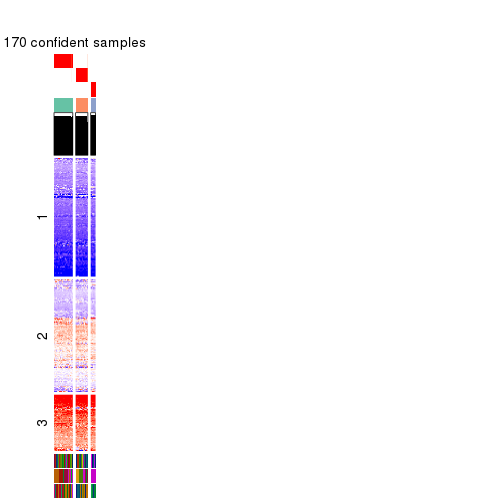</p>

</div>
<div id='tab-SD-pam-get-signatures-no-scale-3'>
<pre><code class="r">get_signatures(res, k = 4, scale_rows = FALSE)
</code></pre>

<pre><code>#&gt; Error in mat[ceiling(1:nr/h_ratio), ceiling(1:nc/w_ratio), drop = FALSE]: subscript out of bounds
</code></pre>

<p></p>

</div>
<div id='tab-SD-pam-get-signatures-no-scale-4'>
<pre><code class="r">get_signatures(res, k = 5, scale_rows = FALSE)
</code></pre>

<p></p>

</div>
<div id='tab-SD-pam-get-signatures-no-scale-5'>
<pre><code class="r">get_signatures(res, k = 6, scale_rows = FALSE)
</code></pre>

<p></p>

</div>
</div>


Compare the overlap of signatures from different k:

```r
compare_signatures(res)
```


`get_signature()` returns a data frame invisibly. TO get the list of signatures, the function
call should be assigned to a variable explicitly. In following code, if `plot` argument is set
to `FALSE`, no heatmap is plotted while only the differential analysis is performed.

```r
# code only for demonstration
tb = get_signature(res, k = ..., plot = FALSE)
```

An example of the output of `tb` is:

```
#>   which_row         fdr    mean_1    mean_2 scaled_mean_1 scaled_mean_2 km
#> 1        38 0.042760348  8.373488  9.131774    -0.5533452     0.5164555  1
#> 2        40 0.018707592  7.106213  8.469186    -0.6173731     0.5762149  1
#> 3        55 0.019134737 10.221463 11.207825    -0.6159697     0.5749050  1
#> 4        59 0.006059896  5.921854  7.869574    -0.6899429     0.6439467  1
#> 5        60 0.018055526  8.928898 10.211722    -0.6204761     0.5791110  1
#> 6        98 0.009384629 15.714769 14.887706     0.6635654    -0.6193277  2
...
```

The columns in `tb` are:

1. `which_row`: row indices corresponding to the input matrix.
2. `fdr`: FDR for the differential test. 
3. `mean_x`: The mean value in group x.
4. `scaled_mean_x`: The mean value in group x after rows are scaled.
5. `km`: Row groups if k-means clustering is applied to rows.


UMAP plot which shows how samples are separated.


<script>
$( function() {
	$( '#tabs-SD-pam-dimension-reduction' ).tabs();
} );
</script>
<div id='tabs-SD-pam-dimension-reduction'>
<ul>
<li><a href='#tab-SD-pam-dimension-reduction-1'>k = 2</a></li>
<li><a href='#tab-SD-pam-dimension-reduction-2'>k = 3</a></li>
<li><a href='#tab-SD-pam-dimension-reduction-3'>k = 4</a></li>
<li><a href='#tab-SD-pam-dimension-reduction-4'>k = 5</a></li>
<li><a href='#tab-SD-pam-dimension-reduction-5'>k = 6</a></li>
</ul>
<div id='tab-SD-pam-dimension-reduction-1'>
<pre><code class="r">dimension_reduction(res, k = 2, method = &quot;UMAP&quot;)
</code></pre>

<p></p>

</div>
<div id='tab-SD-pam-dimension-reduction-2'>
<pre><code class="r">dimension_reduction(res, k = 3, method = &quot;UMAP&quot;)
</code></pre>

<p></p>

</div>
<div id='tab-SD-pam-dimension-reduction-3'>
<pre><code class="r">dimension_reduction(res, k = 4, method = &quot;UMAP&quot;)
</code></pre>

<p></p>

</div>
<div id='tab-SD-pam-dimension-reduction-4'>
<pre><code class="r">dimension_reduction(res, k = 5, method = &quot;UMAP&quot;)
</code></pre>

<p></p>

</div>
<div id='tab-SD-pam-dimension-reduction-5'>
<pre><code class="r">dimension_reduction(res, k = 6, method = &quot;UMAP&quot;)
</code></pre>

<p></p>

</div>
</div>


Following heatmap shows how subgroups are split when increasing `k`:

```r
collect_classes(res)
```


Test correlation between subgroups and known annotations. If the known
annotation is numeric, one-way ANOVA test is applied, and if the known
annotation is discrete, chi-squared contingency table test is applied.

```r
test_to_known_factors(res)
```

```
#>          n cell.line(p) tissue(p) disease.state(p) k
#> SD:pam 170     6.23e-13  1.01e-18         1.09e-10 2
#> SD:pam 170     7.47e-24  1.80e-42         6.16e-31 3
#> SD:pam 172     1.39e-35  2.80e-71         3.31e-50 4
#> SD:pam 162     1.19e-41  1.21e-70         4.86e-46 5
#> SD:pam 163     2.46e-50  7.45e-78         3.19e-52 6
```


If matrix rows can be associated to genes, consider to use `GO_Enrichment(res,
...)` to perform function enrichment for the signature genes.


 

---------------------------------------------------


### SD:mclust


The object with results only for a single top-value method and a single partition method 
can be extracted as:

```r
res = res_list["SD", "mclust"]
# you can also extract it by
# res = res_list["SD:mclust"]
```

A summary of `res` and all the functions that can be applied to it:

```r
res
```

```
#> A 'ConsensusPartition' object with k = 2, 3, 4, 5, 6.
#>   On a matrix with 51941 rows and 174 columns.
#>   Top rows (1000, 2000, 3000, 4000, 5000) are extracted by 'SD' method.
#>   Subgroups are detected by 'mclust' method.
#>   Performed in total 1250 partitions by row resampling.
#>   Best k for subgroups seems to be 4.
#> 
#> Following methods can be applied to this 'ConsensusPartition' object:
#>  [1] "cola_report"             "collect_classes"         "collect_plots"          
#>  [4] "collect_stats"           "colnames"                "compare_signatures"     
#>  [7] "consensus_heatmap"       "dimension_reduction"     "functional_enrichment"  
#> [10] "get_anno_col"            "get_anno"                "get_classes"            
#> [13] "get_consensus"           "get_matrix"              "get_membership"         
#> [16] "get_param"               "get_signatures"          "get_stats"              
#> [19] "is_best_k"               "is_stable_k"             "membership_heatmap"     
#> [22] "ncol"                    "nrow"                    "plot_ecdf"              
#> [25] "rownames"                "select_partition_number" "show"                   
#> [28] "suggest_best_k"          "test_to_known_factors"
```

`collect_plots()` function collects all the plots made from `res` for all `k` (number of partitions)
into one single page to provide an easy and fast comparison between different `k`.

```r
collect_plots(res)
```


The plots are:

- The first row: a plot of the ECDF (Empirical cumulative distribution
  function) curves of the consensus matrix for each `k` and the heatmap of
  predicted classes for each `k`.
- The second row: heatmaps of the consensus matrix for each `k`.
- The third row: heatmaps of the membership matrix for each `k`.
- The fouth row: heatmaps of the signatures for each `k`.

All the plots in panels can be made by individual functions and they are
plotted later in this section.

`select_partition_number()` produces several plots showing different
statistics for choosing "optimized" `k`. There are following statistics:

- ECDF curves of the consensus matrix for each `k`;
- 1-PAC. [The PAC
  score](https://en.wikipedia.org/wiki/Consensus_clustering#Over-interpretation_potential_of_consensus_clustering)
  measures the proportion of the ambiguous subgrouping.
- Mean silhouette score.
- Concordance. The mean probability of fiting the consensus class ids in all
  partitions.
- Area increased. Denote $A_k$ as the area under the ECDF curve for current
  `k`, the area increased is defined as $A_k - A_{k-1}$.
- Rand index. The percent of pairs of samples that are both in a same cluster
  or both are not in a same cluster in the partition of k and k-1.
- Jaccard index. The ratio of pairs of samples are both in a same cluster in
  the partition of k and k-1 and the pairs of samples are both in a same
  cluster in the partition k or k-1.

The detailed explanations of these statistics can be found in [the cola
vignette](http://bioconductor.org/packages/devel/bioc/vignettes/cola/inst/doc/cola.html#toc_13).

Generally speaking, lower PAC score, higher mean silhouette score or higher
concordance corresponds to better partition. Rand index and Jaccard index
measure how similar the current partition is compared to partition with `k-1`.
If they are too similar, we won't accept `k` is better than `k-1`.

```r
select_partition_number(res)
```


The numeric values for all these statistics can be obtained by `get_stats()`.

```r
get_stats(res)
```

```
#>   k 1-PAC mean_silhouette concordance area_increased  Rand Jaccard
#> 2 2 0.630           0.878       0.935          0.370 0.638   0.638
#> 3 3 0.615           0.791       0.897          0.511 0.774   0.663
#> 4 4 0.714           0.840       0.895          0.192 0.707   0.457
#> 5 5 0.663           0.711       0.830          0.109 0.784   0.441
#> 6 6 0.826           0.789       0.891          0.101 0.880   0.563
```

`suggest_best_k()` suggests the best $k$ based on these statistics. The rules are as follows:

- All $k$ with Jaccard index larger than 0.95 are removed because the increase of
  the partition number does not provides enough extra information. If all $k$ are removed,
  the best $k$ is assigned by `NA`.
- For $k$ with 1-PAC larger than 0.9, the maximal $k$ is taken as the "best k". Other $k$ is called "optional k".
- If it does not fit the second rule. The $k$ with the highest vote of highest
  1-PAC, mean silhouette and concordance is taken as the "best k".

```r
suggest_best_k(res)
```

```
#> [1] 4
```


Following shows the table of the partitions (You need to click the **show/hide
code output** link to see it). The membership matrix (columns with name `p*`)
is inferred by
[`clue::cl_consensus()`](https://www.rdocumentation.org/link/cl_consensus?package=clue)
function with the `SE` method. Basically the value in the membership matrix
represents the probability to belong to a certain group. The finall class
label for an item is determined with the group with highest probability it
belongs to.

In `get_classes()` function, the entropy is calculated from the membership
matrix and the silhouette score is calculated from the consensus matrix.


<script>
$( function() {
	$( '#tabs-SD-mclust-get-classes' ).tabs();
} );
</script>
<div id='tabs-SD-mclust-get-classes'>
<ul>
<li><a href='#tab-SD-mclust-get-classes-1'>k = 2</a></li>
<li><a href='#tab-SD-mclust-get-classes-2'>k = 3</a></li>
<li><a href='#tab-SD-mclust-get-classes-3'>k = 4</a></li>
<li><a href='#tab-SD-mclust-get-classes-4'>k = 5</a></li>
<li><a href='#tab-SD-mclust-get-classes-5'>k = 6</a></li>
</ul>

<div id='tab-SD-mclust-get-classes-1'>
<p><a id='tab-SD-mclust-get-classes-1-a' style='color:#0366d6' href='#'>show/hide code output</a></p>
<pre><code class="r">cbind(get_classes(res, k = 2), get_membership(res, k = 2))
</code></pre>

<pre><code>#&gt;           class entropy silhouette    p1    p2
#&gt; GSM803615     2   0.850      0.778 0.276 0.724
#&gt; GSM803674     2   0.850      0.778 0.276 0.724
#&gt; GSM803733     2   0.850      0.778 0.276 0.724
#&gt; GSM803616     2   0.850      0.778 0.276 0.724
#&gt; GSM803675     2   0.850      0.778 0.276 0.724
#&gt; GSM803734     2   0.850      0.778 0.276 0.724
#&gt; GSM803617     2   0.850      0.778 0.276 0.724
#&gt; GSM803676     2   0.850      0.778 0.276 0.724
#&gt; GSM803735     2   0.850      0.778 0.276 0.724
#&gt; GSM803618     2   0.850      0.778 0.276 0.724
#&gt; GSM803677     2   0.850      0.778 0.276 0.724
#&gt; GSM803736     2   0.850      0.778 0.276 0.724
#&gt; GSM803619     2   0.850      0.778 0.276 0.724
#&gt; GSM803678     2   0.850      0.778 0.276 0.724
#&gt; GSM803737     2   0.850      0.778 0.276 0.724
#&gt; GSM803620     2   0.850      0.778 0.276 0.724
#&gt; GSM803679     2   0.850      0.778 0.276 0.724
#&gt; GSM803738     2   0.850      0.778 0.276 0.724
#&gt; GSM803621     1   0.000      0.942 1.000 0.000
#&gt; GSM803680     1   0.000      0.942 1.000 0.000
#&gt; GSM803739     1   0.000      0.942 1.000 0.000
#&gt; GSM803622     1   0.844      0.670 0.728 0.272
#&gt; GSM803681     1   0.844      0.670 0.728 0.272
#&gt; GSM803740     1   0.844      0.670 0.728 0.272
#&gt; GSM803623     1   0.000      0.942 1.000 0.000
#&gt; GSM803682     1   0.000      0.942 1.000 0.000
#&gt; GSM803741     1   0.000      0.942 1.000 0.000
#&gt; GSM803624     1   0.000      0.942 1.000 0.000
#&gt; GSM803683     1   0.000      0.942 1.000 0.000
#&gt; GSM803742     1   0.000      0.942 1.000 0.000
#&gt; GSM803625     1   0.000      0.942 1.000 0.000
#&gt; GSM803684     1   0.000      0.942 1.000 0.000
#&gt; GSM803743     1   0.000      0.942 1.000 0.000
#&gt; GSM803626     2   0.000      0.859 0.000 1.000
#&gt; GSM803685     2   0.000      0.859 0.000 1.000
#&gt; GSM803744     2   0.000      0.859 0.000 1.000
#&gt; GSM803627     1   0.844      0.670 0.728 0.272
#&gt; GSM803686     1   0.833      0.680 0.736 0.264
#&gt; GSM803745     1   0.833      0.680 0.736 0.264
#&gt; GSM803628     1   0.844      0.670 0.728 0.272
#&gt; GSM803687     1   0.844      0.670 0.728 0.272
#&gt; GSM803746     1   0.844      0.670 0.728 0.272
#&gt; GSM803629     1   0.775      0.722 0.772 0.228
#&gt; GSM803688     1   0.706      0.761 0.808 0.192
#&gt; GSM803747     1   0.671      0.778 0.824 0.176
#&gt; GSM803630     1   0.844      0.670 0.728 0.272
#&gt; GSM803689     1   0.844      0.670 0.728 0.272
#&gt; GSM803748     1   0.844      0.670 0.728 0.272
#&gt; GSM803631     1   0.844      0.670 0.728 0.272
#&gt; GSM803690     1   0.844      0.670 0.728 0.272
#&gt; GSM803749     1   0.844      0.670 0.728 0.272
#&gt; GSM803632     1   0.844      0.670 0.728 0.272
#&gt; GSM803691     1   0.844      0.670 0.728 0.272
#&gt; GSM803750     1   0.844      0.670 0.728 0.272
#&gt; GSM803633     1   0.000      0.942 1.000 0.000
#&gt; GSM803692     1   0.000      0.942 1.000 0.000
#&gt; GSM803751     1   0.000      0.942 1.000 0.000
#&gt; GSM803634     1   0.000      0.942 1.000 0.000
#&gt; GSM803693     1   0.000      0.942 1.000 0.000
#&gt; GSM803752     1   0.000      0.942 1.000 0.000
#&gt; GSM803635     1   0.000      0.942 1.000 0.000
#&gt; GSM803694     1   0.000      0.942 1.000 0.000
#&gt; GSM803753     1   0.000      0.942 1.000 0.000
#&gt; GSM803636     1   0.000      0.942 1.000 0.000
#&gt; GSM803695     1   0.000      0.942 1.000 0.000
#&gt; GSM803754     1   0.000      0.942 1.000 0.000
#&gt; GSM803637     1   0.000      0.942 1.000 0.000
#&gt; GSM803696     1   0.000      0.942 1.000 0.000
#&gt; GSM803755     1   0.000      0.942 1.000 0.000
#&gt; GSM803638     1   0.000      0.942 1.000 0.000
#&gt; GSM803697     1   0.000      0.942 1.000 0.000
#&gt; GSM803756     1   0.000      0.942 1.000 0.000
#&gt; GSM803639     1   0.000      0.942 1.000 0.000
#&gt; GSM803698     1   0.000      0.942 1.000 0.000
#&gt; GSM803757     1   0.000      0.942 1.000 0.000
#&gt; GSM803640     1   0.000      0.942 1.000 0.000
#&gt; GSM803699     1   0.000      0.942 1.000 0.000
#&gt; GSM803758     1   0.000      0.942 1.000 0.000
#&gt; GSM803641     1   0.000      0.942 1.000 0.000
#&gt; GSM803700     1   0.000      0.942 1.000 0.000
#&gt; GSM803759     1   0.000      0.942 1.000 0.000
#&gt; GSM803642     1   0.000      0.942 1.000 0.000
#&gt; GSM803701     1   0.000      0.942 1.000 0.000
#&gt; GSM803760     1   0.000      0.942 1.000 0.000
#&gt; GSM803643     1   0.000      0.942 1.000 0.000
#&gt; GSM803702     1   0.000      0.942 1.000 0.000
#&gt; GSM803644     1   0.000      0.942 1.000 0.000
#&gt; GSM803703     1   0.000      0.942 1.000 0.000
#&gt; GSM803761     1   0.000      0.942 1.000 0.000
#&gt; GSM803645     1   0.000      0.942 1.000 0.000
#&gt; GSM803704     1   0.000      0.942 1.000 0.000
#&gt; GSM803762     1   0.000      0.942 1.000 0.000
#&gt; GSM803646     1   0.000      0.942 1.000 0.000
#&gt; GSM803705     1   0.000      0.942 1.000 0.000
#&gt; GSM803763     1   0.000      0.942 1.000 0.000
#&gt; GSM803647     1   0.000      0.942 1.000 0.000
#&gt; GSM803706     1   0.000      0.942 1.000 0.000
#&gt; GSM803764     1   0.000      0.942 1.000 0.000
#&gt; GSM803648     1   0.000      0.942 1.000 0.000
#&gt; GSM803707     1   0.000      0.942 1.000 0.000
#&gt; GSM803765     1   0.000      0.942 1.000 0.000
#&gt; GSM803649     1   0.000      0.942 1.000 0.000
#&gt; GSM803708     1   0.000      0.942 1.000 0.000
#&gt; GSM803766     1   0.000      0.942 1.000 0.000
#&gt; GSM803650     1   0.000      0.942 1.000 0.000
#&gt; GSM803709     1   0.000      0.942 1.000 0.000
#&gt; GSM803767     1   0.000      0.942 1.000 0.000
#&gt; GSM803651     1   0.000      0.942 1.000 0.000
#&gt; GSM803710     1   0.000      0.942 1.000 0.000
#&gt; GSM803768     1   0.000      0.942 1.000 0.000
#&gt; GSM803652     1   0.000      0.942 1.000 0.000
#&gt; GSM803711     1   0.000      0.942 1.000 0.000
#&gt; GSM803653     1   0.000      0.942 1.000 0.000
#&gt; GSM803712     1   0.000      0.942 1.000 0.000
#&gt; GSM803769     1   0.000      0.942 1.000 0.000
#&gt; GSM803654     1   0.000      0.942 1.000 0.000
#&gt; GSM803713     1   0.000      0.942 1.000 0.000
#&gt; GSM803770     1   0.000      0.942 1.000 0.000
#&gt; GSM803655     1   0.000      0.942 1.000 0.000
#&gt; GSM803714     1   0.000      0.942 1.000 0.000
#&gt; GSM803771     1   0.000      0.942 1.000 0.000
#&gt; GSM803656     1   0.000      0.942 1.000 0.000
#&gt; GSM803715     1   0.000      0.942 1.000 0.000
#&gt; GSM803772     1   0.000      0.942 1.000 0.000
#&gt; GSM803657     1   0.000      0.942 1.000 0.000
#&gt; GSM803716     1   0.000      0.942 1.000 0.000
#&gt; GSM803773     1   0.000      0.942 1.000 0.000
#&gt; GSM803658     1   0.000      0.942 1.000 0.000
#&gt; GSM803717     1   0.000      0.942 1.000 0.000
#&gt; GSM803774     1   0.000      0.942 1.000 0.000
#&gt; GSM803659     1   0.000      0.942 1.000 0.000
#&gt; GSM803718     1   0.000      0.942 1.000 0.000
#&gt; GSM803775     1   0.000      0.942 1.000 0.000
#&gt; GSM803660     1   0.000      0.942 1.000 0.000
#&gt; GSM803719     1   0.000      0.942 1.000 0.000
#&gt; GSM803776     1   0.000      0.942 1.000 0.000
#&gt; GSM803661     1   0.000      0.942 1.000 0.000
#&gt; GSM803720     1   0.000      0.942 1.000 0.000
#&gt; GSM803777     1   0.000      0.942 1.000 0.000
#&gt; GSM803662     1   0.000      0.942 1.000 0.000
#&gt; GSM803732     1   0.000      0.942 1.000 0.000
#&gt; GSM803778     1   0.000      0.942 1.000 0.000
#&gt; GSM803663     1   0.000      0.942 1.000 0.000
#&gt; GSM803721     1   0.000      0.942 1.000 0.000
#&gt; GSM803779     1   0.000      0.942 1.000 0.000
#&gt; GSM803664     1   0.000      0.942 1.000 0.000
#&gt; GSM803722     1   0.000      0.942 1.000 0.000
#&gt; GSM803780     1   0.000      0.942 1.000 0.000
#&gt; GSM803665     1   0.844      0.670 0.728 0.272
#&gt; GSM803723     1   0.844      0.670 0.728 0.272
#&gt; GSM803781     1   0.844      0.670 0.728 0.272
#&gt; GSM803666     2   0.000      0.859 0.000 1.000
#&gt; GSM803724     2   0.000      0.859 0.000 1.000
#&gt; GSM803782     2   0.000      0.859 0.000 1.000
#&gt; GSM803667     2   0.000      0.859 0.000 1.000
#&gt; GSM803725     2   0.000      0.859 0.000 1.000
#&gt; GSM803783     2   0.000      0.859 0.000 1.000
#&gt; GSM803668     2   0.000      0.859 0.000 1.000
#&gt; GSM803726     2   0.000      0.859 0.000 1.000
#&gt; GSM803784     2   0.000      0.859 0.000 1.000
#&gt; GSM803669     2   0.000      0.859 0.000 1.000
#&gt; GSM803727     2   0.000      0.859 0.000 1.000
#&gt; GSM803670     2   0.000      0.859 0.000 1.000
#&gt; GSM803728     2   0.000      0.859 0.000 1.000
#&gt; GSM803785     2   0.000      0.859 0.000 1.000
#&gt; GSM803671     2   0.000      0.859 0.000 1.000
#&gt; GSM803729     2   0.000      0.859 0.000 1.000
#&gt; GSM803786     2   0.000      0.859 0.000 1.000
#&gt; GSM803672     2   0.000      0.859 0.000 1.000
#&gt; GSM803730     2   0.000      0.859 0.000 1.000
#&gt; GSM803787     2   0.000      0.859 0.000 1.000
#&gt; GSM803673     1   0.000      0.942 1.000 0.000
#&gt; GSM803731     1   0.000      0.942 1.000 0.000
#&gt; GSM803788     1   0.000      0.942 1.000 0.000
</code></pre>

<script>
$('#tab-SD-mclust-get-classes-1-a').parent().next().next().hide();
$('#tab-SD-mclust-get-classes-1-a').click(function(){
  $('#tab-SD-mclust-get-classes-1-a').parent().next().next().toggle();
  return(false);
});
</script>
</div>

<div id='tab-SD-mclust-get-classes-2'>
<p><a id='tab-SD-mclust-get-classes-2-a' style='color:#0366d6' href='#'>show/hide code output</a></p>
<pre><code class="r">cbind(get_classes(res, k = 3), get_membership(res, k = 3))
</code></pre>

<pre><code>#&gt;           class entropy silhouette    p1    p2    p3
#&gt; GSM803615     3  0.0000    0.96967 0.000 0.000 1.000
#&gt; GSM803674     3  0.0000    0.96967 0.000 0.000 1.000
#&gt; GSM803733     3  0.0000    0.96967 0.000 0.000 1.000
#&gt; GSM803616     3  0.0000    0.96967 0.000 0.000 1.000
#&gt; GSM803675     3  0.0000    0.96967 0.000 0.000 1.000
#&gt; GSM803734     3  0.0000    0.96967 0.000 0.000 1.000
#&gt; GSM803617     3  0.0000    0.96967 0.000 0.000 1.000
#&gt; GSM803676     3  0.0000    0.96967 0.000 0.000 1.000
#&gt; GSM803735     3  0.0000    0.96967 0.000 0.000 1.000
#&gt; GSM803618     3  0.0000    0.96967 0.000 0.000 1.000
#&gt; GSM803677     3  0.0000    0.96967 0.000 0.000 1.000
#&gt; GSM803736     3  0.0000    0.96967 0.000 0.000 1.000
#&gt; GSM803619     3  0.0000    0.96967 0.000 0.000 1.000
#&gt; GSM803678     3  0.0000    0.96967 0.000 0.000 1.000
#&gt; GSM803737     3  0.0000    0.96967 0.000 0.000 1.000
#&gt; GSM803620     3  0.0000    0.96967 0.000 0.000 1.000
#&gt; GSM803679     3  0.0000    0.96967 0.000 0.000 1.000
#&gt; GSM803738     3  0.0000    0.96967 0.000 0.000 1.000
#&gt; GSM803621     2  0.6062    0.40477 0.384 0.616 0.000
#&gt; GSM803680     2  0.6192    0.30730 0.420 0.580 0.000
#&gt; GSM803739     1  0.6305    0.00618 0.516 0.484 0.000
#&gt; GSM803622     1  0.5958    0.52877 0.692 0.300 0.008
#&gt; GSM803681     1  0.6018    0.51412 0.684 0.308 0.008
#&gt; GSM803740     1  0.6229    0.44478 0.652 0.340 0.008
#&gt; GSM803623     2  0.4654    0.74473 0.000 0.792 0.208
#&gt; GSM803682     2  0.4654    0.74473 0.000 0.792 0.208
#&gt; GSM803741     2  0.4654    0.74473 0.000 0.792 0.208
#&gt; GSM803624     2  0.4683    0.79789 0.024 0.836 0.140
#&gt; GSM803683     2  0.1860    0.87874 0.052 0.948 0.000
#&gt; GSM803742     2  0.1860    0.87874 0.052 0.948 0.000
#&gt; GSM803625     2  0.1860    0.87874 0.052 0.948 0.000
#&gt; GSM803684     2  0.1860    0.87874 0.052 0.948 0.000
#&gt; GSM803743     2  0.1860    0.87874 0.052 0.948 0.000
#&gt; GSM803626     1  0.1964    0.83836 0.944 0.000 0.056
#&gt; GSM803685     1  0.2165    0.83298 0.936 0.000 0.064
#&gt; GSM803744     1  0.1964    0.83836 0.944 0.000 0.056
#&gt; GSM803627     1  0.6386    0.27032 0.584 0.412 0.004
#&gt; GSM803686     1  0.6520    0.01195 0.508 0.488 0.004
#&gt; GSM803745     1  0.6521   -0.00515 0.504 0.492 0.004
#&gt; GSM803628     1  0.3610    0.76637 0.888 0.096 0.016
#&gt; GSM803687     1  0.3528    0.77052 0.892 0.092 0.016
#&gt; GSM803746     1  0.2703    0.80371 0.928 0.056 0.016
#&gt; GSM803629     2  0.6359    0.32747 0.404 0.592 0.004
#&gt; GSM803688     2  0.6330    0.35019 0.396 0.600 0.004
#&gt; GSM803747     2  0.6314    0.36130 0.392 0.604 0.004
#&gt; GSM803630     1  0.2297    0.81779 0.944 0.036 0.020
#&gt; GSM803689     1  0.2152    0.81860 0.948 0.036 0.016
#&gt; GSM803748     1  0.2152    0.81860 0.948 0.036 0.016
#&gt; GSM803631     1  0.2297    0.81779 0.944 0.036 0.020
#&gt; GSM803690     1  0.2297    0.81779 0.944 0.036 0.020
#&gt; GSM803749     1  0.2297    0.81779 0.944 0.036 0.020
#&gt; GSM803632     1  0.2152    0.81860 0.948 0.036 0.016
#&gt; GSM803691     1  0.2152    0.81860 0.948 0.036 0.016
#&gt; GSM803750     1  0.2152    0.81860 0.948 0.036 0.016
#&gt; GSM803633     2  0.3619    0.81243 0.000 0.864 0.136
#&gt; GSM803692     2  0.3619    0.81243 0.000 0.864 0.136
#&gt; GSM803751     2  0.3619    0.81243 0.000 0.864 0.136
#&gt; GSM803634     2  0.3619    0.81243 0.000 0.864 0.136
#&gt; GSM803693     2  0.3619    0.81243 0.000 0.864 0.136
#&gt; GSM803752     2  0.3619    0.81243 0.000 0.864 0.136
#&gt; GSM803635     2  0.0592    0.87316 0.000 0.988 0.012
#&gt; GSM803694     2  0.0592    0.87258 0.000 0.988 0.012
#&gt; GSM803753     2  0.0747    0.87204 0.000 0.984 0.016
#&gt; GSM803636     2  0.3619    0.81243 0.000 0.864 0.136
#&gt; GSM803695     2  0.3619    0.81243 0.000 0.864 0.136
#&gt; GSM803754     2  0.3619    0.81243 0.000 0.864 0.136
#&gt; GSM803637     2  0.3619    0.81243 0.000 0.864 0.136
#&gt; GSM803696     2  0.3619    0.81243 0.000 0.864 0.136
#&gt; GSM803755     2  0.3619    0.81243 0.000 0.864 0.136
#&gt; GSM803638     2  0.3619    0.81243 0.000 0.864 0.136
#&gt; GSM803697     2  0.3619    0.81243 0.000 0.864 0.136
#&gt; GSM803756     2  0.3619    0.81243 0.000 0.864 0.136
#&gt; GSM803639     2  0.2448    0.85144 0.000 0.924 0.076
#&gt; GSM803698     2  0.2165    0.85744 0.000 0.936 0.064
#&gt; GSM803757     2  0.3038    0.83927 0.000 0.896 0.104
#&gt; GSM803640     2  0.1860    0.87874 0.052 0.948 0.000
#&gt; GSM803699     2  0.1860    0.87874 0.052 0.948 0.000
#&gt; GSM803758     2  0.1860    0.87874 0.052 0.948 0.000
#&gt; GSM803641     2  0.1860    0.87874 0.052 0.948 0.000
#&gt; GSM803700     2  0.1860    0.87874 0.052 0.948 0.000
#&gt; GSM803759     2  0.1860    0.87874 0.052 0.948 0.000
#&gt; GSM803642     2  0.1860    0.87874 0.052 0.948 0.000
#&gt; GSM803701     2  0.1860    0.87874 0.052 0.948 0.000
#&gt; GSM803760     2  0.1860    0.87874 0.052 0.948 0.000
#&gt; GSM803643     2  0.1860    0.87874 0.052 0.948 0.000
#&gt; GSM803702     2  0.1860    0.87874 0.052 0.948 0.000
#&gt; GSM803644     2  0.1860    0.87874 0.052 0.948 0.000
#&gt; GSM803703     2  0.1860    0.87874 0.052 0.948 0.000
#&gt; GSM803761     2  0.1860    0.87874 0.052 0.948 0.000
#&gt; GSM803645     2  0.1860    0.87874 0.052 0.948 0.000
#&gt; GSM803704     2  0.1860    0.87874 0.052 0.948 0.000
#&gt; GSM803762     2  0.1860    0.87874 0.052 0.948 0.000
#&gt; GSM803646     2  0.1860    0.87874 0.052 0.948 0.000
#&gt; GSM803705     2  0.1860    0.87874 0.052 0.948 0.000
#&gt; GSM803763     2  0.1860    0.87874 0.052 0.948 0.000
#&gt; GSM803647     2  0.1860    0.87874 0.052 0.948 0.000
#&gt; GSM803706     2  0.1860    0.87874 0.052 0.948 0.000
#&gt; GSM803764     2  0.1860    0.87874 0.052 0.948 0.000
#&gt; GSM803648     2  0.3192    0.82290 0.000 0.888 0.112
#&gt; GSM803707     2  0.3192    0.82290 0.000 0.888 0.112
#&gt; GSM803765     2  0.3192    0.82290 0.000 0.888 0.112
#&gt; GSM803649     2  0.3192    0.82290 0.000 0.888 0.112
#&gt; GSM803708     2  0.3192    0.82290 0.000 0.888 0.112
#&gt; GSM803766     2  0.3192    0.82290 0.000 0.888 0.112
#&gt; GSM803650     2  0.1860    0.87874 0.052 0.948 0.000
#&gt; GSM803709     2  0.1860    0.87874 0.052 0.948 0.000
#&gt; GSM803767     2  0.1860    0.87874 0.052 0.948 0.000
#&gt; GSM803651     2  0.1860    0.87874 0.052 0.948 0.000
#&gt; GSM803710     2  0.1860    0.87874 0.052 0.948 0.000
#&gt; GSM803768     2  0.1860    0.87874 0.052 0.948 0.000
#&gt; GSM803652     2  0.1860    0.87874 0.052 0.948 0.000
#&gt; GSM803711     2  0.1860    0.87874 0.052 0.948 0.000
#&gt; GSM803653     2  0.6565    0.27392 0.008 0.576 0.416
#&gt; GSM803712     2  0.6587    0.24881 0.008 0.568 0.424
#&gt; GSM803769     2  0.6565    0.27421 0.008 0.576 0.416
#&gt; GSM803654     2  0.1411    0.86735 0.000 0.964 0.036
#&gt; GSM803713     2  0.1411    0.86735 0.000 0.964 0.036
#&gt; GSM803770     2  0.1964    0.85889 0.000 0.944 0.056
#&gt; GSM803655     2  0.5928    0.56388 0.008 0.696 0.296
#&gt; GSM803714     2  0.5797    0.59338 0.008 0.712 0.280
#&gt; GSM803771     2  0.5896    0.57164 0.008 0.700 0.292
#&gt; GSM803656     3  0.4228    0.80914 0.008 0.148 0.844
#&gt; GSM803715     3  0.4228    0.80914 0.008 0.148 0.844
#&gt; GSM803772     3  0.4099    0.82043 0.008 0.140 0.852
#&gt; GSM803657     2  0.0000    0.87314 0.000 1.000 0.000
#&gt; GSM803716     2  0.0000    0.87314 0.000 1.000 0.000
#&gt; GSM803773     2  0.0237    0.87317 0.000 0.996 0.004
#&gt; GSM803658     2  0.0000    0.87314 0.000 1.000 0.000
#&gt; GSM803717     2  0.0000    0.87314 0.000 1.000 0.000
#&gt; GSM803774     2  0.0000    0.87314 0.000 1.000 0.000
#&gt; GSM803659     2  0.0000    0.87314 0.000 1.000 0.000
#&gt; GSM803718     2  0.0000    0.87314 0.000 1.000 0.000
#&gt; GSM803775     2  0.0000    0.87314 0.000 1.000 0.000
#&gt; GSM803660     2  0.3116    0.82617 0.000 0.892 0.108
#&gt; GSM803719     2  0.3192    0.82290 0.000 0.888 0.112
#&gt; GSM803776     2  0.3038    0.82921 0.000 0.896 0.104
#&gt; GSM803661     2  0.1860    0.87874 0.052 0.948 0.000
#&gt; GSM803720     2  0.1860    0.87874 0.052 0.948 0.000
#&gt; GSM803777     2  0.1860    0.87874 0.052 0.948 0.000
#&gt; GSM803662     2  0.0000    0.87314 0.000 1.000 0.000
#&gt; GSM803732     2  0.1860    0.87874 0.052 0.948 0.000
#&gt; GSM803778     2  0.1860    0.87874 0.052 0.948 0.000
#&gt; GSM803663     2  0.0000    0.87314 0.000 1.000 0.000
#&gt; GSM803721     2  0.0000    0.87314 0.000 1.000 0.000
#&gt; GSM803779     2  0.0000    0.87314 0.000 1.000 0.000
#&gt; GSM803664     2  0.1643    0.86764 0.000 0.956 0.044
#&gt; GSM803722     2  0.1643    0.86764 0.000 0.956 0.044
#&gt; GSM803780     2  0.1643    0.86764 0.000 0.956 0.044
#&gt; GSM803665     2  0.8635   -0.09127 0.440 0.460 0.100
#&gt; GSM803723     2  0.8635   -0.09127 0.440 0.460 0.100
#&gt; GSM803781     2  0.8635   -0.09127 0.440 0.460 0.100
#&gt; GSM803666     1  0.1964    0.83836 0.944 0.000 0.056
#&gt; GSM803724     1  0.1964    0.83836 0.944 0.000 0.056
#&gt; GSM803782     1  0.1964    0.83836 0.944 0.000 0.056
#&gt; GSM803667     1  0.1964    0.83836 0.944 0.000 0.056
#&gt; GSM803725     1  0.1964    0.83836 0.944 0.000 0.056
#&gt; GSM803783     1  0.1964    0.83836 0.944 0.000 0.056
#&gt; GSM803668     1  0.1964    0.83836 0.944 0.000 0.056
#&gt; GSM803726     1  0.1964    0.83836 0.944 0.000 0.056
#&gt; GSM803784     1  0.1964    0.83836 0.944 0.000 0.056
#&gt; GSM803669     1  0.1964    0.83836 0.944 0.000 0.056
#&gt; GSM803727     1  0.1964    0.83836 0.944 0.000 0.056
#&gt; GSM803670     1  0.1964    0.83836 0.944 0.000 0.056
#&gt; GSM803728     1  0.1964    0.83836 0.944 0.000 0.056
#&gt; GSM803785     1  0.1964    0.83836 0.944 0.000 0.056
#&gt; GSM803671     1  0.1964    0.83836 0.944 0.000 0.056
#&gt; GSM803729     1  0.1964    0.83836 0.944 0.000 0.056
#&gt; GSM803786     1  0.1964    0.83836 0.944 0.000 0.056
#&gt; GSM803672     1  0.1964    0.83836 0.944 0.000 0.056
#&gt; GSM803730     1  0.1964    0.83836 0.944 0.000 0.056
#&gt; GSM803787     1  0.1964    0.83836 0.944 0.000 0.056
#&gt; GSM803673     2  0.2537    0.84813 0.000 0.920 0.080
#&gt; GSM803731     2  0.2448    0.85032 0.000 0.924 0.076
#&gt; GSM803788     2  0.2711    0.84364 0.000 0.912 0.088
</code></pre>

<script>
$('#tab-SD-mclust-get-classes-2-a').parent().next().next().hide();
$('#tab-SD-mclust-get-classes-2-a').click(function(){
  $('#tab-SD-mclust-get-classes-2-a').parent().next().next().toggle();
  return(false);
});
</script>
</div>

<div id='tab-SD-mclust-get-classes-3'>
<p><a id='tab-SD-mclust-get-classes-3-a' style='color:#0366d6' href='#'>show/hide code output</a></p>
<pre><code class="r">cbind(get_classes(res, k = 4), get_membership(res, k = 4))
</code></pre>

<pre><code>#&gt;           class entropy silhouette    p1    p2    p3    p4
#&gt; GSM803615     4  0.0000     0.8955 0.000 0.000 0.000 1.000
#&gt; GSM803674     4  0.0000     0.8955 0.000 0.000 0.000 1.000
#&gt; GSM803733     4  0.0000     0.8955 0.000 0.000 0.000 1.000
#&gt; GSM803616     4  0.0000     0.8955 0.000 0.000 0.000 1.000
#&gt; GSM803675     4  0.0000     0.8955 0.000 0.000 0.000 1.000
#&gt; GSM803734     4  0.0000     0.8955 0.000 0.000 0.000 1.000
#&gt; GSM803617     4  0.0000     0.8955 0.000 0.000 0.000 1.000
#&gt; GSM803676     4  0.0000     0.8955 0.000 0.000 0.000 1.000
#&gt; GSM803735     4  0.0000     0.8955 0.000 0.000 0.000 1.000
#&gt; GSM803618     4  0.0000     0.8955 0.000 0.000 0.000 1.000
#&gt; GSM803677     4  0.0000     0.8955 0.000 0.000 0.000 1.000
#&gt; GSM803736     4  0.0000     0.8955 0.000 0.000 0.000 1.000
#&gt; GSM803619     4  0.0000     0.8955 0.000 0.000 0.000 1.000
#&gt; GSM803678     4  0.0000     0.8955 0.000 0.000 0.000 1.000
#&gt; GSM803737     4  0.0000     0.8955 0.000 0.000 0.000 1.000
#&gt; GSM803620     4  0.0000     0.8955 0.000 0.000 0.000 1.000
#&gt; GSM803679     4  0.0000     0.8955 0.000 0.000 0.000 1.000
#&gt; GSM803738     4  0.0000     0.8955 0.000 0.000 0.000 1.000
#&gt; GSM803621     1  0.1867     0.7933 0.928 0.072 0.000 0.000
#&gt; GSM803680     1  0.1637     0.7886 0.940 0.060 0.000 0.000
#&gt; GSM803739     1  0.1637     0.7886 0.940 0.060 0.000 0.000
#&gt; GSM803622     1  0.0000     0.7592 1.000 0.000 0.000 0.000
#&gt; GSM803681     1  0.0000     0.7592 1.000 0.000 0.000 0.000
#&gt; GSM803740     1  0.0000     0.7592 1.000 0.000 0.000 0.000
#&gt; GSM803623     2  0.0000     0.9364 0.000 1.000 0.000 0.000
#&gt; GSM803682     2  0.0000     0.9364 0.000 1.000 0.000 0.000
#&gt; GSM803741     2  0.0000     0.9364 0.000 1.000 0.000 0.000
#&gt; GSM803624     2  0.7429     0.2243 0.192 0.492 0.000 0.316
#&gt; GSM803683     1  0.4103     0.8415 0.744 0.256 0.000 0.000
#&gt; GSM803742     1  0.4103     0.8415 0.744 0.256 0.000 0.000
#&gt; GSM803625     1  0.4103     0.8415 0.744 0.256 0.000 0.000
#&gt; GSM803684     1  0.4103     0.8415 0.744 0.256 0.000 0.000
#&gt; GSM803743     1  0.4103     0.8415 0.744 0.256 0.000 0.000
#&gt; GSM803626     3  0.0000     0.9818 0.000 0.000 1.000 0.000
#&gt; GSM803685     3  0.4730     0.5517 0.364 0.000 0.636 0.000
#&gt; GSM803744     3  0.0000     0.9818 0.000 0.000 1.000 0.000
#&gt; GSM803627     1  0.0000     0.7592 1.000 0.000 0.000 0.000
#&gt; GSM803686     1  0.0000     0.7592 1.000 0.000 0.000 0.000
#&gt; GSM803745     1  0.0000     0.7592 1.000 0.000 0.000 0.000
#&gt; GSM803628     1  0.0707     0.7488 0.980 0.000 0.020 0.000
#&gt; GSM803687     1  0.0707     0.7488 0.980 0.000 0.020 0.000
#&gt; GSM803746     1  0.0817     0.7467 0.976 0.000 0.024 0.000
#&gt; GSM803629     1  0.0000     0.7592 1.000 0.000 0.000 0.000
#&gt; GSM803688     1  0.0000     0.7592 1.000 0.000 0.000 0.000
#&gt; GSM803747     1  0.0000     0.7592 1.000 0.000 0.000 0.000
#&gt; GSM803630     1  0.0817     0.7467 0.976 0.000 0.024 0.000
#&gt; GSM803689     1  0.0817     0.7467 0.976 0.000 0.024 0.000
#&gt; GSM803748     1  0.0817     0.7467 0.976 0.000 0.024 0.000
#&gt; GSM803631     1  0.0817     0.7467 0.976 0.000 0.024 0.000
#&gt; GSM803690     1  0.0817     0.7467 0.976 0.000 0.024 0.000
#&gt; GSM803749     1  0.0817     0.7467 0.976 0.000 0.024 0.000
#&gt; GSM803632     1  0.0817     0.7467 0.976 0.000 0.024 0.000
#&gt; GSM803691     1  0.0817     0.7467 0.976 0.000 0.024 0.000
#&gt; GSM803750     1  0.0817     0.7467 0.976 0.000 0.024 0.000
#&gt; GSM803633     2  0.0000     0.9364 0.000 1.000 0.000 0.000
#&gt; GSM803692     2  0.0000     0.9364 0.000 1.000 0.000 0.000
#&gt; GSM803751     2  0.0000     0.9364 0.000 1.000 0.000 0.000
#&gt; GSM803634     2  0.0000     0.9364 0.000 1.000 0.000 0.000
#&gt; GSM803693     2  0.0000     0.9364 0.000 1.000 0.000 0.000
#&gt; GSM803752     2  0.0000     0.9364 0.000 1.000 0.000 0.000
#&gt; GSM803635     2  0.0000     0.9364 0.000 1.000 0.000 0.000
#&gt; GSM803694     2  0.0000     0.9364 0.000 1.000 0.000 0.000
#&gt; GSM803753     2  0.0000     0.9364 0.000 1.000 0.000 0.000
#&gt; GSM803636     2  0.0000     0.9364 0.000 1.000 0.000 0.000
#&gt; GSM803695     2  0.0000     0.9364 0.000 1.000 0.000 0.000
#&gt; GSM803754     2  0.0000     0.9364 0.000 1.000 0.000 0.000
#&gt; GSM803637     2  0.0000     0.9364 0.000 1.000 0.000 0.000
#&gt; GSM803696     2  0.0000     0.9364 0.000 1.000 0.000 0.000
#&gt; GSM803755     2  0.0000     0.9364 0.000 1.000 0.000 0.000
#&gt; GSM803638     2  0.0000     0.9364 0.000 1.000 0.000 0.000
#&gt; GSM803697     2  0.0000     0.9364 0.000 1.000 0.000 0.000
#&gt; GSM803756     2  0.0000     0.9364 0.000 1.000 0.000 0.000
#&gt; GSM803639     2  0.0000     0.9364 0.000 1.000 0.000 0.000
#&gt; GSM803698     2  0.0000     0.9364 0.000 1.000 0.000 0.000
#&gt; GSM803757     2  0.0000     0.9364 0.000 1.000 0.000 0.000
#&gt; GSM803640     1  0.4103     0.8415 0.744 0.256 0.000 0.000
#&gt; GSM803699     1  0.4103     0.8415 0.744 0.256 0.000 0.000
#&gt; GSM803758     1  0.4103     0.8415 0.744 0.256 0.000 0.000
#&gt; GSM803641     1  0.4103     0.8415 0.744 0.256 0.000 0.000
#&gt; GSM803700     1  0.4103     0.8415 0.744 0.256 0.000 0.000
#&gt; GSM803759     1  0.4103     0.8415 0.744 0.256 0.000 0.000
#&gt; GSM803642     1  0.4103     0.8415 0.744 0.256 0.000 0.000
#&gt; GSM803701     1  0.4103     0.8415 0.744 0.256 0.000 0.000
#&gt; GSM803760     1  0.4103     0.8415 0.744 0.256 0.000 0.000
#&gt; GSM803643     1  0.4103     0.8415 0.744 0.256 0.000 0.000
#&gt; GSM803702     1  0.4103     0.8415 0.744 0.256 0.000 0.000
#&gt; GSM803644     1  0.4103     0.8415 0.744 0.256 0.000 0.000
#&gt; GSM803703     1  0.4103     0.8415 0.744 0.256 0.000 0.000
#&gt; GSM803761     1  0.4103     0.8415 0.744 0.256 0.000 0.000
#&gt; GSM803645     1  0.4103     0.8415 0.744 0.256 0.000 0.000
#&gt; GSM803704     1  0.4103     0.8415 0.744 0.256 0.000 0.000
#&gt; GSM803762     1  0.4103     0.8415 0.744 0.256 0.000 0.000
#&gt; GSM803646     1  0.4585     0.7469 0.668 0.332 0.000 0.000
#&gt; GSM803705     1  0.4713     0.7030 0.640 0.360 0.000 0.000
#&gt; GSM803763     1  0.4679     0.7164 0.648 0.352 0.000 0.000
#&gt; GSM803647     1  0.4103     0.8415 0.744 0.256 0.000 0.000
#&gt; GSM803706     1  0.4103     0.8415 0.744 0.256 0.000 0.000
#&gt; GSM803764     1  0.4103     0.8415 0.744 0.256 0.000 0.000
#&gt; GSM803648     2  0.0707     0.9358 0.020 0.980 0.000 0.000
#&gt; GSM803707     2  0.0707     0.9358 0.020 0.980 0.000 0.000
#&gt; GSM803765     2  0.0707     0.9358 0.020 0.980 0.000 0.000
#&gt; GSM803649     2  0.0707     0.9358 0.020 0.980 0.000 0.000
#&gt; GSM803708     2  0.0707     0.9358 0.020 0.980 0.000 0.000
#&gt; GSM803766     2  0.0707     0.9358 0.020 0.980 0.000 0.000
#&gt; GSM803650     1  0.4103     0.8415 0.744 0.256 0.000 0.000
#&gt; GSM803709     1  0.4103     0.8415 0.744 0.256 0.000 0.000
#&gt; GSM803767     1  0.4103     0.8415 0.744 0.256 0.000 0.000
#&gt; GSM803651     1  0.4103     0.8415 0.744 0.256 0.000 0.000
#&gt; GSM803710     1  0.4103     0.8415 0.744 0.256 0.000 0.000
#&gt; GSM803768     1  0.4103     0.8415 0.744 0.256 0.000 0.000
#&gt; GSM803652     1  0.4103     0.8415 0.744 0.256 0.000 0.000
#&gt; GSM803711     1  0.4103     0.8415 0.744 0.256 0.000 0.000
#&gt; GSM803653     2  0.5285     0.1070 0.008 0.524 0.000 0.468
#&gt; GSM803712     2  0.5285     0.1070 0.008 0.524 0.000 0.468
#&gt; GSM803769     2  0.5285     0.1070 0.008 0.524 0.000 0.468
#&gt; GSM803654     2  0.0707     0.9358 0.020 0.980 0.000 0.000
#&gt; GSM803713     2  0.0707     0.9358 0.020 0.980 0.000 0.000
#&gt; GSM803770     2  0.0707     0.9358 0.020 0.980 0.000 0.000
#&gt; GSM803655     2  0.5206     0.5342 0.024 0.668 0.000 0.308
#&gt; GSM803714     2  0.5137     0.5572 0.024 0.680 0.000 0.296
#&gt; GSM803771     2  0.5184     0.5419 0.024 0.672 0.000 0.304
#&gt; GSM803656     4  0.5155     0.0461 0.004 0.468 0.000 0.528
#&gt; GSM803715     4  0.5155     0.0461 0.004 0.468 0.000 0.528
#&gt; GSM803772     4  0.5155     0.0461 0.004 0.468 0.000 0.528
#&gt; GSM803657     2  0.0707     0.9358 0.020 0.980 0.000 0.000
#&gt; GSM803716     2  0.0707     0.9358 0.020 0.980 0.000 0.000
#&gt; GSM803773     2  0.0707     0.9358 0.020 0.980 0.000 0.000
#&gt; GSM803658     2  0.0707     0.9358 0.020 0.980 0.000 0.000
#&gt; GSM803717     2  0.0707     0.9358 0.020 0.980 0.000 0.000
#&gt; GSM803774     2  0.0707     0.9358 0.020 0.980 0.000 0.000
#&gt; GSM803659     2  0.0707     0.9358 0.020 0.980 0.000 0.000
#&gt; GSM803718     2  0.0707     0.9358 0.020 0.980 0.000 0.000
#&gt; GSM803775     2  0.0707     0.9358 0.020 0.980 0.000 0.000
#&gt; GSM803660     2  0.0707     0.9358 0.020 0.980 0.000 0.000
#&gt; GSM803719     2  0.0707     0.9358 0.020 0.980 0.000 0.000
#&gt; GSM803776     2  0.0707     0.9358 0.020 0.980 0.000 0.000
#&gt; GSM803661     1  0.4103     0.8415 0.744 0.256 0.000 0.000
#&gt; GSM803720     1  0.4103     0.8415 0.744 0.256 0.000 0.000
#&gt; GSM803777     1  0.4103     0.8415 0.744 0.256 0.000 0.000
#&gt; GSM803662     2  0.1118     0.9213 0.036 0.964 0.000 0.000
#&gt; GSM803732     1  0.4697     0.7093 0.644 0.356 0.000 0.000
#&gt; GSM803778     1  0.4679     0.7160 0.648 0.352 0.000 0.000
#&gt; GSM803663     2  0.0707     0.9358 0.020 0.980 0.000 0.000
#&gt; GSM803721     2  0.0707     0.9358 0.020 0.980 0.000 0.000
#&gt; GSM803779     2  0.0707     0.9358 0.020 0.980 0.000 0.000
#&gt; GSM803664     2  0.1388     0.9202 0.012 0.960 0.000 0.028
#&gt; GSM803722     2  0.1284     0.9234 0.012 0.964 0.000 0.024
#&gt; GSM803780     2  0.1388     0.9202 0.012 0.960 0.000 0.028
#&gt; GSM803665     1  0.2589     0.7026 0.884 0.116 0.000 0.000
#&gt; GSM803723     1  0.2589     0.7026 0.884 0.116 0.000 0.000
#&gt; GSM803781     1  0.2589     0.7026 0.884 0.116 0.000 0.000
#&gt; GSM803666     3  0.0000     0.9818 0.000 0.000 1.000 0.000
#&gt; GSM803724     3  0.0000     0.9818 0.000 0.000 1.000 0.000
#&gt; GSM803782     3  0.0000     0.9818 0.000 0.000 1.000 0.000
#&gt; GSM803667     3  0.0000     0.9818 0.000 0.000 1.000 0.000
#&gt; GSM803725     3  0.0000     0.9818 0.000 0.000 1.000 0.000
#&gt; GSM803783     3  0.0000     0.9818 0.000 0.000 1.000 0.000
#&gt; GSM803668     3  0.0000     0.9818 0.000 0.000 1.000 0.000
#&gt; GSM803726     3  0.0000     0.9818 0.000 0.000 1.000 0.000
#&gt; GSM803784     3  0.0000     0.9818 0.000 0.000 1.000 0.000
#&gt; GSM803669     3  0.0000     0.9818 0.000 0.000 1.000 0.000
#&gt; GSM803727     3  0.0000     0.9818 0.000 0.000 1.000 0.000
#&gt; GSM803670     3  0.0000     0.9818 0.000 0.000 1.000 0.000
#&gt; GSM803728     3  0.0000     0.9818 0.000 0.000 1.000 0.000
#&gt; GSM803785     3  0.0000     0.9818 0.000 0.000 1.000 0.000
#&gt; GSM803671     3  0.0000     0.9818 0.000 0.000 1.000 0.000
#&gt; GSM803729     3  0.0000     0.9818 0.000 0.000 1.000 0.000
#&gt; GSM803786     3  0.0000     0.9818 0.000 0.000 1.000 0.000
#&gt; GSM803672     3  0.0000     0.9818 0.000 0.000 1.000 0.000
#&gt; GSM803730     3  0.0000     0.9818 0.000 0.000 1.000 0.000
#&gt; GSM803787     3  0.0000     0.9818 0.000 0.000 1.000 0.000
#&gt; GSM803673     2  0.0000     0.9364 0.000 1.000 0.000 0.000
#&gt; GSM803731     2  0.0000     0.9364 0.000 1.000 0.000 0.000
#&gt; GSM803788     2  0.0000     0.9364 0.000 1.000 0.000 0.000
</code></pre>

<script>
$('#tab-SD-mclust-get-classes-3-a').parent().next().next().hide();
$('#tab-SD-mclust-get-classes-3-a').click(function(){
  $('#tab-SD-mclust-get-classes-3-a').parent().next().next().toggle();
  return(false);
});
</script>
</div>

<div id='tab-SD-mclust-get-classes-4'>
<p><a id='tab-SD-mclust-get-classes-4-a' style='color:#0366d6' href='#'>show/hide code output</a></p>
<pre><code class="r">cbind(get_classes(res, k = 5), get_membership(res, k = 5))
</code></pre>

<pre><code>#&gt;           class entropy silhouette    p1    p2    p3    p4    p5
#&gt; GSM803615     4  0.0000      0.918 0.000 0.000 0.000 1.000 0.000
#&gt; GSM803674     4  0.0000      0.918 0.000 0.000 0.000 1.000 0.000
#&gt; GSM803733     4  0.0000      0.918 0.000 0.000 0.000 1.000 0.000
#&gt; GSM803616     4  0.0000      0.918 0.000 0.000 0.000 1.000 0.000
#&gt; GSM803675     4  0.0000      0.918 0.000 0.000 0.000 1.000 0.000
#&gt; GSM803734     4  0.0000      0.918 0.000 0.000 0.000 1.000 0.000
#&gt; GSM803617     4  0.0162      0.917 0.000 0.004 0.000 0.996 0.000
#&gt; GSM803676     4  0.0162      0.917 0.000 0.004 0.000 0.996 0.000
#&gt; GSM803735     4  0.0000      0.918 0.000 0.000 0.000 1.000 0.000
#&gt; GSM803618     4  0.0609      0.910 0.000 0.020 0.000 0.980 0.000
#&gt; GSM803677     4  0.0609      0.910 0.000 0.020 0.000 0.980 0.000
#&gt; GSM803736     4  0.0880      0.902 0.000 0.032 0.000 0.968 0.000
#&gt; GSM803619     4  0.0000      0.918 0.000 0.000 0.000 1.000 0.000
#&gt; GSM803678     4  0.0000      0.918 0.000 0.000 0.000 1.000 0.000
#&gt; GSM803737     4  0.0000      0.918 0.000 0.000 0.000 1.000 0.000
#&gt; GSM803620     4  0.0290      0.916 0.000 0.008 0.000 0.992 0.000
#&gt; GSM803679     4  0.0290      0.916 0.000 0.008 0.000 0.992 0.000
#&gt; GSM803738     4  0.0290      0.916 0.000 0.008 0.000 0.992 0.000
#&gt; GSM803621     1  0.4182      0.647 0.600 0.000 0.000 0.000 0.400
#&gt; GSM803680     1  0.4138      0.670 0.616 0.000 0.000 0.000 0.384
#&gt; GSM803739     1  0.4171      0.647 0.604 0.000 0.000 0.000 0.396
#&gt; GSM803622     1  0.3177      0.901 0.792 0.000 0.000 0.000 0.208
#&gt; GSM803681     1  0.3177      0.901 0.792 0.000 0.000 0.000 0.208
#&gt; GSM803740     1  0.3177      0.901 0.792 0.000 0.000 0.000 0.208
#&gt; GSM803623     2  0.0000      0.766 0.000 1.000 0.000 0.000 0.000
#&gt; GSM803682     2  0.0000      0.766 0.000 1.000 0.000 0.000 0.000
#&gt; GSM803741     2  0.0000      0.766 0.000 1.000 0.000 0.000 0.000
#&gt; GSM803624     5  0.6603      0.347 0.044 0.116 0.000 0.272 0.568
#&gt; GSM803683     5  0.2648      0.632 0.152 0.000 0.000 0.000 0.848
#&gt; GSM803742     5  0.2690      0.627 0.156 0.000 0.000 0.000 0.844
#&gt; GSM803625     5  0.1965      0.687 0.096 0.000 0.000 0.000 0.904
#&gt; GSM803684     5  0.2020      0.684 0.100 0.000 0.000 0.000 0.900
#&gt; GSM803743     5  0.2127      0.677 0.108 0.000 0.000 0.000 0.892
#&gt; GSM803626     3  0.0000      0.985 0.000 0.000 1.000 0.000 0.000
#&gt; GSM803685     3  0.4401      0.594 0.328 0.000 0.656 0.000 0.016
#&gt; GSM803744     3  0.0000      0.985 0.000 0.000 1.000 0.000 0.000
#&gt; GSM803627     1  0.3210      0.900 0.788 0.000 0.000 0.000 0.212
#&gt; GSM803686     1  0.3210      0.900 0.788 0.000 0.000 0.000 0.212
#&gt; GSM803745     1  0.3210      0.900 0.788 0.000 0.000 0.000 0.212
#&gt; GSM803628     1  0.3177      0.901 0.792 0.000 0.000 0.000 0.208
#&gt; GSM803687     1  0.3177      0.901 0.792 0.000 0.000 0.000 0.208
#&gt; GSM803746     1  0.3177      0.901 0.792 0.000 0.000 0.000 0.208
#&gt; GSM803629     1  0.3274      0.896 0.780 0.000 0.000 0.000 0.220
#&gt; GSM803688     1  0.3274      0.896 0.780 0.000 0.000 0.000 0.220
#&gt; GSM803747     1  0.3274      0.896 0.780 0.000 0.000 0.000 0.220
#&gt; GSM803630     1  0.2852      0.896 0.828 0.000 0.000 0.000 0.172
#&gt; GSM803689     1  0.2852      0.896 0.828 0.000 0.000 0.000 0.172
#&gt; GSM803748     1  0.2852      0.896 0.828 0.000 0.000 0.000 0.172
#&gt; GSM803631     1  0.2852      0.896 0.828 0.000 0.000 0.000 0.172
#&gt; GSM803690     1  0.2852      0.896 0.828 0.000 0.000 0.000 0.172
#&gt; GSM803749     1  0.2852      0.896 0.828 0.000 0.000 0.000 0.172
#&gt; GSM803632     1  0.2852      0.896 0.828 0.000 0.000 0.000 0.172
#&gt; GSM803691     1  0.2852      0.896 0.828 0.000 0.000 0.000 0.172
#&gt; GSM803750     1  0.2852      0.896 0.828 0.000 0.000 0.000 0.172
#&gt; GSM803633     2  0.0798      0.765 0.016 0.976 0.000 0.000 0.008
#&gt; GSM803692     2  0.0798      0.765 0.016 0.976 0.000 0.000 0.008
#&gt; GSM803751     2  0.0798      0.765 0.016 0.976 0.000 0.000 0.008
#&gt; GSM803634     2  0.0693      0.766 0.012 0.980 0.000 0.000 0.008
#&gt; GSM803693     2  0.0693      0.766 0.012 0.980 0.000 0.000 0.008
#&gt; GSM803752     2  0.0693      0.766 0.012 0.980 0.000 0.000 0.008
#&gt; GSM803635     2  0.4836      0.440 0.036 0.628 0.000 0.000 0.336
#&gt; GSM803694     2  0.4731      0.464 0.032 0.640 0.000 0.000 0.328
#&gt; GSM803753     2  0.4638      0.470 0.028 0.648 0.000 0.000 0.324
#&gt; GSM803636     2  0.0000      0.766 0.000 1.000 0.000 0.000 0.000
#&gt; GSM803695     2  0.0000      0.766 0.000 1.000 0.000 0.000 0.000
#&gt; GSM803754     2  0.0000      0.766 0.000 1.000 0.000 0.000 0.000
#&gt; GSM803637     2  0.0579      0.763 0.008 0.984 0.000 0.000 0.008
#&gt; GSM803696     2  0.0579      0.763 0.008 0.984 0.000 0.000 0.008
#&gt; GSM803755     2  0.0579      0.763 0.008 0.984 0.000 0.000 0.008
#&gt; GSM803638     2  0.0798      0.765 0.016 0.976 0.000 0.000 0.008
#&gt; GSM803697     2  0.0798      0.765 0.016 0.976 0.000 0.000 0.008
#&gt; GSM803756     2  0.0798      0.765 0.016 0.976 0.000 0.000 0.008
#&gt; GSM803639     2  0.3656      0.680 0.020 0.784 0.000 0.000 0.196
#&gt; GSM803698     2  0.3745      0.681 0.024 0.780 0.000 0.000 0.196
#&gt; GSM803757     2  0.3596      0.681 0.016 0.784 0.000 0.000 0.200
#&gt; GSM803640     5  0.1270      0.718 0.052 0.000 0.000 0.000 0.948
#&gt; GSM803699     5  0.1270      0.718 0.052 0.000 0.000 0.000 0.948
#&gt; GSM803758     5  0.1341      0.716 0.056 0.000 0.000 0.000 0.944
#&gt; GSM803641     5  0.1251      0.723 0.036 0.008 0.000 0.000 0.956
#&gt; GSM803700     5  0.1251      0.723 0.036 0.008 0.000 0.000 0.956
#&gt; GSM803759     5  0.1168      0.724 0.032 0.008 0.000 0.000 0.960
#&gt; GSM803642     5  0.1168      0.724 0.032 0.008 0.000 0.000 0.960
#&gt; GSM803701     5  0.1168      0.724 0.032 0.008 0.000 0.000 0.960
#&gt; GSM803760     5  0.1168      0.724 0.032 0.008 0.000 0.000 0.960
#&gt; GSM803643     5  0.1168      0.724 0.032 0.008 0.000 0.000 0.960
#&gt; GSM803702     5  0.1168      0.724 0.032 0.008 0.000 0.000 0.960
#&gt; GSM803644     5  0.1270      0.718 0.052 0.000 0.000 0.000 0.948
#&gt; GSM803703     5  0.1270      0.718 0.052 0.000 0.000 0.000 0.948
#&gt; GSM803761     5  0.1270      0.718 0.052 0.000 0.000 0.000 0.948
#&gt; GSM803645     5  0.2966      0.589 0.184 0.000 0.000 0.000 0.816
#&gt; GSM803704     5  0.2732      0.619 0.160 0.000 0.000 0.000 0.840
#&gt; GSM803762     5  0.2929      0.593 0.180 0.000 0.000 0.000 0.820
#&gt; GSM803646     5  0.1018      0.728 0.016 0.016 0.000 0.000 0.968
#&gt; GSM803705     5  0.0912      0.728 0.012 0.016 0.000 0.000 0.972
#&gt; GSM803763     5  0.0912      0.728 0.012 0.016 0.000 0.000 0.972
#&gt; GSM803647     5  0.1168      0.724 0.032 0.008 0.000 0.000 0.960
#&gt; GSM803706     5  0.1168      0.724 0.032 0.008 0.000 0.000 0.960
#&gt; GSM803764     5  0.1168      0.724 0.032 0.008 0.000 0.000 0.960
#&gt; GSM803648     5  0.5028      0.540 0.072 0.260 0.000 0.000 0.668
#&gt; GSM803707     5  0.5028      0.540 0.072 0.260 0.000 0.000 0.668
#&gt; GSM803765     5  0.5028      0.540 0.072 0.260 0.000 0.000 0.668
#&gt; GSM803649     5  0.5142      0.545 0.088 0.244 0.000 0.000 0.668
#&gt; GSM803708     5  0.5142      0.545 0.088 0.244 0.000 0.000 0.668
#&gt; GSM803766     5  0.5142      0.545 0.088 0.244 0.000 0.000 0.668
#&gt; GSM803650     5  0.1478      0.711 0.064 0.000 0.000 0.000 0.936
#&gt; GSM803709     5  0.1478      0.711 0.064 0.000 0.000 0.000 0.936
#&gt; GSM803767     5  0.2929      0.598 0.180 0.000 0.000 0.000 0.820
#&gt; GSM803651     5  0.2966      0.592 0.184 0.000 0.000 0.000 0.816
#&gt; GSM803710     5  0.2966      0.592 0.184 0.000 0.000 0.000 0.816
#&gt; GSM803768     5  0.2966      0.592 0.184 0.000 0.000 0.000 0.816
#&gt; GSM803652     5  0.1410      0.714 0.060 0.000 0.000 0.000 0.940
#&gt; GSM803711     5  0.1410      0.714 0.060 0.000 0.000 0.000 0.940
#&gt; GSM803653     2  0.8399      0.311 0.148 0.320 0.000 0.260 0.272
#&gt; GSM803712     2  0.8384      0.305 0.144 0.320 0.000 0.264 0.272
#&gt; GSM803769     2  0.8387      0.326 0.148 0.328 0.000 0.252 0.272
#&gt; GSM803654     5  0.4890      0.450 0.040 0.332 0.000 0.000 0.628
#&gt; GSM803713     5  0.4805      0.492 0.040 0.312 0.000 0.000 0.648
#&gt; GSM803770     5  0.4797      0.515 0.044 0.296 0.000 0.000 0.660
#&gt; GSM803655     5  0.8078     -0.232 0.152 0.340 0.000 0.144 0.364
#&gt; GSM803714     5  0.8032     -0.229 0.152 0.344 0.000 0.136 0.368
#&gt; GSM803771     5  0.8079     -0.243 0.152 0.344 0.000 0.144 0.360
#&gt; GSM803656     4  0.7246      0.318 0.096 0.144 0.000 0.544 0.216
#&gt; GSM803715     4  0.7289      0.314 0.100 0.144 0.000 0.540 0.216
#&gt; GSM803772     4  0.7178      0.333 0.096 0.136 0.000 0.552 0.216
#&gt; GSM803657     5  0.5008      0.500 0.056 0.300 0.000 0.000 0.644
#&gt; GSM803716     5  0.5027      0.493 0.056 0.304 0.000 0.000 0.640
#&gt; GSM803773     5  0.4969      0.510 0.056 0.292 0.000 0.000 0.652
#&gt; GSM803658     5  0.5027      0.495 0.056 0.304 0.000 0.000 0.640
#&gt; GSM803717     5  0.5045      0.488 0.056 0.308 0.000 0.000 0.636
#&gt; GSM803774     5  0.5027      0.491 0.056 0.304 0.000 0.000 0.640
#&gt; GSM803659     5  0.4928      0.523 0.056 0.284 0.000 0.000 0.660
#&gt; GSM803718     5  0.4928      0.526 0.056 0.284 0.000 0.000 0.660
#&gt; GSM803775     5  0.4907      0.529 0.056 0.280 0.000 0.000 0.664
#&gt; GSM803660     5  0.4960      0.537 0.064 0.268 0.000 0.000 0.668
#&gt; GSM803719     5  0.4960      0.537 0.064 0.268 0.000 0.000 0.668
#&gt; GSM803776     5  0.4995      0.538 0.068 0.264 0.000 0.000 0.668
#&gt; GSM803661     5  0.2690      0.627 0.156 0.000 0.000 0.000 0.844
#&gt; GSM803720     5  0.2648      0.632 0.152 0.000 0.000 0.000 0.848
#&gt; GSM803777     5  0.2690      0.627 0.156 0.000 0.000 0.000 0.844
#&gt; GSM803662     5  0.4337      0.600 0.052 0.204 0.000 0.000 0.744
#&gt; GSM803732     5  0.0693      0.728 0.008 0.012 0.000 0.000 0.980
#&gt; GSM803778     5  0.0671      0.728 0.004 0.016 0.000 0.000 0.980
#&gt; GSM803663     5  0.4960      0.564 0.080 0.232 0.000 0.000 0.688
#&gt; GSM803721     5  0.4865      0.555 0.064 0.252 0.000 0.000 0.684
#&gt; GSM803779     5  0.4933      0.563 0.076 0.236 0.000 0.000 0.688
#&gt; GSM803664     2  0.6854      0.288 0.084 0.484 0.000 0.064 0.368
#&gt; GSM803722     2  0.6764      0.283 0.076 0.492 0.000 0.064 0.368
#&gt; GSM803780     2  0.6777      0.262 0.076 0.484 0.000 0.064 0.376
#&gt; GSM803665     1  0.6039      0.439 0.552 0.300 0.000 0.000 0.148
#&gt; GSM803723     1  0.6039      0.439 0.552 0.300 0.000 0.000 0.148
#&gt; GSM803781     1  0.6039      0.439 0.552 0.300 0.000 0.000 0.148
#&gt; GSM803666     3  0.0000      0.985 0.000 0.000 1.000 0.000 0.000
#&gt; GSM803724     3  0.0000      0.985 0.000 0.000 1.000 0.000 0.000
#&gt; GSM803782     3  0.0000      0.985 0.000 0.000 1.000 0.000 0.000
#&gt; GSM803667     3  0.0000      0.985 0.000 0.000 1.000 0.000 0.000
#&gt; GSM803725     3  0.0000      0.985 0.000 0.000 1.000 0.000 0.000
#&gt; GSM803783     3  0.0000      0.985 0.000 0.000 1.000 0.000 0.000
#&gt; GSM803668     3  0.0000      0.985 0.000 0.000 1.000 0.000 0.000
#&gt; GSM803726     3  0.0000      0.985 0.000 0.000 1.000 0.000 0.000
#&gt; GSM803784     3  0.0000      0.985 0.000 0.000 1.000 0.000 0.000
#&gt; GSM803669     3  0.0000      0.985 0.000 0.000 1.000 0.000 0.000
#&gt; GSM803727     3  0.0000      0.985 0.000 0.000 1.000 0.000 0.000
#&gt; GSM803670     3  0.0000      0.985 0.000 0.000 1.000 0.000 0.000
#&gt; GSM803728     3  0.0162      0.981 0.004 0.000 0.996 0.000 0.000
#&gt; GSM803785     3  0.0000      0.985 0.000 0.000 1.000 0.000 0.000
#&gt; GSM803671     3  0.0000      0.985 0.000 0.000 1.000 0.000 0.000
#&gt; GSM803729     3  0.0000      0.985 0.000 0.000 1.000 0.000 0.000
#&gt; GSM803786     3  0.0000      0.985 0.000 0.000 1.000 0.000 0.000
#&gt; GSM803672     3  0.0000      0.985 0.000 0.000 1.000 0.000 0.000
#&gt; GSM803730     3  0.0000      0.985 0.000 0.000 1.000 0.000 0.000
#&gt; GSM803787     3  0.0000      0.985 0.000 0.000 1.000 0.000 0.000
#&gt; GSM803673     2  0.3929      0.670 0.028 0.764 0.000 0.000 0.208
#&gt; GSM803731     2  0.4010      0.669 0.032 0.760 0.000 0.000 0.208
#&gt; GSM803788     2  0.3897      0.675 0.028 0.768 0.000 0.000 0.204
</code></pre>

<script>
$('#tab-SD-mclust-get-classes-4-a').parent().next().next().hide();
$('#tab-SD-mclust-get-classes-4-a').click(function(){
  $('#tab-SD-mclust-get-classes-4-a').parent().next().next().toggle();
  return(false);
});
</script>
</div>

<div id='tab-SD-mclust-get-classes-5'>
<p><a id='tab-SD-mclust-get-classes-5-a' style='color:#0366d6' href='#'>show/hide code output</a></p>
<pre><code class="r">cbind(get_classes(res, k = 6), get_membership(res, k = 6))
</code></pre>

<pre><code>#&gt;           class entropy silhouette    p1    p2    p3    p4    p5    p6
#&gt; GSM803615     4  0.0000    0.91291 0.000 0.000 0.000 1.000 0.000 0.000
#&gt; GSM803674     4  0.0000    0.91291 0.000 0.000 0.000 1.000 0.000 0.000
#&gt; GSM803733     4  0.0000    0.91291 0.000 0.000 0.000 1.000 0.000 0.000
#&gt; GSM803616     4  0.0000    0.91291 0.000 0.000 0.000 1.000 0.000 0.000
#&gt; GSM803675     4  0.0000    0.91291 0.000 0.000 0.000 1.000 0.000 0.000
#&gt; GSM803734     4  0.0000    0.91291 0.000 0.000 0.000 1.000 0.000 0.000
#&gt; GSM803617     4  0.0000    0.91291 0.000 0.000 0.000 1.000 0.000 0.000
#&gt; GSM803676     4  0.0000    0.91291 0.000 0.000 0.000 1.000 0.000 0.000
#&gt; GSM803735     4  0.0000    0.91291 0.000 0.000 0.000 1.000 0.000 0.000
#&gt; GSM803618     4  0.0000    0.91291 0.000 0.000 0.000 1.000 0.000 0.000
#&gt; GSM803677     4  0.0000    0.91291 0.000 0.000 0.000 1.000 0.000 0.000
#&gt; GSM803736     4  0.0146    0.90994 0.000 0.004 0.000 0.996 0.000 0.000
#&gt; GSM803619     4  0.0000    0.91291 0.000 0.000 0.000 1.000 0.000 0.000
#&gt; GSM803678     4  0.0000    0.91291 0.000 0.000 0.000 1.000 0.000 0.000
#&gt; GSM803737     4  0.0000    0.91291 0.000 0.000 0.000 1.000 0.000 0.000
#&gt; GSM803620     4  0.0000    0.91291 0.000 0.000 0.000 1.000 0.000 0.000
#&gt; GSM803679     4  0.0000    0.91291 0.000 0.000 0.000 1.000 0.000 0.000
#&gt; GSM803738     4  0.0000    0.91291 0.000 0.000 0.000 1.000 0.000 0.000
#&gt; GSM803621     6  0.3684    0.43302 0.372 0.000 0.000 0.000 0.000 0.628
#&gt; GSM803680     6  0.3672    0.44208 0.368 0.000 0.000 0.000 0.000 0.632
#&gt; GSM803739     6  0.3659    0.45057 0.364 0.000 0.000 0.000 0.000 0.636
#&gt; GSM803622     6  0.0000    0.89668 0.000 0.000 0.000 0.000 0.000 1.000
#&gt; GSM803681     6  0.0000    0.89668 0.000 0.000 0.000 0.000 0.000 1.000
#&gt; GSM803740     6  0.0000    0.89668 0.000 0.000 0.000 0.000 0.000 1.000
#&gt; GSM803623     2  0.2416    0.92393 0.000 0.844 0.000 0.000 0.156 0.000
#&gt; GSM803682     2  0.2416    0.92393 0.000 0.844 0.000 0.000 0.156 0.000
#&gt; GSM803741     2  0.2416    0.92393 0.000 0.844 0.000 0.000 0.156 0.000
#&gt; GSM803624     1  0.4991    0.49880 0.644 0.008 0.000 0.096 0.252 0.000
#&gt; GSM803683     1  0.0891    0.91668 0.968 0.000 0.000 0.000 0.024 0.008
#&gt; GSM803742     1  0.0909    0.91745 0.968 0.000 0.000 0.000 0.020 0.012
#&gt; GSM803625     1  0.0858    0.91559 0.968 0.000 0.000 0.000 0.028 0.004
#&gt; GSM803684     1  0.0858    0.91559 0.968 0.000 0.000 0.000 0.028 0.004
#&gt; GSM803743     1  0.0858    0.91559 0.968 0.000 0.000 0.000 0.028 0.004
#&gt; GSM803626     3  0.0000    0.98445 0.000 0.000 1.000 0.000 0.000 0.000
#&gt; GSM803685     3  0.4999    0.52446 0.000 0.128 0.632 0.000 0.000 0.240
#&gt; GSM803744     3  0.0000    0.98445 0.000 0.000 1.000 0.000 0.000 0.000
#&gt; GSM803627     6  0.0146    0.89517 0.004 0.000 0.000 0.000 0.000 0.996
#&gt; GSM803686     6  0.0260    0.89371 0.008 0.000 0.000 0.000 0.000 0.992
#&gt; GSM803745     6  0.0260    0.89371 0.008 0.000 0.000 0.000 0.000 0.992
#&gt; GSM803628     6  0.0000    0.89668 0.000 0.000 0.000 0.000 0.000 1.000
#&gt; GSM803687     6  0.0000    0.89668 0.000 0.000 0.000 0.000 0.000 1.000
#&gt; GSM803746     6  0.0000    0.89668 0.000 0.000 0.000 0.000 0.000 1.000
#&gt; GSM803629     6  0.0692    0.88670 0.020 0.000 0.000 0.000 0.004 0.976
#&gt; GSM803688     6  0.0692    0.88670 0.020 0.000 0.000 0.000 0.004 0.976
#&gt; GSM803747     6  0.0692    0.88670 0.020 0.000 0.000 0.000 0.004 0.976
#&gt; GSM803630     6  0.0000    0.89668 0.000 0.000 0.000 0.000 0.000 1.000
#&gt; GSM803689     6  0.0000    0.89668 0.000 0.000 0.000 0.000 0.000 1.000
#&gt; GSM803748     6  0.0000    0.89668 0.000 0.000 0.000 0.000 0.000 1.000
#&gt; GSM803631     6  0.0000    0.89668 0.000 0.000 0.000 0.000 0.000 1.000
#&gt; GSM803690     6  0.0000    0.89668 0.000 0.000 0.000 0.000 0.000 1.000
#&gt; GSM803749     6  0.0000    0.89668 0.000 0.000 0.000 0.000 0.000 1.000
#&gt; GSM803632     6  0.0000    0.89668 0.000 0.000 0.000 0.000 0.000 1.000
#&gt; GSM803691     6  0.0000    0.89668 0.000 0.000 0.000 0.000 0.000 1.000
#&gt; GSM803750     6  0.0000    0.89668 0.000 0.000 0.000 0.000 0.000 1.000
#&gt; GSM803633     2  0.2135    0.94378 0.000 0.872 0.000 0.000 0.128 0.000
#&gt; GSM803692     2  0.2135    0.94378 0.000 0.872 0.000 0.000 0.128 0.000
#&gt; GSM803751     2  0.2135    0.94378 0.000 0.872 0.000 0.000 0.128 0.000
#&gt; GSM803634     2  0.2135    0.94378 0.000 0.872 0.000 0.000 0.128 0.000
#&gt; GSM803693     2  0.2135    0.94378 0.000 0.872 0.000 0.000 0.128 0.000
#&gt; GSM803752     2  0.2135    0.94378 0.000 0.872 0.000 0.000 0.128 0.000
#&gt; GSM803635     5  0.3647    0.31482 0.000 0.360 0.000 0.000 0.640 0.000
#&gt; GSM803694     5  0.3717    0.24801 0.000 0.384 0.000 0.000 0.616 0.000
#&gt; GSM803753     5  0.3717    0.25246 0.000 0.384 0.000 0.000 0.616 0.000
#&gt; GSM803636     2  0.2178    0.94151 0.000 0.868 0.000 0.000 0.132 0.000
#&gt; GSM803695     2  0.2178    0.94151 0.000 0.868 0.000 0.000 0.132 0.000
#&gt; GSM803754     2  0.2178    0.94151 0.000 0.868 0.000 0.000 0.132 0.000
#&gt; GSM803637     2  0.2135    0.94378 0.000 0.872 0.000 0.000 0.128 0.000
#&gt; GSM803696     2  0.2135    0.94378 0.000 0.872 0.000 0.000 0.128 0.000
#&gt; GSM803755     2  0.2135    0.94378 0.000 0.872 0.000 0.000 0.128 0.000
#&gt; GSM803638     2  0.2135    0.94378 0.000 0.872 0.000 0.000 0.128 0.000
#&gt; GSM803697     2  0.2135    0.94378 0.000 0.872 0.000 0.000 0.128 0.000
#&gt; GSM803756     2  0.2135    0.94378 0.000 0.872 0.000 0.000 0.128 0.000
#&gt; GSM803639     2  0.3868    0.13055 0.000 0.504 0.000 0.000 0.496 0.000
#&gt; GSM803698     5  0.3869   -0.17290 0.000 0.500 0.000 0.000 0.500 0.000
#&gt; GSM803757     2  0.3789    0.39694 0.000 0.584 0.000 0.000 0.416 0.000
#&gt; GSM803640     1  0.0000    0.92572 1.000 0.000 0.000 0.000 0.000 0.000
#&gt; GSM803699     1  0.0000    0.92572 1.000 0.000 0.000 0.000 0.000 0.000
#&gt; GSM803758     1  0.0000    0.92572 1.000 0.000 0.000 0.000 0.000 0.000
#&gt; GSM803641     1  0.0000    0.92572 1.000 0.000 0.000 0.000 0.000 0.000
#&gt; GSM803700     1  0.0000    0.92572 1.000 0.000 0.000 0.000 0.000 0.000
#&gt; GSM803759     1  0.0000    0.92572 1.000 0.000 0.000 0.000 0.000 0.000
#&gt; GSM803642     1  0.0000    0.92572 1.000 0.000 0.000 0.000 0.000 0.000
#&gt; GSM803701     1  0.0000    0.92572 1.000 0.000 0.000 0.000 0.000 0.000
#&gt; GSM803760     1  0.0000    0.92572 1.000 0.000 0.000 0.000 0.000 0.000
#&gt; GSM803643     1  0.0000    0.92572 1.000 0.000 0.000 0.000 0.000 0.000
#&gt; GSM803702     1  0.0000    0.92572 1.000 0.000 0.000 0.000 0.000 0.000
#&gt; GSM803644     1  0.0405    0.92292 0.988 0.000 0.000 0.000 0.004 0.008
#&gt; GSM803703     1  0.0405    0.92292 0.988 0.000 0.000 0.000 0.004 0.008
#&gt; GSM803761     1  0.0405    0.92292 0.988 0.000 0.000 0.000 0.004 0.008
#&gt; GSM803645     1  0.0820    0.91897 0.972 0.000 0.000 0.000 0.012 0.016
#&gt; GSM803704     1  0.0692    0.91984 0.976 0.000 0.000 0.000 0.020 0.004
#&gt; GSM803762     1  0.0820    0.91897 0.972 0.000 0.000 0.000 0.012 0.016
#&gt; GSM803646     1  0.4072    0.25309 0.544 0.008 0.000 0.000 0.448 0.000
#&gt; GSM803705     1  0.4076    0.24186 0.540 0.008 0.000 0.000 0.452 0.000
#&gt; GSM803763     1  0.4076    0.24186 0.540 0.008 0.000 0.000 0.452 0.000
#&gt; GSM803647     1  0.0000    0.92572 1.000 0.000 0.000 0.000 0.000 0.000
#&gt; GSM803706     1  0.0000    0.92572 1.000 0.000 0.000 0.000 0.000 0.000
#&gt; GSM803764     1  0.0000    0.92572 1.000 0.000 0.000 0.000 0.000 0.000
#&gt; GSM803648     5  0.0000    0.76494 0.000 0.000 0.000 0.000 1.000 0.000
#&gt; GSM803707     5  0.0000    0.76494 0.000 0.000 0.000 0.000 1.000 0.000
#&gt; GSM803765     5  0.0146    0.76467 0.000 0.004 0.000 0.000 0.996 0.000
#&gt; GSM803649     5  0.0547    0.77146 0.020 0.000 0.000 0.000 0.980 0.000
#&gt; GSM803708     5  0.0547    0.77146 0.020 0.000 0.000 0.000 0.980 0.000
#&gt; GSM803766     5  0.0547    0.77146 0.020 0.000 0.000 0.000 0.980 0.000
#&gt; GSM803650     1  0.0000    0.92572 1.000 0.000 0.000 0.000 0.000 0.000
#&gt; GSM803709     1  0.0000    0.92572 1.000 0.000 0.000 0.000 0.000 0.000
#&gt; GSM803767     1  0.0000    0.92572 1.000 0.000 0.000 0.000 0.000 0.000
#&gt; GSM803651     1  0.0146    0.92529 0.996 0.000 0.000 0.000 0.004 0.000
#&gt; GSM803710     1  0.0146    0.92529 0.996 0.000 0.000 0.000 0.004 0.000
#&gt; GSM803768     1  0.0146    0.92529 0.996 0.000 0.000 0.000 0.004 0.000
#&gt; GSM803652     1  0.0000    0.92572 1.000 0.000 0.000 0.000 0.000 0.000
#&gt; GSM803711     1  0.0000    0.92572 1.000 0.000 0.000 0.000 0.000 0.000
#&gt; GSM803653     5  0.6618    0.35089 0.144 0.092 0.000 0.248 0.516 0.000
#&gt; GSM803712     5  0.6634    0.34296 0.144 0.092 0.000 0.252 0.512 0.000
#&gt; GSM803769     5  0.6601    0.35801 0.144 0.092 0.000 0.244 0.520 0.000
#&gt; GSM803654     5  0.2882    0.65194 0.008 0.180 0.000 0.000 0.812 0.000
#&gt; GSM803713     5  0.2882    0.65194 0.008 0.180 0.000 0.000 0.812 0.000
#&gt; GSM803770     5  0.2454    0.66791 0.000 0.160 0.000 0.000 0.840 0.000
#&gt; GSM803655     5  0.6193    0.50450 0.152 0.096 0.000 0.156 0.596 0.000
#&gt; GSM803714     5  0.6193    0.50450 0.152 0.096 0.000 0.156 0.596 0.000
#&gt; GSM803771     5  0.6193    0.50450 0.152 0.096 0.000 0.156 0.596 0.000
#&gt; GSM803656     4  0.6497    0.06630 0.056 0.136 0.000 0.424 0.384 0.000
#&gt; GSM803715     4  0.6497    0.06630 0.056 0.136 0.000 0.424 0.384 0.000
#&gt; GSM803772     4  0.6497    0.06630 0.056 0.136 0.000 0.424 0.384 0.000
#&gt; GSM803657     5  0.1003    0.77125 0.020 0.016 0.000 0.000 0.964 0.000
#&gt; GSM803716     5  0.0909    0.77171 0.020 0.012 0.000 0.000 0.968 0.000
#&gt; GSM803773     5  0.1334    0.76693 0.020 0.032 0.000 0.000 0.948 0.000
#&gt; GSM803658     5  0.0777    0.77174 0.024 0.004 0.000 0.000 0.972 0.000
#&gt; GSM803717     5  0.0777    0.77174 0.024 0.004 0.000 0.000 0.972 0.000
#&gt; GSM803774     5  0.0777    0.77174 0.024 0.004 0.000 0.000 0.972 0.000
#&gt; GSM803659     5  0.0777    0.77174 0.024 0.004 0.000 0.000 0.972 0.000
#&gt; GSM803718     5  0.0777    0.77174 0.024 0.004 0.000 0.000 0.972 0.000
#&gt; GSM803775     5  0.0777    0.77174 0.024 0.004 0.000 0.000 0.972 0.000
#&gt; GSM803660     5  0.0713    0.77072 0.028 0.000 0.000 0.000 0.972 0.000
#&gt; GSM803719     5  0.0713    0.77072 0.028 0.000 0.000 0.000 0.972 0.000
#&gt; GSM803776     5  0.0713    0.77072 0.028 0.000 0.000 0.000 0.972 0.000
#&gt; GSM803661     1  0.0909    0.91745 0.968 0.000 0.000 0.000 0.020 0.012
#&gt; GSM803720     1  0.0909    0.91745 0.968 0.000 0.000 0.000 0.020 0.012
#&gt; GSM803777     1  0.0909    0.91745 0.968 0.000 0.000 0.000 0.020 0.012
#&gt; GSM803662     5  0.3349    0.58104 0.244 0.008 0.000 0.000 0.748 0.000
#&gt; GSM803732     1  0.3464    0.55895 0.688 0.000 0.000 0.000 0.312 0.000
#&gt; GSM803778     1  0.3647    0.46692 0.640 0.000 0.000 0.000 0.360 0.000
#&gt; GSM803663     5  0.1531    0.74788 0.068 0.004 0.000 0.000 0.928 0.000
#&gt; GSM803721     5  0.1471    0.75034 0.064 0.004 0.000 0.000 0.932 0.000
#&gt; GSM803779     5  0.1531    0.74788 0.068 0.004 0.000 0.000 0.928 0.000
#&gt; GSM803664     5  0.3275    0.71059 0.040 0.072 0.000 0.040 0.848 0.000
#&gt; GSM803722     5  0.3219    0.71307 0.040 0.068 0.000 0.040 0.852 0.000
#&gt; GSM803780     5  0.3286    0.71086 0.044 0.068 0.000 0.040 0.848 0.000
#&gt; GSM803665     6  0.6141    0.51302 0.048 0.184 0.000 0.000 0.200 0.568
#&gt; GSM803723     6  0.6141    0.51302 0.048 0.184 0.000 0.000 0.200 0.568
#&gt; GSM803781     6  0.6141    0.51302 0.048 0.184 0.000 0.000 0.200 0.568
#&gt; GSM803666     3  0.0000    0.98445 0.000 0.000 1.000 0.000 0.000 0.000
#&gt; GSM803724     3  0.0000    0.98445 0.000 0.000 1.000 0.000 0.000 0.000
#&gt; GSM803782     3  0.0000    0.98445 0.000 0.000 1.000 0.000 0.000 0.000
#&gt; GSM803667     3  0.0000    0.98445 0.000 0.000 1.000 0.000 0.000 0.000
#&gt; GSM803725     3  0.0000    0.98445 0.000 0.000 1.000 0.000 0.000 0.000
#&gt; GSM803783     3  0.0000    0.98445 0.000 0.000 1.000 0.000 0.000 0.000
#&gt; GSM803668     3  0.0000    0.98445 0.000 0.000 1.000 0.000 0.000 0.000
#&gt; GSM803726     3  0.0000    0.98445 0.000 0.000 1.000 0.000 0.000 0.000
#&gt; GSM803784     3  0.0000    0.98445 0.000 0.000 1.000 0.000 0.000 0.000
#&gt; GSM803669     3  0.0000    0.98445 0.000 0.000 1.000 0.000 0.000 0.000
#&gt; GSM803727     3  0.0000    0.98445 0.000 0.000 1.000 0.000 0.000 0.000
#&gt; GSM803670     3  0.0000    0.98445 0.000 0.000 1.000 0.000 0.000 0.000
#&gt; GSM803728     3  0.0000    0.98445 0.000 0.000 1.000 0.000 0.000 0.000
#&gt; GSM803785     3  0.0000    0.98445 0.000 0.000 1.000 0.000 0.000 0.000
#&gt; GSM803671     3  0.0000    0.98445 0.000 0.000 1.000 0.000 0.000 0.000
#&gt; GSM803729     3  0.0000    0.98445 0.000 0.000 1.000 0.000 0.000 0.000
#&gt; GSM803786     3  0.0000    0.98445 0.000 0.000 1.000 0.000 0.000 0.000
#&gt; GSM803672     3  0.0000    0.98445 0.000 0.000 1.000 0.000 0.000 0.000
#&gt; GSM803730     3  0.0000    0.98445 0.000 0.000 1.000 0.000 0.000 0.000
#&gt; GSM803787     3  0.0000    0.98445 0.000 0.000 1.000 0.000 0.000 0.000
#&gt; GSM803673     5  0.3851   -0.01455 0.000 0.460 0.000 0.000 0.540 0.000
#&gt; GSM803731     5  0.3847    0.00129 0.000 0.456 0.000 0.000 0.544 0.000
#&gt; GSM803788     5  0.3860   -0.05982 0.000 0.472 0.000 0.000 0.528 0.000
</code></pre>

<script>
$('#tab-SD-mclust-get-classes-5-a').parent().next().next().hide();
$('#tab-SD-mclust-get-classes-5-a').click(function(){
  $('#tab-SD-mclust-get-classes-5-a').parent().next().next().toggle();
  return(false);
});
</script>
</div>
</div>

Heatmaps for the consensus matrix. It visualizes the probability of two
samples to be in a same group.


<script>
$( function() {
	$( '#tabs-SD-mclust-consensus-heatmap' ).tabs();
} );
</script>
<div id='tabs-SD-mclust-consensus-heatmap'>
<ul>
<li><a href='#tab-SD-mclust-consensus-heatmap-1'>k = 2</a></li>
<li><a href='#tab-SD-mclust-consensus-heatmap-2'>k = 3</a></li>
<li><a href='#tab-SD-mclust-consensus-heatmap-3'>k = 4</a></li>
<li><a href='#tab-SD-mclust-consensus-heatmap-4'>k = 5</a></li>
<li><a href='#tab-SD-mclust-consensus-heatmap-5'>k = 6</a></li>
</ul>
<div id='tab-SD-mclust-consensus-heatmap-1'>
<pre><code class="r">consensus_heatmap(res, k = 2)
</code></pre>

<p></p>

</div>
<div id='tab-SD-mclust-consensus-heatmap-2'>
<pre><code class="r">consensus_heatmap(res, k = 3)
</code></pre>

<p></p>

</div>
<div id='tab-SD-mclust-consensus-heatmap-3'>
<pre><code class="r">consensus_heatmap(res, k = 4)
</code></pre>

<p></p>

</div>
<div id='tab-SD-mclust-consensus-heatmap-4'>
<pre><code class="r">consensus_heatmap(res, k = 5)
</code></pre>

<p></p>

</div>
<div id='tab-SD-mclust-consensus-heatmap-5'>
<pre><code class="r">consensus_heatmap(res, k = 6)
</code></pre>

<p></p>

</div>
</div>

Heatmaps for the membership of samples in all partitions to see how consistent they are:


<script>
$( function() {
	$( '#tabs-SD-mclust-membership-heatmap' ).tabs();
} );
</script>
<div id='tabs-SD-mclust-membership-heatmap'>
<ul>
<li><a href='#tab-SD-mclust-membership-heatmap-1'>k = 2</a></li>
<li><a href='#tab-SD-mclust-membership-heatmap-2'>k = 3</a></li>
<li><a href='#tab-SD-mclust-membership-heatmap-3'>k = 4</a></li>
<li><a href='#tab-SD-mclust-membership-heatmap-4'>k = 5</a></li>
<li><a href='#tab-SD-mclust-membership-heatmap-5'>k = 6</a></li>
</ul>
<div id='tab-SD-mclust-membership-heatmap-1'>
<pre><code class="r">membership_heatmap(res, k = 2)
</code></pre>

<p></p>

</div>
<div id='tab-SD-mclust-membership-heatmap-2'>
<pre><code class="r">membership_heatmap(res, k = 3)
</code></pre>

<p>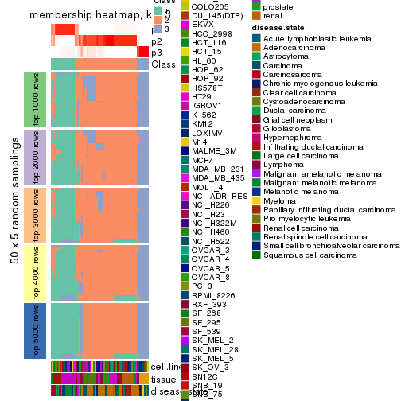</p>

</div>
<div id='tab-SD-mclust-membership-heatmap-3'>
<pre><code class="r">membership_heatmap(res, k = 4)
</code></pre>

<p></p>

</div>
<div id='tab-SD-mclust-membership-heatmap-4'>
<pre><code class="r">membership_heatmap(res, k = 5)
</code></pre>

<p></p>

</div>
<div id='tab-SD-mclust-membership-heatmap-5'>
<pre><code class="r">membership_heatmap(res, k = 6)
</code></pre>

<p></p>

</div>
</div>

As soon as we have had the classes for columns, we can look for signatures
which are significantly different between classes which can be candidate marks
for certain classes. Following are the heatmaps for signatures.


Signature heatmaps where rows are scaled:


<script>
$( function() {
	$( '#tabs-SD-mclust-get-signatures' ).tabs();
} );
</script>
<div id='tabs-SD-mclust-get-signatures'>
<ul>
<li><a href='#tab-SD-mclust-get-signatures-1'>k = 2</a></li>
<li><a href='#tab-SD-mclust-get-signatures-2'>k = 3</a></li>
<li><a href='#tab-SD-mclust-get-signatures-3'>k = 4</a></li>
<li><a href='#tab-SD-mclust-get-signatures-4'>k = 5</a></li>
<li><a href='#tab-SD-mclust-get-signatures-5'>k = 6</a></li>
</ul>
<div id='tab-SD-mclust-get-signatures-1'>
<pre><code class="r">get_signatures(res, k = 2)
</code></pre>

<p></p>

</div>
<div id='tab-SD-mclust-get-signatures-2'>
<pre><code class="r">get_signatures(res, k = 3)
</code></pre>

<pre><code>#&gt; Error: The width or height of the raster image is zero, maybe you forget to turn off the
#&gt; previous graphic device or it was corrupted. Run `dev.off()` to close it.
</code></pre>

<p></p>

</div>
<div id='tab-SD-mclust-get-signatures-3'>
<pre><code class="r">get_signatures(res, k = 4)
</code></pre>

<pre><code>#&gt; Error: The width or height of the raster image is zero, maybe you forget to turn off the
#&gt; previous graphic device or it was corrupted. Run `dev.off()` to close it.
</code></pre>

<p></p>

</div>
<div id='tab-SD-mclust-get-signatures-4'>
<pre><code class="r">get_signatures(res, k = 5)
</code></pre>

<pre><code>#&gt; Error: The width or height of the raster image is zero, maybe you forget to turn off the
#&gt; previous graphic device or it was corrupted. Run `dev.off()` to close it.
</code></pre>

<p></p>

</div>
<div id='tab-SD-mclust-get-signatures-5'>
<pre><code class="r">get_signatures(res, k = 6)
</code></pre>

<pre><code>#&gt; Error: The width or height of the raster image is zero, maybe you forget to turn off the
#&gt; previous graphic device or it was corrupted. Run `dev.off()` to close it.
</code></pre>

<p></p>

</div>
</div>


Signature heatmaps where rows are not scaled:


<script>
$( function() {
	$( '#tabs-SD-mclust-get-signatures-no-scale' ).tabs();
} );
</script>
<div id='tabs-SD-mclust-get-signatures-no-scale'>
<ul>
<li><a href='#tab-SD-mclust-get-signatures-no-scale-1'>k = 2</a></li>
<li><a href='#tab-SD-mclust-get-signatures-no-scale-2'>k = 3</a></li>
<li><a href='#tab-SD-mclust-get-signatures-no-scale-3'>k = 4</a></li>
<li><a href='#tab-SD-mclust-get-signatures-no-scale-4'>k = 5</a></li>
<li><a href='#tab-SD-mclust-get-signatures-no-scale-5'>k = 6</a></li>
</ul>
<div id='tab-SD-mclust-get-signatures-no-scale-1'>
<pre><code class="r">get_signatures(res, k = 2, scale_rows = FALSE)
</code></pre>

<p></p>

</div>
<div id='tab-SD-mclust-get-signatures-no-scale-2'>
<pre><code class="r">get_signatures(res, k = 3, scale_rows = FALSE)
</code></pre>

<p></p>

</div>
<div id='tab-SD-mclust-get-signatures-no-scale-3'>
<pre><code class="r">get_signatures(res, k = 4, scale_rows = FALSE)
</code></pre>

<p></p>

</div>
<div id='tab-SD-mclust-get-signatures-no-scale-4'>
<pre><code class="r">get_signatures(res, k = 5, scale_rows = FALSE)
</code></pre>

<p></p>

</div>
<div id='tab-SD-mclust-get-signatures-no-scale-5'>
<pre><code class="r">get_signatures(res, k = 6, scale_rows = FALSE)
</code></pre>

<p></p>

</div>
</div>


Compare the overlap of signatures from different k:

```r
compare_signatures(res)
```


`get_signature()` returns a data frame invisibly. TO get the list of signatures, the function
call should be assigned to a variable explicitly. In following code, if `plot` argument is set
to `FALSE`, no heatmap is plotted while only the differential analysis is performed.

```r
# code only for demonstration
tb = get_signature(res, k = ..., plot = FALSE)
```

An example of the output of `tb` is:

```
#>   which_row         fdr    mean_1    mean_2 scaled_mean_1 scaled_mean_2 km
#> 1        38 0.042760348  8.373488  9.131774    -0.5533452     0.5164555  1
#> 2        40 0.018707592  7.106213  8.469186    -0.6173731     0.5762149  1
#> 3        55 0.019134737 10.221463 11.207825    -0.6159697     0.5749050  1
#> 4        59 0.006059896  5.921854  7.869574    -0.6899429     0.6439467  1
#> 5        60 0.018055526  8.928898 10.211722    -0.6204761     0.5791110  1
#> 6        98 0.009384629 15.714769 14.887706     0.6635654    -0.6193277  2
...
```

The columns in `tb` are:

1. `which_row`: row indices corresponding to the input matrix.
2. `fdr`: FDR for the differential test. 
3. `mean_x`: The mean value in group x.
4. `scaled_mean_x`: The mean value in group x after rows are scaled.
5. `km`: Row groups if k-means clustering is applied to rows.


UMAP plot which shows how samples are separated.


<script>
$( function() {
	$( '#tabs-SD-mclust-dimension-reduction' ).tabs();
} );
</script>
<div id='tabs-SD-mclust-dimension-reduction'>
<ul>
<li><a href='#tab-SD-mclust-dimension-reduction-1'>k = 2</a></li>
<li><a href='#tab-SD-mclust-dimension-reduction-2'>k = 3</a></li>
<li><a href='#tab-SD-mclust-dimension-reduction-3'>k = 4</a></li>
<li><a href='#tab-SD-mclust-dimension-reduction-4'>k = 5</a></li>
<li><a href='#tab-SD-mclust-dimension-reduction-5'>k = 6</a></li>
</ul>
<div id='tab-SD-mclust-dimension-reduction-1'>
<pre><code class="r">dimension_reduction(res, k = 2, method = &quot;UMAP&quot;)
</code></pre>

<p></p>

</div>
<div id='tab-SD-mclust-dimension-reduction-2'>
<pre><code class="r">dimension_reduction(res, k = 3, method = &quot;UMAP&quot;)
</code></pre>

<p></p>

</div>
<div id='tab-SD-mclust-dimension-reduction-3'>
<pre><code class="r">dimension_reduction(res, k = 4, method = &quot;UMAP&quot;)
</code></pre>

<p></p>

</div>
<div id='tab-SD-mclust-dimension-reduction-4'>
<pre><code class="r">dimension_reduction(res, k = 5, method = &quot;UMAP&quot;)
</code></pre>

<p></p>

</div>
<div id='tab-SD-mclust-dimension-reduction-5'>
<pre><code class="r">dimension_reduction(res, k = 6, method = &quot;UMAP&quot;)
</code></pre>

<p></p>

</div>
</div>


Following heatmap shows how subgroups are split when increasing `k`:

```r
collect_classes(res)
```


Test correlation between subgroups and known annotations. If the known
annotation is numeric, one-way ANOVA test is applied, and if the known
annotation is discrete, chi-squared contingency table test is applied.

```r
test_to_known_factors(res)
```

```
#>             n cell.line(p) tissue(p) disease.state(p) k
#> SD:mclust 174     1.60e-13  2.28e-30         1.02e-24 2
#> SD:mclust 158     9.47e-23  9.74e-51         8.11e-39 3
#> SD:mclust 167     2.54e-34  4.15e-71         7.70e-51 4
#> SD:mclust 149     4.79e-40  1.06e-94         1.40e-55 5
#> SD:mclust 151     2.69e-50 9.56e-102         1.30e-57 6
```


If matrix rows can be associated to genes, consider to use `GO_Enrichment(res,
...)` to perform function enrichment for the signature genes.


 

---------------------------------------------------


### SD:NMF*


The object with results only for a single top-value method and a single partition method 
can be extracted as:

```r
res = res_list["SD", "NMF"]
# you can also extract it by
# res = res_list["SD:NMF"]
```

A summary of `res` and all the functions that can be applied to it:

```r
res
```

```
#> A 'ConsensusPartition' object with k = 2, 3, 4, 5, 6.
#>   On a matrix with 51941 rows and 174 columns.
#>   Top rows (1000, 2000, 3000, 4000, 5000) are extracted by 'SD' method.
#>   Subgroups are detected by 'NMF' method.
#>   Performed in total 1250 partitions by row resampling.
#>   Best k for subgroups seems to be 6.
#> 
#> Following methods can be applied to this 'ConsensusPartition' object:
#>  [1] "cola_report"             "collect_classes"         "collect_plots"          
#>  [4] "collect_stats"           "colnames"                "compare_signatures"     
#>  [7] "consensus_heatmap"       "dimension_reduction"     "functional_enrichment"  
#> [10] "get_anno_col"            "get_anno"                "get_classes"            
#> [13] "get_consensus"           "get_matrix"              "get_membership"         
#> [16] "get_param"               "get_signatures"          "get_stats"              
#> [19] "is_best_k"               "is_stable_k"             "membership_heatmap"     
#> [22] "ncol"                    "nrow"                    "plot_ecdf"              
#> [25] "rownames"                "select_partition_number" "show"                   
#> [28] "suggest_best_k"          "test_to_known_factors"
```

`collect_plots()` function collects all the plots made from `res` for all `k` (number of partitions)
into one single page to provide an easy and fast comparison between different `k`.

```r
collect_plots(res)
```


The plots are:

- The first row: a plot of the ECDF (Empirical cumulative distribution
  function) curves of the consensus matrix for each `k` and the heatmap of
  predicted classes for each `k`.
- The second row: heatmaps of the consensus matrix for each `k`.
- The third row: heatmaps of the membership matrix for each `k`.
- The fouth row: heatmaps of the signatures for each `k`.

All the plots in panels can be made by individual functions and they are
plotted later in this section.

`select_partition_number()` produces several plots showing different
statistics for choosing "optimized" `k`. There are following statistics:

- ECDF curves of the consensus matrix for each `k`;
- 1-PAC. [The PAC
  score](https://en.wikipedia.org/wiki/Consensus_clustering#Over-interpretation_potential_of_consensus_clustering)
  measures the proportion of the ambiguous subgrouping.
- Mean silhouette score.
- Concordance. The mean probability of fiting the consensus class ids in all
  partitions.
- Area increased. Denote $A_k$ as the area under the ECDF curve for current
  `k`, the area increased is defined as $A_k - A_{k-1}$.
- Rand index. The percent of pairs of samples that are both in a same cluster
  or both are not in a same cluster in the partition of k and k-1.
- Jaccard index. The ratio of pairs of samples are both in a same cluster in
  the partition of k and k-1 and the pairs of samples are both in a same
  cluster in the partition k or k-1.

The detailed explanations of these statistics can be found in [the cola
vignette](http://bioconductor.org/packages/devel/bioc/vignettes/cola/inst/doc/cola.html#toc_13).

Generally speaking, lower PAC score, higher mean silhouette score or higher
concordance corresponds to better partition. Rand index and Jaccard index
measure how similar the current partition is compared to partition with `k-1`.
If they are too similar, we won't accept `k` is better than `k-1`.

```r
select_partition_number(res)
```


The numeric values for all these statistics can be obtained by `get_stats()`.

```r
get_stats(res)
```

```
#>   k 1-PAC mean_silhouette concordance area_increased  Rand Jaccard
#> 2 2 0.837           0.888       0.956         0.4907 0.510   0.510
#> 3 3 1.000           0.980       0.991         0.3264 0.751   0.550
#> 4 4 0.828           0.917       0.930         0.0577 0.972   0.921
#> 5 5 0.764           0.757       0.889         0.1185 0.805   0.474
#> 6 6 0.926           0.892       0.951         0.0752 0.887   0.556
```

`suggest_best_k()` suggests the best $k$ based on these statistics. The rules are as follows:

- All $k$ with Jaccard index larger than 0.95 are removed because the increase of
  the partition number does not provides enough extra information. If all $k$ are removed,
  the best $k$ is assigned by `NA`.
- For $k$ with 1-PAC larger than 0.9, the maximal $k$ is taken as the "best k". Other $k$ is called "optional k".
- If it does not fit the second rule. The $k$ with the highest vote of highest
  1-PAC, mean silhouette and concordance is taken as the "best k".

```r
suggest_best_k(res)
```

```
#> [1] 6
#> attr(,"optional")
#> [1] 3
```

There is also optional best $k$ = 3 that is worth to check.

Following shows the table of the partitions (You need to click the **show/hide
code output** link to see it). The membership matrix (columns with name `p*`)
is inferred by
[`clue::cl_consensus()`](https://www.rdocumentation.org/link/cl_consensus?package=clue)
function with the `SE` method. Basically the value in the membership matrix
represents the probability to belong to a certain group. The finall class
label for an item is determined with the group with highest probability it
belongs to.

In `get_classes()` function, the entropy is calculated from the membership
matrix and the silhouette score is calculated from the consensus matrix.


<script>
$( function() {
	$( '#tabs-SD-NMF-get-classes' ).tabs();
} );
</script>
<div id='tabs-SD-NMF-get-classes'>
<ul>
<li><a href='#tab-SD-NMF-get-classes-1'>k = 2</a></li>
<li><a href='#tab-SD-NMF-get-classes-2'>k = 3</a></li>
<li><a href='#tab-SD-NMF-get-classes-3'>k = 4</a></li>
<li><a href='#tab-SD-NMF-get-classes-4'>k = 5</a></li>
<li><a href='#tab-SD-NMF-get-classes-5'>k = 6</a></li>
</ul>

<div id='tab-SD-NMF-get-classes-1'>
<p><a id='tab-SD-NMF-get-classes-1-a' style='color:#0366d6' href='#'>show/hide code output</a></p>
<pre><code class="r">cbind(get_classes(res, k = 2), get_membership(res, k = 2))
</code></pre>

<pre><code>#&gt;           class entropy silhouette    p1    p2
#&gt; GSM803615     1  0.9996     0.0273 0.512 0.488
#&gt; GSM803674     1  0.9998     0.0117 0.508 0.492
#&gt; GSM803733     1  0.9998     0.0117 0.508 0.492
#&gt; GSM803616     2  0.9850     0.2625 0.428 0.572
#&gt; GSM803675     2  0.9850     0.2625 0.428 0.572
#&gt; GSM803734     2  0.9661     0.3651 0.392 0.608
#&gt; GSM803617     1  0.9954     0.1315 0.540 0.460
#&gt; GSM803676     1  0.9954     0.1315 0.540 0.460
#&gt; GSM803735     2  0.9850     0.2625 0.428 0.572
#&gt; GSM803618     2  0.8327     0.6422 0.264 0.736
#&gt; GSM803677     2  0.8267     0.6490 0.260 0.740
#&gt; GSM803736     2  0.6801     0.7701 0.180 0.820
#&gt; GSM803619     1  0.7056     0.7431 0.808 0.192
#&gt; GSM803678     1  0.6973     0.7488 0.812 0.188
#&gt; GSM803737     1  0.7376     0.7196 0.792 0.208
#&gt; GSM803620     2  0.3274     0.9066 0.060 0.940
#&gt; GSM803679     2  0.3584     0.8993 0.068 0.932
#&gt; GSM803738     2  0.3584     0.8993 0.068 0.932
#&gt; GSM803621     1  0.0000     0.9526 1.000 0.000
#&gt; GSM803680     1  0.0000     0.9526 1.000 0.000
#&gt; GSM803739     1  0.0000     0.9526 1.000 0.000
#&gt; GSM803622     1  0.0000     0.9526 1.000 0.000
#&gt; GSM803681     1  0.0000     0.9526 1.000 0.000
#&gt; GSM803740     1  0.0000     0.9526 1.000 0.000
#&gt; GSM803623     2  0.0000     0.9518 0.000 1.000
#&gt; GSM803682     2  0.0000     0.9518 0.000 1.000
#&gt; GSM803741     2  0.0000     0.9518 0.000 1.000
#&gt; GSM803624     1  0.0000     0.9526 1.000 0.000
#&gt; GSM803683     1  0.0000     0.9526 1.000 0.000
#&gt; GSM803742     1  0.0000     0.9526 1.000 0.000
#&gt; GSM803625     1  0.0376     0.9496 0.996 0.004
#&gt; GSM803684     1  0.0376     0.9496 0.996 0.004
#&gt; GSM803743     1  0.0376     0.9496 0.996 0.004
#&gt; GSM803626     1  0.0000     0.9526 1.000 0.000
#&gt; GSM803685     1  0.0000     0.9526 1.000 0.000
#&gt; GSM803744     1  0.0000     0.9526 1.000 0.000
#&gt; GSM803627     1  0.0000     0.9526 1.000 0.000
#&gt; GSM803686     1  0.0000     0.9526 1.000 0.000
#&gt; GSM803745     1  0.0000     0.9526 1.000 0.000
#&gt; GSM803628     1  0.0000     0.9526 1.000 0.000
#&gt; GSM803687     1  0.0000     0.9526 1.000 0.000
#&gt; GSM803746     1  0.0000     0.9526 1.000 0.000
#&gt; GSM803629     1  0.0000     0.9526 1.000 0.000
#&gt; GSM803688     1  0.0000     0.9526 1.000 0.000
#&gt; GSM803747     1  0.0000     0.9526 1.000 0.000
#&gt; GSM803630     1  0.0000     0.9526 1.000 0.000
#&gt; GSM803689     1  0.0000     0.9526 1.000 0.000
#&gt; GSM803748     1  0.0000     0.9526 1.000 0.000
#&gt; GSM803631     1  0.0000     0.9526 1.000 0.000
#&gt; GSM803690     1  0.0000     0.9526 1.000 0.000
#&gt; GSM803749     1  0.0000     0.9526 1.000 0.000
#&gt; GSM803632     1  0.0000     0.9526 1.000 0.000
#&gt; GSM803691     1  0.0000     0.9526 1.000 0.000
#&gt; GSM803750     1  0.0000     0.9526 1.000 0.000
#&gt; GSM803633     2  0.0000     0.9518 0.000 1.000
#&gt; GSM803692     2  0.0000     0.9518 0.000 1.000
#&gt; GSM803751     2  0.0000     0.9518 0.000 1.000
#&gt; GSM803634     2  0.0000     0.9518 0.000 1.000
#&gt; GSM803693     2  0.0000     0.9518 0.000 1.000
#&gt; GSM803752     2  0.0000     0.9518 0.000 1.000
#&gt; GSM803635     2  0.0000     0.9518 0.000 1.000
#&gt; GSM803694     2  0.0000     0.9518 0.000 1.000
#&gt; GSM803753     2  0.0000     0.9518 0.000 1.000
#&gt; GSM803636     2  0.0000     0.9518 0.000 1.000
#&gt; GSM803695     2  0.0000     0.9518 0.000 1.000
#&gt; GSM803754     2  0.0000     0.9518 0.000 1.000
#&gt; GSM803637     2  0.0000     0.9518 0.000 1.000
#&gt; GSM803696     2  0.0000     0.9518 0.000 1.000
#&gt; GSM803755     2  0.0000     0.9518 0.000 1.000
#&gt; GSM803638     2  0.0000     0.9518 0.000 1.000
#&gt; GSM803697     2  0.0000     0.9518 0.000 1.000
#&gt; GSM803756     2  0.0000     0.9518 0.000 1.000
#&gt; GSM803639     2  0.0000     0.9518 0.000 1.000
#&gt; GSM803698     2  0.0000     0.9518 0.000 1.000
#&gt; GSM803757     2  0.0000     0.9518 0.000 1.000
#&gt; GSM803640     1  0.0000     0.9526 1.000 0.000
#&gt; GSM803699     1  0.0000     0.9526 1.000 0.000
#&gt; GSM803758     1  0.0000     0.9526 1.000 0.000
#&gt; GSM803641     1  0.0000     0.9526 1.000 0.000
#&gt; GSM803700     1  0.0000     0.9526 1.000 0.000
#&gt; GSM803759     1  0.0000     0.9526 1.000 0.000
#&gt; GSM803642     1  0.0000     0.9526 1.000 0.000
#&gt; GSM803701     1  0.0000     0.9526 1.000 0.000
#&gt; GSM803760     1  0.0376     0.9495 0.996 0.004
#&gt; GSM803643     1  0.0672     0.9463 0.992 0.008
#&gt; GSM803702     1  0.0672     0.9463 0.992 0.008
#&gt; GSM803644     1  0.0000     0.9526 1.000 0.000
#&gt; GSM803703     1  0.0000     0.9526 1.000 0.000
#&gt; GSM803761     1  0.0000     0.9526 1.000 0.000
#&gt; GSM803645     1  0.0000     0.9526 1.000 0.000
#&gt; GSM803704     1  0.0000     0.9526 1.000 0.000
#&gt; GSM803762     1  0.0000     0.9526 1.000 0.000
#&gt; GSM803646     2  0.2948     0.9120 0.052 0.948
#&gt; GSM803705     2  0.2603     0.9190 0.044 0.956
#&gt; GSM803763     2  0.2778     0.9156 0.048 0.952
#&gt; GSM803647     1  0.0000     0.9526 1.000 0.000
#&gt; GSM803706     1  0.0000     0.9526 1.000 0.000
#&gt; GSM803764     1  0.0000     0.9526 1.000 0.000
#&gt; GSM803648     2  0.0000     0.9518 0.000 1.000
#&gt; GSM803707     2  0.0000     0.9518 0.000 1.000
#&gt; GSM803765     2  0.0000     0.9518 0.000 1.000
#&gt; GSM803649     2  0.0000     0.9518 0.000 1.000
#&gt; GSM803708     2  0.0000     0.9518 0.000 1.000
#&gt; GSM803766     2  0.0000     0.9518 0.000 1.000
#&gt; GSM803650     1  0.0000     0.9526 1.000 0.000
#&gt; GSM803709     1  0.0000     0.9526 1.000 0.000
#&gt; GSM803767     1  0.0000     0.9526 1.000 0.000
#&gt; GSM803651     1  0.0000     0.9526 1.000 0.000
#&gt; GSM803710     1  0.0000     0.9526 1.000 0.000
#&gt; GSM803768     1  0.0000     0.9526 1.000 0.000
#&gt; GSM803652     1  0.0000     0.9526 1.000 0.000
#&gt; GSM803711     1  0.0000     0.9526 1.000 0.000
#&gt; GSM803653     1  0.9815     0.2843 0.580 0.420
#&gt; GSM803712     1  0.9522     0.4136 0.628 0.372
#&gt; GSM803769     1  0.7950     0.6755 0.760 0.240
#&gt; GSM803654     2  0.0000     0.9518 0.000 1.000
#&gt; GSM803713     2  0.0000     0.9518 0.000 1.000
#&gt; GSM803770     2  0.0000     0.9518 0.000 1.000
#&gt; GSM803655     2  0.2423     0.9245 0.040 0.960
#&gt; GSM803714     2  0.1414     0.9389 0.020 0.980
#&gt; GSM803771     2  0.2043     0.9305 0.032 0.968
#&gt; GSM803656     1  0.5294     0.8383 0.880 0.120
#&gt; GSM803715     1  0.5519     0.8292 0.872 0.128
#&gt; GSM803772     1  0.5408     0.8349 0.876 0.124
#&gt; GSM803657     2  0.0000     0.9518 0.000 1.000
#&gt; GSM803716     2  0.0000     0.9518 0.000 1.000
#&gt; GSM803773     2  0.0000     0.9518 0.000 1.000
#&gt; GSM803658     2  0.0000     0.9518 0.000 1.000
#&gt; GSM803717     2  0.0000     0.9518 0.000 1.000
#&gt; GSM803774     2  0.0000     0.9518 0.000 1.000
#&gt; GSM803659     2  0.0000     0.9518 0.000 1.000
#&gt; GSM803718     2  0.0000     0.9518 0.000 1.000
#&gt; GSM803775     2  0.0000     0.9518 0.000 1.000
#&gt; GSM803660     2  0.0000     0.9518 0.000 1.000
#&gt; GSM803719     2  0.0000     0.9518 0.000 1.000
#&gt; GSM803776     2  0.0000     0.9518 0.000 1.000
#&gt; GSM803661     1  0.0000     0.9526 1.000 0.000
#&gt; GSM803720     1  0.0000     0.9526 1.000 0.000
#&gt; GSM803777     1  0.0000     0.9526 1.000 0.000
#&gt; GSM803662     2  0.0000     0.9518 0.000 1.000
#&gt; GSM803732     2  0.7815     0.6852 0.232 0.768
#&gt; GSM803778     2  0.6623     0.7751 0.172 0.828
#&gt; GSM803663     2  0.0000     0.9518 0.000 1.000
#&gt; GSM803721     2  0.0000     0.9518 0.000 1.000
#&gt; GSM803779     2  0.0000     0.9518 0.000 1.000
#&gt; GSM803664     2  0.0000     0.9518 0.000 1.000
#&gt; GSM803722     2  0.0000     0.9518 0.000 1.000
#&gt; GSM803780     2  0.0000     0.9518 0.000 1.000
#&gt; GSM803665     1  0.0000     0.9526 1.000 0.000
#&gt; GSM803723     1  0.0000     0.9526 1.000 0.000
#&gt; GSM803781     1  0.0000     0.9526 1.000 0.000
#&gt; GSM803666     1  0.0000     0.9526 1.000 0.000
#&gt; GSM803724     1  0.0000     0.9526 1.000 0.000
#&gt; GSM803782     1  0.0000     0.9526 1.000 0.000
#&gt; GSM803667     1  0.0000     0.9526 1.000 0.000
#&gt; GSM803725     1  0.0000     0.9526 1.000 0.000
#&gt; GSM803783     1  0.0000     0.9526 1.000 0.000
#&gt; GSM803668     1  0.0000     0.9526 1.000 0.000
#&gt; GSM803726     1  0.0000     0.9526 1.000 0.000
#&gt; GSM803784     1  0.0000     0.9526 1.000 0.000
#&gt; GSM803669     1  0.0000     0.9526 1.000 0.000
#&gt; GSM803727     1  0.0000     0.9526 1.000 0.000
#&gt; GSM803670     1  0.0000     0.9526 1.000 0.000
#&gt; GSM803728     1  0.0000     0.9526 1.000 0.000
#&gt; GSM803785     1  0.0000     0.9526 1.000 0.000
#&gt; GSM803671     1  0.0000     0.9526 1.000 0.000
#&gt; GSM803729     1  0.0000     0.9526 1.000 0.000
#&gt; GSM803786     1  0.0000     0.9526 1.000 0.000
#&gt; GSM803672     1  0.0000     0.9526 1.000 0.000
#&gt; GSM803730     1  0.0000     0.9526 1.000 0.000
#&gt; GSM803787     1  0.0000     0.9526 1.000 0.000
#&gt; GSM803673     2  0.0000     0.9518 0.000 1.000
#&gt; GSM803731     2  0.0000     0.9518 0.000 1.000
#&gt; GSM803788     2  0.0000     0.9518 0.000 1.000
</code></pre>

<script>
$('#tab-SD-NMF-get-classes-1-a').parent().next().next().hide();
$('#tab-SD-NMF-get-classes-1-a').click(function(){
  $('#tab-SD-NMF-get-classes-1-a').parent().next().next().toggle();
  return(false);
});
</script>
</div>

<div id='tab-SD-NMF-get-classes-2'>
<p><a id='tab-SD-NMF-get-classes-2-a' style='color:#0366d6' href='#'>show/hide code output</a></p>
<pre><code class="r">cbind(get_classes(res, k = 3), get_membership(res, k = 3))
</code></pre>

<pre><code>#&gt;           class entropy silhouette    p1    p2    p3
#&gt; GSM803615     3  0.0000      0.999 0.000 0.000 1.000
#&gt; GSM803674     3  0.0000      0.999 0.000 0.000 1.000
#&gt; GSM803733     3  0.0000      0.999 0.000 0.000 1.000
#&gt; GSM803616     3  0.0000      0.999 0.000 0.000 1.000
#&gt; GSM803675     3  0.0000      0.999 0.000 0.000 1.000
#&gt; GSM803734     3  0.0000      0.999 0.000 0.000 1.000
#&gt; GSM803617     3  0.0000      0.999 0.000 0.000 1.000
#&gt; GSM803676     3  0.0000      0.999 0.000 0.000 1.000
#&gt; GSM803735     3  0.0000      0.999 0.000 0.000 1.000
#&gt; GSM803618     3  0.0000      0.999 0.000 0.000 1.000
#&gt; GSM803677     3  0.0000      0.999 0.000 0.000 1.000
#&gt; GSM803736     3  0.0000      0.999 0.000 0.000 1.000
#&gt; GSM803619     3  0.0424      0.991 0.008 0.000 0.992
#&gt; GSM803678     3  0.0237      0.995 0.004 0.000 0.996
#&gt; GSM803737     3  0.0424      0.991 0.008 0.000 0.992
#&gt; GSM803620     3  0.0000      0.999 0.000 0.000 1.000
#&gt; GSM803679     3  0.0000      0.999 0.000 0.000 1.000
#&gt; GSM803738     3  0.0000      0.999 0.000 0.000 1.000
#&gt; GSM803621     1  0.0000      0.991 1.000 0.000 0.000
#&gt; GSM803680     1  0.0000      0.991 1.000 0.000 0.000
#&gt; GSM803739     1  0.0000      0.991 1.000 0.000 0.000
#&gt; GSM803622     1  0.0000      0.991 1.000 0.000 0.000
#&gt; GSM803681     1  0.0000      0.991 1.000 0.000 0.000
#&gt; GSM803740     1  0.0000      0.991 1.000 0.000 0.000
#&gt; GSM803623     2  0.0000      0.980 0.000 1.000 0.000
#&gt; GSM803682     2  0.0000      0.980 0.000 1.000 0.000
#&gt; GSM803741     2  0.0000      0.980 0.000 1.000 0.000
#&gt; GSM803624     1  0.0000      0.991 1.000 0.000 0.000
#&gt; GSM803683     1  0.0000      0.991 1.000 0.000 0.000
#&gt; GSM803742     1  0.0000      0.991 1.000 0.000 0.000
#&gt; GSM803625     1  0.0000      0.991 1.000 0.000 0.000
#&gt; GSM803684     1  0.0000      0.991 1.000 0.000 0.000
#&gt; GSM803743     1  0.0000      0.991 1.000 0.000 0.000
#&gt; GSM803626     3  0.0000      0.999 0.000 0.000 1.000
#&gt; GSM803685     3  0.0000      0.999 0.000 0.000 1.000
#&gt; GSM803744     3  0.0000      0.999 0.000 0.000 1.000
#&gt; GSM803627     1  0.0000      0.991 1.000 0.000 0.000
#&gt; GSM803686     1  0.0000      0.991 1.000 0.000 0.000
#&gt; GSM803745     1  0.0000      0.991 1.000 0.000 0.000
#&gt; GSM803628     1  0.0000      0.991 1.000 0.000 0.000
#&gt; GSM803687     1  0.0000      0.991 1.000 0.000 0.000
#&gt; GSM803746     1  0.0000      0.991 1.000 0.000 0.000
#&gt; GSM803629     1  0.0000      0.991 1.000 0.000 0.000
#&gt; GSM803688     1  0.0000      0.991 1.000 0.000 0.000
#&gt; GSM803747     1  0.0000      0.991 1.000 0.000 0.000
#&gt; GSM803630     1  0.0000      0.991 1.000 0.000 0.000
#&gt; GSM803689     1  0.0000      0.991 1.000 0.000 0.000
#&gt; GSM803748     1  0.0000      0.991 1.000 0.000 0.000
#&gt; GSM803631     1  0.0000      0.991 1.000 0.000 0.000
#&gt; GSM803690     1  0.0000      0.991 1.000 0.000 0.000
#&gt; GSM803749     1  0.0000      0.991 1.000 0.000 0.000
#&gt; GSM803632     1  0.0000      0.991 1.000 0.000 0.000
#&gt; GSM803691     1  0.0000      0.991 1.000 0.000 0.000
#&gt; GSM803750     1  0.0000      0.991 1.000 0.000 0.000
#&gt; GSM803633     2  0.0000      0.980 0.000 1.000 0.000
#&gt; GSM803692     2  0.0000      0.980 0.000 1.000 0.000
#&gt; GSM803751     2  0.0000      0.980 0.000 1.000 0.000
#&gt; GSM803634     2  0.0000      0.980 0.000 1.000 0.000
#&gt; GSM803693     2  0.0000      0.980 0.000 1.000 0.000
#&gt; GSM803752     2  0.0000      0.980 0.000 1.000 0.000
#&gt; GSM803635     2  0.0000      0.980 0.000 1.000 0.000
#&gt; GSM803694     2  0.0000      0.980 0.000 1.000 0.000
#&gt; GSM803753     2  0.0000      0.980 0.000 1.000 0.000
#&gt; GSM803636     2  0.0000      0.980 0.000 1.000 0.000
#&gt; GSM803695     2  0.0000      0.980 0.000 1.000 0.000
#&gt; GSM803754     2  0.0000      0.980 0.000 1.000 0.000
#&gt; GSM803637     2  0.0000      0.980 0.000 1.000 0.000
#&gt; GSM803696     2  0.0000      0.980 0.000 1.000 0.000
#&gt; GSM803755     2  0.0000      0.980 0.000 1.000 0.000
#&gt; GSM803638     2  0.0000      0.980 0.000 1.000 0.000
#&gt; GSM803697     2  0.0000      0.980 0.000 1.000 0.000
#&gt; GSM803756     2  0.0000      0.980 0.000 1.000 0.000
#&gt; GSM803639     2  0.0000      0.980 0.000 1.000 0.000
#&gt; GSM803698     2  0.0000      0.980 0.000 1.000 0.000
#&gt; GSM803757     2  0.0000      0.980 0.000 1.000 0.000
#&gt; GSM803640     1  0.0000      0.991 1.000 0.000 0.000
#&gt; GSM803699     1  0.0000      0.991 1.000 0.000 0.000
#&gt; GSM803758     1  0.0000      0.991 1.000 0.000 0.000
#&gt; GSM803641     1  0.0000      0.991 1.000 0.000 0.000
#&gt; GSM803700     1  0.0000      0.991 1.000 0.000 0.000
#&gt; GSM803759     1  0.0000      0.991 1.000 0.000 0.000
#&gt; GSM803642     1  0.0000      0.991 1.000 0.000 0.000
#&gt; GSM803701     1  0.0000      0.991 1.000 0.000 0.000
#&gt; GSM803760     1  0.0000      0.991 1.000 0.000 0.000
#&gt; GSM803643     1  0.0000      0.991 1.000 0.000 0.000
#&gt; GSM803702     1  0.0000      0.991 1.000 0.000 0.000
#&gt; GSM803644     1  0.0000      0.991 1.000 0.000 0.000
#&gt; GSM803703     1  0.0000      0.991 1.000 0.000 0.000
#&gt; GSM803761     1  0.0000      0.991 1.000 0.000 0.000
#&gt; GSM803645     1  0.0000      0.991 1.000 0.000 0.000
#&gt; GSM803704     1  0.0000      0.991 1.000 0.000 0.000
#&gt; GSM803762     1  0.0000      0.991 1.000 0.000 0.000
#&gt; GSM803646     1  0.0000      0.991 1.000 0.000 0.000
#&gt; GSM803705     1  0.0000      0.991 1.000 0.000 0.000
#&gt; GSM803763     1  0.0000      0.991 1.000 0.000 0.000
#&gt; GSM803647     1  0.0000      0.991 1.000 0.000 0.000
#&gt; GSM803706     1  0.0000      0.991 1.000 0.000 0.000
#&gt; GSM803764     1  0.0000      0.991 1.000 0.000 0.000
#&gt; GSM803648     2  0.0000      0.980 0.000 1.000 0.000
#&gt; GSM803707     2  0.0000      0.980 0.000 1.000 0.000
#&gt; GSM803765     2  0.0000      0.980 0.000 1.000 0.000
#&gt; GSM803649     2  0.2261      0.916 0.068 0.932 0.000
#&gt; GSM803708     2  0.2165      0.920 0.064 0.936 0.000
#&gt; GSM803766     2  0.1964      0.928 0.056 0.944 0.000
#&gt; GSM803650     1  0.0000      0.991 1.000 0.000 0.000
#&gt; GSM803709     1  0.0000      0.991 1.000 0.000 0.000
#&gt; GSM803767     1  0.0000      0.991 1.000 0.000 0.000
#&gt; GSM803651     1  0.0000      0.991 1.000 0.000 0.000
#&gt; GSM803710     1  0.0000      0.991 1.000 0.000 0.000
#&gt; GSM803768     1  0.0000      0.991 1.000 0.000 0.000
#&gt; GSM803652     1  0.0000      0.991 1.000 0.000 0.000
#&gt; GSM803711     1  0.0000      0.991 1.000 0.000 0.000
#&gt; GSM803653     1  0.4002      0.813 0.840 0.160 0.000
#&gt; GSM803712     1  0.4121      0.802 0.832 0.168 0.000
#&gt; GSM803769     1  0.2356      0.923 0.928 0.072 0.000
#&gt; GSM803654     2  0.0000      0.980 0.000 1.000 0.000
#&gt; GSM803713     2  0.0000      0.980 0.000 1.000 0.000
#&gt; GSM803770     2  0.0000      0.980 0.000 1.000 0.000
#&gt; GSM803655     2  0.4605      0.755 0.204 0.796 0.000
#&gt; GSM803714     2  0.3752      0.831 0.144 0.856 0.000
#&gt; GSM803771     2  0.4291      0.788 0.180 0.820 0.000
#&gt; GSM803656     1  0.1964      0.939 0.944 0.056 0.000
#&gt; GSM803715     1  0.2356      0.923 0.928 0.072 0.000
#&gt; GSM803772     1  0.2261      0.927 0.932 0.068 0.000
#&gt; GSM803657     2  0.0000      0.980 0.000 1.000 0.000
#&gt; GSM803716     2  0.0000      0.980 0.000 1.000 0.000
#&gt; GSM803773     2  0.0000      0.980 0.000 1.000 0.000
#&gt; GSM803658     2  0.0000      0.980 0.000 1.000 0.000
#&gt; GSM803717     2  0.0000      0.980 0.000 1.000 0.000
#&gt; GSM803774     2  0.0000      0.980 0.000 1.000 0.000
#&gt; GSM803659     2  0.0000      0.980 0.000 1.000 0.000
#&gt; GSM803718     2  0.0000      0.980 0.000 1.000 0.000
#&gt; GSM803775     2  0.0000      0.980 0.000 1.000 0.000
#&gt; GSM803660     2  0.0000      0.980 0.000 1.000 0.000
#&gt; GSM803719     2  0.0000      0.980 0.000 1.000 0.000
#&gt; GSM803776     2  0.0000      0.980 0.000 1.000 0.000
#&gt; GSM803661     1  0.0000      0.991 1.000 0.000 0.000
#&gt; GSM803720     1  0.0000      0.991 1.000 0.000 0.000
#&gt; GSM803777     1  0.0000      0.991 1.000 0.000 0.000
#&gt; GSM803662     2  0.5291      0.643 0.268 0.732 0.000
#&gt; GSM803732     1  0.0000      0.991 1.000 0.000 0.000
#&gt; GSM803778     1  0.0000      0.991 1.000 0.000 0.000
#&gt; GSM803663     2  0.0000      0.980 0.000 1.000 0.000
#&gt; GSM803721     2  0.0000      0.980 0.000 1.000 0.000
#&gt; GSM803779     2  0.0000      0.980 0.000 1.000 0.000
#&gt; GSM803664     2  0.0000      0.980 0.000 1.000 0.000
#&gt; GSM803722     2  0.0000      0.980 0.000 1.000 0.000
#&gt; GSM803780     2  0.0000      0.980 0.000 1.000 0.000
#&gt; GSM803665     1  0.0000      0.991 1.000 0.000 0.000
#&gt; GSM803723     1  0.0000      0.991 1.000 0.000 0.000
#&gt; GSM803781     1  0.0000      0.991 1.000 0.000 0.000
#&gt; GSM803666     3  0.0000      0.999 0.000 0.000 1.000
#&gt; GSM803724     3  0.0000      0.999 0.000 0.000 1.000
#&gt; GSM803782     3  0.0000      0.999 0.000 0.000 1.000
#&gt; GSM803667     3  0.0000      0.999 0.000 0.000 1.000
#&gt; GSM803725     3  0.0000      0.999 0.000 0.000 1.000
#&gt; GSM803783     3  0.0000      0.999 0.000 0.000 1.000
#&gt; GSM803668     3  0.0000      0.999 0.000 0.000 1.000
#&gt; GSM803726     3  0.0000      0.999 0.000 0.000 1.000
#&gt; GSM803784     3  0.0000      0.999 0.000 0.000 1.000
#&gt; GSM803669     3  0.0000      0.999 0.000 0.000 1.000
#&gt; GSM803727     3  0.0000      0.999 0.000 0.000 1.000
#&gt; GSM803670     3  0.0000      0.999 0.000 0.000 1.000
#&gt; GSM803728     3  0.0000      0.999 0.000 0.000 1.000
#&gt; GSM803785     3  0.0000      0.999 0.000 0.000 1.000
#&gt; GSM803671     3  0.0000      0.999 0.000 0.000 1.000
#&gt; GSM803729     3  0.0000      0.999 0.000 0.000 1.000
#&gt; GSM803786     3  0.0000      0.999 0.000 0.000 1.000
#&gt; GSM803672     3  0.0000      0.999 0.000 0.000 1.000
#&gt; GSM803730     3  0.0000      0.999 0.000 0.000 1.000
#&gt; GSM803787     3  0.0000      0.999 0.000 0.000 1.000
#&gt; GSM803673     2  0.0000      0.980 0.000 1.000 0.000
#&gt; GSM803731     2  0.0000      0.980 0.000 1.000 0.000
#&gt; GSM803788     2  0.0000      0.980 0.000 1.000 0.000
</code></pre>

<script>
$('#tab-SD-NMF-get-classes-2-a').parent().next().next().hide();
$('#tab-SD-NMF-get-classes-2-a').click(function(){
  $('#tab-SD-NMF-get-classes-2-a').parent().next().next().toggle();
  return(false);
});
</script>
</div>

<div id='tab-SD-NMF-get-classes-3'>
<p><a id='tab-SD-NMF-get-classes-3-a' style='color:#0366d6' href='#'>show/hide code output</a></p>
<pre><code class="r">cbind(get_classes(res, k = 4), get_membership(res, k = 4))
</code></pre>

<pre><code>#&gt;           class entropy silhouette    p1    p2    p3    p4
#&gt; GSM803615     4  0.3102      0.972 0.008 0.004 0.116 0.872
#&gt; GSM803674     4  0.2958      0.974 0.004 0.004 0.116 0.876
#&gt; GSM803733     4  0.2773      0.975 0.000 0.004 0.116 0.880
#&gt; GSM803616     4  0.2918      0.975 0.000 0.008 0.116 0.876
#&gt; GSM803675     4  0.2918      0.975 0.000 0.008 0.116 0.876
#&gt; GSM803734     4  0.2918      0.975 0.000 0.008 0.116 0.876
#&gt; GSM803617     4  0.3224      0.960 0.016 0.000 0.120 0.864
#&gt; GSM803676     4  0.3224      0.960 0.016 0.000 0.120 0.864
#&gt; GSM803735     4  0.2918      0.975 0.000 0.008 0.116 0.876
#&gt; GSM803618     4  0.3215      0.959 0.000 0.032 0.092 0.876
#&gt; GSM803677     4  0.3215      0.959 0.000 0.032 0.092 0.876
#&gt; GSM803736     4  0.3099      0.970 0.000 0.020 0.104 0.876
#&gt; GSM803619     4  0.3404      0.952 0.032 0.000 0.104 0.864
#&gt; GSM803678     4  0.3404      0.952 0.032 0.000 0.104 0.864
#&gt; GSM803737     4  0.3404      0.952 0.032 0.000 0.104 0.864
#&gt; GSM803620     4  0.3048      0.973 0.000 0.016 0.108 0.876
#&gt; GSM803679     4  0.3048      0.973 0.000 0.016 0.108 0.876
#&gt; GSM803738     4  0.3099      0.971 0.000 0.020 0.104 0.876
#&gt; GSM803621     1  0.1716      0.919 0.936 0.000 0.000 0.064
#&gt; GSM803680     1  0.1716      0.919 0.936 0.000 0.000 0.064
#&gt; GSM803739     1  0.1716      0.919 0.936 0.000 0.000 0.064
#&gt; GSM803622     1  0.1716      0.919 0.936 0.000 0.000 0.064
#&gt; GSM803681     1  0.1716      0.919 0.936 0.000 0.000 0.064
#&gt; GSM803740     1  0.1716      0.919 0.936 0.000 0.000 0.064
#&gt; GSM803623     2  0.1211      0.922 0.000 0.960 0.000 0.040
#&gt; GSM803682     2  0.1211      0.922 0.000 0.960 0.000 0.040
#&gt; GSM803741     2  0.1211      0.922 0.000 0.960 0.000 0.040
#&gt; GSM803624     1  0.2670      0.902 0.908 0.040 0.000 0.052
#&gt; GSM803683     1  0.2586      0.904 0.912 0.040 0.000 0.048
#&gt; GSM803742     1  0.2670      0.902 0.908 0.040 0.000 0.052
#&gt; GSM803625     1  0.0524      0.924 0.988 0.008 0.000 0.004
#&gt; GSM803684     1  0.0524      0.924 0.988 0.008 0.000 0.004
#&gt; GSM803743     1  0.0804      0.924 0.980 0.012 0.000 0.008
#&gt; GSM803626     3  0.0000      0.994 0.000 0.000 1.000 0.000
#&gt; GSM803685     3  0.2660      0.863 0.036 0.000 0.908 0.056
#&gt; GSM803744     3  0.0000      0.994 0.000 0.000 1.000 0.000
#&gt; GSM803627     1  0.1716      0.919 0.936 0.000 0.000 0.064
#&gt; GSM803686     1  0.1716      0.919 0.936 0.000 0.000 0.064
#&gt; GSM803745     1  0.1716      0.919 0.936 0.000 0.000 0.064
#&gt; GSM803628     1  0.1716      0.919 0.936 0.000 0.000 0.064
#&gt; GSM803687     1  0.1716      0.919 0.936 0.000 0.000 0.064
#&gt; GSM803746     1  0.1716      0.919 0.936 0.000 0.000 0.064
#&gt; GSM803629     1  0.1716      0.919 0.936 0.000 0.000 0.064
#&gt; GSM803688     1  0.1716      0.919 0.936 0.000 0.000 0.064
#&gt; GSM803747     1  0.1716      0.919 0.936 0.000 0.000 0.064
#&gt; GSM803630     1  0.1716      0.919 0.936 0.000 0.000 0.064
#&gt; GSM803689     1  0.1716      0.919 0.936 0.000 0.000 0.064
#&gt; GSM803748     1  0.1716      0.919 0.936 0.000 0.000 0.064
#&gt; GSM803631     1  0.1716      0.919 0.936 0.000 0.000 0.064
#&gt; GSM803690     1  0.1716      0.919 0.936 0.000 0.000 0.064
#&gt; GSM803749     1  0.1716      0.919 0.936 0.000 0.000 0.064
#&gt; GSM803632     1  0.1716      0.919 0.936 0.000 0.000 0.064
#&gt; GSM803691     1  0.1716      0.919 0.936 0.000 0.000 0.064
#&gt; GSM803750     1  0.1716      0.919 0.936 0.000 0.000 0.064
#&gt; GSM803633     2  0.1211      0.921 0.000 0.960 0.000 0.040
#&gt; GSM803692     2  0.1211      0.921 0.000 0.960 0.000 0.040
#&gt; GSM803751     2  0.1211      0.921 0.000 0.960 0.000 0.040
#&gt; GSM803634     2  0.1211      0.921 0.000 0.960 0.000 0.040
#&gt; GSM803693     2  0.1211      0.921 0.000 0.960 0.000 0.040
#&gt; GSM803752     2  0.1211      0.921 0.000 0.960 0.000 0.040
#&gt; GSM803635     2  0.1211      0.921 0.000 0.960 0.000 0.040
#&gt; GSM803694     2  0.1211      0.921 0.000 0.960 0.000 0.040
#&gt; GSM803753     2  0.1211      0.921 0.000 0.960 0.000 0.040
#&gt; GSM803636     2  0.1211      0.921 0.000 0.960 0.000 0.040
#&gt; GSM803695     2  0.1211      0.921 0.000 0.960 0.000 0.040
#&gt; GSM803754     2  0.1211      0.921 0.000 0.960 0.000 0.040
#&gt; GSM803637     2  0.1211      0.921 0.000 0.960 0.000 0.040
#&gt; GSM803696     2  0.1211      0.921 0.000 0.960 0.000 0.040
#&gt; GSM803755     2  0.1211      0.921 0.000 0.960 0.000 0.040
#&gt; GSM803638     2  0.1211      0.921 0.000 0.960 0.000 0.040
#&gt; GSM803697     2  0.1211      0.921 0.000 0.960 0.000 0.040
#&gt; GSM803756     2  0.1211      0.921 0.000 0.960 0.000 0.040
#&gt; GSM803639     2  0.1211      0.921 0.000 0.960 0.000 0.040
#&gt; GSM803698     2  0.1211      0.921 0.000 0.960 0.000 0.040
#&gt; GSM803757     2  0.1211      0.921 0.000 0.960 0.000 0.040
#&gt; GSM803640     1  0.1833      0.918 0.944 0.024 0.000 0.032
#&gt; GSM803699     1  0.1833      0.918 0.944 0.024 0.000 0.032
#&gt; GSM803758     1  0.1833      0.918 0.944 0.024 0.000 0.032
#&gt; GSM803641     1  0.1510      0.921 0.956 0.016 0.000 0.028
#&gt; GSM803700     1  0.1510      0.921 0.956 0.016 0.000 0.028
#&gt; GSM803759     1  0.1406      0.921 0.960 0.016 0.000 0.024
#&gt; GSM803642     1  0.2224      0.912 0.928 0.032 0.000 0.040
#&gt; GSM803701     1  0.2224      0.912 0.928 0.032 0.000 0.040
#&gt; GSM803760     1  0.2124      0.913 0.932 0.028 0.000 0.040
#&gt; GSM803643     1  0.2224      0.912 0.928 0.032 0.000 0.040
#&gt; GSM803702     1  0.2224      0.912 0.928 0.032 0.000 0.040
#&gt; GSM803644     1  0.0000      0.924 1.000 0.000 0.000 0.000
#&gt; GSM803703     1  0.0000      0.924 1.000 0.000 0.000 0.000
#&gt; GSM803761     1  0.0188      0.924 0.996 0.000 0.000 0.004
#&gt; GSM803645     1  0.1452      0.921 0.956 0.008 0.000 0.036
#&gt; GSM803704     1  0.1706      0.919 0.948 0.016 0.000 0.036
#&gt; GSM803762     1  0.1706      0.919 0.948 0.016 0.000 0.036
#&gt; GSM803646     1  0.2411      0.908 0.920 0.040 0.000 0.040
#&gt; GSM803705     1  0.2411      0.908 0.920 0.040 0.000 0.040
#&gt; GSM803763     1  0.2500      0.907 0.916 0.044 0.000 0.040
#&gt; GSM803647     1  0.2124      0.913 0.932 0.028 0.000 0.040
#&gt; GSM803706     1  0.2124      0.913 0.932 0.028 0.000 0.040
#&gt; GSM803764     1  0.2124      0.913 0.932 0.028 0.000 0.040
#&gt; GSM803648     2  0.2926      0.890 0.056 0.896 0.000 0.048
#&gt; GSM803707     2  0.3009      0.889 0.056 0.892 0.000 0.052
#&gt; GSM803765     2  0.2926      0.890 0.056 0.896 0.000 0.048
#&gt; GSM803649     2  0.3164      0.881 0.064 0.884 0.000 0.052
#&gt; GSM803708     2  0.3164      0.881 0.064 0.884 0.000 0.052
#&gt; GSM803766     2  0.3164      0.881 0.064 0.884 0.000 0.052
#&gt; GSM803650     1  0.1637      0.920 0.940 0.000 0.000 0.060
#&gt; GSM803709     1  0.1637      0.920 0.940 0.000 0.000 0.060
#&gt; GSM803767     1  0.1637      0.920 0.940 0.000 0.000 0.060
#&gt; GSM803651     1  0.0336      0.924 0.992 0.000 0.000 0.008
#&gt; GSM803710     1  0.0336      0.924 0.992 0.000 0.000 0.008
#&gt; GSM803768     1  0.0336      0.924 0.992 0.000 0.000 0.008
#&gt; GSM803652     1  0.0921      0.922 0.972 0.000 0.000 0.028
#&gt; GSM803711     1  0.0921      0.922 0.972 0.000 0.000 0.028
#&gt; GSM803653     1  0.5866      0.487 0.624 0.324 0.000 0.052
#&gt; GSM803712     1  0.5847      0.496 0.628 0.320 0.000 0.052
#&gt; GSM803769     1  0.4907      0.760 0.764 0.176 0.000 0.060
#&gt; GSM803654     2  0.1022      0.922 0.000 0.968 0.000 0.032
#&gt; GSM803713     2  0.1022      0.922 0.000 0.968 0.000 0.032
#&gt; GSM803770     2  0.0921      0.922 0.000 0.972 0.000 0.028
#&gt; GSM803655     2  0.5358      0.631 0.252 0.700 0.000 0.048
#&gt; GSM803714     2  0.5031      0.687 0.212 0.740 0.000 0.048
#&gt; GSM803771     2  0.5328      0.629 0.248 0.704 0.000 0.048
#&gt; GSM803656     1  0.4547      0.837 0.804 0.104 0.000 0.092
#&gt; GSM803715     1  0.4805      0.810 0.784 0.132 0.000 0.084
#&gt; GSM803772     1  0.4608      0.834 0.800 0.104 0.000 0.096
#&gt; GSM803657     2  0.2928      0.891 0.052 0.896 0.000 0.052
#&gt; GSM803716     2  0.2844      0.893 0.048 0.900 0.000 0.052
#&gt; GSM803773     2  0.3088      0.886 0.060 0.888 0.000 0.052
#&gt; GSM803658     2  0.1807      0.908 0.008 0.940 0.000 0.052
#&gt; GSM803717     2  0.1807      0.908 0.008 0.940 0.000 0.052
#&gt; GSM803774     2  0.1807      0.908 0.008 0.940 0.000 0.052
#&gt; GSM803659     2  0.2670      0.896 0.040 0.908 0.000 0.052
#&gt; GSM803718     2  0.2670      0.896 0.040 0.908 0.000 0.052
#&gt; GSM803775     2  0.2670      0.896 0.040 0.908 0.000 0.052
#&gt; GSM803660     2  0.2021      0.910 0.040 0.936 0.000 0.024
#&gt; GSM803719     2  0.2399      0.905 0.048 0.920 0.000 0.032
#&gt; GSM803776     2  0.2032      0.910 0.036 0.936 0.000 0.028
#&gt; GSM803661     1  0.2670      0.902 0.908 0.040 0.000 0.052
#&gt; GSM803720     1  0.2670      0.902 0.908 0.040 0.000 0.052
#&gt; GSM803777     1  0.2670      0.902 0.908 0.040 0.000 0.052
#&gt; GSM803662     2  0.3840      0.842 0.104 0.844 0.000 0.052
#&gt; GSM803732     1  0.2670      0.902 0.908 0.040 0.000 0.052
#&gt; GSM803778     1  0.2844      0.896 0.900 0.048 0.000 0.052
#&gt; GSM803663     2  0.3088      0.886 0.060 0.888 0.000 0.052
#&gt; GSM803721     2  0.3088      0.886 0.060 0.888 0.000 0.052
#&gt; GSM803779     2  0.3088      0.886 0.060 0.888 0.000 0.052
#&gt; GSM803664     2  0.1022      0.923 0.000 0.968 0.000 0.032
#&gt; GSM803722     2  0.1022      0.923 0.000 0.968 0.000 0.032
#&gt; GSM803780     2  0.1118      0.922 0.000 0.964 0.000 0.036
#&gt; GSM803665     1  0.1716      0.919 0.936 0.000 0.000 0.064
#&gt; GSM803723     1  0.1637      0.920 0.940 0.000 0.000 0.060
#&gt; GSM803781     1  0.1637      0.920 0.940 0.000 0.000 0.060
#&gt; GSM803666     3  0.0000      0.994 0.000 0.000 1.000 0.000
#&gt; GSM803724     3  0.0000      0.994 0.000 0.000 1.000 0.000
#&gt; GSM803782     3  0.0000      0.994 0.000 0.000 1.000 0.000
#&gt; GSM803667     3  0.0000      0.994 0.000 0.000 1.000 0.000
#&gt; GSM803725     3  0.0000      0.994 0.000 0.000 1.000 0.000
#&gt; GSM803783     3  0.0000      0.994 0.000 0.000 1.000 0.000
#&gt; GSM803668     3  0.0000      0.994 0.000 0.000 1.000 0.000
#&gt; GSM803726     3  0.0000      0.994 0.000 0.000 1.000 0.000
#&gt; GSM803784     3  0.0000      0.994 0.000 0.000 1.000 0.000
#&gt; GSM803669     3  0.0000      0.994 0.000 0.000 1.000 0.000
#&gt; GSM803727     3  0.0000      0.994 0.000 0.000 1.000 0.000
#&gt; GSM803670     3  0.0000      0.994 0.000 0.000 1.000 0.000
#&gt; GSM803728     3  0.0000      0.994 0.000 0.000 1.000 0.000
#&gt; GSM803785     3  0.0000      0.994 0.000 0.000 1.000 0.000
#&gt; GSM803671     3  0.0000      0.994 0.000 0.000 1.000 0.000
#&gt; GSM803729     3  0.0000      0.994 0.000 0.000 1.000 0.000
#&gt; GSM803786     3  0.0000      0.994 0.000 0.000 1.000 0.000
#&gt; GSM803672     3  0.0000      0.994 0.000 0.000 1.000 0.000
#&gt; GSM803730     3  0.0000      0.994 0.000 0.000 1.000 0.000
#&gt; GSM803787     3  0.0188      0.988 0.000 0.000 0.996 0.004
#&gt; GSM803673     2  0.0817      0.921 0.000 0.976 0.000 0.024
#&gt; GSM803731     2  0.0817      0.921 0.000 0.976 0.000 0.024
#&gt; GSM803788     2  0.0817      0.921 0.000 0.976 0.000 0.024
</code></pre>

<script>
$('#tab-SD-NMF-get-classes-3-a').parent().next().next().hide();
$('#tab-SD-NMF-get-classes-3-a').click(function(){
  $('#tab-SD-NMF-get-classes-3-a').parent().next().next().toggle();
  return(false);
});
</script>
</div>

<div id='tab-SD-NMF-get-classes-4'>
<p><a id='tab-SD-NMF-get-classes-4-a' style='color:#0366d6' href='#'>show/hide code output</a></p>
<pre><code class="r">cbind(get_classes(res, k = 5), get_membership(res, k = 5))
</code></pre>

<pre><code>#&gt;           class entropy silhouette    p1    p2    p3    p4    p5
#&gt; GSM803615     4  0.0510     0.9990 0.000 0.000 0.016 0.984 0.000
#&gt; GSM803674     4  0.0510     0.9990 0.000 0.000 0.016 0.984 0.000
#&gt; GSM803733     4  0.0510     0.9990 0.000 0.000 0.016 0.984 0.000
#&gt; GSM803616     4  0.0510     0.9990 0.000 0.000 0.016 0.984 0.000
#&gt; GSM803675     4  0.0510     0.9990 0.000 0.000 0.016 0.984 0.000
#&gt; GSM803734     4  0.0510     0.9990 0.000 0.000 0.016 0.984 0.000
#&gt; GSM803617     4  0.0510     0.9990 0.000 0.000 0.016 0.984 0.000
#&gt; GSM803676     4  0.0510     0.9990 0.000 0.000 0.016 0.984 0.000
#&gt; GSM803735     4  0.0510     0.9990 0.000 0.000 0.016 0.984 0.000
#&gt; GSM803618     4  0.0510     0.9990 0.000 0.000 0.016 0.984 0.000
#&gt; GSM803677     4  0.0510     0.9990 0.000 0.000 0.016 0.984 0.000
#&gt; GSM803736     4  0.0510     0.9990 0.000 0.000 0.016 0.984 0.000
#&gt; GSM803619     4  0.0404     0.9952 0.000 0.000 0.012 0.988 0.000
#&gt; GSM803678     4  0.0404     0.9952 0.000 0.000 0.012 0.988 0.000
#&gt; GSM803737     4  0.0404     0.9952 0.000 0.000 0.012 0.988 0.000
#&gt; GSM803620     4  0.0510     0.9990 0.000 0.000 0.016 0.984 0.000
#&gt; GSM803679     4  0.0510     0.9990 0.000 0.000 0.016 0.984 0.000
#&gt; GSM803738     4  0.0510     0.9990 0.000 0.000 0.016 0.984 0.000
#&gt; GSM803621     1  0.0000     0.8511 1.000 0.000 0.000 0.000 0.000
#&gt; GSM803680     1  0.0000     0.8511 1.000 0.000 0.000 0.000 0.000
#&gt; GSM803739     1  0.0000     0.8511 1.000 0.000 0.000 0.000 0.000
#&gt; GSM803622     1  0.0000     0.8511 1.000 0.000 0.000 0.000 0.000
#&gt; GSM803681     1  0.0000     0.8511 1.000 0.000 0.000 0.000 0.000
#&gt; GSM803740     1  0.0000     0.8511 1.000 0.000 0.000 0.000 0.000
#&gt; GSM803623     2  0.3774     0.6599 0.000 0.704 0.000 0.000 0.296
#&gt; GSM803682     2  0.3796     0.6543 0.000 0.700 0.000 0.000 0.300
#&gt; GSM803741     2  0.3774     0.6599 0.000 0.704 0.000 0.000 0.296
#&gt; GSM803624     5  0.0290     0.7286 0.000 0.000 0.000 0.008 0.992
#&gt; GSM803683     5  0.0451     0.7283 0.008 0.000 0.000 0.004 0.988
#&gt; GSM803742     5  0.0162     0.7290 0.000 0.000 0.000 0.004 0.996
#&gt; GSM803625     1  0.4738     0.1293 0.520 0.000 0.000 0.016 0.464
#&gt; GSM803684     1  0.4738     0.1293 0.520 0.000 0.000 0.016 0.464
#&gt; GSM803743     1  0.4747     0.0344 0.496 0.000 0.000 0.016 0.488
#&gt; GSM803626     3  0.0000     0.9866 0.000 0.000 1.000 0.000 0.000
#&gt; GSM803685     3  0.3508     0.6776 0.252 0.000 0.748 0.000 0.000
#&gt; GSM803744     3  0.0000     0.9866 0.000 0.000 1.000 0.000 0.000
#&gt; GSM803627     1  0.0000     0.8511 1.000 0.000 0.000 0.000 0.000
#&gt; GSM803686     1  0.0000     0.8511 1.000 0.000 0.000 0.000 0.000
#&gt; GSM803745     1  0.0000     0.8511 1.000 0.000 0.000 0.000 0.000
#&gt; GSM803628     1  0.0000     0.8511 1.000 0.000 0.000 0.000 0.000
#&gt; GSM803687     1  0.0000     0.8511 1.000 0.000 0.000 0.000 0.000
#&gt; GSM803746     1  0.0000     0.8511 1.000 0.000 0.000 0.000 0.000
#&gt; GSM803629     1  0.0000     0.8511 1.000 0.000 0.000 0.000 0.000
#&gt; GSM803688     1  0.0000     0.8511 1.000 0.000 0.000 0.000 0.000
#&gt; GSM803747     1  0.0000     0.8511 1.000 0.000 0.000 0.000 0.000
#&gt; GSM803630     1  0.0000     0.8511 1.000 0.000 0.000 0.000 0.000
#&gt; GSM803689     1  0.0000     0.8511 1.000 0.000 0.000 0.000 0.000
#&gt; GSM803748     1  0.0000     0.8511 1.000 0.000 0.000 0.000 0.000
#&gt; GSM803631     1  0.0000     0.8511 1.000 0.000 0.000 0.000 0.000
#&gt; GSM803690     1  0.0000     0.8511 1.000 0.000 0.000 0.000 0.000
#&gt; GSM803749     1  0.0000     0.8511 1.000 0.000 0.000 0.000 0.000
#&gt; GSM803632     1  0.0000     0.8511 1.000 0.000 0.000 0.000 0.000
#&gt; GSM803691     1  0.0000     0.8511 1.000 0.000 0.000 0.000 0.000
#&gt; GSM803750     1  0.0000     0.8511 1.000 0.000 0.000 0.000 0.000
#&gt; GSM803633     2  0.0000     0.9196 0.000 1.000 0.000 0.000 0.000
#&gt; GSM803692     2  0.0000     0.9196 0.000 1.000 0.000 0.000 0.000
#&gt; GSM803751     2  0.0000     0.9196 0.000 1.000 0.000 0.000 0.000
#&gt; GSM803634     2  0.0000     0.9196 0.000 1.000 0.000 0.000 0.000
#&gt; GSM803693     2  0.0000     0.9196 0.000 1.000 0.000 0.000 0.000
#&gt; GSM803752     2  0.0000     0.9196 0.000 1.000 0.000 0.000 0.000
#&gt; GSM803635     2  0.0000     0.9196 0.000 1.000 0.000 0.000 0.000
#&gt; GSM803694     2  0.0000     0.9196 0.000 1.000 0.000 0.000 0.000
#&gt; GSM803753     2  0.0000     0.9196 0.000 1.000 0.000 0.000 0.000
#&gt; GSM803636     2  0.0000     0.9196 0.000 1.000 0.000 0.000 0.000
#&gt; GSM803695     2  0.0000     0.9196 0.000 1.000 0.000 0.000 0.000
#&gt; GSM803754     2  0.0000     0.9196 0.000 1.000 0.000 0.000 0.000
#&gt; GSM803637     2  0.0000     0.9196 0.000 1.000 0.000 0.000 0.000
#&gt; GSM803696     2  0.0000     0.9196 0.000 1.000 0.000 0.000 0.000
#&gt; GSM803755     2  0.0000     0.9196 0.000 1.000 0.000 0.000 0.000
#&gt; GSM803638     2  0.0000     0.9196 0.000 1.000 0.000 0.000 0.000
#&gt; GSM803697     2  0.0000     0.9196 0.000 1.000 0.000 0.000 0.000
#&gt; GSM803756     2  0.0000     0.9196 0.000 1.000 0.000 0.000 0.000
#&gt; GSM803639     2  0.0000     0.9196 0.000 1.000 0.000 0.000 0.000
#&gt; GSM803698     2  0.0000     0.9196 0.000 1.000 0.000 0.000 0.000
#&gt; GSM803757     2  0.0000     0.9196 0.000 1.000 0.000 0.000 0.000
#&gt; GSM803640     5  0.4564     0.3681 0.372 0.000 0.000 0.016 0.612
#&gt; GSM803699     5  0.4564     0.3681 0.372 0.000 0.000 0.016 0.612
#&gt; GSM803758     5  0.4599     0.3376 0.384 0.000 0.000 0.016 0.600
#&gt; GSM803641     5  0.4620     0.3157 0.392 0.000 0.000 0.016 0.592
#&gt; GSM803700     5  0.4640     0.2924 0.400 0.000 0.000 0.016 0.584
#&gt; GSM803759     5  0.4689     0.2163 0.424 0.000 0.000 0.016 0.560
#&gt; GSM803642     5  0.4114     0.5499 0.272 0.000 0.000 0.016 0.712
#&gt; GSM803701     5  0.4114     0.5499 0.272 0.000 0.000 0.016 0.712
#&gt; GSM803760     5  0.4114     0.5499 0.272 0.000 0.000 0.016 0.712
#&gt; GSM803643     5  0.4138     0.5448 0.276 0.000 0.000 0.016 0.708
#&gt; GSM803702     5  0.4138     0.5448 0.276 0.000 0.000 0.016 0.708
#&gt; GSM803644     1  0.4708     0.2241 0.548 0.000 0.000 0.016 0.436
#&gt; GSM803703     1  0.4713     0.2114 0.544 0.000 0.000 0.016 0.440
#&gt; GSM803761     1  0.4696     0.2479 0.556 0.000 0.000 0.016 0.428
#&gt; GSM803645     5  0.4371     0.4458 0.344 0.000 0.000 0.012 0.644
#&gt; GSM803704     5  0.4467     0.4414 0.344 0.000 0.000 0.016 0.640
#&gt; GSM803762     5  0.4451     0.4493 0.340 0.000 0.000 0.016 0.644
#&gt; GSM803646     5  0.4065     0.5592 0.264 0.000 0.000 0.016 0.720
#&gt; GSM803705     5  0.4065     0.5592 0.264 0.000 0.000 0.016 0.720
#&gt; GSM803763     5  0.4065     0.5592 0.264 0.000 0.000 0.016 0.720
#&gt; GSM803647     5  0.4309     0.4977 0.308 0.000 0.000 0.016 0.676
#&gt; GSM803706     5  0.4309     0.4977 0.308 0.000 0.000 0.016 0.676
#&gt; GSM803764     5  0.4309     0.4977 0.308 0.000 0.000 0.016 0.676
#&gt; GSM803648     5  0.2763     0.6979 0.000 0.148 0.000 0.004 0.848
#&gt; GSM803707     5  0.2583     0.7056 0.000 0.132 0.000 0.004 0.864
#&gt; GSM803765     5  0.3366     0.6448 0.000 0.212 0.000 0.004 0.784
#&gt; GSM803649     5  0.2773     0.6509 0.000 0.164 0.000 0.000 0.836
#&gt; GSM803708     5  0.2891     0.6379 0.000 0.176 0.000 0.000 0.824
#&gt; GSM803766     5  0.3039     0.6189 0.000 0.192 0.000 0.000 0.808
#&gt; GSM803650     1  0.0000     0.8511 1.000 0.000 0.000 0.000 0.000
#&gt; GSM803709     1  0.0000     0.8511 1.000 0.000 0.000 0.000 0.000
#&gt; GSM803767     1  0.0290     0.8450 0.992 0.000 0.000 0.000 0.008
#&gt; GSM803651     1  0.4576     0.3792 0.608 0.000 0.000 0.016 0.376
#&gt; GSM803710     1  0.4610     0.3523 0.596 0.000 0.000 0.016 0.388
#&gt; GSM803768     1  0.4482     0.4366 0.636 0.000 0.000 0.016 0.348
#&gt; GSM803652     1  0.4118     0.4738 0.660 0.000 0.000 0.004 0.336
#&gt; GSM803711     1  0.4235     0.4689 0.656 0.000 0.000 0.008 0.336
#&gt; GSM803653     5  0.1502     0.7274 0.004 0.056 0.000 0.000 0.940
#&gt; GSM803712     5  0.1502     0.7274 0.004 0.056 0.000 0.000 0.940
#&gt; GSM803769     5  0.1549     0.7281 0.016 0.040 0.000 0.000 0.944
#&gt; GSM803654     2  0.1608     0.8784 0.000 0.928 0.000 0.000 0.072
#&gt; GSM803713     2  0.1851     0.8678 0.000 0.912 0.000 0.000 0.088
#&gt; GSM803770     2  0.0404     0.9136 0.000 0.988 0.000 0.000 0.012
#&gt; GSM803655     5  0.3877     0.6145 0.024 0.212 0.000 0.000 0.764
#&gt; GSM803714     5  0.3970     0.5933 0.020 0.236 0.000 0.000 0.744
#&gt; GSM803771     5  0.4080     0.5656 0.020 0.252 0.000 0.000 0.728
#&gt; GSM803656     5  0.3504     0.6418 0.160 0.016 0.000 0.008 0.816
#&gt; GSM803715     5  0.3569     0.6476 0.152 0.028 0.000 0.004 0.816
#&gt; GSM803772     5  0.3594     0.6261 0.172 0.004 0.000 0.020 0.804
#&gt; GSM803657     5  0.1341     0.7278 0.000 0.056 0.000 0.000 0.944
#&gt; GSM803716     5  0.1608     0.7217 0.000 0.072 0.000 0.000 0.928
#&gt; GSM803773     5  0.0404     0.7307 0.000 0.012 0.000 0.000 0.988
#&gt; GSM803658     5  0.4256     0.0278 0.000 0.436 0.000 0.000 0.564
#&gt; GSM803717     5  0.4256     0.0278 0.000 0.436 0.000 0.000 0.564
#&gt; GSM803774     5  0.4256     0.0278 0.000 0.436 0.000 0.000 0.564
#&gt; GSM803659     5  0.2966     0.6269 0.000 0.184 0.000 0.000 0.816
#&gt; GSM803718     5  0.3003     0.6219 0.000 0.188 0.000 0.000 0.812
#&gt; GSM803775     5  0.3003     0.6219 0.000 0.188 0.000 0.000 0.812
#&gt; GSM803660     2  0.2864     0.7806 0.000 0.852 0.000 0.012 0.136
#&gt; GSM803719     2  0.2771     0.7910 0.000 0.860 0.000 0.012 0.128
#&gt; GSM803776     2  0.2470     0.8205 0.000 0.884 0.000 0.012 0.104
#&gt; GSM803661     5  0.0162     0.7290 0.000 0.000 0.000 0.004 0.996
#&gt; GSM803720     5  0.0000     0.7291 0.000 0.000 0.000 0.000 1.000
#&gt; GSM803777     5  0.0162     0.7290 0.000 0.000 0.000 0.004 0.996
#&gt; GSM803662     5  0.0671     0.7314 0.000 0.016 0.000 0.004 0.980
#&gt; GSM803732     5  0.1830     0.7080 0.068 0.000 0.000 0.008 0.924
#&gt; GSM803778     5  0.1557     0.7149 0.052 0.000 0.000 0.008 0.940
#&gt; GSM803663     5  0.0000     0.7291 0.000 0.000 0.000 0.000 1.000
#&gt; GSM803721     5  0.0290     0.7305 0.000 0.008 0.000 0.000 0.992
#&gt; GSM803779     5  0.0290     0.7305 0.000 0.008 0.000 0.000 0.992
#&gt; GSM803664     2  0.0000     0.9196 0.000 1.000 0.000 0.000 0.000
#&gt; GSM803722     2  0.0000     0.9196 0.000 1.000 0.000 0.000 0.000
#&gt; GSM803780     2  0.0000     0.9196 0.000 1.000 0.000 0.000 0.000
#&gt; GSM803665     1  0.0000     0.8511 1.000 0.000 0.000 0.000 0.000
#&gt; GSM803723     1  0.0000     0.8511 1.000 0.000 0.000 0.000 0.000
#&gt; GSM803781     1  0.0000     0.8511 1.000 0.000 0.000 0.000 0.000
#&gt; GSM803666     3  0.0000     0.9866 0.000 0.000 1.000 0.000 0.000
#&gt; GSM803724     3  0.0000     0.9866 0.000 0.000 1.000 0.000 0.000
#&gt; GSM803782     3  0.0000     0.9866 0.000 0.000 1.000 0.000 0.000
#&gt; GSM803667     3  0.0000     0.9866 0.000 0.000 1.000 0.000 0.000
#&gt; GSM803725     3  0.0000     0.9866 0.000 0.000 1.000 0.000 0.000
#&gt; GSM803783     3  0.0000     0.9866 0.000 0.000 1.000 0.000 0.000
#&gt; GSM803668     3  0.0000     0.9866 0.000 0.000 1.000 0.000 0.000
#&gt; GSM803726     3  0.0000     0.9866 0.000 0.000 1.000 0.000 0.000
#&gt; GSM803784     3  0.0000     0.9866 0.000 0.000 1.000 0.000 0.000
#&gt; GSM803669     3  0.0000     0.9866 0.000 0.000 1.000 0.000 0.000
#&gt; GSM803727     3  0.0000     0.9866 0.000 0.000 1.000 0.000 0.000
#&gt; GSM803670     3  0.0000     0.9866 0.000 0.000 1.000 0.000 0.000
#&gt; GSM803728     3  0.0000     0.9866 0.000 0.000 1.000 0.000 0.000
#&gt; GSM803785     3  0.0000     0.9866 0.000 0.000 1.000 0.000 0.000
#&gt; GSM803671     3  0.0000     0.9866 0.000 0.000 1.000 0.000 0.000
#&gt; GSM803729     3  0.0000     0.9866 0.000 0.000 1.000 0.000 0.000
#&gt; GSM803786     3  0.0000     0.9866 0.000 0.000 1.000 0.000 0.000
#&gt; GSM803672     3  0.0000     0.9866 0.000 0.000 1.000 0.000 0.000
#&gt; GSM803730     3  0.0000     0.9866 0.000 0.000 1.000 0.000 0.000
#&gt; GSM803787     3  0.0000     0.9866 0.000 0.000 1.000 0.000 0.000
#&gt; GSM803673     2  0.3913     0.6177 0.000 0.676 0.000 0.000 0.324
#&gt; GSM803731     2  0.3913     0.6177 0.000 0.676 0.000 0.000 0.324
#&gt; GSM803788     2  0.3913     0.6177 0.000 0.676 0.000 0.000 0.324
</code></pre>

<script>
$('#tab-SD-NMF-get-classes-4-a').parent().next().next().hide();
$('#tab-SD-NMF-get-classes-4-a').click(function(){
  $('#tab-SD-NMF-get-classes-4-a').parent().next().next().toggle();
  return(false);
});
</script>
</div>

<div id='tab-SD-NMF-get-classes-5'>
<p><a id='tab-SD-NMF-get-classes-5-a' style='color:#0366d6' href='#'>show/hide code output</a></p>
<pre><code class="r">cbind(get_classes(res, k = 6), get_membership(res, k = 6))
</code></pre>

<pre><code>#&gt;           class entropy silhouette    p1    p2   p3 p4    p5    p6
#&gt; GSM803615     4  0.0000     1.0000 0.000 0.000 0.00  1 0.000 0.000
#&gt; GSM803674     4  0.0000     1.0000 0.000 0.000 0.00  1 0.000 0.000
#&gt; GSM803733     4  0.0000     1.0000 0.000 0.000 0.00  1 0.000 0.000
#&gt; GSM803616     4  0.0000     1.0000 0.000 0.000 0.00  1 0.000 0.000
#&gt; GSM803675     4  0.0000     1.0000 0.000 0.000 0.00  1 0.000 0.000
#&gt; GSM803734     4  0.0000     1.0000 0.000 0.000 0.00  1 0.000 0.000
#&gt; GSM803617     4  0.0000     1.0000 0.000 0.000 0.00  1 0.000 0.000
#&gt; GSM803676     4  0.0000     1.0000 0.000 0.000 0.00  1 0.000 0.000
#&gt; GSM803735     4  0.0000     1.0000 0.000 0.000 0.00  1 0.000 0.000
#&gt; GSM803618     4  0.0000     1.0000 0.000 0.000 0.00  1 0.000 0.000
#&gt; GSM803677     4  0.0000     1.0000 0.000 0.000 0.00  1 0.000 0.000
#&gt; GSM803736     4  0.0000     1.0000 0.000 0.000 0.00  1 0.000 0.000
#&gt; GSM803619     4  0.0000     1.0000 0.000 0.000 0.00  1 0.000 0.000
#&gt; GSM803678     4  0.0000     1.0000 0.000 0.000 0.00  1 0.000 0.000
#&gt; GSM803737     4  0.0000     1.0000 0.000 0.000 0.00  1 0.000 0.000
#&gt; GSM803620     4  0.0000     1.0000 0.000 0.000 0.00  1 0.000 0.000
#&gt; GSM803679     4  0.0000     1.0000 0.000 0.000 0.00  1 0.000 0.000
#&gt; GSM803738     4  0.0000     1.0000 0.000 0.000 0.00  1 0.000 0.000
#&gt; GSM803621     6  0.0000     0.9998 0.000 0.000 0.00  0 0.000 1.000
#&gt; GSM803680     6  0.0000     0.9998 0.000 0.000 0.00  0 0.000 1.000
#&gt; GSM803739     6  0.0000     0.9998 0.000 0.000 0.00  0 0.000 1.000
#&gt; GSM803622     6  0.0000     0.9998 0.000 0.000 0.00  0 0.000 1.000
#&gt; GSM803681     6  0.0000     0.9998 0.000 0.000 0.00  0 0.000 1.000
#&gt; GSM803740     6  0.0000     0.9998 0.000 0.000 0.00  0 0.000 1.000
#&gt; GSM803623     5  0.0260     0.8820 0.000 0.008 0.00  0 0.992 0.000
#&gt; GSM803682     5  0.0260     0.8820 0.000 0.008 0.00  0 0.992 0.000
#&gt; GSM803741     5  0.0260     0.8820 0.000 0.008 0.00  0 0.992 0.000
#&gt; GSM803624     5  0.3547     0.5861 0.332 0.000 0.00  0 0.668 0.000
#&gt; GSM803683     5  0.3288     0.6722 0.276 0.000 0.00  0 0.724 0.000
#&gt; GSM803742     5  0.2996     0.7316 0.228 0.000 0.00  0 0.772 0.000
#&gt; GSM803625     1  0.0363     0.9086 0.988 0.000 0.00  0 0.000 0.012
#&gt; GSM803684     1  0.0363     0.9086 0.988 0.000 0.00  0 0.000 0.012
#&gt; GSM803743     1  0.0363     0.9086 0.988 0.000 0.00  0 0.000 0.012
#&gt; GSM803626     3  0.0000     0.9749 0.000 0.000 1.00  0 0.000 0.000
#&gt; GSM803685     3  0.3864     0.0854 0.000 0.000 0.52  0 0.000 0.480
#&gt; GSM803744     3  0.0000     0.9749 0.000 0.000 1.00  0 0.000 0.000
#&gt; GSM803627     6  0.0000     0.9998 0.000 0.000 0.00  0 0.000 1.000
#&gt; GSM803686     6  0.0000     0.9998 0.000 0.000 0.00  0 0.000 1.000
#&gt; GSM803745     6  0.0000     0.9998 0.000 0.000 0.00  0 0.000 1.000
#&gt; GSM803628     6  0.0000     0.9998 0.000 0.000 0.00  0 0.000 1.000
#&gt; GSM803687     6  0.0000     0.9998 0.000 0.000 0.00  0 0.000 1.000
#&gt; GSM803746     6  0.0000     0.9998 0.000 0.000 0.00  0 0.000 1.000
#&gt; GSM803629     6  0.0000     0.9998 0.000 0.000 0.00  0 0.000 1.000
#&gt; GSM803688     6  0.0000     0.9998 0.000 0.000 0.00  0 0.000 1.000
#&gt; GSM803747     6  0.0000     0.9998 0.000 0.000 0.00  0 0.000 1.000
#&gt; GSM803630     6  0.0000     0.9998 0.000 0.000 0.00  0 0.000 1.000
#&gt; GSM803689     6  0.0000     0.9998 0.000 0.000 0.00  0 0.000 1.000
#&gt; GSM803748     6  0.0000     0.9998 0.000 0.000 0.00  0 0.000 1.000
#&gt; GSM803631     6  0.0000     0.9998 0.000 0.000 0.00  0 0.000 1.000
#&gt; GSM803690     6  0.0000     0.9998 0.000 0.000 0.00  0 0.000 1.000
#&gt; GSM803749     6  0.0000     0.9998 0.000 0.000 0.00  0 0.000 1.000
#&gt; GSM803632     6  0.0000     0.9998 0.000 0.000 0.00  0 0.000 1.000
#&gt; GSM803691     6  0.0000     0.9998 0.000 0.000 0.00  0 0.000 1.000
#&gt; GSM803750     6  0.0000     0.9998 0.000 0.000 0.00  0 0.000 1.000
#&gt; GSM803633     2  0.0000     0.9534 0.000 1.000 0.00  0 0.000 0.000
#&gt; GSM803692     2  0.0000     0.9534 0.000 1.000 0.00  0 0.000 0.000
#&gt; GSM803751     2  0.0000     0.9534 0.000 1.000 0.00  0 0.000 0.000
#&gt; GSM803634     2  0.0000     0.9534 0.000 1.000 0.00  0 0.000 0.000
#&gt; GSM803693     2  0.0000     0.9534 0.000 1.000 0.00  0 0.000 0.000
#&gt; GSM803752     2  0.0000     0.9534 0.000 1.000 0.00  0 0.000 0.000
#&gt; GSM803635     2  0.0000     0.9534 0.000 1.000 0.00  0 0.000 0.000
#&gt; GSM803694     2  0.0000     0.9534 0.000 1.000 0.00  0 0.000 0.000
#&gt; GSM803753     2  0.0000     0.9534 0.000 1.000 0.00  0 0.000 0.000
#&gt; GSM803636     2  0.0000     0.9534 0.000 1.000 0.00  0 0.000 0.000
#&gt; GSM803695     2  0.0000     0.9534 0.000 1.000 0.00  0 0.000 0.000
#&gt; GSM803754     2  0.0000     0.9534 0.000 1.000 0.00  0 0.000 0.000
#&gt; GSM803637     2  0.0000     0.9534 0.000 1.000 0.00  0 0.000 0.000
#&gt; GSM803696     2  0.0000     0.9534 0.000 1.000 0.00  0 0.000 0.000
#&gt; GSM803755     2  0.0000     0.9534 0.000 1.000 0.00  0 0.000 0.000
#&gt; GSM803638     2  0.0000     0.9534 0.000 1.000 0.00  0 0.000 0.000
#&gt; GSM803697     2  0.0000     0.9534 0.000 1.000 0.00  0 0.000 0.000
#&gt; GSM803756     2  0.0000     0.9534 0.000 1.000 0.00  0 0.000 0.000
#&gt; GSM803639     2  0.0000     0.9534 0.000 1.000 0.00  0 0.000 0.000
#&gt; GSM803698     2  0.0000     0.9534 0.000 1.000 0.00  0 0.000 0.000
#&gt; GSM803757     2  0.0000     0.9534 0.000 1.000 0.00  0 0.000 0.000
#&gt; GSM803640     1  0.0000     0.9132 1.000 0.000 0.00  0 0.000 0.000
#&gt; GSM803699     1  0.0000     0.9132 1.000 0.000 0.00  0 0.000 0.000
#&gt; GSM803758     1  0.0000     0.9132 1.000 0.000 0.00  0 0.000 0.000
#&gt; GSM803641     1  0.0000     0.9132 1.000 0.000 0.00  0 0.000 0.000
#&gt; GSM803700     1  0.0000     0.9132 1.000 0.000 0.00  0 0.000 0.000
#&gt; GSM803759     1  0.0000     0.9132 1.000 0.000 0.00  0 0.000 0.000
#&gt; GSM803642     1  0.0000     0.9132 1.000 0.000 0.00  0 0.000 0.000
#&gt; GSM803701     1  0.0000     0.9132 1.000 0.000 0.00  0 0.000 0.000
#&gt; GSM803760     1  0.0000     0.9132 1.000 0.000 0.00  0 0.000 0.000
#&gt; GSM803643     1  0.0000     0.9132 1.000 0.000 0.00  0 0.000 0.000
#&gt; GSM803702     1  0.0000     0.9132 1.000 0.000 0.00  0 0.000 0.000
#&gt; GSM803644     1  0.0000     0.9132 1.000 0.000 0.00  0 0.000 0.000
#&gt; GSM803703     1  0.0000     0.9132 1.000 0.000 0.00  0 0.000 0.000
#&gt; GSM803761     1  0.0000     0.9132 1.000 0.000 0.00  0 0.000 0.000
#&gt; GSM803645     1  0.4191     0.6067 0.676 0.000 0.00  0 0.040 0.284
#&gt; GSM803704     1  0.3720     0.6855 0.736 0.000 0.00  0 0.028 0.236
#&gt; GSM803762     1  0.4122     0.6568 0.704 0.000 0.00  0 0.048 0.248
#&gt; GSM803646     1  0.0000     0.9132 1.000 0.000 0.00  0 0.000 0.000
#&gt; GSM803705     1  0.0000     0.9132 1.000 0.000 0.00  0 0.000 0.000
#&gt; GSM803763     1  0.0000     0.9132 1.000 0.000 0.00  0 0.000 0.000
#&gt; GSM803647     1  0.0000     0.9132 1.000 0.000 0.00  0 0.000 0.000
#&gt; GSM803706     1  0.0000     0.9132 1.000 0.000 0.00  0 0.000 0.000
#&gt; GSM803764     1  0.0000     0.9132 1.000 0.000 0.00  0 0.000 0.000
#&gt; GSM803648     5  0.4589     0.2063 0.460 0.036 0.00  0 0.504 0.000
#&gt; GSM803707     5  0.4434     0.3134 0.428 0.028 0.00  0 0.544 0.000
#&gt; GSM803765     5  0.5683     0.3785 0.308 0.184 0.00  0 0.508 0.000
#&gt; GSM803649     5  0.0000     0.8836 0.000 0.000 0.00  0 1.000 0.000
#&gt; GSM803708     5  0.0000     0.8836 0.000 0.000 0.00  0 1.000 0.000
#&gt; GSM803766     5  0.0000     0.8836 0.000 0.000 0.00  0 1.000 0.000
#&gt; GSM803650     6  0.0000     0.9998 0.000 0.000 0.00  0 0.000 1.000
#&gt; GSM803709     6  0.0000     0.9998 0.000 0.000 0.00  0 0.000 1.000
#&gt; GSM803767     6  0.0146     0.9952 0.004 0.000 0.00  0 0.000 0.996
#&gt; GSM803651     1  0.0458     0.9063 0.984 0.000 0.00  0 0.000 0.016
#&gt; GSM803710     1  0.0458     0.9063 0.984 0.000 0.00  0 0.000 0.016
#&gt; GSM803768     1  0.0790     0.8956 0.968 0.000 0.00  0 0.000 0.032
#&gt; GSM803652     1  0.3747     0.4142 0.604 0.000 0.00  0 0.000 0.396
#&gt; GSM803711     1  0.3737     0.4228 0.608 0.000 0.00  0 0.000 0.392
#&gt; GSM803653     5  0.0000     0.8836 0.000 0.000 0.00  0 1.000 0.000
#&gt; GSM803712     5  0.0000     0.8836 0.000 0.000 0.00  0 1.000 0.000
#&gt; GSM803769     5  0.0000     0.8836 0.000 0.000 0.00  0 1.000 0.000
#&gt; GSM803654     2  0.0547     0.9361 0.000 0.980 0.00  0 0.020 0.000
#&gt; GSM803713     2  0.0865     0.9206 0.000 0.964 0.00  0 0.036 0.000
#&gt; GSM803770     2  0.0000     0.9534 0.000 1.000 0.00  0 0.000 0.000
#&gt; GSM803655     5  0.2393     0.8437 0.040 0.064 0.00  0 0.892 0.004
#&gt; GSM803714     5  0.3185     0.8020 0.048 0.116 0.00  0 0.832 0.004
#&gt; GSM803771     5  0.2957     0.8017 0.032 0.120 0.00  0 0.844 0.004
#&gt; GSM803656     5  0.0000     0.8836 0.000 0.000 0.00  0 1.000 0.000
#&gt; GSM803715     5  0.0000     0.8836 0.000 0.000 0.00  0 1.000 0.000
#&gt; GSM803772     5  0.0000     0.8836 0.000 0.000 0.00  0 1.000 0.000
#&gt; GSM803657     5  0.0458     0.8817 0.016 0.000 0.00  0 0.984 0.000
#&gt; GSM803716     5  0.0458     0.8817 0.016 0.000 0.00  0 0.984 0.000
#&gt; GSM803773     5  0.1327     0.8647 0.064 0.000 0.00  0 0.936 0.000
#&gt; GSM803658     5  0.0000     0.8836 0.000 0.000 0.00  0 1.000 0.000
#&gt; GSM803717     5  0.0000     0.8836 0.000 0.000 0.00  0 1.000 0.000
#&gt; GSM803774     5  0.0000     0.8836 0.000 0.000 0.00  0 1.000 0.000
#&gt; GSM803659     5  0.0260     0.8828 0.008 0.000 0.00  0 0.992 0.000
#&gt; GSM803718     5  0.0146     0.8834 0.004 0.000 0.00  0 0.996 0.000
#&gt; GSM803775     5  0.0146     0.8834 0.004 0.000 0.00  0 0.996 0.000
#&gt; GSM803660     2  0.3804     0.3045 0.424 0.576 0.00  0 0.000 0.000
#&gt; GSM803719     2  0.3774     0.3466 0.408 0.592 0.00  0 0.000 0.000
#&gt; GSM803776     2  0.3371     0.5924 0.292 0.708 0.00  0 0.000 0.000
#&gt; GSM803661     5  0.3428     0.6303 0.304 0.000 0.00  0 0.696 0.000
#&gt; GSM803720     5  0.3101     0.7142 0.244 0.000 0.00  0 0.756 0.000
#&gt; GSM803777     5  0.3482     0.6102 0.316 0.000 0.00  0 0.684 0.000
#&gt; GSM803662     5  0.2092     0.8322 0.124 0.000 0.00  0 0.876 0.000
#&gt; GSM803732     1  0.3804     0.1465 0.576 0.000 0.00  0 0.424 0.000
#&gt; GSM803778     1  0.3409     0.4872 0.700 0.000 0.00  0 0.300 0.000
#&gt; GSM803663     5  0.2664     0.7831 0.184 0.000 0.00  0 0.816 0.000
#&gt; GSM803721     5  0.2219     0.8223 0.136 0.000 0.00  0 0.864 0.000
#&gt; GSM803779     5  0.2631     0.7871 0.180 0.000 0.00  0 0.820 0.000
#&gt; GSM803664     2  0.0146     0.9505 0.000 0.996 0.00  0 0.000 0.004
#&gt; GSM803722     2  0.0146     0.9505 0.000 0.996 0.00  0 0.000 0.004
#&gt; GSM803780     2  0.0146     0.9505 0.000 0.996 0.00  0 0.000 0.004
#&gt; GSM803665     6  0.0000     0.9998 0.000 0.000 0.00  0 0.000 1.000
#&gt; GSM803723     6  0.0000     0.9998 0.000 0.000 0.00  0 0.000 1.000
#&gt; GSM803781     6  0.0000     0.9998 0.000 0.000 0.00  0 0.000 1.000
#&gt; GSM803666     3  0.0000     0.9749 0.000 0.000 1.00  0 0.000 0.000
#&gt; GSM803724     3  0.0000     0.9749 0.000 0.000 1.00  0 0.000 0.000
#&gt; GSM803782     3  0.0000     0.9749 0.000 0.000 1.00  0 0.000 0.000
#&gt; GSM803667     3  0.0000     0.9749 0.000 0.000 1.00  0 0.000 0.000
#&gt; GSM803725     3  0.0000     0.9749 0.000 0.000 1.00  0 0.000 0.000
#&gt; GSM803783     3  0.0000     0.9749 0.000 0.000 1.00  0 0.000 0.000
#&gt; GSM803668     3  0.0000     0.9749 0.000 0.000 1.00  0 0.000 0.000
#&gt; GSM803726     3  0.0000     0.9749 0.000 0.000 1.00  0 0.000 0.000
#&gt; GSM803784     3  0.0000     0.9749 0.000 0.000 1.00  0 0.000 0.000
#&gt; GSM803669     3  0.0000     0.9749 0.000 0.000 1.00  0 0.000 0.000
#&gt; GSM803727     3  0.0000     0.9749 0.000 0.000 1.00  0 0.000 0.000
#&gt; GSM803670     3  0.0000     0.9749 0.000 0.000 1.00  0 0.000 0.000
#&gt; GSM803728     3  0.0000     0.9749 0.000 0.000 1.00  0 0.000 0.000
#&gt; GSM803785     3  0.0000     0.9749 0.000 0.000 1.00  0 0.000 0.000
#&gt; GSM803671     3  0.0000     0.9749 0.000 0.000 1.00  0 0.000 0.000
#&gt; GSM803729     3  0.0000     0.9749 0.000 0.000 1.00  0 0.000 0.000
#&gt; GSM803786     3  0.0000     0.9749 0.000 0.000 1.00  0 0.000 0.000
#&gt; GSM803672     3  0.0000     0.9749 0.000 0.000 1.00  0 0.000 0.000
#&gt; GSM803730     3  0.0000     0.9749 0.000 0.000 1.00  0 0.000 0.000
#&gt; GSM803787     3  0.0000     0.9749 0.000 0.000 1.00  0 0.000 0.000
#&gt; GSM803673     5  0.0146     0.8831 0.000 0.004 0.00  0 0.996 0.000
#&gt; GSM803731     5  0.0146     0.8831 0.000 0.004 0.00  0 0.996 0.000
#&gt; GSM803788     5  0.0146     0.8831 0.000 0.004 0.00  0 0.996 0.000
</code></pre>

<script>
$('#tab-SD-NMF-get-classes-5-a').parent().next().next().hide();
$('#tab-SD-NMF-get-classes-5-a').click(function(){
  $('#tab-SD-NMF-get-classes-5-a').parent().next().next().toggle();
  return(false);
});
</script>
</div>
</div>

Heatmaps for the consensus matrix. It visualizes the probability of two
samples to be in a same group.


<script>
$( function() {
	$( '#tabs-SD-NMF-consensus-heatmap' ).tabs();
} );
</script>
<div id='tabs-SD-NMF-consensus-heatmap'>
<ul>
<li><a href='#tab-SD-NMF-consensus-heatmap-1'>k = 2</a></li>
<li><a href='#tab-SD-NMF-consensus-heatmap-2'>k = 3</a></li>
<li><a href='#tab-SD-NMF-consensus-heatmap-3'>k = 4</a></li>
<li><a href='#tab-SD-NMF-consensus-heatmap-4'>k = 5</a></li>
<li><a href='#tab-SD-NMF-consensus-heatmap-5'>k = 6</a></li>
</ul>
<div id='tab-SD-NMF-consensus-heatmap-1'>
<pre><code class="r">consensus_heatmap(res, k = 2)
</code></pre>

<p></p>

</div>
<div id='tab-SD-NMF-consensus-heatmap-2'>
<pre><code class="r">consensus_heatmap(res, k = 3)
</code></pre>

<p></p>

</div>
<div id='tab-SD-NMF-consensus-heatmap-3'>
<pre><code class="r">consensus_heatmap(res, k = 4)
</code></pre>

<p></p>

</div>
<div id='tab-SD-NMF-consensus-heatmap-4'>
<pre><code class="r">consensus_heatmap(res, k = 5)
</code></pre>

<p></p>

</div>
<div id='tab-SD-NMF-consensus-heatmap-5'>
<pre><code class="r">consensus_heatmap(res, k = 6)
</code></pre>

<p></p>

</div>
</div>

Heatmaps for the membership of samples in all partitions to see how consistent they are:


<script>
$( function() {
	$( '#tabs-SD-NMF-membership-heatmap' ).tabs();
} );
</script>
<div id='tabs-SD-NMF-membership-heatmap'>
<ul>
<li><a href='#tab-SD-NMF-membership-heatmap-1'>k = 2</a></li>
<li><a href='#tab-SD-NMF-membership-heatmap-2'>k = 3</a></li>
<li><a href='#tab-SD-NMF-membership-heatmap-3'>k = 4</a></li>
<li><a href='#tab-SD-NMF-membership-heatmap-4'>k = 5</a></li>
<li><a href='#tab-SD-NMF-membership-heatmap-5'>k = 6</a></li>
</ul>
<div id='tab-SD-NMF-membership-heatmap-1'>
<pre><code class="r">membership_heatmap(res, k = 2)
</code></pre>

<p></p>

</div>
<div id='tab-SD-NMF-membership-heatmap-2'>
<pre><code class="r">membership_heatmap(res, k = 3)
</code></pre>

<p></p>

</div>
<div id='tab-SD-NMF-membership-heatmap-3'>
<pre><code class="r">membership_heatmap(res, k = 4)
</code></pre>

<p></p>

</div>
<div id='tab-SD-NMF-membership-heatmap-4'>
<pre><code class="r">membership_heatmap(res, k = 5)
</code></pre>

<p></p>

</div>
<div id='tab-SD-NMF-membership-heatmap-5'>
<pre><code class="r">membership_heatmap(res, k = 6)
</code></pre>

<p></p>

</div>
</div>

As soon as we have had the classes for columns, we can look for signatures
which are significantly different between classes which can be candidate marks
for certain classes. Following are the heatmaps for signatures.


Signature heatmaps where rows are scaled:


<script>
$( function() {
	$( '#tabs-SD-NMF-get-signatures' ).tabs();
} );
</script>
<div id='tabs-SD-NMF-get-signatures'>
<ul>
<li><a href='#tab-SD-NMF-get-signatures-1'>k = 2</a></li>
<li><a href='#tab-SD-NMF-get-signatures-2'>k = 3</a></li>
<li><a href='#tab-SD-NMF-get-signatures-3'>k = 4</a></li>
<li><a href='#tab-SD-NMF-get-signatures-4'>k = 5</a></li>
<li><a href='#tab-SD-NMF-get-signatures-5'>k = 6</a></li>
</ul>
<div id='tab-SD-NMF-get-signatures-1'>
<pre><code class="r">get_signatures(res, k = 2)
</code></pre>

<pre><code>#&gt; Error: The width or height of the raster image is zero, maybe you forget to turn off the
#&gt; previous graphic device or it was corrupted. Run `dev.off()` to close it.
</code></pre>

<p></p>

</div>
<div id='tab-SD-NMF-get-signatures-2'>
<pre><code class="r">get_signatures(res, k = 3)
</code></pre>

<p></p>

</div>
<div id='tab-SD-NMF-get-signatures-3'>
<pre><code class="r">get_signatures(res, k = 4)
</code></pre>

<pre><code>#&gt; Error: The width or height of the raster image is zero, maybe you forget to turn off the
#&gt; previous graphic device or it was corrupted. Run `dev.off()` to close it.
</code></pre>

<p></p>

</div>
<div id='tab-SD-NMF-get-signatures-4'>
<pre><code class="r">get_signatures(res, k = 5)
</code></pre>

<pre><code>#&gt; Error: The width or height of the raster image is zero, maybe you forget to turn off the
#&gt; previous graphic device or it was corrupted. Run `dev.off()` to close it.
</code></pre>

<p></p>

</div>
<div id='tab-SD-NMF-get-signatures-5'>
<pre><code class="r">get_signatures(res, k = 6)
</code></pre>

<pre><code>#&gt; Error: The width or height of the raster image is zero, maybe you forget to turn off the
#&gt; previous graphic device or it was corrupted. Run `dev.off()` to close it.
</code></pre>

<p></p>

</div>
</div>


Signature heatmaps where rows are not scaled:


<script>
$( function() {
	$( '#tabs-SD-NMF-get-signatures-no-scale' ).tabs();
} );
</script>
<div id='tabs-SD-NMF-get-signatures-no-scale'>
<ul>
<li><a href='#tab-SD-NMF-get-signatures-no-scale-1'>k = 2</a></li>
<li><a href='#tab-SD-NMF-get-signatures-no-scale-2'>k = 3</a></li>
<li><a href='#tab-SD-NMF-get-signatures-no-scale-3'>k = 4</a></li>
<li><a href='#tab-SD-NMF-get-signatures-no-scale-4'>k = 5</a></li>
<li><a href='#tab-SD-NMF-get-signatures-no-scale-5'>k = 6</a></li>
</ul>
<div id='tab-SD-NMF-get-signatures-no-scale-1'>
<pre><code class="r">get_signatures(res, k = 2, scale_rows = FALSE)
</code></pre>

<p></p>

</div>
<div id='tab-SD-NMF-get-signatures-no-scale-2'>
<pre><code class="r">get_signatures(res, k = 3, scale_rows = FALSE)
</code></pre>

<p></p>

</div>
<div id='tab-SD-NMF-get-signatures-no-scale-3'>
<pre><code class="r">get_signatures(res, k = 4, scale_rows = FALSE)
</code></pre>

<pre><code>#&gt; Error in mat[ceiling(1:nr/h_ratio), ceiling(1:nc/w_ratio), drop = FALSE]: subscript out of bounds
</code></pre>

<p></p>

</div>
<div id='tab-SD-NMF-get-signatures-no-scale-4'>
<pre><code class="r">get_signatures(res, k = 5, scale_rows = FALSE)
</code></pre>

<p></p>

</div>
<div id='tab-SD-NMF-get-signatures-no-scale-5'>
<pre><code class="r">get_signatures(res, k = 6, scale_rows = FALSE)
</code></pre>

<p></p>

</div>
</div>


Compare the overlap of signatures from different k:

```r
compare_signatures(res)
```


`get_signature()` returns a data frame invisibly. TO get the list of signatures, the function
call should be assigned to a variable explicitly. In following code, if `plot` argument is set
to `FALSE`, no heatmap is plotted while only the differential analysis is performed.

```r
# code only for demonstration
tb = get_signature(res, k = ..., plot = FALSE)
```

An example of the output of `tb` is:

```
#>   which_row         fdr    mean_1    mean_2 scaled_mean_1 scaled_mean_2 km
#> 1        38 0.042760348  8.373488  9.131774    -0.5533452     0.5164555  1
#> 2        40 0.018707592  7.106213  8.469186    -0.6173731     0.5762149  1
#> 3        55 0.019134737 10.221463 11.207825    -0.6159697     0.5749050  1
#> 4        59 0.006059896  5.921854  7.869574    -0.6899429     0.6439467  1
#> 5        60 0.018055526  8.928898 10.211722    -0.6204761     0.5791110  1
#> 6        98 0.009384629 15.714769 14.887706     0.6635654    -0.6193277  2
...
```

The columns in `tb` are:

1. `which_row`: row indices corresponding to the input matrix.
2. `fdr`: FDR for the differential test. 
3. `mean_x`: The mean value in group x.
4. `scaled_mean_x`: The mean value in group x after rows are scaled.
5. `km`: Row groups if k-means clustering is applied to rows.


UMAP plot which shows how samples are separated.


<script>
$( function() {
	$( '#tabs-SD-NMF-dimension-reduction' ).tabs();
} );
</script>
<div id='tabs-SD-NMF-dimension-reduction'>
<ul>
<li><a href='#tab-SD-NMF-dimension-reduction-1'>k = 2</a></li>
<li><a href='#tab-SD-NMF-dimension-reduction-2'>k = 3</a></li>
<li><a href='#tab-SD-NMF-dimension-reduction-3'>k = 4</a></li>
<li><a href='#tab-SD-NMF-dimension-reduction-4'>k = 5</a></li>
<li><a href='#tab-SD-NMF-dimension-reduction-5'>k = 6</a></li>
</ul>
<div id='tab-SD-NMF-dimension-reduction-1'>
<pre><code class="r">dimension_reduction(res, k = 2, method = &quot;UMAP&quot;)
</code></pre>

<p></p>

</div>
<div id='tab-SD-NMF-dimension-reduction-2'>
<pre><code class="r">dimension_reduction(res, k = 3, method = &quot;UMAP&quot;)
</code></pre>

<p></p>

</div>
<div id='tab-SD-NMF-dimension-reduction-3'>
<pre><code class="r">dimension_reduction(res, k = 4, method = &quot;UMAP&quot;)
</code></pre>

<p></p>

</div>
<div id='tab-SD-NMF-dimension-reduction-4'>
<pre><code class="r">dimension_reduction(res, k = 5, method = &quot;UMAP&quot;)
</code></pre>

<p></p>

</div>
<div id='tab-SD-NMF-dimension-reduction-5'>
<pre><code class="r">dimension_reduction(res, k = 6, method = &quot;UMAP&quot;)
</code></pre>

<p></p>

</div>
</div>


Following heatmap shows how subgroups are split when increasing `k`:

```r
collect_classes(res)
```


Test correlation between subgroups and known annotations. If the known
annotation is numeric, one-way ANOVA test is applied, and if the known
annotation is discrete, chi-squared contingency table test is applied.

```r
test_to_known_factors(res)
```

```
#>          n cell.line(p) tissue(p) disease.state(p) k
#> SD:NMF 163     1.25e-12  1.69e-15         4.22e-11 2
#> SD:NMF 174     1.68e-24  3.71e-44         1.43e-29 3
#> SD:NMF 172     4.53e-35  2.07e-72         1.90e-51 4
#> SD:NMF 148     2.25e-41  2.62e-78         2.53e-53 5
#> SD:NMF 164     2.05e-54 3.33e-110         1.06e-66 6
```


If matrix rows can be associated to genes, consider to use `GO_Enrichment(res,
...)` to perform function enrichment for the signature genes.


 

---------------------------------------------------


### CV:hclust


The object with results only for a single top-value method and a single partition method 
can be extracted as:

```r
res = res_list["CV", "hclust"]
# you can also extract it by
# res = res_list["CV:hclust"]
```

A summary of `res` and all the functions that can be applied to it:

```r
res
```

```
#> A 'ConsensusPartition' object with k = 2, 3, 4, 5, 6.
#>   On a matrix with 51941 rows and 174 columns.
#>   Top rows (1000, 2000, 3000, 4000, 5000) are extracted by 'CV' method.
#>   Subgroups are detected by 'hclust' method.
#>   Performed in total 1250 partitions by row resampling.
#>   Best k for subgroups seems to be 4.
#> 
#> Following methods can be applied to this 'ConsensusPartition' object:
#>  [1] "cola_report"             "collect_classes"         "collect_plots"          
#>  [4] "collect_stats"           "colnames"                "compare_signatures"     
#>  [7] "consensus_heatmap"       "dimension_reduction"     "functional_enrichment"  
#> [10] "get_anno_col"            "get_anno"                "get_classes"            
#> [13] "get_consensus"           "get_matrix"              "get_membership"         
#> [16] "get_param"               "get_signatures"          "get_stats"              
#> [19] "is_best_k"               "is_stable_k"             "membership_heatmap"     
#> [22] "ncol"                    "nrow"                    "plot_ecdf"              
#> [25] "rownames"                "select_partition_number" "show"                   
#> [28] "suggest_best_k"          "test_to_known_factors"
```

`collect_plots()` function collects all the plots made from `res` for all `k` (number of partitions)
into one single page to provide an easy and fast comparison between different `k`.

```r
collect_plots(res)
```


The plots are:

- The first row: a plot of the ECDF (Empirical cumulative distribution
  function) curves of the consensus matrix for each `k` and the heatmap of
  predicted classes for each `k`.
- The second row: heatmaps of the consensus matrix for each `k`.
- The third row: heatmaps of the membership matrix for each `k`.
- The fouth row: heatmaps of the signatures for each `k`.

All the plots in panels can be made by individual functions and they are
plotted later in this section.

`select_partition_number()` produces several plots showing different
statistics for choosing "optimized" `k`. There are following statistics:

- ECDF curves of the consensus matrix for each `k`;
- 1-PAC. [The PAC
  score](https://en.wikipedia.org/wiki/Consensus_clustering#Over-interpretation_potential_of_consensus_clustering)
  measures the proportion of the ambiguous subgrouping.
- Mean silhouette score.
- Concordance. The mean probability of fiting the consensus class ids in all
  partitions.
- Area increased. Denote $A_k$ as the area under the ECDF curve for current
  `k`, the area increased is defined as $A_k - A_{k-1}$.
- Rand index. The percent of pairs of samples that are both in a same cluster
  or both are not in a same cluster in the partition of k and k-1.
- Jaccard index. The ratio of pairs of samples are both in a same cluster in
  the partition of k and k-1 and the pairs of samples are both in a same
  cluster in the partition k or k-1.

The detailed explanations of these statistics can be found in [the cola
vignette](http://bioconductor.org/packages/devel/bioc/vignettes/cola/inst/doc/cola.html#toc_13).

Generally speaking, lower PAC score, higher mean silhouette score or higher
concordance corresponds to better partition. Rand index and Jaccard index
measure how similar the current partition is compared to partition with `k-1`.
If they are too similar, we won't accept `k` is better than `k-1`.

```r
select_partition_number(res)
```


The numeric values for all these statistics can be obtained by `get_stats()`.

```r
get_stats(res)
```

```
#>   k 1-PAC mean_silhouette concordance area_increased  Rand Jaccard
#> 2 2 0.335           0.777       0.834         0.3989 0.498   0.498
#> 3 3 0.620           0.886       0.924         0.4355 0.921   0.841
#> 4 4 0.821           0.939       0.944         0.1647 0.901   0.763
#> 5 5 0.834           0.912       0.903         0.1225 0.930   0.781
#> 6 6 0.781           0.858       0.851         0.0346 1.000   1.000
```

`suggest_best_k()` suggests the best $k$ based on these statistics. The rules are as follows:

- All $k$ with Jaccard index larger than 0.95 are removed because the increase of
  the partition number does not provides enough extra information. If all $k$ are removed,
  the best $k$ is assigned by `NA`.
- For $k$ with 1-PAC larger than 0.9, the maximal $k$ is taken as the "best k". Other $k$ is called "optional k".
- If it does not fit the second rule. The $k$ with the highest vote of highest
  1-PAC, mean silhouette and concordance is taken as the "best k".

```r
suggest_best_k(res)
```

```
#> [1] 4
```


Following shows the table of the partitions (You need to click the **show/hide
code output** link to see it). The membership matrix (columns with name `p*`)
is inferred by
[`clue::cl_consensus()`](https://www.rdocumentation.org/link/cl_consensus?package=clue)
function with the `SE` method. Basically the value in the membership matrix
represents the probability to belong to a certain group. The finall class
label for an item is determined with the group with highest probability it
belongs to.

In `get_classes()` function, the entropy is calculated from the membership
matrix and the silhouette score is calculated from the consensus matrix.


<script>
$( function() {
	$( '#tabs-CV-hclust-get-classes' ).tabs();
} );
</script>
<div id='tabs-CV-hclust-get-classes'>
<ul>
<li><a href='#tab-CV-hclust-get-classes-1'>k = 2</a></li>
<li><a href='#tab-CV-hclust-get-classes-2'>k = 3</a></li>
<li><a href='#tab-CV-hclust-get-classes-3'>k = 4</a></li>
<li><a href='#tab-CV-hclust-get-classes-4'>k = 5</a></li>
<li><a href='#tab-CV-hclust-get-classes-5'>k = 6</a></li>
</ul>

<div id='tab-CV-hclust-get-classes-1'>
<p><a id='tab-CV-hclust-get-classes-1-a' style='color:#0366d6' href='#'>show/hide code output</a></p>
<pre><code class="r">cbind(get_classes(res, k = 2), get_membership(res, k = 2))
</code></pre>

<pre><code>#&gt;           class entropy silhouette    p1    p2
#&gt; GSM803615     2   0.311      0.619 0.056 0.944
#&gt; GSM803674     2   0.311      0.619 0.056 0.944
#&gt; GSM803733     2   0.311      0.619 0.056 0.944
#&gt; GSM803616     2   0.311      0.619 0.056 0.944
#&gt; GSM803675     2   0.311      0.619 0.056 0.944
#&gt; GSM803734     2   0.311      0.619 0.056 0.944
#&gt; GSM803617     2   0.311      0.619 0.056 0.944
#&gt; GSM803676     2   0.311      0.619 0.056 0.944
#&gt; GSM803735     2   0.311      0.619 0.056 0.944
#&gt; GSM803618     2   0.311      0.619 0.056 0.944
#&gt; GSM803677     2   0.311      0.619 0.056 0.944
#&gt; GSM803736     2   0.311      0.619 0.056 0.944
#&gt; GSM803619     2   0.311      0.619 0.056 0.944
#&gt; GSM803678     2   0.311      0.619 0.056 0.944
#&gt; GSM803737     2   0.311      0.619 0.056 0.944
#&gt; GSM803620     2   0.311      0.619 0.056 0.944
#&gt; GSM803679     2   0.311      0.619 0.056 0.944
#&gt; GSM803738     2   0.311      0.619 0.056 0.944
#&gt; GSM803621     1   0.000      0.919 1.000 0.000
#&gt; GSM803680     1   0.000      0.919 1.000 0.000
#&gt; GSM803739     1   0.000      0.919 1.000 0.000
#&gt; GSM803622     1   0.000      0.919 1.000 0.000
#&gt; GSM803681     1   0.000      0.919 1.000 0.000
#&gt; GSM803740     1   0.000      0.919 1.000 0.000
#&gt; GSM803623     2   0.821      0.775 0.256 0.744
#&gt; GSM803682     2   0.821      0.775 0.256 0.744
#&gt; GSM803741     2   0.821      0.775 0.256 0.744
#&gt; GSM803624     1   0.000      0.919 1.000 0.000
#&gt; GSM803683     1   0.000      0.919 1.000 0.000
#&gt; GSM803742     1   0.000      0.919 1.000 0.000
#&gt; GSM803625     1   0.000      0.919 1.000 0.000
#&gt; GSM803684     1   0.000      0.919 1.000 0.000
#&gt; GSM803743     1   0.000      0.919 1.000 0.000
#&gt; GSM803626     1   0.714      0.670 0.804 0.196
#&gt; GSM803685     1   0.000      0.919 1.000 0.000
#&gt; GSM803744     1   0.714      0.670 0.804 0.196
#&gt; GSM803627     1   0.000      0.919 1.000 0.000
#&gt; GSM803686     1   0.000      0.919 1.000 0.000
#&gt; GSM803745     1   0.000      0.919 1.000 0.000
#&gt; GSM803628     1   0.000      0.919 1.000 0.000
#&gt; GSM803687     1   0.000      0.919 1.000 0.000
#&gt; GSM803746     1   0.000      0.919 1.000 0.000
#&gt; GSM803629     1   0.000      0.919 1.000 0.000
#&gt; GSM803688     1   0.000      0.919 1.000 0.000
#&gt; GSM803747     1   0.000      0.919 1.000 0.000
#&gt; GSM803630     1   0.000      0.919 1.000 0.000
#&gt; GSM803689     1   0.000      0.919 1.000 0.000
#&gt; GSM803748     1   0.000      0.919 1.000 0.000
#&gt; GSM803631     1   0.000      0.919 1.000 0.000
#&gt; GSM803690     1   0.000      0.919 1.000 0.000
#&gt; GSM803749     1   0.000      0.919 1.000 0.000
#&gt; GSM803632     1   0.000      0.919 1.000 0.000
#&gt; GSM803691     1   0.000      0.919 1.000 0.000
#&gt; GSM803750     1   0.000      0.919 1.000 0.000
#&gt; GSM803633     2   0.821      0.775 0.256 0.744
#&gt; GSM803692     2   0.821      0.775 0.256 0.744
#&gt; GSM803751     2   0.821      0.775 0.256 0.744
#&gt; GSM803634     2   0.821      0.775 0.256 0.744
#&gt; GSM803693     2   0.821      0.775 0.256 0.744
#&gt; GSM803752     2   0.821      0.775 0.256 0.744
#&gt; GSM803635     2   0.821      0.775 0.256 0.744
#&gt; GSM803694     2   0.821      0.775 0.256 0.744
#&gt; GSM803753     2   0.821      0.775 0.256 0.744
#&gt; GSM803636     2   0.821      0.775 0.256 0.744
#&gt; GSM803695     2   0.821      0.775 0.256 0.744
#&gt; GSM803754     2   0.821      0.775 0.256 0.744
#&gt; GSM803637     2   0.821      0.775 0.256 0.744
#&gt; GSM803696     2   0.821      0.775 0.256 0.744
#&gt; GSM803755     2   0.821      0.775 0.256 0.744
#&gt; GSM803638     2   0.821      0.775 0.256 0.744
#&gt; GSM803697     2   0.821      0.775 0.256 0.744
#&gt; GSM803756     2   0.821      0.775 0.256 0.744
#&gt; GSM803639     2   0.821      0.775 0.256 0.744
#&gt; GSM803698     2   0.821      0.775 0.256 0.744
#&gt; GSM803757     2   0.821      0.775 0.256 0.744
#&gt; GSM803640     1   0.000      0.919 1.000 0.000
#&gt; GSM803699     1   0.000      0.919 1.000 0.000
#&gt; GSM803758     1   0.000      0.919 1.000 0.000
#&gt; GSM803641     1   0.000      0.919 1.000 0.000
#&gt; GSM803700     1   0.000      0.919 1.000 0.000
#&gt; GSM803759     1   0.000      0.919 1.000 0.000
#&gt; GSM803642     1   0.000      0.919 1.000 0.000
#&gt; GSM803701     1   0.000      0.919 1.000 0.000
#&gt; GSM803760     1   0.000      0.919 1.000 0.000
#&gt; GSM803643     1   0.000      0.919 1.000 0.000
#&gt; GSM803702     1   0.000      0.919 1.000 0.000
#&gt; GSM803644     1   0.000      0.919 1.000 0.000
#&gt; GSM803703     1   0.000      0.919 1.000 0.000
#&gt; GSM803761     1   0.000      0.919 1.000 0.000
#&gt; GSM803645     1   0.000      0.919 1.000 0.000
#&gt; GSM803704     1   0.000      0.919 1.000 0.000
#&gt; GSM803762     1   0.000      0.919 1.000 0.000
#&gt; GSM803646     1   0.000      0.919 1.000 0.000
#&gt; GSM803705     1   0.000      0.919 1.000 0.000
#&gt; GSM803763     1   0.000      0.919 1.000 0.000
#&gt; GSM803647     1   0.000      0.919 1.000 0.000
#&gt; GSM803706     1   0.000      0.919 1.000 0.000
#&gt; GSM803764     1   0.000      0.919 1.000 0.000
#&gt; GSM803648     2   0.994      0.642 0.456 0.544
#&gt; GSM803707     2   0.994      0.642 0.456 0.544
#&gt; GSM803765     2   0.994      0.642 0.456 0.544
#&gt; GSM803649     2   0.994      0.642 0.456 0.544
#&gt; GSM803708     2   0.994      0.642 0.456 0.544
#&gt; GSM803766     2   0.994      0.642 0.456 0.544
#&gt; GSM803650     1   0.000      0.919 1.000 0.000
#&gt; GSM803709     1   0.000      0.919 1.000 0.000
#&gt; GSM803767     1   0.000      0.919 1.000 0.000
#&gt; GSM803651     1   0.000      0.919 1.000 0.000
#&gt; GSM803710     1   0.000      0.919 1.000 0.000
#&gt; GSM803768     1   0.000      0.919 1.000 0.000
#&gt; GSM803652     1   0.000      0.919 1.000 0.000
#&gt; GSM803711     1   0.000      0.919 1.000 0.000
#&gt; GSM803653     2   0.990      0.662 0.440 0.560
#&gt; GSM803712     2   0.990      0.662 0.440 0.560
#&gt; GSM803769     2   0.990      0.662 0.440 0.560
#&gt; GSM803654     2   0.921      0.748 0.336 0.664
#&gt; GSM803713     2   0.921      0.748 0.336 0.664
#&gt; GSM803770     2   0.921      0.748 0.336 0.664
#&gt; GSM803655     2   0.997      0.620 0.468 0.532
#&gt; GSM803714     2   0.997      0.620 0.468 0.532
#&gt; GSM803771     2   0.997      0.620 0.468 0.532
#&gt; GSM803656     2   0.990      0.662 0.440 0.560
#&gt; GSM803715     2   0.990      0.662 0.440 0.560
#&gt; GSM803772     2   0.990      0.662 0.440 0.560
#&gt; GSM803657     2   0.992      0.652 0.448 0.552
#&gt; GSM803716     2   0.992      0.652 0.448 0.552
#&gt; GSM803773     2   0.992      0.652 0.448 0.552
#&gt; GSM803658     2   0.921      0.748 0.336 0.664
#&gt; GSM803717     2   0.921      0.748 0.336 0.664
#&gt; GSM803774     2   0.921      0.748 0.336 0.664
#&gt; GSM803659     2   0.921      0.748 0.336 0.664
#&gt; GSM803718     2   0.921      0.748 0.336 0.664
#&gt; GSM803775     2   0.921      0.748 0.336 0.664
#&gt; GSM803660     2   0.998      0.606 0.476 0.524
#&gt; GSM803719     2   0.998      0.606 0.476 0.524
#&gt; GSM803776     2   0.998      0.606 0.476 0.524
#&gt; GSM803661     1   0.000      0.919 1.000 0.000
#&gt; GSM803720     1   0.000      0.919 1.000 0.000
#&gt; GSM803777     1   0.000      0.919 1.000 0.000
#&gt; GSM803662     2   0.992      0.652 0.448 0.552
#&gt; GSM803732     2   0.992      0.652 0.448 0.552
#&gt; GSM803778     2   0.992      0.652 0.448 0.552
#&gt; GSM803663     2   0.995      0.632 0.460 0.540
#&gt; GSM803721     2   0.995      0.632 0.460 0.540
#&gt; GSM803779     2   0.995      0.632 0.460 0.540
#&gt; GSM803664     2   0.996      0.629 0.464 0.536
#&gt; GSM803722     2   0.996      0.629 0.464 0.536
#&gt; GSM803780     2   0.996      0.629 0.464 0.536
#&gt; GSM803665     1   0.000      0.919 1.000 0.000
#&gt; GSM803723     1   0.000      0.919 1.000 0.000
#&gt; GSM803781     1   0.000      0.919 1.000 0.000
#&gt; GSM803666     1   0.714      0.670 0.804 0.196
#&gt; GSM803724     1   0.714      0.670 0.804 0.196
#&gt; GSM803782     1   0.714      0.670 0.804 0.196
#&gt; GSM803667     1   0.714      0.670 0.804 0.196
#&gt; GSM803725     1   0.714      0.670 0.804 0.196
#&gt; GSM803783     1   0.714      0.670 0.804 0.196
#&gt; GSM803668     1   0.714      0.670 0.804 0.196
#&gt; GSM803726     1   0.714      0.670 0.804 0.196
#&gt; GSM803784     1   0.714      0.670 0.804 0.196
#&gt; GSM803669     1   0.714      0.670 0.804 0.196
#&gt; GSM803727     1   0.714      0.670 0.804 0.196
#&gt; GSM803670     1   0.714      0.670 0.804 0.196
#&gt; GSM803728     1   0.714      0.670 0.804 0.196
#&gt; GSM803785     1   0.714      0.670 0.804 0.196
#&gt; GSM803671     1   0.714      0.670 0.804 0.196
#&gt; GSM803729     1   0.714      0.670 0.804 0.196
#&gt; GSM803786     1   0.714      0.670 0.804 0.196
#&gt; GSM803672     1   0.714      0.670 0.804 0.196
#&gt; GSM803730     1   0.714      0.670 0.804 0.196
#&gt; GSM803787     1   0.714      0.670 0.804 0.196
#&gt; GSM803673     2   0.821      0.775 0.256 0.744
#&gt; GSM803731     2   0.821      0.775 0.256 0.744
#&gt; GSM803788     2   0.821      0.775 0.256 0.744
</code></pre>

<script>
$('#tab-CV-hclust-get-classes-1-a').parent().next().next().hide();
$('#tab-CV-hclust-get-classes-1-a').click(function(){
  $('#tab-CV-hclust-get-classes-1-a').parent().next().next().toggle();
  return(false);
});
</script>
</div>

<div id='tab-CV-hclust-get-classes-2'>
<p><a id='tab-CV-hclust-get-classes-2-a' style='color:#0366d6' href='#'>show/hide code output</a></p>
<pre><code class="r">cbind(get_classes(res, k = 3), get_membership(res, k = 3))
</code></pre>

<pre><code>#&gt;           class entropy silhouette    p1    p2    p3
#&gt; GSM803615     3  0.1411      1.000 0.000 0.036 0.964
#&gt; GSM803674     3  0.1411      1.000 0.000 0.036 0.964
#&gt; GSM803733     3  0.1411      1.000 0.000 0.036 0.964
#&gt; GSM803616     3  0.1411      1.000 0.000 0.036 0.964
#&gt; GSM803675     3  0.1411      1.000 0.000 0.036 0.964
#&gt; GSM803734     3  0.1411      1.000 0.000 0.036 0.964
#&gt; GSM803617     3  0.1411      1.000 0.000 0.036 0.964
#&gt; GSM803676     3  0.1411      1.000 0.000 0.036 0.964
#&gt; GSM803735     3  0.1411      1.000 0.000 0.036 0.964
#&gt; GSM803618     3  0.1411      1.000 0.000 0.036 0.964
#&gt; GSM803677     3  0.1411      1.000 0.000 0.036 0.964
#&gt; GSM803736     3  0.1411      1.000 0.000 0.036 0.964
#&gt; GSM803619     3  0.1411      1.000 0.000 0.036 0.964
#&gt; GSM803678     3  0.1411      1.000 0.000 0.036 0.964
#&gt; GSM803737     3  0.1411      1.000 0.000 0.036 0.964
#&gt; GSM803620     3  0.1411      1.000 0.000 0.036 0.964
#&gt; GSM803679     3  0.1411      1.000 0.000 0.036 0.964
#&gt; GSM803738     3  0.1411      1.000 0.000 0.036 0.964
#&gt; GSM803621     1  0.0000      0.938 1.000 0.000 0.000
#&gt; GSM803680     1  0.0000      0.938 1.000 0.000 0.000
#&gt; GSM803739     1  0.0000      0.938 1.000 0.000 0.000
#&gt; GSM803622     1  0.0000      0.938 1.000 0.000 0.000
#&gt; GSM803681     1  0.0000      0.938 1.000 0.000 0.000
#&gt; GSM803740     1  0.0000      0.938 1.000 0.000 0.000
#&gt; GSM803623     2  0.0892      0.835 0.000 0.980 0.020
#&gt; GSM803682     2  0.0892      0.835 0.000 0.980 0.020
#&gt; GSM803741     2  0.0892      0.835 0.000 0.980 0.020
#&gt; GSM803624     1  0.0237      0.935 0.996 0.004 0.000
#&gt; GSM803683     1  0.0237      0.935 0.996 0.004 0.000
#&gt; GSM803742     1  0.0237      0.935 0.996 0.004 0.000
#&gt; GSM803625     1  0.0000      0.938 1.000 0.000 0.000
#&gt; GSM803684     1  0.0000      0.938 1.000 0.000 0.000
#&gt; GSM803743     1  0.0000      0.938 1.000 0.000 0.000
#&gt; GSM803626     1  0.4974      0.775 0.764 0.000 0.236
#&gt; GSM803685     1  0.0000      0.938 1.000 0.000 0.000
#&gt; GSM803744     1  0.4974      0.775 0.764 0.000 0.236
#&gt; GSM803627     1  0.0000      0.938 1.000 0.000 0.000
#&gt; GSM803686     1  0.0000      0.938 1.000 0.000 0.000
#&gt; GSM803745     1  0.0000      0.938 1.000 0.000 0.000
#&gt; GSM803628     1  0.0000      0.938 1.000 0.000 0.000
#&gt; GSM803687     1  0.0000      0.938 1.000 0.000 0.000
#&gt; GSM803746     1  0.0000      0.938 1.000 0.000 0.000
#&gt; GSM803629     1  0.0000      0.938 1.000 0.000 0.000
#&gt; GSM803688     1  0.0000      0.938 1.000 0.000 0.000
#&gt; GSM803747     1  0.0000      0.938 1.000 0.000 0.000
#&gt; GSM803630     1  0.0000      0.938 1.000 0.000 0.000
#&gt; GSM803689     1  0.0000      0.938 1.000 0.000 0.000
#&gt; GSM803748     1  0.0000      0.938 1.000 0.000 0.000
#&gt; GSM803631     1  0.0000      0.938 1.000 0.000 0.000
#&gt; GSM803690     1  0.0000      0.938 1.000 0.000 0.000
#&gt; GSM803749     1  0.0000      0.938 1.000 0.000 0.000
#&gt; GSM803632     1  0.0000      0.938 1.000 0.000 0.000
#&gt; GSM803691     1  0.0000      0.938 1.000 0.000 0.000
#&gt; GSM803750     1  0.0000      0.938 1.000 0.000 0.000
#&gt; GSM803633     2  0.0000      0.842 0.000 1.000 0.000
#&gt; GSM803692     2  0.0000      0.842 0.000 1.000 0.000
#&gt; GSM803751     2  0.0000      0.842 0.000 1.000 0.000
#&gt; GSM803634     2  0.0000      0.842 0.000 1.000 0.000
#&gt; GSM803693     2  0.0000      0.842 0.000 1.000 0.000
#&gt; GSM803752     2  0.0000      0.842 0.000 1.000 0.000
#&gt; GSM803635     2  0.0000      0.842 0.000 1.000 0.000
#&gt; GSM803694     2  0.0000      0.842 0.000 1.000 0.000
#&gt; GSM803753     2  0.0000      0.842 0.000 1.000 0.000
#&gt; GSM803636     2  0.0000      0.842 0.000 1.000 0.000
#&gt; GSM803695     2  0.0000      0.842 0.000 1.000 0.000
#&gt; GSM803754     2  0.0000      0.842 0.000 1.000 0.000
#&gt; GSM803637     2  0.0000      0.842 0.000 1.000 0.000
#&gt; GSM803696     2  0.0000      0.842 0.000 1.000 0.000
#&gt; GSM803755     2  0.0000      0.842 0.000 1.000 0.000
#&gt; GSM803638     2  0.0000      0.842 0.000 1.000 0.000
#&gt; GSM803697     2  0.0000      0.842 0.000 1.000 0.000
#&gt; GSM803756     2  0.0000      0.842 0.000 1.000 0.000
#&gt; GSM803639     2  0.0000      0.842 0.000 1.000 0.000
#&gt; GSM803698     2  0.0000      0.842 0.000 1.000 0.000
#&gt; GSM803757     2  0.0000      0.842 0.000 1.000 0.000
#&gt; GSM803640     1  0.0000      0.938 1.000 0.000 0.000
#&gt; GSM803699     1  0.0000      0.938 1.000 0.000 0.000
#&gt; GSM803758     1  0.0000      0.938 1.000 0.000 0.000
#&gt; GSM803641     1  0.0000      0.938 1.000 0.000 0.000
#&gt; GSM803700     1  0.0000      0.938 1.000 0.000 0.000
#&gt; GSM803759     1  0.0000      0.938 1.000 0.000 0.000
#&gt; GSM803642     1  0.0000      0.938 1.000 0.000 0.000
#&gt; GSM803701     1  0.0000      0.938 1.000 0.000 0.000
#&gt; GSM803760     1  0.0000      0.938 1.000 0.000 0.000
#&gt; GSM803643     1  0.0000      0.938 1.000 0.000 0.000
#&gt; GSM803702     1  0.0000      0.938 1.000 0.000 0.000
#&gt; GSM803644     1  0.0000      0.938 1.000 0.000 0.000
#&gt; GSM803703     1  0.0000      0.938 1.000 0.000 0.000
#&gt; GSM803761     1  0.0000      0.938 1.000 0.000 0.000
#&gt; GSM803645     1  0.0237      0.935 0.996 0.004 0.000
#&gt; GSM803704     1  0.0237      0.935 0.996 0.004 0.000
#&gt; GSM803762     1  0.0237      0.935 0.996 0.004 0.000
#&gt; GSM803646     1  0.0000      0.938 1.000 0.000 0.000
#&gt; GSM803705     1  0.0000      0.938 1.000 0.000 0.000
#&gt; GSM803763     1  0.0000      0.938 1.000 0.000 0.000
#&gt; GSM803647     1  0.0000      0.938 1.000 0.000 0.000
#&gt; GSM803706     1  0.0000      0.938 1.000 0.000 0.000
#&gt; GSM803764     1  0.0000      0.938 1.000 0.000 0.000
#&gt; GSM803648     2  0.4555      0.843 0.200 0.800 0.000
#&gt; GSM803707     2  0.4555      0.843 0.200 0.800 0.000
#&gt; GSM803765     2  0.4555      0.843 0.200 0.800 0.000
#&gt; GSM803649     2  0.4555      0.843 0.200 0.800 0.000
#&gt; GSM803708     2  0.4555      0.843 0.200 0.800 0.000
#&gt; GSM803766     2  0.4555      0.843 0.200 0.800 0.000
#&gt; GSM803650     1  0.0000      0.938 1.000 0.000 0.000
#&gt; GSM803709     1  0.0000      0.938 1.000 0.000 0.000
#&gt; GSM803767     1  0.0000      0.938 1.000 0.000 0.000
#&gt; GSM803651     1  0.0000      0.938 1.000 0.000 0.000
#&gt; GSM803710     1  0.0000      0.938 1.000 0.000 0.000
#&gt; GSM803768     1  0.0000      0.938 1.000 0.000 0.000
#&gt; GSM803652     1  0.0000      0.938 1.000 0.000 0.000
#&gt; GSM803711     1  0.0000      0.938 1.000 0.000 0.000
#&gt; GSM803653     2  0.5435      0.834 0.192 0.784 0.024
#&gt; GSM803712     2  0.5435      0.834 0.192 0.784 0.024
#&gt; GSM803769     2  0.5435      0.834 0.192 0.784 0.024
#&gt; GSM803654     2  0.2537      0.863 0.080 0.920 0.000
#&gt; GSM803713     2  0.2537      0.863 0.080 0.920 0.000
#&gt; GSM803770     2  0.2537      0.863 0.080 0.920 0.000
#&gt; GSM803655     2  0.5016      0.808 0.240 0.760 0.000
#&gt; GSM803714     2  0.5016      0.808 0.240 0.760 0.000
#&gt; GSM803771     2  0.5016      0.808 0.240 0.760 0.000
#&gt; GSM803656     2  0.5508      0.834 0.188 0.784 0.028
#&gt; GSM803715     2  0.5508      0.834 0.188 0.784 0.028
#&gt; GSM803772     2  0.5508      0.834 0.188 0.784 0.028
#&gt; GSM803657     2  0.4452      0.846 0.192 0.808 0.000
#&gt; GSM803716     2  0.4452      0.846 0.192 0.808 0.000
#&gt; GSM803773     2  0.4452      0.846 0.192 0.808 0.000
#&gt; GSM803658     2  0.2537      0.863 0.080 0.920 0.000
#&gt; GSM803717     2  0.2537      0.863 0.080 0.920 0.000
#&gt; GSM803774     2  0.2537      0.863 0.080 0.920 0.000
#&gt; GSM803659     2  0.2537      0.863 0.080 0.920 0.000
#&gt; GSM803718     2  0.2537      0.863 0.080 0.920 0.000
#&gt; GSM803775     2  0.2537      0.863 0.080 0.920 0.000
#&gt; GSM803660     2  0.4974      0.814 0.236 0.764 0.000
#&gt; GSM803719     2  0.4974      0.814 0.236 0.764 0.000
#&gt; GSM803776     2  0.4974      0.814 0.236 0.764 0.000
#&gt; GSM803661     1  0.0237      0.935 0.996 0.004 0.000
#&gt; GSM803720     1  0.0237      0.935 0.996 0.004 0.000
#&gt; GSM803777     1  0.0237      0.935 0.996 0.004 0.000
#&gt; GSM803662     2  0.4452      0.846 0.192 0.808 0.000
#&gt; GSM803732     2  0.4452      0.846 0.192 0.808 0.000
#&gt; GSM803778     2  0.4452      0.846 0.192 0.808 0.000
#&gt; GSM803663     2  0.4750      0.832 0.216 0.784 0.000
#&gt; GSM803721     2  0.4750      0.832 0.216 0.784 0.000
#&gt; GSM803779     2  0.4750      0.832 0.216 0.784 0.000
#&gt; GSM803664     2  0.4887      0.821 0.228 0.772 0.000
#&gt; GSM803722     2  0.4887      0.821 0.228 0.772 0.000
#&gt; GSM803780     2  0.4887      0.821 0.228 0.772 0.000
#&gt; GSM803665     1  0.0592      0.928 0.988 0.012 0.000
#&gt; GSM803723     1  0.0592      0.928 0.988 0.012 0.000
#&gt; GSM803781     1  0.0592      0.928 0.988 0.012 0.000
#&gt; GSM803666     1  0.4974      0.775 0.764 0.000 0.236
#&gt; GSM803724     1  0.4974      0.775 0.764 0.000 0.236
#&gt; GSM803782     1  0.4974      0.775 0.764 0.000 0.236
#&gt; GSM803667     1  0.4974      0.775 0.764 0.000 0.236
#&gt; GSM803725     1  0.4974      0.775 0.764 0.000 0.236
#&gt; GSM803783     1  0.4974      0.775 0.764 0.000 0.236
#&gt; GSM803668     1  0.4974      0.775 0.764 0.000 0.236
#&gt; GSM803726     1  0.4974      0.775 0.764 0.000 0.236
#&gt; GSM803784     1  0.4974      0.775 0.764 0.000 0.236
#&gt; GSM803669     1  0.4974      0.775 0.764 0.000 0.236
#&gt; GSM803727     1  0.4974      0.775 0.764 0.000 0.236
#&gt; GSM803670     1  0.4974      0.775 0.764 0.000 0.236
#&gt; GSM803728     1  0.4974      0.775 0.764 0.000 0.236
#&gt; GSM803785     1  0.4974      0.775 0.764 0.000 0.236
#&gt; GSM803671     1  0.4974      0.775 0.764 0.000 0.236
#&gt; GSM803729     1  0.4974      0.775 0.764 0.000 0.236
#&gt; GSM803786     1  0.4974      0.775 0.764 0.000 0.236
#&gt; GSM803672     1  0.4974      0.775 0.764 0.000 0.236
#&gt; GSM803730     1  0.4974      0.775 0.764 0.000 0.236
#&gt; GSM803787     1  0.4974      0.775 0.764 0.000 0.236
#&gt; GSM803673     2  0.0892      0.835 0.000 0.980 0.020
#&gt; GSM803731     2  0.0892      0.835 0.000 0.980 0.020
#&gt; GSM803788     2  0.0892      0.835 0.000 0.980 0.020
</code></pre>

<script>
$('#tab-CV-hclust-get-classes-2-a').parent().next().next().hide();
$('#tab-CV-hclust-get-classes-2-a').click(function(){
  $('#tab-CV-hclust-get-classes-2-a').parent().next().next().toggle();
  return(false);
});
</script>
</div>

<div id='tab-CV-hclust-get-classes-3'>
<p><a id='tab-CV-hclust-get-classes-3-a' style='color:#0366d6' href='#'>show/hide code output</a></p>
<pre><code class="r">cbind(get_classes(res, k = 4), get_membership(res, k = 4))
</code></pre>

<pre><code>#&gt;           class entropy silhouette    p1    p2    p3    p4
#&gt; GSM803615     4  0.0469      1.000 0.000 0.012 0.000 0.988
#&gt; GSM803674     4  0.0469      1.000 0.000 0.012 0.000 0.988
#&gt; GSM803733     4  0.0469      1.000 0.000 0.012 0.000 0.988
#&gt; GSM803616     4  0.0469      1.000 0.000 0.012 0.000 0.988
#&gt; GSM803675     4  0.0469      1.000 0.000 0.012 0.000 0.988
#&gt; GSM803734     4  0.0469      1.000 0.000 0.012 0.000 0.988
#&gt; GSM803617     4  0.0469      1.000 0.000 0.012 0.000 0.988
#&gt; GSM803676     4  0.0469      1.000 0.000 0.012 0.000 0.988
#&gt; GSM803735     4  0.0469      1.000 0.000 0.012 0.000 0.988
#&gt; GSM803618     4  0.0469      1.000 0.000 0.012 0.000 0.988
#&gt; GSM803677     4  0.0469      1.000 0.000 0.012 0.000 0.988
#&gt; GSM803736     4  0.0469      1.000 0.000 0.012 0.000 0.988
#&gt; GSM803619     4  0.0469      1.000 0.000 0.012 0.000 0.988
#&gt; GSM803678     4  0.0469      1.000 0.000 0.012 0.000 0.988
#&gt; GSM803737     4  0.0469      1.000 0.000 0.012 0.000 0.988
#&gt; GSM803620     4  0.0469      1.000 0.000 0.012 0.000 0.988
#&gt; GSM803679     4  0.0469      1.000 0.000 0.012 0.000 0.988
#&gt; GSM803738     4  0.0469      1.000 0.000 0.012 0.000 0.988
#&gt; GSM803621     1  0.0188      0.993 0.996 0.000 0.000 0.004
#&gt; GSM803680     1  0.0188      0.993 0.996 0.000 0.000 0.004
#&gt; GSM803739     1  0.0188      0.993 0.996 0.000 0.000 0.004
#&gt; GSM803622     1  0.0188      0.993 0.996 0.000 0.000 0.004
#&gt; GSM803681     1  0.0188      0.993 0.996 0.000 0.000 0.004
#&gt; GSM803740     1  0.0188      0.993 0.996 0.000 0.000 0.004
#&gt; GSM803623     2  0.0921      0.844 0.000 0.972 0.000 0.028
#&gt; GSM803682     2  0.0921      0.844 0.000 0.972 0.000 0.028
#&gt; GSM803741     2  0.0921      0.844 0.000 0.972 0.000 0.028
#&gt; GSM803624     1  0.0376      0.990 0.992 0.004 0.004 0.000
#&gt; GSM803683     1  0.0376      0.990 0.992 0.004 0.004 0.000
#&gt; GSM803742     1  0.0376      0.990 0.992 0.004 0.004 0.000
#&gt; GSM803625     1  0.0336      0.993 0.992 0.000 0.000 0.008
#&gt; GSM803684     1  0.0336      0.993 0.992 0.000 0.000 0.008
#&gt; GSM803743     1  0.0336      0.993 0.992 0.000 0.000 0.008
#&gt; GSM803626     3  0.1302      1.000 0.044 0.000 0.956 0.000
#&gt; GSM803685     1  0.0524      0.989 0.988 0.000 0.008 0.004
#&gt; GSM803744     3  0.1302      1.000 0.044 0.000 0.956 0.000
#&gt; GSM803627     1  0.0188      0.993 0.996 0.000 0.000 0.004
#&gt; GSM803686     1  0.0188      0.993 0.996 0.000 0.000 0.004
#&gt; GSM803745     1  0.0188      0.993 0.996 0.000 0.000 0.004
#&gt; GSM803628     1  0.0188      0.993 0.996 0.000 0.000 0.004
#&gt; GSM803687     1  0.0188      0.993 0.996 0.000 0.000 0.004
#&gt; GSM803746     1  0.0188      0.993 0.996 0.000 0.000 0.004
#&gt; GSM803629     1  0.0188      0.993 0.996 0.000 0.000 0.004
#&gt; GSM803688     1  0.0188      0.993 0.996 0.000 0.000 0.004
#&gt; GSM803747     1  0.0188      0.993 0.996 0.000 0.000 0.004
#&gt; GSM803630     1  0.0188      0.993 0.996 0.000 0.000 0.004
#&gt; GSM803689     1  0.0188      0.993 0.996 0.000 0.000 0.004
#&gt; GSM803748     1  0.0188      0.993 0.996 0.000 0.000 0.004
#&gt; GSM803631     1  0.0188      0.993 0.996 0.000 0.000 0.004
#&gt; GSM803690     1  0.0188      0.993 0.996 0.000 0.000 0.004
#&gt; GSM803749     1  0.0188      0.993 0.996 0.000 0.000 0.004
#&gt; GSM803632     1  0.0188      0.993 0.996 0.000 0.000 0.004
#&gt; GSM803691     1  0.0188      0.993 0.996 0.000 0.000 0.004
#&gt; GSM803750     1  0.0188      0.993 0.996 0.000 0.000 0.004
#&gt; GSM803633     2  0.1256      0.846 0.000 0.964 0.028 0.008
#&gt; GSM803692     2  0.1256      0.846 0.000 0.964 0.028 0.008
#&gt; GSM803751     2  0.1256      0.846 0.000 0.964 0.028 0.008
#&gt; GSM803634     2  0.1256      0.846 0.000 0.964 0.028 0.008
#&gt; GSM803693     2  0.1256      0.846 0.000 0.964 0.028 0.008
#&gt; GSM803752     2  0.1256      0.846 0.000 0.964 0.028 0.008
#&gt; GSM803635     2  0.1256      0.846 0.000 0.964 0.028 0.008
#&gt; GSM803694     2  0.1256      0.846 0.000 0.964 0.028 0.008
#&gt; GSM803753     2  0.1256      0.846 0.000 0.964 0.028 0.008
#&gt; GSM803636     2  0.1256      0.846 0.000 0.964 0.028 0.008
#&gt; GSM803695     2  0.1256      0.846 0.000 0.964 0.028 0.008
#&gt; GSM803754     2  0.1256      0.846 0.000 0.964 0.028 0.008
#&gt; GSM803637     2  0.1256      0.846 0.000 0.964 0.028 0.008
#&gt; GSM803696     2  0.1256      0.846 0.000 0.964 0.028 0.008
#&gt; GSM803755     2  0.1256      0.846 0.000 0.964 0.028 0.008
#&gt; GSM803638     2  0.1256      0.846 0.000 0.964 0.028 0.008
#&gt; GSM803697     2  0.1256      0.846 0.000 0.964 0.028 0.008
#&gt; GSM803756     2  0.1256      0.846 0.000 0.964 0.028 0.008
#&gt; GSM803639     2  0.1256      0.846 0.000 0.964 0.028 0.008
#&gt; GSM803698     2  0.1256      0.846 0.000 0.964 0.028 0.008
#&gt; GSM803757     2  0.1256      0.846 0.000 0.964 0.028 0.008
#&gt; GSM803640     1  0.0336      0.993 0.992 0.000 0.000 0.008
#&gt; GSM803699     1  0.0336      0.993 0.992 0.000 0.000 0.008
#&gt; GSM803758     1  0.0336      0.993 0.992 0.000 0.000 0.008
#&gt; GSM803641     1  0.0336      0.993 0.992 0.000 0.000 0.008
#&gt; GSM803700     1  0.0336      0.993 0.992 0.000 0.000 0.008
#&gt; GSM803759     1  0.0336      0.993 0.992 0.000 0.000 0.008
#&gt; GSM803642     1  0.0336      0.993 0.992 0.000 0.000 0.008
#&gt; GSM803701     1  0.0336      0.993 0.992 0.000 0.000 0.008
#&gt; GSM803760     1  0.0336      0.993 0.992 0.000 0.000 0.008
#&gt; GSM803643     1  0.0336      0.993 0.992 0.000 0.000 0.008
#&gt; GSM803702     1  0.0336      0.993 0.992 0.000 0.000 0.008
#&gt; GSM803644     1  0.0336      0.993 0.992 0.000 0.000 0.008
#&gt; GSM803703     1  0.0336      0.993 0.992 0.000 0.000 0.008
#&gt; GSM803761     1  0.0336      0.993 0.992 0.000 0.000 0.008
#&gt; GSM803645     1  0.0376      0.990 0.992 0.004 0.004 0.000
#&gt; GSM803704     1  0.0376      0.990 0.992 0.004 0.004 0.000
#&gt; GSM803762     1  0.0376      0.990 0.992 0.004 0.004 0.000
#&gt; GSM803646     1  0.0336      0.993 0.992 0.000 0.000 0.008
#&gt; GSM803705     1  0.0336      0.993 0.992 0.000 0.000 0.008
#&gt; GSM803763     1  0.0336      0.993 0.992 0.000 0.000 0.008
#&gt; GSM803647     1  0.0336      0.993 0.992 0.000 0.000 0.008
#&gt; GSM803706     1  0.0336      0.993 0.992 0.000 0.000 0.008
#&gt; GSM803764     1  0.0336      0.993 0.992 0.000 0.000 0.008
#&gt; GSM803648     2  0.4292      0.853 0.180 0.796 0.016 0.008
#&gt; GSM803707     2  0.4292      0.853 0.180 0.796 0.016 0.008
#&gt; GSM803765     2  0.4292      0.853 0.180 0.796 0.016 0.008
#&gt; GSM803649     2  0.4292      0.853 0.180 0.796 0.016 0.008
#&gt; GSM803708     2  0.4292      0.853 0.180 0.796 0.016 0.008
#&gt; GSM803766     2  0.4292      0.853 0.180 0.796 0.016 0.008
#&gt; GSM803650     1  0.0188      0.993 0.996 0.000 0.000 0.004
#&gt; GSM803709     1  0.0188      0.993 0.996 0.000 0.000 0.004
#&gt; GSM803767     1  0.0188      0.993 0.996 0.000 0.000 0.004
#&gt; GSM803651     1  0.0336      0.993 0.992 0.000 0.000 0.008
#&gt; GSM803710     1  0.0336      0.993 0.992 0.000 0.000 0.008
#&gt; GSM803768     1  0.0336      0.993 0.992 0.000 0.000 0.008
#&gt; GSM803652     1  0.0000      0.993 1.000 0.000 0.000 0.000
#&gt; GSM803711     1  0.0000      0.993 1.000 0.000 0.000 0.000
#&gt; GSM803653     2  0.5069      0.847 0.172 0.772 0.028 0.028
#&gt; GSM803712     2  0.5069      0.847 0.172 0.772 0.028 0.028
#&gt; GSM803769     2  0.5069      0.847 0.172 0.772 0.028 0.028
#&gt; GSM803654     2  0.1940      0.869 0.076 0.924 0.000 0.000
#&gt; GSM803713     2  0.1940      0.869 0.076 0.924 0.000 0.000
#&gt; GSM803770     2  0.1940      0.869 0.076 0.924 0.000 0.000
#&gt; GSM803655     2  0.4756      0.825 0.216 0.756 0.020 0.008
#&gt; GSM803714     2  0.4756      0.825 0.216 0.756 0.020 0.008
#&gt; GSM803771     2  0.4756      0.825 0.216 0.756 0.020 0.008
#&gt; GSM803656     2  0.5210      0.847 0.168 0.768 0.028 0.036
#&gt; GSM803715     2  0.5210      0.847 0.168 0.768 0.028 0.036
#&gt; GSM803772     2  0.5210      0.847 0.168 0.768 0.028 0.036
#&gt; GSM803657     2  0.3969      0.855 0.180 0.804 0.016 0.000
#&gt; GSM803716     2  0.3969      0.855 0.180 0.804 0.016 0.000
#&gt; GSM803773     2  0.3969      0.855 0.180 0.804 0.016 0.000
#&gt; GSM803658     2  0.1940      0.869 0.076 0.924 0.000 0.000
#&gt; GSM803717     2  0.1940      0.869 0.076 0.924 0.000 0.000
#&gt; GSM803774     2  0.1940      0.869 0.076 0.924 0.000 0.000
#&gt; GSM803659     2  0.1940      0.869 0.076 0.924 0.000 0.000
#&gt; GSM803718     2  0.1940      0.869 0.076 0.924 0.000 0.000
#&gt; GSM803775     2  0.1940      0.869 0.076 0.924 0.000 0.000
#&gt; GSM803660     2  0.4648      0.826 0.216 0.760 0.016 0.008
#&gt; GSM803719     2  0.4648      0.826 0.216 0.760 0.016 0.008
#&gt; GSM803776     2  0.4648      0.826 0.216 0.760 0.016 0.008
#&gt; GSM803661     1  0.0376      0.990 0.992 0.004 0.004 0.000
#&gt; GSM803720     1  0.0376      0.990 0.992 0.004 0.004 0.000
#&gt; GSM803777     1  0.0376      0.990 0.992 0.004 0.004 0.000
#&gt; GSM803662     2  0.3969      0.855 0.180 0.804 0.016 0.000
#&gt; GSM803732     2  0.3969      0.855 0.180 0.804 0.016 0.000
#&gt; GSM803778     2  0.3969      0.855 0.180 0.804 0.016 0.000
#&gt; GSM803663     2  0.4356      0.842 0.200 0.780 0.016 0.004
#&gt; GSM803721     2  0.4356      0.842 0.200 0.780 0.016 0.004
#&gt; GSM803779     2  0.4356      0.842 0.200 0.780 0.016 0.004
#&gt; GSM803664     2  0.4542      0.834 0.208 0.768 0.020 0.004
#&gt; GSM803722     2  0.4542      0.834 0.208 0.768 0.020 0.004
#&gt; GSM803780     2  0.4542      0.834 0.208 0.768 0.020 0.004
#&gt; GSM803665     1  0.0779      0.981 0.980 0.004 0.016 0.000
#&gt; GSM803723     1  0.0779      0.981 0.980 0.004 0.016 0.000
#&gt; GSM803781     1  0.0779      0.981 0.980 0.004 0.016 0.000
#&gt; GSM803666     3  0.1302      1.000 0.044 0.000 0.956 0.000
#&gt; GSM803724     3  0.1302      1.000 0.044 0.000 0.956 0.000
#&gt; GSM803782     3  0.1302      1.000 0.044 0.000 0.956 0.000
#&gt; GSM803667     3  0.1302      1.000 0.044 0.000 0.956 0.000
#&gt; GSM803725     3  0.1302      1.000 0.044 0.000 0.956 0.000
#&gt; GSM803783     3  0.1302      1.000 0.044 0.000 0.956 0.000
#&gt; GSM803668     3  0.1302      1.000 0.044 0.000 0.956 0.000
#&gt; GSM803726     3  0.1302      1.000 0.044 0.000 0.956 0.000
#&gt; GSM803784     3  0.1302      1.000 0.044 0.000 0.956 0.000
#&gt; GSM803669     3  0.1302      1.000 0.044 0.000 0.956 0.000
#&gt; GSM803727     3  0.1302      1.000 0.044 0.000 0.956 0.000
#&gt; GSM803670     3  0.1302      1.000 0.044 0.000 0.956 0.000
#&gt; GSM803728     3  0.1302      1.000 0.044 0.000 0.956 0.000
#&gt; GSM803785     3  0.1302      1.000 0.044 0.000 0.956 0.000
#&gt; GSM803671     3  0.1302      1.000 0.044 0.000 0.956 0.000
#&gt; GSM803729     3  0.1302      1.000 0.044 0.000 0.956 0.000
#&gt; GSM803786     3  0.1302      1.000 0.044 0.000 0.956 0.000
#&gt; GSM803672     3  0.1302      1.000 0.044 0.000 0.956 0.000
#&gt; GSM803730     3  0.1302      1.000 0.044 0.000 0.956 0.000
#&gt; GSM803787     3  0.1302      1.000 0.044 0.000 0.956 0.000
#&gt; GSM803673     2  0.0921      0.844 0.000 0.972 0.000 0.028
#&gt; GSM803731     2  0.0921      0.844 0.000 0.972 0.000 0.028
#&gt; GSM803788     2  0.0921      0.844 0.000 0.972 0.000 0.028
</code></pre>

<script>
$('#tab-CV-hclust-get-classes-3-a').parent().next().next().hide();
$('#tab-CV-hclust-get-classes-3-a').click(function(){
  $('#tab-CV-hclust-get-classes-3-a').parent().next().next().toggle();
  return(false);
});
</script>
</div>

<div id='tab-CV-hclust-get-classes-4'>
<p><a id='tab-CV-hclust-get-classes-4-a' style='color:#0366d6' href='#'>show/hide code output</a></p>
<pre><code class="r">cbind(get_classes(res, k = 5), get_membership(res, k = 5))
</code></pre>

<pre><code>#&gt;           class entropy silhouette    p1    p2    p3    p4    p5
#&gt; GSM803615     4  0.0404      0.999 0.000 0.012 0.000 0.988 0.000
#&gt; GSM803674     4  0.0404      0.999 0.000 0.012 0.000 0.988 0.000
#&gt; GSM803733     4  0.0404      0.999 0.000 0.012 0.000 0.988 0.000
#&gt; GSM803616     4  0.0404      0.999 0.000 0.012 0.000 0.988 0.000
#&gt; GSM803675     4  0.0404      0.999 0.000 0.012 0.000 0.988 0.000
#&gt; GSM803734     4  0.0404      0.999 0.000 0.012 0.000 0.988 0.000
#&gt; GSM803617     4  0.0404      0.999 0.000 0.012 0.000 0.988 0.000
#&gt; GSM803676     4  0.0404      0.999 0.000 0.012 0.000 0.988 0.000
#&gt; GSM803735     4  0.0404      0.999 0.000 0.012 0.000 0.988 0.000
#&gt; GSM803618     4  0.0404      0.999 0.000 0.012 0.000 0.988 0.000
#&gt; GSM803677     4  0.0404      0.999 0.000 0.012 0.000 0.988 0.000
#&gt; GSM803736     4  0.0404      0.999 0.000 0.012 0.000 0.988 0.000
#&gt; GSM803619     4  0.0404      0.999 0.000 0.012 0.000 0.988 0.000
#&gt; GSM803678     4  0.0404      0.999 0.000 0.012 0.000 0.988 0.000
#&gt; GSM803737     4  0.0404      0.999 0.000 0.012 0.000 0.988 0.000
#&gt; GSM803620     4  0.0566      0.997 0.000 0.012 0.000 0.984 0.004
#&gt; GSM803679     4  0.0566      0.997 0.000 0.012 0.000 0.984 0.004
#&gt; GSM803738     4  0.0566      0.997 0.000 0.012 0.000 0.984 0.004
#&gt; GSM803621     1  0.1892      0.921 0.916 0.000 0.000 0.004 0.080
#&gt; GSM803680     1  0.1892      0.921 0.916 0.000 0.000 0.004 0.080
#&gt; GSM803739     1  0.1892      0.921 0.916 0.000 0.000 0.004 0.080
#&gt; GSM803622     1  0.1892      0.921 0.916 0.000 0.000 0.004 0.080
#&gt; GSM803681     1  0.1892      0.921 0.916 0.000 0.000 0.004 0.080
#&gt; GSM803740     1  0.1892      0.921 0.916 0.000 0.000 0.004 0.080
#&gt; GSM803623     2  0.4181      0.533 0.000 0.712 0.000 0.020 0.268
#&gt; GSM803682     2  0.4181      0.533 0.000 0.712 0.000 0.020 0.268
#&gt; GSM803741     2  0.4181      0.533 0.000 0.712 0.000 0.020 0.268
#&gt; GSM803624     1  0.0609      0.928 0.980 0.000 0.000 0.000 0.020
#&gt; GSM803683     1  0.0609      0.928 0.980 0.000 0.000 0.000 0.020
#&gt; GSM803742     1  0.0609      0.928 0.980 0.000 0.000 0.000 0.020
#&gt; GSM803625     1  0.1502      0.924 0.940 0.000 0.000 0.004 0.056
#&gt; GSM803684     1  0.1502      0.924 0.940 0.000 0.000 0.004 0.056
#&gt; GSM803743     1  0.1502      0.924 0.940 0.000 0.000 0.004 0.056
#&gt; GSM803626     3  0.0000      1.000 0.000 0.000 1.000 0.000 0.000
#&gt; GSM803685     1  0.2177      0.918 0.908 0.000 0.008 0.004 0.080
#&gt; GSM803744     3  0.0000      1.000 0.000 0.000 1.000 0.000 0.000
#&gt; GSM803627     1  0.1892      0.921 0.916 0.000 0.000 0.004 0.080
#&gt; GSM803686     1  0.1892      0.921 0.916 0.000 0.000 0.004 0.080
#&gt; GSM803745     1  0.1892      0.921 0.916 0.000 0.000 0.004 0.080
#&gt; GSM803628     1  0.1952      0.920 0.912 0.000 0.000 0.004 0.084
#&gt; GSM803687     1  0.1952      0.920 0.912 0.000 0.000 0.004 0.084
#&gt; GSM803746     1  0.1952      0.920 0.912 0.000 0.000 0.004 0.084
#&gt; GSM803629     1  0.1952      0.920 0.912 0.000 0.000 0.004 0.084
#&gt; GSM803688     1  0.1952      0.920 0.912 0.000 0.000 0.004 0.084
#&gt; GSM803747     1  0.1952      0.920 0.912 0.000 0.000 0.004 0.084
#&gt; GSM803630     1  0.1892      0.921 0.916 0.000 0.000 0.004 0.080
#&gt; GSM803689     1  0.1892      0.921 0.916 0.000 0.000 0.004 0.080
#&gt; GSM803748     1  0.1892      0.921 0.916 0.000 0.000 0.004 0.080
#&gt; GSM803631     1  0.1952      0.920 0.912 0.000 0.000 0.004 0.084
#&gt; GSM803690     1  0.1952      0.920 0.912 0.000 0.000 0.004 0.084
#&gt; GSM803749     1  0.1952      0.920 0.912 0.000 0.000 0.004 0.084
#&gt; GSM803632     1  0.1892      0.921 0.916 0.000 0.000 0.004 0.080
#&gt; GSM803691     1  0.1892      0.921 0.916 0.000 0.000 0.004 0.080
#&gt; GSM803750     1  0.1892      0.921 0.916 0.000 0.000 0.004 0.080
#&gt; GSM803633     2  0.0000      0.910 0.000 1.000 0.000 0.000 0.000
#&gt; GSM803692     2  0.0000      0.910 0.000 1.000 0.000 0.000 0.000
#&gt; GSM803751     2  0.0000      0.910 0.000 1.000 0.000 0.000 0.000
#&gt; GSM803634     2  0.0000      0.910 0.000 1.000 0.000 0.000 0.000
#&gt; GSM803693     2  0.0000      0.910 0.000 1.000 0.000 0.000 0.000
#&gt; GSM803752     2  0.0000      0.910 0.000 1.000 0.000 0.000 0.000
#&gt; GSM803635     2  0.0000      0.910 0.000 1.000 0.000 0.000 0.000
#&gt; GSM803694     2  0.0000      0.910 0.000 1.000 0.000 0.000 0.000
#&gt; GSM803753     2  0.0000      0.910 0.000 1.000 0.000 0.000 0.000
#&gt; GSM803636     2  0.0000      0.910 0.000 1.000 0.000 0.000 0.000
#&gt; GSM803695     2  0.0000      0.910 0.000 1.000 0.000 0.000 0.000
#&gt; GSM803754     2  0.0000      0.910 0.000 1.000 0.000 0.000 0.000
#&gt; GSM803637     2  0.0000      0.910 0.000 1.000 0.000 0.000 0.000
#&gt; GSM803696     2  0.0000      0.910 0.000 1.000 0.000 0.000 0.000
#&gt; GSM803755     2  0.0000      0.910 0.000 1.000 0.000 0.000 0.000
#&gt; GSM803638     2  0.0000      0.910 0.000 1.000 0.000 0.000 0.000
#&gt; GSM803697     2  0.0000      0.910 0.000 1.000 0.000 0.000 0.000
#&gt; GSM803756     2  0.0000      0.910 0.000 1.000 0.000 0.000 0.000
#&gt; GSM803639     2  0.0000      0.910 0.000 1.000 0.000 0.000 0.000
#&gt; GSM803698     2  0.0000      0.910 0.000 1.000 0.000 0.000 0.000
#&gt; GSM803757     2  0.0000      0.910 0.000 1.000 0.000 0.000 0.000
#&gt; GSM803640     1  0.2411      0.908 0.884 0.000 0.000 0.008 0.108
#&gt; GSM803699     1  0.2411      0.908 0.884 0.000 0.000 0.008 0.108
#&gt; GSM803758     1  0.2411      0.908 0.884 0.000 0.000 0.008 0.108
#&gt; GSM803641     1  0.2411      0.908 0.884 0.000 0.000 0.008 0.108
#&gt; GSM803700     1  0.2411      0.908 0.884 0.000 0.000 0.008 0.108
#&gt; GSM803759     1  0.2411      0.908 0.884 0.000 0.000 0.008 0.108
#&gt; GSM803642     1  0.2411      0.908 0.884 0.000 0.000 0.008 0.108
#&gt; GSM803701     1  0.2411      0.908 0.884 0.000 0.000 0.008 0.108
#&gt; GSM803760     1  0.2411      0.908 0.884 0.000 0.000 0.008 0.108
#&gt; GSM803643     1  0.2411      0.908 0.884 0.000 0.000 0.008 0.108
#&gt; GSM803702     1  0.2411      0.908 0.884 0.000 0.000 0.008 0.108
#&gt; GSM803644     1  0.2411      0.908 0.884 0.000 0.000 0.008 0.108
#&gt; GSM803703     1  0.2411      0.908 0.884 0.000 0.000 0.008 0.108
#&gt; GSM803761     1  0.2411      0.908 0.884 0.000 0.000 0.008 0.108
#&gt; GSM803645     1  0.0404      0.929 0.988 0.000 0.000 0.000 0.012
#&gt; GSM803704     1  0.0404      0.929 0.988 0.000 0.000 0.000 0.012
#&gt; GSM803762     1  0.0404      0.929 0.988 0.000 0.000 0.000 0.012
#&gt; GSM803646     1  0.2411      0.908 0.884 0.000 0.000 0.008 0.108
#&gt; GSM803705     1  0.2411      0.908 0.884 0.000 0.000 0.008 0.108
#&gt; GSM803763     1  0.2411      0.908 0.884 0.000 0.000 0.008 0.108
#&gt; GSM803647     1  0.2411      0.908 0.884 0.000 0.000 0.008 0.108
#&gt; GSM803706     1  0.2411      0.908 0.884 0.000 0.000 0.008 0.108
#&gt; GSM803764     1  0.2411      0.908 0.884 0.000 0.000 0.008 0.108
#&gt; GSM803648     5  0.3455      0.906 0.008 0.208 0.000 0.000 0.784
#&gt; GSM803707     5  0.3455      0.906 0.008 0.208 0.000 0.000 0.784
#&gt; GSM803765     5  0.3455      0.906 0.008 0.208 0.000 0.000 0.784
#&gt; GSM803649     5  0.3455      0.906 0.008 0.208 0.000 0.000 0.784
#&gt; GSM803708     5  0.3455      0.906 0.008 0.208 0.000 0.000 0.784
#&gt; GSM803766     5  0.3455      0.906 0.008 0.208 0.000 0.000 0.784
#&gt; GSM803650     1  0.1638      0.930 0.932 0.000 0.000 0.004 0.064
#&gt; GSM803709     1  0.1638      0.930 0.932 0.000 0.000 0.004 0.064
#&gt; GSM803767     1  0.1638      0.930 0.932 0.000 0.000 0.004 0.064
#&gt; GSM803651     1  0.1502      0.924 0.940 0.000 0.000 0.004 0.056
#&gt; GSM803710     1  0.1502      0.924 0.940 0.000 0.000 0.004 0.056
#&gt; GSM803768     1  0.1502      0.924 0.940 0.000 0.000 0.004 0.056
#&gt; GSM803652     1  0.1124      0.928 0.960 0.000 0.000 0.004 0.036
#&gt; GSM803711     1  0.1124      0.928 0.960 0.000 0.000 0.004 0.036
#&gt; GSM803653     5  0.3742      0.890 0.004 0.188 0.000 0.020 0.788
#&gt; GSM803712     5  0.3742      0.890 0.004 0.188 0.000 0.020 0.788
#&gt; GSM803769     5  0.3742      0.890 0.004 0.188 0.000 0.020 0.788
#&gt; GSM803654     5  0.4074      0.771 0.000 0.364 0.000 0.000 0.636
#&gt; GSM803713     5  0.4074      0.771 0.000 0.364 0.000 0.000 0.636
#&gt; GSM803770     5  0.4074      0.771 0.000 0.364 0.000 0.000 0.636
#&gt; GSM803655     5  0.4465      0.875 0.060 0.204 0.000 0.000 0.736
#&gt; GSM803714     5  0.4465      0.875 0.060 0.204 0.000 0.000 0.736
#&gt; GSM803771     5  0.4465      0.875 0.060 0.204 0.000 0.000 0.736
#&gt; GSM803656     5  0.3602      0.881 0.000 0.180 0.000 0.024 0.796
#&gt; GSM803715     5  0.3602      0.881 0.000 0.180 0.000 0.024 0.796
#&gt; GSM803772     5  0.3602      0.881 0.000 0.180 0.000 0.024 0.796
#&gt; GSM803657     5  0.3421      0.905 0.008 0.204 0.000 0.000 0.788
#&gt; GSM803716     5  0.3421      0.905 0.008 0.204 0.000 0.000 0.788
#&gt; GSM803773     5  0.3421      0.905 0.008 0.204 0.000 0.000 0.788
#&gt; GSM803658     5  0.4030      0.777 0.000 0.352 0.000 0.000 0.648
#&gt; GSM803717     5  0.4030      0.777 0.000 0.352 0.000 0.000 0.648
#&gt; GSM803774     5  0.4030      0.777 0.000 0.352 0.000 0.000 0.648
#&gt; GSM803659     5  0.4030      0.777 0.000 0.352 0.000 0.000 0.648
#&gt; GSM803718     5  0.4030      0.777 0.000 0.352 0.000 0.000 0.648
#&gt; GSM803775     5  0.4030      0.777 0.000 0.352 0.000 0.000 0.648
#&gt; GSM803660     5  0.4337      0.878 0.056 0.196 0.000 0.000 0.748
#&gt; GSM803719     5  0.4337      0.878 0.056 0.196 0.000 0.000 0.748
#&gt; GSM803776     5  0.4337      0.878 0.056 0.196 0.000 0.000 0.748
#&gt; GSM803661     1  0.0609      0.928 0.980 0.000 0.000 0.000 0.020
#&gt; GSM803720     1  0.0609      0.928 0.980 0.000 0.000 0.000 0.020
#&gt; GSM803777     1  0.0609      0.928 0.980 0.000 0.000 0.000 0.020
#&gt; GSM803662     5  0.3421      0.905 0.008 0.204 0.000 0.000 0.788
#&gt; GSM803732     5  0.3421      0.905 0.008 0.204 0.000 0.000 0.788
#&gt; GSM803778     5  0.3421      0.905 0.008 0.204 0.000 0.000 0.788
#&gt; GSM803663     5  0.4193      0.899 0.040 0.212 0.000 0.000 0.748
#&gt; GSM803721     5  0.4193      0.899 0.040 0.212 0.000 0.000 0.748
#&gt; GSM803779     5  0.4193      0.899 0.040 0.212 0.000 0.000 0.748
#&gt; GSM803664     5  0.4233      0.893 0.044 0.208 0.000 0.000 0.748
#&gt; GSM803722     5  0.4233      0.893 0.044 0.208 0.000 0.000 0.748
#&gt; GSM803780     5  0.4233      0.893 0.044 0.208 0.000 0.000 0.748
#&gt; GSM803665     1  0.0794      0.927 0.972 0.000 0.000 0.000 0.028
#&gt; GSM803723     1  0.0794      0.927 0.972 0.000 0.000 0.000 0.028
#&gt; GSM803781     1  0.0794      0.927 0.972 0.000 0.000 0.000 0.028
#&gt; GSM803666     3  0.0000      1.000 0.000 0.000 1.000 0.000 0.000
#&gt; GSM803724     3  0.0000      1.000 0.000 0.000 1.000 0.000 0.000
#&gt; GSM803782     3  0.0000      1.000 0.000 0.000 1.000 0.000 0.000
#&gt; GSM803667     3  0.0000      1.000 0.000 0.000 1.000 0.000 0.000
#&gt; GSM803725     3  0.0000      1.000 0.000 0.000 1.000 0.000 0.000
#&gt; GSM803783     3  0.0000      1.000 0.000 0.000 1.000 0.000 0.000
#&gt; GSM803668     3  0.0000      1.000 0.000 0.000 1.000 0.000 0.000
#&gt; GSM803726     3  0.0000      1.000 0.000 0.000 1.000 0.000 0.000
#&gt; GSM803784     3  0.0000      1.000 0.000 0.000 1.000 0.000 0.000
#&gt; GSM803669     3  0.0000      1.000 0.000 0.000 1.000 0.000 0.000
#&gt; GSM803727     3  0.0000      1.000 0.000 0.000 1.000 0.000 0.000
#&gt; GSM803670     3  0.0000      1.000 0.000 0.000 1.000 0.000 0.000
#&gt; GSM803728     3  0.0000      1.000 0.000 0.000 1.000 0.000 0.000
#&gt; GSM803785     3  0.0000      1.000 0.000 0.000 1.000 0.000 0.000
#&gt; GSM803671     3  0.0000      1.000 0.000 0.000 1.000 0.000 0.000
#&gt; GSM803729     3  0.0000      1.000 0.000 0.000 1.000 0.000 0.000
#&gt; GSM803786     3  0.0000      1.000 0.000 0.000 1.000 0.000 0.000
#&gt; GSM803672     3  0.0000      1.000 0.000 0.000 1.000 0.000 0.000
#&gt; GSM803730     3  0.0000      1.000 0.000 0.000 1.000 0.000 0.000
#&gt; GSM803787     3  0.0000      1.000 0.000 0.000 1.000 0.000 0.000
#&gt; GSM803673     2  0.4181      0.533 0.000 0.712 0.000 0.020 0.268
#&gt; GSM803731     2  0.4181      0.533 0.000 0.712 0.000 0.020 0.268
#&gt; GSM803788     2  0.4181      0.533 0.000 0.712 0.000 0.020 0.268
</code></pre>

<script>
$('#tab-CV-hclust-get-classes-4-a').parent().next().next().hide();
$('#tab-CV-hclust-get-classes-4-a').click(function(){
  $('#tab-CV-hclust-get-classes-4-a').parent().next().next().toggle();
  return(false);
});
</script>
</div>

<div id='tab-CV-hclust-get-classes-5'>
<p><a id='tab-CV-hclust-get-classes-5-a' style='color:#0366d6' href='#'>show/hide code output</a></p>
<pre><code class="r">cbind(get_classes(res, k = 6), get_membership(res, k = 6))
</code></pre>

<pre><code>#&gt;           class entropy silhouette    p1    p2    p3    p4    p5 p6
#&gt; GSM803615     4  0.0000      0.924 0.000 0.000 0.000 1.000 0.000 NA
#&gt; GSM803674     4  0.0000      0.924 0.000 0.000 0.000 1.000 0.000 NA
#&gt; GSM803733     4  0.0000      0.924 0.000 0.000 0.000 1.000 0.000 NA
#&gt; GSM803616     4  0.0000      0.924 0.000 0.000 0.000 1.000 0.000 NA
#&gt; GSM803675     4  0.0000      0.924 0.000 0.000 0.000 1.000 0.000 NA
#&gt; GSM803734     4  0.0000      0.924 0.000 0.000 0.000 1.000 0.000 NA
#&gt; GSM803617     4  0.0000      0.924 0.000 0.000 0.000 1.000 0.000 NA
#&gt; GSM803676     4  0.0000      0.924 0.000 0.000 0.000 1.000 0.000 NA
#&gt; GSM803735     4  0.0000      0.924 0.000 0.000 0.000 1.000 0.000 NA
#&gt; GSM803618     4  0.0790      0.918 0.000 0.000 0.000 0.968 0.000 NA
#&gt; GSM803677     4  0.0790      0.918 0.000 0.000 0.000 0.968 0.000 NA
#&gt; GSM803736     4  0.0790      0.918 0.000 0.000 0.000 0.968 0.000 NA
#&gt; GSM803619     4  0.3867      0.660 0.000 0.000 0.000 0.512 0.000 NA
#&gt; GSM803678     4  0.3867      0.660 0.000 0.000 0.000 0.512 0.000 NA
#&gt; GSM803737     4  0.3867      0.660 0.000 0.000 0.000 0.512 0.000 NA
#&gt; GSM803620     4  0.2237      0.892 0.000 0.036 0.000 0.896 0.000 NA
#&gt; GSM803679     4  0.2237      0.892 0.000 0.036 0.000 0.896 0.000 NA
#&gt; GSM803738     4  0.2237      0.892 0.000 0.036 0.000 0.896 0.000 NA
#&gt; GSM803621     1  0.2454      0.834 0.840 0.000 0.000 0.000 0.000 NA
#&gt; GSM803680     1  0.2454      0.834 0.840 0.000 0.000 0.000 0.000 NA
#&gt; GSM803739     1  0.2454      0.834 0.840 0.000 0.000 0.000 0.000 NA
#&gt; GSM803622     1  0.2697      0.824 0.812 0.000 0.000 0.000 0.000 NA
#&gt; GSM803681     1  0.2697      0.824 0.812 0.000 0.000 0.000 0.000 NA
#&gt; GSM803740     1  0.2697      0.824 0.812 0.000 0.000 0.000 0.000 NA
#&gt; GSM803623     2  0.4093      0.454 0.000 0.584 0.000 0.000 0.404 NA
#&gt; GSM803682     2  0.4093      0.454 0.000 0.584 0.000 0.000 0.404 NA
#&gt; GSM803741     2  0.4093      0.454 0.000 0.584 0.000 0.000 0.404 NA
#&gt; GSM803624     1  0.1555      0.844 0.940 0.040 0.000 0.000 0.012 NA
#&gt; GSM803683     1  0.1555      0.844 0.940 0.040 0.000 0.000 0.012 NA
#&gt; GSM803742     1  0.1555      0.844 0.940 0.040 0.000 0.000 0.012 NA
#&gt; GSM803625     1  0.2255      0.840 0.892 0.004 0.000 0.000 0.016 NA
#&gt; GSM803684     1  0.2255      0.840 0.892 0.004 0.000 0.000 0.016 NA
#&gt; GSM803743     1  0.2255      0.840 0.892 0.004 0.000 0.000 0.016 NA
#&gt; GSM803626     3  0.0000      1.000 0.000 0.000 1.000 0.000 0.000 NA
#&gt; GSM803685     1  0.3073      0.823 0.824 0.016 0.008 0.000 0.000 NA
#&gt; GSM803744     3  0.0000      1.000 0.000 0.000 1.000 0.000 0.000 NA
#&gt; GSM803627     1  0.2631      0.827 0.820 0.000 0.000 0.000 0.000 NA
#&gt; GSM803686     1  0.2631      0.827 0.820 0.000 0.000 0.000 0.000 NA
#&gt; GSM803745     1  0.2631      0.827 0.820 0.000 0.000 0.000 0.000 NA
#&gt; GSM803628     1  0.3012      0.819 0.796 0.008 0.000 0.000 0.000 NA
#&gt; GSM803687     1  0.3012      0.819 0.796 0.008 0.000 0.000 0.000 NA
#&gt; GSM803746     1  0.3012      0.819 0.796 0.008 0.000 0.000 0.000 NA
#&gt; GSM803629     1  0.2762      0.821 0.804 0.000 0.000 0.000 0.000 NA
#&gt; GSM803688     1  0.2762      0.821 0.804 0.000 0.000 0.000 0.000 NA
#&gt; GSM803747     1  0.2762      0.821 0.804 0.000 0.000 0.000 0.000 NA
#&gt; GSM803630     1  0.2821      0.826 0.832 0.016 0.000 0.000 0.000 NA
#&gt; GSM803689     1  0.2821      0.826 0.832 0.016 0.000 0.000 0.000 NA
#&gt; GSM803748     1  0.2821      0.826 0.832 0.016 0.000 0.000 0.000 NA
#&gt; GSM803631     1  0.3012      0.819 0.796 0.008 0.000 0.000 0.000 NA
#&gt; GSM803690     1  0.3012      0.819 0.796 0.008 0.000 0.000 0.000 NA
#&gt; GSM803749     1  0.3012      0.819 0.796 0.008 0.000 0.000 0.000 NA
#&gt; GSM803632     1  0.2821      0.826 0.832 0.016 0.000 0.000 0.000 NA
#&gt; GSM803691     1  0.2821      0.826 0.832 0.016 0.000 0.000 0.000 NA
#&gt; GSM803750     1  0.2821      0.826 0.832 0.016 0.000 0.000 0.000 NA
#&gt; GSM803633     2  0.1957      0.900 0.000 0.888 0.000 0.000 0.112 NA
#&gt; GSM803692     2  0.1957      0.900 0.000 0.888 0.000 0.000 0.112 NA
#&gt; GSM803751     2  0.1957      0.900 0.000 0.888 0.000 0.000 0.112 NA
#&gt; GSM803634     2  0.1957      0.900 0.000 0.888 0.000 0.000 0.112 NA
#&gt; GSM803693     2  0.1957      0.900 0.000 0.888 0.000 0.000 0.112 NA
#&gt; GSM803752     2  0.1957      0.900 0.000 0.888 0.000 0.000 0.112 NA
#&gt; GSM803635     2  0.1957      0.900 0.000 0.888 0.000 0.000 0.112 NA
#&gt; GSM803694     2  0.1957      0.900 0.000 0.888 0.000 0.000 0.112 NA
#&gt; GSM803753     2  0.1957      0.900 0.000 0.888 0.000 0.000 0.112 NA
#&gt; GSM803636     2  0.1957      0.900 0.000 0.888 0.000 0.000 0.112 NA
#&gt; GSM803695     2  0.1957      0.900 0.000 0.888 0.000 0.000 0.112 NA
#&gt; GSM803754     2  0.1957      0.900 0.000 0.888 0.000 0.000 0.112 NA
#&gt; GSM803637     2  0.1957      0.900 0.000 0.888 0.000 0.000 0.112 NA
#&gt; GSM803696     2  0.1957      0.900 0.000 0.888 0.000 0.000 0.112 NA
#&gt; GSM803755     2  0.1957      0.900 0.000 0.888 0.000 0.000 0.112 NA
#&gt; GSM803638     2  0.1957      0.900 0.000 0.888 0.000 0.000 0.112 NA
#&gt; GSM803697     2  0.1957      0.900 0.000 0.888 0.000 0.000 0.112 NA
#&gt; GSM803756     2  0.1957      0.900 0.000 0.888 0.000 0.000 0.112 NA
#&gt; GSM803639     2  0.1957      0.900 0.000 0.888 0.000 0.000 0.112 NA
#&gt; GSM803698     2  0.1957      0.900 0.000 0.888 0.000 0.000 0.112 NA
#&gt; GSM803757     2  0.1957      0.900 0.000 0.888 0.000 0.000 0.112 NA
#&gt; GSM803640     1  0.3752      0.802 0.760 0.036 0.000 0.000 0.004 NA
#&gt; GSM803699     1  0.3752      0.802 0.760 0.036 0.000 0.000 0.004 NA
#&gt; GSM803758     1  0.3752      0.802 0.760 0.036 0.000 0.000 0.004 NA
#&gt; GSM803641     1  0.3752      0.802 0.760 0.036 0.000 0.000 0.004 NA
#&gt; GSM803700     1  0.3752      0.802 0.760 0.036 0.000 0.000 0.004 NA
#&gt; GSM803759     1  0.3752      0.802 0.760 0.036 0.000 0.000 0.004 NA
#&gt; GSM803642     1  0.3752      0.802 0.760 0.036 0.000 0.000 0.004 NA
#&gt; GSM803701     1  0.3752      0.802 0.760 0.036 0.000 0.000 0.004 NA
#&gt; GSM803760     1  0.3752      0.802 0.760 0.036 0.000 0.000 0.004 NA
#&gt; GSM803643     1  0.3752      0.802 0.760 0.036 0.000 0.000 0.004 NA
#&gt; GSM803702     1  0.3752      0.802 0.760 0.036 0.000 0.000 0.004 NA
#&gt; GSM803644     1  0.3752      0.802 0.760 0.036 0.000 0.000 0.004 NA
#&gt; GSM803703     1  0.3752      0.802 0.760 0.036 0.000 0.000 0.004 NA
#&gt; GSM803761     1  0.3752      0.802 0.760 0.036 0.000 0.000 0.004 NA
#&gt; GSM803645     1  0.1340      0.845 0.948 0.040 0.000 0.000 0.004 NA
#&gt; GSM803704     1  0.1340      0.845 0.948 0.040 0.000 0.000 0.004 NA
#&gt; GSM803762     1  0.1340      0.845 0.948 0.040 0.000 0.000 0.004 NA
#&gt; GSM803646     1  0.3752      0.802 0.760 0.036 0.000 0.000 0.004 NA
#&gt; GSM803705     1  0.3752      0.802 0.760 0.036 0.000 0.000 0.004 NA
#&gt; GSM803763     1  0.3752      0.802 0.760 0.036 0.000 0.000 0.004 NA
#&gt; GSM803647     1  0.3752      0.802 0.760 0.036 0.000 0.000 0.004 NA
#&gt; GSM803706     1  0.3752      0.802 0.760 0.036 0.000 0.000 0.004 NA
#&gt; GSM803764     1  0.3752      0.802 0.760 0.036 0.000 0.000 0.004 NA
#&gt; GSM803648     5  0.0363      0.903 0.000 0.012 0.000 0.000 0.988 NA
#&gt; GSM803707     5  0.0363      0.903 0.000 0.012 0.000 0.000 0.988 NA
#&gt; GSM803765     5  0.0363      0.903 0.000 0.012 0.000 0.000 0.988 NA
#&gt; GSM803649     5  0.0363      0.903 0.000 0.012 0.000 0.000 0.988 NA
#&gt; GSM803708     5  0.0363      0.903 0.000 0.012 0.000 0.000 0.988 NA
#&gt; GSM803766     5  0.0363      0.903 0.000 0.012 0.000 0.000 0.988 NA
#&gt; GSM803650     1  0.2553      0.849 0.848 0.000 0.000 0.000 0.008 NA
#&gt; GSM803709     1  0.2553      0.849 0.848 0.000 0.000 0.000 0.008 NA
#&gt; GSM803767     1  0.2553      0.849 0.848 0.000 0.000 0.000 0.008 NA
#&gt; GSM803651     1  0.2255      0.840 0.892 0.004 0.000 0.000 0.016 NA
#&gt; GSM803710     1  0.2255      0.840 0.892 0.004 0.000 0.000 0.016 NA
#&gt; GSM803768     1  0.2255      0.840 0.892 0.004 0.000 0.000 0.016 NA
#&gt; GSM803652     1  0.2320      0.846 0.864 0.004 0.000 0.000 0.000 NA
#&gt; GSM803711     1  0.2320      0.846 0.864 0.004 0.000 0.000 0.000 NA
#&gt; GSM803653     5  0.2544      0.886 0.004 0.060 0.000 0.004 0.888 NA
#&gt; GSM803712     5  0.2544      0.886 0.004 0.060 0.000 0.004 0.888 NA
#&gt; GSM803769     5  0.2544      0.886 0.004 0.060 0.000 0.004 0.888 NA
#&gt; GSM803654     5  0.3014      0.781 0.000 0.184 0.000 0.000 0.804 NA
#&gt; GSM803713     5  0.3014      0.781 0.000 0.184 0.000 0.000 0.804 NA
#&gt; GSM803770     5  0.3014      0.781 0.000 0.184 0.000 0.000 0.804 NA
#&gt; GSM803655     5  0.1952      0.880 0.052 0.012 0.000 0.000 0.920 NA
#&gt; GSM803714     5  0.1952      0.880 0.052 0.012 0.000 0.000 0.920 NA
#&gt; GSM803771     5  0.1952      0.880 0.052 0.012 0.000 0.000 0.920 NA
#&gt; GSM803656     5  0.2468      0.878 0.000 0.060 0.000 0.004 0.888 NA
#&gt; GSM803715     5  0.2468      0.878 0.000 0.060 0.000 0.004 0.888 NA
#&gt; GSM803772     5  0.2468      0.878 0.000 0.060 0.000 0.004 0.888 NA
#&gt; GSM803657     5  0.0725      0.903 0.000 0.012 0.000 0.000 0.976 NA
#&gt; GSM803716     5  0.0725      0.903 0.000 0.012 0.000 0.000 0.976 NA
#&gt; GSM803773     5  0.0725      0.903 0.000 0.012 0.000 0.000 0.976 NA
#&gt; GSM803658     5  0.2981      0.796 0.000 0.160 0.000 0.000 0.820 NA
#&gt; GSM803717     5  0.2981      0.796 0.000 0.160 0.000 0.000 0.820 NA
#&gt; GSM803774     5  0.2981      0.796 0.000 0.160 0.000 0.000 0.820 NA
#&gt; GSM803659     5  0.2981      0.796 0.000 0.160 0.000 0.000 0.820 NA
#&gt; GSM803718     5  0.2981      0.796 0.000 0.160 0.000 0.000 0.820 NA
#&gt; GSM803775     5  0.2981      0.796 0.000 0.160 0.000 0.000 0.820 NA
#&gt; GSM803660     5  0.1957      0.882 0.048 0.024 0.000 0.000 0.920 NA
#&gt; GSM803719     5  0.1957      0.882 0.048 0.024 0.000 0.000 0.920 NA
#&gt; GSM803776     5  0.1957      0.882 0.048 0.024 0.000 0.000 0.920 NA
#&gt; GSM803661     1  0.1555      0.844 0.940 0.040 0.000 0.000 0.012 NA
#&gt; GSM803720     1  0.1555      0.844 0.940 0.040 0.000 0.000 0.012 NA
#&gt; GSM803777     1  0.1555      0.844 0.940 0.040 0.000 0.000 0.012 NA
#&gt; GSM803662     5  0.0725      0.903 0.000 0.012 0.000 0.000 0.976 NA
#&gt; GSM803732     5  0.0725      0.903 0.000 0.012 0.000 0.000 0.976 NA
#&gt; GSM803778     5  0.0725      0.903 0.000 0.012 0.000 0.000 0.976 NA
#&gt; GSM803663     5  0.1418      0.899 0.032 0.024 0.000 0.000 0.944 NA
#&gt; GSM803721     5  0.1418      0.899 0.032 0.024 0.000 0.000 0.944 NA
#&gt; GSM803779     5  0.1418      0.899 0.032 0.024 0.000 0.000 0.944 NA
#&gt; GSM803664     5  0.2245      0.889 0.036 0.040 0.000 0.000 0.908 NA
#&gt; GSM803722     5  0.2245      0.889 0.036 0.040 0.000 0.000 0.908 NA
#&gt; GSM803780     5  0.2245      0.889 0.036 0.040 0.000 0.000 0.908 NA
#&gt; GSM803665     1  0.1922      0.842 0.924 0.040 0.000 0.000 0.012 NA
#&gt; GSM803723     1  0.1922      0.842 0.924 0.040 0.000 0.000 0.012 NA
#&gt; GSM803781     1  0.1922      0.842 0.924 0.040 0.000 0.000 0.012 NA
#&gt; GSM803666     3  0.0000      1.000 0.000 0.000 1.000 0.000 0.000 NA
#&gt; GSM803724     3  0.0000      1.000 0.000 0.000 1.000 0.000 0.000 NA
#&gt; GSM803782     3  0.0000      1.000 0.000 0.000 1.000 0.000 0.000 NA
#&gt; GSM803667     3  0.0000      1.000 0.000 0.000 1.000 0.000 0.000 NA
#&gt; GSM803725     3  0.0000      1.000 0.000 0.000 1.000 0.000 0.000 NA
#&gt; GSM803783     3  0.0000      1.000 0.000 0.000 1.000 0.000 0.000 NA
#&gt; GSM803668     3  0.0000      1.000 0.000 0.000 1.000 0.000 0.000 NA
#&gt; GSM803726     3  0.0000      1.000 0.000 0.000 1.000 0.000 0.000 NA
#&gt; GSM803784     3  0.0000      1.000 0.000 0.000 1.000 0.000 0.000 NA
#&gt; GSM803669     3  0.0000      1.000 0.000 0.000 1.000 0.000 0.000 NA
#&gt; GSM803727     3  0.0000      1.000 0.000 0.000 1.000 0.000 0.000 NA
#&gt; GSM803670     3  0.0000      1.000 0.000 0.000 1.000 0.000 0.000 NA
#&gt; GSM803728     3  0.0000      1.000 0.000 0.000 1.000 0.000 0.000 NA
#&gt; GSM803785     3  0.0000      1.000 0.000 0.000 1.000 0.000 0.000 NA
#&gt; GSM803671     3  0.0000      1.000 0.000 0.000 1.000 0.000 0.000 NA
#&gt; GSM803729     3  0.0000      1.000 0.000 0.000 1.000 0.000 0.000 NA
#&gt; GSM803786     3  0.0000      1.000 0.000 0.000 1.000 0.000 0.000 NA
#&gt; GSM803672     3  0.0000      1.000 0.000 0.000 1.000 0.000 0.000 NA
#&gt; GSM803730     3  0.0000      1.000 0.000 0.000 1.000 0.000 0.000 NA
#&gt; GSM803787     3  0.0000      1.000 0.000 0.000 1.000 0.000 0.000 NA
#&gt; GSM803673     2  0.4093      0.454 0.000 0.584 0.000 0.000 0.404 NA
#&gt; GSM803731     2  0.4093      0.454 0.000 0.584 0.000 0.000 0.404 NA
#&gt; GSM803788     2  0.4093      0.454 0.000 0.584 0.000 0.000 0.404 NA
</code></pre>

<script>
$('#tab-CV-hclust-get-classes-5-a').parent().next().next().hide();
$('#tab-CV-hclust-get-classes-5-a').click(function(){
  $('#tab-CV-hclust-get-classes-5-a').parent().next().next().toggle();
  return(false);
});
</script>
</div>
</div>

Heatmaps for the consensus matrix. It visualizes the probability of two
samples to be in a same group.


<script>
$( function() {
	$( '#tabs-CV-hclust-consensus-heatmap' ).tabs();
} );
</script>
<div id='tabs-CV-hclust-consensus-heatmap'>
<ul>
<li><a href='#tab-CV-hclust-consensus-heatmap-1'>k = 2</a></li>
<li><a href='#tab-CV-hclust-consensus-heatmap-2'>k = 3</a></li>
<li><a href='#tab-CV-hclust-consensus-heatmap-3'>k = 4</a></li>
<li><a href='#tab-CV-hclust-consensus-heatmap-4'>k = 5</a></li>
<li><a href='#tab-CV-hclust-consensus-heatmap-5'>k = 6</a></li>
</ul>
<div id='tab-CV-hclust-consensus-heatmap-1'>
<pre><code class="r">consensus_heatmap(res, k = 2)
</code></pre>

<p></p>

</div>
<div id='tab-CV-hclust-consensus-heatmap-2'>
<pre><code class="r">consensus_heatmap(res, k = 3)
</code></pre>

<p></p>

</div>
<div id='tab-CV-hclust-consensus-heatmap-3'>
<pre><code class="r">consensus_heatmap(res, k = 4)
</code></pre>

<p></p>

</div>
<div id='tab-CV-hclust-consensus-heatmap-4'>
<pre><code class="r">consensus_heatmap(res, k = 5)
</code></pre>

<p></p>

</div>
<div id='tab-CV-hclust-consensus-heatmap-5'>
<pre><code class="r">consensus_heatmap(res, k = 6)
</code></pre>

<p></p>

</div>
</div>

Heatmaps for the membership of samples in all partitions to see how consistent they are:


<script>
$( function() {
	$( '#tabs-CV-hclust-membership-heatmap' ).tabs();
} );
</script>
<div id='tabs-CV-hclust-membership-heatmap'>
<ul>
<li><a href='#tab-CV-hclust-membership-heatmap-1'>k = 2</a></li>
<li><a href='#tab-CV-hclust-membership-heatmap-2'>k = 3</a></li>
<li><a href='#tab-CV-hclust-membership-heatmap-3'>k = 4</a></li>
<li><a href='#tab-CV-hclust-membership-heatmap-4'>k = 5</a></li>
<li><a href='#tab-CV-hclust-membership-heatmap-5'>k = 6</a></li>
</ul>
<div id='tab-CV-hclust-membership-heatmap-1'>
<pre><code class="r">membership_heatmap(res, k = 2)
</code></pre>

<p></p>

</div>
<div id='tab-CV-hclust-membership-heatmap-2'>
<pre><code class="r">membership_heatmap(res, k = 3)
</code></pre>

<p></p>

</div>
<div id='tab-CV-hclust-membership-heatmap-3'>
<pre><code class="r">membership_heatmap(res, k = 4)
</code></pre>

<p></p>

</div>
<div id='tab-CV-hclust-membership-heatmap-4'>
<pre><code class="r">membership_heatmap(res, k = 5)
</code></pre>

<p></p>

</div>
<div id='tab-CV-hclust-membership-heatmap-5'>
<pre><code class="r">membership_heatmap(res, k = 6)
</code></pre>

<p></p>

</div>
</div>

As soon as we have had the classes for columns, we can look for signatures
which are significantly different between classes which can be candidate marks
for certain classes. Following are the heatmaps for signatures.


Signature heatmaps where rows are scaled:


<script>
$( function() {
	$( '#tabs-CV-hclust-get-signatures' ).tabs();
} );
</script>
<div id='tabs-CV-hclust-get-signatures'>
<ul>
<li><a href='#tab-CV-hclust-get-signatures-1'>k = 2</a></li>
<li><a href='#tab-CV-hclust-get-signatures-2'>k = 3</a></li>
<li><a href='#tab-CV-hclust-get-signatures-3'>k = 4</a></li>
<li><a href='#tab-CV-hclust-get-signatures-4'>k = 5</a></li>
<li><a href='#tab-CV-hclust-get-signatures-5'>k = 6</a></li>
</ul>
<div id='tab-CV-hclust-get-signatures-1'>
<pre><code class="r">get_signatures(res, k = 2)
</code></pre>

<p></p>

</div>
<div id='tab-CV-hclust-get-signatures-2'>
<pre><code class="r">get_signatures(res, k = 3)
</code></pre>

<p></p>

</div>
<div id='tab-CV-hclust-get-signatures-3'>
<pre><code class="r">get_signatures(res, k = 4)
</code></pre>

<p></p>

</div>
<div id='tab-CV-hclust-get-signatures-4'>
<pre><code class="r">get_signatures(res, k = 5)
</code></pre>

<p></p>

</div>
<div id='tab-CV-hclust-get-signatures-5'>
<pre><code class="r">get_signatures(res, k = 6)
</code></pre>

<pre><code>#&gt; Error: The width or height of the raster image is zero, maybe you forget to turn off the
#&gt; previous graphic device or it was corrupted. Run `dev.off()` to close it.
</code></pre>

<p></p>

</div>
</div>


Signature heatmaps where rows are not scaled:


<script>
$( function() {
	$( '#tabs-CV-hclust-get-signatures-no-scale' ).tabs();
} );
</script>
<div id='tabs-CV-hclust-get-signatures-no-scale'>
<ul>
<li><a href='#tab-CV-hclust-get-signatures-no-scale-1'>k = 2</a></li>
<li><a href='#tab-CV-hclust-get-signatures-no-scale-2'>k = 3</a></li>
<li><a href='#tab-CV-hclust-get-signatures-no-scale-3'>k = 4</a></li>
<li><a href='#tab-CV-hclust-get-signatures-no-scale-4'>k = 5</a></li>
<li><a href='#tab-CV-hclust-get-signatures-no-scale-5'>k = 6</a></li>
</ul>
<div id='tab-CV-hclust-get-signatures-no-scale-1'>
<pre><code class="r">get_signatures(res, k = 2, scale_rows = FALSE)
</code></pre>

<p></p>

</div>
<div id='tab-CV-hclust-get-signatures-no-scale-2'>
<pre><code class="r">get_signatures(res, k = 3, scale_rows = FALSE)
</code></pre>

<p>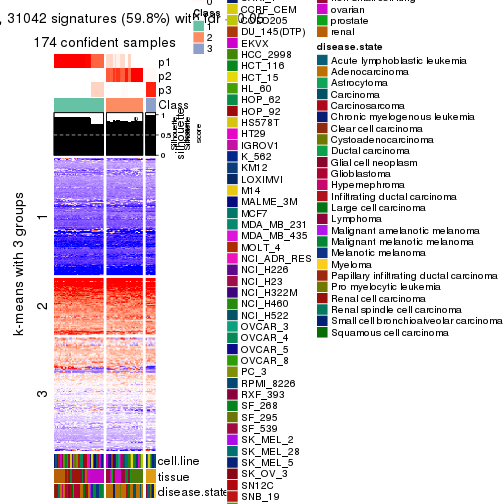</p>

</div>
<div id='tab-CV-hclust-get-signatures-no-scale-3'>
<pre><code class="r">get_signatures(res, k = 4, scale_rows = FALSE)
</code></pre>

<p></p>

</div>
<div id='tab-CV-hclust-get-signatures-no-scale-4'>
<pre><code class="r">get_signatures(res, k = 5, scale_rows = FALSE)
</code></pre>

<p></p>

</div>
<div id='tab-CV-hclust-get-signatures-no-scale-5'>
<pre><code class="r">get_signatures(res, k = 6, scale_rows = FALSE)
</code></pre>

<p></p>

</div>
</div>


Compare the overlap of signatures from different k:

```r
compare_signatures(res)
```


`get_signature()` returns a data frame invisibly. TO get the list of signatures, the function
call should be assigned to a variable explicitly. In following code, if `plot` argument is set
to `FALSE`, no heatmap is plotted while only the differential analysis is performed.

```r
# code only for demonstration
tb = get_signature(res, k = ..., plot = FALSE)
```

An example of the output of `tb` is:

```
#>   which_row         fdr    mean_1    mean_2 scaled_mean_1 scaled_mean_2 km
#> 1        38 0.042760348  8.373488  9.131774    -0.5533452     0.5164555  1
#> 2        40 0.018707592  7.106213  8.469186    -0.6173731     0.5762149  1
#> 3        55 0.019134737 10.221463 11.207825    -0.6159697     0.5749050  1
#> 4        59 0.006059896  5.921854  7.869574    -0.6899429     0.6439467  1
#> 5        60 0.018055526  8.928898 10.211722    -0.6204761     0.5791110  1
#> 6        98 0.009384629 15.714769 14.887706     0.6635654    -0.6193277  2
...
```

The columns in `tb` are:

1. `which_row`: row indices corresponding to the input matrix.
2. `fdr`: FDR for the differential test. 
3. `mean_x`: The mean value in group x.
4. `scaled_mean_x`: The mean value in group x after rows are scaled.
5. `km`: Row groups if k-means clustering is applied to rows.


UMAP plot which shows how samples are separated.


<script>
$( function() {
	$( '#tabs-CV-hclust-dimension-reduction' ).tabs();
} );
</script>
<div id='tabs-CV-hclust-dimension-reduction'>
<ul>
<li><a href='#tab-CV-hclust-dimension-reduction-1'>k = 2</a></li>
<li><a href='#tab-CV-hclust-dimension-reduction-2'>k = 3</a></li>
<li><a href='#tab-CV-hclust-dimension-reduction-3'>k = 4</a></li>
<li><a href='#tab-CV-hclust-dimension-reduction-4'>k = 5</a></li>
<li><a href='#tab-CV-hclust-dimension-reduction-5'>k = 6</a></li>
</ul>
<div id='tab-CV-hclust-dimension-reduction-1'>
<pre><code class="r">dimension_reduction(res, k = 2, method = &quot;UMAP&quot;)
</code></pre>

<p></p>

</div>
<div id='tab-CV-hclust-dimension-reduction-2'>
<pre><code class="r">dimension_reduction(res, k = 3, method = &quot;UMAP&quot;)
</code></pre>

<p></p>

</div>
<div id='tab-CV-hclust-dimension-reduction-3'>
<pre><code class="r">dimension_reduction(res, k = 4, method = &quot;UMAP&quot;)
</code></pre>

<p></p>

</div>
<div id='tab-CV-hclust-dimension-reduction-4'>
<pre><code class="r">dimension_reduction(res, k = 5, method = &quot;UMAP&quot;)
</code></pre>

<p></p>

</div>
<div id='tab-CV-hclust-dimension-reduction-5'>
<pre><code class="r">dimension_reduction(res, k = 6, method = &quot;UMAP&quot;)
</code></pre>

<p></p>

</div>
</div>


Following heatmap shows how subgroups are split when increasing `k`:

```r
collect_classes(res)
```


Test correlation between subgroups and known annotations. If the known
annotation is numeric, one-way ANOVA test is applied, and if the known
annotation is discrete, chi-squared contingency table test is applied.

```r
test_to_known_factors(res)
```

```
#>             n cell.line(p) tissue(p) disease.state(p) k
#> CV:hclust 174     1.60e-13  2.96e-22         1.15e-13 2
#> CV:hclust 174     5.09e-25  1.47e-51         2.11e-34 3
#> CV:hclust 174     1.92e-35  2.61e-73         1.08e-53 4
#> CV:hclust 174     7.39e-47  1.51e-97         3.66e-54 5
#> CV:hclust 168     2.55e-45 5.11e-100         1.38e-51 6
```


If matrix rows can be associated to genes, consider to use `GO_Enrichment(res,
...)` to perform function enrichment for the signature genes.


 

---------------------------------------------------


### CV:kmeans


The object with results only for a single top-value method and a single partition method 
can be extracted as:

```r
res = res_list["CV", "kmeans"]
# you can also extract it by
# res = res_list["CV:kmeans"]
```

A summary of `res` and all the functions that can be applied to it:

```r
res
```

```
#> A 'ConsensusPartition' object with k = 2, 3, 4, 5, 6.
#>   On a matrix with 51941 rows and 174 columns.
#>   Top rows (1000, 2000, 3000, 4000, 5000) are extracted by 'CV' method.
#>   Subgroups are detected by 'kmeans' method.
#>   Performed in total 1250 partitions by row resampling.
#>   Best k for subgroups seems to be 4.
#> 
#> Following methods can be applied to this 'ConsensusPartition' object:
#>  [1] "cola_report"             "collect_classes"         "collect_plots"          
#>  [4] "collect_stats"           "colnames"                "compare_signatures"     
#>  [7] "consensus_heatmap"       "dimension_reduction"     "functional_enrichment"  
#> [10] "get_anno_col"            "get_anno"                "get_classes"            
#> [13] "get_consensus"           "get_matrix"              "get_membership"         
#> [16] "get_param"               "get_signatures"          "get_stats"              
#> [19] "is_best_k"               "is_stable_k"             "membership_heatmap"     
#> [22] "ncol"                    "nrow"                    "plot_ecdf"              
#> [25] "rownames"                "select_partition_number" "show"                   
#> [28] "suggest_best_k"          "test_to_known_factors"
```

`collect_plots()` function collects all the plots made from `res` for all `k` (number of partitions)
into one single page to provide an easy and fast comparison between different `k`.

```r
collect_plots(res)
```


The plots are:

- The first row: a plot of the ECDF (Empirical cumulative distribution
  function) curves of the consensus matrix for each `k` and the heatmap of
  predicted classes for each `k`.
- The second row: heatmaps of the consensus matrix for each `k`.
- The third row: heatmaps of the membership matrix for each `k`.
- The fouth row: heatmaps of the signatures for each `k`.

All the plots in panels can be made by individual functions and they are
plotted later in this section.

`select_partition_number()` produces several plots showing different
statistics for choosing "optimized" `k`. There are following statistics:

- ECDF curves of the consensus matrix for each `k`;
- 1-PAC. [The PAC
  score](https://en.wikipedia.org/wiki/Consensus_clustering#Over-interpretation_potential_of_consensus_clustering)
  measures the proportion of the ambiguous subgrouping.
- Mean silhouette score.
- Concordance. The mean probability of fiting the consensus class ids in all
  partitions.
- Area increased. Denote $A_k$ as the area under the ECDF curve for current
  `k`, the area increased is defined as $A_k - A_{k-1}$.
- Rand index. The percent of pairs of samples that are both in a same cluster
  or both are not in a same cluster in the partition of k and k-1.
- Jaccard index. The ratio of pairs of samples are both in a same cluster in
  the partition of k and k-1 and the pairs of samples are both in a same
  cluster in the partition k or k-1.

The detailed explanations of these statistics can be found in [the cola
vignette](http://bioconductor.org/packages/devel/bioc/vignettes/cola/inst/doc/cola.html#toc_13).

Generally speaking, lower PAC score, higher mean silhouette score or higher
concordance corresponds to better partition. Rand index and Jaccard index
measure how similar the current partition is compared to partition with `k-1`.
If they are too similar, we won't accept `k` is better than `k-1`.

```r
select_partition_number(res)
```


The numeric values for all these statistics can be obtained by `get_stats()`.

```r
get_stats(res)
```

```
#>   k 1-PAC mean_silhouette concordance area_increased  Rand Jaccard
#> 2 2 0.218           0.699       0.757         0.4336 0.501   0.501
#> 3 3 0.260           0.732       0.781         0.3566 0.864   0.736
#> 4 4 0.521           0.766       0.790         0.1616 0.917   0.792
#> 5 5 0.602           0.566       0.687         0.0938 0.869   0.613
#> 6 6 0.641           0.629       0.680         0.0426 0.908   0.635
```

`suggest_best_k()` suggests the best $k$ based on these statistics. The rules are as follows:

- All $k$ with Jaccard index larger than 0.95 are removed because the increase of
  the partition number does not provides enough extra information. If all $k$ are removed,
  the best $k$ is assigned by `NA`.
- For $k$ with 1-PAC larger than 0.9, the maximal $k$ is taken as the "best k". Other $k$ is called "optional k".
- If it does not fit the second rule. The $k$ with the highest vote of highest
  1-PAC, mean silhouette and concordance is taken as the "best k".

```r
suggest_best_k(res)
```

```
#> [1] 4
```


Following shows the table of the partitions (You need to click the **show/hide
code output** link to see it). The membership matrix (columns with name `p*`)
is inferred by
[`clue::cl_consensus()`](https://www.rdocumentation.org/link/cl_consensus?package=clue)
function with the `SE` method. Basically the value in the membership matrix
represents the probability to belong to a certain group. The finall class
label for an item is determined with the group with highest probability it
belongs to.

In `get_classes()` function, the entropy is calculated from the membership
matrix and the silhouette score is calculated from the consensus matrix.


<script>
$( function() {
	$( '#tabs-CV-kmeans-get-classes' ).tabs();
} );
</script>
<div id='tabs-CV-kmeans-get-classes'>
<ul>
<li><a href='#tab-CV-kmeans-get-classes-1'>k = 2</a></li>
<li><a href='#tab-CV-kmeans-get-classes-2'>k = 3</a></li>
<li><a href='#tab-CV-kmeans-get-classes-3'>k = 4</a></li>
<li><a href='#tab-CV-kmeans-get-classes-4'>k = 5</a></li>
<li><a href='#tab-CV-kmeans-get-classes-5'>k = 6</a></li>
</ul>

<div id='tab-CV-kmeans-get-classes-1'>
<p><a id='tab-CV-kmeans-get-classes-1-a' style='color:#0366d6' href='#'>show/hide code output</a></p>
<pre><code class="r">cbind(get_classes(res, k = 2), get_membership(res, k = 2))
</code></pre>

<pre><code>#&gt;           class entropy silhouette    p1    p2
#&gt; GSM803615     2   0.373     0.7186 0.072 0.928
#&gt; GSM803674     2   0.373     0.7186 0.072 0.928
#&gt; GSM803733     2   0.373     0.7186 0.072 0.928
#&gt; GSM803616     2   0.373     0.7186 0.072 0.928
#&gt; GSM803675     2   0.373     0.7186 0.072 0.928
#&gt; GSM803734     2   0.373     0.7186 0.072 0.928
#&gt; GSM803617     2   0.373     0.7186 0.072 0.928
#&gt; GSM803676     2   0.373     0.7186 0.072 0.928
#&gt; GSM803735     2   0.373     0.7186 0.072 0.928
#&gt; GSM803618     2   0.373     0.7186 0.072 0.928
#&gt; GSM803677     2   0.373     0.7186 0.072 0.928
#&gt; GSM803736     2   0.358     0.7193 0.068 0.932
#&gt; GSM803619     2   0.373     0.7186 0.072 0.928
#&gt; GSM803678     2   0.373     0.7186 0.072 0.928
#&gt; GSM803737     2   0.373     0.7186 0.072 0.928
#&gt; GSM803620     2   0.358     0.7202 0.068 0.932
#&gt; GSM803679     2   0.358     0.7202 0.068 0.932
#&gt; GSM803738     2   0.358     0.7202 0.068 0.932
#&gt; GSM803621     1   0.388     0.7959 0.924 0.076
#&gt; GSM803680     1   0.388     0.7959 0.924 0.076
#&gt; GSM803739     1   0.388     0.7959 0.924 0.076
#&gt; GSM803622     1   0.327     0.7934 0.940 0.060
#&gt; GSM803681     1   0.327     0.7934 0.940 0.060
#&gt; GSM803740     1   0.327     0.7934 0.940 0.060
#&gt; GSM803623     2   0.529     0.8077 0.120 0.880
#&gt; GSM803682     2   0.529     0.8077 0.120 0.880
#&gt; GSM803741     2   0.529     0.8077 0.120 0.880
#&gt; GSM803624     1   0.971     0.3373 0.600 0.400
#&gt; GSM803683     1   0.615     0.7934 0.848 0.152
#&gt; GSM803742     1   0.615     0.7934 0.848 0.152
#&gt; GSM803625     1   0.625     0.7913 0.844 0.156
#&gt; GSM803684     1   0.625     0.7913 0.844 0.156
#&gt; GSM803743     1   0.625     0.7913 0.844 0.156
#&gt; GSM803626     1   0.881     0.4930 0.700 0.300
#&gt; GSM803685     1   0.260     0.7100 0.956 0.044
#&gt; GSM803744     1   0.881     0.4930 0.700 0.300
#&gt; GSM803627     1   0.327     0.7934 0.940 0.060
#&gt; GSM803686     1   0.327     0.7934 0.940 0.060
#&gt; GSM803745     1   0.327     0.7934 0.940 0.060
#&gt; GSM803628     1   0.327     0.7934 0.940 0.060
#&gt; GSM803687     1   0.327     0.7934 0.940 0.060
#&gt; GSM803746     1   0.327     0.7934 0.940 0.060
#&gt; GSM803629     1   0.327     0.7934 0.940 0.060
#&gt; GSM803688     1   0.327     0.7934 0.940 0.060
#&gt; GSM803747     1   0.327     0.7934 0.940 0.060
#&gt; GSM803630     1   0.295     0.7893 0.948 0.052
#&gt; GSM803689     1   0.295     0.7893 0.948 0.052
#&gt; GSM803748     1   0.295     0.7893 0.948 0.052
#&gt; GSM803631     1   0.295     0.7893 0.948 0.052
#&gt; GSM803690     1   0.295     0.7893 0.948 0.052
#&gt; GSM803749     1   0.295     0.7893 0.948 0.052
#&gt; GSM803632     1   0.295     0.7893 0.948 0.052
#&gt; GSM803691     1   0.295     0.7893 0.948 0.052
#&gt; GSM803750     1   0.295     0.7893 0.948 0.052
#&gt; GSM803633     2   0.541     0.8086 0.124 0.876
#&gt; GSM803692     2   0.541     0.8086 0.124 0.876
#&gt; GSM803751     2   0.541     0.8086 0.124 0.876
#&gt; GSM803634     2   0.541     0.8086 0.124 0.876
#&gt; GSM803693     2   0.541     0.8086 0.124 0.876
#&gt; GSM803752     2   0.541     0.8086 0.124 0.876
#&gt; GSM803635     2   0.541     0.8086 0.124 0.876
#&gt; GSM803694     2   0.541     0.8086 0.124 0.876
#&gt; GSM803753     2   0.541     0.8086 0.124 0.876
#&gt; GSM803636     2   0.541     0.8086 0.124 0.876
#&gt; GSM803695     2   0.541     0.8086 0.124 0.876
#&gt; GSM803754     2   0.541     0.8086 0.124 0.876
#&gt; GSM803637     2   0.541     0.8086 0.124 0.876
#&gt; GSM803696     2   0.541     0.8086 0.124 0.876
#&gt; GSM803755     2   0.541     0.8086 0.124 0.876
#&gt; GSM803638     2   0.541     0.8086 0.124 0.876
#&gt; GSM803697     2   0.541     0.8086 0.124 0.876
#&gt; GSM803756     2   0.541     0.8086 0.124 0.876
#&gt; GSM803639     2   0.529     0.8077 0.120 0.880
#&gt; GSM803698     2   0.529     0.8077 0.120 0.880
#&gt; GSM803757     2   0.529     0.8077 0.120 0.880
#&gt; GSM803640     1   0.625     0.7913 0.844 0.156
#&gt; GSM803699     1   0.625     0.7913 0.844 0.156
#&gt; GSM803758     1   0.625     0.7913 0.844 0.156
#&gt; GSM803641     1   0.625     0.7913 0.844 0.156
#&gt; GSM803700     1   0.625     0.7913 0.844 0.156
#&gt; GSM803759     1   0.625     0.7913 0.844 0.156
#&gt; GSM803642     1   0.625     0.7913 0.844 0.156
#&gt; GSM803701     1   0.625     0.7913 0.844 0.156
#&gt; GSM803760     1   0.625     0.7913 0.844 0.156
#&gt; GSM803643     1   0.625     0.7913 0.844 0.156
#&gt; GSM803702     1   0.625     0.7913 0.844 0.156
#&gt; GSM803644     1   0.584     0.7960 0.860 0.140
#&gt; GSM803703     1   0.584     0.7960 0.860 0.140
#&gt; GSM803761     1   0.584     0.7960 0.860 0.140
#&gt; GSM803645     1   0.615     0.7934 0.848 0.152
#&gt; GSM803704     1   0.615     0.7934 0.848 0.152
#&gt; GSM803762     1   0.615     0.7934 0.848 0.152
#&gt; GSM803646     1   0.738     0.7291 0.792 0.208
#&gt; GSM803705     1   0.738     0.7291 0.792 0.208
#&gt; GSM803763     1   0.738     0.7291 0.792 0.208
#&gt; GSM803647     1   0.625     0.7913 0.844 0.156
#&gt; GSM803706     1   0.625     0.7913 0.844 0.156
#&gt; GSM803764     1   0.625     0.7913 0.844 0.156
#&gt; GSM803648     2   0.952     0.5692 0.372 0.628
#&gt; GSM803707     2   0.952     0.5692 0.372 0.628
#&gt; GSM803765     2   0.952     0.5692 0.372 0.628
#&gt; GSM803649     1   0.998    -0.0511 0.524 0.476
#&gt; GSM803708     1   0.998    -0.0511 0.524 0.476
#&gt; GSM803766     1   0.998    -0.0511 0.524 0.476
#&gt; GSM803650     1   0.595     0.7956 0.856 0.144
#&gt; GSM803709     1   0.595     0.7956 0.856 0.144
#&gt; GSM803767     1   0.595     0.7956 0.856 0.144
#&gt; GSM803651     1   0.615     0.7934 0.848 0.152
#&gt; GSM803710     1   0.615     0.7934 0.848 0.152
#&gt; GSM803768     1   0.615     0.7934 0.848 0.152
#&gt; GSM803652     1   0.595     0.7956 0.856 0.144
#&gt; GSM803711     1   0.595     0.7956 0.856 0.144
#&gt; GSM803653     2   0.909     0.6571 0.324 0.676
#&gt; GSM803712     2   0.909     0.6571 0.324 0.676
#&gt; GSM803769     2   0.909     0.6571 0.324 0.676
#&gt; GSM803654     2   0.662     0.7915 0.172 0.828
#&gt; GSM803713     2   0.662     0.7915 0.172 0.828
#&gt; GSM803770     2   0.662     0.7915 0.172 0.828
#&gt; GSM803655     2   0.978     0.4754 0.412 0.588
#&gt; GSM803714     2   0.978     0.4754 0.412 0.588
#&gt; GSM803771     2   0.978     0.4754 0.412 0.588
#&gt; GSM803656     2   0.760     0.7717 0.220 0.780
#&gt; GSM803715     2   0.760     0.7717 0.220 0.780
#&gt; GSM803772     2   0.760     0.7717 0.220 0.780
#&gt; GSM803657     2   0.871     0.7065 0.292 0.708
#&gt; GSM803716     2   0.871     0.7065 0.292 0.708
#&gt; GSM803773     2   0.871     0.7065 0.292 0.708
#&gt; GSM803658     2   0.871     0.7065 0.292 0.708
#&gt; GSM803717     2   0.871     0.7065 0.292 0.708
#&gt; GSM803774     2   0.871     0.7065 0.292 0.708
#&gt; GSM803659     2   0.871     0.7065 0.292 0.708
#&gt; GSM803718     2   0.871     0.7065 0.292 0.708
#&gt; GSM803775     2   0.871     0.7065 0.292 0.708
#&gt; GSM803660     2   0.985     0.4242 0.428 0.572
#&gt; GSM803719     2   0.985     0.4242 0.428 0.572
#&gt; GSM803776     2   0.985     0.4242 0.428 0.572
#&gt; GSM803661     1   0.615     0.7934 0.848 0.152
#&gt; GSM803720     1   0.615     0.7934 0.848 0.152
#&gt; GSM803777     1   0.615     0.7934 0.848 0.152
#&gt; GSM803662     2   0.998     0.2856 0.472 0.528
#&gt; GSM803732     1   0.753     0.7150 0.784 0.216
#&gt; GSM803778     1   0.753     0.7150 0.784 0.216
#&gt; GSM803663     2   0.943     0.5938 0.360 0.640
#&gt; GSM803721     2   0.943     0.5938 0.360 0.640
#&gt; GSM803779     2   0.943     0.5938 0.360 0.640
#&gt; GSM803664     2   0.891     0.6820 0.308 0.692
#&gt; GSM803722     2   0.891     0.6820 0.308 0.692
#&gt; GSM803780     2   0.891     0.6820 0.308 0.692
#&gt; GSM803665     1   0.388     0.7951 0.924 0.076
#&gt; GSM803723     1   0.388     0.7951 0.924 0.076
#&gt; GSM803781     1   0.388     0.7951 0.924 0.076
#&gt; GSM803666     1   0.881     0.4930 0.700 0.300
#&gt; GSM803724     1   0.881     0.4930 0.700 0.300
#&gt; GSM803782     1   0.881     0.4930 0.700 0.300
#&gt; GSM803667     1   0.881     0.4930 0.700 0.300
#&gt; GSM803725     1   0.881     0.4930 0.700 0.300
#&gt; GSM803783     1   0.881     0.4930 0.700 0.300
#&gt; GSM803668     1   0.881     0.4930 0.700 0.300
#&gt; GSM803726     1   0.881     0.4930 0.700 0.300
#&gt; GSM803784     1   0.881     0.4930 0.700 0.300
#&gt; GSM803669     1   0.881     0.4930 0.700 0.300
#&gt; GSM803727     1   0.881     0.4930 0.700 0.300
#&gt; GSM803670     1   0.881     0.4930 0.700 0.300
#&gt; GSM803728     1   0.881     0.4930 0.700 0.300
#&gt; GSM803785     1   0.881     0.4930 0.700 0.300
#&gt; GSM803671     1   0.881     0.4930 0.700 0.300
#&gt; GSM803729     1   0.881     0.4930 0.700 0.300
#&gt; GSM803786     1   0.881     0.4930 0.700 0.300
#&gt; GSM803672     1   0.881     0.4930 0.700 0.300
#&gt; GSM803730     1   0.881     0.4930 0.700 0.300
#&gt; GSM803787     1   0.881     0.4930 0.700 0.300
#&gt; GSM803673     2   0.529     0.8077 0.120 0.880
#&gt; GSM803731     2   0.529     0.8077 0.120 0.880
#&gt; GSM803788     2   0.529     0.8077 0.120 0.880
</code></pre>

<script>
$('#tab-CV-kmeans-get-classes-1-a').parent().next().next().hide();
$('#tab-CV-kmeans-get-classes-1-a').click(function(){
  $('#tab-CV-kmeans-get-classes-1-a').parent().next().next().toggle();
  return(false);
});
</script>
</div>

<div id='tab-CV-kmeans-get-classes-2'>
<p><a id='tab-CV-kmeans-get-classes-2-a' style='color:#0366d6' href='#'>show/hide code output</a></p>
<pre><code class="r">cbind(get_classes(res, k = 3), get_membership(res, k = 3))
</code></pre>

<pre><code>#&gt;           class entropy silhouette    p1    p2    p3
#&gt; GSM803615     2   0.738      0.362 0.036 0.560 0.404
#&gt; GSM803674     2   0.738      0.362 0.036 0.560 0.404
#&gt; GSM803733     2   0.738      0.362 0.036 0.560 0.404
#&gt; GSM803616     2   0.734      0.362 0.036 0.572 0.392
#&gt; GSM803675     2   0.734      0.362 0.036 0.572 0.392
#&gt; GSM803734     2   0.734      0.362 0.036 0.572 0.392
#&gt; GSM803617     2   0.738      0.362 0.036 0.560 0.404
#&gt; GSM803676     2   0.738      0.362 0.036 0.560 0.404
#&gt; GSM803735     2   0.734      0.362 0.036 0.572 0.392
#&gt; GSM803618     2   0.735      0.362 0.036 0.568 0.396
#&gt; GSM803677     2   0.735      0.362 0.036 0.568 0.396
#&gt; GSM803736     2   0.735      0.362 0.036 0.568 0.396
#&gt; GSM803619     2   0.739      0.361 0.036 0.556 0.408
#&gt; GSM803678     2   0.739      0.361 0.036 0.556 0.408
#&gt; GSM803737     2   0.739      0.361 0.036 0.556 0.408
#&gt; GSM803620     2   0.733      0.368 0.036 0.576 0.388
#&gt; GSM803679     2   0.733      0.368 0.036 0.576 0.388
#&gt; GSM803738     2   0.733      0.368 0.036 0.576 0.388
#&gt; GSM803621     1   0.238      0.835 0.936 0.008 0.056
#&gt; GSM803680     1   0.238      0.835 0.936 0.008 0.056
#&gt; GSM803739     1   0.238      0.835 0.936 0.008 0.056
#&gt; GSM803622     1   0.319      0.798 0.888 0.000 0.112
#&gt; GSM803681     1   0.319      0.798 0.888 0.000 0.112
#&gt; GSM803740     1   0.319      0.798 0.888 0.000 0.112
#&gt; GSM803623     2   0.308      0.721 0.060 0.916 0.024
#&gt; GSM803682     2   0.308      0.721 0.060 0.916 0.024
#&gt; GSM803741     2   0.308      0.721 0.060 0.916 0.024
#&gt; GSM803624     1   0.668      0.445 0.676 0.292 0.032
#&gt; GSM803683     1   0.324      0.851 0.912 0.056 0.032
#&gt; GSM803742     1   0.334      0.849 0.908 0.060 0.032
#&gt; GSM803625     1   0.274      0.860 0.928 0.052 0.020
#&gt; GSM803684     1   0.274      0.860 0.928 0.052 0.020
#&gt; GSM803743     1   0.274      0.860 0.928 0.052 0.020
#&gt; GSM803626     3   0.742      1.000 0.240 0.084 0.676
#&gt; GSM803685     1   0.630     -0.318 0.520 0.000 0.480
#&gt; GSM803744     3   0.742      1.000 0.240 0.084 0.676
#&gt; GSM803627     1   0.319      0.798 0.888 0.000 0.112
#&gt; GSM803686     1   0.319      0.798 0.888 0.000 0.112
#&gt; GSM803745     1   0.319      0.798 0.888 0.000 0.112
#&gt; GSM803628     1   0.319      0.798 0.888 0.000 0.112
#&gt; GSM803687     1   0.319      0.798 0.888 0.000 0.112
#&gt; GSM803746     1   0.319      0.798 0.888 0.000 0.112
#&gt; GSM803629     1   0.319      0.798 0.888 0.000 0.112
#&gt; GSM803688     1   0.319      0.798 0.888 0.000 0.112
#&gt; GSM803747     1   0.319      0.798 0.888 0.000 0.112
#&gt; GSM803630     1   0.334      0.793 0.880 0.000 0.120
#&gt; GSM803689     1   0.334      0.793 0.880 0.000 0.120
#&gt; GSM803748     1   0.334      0.793 0.880 0.000 0.120
#&gt; GSM803631     1   0.327      0.793 0.884 0.000 0.116
#&gt; GSM803690     1   0.327      0.793 0.884 0.000 0.116
#&gt; GSM803749     1   0.327      0.793 0.884 0.000 0.116
#&gt; GSM803632     1   0.334      0.793 0.880 0.000 0.120
#&gt; GSM803691     1   0.334      0.793 0.880 0.000 0.120
#&gt; GSM803750     1   0.334      0.793 0.880 0.000 0.120
#&gt; GSM803633     2   0.353      0.725 0.068 0.900 0.032
#&gt; GSM803692     2   0.353      0.725 0.068 0.900 0.032
#&gt; GSM803751     2   0.353      0.725 0.068 0.900 0.032
#&gt; GSM803634     2   0.353      0.725 0.068 0.900 0.032
#&gt; GSM803693     2   0.353      0.725 0.068 0.900 0.032
#&gt; GSM803752     2   0.353      0.725 0.068 0.900 0.032
#&gt; GSM803635     2   0.314      0.726 0.068 0.912 0.020
#&gt; GSM803694     2   0.314      0.726 0.068 0.912 0.020
#&gt; GSM803753     2   0.314      0.726 0.068 0.912 0.020
#&gt; GSM803636     2   0.353      0.725 0.068 0.900 0.032
#&gt; GSM803695     2   0.353      0.725 0.068 0.900 0.032
#&gt; GSM803754     2   0.353      0.725 0.068 0.900 0.032
#&gt; GSM803637     2   0.353      0.725 0.068 0.900 0.032
#&gt; GSM803696     2   0.353      0.725 0.068 0.900 0.032
#&gt; GSM803755     2   0.353      0.725 0.068 0.900 0.032
#&gt; GSM803638     2   0.353      0.725 0.068 0.900 0.032
#&gt; GSM803697     2   0.353      0.725 0.068 0.900 0.032
#&gt; GSM803756     2   0.353      0.725 0.068 0.900 0.032
#&gt; GSM803639     2   0.353      0.725 0.068 0.900 0.032
#&gt; GSM803698     2   0.353      0.725 0.068 0.900 0.032
#&gt; GSM803757     2   0.353      0.725 0.068 0.900 0.032
#&gt; GSM803640     1   0.358      0.853 0.900 0.056 0.044
#&gt; GSM803699     1   0.358      0.853 0.900 0.056 0.044
#&gt; GSM803758     1   0.358      0.853 0.900 0.056 0.044
#&gt; GSM803641     1   0.358      0.853 0.900 0.056 0.044
#&gt; GSM803700     1   0.358      0.853 0.900 0.056 0.044
#&gt; GSM803759     1   0.358      0.853 0.900 0.056 0.044
#&gt; GSM803642     1   0.368      0.851 0.896 0.060 0.044
#&gt; GSM803701     1   0.368      0.851 0.896 0.060 0.044
#&gt; GSM803760     1   0.368      0.851 0.896 0.060 0.044
#&gt; GSM803643     1   0.368      0.851 0.896 0.060 0.044
#&gt; GSM803702     1   0.368      0.851 0.896 0.060 0.044
#&gt; GSM803644     1   0.304      0.857 0.920 0.044 0.036
#&gt; GSM803703     1   0.304      0.857 0.920 0.044 0.036
#&gt; GSM803761     1   0.304      0.857 0.920 0.044 0.036
#&gt; GSM803645     1   0.238      0.861 0.940 0.044 0.016
#&gt; GSM803704     1   0.238      0.861 0.940 0.044 0.016
#&gt; GSM803762     1   0.238      0.861 0.940 0.044 0.016
#&gt; GSM803646     1   0.563      0.748 0.800 0.144 0.056
#&gt; GSM803705     1   0.563      0.748 0.800 0.144 0.056
#&gt; GSM803763     1   0.563      0.748 0.800 0.144 0.056
#&gt; GSM803647     1   0.358      0.853 0.900 0.056 0.044
#&gt; GSM803706     1   0.358      0.853 0.900 0.056 0.044
#&gt; GSM803764     1   0.358      0.853 0.900 0.056 0.044
#&gt; GSM803648     2   0.736      0.570 0.332 0.620 0.048
#&gt; GSM803707     2   0.736      0.570 0.332 0.620 0.048
#&gt; GSM803765     2   0.736      0.570 0.332 0.620 0.048
#&gt; GSM803649     2   0.778      0.384 0.416 0.532 0.052
#&gt; GSM803708     2   0.778      0.384 0.416 0.532 0.052
#&gt; GSM803766     2   0.778      0.384 0.416 0.532 0.052
#&gt; GSM803650     1   0.195      0.861 0.952 0.040 0.008
#&gt; GSM803709     1   0.195      0.861 0.952 0.040 0.008
#&gt; GSM803767     1   0.195      0.861 0.952 0.040 0.008
#&gt; GSM803651     1   0.238      0.862 0.940 0.044 0.016
#&gt; GSM803710     1   0.238      0.862 0.940 0.044 0.016
#&gt; GSM803768     1   0.238      0.862 0.940 0.044 0.016
#&gt; GSM803652     1   0.164      0.862 0.956 0.044 0.000
#&gt; GSM803711     1   0.164      0.862 0.956 0.044 0.000
#&gt; GSM803653     2   0.653      0.665 0.260 0.704 0.036
#&gt; GSM803712     2   0.653      0.665 0.260 0.704 0.036
#&gt; GSM803769     2   0.653      0.665 0.260 0.704 0.036
#&gt; GSM803654     2   0.377      0.721 0.104 0.880 0.016
#&gt; GSM803713     2   0.377      0.721 0.104 0.880 0.016
#&gt; GSM803770     2   0.377      0.721 0.104 0.880 0.016
#&gt; GSM803655     2   0.711      0.572 0.340 0.624 0.036
#&gt; GSM803714     2   0.711      0.572 0.340 0.624 0.036
#&gt; GSM803771     2   0.711      0.572 0.340 0.624 0.036
#&gt; GSM803656     2   0.520      0.710 0.136 0.820 0.044
#&gt; GSM803715     2   0.520      0.710 0.136 0.820 0.044
#&gt; GSM803772     2   0.520      0.710 0.136 0.820 0.044
#&gt; GSM803657     2   0.617      0.687 0.224 0.740 0.036
#&gt; GSM803716     2   0.617      0.687 0.224 0.740 0.036
#&gt; GSM803773     2   0.617      0.687 0.224 0.740 0.036
#&gt; GSM803658     2   0.597      0.692 0.216 0.752 0.032
#&gt; GSM803717     2   0.597      0.692 0.216 0.752 0.032
#&gt; GSM803774     2   0.597      0.692 0.216 0.752 0.032
#&gt; GSM803659     2   0.597      0.692 0.216 0.752 0.032
#&gt; GSM803718     2   0.597      0.692 0.216 0.752 0.032
#&gt; GSM803775     2   0.597      0.692 0.216 0.752 0.032
#&gt; GSM803660     2   0.721      0.537 0.360 0.604 0.036
#&gt; GSM803719     2   0.721      0.537 0.360 0.604 0.036
#&gt; GSM803776     2   0.721      0.537 0.360 0.604 0.036
#&gt; GSM803661     1   0.334      0.849 0.908 0.060 0.032
#&gt; GSM803720     1   0.334      0.849 0.908 0.060 0.032
#&gt; GSM803777     1   0.334      0.849 0.908 0.060 0.032
#&gt; GSM803662     2   0.792      0.406 0.408 0.532 0.060
#&gt; GSM803732     1   0.587      0.722 0.784 0.160 0.056
#&gt; GSM803778     1   0.593      0.717 0.780 0.164 0.056
#&gt; GSM803663     2   0.694      0.611 0.312 0.652 0.036
#&gt; GSM803721     2   0.694      0.611 0.312 0.652 0.036
#&gt; GSM803779     2   0.694      0.611 0.312 0.652 0.036
#&gt; GSM803664     2   0.590      0.685 0.232 0.744 0.024
#&gt; GSM803722     2   0.590      0.685 0.232 0.744 0.024
#&gt; GSM803780     2   0.590      0.685 0.232 0.744 0.024
#&gt; GSM803665     1   0.368      0.799 0.876 0.008 0.116
#&gt; GSM803723     1   0.368      0.799 0.876 0.008 0.116
#&gt; GSM803781     1   0.368      0.799 0.876 0.008 0.116
#&gt; GSM803666     3   0.742      1.000 0.240 0.084 0.676
#&gt; GSM803724     3   0.742      1.000 0.240 0.084 0.676
#&gt; GSM803782     3   0.742      1.000 0.240 0.084 0.676
#&gt; GSM803667     3   0.742      1.000 0.240 0.084 0.676
#&gt; GSM803725     3   0.742      1.000 0.240 0.084 0.676
#&gt; GSM803783     3   0.742      1.000 0.240 0.084 0.676
#&gt; GSM803668     3   0.742      1.000 0.240 0.084 0.676
#&gt; GSM803726     3   0.742      1.000 0.240 0.084 0.676
#&gt; GSM803784     3   0.742      1.000 0.240 0.084 0.676
#&gt; GSM803669     3   0.742      1.000 0.240 0.084 0.676
#&gt; GSM803727     3   0.742      1.000 0.240 0.084 0.676
#&gt; GSM803670     3   0.742      1.000 0.240 0.084 0.676
#&gt; GSM803728     3   0.742      1.000 0.240 0.084 0.676
#&gt; GSM803785     3   0.742      1.000 0.240 0.084 0.676
#&gt; GSM803671     3   0.742      1.000 0.240 0.084 0.676
#&gt; GSM803729     3   0.742      1.000 0.240 0.084 0.676
#&gt; GSM803786     3   0.742      1.000 0.240 0.084 0.676
#&gt; GSM803672     3   0.742      1.000 0.240 0.084 0.676
#&gt; GSM803730     3   0.742      1.000 0.240 0.084 0.676
#&gt; GSM803787     3   0.742      1.000 0.240 0.084 0.676
#&gt; GSM803673     2   0.268      0.725 0.068 0.924 0.008
#&gt; GSM803731     2   0.268      0.725 0.068 0.924 0.008
#&gt; GSM803788     2   0.268      0.725 0.068 0.924 0.008
</code></pre>

<script>
$('#tab-CV-kmeans-get-classes-2-a').parent().next().next().hide();
$('#tab-CV-kmeans-get-classes-2-a').click(function(){
  $('#tab-CV-kmeans-get-classes-2-a').parent().next().next().toggle();
  return(false);
});
</script>
</div>

<div id='tab-CV-kmeans-get-classes-3'>
<p><a id='tab-CV-kmeans-get-classes-3-a' style='color:#0366d6' href='#'>show/hide code output</a></p>
<pre><code class="r">cbind(get_classes(res, k = 4), get_membership(res, k = 4))
</code></pre>

<pre><code>#&gt;           class entropy silhouette    p1    p2    p3    p4
#&gt; GSM803615     4   0.689      0.992 0.012 0.228 0.136 0.624
#&gt; GSM803674     4   0.689      0.992 0.012 0.228 0.136 0.624
#&gt; GSM803733     4   0.689      0.992 0.012 0.228 0.136 0.624
#&gt; GSM803616     4   0.689      0.992 0.012 0.228 0.136 0.624
#&gt; GSM803675     4   0.689      0.992 0.012 0.228 0.136 0.624
#&gt; GSM803734     4   0.689      0.992 0.012 0.228 0.136 0.624
#&gt; GSM803617     4   0.689      0.992 0.012 0.228 0.136 0.624
#&gt; GSM803676     4   0.689      0.992 0.012 0.228 0.136 0.624
#&gt; GSM803735     4   0.689      0.992 0.012 0.228 0.136 0.624
#&gt; GSM803618     4   0.688      0.985 0.008 0.236 0.140 0.616
#&gt; GSM803677     4   0.688      0.985 0.008 0.236 0.140 0.616
#&gt; GSM803736     4   0.688      0.985 0.008 0.236 0.140 0.616
#&gt; GSM803619     4   0.692      0.984 0.012 0.220 0.144 0.624
#&gt; GSM803678     4   0.692      0.984 0.012 0.220 0.144 0.624
#&gt; GSM803737     4   0.692      0.984 0.012 0.220 0.144 0.624
#&gt; GSM803620     4   0.683      0.986 0.008 0.236 0.136 0.620
#&gt; GSM803679     4   0.683      0.986 0.008 0.236 0.136 0.620
#&gt; GSM803738     4   0.683      0.986 0.008 0.236 0.136 0.620
#&gt; GSM803621     1   0.297      0.807 0.884 0.000 0.020 0.096
#&gt; GSM803680     1   0.297      0.807 0.884 0.000 0.020 0.096
#&gt; GSM803739     1   0.297      0.807 0.884 0.000 0.020 0.096
#&gt; GSM803622     1   0.467      0.767 0.796 0.000 0.108 0.096
#&gt; GSM803681     1   0.467      0.767 0.796 0.000 0.108 0.096
#&gt; GSM803740     1   0.467      0.767 0.796 0.000 0.108 0.096
#&gt; GSM803623     2   0.405      0.607 0.012 0.836 0.028 0.124
#&gt; GSM803682     2   0.405      0.607 0.012 0.836 0.028 0.124
#&gt; GSM803741     2   0.405      0.607 0.012 0.836 0.028 0.124
#&gt; GSM803624     1   0.539      0.639 0.748 0.188 0.020 0.044
#&gt; GSM803683     1   0.315      0.808 0.896 0.056 0.016 0.032
#&gt; GSM803742     1   0.315      0.808 0.896 0.056 0.016 0.032
#&gt; GSM803625     1   0.248      0.824 0.924 0.024 0.012 0.040
#&gt; GSM803684     1   0.248      0.824 0.924 0.024 0.012 0.040
#&gt; GSM803743     1   0.248      0.824 0.924 0.024 0.012 0.040
#&gt; GSM803626     3   0.346      0.966 0.076 0.040 0.876 0.008
#&gt; GSM803685     3   0.695      0.333 0.348 0.000 0.528 0.124
#&gt; GSM803744     3   0.346      0.966 0.076 0.040 0.876 0.008
#&gt; GSM803627     1   0.449      0.774 0.808 0.000 0.096 0.096
#&gt; GSM803686     1   0.449      0.774 0.808 0.000 0.096 0.096
#&gt; GSM803745     1   0.449      0.774 0.808 0.000 0.096 0.096
#&gt; GSM803628     1   0.484      0.763 0.784 0.000 0.108 0.108
#&gt; GSM803687     1   0.484      0.763 0.784 0.000 0.108 0.108
#&gt; GSM803746     1   0.484      0.763 0.784 0.000 0.108 0.108
#&gt; GSM803629     1   0.473      0.765 0.792 0.000 0.108 0.100
#&gt; GSM803688     1   0.473      0.765 0.792 0.000 0.108 0.100
#&gt; GSM803747     1   0.473      0.765 0.792 0.000 0.108 0.100
#&gt; GSM803630     1   0.496      0.759 0.776 0.000 0.108 0.116
#&gt; GSM803689     1   0.496      0.759 0.776 0.000 0.108 0.116
#&gt; GSM803748     1   0.496      0.759 0.776 0.000 0.108 0.116
#&gt; GSM803631     1   0.484      0.763 0.784 0.000 0.108 0.108
#&gt; GSM803690     1   0.484      0.763 0.784 0.000 0.108 0.108
#&gt; GSM803749     1   0.484      0.763 0.784 0.000 0.108 0.108
#&gt; GSM803632     1   0.496      0.759 0.776 0.000 0.108 0.116
#&gt; GSM803691     1   0.496      0.759 0.776 0.000 0.108 0.116
#&gt; GSM803750     1   0.496      0.759 0.776 0.000 0.108 0.116
#&gt; GSM803633     2   0.433      0.589 0.008 0.804 0.024 0.164
#&gt; GSM803692     2   0.433      0.589 0.008 0.804 0.024 0.164
#&gt; GSM803751     2   0.433      0.589 0.008 0.804 0.024 0.164
#&gt; GSM803634     2   0.433      0.589 0.008 0.804 0.024 0.164
#&gt; GSM803693     2   0.433      0.589 0.008 0.804 0.024 0.164
#&gt; GSM803752     2   0.433      0.589 0.008 0.804 0.024 0.164
#&gt; GSM803635     2   0.372      0.613 0.008 0.844 0.016 0.132
#&gt; GSM803694     2   0.372      0.613 0.008 0.844 0.016 0.132
#&gt; GSM803753     2   0.372      0.613 0.008 0.844 0.016 0.132
#&gt; GSM803636     2   0.438      0.589 0.008 0.804 0.028 0.160
#&gt; GSM803695     2   0.438      0.589 0.008 0.804 0.028 0.160
#&gt; GSM803754     2   0.438      0.589 0.008 0.804 0.028 0.160
#&gt; GSM803637     2   0.428      0.592 0.008 0.808 0.024 0.160
#&gt; GSM803696     2   0.428      0.592 0.008 0.808 0.024 0.160
#&gt; GSM803755     2   0.428      0.592 0.008 0.808 0.024 0.160
#&gt; GSM803638     2   0.433      0.589 0.008 0.804 0.024 0.164
#&gt; GSM803697     2   0.433      0.589 0.008 0.804 0.024 0.164
#&gt; GSM803756     2   0.433      0.589 0.008 0.804 0.024 0.164
#&gt; GSM803639     2   0.437      0.586 0.008 0.800 0.024 0.168
#&gt; GSM803698     2   0.437      0.586 0.008 0.800 0.024 0.168
#&gt; GSM803757     2   0.437      0.586 0.008 0.800 0.024 0.168
#&gt; GSM803640     1   0.398      0.808 0.848 0.012 0.040 0.100
#&gt; GSM803699     1   0.398      0.808 0.848 0.012 0.040 0.100
#&gt; GSM803758     1   0.398      0.808 0.848 0.012 0.040 0.100
#&gt; GSM803641     1   0.398      0.808 0.848 0.012 0.040 0.100
#&gt; GSM803700     1   0.398      0.808 0.848 0.012 0.040 0.100
#&gt; GSM803759     1   0.398      0.808 0.848 0.012 0.040 0.100
#&gt; GSM803642     1   0.407      0.803 0.844 0.016 0.036 0.104
#&gt; GSM803701     1   0.407      0.803 0.844 0.016 0.036 0.104
#&gt; GSM803760     1   0.407      0.803 0.844 0.016 0.036 0.104
#&gt; GSM803643     1   0.407      0.803 0.844 0.016 0.036 0.104
#&gt; GSM803702     1   0.407      0.803 0.844 0.016 0.036 0.104
#&gt; GSM803644     1   0.351      0.812 0.868 0.008 0.028 0.096
#&gt; GSM803703     1   0.351      0.812 0.868 0.008 0.028 0.096
#&gt; GSM803761     1   0.351      0.812 0.868 0.008 0.028 0.096
#&gt; GSM803645     1   0.187      0.826 0.948 0.012 0.016 0.024
#&gt; GSM803704     1   0.187      0.826 0.948 0.012 0.016 0.024
#&gt; GSM803762     1   0.187      0.826 0.948 0.012 0.016 0.024
#&gt; GSM803646     1   0.673      0.645 0.688 0.140 0.044 0.128
#&gt; GSM803705     1   0.673      0.645 0.688 0.140 0.044 0.128
#&gt; GSM803763     1   0.673      0.645 0.688 0.140 0.044 0.128
#&gt; GSM803647     1   0.386      0.806 0.852 0.012 0.032 0.104
#&gt; GSM803706     1   0.386      0.806 0.852 0.012 0.032 0.104
#&gt; GSM803764     1   0.386      0.806 0.852 0.012 0.032 0.104
#&gt; GSM803648     2   0.720      0.627 0.248 0.616 0.040 0.096
#&gt; GSM803707     2   0.720      0.627 0.248 0.616 0.040 0.096
#&gt; GSM803765     2   0.720      0.627 0.248 0.616 0.040 0.096
#&gt; GSM803649     2   0.735      0.608 0.264 0.596 0.040 0.100
#&gt; GSM803708     2   0.735      0.608 0.264 0.596 0.040 0.100
#&gt; GSM803766     2   0.735      0.608 0.264 0.596 0.040 0.100
#&gt; GSM803650     1   0.154      0.826 0.956 0.004 0.008 0.032
#&gt; GSM803709     1   0.154      0.826 0.956 0.004 0.008 0.032
#&gt; GSM803767     1   0.154      0.826 0.956 0.004 0.008 0.032
#&gt; GSM803651     1   0.222      0.827 0.932 0.008 0.016 0.044
#&gt; GSM803710     1   0.222      0.827 0.932 0.008 0.016 0.044
#&gt; GSM803768     1   0.222      0.827 0.932 0.008 0.016 0.044
#&gt; GSM803652     1   0.111      0.829 0.968 0.004 0.000 0.028
#&gt; GSM803711     1   0.111      0.829 0.968 0.004 0.000 0.028
#&gt; GSM803653     2   0.639      0.655 0.224 0.680 0.036 0.060
#&gt; GSM803712     2   0.639      0.655 0.224 0.680 0.036 0.060
#&gt; GSM803769     2   0.639      0.655 0.224 0.680 0.036 0.060
#&gt; GSM803654     2   0.232      0.672 0.028 0.932 0.024 0.016
#&gt; GSM803713     2   0.232      0.672 0.028 0.932 0.024 0.016
#&gt; GSM803770     2   0.232      0.672 0.028 0.932 0.024 0.016
#&gt; GSM803655     2   0.702      0.628 0.264 0.620 0.040 0.076
#&gt; GSM803714     2   0.702      0.628 0.264 0.620 0.040 0.076
#&gt; GSM803771     2   0.702      0.628 0.264 0.620 0.040 0.076
#&gt; GSM803656     2   0.611      0.627 0.096 0.740 0.052 0.112
#&gt; GSM803715     2   0.611      0.627 0.096 0.740 0.052 0.112
#&gt; GSM803772     2   0.611      0.627 0.096 0.740 0.052 0.112
#&gt; GSM803657     2   0.578      0.682 0.140 0.752 0.040 0.068
#&gt; GSM803716     2   0.578      0.682 0.140 0.752 0.040 0.068
#&gt; GSM803773     2   0.578      0.682 0.140 0.752 0.040 0.068
#&gt; GSM803658     2   0.522      0.687 0.132 0.784 0.036 0.048
#&gt; GSM803717     2   0.522      0.687 0.132 0.784 0.036 0.048
#&gt; GSM803774     2   0.522      0.687 0.132 0.784 0.036 0.048
#&gt; GSM803659     2   0.530      0.687 0.132 0.780 0.036 0.052
#&gt; GSM803718     2   0.530      0.687 0.132 0.780 0.036 0.052
#&gt; GSM803775     2   0.530      0.687 0.132 0.780 0.036 0.052
#&gt; GSM803660     2   0.675      0.634 0.268 0.632 0.032 0.068
#&gt; GSM803719     2   0.675      0.634 0.268 0.632 0.032 0.068
#&gt; GSM803776     2   0.675      0.634 0.268 0.632 0.032 0.068
#&gt; GSM803661     1   0.315      0.808 0.896 0.056 0.016 0.032
#&gt; GSM803720     1   0.315      0.808 0.896 0.056 0.016 0.032
#&gt; GSM803777     1   0.315      0.808 0.896 0.056 0.016 0.032
#&gt; GSM803662     2   0.749      0.582 0.292 0.572 0.048 0.088
#&gt; GSM803732     1   0.732      0.498 0.616 0.228 0.040 0.116
#&gt; GSM803778     1   0.732      0.498 0.616 0.228 0.040 0.116
#&gt; GSM803663     2   0.669      0.644 0.244 0.652 0.040 0.064
#&gt; GSM803721     2   0.669      0.644 0.244 0.652 0.040 0.064
#&gt; GSM803779     2   0.669      0.644 0.244 0.652 0.040 0.064
#&gt; GSM803664     2   0.519      0.685 0.184 0.760 0.032 0.024
#&gt; GSM803722     2   0.519      0.685 0.184 0.760 0.032 0.024
#&gt; GSM803780     2   0.519      0.685 0.184 0.760 0.032 0.024
#&gt; GSM803665     1   0.486      0.780 0.796 0.008 0.112 0.084
#&gt; GSM803723     1   0.486      0.780 0.796 0.008 0.112 0.084
#&gt; GSM803781     1   0.486      0.780 0.796 0.008 0.112 0.084
#&gt; GSM803666     3   0.322      0.968 0.076 0.044 0.880 0.000
#&gt; GSM803724     3   0.322      0.968 0.076 0.044 0.880 0.000
#&gt; GSM803782     3   0.322      0.968 0.076 0.044 0.880 0.000
#&gt; GSM803667     3   0.399      0.960 0.076 0.048 0.856 0.020
#&gt; GSM803725     3   0.399      0.960 0.076 0.048 0.856 0.020
#&gt; GSM803783     3   0.399      0.960 0.076 0.048 0.856 0.020
#&gt; GSM803668     3   0.331      0.967 0.076 0.040 0.880 0.004
#&gt; GSM803726     3   0.331      0.967 0.076 0.040 0.880 0.004
#&gt; GSM803784     3   0.331      0.967 0.076 0.040 0.880 0.004
#&gt; GSM803669     3   0.354      0.967 0.076 0.044 0.872 0.008
#&gt; GSM803727     3   0.354      0.967 0.076 0.044 0.872 0.008
#&gt; GSM803670     3   0.346      0.968 0.076 0.040 0.876 0.008
#&gt; GSM803728     3   0.346      0.968 0.076 0.040 0.876 0.008
#&gt; GSM803785     3   0.346      0.968 0.076 0.040 0.876 0.008
#&gt; GSM803671     3   0.367      0.966 0.076 0.044 0.868 0.012
#&gt; GSM803729     3   0.367      0.966 0.076 0.044 0.868 0.012
#&gt; GSM803786     3   0.367      0.966 0.076 0.044 0.868 0.012
#&gt; GSM803672     3   0.313      0.968 0.076 0.040 0.884 0.000
#&gt; GSM803730     3   0.313      0.968 0.076 0.040 0.884 0.000
#&gt; GSM803787     3   0.313      0.968 0.076 0.040 0.884 0.000
#&gt; GSM803673     2   0.351      0.627 0.012 0.872 0.028 0.088
#&gt; GSM803731     2   0.351      0.627 0.012 0.872 0.028 0.088
#&gt; GSM803788     2   0.351      0.627 0.012 0.872 0.028 0.088
</code></pre>

<script>
$('#tab-CV-kmeans-get-classes-3-a').parent().next().next().hide();
$('#tab-CV-kmeans-get-classes-3-a').click(function(){
  $('#tab-CV-kmeans-get-classes-3-a').parent().next().next().toggle();
  return(false);
});
</script>
</div>

<div id='tab-CV-kmeans-get-classes-4'>
<p><a id='tab-CV-kmeans-get-classes-4-a' style='color:#0366d6' href='#'>show/hide code output</a></p>
<pre><code class="r">cbind(get_classes(res, k = 5), get_membership(res, k = 5))
</code></pre>

<pre><code>#&gt;           class entropy silhouette    p1    p2    p3    p4    p5
#&gt; GSM803615     4  0.5725     0.9866 0.000 0.212 0.116 0.656 0.016
#&gt; GSM803674     4  0.5725     0.9866 0.000 0.212 0.116 0.656 0.016
#&gt; GSM803733     4  0.5725     0.9866 0.000 0.212 0.116 0.656 0.016
#&gt; GSM803616     4  0.5408     0.9877 0.000 0.212 0.116 0.668 0.004
#&gt; GSM803675     4  0.5408     0.9877 0.000 0.212 0.116 0.668 0.004
#&gt; GSM803734     4  0.5408     0.9877 0.000 0.212 0.116 0.668 0.004
#&gt; GSM803617     4  0.5725     0.9866 0.000 0.212 0.116 0.656 0.016
#&gt; GSM803676     4  0.5725     0.9866 0.000 0.212 0.116 0.656 0.016
#&gt; GSM803735     4  0.5408     0.9877 0.000 0.212 0.116 0.668 0.004
#&gt; GSM803618     4  0.5809     0.9852 0.000 0.212 0.124 0.648 0.016
#&gt; GSM803677     4  0.5809     0.9852 0.000 0.212 0.124 0.648 0.016
#&gt; GSM803736     4  0.5809     0.9852 0.000 0.212 0.124 0.648 0.016
#&gt; GSM803619     4  0.5893     0.9747 0.000 0.200 0.116 0.656 0.028
#&gt; GSM803678     4  0.5893     0.9747 0.000 0.200 0.116 0.656 0.028
#&gt; GSM803737     4  0.5893     0.9747 0.000 0.200 0.116 0.656 0.028
#&gt; GSM803620     4  0.5899     0.9849 0.000 0.212 0.116 0.648 0.024
#&gt; GSM803679     4  0.5899     0.9849 0.000 0.212 0.116 0.648 0.024
#&gt; GSM803738     4  0.5899     0.9849 0.000 0.212 0.116 0.648 0.024
#&gt; GSM803621     1  0.1200     0.6987 0.964 0.000 0.008 0.012 0.016
#&gt; GSM803680     1  0.1200     0.6987 0.964 0.000 0.008 0.012 0.016
#&gt; GSM803739     1  0.1200     0.6987 0.964 0.000 0.008 0.012 0.016
#&gt; GSM803622     1  0.0566     0.6975 0.984 0.000 0.012 0.004 0.000
#&gt; GSM803681     1  0.0566     0.6975 0.984 0.000 0.012 0.004 0.000
#&gt; GSM803740     1  0.0566     0.6975 0.984 0.000 0.012 0.004 0.000
#&gt; GSM803623     2  0.3831     0.6923 0.000 0.832 0.020 0.076 0.072
#&gt; GSM803682     2  0.3831     0.6923 0.000 0.832 0.020 0.076 0.072
#&gt; GSM803741     2  0.3831     0.6923 0.000 0.832 0.020 0.076 0.072
#&gt; GSM803624     5  0.6805    -0.1333 0.400 0.028 0.016 0.084 0.472
#&gt; GSM803683     1  0.6139     0.3672 0.500 0.012 0.020 0.048 0.420
#&gt; GSM803742     1  0.6251     0.3519 0.492 0.012 0.020 0.056 0.420
#&gt; GSM803625     1  0.5662     0.5017 0.564 0.008 0.012 0.040 0.376
#&gt; GSM803684     1  0.5662     0.5017 0.564 0.008 0.012 0.040 0.376
#&gt; GSM803743     1  0.5662     0.5017 0.564 0.008 0.012 0.040 0.376
#&gt; GSM803626     3  0.2255     0.9771 0.060 0.004 0.916 0.012 0.008
#&gt; GSM803685     1  0.5879     0.2660 0.632 0.000 0.260 0.076 0.032
#&gt; GSM803744     3  0.2255     0.9771 0.060 0.004 0.916 0.012 0.008
#&gt; GSM803627     1  0.0566     0.6975 0.984 0.000 0.012 0.004 0.000
#&gt; GSM803686     1  0.0566     0.6975 0.984 0.000 0.012 0.004 0.000
#&gt; GSM803745     1  0.0566     0.6975 0.984 0.000 0.012 0.004 0.000
#&gt; GSM803628     1  0.2321     0.6801 0.916 0.000 0.016 0.044 0.024
#&gt; GSM803687     1  0.2321     0.6801 0.916 0.000 0.016 0.044 0.024
#&gt; GSM803746     1  0.2321     0.6801 0.916 0.000 0.016 0.044 0.024
#&gt; GSM803629     1  0.1300     0.6919 0.956 0.000 0.016 0.028 0.000
#&gt; GSM803688     1  0.1300     0.6919 0.956 0.000 0.016 0.028 0.000
#&gt; GSM803747     1  0.1300     0.6919 0.956 0.000 0.016 0.028 0.000
#&gt; GSM803630     1  0.2672     0.6753 0.896 0.000 0.016 0.064 0.024
#&gt; GSM803689     1  0.2672     0.6753 0.896 0.000 0.016 0.064 0.024
#&gt; GSM803748     1  0.2672     0.6753 0.896 0.000 0.016 0.064 0.024
#&gt; GSM803631     1  0.2228     0.6814 0.920 0.000 0.016 0.044 0.020
#&gt; GSM803690     1  0.2228     0.6814 0.920 0.000 0.016 0.044 0.020
#&gt; GSM803749     1  0.2228     0.6814 0.920 0.000 0.016 0.044 0.020
#&gt; GSM803632     1  0.2672     0.6753 0.896 0.000 0.016 0.064 0.024
#&gt; GSM803691     1  0.2672     0.6753 0.896 0.000 0.016 0.064 0.024
#&gt; GSM803750     1  0.2672     0.6753 0.896 0.000 0.016 0.064 0.024
#&gt; GSM803633     2  0.1012     0.7081 0.000 0.968 0.000 0.020 0.012
#&gt; GSM803692     2  0.1012     0.7081 0.000 0.968 0.000 0.020 0.012
#&gt; GSM803751     2  0.1012     0.7081 0.000 0.968 0.000 0.020 0.012
#&gt; GSM803634     2  0.0898     0.7084 0.000 0.972 0.000 0.020 0.008
#&gt; GSM803693     2  0.0898     0.7084 0.000 0.972 0.000 0.020 0.008
#&gt; GSM803752     2  0.0898     0.7084 0.000 0.972 0.000 0.020 0.008
#&gt; GSM803635     2  0.2078     0.7225 0.000 0.924 0.004 0.036 0.036
#&gt; GSM803694     2  0.2078     0.7225 0.000 0.924 0.004 0.036 0.036
#&gt; GSM803753     2  0.2078     0.7225 0.000 0.924 0.004 0.036 0.036
#&gt; GSM803636     2  0.0771     0.7123 0.000 0.976 0.004 0.020 0.000
#&gt; GSM803695     2  0.0771     0.7123 0.000 0.976 0.004 0.020 0.000
#&gt; GSM803754     2  0.0771     0.7123 0.000 0.976 0.004 0.020 0.000
#&gt; GSM803637     2  0.1117     0.7058 0.000 0.964 0.000 0.020 0.016
#&gt; GSM803696     2  0.1117     0.7058 0.000 0.964 0.000 0.020 0.016
#&gt; GSM803755     2  0.1117     0.7058 0.000 0.964 0.000 0.020 0.016
#&gt; GSM803638     2  0.0898     0.7084 0.000 0.972 0.000 0.020 0.008
#&gt; GSM803697     2  0.0898     0.7084 0.000 0.972 0.000 0.020 0.008
#&gt; GSM803756     2  0.0898     0.7084 0.000 0.972 0.000 0.020 0.008
#&gt; GSM803639     2  0.0955     0.7126 0.000 0.968 0.000 0.028 0.004
#&gt; GSM803698     2  0.0955     0.7126 0.000 0.968 0.000 0.028 0.004
#&gt; GSM803757     2  0.0955     0.7126 0.000 0.968 0.000 0.028 0.004
#&gt; GSM803640     1  0.6085     0.3653 0.468 0.004 0.008 0.080 0.440
#&gt; GSM803699     1  0.6085     0.3653 0.468 0.004 0.008 0.080 0.440
#&gt; GSM803758     1  0.6085     0.3653 0.468 0.004 0.008 0.080 0.440
#&gt; GSM803641     1  0.5942     0.3731 0.472 0.000 0.008 0.080 0.440
#&gt; GSM803700     1  0.5942     0.3731 0.472 0.000 0.008 0.080 0.440
#&gt; GSM803759     1  0.5942     0.3731 0.472 0.000 0.008 0.080 0.440
#&gt; GSM803642     5  0.5843    -0.3263 0.436 0.004 0.008 0.060 0.492
#&gt; GSM803701     5  0.5843    -0.3263 0.436 0.004 0.008 0.060 0.492
#&gt; GSM803760     5  0.5843    -0.3263 0.436 0.004 0.008 0.060 0.492
#&gt; GSM803643     5  0.5843    -0.3263 0.436 0.004 0.008 0.060 0.492
#&gt; GSM803702     5  0.5843    -0.3263 0.436 0.004 0.008 0.060 0.492
#&gt; GSM803644     1  0.5902     0.4225 0.512 0.000 0.008 0.080 0.400
#&gt; GSM803703     1  0.5902     0.4225 0.512 0.000 0.008 0.080 0.400
#&gt; GSM803761     1  0.5902     0.4225 0.512 0.000 0.008 0.080 0.400
#&gt; GSM803645     1  0.5251     0.5356 0.608 0.004 0.012 0.028 0.348
#&gt; GSM803704     1  0.5251     0.5356 0.608 0.004 0.012 0.028 0.348
#&gt; GSM803762     1  0.5251     0.5356 0.608 0.004 0.012 0.028 0.348
#&gt; GSM803646     5  0.5869    -0.0296 0.284 0.020 0.008 0.064 0.624
#&gt; GSM803705     5  0.5869    -0.0296 0.284 0.020 0.008 0.064 0.624
#&gt; GSM803763     5  0.5869    -0.0296 0.284 0.020 0.008 0.064 0.624
#&gt; GSM803647     5  0.5852    -0.3576 0.452 0.004 0.008 0.060 0.476
#&gt; GSM803706     5  0.5852    -0.3576 0.452 0.004 0.008 0.060 0.476
#&gt; GSM803764     5  0.5852    -0.3576 0.452 0.004 0.008 0.060 0.476
#&gt; GSM803648     5  0.7108     0.2309 0.020 0.364 0.032 0.104 0.480
#&gt; GSM803707     5  0.7108     0.2309 0.020 0.364 0.032 0.104 0.480
#&gt; GSM803765     5  0.7108     0.2309 0.020 0.364 0.032 0.104 0.480
#&gt; GSM803649     5  0.7126     0.2730 0.024 0.336 0.032 0.104 0.504
#&gt; GSM803708     5  0.7126     0.2730 0.024 0.336 0.032 0.104 0.504
#&gt; GSM803766     5  0.7126     0.2730 0.024 0.336 0.032 0.104 0.504
#&gt; GSM803650     1  0.3456     0.6664 0.800 0.000 0.000 0.016 0.184
#&gt; GSM803709     1  0.3456     0.6664 0.800 0.000 0.000 0.016 0.184
#&gt; GSM803767     1  0.3456     0.6664 0.800 0.000 0.000 0.016 0.184
#&gt; GSM803651     1  0.5336     0.5807 0.632 0.000 0.012 0.052 0.304
#&gt; GSM803710     1  0.5336     0.5807 0.632 0.000 0.012 0.052 0.304
#&gt; GSM803768     1  0.5336     0.5807 0.632 0.000 0.012 0.052 0.304
#&gt; GSM803652     1  0.4090     0.6319 0.716 0.000 0.000 0.016 0.268
#&gt; GSM803711     1  0.4090     0.6319 0.716 0.000 0.000 0.016 0.268
#&gt; GSM803653     5  0.7858     0.0224 0.044 0.376 0.032 0.148 0.400
#&gt; GSM803712     5  0.7858     0.0224 0.044 0.376 0.032 0.148 0.400
#&gt; GSM803769     5  0.7858     0.0224 0.044 0.376 0.032 0.148 0.400
#&gt; GSM803654     2  0.4763     0.5836 0.000 0.720 0.016 0.040 0.224
#&gt; GSM803713     2  0.4763     0.5836 0.000 0.720 0.016 0.040 0.224
#&gt; GSM803770     2  0.4763     0.5836 0.000 0.720 0.016 0.040 0.224
#&gt; GSM803655     5  0.7755     0.1904 0.052 0.364 0.028 0.128 0.428
#&gt; GSM803714     5  0.7755     0.1904 0.052 0.364 0.028 0.128 0.428
#&gt; GSM803771     5  0.7755     0.1904 0.052 0.364 0.028 0.128 0.428
#&gt; GSM803656     2  0.7815     0.3720 0.032 0.484 0.048 0.164 0.272
#&gt; GSM803715     2  0.7815     0.3720 0.032 0.484 0.048 0.164 0.272
#&gt; GSM803772     2  0.7815     0.3720 0.032 0.484 0.048 0.164 0.272
#&gt; GSM803657     2  0.7055     0.2495 0.008 0.428 0.028 0.132 0.404
#&gt; GSM803716     2  0.7055     0.2495 0.008 0.428 0.028 0.132 0.404
#&gt; GSM803773     2  0.7055     0.2495 0.008 0.428 0.028 0.132 0.404
#&gt; GSM803658     2  0.6936     0.3762 0.012 0.488 0.028 0.112 0.360
#&gt; GSM803717     2  0.6936     0.3762 0.012 0.488 0.028 0.112 0.360
#&gt; GSM803774     2  0.6936     0.3762 0.012 0.488 0.028 0.112 0.360
#&gt; GSM803659     2  0.6943     0.3690 0.012 0.484 0.028 0.112 0.364
#&gt; GSM803718     2  0.6943     0.3690 0.012 0.484 0.028 0.112 0.364
#&gt; GSM803775     2  0.6943     0.3690 0.012 0.484 0.028 0.112 0.364
#&gt; GSM803660     5  0.6825     0.2279 0.028 0.380 0.028 0.068 0.496
#&gt; GSM803719     5  0.6825     0.2279 0.028 0.380 0.028 0.068 0.496
#&gt; GSM803776     5  0.6825     0.2279 0.028 0.380 0.028 0.068 0.496
#&gt; GSM803661     1  0.6251     0.3519 0.492 0.012 0.020 0.056 0.420
#&gt; GSM803720     1  0.6251     0.3519 0.492 0.012 0.020 0.056 0.420
#&gt; GSM803777     1  0.6251     0.3519 0.492 0.012 0.020 0.056 0.420
#&gt; GSM803662     5  0.6659     0.2801 0.040 0.256 0.016 0.092 0.596
#&gt; GSM803732     5  0.6265     0.3428 0.172 0.072 0.016 0.068 0.672
#&gt; GSM803778     5  0.6265     0.3428 0.172 0.072 0.016 0.068 0.672
#&gt; GSM803663     5  0.7099     0.1868 0.024 0.376 0.024 0.108 0.468
#&gt; GSM803721     5  0.7099     0.1868 0.024 0.376 0.024 0.108 0.468
#&gt; GSM803779     5  0.7099     0.1868 0.024 0.376 0.024 0.108 0.468
#&gt; GSM803664     2  0.7178     0.2282 0.040 0.504 0.016 0.116 0.324
#&gt; GSM803722     2  0.7178     0.2282 0.040 0.504 0.016 0.116 0.324
#&gt; GSM803780     2  0.7178     0.2282 0.040 0.504 0.016 0.116 0.324
#&gt; GSM803665     1  0.4682     0.6565 0.760 0.000 0.036 0.040 0.164
#&gt; GSM803723     1  0.4682     0.6565 0.760 0.000 0.036 0.040 0.164
#&gt; GSM803781     1  0.4682     0.6565 0.760 0.000 0.036 0.040 0.164
#&gt; GSM803666     3  0.2130     0.9817 0.060 0.004 0.920 0.004 0.012
#&gt; GSM803724     3  0.2130     0.9817 0.060 0.004 0.920 0.004 0.012
#&gt; GSM803782     3  0.2130     0.9817 0.060 0.004 0.920 0.004 0.012
#&gt; GSM803667     3  0.2637     0.9796 0.060 0.004 0.900 0.008 0.028
#&gt; GSM803725     3  0.2637     0.9796 0.060 0.004 0.900 0.008 0.028
#&gt; GSM803783     3  0.2637     0.9796 0.060 0.004 0.900 0.008 0.028
#&gt; GSM803668     3  0.1970     0.9793 0.060 0.004 0.924 0.000 0.012
#&gt; GSM803726     3  0.1970     0.9793 0.060 0.004 0.924 0.000 0.012
#&gt; GSM803784     3  0.1970     0.9793 0.060 0.004 0.924 0.000 0.012
#&gt; GSM803669     3  0.2512     0.9805 0.060 0.004 0.904 0.004 0.028
#&gt; GSM803727     3  0.2512     0.9805 0.060 0.004 0.904 0.004 0.028
#&gt; GSM803670     3  0.2471     0.9794 0.060 0.004 0.908 0.012 0.016
#&gt; GSM803728     3  0.2471     0.9794 0.060 0.004 0.908 0.012 0.016
#&gt; GSM803785     3  0.2471     0.9794 0.060 0.004 0.908 0.012 0.016
#&gt; GSM803671     3  0.2512     0.9805 0.060 0.004 0.904 0.004 0.028
#&gt; GSM803729     3  0.2512     0.9805 0.060 0.004 0.904 0.004 0.028
#&gt; GSM803786     3  0.2512     0.9805 0.060 0.004 0.904 0.004 0.028
#&gt; GSM803672     3  0.2471     0.9745 0.060 0.004 0.908 0.016 0.012
#&gt; GSM803730     3  0.2471     0.9745 0.060 0.004 0.908 0.016 0.012
#&gt; GSM803787     3  0.2471     0.9745 0.060 0.004 0.908 0.016 0.012
#&gt; GSM803673     2  0.4265     0.6911 0.000 0.804 0.024 0.080 0.092
#&gt; GSM803731     2  0.4265     0.6911 0.000 0.804 0.024 0.080 0.092
#&gt; GSM803788     2  0.4265     0.6911 0.000 0.804 0.024 0.080 0.092
</code></pre>

<script>
$('#tab-CV-kmeans-get-classes-4-a').parent().next().next().hide();
$('#tab-CV-kmeans-get-classes-4-a').click(function(){
  $('#tab-CV-kmeans-get-classes-4-a').parent().next().next().toggle();
  return(false);
});
</script>
</div>

<div id='tab-CV-kmeans-get-classes-5'>
<p><a id='tab-CV-kmeans-get-classes-5-a' style='color:#0366d6' href='#'>show/hide code output</a></p>
<pre><code class="r">cbind(get_classes(res, k = 6), get_membership(res, k = 6))
</code></pre>

<pre><code>#&gt;           class entropy silhouette    p1    p2    p3    p4    p5    p6
#&gt; GSM803615     4  0.4944     0.9730 0.012 0.144 0.072 0.736 0.028 0.008
#&gt; GSM803674     4  0.4944     0.9730 0.012 0.144 0.072 0.736 0.028 0.008
#&gt; GSM803733     4  0.4944     0.9730 0.012 0.144 0.072 0.736 0.028 0.008
#&gt; GSM803616     4  0.4214     0.9759 0.000 0.148 0.072 0.764 0.008 0.008
#&gt; GSM803675     4  0.4214     0.9759 0.000 0.148 0.072 0.764 0.008 0.008
#&gt; GSM803734     4  0.4214     0.9759 0.000 0.148 0.072 0.764 0.008 0.008
#&gt; GSM803617     4  0.4944     0.9730 0.012 0.144 0.072 0.736 0.028 0.008
#&gt; GSM803676     4  0.4944     0.9730 0.012 0.144 0.072 0.736 0.028 0.008
#&gt; GSM803735     4  0.4214     0.9759 0.000 0.148 0.072 0.764 0.008 0.008
#&gt; GSM803618     4  0.4757     0.9732 0.008 0.148 0.068 0.744 0.024 0.008
#&gt; GSM803677     4  0.4757     0.9732 0.008 0.148 0.068 0.744 0.024 0.008
#&gt; GSM803736     4  0.4757     0.9732 0.008 0.148 0.068 0.744 0.024 0.008
#&gt; GSM803619     4  0.5120     0.9586 0.016 0.144 0.068 0.728 0.036 0.008
#&gt; GSM803678     4  0.5120     0.9586 0.016 0.144 0.068 0.728 0.036 0.008
#&gt; GSM803737     4  0.5135     0.9587 0.020 0.144 0.068 0.728 0.032 0.008
#&gt; GSM803620     4  0.5202     0.9675 0.020 0.148 0.076 0.720 0.028 0.008
#&gt; GSM803679     4  0.5202     0.9675 0.020 0.148 0.076 0.720 0.028 0.008
#&gt; GSM803738     4  0.5202     0.9675 0.020 0.148 0.076 0.720 0.028 0.008
#&gt; GSM803621     6  0.2151     0.6069 0.048 0.000 0.000 0.024 0.016 0.912
#&gt; GSM803680     6  0.2151     0.6069 0.048 0.000 0.000 0.024 0.016 0.912
#&gt; GSM803739     6  0.2151     0.6069 0.048 0.000 0.000 0.024 0.016 0.912
#&gt; GSM803622     6  0.1483     0.6125 0.036 0.000 0.000 0.008 0.012 0.944
#&gt; GSM803681     6  0.1483     0.6125 0.036 0.000 0.000 0.008 0.012 0.944
#&gt; GSM803740     6  0.1483     0.6125 0.036 0.000 0.000 0.008 0.012 0.944
#&gt; GSM803623     2  0.4779     0.6494 0.032 0.744 0.020 0.060 0.144 0.000
#&gt; GSM803682     2  0.4779     0.6494 0.032 0.744 0.020 0.060 0.144 0.000
#&gt; GSM803741     2  0.4779     0.6494 0.032 0.744 0.020 0.060 0.144 0.000
#&gt; GSM803624     5  0.7329    -0.2291 0.336 0.024 0.008 0.028 0.340 0.264
#&gt; GSM803683     6  0.7092    -0.0601 0.332 0.012 0.008 0.024 0.280 0.344
#&gt; GSM803742     6  0.7092    -0.0601 0.332 0.012 0.008 0.024 0.280 0.344
#&gt; GSM803625     6  0.6503    -0.0836 0.388 0.004 0.004 0.036 0.136 0.432
#&gt; GSM803684     6  0.6503    -0.0836 0.388 0.004 0.004 0.036 0.136 0.432
#&gt; GSM803743     6  0.6503    -0.0836 0.388 0.004 0.004 0.036 0.136 0.432
#&gt; GSM803626     3  0.3101     0.9552 0.024 0.004 0.872 0.012 0.056 0.032
#&gt; GSM803685     6  0.5521     0.3527 0.040 0.000 0.192 0.032 0.060 0.676
#&gt; GSM803744     3  0.3101     0.9552 0.024 0.004 0.872 0.012 0.056 0.032
#&gt; GSM803627     6  0.1483     0.6128 0.036 0.000 0.000 0.012 0.008 0.944
#&gt; GSM803686     6  0.1483     0.6128 0.036 0.000 0.000 0.012 0.008 0.944
#&gt; GSM803745     6  0.1483     0.6128 0.036 0.000 0.000 0.012 0.008 0.944
#&gt; GSM803628     6  0.1251     0.6019 0.012 0.000 0.000 0.024 0.008 0.956
#&gt; GSM803687     6  0.1251     0.6019 0.012 0.000 0.000 0.024 0.008 0.956
#&gt; GSM803746     6  0.1251     0.6019 0.012 0.000 0.000 0.024 0.008 0.956
#&gt; GSM803629     6  0.1448     0.6098 0.024 0.000 0.000 0.012 0.016 0.948
#&gt; GSM803688     6  0.1448     0.6098 0.024 0.000 0.000 0.012 0.016 0.948
#&gt; GSM803747     6  0.1448     0.6098 0.024 0.000 0.000 0.012 0.016 0.948
#&gt; GSM803630     6  0.2421     0.5799 0.040 0.000 0.000 0.032 0.028 0.900
#&gt; GSM803689     6  0.2421     0.5799 0.040 0.000 0.000 0.032 0.028 0.900
#&gt; GSM803748     6  0.2421     0.5799 0.040 0.000 0.000 0.032 0.028 0.900
#&gt; GSM803631     6  0.1180     0.6058 0.012 0.000 0.000 0.012 0.016 0.960
#&gt; GSM803690     6  0.1180     0.6058 0.012 0.000 0.000 0.012 0.016 0.960
#&gt; GSM803749     6  0.1180     0.6058 0.012 0.000 0.000 0.012 0.016 0.960
#&gt; GSM803632     6  0.2421     0.5799 0.040 0.000 0.000 0.032 0.028 0.900
#&gt; GSM803691     6  0.2421     0.5799 0.040 0.000 0.000 0.032 0.028 0.900
#&gt; GSM803750     6  0.2421     0.5799 0.040 0.000 0.000 0.032 0.028 0.900
#&gt; GSM803633     2  0.1176     0.7685 0.024 0.956 0.000 0.020 0.000 0.000
#&gt; GSM803692     2  0.1176     0.7685 0.024 0.956 0.000 0.020 0.000 0.000
#&gt; GSM803751     2  0.1176     0.7685 0.024 0.956 0.000 0.020 0.000 0.000
#&gt; GSM803634     2  0.0909     0.7692 0.012 0.968 0.000 0.020 0.000 0.000
#&gt; GSM803693     2  0.0909     0.7692 0.012 0.968 0.000 0.020 0.000 0.000
#&gt; GSM803752     2  0.0909     0.7692 0.012 0.968 0.000 0.020 0.000 0.000
#&gt; GSM803635     2  0.2002     0.7349 0.012 0.908 0.000 0.004 0.076 0.000
#&gt; GSM803694     2  0.2002     0.7349 0.012 0.908 0.000 0.004 0.076 0.000
#&gt; GSM803753     2  0.2002     0.7349 0.012 0.908 0.000 0.004 0.076 0.000
#&gt; GSM803636     2  0.0984     0.7706 0.012 0.968 0.000 0.012 0.008 0.000
#&gt; GSM803695     2  0.0984     0.7706 0.012 0.968 0.000 0.012 0.008 0.000
#&gt; GSM803754     2  0.0984     0.7706 0.012 0.968 0.000 0.012 0.008 0.000
#&gt; GSM803637     2  0.1059     0.7688 0.016 0.964 0.000 0.016 0.004 0.000
#&gt; GSM803696     2  0.1059     0.7688 0.016 0.964 0.000 0.016 0.004 0.000
#&gt; GSM803755     2  0.1059     0.7688 0.016 0.964 0.000 0.016 0.004 0.000
#&gt; GSM803638     2  0.1148     0.7696 0.016 0.960 0.000 0.020 0.004 0.000
#&gt; GSM803697     2  0.1148     0.7696 0.016 0.960 0.000 0.020 0.004 0.000
#&gt; GSM803756     2  0.1148     0.7696 0.016 0.960 0.000 0.020 0.004 0.000
#&gt; GSM803639     2  0.1483     0.7672 0.008 0.944 0.000 0.012 0.036 0.000
#&gt; GSM803698     2  0.1483     0.7672 0.008 0.944 0.000 0.012 0.036 0.000
#&gt; GSM803757     2  0.1483     0.7672 0.008 0.944 0.000 0.012 0.036 0.000
#&gt; GSM803640     1  0.4035     0.8887 0.700 0.000 0.000 0.016 0.012 0.272
#&gt; GSM803699     1  0.4035     0.8887 0.700 0.000 0.000 0.016 0.012 0.272
#&gt; GSM803758     1  0.4035     0.8887 0.700 0.000 0.000 0.016 0.012 0.272
#&gt; GSM803641     1  0.3874     0.8891 0.704 0.000 0.000 0.012 0.008 0.276
#&gt; GSM803700     1  0.3874     0.8891 0.704 0.000 0.000 0.012 0.008 0.276
#&gt; GSM803759     1  0.3874     0.8891 0.704 0.000 0.000 0.012 0.008 0.276
#&gt; GSM803642     1  0.3956     0.8917 0.716 0.000 0.000 0.004 0.028 0.252
#&gt; GSM803701     1  0.3956     0.8917 0.716 0.000 0.000 0.004 0.028 0.252
#&gt; GSM803760     1  0.3956     0.8917 0.716 0.000 0.000 0.004 0.028 0.252
#&gt; GSM803643     1  0.3956     0.8917 0.716 0.000 0.000 0.004 0.028 0.252
#&gt; GSM803702     1  0.3956     0.8917 0.716 0.000 0.000 0.004 0.028 0.252
#&gt; GSM803644     1  0.4482     0.7734 0.628 0.000 0.000 0.020 0.016 0.336
#&gt; GSM803703     1  0.4482     0.7734 0.628 0.000 0.000 0.020 0.016 0.336
#&gt; GSM803761     1  0.4482     0.7734 0.628 0.000 0.000 0.020 0.016 0.336
#&gt; GSM803645     6  0.6331     0.1679 0.300 0.000 0.004 0.024 0.184 0.488
#&gt; GSM803704     6  0.6331     0.1679 0.300 0.000 0.004 0.024 0.184 0.488
#&gt; GSM803762     6  0.6331     0.1679 0.300 0.000 0.004 0.024 0.184 0.488
#&gt; GSM803646     1  0.4505     0.7484 0.732 0.008 0.000 0.004 0.096 0.160
#&gt; GSM803705     1  0.4505     0.7484 0.732 0.008 0.000 0.004 0.096 0.160
#&gt; GSM803763     1  0.4505     0.7484 0.732 0.008 0.000 0.004 0.096 0.160
#&gt; GSM803647     1  0.4312     0.8868 0.692 0.000 0.000 0.016 0.028 0.264
#&gt; GSM803706     1  0.4312     0.8868 0.692 0.000 0.000 0.016 0.028 0.264
#&gt; GSM803764     1  0.4312     0.8868 0.692 0.000 0.000 0.016 0.028 0.264
#&gt; GSM803648     5  0.7270     0.6570 0.236 0.272 0.016 0.028 0.428 0.020
#&gt; GSM803707     5  0.7270     0.6570 0.236 0.272 0.016 0.028 0.428 0.020
#&gt; GSM803765     5  0.7270     0.6570 0.236 0.272 0.016 0.028 0.428 0.020
#&gt; GSM803649     5  0.7332     0.6570 0.252 0.252 0.016 0.028 0.428 0.024
#&gt; GSM803708     5  0.7332     0.6570 0.252 0.252 0.016 0.028 0.428 0.024
#&gt; GSM803766     5  0.7332     0.6570 0.252 0.252 0.016 0.028 0.428 0.024
#&gt; GSM803650     6  0.5008     0.3849 0.244 0.000 0.000 0.024 0.072 0.660
#&gt; GSM803709     6  0.5008     0.3849 0.244 0.000 0.000 0.024 0.072 0.660
#&gt; GSM803767     6  0.5008     0.3849 0.244 0.000 0.000 0.024 0.072 0.660
#&gt; GSM803651     6  0.6045    -0.0182 0.388 0.000 0.004 0.032 0.100 0.476
#&gt; GSM803710     6  0.6045    -0.0182 0.388 0.000 0.004 0.032 0.100 0.476
#&gt; GSM803768     6  0.6045    -0.0182 0.388 0.000 0.004 0.032 0.100 0.476
#&gt; GSM803652     6  0.5590     0.2137 0.316 0.000 0.000 0.024 0.096 0.564
#&gt; GSM803711     6  0.5590     0.2137 0.316 0.000 0.000 0.024 0.096 0.564
#&gt; GSM803653     5  0.6832     0.6090 0.128 0.260 0.016 0.028 0.536 0.032
#&gt; GSM803712     5  0.6832     0.6090 0.128 0.260 0.016 0.028 0.536 0.032
#&gt; GSM803769     5  0.6832     0.6090 0.128 0.260 0.016 0.028 0.536 0.032
#&gt; GSM803654     2  0.4808     0.3311 0.040 0.668 0.004 0.024 0.264 0.000
#&gt; GSM803713     2  0.4808     0.3311 0.040 0.668 0.004 0.024 0.264 0.000
#&gt; GSM803770     2  0.4808     0.3311 0.040 0.668 0.004 0.024 0.264 0.000
#&gt; GSM803655     5  0.7483     0.6608 0.192 0.256 0.012 0.032 0.456 0.052
#&gt; GSM803714     5  0.7483     0.6608 0.192 0.256 0.012 0.032 0.456 0.052
#&gt; GSM803771     5  0.7483     0.6608 0.192 0.256 0.012 0.032 0.456 0.052
#&gt; GSM803656     5  0.7321     0.4183 0.092 0.340 0.016 0.072 0.448 0.032
#&gt; GSM803715     5  0.7321     0.4183 0.092 0.340 0.016 0.072 0.448 0.032
#&gt; GSM803772     5  0.7321     0.4183 0.092 0.340 0.016 0.072 0.448 0.032
#&gt; GSM803657     5  0.6771     0.4885 0.136 0.336 0.020 0.036 0.468 0.004
#&gt; GSM803716     5  0.6771     0.4885 0.136 0.336 0.020 0.036 0.468 0.004
#&gt; GSM803773     5  0.6771     0.4885 0.136 0.336 0.020 0.036 0.468 0.004
#&gt; GSM803658     2  0.6602    -0.3727 0.112 0.416 0.016 0.036 0.416 0.004
#&gt; GSM803717     5  0.6602     0.3335 0.112 0.416 0.016 0.036 0.416 0.004
#&gt; GSM803774     5  0.6602     0.3335 0.112 0.416 0.016 0.036 0.416 0.004
#&gt; GSM803659     5  0.6630     0.3434 0.116 0.412 0.016 0.036 0.416 0.004
#&gt; GSM803718     5  0.6630     0.3434 0.116 0.412 0.016 0.036 0.416 0.004
#&gt; GSM803775     5  0.6630     0.3434 0.116 0.412 0.016 0.036 0.416 0.004
#&gt; GSM803660     5  0.7153     0.6352 0.240 0.324 0.008 0.020 0.384 0.024
#&gt; GSM803719     5  0.7153     0.6352 0.240 0.324 0.008 0.020 0.384 0.024
#&gt; GSM803776     5  0.7153     0.6352 0.240 0.324 0.008 0.020 0.384 0.024
#&gt; GSM803661     6  0.7092    -0.0601 0.332 0.012 0.008 0.024 0.280 0.344
#&gt; GSM803720     6  0.7092    -0.0601 0.332 0.012 0.008 0.024 0.280 0.344
#&gt; GSM803777     6  0.7092    -0.0601 0.332 0.012 0.008 0.024 0.280 0.344
#&gt; GSM803662     5  0.6843     0.6101 0.300 0.172 0.012 0.024 0.476 0.016
#&gt; GSM803732     5  0.6507     0.3203 0.408 0.048 0.012 0.024 0.456 0.052
#&gt; GSM803778     5  0.6507     0.3203 0.408 0.048 0.012 0.024 0.456 0.052
#&gt; GSM803663     5  0.7136     0.6536 0.212 0.316 0.012 0.020 0.416 0.024
#&gt; GSM803721     5  0.7136     0.6536 0.212 0.316 0.012 0.020 0.416 0.024
#&gt; GSM803779     5  0.7136     0.6536 0.212 0.316 0.012 0.020 0.416 0.024
#&gt; GSM803664     2  0.6616    -0.4577 0.092 0.444 0.012 0.016 0.400 0.036
#&gt; GSM803722     2  0.6616    -0.4577 0.092 0.444 0.012 0.016 0.400 0.036
#&gt; GSM803780     2  0.6616    -0.4577 0.092 0.444 0.012 0.016 0.400 0.036
#&gt; GSM803665     6  0.5809     0.4302 0.184 0.000 0.008 0.032 0.152 0.624
#&gt; GSM803723     6  0.5809     0.4302 0.184 0.000 0.008 0.032 0.152 0.624
#&gt; GSM803781     6  0.5809     0.4302 0.184 0.000 0.008 0.032 0.152 0.624
#&gt; GSM803666     3  0.1786     0.9664 0.000 0.004 0.932 0.004 0.028 0.032
#&gt; GSM803724     3  0.1786     0.9664 0.000 0.004 0.932 0.004 0.028 0.032
#&gt; GSM803782     3  0.1786     0.9664 0.000 0.004 0.932 0.004 0.028 0.032
#&gt; GSM803667     3  0.2006     0.9607 0.008 0.004 0.928 0.016 0.012 0.032
#&gt; GSM803725     3  0.2006     0.9607 0.008 0.004 0.928 0.016 0.012 0.032
#&gt; GSM803783     3  0.2006     0.9607 0.008 0.004 0.928 0.016 0.012 0.032
#&gt; GSM803668     3  0.2341     0.9634 0.024 0.004 0.908 0.000 0.032 0.032
#&gt; GSM803726     3  0.2341     0.9634 0.024 0.004 0.908 0.000 0.032 0.032
#&gt; GSM803784     3  0.2341     0.9634 0.024 0.004 0.908 0.000 0.032 0.032
#&gt; GSM803669     3  0.1225     0.9658 0.000 0.004 0.956 0.004 0.004 0.032
#&gt; GSM803727     3  0.1225     0.9658 0.000 0.004 0.956 0.004 0.004 0.032
#&gt; GSM803670     3  0.2863     0.9600 0.024 0.004 0.888 0.016 0.036 0.032
#&gt; GSM803728     3  0.2863     0.9600 0.024 0.004 0.888 0.016 0.036 0.032
#&gt; GSM803785     3  0.2863     0.9600 0.024 0.004 0.888 0.016 0.036 0.032
#&gt; GSM803671     3  0.1912     0.9637 0.008 0.004 0.932 0.012 0.012 0.032
#&gt; GSM803729     3  0.1912     0.9637 0.008 0.004 0.932 0.012 0.012 0.032
#&gt; GSM803786     3  0.1912     0.9637 0.008 0.004 0.932 0.012 0.012 0.032
#&gt; GSM803672     3  0.2777     0.9616 0.012 0.004 0.888 0.012 0.052 0.032
#&gt; GSM803730     3  0.2777     0.9616 0.012 0.004 0.888 0.012 0.052 0.032
#&gt; GSM803787     3  0.2777     0.9616 0.012 0.004 0.888 0.012 0.052 0.032
#&gt; GSM803673     2  0.4986     0.6230 0.032 0.720 0.020 0.060 0.168 0.000
#&gt; GSM803731     2  0.4986     0.6230 0.032 0.720 0.020 0.060 0.168 0.000
#&gt; GSM803788     2  0.4986     0.6230 0.032 0.720 0.020 0.060 0.168 0.000
</code></pre>

<script>
$('#tab-CV-kmeans-get-classes-5-a').parent().next().next().hide();
$('#tab-CV-kmeans-get-classes-5-a').click(function(){
  $('#tab-CV-kmeans-get-classes-5-a').parent().next().next().toggle();
  return(false);
});
</script>
</div>
</div>

Heatmaps for the consensus matrix. It visualizes the probability of two
samples to be in a same group.


<script>
$( function() {
	$( '#tabs-CV-kmeans-consensus-heatmap' ).tabs();
} );
</script>
<div id='tabs-CV-kmeans-consensus-heatmap'>
<ul>
<li><a href='#tab-CV-kmeans-consensus-heatmap-1'>k = 2</a></li>
<li><a href='#tab-CV-kmeans-consensus-heatmap-2'>k = 3</a></li>
<li><a href='#tab-CV-kmeans-consensus-heatmap-3'>k = 4</a></li>
<li><a href='#tab-CV-kmeans-consensus-heatmap-4'>k = 5</a></li>
<li><a href='#tab-CV-kmeans-consensus-heatmap-5'>k = 6</a></li>
</ul>
<div id='tab-CV-kmeans-consensus-heatmap-1'>
<pre><code class="r">consensus_heatmap(res, k = 2)
</code></pre>

<p></p>

</div>
<div id='tab-CV-kmeans-consensus-heatmap-2'>
<pre><code class="r">consensus_heatmap(res, k = 3)
</code></pre>

<p></p>

</div>
<div id='tab-CV-kmeans-consensus-heatmap-3'>
<pre><code class="r">consensus_heatmap(res, k = 4)
</code></pre>

<p></p>

</div>
<div id='tab-CV-kmeans-consensus-heatmap-4'>
<pre><code class="r">consensus_heatmap(res, k = 5)
</code></pre>

<p></p>

</div>
<div id='tab-CV-kmeans-consensus-heatmap-5'>
<pre><code class="r">consensus_heatmap(res, k = 6)
</code></pre>

<p></p>

</div>
</div>

Heatmaps for the membership of samples in all partitions to see how consistent they are:


<script>
$( function() {
	$( '#tabs-CV-kmeans-membership-heatmap' ).tabs();
} );
</script>
<div id='tabs-CV-kmeans-membership-heatmap'>
<ul>
<li><a href='#tab-CV-kmeans-membership-heatmap-1'>k = 2</a></li>
<li><a href='#tab-CV-kmeans-membership-heatmap-2'>k = 3</a></li>
<li><a href='#tab-CV-kmeans-membership-heatmap-3'>k = 4</a></li>
<li><a href='#tab-CV-kmeans-membership-heatmap-4'>k = 5</a></li>
<li><a href='#tab-CV-kmeans-membership-heatmap-5'>k = 6</a></li>
</ul>
<div id='tab-CV-kmeans-membership-heatmap-1'>
<pre><code class="r">membership_heatmap(res, k = 2)
</code></pre>

<p></p>

</div>
<div id='tab-CV-kmeans-membership-heatmap-2'>
<pre><code class="r">membership_heatmap(res, k = 3)
</code></pre>

<p></p>

</div>
<div id='tab-CV-kmeans-membership-heatmap-3'>
<pre><code class="r">membership_heatmap(res, k = 4)
</code></pre>

<p>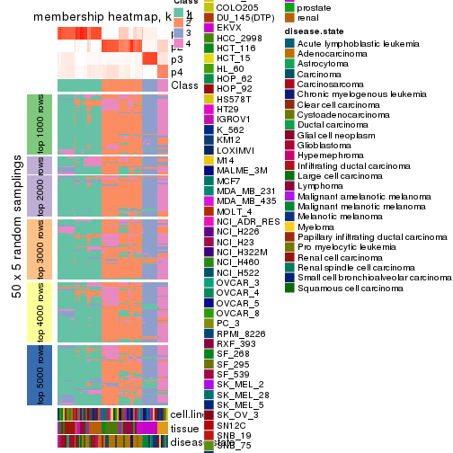</p>

</div>
<div id='tab-CV-kmeans-membership-heatmap-4'>
<pre><code class="r">membership_heatmap(res, k = 5)
</code></pre>

<p></p>

</div>
<div id='tab-CV-kmeans-membership-heatmap-5'>
<pre><code class="r">membership_heatmap(res, k = 6)
</code></pre>

<p></p>

</div>
</div>

As soon as we have had the classes for columns, we can look for signatures
which are significantly different between classes which can be candidate marks
for certain classes. Following are the heatmaps for signatures.


Signature heatmaps where rows are scaled:


<script>
$( function() {
	$( '#tabs-CV-kmeans-get-signatures' ).tabs();
} );
</script>
<div id='tabs-CV-kmeans-get-signatures'>
<ul>
<li><a href='#tab-CV-kmeans-get-signatures-1'>k = 2</a></li>
<li><a href='#tab-CV-kmeans-get-signatures-2'>k = 3</a></li>
<li><a href='#tab-CV-kmeans-get-signatures-3'>k = 4</a></li>
<li><a href='#tab-CV-kmeans-get-signatures-4'>k = 5</a></li>
<li><a href='#tab-CV-kmeans-get-signatures-5'>k = 6</a></li>
</ul>
<div id='tab-CV-kmeans-get-signatures-1'>
<pre><code class="r">get_signatures(res, k = 2)
</code></pre>

<pre><code>#&gt; Error: The width or height of the raster image is zero, maybe you forget to turn off the
#&gt; previous graphic device or it was corrupted. Run `dev.off()` to close it.
</code></pre>

<p></p>

</div>
<div id='tab-CV-kmeans-get-signatures-2'>
<pre><code class="r">get_signatures(res, k = 3)
</code></pre>

<pre><code>#&gt; Error: The width or height of the raster image is zero, maybe you forget to turn off the
#&gt; previous graphic device or it was corrupted. Run `dev.off()` to close it.
</code></pre>

<p></p>

</div>
<div id='tab-CV-kmeans-get-signatures-3'>
<pre><code class="r">get_signatures(res, k = 4)
</code></pre>

<pre><code>#&gt; Error: The width or height of the raster image is zero, maybe you forget to turn off the
#&gt; previous graphic device or it was corrupted. Run `dev.off()` to close it.
</code></pre>

<p></p>

</div>
<div id='tab-CV-kmeans-get-signatures-4'>
<pre><code class="r">get_signatures(res, k = 5)
</code></pre>

<pre><code>#&gt; Error: The width or height of the raster image is zero, maybe you forget to turn off the
#&gt; previous graphic device or it was corrupted. Run `dev.off()` to close it.
</code></pre>

<p></p>

</div>
<div id='tab-CV-kmeans-get-signatures-5'>
<pre><code class="r">get_signatures(res, k = 6)
</code></pre>

<pre><code>#&gt; Error: The width or height of the raster image is zero, maybe you forget to turn off the
#&gt; previous graphic device or it was corrupted. Run `dev.off()` to close it.
</code></pre>

<p></p>

</div>
</div>


Signature heatmaps where rows are not scaled:


<script>
$( function() {
	$( '#tabs-CV-kmeans-get-signatures-no-scale' ).tabs();
} );
</script>
<div id='tabs-CV-kmeans-get-signatures-no-scale'>
<ul>
<li><a href='#tab-CV-kmeans-get-signatures-no-scale-1'>k = 2</a></li>
<li><a href='#tab-CV-kmeans-get-signatures-no-scale-2'>k = 3</a></li>
<li><a href='#tab-CV-kmeans-get-signatures-no-scale-3'>k = 4</a></li>
<li><a href='#tab-CV-kmeans-get-signatures-no-scale-4'>k = 5</a></li>
<li><a href='#tab-CV-kmeans-get-signatures-no-scale-5'>k = 6</a></li>
</ul>
<div id='tab-CV-kmeans-get-signatures-no-scale-1'>
<pre><code class="r">get_signatures(res, k = 2, scale_rows = FALSE)
</code></pre>

<p></p>

</div>
<div id='tab-CV-kmeans-get-signatures-no-scale-2'>
<pre><code class="r">get_signatures(res, k = 3, scale_rows = FALSE)
</code></pre>

<p></p>

</div>
<div id='tab-CV-kmeans-get-signatures-no-scale-3'>
<pre><code class="r">get_signatures(res, k = 4, scale_rows = FALSE)
</code></pre>

<pre><code>#&gt; Error in mat[ceiling(1:nr/h_ratio), ceiling(1:nc/w_ratio), drop = FALSE]: subscript out of bounds
</code></pre>

<p></p>

</div>
<div id='tab-CV-kmeans-get-signatures-no-scale-4'>
<pre><code class="r">get_signatures(res, k = 5, scale_rows = FALSE)
</code></pre>

<p></p>

</div>
<div id='tab-CV-kmeans-get-signatures-no-scale-5'>
<pre><code class="r">get_signatures(res, k = 6, scale_rows = FALSE)
</code></pre>

<p></p>

</div>
</div>


Compare the overlap of signatures from different k:

```r
compare_signatures(res)
```


`get_signature()` returns a data frame invisibly. TO get the list of signatures, the function
call should be assigned to a variable explicitly. In following code, if `plot` argument is set
to `FALSE`, no heatmap is plotted while only the differential analysis is performed.

```r
# code only for demonstration
tb = get_signature(res, k = ..., plot = FALSE)
```

An example of the output of `tb` is:

```
#>   which_row         fdr    mean_1    mean_2 scaled_mean_1 scaled_mean_2 km
#> 1        38 0.042760348  8.373488  9.131774    -0.5533452     0.5164555  1
#> 2        40 0.018707592  7.106213  8.469186    -0.6173731     0.5762149  1
#> 3        55 0.019134737 10.221463 11.207825    -0.6159697     0.5749050  1
#> 4        59 0.006059896  5.921854  7.869574    -0.6899429     0.6439467  1
#> 5        60 0.018055526  8.928898 10.211722    -0.6204761     0.5791110  1
#> 6        98 0.009384629 15.714769 14.887706     0.6635654    -0.6193277  2
...
```

The columns in `tb` are:

1. `which_row`: row indices corresponding to the input matrix.
2. `fdr`: FDR for the differential test. 
3. `mean_x`: The mean value in group x.
4. `scaled_mean_x`: The mean value in group x after rows are scaled.
5. `km`: Row groups if k-means clustering is applied to rows.


UMAP plot which shows how samples are separated.


<script>
$( function() {
	$( '#tabs-CV-kmeans-dimension-reduction' ).tabs();
} );
</script>
<div id='tabs-CV-kmeans-dimension-reduction'>
<ul>
<li><a href='#tab-CV-kmeans-dimension-reduction-1'>k = 2</a></li>
<li><a href='#tab-CV-kmeans-dimension-reduction-2'>k = 3</a></li>
<li><a href='#tab-CV-kmeans-dimension-reduction-3'>k = 4</a></li>
<li><a href='#tab-CV-kmeans-dimension-reduction-4'>k = 5</a></li>
<li><a href='#tab-CV-kmeans-dimension-reduction-5'>k = 6</a></li>
</ul>
<div id='tab-CV-kmeans-dimension-reduction-1'>
<pre><code class="r">dimension_reduction(res, k = 2, method = &quot;UMAP&quot;)
</code></pre>

<p></p>

</div>
<div id='tab-CV-kmeans-dimension-reduction-2'>
<pre><code class="r">dimension_reduction(res, k = 3, method = &quot;UMAP&quot;)
</code></pre>

<p></p>

</div>
<div id='tab-CV-kmeans-dimension-reduction-3'>
<pre><code class="r">dimension_reduction(res, k = 4, method = &quot;UMAP&quot;)
</code></pre>

<p></p>

</div>
<div id='tab-CV-kmeans-dimension-reduction-4'>
<pre><code class="r">dimension_reduction(res, k = 5, method = &quot;UMAP&quot;)
</code></pre>

<p></p>

</div>
<div id='tab-CV-kmeans-dimension-reduction-5'>
<pre><code class="r">dimension_reduction(res, k = 6, method = &quot;UMAP&quot;)
</code></pre>

<p></p>

</div>
</div>


Following heatmap shows how subgroups are split when increasing `k`:

```r
collect_classes(res)
```


Test correlation between subgroups and known annotations. If the known
annotation is numeric, one-way ANOVA test is applied, and if the known
annotation is discrete, chi-squared contingency table test is applied.

```r
test_to_known_factors(res)
```

```
#>             n cell.line(p) tissue(p) disease.state(p) k
#> CV:kmeans 141     4.42e-11  2.17e-16         8.52e-10 2
#> CV:kmeans 150     2.25e-21  7.93e-38         4.03e-29 3
#> CV:kmeans 171     3.77e-35  2.98e-73         2.27e-53 4
#> CV:kmeans 111     4.95e-24  5.15e-48         1.36e-34 5
#> CV:kmeans 130     4.64e-44 6.14e-105         1.23e-56 6
```


If matrix rows can be associated to genes, consider to use `GO_Enrichment(res,
...)` to perform function enrichment for the signature genes.


 

---------------------------------------------------


### CV:skmeans**


The object with results only for a single top-value method and a single partition method 
can be extracted as:

```r
res = res_list["CV", "skmeans"]
# you can also extract it by
# res = res_list["CV:skmeans"]
```

A summary of `res` and all the functions that can be applied to it:

```r
res
```

```
#> A 'ConsensusPartition' object with k = 2, 3, 4, 5, 6.
#>   On a matrix with 51941 rows and 174 columns.
#>   Top rows (1000, 2000, 3000, 4000, 5000) are extracted by 'CV' method.
#>   Subgroups are detected by 'skmeans' method.
#>   Performed in total 1250 partitions by row resampling.
#>   Best k for subgroups seems to be 2.
#> 
#> Following methods can be applied to this 'ConsensusPartition' object:
#>  [1] "cola_report"             "collect_classes"         "collect_plots"          
#>  [4] "collect_stats"           "colnames"                "compare_signatures"     
#>  [7] "consensus_heatmap"       "dimension_reduction"     "functional_enrichment"  
#> [10] "get_anno_col"            "get_anno"                "get_classes"            
#> [13] "get_consensus"           "get_matrix"              "get_membership"         
#> [16] "get_param"               "get_signatures"          "get_stats"              
#> [19] "is_best_k"               "is_stable_k"             "membership_heatmap"     
#> [22] "ncol"                    "nrow"                    "plot_ecdf"              
#> [25] "rownames"                "select_partition_number" "show"                   
#> [28] "suggest_best_k"          "test_to_known_factors"
```

`collect_plots()` function collects all the plots made from `res` for all `k` (number of partitions)
into one single page to provide an easy and fast comparison between different `k`.

```r
collect_plots(res)
```


The plots are:

- The first row: a plot of the ECDF (Empirical cumulative distribution
  function) curves of the consensus matrix for each `k` and the heatmap of
  predicted classes for each `k`.
- The second row: heatmaps of the consensus matrix for each `k`.
- The third row: heatmaps of the membership matrix for each `k`.
- The fouth row: heatmaps of the signatures for each `k`.

All the plots in panels can be made by individual functions and they are
plotted later in this section.

`select_partition_number()` produces several plots showing different
statistics for choosing "optimized" `k`. There are following statistics:

- ECDF curves of the consensus matrix for each `k`;
- 1-PAC. [The PAC
  score](https://en.wikipedia.org/wiki/Consensus_clustering#Over-interpretation_potential_of_consensus_clustering)
  measures the proportion of the ambiguous subgrouping.
- Mean silhouette score.
- Concordance. The mean probability of fiting the consensus class ids in all
  partitions.
- Area increased. Denote $A_k$ as the area under the ECDF curve for current
  `k`, the area increased is defined as $A_k - A_{k-1}$.
- Rand index. The percent of pairs of samples that are both in a same cluster
  or both are not in a same cluster in the partition of k and k-1.
- Jaccard index. The ratio of pairs of samples are both in a same cluster in
  the partition of k and k-1 and the pairs of samples are both in a same
  cluster in the partition k or k-1.

The detailed explanations of these statistics can be found in [the cola
vignette](http://bioconductor.org/packages/devel/bioc/vignettes/cola/inst/doc/cola.html#toc_13).

Generally speaking, lower PAC score, higher mean silhouette score or higher
concordance corresponds to better partition. Rand index and Jaccard index
measure how similar the current partition is compared to partition with `k-1`.
If they are too similar, we won't accept `k` is better than `k-1`.

```r
select_partition_number(res)
```


The numeric values for all these statistics can be obtained by `get_stats()`.

```r
get_stats(res)
```

```
#>   k 1-PAC mean_silhouette concordance area_increased  Rand Jaccard
#> 2 2 1.000           0.964       0.979         0.5021 0.499   0.499
#> 3 3 0.900           0.948       0.972         0.3004 0.791   0.602
#> 4 4 0.748           0.864       0.890         0.0972 0.936   0.819
#> 5 5 0.715           0.700       0.831         0.0863 0.901   0.679
#> 6 6 0.786           0.744       0.838         0.0540 0.913   0.637
```

`suggest_best_k()` suggests the best $k$ based on these statistics. The rules are as follows:

- All $k$ with Jaccard index larger than 0.95 are removed because the increase of
  the partition number does not provides enough extra information. If all $k$ are removed,
  the best $k$ is assigned by `NA`.
- For $k$ with 1-PAC larger than 0.9, the maximal $k$ is taken as the "best k". Other $k$ is called "optional k".
- If it does not fit the second rule. The $k$ with the highest vote of highest
  1-PAC, mean silhouette and concordance is taken as the "best k".

```r
suggest_best_k(res)
```

```
#> [1] 2
```


Following shows the table of the partitions (You need to click the **show/hide
code output** link to see it). The membership matrix (columns with name `p*`)
is inferred by
[`clue::cl_consensus()`](https://www.rdocumentation.org/link/cl_consensus?package=clue)
function with the `SE` method. Basically the value in the membership matrix
represents the probability to belong to a certain group. The finall class
label for an item is determined with the group with highest probability it
belongs to.

In `get_classes()` function, the entropy is calculated from the membership
matrix and the silhouette score is calculated from the consensus matrix.


<script>
$( function() {
	$( '#tabs-CV-skmeans-get-classes' ).tabs();
} );
</script>
<div id='tabs-CV-skmeans-get-classes'>
<ul>
<li><a href='#tab-CV-skmeans-get-classes-1'>k = 2</a></li>
<li><a href='#tab-CV-skmeans-get-classes-2'>k = 3</a></li>
<li><a href='#tab-CV-skmeans-get-classes-3'>k = 4</a></li>
<li><a href='#tab-CV-skmeans-get-classes-4'>k = 5</a></li>
<li><a href='#tab-CV-skmeans-get-classes-5'>k = 6</a></li>
</ul>

<div id='tab-CV-skmeans-get-classes-1'>
<p><a id='tab-CV-skmeans-get-classes-1-a' style='color:#0366d6' href='#'>show/hide code output</a></p>
<pre><code class="r">cbind(get_classes(res, k = 2), get_membership(res, k = 2))
</code></pre>

<pre><code>#&gt;           class entropy silhouette    p1    p2
#&gt; GSM803615     2   0.000      0.987 0.000 1.000
#&gt; GSM803674     2   0.000      0.987 0.000 1.000
#&gt; GSM803733     2   0.000      0.987 0.000 1.000
#&gt; GSM803616     2   0.000      0.987 0.000 1.000
#&gt; GSM803675     2   0.000      0.987 0.000 1.000
#&gt; GSM803734     2   0.000      0.987 0.000 1.000
#&gt; GSM803617     2   0.000      0.987 0.000 1.000
#&gt; GSM803676     2   0.000      0.987 0.000 1.000
#&gt; GSM803735     2   0.000      0.987 0.000 1.000
#&gt; GSM803618     2   0.000      0.987 0.000 1.000
#&gt; GSM803677     2   0.000      0.987 0.000 1.000
#&gt; GSM803736     2   0.000      0.987 0.000 1.000
#&gt; GSM803619     2   0.000      0.987 0.000 1.000
#&gt; GSM803678     2   0.000      0.987 0.000 1.000
#&gt; GSM803737     2   0.000      0.987 0.000 1.000
#&gt; GSM803620     2   0.000      0.987 0.000 1.000
#&gt; GSM803679     2   0.000      0.987 0.000 1.000
#&gt; GSM803738     2   0.000      0.987 0.000 1.000
#&gt; GSM803621     1   0.000      0.971 1.000 0.000
#&gt; GSM803680     1   0.000      0.971 1.000 0.000
#&gt; GSM803739     1   0.000      0.971 1.000 0.000
#&gt; GSM803622     1   0.000      0.971 1.000 0.000
#&gt; GSM803681     1   0.000      0.971 1.000 0.000
#&gt; GSM803740     1   0.000      0.971 1.000 0.000
#&gt; GSM803623     2   0.000      0.987 0.000 1.000
#&gt; GSM803682     2   0.000      0.987 0.000 1.000
#&gt; GSM803741     2   0.000      0.987 0.000 1.000
#&gt; GSM803624     1   0.921      0.495 0.664 0.336
#&gt; GSM803683     1   0.000      0.971 1.000 0.000
#&gt; GSM803742     1   0.000      0.971 1.000 0.000
#&gt; GSM803625     1   0.000      0.971 1.000 0.000
#&gt; GSM803684     1   0.000      0.971 1.000 0.000
#&gt; GSM803743     1   0.000      0.971 1.000 0.000
#&gt; GSM803626     1   0.388      0.933 0.924 0.076
#&gt; GSM803685     1   0.000      0.971 1.000 0.000
#&gt; GSM803744     1   0.388      0.933 0.924 0.076
#&gt; GSM803627     1   0.000      0.971 1.000 0.000
#&gt; GSM803686     1   0.000      0.971 1.000 0.000
#&gt; GSM803745     1   0.000      0.971 1.000 0.000
#&gt; GSM803628     1   0.000      0.971 1.000 0.000
#&gt; GSM803687     1   0.000      0.971 1.000 0.000
#&gt; GSM803746     1   0.000      0.971 1.000 0.000
#&gt; GSM803629     1   0.000      0.971 1.000 0.000
#&gt; GSM803688     1   0.000      0.971 1.000 0.000
#&gt; GSM803747     1   0.000      0.971 1.000 0.000
#&gt; GSM803630     1   0.000      0.971 1.000 0.000
#&gt; GSM803689     1   0.000      0.971 1.000 0.000
#&gt; GSM803748     1   0.000      0.971 1.000 0.000
#&gt; GSM803631     1   0.000      0.971 1.000 0.000
#&gt; GSM803690     1   0.000      0.971 1.000 0.000
#&gt; GSM803749     1   0.000      0.971 1.000 0.000
#&gt; GSM803632     1   0.000      0.971 1.000 0.000
#&gt; GSM803691     1   0.000      0.971 1.000 0.000
#&gt; GSM803750     1   0.000      0.971 1.000 0.000
#&gt; GSM803633     2   0.000      0.987 0.000 1.000
#&gt; GSM803692     2   0.000      0.987 0.000 1.000
#&gt; GSM803751     2   0.000      0.987 0.000 1.000
#&gt; GSM803634     2   0.000      0.987 0.000 1.000
#&gt; GSM803693     2   0.000      0.987 0.000 1.000
#&gt; GSM803752     2   0.000      0.987 0.000 1.000
#&gt; GSM803635     2   0.000      0.987 0.000 1.000
#&gt; GSM803694     2   0.000      0.987 0.000 1.000
#&gt; GSM803753     2   0.000      0.987 0.000 1.000
#&gt; GSM803636     2   0.000      0.987 0.000 1.000
#&gt; GSM803695     2   0.000      0.987 0.000 1.000
#&gt; GSM803754     2   0.000      0.987 0.000 1.000
#&gt; GSM803637     2   0.000      0.987 0.000 1.000
#&gt; GSM803696     2   0.000      0.987 0.000 1.000
#&gt; GSM803755     2   0.000      0.987 0.000 1.000
#&gt; GSM803638     2   0.000      0.987 0.000 1.000
#&gt; GSM803697     2   0.000      0.987 0.000 1.000
#&gt; GSM803756     2   0.000      0.987 0.000 1.000
#&gt; GSM803639     2   0.000      0.987 0.000 1.000
#&gt; GSM803698     2   0.000      0.987 0.000 1.000
#&gt; GSM803757     2   0.000      0.987 0.000 1.000
#&gt; GSM803640     1   0.000      0.971 1.000 0.000
#&gt; GSM803699     1   0.000      0.971 1.000 0.000
#&gt; GSM803758     1   0.000      0.971 1.000 0.000
#&gt; GSM803641     1   0.000      0.971 1.000 0.000
#&gt; GSM803700     1   0.000      0.971 1.000 0.000
#&gt; GSM803759     1   0.000      0.971 1.000 0.000
#&gt; GSM803642     1   0.000      0.971 1.000 0.000
#&gt; GSM803701     1   0.000      0.971 1.000 0.000
#&gt; GSM803760     1   0.000      0.971 1.000 0.000
#&gt; GSM803643     1   0.000      0.971 1.000 0.000
#&gt; GSM803702     1   0.000      0.971 1.000 0.000
#&gt; GSM803644     1   0.000      0.971 1.000 0.000
#&gt; GSM803703     1   0.000      0.971 1.000 0.000
#&gt; GSM803761     1   0.000      0.971 1.000 0.000
#&gt; GSM803645     1   0.000      0.971 1.000 0.000
#&gt; GSM803704     1   0.000      0.971 1.000 0.000
#&gt; GSM803762     1   0.000      0.971 1.000 0.000
#&gt; GSM803646     1   0.402      0.910 0.920 0.080
#&gt; GSM803705     1   0.402      0.910 0.920 0.080
#&gt; GSM803763     1   0.402      0.910 0.920 0.080
#&gt; GSM803647     1   0.000      0.971 1.000 0.000
#&gt; GSM803706     1   0.000      0.971 1.000 0.000
#&gt; GSM803764     1   0.000      0.971 1.000 0.000
#&gt; GSM803648     2   0.373      0.933 0.072 0.928
#&gt; GSM803707     2   0.373      0.933 0.072 0.928
#&gt; GSM803765     2   0.373      0.933 0.072 0.928
#&gt; GSM803649     2   0.388      0.929 0.076 0.924
#&gt; GSM803708     2   0.388      0.929 0.076 0.924
#&gt; GSM803766     2   0.388      0.929 0.076 0.924
#&gt; GSM803650     1   0.000      0.971 1.000 0.000
#&gt; GSM803709     1   0.000      0.971 1.000 0.000
#&gt; GSM803767     1   0.000      0.971 1.000 0.000
#&gt; GSM803651     1   0.000      0.971 1.000 0.000
#&gt; GSM803710     1   0.000      0.971 1.000 0.000
#&gt; GSM803768     1   0.000      0.971 1.000 0.000
#&gt; GSM803652     1   0.000      0.971 1.000 0.000
#&gt; GSM803711     1   0.000      0.971 1.000 0.000
#&gt; GSM803653     2   0.000      0.987 0.000 1.000
#&gt; GSM803712     2   0.000      0.987 0.000 1.000
#&gt; GSM803769     2   0.000      0.987 0.000 1.000
#&gt; GSM803654     2   0.000      0.987 0.000 1.000
#&gt; GSM803713     2   0.000      0.987 0.000 1.000
#&gt; GSM803770     2   0.000      0.987 0.000 1.000
#&gt; GSM803655     2   0.260      0.956 0.044 0.956
#&gt; GSM803714     2   0.260      0.956 0.044 0.956
#&gt; GSM803771     2   0.260      0.956 0.044 0.956
#&gt; GSM803656     2   0.000      0.987 0.000 1.000
#&gt; GSM803715     2   0.000      0.987 0.000 1.000
#&gt; GSM803772     2   0.000      0.987 0.000 1.000
#&gt; GSM803657     2   0.000      0.987 0.000 1.000
#&gt; GSM803716     2   0.000      0.987 0.000 1.000
#&gt; GSM803773     2   0.000      0.987 0.000 1.000
#&gt; GSM803658     2   0.000      0.987 0.000 1.000
#&gt; GSM803717     2   0.000      0.987 0.000 1.000
#&gt; GSM803774     2   0.000      0.987 0.000 1.000
#&gt; GSM803659     2   0.000      0.987 0.000 1.000
#&gt; GSM803718     2   0.000      0.987 0.000 1.000
#&gt; GSM803775     2   0.000      0.987 0.000 1.000
#&gt; GSM803660     2   0.388      0.929 0.076 0.924
#&gt; GSM803719     2   0.388      0.929 0.076 0.924
#&gt; GSM803776     2   0.388      0.929 0.076 0.924
#&gt; GSM803661     1   0.000      0.971 1.000 0.000
#&gt; GSM803720     1   0.000      0.971 1.000 0.000
#&gt; GSM803777     1   0.000      0.971 1.000 0.000
#&gt; GSM803662     2   0.388      0.929 0.076 0.924
#&gt; GSM803732     1   0.625      0.821 0.844 0.156
#&gt; GSM803778     1   0.714      0.764 0.804 0.196
#&gt; GSM803663     2   0.204      0.965 0.032 0.968
#&gt; GSM803721     2   0.204      0.965 0.032 0.968
#&gt; GSM803779     2   0.204      0.965 0.032 0.968
#&gt; GSM803664     2   0.000      0.987 0.000 1.000
#&gt; GSM803722     2   0.000      0.987 0.000 1.000
#&gt; GSM803780     2   0.000      0.987 0.000 1.000
#&gt; GSM803665     1   0.000      0.971 1.000 0.000
#&gt; GSM803723     1   0.000      0.971 1.000 0.000
#&gt; GSM803781     1   0.000      0.971 1.000 0.000
#&gt; GSM803666     1   0.388      0.933 0.924 0.076
#&gt; GSM803724     1   0.388      0.933 0.924 0.076
#&gt; GSM803782     1   0.388      0.933 0.924 0.076
#&gt; GSM803667     1   0.388      0.933 0.924 0.076
#&gt; GSM803725     1   0.388      0.933 0.924 0.076
#&gt; GSM803783     1   0.388      0.933 0.924 0.076
#&gt; GSM803668     1   0.388      0.933 0.924 0.076
#&gt; GSM803726     1   0.388      0.933 0.924 0.076
#&gt; GSM803784     1   0.388      0.933 0.924 0.076
#&gt; GSM803669     1   0.388      0.933 0.924 0.076
#&gt; GSM803727     1   0.388      0.933 0.924 0.076
#&gt; GSM803670     1   0.388      0.933 0.924 0.076
#&gt; GSM803728     1   0.388      0.933 0.924 0.076
#&gt; GSM803785     1   0.388      0.933 0.924 0.076
#&gt; GSM803671     1   0.388      0.933 0.924 0.076
#&gt; GSM803729     1   0.388      0.933 0.924 0.076
#&gt; GSM803786     1   0.388      0.933 0.924 0.076
#&gt; GSM803672     1   0.388      0.933 0.924 0.076
#&gt; GSM803730     1   0.388      0.933 0.924 0.076
#&gt; GSM803787     1   0.388      0.933 0.924 0.076
#&gt; GSM803673     2   0.000      0.987 0.000 1.000
#&gt; GSM803731     2   0.000      0.987 0.000 1.000
#&gt; GSM803788     2   0.000      0.987 0.000 1.000
</code></pre>

<script>
$('#tab-CV-skmeans-get-classes-1-a').parent().next().next().hide();
$('#tab-CV-skmeans-get-classes-1-a').click(function(){
  $('#tab-CV-skmeans-get-classes-1-a').parent().next().next().toggle();
  return(false);
});
</script>
</div>

<div id='tab-CV-skmeans-get-classes-2'>
<p><a id='tab-CV-skmeans-get-classes-2-a' style='color:#0366d6' href='#'>show/hide code output</a></p>
<pre><code class="r">cbind(get_classes(res, k = 3), get_membership(res, k = 3))
</code></pre>

<pre><code>#&gt;           class entropy silhouette    p1    p2    p3
#&gt; GSM803615     3  0.3267      0.915 0.000 0.116 0.884
#&gt; GSM803674     3  0.3267      0.915 0.000 0.116 0.884
#&gt; GSM803733     3  0.3267      0.915 0.000 0.116 0.884
#&gt; GSM803616     3  0.3267      0.915 0.000 0.116 0.884
#&gt; GSM803675     3  0.3267      0.915 0.000 0.116 0.884
#&gt; GSM803734     3  0.3267      0.915 0.000 0.116 0.884
#&gt; GSM803617     3  0.3267      0.915 0.000 0.116 0.884
#&gt; GSM803676     3  0.3267      0.915 0.000 0.116 0.884
#&gt; GSM803735     3  0.3267      0.915 0.000 0.116 0.884
#&gt; GSM803618     3  0.3267      0.915 0.000 0.116 0.884
#&gt; GSM803677     3  0.3267      0.915 0.000 0.116 0.884
#&gt; GSM803736     3  0.3267      0.915 0.000 0.116 0.884
#&gt; GSM803619     3  0.3267      0.915 0.000 0.116 0.884
#&gt; GSM803678     3  0.3267      0.915 0.000 0.116 0.884
#&gt; GSM803737     3  0.3267      0.915 0.000 0.116 0.884
#&gt; GSM803620     3  0.3267      0.915 0.000 0.116 0.884
#&gt; GSM803679     3  0.3267      0.915 0.000 0.116 0.884
#&gt; GSM803738     3  0.3267      0.915 0.000 0.116 0.884
#&gt; GSM803621     1  0.0424      0.979 0.992 0.000 0.008
#&gt; GSM803680     1  0.0424      0.979 0.992 0.000 0.008
#&gt; GSM803739     1  0.0424      0.979 0.992 0.000 0.008
#&gt; GSM803622     1  0.0424      0.979 0.992 0.000 0.008
#&gt; GSM803681     1  0.0424      0.979 0.992 0.000 0.008
#&gt; GSM803740     1  0.0424      0.979 0.992 0.000 0.008
#&gt; GSM803623     2  0.0000      0.981 0.000 1.000 0.000
#&gt; GSM803682     2  0.0000      0.981 0.000 1.000 0.000
#&gt; GSM803741     2  0.0000      0.981 0.000 1.000 0.000
#&gt; GSM803624     1  0.1482      0.954 0.968 0.020 0.012
#&gt; GSM803683     1  0.0000      0.980 1.000 0.000 0.000
#&gt; GSM803742     1  0.0000      0.980 1.000 0.000 0.000
#&gt; GSM803625     1  0.0000      0.980 1.000 0.000 0.000
#&gt; GSM803684     1  0.0000      0.980 1.000 0.000 0.000
#&gt; GSM803743     1  0.0000      0.980 1.000 0.000 0.000
#&gt; GSM803626     3  0.0000      0.935 0.000 0.000 1.000
#&gt; GSM803685     3  0.6095      0.299 0.392 0.000 0.608
#&gt; GSM803744     3  0.0000      0.935 0.000 0.000 1.000
#&gt; GSM803627     1  0.0424      0.979 0.992 0.000 0.008
#&gt; GSM803686     1  0.0424      0.979 0.992 0.000 0.008
#&gt; GSM803745     1  0.0424      0.979 0.992 0.000 0.008
#&gt; GSM803628     1  0.0424      0.979 0.992 0.000 0.008
#&gt; GSM803687     1  0.0424      0.979 0.992 0.000 0.008
#&gt; GSM803746     1  0.0424      0.979 0.992 0.000 0.008
#&gt; GSM803629     1  0.0424      0.979 0.992 0.000 0.008
#&gt; GSM803688     1  0.0424      0.979 0.992 0.000 0.008
#&gt; GSM803747     1  0.0424      0.979 0.992 0.000 0.008
#&gt; GSM803630     1  0.0424      0.979 0.992 0.000 0.008
#&gt; GSM803689     1  0.0424      0.979 0.992 0.000 0.008
#&gt; GSM803748     1  0.0424      0.979 0.992 0.000 0.008
#&gt; GSM803631     1  0.0424      0.979 0.992 0.000 0.008
#&gt; GSM803690     1  0.0424      0.979 0.992 0.000 0.008
#&gt; GSM803749     1  0.0424      0.979 0.992 0.000 0.008
#&gt; GSM803632     1  0.0424      0.979 0.992 0.000 0.008
#&gt; GSM803691     1  0.0424      0.979 0.992 0.000 0.008
#&gt; GSM803750     1  0.0424      0.979 0.992 0.000 0.008
#&gt; GSM803633     2  0.0000      0.981 0.000 1.000 0.000
#&gt; GSM803692     2  0.0000      0.981 0.000 1.000 0.000
#&gt; GSM803751     2  0.0000      0.981 0.000 1.000 0.000
#&gt; GSM803634     2  0.0000      0.981 0.000 1.000 0.000
#&gt; GSM803693     2  0.0000      0.981 0.000 1.000 0.000
#&gt; GSM803752     2  0.0000      0.981 0.000 1.000 0.000
#&gt; GSM803635     2  0.0000      0.981 0.000 1.000 0.000
#&gt; GSM803694     2  0.0000      0.981 0.000 1.000 0.000
#&gt; GSM803753     2  0.0000      0.981 0.000 1.000 0.000
#&gt; GSM803636     2  0.0000      0.981 0.000 1.000 0.000
#&gt; GSM803695     2  0.0000      0.981 0.000 1.000 0.000
#&gt; GSM803754     2  0.0000      0.981 0.000 1.000 0.000
#&gt; GSM803637     2  0.0000      0.981 0.000 1.000 0.000
#&gt; GSM803696     2  0.0000      0.981 0.000 1.000 0.000
#&gt; GSM803755     2  0.0000      0.981 0.000 1.000 0.000
#&gt; GSM803638     2  0.0000      0.981 0.000 1.000 0.000
#&gt; GSM803697     2  0.0000      0.981 0.000 1.000 0.000
#&gt; GSM803756     2  0.0000      0.981 0.000 1.000 0.000
#&gt; GSM803639     2  0.0000      0.981 0.000 1.000 0.000
#&gt; GSM803698     2  0.0000      0.981 0.000 1.000 0.000
#&gt; GSM803757     2  0.0000      0.981 0.000 1.000 0.000
#&gt; GSM803640     1  0.0000      0.980 1.000 0.000 0.000
#&gt; GSM803699     1  0.0000      0.980 1.000 0.000 0.000
#&gt; GSM803758     1  0.0000      0.980 1.000 0.000 0.000
#&gt; GSM803641     1  0.0000      0.980 1.000 0.000 0.000
#&gt; GSM803700     1  0.0000      0.980 1.000 0.000 0.000
#&gt; GSM803759     1  0.0000      0.980 1.000 0.000 0.000
#&gt; GSM803642     1  0.0000      0.980 1.000 0.000 0.000
#&gt; GSM803701     1  0.0000      0.980 1.000 0.000 0.000
#&gt; GSM803760     1  0.0000      0.980 1.000 0.000 0.000
#&gt; GSM803643     1  0.0000      0.980 1.000 0.000 0.000
#&gt; GSM803702     1  0.0000      0.980 1.000 0.000 0.000
#&gt; GSM803644     1  0.0000      0.980 1.000 0.000 0.000
#&gt; GSM803703     1  0.0000      0.980 1.000 0.000 0.000
#&gt; GSM803761     1  0.0000      0.980 1.000 0.000 0.000
#&gt; GSM803645     1  0.0000      0.980 1.000 0.000 0.000
#&gt; GSM803704     1  0.0000      0.980 1.000 0.000 0.000
#&gt; GSM803762     1  0.0000      0.980 1.000 0.000 0.000
#&gt; GSM803646     1  0.0000      0.980 1.000 0.000 0.000
#&gt; GSM803705     1  0.0000      0.980 1.000 0.000 0.000
#&gt; GSM803763     1  0.0000      0.980 1.000 0.000 0.000
#&gt; GSM803647     1  0.0000      0.980 1.000 0.000 0.000
#&gt; GSM803706     1  0.0000      0.980 1.000 0.000 0.000
#&gt; GSM803764     1  0.0000      0.980 1.000 0.000 0.000
#&gt; GSM803648     2  0.0424      0.975 0.008 0.992 0.000
#&gt; GSM803707     2  0.0424      0.975 0.008 0.992 0.000
#&gt; GSM803765     2  0.0424      0.975 0.008 0.992 0.000
#&gt; GSM803649     2  0.2066      0.921 0.060 0.940 0.000
#&gt; GSM803708     2  0.2066      0.921 0.060 0.940 0.000
#&gt; GSM803766     2  0.2066      0.921 0.060 0.940 0.000
#&gt; GSM803650     1  0.0000      0.980 1.000 0.000 0.000
#&gt; GSM803709     1  0.0000      0.980 1.000 0.000 0.000
#&gt; GSM803767     1  0.0000      0.980 1.000 0.000 0.000
#&gt; GSM803651     1  0.0000      0.980 1.000 0.000 0.000
#&gt; GSM803710     1  0.0000      0.980 1.000 0.000 0.000
#&gt; GSM803768     1  0.0000      0.980 1.000 0.000 0.000
#&gt; GSM803652     1  0.0000      0.980 1.000 0.000 0.000
#&gt; GSM803711     1  0.0000      0.980 1.000 0.000 0.000
#&gt; GSM803653     2  0.0237      0.978 0.000 0.996 0.004
#&gt; GSM803712     2  0.0237      0.978 0.000 0.996 0.004
#&gt; GSM803769     2  0.0237      0.978 0.000 0.996 0.004
#&gt; GSM803654     2  0.0000      0.981 0.000 1.000 0.000
#&gt; GSM803713     2  0.0000      0.981 0.000 1.000 0.000
#&gt; GSM803770     2  0.0000      0.981 0.000 1.000 0.000
#&gt; GSM803655     2  0.0000      0.981 0.000 1.000 0.000
#&gt; GSM803714     2  0.0000      0.981 0.000 1.000 0.000
#&gt; GSM803771     2  0.0000      0.981 0.000 1.000 0.000
#&gt; GSM803656     2  0.5016      0.665 0.000 0.760 0.240
#&gt; GSM803715     2  0.5016      0.665 0.000 0.760 0.240
#&gt; GSM803772     2  0.5016      0.665 0.000 0.760 0.240
#&gt; GSM803657     2  0.0000      0.981 0.000 1.000 0.000
#&gt; GSM803716     2  0.0000      0.981 0.000 1.000 0.000
#&gt; GSM803773     2  0.0000      0.981 0.000 1.000 0.000
#&gt; GSM803658     2  0.0000      0.981 0.000 1.000 0.000
#&gt; GSM803717     2  0.0000      0.981 0.000 1.000 0.000
#&gt; GSM803774     2  0.0000      0.981 0.000 1.000 0.000
#&gt; GSM803659     2  0.0000      0.981 0.000 1.000 0.000
#&gt; GSM803718     2  0.0000      0.981 0.000 1.000 0.000
#&gt; GSM803775     2  0.0000      0.981 0.000 1.000 0.000
#&gt; GSM803660     2  0.1031      0.961 0.024 0.976 0.000
#&gt; GSM803719     2  0.1031      0.961 0.024 0.976 0.000
#&gt; GSM803776     2  0.1031      0.961 0.024 0.976 0.000
#&gt; GSM803661     1  0.0000      0.980 1.000 0.000 0.000
#&gt; GSM803720     1  0.0000      0.980 1.000 0.000 0.000
#&gt; GSM803777     1  0.0000      0.980 1.000 0.000 0.000
#&gt; GSM803662     2  0.1753      0.935 0.048 0.952 0.000
#&gt; GSM803732     1  0.1964      0.924 0.944 0.056 0.000
#&gt; GSM803778     1  0.2261      0.910 0.932 0.068 0.000
#&gt; GSM803663     2  0.0424      0.975 0.008 0.992 0.000
#&gt; GSM803721     2  0.0424      0.975 0.008 0.992 0.000
#&gt; GSM803779     2  0.0424      0.975 0.008 0.992 0.000
#&gt; GSM803664     2  0.0000      0.981 0.000 1.000 0.000
#&gt; GSM803722     2  0.0000      0.981 0.000 1.000 0.000
#&gt; GSM803780     2  0.0000      0.981 0.000 1.000 0.000
#&gt; GSM803665     1  0.5678      0.561 0.684 0.000 0.316
#&gt; GSM803723     1  0.5678      0.561 0.684 0.000 0.316
#&gt; GSM803781     1  0.5678      0.561 0.684 0.000 0.316
#&gt; GSM803666     3  0.0000      0.935 0.000 0.000 1.000
#&gt; GSM803724     3  0.0000      0.935 0.000 0.000 1.000
#&gt; GSM803782     3  0.0000      0.935 0.000 0.000 1.000
#&gt; GSM803667     3  0.0000      0.935 0.000 0.000 1.000
#&gt; GSM803725     3  0.0000      0.935 0.000 0.000 1.000
#&gt; GSM803783     3  0.0000      0.935 0.000 0.000 1.000
#&gt; GSM803668     3  0.0000      0.935 0.000 0.000 1.000
#&gt; GSM803726     3  0.0000      0.935 0.000 0.000 1.000
#&gt; GSM803784     3  0.0000      0.935 0.000 0.000 1.000
#&gt; GSM803669     3  0.0000      0.935 0.000 0.000 1.000
#&gt; GSM803727     3  0.0000      0.935 0.000 0.000 1.000
#&gt; GSM803670     3  0.0000      0.935 0.000 0.000 1.000
#&gt; GSM803728     3  0.0000      0.935 0.000 0.000 1.000
#&gt; GSM803785     3  0.0000      0.935 0.000 0.000 1.000
#&gt; GSM803671     3  0.0000      0.935 0.000 0.000 1.000
#&gt; GSM803729     3  0.0000      0.935 0.000 0.000 1.000
#&gt; GSM803786     3  0.0000      0.935 0.000 0.000 1.000
#&gt; GSM803672     3  0.0000      0.935 0.000 0.000 1.000
#&gt; GSM803730     3  0.0000      0.935 0.000 0.000 1.000
#&gt; GSM803787     3  0.0000      0.935 0.000 0.000 1.000
#&gt; GSM803673     2  0.0000      0.981 0.000 1.000 0.000
#&gt; GSM803731     2  0.0000      0.981 0.000 1.000 0.000
#&gt; GSM803788     2  0.0000      0.981 0.000 1.000 0.000
</code></pre>

<script>
$('#tab-CV-skmeans-get-classes-2-a').parent().next().next().hide();
$('#tab-CV-skmeans-get-classes-2-a').click(function(){
  $('#tab-CV-skmeans-get-classes-2-a').parent().next().next().toggle();
  return(false);
});
</script>
</div>

<div id='tab-CV-skmeans-get-classes-3'>
<p><a id='tab-CV-skmeans-get-classes-3-a' style='color:#0366d6' href='#'>show/hide code output</a></p>
<pre><code class="r">cbind(get_classes(res, k = 4), get_membership(res, k = 4))
</code></pre>

<pre><code>#&gt;           class entropy silhouette    p1    p2    p3    p4
#&gt; GSM803615     4  0.0376      0.931 0.000 0.004 0.004 0.992
#&gt; GSM803674     4  0.0376      0.931 0.000 0.004 0.004 0.992
#&gt; GSM803733     4  0.0376      0.931 0.000 0.004 0.004 0.992
#&gt; GSM803616     4  0.0376      0.931 0.000 0.004 0.004 0.992
#&gt; GSM803675     4  0.0376      0.931 0.000 0.004 0.004 0.992
#&gt; GSM803734     4  0.0376      0.931 0.000 0.004 0.004 0.992
#&gt; GSM803617     4  0.0376      0.931 0.000 0.004 0.004 0.992
#&gt; GSM803676     4  0.0376      0.931 0.000 0.004 0.004 0.992
#&gt; GSM803735     4  0.0376      0.931 0.000 0.004 0.004 0.992
#&gt; GSM803618     4  0.0376      0.931 0.000 0.004 0.004 0.992
#&gt; GSM803677     4  0.0376      0.931 0.000 0.004 0.004 0.992
#&gt; GSM803736     4  0.0376      0.931 0.000 0.004 0.004 0.992
#&gt; GSM803619     4  0.0376      0.931 0.000 0.004 0.004 0.992
#&gt; GSM803678     4  0.0376      0.931 0.000 0.004 0.004 0.992
#&gt; GSM803737     4  0.0376      0.931 0.000 0.004 0.004 0.992
#&gt; GSM803620     4  0.0376      0.931 0.000 0.004 0.004 0.992
#&gt; GSM803679     4  0.0376      0.931 0.000 0.004 0.004 0.992
#&gt; GSM803738     4  0.0376      0.931 0.000 0.004 0.004 0.992
#&gt; GSM803621     1  0.1489      0.902 0.952 0.000 0.044 0.004
#&gt; GSM803680     1  0.1489      0.902 0.952 0.000 0.044 0.004
#&gt; GSM803739     1  0.1489      0.902 0.952 0.000 0.044 0.004
#&gt; GSM803622     1  0.1661      0.901 0.944 0.000 0.052 0.004
#&gt; GSM803681     1  0.1661      0.901 0.944 0.000 0.052 0.004
#&gt; GSM803740     1  0.1661      0.901 0.944 0.000 0.052 0.004
#&gt; GSM803623     2  0.4277      0.795 0.000 0.720 0.000 0.280
#&gt; GSM803682     2  0.4277      0.795 0.000 0.720 0.000 0.280
#&gt; GSM803741     2  0.4277      0.795 0.000 0.720 0.000 0.280
#&gt; GSM803624     4  0.5849      0.545 0.276 0.032 0.020 0.672
#&gt; GSM803683     1  0.1911      0.898 0.944 0.032 0.020 0.004
#&gt; GSM803742     1  0.1911      0.898 0.944 0.032 0.020 0.004
#&gt; GSM803625     1  0.1042      0.903 0.972 0.008 0.020 0.000
#&gt; GSM803684     1  0.1042      0.903 0.972 0.008 0.020 0.000
#&gt; GSM803743     1  0.1042      0.903 0.972 0.008 0.020 0.000
#&gt; GSM803626     3  0.2345      0.993 0.000 0.000 0.900 0.100
#&gt; GSM803685     3  0.1824      0.854 0.060 0.000 0.936 0.004
#&gt; GSM803744     3  0.2345      0.993 0.000 0.000 0.900 0.100
#&gt; GSM803627     1  0.1661      0.901 0.944 0.000 0.052 0.004
#&gt; GSM803686     1  0.1661      0.901 0.944 0.000 0.052 0.004
#&gt; GSM803745     1  0.1661      0.901 0.944 0.000 0.052 0.004
#&gt; GSM803628     1  0.1661      0.901 0.944 0.000 0.052 0.004
#&gt; GSM803687     1  0.1661      0.901 0.944 0.000 0.052 0.004
#&gt; GSM803746     1  0.1661      0.901 0.944 0.000 0.052 0.004
#&gt; GSM803629     1  0.1661      0.901 0.944 0.000 0.052 0.004
#&gt; GSM803688     1  0.1661      0.901 0.944 0.000 0.052 0.004
#&gt; GSM803747     1  0.1661      0.901 0.944 0.000 0.052 0.004
#&gt; GSM803630     1  0.1661      0.901 0.944 0.000 0.052 0.004
#&gt; GSM803689     1  0.1661      0.901 0.944 0.000 0.052 0.004
#&gt; GSM803748     1  0.1661      0.901 0.944 0.000 0.052 0.004
#&gt; GSM803631     1  0.1661      0.901 0.944 0.000 0.052 0.004
#&gt; GSM803690     1  0.1661      0.901 0.944 0.000 0.052 0.004
#&gt; GSM803749     1  0.1661      0.901 0.944 0.000 0.052 0.004
#&gt; GSM803632     1  0.1661      0.901 0.944 0.000 0.052 0.004
#&gt; GSM803691     1  0.1661      0.901 0.944 0.000 0.052 0.004
#&gt; GSM803750     1  0.1661      0.901 0.944 0.000 0.052 0.004
#&gt; GSM803633     2  0.4008      0.829 0.000 0.756 0.000 0.244
#&gt; GSM803692     2  0.4008      0.829 0.000 0.756 0.000 0.244
#&gt; GSM803751     2  0.4008      0.829 0.000 0.756 0.000 0.244
#&gt; GSM803634     2  0.4008      0.829 0.000 0.756 0.000 0.244
#&gt; GSM803693     2  0.4008      0.829 0.000 0.756 0.000 0.244
#&gt; GSM803752     2  0.4008      0.829 0.000 0.756 0.000 0.244
#&gt; GSM803635     2  0.4008      0.829 0.000 0.756 0.000 0.244
#&gt; GSM803694     2  0.4008      0.829 0.000 0.756 0.000 0.244
#&gt; GSM803753     2  0.4008      0.829 0.000 0.756 0.000 0.244
#&gt; GSM803636     2  0.4008      0.829 0.000 0.756 0.000 0.244
#&gt; GSM803695     2  0.4008      0.829 0.000 0.756 0.000 0.244
#&gt; GSM803754     2  0.4008      0.829 0.000 0.756 0.000 0.244
#&gt; GSM803637     2  0.4008      0.829 0.000 0.756 0.000 0.244
#&gt; GSM803696     2  0.4008      0.829 0.000 0.756 0.000 0.244
#&gt; GSM803755     2  0.4008      0.829 0.000 0.756 0.000 0.244
#&gt; GSM803638     2  0.4008      0.829 0.000 0.756 0.000 0.244
#&gt; GSM803697     2  0.4008      0.829 0.000 0.756 0.000 0.244
#&gt; GSM803756     2  0.4008      0.829 0.000 0.756 0.000 0.244
#&gt; GSM803639     2  0.4008      0.829 0.000 0.756 0.000 0.244
#&gt; GSM803698     2  0.4008      0.829 0.000 0.756 0.000 0.244
#&gt; GSM803757     2  0.4008      0.829 0.000 0.756 0.000 0.244
#&gt; GSM803640     1  0.3464      0.874 0.868 0.076 0.056 0.000
#&gt; GSM803699     1  0.3464      0.874 0.868 0.076 0.056 0.000
#&gt; GSM803758     1  0.3464      0.874 0.868 0.076 0.056 0.000
#&gt; GSM803641     1  0.3464      0.874 0.868 0.076 0.056 0.000
#&gt; GSM803700     1  0.3464      0.874 0.868 0.076 0.056 0.000
#&gt; GSM803759     1  0.3464      0.874 0.868 0.076 0.056 0.000
#&gt; GSM803642     1  0.3464      0.874 0.868 0.076 0.056 0.000
#&gt; GSM803701     1  0.3464      0.874 0.868 0.076 0.056 0.000
#&gt; GSM803760     1  0.3464      0.874 0.868 0.076 0.056 0.000
#&gt; GSM803643     1  0.3464      0.874 0.868 0.076 0.056 0.000
#&gt; GSM803702     1  0.3464      0.874 0.868 0.076 0.056 0.000
#&gt; GSM803644     1  0.3320      0.877 0.876 0.068 0.056 0.000
#&gt; GSM803703     1  0.3320      0.877 0.876 0.068 0.056 0.000
#&gt; GSM803761     1  0.3320      0.877 0.876 0.068 0.056 0.000
#&gt; GSM803645     1  0.0336      0.904 0.992 0.000 0.008 0.000
#&gt; GSM803704     1  0.0336      0.904 0.992 0.000 0.008 0.000
#&gt; GSM803762     1  0.0336      0.904 0.992 0.000 0.008 0.000
#&gt; GSM803646     1  0.5321      0.735 0.716 0.228 0.056 0.000
#&gt; GSM803705     1  0.5321      0.735 0.716 0.228 0.056 0.000
#&gt; GSM803763     1  0.5321      0.735 0.716 0.228 0.056 0.000
#&gt; GSM803647     1  0.3464      0.874 0.868 0.076 0.056 0.000
#&gt; GSM803706     1  0.3464      0.874 0.868 0.076 0.056 0.000
#&gt; GSM803764     1  0.3464      0.874 0.868 0.076 0.056 0.000
#&gt; GSM803648     2  0.1339      0.800 0.008 0.964 0.024 0.004
#&gt; GSM803707     2  0.1339      0.800 0.008 0.964 0.024 0.004
#&gt; GSM803765     2  0.1339      0.800 0.008 0.964 0.024 0.004
#&gt; GSM803649     2  0.1471      0.798 0.012 0.960 0.024 0.004
#&gt; GSM803708     2  0.1471      0.798 0.012 0.960 0.024 0.004
#&gt; GSM803766     2  0.1471      0.798 0.012 0.960 0.024 0.004
#&gt; GSM803650     1  0.1118      0.903 0.964 0.000 0.036 0.000
#&gt; GSM803709     1  0.1118      0.903 0.964 0.000 0.036 0.000
#&gt; GSM803767     1  0.1118      0.903 0.964 0.000 0.036 0.000
#&gt; GSM803651     1  0.0895      0.903 0.976 0.004 0.020 0.000
#&gt; GSM803710     1  0.0895      0.903 0.976 0.004 0.020 0.000
#&gt; GSM803768     1  0.0895      0.903 0.976 0.004 0.020 0.000
#&gt; GSM803652     1  0.0188      0.904 0.996 0.000 0.004 0.000
#&gt; GSM803711     1  0.0188      0.904 0.996 0.000 0.004 0.000
#&gt; GSM803653     4  0.4103      0.705 0.000 0.256 0.000 0.744
#&gt; GSM803712     4  0.4103      0.705 0.000 0.256 0.000 0.744
#&gt; GSM803769     4  0.4103      0.705 0.000 0.256 0.000 0.744
#&gt; GSM803654     2  0.2149      0.841 0.000 0.912 0.000 0.088
#&gt; GSM803713     2  0.2149      0.841 0.000 0.912 0.000 0.088
#&gt; GSM803770     2  0.2149      0.841 0.000 0.912 0.000 0.088
#&gt; GSM803655     2  0.4486      0.667 0.008 0.784 0.020 0.188
#&gt; GSM803714     2  0.4486      0.667 0.008 0.784 0.020 0.188
#&gt; GSM803771     2  0.4486      0.667 0.008 0.784 0.020 0.188
#&gt; GSM803656     4  0.2081      0.874 0.000 0.084 0.000 0.916
#&gt; GSM803715     4  0.2081      0.874 0.000 0.084 0.000 0.916
#&gt; GSM803772     4  0.2081      0.874 0.000 0.084 0.000 0.916
#&gt; GSM803657     2  0.0592      0.827 0.000 0.984 0.000 0.016
#&gt; GSM803716     2  0.0592      0.827 0.000 0.984 0.000 0.016
#&gt; GSM803773     2  0.0592      0.827 0.000 0.984 0.000 0.016
#&gt; GSM803658     2  0.1302      0.837 0.000 0.956 0.000 0.044
#&gt; GSM803717     2  0.1302      0.837 0.000 0.956 0.000 0.044
#&gt; GSM803774     2  0.1302      0.837 0.000 0.956 0.000 0.044
#&gt; GSM803659     2  0.1302      0.837 0.000 0.956 0.000 0.044
#&gt; GSM803718     2  0.1302      0.837 0.000 0.956 0.000 0.044
#&gt; GSM803775     2  0.1302      0.837 0.000 0.956 0.000 0.044
#&gt; GSM803660     2  0.1443      0.798 0.008 0.960 0.028 0.004
#&gt; GSM803719     2  0.1443      0.798 0.008 0.960 0.028 0.004
#&gt; GSM803776     2  0.1443      0.798 0.008 0.960 0.028 0.004
#&gt; GSM803661     1  0.1911      0.898 0.944 0.032 0.020 0.004
#&gt; GSM803720     1  0.1911      0.898 0.944 0.032 0.020 0.004
#&gt; GSM803777     1  0.1911      0.898 0.944 0.032 0.020 0.004
#&gt; GSM803662     2  0.2944      0.742 0.044 0.900 0.052 0.004
#&gt; GSM803732     1  0.6032      0.627 0.632 0.308 0.056 0.004
#&gt; GSM803778     1  0.6092      0.609 0.620 0.320 0.056 0.004
#&gt; GSM803663     2  0.1339      0.823 0.008 0.964 0.004 0.024
#&gt; GSM803721     2  0.1339      0.823 0.008 0.964 0.004 0.024
#&gt; GSM803779     2  0.1339      0.823 0.008 0.964 0.004 0.024
#&gt; GSM803664     2  0.2281      0.841 0.000 0.904 0.000 0.096
#&gt; GSM803722     2  0.2281      0.841 0.000 0.904 0.000 0.096
#&gt; GSM803780     2  0.2281      0.841 0.000 0.904 0.000 0.096
#&gt; GSM803665     1  0.6770      0.473 0.592 0.000 0.268 0.140
#&gt; GSM803723     1  0.6770      0.473 0.592 0.000 0.268 0.140
#&gt; GSM803781     1  0.6770      0.473 0.592 0.000 0.268 0.140
#&gt; GSM803666     3  0.2345      0.993 0.000 0.000 0.900 0.100
#&gt; GSM803724     3  0.2345      0.993 0.000 0.000 0.900 0.100
#&gt; GSM803782     3  0.2345      0.993 0.000 0.000 0.900 0.100
#&gt; GSM803667     3  0.2345      0.993 0.000 0.000 0.900 0.100
#&gt; GSM803725     3  0.2345      0.993 0.000 0.000 0.900 0.100
#&gt; GSM803783     3  0.2345      0.993 0.000 0.000 0.900 0.100
#&gt; GSM803668     3  0.2345      0.993 0.000 0.000 0.900 0.100
#&gt; GSM803726     3  0.2345      0.993 0.000 0.000 0.900 0.100
#&gt; GSM803784     3  0.2345      0.993 0.000 0.000 0.900 0.100
#&gt; GSM803669     3  0.2345      0.993 0.000 0.000 0.900 0.100
#&gt; GSM803727     3  0.2345      0.993 0.000 0.000 0.900 0.100
#&gt; GSM803670     3  0.2345      0.993 0.000 0.000 0.900 0.100
#&gt; GSM803728     3  0.2345      0.993 0.000 0.000 0.900 0.100
#&gt; GSM803785     3  0.2345      0.993 0.000 0.000 0.900 0.100
#&gt; GSM803671     3  0.2345      0.993 0.000 0.000 0.900 0.100
#&gt; GSM803729     3  0.2345      0.993 0.000 0.000 0.900 0.100
#&gt; GSM803786     3  0.2345      0.993 0.000 0.000 0.900 0.100
#&gt; GSM803672     3  0.2345      0.993 0.000 0.000 0.900 0.100
#&gt; GSM803730     3  0.2345      0.993 0.000 0.000 0.900 0.100
#&gt; GSM803787     3  0.2345      0.993 0.000 0.000 0.900 0.100
#&gt; GSM803673     2  0.4134      0.813 0.000 0.740 0.000 0.260
#&gt; GSM803731     2  0.4134      0.813 0.000 0.740 0.000 0.260
#&gt; GSM803788     2  0.4134      0.813 0.000 0.740 0.000 0.260
</code></pre>

<script>
$('#tab-CV-skmeans-get-classes-3-a').parent().next().next().hide();
$('#tab-CV-skmeans-get-classes-3-a').click(function(){
  $('#tab-CV-skmeans-get-classes-3-a').parent().next().next().toggle();
  return(false);
});
</script>
</div>

<div id='tab-CV-skmeans-get-classes-4'>
<p><a id='tab-CV-skmeans-get-classes-4-a' style='color:#0366d6' href='#'>show/hide code output</a></p>
<pre><code class="r">cbind(get_classes(res, k = 5), get_membership(res, k = 5))
</code></pre>

<pre><code>#&gt;           class entropy silhouette    p1    p2    p3    p4    p5
#&gt; GSM803615     4  0.0798     0.9342 0.000 0.008 0.016 0.976 0.000
#&gt; GSM803674     4  0.0798     0.9342 0.000 0.008 0.016 0.976 0.000
#&gt; GSM803733     4  0.0798     0.9342 0.000 0.008 0.016 0.976 0.000
#&gt; GSM803616     4  0.0798     0.9342 0.000 0.008 0.016 0.976 0.000
#&gt; GSM803675     4  0.0798     0.9342 0.000 0.008 0.016 0.976 0.000
#&gt; GSM803734     4  0.0798     0.9342 0.000 0.008 0.016 0.976 0.000
#&gt; GSM803617     4  0.0798     0.9342 0.000 0.008 0.016 0.976 0.000
#&gt; GSM803676     4  0.0798     0.9342 0.000 0.008 0.016 0.976 0.000
#&gt; GSM803735     4  0.0798     0.9342 0.000 0.008 0.016 0.976 0.000
#&gt; GSM803618     4  0.0798     0.9342 0.000 0.008 0.016 0.976 0.000
#&gt; GSM803677     4  0.0798     0.9342 0.000 0.008 0.016 0.976 0.000
#&gt; GSM803736     4  0.0798     0.9342 0.000 0.008 0.016 0.976 0.000
#&gt; GSM803619     4  0.0798     0.9342 0.000 0.008 0.016 0.976 0.000
#&gt; GSM803678     4  0.0798     0.9342 0.000 0.008 0.016 0.976 0.000
#&gt; GSM803737     4  0.0798     0.9342 0.000 0.008 0.016 0.976 0.000
#&gt; GSM803620     4  0.0798     0.9342 0.000 0.008 0.016 0.976 0.000
#&gt; GSM803679     4  0.0798     0.9342 0.000 0.008 0.016 0.976 0.000
#&gt; GSM803738     4  0.0798     0.9342 0.000 0.008 0.016 0.976 0.000
#&gt; GSM803621     1  0.0000     0.8170 1.000 0.000 0.000 0.000 0.000
#&gt; GSM803680     1  0.0000     0.8170 1.000 0.000 0.000 0.000 0.000
#&gt; GSM803739     1  0.0000     0.8170 1.000 0.000 0.000 0.000 0.000
#&gt; GSM803622     1  0.0000     0.8170 1.000 0.000 0.000 0.000 0.000
#&gt; GSM803681     1  0.0000     0.8170 1.000 0.000 0.000 0.000 0.000
#&gt; GSM803740     1  0.0000     0.8170 1.000 0.000 0.000 0.000 0.000
#&gt; GSM803623     2  0.3192     0.7974 0.000 0.848 0.000 0.112 0.040
#&gt; GSM803682     2  0.3192     0.7974 0.000 0.848 0.000 0.112 0.040
#&gt; GSM803741     2  0.3192     0.7974 0.000 0.848 0.000 0.112 0.040
#&gt; GSM803624     5  0.6729     0.1167 0.216 0.004 0.000 0.348 0.432
#&gt; GSM803683     5  0.4971     0.0316 0.472 0.004 0.000 0.020 0.504
#&gt; GSM803742     5  0.4971     0.0316 0.472 0.004 0.000 0.020 0.504
#&gt; GSM803625     1  0.4497     0.0874 0.568 0.000 0.000 0.008 0.424
#&gt; GSM803684     1  0.4497     0.0874 0.568 0.000 0.000 0.008 0.424
#&gt; GSM803743     1  0.4497     0.0874 0.568 0.000 0.000 0.008 0.424
#&gt; GSM803626     3  0.0000     0.9904 0.000 0.000 1.000 0.000 0.000
#&gt; GSM803685     3  0.3039     0.7737 0.192 0.000 0.808 0.000 0.000
#&gt; GSM803744     3  0.0000     0.9904 0.000 0.000 1.000 0.000 0.000
#&gt; GSM803627     1  0.0162     0.8148 0.996 0.000 0.000 0.000 0.004
#&gt; GSM803686     1  0.0162     0.8148 0.996 0.000 0.000 0.000 0.004
#&gt; GSM803745     1  0.0162     0.8148 0.996 0.000 0.000 0.000 0.004
#&gt; GSM803628     1  0.0162     0.8162 0.996 0.000 0.000 0.000 0.004
#&gt; GSM803687     1  0.0162     0.8162 0.996 0.000 0.000 0.000 0.004
#&gt; GSM803746     1  0.0162     0.8162 0.996 0.000 0.000 0.000 0.004
#&gt; GSM803629     1  0.0000     0.8170 1.000 0.000 0.000 0.000 0.000
#&gt; GSM803688     1  0.0000     0.8170 1.000 0.000 0.000 0.000 0.000
#&gt; GSM803747     1  0.0000     0.8170 1.000 0.000 0.000 0.000 0.000
#&gt; GSM803630     1  0.0290     0.8147 0.992 0.000 0.000 0.000 0.008
#&gt; GSM803689     1  0.0290     0.8147 0.992 0.000 0.000 0.000 0.008
#&gt; GSM803748     1  0.0290     0.8147 0.992 0.000 0.000 0.000 0.008
#&gt; GSM803631     1  0.0000     0.8170 1.000 0.000 0.000 0.000 0.000
#&gt; GSM803690     1  0.0000     0.8170 1.000 0.000 0.000 0.000 0.000
#&gt; GSM803749     1  0.0000     0.8170 1.000 0.000 0.000 0.000 0.000
#&gt; GSM803632     1  0.0290     0.8147 0.992 0.000 0.000 0.000 0.008
#&gt; GSM803691     1  0.0290     0.8147 0.992 0.000 0.000 0.000 0.008
#&gt; GSM803750     1  0.0290     0.8147 0.992 0.000 0.000 0.000 0.008
#&gt; GSM803633     2  0.2020     0.8116 0.000 0.900 0.000 0.100 0.000
#&gt; GSM803692     2  0.2020     0.8116 0.000 0.900 0.000 0.100 0.000
#&gt; GSM803751     2  0.2020     0.8116 0.000 0.900 0.000 0.100 0.000
#&gt; GSM803634     2  0.2020     0.8116 0.000 0.900 0.000 0.100 0.000
#&gt; GSM803693     2  0.2020     0.8116 0.000 0.900 0.000 0.100 0.000
#&gt; GSM803752     2  0.2020     0.8116 0.000 0.900 0.000 0.100 0.000
#&gt; GSM803635     2  0.2179     0.8107 0.000 0.896 0.000 0.100 0.004
#&gt; GSM803694     2  0.2179     0.8107 0.000 0.896 0.000 0.100 0.004
#&gt; GSM803753     2  0.2179     0.8107 0.000 0.896 0.000 0.100 0.004
#&gt; GSM803636     2  0.2179     0.8107 0.000 0.896 0.000 0.100 0.004
#&gt; GSM803695     2  0.2179     0.8107 0.000 0.896 0.000 0.100 0.004
#&gt; GSM803754     2  0.2179     0.8107 0.000 0.896 0.000 0.100 0.004
#&gt; GSM803637     2  0.2020     0.8116 0.000 0.900 0.000 0.100 0.000
#&gt; GSM803696     2  0.2020     0.8116 0.000 0.900 0.000 0.100 0.000
#&gt; GSM803755     2  0.2020     0.8116 0.000 0.900 0.000 0.100 0.000
#&gt; GSM803638     2  0.2020     0.8116 0.000 0.900 0.000 0.100 0.000
#&gt; GSM803697     2  0.2020     0.8116 0.000 0.900 0.000 0.100 0.000
#&gt; GSM803756     2  0.2020     0.8116 0.000 0.900 0.000 0.100 0.000
#&gt; GSM803639     2  0.2020     0.8116 0.000 0.900 0.000 0.100 0.000
#&gt; GSM803698     2  0.2020     0.8116 0.000 0.900 0.000 0.100 0.000
#&gt; GSM803757     2  0.2020     0.8116 0.000 0.900 0.000 0.100 0.000
#&gt; GSM803640     5  0.3949     0.6217 0.332 0.000 0.000 0.000 0.668
#&gt; GSM803699     5  0.3949     0.6217 0.332 0.000 0.000 0.000 0.668
#&gt; GSM803758     5  0.3949     0.6217 0.332 0.000 0.000 0.000 0.668
#&gt; GSM803641     5  0.3949     0.6217 0.332 0.000 0.000 0.000 0.668
#&gt; GSM803700     5  0.3949     0.6217 0.332 0.000 0.000 0.000 0.668
#&gt; GSM803759     5  0.3949     0.6217 0.332 0.000 0.000 0.000 0.668
#&gt; GSM803642     5  0.3837     0.6340 0.308 0.000 0.000 0.000 0.692
#&gt; GSM803701     5  0.3837     0.6340 0.308 0.000 0.000 0.000 0.692
#&gt; GSM803760     5  0.3837     0.6340 0.308 0.000 0.000 0.000 0.692
#&gt; GSM803643     5  0.3837     0.6340 0.308 0.000 0.000 0.000 0.692
#&gt; GSM803702     5  0.3837     0.6340 0.308 0.000 0.000 0.000 0.692
#&gt; GSM803644     5  0.4015     0.6002 0.348 0.000 0.000 0.000 0.652
#&gt; GSM803703     5  0.4015     0.6002 0.348 0.000 0.000 0.000 0.652
#&gt; GSM803761     5  0.4015     0.6002 0.348 0.000 0.000 0.000 0.652
#&gt; GSM803645     1  0.4235     0.4264 0.656 0.000 0.000 0.008 0.336
#&gt; GSM803704     1  0.4235     0.4264 0.656 0.000 0.000 0.008 0.336
#&gt; GSM803762     1  0.4235     0.4264 0.656 0.000 0.000 0.008 0.336
#&gt; GSM803646     5  0.2848     0.5947 0.156 0.004 0.000 0.000 0.840
#&gt; GSM803705     5  0.2848     0.5947 0.156 0.004 0.000 0.000 0.840
#&gt; GSM803763     5  0.2848     0.5947 0.156 0.004 0.000 0.000 0.840
#&gt; GSM803647     5  0.3895     0.6293 0.320 0.000 0.000 0.000 0.680
#&gt; GSM803706     5  0.3895     0.6293 0.320 0.000 0.000 0.000 0.680
#&gt; GSM803764     5  0.3895     0.6293 0.320 0.000 0.000 0.000 0.680
#&gt; GSM803648     2  0.4818     0.3787 0.000 0.520 0.000 0.020 0.460
#&gt; GSM803707     2  0.4818     0.3787 0.000 0.520 0.000 0.020 0.460
#&gt; GSM803765     2  0.4818     0.3787 0.000 0.520 0.000 0.020 0.460
#&gt; GSM803649     5  0.4826    -0.3332 0.000 0.472 0.000 0.020 0.508
#&gt; GSM803708     5  0.4826    -0.3332 0.000 0.472 0.000 0.020 0.508
#&gt; GSM803766     5  0.4826    -0.3332 0.000 0.472 0.000 0.020 0.508
#&gt; GSM803650     1  0.2329     0.7228 0.876 0.000 0.000 0.000 0.124
#&gt; GSM803709     1  0.2329     0.7228 0.876 0.000 0.000 0.000 0.124
#&gt; GSM803767     1  0.2329     0.7228 0.876 0.000 0.000 0.000 0.124
#&gt; GSM803651     1  0.4455     0.1381 0.588 0.000 0.000 0.008 0.404
#&gt; GSM803710     1  0.4455     0.1381 0.588 0.000 0.000 0.008 0.404
#&gt; GSM803768     1  0.4455     0.1381 0.588 0.000 0.000 0.008 0.404
#&gt; GSM803652     1  0.3689     0.5214 0.740 0.000 0.000 0.004 0.256
#&gt; GSM803711     1  0.3689     0.5214 0.740 0.000 0.000 0.004 0.256
#&gt; GSM803653     4  0.5950     0.5691 0.000 0.188 0.000 0.592 0.220
#&gt; GSM803712     4  0.5950     0.5691 0.000 0.188 0.000 0.592 0.220
#&gt; GSM803769     4  0.5950     0.5691 0.000 0.188 0.000 0.592 0.220
#&gt; GSM803654     2  0.1205     0.7969 0.000 0.956 0.000 0.004 0.040
#&gt; GSM803713     2  0.1205     0.7969 0.000 0.956 0.000 0.004 0.040
#&gt; GSM803770     2  0.1205     0.7969 0.000 0.956 0.000 0.004 0.040
#&gt; GSM803655     2  0.6647     0.2787 0.000 0.424 0.000 0.232 0.344
#&gt; GSM803714     2  0.6647     0.2787 0.000 0.424 0.000 0.232 0.344
#&gt; GSM803771     2  0.6647     0.2787 0.000 0.424 0.000 0.232 0.344
#&gt; GSM803656     4  0.3126     0.8673 0.000 0.048 0.008 0.868 0.076
#&gt; GSM803715     4  0.3126     0.8673 0.000 0.048 0.008 0.868 0.076
#&gt; GSM803772     4  0.3126     0.8673 0.000 0.048 0.008 0.868 0.076
#&gt; GSM803657     2  0.3530     0.7486 0.000 0.784 0.000 0.012 0.204
#&gt; GSM803716     2  0.3530     0.7486 0.000 0.784 0.000 0.012 0.204
#&gt; GSM803773     2  0.3530     0.7486 0.000 0.784 0.000 0.012 0.204
#&gt; GSM803658     2  0.3238     0.7811 0.000 0.836 0.000 0.028 0.136
#&gt; GSM803717     2  0.3238     0.7811 0.000 0.836 0.000 0.028 0.136
#&gt; GSM803774     2  0.3238     0.7811 0.000 0.836 0.000 0.028 0.136
#&gt; GSM803659     2  0.3238     0.7811 0.000 0.836 0.000 0.028 0.136
#&gt; GSM803718     2  0.3238     0.7811 0.000 0.836 0.000 0.028 0.136
#&gt; GSM803775     2  0.3238     0.7811 0.000 0.836 0.000 0.028 0.136
#&gt; GSM803660     2  0.4666     0.4274 0.000 0.572 0.000 0.016 0.412
#&gt; GSM803719     2  0.4666     0.4274 0.000 0.572 0.000 0.016 0.412
#&gt; GSM803776     2  0.4666     0.4274 0.000 0.572 0.000 0.016 0.412
#&gt; GSM803661     5  0.4971     0.0316 0.472 0.004 0.000 0.020 0.504
#&gt; GSM803720     5  0.4971     0.0316 0.472 0.004 0.000 0.020 0.504
#&gt; GSM803777     5  0.4971     0.0316 0.472 0.004 0.000 0.020 0.504
#&gt; GSM803662     5  0.3177     0.3208 0.000 0.208 0.000 0.000 0.792
#&gt; GSM803732     5  0.2790     0.5188 0.052 0.068 0.000 0.000 0.880
#&gt; GSM803778     5  0.2790     0.5188 0.052 0.068 0.000 0.000 0.880
#&gt; GSM803663     2  0.4709     0.5550 0.000 0.612 0.000 0.024 0.364
#&gt; GSM803721     2  0.4709     0.5550 0.000 0.612 0.000 0.024 0.364
#&gt; GSM803779     2  0.4709     0.5550 0.000 0.612 0.000 0.024 0.364
#&gt; GSM803664     2  0.2248     0.7714 0.000 0.900 0.000 0.012 0.088
#&gt; GSM803722     2  0.2248     0.7714 0.000 0.900 0.000 0.012 0.088
#&gt; GSM803780     2  0.2248     0.7714 0.000 0.900 0.000 0.012 0.088
#&gt; GSM803665     1  0.3613     0.6674 0.848 0.000 0.076 0.048 0.028
#&gt; GSM803723     1  0.3613     0.6674 0.848 0.000 0.076 0.048 0.028
#&gt; GSM803781     1  0.3613     0.6674 0.848 0.000 0.076 0.048 0.028
#&gt; GSM803666     3  0.0000     0.9904 0.000 0.000 1.000 0.000 0.000
#&gt; GSM803724     3  0.0000     0.9904 0.000 0.000 1.000 0.000 0.000
#&gt; GSM803782     3  0.0000     0.9904 0.000 0.000 1.000 0.000 0.000
#&gt; GSM803667     3  0.0000     0.9904 0.000 0.000 1.000 0.000 0.000
#&gt; GSM803725     3  0.0000     0.9904 0.000 0.000 1.000 0.000 0.000
#&gt; GSM803783     3  0.0000     0.9904 0.000 0.000 1.000 0.000 0.000
#&gt; GSM803668     3  0.0000     0.9904 0.000 0.000 1.000 0.000 0.000
#&gt; GSM803726     3  0.0000     0.9904 0.000 0.000 1.000 0.000 0.000
#&gt; GSM803784     3  0.0000     0.9904 0.000 0.000 1.000 0.000 0.000
#&gt; GSM803669     3  0.0000     0.9904 0.000 0.000 1.000 0.000 0.000
#&gt; GSM803727     3  0.0000     0.9904 0.000 0.000 1.000 0.000 0.000
#&gt; GSM803670     3  0.0000     0.9904 0.000 0.000 1.000 0.000 0.000
#&gt; GSM803728     3  0.0000     0.9904 0.000 0.000 1.000 0.000 0.000
#&gt; GSM803785     3  0.0000     0.9904 0.000 0.000 1.000 0.000 0.000
#&gt; GSM803671     3  0.0000     0.9904 0.000 0.000 1.000 0.000 0.000
#&gt; GSM803729     3  0.0000     0.9904 0.000 0.000 1.000 0.000 0.000
#&gt; GSM803786     3  0.0000     0.9904 0.000 0.000 1.000 0.000 0.000
#&gt; GSM803672     3  0.0000     0.9904 0.000 0.000 1.000 0.000 0.000
#&gt; GSM803730     3  0.0000     0.9904 0.000 0.000 1.000 0.000 0.000
#&gt; GSM803787     3  0.0000     0.9904 0.000 0.000 1.000 0.000 0.000
#&gt; GSM803673     2  0.3090     0.8005 0.000 0.856 0.000 0.104 0.040
#&gt; GSM803731     2  0.3090     0.8005 0.000 0.856 0.000 0.104 0.040
#&gt; GSM803788     2  0.3090     0.8005 0.000 0.856 0.000 0.104 0.040
</code></pre>

<script>
$('#tab-CV-skmeans-get-classes-4-a').parent().next().next().hide();
$('#tab-CV-skmeans-get-classes-4-a').click(function(){
  $('#tab-CV-skmeans-get-classes-4-a').parent().next().next().toggle();
  return(false);
});
</script>
</div>

<div id='tab-CV-skmeans-get-classes-5'>
<p><a id='tab-CV-skmeans-get-classes-5-a' style='color:#0366d6' href='#'>show/hide code output</a></p>
<pre><code class="r">cbind(get_classes(res, k = 6), get_membership(res, k = 6))
</code></pre>

<pre><code>#&gt;           class entropy silhouette    p1    p2    p3    p4    p5    p6
#&gt; GSM803615     4  0.1152     0.9628 0.000 0.044 0.004 0.952 0.000 0.000
#&gt; GSM803674     4  0.1152     0.9628 0.000 0.044 0.004 0.952 0.000 0.000
#&gt; GSM803733     4  0.1152     0.9628 0.000 0.044 0.004 0.952 0.000 0.000
#&gt; GSM803616     4  0.1152     0.9628 0.000 0.044 0.004 0.952 0.000 0.000
#&gt; GSM803675     4  0.1152     0.9628 0.000 0.044 0.004 0.952 0.000 0.000
#&gt; GSM803734     4  0.1152     0.9628 0.000 0.044 0.004 0.952 0.000 0.000
#&gt; GSM803617     4  0.1152     0.9628 0.000 0.044 0.004 0.952 0.000 0.000
#&gt; GSM803676     4  0.1152     0.9628 0.000 0.044 0.004 0.952 0.000 0.000
#&gt; GSM803735     4  0.1152     0.9628 0.000 0.044 0.004 0.952 0.000 0.000
#&gt; GSM803618     4  0.1152     0.9628 0.000 0.044 0.004 0.952 0.000 0.000
#&gt; GSM803677     4  0.1152     0.9628 0.000 0.044 0.004 0.952 0.000 0.000
#&gt; GSM803736     4  0.1152     0.9628 0.000 0.044 0.004 0.952 0.000 0.000
#&gt; GSM803619     4  0.1296     0.9605 0.000 0.044 0.004 0.948 0.004 0.000
#&gt; GSM803678     4  0.1296     0.9605 0.000 0.044 0.004 0.948 0.004 0.000
#&gt; GSM803737     4  0.1296     0.9605 0.000 0.044 0.004 0.948 0.004 0.000
#&gt; GSM803620     4  0.1152     0.9628 0.000 0.044 0.004 0.952 0.000 0.000
#&gt; GSM803679     4  0.1152     0.9628 0.000 0.044 0.004 0.952 0.000 0.000
#&gt; GSM803738     4  0.1152     0.9628 0.000 0.044 0.004 0.952 0.000 0.000
#&gt; GSM803621     6  0.0146     0.8912 0.000 0.000 0.000 0.000 0.004 0.996
#&gt; GSM803680     6  0.0146     0.8912 0.000 0.000 0.000 0.000 0.004 0.996
#&gt; GSM803739     6  0.0146     0.8912 0.000 0.000 0.000 0.000 0.004 0.996
#&gt; GSM803622     6  0.0458     0.8979 0.016 0.000 0.000 0.000 0.000 0.984
#&gt; GSM803681     6  0.0458     0.8979 0.016 0.000 0.000 0.000 0.000 0.984
#&gt; GSM803740     6  0.0458     0.8979 0.016 0.000 0.000 0.000 0.000 0.984
#&gt; GSM803623     2  0.1982     0.7943 0.004 0.912 0.000 0.016 0.068 0.000
#&gt; GSM803682     2  0.1982     0.7943 0.004 0.912 0.000 0.016 0.068 0.000
#&gt; GSM803741     2  0.1982     0.7943 0.004 0.912 0.000 0.016 0.068 0.000
#&gt; GSM803624     1  0.7333     0.3502 0.360 0.000 0.000 0.132 0.320 0.188
#&gt; GSM803683     1  0.6844     0.3811 0.392 0.000 0.000 0.052 0.320 0.236
#&gt; GSM803742     1  0.6844     0.3811 0.392 0.000 0.000 0.052 0.320 0.236
#&gt; GSM803625     1  0.5573     0.5293 0.588 0.000 0.000 0.024 0.108 0.280
#&gt; GSM803684     1  0.5573     0.5293 0.588 0.000 0.000 0.024 0.108 0.280
#&gt; GSM803743     1  0.5573     0.5293 0.588 0.000 0.000 0.024 0.108 0.280
#&gt; GSM803626     3  0.0000     0.9827 0.000 0.000 1.000 0.000 0.000 0.000
#&gt; GSM803685     3  0.3922     0.5206 0.000 0.000 0.664 0.000 0.016 0.320
#&gt; GSM803744     3  0.0000     0.9827 0.000 0.000 1.000 0.000 0.000 0.000
#&gt; GSM803627     6  0.0000     0.8924 0.000 0.000 0.000 0.000 0.000 1.000
#&gt; GSM803686     6  0.0000     0.8924 0.000 0.000 0.000 0.000 0.000 1.000
#&gt; GSM803745     6  0.0000     0.8924 0.000 0.000 0.000 0.000 0.000 1.000
#&gt; GSM803628     6  0.0820     0.8962 0.016 0.000 0.000 0.000 0.012 0.972
#&gt; GSM803687     6  0.0820     0.8962 0.016 0.000 0.000 0.000 0.012 0.972
#&gt; GSM803746     6  0.0820     0.8962 0.016 0.000 0.000 0.000 0.012 0.972
#&gt; GSM803629     6  0.0458     0.8979 0.016 0.000 0.000 0.000 0.000 0.984
#&gt; GSM803688     6  0.0458     0.8979 0.016 0.000 0.000 0.000 0.000 0.984
#&gt; GSM803747     6  0.0458     0.8979 0.016 0.000 0.000 0.000 0.000 0.984
#&gt; GSM803630     6  0.1245     0.8874 0.032 0.000 0.000 0.000 0.016 0.952
#&gt; GSM803689     6  0.1245     0.8874 0.032 0.000 0.000 0.000 0.016 0.952
#&gt; GSM803748     6  0.1245     0.8874 0.032 0.000 0.000 0.000 0.016 0.952
#&gt; GSM803631     6  0.0603     0.8977 0.016 0.000 0.000 0.000 0.004 0.980
#&gt; GSM803690     6  0.0603     0.8977 0.016 0.000 0.000 0.000 0.004 0.980
#&gt; GSM803749     6  0.0603     0.8977 0.016 0.000 0.000 0.000 0.004 0.980
#&gt; GSM803632     6  0.1245     0.8874 0.032 0.000 0.000 0.000 0.016 0.952
#&gt; GSM803691     6  0.1245     0.8874 0.032 0.000 0.000 0.000 0.016 0.952
#&gt; GSM803750     6  0.1245     0.8874 0.032 0.000 0.000 0.000 0.016 0.952
#&gt; GSM803633     2  0.0291     0.8224 0.000 0.992 0.000 0.004 0.004 0.000
#&gt; GSM803692     2  0.0291     0.8224 0.000 0.992 0.000 0.004 0.004 0.000
#&gt; GSM803751     2  0.0291     0.8224 0.000 0.992 0.000 0.004 0.004 0.000
#&gt; GSM803634     2  0.0291     0.8224 0.000 0.992 0.000 0.004 0.004 0.000
#&gt; GSM803693     2  0.0291     0.8224 0.000 0.992 0.000 0.004 0.004 0.000
#&gt; GSM803752     2  0.0291     0.8224 0.000 0.992 0.000 0.004 0.004 0.000
#&gt; GSM803635     2  0.0146     0.8227 0.000 0.996 0.000 0.004 0.000 0.000
#&gt; GSM803694     2  0.0146     0.8227 0.000 0.996 0.000 0.004 0.000 0.000
#&gt; GSM803753     2  0.0146     0.8227 0.000 0.996 0.000 0.004 0.000 0.000
#&gt; GSM803636     2  0.0146     0.8227 0.000 0.996 0.000 0.004 0.000 0.000
#&gt; GSM803695     2  0.0146     0.8227 0.000 0.996 0.000 0.004 0.000 0.000
#&gt; GSM803754     2  0.0146     0.8227 0.000 0.996 0.000 0.004 0.000 0.000
#&gt; GSM803637     2  0.0291     0.8224 0.000 0.992 0.000 0.004 0.004 0.000
#&gt; GSM803696     2  0.0291     0.8224 0.000 0.992 0.000 0.004 0.004 0.000
#&gt; GSM803755     2  0.0291     0.8224 0.000 0.992 0.000 0.004 0.004 0.000
#&gt; GSM803638     2  0.0291     0.8224 0.000 0.992 0.000 0.004 0.004 0.000
#&gt; GSM803697     2  0.0291     0.8224 0.000 0.992 0.000 0.004 0.004 0.000
#&gt; GSM803756     2  0.0291     0.8224 0.000 0.992 0.000 0.004 0.004 0.000
#&gt; GSM803639     2  0.0291     0.8220 0.000 0.992 0.000 0.004 0.004 0.000
#&gt; GSM803698     2  0.0291     0.8220 0.000 0.992 0.000 0.004 0.004 0.000
#&gt; GSM803757     2  0.0291     0.8220 0.000 0.992 0.000 0.004 0.004 0.000
#&gt; GSM803640     1  0.1765     0.7202 0.904 0.000 0.000 0.000 0.000 0.096
#&gt; GSM803699     1  0.1765     0.7202 0.904 0.000 0.000 0.000 0.000 0.096
#&gt; GSM803758     1  0.1765     0.7202 0.904 0.000 0.000 0.000 0.000 0.096
#&gt; GSM803641     1  0.1765     0.7202 0.904 0.000 0.000 0.000 0.000 0.096
#&gt; GSM803700     1  0.1765     0.7202 0.904 0.000 0.000 0.000 0.000 0.096
#&gt; GSM803759     1  0.1765     0.7202 0.904 0.000 0.000 0.000 0.000 0.096
#&gt; GSM803642     1  0.1858     0.7200 0.904 0.000 0.000 0.000 0.004 0.092
#&gt; GSM803701     1  0.1858     0.7200 0.904 0.000 0.000 0.000 0.004 0.092
#&gt; GSM803760     1  0.1858     0.7200 0.904 0.000 0.000 0.000 0.004 0.092
#&gt; GSM803643     1  0.1858     0.7200 0.904 0.000 0.000 0.000 0.004 0.092
#&gt; GSM803702     1  0.1858     0.7200 0.904 0.000 0.000 0.000 0.004 0.092
#&gt; GSM803644     1  0.1765     0.7202 0.904 0.000 0.000 0.000 0.000 0.096
#&gt; GSM803703     1  0.1765     0.7202 0.904 0.000 0.000 0.000 0.000 0.096
#&gt; GSM803761     1  0.1765     0.7202 0.904 0.000 0.000 0.000 0.000 0.096
#&gt; GSM803645     1  0.6655     0.2444 0.372 0.000 0.000 0.036 0.228 0.364
#&gt; GSM803704     1  0.6655     0.2444 0.372 0.000 0.000 0.036 0.228 0.364
#&gt; GSM803762     1  0.6655     0.2444 0.372 0.000 0.000 0.036 0.228 0.364
#&gt; GSM803646     1  0.1542     0.6509 0.936 0.004 0.000 0.000 0.052 0.008
#&gt; GSM803705     1  0.1542     0.6509 0.936 0.004 0.000 0.000 0.052 0.008
#&gt; GSM803763     1  0.1542     0.6509 0.936 0.004 0.000 0.000 0.052 0.008
#&gt; GSM803647     1  0.1858     0.7200 0.904 0.000 0.000 0.000 0.004 0.092
#&gt; GSM803706     1  0.1858     0.7200 0.904 0.000 0.000 0.000 0.004 0.092
#&gt; GSM803764     1  0.1858     0.7200 0.904 0.000 0.000 0.000 0.004 0.092
#&gt; GSM803648     5  0.4663     0.7597 0.088 0.252 0.000 0.000 0.660 0.000
#&gt; GSM803707     5  0.4663     0.7597 0.088 0.252 0.000 0.000 0.660 0.000
#&gt; GSM803765     5  0.4663     0.7597 0.088 0.252 0.000 0.000 0.660 0.000
#&gt; GSM803649     5  0.4718     0.7671 0.124 0.200 0.000 0.000 0.676 0.000
#&gt; GSM803708     5  0.4718     0.7671 0.124 0.200 0.000 0.000 0.676 0.000
#&gt; GSM803766     5  0.4718     0.7671 0.124 0.200 0.000 0.000 0.676 0.000
#&gt; GSM803650     6  0.3482     0.6992 0.168 0.000 0.000 0.012 0.024 0.796
#&gt; GSM803709     6  0.3482     0.6992 0.168 0.000 0.000 0.012 0.024 0.796
#&gt; GSM803767     6  0.3482     0.6992 0.168 0.000 0.000 0.012 0.024 0.796
#&gt; GSM803651     1  0.5521     0.4852 0.568 0.000 0.000 0.024 0.088 0.320
#&gt; GSM803710     1  0.5521     0.4852 0.568 0.000 0.000 0.024 0.088 0.320
#&gt; GSM803768     1  0.5521     0.4852 0.568 0.000 0.000 0.024 0.088 0.320
#&gt; GSM803652     6  0.5186     0.0473 0.368 0.000 0.000 0.016 0.060 0.556
#&gt; GSM803711     6  0.5186     0.0473 0.368 0.000 0.000 0.016 0.060 0.556
#&gt; GSM803653     5  0.4833     0.4314 0.032 0.040 0.000 0.268 0.660 0.000
#&gt; GSM803712     5  0.4833     0.4314 0.032 0.040 0.000 0.268 0.660 0.000
#&gt; GSM803769     5  0.4833     0.4314 0.032 0.040 0.000 0.268 0.660 0.000
#&gt; GSM803654     2  0.2703     0.7110 0.004 0.824 0.000 0.000 0.172 0.000
#&gt; GSM803713     2  0.2703     0.7110 0.004 0.824 0.000 0.000 0.172 0.000
#&gt; GSM803770     2  0.2703     0.7110 0.004 0.824 0.000 0.000 0.172 0.000
#&gt; GSM803655     5  0.4741     0.7573 0.056 0.184 0.000 0.044 0.716 0.000
#&gt; GSM803714     5  0.4741     0.7573 0.056 0.184 0.000 0.044 0.716 0.000
#&gt; GSM803771     5  0.4741     0.7573 0.056 0.184 0.000 0.044 0.716 0.000
#&gt; GSM803656     4  0.4532     0.7396 0.024 0.068 0.000 0.728 0.180 0.000
#&gt; GSM803715     4  0.4532     0.7396 0.024 0.068 0.000 0.728 0.180 0.000
#&gt; GSM803772     4  0.4532     0.7396 0.024 0.068 0.000 0.728 0.180 0.000
#&gt; GSM803657     2  0.5323     0.3599 0.076 0.528 0.000 0.012 0.384 0.000
#&gt; GSM803716     2  0.5323     0.3599 0.076 0.528 0.000 0.012 0.384 0.000
#&gt; GSM803773     2  0.5323     0.3599 0.076 0.528 0.000 0.012 0.384 0.000
#&gt; GSM803658     2  0.4864     0.5426 0.056 0.624 0.000 0.012 0.308 0.000
#&gt; GSM803717     2  0.4864     0.5426 0.056 0.624 0.000 0.012 0.308 0.000
#&gt; GSM803774     2  0.4864     0.5426 0.056 0.624 0.000 0.012 0.308 0.000
#&gt; GSM803659     2  0.4885     0.5470 0.060 0.628 0.000 0.012 0.300 0.000
#&gt; GSM803718     2  0.4885     0.5470 0.060 0.628 0.000 0.012 0.300 0.000
#&gt; GSM803775     2  0.4885     0.5470 0.060 0.628 0.000 0.012 0.300 0.000
#&gt; GSM803660     5  0.5597     0.6010 0.148 0.372 0.000 0.000 0.480 0.000
#&gt; GSM803719     5  0.5597     0.6010 0.148 0.372 0.000 0.000 0.480 0.000
#&gt; GSM803776     5  0.5597     0.6010 0.148 0.372 0.000 0.000 0.480 0.000
#&gt; GSM803661     1  0.6844     0.3811 0.392 0.000 0.000 0.052 0.320 0.236
#&gt; GSM803720     1  0.6844     0.3811 0.392 0.000 0.000 0.052 0.320 0.236
#&gt; GSM803777     1  0.6844     0.3811 0.392 0.000 0.000 0.052 0.320 0.236
#&gt; GSM803662     5  0.5344     0.1828 0.448 0.072 0.000 0.012 0.468 0.000
#&gt; GSM803732     1  0.4274     0.0499 0.552 0.004 0.000 0.012 0.432 0.000
#&gt; GSM803778     1  0.4274     0.0499 0.552 0.004 0.000 0.012 0.432 0.000
#&gt; GSM803663     5  0.4130     0.7311 0.044 0.260 0.000 0.000 0.696 0.000
#&gt; GSM803721     5  0.4130     0.7311 0.044 0.260 0.000 0.000 0.696 0.000
#&gt; GSM803779     5  0.4130     0.7311 0.044 0.260 0.000 0.000 0.696 0.000
#&gt; GSM803664     2  0.3531     0.3361 0.000 0.672 0.000 0.000 0.328 0.000
#&gt; GSM803722     2  0.3531     0.3361 0.000 0.672 0.000 0.000 0.328 0.000
#&gt; GSM803780     2  0.3531     0.3361 0.000 0.672 0.000 0.000 0.328 0.000
#&gt; GSM803665     6  0.4967     0.6813 0.040 0.000 0.044 0.056 0.112 0.748
#&gt; GSM803723     6  0.4967     0.6813 0.040 0.000 0.044 0.056 0.112 0.748
#&gt; GSM803781     6  0.4967     0.6813 0.040 0.000 0.044 0.056 0.112 0.748
#&gt; GSM803666     3  0.0000     0.9827 0.000 0.000 1.000 0.000 0.000 0.000
#&gt; GSM803724     3  0.0000     0.9827 0.000 0.000 1.000 0.000 0.000 0.000
#&gt; GSM803782     3  0.0000     0.9827 0.000 0.000 1.000 0.000 0.000 0.000
#&gt; GSM803667     3  0.0000     0.9827 0.000 0.000 1.000 0.000 0.000 0.000
#&gt; GSM803725     3  0.0000     0.9827 0.000 0.000 1.000 0.000 0.000 0.000
#&gt; GSM803783     3  0.0000     0.9827 0.000 0.000 1.000 0.000 0.000 0.000
#&gt; GSM803668     3  0.0000     0.9827 0.000 0.000 1.000 0.000 0.000 0.000
#&gt; GSM803726     3  0.0000     0.9827 0.000 0.000 1.000 0.000 0.000 0.000
#&gt; GSM803784     3  0.0000     0.9827 0.000 0.000 1.000 0.000 0.000 0.000
#&gt; GSM803669     3  0.0000     0.9827 0.000 0.000 1.000 0.000 0.000 0.000
#&gt; GSM803727     3  0.0000     0.9827 0.000 0.000 1.000 0.000 0.000 0.000
#&gt; GSM803670     3  0.0000     0.9827 0.000 0.000 1.000 0.000 0.000 0.000
#&gt; GSM803728     3  0.0000     0.9827 0.000 0.000 1.000 0.000 0.000 0.000
#&gt; GSM803785     3  0.0000     0.9827 0.000 0.000 1.000 0.000 0.000 0.000
#&gt; GSM803671     3  0.0000     0.9827 0.000 0.000 1.000 0.000 0.000 0.000
#&gt; GSM803729     3  0.0000     0.9827 0.000 0.000 1.000 0.000 0.000 0.000
#&gt; GSM803786     3  0.0000     0.9827 0.000 0.000 1.000 0.000 0.000 0.000
#&gt; GSM803672     3  0.0000     0.9827 0.000 0.000 1.000 0.000 0.000 0.000
#&gt; GSM803730     3  0.0000     0.9827 0.000 0.000 1.000 0.000 0.000 0.000
#&gt; GSM803787     3  0.0000     0.9827 0.000 0.000 1.000 0.000 0.000 0.000
#&gt; GSM803673     2  0.1843     0.7931 0.004 0.912 0.000 0.004 0.080 0.000
#&gt; GSM803731     2  0.1843     0.7931 0.004 0.912 0.000 0.004 0.080 0.000
#&gt; GSM803788     2  0.1843     0.7931 0.004 0.912 0.000 0.004 0.080 0.000
</code></pre>

<script>
$('#tab-CV-skmeans-get-classes-5-a').parent().next().next().hide();
$('#tab-CV-skmeans-get-classes-5-a').click(function(){
  $('#tab-CV-skmeans-get-classes-5-a').parent().next().next().toggle();
  return(false);
});
</script>
</div>
</div>

Heatmaps for the consensus matrix. It visualizes the probability of two
samples to be in a same group.


<script>
$( function() {
	$( '#tabs-CV-skmeans-consensus-heatmap' ).tabs();
} );
</script>
<div id='tabs-CV-skmeans-consensus-heatmap'>
<ul>
<li><a href='#tab-CV-skmeans-consensus-heatmap-1'>k = 2</a></li>
<li><a href='#tab-CV-skmeans-consensus-heatmap-2'>k = 3</a></li>
<li><a href='#tab-CV-skmeans-consensus-heatmap-3'>k = 4</a></li>
<li><a href='#tab-CV-skmeans-consensus-heatmap-4'>k = 5</a></li>
<li><a href='#tab-CV-skmeans-consensus-heatmap-5'>k = 6</a></li>
</ul>
<div id='tab-CV-skmeans-consensus-heatmap-1'>
<pre><code class="r">consensus_heatmap(res, k = 2)
</code></pre>

<p></p>

</div>
<div id='tab-CV-skmeans-consensus-heatmap-2'>
<pre><code class="r">consensus_heatmap(res, k = 3)
</code></pre>

<p></p>

</div>
<div id='tab-CV-skmeans-consensus-heatmap-3'>
<pre><code class="r">consensus_heatmap(res, k = 4)
</code></pre>

<p></p>

</div>
<div id='tab-CV-skmeans-consensus-heatmap-4'>
<pre><code class="r">consensus_heatmap(res, k = 5)
</code></pre>

<p></p>

</div>
<div id='tab-CV-skmeans-consensus-heatmap-5'>
<pre><code class="r">consensus_heatmap(res, k = 6)
</code></pre>

<p></p>

</div>
</div>

Heatmaps for the membership of samples in all partitions to see how consistent they are:


<script>
$( function() {
	$( '#tabs-CV-skmeans-membership-heatmap' ).tabs();
} );
</script>
<div id='tabs-CV-skmeans-membership-heatmap'>
<ul>
<li><a href='#tab-CV-skmeans-membership-heatmap-1'>k = 2</a></li>
<li><a href='#tab-CV-skmeans-membership-heatmap-2'>k = 3</a></li>
<li><a href='#tab-CV-skmeans-membership-heatmap-3'>k = 4</a></li>
<li><a href='#tab-CV-skmeans-membership-heatmap-4'>k = 5</a></li>
<li><a href='#tab-CV-skmeans-membership-heatmap-5'>k = 6</a></li>
</ul>
<div id='tab-CV-skmeans-membership-heatmap-1'>
<pre><code class="r">membership_heatmap(res, k = 2)
</code></pre>

<p></p>

</div>
<div id='tab-CV-skmeans-membership-heatmap-2'>
<pre><code class="r">membership_heatmap(res, k = 3)
</code></pre>

<p></p>

</div>
<div id='tab-CV-skmeans-membership-heatmap-3'>
<pre><code class="r">membership_heatmap(res, k = 4)
</code></pre>

<p></p>

</div>
<div id='tab-CV-skmeans-membership-heatmap-4'>
<pre><code class="r">membership_heatmap(res, k = 5)
</code></pre>

<p></p>

</div>
<div id='tab-CV-skmeans-membership-heatmap-5'>
<pre><code class="r">membership_heatmap(res, k = 6)
</code></pre>

<p></p>

</div>
</div>

As soon as we have had the classes for columns, we can look for signatures
which are significantly different between classes which can be candidate marks
for certain classes. Following are the heatmaps for signatures.


Signature heatmaps where rows are scaled:


<script>
$( function() {
	$( '#tabs-CV-skmeans-get-signatures' ).tabs();
} );
</script>
<div id='tabs-CV-skmeans-get-signatures'>
<ul>
<li><a href='#tab-CV-skmeans-get-signatures-1'>k = 2</a></li>
<li><a href='#tab-CV-skmeans-get-signatures-2'>k = 3</a></li>
<li><a href='#tab-CV-skmeans-get-signatures-3'>k = 4</a></li>
<li><a href='#tab-CV-skmeans-get-signatures-4'>k = 5</a></li>
<li><a href='#tab-CV-skmeans-get-signatures-5'>k = 6</a></li>
</ul>
<div id='tab-CV-skmeans-get-signatures-1'>
<pre><code class="r">get_signatures(res, k = 2)
</code></pre>

<pre><code>#&gt; Error: The width or height of the raster image is zero, maybe you forget to turn off the
#&gt; previous graphic device or it was corrupted. Run `dev.off()` to close it.
</code></pre>

<p></p>

</div>
<div id='tab-CV-skmeans-get-signatures-2'>
<pre><code class="r">get_signatures(res, k = 3)
</code></pre>

<pre><code>#&gt; Error: The width or height of the raster image is zero, maybe you forget to turn off the
#&gt; previous graphic device or it was corrupted. Run `dev.off()` to close it.
</code></pre>

<p></p>

</div>
<div id='tab-CV-skmeans-get-signatures-3'>
<pre><code class="r">get_signatures(res, k = 4)
</code></pre>

<pre><code>#&gt; Error: The width or height of the raster image is zero, maybe you forget to turn off the
#&gt; previous graphic device or it was corrupted. Run `dev.off()` to close it.
</code></pre>

<p></p>

</div>
<div id='tab-CV-skmeans-get-signatures-4'>
<pre><code class="r">get_signatures(res, k = 5)
</code></pre>

<pre><code>#&gt; Error: The width or height of the raster image is zero, maybe you forget to turn off the
#&gt; previous graphic device or it was corrupted. Run `dev.off()` to close it.
</code></pre>

<p></p>

</div>
<div id='tab-CV-skmeans-get-signatures-5'>
<pre><code class="r">get_signatures(res, k = 6)
</code></pre>

<pre><code>#&gt; Error: The width or height of the raster image is zero, maybe you forget to turn off the
#&gt; previous graphic device or it was corrupted. Run `dev.off()` to close it.
</code></pre>

<p></p>

</div>
</div>


Signature heatmaps where rows are not scaled:


<script>
$( function() {
	$( '#tabs-CV-skmeans-get-signatures-no-scale' ).tabs();
} );
</script>
<div id='tabs-CV-skmeans-get-signatures-no-scale'>
<ul>
<li><a href='#tab-CV-skmeans-get-signatures-no-scale-1'>k = 2</a></li>
<li><a href='#tab-CV-skmeans-get-signatures-no-scale-2'>k = 3</a></li>
<li><a href='#tab-CV-skmeans-get-signatures-no-scale-3'>k = 4</a></li>
<li><a href='#tab-CV-skmeans-get-signatures-no-scale-4'>k = 5</a></li>
<li><a href='#tab-CV-skmeans-get-signatures-no-scale-5'>k = 6</a></li>
</ul>
<div id='tab-CV-skmeans-get-signatures-no-scale-1'>
<pre><code class="r">get_signatures(res, k = 2, scale_rows = FALSE)
</code></pre>

<pre><code>#&gt; Error in mat[ceiling(1:nr/h_ratio), ceiling(1:nc/w_ratio), drop = FALSE]: subscript out of bounds
</code></pre>

<p></p>

</div>
<div id='tab-CV-skmeans-get-signatures-no-scale-2'>
<pre><code class="r">get_signatures(res, k = 3, scale_rows = FALSE)
</code></pre>

<pre><code>#&gt; Error in mat[ceiling(1:nr/h_ratio), ceiling(1:nc/w_ratio), drop = FALSE]: subscript out of bounds
</code></pre>

<p></p>

</div>
<div id='tab-CV-skmeans-get-signatures-no-scale-3'>
<pre><code class="r">get_signatures(res, k = 4, scale_rows = FALSE)
</code></pre>

<pre><code>#&gt; Error in mat[ceiling(1:nr/h_ratio), ceiling(1:nc/w_ratio), drop = FALSE]: subscript out of bounds
</code></pre>

<p></p>

</div>
<div id='tab-CV-skmeans-get-signatures-no-scale-4'>
<pre><code class="r">get_signatures(res, k = 5, scale_rows = FALSE)
</code></pre>

<p></p>

</div>
<div id='tab-CV-skmeans-get-signatures-no-scale-5'>
<pre><code class="r">get_signatures(res, k = 6, scale_rows = FALSE)
</code></pre>

<p></p>

</div>
</div>


Compare the overlap of signatures from different k:

```r
compare_signatures(res)
```


`get_signature()` returns a data frame invisibly. TO get the list of signatures, the function
call should be assigned to a variable explicitly. In following code, if `plot` argument is set
to `FALSE`, no heatmap is plotted while only the differential analysis is performed.

```r
# code only for demonstration
tb = get_signature(res, k = ..., plot = FALSE)
```

An example of the output of `tb` is:

```
#>   which_row         fdr    mean_1    mean_2 scaled_mean_1 scaled_mean_2 km
#> 1        38 0.042760348  8.373488  9.131774    -0.5533452     0.5164555  1
#> 2        40 0.018707592  7.106213  8.469186    -0.6173731     0.5762149  1
#> 3        55 0.019134737 10.221463 11.207825    -0.6159697     0.5749050  1
#> 4        59 0.006059896  5.921854  7.869574    -0.6899429     0.6439467  1
#> 5        60 0.018055526  8.928898 10.211722    -0.6204761     0.5791110  1
#> 6        98 0.009384629 15.714769 14.887706     0.6635654    -0.6193277  2
...
```

The columns in `tb` are:

1. `which_row`: row indices corresponding to the input matrix.
2. `fdr`: FDR for the differential test. 
3. `mean_x`: The mean value in group x.
4. `scaled_mean_x`: The mean value in group x after rows are scaled.
5. `km`: Row groups if k-means clustering is applied to rows.


UMAP plot which shows how samples are separated.


<script>
$( function() {
	$( '#tabs-CV-skmeans-dimension-reduction' ).tabs();
} );
</script>
<div id='tabs-CV-skmeans-dimension-reduction'>
<ul>
<li><a href='#tab-CV-skmeans-dimension-reduction-1'>k = 2</a></li>
<li><a href='#tab-CV-skmeans-dimension-reduction-2'>k = 3</a></li>
<li><a href='#tab-CV-skmeans-dimension-reduction-3'>k = 4</a></li>
<li><a href='#tab-CV-skmeans-dimension-reduction-4'>k = 5</a></li>
<li><a href='#tab-CV-skmeans-dimension-reduction-5'>k = 6</a></li>
</ul>
<div id='tab-CV-skmeans-dimension-reduction-1'>
<pre><code class="r">dimension_reduction(res, k = 2, method = &quot;UMAP&quot;)
</code></pre>

<p></p>

</div>
<div id='tab-CV-skmeans-dimension-reduction-2'>
<pre><code class="r">dimension_reduction(res, k = 3, method = &quot;UMAP&quot;)
</code></pre>

<p></p>

</div>
<div id='tab-CV-skmeans-dimension-reduction-3'>
<pre><code class="r">dimension_reduction(res, k = 4, method = &quot;UMAP&quot;)
</code></pre>

<p></p>

</div>
<div id='tab-CV-skmeans-dimension-reduction-4'>
<pre><code class="r">dimension_reduction(res, k = 5, method = &quot;UMAP&quot;)
</code></pre>

<p></p>

</div>
<div id='tab-CV-skmeans-dimension-reduction-5'>
<pre><code class="r">dimension_reduction(res, k = 6, method = &quot;UMAP&quot;)
</code></pre>

<p></p>

</div>
</div>


Following heatmap shows how subgroups are split when increasing `k`:

```r
collect_classes(res)
```


Test correlation between subgroups and known annotations. If the known
annotation is numeric, one-way ANOVA test is applied, and if the known
annotation is discrete, chi-squared contingency table test is applied.

```r
test_to_known_factors(res)
```

```
#>              n cell.line(p) tissue(p) disease.state(p) k
#> CV:skmeans 173     5.58e-13  8.19e-22         3.49e-13 2
#> CV:skmeans 173     3.21e-24  6.05e-45         1.99e-31 3
#> CV:skmeans 171     2.08e-34  1.09e-68         5.27e-44 4
#> CV:skmeans 146     3.31e-40  8.99e-80         9.53e-51 5
#> CV:skmeans 148     3.70e-51  1.04e-90         8.02e-55 6
```


If matrix rows can be associated to genes, consider to use `GO_Enrichment(res,
...)` to perform function enrichment for the signature genes.


 

---------------------------------------------------


### CV:pam**


The object with results only for a single top-value method and a single partition method 
can be extracted as:

```r
res = res_list["CV", "pam"]
# you can also extract it by
# res = res_list["CV:pam"]
```

A summary of `res` and all the functions that can be applied to it:

```r
res
```

```
#> A 'ConsensusPartition' object with k = 2, 3, 4, 5, 6.
#>   On a matrix with 51941 rows and 174 columns.
#>   Top rows (1000, 2000, 3000, 4000, 5000) are extracted by 'CV' method.
#>   Subgroups are detected by 'pam' method.
#>   Performed in total 1250 partitions by row resampling.
#>   Best k for subgroups seems to be 4.
#> 
#> Following methods can be applied to this 'ConsensusPartition' object:
#>  [1] "cola_report"             "collect_classes"         "collect_plots"          
#>  [4] "collect_stats"           "colnames"                "compare_signatures"     
#>  [7] "consensus_heatmap"       "dimension_reduction"     "functional_enrichment"  
#> [10] "get_anno_col"            "get_anno"                "get_classes"            
#> [13] "get_consensus"           "get_matrix"              "get_membership"         
#> [16] "get_param"               "get_signatures"          "get_stats"              
#> [19] "is_best_k"               "is_stable_k"             "membership_heatmap"     
#> [22] "ncol"                    "nrow"                    "plot_ecdf"              
#> [25] "rownames"                "select_partition_number" "show"                   
#> [28] "suggest_best_k"          "test_to_known_factors"
```

`collect_plots()` function collects all the plots made from `res` for all `k` (number of partitions)
into one single page to provide an easy and fast comparison between different `k`.

```r
collect_plots(res)
```

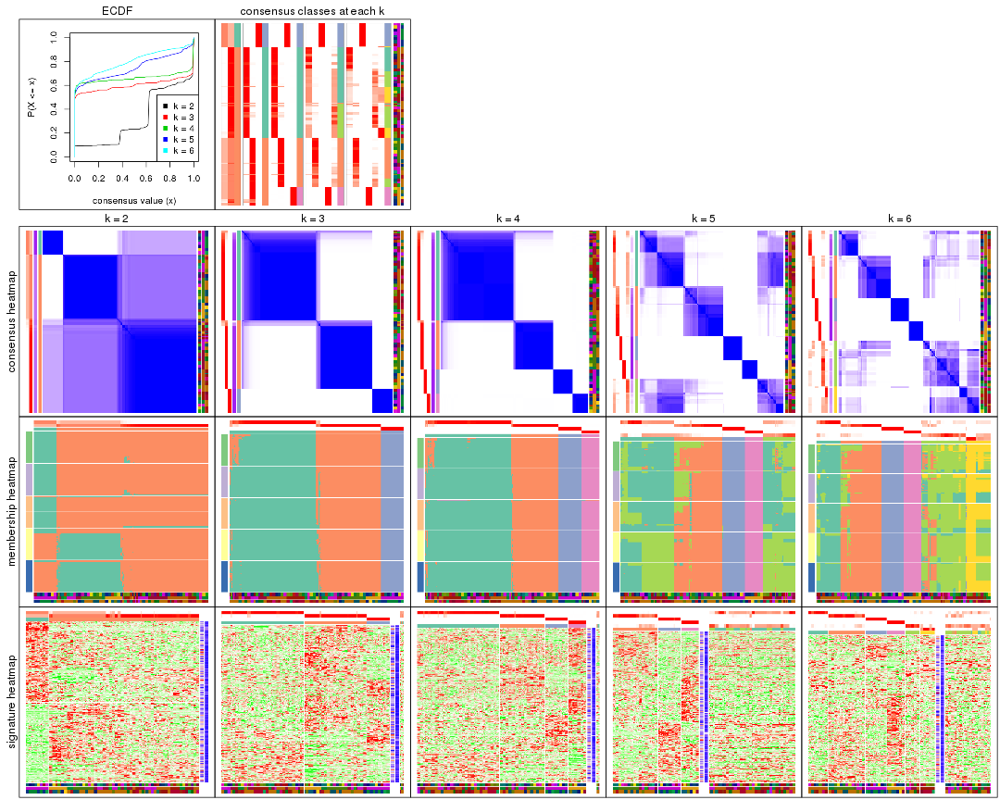

The plots are:

- The first row: a plot of the ECDF (Empirical cumulative distribution
  function) curves of the consensus matrix for each `k` and the heatmap of
  predicted classes for each `k`.
- The second row: heatmaps of the consensus matrix for each `k`.
- The third row: heatmaps of the membership matrix for each `k`.
- The fouth row: heatmaps of the signatures for each `k`.

All the plots in panels can be made by individual functions and they are
plotted later in this section.

`select_partition_number()` produces several plots showing different
statistics for choosing "optimized" `k`. There are following statistics:

- ECDF curves of the consensus matrix for each `k`;
- 1-PAC. [The PAC
  score](https://en.wikipedia.org/wiki/Consensus_clustering#Over-interpretation_potential_of_consensus_clustering)
  measures the proportion of the ambiguous subgrouping.
- Mean silhouette score.
- Concordance. The mean probability of fiting the consensus class ids in all
  partitions.
- Area increased. Denote $A_k$ as the area under the ECDF curve for current
  `k`, the area increased is defined as $A_k - A_{k-1}$.
- Rand index. The percent of pairs of samples that are both in a same cluster
  or both are not in a same cluster in the partition of k and k-1.
- Jaccard index. The ratio of pairs of samples are both in a same cluster in
  the partition of k and k-1 and the pairs of samples are both in a same
  cluster in the partition k or k-1.

The detailed explanations of these statistics can be found in [the cola
vignette](http://bioconductor.org/packages/devel/bioc/vignettes/cola/inst/doc/cola.html#toc_13).

Generally speaking, lower PAC score, higher mean silhouette score or higher
concordance corresponds to better partition. Rand index and Jaccard index
measure how similar the current partition is compared to partition with `k-1`.
If they are too similar, we won't accept `k` is better than `k-1`.

```r
select_partition_number(res)
```


The numeric values for all these statistics can be obtained by `get_stats()`.

```r
get_stats(res)
```

```
#>   k 1-PAC mean_silhouette concordance area_increased  Rand Jaccard
#> 2 2 0.468           0.757       0.810         0.3232 0.769   0.769
#> 3 3 0.959           0.935       0.976         0.8634 0.629   0.517
#> 4 4 0.991           0.951       0.980         0.0998 0.944   0.859
#> 5 5 0.754           0.533       0.763         0.1322 0.879   0.648
#> 6 6 0.762           0.656       0.840         0.0699 0.845   0.449
```

`suggest_best_k()` suggests the best $k$ based on these statistics. The rules are as follows:

- All $k$ with Jaccard index larger than 0.95 are removed because the increase of
  the partition number does not provides enough extra information. If all $k$ are removed,
  the best $k$ is assigned by `NA`.
- For $k$ with 1-PAC larger than 0.9, the maximal $k$ is taken as the "best k". Other $k$ is called "optional k".
- If it does not fit the second rule. The $k$ with the highest vote of highest
  1-PAC, mean silhouette and concordance is taken as the "best k".

```r
suggest_best_k(res)
```

```
#> [1] 4
#> attr(,"optional")
#> [1] 3
```

There is also optional best $k$ = 3 that is worth to check.

Following shows the table of the partitions (You need to click the **show/hide
code output** link to see it). The membership matrix (columns with name `p*`)
is inferred by
[`clue::cl_consensus()`](https://www.rdocumentation.org/link/cl_consensus?package=clue)
function with the `SE` method. Basically the value in the membership matrix
represents the probability to belong to a certain group. The finall class
label for an item is determined with the group with highest probability it
belongs to.

In `get_classes()` function, the entropy is calculated from the membership
matrix and the silhouette score is calculated from the consensus matrix.


<script>
$( function() {
	$( '#tabs-CV-pam-get-classes' ).tabs();
} );
</script>
<div id='tabs-CV-pam-get-classes'>
<ul>
<li><a href='#tab-CV-pam-get-classes-1'>k = 2</a></li>
<li><a href='#tab-CV-pam-get-classes-2'>k = 3</a></li>
<li><a href='#tab-CV-pam-get-classes-3'>k = 4</a></li>
<li><a href='#tab-CV-pam-get-classes-4'>k = 5</a></li>
<li><a href='#tab-CV-pam-get-classes-5'>k = 6</a></li>
</ul>

<div id='tab-CV-pam-get-classes-1'>
<p><a id='tab-CV-pam-get-classes-1-a' style='color:#0366d6' href='#'>show/hide code output</a></p>
<pre><code class="r">cbind(get_classes(res, k = 2), get_membership(res, k = 2))
</code></pre>

<pre><code>#&gt;           class entropy silhouette    p1    p2
#&gt; GSM803615     2  0.9580      0.697 0.380 0.620
#&gt; GSM803674     2  0.9580      0.697 0.380 0.620
#&gt; GSM803733     2  0.9580      0.697 0.380 0.620
#&gt; GSM803616     2  0.9580      0.697 0.380 0.620
#&gt; GSM803675     2  0.9580      0.697 0.380 0.620
#&gt; GSM803734     2  0.9580      0.697 0.380 0.620
#&gt; GSM803617     2  0.9580      0.697 0.380 0.620
#&gt; GSM803676     2  0.9580      0.697 0.380 0.620
#&gt; GSM803735     2  0.9580      0.697 0.380 0.620
#&gt; GSM803618     2  0.9580      0.697 0.380 0.620
#&gt; GSM803677     2  0.9580      0.697 0.380 0.620
#&gt; GSM803736     2  0.9580      0.697 0.380 0.620
#&gt; GSM803619     2  0.6148      0.723 0.152 0.848
#&gt; GSM803678     2  0.5946      0.724 0.144 0.856
#&gt; GSM803737     2  0.1184      0.740 0.016 0.984
#&gt; GSM803620     2  0.9580      0.697 0.380 0.620
#&gt; GSM803679     2  0.9580      0.697 0.380 0.620
#&gt; GSM803738     2  0.9580      0.697 0.380 0.620
#&gt; GSM803621     2  0.0000      0.741 0.000 1.000
#&gt; GSM803680     2  0.0000      0.741 0.000 1.000
#&gt; GSM803739     2  0.0000      0.741 0.000 1.000
#&gt; GSM803622     2  0.0000      0.741 0.000 1.000
#&gt; GSM803681     2  0.0000      0.741 0.000 1.000
#&gt; GSM803740     2  0.0000      0.741 0.000 1.000
#&gt; GSM803623     2  0.9580      0.697 0.380 0.620
#&gt; GSM803682     2  0.9580      0.697 0.380 0.620
#&gt; GSM803741     2  0.9580      0.697 0.380 0.620
#&gt; GSM803624     2  0.0000      0.741 0.000 1.000
#&gt; GSM803683     2  0.0000      0.741 0.000 1.000
#&gt; GSM803742     2  0.0000      0.741 0.000 1.000
#&gt; GSM803625     2  0.0000      0.741 0.000 1.000
#&gt; GSM803684     2  0.0000      0.741 0.000 1.000
#&gt; GSM803743     2  0.0000      0.741 0.000 1.000
#&gt; GSM803626     1  0.9580      1.000 0.620 0.380
#&gt; GSM803685     1  0.9580      1.000 0.620 0.380
#&gt; GSM803744     1  0.9580      1.000 0.620 0.380
#&gt; GSM803627     2  0.0000      0.741 0.000 1.000
#&gt; GSM803686     2  0.0000      0.741 0.000 1.000
#&gt; GSM803745     2  0.0000      0.741 0.000 1.000
#&gt; GSM803628     2  0.0000      0.741 0.000 1.000
#&gt; GSM803687     2  0.0000      0.741 0.000 1.000
#&gt; GSM803746     2  0.0672      0.732 0.008 0.992
#&gt; GSM803629     2  0.0000      0.741 0.000 1.000
#&gt; GSM803688     2  0.0000      0.741 0.000 1.000
#&gt; GSM803747     2  0.0000      0.741 0.000 1.000
#&gt; GSM803630     2  0.0672      0.732 0.008 0.992
#&gt; GSM803689     2  0.0376      0.737 0.004 0.996
#&gt; GSM803748     2  0.0376      0.737 0.004 0.996
#&gt; GSM803631     2  0.3733      0.636 0.072 0.928
#&gt; GSM803690     2  0.3733      0.636 0.072 0.928
#&gt; GSM803749     2  0.3584      0.643 0.068 0.932
#&gt; GSM803632     2  0.2236      0.694 0.036 0.964
#&gt; GSM803691     2  0.2043      0.700 0.032 0.968
#&gt; GSM803750     2  0.1633      0.711 0.024 0.976
#&gt; GSM803633     2  0.9580      0.697 0.380 0.620
#&gt; GSM803692     2  0.9580      0.697 0.380 0.620
#&gt; GSM803751     2  0.9580      0.697 0.380 0.620
#&gt; GSM803634     2  0.9580      0.697 0.380 0.620
#&gt; GSM803693     2  0.9580      0.697 0.380 0.620
#&gt; GSM803752     2  0.9580      0.697 0.380 0.620
#&gt; GSM803635     2  0.9580      0.697 0.380 0.620
#&gt; GSM803694     2  0.9580      0.697 0.380 0.620
#&gt; GSM803753     2  0.9580      0.697 0.380 0.620
#&gt; GSM803636     2  0.9580      0.697 0.380 0.620
#&gt; GSM803695     2  0.9580      0.697 0.380 0.620
#&gt; GSM803754     2  0.9580      0.697 0.380 0.620
#&gt; GSM803637     2  0.9580      0.697 0.380 0.620
#&gt; GSM803696     2  0.9580      0.697 0.380 0.620
#&gt; GSM803755     2  0.9580      0.697 0.380 0.620
#&gt; GSM803638     2  0.9580      0.697 0.380 0.620
#&gt; GSM803697     2  0.9580      0.697 0.380 0.620
#&gt; GSM803756     2  0.9580      0.697 0.380 0.620
#&gt; GSM803639     2  0.9580      0.697 0.380 0.620
#&gt; GSM803698     2  0.9580      0.697 0.380 0.620
#&gt; GSM803757     2  0.9580      0.697 0.380 0.620
#&gt; GSM803640     2  0.0000      0.741 0.000 1.000
#&gt; GSM803699     2  0.0000      0.741 0.000 1.000
#&gt; GSM803758     2  0.0000      0.741 0.000 1.000
#&gt; GSM803641     2  0.0000      0.741 0.000 1.000
#&gt; GSM803700     2  0.0000      0.741 0.000 1.000
#&gt; GSM803759     2  0.0000      0.741 0.000 1.000
#&gt; GSM803642     2  0.0000      0.741 0.000 1.000
#&gt; GSM803701     2  0.0000      0.741 0.000 1.000
#&gt; GSM803760     2  0.0000      0.741 0.000 1.000
#&gt; GSM803643     2  0.0000      0.741 0.000 1.000
#&gt; GSM803702     2  0.0000      0.741 0.000 1.000
#&gt; GSM803644     2  0.0000      0.741 0.000 1.000
#&gt; GSM803703     2  0.0000      0.741 0.000 1.000
#&gt; GSM803761     2  0.0000      0.741 0.000 1.000
#&gt; GSM803645     2  0.0000      0.741 0.000 1.000
#&gt; GSM803704     2  0.0000      0.741 0.000 1.000
#&gt; GSM803762     2  0.0000      0.741 0.000 1.000
#&gt; GSM803646     2  0.0938      0.741 0.012 0.988
#&gt; GSM803705     2  0.1633      0.739 0.024 0.976
#&gt; GSM803763     2  0.0000      0.741 0.000 1.000
#&gt; GSM803647     2  0.0000      0.741 0.000 1.000
#&gt; GSM803706     2  0.0000      0.741 0.000 1.000
#&gt; GSM803764     2  0.0000      0.741 0.000 1.000
#&gt; GSM803648     2  0.0000      0.741 0.000 1.000
#&gt; GSM803707     2  0.0000      0.741 0.000 1.000
#&gt; GSM803765     2  0.7139      0.717 0.196 0.804
#&gt; GSM803649     2  0.0000      0.741 0.000 1.000
#&gt; GSM803708     2  0.0000      0.741 0.000 1.000
#&gt; GSM803766     2  0.0000      0.741 0.000 1.000
#&gt; GSM803650     2  0.0000      0.741 0.000 1.000
#&gt; GSM803709     2  0.0000      0.741 0.000 1.000
#&gt; GSM803767     2  0.0000      0.741 0.000 1.000
#&gt; GSM803651     2  0.0000      0.741 0.000 1.000
#&gt; GSM803710     2  0.0000      0.741 0.000 1.000
#&gt; GSM803768     2  0.0000      0.741 0.000 1.000
#&gt; GSM803652     2  0.0000      0.741 0.000 1.000
#&gt; GSM803711     2  0.0000      0.741 0.000 1.000
#&gt; GSM803653     2  0.0000      0.741 0.000 1.000
#&gt; GSM803712     2  0.0000      0.741 0.000 1.000
#&gt; GSM803769     2  0.0000      0.741 0.000 1.000
#&gt; GSM803654     2  0.9580      0.697 0.380 0.620
#&gt; GSM803713     2  0.9580      0.697 0.380 0.620
#&gt; GSM803770     2  0.9580      0.697 0.380 0.620
#&gt; GSM803655     2  0.0000      0.741 0.000 1.000
#&gt; GSM803714     2  0.0000      0.741 0.000 1.000
#&gt; GSM803771     2  0.0000      0.741 0.000 1.000
#&gt; GSM803656     2  0.9580      0.697 0.380 0.620
#&gt; GSM803715     2  0.9580      0.697 0.380 0.620
#&gt; GSM803772     2  0.9427      0.699 0.360 0.640
#&gt; GSM803657     2  0.9580      0.697 0.380 0.620
#&gt; GSM803716     2  0.9580      0.697 0.380 0.620
#&gt; GSM803773     2  0.9580      0.697 0.380 0.620
#&gt; GSM803658     2  0.9580      0.697 0.380 0.620
#&gt; GSM803717     2  0.9580      0.697 0.380 0.620
#&gt; GSM803774     2  0.9580      0.697 0.380 0.620
#&gt; GSM803659     2  0.9580      0.697 0.380 0.620
#&gt; GSM803718     2  0.9580      0.697 0.380 0.620
#&gt; GSM803775     2  0.9580      0.697 0.380 0.620
#&gt; GSM803660     2  0.0000      0.741 0.000 1.000
#&gt; GSM803719     2  0.0000      0.741 0.000 1.000
#&gt; GSM803776     2  0.0000      0.741 0.000 1.000
#&gt; GSM803661     2  0.0000      0.741 0.000 1.000
#&gt; GSM803720     2  0.0000      0.741 0.000 1.000
#&gt; GSM803777     2  0.0000      0.741 0.000 1.000
#&gt; GSM803662     2  0.5629      0.726 0.132 0.868
#&gt; GSM803732     2  0.0000      0.741 0.000 1.000
#&gt; GSM803778     2  0.0000      0.741 0.000 1.000
#&gt; GSM803663     2  0.9580      0.697 0.380 0.620
#&gt; GSM803721     2  0.9580      0.697 0.380 0.620
#&gt; GSM803779     2  0.9580      0.697 0.380 0.620
#&gt; GSM803664     2  0.7815      0.712 0.232 0.768
#&gt; GSM803722     2  0.8861      0.704 0.304 0.696
#&gt; GSM803780     2  0.4161      0.732 0.084 0.916
#&gt; GSM803665     2  0.0000      0.741 0.000 1.000
#&gt; GSM803723     2  0.0376      0.737 0.004 0.996
#&gt; GSM803781     2  0.0000      0.741 0.000 1.000
#&gt; GSM803666     1  0.9580      1.000 0.620 0.380
#&gt; GSM803724     1  0.9580      1.000 0.620 0.380
#&gt; GSM803782     1  0.9580      1.000 0.620 0.380
#&gt; GSM803667     1  0.9580      1.000 0.620 0.380
#&gt; GSM803725     1  0.9580      1.000 0.620 0.380
#&gt; GSM803783     1  0.9580      1.000 0.620 0.380
#&gt; GSM803668     1  0.9580      1.000 0.620 0.380
#&gt; GSM803726     1  0.9580      1.000 0.620 0.380
#&gt; GSM803784     1  0.9580      1.000 0.620 0.380
#&gt; GSM803669     1  0.9580      1.000 0.620 0.380
#&gt; GSM803727     1  0.9580      1.000 0.620 0.380
#&gt; GSM803670     1  0.9580      1.000 0.620 0.380
#&gt; GSM803728     1  0.9580      1.000 0.620 0.380
#&gt; GSM803785     1  0.9580      1.000 0.620 0.380
#&gt; GSM803671     1  0.9580      1.000 0.620 0.380
#&gt; GSM803729     1  0.9580      1.000 0.620 0.380
#&gt; GSM803786     1  0.9580      1.000 0.620 0.380
#&gt; GSM803672     1  0.9580      1.000 0.620 0.380
#&gt; GSM803730     1  0.9580      1.000 0.620 0.380
#&gt; GSM803787     1  0.9580      1.000 0.620 0.380
#&gt; GSM803673     2  0.9580      0.697 0.380 0.620
#&gt; GSM803731     2  0.9580      0.697 0.380 0.620
#&gt; GSM803788     2  0.9580      0.697 0.380 0.620
</code></pre>

<script>
$('#tab-CV-pam-get-classes-1-a').parent().next().next().hide();
$('#tab-CV-pam-get-classes-1-a').click(function(){
  $('#tab-CV-pam-get-classes-1-a').parent().next().next().toggle();
  return(false);
});
</script>
</div>

<div id='tab-CV-pam-get-classes-2'>
<p><a id='tab-CV-pam-get-classes-2-a' style='color:#0366d6' href='#'>show/hide code output</a></p>
<pre><code class="r">cbind(get_classes(res, k = 3), get_membership(res, k = 3))
</code></pre>

<pre><code>#&gt;           class entropy silhouette    p1    p2 p3
#&gt; GSM803615     2  0.0000     0.9643 0.000 1.000  0
#&gt; GSM803674     2  0.0000     0.9643 0.000 1.000  0
#&gt; GSM803733     2  0.0000     0.9643 0.000 1.000  0
#&gt; GSM803616     2  0.0000     0.9643 0.000 1.000  0
#&gt; GSM803675     2  0.0000     0.9643 0.000 1.000  0
#&gt; GSM803734     2  0.0000     0.9643 0.000 1.000  0
#&gt; GSM803617     2  0.0000     0.9643 0.000 1.000  0
#&gt; GSM803676     2  0.0000     0.9643 0.000 1.000  0
#&gt; GSM803735     2  0.0000     0.9643 0.000 1.000  0
#&gt; GSM803618     2  0.0000     0.9643 0.000 1.000  0
#&gt; GSM803677     2  0.0000     0.9643 0.000 1.000  0
#&gt; GSM803736     2  0.0000     0.9643 0.000 1.000  0
#&gt; GSM803619     2  0.5431     0.5930 0.284 0.716  0
#&gt; GSM803678     2  0.5529     0.5731 0.296 0.704  0
#&gt; GSM803737     2  0.6291     0.0993 0.468 0.532  0
#&gt; GSM803620     2  0.0000     0.9643 0.000 1.000  0
#&gt; GSM803679     2  0.0000     0.9643 0.000 1.000  0
#&gt; GSM803738     2  0.0000     0.9643 0.000 1.000  0
#&gt; GSM803621     1  0.0000     0.9664 1.000 0.000  0
#&gt; GSM803680     1  0.0000     0.9664 1.000 0.000  0
#&gt; GSM803739     1  0.0000     0.9664 1.000 0.000  0
#&gt; GSM803622     1  0.0000     0.9664 1.000 0.000  0
#&gt; GSM803681     1  0.0000     0.9664 1.000 0.000  0
#&gt; GSM803740     1  0.0000     0.9664 1.000 0.000  0
#&gt; GSM803623     2  0.0000     0.9643 0.000 1.000  0
#&gt; GSM803682     2  0.0000     0.9643 0.000 1.000  0
#&gt; GSM803741     2  0.0000     0.9643 0.000 1.000  0
#&gt; GSM803624     1  0.3686     0.8243 0.860 0.140  0
#&gt; GSM803683     1  0.0000     0.9664 1.000 0.000  0
#&gt; GSM803742     1  0.0000     0.9664 1.000 0.000  0
#&gt; GSM803625     1  0.0000     0.9664 1.000 0.000  0
#&gt; GSM803684     1  0.0000     0.9664 1.000 0.000  0
#&gt; GSM803743     1  0.0000     0.9664 1.000 0.000  0
#&gt; GSM803626     3  0.0000     1.0000 0.000 0.000  1
#&gt; GSM803685     3  0.0000     1.0000 0.000 0.000  1
#&gt; GSM803744     3  0.0000     1.0000 0.000 0.000  1
#&gt; GSM803627     1  0.0000     0.9664 1.000 0.000  0
#&gt; GSM803686     1  0.0000     0.9664 1.000 0.000  0
#&gt; GSM803745     1  0.0000     0.9664 1.000 0.000  0
#&gt; GSM803628     1  0.0000     0.9664 1.000 0.000  0
#&gt; GSM803687     1  0.0000     0.9664 1.000 0.000  0
#&gt; GSM803746     1  0.0000     0.9664 1.000 0.000  0
#&gt; GSM803629     1  0.0000     0.9664 1.000 0.000  0
#&gt; GSM803688     1  0.0000     0.9664 1.000 0.000  0
#&gt; GSM803747     1  0.0000     0.9664 1.000 0.000  0
#&gt; GSM803630     1  0.0000     0.9664 1.000 0.000  0
#&gt; GSM803689     1  0.0000     0.9664 1.000 0.000  0
#&gt; GSM803748     1  0.0000     0.9664 1.000 0.000  0
#&gt; GSM803631     1  0.0000     0.9664 1.000 0.000  0
#&gt; GSM803690     1  0.0000     0.9664 1.000 0.000  0
#&gt; GSM803749     1  0.0000     0.9664 1.000 0.000  0
#&gt; GSM803632     1  0.0000     0.9664 1.000 0.000  0
#&gt; GSM803691     1  0.0000     0.9664 1.000 0.000  0
#&gt; GSM803750     1  0.0000     0.9664 1.000 0.000  0
#&gt; GSM803633     2  0.0000     0.9643 0.000 1.000  0
#&gt; GSM803692     2  0.0000     0.9643 0.000 1.000  0
#&gt; GSM803751     2  0.0000     0.9643 0.000 1.000  0
#&gt; GSM803634     2  0.0000     0.9643 0.000 1.000  0
#&gt; GSM803693     2  0.0000     0.9643 0.000 1.000  0
#&gt; GSM803752     2  0.0000     0.9643 0.000 1.000  0
#&gt; GSM803635     2  0.0000     0.9643 0.000 1.000  0
#&gt; GSM803694     2  0.0000     0.9643 0.000 1.000  0
#&gt; GSM803753     2  0.0000     0.9643 0.000 1.000  0
#&gt; GSM803636     2  0.0000     0.9643 0.000 1.000  0
#&gt; GSM803695     2  0.0000     0.9643 0.000 1.000  0
#&gt; GSM803754     2  0.0000     0.9643 0.000 1.000  0
#&gt; GSM803637     2  0.0000     0.9643 0.000 1.000  0
#&gt; GSM803696     2  0.0000     0.9643 0.000 1.000  0
#&gt; GSM803755     2  0.0000     0.9643 0.000 1.000  0
#&gt; GSM803638     2  0.0000     0.9643 0.000 1.000  0
#&gt; GSM803697     2  0.0000     0.9643 0.000 1.000  0
#&gt; GSM803756     2  0.0000     0.9643 0.000 1.000  0
#&gt; GSM803639     2  0.0000     0.9643 0.000 1.000  0
#&gt; GSM803698     2  0.0000     0.9643 0.000 1.000  0
#&gt; GSM803757     2  0.0000     0.9643 0.000 1.000  0
#&gt; GSM803640     1  0.0000     0.9664 1.000 0.000  0
#&gt; GSM803699     1  0.0000     0.9664 1.000 0.000  0
#&gt; GSM803758     1  0.0000     0.9664 1.000 0.000  0
#&gt; GSM803641     1  0.0000     0.9664 1.000 0.000  0
#&gt; GSM803700     1  0.0000     0.9664 1.000 0.000  0
#&gt; GSM803759     1  0.0000     0.9664 1.000 0.000  0
#&gt; GSM803642     1  0.0000     0.9664 1.000 0.000  0
#&gt; GSM803701     1  0.0000     0.9664 1.000 0.000  0
#&gt; GSM803760     1  0.0000     0.9664 1.000 0.000  0
#&gt; GSM803643     1  0.0000     0.9664 1.000 0.000  0
#&gt; GSM803702     1  0.0000     0.9664 1.000 0.000  0
#&gt; GSM803644     1  0.0000     0.9664 1.000 0.000  0
#&gt; GSM803703     1  0.0000     0.9664 1.000 0.000  0
#&gt; GSM803761     1  0.0000     0.9664 1.000 0.000  0
#&gt; GSM803645     1  0.0000     0.9664 1.000 0.000  0
#&gt; GSM803704     1  0.0000     0.9664 1.000 0.000  0
#&gt; GSM803762     1  0.0000     0.9664 1.000 0.000  0
#&gt; GSM803646     1  0.1289     0.9415 0.968 0.032  0
#&gt; GSM803705     1  0.1643     0.9306 0.956 0.044  0
#&gt; GSM803763     1  0.1964     0.9179 0.944 0.056  0
#&gt; GSM803647     1  0.0000     0.9664 1.000 0.000  0
#&gt; GSM803706     1  0.0000     0.9664 1.000 0.000  0
#&gt; GSM803764     1  0.0000     0.9664 1.000 0.000  0
#&gt; GSM803648     1  0.4121     0.7929 0.832 0.168  0
#&gt; GSM803707     1  0.2796     0.8801 0.908 0.092  0
#&gt; GSM803765     2  0.5363     0.6046 0.276 0.724  0
#&gt; GSM803649     1  0.0424     0.9611 0.992 0.008  0
#&gt; GSM803708     1  0.0424     0.9611 0.992 0.008  0
#&gt; GSM803766     1  0.0424     0.9611 0.992 0.008  0
#&gt; GSM803650     1  0.0000     0.9664 1.000 0.000  0
#&gt; GSM803709     1  0.0000     0.9664 1.000 0.000  0
#&gt; GSM803767     1  0.0000     0.9664 1.000 0.000  0
#&gt; GSM803651     1  0.0000     0.9664 1.000 0.000  0
#&gt; GSM803710     1  0.0000     0.9664 1.000 0.000  0
#&gt; GSM803768     1  0.0000     0.9664 1.000 0.000  0
#&gt; GSM803652     1  0.0000     0.9664 1.000 0.000  0
#&gt; GSM803711     1  0.0000     0.9664 1.000 0.000  0
#&gt; GSM803653     1  0.4555     0.7511 0.800 0.200  0
#&gt; GSM803712     1  0.4399     0.7667 0.812 0.188  0
#&gt; GSM803769     1  0.3752     0.8214 0.856 0.144  0
#&gt; GSM803654     2  0.0000     0.9643 0.000 1.000  0
#&gt; GSM803713     2  0.0000     0.9643 0.000 1.000  0
#&gt; GSM803770     2  0.0000     0.9643 0.000 1.000  0
#&gt; GSM803655     1  0.0424     0.9611 0.992 0.008  0
#&gt; GSM803714     1  0.0424     0.9611 0.992 0.008  0
#&gt; GSM803771     1  0.0424     0.9611 0.992 0.008  0
#&gt; GSM803656     2  0.0000     0.9643 0.000 1.000  0
#&gt; GSM803715     2  0.0000     0.9643 0.000 1.000  0
#&gt; GSM803772     2  0.0892     0.9417 0.020 0.980  0
#&gt; GSM803657     2  0.0000     0.9643 0.000 1.000  0
#&gt; GSM803716     2  0.0000     0.9643 0.000 1.000  0
#&gt; GSM803773     2  0.0000     0.9643 0.000 1.000  0
#&gt; GSM803658     2  0.0000     0.9643 0.000 1.000  0
#&gt; GSM803717     2  0.0000     0.9643 0.000 1.000  0
#&gt; GSM803774     2  0.0000     0.9643 0.000 1.000  0
#&gt; GSM803659     2  0.0000     0.9643 0.000 1.000  0
#&gt; GSM803718     2  0.0000     0.9643 0.000 1.000  0
#&gt; GSM803775     2  0.0000     0.9643 0.000 1.000  0
#&gt; GSM803660     1  0.0747     0.9549 0.984 0.016  0
#&gt; GSM803719     1  0.0747     0.9549 0.984 0.016  0
#&gt; GSM803776     1  0.1163     0.9446 0.972 0.028  0
#&gt; GSM803661     1  0.0000     0.9664 1.000 0.000  0
#&gt; GSM803720     1  0.0000     0.9664 1.000 0.000  0
#&gt; GSM803777     1  0.0000     0.9664 1.000 0.000  0
#&gt; GSM803662     1  0.6309     0.0109 0.500 0.500  0
#&gt; GSM803732     1  0.0000     0.9664 1.000 0.000  0
#&gt; GSM803778     1  0.0000     0.9664 1.000 0.000  0
#&gt; GSM803663     2  0.0000     0.9643 0.000 1.000  0
#&gt; GSM803721     2  0.0000     0.9643 0.000 1.000  0
#&gt; GSM803779     2  0.0000     0.9643 0.000 1.000  0
#&gt; GSM803664     1  0.6308     0.0488 0.508 0.492  0
#&gt; GSM803722     2  0.6168     0.2752 0.412 0.588  0
#&gt; GSM803780     1  0.5591     0.5765 0.696 0.304  0
#&gt; GSM803665     1  0.0000     0.9664 1.000 0.000  0
#&gt; GSM803723     1  0.0000     0.9664 1.000 0.000  0
#&gt; GSM803781     1  0.0000     0.9664 1.000 0.000  0
#&gt; GSM803666     3  0.0000     1.0000 0.000 0.000  1
#&gt; GSM803724     3  0.0000     1.0000 0.000 0.000  1
#&gt; GSM803782     3  0.0000     1.0000 0.000 0.000  1
#&gt; GSM803667     3  0.0000     1.0000 0.000 0.000  1
#&gt; GSM803725     3  0.0000     1.0000 0.000 0.000  1
#&gt; GSM803783     3  0.0000     1.0000 0.000 0.000  1
#&gt; GSM803668     3  0.0000     1.0000 0.000 0.000  1
#&gt; GSM803726     3  0.0000     1.0000 0.000 0.000  1
#&gt; GSM803784     3  0.0000     1.0000 0.000 0.000  1
#&gt; GSM803669     3  0.0000     1.0000 0.000 0.000  1
#&gt; GSM803727     3  0.0000     1.0000 0.000 0.000  1
#&gt; GSM803670     3  0.0000     1.0000 0.000 0.000  1
#&gt; GSM803728     3  0.0000     1.0000 0.000 0.000  1
#&gt; GSM803785     3  0.0000     1.0000 0.000 0.000  1
#&gt; GSM803671     3  0.0000     1.0000 0.000 0.000  1
#&gt; GSM803729     3  0.0000     1.0000 0.000 0.000  1
#&gt; GSM803786     3  0.0000     1.0000 0.000 0.000  1
#&gt; GSM803672     3  0.0000     1.0000 0.000 0.000  1
#&gt; GSM803730     3  0.0000     1.0000 0.000 0.000  1
#&gt; GSM803787     3  0.0000     1.0000 0.000 0.000  1
#&gt; GSM803673     2  0.0000     0.9643 0.000 1.000  0
#&gt; GSM803731     2  0.0000     0.9643 0.000 1.000  0
#&gt; GSM803788     2  0.0000     0.9643 0.000 1.000  0
</code></pre>

<script>
$('#tab-CV-pam-get-classes-2-a').parent().next().next().hide();
$('#tab-CV-pam-get-classes-2-a').click(function(){
  $('#tab-CV-pam-get-classes-2-a').parent().next().next().toggle();
  return(false);
});
</script>
</div>

<div id='tab-CV-pam-get-classes-3'>
<p><a id='tab-CV-pam-get-classes-3-a' style='color:#0366d6' href='#'>show/hide code output</a></p>
<pre><code class="r">cbind(get_classes(res, k = 4), get_membership(res, k = 4))
</code></pre>

<pre><code>#&gt;           class entropy silhouette    p1    p2 p3    p4
#&gt; GSM803615     4  0.0188     0.9984 0.000 0.004  0 0.996
#&gt; GSM803674     4  0.0188     0.9984 0.000 0.004  0 0.996
#&gt; GSM803733     4  0.0188     0.9984 0.000 0.004  0 0.996
#&gt; GSM803616     4  0.0188     0.9984 0.000 0.004  0 0.996
#&gt; GSM803675     4  0.0188     0.9984 0.000 0.004  0 0.996
#&gt; GSM803734     4  0.0188     0.9984 0.000 0.004  0 0.996
#&gt; GSM803617     4  0.0188     0.9984 0.000 0.004  0 0.996
#&gt; GSM803676     4  0.0188     0.9943 0.004 0.000  0 0.996
#&gt; GSM803735     4  0.0188     0.9984 0.000 0.004  0 0.996
#&gt; GSM803618     4  0.0188     0.9984 0.000 0.004  0 0.996
#&gt; GSM803677     4  0.0188     0.9984 0.000 0.004  0 0.996
#&gt; GSM803736     4  0.0188     0.9984 0.000 0.004  0 0.996
#&gt; GSM803619     4  0.0188     0.9943 0.004 0.000  0 0.996
#&gt; GSM803678     4  0.0188     0.9943 0.004 0.000  0 0.996
#&gt; GSM803737     4  0.0188     0.9943 0.004 0.000  0 0.996
#&gt; GSM803620     4  0.0188     0.9984 0.000 0.004  0 0.996
#&gt; GSM803679     4  0.0188     0.9984 0.000 0.004  0 0.996
#&gt; GSM803738     4  0.0188     0.9984 0.000 0.004  0 0.996
#&gt; GSM803621     1  0.0188     0.9654 0.996 0.000  0 0.004
#&gt; GSM803680     1  0.0188     0.9654 0.996 0.000  0 0.004
#&gt; GSM803739     1  0.0188     0.9654 0.996 0.000  0 0.004
#&gt; GSM803622     1  0.0188     0.9654 0.996 0.000  0 0.004
#&gt; GSM803681     1  0.0188     0.9654 0.996 0.000  0 0.004
#&gt; GSM803740     1  0.0188     0.9654 0.996 0.000  0 0.004
#&gt; GSM803623     2  0.0000     0.9771 0.000 1.000  0 0.000
#&gt; GSM803682     2  0.0000     0.9771 0.000 1.000  0 0.000
#&gt; GSM803741     2  0.0000     0.9771 0.000 1.000  0 0.000
#&gt; GSM803624     1  0.2921     0.8294 0.860 0.140  0 0.000
#&gt; GSM803683     1  0.0000     0.9657 1.000 0.000  0 0.000
#&gt; GSM803742     1  0.0000     0.9657 1.000 0.000  0 0.000
#&gt; GSM803625     1  0.0000     0.9657 1.000 0.000  0 0.000
#&gt; GSM803684     1  0.0000     0.9657 1.000 0.000  0 0.000
#&gt; GSM803743     1  0.0000     0.9657 1.000 0.000  0 0.000
#&gt; GSM803626     3  0.0000     1.0000 0.000 0.000  1 0.000
#&gt; GSM803685     3  0.0000     1.0000 0.000 0.000  1 0.000
#&gt; GSM803744     3  0.0000     1.0000 0.000 0.000  1 0.000
#&gt; GSM803627     1  0.0188     0.9654 0.996 0.000  0 0.004
#&gt; GSM803686     1  0.0188     0.9654 0.996 0.000  0 0.004
#&gt; GSM803745     1  0.0188     0.9654 0.996 0.000  0 0.004
#&gt; GSM803628     1  0.0188     0.9654 0.996 0.000  0 0.004
#&gt; GSM803687     1  0.0188     0.9654 0.996 0.000  0 0.004
#&gt; GSM803746     1  0.0188     0.9654 0.996 0.000  0 0.004
#&gt; GSM803629     1  0.0188     0.9654 0.996 0.000  0 0.004
#&gt; GSM803688     1  0.0188     0.9654 0.996 0.000  0 0.004
#&gt; GSM803747     1  0.0188     0.9654 0.996 0.000  0 0.004
#&gt; GSM803630     1  0.0188     0.9654 0.996 0.000  0 0.004
#&gt; GSM803689     1  0.0188     0.9654 0.996 0.000  0 0.004
#&gt; GSM803748     1  0.0188     0.9654 0.996 0.000  0 0.004
#&gt; GSM803631     1  0.0188     0.9654 0.996 0.000  0 0.004
#&gt; GSM803690     1  0.0188     0.9654 0.996 0.000  0 0.004
#&gt; GSM803749     1  0.0188     0.9654 0.996 0.000  0 0.004
#&gt; GSM803632     1  0.0188     0.9654 0.996 0.000  0 0.004
#&gt; GSM803691     1  0.0188     0.9654 0.996 0.000  0 0.004
#&gt; GSM803750     1  0.0188     0.9654 0.996 0.000  0 0.004
#&gt; GSM803633     2  0.0000     0.9771 0.000 1.000  0 0.000
#&gt; GSM803692     2  0.0000     0.9771 0.000 1.000  0 0.000
#&gt; GSM803751     2  0.0000     0.9771 0.000 1.000  0 0.000
#&gt; GSM803634     2  0.0000     0.9771 0.000 1.000  0 0.000
#&gt; GSM803693     2  0.0000     0.9771 0.000 1.000  0 0.000
#&gt; GSM803752     2  0.0000     0.9771 0.000 1.000  0 0.000
#&gt; GSM803635     2  0.0000     0.9771 0.000 1.000  0 0.000
#&gt; GSM803694     2  0.0000     0.9771 0.000 1.000  0 0.000
#&gt; GSM803753     2  0.0000     0.9771 0.000 1.000  0 0.000
#&gt; GSM803636     2  0.0000     0.9771 0.000 1.000  0 0.000
#&gt; GSM803695     2  0.0000     0.9771 0.000 1.000  0 0.000
#&gt; GSM803754     2  0.0000     0.9771 0.000 1.000  0 0.000
#&gt; GSM803637     2  0.0000     0.9771 0.000 1.000  0 0.000
#&gt; GSM803696     2  0.0000     0.9771 0.000 1.000  0 0.000
#&gt; GSM803755     2  0.0000     0.9771 0.000 1.000  0 0.000
#&gt; GSM803638     2  0.0000     0.9771 0.000 1.000  0 0.000
#&gt; GSM803697     2  0.0000     0.9771 0.000 1.000  0 0.000
#&gt; GSM803756     2  0.0000     0.9771 0.000 1.000  0 0.000
#&gt; GSM803639     2  0.0000     0.9771 0.000 1.000  0 0.000
#&gt; GSM803698     2  0.0000     0.9771 0.000 1.000  0 0.000
#&gt; GSM803757     2  0.0000     0.9771 0.000 1.000  0 0.000
#&gt; GSM803640     1  0.0000     0.9657 1.000 0.000  0 0.000
#&gt; GSM803699     1  0.0000     0.9657 1.000 0.000  0 0.000
#&gt; GSM803758     1  0.0000     0.9657 1.000 0.000  0 0.000
#&gt; GSM803641     1  0.0000     0.9657 1.000 0.000  0 0.000
#&gt; GSM803700     1  0.0000     0.9657 1.000 0.000  0 0.000
#&gt; GSM803759     1  0.0188     0.9654 0.996 0.000  0 0.004
#&gt; GSM803642     1  0.0000     0.9657 1.000 0.000  0 0.000
#&gt; GSM803701     1  0.0000     0.9657 1.000 0.000  0 0.000
#&gt; GSM803760     1  0.0000     0.9657 1.000 0.000  0 0.000
#&gt; GSM803643     1  0.0000     0.9657 1.000 0.000  0 0.000
#&gt; GSM803702     1  0.0000     0.9657 1.000 0.000  0 0.000
#&gt; GSM803644     1  0.0188     0.9654 0.996 0.000  0 0.004
#&gt; GSM803703     1  0.0188     0.9654 0.996 0.000  0 0.004
#&gt; GSM803761     1  0.0188     0.9654 0.996 0.000  0 0.004
#&gt; GSM803645     1  0.0000     0.9657 1.000 0.000  0 0.000
#&gt; GSM803704     1  0.0000     0.9657 1.000 0.000  0 0.000
#&gt; GSM803762     1  0.0000     0.9657 1.000 0.000  0 0.000
#&gt; GSM803646     1  0.1022     0.9434 0.968 0.032  0 0.000
#&gt; GSM803705     1  0.1302     0.9329 0.956 0.044  0 0.000
#&gt; GSM803763     1  0.1557     0.9210 0.944 0.056  0 0.000
#&gt; GSM803647     1  0.0000     0.9657 1.000 0.000  0 0.000
#&gt; GSM803706     1  0.0000     0.9657 1.000 0.000  0 0.000
#&gt; GSM803764     1  0.0000     0.9657 1.000 0.000  0 0.000
#&gt; GSM803648     1  0.3266     0.8010 0.832 0.168  0 0.000
#&gt; GSM803707     1  0.2281     0.8819 0.904 0.096  0 0.000
#&gt; GSM803765     2  0.4250     0.5643 0.276 0.724  0 0.000
#&gt; GSM803649     1  0.0336     0.9615 0.992 0.008  0 0.000
#&gt; GSM803708     1  0.0336     0.9615 0.992 0.008  0 0.000
#&gt; GSM803766     1  0.0336     0.9615 0.992 0.008  0 0.000
#&gt; GSM803650     1  0.0188     0.9654 0.996 0.000  0 0.004
#&gt; GSM803709     1  0.0188     0.9654 0.996 0.000  0 0.004
#&gt; GSM803767     1  0.0000     0.9657 1.000 0.000  0 0.000
#&gt; GSM803651     1  0.0000     0.9657 1.000 0.000  0 0.000
#&gt; GSM803710     1  0.0000     0.9657 1.000 0.000  0 0.000
#&gt; GSM803768     1  0.0000     0.9657 1.000 0.000  0 0.000
#&gt; GSM803652     1  0.0000     0.9657 1.000 0.000  0 0.000
#&gt; GSM803711     1  0.0000     0.9657 1.000 0.000  0 0.000
#&gt; GSM803653     1  0.3610     0.7575 0.800 0.200  0 0.000
#&gt; GSM803712     1  0.3486     0.7729 0.812 0.188  0 0.000
#&gt; GSM803769     1  0.3024     0.8222 0.852 0.148  0 0.000
#&gt; GSM803654     2  0.0000     0.9771 0.000 1.000  0 0.000
#&gt; GSM803713     2  0.0000     0.9771 0.000 1.000  0 0.000
#&gt; GSM803770     2  0.0000     0.9771 0.000 1.000  0 0.000
#&gt; GSM803655     1  0.0336     0.9615 0.992 0.008  0 0.000
#&gt; GSM803714     1  0.0336     0.9615 0.992 0.008  0 0.000
#&gt; GSM803771     1  0.0336     0.9615 0.992 0.008  0 0.000
#&gt; GSM803656     2  0.0188     0.9740 0.004 0.996  0 0.000
#&gt; GSM803715     2  0.0188     0.9740 0.004 0.996  0 0.000
#&gt; GSM803772     2  0.0817     0.9494 0.024 0.976  0 0.000
#&gt; GSM803657     2  0.0000     0.9771 0.000 1.000  0 0.000
#&gt; GSM803716     2  0.0000     0.9771 0.000 1.000  0 0.000
#&gt; GSM803773     2  0.0000     0.9771 0.000 1.000  0 0.000
#&gt; GSM803658     2  0.0000     0.9771 0.000 1.000  0 0.000
#&gt; GSM803717     2  0.0000     0.9771 0.000 1.000  0 0.000
#&gt; GSM803774     2  0.0000     0.9771 0.000 1.000  0 0.000
#&gt; GSM803659     2  0.0188     0.9740 0.004 0.996  0 0.000
#&gt; GSM803718     2  0.0188     0.9740 0.004 0.996  0 0.000
#&gt; GSM803775     2  0.0188     0.9740 0.004 0.996  0 0.000
#&gt; GSM803660     1  0.0921     0.9478 0.972 0.028  0 0.000
#&gt; GSM803719     1  0.0921     0.9478 0.972 0.028  0 0.000
#&gt; GSM803776     1  0.1118     0.9411 0.964 0.036  0 0.000
#&gt; GSM803661     1  0.0000     0.9657 1.000 0.000  0 0.000
#&gt; GSM803720     1  0.0000     0.9657 1.000 0.000  0 0.000
#&gt; GSM803777     1  0.0000     0.9657 1.000 0.000  0 0.000
#&gt; GSM803662     1  0.5000     0.0356 0.500 0.500  0 0.000
#&gt; GSM803732     1  0.0000     0.9657 1.000 0.000  0 0.000
#&gt; GSM803778     1  0.0000     0.9657 1.000 0.000  0 0.000
#&gt; GSM803663     2  0.0188     0.9740 0.004 0.996  0 0.000
#&gt; GSM803721     2  0.0188     0.9740 0.004 0.996  0 0.000
#&gt; GSM803779     2  0.0188     0.9740 0.004 0.996  0 0.000
#&gt; GSM803664     1  0.5000     0.0595 0.504 0.496  0 0.000
#&gt; GSM803722     2  0.4877     0.2643 0.408 0.592  0 0.000
#&gt; GSM803780     1  0.4431     0.5853 0.696 0.304  0 0.000
#&gt; GSM803665     1  0.0000     0.9657 1.000 0.000  0 0.000
#&gt; GSM803723     1  0.0000     0.9657 1.000 0.000  0 0.000
#&gt; GSM803781     1  0.0000     0.9657 1.000 0.000  0 0.000
#&gt; GSM803666     3  0.0000     1.0000 0.000 0.000  1 0.000
#&gt; GSM803724     3  0.0000     1.0000 0.000 0.000  1 0.000
#&gt; GSM803782     3  0.0000     1.0000 0.000 0.000  1 0.000
#&gt; GSM803667     3  0.0000     1.0000 0.000 0.000  1 0.000
#&gt; GSM803725     3  0.0000     1.0000 0.000 0.000  1 0.000
#&gt; GSM803783     3  0.0000     1.0000 0.000 0.000  1 0.000
#&gt; GSM803668     3  0.0000     1.0000 0.000 0.000  1 0.000
#&gt; GSM803726     3  0.0000     1.0000 0.000 0.000  1 0.000
#&gt; GSM803784     3  0.0000     1.0000 0.000 0.000  1 0.000
#&gt; GSM803669     3  0.0000     1.0000 0.000 0.000  1 0.000
#&gt; GSM803727     3  0.0000     1.0000 0.000 0.000  1 0.000
#&gt; GSM803670     3  0.0000     1.0000 0.000 0.000  1 0.000
#&gt; GSM803728     3  0.0000     1.0000 0.000 0.000  1 0.000
#&gt; GSM803785     3  0.0000     1.0000 0.000 0.000  1 0.000
#&gt; GSM803671     3  0.0000     1.0000 0.000 0.000  1 0.000
#&gt; GSM803729     3  0.0000     1.0000 0.000 0.000  1 0.000
#&gt; GSM803786     3  0.0000     1.0000 0.000 0.000  1 0.000
#&gt; GSM803672     3  0.0000     1.0000 0.000 0.000  1 0.000
#&gt; GSM803730     3  0.0000     1.0000 0.000 0.000  1 0.000
#&gt; GSM803787     3  0.0000     1.0000 0.000 0.000  1 0.000
#&gt; GSM803673     2  0.0000     0.9771 0.000 1.000  0 0.000
#&gt; GSM803731     2  0.0000     0.9771 0.000 1.000  0 0.000
#&gt; GSM803788     2  0.0000     0.9771 0.000 1.000  0 0.000
</code></pre>

<script>
$('#tab-CV-pam-get-classes-3-a').parent().next().next().hide();
$('#tab-CV-pam-get-classes-3-a').click(function(){
  $('#tab-CV-pam-get-classes-3-a').parent().next().next().toggle();
  return(false);
});
</script>
</div>

<div id='tab-CV-pam-get-classes-4'>
<p><a id='tab-CV-pam-get-classes-4-a' style='color:#0366d6' href='#'>show/hide code output</a></p>
<pre><code class="r">cbind(get_classes(res, k = 5), get_membership(res, k = 5))
</code></pre>

<pre><code>#&gt;           class entropy silhouette    p1    p2    p3 p4    p5
#&gt; GSM803615     4  0.0000    1.00000 0.000 0.000 0.000  1 0.000
#&gt; GSM803674     4  0.0000    1.00000 0.000 0.000 0.000  1 0.000
#&gt; GSM803733     4  0.0000    1.00000 0.000 0.000 0.000  1 0.000
#&gt; GSM803616     4  0.0000    1.00000 0.000 0.000 0.000  1 0.000
#&gt; GSM803675     4  0.0000    1.00000 0.000 0.000 0.000  1 0.000
#&gt; GSM803734     4  0.0000    1.00000 0.000 0.000 0.000  1 0.000
#&gt; GSM803617     4  0.0000    1.00000 0.000 0.000 0.000  1 0.000
#&gt; GSM803676     4  0.0000    1.00000 0.000 0.000 0.000  1 0.000
#&gt; GSM803735     4  0.0000    1.00000 0.000 0.000 0.000  1 0.000
#&gt; GSM803618     4  0.0000    1.00000 0.000 0.000 0.000  1 0.000
#&gt; GSM803677     4  0.0000    1.00000 0.000 0.000 0.000  1 0.000
#&gt; GSM803736     4  0.0000    1.00000 0.000 0.000 0.000  1 0.000
#&gt; GSM803619     4  0.0000    1.00000 0.000 0.000 0.000  1 0.000
#&gt; GSM803678     4  0.0000    1.00000 0.000 0.000 0.000  1 0.000
#&gt; GSM803737     4  0.0000    1.00000 0.000 0.000 0.000  1 0.000
#&gt; GSM803620     4  0.0000    1.00000 0.000 0.000 0.000  1 0.000
#&gt; GSM803679     4  0.0000    1.00000 0.000 0.000 0.000  1 0.000
#&gt; GSM803738     4  0.0000    1.00000 0.000 0.000 0.000  1 0.000
#&gt; GSM803621     1  0.4268    0.10609 0.556 0.000 0.000  0 0.444
#&gt; GSM803680     1  0.4268    0.10609 0.556 0.000 0.000  0 0.444
#&gt; GSM803739     1  0.4268    0.10609 0.556 0.000 0.000  0 0.444
#&gt; GSM803622     1  0.4268    0.10609 0.556 0.000 0.000  0 0.444
#&gt; GSM803681     1  0.4268    0.10609 0.556 0.000 0.000  0 0.444
#&gt; GSM803740     1  0.4268    0.10609 0.556 0.000 0.000  0 0.444
#&gt; GSM803623     2  0.0510    0.84916 0.000 0.984 0.000  0 0.016
#&gt; GSM803682     2  0.0794    0.84941 0.000 0.972 0.000  0 0.028
#&gt; GSM803741     2  0.0703    0.84938 0.000 0.976 0.000  0 0.024
#&gt; GSM803624     5  0.2011    0.45133 0.088 0.004 0.000  0 0.908
#&gt; GSM803683     5  0.2605    0.45670 0.148 0.000 0.000  0 0.852
#&gt; GSM803742     5  0.2230    0.46036 0.116 0.000 0.000  0 0.884
#&gt; GSM803625     1  0.4297    0.07489 0.528 0.000 0.000  0 0.472
#&gt; GSM803684     1  0.4297    0.07489 0.528 0.000 0.000  0 0.472
#&gt; GSM803743     1  0.4297    0.07489 0.528 0.000 0.000  0 0.472
#&gt; GSM803626     3  0.0000    0.99630 0.000 0.000 1.000  0 0.000
#&gt; GSM803685     3  0.1908    0.91468 0.000 0.000 0.908  0 0.092
#&gt; GSM803744     3  0.0000    0.99630 0.000 0.000 1.000  0 0.000
#&gt; GSM803627     1  0.4268    0.10609 0.556 0.000 0.000  0 0.444
#&gt; GSM803686     1  0.4268    0.10609 0.556 0.000 0.000  0 0.444
#&gt; GSM803745     1  0.4268    0.10609 0.556 0.000 0.000  0 0.444
#&gt; GSM803628     1  0.4273    0.09729 0.552 0.000 0.000  0 0.448
#&gt; GSM803687     1  0.4273    0.09729 0.552 0.000 0.000  0 0.448
#&gt; GSM803746     1  0.4273    0.09729 0.552 0.000 0.000  0 0.448
#&gt; GSM803629     1  0.4268    0.10609 0.556 0.000 0.000  0 0.444
#&gt; GSM803688     1  0.4268    0.10609 0.556 0.000 0.000  0 0.444
#&gt; GSM803747     1  0.4268    0.10609 0.556 0.000 0.000  0 0.444
#&gt; GSM803630     5  0.4291    0.11885 0.464 0.000 0.000  0 0.536
#&gt; GSM803689     5  0.4291    0.11885 0.464 0.000 0.000  0 0.536
#&gt; GSM803748     5  0.4291    0.11885 0.464 0.000 0.000  0 0.536
#&gt; GSM803631     5  0.4291    0.11885 0.464 0.000 0.000  0 0.536
#&gt; GSM803690     5  0.4291    0.11885 0.464 0.000 0.000  0 0.536
#&gt; GSM803749     5  0.4291    0.11885 0.464 0.000 0.000  0 0.536
#&gt; GSM803632     5  0.4291    0.11885 0.464 0.000 0.000  0 0.536
#&gt; GSM803691     5  0.4291    0.11885 0.464 0.000 0.000  0 0.536
#&gt; GSM803750     5  0.4291    0.11885 0.464 0.000 0.000  0 0.536
#&gt; GSM803633     2  0.0000    0.84802 0.000 1.000 0.000  0 0.000
#&gt; GSM803692     2  0.0000    0.84802 0.000 1.000 0.000  0 0.000
#&gt; GSM803751     2  0.0000    0.84802 0.000 1.000 0.000  0 0.000
#&gt; GSM803634     2  0.0000    0.84802 0.000 1.000 0.000  0 0.000
#&gt; GSM803693     2  0.0000    0.84802 0.000 1.000 0.000  0 0.000
#&gt; GSM803752     2  0.0000    0.84802 0.000 1.000 0.000  0 0.000
#&gt; GSM803635     2  0.1270    0.84783 0.000 0.948 0.000  0 0.052
#&gt; GSM803694     2  0.1197    0.84831 0.000 0.952 0.000  0 0.048
#&gt; GSM803753     2  0.1121    0.84865 0.000 0.956 0.000  0 0.044
#&gt; GSM803636     2  0.0000    0.84802 0.000 1.000 0.000  0 0.000
#&gt; GSM803695     2  0.0000    0.84802 0.000 1.000 0.000  0 0.000
#&gt; GSM803754     2  0.0000    0.84802 0.000 1.000 0.000  0 0.000
#&gt; GSM803637     2  0.0000    0.84802 0.000 1.000 0.000  0 0.000
#&gt; GSM803696     2  0.0000    0.84802 0.000 1.000 0.000  0 0.000
#&gt; GSM803755     2  0.0000    0.84802 0.000 1.000 0.000  0 0.000
#&gt; GSM803638     2  0.0000    0.84802 0.000 1.000 0.000  0 0.000
#&gt; GSM803697     2  0.0000    0.84802 0.000 1.000 0.000  0 0.000
#&gt; GSM803756     2  0.0000    0.84802 0.000 1.000 0.000  0 0.000
#&gt; GSM803639     2  0.0000    0.84802 0.000 1.000 0.000  0 0.000
#&gt; GSM803698     2  0.0000    0.84802 0.000 1.000 0.000  0 0.000
#&gt; GSM803757     2  0.0000    0.84802 0.000 1.000 0.000  0 0.000
#&gt; GSM803640     1  0.0404    0.29600 0.988 0.000 0.000  0 0.012
#&gt; GSM803699     1  0.0404    0.29600 0.988 0.000 0.000  0 0.012
#&gt; GSM803758     1  0.1043    0.27886 0.960 0.000 0.000  0 0.040
#&gt; GSM803641     1  0.0794    0.28879 0.972 0.000 0.000  0 0.028
#&gt; GSM803700     1  0.0794    0.28879 0.972 0.000 0.000  0 0.028
#&gt; GSM803759     1  0.0703    0.28955 0.976 0.000 0.000  0 0.024
#&gt; GSM803642     1  0.3586    0.09830 0.736 0.000 0.000  0 0.264
#&gt; GSM803701     1  0.4101    0.03712 0.628 0.000 0.000  0 0.372
#&gt; GSM803760     1  0.3274    0.13132 0.780 0.000 0.000  0 0.220
#&gt; GSM803643     1  0.0609    0.29377 0.980 0.000 0.000  0 0.020
#&gt; GSM803702     1  0.0404    0.29600 0.988 0.000 0.000  0 0.012
#&gt; GSM803644     1  0.0000    0.29374 1.000 0.000 0.000  0 0.000
#&gt; GSM803703     1  0.0000    0.29374 1.000 0.000 0.000  0 0.000
#&gt; GSM803761     1  0.0000    0.29374 1.000 0.000 0.000  0 0.000
#&gt; GSM803645     5  0.2605    0.45670 0.148 0.000 0.000  0 0.852
#&gt; GSM803704     5  0.2605    0.45670 0.148 0.000 0.000  0 0.852
#&gt; GSM803762     5  0.2605    0.45670 0.148 0.000 0.000  0 0.852
#&gt; GSM803646     1  0.4291    0.00511 0.536 0.000 0.000  0 0.464
#&gt; GSM803705     1  0.4291    0.00511 0.536 0.000 0.000  0 0.464
#&gt; GSM803763     1  0.4287    0.00635 0.540 0.000 0.000  0 0.460
#&gt; GSM803647     1  0.0404    0.29600 0.988 0.000 0.000  0 0.012
#&gt; GSM803706     1  0.0404    0.29600 0.988 0.000 0.000  0 0.012
#&gt; GSM803764     1  0.0404    0.29600 0.988 0.000 0.000  0 0.012
#&gt; GSM803648     5  0.6254    0.23487 0.368 0.152 0.000  0 0.480
#&gt; GSM803707     5  0.5644    0.16178 0.440 0.076 0.000  0 0.484
#&gt; GSM803765     2  0.4762    0.57770 0.064 0.700 0.000  0 0.236
#&gt; GSM803649     1  0.4830   -0.06628 0.492 0.020 0.000  0 0.488
#&gt; GSM803708     1  0.4830   -0.07598 0.492 0.020 0.000  0 0.488
#&gt; GSM803766     1  0.4830   -0.06628 0.492 0.020 0.000  0 0.488
#&gt; GSM803650     1  0.4268    0.10609 0.556 0.000 0.000  0 0.444
#&gt; GSM803709     1  0.4268    0.10609 0.556 0.000 0.000  0 0.444
#&gt; GSM803767     1  0.4278    0.10001 0.548 0.000 0.000  0 0.452
#&gt; GSM803651     1  0.4278    0.07459 0.548 0.000 0.000  0 0.452
#&gt; GSM803710     1  0.4278    0.07459 0.548 0.000 0.000  0 0.452
#&gt; GSM803768     1  0.4283    0.08302 0.544 0.000 0.000  0 0.456
#&gt; GSM803652     1  0.4283    0.09641 0.544 0.000 0.000  0 0.456
#&gt; GSM803711     1  0.4283    0.09641 0.544 0.000 0.000  0 0.456
#&gt; GSM803653     5  0.2628    0.43739 0.088 0.028 0.000  0 0.884
#&gt; GSM803712     5  0.2628    0.43739 0.088 0.028 0.000  0 0.884
#&gt; GSM803769     5  0.2628    0.43739 0.088 0.028 0.000  0 0.884
#&gt; GSM803654     2  0.1341    0.84726 0.000 0.944 0.000  0 0.056
#&gt; GSM803713     2  0.1341    0.84726 0.000 0.944 0.000  0 0.056
#&gt; GSM803770     2  0.1341    0.84726 0.000 0.944 0.000  0 0.056
#&gt; GSM803655     5  0.4787    0.18895 0.432 0.020 0.000  0 0.548
#&gt; GSM803714     5  0.4841    0.22248 0.416 0.024 0.000  0 0.560
#&gt; GSM803771     5  0.4841    0.22248 0.416 0.024 0.000  0 0.560
#&gt; GSM803656     2  0.4262    0.64090 0.000 0.560 0.000  0 0.440
#&gt; GSM803715     2  0.4249    0.64867 0.000 0.568 0.000  0 0.432
#&gt; GSM803772     2  0.4268    0.63845 0.000 0.556 0.000  0 0.444
#&gt; GSM803657     2  0.3715    0.77241 0.004 0.736 0.000  0 0.260
#&gt; GSM803716     2  0.3607    0.77915 0.004 0.752 0.000  0 0.244
#&gt; GSM803773     2  0.3942    0.77995 0.020 0.748 0.000  0 0.232
#&gt; GSM803658     2  0.3684    0.76428 0.000 0.720 0.000  0 0.280
#&gt; GSM803717     2  0.3707    0.76186 0.000 0.716 0.000  0 0.284
#&gt; GSM803774     2  0.3684    0.76414 0.000 0.720 0.000  0 0.280
#&gt; GSM803659     2  0.4192    0.67231 0.000 0.596 0.000  0 0.404
#&gt; GSM803718     2  0.4219    0.66234 0.000 0.584 0.000  0 0.416
#&gt; GSM803775     2  0.4219    0.66222 0.000 0.584 0.000  0 0.416
#&gt; GSM803660     1  0.5178   -0.09533 0.484 0.040 0.000  0 0.476
#&gt; GSM803719     1  0.5178   -0.09533 0.484 0.040 0.000  0 0.476
#&gt; GSM803776     1  0.5178   -0.09564 0.484 0.040 0.000  0 0.476
#&gt; GSM803661     5  0.2127    0.45971 0.108 0.000 0.000  0 0.892
#&gt; GSM803720     5  0.2127    0.45971 0.108 0.000 0.000  0 0.892
#&gt; GSM803777     5  0.2127    0.45971 0.108 0.000 0.000  0 0.892
#&gt; GSM803662     1  0.5296   -0.01416 0.484 0.048 0.000  0 0.468
#&gt; GSM803732     5  0.4242    0.27951 0.428 0.000 0.000  0 0.572
#&gt; GSM803778     5  0.3816    0.33696 0.304 0.000 0.000  0 0.696
#&gt; GSM803663     2  0.4015    0.72054 0.000 0.652 0.000  0 0.348
#&gt; GSM803721     2  0.3999    0.72321 0.000 0.656 0.000  0 0.344
#&gt; GSM803779     2  0.3983    0.72611 0.000 0.660 0.000  0 0.340
#&gt; GSM803664     2  0.6605   -0.12910 0.312 0.452 0.000  0 0.236
#&gt; GSM803722     2  0.6163    0.20122 0.292 0.540 0.000  0 0.168
#&gt; GSM803780     5  0.6749    0.19747 0.348 0.264 0.000  0 0.388
#&gt; GSM803665     5  0.4283    0.13889 0.456 0.000 0.000  0 0.544
#&gt; GSM803723     5  0.4297    0.09230 0.472 0.000 0.000  0 0.528
#&gt; GSM803781     5  0.4256    0.18744 0.436 0.000 0.000  0 0.564
#&gt; GSM803666     3  0.0000    0.99630 0.000 0.000 1.000  0 0.000
#&gt; GSM803724     3  0.0000    0.99630 0.000 0.000 1.000  0 0.000
#&gt; GSM803782     3  0.0000    0.99630 0.000 0.000 1.000  0 0.000
#&gt; GSM803667     3  0.0000    0.99630 0.000 0.000 1.000  0 0.000
#&gt; GSM803725     3  0.0000    0.99630 0.000 0.000 1.000  0 0.000
#&gt; GSM803783     3  0.0000    0.99630 0.000 0.000 1.000  0 0.000
#&gt; GSM803668     3  0.0000    0.99630 0.000 0.000 1.000  0 0.000
#&gt; GSM803726     3  0.0000    0.99630 0.000 0.000 1.000  0 0.000
#&gt; GSM803784     3  0.0000    0.99630 0.000 0.000 1.000  0 0.000
#&gt; GSM803669     3  0.0000    0.99630 0.000 0.000 1.000  0 0.000
#&gt; GSM803727     3  0.0000    0.99630 0.000 0.000 1.000  0 0.000
#&gt; GSM803670     3  0.0000    0.99630 0.000 0.000 1.000  0 0.000
#&gt; GSM803728     3  0.0000    0.99630 0.000 0.000 1.000  0 0.000
#&gt; GSM803785     3  0.0000    0.99630 0.000 0.000 1.000  0 0.000
#&gt; GSM803671     3  0.0000    0.99630 0.000 0.000 1.000  0 0.000
#&gt; GSM803729     3  0.0000    0.99630 0.000 0.000 1.000  0 0.000
#&gt; GSM803786     3  0.0000    0.99630 0.000 0.000 1.000  0 0.000
#&gt; GSM803672     3  0.0000    0.99630 0.000 0.000 1.000  0 0.000
#&gt; GSM803730     3  0.0000    0.99630 0.000 0.000 1.000  0 0.000
#&gt; GSM803787     3  0.0000    0.99630 0.000 0.000 1.000  0 0.000
#&gt; GSM803673     2  0.1341    0.84726 0.000 0.944 0.000  0 0.056
#&gt; GSM803731     2  0.1341    0.84726 0.000 0.944 0.000  0 0.056
#&gt; GSM803788     2  0.1341    0.84726 0.000 0.944 0.000  0 0.056
</code></pre>

<script>
$('#tab-CV-pam-get-classes-4-a').parent().next().next().hide();
$('#tab-CV-pam-get-classes-4-a').click(function(){
  $('#tab-CV-pam-get-classes-4-a').parent().next().next().toggle();
  return(false);
});
</script>
</div>

<div id='tab-CV-pam-get-classes-5'>
<p><a id='tab-CV-pam-get-classes-5-a' style='color:#0366d6' href='#'>show/hide code output</a></p>
<pre><code class="r">cbind(get_classes(res, k = 6), get_membership(res, k = 6))
</code></pre>

<pre><code>#&gt;           class entropy silhouette    p1    p2    p3 p4    p5    p6
#&gt; GSM803615     4  0.0000     1.0000 0.000 0.000 0.000  1 0.000 0.000
#&gt; GSM803674     4  0.0000     1.0000 0.000 0.000 0.000  1 0.000 0.000
#&gt; GSM803733     4  0.0000     1.0000 0.000 0.000 0.000  1 0.000 0.000
#&gt; GSM803616     4  0.0000     1.0000 0.000 0.000 0.000  1 0.000 0.000
#&gt; GSM803675     4  0.0000     1.0000 0.000 0.000 0.000  1 0.000 0.000
#&gt; GSM803734     4  0.0000     1.0000 0.000 0.000 0.000  1 0.000 0.000
#&gt; GSM803617     4  0.0000     1.0000 0.000 0.000 0.000  1 0.000 0.000
#&gt; GSM803676     4  0.0000     1.0000 0.000 0.000 0.000  1 0.000 0.000
#&gt; GSM803735     4  0.0000     1.0000 0.000 0.000 0.000  1 0.000 0.000
#&gt; GSM803618     4  0.0000     1.0000 0.000 0.000 0.000  1 0.000 0.000
#&gt; GSM803677     4  0.0000     1.0000 0.000 0.000 0.000  1 0.000 0.000
#&gt; GSM803736     4  0.0000     1.0000 0.000 0.000 0.000  1 0.000 0.000
#&gt; GSM803619     4  0.0000     1.0000 0.000 0.000 0.000  1 0.000 0.000
#&gt; GSM803678     4  0.0000     1.0000 0.000 0.000 0.000  1 0.000 0.000
#&gt; GSM803737     4  0.0000     1.0000 0.000 0.000 0.000  1 0.000 0.000
#&gt; GSM803620     4  0.0000     1.0000 0.000 0.000 0.000  1 0.000 0.000
#&gt; GSM803679     4  0.0000     1.0000 0.000 0.000 0.000  1 0.000 0.000
#&gt; GSM803738     4  0.0000     1.0000 0.000 0.000 0.000  1 0.000 0.000
#&gt; GSM803621     6  0.5701     0.4539 0.160 0.000 0.000  0 0.408 0.432
#&gt; GSM803680     6  0.5701     0.4539 0.160 0.000 0.000  0 0.408 0.432
#&gt; GSM803739     6  0.5703     0.4375 0.160 0.000 0.000  0 0.416 0.424
#&gt; GSM803622     6  0.5700     0.4605 0.160 0.000 0.000  0 0.404 0.436
#&gt; GSM803681     6  0.5700     0.4605 0.160 0.000 0.000  0 0.404 0.436
#&gt; GSM803740     6  0.5700     0.4605 0.160 0.000 0.000  0 0.404 0.436
#&gt; GSM803623     2  0.0363     0.8708 0.000 0.988 0.000  0 0.012 0.000
#&gt; GSM803682     2  0.1075     0.8658 0.000 0.952 0.000  0 0.048 0.000
#&gt; GSM803741     2  0.1007     0.8665 0.000 0.956 0.000  0 0.044 0.000
#&gt; GSM803624     5  0.0260     0.5469 0.000 0.000 0.000  0 0.992 0.008
#&gt; GSM803683     5  0.1700     0.5269 0.024 0.000 0.000  0 0.928 0.048
#&gt; GSM803742     5  0.1075     0.5341 0.000 0.000 0.000  0 0.952 0.048
#&gt; GSM803625     5  0.3520     0.4870 0.188 0.000 0.000  0 0.776 0.036
#&gt; GSM803684     5  0.3520     0.4870 0.188 0.000 0.000  0 0.776 0.036
#&gt; GSM803743     5  0.3455     0.4904 0.180 0.000 0.000  0 0.784 0.036
#&gt; GSM803626     3  0.0000     1.0000 0.000 0.000 1.000  0 0.000 0.000
#&gt; GSM803685     6  0.3390     0.0598 0.000 0.000 0.296  0 0.000 0.704
#&gt; GSM803744     3  0.0000     1.0000 0.000 0.000 1.000  0 0.000 0.000
#&gt; GSM803627     6  0.5703     0.4462 0.160 0.000 0.000  0 0.412 0.428
#&gt; GSM803686     5  0.5703    -0.4625 0.160 0.000 0.000  0 0.420 0.420
#&gt; GSM803745     5  0.5696    -0.4005 0.160 0.000 0.000  0 0.444 0.396
#&gt; GSM803628     6  0.5498     0.5349 0.148 0.000 0.000  0 0.324 0.528
#&gt; GSM803687     6  0.5498     0.5349 0.148 0.000 0.000  0 0.324 0.528
#&gt; GSM803746     6  0.5440     0.5347 0.140 0.000 0.000  0 0.324 0.536
#&gt; GSM803629     6  0.5600     0.5292 0.160 0.000 0.000  0 0.332 0.508
#&gt; GSM803688     6  0.5600     0.5292 0.160 0.000 0.000  0 0.332 0.508
#&gt; GSM803747     6  0.5600     0.5292 0.160 0.000 0.000  0 0.332 0.508
#&gt; GSM803630     6  0.0146     0.5425 0.004 0.000 0.000  0 0.000 0.996
#&gt; GSM803689     6  0.0146     0.5425 0.004 0.000 0.000  0 0.000 0.996
#&gt; GSM803748     6  0.0146     0.5425 0.004 0.000 0.000  0 0.000 0.996
#&gt; GSM803631     6  0.0146     0.5425 0.004 0.000 0.000  0 0.000 0.996
#&gt; GSM803690     6  0.0146     0.5425 0.004 0.000 0.000  0 0.000 0.996
#&gt; GSM803749     6  0.0146     0.5425 0.004 0.000 0.000  0 0.000 0.996
#&gt; GSM803632     6  0.0146     0.5425 0.004 0.000 0.000  0 0.000 0.996
#&gt; GSM803691     6  0.0146     0.5425 0.004 0.000 0.000  0 0.000 0.996
#&gt; GSM803750     6  0.0146     0.5425 0.004 0.000 0.000  0 0.000 0.996
#&gt; GSM803633     2  0.0000     0.8716 0.000 1.000 0.000  0 0.000 0.000
#&gt; GSM803692     2  0.0000     0.8716 0.000 1.000 0.000  0 0.000 0.000
#&gt; GSM803751     2  0.0000     0.8716 0.000 1.000 0.000  0 0.000 0.000
#&gt; GSM803634     2  0.0000     0.8716 0.000 1.000 0.000  0 0.000 0.000
#&gt; GSM803693     2  0.0000     0.8716 0.000 1.000 0.000  0 0.000 0.000
#&gt; GSM803752     2  0.0000     0.8716 0.000 1.000 0.000  0 0.000 0.000
#&gt; GSM803635     2  0.1327     0.8617 0.000 0.936 0.000  0 0.064 0.000
#&gt; GSM803694     2  0.1327     0.8617 0.000 0.936 0.000  0 0.064 0.000
#&gt; GSM803753     2  0.1267     0.8628 0.000 0.940 0.000  0 0.060 0.000
#&gt; GSM803636     2  0.0000     0.8716 0.000 1.000 0.000  0 0.000 0.000
#&gt; GSM803695     2  0.0000     0.8716 0.000 1.000 0.000  0 0.000 0.000
#&gt; GSM803754     2  0.0000     0.8716 0.000 1.000 0.000  0 0.000 0.000
#&gt; GSM803637     2  0.0000     0.8716 0.000 1.000 0.000  0 0.000 0.000
#&gt; GSM803696     2  0.0000     0.8716 0.000 1.000 0.000  0 0.000 0.000
#&gt; GSM803755     2  0.0000     0.8716 0.000 1.000 0.000  0 0.000 0.000
#&gt; GSM803638     2  0.0000     0.8716 0.000 1.000 0.000  0 0.000 0.000
#&gt; GSM803697     2  0.0000     0.8716 0.000 1.000 0.000  0 0.000 0.000
#&gt; GSM803756     2  0.0000     0.8716 0.000 1.000 0.000  0 0.000 0.000
#&gt; GSM803639     2  0.0000     0.8716 0.000 1.000 0.000  0 0.000 0.000
#&gt; GSM803698     2  0.0000     0.8716 0.000 1.000 0.000  0 0.000 0.000
#&gt; GSM803757     2  0.0000     0.8716 0.000 1.000 0.000  0 0.000 0.000
#&gt; GSM803640     1  0.0000     0.8491 1.000 0.000 0.000  0 0.000 0.000
#&gt; GSM803699     1  0.0000     0.8491 1.000 0.000 0.000  0 0.000 0.000
#&gt; GSM803758     1  0.0000     0.8491 1.000 0.000 0.000  0 0.000 0.000
#&gt; GSM803641     1  0.0000     0.8491 1.000 0.000 0.000  0 0.000 0.000
#&gt; GSM803700     1  0.0000     0.8491 1.000 0.000 0.000  0 0.000 0.000
#&gt; GSM803759     1  0.0000     0.8491 1.000 0.000 0.000  0 0.000 0.000
#&gt; GSM803642     1  0.1327     0.8050 0.936 0.000 0.000  0 0.064 0.000
#&gt; GSM803701     1  0.2100     0.7563 0.884 0.000 0.000  0 0.112 0.004
#&gt; GSM803760     1  0.0858     0.8310 0.968 0.000 0.000  0 0.028 0.004
#&gt; GSM803643     1  0.0622     0.8338 0.980 0.000 0.000  0 0.012 0.008
#&gt; GSM803702     1  0.0405     0.8408 0.988 0.000 0.000  0 0.008 0.004
#&gt; GSM803644     1  0.0000     0.8491 1.000 0.000 0.000  0 0.000 0.000
#&gt; GSM803703     1  0.0000     0.8491 1.000 0.000 0.000  0 0.000 0.000
#&gt; GSM803761     1  0.0000     0.8491 1.000 0.000 0.000  0 0.000 0.000
#&gt; GSM803645     5  0.1700     0.5269 0.024 0.000 0.000  0 0.928 0.048
#&gt; GSM803704     5  0.1700     0.5269 0.024 0.000 0.000  0 0.928 0.048
#&gt; GSM803762     5  0.1700     0.5269 0.024 0.000 0.000  0 0.928 0.048
#&gt; GSM803646     1  0.2454     0.7156 0.840 0.000 0.000  0 0.160 0.000
#&gt; GSM803705     1  0.2454     0.7156 0.840 0.000 0.000  0 0.160 0.000
#&gt; GSM803763     1  0.2416     0.7201 0.844 0.000 0.000  0 0.156 0.000
#&gt; GSM803647     1  0.0000     0.8491 1.000 0.000 0.000  0 0.000 0.000
#&gt; GSM803706     1  0.0000     0.8491 1.000 0.000 0.000  0 0.000 0.000
#&gt; GSM803764     1  0.0000     0.8491 1.000 0.000 0.000  0 0.000 0.000
#&gt; GSM803648     5  0.6587     0.2148 0.312 0.260 0.000  0 0.400 0.028
#&gt; GSM803707     5  0.6527     0.2105 0.348 0.208 0.000  0 0.412 0.032
#&gt; GSM803765     2  0.3885     0.6302 0.044 0.736 0.000  0 0.220 0.000
#&gt; GSM803649     5  0.3999     0.4286 0.272 0.000 0.000  0 0.696 0.032
#&gt; GSM803708     5  0.3978     0.4353 0.268 0.000 0.000  0 0.700 0.032
#&gt; GSM803766     5  0.3791     0.4610 0.236 0.000 0.000  0 0.732 0.032
#&gt; GSM803650     6  0.5911     0.4718 0.212 0.000 0.000  0 0.356 0.432
#&gt; GSM803709     6  0.5911     0.4718 0.212 0.000 0.000  0 0.356 0.432
#&gt; GSM803767     5  0.4832     0.3525 0.244 0.000 0.000  0 0.648 0.108
#&gt; GSM803651     1  0.4453     0.1669 0.592 0.000 0.000  0 0.372 0.036
#&gt; GSM803710     1  0.4453     0.1669 0.592 0.000 0.000  0 0.372 0.036
#&gt; GSM803768     1  0.4594    -0.1512 0.484 0.000 0.000  0 0.480 0.036
#&gt; GSM803652     5  0.3928     0.4538 0.160 0.000 0.000  0 0.760 0.080
#&gt; GSM803711     5  0.3928     0.4538 0.160 0.000 0.000  0 0.760 0.080
#&gt; GSM803653     5  0.0000     0.5475 0.000 0.000 0.000  0 1.000 0.000
#&gt; GSM803712     5  0.0000     0.5475 0.000 0.000 0.000  0 1.000 0.000
#&gt; GSM803769     5  0.0000     0.5475 0.000 0.000 0.000  0 1.000 0.000
#&gt; GSM803654     2  0.1444     0.8587 0.000 0.928 0.000  0 0.072 0.000
#&gt; GSM803713     2  0.1444     0.8587 0.000 0.928 0.000  0 0.072 0.000
#&gt; GSM803770     2  0.1444     0.8587 0.000 0.928 0.000  0 0.072 0.000
#&gt; GSM803655     5  0.2868     0.5177 0.132 0.000 0.000  0 0.840 0.028
#&gt; GSM803714     5  0.3010     0.5185 0.132 0.004 0.000  0 0.836 0.028
#&gt; GSM803771     5  0.3010     0.5185 0.132 0.004 0.000  0 0.836 0.028
#&gt; GSM803656     5  0.3634     0.1236 0.000 0.356 0.000  0 0.644 0.000
#&gt; GSM803715     5  0.3659     0.1059 0.000 0.364 0.000  0 0.636 0.000
#&gt; GSM803772     5  0.3634     0.1286 0.000 0.356 0.000  0 0.644 0.000
#&gt; GSM803657     2  0.3634     0.6488 0.008 0.696 0.000  0 0.296 0.000
#&gt; GSM803716     2  0.3468     0.6664 0.004 0.712 0.000  0 0.284 0.000
#&gt; GSM803773     2  0.4255     0.6880 0.068 0.708 0.000  0 0.224 0.000
#&gt; GSM803658     2  0.3515     0.6182 0.000 0.676 0.000  0 0.324 0.000
#&gt; GSM803717     2  0.3515     0.6169 0.000 0.676 0.000  0 0.324 0.000
#&gt; GSM803774     2  0.3531     0.6100 0.000 0.672 0.000  0 0.328 0.000
#&gt; GSM803659     2  0.3991     0.2916 0.000 0.524 0.000  0 0.472 0.004
#&gt; GSM803718     5  0.3999    -0.2532 0.000 0.496 0.000  0 0.500 0.004
#&gt; GSM803775     5  0.3997    -0.2297 0.000 0.488 0.000  0 0.508 0.004
#&gt; GSM803660     5  0.6579     0.2015 0.344 0.224 0.000  0 0.400 0.032
#&gt; GSM803719     5  0.6612     0.2211 0.304 0.252 0.000  0 0.412 0.032
#&gt; GSM803776     5  0.6617     0.2271 0.272 0.280 0.000  0 0.416 0.032
#&gt; GSM803661     5  0.1007     0.5364 0.000 0.000 0.000  0 0.956 0.044
#&gt; GSM803720     5  0.1007     0.5364 0.000 0.000 0.000  0 0.956 0.044
#&gt; GSM803777     5  0.1007     0.5364 0.000 0.000 0.000  0 0.956 0.044
#&gt; GSM803662     5  0.3797     0.2393 0.292 0.016 0.000  0 0.692 0.000
#&gt; GSM803732     1  0.3672     0.3340 0.632 0.000 0.000  0 0.368 0.000
#&gt; GSM803778     5  0.3857    -0.0303 0.468 0.000 0.000  0 0.532 0.000
#&gt; GSM803663     5  0.3838    -0.1275 0.000 0.448 0.000  0 0.552 0.000
#&gt; GSM803721     5  0.3843    -0.1386 0.000 0.452 0.000  0 0.548 0.000
#&gt; GSM803779     5  0.3843    -0.1386 0.000 0.452 0.000  0 0.548 0.000
#&gt; GSM803664     2  0.5464     0.3833 0.112 0.616 0.000  0 0.248 0.024
#&gt; GSM803722     2  0.5099     0.5318 0.112 0.676 0.000  0 0.188 0.024
#&gt; GSM803780     2  0.5969    -0.1392 0.120 0.448 0.000  0 0.408 0.024
#&gt; GSM803665     5  0.3857     0.4651 0.152 0.000 0.000  0 0.768 0.080
#&gt; GSM803723     5  0.3857     0.4651 0.152 0.000 0.000  0 0.768 0.080
#&gt; GSM803781     5  0.3857     0.4651 0.152 0.000 0.000  0 0.768 0.080
#&gt; GSM803666     3  0.0000     1.0000 0.000 0.000 1.000  0 0.000 0.000
#&gt; GSM803724     3  0.0000     1.0000 0.000 0.000 1.000  0 0.000 0.000
#&gt; GSM803782     3  0.0000     1.0000 0.000 0.000 1.000  0 0.000 0.000
#&gt; GSM803667     3  0.0000     1.0000 0.000 0.000 1.000  0 0.000 0.000
#&gt; GSM803725     3  0.0000     1.0000 0.000 0.000 1.000  0 0.000 0.000
#&gt; GSM803783     3  0.0000     1.0000 0.000 0.000 1.000  0 0.000 0.000
#&gt; GSM803668     3  0.0000     1.0000 0.000 0.000 1.000  0 0.000 0.000
#&gt; GSM803726     3  0.0000     1.0000 0.000 0.000 1.000  0 0.000 0.000
#&gt; GSM803784     3  0.0000     1.0000 0.000 0.000 1.000  0 0.000 0.000
#&gt; GSM803669     3  0.0000     1.0000 0.000 0.000 1.000  0 0.000 0.000
#&gt; GSM803727     3  0.0000     1.0000 0.000 0.000 1.000  0 0.000 0.000
#&gt; GSM803670     3  0.0000     1.0000 0.000 0.000 1.000  0 0.000 0.000
#&gt; GSM803728     3  0.0000     1.0000 0.000 0.000 1.000  0 0.000 0.000
#&gt; GSM803785     3  0.0000     1.0000 0.000 0.000 1.000  0 0.000 0.000
#&gt; GSM803671     3  0.0000     1.0000 0.000 0.000 1.000  0 0.000 0.000
#&gt; GSM803729     3  0.0000     1.0000 0.000 0.000 1.000  0 0.000 0.000
#&gt; GSM803786     3  0.0000     1.0000 0.000 0.000 1.000  0 0.000 0.000
#&gt; GSM803672     3  0.0000     1.0000 0.000 0.000 1.000  0 0.000 0.000
#&gt; GSM803730     3  0.0000     1.0000 0.000 0.000 1.000  0 0.000 0.000
#&gt; GSM803787     3  0.0000     1.0000 0.000 0.000 1.000  0 0.000 0.000
#&gt; GSM803673     2  0.1444     0.8587 0.000 0.928 0.000  0 0.072 0.000
#&gt; GSM803731     2  0.1444     0.8587 0.000 0.928 0.000  0 0.072 0.000
#&gt; GSM803788     2  0.1444     0.8587 0.000 0.928 0.000  0 0.072 0.000
</code></pre>

<script>
$('#tab-CV-pam-get-classes-5-a').parent().next().next().hide();
$('#tab-CV-pam-get-classes-5-a').click(function(){
  $('#tab-CV-pam-get-classes-5-a').parent().next().next().toggle();
  return(false);
});
</script>
</div>
</div>

Heatmaps for the consensus matrix. It visualizes the probability of two
samples to be in a same group.


<script>
$( function() {
	$( '#tabs-CV-pam-consensus-heatmap' ).tabs();
} );
</script>
<div id='tabs-CV-pam-consensus-heatmap'>
<ul>
<li><a href='#tab-CV-pam-consensus-heatmap-1'>k = 2</a></li>
<li><a href='#tab-CV-pam-consensus-heatmap-2'>k = 3</a></li>
<li><a href='#tab-CV-pam-consensus-heatmap-3'>k = 4</a></li>
<li><a href='#tab-CV-pam-consensus-heatmap-4'>k = 5</a></li>
<li><a href='#tab-CV-pam-consensus-heatmap-5'>k = 6</a></li>
</ul>
<div id='tab-CV-pam-consensus-heatmap-1'>
<pre><code class="r">consensus_heatmap(res, k = 2)
</code></pre>

<p></p>

</div>
<div id='tab-CV-pam-consensus-heatmap-2'>
<pre><code class="r">consensus_heatmap(res, k = 3)
</code></pre>

<p></p>

</div>
<div id='tab-CV-pam-consensus-heatmap-3'>
<pre><code class="r">consensus_heatmap(res, k = 4)
</code></pre>

<p></p>

</div>
<div id='tab-CV-pam-consensus-heatmap-4'>
<pre><code class="r">consensus_heatmap(res, k = 5)
</code></pre>

<p></p>

</div>
<div id='tab-CV-pam-consensus-heatmap-5'>
<pre><code class="r">consensus_heatmap(res, k = 6)
</code></pre>

<p></p>

</div>
</div>

Heatmaps for the membership of samples in all partitions to see how consistent they are:


<script>
$( function() {
	$( '#tabs-CV-pam-membership-heatmap' ).tabs();
} );
</script>
<div id='tabs-CV-pam-membership-heatmap'>
<ul>
<li><a href='#tab-CV-pam-membership-heatmap-1'>k = 2</a></li>
<li><a href='#tab-CV-pam-membership-heatmap-2'>k = 3</a></li>
<li><a href='#tab-CV-pam-membership-heatmap-3'>k = 4</a></li>
<li><a href='#tab-CV-pam-membership-heatmap-4'>k = 5</a></li>
<li><a href='#tab-CV-pam-membership-heatmap-5'>k = 6</a></li>
</ul>
<div id='tab-CV-pam-membership-heatmap-1'>
<pre><code class="r">membership_heatmap(res, k = 2)
</code></pre>

<p></p>

</div>
<div id='tab-CV-pam-membership-heatmap-2'>
<pre><code class="r">membership_heatmap(res, k = 3)
</code></pre>

<p></p>

</div>
<div id='tab-CV-pam-membership-heatmap-3'>
<pre><code class="r">membership_heatmap(res, k = 4)
</code></pre>

<p></p>

</div>
<div id='tab-CV-pam-membership-heatmap-4'>
<pre><code class="r">membership_heatmap(res, k = 5)
</code></pre>

<p></p>

</div>
<div id='tab-CV-pam-membership-heatmap-5'>
<pre><code class="r">membership_heatmap(res, k = 6)
</code></pre>

<p></p>

</div>
</div>

As soon as we have had the classes for columns, we can look for signatures
which are significantly different between classes which can be candidate marks
for certain classes. Following are the heatmaps for signatures.


Signature heatmaps where rows are scaled:


<script>
$( function() {
	$( '#tabs-CV-pam-get-signatures' ).tabs();
} );
</script>
<div id='tabs-CV-pam-get-signatures'>
<ul>
<li><a href='#tab-CV-pam-get-signatures-1'>k = 2</a></li>
<li><a href='#tab-CV-pam-get-signatures-2'>k = 3</a></li>
<li><a href='#tab-CV-pam-get-signatures-3'>k = 4</a></li>
<li><a href='#tab-CV-pam-get-signatures-4'>k = 5</a></li>
<li><a href='#tab-CV-pam-get-signatures-5'>k = 6</a></li>
</ul>
<div id='tab-CV-pam-get-signatures-1'>
<pre><code class="r">get_signatures(res, k = 2)
</code></pre>

<p></p>

</div>
<div id='tab-CV-pam-get-signatures-2'>
<pre><code class="r">get_signatures(res, k = 3)
</code></pre>

<pre><code>#&gt; Error: The width or height of the raster image is zero, maybe you forget to turn off the
#&gt; previous graphic device or it was corrupted. Run `dev.off()` to close it.
</code></pre>

<p></p>

</div>
<div id='tab-CV-pam-get-signatures-3'>
<pre><code class="r">get_signatures(res, k = 4)
</code></pre>

<pre><code>#&gt; Error: The width or height of the raster image is zero, maybe you forget to turn off the
#&gt; previous graphic device or it was corrupted. Run `dev.off()` to close it.
</code></pre>

<p></p>

</div>
<div id='tab-CV-pam-get-signatures-4'>
<pre><code class="r">get_signatures(res, k = 5)
</code></pre>

<pre><code>#&gt; Error: The width or height of the raster image is zero, maybe you forget to turn off the
#&gt; previous graphic device or it was corrupted. Run `dev.off()` to close it.
</code></pre>

<p></p>

</div>
<div id='tab-CV-pam-get-signatures-5'>
<pre><code class="r">get_signatures(res, k = 6)
</code></pre>

<pre><code>#&gt; Error: The width or height of the raster image is zero, maybe you forget to turn off the
#&gt; previous graphic device or it was corrupted. Run `dev.off()` to close it.
</code></pre>

<p></p>

</div>
</div>


Signature heatmaps where rows are not scaled:


<script>
$( function() {
	$( '#tabs-CV-pam-get-signatures-no-scale' ).tabs();
} );
</script>
<div id='tabs-CV-pam-get-signatures-no-scale'>
<ul>
<li><a href='#tab-CV-pam-get-signatures-no-scale-1'>k = 2</a></li>
<li><a href='#tab-CV-pam-get-signatures-no-scale-2'>k = 3</a></li>
<li><a href='#tab-CV-pam-get-signatures-no-scale-3'>k = 4</a></li>
<li><a href='#tab-CV-pam-get-signatures-no-scale-4'>k = 5</a></li>
<li><a href='#tab-CV-pam-get-signatures-no-scale-5'>k = 6</a></li>
</ul>
<div id='tab-CV-pam-get-signatures-no-scale-1'>
<pre><code class="r">get_signatures(res, k = 2, scale_rows = FALSE)
</code></pre>

<p>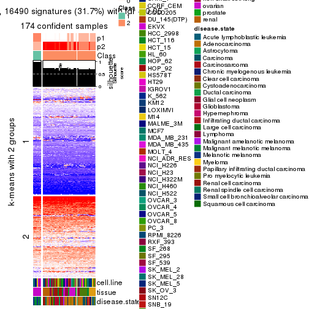</p>

</div>
<div id='tab-CV-pam-get-signatures-no-scale-2'>
<pre><code class="r">get_signatures(res, k = 3, scale_rows = FALSE)
</code></pre>

<pre><code>#&gt; Error in mat[ceiling(1:nr/h_ratio), ceiling(1:nc/w_ratio), drop = FALSE]: subscript out of bounds
</code></pre>

<p></p>

</div>
<div id='tab-CV-pam-get-signatures-no-scale-3'>
<pre><code class="r">get_signatures(res, k = 4, scale_rows = FALSE)
</code></pre>

<pre><code>#&gt; Error in mat[ceiling(1:nr/h_ratio), ceiling(1:nc/w_ratio), drop = FALSE]: subscript out of bounds
</code></pre>

<p></p>

</div>
<div id='tab-CV-pam-get-signatures-no-scale-4'>
<pre><code class="r">get_signatures(res, k = 5, scale_rows = FALSE)
</code></pre>

<p>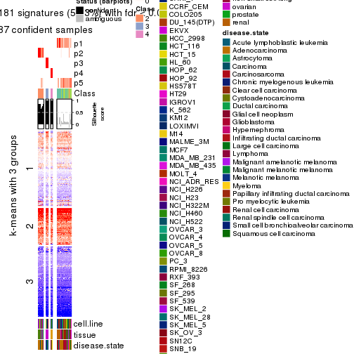</p>

</div>
<div id='tab-CV-pam-get-signatures-no-scale-5'>
<pre><code class="r">get_signatures(res, k = 6, scale_rows = FALSE)
</code></pre>

<p></p>

</div>
</div>


Compare the overlap of signatures from different k:

```r
compare_signatures(res)
```


`get_signature()` returns a data frame invisibly. TO get the list of signatures, the function
call should be assigned to a variable explicitly. In following code, if `plot` argument is set
to `FALSE`, no heatmap is plotted while only the differential analysis is performed.

```r
# code only for demonstration
tb = get_signature(res, k = ..., plot = FALSE)
```

An example of the output of `tb` is:

```
#>   which_row         fdr    mean_1    mean_2 scaled_mean_1 scaled_mean_2 km
#> 1        38 0.042760348  8.373488  9.131774    -0.5533452     0.5164555  1
#> 2        40 0.018707592  7.106213  8.469186    -0.6173731     0.5762149  1
#> 3        55 0.019134737 10.221463 11.207825    -0.6159697     0.5749050  1
#> 4        59 0.006059896  5.921854  7.869574    -0.6899429     0.6439467  1
#> 5        60 0.018055526  8.928898 10.211722    -0.6204761     0.5791110  1
#> 6        98 0.009384629 15.714769 14.887706     0.6635654    -0.6193277  2
...
```

The columns in `tb` are:

1. `which_row`: row indices corresponding to the input matrix.
2. `fdr`: FDR for the differential test. 
3. `mean_x`: The mean value in group x.
4. `scaled_mean_x`: The mean value in group x after rows are scaled.
5. `km`: Row groups if k-means clustering is applied to rows.


UMAP plot which shows how samples are separated.


<script>
$( function() {
	$( '#tabs-CV-pam-dimension-reduction' ).tabs();
} );
</script>
<div id='tabs-CV-pam-dimension-reduction'>
<ul>
<li><a href='#tab-CV-pam-dimension-reduction-1'>k = 2</a></li>
<li><a href='#tab-CV-pam-dimension-reduction-2'>k = 3</a></li>
<li><a href='#tab-CV-pam-dimension-reduction-3'>k = 4</a></li>
<li><a href='#tab-CV-pam-dimension-reduction-4'>k = 5</a></li>
<li><a href='#tab-CV-pam-dimension-reduction-5'>k = 6</a></li>
</ul>
<div id='tab-CV-pam-dimension-reduction-1'>
<pre><code class="r">dimension_reduction(res, k = 2, method = &quot;UMAP&quot;)
</code></pre>

<p></p>

</div>
<div id='tab-CV-pam-dimension-reduction-2'>
<pre><code class="r">dimension_reduction(res, k = 3, method = &quot;UMAP&quot;)
</code></pre>

<p></p>

</div>
<div id='tab-CV-pam-dimension-reduction-3'>
<pre><code class="r">dimension_reduction(res, k = 4, method = &quot;UMAP&quot;)
</code></pre>

<p></p>

</div>
<div id='tab-CV-pam-dimension-reduction-4'>
<pre><code class="r">dimension_reduction(res, k = 5, method = &quot;UMAP&quot;)
</code></pre>

<p></p>

</div>
<div id='tab-CV-pam-dimension-reduction-5'>
<pre><code class="r">dimension_reduction(res, k = 6, method = &quot;UMAP&quot;)
</code></pre>

<p></p>

</div>
</div>


Following heatmap shows how subgroups are split when increasing `k`:

```r
collect_classes(res)
```


Test correlation between subgroups and known annotations. If the known
annotation is numeric, one-way ANOVA test is applied, and if the known
annotation is discrete, chi-squared contingency table test is applied.

```r
test_to_known_factors(res)
```

```
#>          n cell.line(p) tissue(p) disease.state(p) k
#> CV:pam 174     1.60e-13  1.29e-28         1.02e-24 2
#> CV:pam 170     2.13e-23  2.19e-43         2.86e-31 3
#> CV:pam 171     1.35e-34  7.29e-71         3.05e-50 4
#> CV:pam  87     1.60e-13  7.25e-31         1.02e-24 5
#> CV:pam 128     1.28e-42  3.42e-88         6.27e-52 6
```


If matrix rows can be associated to genes, consider to use `GO_Enrichment(res,
...)` to perform function enrichment for the signature genes.


 

---------------------------------------------------


### CV:mclust


The object with results only for a single top-value method and a single partition method 
can be extracted as:

```r
res = res_list["CV", "mclust"]
# you can also extract it by
# res = res_list["CV:mclust"]
```

A summary of `res` and all the functions that can be applied to it:

```r
res
```

```
#> A 'ConsensusPartition' object with k = 2, 3, 4, 5, 6.
#>   On a matrix with 51941 rows and 174 columns.
#>   Top rows (1000, 2000, 3000, 4000, 5000) are extracted by 'CV' method.
#>   Subgroups are detected by 'mclust' method.
#>   Performed in total 1250 partitions by row resampling.
#>   Best k for subgroups seems to be 4.
#> 
#> Following methods can be applied to this 'ConsensusPartition' object:
#>  [1] "cola_report"             "collect_classes"         "collect_plots"          
#>  [4] "collect_stats"           "colnames"                "compare_signatures"     
#>  [7] "consensus_heatmap"       "dimension_reduction"     "functional_enrichment"  
#> [10] "get_anno_col"            "get_anno"                "get_classes"            
#> [13] "get_consensus"           "get_matrix"              "get_membership"         
#> [16] "get_param"               "get_signatures"          "get_stats"              
#> [19] "is_best_k"               "is_stable_k"             "membership_heatmap"     
#> [22] "ncol"                    "nrow"                    "plot_ecdf"              
#> [25] "rownames"                "select_partition_number" "show"                   
#> [28] "suggest_best_k"          "test_to_known_factors"
```

`collect_plots()` function collects all the plots made from `res` for all `k` (number of partitions)
into one single page to provide an easy and fast comparison between different `k`.

```r
collect_plots(res)
```


The plots are:

- The first row: a plot of the ECDF (Empirical cumulative distribution
  function) curves of the consensus matrix for each `k` and the heatmap of
  predicted classes for each `k`.
- The second row: heatmaps of the consensus matrix for each `k`.
- The third row: heatmaps of the membership matrix for each `k`.
- The fouth row: heatmaps of the signatures for each `k`.

All the plots in panels can be made by individual functions and they are
plotted later in this section.

`select_partition_number()` produces several plots showing different
statistics for choosing "optimized" `k`. There are following statistics:

- ECDF curves of the consensus matrix for each `k`;
- 1-PAC. [The PAC
  score](https://en.wikipedia.org/wiki/Consensus_clustering#Over-interpretation_potential_of_consensus_clustering)
  measures the proportion of the ambiguous subgrouping.
- Mean silhouette score.
- Concordance. The mean probability of fiting the consensus class ids in all
  partitions.
- Area increased. Denote $A_k$ as the area under the ECDF curve for current
  `k`, the area increased is defined as $A_k - A_{k-1}$.
- Rand index. The percent of pairs of samples that are both in a same cluster
  or both are not in a same cluster in the partition of k and k-1.
- Jaccard index. The ratio of pairs of samples are both in a same cluster in
  the partition of k and k-1 and the pairs of samples are both in a same
  cluster in the partition k or k-1.

The detailed explanations of these statistics can be found in [the cola
vignette](http://bioconductor.org/packages/devel/bioc/vignettes/cola/inst/doc/cola.html#toc_13).

Generally speaking, lower PAC score, higher mean silhouette score or higher
concordance corresponds to better partition. Rand index and Jaccard index
measure how similar the current partition is compared to partition with `k-1`.
If they are too similar, we won't accept `k` is better than `k-1`.

```r
select_partition_number(res)
```


The numeric values for all these statistics can be obtained by `get_stats()`.

```r
get_stats(res)
```

```
#>   k 1-PAC mean_silhouette concordance area_increased  Rand Jaccard
#> 2 2 0.646           0.763       0.892         0.3782 0.603   0.603
#> 3 3 0.557           0.745       0.850         0.4693 0.859   0.770
#> 4 4 0.727           0.820       0.912         0.2155 0.697   0.443
#> 5 5 0.743           0.776       0.888         0.1177 0.789   0.434
#> 6 6 0.833           0.776       0.887         0.0728 0.850   0.461
```

`suggest_best_k()` suggests the best $k$ based on these statistics. The rules are as follows:

- All $k$ with Jaccard index larger than 0.95 are removed because the increase of
  the partition number does not provides enough extra information. If all $k$ are removed,
  the best $k$ is assigned by `NA`.
- For $k$ with 1-PAC larger than 0.9, the maximal $k$ is taken as the "best k". Other $k$ is called "optional k".
- If it does not fit the second rule. The $k$ with the highest vote of highest
  1-PAC, mean silhouette and concordance is taken as the "best k".

```r
suggest_best_k(res)
```

```
#> [1] 4
```


Following shows the table of the partitions (You need to click the **show/hide
code output** link to see it). The membership matrix (columns with name `p*`)
is inferred by
[`clue::cl_consensus()`](https://www.rdocumentation.org/link/cl_consensus?package=clue)
function with the `SE` method. Basically the value in the membership matrix
represents the probability to belong to a certain group. The finall class
label for an item is determined with the group with highest probability it
belongs to.

In `get_classes()` function, the entropy is calculated from the membership
matrix and the silhouette score is calculated from the consensus matrix.


<script>
$( function() {
	$( '#tabs-CV-mclust-get-classes' ).tabs();
} );
</script>
<div id='tabs-CV-mclust-get-classes'>
<ul>
<li><a href='#tab-CV-mclust-get-classes-1'>k = 2</a></li>
<li><a href='#tab-CV-mclust-get-classes-2'>k = 3</a></li>
<li><a href='#tab-CV-mclust-get-classes-3'>k = 4</a></li>
<li><a href='#tab-CV-mclust-get-classes-4'>k = 5</a></li>
<li><a href='#tab-CV-mclust-get-classes-5'>k = 6</a></li>
</ul>

<div id='tab-CV-mclust-get-classes-1'>
<p><a id='tab-CV-mclust-get-classes-1-a' style='color:#0366d6' href='#'>show/hide code output</a></p>
<pre><code class="r">cbind(get_classes(res, k = 2), get_membership(res, k = 2))
</code></pre>

<pre><code>#&gt;           class entropy silhouette    p1    p2
#&gt; GSM803615     2  0.0000     0.2862 0.000 1.000
#&gt; GSM803674     2  0.0000     0.2862 0.000 1.000
#&gt; GSM803733     2  0.0000     0.2862 0.000 1.000
#&gt; GSM803616     2  0.0000     0.2862 0.000 1.000
#&gt; GSM803675     2  0.0000     0.2862 0.000 1.000
#&gt; GSM803734     2  0.0000     0.2862 0.000 1.000
#&gt; GSM803617     2  0.0000     0.2862 0.000 1.000
#&gt; GSM803676     2  0.0000     0.2862 0.000 1.000
#&gt; GSM803735     2  0.0000     0.2862 0.000 1.000
#&gt; GSM803618     2  0.0000     0.2862 0.000 1.000
#&gt; GSM803677     2  0.0000     0.2862 0.000 1.000
#&gt; GSM803736     2  0.0000     0.2862 0.000 1.000
#&gt; GSM803619     2  0.0000     0.2862 0.000 1.000
#&gt; GSM803678     2  0.0000     0.2862 0.000 1.000
#&gt; GSM803737     2  0.0000     0.2862 0.000 1.000
#&gt; GSM803620     2  0.0000     0.2862 0.000 1.000
#&gt; GSM803679     2  0.0000     0.2862 0.000 1.000
#&gt; GSM803738     2  0.0000     0.2862 0.000 1.000
#&gt; GSM803621     2  0.9933     0.8823 0.452 0.548
#&gt; GSM803680     2  0.9963     0.8667 0.464 0.536
#&gt; GSM803739     2  0.9896     0.8973 0.440 0.560
#&gt; GSM803622     1  0.0376     0.5768 0.996 0.004
#&gt; GSM803681     1  0.0376     0.5768 0.996 0.004
#&gt; GSM803740     1  0.0376     0.5768 0.996 0.004
#&gt; GSM803623     2  0.9850     0.9117 0.428 0.572
#&gt; GSM803682     2  0.9850     0.9117 0.428 0.572
#&gt; GSM803741     2  0.9850     0.9117 0.428 0.572
#&gt; GSM803624     2  0.9850     0.9117 0.428 0.572
#&gt; GSM803683     2  0.9850     0.9117 0.428 0.572
#&gt; GSM803742     2  0.9850     0.9117 0.428 0.572
#&gt; GSM803625     2  0.9850     0.9117 0.428 0.572
#&gt; GSM803684     2  0.9850     0.9117 0.428 0.572
#&gt; GSM803743     2  0.9850     0.9117 0.428 0.572
#&gt; GSM803626     1  0.9850     0.7161 0.572 0.428
#&gt; GSM803685     1  0.9850     0.7161 0.572 0.428
#&gt; GSM803744     1  0.9850     0.7161 0.572 0.428
#&gt; GSM803627     1  0.2043     0.5275 0.968 0.032
#&gt; GSM803686     1  0.3584     0.4509 0.932 0.068
#&gt; GSM803745     1  0.3733     0.4413 0.928 0.072
#&gt; GSM803628     1  0.0376     0.5768 0.996 0.004
#&gt; GSM803687     1  0.0376     0.5768 0.996 0.004
#&gt; GSM803746     1  0.0000     0.5812 1.000 0.000
#&gt; GSM803629     1  0.7056     0.0521 0.808 0.192
#&gt; GSM803688     1  0.7453    -0.0374 0.788 0.212
#&gt; GSM803747     1  0.7376    -0.0192 0.792 0.208
#&gt; GSM803630     1  0.0000     0.5812 1.000 0.000
#&gt; GSM803689     1  0.0000     0.5812 1.000 0.000
#&gt; GSM803748     1  0.0000     0.5812 1.000 0.000
#&gt; GSM803631     1  0.0000     0.5812 1.000 0.000
#&gt; GSM803690     1  0.0000     0.5812 1.000 0.000
#&gt; GSM803749     1  0.0000     0.5812 1.000 0.000
#&gt; GSM803632     1  0.0000     0.5812 1.000 0.000
#&gt; GSM803691     1  0.0000     0.5812 1.000 0.000
#&gt; GSM803750     1  0.0000     0.5812 1.000 0.000
#&gt; GSM803633     2  0.9850     0.9117 0.428 0.572
#&gt; GSM803692     2  0.9850     0.9117 0.428 0.572
#&gt; GSM803751     2  0.9850     0.9117 0.428 0.572
#&gt; GSM803634     2  0.9850     0.9117 0.428 0.572
#&gt; GSM803693     2  0.9850     0.9117 0.428 0.572
#&gt; GSM803752     2  0.9850     0.9117 0.428 0.572
#&gt; GSM803635     2  0.9850     0.9117 0.428 0.572
#&gt; GSM803694     2  0.9850     0.9117 0.428 0.572
#&gt; GSM803753     2  0.9850     0.9117 0.428 0.572
#&gt; GSM803636     2  0.9850     0.9117 0.428 0.572
#&gt; GSM803695     2  0.9850     0.9117 0.428 0.572
#&gt; GSM803754     2  0.9850     0.9117 0.428 0.572
#&gt; GSM803637     2  0.9850     0.9117 0.428 0.572
#&gt; GSM803696     2  0.9850     0.9117 0.428 0.572
#&gt; GSM803755     2  0.9850     0.9117 0.428 0.572
#&gt; GSM803638     2  0.9850     0.9117 0.428 0.572
#&gt; GSM803697     2  0.9850     0.9117 0.428 0.572
#&gt; GSM803756     2  0.9850     0.9117 0.428 0.572
#&gt; GSM803639     2  0.9850     0.9117 0.428 0.572
#&gt; GSM803698     2  0.9850     0.9117 0.428 0.572
#&gt; GSM803757     2  0.9850     0.9117 0.428 0.572
#&gt; GSM803640     2  0.9850     0.9117 0.428 0.572
#&gt; GSM803699     2  0.9850     0.9117 0.428 0.572
#&gt; GSM803758     2  0.9850     0.9117 0.428 0.572
#&gt; GSM803641     2  0.9850     0.9117 0.428 0.572
#&gt; GSM803700     2  0.9850     0.9117 0.428 0.572
#&gt; GSM803759     2  0.9850     0.9117 0.428 0.572
#&gt; GSM803642     2  0.9850     0.9117 0.428 0.572
#&gt; GSM803701     2  0.9850     0.9117 0.428 0.572
#&gt; GSM803760     2  0.9850     0.9117 0.428 0.572
#&gt; GSM803643     2  0.9850     0.9117 0.428 0.572
#&gt; GSM803702     2  0.9850     0.9117 0.428 0.572
#&gt; GSM803644     2  0.9850     0.9117 0.428 0.572
#&gt; GSM803703     2  0.9850     0.9117 0.428 0.572
#&gt; GSM803761     2  0.9850     0.9117 0.428 0.572
#&gt; GSM803645     2  0.9850     0.9117 0.428 0.572
#&gt; GSM803704     2  0.9850     0.9117 0.428 0.572
#&gt; GSM803762     2  0.9850     0.9117 0.428 0.572
#&gt; GSM803646     2  0.9850     0.9117 0.428 0.572
#&gt; GSM803705     2  0.9850     0.9117 0.428 0.572
#&gt; GSM803763     2  0.9850     0.9117 0.428 0.572
#&gt; GSM803647     2  0.9850     0.9117 0.428 0.572
#&gt; GSM803706     2  0.9850     0.9117 0.428 0.572
#&gt; GSM803764     2  0.9850     0.9117 0.428 0.572
#&gt; GSM803648     2  0.9850     0.9117 0.428 0.572
#&gt; GSM803707     2  0.9850     0.9117 0.428 0.572
#&gt; GSM803765     2  0.9850     0.9117 0.428 0.572
#&gt; GSM803649     2  0.9850     0.9117 0.428 0.572
#&gt; GSM803708     2  0.9850     0.9117 0.428 0.572
#&gt; GSM803766     2  0.9850     0.9117 0.428 0.572
#&gt; GSM803650     2  0.9850     0.9117 0.428 0.572
#&gt; GSM803709     2  0.9850     0.9117 0.428 0.572
#&gt; GSM803767     2  0.9850     0.9117 0.428 0.572
#&gt; GSM803651     2  0.9850     0.9117 0.428 0.572
#&gt; GSM803710     2  0.9850     0.9117 0.428 0.572
#&gt; GSM803768     2  0.9850     0.9117 0.428 0.572
#&gt; GSM803652     2  0.9850     0.9117 0.428 0.572
#&gt; GSM803711     2  0.9850     0.9117 0.428 0.572
#&gt; GSM803653     2  0.9850     0.9117 0.428 0.572
#&gt; GSM803712     2  0.9850     0.9117 0.428 0.572
#&gt; GSM803769     2  0.9850     0.9117 0.428 0.572
#&gt; GSM803654     2  0.9850     0.9117 0.428 0.572
#&gt; GSM803713     2  0.9850     0.9117 0.428 0.572
#&gt; GSM803770     2  0.9850     0.9117 0.428 0.572
#&gt; GSM803655     2  0.9850     0.9117 0.428 0.572
#&gt; GSM803714     2  0.9850     0.9117 0.428 0.572
#&gt; GSM803771     2  0.9850     0.9117 0.428 0.572
#&gt; GSM803656     2  0.9850     0.9117 0.428 0.572
#&gt; GSM803715     2  0.9850     0.9117 0.428 0.572
#&gt; GSM803772     2  0.9850     0.9117 0.428 0.572
#&gt; GSM803657     2  0.9850     0.9117 0.428 0.572
#&gt; GSM803716     2  0.9850     0.9117 0.428 0.572
#&gt; GSM803773     2  0.9850     0.9117 0.428 0.572
#&gt; GSM803658     2  0.9850     0.9117 0.428 0.572
#&gt; GSM803717     2  0.9850     0.9117 0.428 0.572
#&gt; GSM803774     2  0.9850     0.9117 0.428 0.572
#&gt; GSM803659     2  0.9850     0.9117 0.428 0.572
#&gt; GSM803718     2  0.9850     0.9117 0.428 0.572
#&gt; GSM803775     2  0.9850     0.9117 0.428 0.572
#&gt; GSM803660     2  0.9850     0.9117 0.428 0.572
#&gt; GSM803719     2  0.9850     0.9117 0.428 0.572
#&gt; GSM803776     2  0.9850     0.9117 0.428 0.572
#&gt; GSM803661     2  0.9850     0.9117 0.428 0.572
#&gt; GSM803720     2  0.9850     0.9117 0.428 0.572
#&gt; GSM803777     2  0.9850     0.9117 0.428 0.572
#&gt; GSM803662     2  0.9850     0.9117 0.428 0.572
#&gt; GSM803732     2  0.9850     0.9117 0.428 0.572
#&gt; GSM803778     2  0.9850     0.9117 0.428 0.572
#&gt; GSM803663     2  0.9850     0.9117 0.428 0.572
#&gt; GSM803721     2  0.9850     0.9117 0.428 0.572
#&gt; GSM803779     2  0.9850     0.9117 0.428 0.572
#&gt; GSM803664     2  0.9850     0.9117 0.428 0.572
#&gt; GSM803722     2  0.9850     0.9117 0.428 0.572
#&gt; GSM803780     2  0.9850     0.9117 0.428 0.572
#&gt; GSM803665     1  0.0672     0.5709 0.992 0.008
#&gt; GSM803723     1  0.0672     0.5709 0.992 0.008
#&gt; GSM803781     1  0.0672     0.5709 0.992 0.008
#&gt; GSM803666     1  0.9850     0.7161 0.572 0.428
#&gt; GSM803724     1  0.9850     0.7161 0.572 0.428
#&gt; GSM803782     1  0.9850     0.7161 0.572 0.428
#&gt; GSM803667     1  0.9850     0.7161 0.572 0.428
#&gt; GSM803725     1  0.9850     0.7161 0.572 0.428
#&gt; GSM803783     1  0.9850     0.7161 0.572 0.428
#&gt; GSM803668     1  0.9850     0.7161 0.572 0.428
#&gt; GSM803726     1  0.9850     0.7161 0.572 0.428
#&gt; GSM803784     1  0.9850     0.7161 0.572 0.428
#&gt; GSM803669     1  0.9850     0.7161 0.572 0.428
#&gt; GSM803727     1  0.9850     0.7161 0.572 0.428
#&gt; GSM803670     1  0.9850     0.7161 0.572 0.428
#&gt; GSM803728     1  0.9850     0.7161 0.572 0.428
#&gt; GSM803785     1  0.9850     0.7161 0.572 0.428
#&gt; GSM803671     1  0.9850     0.7161 0.572 0.428
#&gt; GSM803729     1  0.9850     0.7161 0.572 0.428
#&gt; GSM803786     1  0.9850     0.7161 0.572 0.428
#&gt; GSM803672     1  0.9850     0.7161 0.572 0.428
#&gt; GSM803730     1  0.9850     0.7161 0.572 0.428
#&gt; GSM803787     1  0.9850     0.7161 0.572 0.428
#&gt; GSM803673     2  0.9850     0.9117 0.428 0.572
#&gt; GSM803731     2  0.9850     0.9117 0.428 0.572
#&gt; GSM803788     2  0.9850     0.9117 0.428 0.572
</code></pre>

<script>
$('#tab-CV-mclust-get-classes-1-a').parent().next().next().hide();
$('#tab-CV-mclust-get-classes-1-a').click(function(){
  $('#tab-CV-mclust-get-classes-1-a').parent().next().next().toggle();
  return(false);
});
</script>
</div>

<div id='tab-CV-mclust-get-classes-2'>
<p><a id='tab-CV-mclust-get-classes-2-a' style='color:#0366d6' href='#'>show/hide code output</a></p>
<pre><code class="r">cbind(get_classes(res, k = 3), get_membership(res, k = 3))
</code></pre>

<pre><code>#&gt;           class entropy silhouette    p1    p2    p3
#&gt; GSM803615     3  0.0237     0.9982 0.004 0.000 0.996
#&gt; GSM803674     3  0.0237     0.9982 0.004 0.000 0.996
#&gt; GSM803733     3  0.0237     0.9982 0.004 0.000 0.996
#&gt; GSM803616     3  0.0237     0.9982 0.004 0.000 0.996
#&gt; GSM803675     3  0.0237     0.9982 0.004 0.000 0.996
#&gt; GSM803734     3  0.0237     0.9982 0.004 0.000 0.996
#&gt; GSM803617     3  0.0237     0.9982 0.004 0.000 0.996
#&gt; GSM803676     3  0.0237     0.9982 0.004 0.000 0.996
#&gt; GSM803735     3  0.0237     0.9982 0.004 0.000 0.996
#&gt; GSM803618     3  0.0000     0.9964 0.000 0.000 1.000
#&gt; GSM803677     3  0.0000     0.9964 0.000 0.000 1.000
#&gt; GSM803736     3  0.0000     0.9964 0.000 0.000 1.000
#&gt; GSM803619     3  0.0237     0.9982 0.004 0.000 0.996
#&gt; GSM803678     3  0.0237     0.9982 0.004 0.000 0.996
#&gt; GSM803737     3  0.0237     0.9982 0.004 0.000 0.996
#&gt; GSM803620     3  0.0000     0.9964 0.000 0.000 1.000
#&gt; GSM803679     3  0.0000     0.9964 0.000 0.000 1.000
#&gt; GSM803738     3  0.0000     0.9964 0.000 0.000 1.000
#&gt; GSM803621     2  0.5858     0.7412 0.240 0.740 0.020
#&gt; GSM803680     2  0.6180     0.7136 0.260 0.716 0.024
#&gt; GSM803739     2  0.6589     0.6794 0.280 0.688 0.032
#&gt; GSM803622     1  0.5988     0.4305 0.688 0.304 0.008
#&gt; GSM803681     1  0.6102     0.3963 0.672 0.320 0.008
#&gt; GSM803740     1  0.6297     0.3186 0.640 0.352 0.008
#&gt; GSM803623     2  0.1643     0.8489 0.000 0.956 0.044
#&gt; GSM803682     2  0.1643     0.8489 0.000 0.956 0.044
#&gt; GSM803741     2  0.1643     0.8489 0.000 0.956 0.044
#&gt; GSM803624     2  0.7372     0.7266 0.092 0.688 0.220
#&gt; GSM803683     2  0.6234     0.8147 0.128 0.776 0.096
#&gt; GSM803742     2  0.6234     0.8147 0.128 0.776 0.096
#&gt; GSM803625     2  0.6234     0.8147 0.128 0.776 0.096
#&gt; GSM803684     2  0.6234     0.8147 0.128 0.776 0.096
#&gt; GSM803743     2  0.6234     0.8147 0.128 0.776 0.096
#&gt; GSM803626     1  0.4291     0.6458 0.820 0.000 0.180
#&gt; GSM803685     1  0.3551     0.6367 0.868 0.000 0.132
#&gt; GSM803744     1  0.4291     0.6458 0.820 0.000 0.180
#&gt; GSM803627     1  0.6410     0.1158 0.576 0.420 0.004
#&gt; GSM803686     1  0.6633     0.0255 0.548 0.444 0.008
#&gt; GSM803745     1  0.6654    -0.0241 0.536 0.456 0.008
#&gt; GSM803628     1  0.6107     0.5296 0.764 0.184 0.052
#&gt; GSM803687     1  0.6245     0.5295 0.760 0.180 0.060
#&gt; GSM803746     1  0.5428     0.5699 0.816 0.120 0.064
#&gt; GSM803629     1  0.6954    -0.1369 0.500 0.484 0.016
#&gt; GSM803688     1  0.6955    -0.1521 0.496 0.488 0.016
#&gt; GSM803747     2  0.6955     0.1414 0.492 0.492 0.016
#&gt; GSM803630     1  0.4602     0.5865 0.832 0.016 0.152
#&gt; GSM803689     1  0.4602     0.5865 0.832 0.016 0.152
#&gt; GSM803748     1  0.4663     0.5838 0.828 0.016 0.156
#&gt; GSM803631     1  0.4475     0.5905 0.840 0.016 0.144
#&gt; GSM803690     1  0.4475     0.5905 0.840 0.016 0.144
#&gt; GSM803749     1  0.4475     0.5905 0.840 0.016 0.144
#&gt; GSM803632     1  0.4663     0.5835 0.828 0.016 0.156
#&gt; GSM803691     1  0.4663     0.5835 0.828 0.016 0.156
#&gt; GSM803750     1  0.4602     0.5864 0.832 0.016 0.152
#&gt; GSM803633     2  0.1643     0.8489 0.000 0.956 0.044
#&gt; GSM803692     2  0.1643     0.8489 0.000 0.956 0.044
#&gt; GSM803751     2  0.1643     0.8489 0.000 0.956 0.044
#&gt; GSM803634     2  0.1643     0.8489 0.000 0.956 0.044
#&gt; GSM803693     2  0.1643     0.8489 0.000 0.956 0.044
#&gt; GSM803752     2  0.1643     0.8489 0.000 0.956 0.044
#&gt; GSM803635     2  0.0237     0.8592 0.000 0.996 0.004
#&gt; GSM803694     2  0.0237     0.8592 0.000 0.996 0.004
#&gt; GSM803753     2  0.0237     0.8592 0.000 0.996 0.004
#&gt; GSM803636     2  0.1643     0.8489 0.000 0.956 0.044
#&gt; GSM803695     2  0.1643     0.8489 0.000 0.956 0.044
#&gt; GSM803754     2  0.1643     0.8489 0.000 0.956 0.044
#&gt; GSM803637     2  0.1643     0.8489 0.000 0.956 0.044
#&gt; GSM803696     2  0.1643     0.8489 0.000 0.956 0.044
#&gt; GSM803755     2  0.1643     0.8489 0.000 0.956 0.044
#&gt; GSM803638     2  0.1643     0.8489 0.000 0.956 0.044
#&gt; GSM803697     2  0.1643     0.8489 0.000 0.956 0.044
#&gt; GSM803756     2  0.1643     0.8489 0.000 0.956 0.044
#&gt; GSM803639     2  0.0892     0.8568 0.000 0.980 0.020
#&gt; GSM803698     2  0.0892     0.8568 0.000 0.980 0.020
#&gt; GSM803757     2  0.1411     0.8519 0.000 0.964 0.036
#&gt; GSM803640     2  0.5998     0.8195 0.128 0.788 0.084
#&gt; GSM803699     2  0.5998     0.8195 0.128 0.788 0.084
#&gt; GSM803758     2  0.6157     0.8164 0.128 0.780 0.092
#&gt; GSM803641     2  0.5998     0.8197 0.128 0.788 0.084
#&gt; GSM803700     2  0.6157     0.8164 0.128 0.780 0.092
#&gt; GSM803759     2  0.6079     0.8182 0.128 0.784 0.088
#&gt; GSM803642     2  0.4349     0.8339 0.128 0.852 0.020
#&gt; GSM803701     2  0.4349     0.8339 0.128 0.852 0.020
#&gt; GSM803760     2  0.4349     0.8339 0.128 0.852 0.020
#&gt; GSM803643     2  0.5276     0.8288 0.128 0.820 0.052
#&gt; GSM803702     2  0.5174     0.8299 0.128 0.824 0.048
#&gt; GSM803644     2  0.6309     0.8127 0.128 0.772 0.100
#&gt; GSM803703     2  0.6309     0.8127 0.128 0.772 0.100
#&gt; GSM803761     2  0.6309     0.8127 0.128 0.772 0.100
#&gt; GSM803645     2  0.6234     0.8147 0.128 0.776 0.096
#&gt; GSM803704     2  0.6234     0.8147 0.128 0.776 0.096
#&gt; GSM803762     2  0.6234     0.8147 0.128 0.776 0.096
#&gt; GSM803646     2  0.3482     0.8351 0.128 0.872 0.000
#&gt; GSM803705     2  0.3482     0.8351 0.128 0.872 0.000
#&gt; GSM803763     2  0.3482     0.8351 0.128 0.872 0.000
#&gt; GSM803647     2  0.4960     0.8313 0.128 0.832 0.040
#&gt; GSM803706     2  0.4960     0.8313 0.128 0.832 0.040
#&gt; GSM803764     2  0.4960     0.8313 0.128 0.832 0.040
#&gt; GSM803648     2  0.1163     0.8546 0.000 0.972 0.028
#&gt; GSM803707     2  0.1163     0.8546 0.000 0.972 0.028
#&gt; GSM803765     2  0.1163     0.8546 0.000 0.972 0.028
#&gt; GSM803649     2  0.1163     0.8546 0.000 0.972 0.028
#&gt; GSM803708     2  0.1163     0.8546 0.000 0.972 0.028
#&gt; GSM803766     2  0.1163     0.8546 0.000 0.972 0.028
#&gt; GSM803650     2  0.6234     0.8147 0.128 0.776 0.096
#&gt; GSM803709     2  0.6234     0.8147 0.128 0.776 0.096
#&gt; GSM803767     2  0.6234     0.8147 0.128 0.776 0.096
#&gt; GSM803651     2  0.6234     0.8147 0.128 0.776 0.096
#&gt; GSM803710     2  0.6234     0.8147 0.128 0.776 0.096
#&gt; GSM803768     2  0.6234     0.8147 0.128 0.776 0.096
#&gt; GSM803652     2  0.6234     0.8147 0.128 0.776 0.096
#&gt; GSM803711     2  0.6234     0.8147 0.128 0.776 0.096
#&gt; GSM803653     2  0.5591     0.6273 0.000 0.696 0.304
#&gt; GSM803712     2  0.5591     0.6273 0.000 0.696 0.304
#&gt; GSM803769     2  0.5560     0.6339 0.000 0.700 0.300
#&gt; GSM803654     2  0.0000     0.8593 0.000 1.000 0.000
#&gt; GSM803713     2  0.0000     0.8593 0.000 1.000 0.000
#&gt; GSM803770     2  0.0000     0.8593 0.000 1.000 0.000
#&gt; GSM803655     2  0.5254     0.6756 0.000 0.736 0.264
#&gt; GSM803714     2  0.5178     0.6846 0.000 0.744 0.256
#&gt; GSM803771     2  0.5216     0.6815 0.000 0.740 0.260
#&gt; GSM803656     2  0.6509     0.2296 0.004 0.524 0.472
#&gt; GSM803715     2  0.6509     0.2296 0.004 0.524 0.472
#&gt; GSM803772     2  0.6516     0.2053 0.004 0.516 0.480
#&gt; GSM803657     2  0.0000     0.8593 0.000 1.000 0.000
#&gt; GSM803716     2  0.0000     0.8593 0.000 1.000 0.000
#&gt; GSM803773     2  0.0000     0.8593 0.000 1.000 0.000
#&gt; GSM803658     2  0.0000     0.8593 0.000 1.000 0.000
#&gt; GSM803717     2  0.0000     0.8593 0.000 1.000 0.000
#&gt; GSM803774     2  0.0000     0.8593 0.000 1.000 0.000
#&gt; GSM803659     2  0.0000     0.8593 0.000 1.000 0.000
#&gt; GSM803718     2  0.0000     0.8593 0.000 1.000 0.000
#&gt; GSM803775     2  0.0000     0.8593 0.000 1.000 0.000
#&gt; GSM803660     2  0.0424     0.8594 0.000 0.992 0.008
#&gt; GSM803719     2  0.0424     0.8594 0.000 0.992 0.008
#&gt; GSM803776     2  0.0424     0.8594 0.000 0.992 0.008
#&gt; GSM803661     2  0.6234     0.8147 0.128 0.776 0.096
#&gt; GSM803720     2  0.6234     0.8147 0.128 0.776 0.096
#&gt; GSM803777     2  0.6234     0.8147 0.128 0.776 0.096
#&gt; GSM803662     2  0.0000     0.8593 0.000 1.000 0.000
#&gt; GSM803732     2  0.3482     0.8351 0.128 0.872 0.000
#&gt; GSM803778     2  0.3482     0.8351 0.128 0.872 0.000
#&gt; GSM803663     2  0.0000     0.8593 0.000 1.000 0.000
#&gt; GSM803721     2  0.0000     0.8593 0.000 1.000 0.000
#&gt; GSM803779     2  0.0000     0.8593 0.000 1.000 0.000
#&gt; GSM803664     2  0.0747     0.8588 0.000 0.984 0.016
#&gt; GSM803722     2  0.0424     0.8597 0.000 0.992 0.008
#&gt; GSM803780     2  0.0424     0.8597 0.000 0.992 0.008
#&gt; GSM803665     1  0.9385     0.2438 0.484 0.188 0.328
#&gt; GSM803723     1  0.9385     0.2438 0.484 0.188 0.328
#&gt; GSM803781     1  0.9385     0.2438 0.484 0.188 0.328
#&gt; GSM803666     1  0.4291     0.6458 0.820 0.000 0.180
#&gt; GSM803724     1  0.4291     0.6458 0.820 0.000 0.180
#&gt; GSM803782     1  0.4291     0.6458 0.820 0.000 0.180
#&gt; GSM803667     1  0.4291     0.6458 0.820 0.000 0.180
#&gt; GSM803725     1  0.4291     0.6458 0.820 0.000 0.180
#&gt; GSM803783     1  0.4291     0.6458 0.820 0.000 0.180
#&gt; GSM803668     1  0.4291     0.6458 0.820 0.000 0.180
#&gt; GSM803726     1  0.4291     0.6458 0.820 0.000 0.180
#&gt; GSM803784     1  0.4291     0.6458 0.820 0.000 0.180
#&gt; GSM803669     1  0.4291     0.6458 0.820 0.000 0.180
#&gt; GSM803727     1  0.4291     0.6458 0.820 0.000 0.180
#&gt; GSM803670     1  0.4291     0.6458 0.820 0.000 0.180
#&gt; GSM803728     1  0.4291     0.6458 0.820 0.000 0.180
#&gt; GSM803785     1  0.4291     0.6458 0.820 0.000 0.180
#&gt; GSM803671     1  0.4291     0.6458 0.820 0.000 0.180
#&gt; GSM803729     1  0.4291     0.6458 0.820 0.000 0.180
#&gt; GSM803786     1  0.4291     0.6458 0.820 0.000 0.180
#&gt; GSM803672     1  0.4291     0.6458 0.820 0.000 0.180
#&gt; GSM803730     1  0.4291     0.6458 0.820 0.000 0.180
#&gt; GSM803787     1  0.4291     0.6458 0.820 0.000 0.180
#&gt; GSM803673     2  0.0592     0.8582 0.000 0.988 0.012
#&gt; GSM803731     2  0.0592     0.8582 0.000 0.988 0.012
#&gt; GSM803788     2  0.0747     0.8577 0.000 0.984 0.016
</code></pre>

<script>
$('#tab-CV-mclust-get-classes-2-a').parent().next().next().hide();
$('#tab-CV-mclust-get-classes-2-a').click(function(){
  $('#tab-CV-mclust-get-classes-2-a').parent().next().next().toggle();
  return(false);
});
</script>
</div>

<div id='tab-CV-mclust-get-classes-3'>
<p><a id='tab-CV-mclust-get-classes-3-a' style='color:#0366d6' href='#'>show/hide code output</a></p>
<pre><code class="r">cbind(get_classes(res, k = 4), get_membership(res, k = 4))
</code></pre>

<pre><code>#&gt;           class entropy silhouette    p1    p2    p3    p4
#&gt; GSM803615     4  0.0000     0.8931 0.000 0.000 0.000 1.000
#&gt; GSM803674     4  0.0000     0.8931 0.000 0.000 0.000 1.000
#&gt; GSM803733     4  0.0000     0.8931 0.000 0.000 0.000 1.000
#&gt; GSM803616     4  0.0000     0.8931 0.000 0.000 0.000 1.000
#&gt; GSM803675     4  0.0000     0.8931 0.000 0.000 0.000 1.000
#&gt; GSM803734     4  0.0000     0.8931 0.000 0.000 0.000 1.000
#&gt; GSM803617     4  0.0000     0.8931 0.000 0.000 0.000 1.000
#&gt; GSM803676     4  0.0000     0.8931 0.000 0.000 0.000 1.000
#&gt; GSM803735     4  0.0000     0.8931 0.000 0.000 0.000 1.000
#&gt; GSM803618     4  0.0000     0.8931 0.000 0.000 0.000 1.000
#&gt; GSM803677     4  0.0000     0.8931 0.000 0.000 0.000 1.000
#&gt; GSM803736     4  0.0000     0.8931 0.000 0.000 0.000 1.000
#&gt; GSM803619     4  0.0000     0.8931 0.000 0.000 0.000 1.000
#&gt; GSM803678     4  0.0000     0.8931 0.000 0.000 0.000 1.000
#&gt; GSM803737     4  0.0000     0.8931 0.000 0.000 0.000 1.000
#&gt; GSM803620     4  0.0000     0.8931 0.000 0.000 0.000 1.000
#&gt; GSM803679     4  0.0000     0.8931 0.000 0.000 0.000 1.000
#&gt; GSM803738     4  0.0000     0.8931 0.000 0.000 0.000 1.000
#&gt; GSM803621     1  0.0592     0.8321 0.984 0.016 0.000 0.000
#&gt; GSM803680     1  0.0592     0.8321 0.984 0.016 0.000 0.000
#&gt; GSM803739     1  0.0592     0.8321 0.984 0.016 0.000 0.000
#&gt; GSM803622     1  0.0000     0.8262 1.000 0.000 0.000 0.000
#&gt; GSM803681     1  0.0000     0.8262 1.000 0.000 0.000 0.000
#&gt; GSM803740     1  0.0000     0.8262 1.000 0.000 0.000 0.000
#&gt; GSM803623     2  0.0000     0.9102 0.000 1.000 0.000 0.000
#&gt; GSM803682     2  0.0000     0.9102 0.000 1.000 0.000 0.000
#&gt; GSM803741     2  0.0000     0.9102 0.000 1.000 0.000 0.000
#&gt; GSM803624     1  0.7774     0.2044 0.388 0.240 0.000 0.372
#&gt; GSM803683     1  0.4379     0.8656 0.792 0.172 0.000 0.036
#&gt; GSM803742     1  0.4379     0.8656 0.792 0.172 0.000 0.036
#&gt; GSM803625     1  0.4182     0.8637 0.796 0.180 0.000 0.024
#&gt; GSM803684     1  0.4182     0.8637 0.796 0.180 0.000 0.024
#&gt; GSM803743     1  0.4182     0.8637 0.796 0.180 0.000 0.024
#&gt; GSM803626     3  0.0000     0.9756 0.000 0.000 1.000 0.000
#&gt; GSM803685     3  0.4888     0.3342 0.412 0.000 0.588 0.000
#&gt; GSM803744     3  0.0000     0.9756 0.000 0.000 1.000 0.000
#&gt; GSM803627     1  0.0000     0.8262 1.000 0.000 0.000 0.000
#&gt; GSM803686     1  0.0000     0.8262 1.000 0.000 0.000 0.000
#&gt; GSM803745     1  0.0000     0.8262 1.000 0.000 0.000 0.000
#&gt; GSM803628     1  0.0000     0.8262 1.000 0.000 0.000 0.000
#&gt; GSM803687     1  0.0000     0.8262 1.000 0.000 0.000 0.000
#&gt; GSM803746     1  0.0000     0.8262 1.000 0.000 0.000 0.000
#&gt; GSM803629     1  0.0000     0.8262 1.000 0.000 0.000 0.000
#&gt; GSM803688     1  0.0000     0.8262 1.000 0.000 0.000 0.000
#&gt; GSM803747     1  0.0000     0.8262 1.000 0.000 0.000 0.000
#&gt; GSM803630     1  0.0000     0.8262 1.000 0.000 0.000 0.000
#&gt; GSM803689     1  0.0000     0.8262 1.000 0.000 0.000 0.000
#&gt; GSM803748     1  0.0000     0.8262 1.000 0.000 0.000 0.000
#&gt; GSM803631     1  0.0000     0.8262 1.000 0.000 0.000 0.000
#&gt; GSM803690     1  0.0000     0.8262 1.000 0.000 0.000 0.000
#&gt; GSM803749     1  0.0000     0.8262 1.000 0.000 0.000 0.000
#&gt; GSM803632     1  0.0000     0.8262 1.000 0.000 0.000 0.000
#&gt; GSM803691     1  0.0000     0.8262 1.000 0.000 0.000 0.000
#&gt; GSM803750     1  0.0000     0.8262 1.000 0.000 0.000 0.000
#&gt; GSM803633     2  0.0000     0.9102 0.000 1.000 0.000 0.000
#&gt; GSM803692     2  0.0000     0.9102 0.000 1.000 0.000 0.000
#&gt; GSM803751     2  0.0000     0.9102 0.000 1.000 0.000 0.000
#&gt; GSM803634     2  0.0000     0.9102 0.000 1.000 0.000 0.000
#&gt; GSM803693     2  0.0000     0.9102 0.000 1.000 0.000 0.000
#&gt; GSM803752     2  0.0000     0.9102 0.000 1.000 0.000 0.000
#&gt; GSM803635     2  0.0000     0.9102 0.000 1.000 0.000 0.000
#&gt; GSM803694     2  0.0000     0.9102 0.000 1.000 0.000 0.000
#&gt; GSM803753     2  0.0000     0.9102 0.000 1.000 0.000 0.000
#&gt; GSM803636     2  0.0000     0.9102 0.000 1.000 0.000 0.000
#&gt; GSM803695     2  0.0000     0.9102 0.000 1.000 0.000 0.000
#&gt; GSM803754     2  0.0000     0.9102 0.000 1.000 0.000 0.000
#&gt; GSM803637     2  0.0000     0.9102 0.000 1.000 0.000 0.000
#&gt; GSM803696     2  0.0000     0.9102 0.000 1.000 0.000 0.000
#&gt; GSM803755     2  0.0000     0.9102 0.000 1.000 0.000 0.000
#&gt; GSM803638     2  0.0000     0.9102 0.000 1.000 0.000 0.000
#&gt; GSM803697     2  0.0000     0.9102 0.000 1.000 0.000 0.000
#&gt; GSM803756     2  0.0000     0.9102 0.000 1.000 0.000 0.000
#&gt; GSM803639     2  0.0000     0.9102 0.000 1.000 0.000 0.000
#&gt; GSM803698     2  0.0000     0.9102 0.000 1.000 0.000 0.000
#&gt; GSM803757     2  0.0000     0.9102 0.000 1.000 0.000 0.000
#&gt; GSM803640     1  0.4332     0.8644 0.792 0.176 0.000 0.032
#&gt; GSM803699     1  0.4332     0.8644 0.792 0.176 0.000 0.032
#&gt; GSM803758     1  0.4379     0.8656 0.792 0.172 0.000 0.036
#&gt; GSM803641     1  0.4888     0.8269 0.740 0.224 0.000 0.036
#&gt; GSM803700     1  0.4728     0.8357 0.752 0.216 0.000 0.032
#&gt; GSM803759     1  0.4833     0.8245 0.740 0.228 0.000 0.032
#&gt; GSM803642     1  0.4833     0.8245 0.740 0.228 0.000 0.032
#&gt; GSM803701     1  0.4833     0.8245 0.740 0.228 0.000 0.032
#&gt; GSM803760     1  0.4833     0.8245 0.740 0.228 0.000 0.032
#&gt; GSM803643     1  0.4833     0.8245 0.740 0.228 0.000 0.032
#&gt; GSM803702     1  0.4833     0.8245 0.740 0.228 0.000 0.032
#&gt; GSM803644     1  0.4379     0.8656 0.792 0.172 0.000 0.036
#&gt; GSM803703     1  0.4379     0.8656 0.792 0.172 0.000 0.036
#&gt; GSM803761     1  0.4379     0.8656 0.792 0.172 0.000 0.036
#&gt; GSM803645     1  0.4194     0.8656 0.800 0.172 0.000 0.028
#&gt; GSM803704     1  0.4379     0.8656 0.792 0.172 0.000 0.036
#&gt; GSM803762     1  0.4379     0.8656 0.792 0.172 0.000 0.036
#&gt; GSM803646     2  0.4961    -0.0601 0.448 0.552 0.000 0.000
#&gt; GSM803705     2  0.4948    -0.0269 0.440 0.560 0.000 0.000
#&gt; GSM803763     2  0.4948    -0.0274 0.440 0.560 0.000 0.000
#&gt; GSM803647     1  0.4833     0.8245 0.740 0.228 0.000 0.032
#&gt; GSM803706     1  0.4833     0.8245 0.740 0.228 0.000 0.032
#&gt; GSM803764     1  0.4833     0.8245 0.740 0.228 0.000 0.032
#&gt; GSM803648     2  0.0000     0.9102 0.000 1.000 0.000 0.000
#&gt; GSM803707     2  0.0000     0.9102 0.000 1.000 0.000 0.000
#&gt; GSM803765     2  0.0000     0.9102 0.000 1.000 0.000 0.000
#&gt; GSM803649     2  0.0000     0.9102 0.000 1.000 0.000 0.000
#&gt; GSM803708     2  0.0000     0.9102 0.000 1.000 0.000 0.000
#&gt; GSM803766     2  0.0000     0.9102 0.000 1.000 0.000 0.000
#&gt; GSM803650     1  0.4379     0.8656 0.792 0.172 0.000 0.036
#&gt; GSM803709     1  0.4379     0.8656 0.792 0.172 0.000 0.036
#&gt; GSM803767     1  0.4379     0.8656 0.792 0.172 0.000 0.036
#&gt; GSM803651     1  0.4379     0.8656 0.792 0.172 0.000 0.036
#&gt; GSM803710     1  0.4379     0.8656 0.792 0.172 0.000 0.036
#&gt; GSM803768     1  0.4379     0.8656 0.792 0.172 0.000 0.036
#&gt; GSM803652     1  0.4379     0.8656 0.792 0.172 0.000 0.036
#&gt; GSM803711     1  0.4379     0.8656 0.792 0.172 0.000 0.036
#&gt; GSM803653     2  0.5592     0.2207 0.024 0.572 0.000 0.404
#&gt; GSM803712     2  0.5592     0.2207 0.024 0.572 0.000 0.404
#&gt; GSM803769     2  0.5592     0.2207 0.024 0.572 0.000 0.404
#&gt; GSM803654     2  0.0000     0.9102 0.000 1.000 0.000 0.000
#&gt; GSM803713     2  0.0000     0.9102 0.000 1.000 0.000 0.000
#&gt; GSM803770     2  0.0000     0.9102 0.000 1.000 0.000 0.000
#&gt; GSM803655     2  0.4781     0.4290 0.004 0.660 0.000 0.336
#&gt; GSM803714     2  0.4800     0.4201 0.004 0.656 0.000 0.340
#&gt; GSM803771     2  0.4819     0.4108 0.004 0.652 0.000 0.344
#&gt; GSM803656     4  0.6011     0.0382 0.040 0.476 0.000 0.484
#&gt; GSM803715     4  0.6011     0.0382 0.040 0.476 0.000 0.484
#&gt; GSM803772     4  0.6011     0.0382 0.040 0.476 0.000 0.484
#&gt; GSM803657     2  0.0000     0.9102 0.000 1.000 0.000 0.000
#&gt; GSM803716     2  0.0000     0.9102 0.000 1.000 0.000 0.000
#&gt; GSM803773     2  0.0000     0.9102 0.000 1.000 0.000 0.000
#&gt; GSM803658     2  0.0000     0.9102 0.000 1.000 0.000 0.000
#&gt; GSM803717     2  0.0000     0.9102 0.000 1.000 0.000 0.000
#&gt; GSM803774     2  0.0000     0.9102 0.000 1.000 0.000 0.000
#&gt; GSM803659     2  0.0000     0.9102 0.000 1.000 0.000 0.000
#&gt; GSM803718     2  0.0000     0.9102 0.000 1.000 0.000 0.000
#&gt; GSM803775     2  0.0000     0.9102 0.000 1.000 0.000 0.000
#&gt; GSM803660     2  0.0000     0.9102 0.000 1.000 0.000 0.000
#&gt; GSM803719     2  0.0000     0.9102 0.000 1.000 0.000 0.000
#&gt; GSM803776     2  0.0000     0.9102 0.000 1.000 0.000 0.000
#&gt; GSM803661     1  0.4379     0.8656 0.792 0.172 0.000 0.036
#&gt; GSM803720     1  0.4379     0.8656 0.792 0.172 0.000 0.036
#&gt; GSM803777     1  0.4379     0.8656 0.792 0.172 0.000 0.036
#&gt; GSM803662     2  0.0921     0.8814 0.028 0.972 0.000 0.000
#&gt; GSM803732     2  0.5000    -0.2410 0.496 0.504 0.000 0.000
#&gt; GSM803778     2  0.4985    -0.1398 0.468 0.532 0.000 0.000
#&gt; GSM803663     2  0.0188     0.9065 0.004 0.996 0.000 0.000
#&gt; GSM803721     2  0.0188     0.9065 0.004 0.996 0.000 0.000
#&gt; GSM803779     2  0.0188     0.9065 0.004 0.996 0.000 0.000
#&gt; GSM803664     2  0.0000     0.9102 0.000 1.000 0.000 0.000
#&gt; GSM803722     2  0.0000     0.9102 0.000 1.000 0.000 0.000
#&gt; GSM803780     2  0.0000     0.9102 0.000 1.000 0.000 0.000
#&gt; GSM803665     1  0.0921     0.8161 0.972 0.028 0.000 0.000
#&gt; GSM803723     1  0.0921     0.8161 0.972 0.028 0.000 0.000
#&gt; GSM803781     1  0.0921     0.8161 0.972 0.028 0.000 0.000
#&gt; GSM803666     3  0.0000     0.9756 0.000 0.000 1.000 0.000
#&gt; GSM803724     3  0.0000     0.9756 0.000 0.000 1.000 0.000
#&gt; GSM803782     3  0.0000     0.9756 0.000 0.000 1.000 0.000
#&gt; GSM803667     3  0.0000     0.9756 0.000 0.000 1.000 0.000
#&gt; GSM803725     3  0.0000     0.9756 0.000 0.000 1.000 0.000
#&gt; GSM803783     3  0.0000     0.9756 0.000 0.000 1.000 0.000
#&gt; GSM803668     3  0.0000     0.9756 0.000 0.000 1.000 0.000
#&gt; GSM803726     3  0.0000     0.9756 0.000 0.000 1.000 0.000
#&gt; GSM803784     3  0.0000     0.9756 0.000 0.000 1.000 0.000
#&gt; GSM803669     3  0.0000     0.9756 0.000 0.000 1.000 0.000
#&gt; GSM803727     3  0.0000     0.9756 0.000 0.000 1.000 0.000
#&gt; GSM803670     3  0.0000     0.9756 0.000 0.000 1.000 0.000
#&gt; GSM803728     3  0.0000     0.9756 0.000 0.000 1.000 0.000
#&gt; GSM803785     3  0.0000     0.9756 0.000 0.000 1.000 0.000
#&gt; GSM803671     3  0.0000     0.9756 0.000 0.000 1.000 0.000
#&gt; GSM803729     3  0.0000     0.9756 0.000 0.000 1.000 0.000
#&gt; GSM803786     3  0.0000     0.9756 0.000 0.000 1.000 0.000
#&gt; GSM803672     3  0.0000     0.9756 0.000 0.000 1.000 0.000
#&gt; GSM803730     3  0.0000     0.9756 0.000 0.000 1.000 0.000
#&gt; GSM803787     3  0.0000     0.9756 0.000 0.000 1.000 0.000
#&gt; GSM803673     2  0.0000     0.9102 0.000 1.000 0.000 0.000
#&gt; GSM803731     2  0.0000     0.9102 0.000 1.000 0.000 0.000
#&gt; GSM803788     2  0.0000     0.9102 0.000 1.000 0.000 0.000
</code></pre>

<script>
$('#tab-CV-mclust-get-classes-3-a').parent().next().next().hide();
$('#tab-CV-mclust-get-classes-3-a').click(function(){
  $('#tab-CV-mclust-get-classes-3-a').parent().next().next().toggle();
  return(false);
});
</script>
</div>

<div id='tab-CV-mclust-get-classes-4'>
<p><a id='tab-CV-mclust-get-classes-4-a' style='color:#0366d6' href='#'>show/hide code output</a></p>
<pre><code class="r">cbind(get_classes(res, k = 5), get_membership(res, k = 5))
</code></pre>

<pre><code>#&gt;           class entropy silhouette    p1    p2   p3    p4    p5
#&gt; GSM803615     4  0.0000     0.9275 0.000 0.000 0.00 1.000 0.000
#&gt; GSM803674     4  0.0000     0.9275 0.000 0.000 0.00 1.000 0.000
#&gt; GSM803733     4  0.0000     0.9275 0.000 0.000 0.00 1.000 0.000
#&gt; GSM803616     4  0.0000     0.9275 0.000 0.000 0.00 1.000 0.000
#&gt; GSM803675     4  0.0000     0.9275 0.000 0.000 0.00 1.000 0.000
#&gt; GSM803734     4  0.0000     0.9275 0.000 0.000 0.00 1.000 0.000
#&gt; GSM803617     4  0.0000     0.9275 0.000 0.000 0.00 1.000 0.000
#&gt; GSM803676     4  0.0000     0.9275 0.000 0.000 0.00 1.000 0.000
#&gt; GSM803735     4  0.0000     0.9275 0.000 0.000 0.00 1.000 0.000
#&gt; GSM803618     4  0.0000     0.9275 0.000 0.000 0.00 1.000 0.000
#&gt; GSM803677     4  0.0000     0.9275 0.000 0.000 0.00 1.000 0.000
#&gt; GSM803736     4  0.0000     0.9275 0.000 0.000 0.00 1.000 0.000
#&gt; GSM803619     4  0.0000     0.9275 0.000 0.000 0.00 1.000 0.000
#&gt; GSM803678     4  0.0000     0.9275 0.000 0.000 0.00 1.000 0.000
#&gt; GSM803737     4  0.0000     0.9275 0.000 0.000 0.00 1.000 0.000
#&gt; GSM803620     4  0.0000     0.9275 0.000 0.000 0.00 1.000 0.000
#&gt; GSM803679     4  0.0000     0.9275 0.000 0.000 0.00 1.000 0.000
#&gt; GSM803738     4  0.0000     0.9275 0.000 0.000 0.00 1.000 0.000
#&gt; GSM803621     1  0.2516     0.7448 0.860 0.000 0.00 0.000 0.140
#&gt; GSM803680     1  0.2471     0.7482 0.864 0.000 0.00 0.000 0.136
#&gt; GSM803739     1  0.2424     0.7503 0.868 0.000 0.00 0.000 0.132
#&gt; GSM803622     1  0.0000     0.8171 1.000 0.000 0.00 0.000 0.000
#&gt; GSM803681     1  0.0000     0.8171 1.000 0.000 0.00 0.000 0.000
#&gt; GSM803740     1  0.0000     0.8171 1.000 0.000 0.00 0.000 0.000
#&gt; GSM803623     2  0.1544     0.8174 0.000 0.932 0.00 0.000 0.068
#&gt; GSM803682     2  0.1732     0.8187 0.000 0.920 0.00 0.000 0.080
#&gt; GSM803741     2  0.2127     0.8191 0.000 0.892 0.00 0.000 0.108
#&gt; GSM803624     5  0.6834     0.1256 0.044 0.108 0.00 0.376 0.472
#&gt; GSM803683     5  0.4561    -0.0720 0.488 0.008 0.00 0.000 0.504
#&gt; GSM803742     5  0.4705    -0.0668 0.484 0.008 0.00 0.004 0.504
#&gt; GSM803625     5  0.5083     0.1288 0.428 0.028 0.00 0.004 0.540
#&gt; GSM803684     5  0.5099     0.0830 0.440 0.028 0.00 0.004 0.528
#&gt; GSM803743     5  0.5114     0.0185 0.456 0.028 0.00 0.004 0.512
#&gt; GSM803626     3  0.0000     0.9965 0.000 0.000 1.00 0.000 0.000
#&gt; GSM803685     3  0.1981     0.9188 0.064 0.016 0.92 0.000 0.000
#&gt; GSM803744     3  0.0000     0.9965 0.000 0.000 1.00 0.000 0.000
#&gt; GSM803627     1  0.0000     0.8171 1.000 0.000 0.00 0.000 0.000
#&gt; GSM803686     1  0.0000     0.8171 1.000 0.000 0.00 0.000 0.000
#&gt; GSM803745     1  0.0000     0.8171 1.000 0.000 0.00 0.000 0.000
#&gt; GSM803628     1  0.0000     0.8171 1.000 0.000 0.00 0.000 0.000
#&gt; GSM803687     1  0.0000     0.8171 1.000 0.000 0.00 0.000 0.000
#&gt; GSM803746     1  0.0000     0.8171 1.000 0.000 0.00 0.000 0.000
#&gt; GSM803629     1  0.0162     0.8162 0.996 0.000 0.00 0.000 0.004
#&gt; GSM803688     1  0.0162     0.8162 0.996 0.000 0.00 0.000 0.004
#&gt; GSM803747     1  0.0162     0.8162 0.996 0.000 0.00 0.000 0.004
#&gt; GSM803630     1  0.0162     0.8161 0.996 0.000 0.00 0.000 0.004
#&gt; GSM803689     1  0.0162     0.8161 0.996 0.000 0.00 0.000 0.004
#&gt; GSM803748     1  0.0162     0.8161 0.996 0.000 0.00 0.000 0.004
#&gt; GSM803631     1  0.0162     0.8161 0.996 0.000 0.00 0.000 0.004
#&gt; GSM803690     1  0.0162     0.8161 0.996 0.000 0.00 0.000 0.004
#&gt; GSM803749     1  0.0162     0.8161 0.996 0.000 0.00 0.000 0.004
#&gt; GSM803632     1  0.0162     0.8161 0.996 0.000 0.00 0.000 0.004
#&gt; GSM803691     1  0.0162     0.8161 0.996 0.000 0.00 0.000 0.004
#&gt; GSM803750     1  0.0162     0.8161 0.996 0.000 0.00 0.000 0.004
#&gt; GSM803633     2  0.0794     0.8105 0.000 0.972 0.00 0.000 0.028
#&gt; GSM803692     2  0.0794     0.8105 0.000 0.972 0.00 0.000 0.028
#&gt; GSM803751     2  0.0794     0.8105 0.000 0.972 0.00 0.000 0.028
#&gt; GSM803634     2  0.0609     0.8083 0.000 0.980 0.00 0.000 0.020
#&gt; GSM803693     2  0.0609     0.8083 0.000 0.980 0.00 0.000 0.020
#&gt; GSM803752     2  0.0609     0.8083 0.000 0.980 0.00 0.000 0.020
#&gt; GSM803635     2  0.3210     0.7953 0.000 0.788 0.00 0.000 0.212
#&gt; GSM803694     2  0.3143     0.8003 0.000 0.796 0.00 0.000 0.204
#&gt; GSM803753     2  0.3177     0.7979 0.000 0.792 0.00 0.000 0.208
#&gt; GSM803636     2  0.0609     0.8083 0.000 0.980 0.00 0.000 0.020
#&gt; GSM803695     2  0.0609     0.8083 0.000 0.980 0.00 0.000 0.020
#&gt; GSM803754     2  0.0609     0.8083 0.000 0.980 0.00 0.000 0.020
#&gt; GSM803637     2  0.0703     0.8081 0.000 0.976 0.00 0.000 0.024
#&gt; GSM803696     2  0.0703     0.8081 0.000 0.976 0.00 0.000 0.024
#&gt; GSM803755     2  0.0703     0.8081 0.000 0.976 0.00 0.000 0.024
#&gt; GSM803638     2  0.0880     0.8107 0.000 0.968 0.00 0.000 0.032
#&gt; GSM803697     2  0.0794     0.8105 0.000 0.972 0.00 0.000 0.028
#&gt; GSM803756     2  0.0880     0.8107 0.000 0.968 0.00 0.000 0.032
#&gt; GSM803639     2  0.2852     0.8121 0.000 0.828 0.00 0.000 0.172
#&gt; GSM803698     2  0.2891     0.8109 0.000 0.824 0.00 0.000 0.176
#&gt; GSM803757     2  0.2773     0.8138 0.000 0.836 0.00 0.000 0.164
#&gt; GSM803640     5  0.2011     0.8511 0.088 0.004 0.00 0.000 0.908
#&gt; GSM803699     5  0.2011     0.8511 0.088 0.004 0.00 0.000 0.908
#&gt; GSM803758     5  0.1851     0.8506 0.088 0.000 0.00 0.000 0.912
#&gt; GSM803641     5  0.1908     0.8492 0.092 0.000 0.00 0.000 0.908
#&gt; GSM803700     5  0.1908     0.8492 0.092 0.000 0.00 0.000 0.908
#&gt; GSM803759     5  0.1908     0.8501 0.092 0.000 0.00 0.000 0.908
#&gt; GSM803642     5  0.1851     0.8516 0.088 0.000 0.00 0.000 0.912
#&gt; GSM803701     5  0.1792     0.8519 0.084 0.000 0.00 0.000 0.916
#&gt; GSM803760     5  0.1792     0.8519 0.084 0.000 0.00 0.000 0.916
#&gt; GSM803643     5  0.1851     0.8516 0.088 0.000 0.00 0.000 0.912
#&gt; GSM803702     5  0.1851     0.8516 0.088 0.000 0.00 0.000 0.912
#&gt; GSM803644     5  0.2448     0.8450 0.088 0.020 0.00 0.000 0.892
#&gt; GSM803703     5  0.2448     0.8450 0.088 0.020 0.00 0.000 0.892
#&gt; GSM803761     5  0.2448     0.8450 0.088 0.020 0.00 0.000 0.892
#&gt; GSM803645     1  0.4582     0.2966 0.572 0.012 0.00 0.000 0.416
#&gt; GSM803704     5  0.4659    -0.0844 0.492 0.012 0.00 0.000 0.496
#&gt; GSM803762     1  0.4597     0.2772 0.564 0.012 0.00 0.000 0.424
#&gt; GSM803646     5  0.1484     0.8582 0.048 0.008 0.00 0.000 0.944
#&gt; GSM803705     5  0.1484     0.8582 0.048 0.008 0.00 0.000 0.944
#&gt; GSM803763     5  0.1484     0.8582 0.048 0.008 0.00 0.000 0.944
#&gt; GSM803647     5  0.1851     0.8516 0.088 0.000 0.00 0.000 0.912
#&gt; GSM803706     5  0.1851     0.8516 0.088 0.000 0.00 0.000 0.912
#&gt; GSM803764     5  0.1851     0.8516 0.088 0.000 0.00 0.000 0.912
#&gt; GSM803648     5  0.1197     0.8492 0.000 0.048 0.00 0.000 0.952
#&gt; GSM803707     5  0.1197     0.8492 0.000 0.048 0.00 0.000 0.952
#&gt; GSM803765     5  0.1197     0.8492 0.000 0.048 0.00 0.000 0.952
#&gt; GSM803649     5  0.1043     0.8522 0.000 0.040 0.00 0.000 0.960
#&gt; GSM803708     5  0.1043     0.8522 0.000 0.040 0.00 0.000 0.960
#&gt; GSM803766     5  0.1043     0.8522 0.000 0.040 0.00 0.000 0.960
#&gt; GSM803650     5  0.2561     0.8403 0.096 0.020 0.00 0.000 0.884
#&gt; GSM803709     5  0.2561     0.8403 0.096 0.020 0.00 0.000 0.884
#&gt; GSM803767     5  0.3942     0.6691 0.232 0.020 0.00 0.000 0.748
#&gt; GSM803651     1  0.4680     0.2093 0.540 0.008 0.00 0.004 0.448
#&gt; GSM803710     1  0.4533     0.2193 0.544 0.008 0.00 0.000 0.448
#&gt; GSM803768     1  0.4692     0.1709 0.528 0.008 0.00 0.004 0.460
#&gt; GSM803652     5  0.2408     0.8433 0.092 0.016 0.00 0.000 0.892
#&gt; GSM803711     5  0.2408     0.8433 0.092 0.016 0.00 0.000 0.892
#&gt; GSM803653     2  0.5218     0.7251 0.004 0.672 0.00 0.084 0.240
#&gt; GSM803712     2  0.5218     0.7251 0.004 0.672 0.00 0.084 0.240
#&gt; GSM803769     2  0.5218     0.7251 0.004 0.672 0.00 0.084 0.240
#&gt; GSM803654     5  0.1851     0.8141 0.000 0.088 0.00 0.000 0.912
#&gt; GSM803713     5  0.1608     0.8316 0.000 0.072 0.00 0.000 0.928
#&gt; GSM803770     5  0.1043     0.8522 0.000 0.040 0.00 0.000 0.960
#&gt; GSM803655     2  0.5870     0.6595 0.004 0.596 0.00 0.124 0.276
#&gt; GSM803714     2  0.5744     0.6614 0.004 0.604 0.00 0.108 0.284
#&gt; GSM803771     2  0.5870     0.6595 0.004 0.596 0.00 0.124 0.276
#&gt; GSM803656     4  0.6349     0.3314 0.004 0.228 0.00 0.548 0.220
#&gt; GSM803715     4  0.6327     0.3409 0.004 0.224 0.00 0.552 0.220
#&gt; GSM803772     4  0.6181     0.3918 0.004 0.200 0.00 0.576 0.220
#&gt; GSM803657     5  0.1270     0.8452 0.000 0.052 0.00 0.000 0.948
#&gt; GSM803716     5  0.1197     0.8477 0.000 0.048 0.00 0.000 0.952
#&gt; GSM803773     5  0.1341     0.8414 0.000 0.056 0.00 0.000 0.944
#&gt; GSM803658     5  0.0963     0.8530 0.000 0.036 0.00 0.000 0.964
#&gt; GSM803717     5  0.0880     0.8531 0.000 0.032 0.00 0.000 0.968
#&gt; GSM803774     5  0.0880     0.8531 0.000 0.032 0.00 0.000 0.968
#&gt; GSM803659     5  0.0963     0.8528 0.000 0.036 0.00 0.000 0.964
#&gt; GSM803718     5  0.0880     0.8531 0.000 0.032 0.00 0.000 0.968
#&gt; GSM803775     5  0.0880     0.8531 0.000 0.032 0.00 0.000 0.968
#&gt; GSM803660     5  0.1043     0.8522 0.000 0.040 0.00 0.000 0.960
#&gt; GSM803719     5  0.1043     0.8522 0.000 0.040 0.00 0.000 0.960
#&gt; GSM803776     5  0.1043     0.8522 0.000 0.040 0.00 0.000 0.960
#&gt; GSM803661     1  0.4706     0.0870 0.500 0.008 0.00 0.004 0.488
#&gt; GSM803720     1  0.4706     0.0706 0.496 0.008 0.00 0.004 0.492
#&gt; GSM803777     1  0.4705     0.1018 0.504 0.008 0.00 0.004 0.484
#&gt; GSM803662     5  0.1341     0.8489 0.000 0.056 0.00 0.000 0.944
#&gt; GSM803732     5  0.2325     0.8514 0.068 0.028 0.00 0.000 0.904
#&gt; GSM803778     5  0.2278     0.8519 0.060 0.032 0.00 0.000 0.908
#&gt; GSM803663     5  0.1121     0.8519 0.000 0.044 0.00 0.000 0.956
#&gt; GSM803721     5  0.1197     0.8514 0.000 0.048 0.00 0.000 0.952
#&gt; GSM803779     5  0.1197     0.8514 0.000 0.048 0.00 0.000 0.952
#&gt; GSM803664     2  0.4225     0.6234 0.004 0.632 0.00 0.000 0.364
#&gt; GSM803722     2  0.4238     0.6166 0.004 0.628 0.00 0.000 0.368
#&gt; GSM803780     2  0.4238     0.6166 0.004 0.628 0.00 0.000 0.368
#&gt; GSM803665     2  0.4283     0.5588 0.348 0.644 0.00 0.000 0.008
#&gt; GSM803723     2  0.4283     0.5588 0.348 0.644 0.00 0.000 0.008
#&gt; GSM803781     2  0.4283     0.5588 0.348 0.644 0.00 0.000 0.008
#&gt; GSM803666     3  0.0000     0.9965 0.000 0.000 1.00 0.000 0.000
#&gt; GSM803724     3  0.0000     0.9965 0.000 0.000 1.00 0.000 0.000
#&gt; GSM803782     3  0.0000     0.9965 0.000 0.000 1.00 0.000 0.000
#&gt; GSM803667     3  0.0000     0.9965 0.000 0.000 1.00 0.000 0.000
#&gt; GSM803725     3  0.0000     0.9965 0.000 0.000 1.00 0.000 0.000
#&gt; GSM803783     3  0.0000     0.9965 0.000 0.000 1.00 0.000 0.000
#&gt; GSM803668     3  0.0000     0.9965 0.000 0.000 1.00 0.000 0.000
#&gt; GSM803726     3  0.0000     0.9965 0.000 0.000 1.00 0.000 0.000
#&gt; GSM803784     3  0.0000     0.9965 0.000 0.000 1.00 0.000 0.000
#&gt; GSM803669     3  0.0000     0.9965 0.000 0.000 1.00 0.000 0.000
#&gt; GSM803727     3  0.0000     0.9965 0.000 0.000 1.00 0.000 0.000
#&gt; GSM803670     3  0.0000     0.9965 0.000 0.000 1.00 0.000 0.000
#&gt; GSM803728     3  0.0000     0.9965 0.000 0.000 1.00 0.000 0.000
#&gt; GSM803785     3  0.0000     0.9965 0.000 0.000 1.00 0.000 0.000
#&gt; GSM803671     3  0.0000     0.9965 0.000 0.000 1.00 0.000 0.000
#&gt; GSM803729     3  0.0000     0.9965 0.000 0.000 1.00 0.000 0.000
#&gt; GSM803786     3  0.0000     0.9965 0.000 0.000 1.00 0.000 0.000
#&gt; GSM803672     3  0.0000     0.9965 0.000 0.000 1.00 0.000 0.000
#&gt; GSM803730     3  0.0000     0.9965 0.000 0.000 1.00 0.000 0.000
#&gt; GSM803787     3  0.0000     0.9965 0.000 0.000 1.00 0.000 0.000
#&gt; GSM803673     2  0.3074     0.8030 0.000 0.804 0.00 0.000 0.196
#&gt; GSM803731     2  0.3143     0.8004 0.000 0.796 0.00 0.000 0.204
#&gt; GSM803788     2  0.3074     0.8030 0.000 0.804 0.00 0.000 0.196
</code></pre>

<script>
$('#tab-CV-mclust-get-classes-4-a').parent().next().next().hide();
$('#tab-CV-mclust-get-classes-4-a').click(function(){
  $('#tab-CV-mclust-get-classes-4-a').parent().next().next().toggle();
  return(false);
});
</script>
</div>

<div id='tab-CV-mclust-get-classes-5'>
<p><a id='tab-CV-mclust-get-classes-5-a' style='color:#0366d6' href='#'>show/hide code output</a></p>
<pre><code class="r">cbind(get_classes(res, k = 6), get_membership(res, k = 6))
</code></pre>

<pre><code>#&gt;           class entropy silhouette    p1    p2    p3    p4    p5    p6
#&gt; GSM803615     4  0.0000     1.0000 0.000 0.000 0.000 1.000 0.000 0.000
#&gt; GSM803674     4  0.0000     1.0000 0.000 0.000 0.000 1.000 0.000 0.000
#&gt; GSM803733     4  0.0000     1.0000 0.000 0.000 0.000 1.000 0.000 0.000
#&gt; GSM803616     4  0.0000     1.0000 0.000 0.000 0.000 1.000 0.000 0.000
#&gt; GSM803675     4  0.0000     1.0000 0.000 0.000 0.000 1.000 0.000 0.000
#&gt; GSM803734     4  0.0000     1.0000 0.000 0.000 0.000 1.000 0.000 0.000
#&gt; GSM803617     4  0.0000     1.0000 0.000 0.000 0.000 1.000 0.000 0.000
#&gt; GSM803676     4  0.0000     1.0000 0.000 0.000 0.000 1.000 0.000 0.000
#&gt; GSM803735     4  0.0000     1.0000 0.000 0.000 0.000 1.000 0.000 0.000
#&gt; GSM803618     4  0.0000     1.0000 0.000 0.000 0.000 1.000 0.000 0.000
#&gt; GSM803677     4  0.0000     1.0000 0.000 0.000 0.000 1.000 0.000 0.000
#&gt; GSM803736     4  0.0000     1.0000 0.000 0.000 0.000 1.000 0.000 0.000
#&gt; GSM803619     4  0.0000     1.0000 0.000 0.000 0.000 1.000 0.000 0.000
#&gt; GSM803678     4  0.0000     1.0000 0.000 0.000 0.000 1.000 0.000 0.000
#&gt; GSM803737     4  0.0000     1.0000 0.000 0.000 0.000 1.000 0.000 0.000
#&gt; GSM803620     4  0.0000     1.0000 0.000 0.000 0.000 1.000 0.000 0.000
#&gt; GSM803679     4  0.0000     1.0000 0.000 0.000 0.000 1.000 0.000 0.000
#&gt; GSM803738     4  0.0000     1.0000 0.000 0.000 0.000 1.000 0.000 0.000
#&gt; GSM803621     6  0.3838     0.2679 0.448 0.000 0.000 0.000 0.000 0.552
#&gt; GSM803680     6  0.3789     0.3506 0.416 0.000 0.000 0.000 0.000 0.584
#&gt; GSM803739     6  0.3756     0.3808 0.400 0.000 0.000 0.000 0.000 0.600
#&gt; GSM803622     6  0.0547     0.8538 0.020 0.000 0.000 0.000 0.000 0.980
#&gt; GSM803681     6  0.0547     0.8538 0.020 0.000 0.000 0.000 0.000 0.980
#&gt; GSM803740     6  0.0547     0.8538 0.020 0.000 0.000 0.000 0.000 0.980
#&gt; GSM803623     2  0.3381     0.7410 0.044 0.800 0.000 0.000 0.156 0.000
#&gt; GSM803682     2  0.3417     0.7389 0.044 0.796 0.000 0.000 0.160 0.000
#&gt; GSM803741     2  0.3585     0.7296 0.048 0.780 0.000 0.000 0.172 0.000
#&gt; GSM803624     1  0.2474     0.8053 0.884 0.004 0.000 0.080 0.032 0.000
#&gt; GSM803683     1  0.1075     0.8365 0.952 0.000 0.000 0.000 0.000 0.048
#&gt; GSM803742     1  0.1297     0.8378 0.948 0.000 0.000 0.000 0.012 0.040
#&gt; GSM803625     1  0.1794     0.8336 0.924 0.000 0.000 0.000 0.040 0.036
#&gt; GSM803684     1  0.1794     0.8336 0.924 0.000 0.000 0.000 0.040 0.036
#&gt; GSM803743     1  0.1794     0.8336 0.924 0.000 0.000 0.000 0.040 0.036
#&gt; GSM803626     3  0.0000     0.9841 0.000 0.000 1.000 0.000 0.000 0.000
#&gt; GSM803685     3  0.3852     0.5023 0.000 0.000 0.664 0.000 0.012 0.324
#&gt; GSM803744     3  0.0000     0.9841 0.000 0.000 1.000 0.000 0.000 0.000
#&gt; GSM803627     6  0.0547     0.8538 0.020 0.000 0.000 0.000 0.000 0.980
#&gt; GSM803686     6  0.0713     0.8522 0.028 0.000 0.000 0.000 0.000 0.972
#&gt; GSM803745     6  0.0713     0.8522 0.028 0.000 0.000 0.000 0.000 0.972
#&gt; GSM803628     6  0.0547     0.8538 0.020 0.000 0.000 0.000 0.000 0.980
#&gt; GSM803687     6  0.0547     0.8538 0.020 0.000 0.000 0.000 0.000 0.980
#&gt; GSM803746     6  0.0547     0.8538 0.020 0.000 0.000 0.000 0.000 0.980
#&gt; GSM803629     6  0.1663     0.8218 0.088 0.000 0.000 0.000 0.000 0.912
#&gt; GSM803688     6  0.1663     0.8218 0.088 0.000 0.000 0.000 0.000 0.912
#&gt; GSM803747     6  0.1663     0.8218 0.088 0.000 0.000 0.000 0.000 0.912
#&gt; GSM803630     6  0.0000     0.8476 0.000 0.000 0.000 0.000 0.000 1.000
#&gt; GSM803689     6  0.0000     0.8476 0.000 0.000 0.000 0.000 0.000 1.000
#&gt; GSM803748     6  0.0000     0.8476 0.000 0.000 0.000 0.000 0.000 1.000
#&gt; GSM803631     6  0.0000     0.8476 0.000 0.000 0.000 0.000 0.000 1.000
#&gt; GSM803690     6  0.0000     0.8476 0.000 0.000 0.000 0.000 0.000 1.000
#&gt; GSM803749     6  0.0000     0.8476 0.000 0.000 0.000 0.000 0.000 1.000
#&gt; GSM803632     6  0.0000     0.8476 0.000 0.000 0.000 0.000 0.000 1.000
#&gt; GSM803691     6  0.0000     0.8476 0.000 0.000 0.000 0.000 0.000 1.000
#&gt; GSM803750     6  0.0000     0.8476 0.000 0.000 0.000 0.000 0.000 1.000
#&gt; GSM803633     2  0.0000     0.8054 0.000 1.000 0.000 0.000 0.000 0.000
#&gt; GSM803692     2  0.0000     0.8054 0.000 1.000 0.000 0.000 0.000 0.000
#&gt; GSM803751     2  0.0000     0.8054 0.000 1.000 0.000 0.000 0.000 0.000
#&gt; GSM803634     2  0.0000     0.8054 0.000 1.000 0.000 0.000 0.000 0.000
#&gt; GSM803693     2  0.0000     0.8054 0.000 1.000 0.000 0.000 0.000 0.000
#&gt; GSM803752     2  0.0000     0.8054 0.000 1.000 0.000 0.000 0.000 0.000
#&gt; GSM803635     2  0.4850     0.3730 0.056 0.496 0.000 0.000 0.448 0.000
#&gt; GSM803694     2  0.4841     0.4040 0.056 0.508 0.000 0.000 0.436 0.000
#&gt; GSM803753     2  0.4841     0.4040 0.056 0.508 0.000 0.000 0.436 0.000
#&gt; GSM803636     2  0.0146     0.8052 0.000 0.996 0.000 0.000 0.004 0.000
#&gt; GSM803695     2  0.0146     0.8052 0.000 0.996 0.000 0.000 0.004 0.000
#&gt; GSM803754     2  0.0146     0.8052 0.000 0.996 0.000 0.000 0.004 0.000
#&gt; GSM803637     2  0.0000     0.8054 0.000 1.000 0.000 0.000 0.000 0.000
#&gt; GSM803696     2  0.0000     0.8054 0.000 1.000 0.000 0.000 0.000 0.000
#&gt; GSM803755     2  0.0000     0.8054 0.000 1.000 0.000 0.000 0.000 0.000
#&gt; GSM803638     2  0.0146     0.8052 0.000 0.996 0.000 0.000 0.004 0.000
#&gt; GSM803697     2  0.0146     0.8052 0.000 0.996 0.000 0.000 0.004 0.000
#&gt; GSM803756     2  0.0146     0.8052 0.000 0.996 0.000 0.000 0.004 0.000
#&gt; GSM803639     2  0.4482     0.6027 0.048 0.628 0.000 0.000 0.324 0.000
#&gt; GSM803698     2  0.4538     0.5850 0.048 0.612 0.000 0.000 0.340 0.000
#&gt; GSM803757     2  0.4386     0.6275 0.048 0.652 0.000 0.000 0.300 0.000
#&gt; GSM803640     1  0.0713     0.8475 0.972 0.000 0.000 0.000 0.028 0.000
#&gt; GSM803699     1  0.0713     0.8475 0.972 0.000 0.000 0.000 0.028 0.000
#&gt; GSM803758     1  0.0547     0.8483 0.980 0.000 0.000 0.000 0.020 0.000
#&gt; GSM803641     1  0.0790     0.8466 0.968 0.000 0.000 0.000 0.032 0.000
#&gt; GSM803700     1  0.0790     0.8466 0.968 0.000 0.000 0.000 0.032 0.000
#&gt; GSM803759     1  0.0790     0.8466 0.968 0.000 0.000 0.000 0.032 0.000
#&gt; GSM803642     1  0.1141     0.8394 0.948 0.000 0.000 0.000 0.052 0.000
#&gt; GSM803701     1  0.1141     0.8394 0.948 0.000 0.000 0.000 0.052 0.000
#&gt; GSM803760     1  0.1141     0.8394 0.948 0.000 0.000 0.000 0.052 0.000
#&gt; GSM803643     1  0.1204     0.8374 0.944 0.000 0.000 0.000 0.056 0.000
#&gt; GSM803702     1  0.1204     0.8374 0.944 0.000 0.000 0.000 0.056 0.000
#&gt; GSM803644     1  0.0508     0.8486 0.984 0.000 0.000 0.000 0.012 0.004
#&gt; GSM803703     1  0.0508     0.8486 0.984 0.000 0.000 0.000 0.012 0.004
#&gt; GSM803761     1  0.0508     0.8486 0.984 0.000 0.000 0.000 0.012 0.004
#&gt; GSM803645     1  0.1075     0.8365 0.952 0.000 0.000 0.000 0.000 0.048
#&gt; GSM803704     1  0.1007     0.8382 0.956 0.000 0.000 0.000 0.000 0.044
#&gt; GSM803762     1  0.1075     0.8365 0.952 0.000 0.000 0.000 0.000 0.048
#&gt; GSM803646     5  0.3747     0.3849 0.396 0.000 0.000 0.000 0.604 0.000
#&gt; GSM803705     5  0.3747     0.3849 0.396 0.000 0.000 0.000 0.604 0.000
#&gt; GSM803763     5  0.3717     0.4132 0.384 0.000 0.000 0.000 0.616 0.000
#&gt; GSM803647     1  0.1141     0.8394 0.948 0.000 0.000 0.000 0.052 0.000
#&gt; GSM803706     1  0.1141     0.8394 0.948 0.000 0.000 0.000 0.052 0.000
#&gt; GSM803764     1  0.1141     0.8394 0.948 0.000 0.000 0.000 0.052 0.000
#&gt; GSM803648     5  0.0790     0.8371 0.032 0.000 0.000 0.000 0.968 0.000
#&gt; GSM803707     5  0.0790     0.8371 0.032 0.000 0.000 0.000 0.968 0.000
#&gt; GSM803765     5  0.0935     0.8371 0.032 0.004 0.000 0.000 0.964 0.000
#&gt; GSM803649     5  0.0865     0.8382 0.036 0.000 0.000 0.000 0.964 0.000
#&gt; GSM803708     5  0.0865     0.8382 0.036 0.000 0.000 0.000 0.964 0.000
#&gt; GSM803766     5  0.0865     0.8382 0.036 0.000 0.000 0.000 0.964 0.000
#&gt; GSM803650     1  0.0458     0.8482 0.984 0.000 0.000 0.000 0.016 0.000
#&gt; GSM803709     1  0.0458     0.8482 0.984 0.000 0.000 0.000 0.016 0.000
#&gt; GSM803767     1  0.0260     0.8477 0.992 0.000 0.000 0.000 0.008 0.000
#&gt; GSM803651     1  0.1049     0.8448 0.960 0.000 0.000 0.000 0.008 0.032
#&gt; GSM803710     1  0.1124     0.8435 0.956 0.000 0.000 0.000 0.008 0.036
#&gt; GSM803768     1  0.1049     0.8448 0.960 0.000 0.000 0.000 0.008 0.032
#&gt; GSM803652     1  0.0458     0.8482 0.984 0.000 0.000 0.000 0.016 0.000
#&gt; GSM803711     1  0.0458     0.8482 0.984 0.000 0.000 0.000 0.016 0.000
#&gt; GSM803653     1  0.6772     0.3631 0.508 0.128 0.000 0.132 0.232 0.000
#&gt; GSM803712     1  0.6759     0.3631 0.508 0.128 0.000 0.128 0.236 0.000
#&gt; GSM803769     1  0.6759     0.3631 0.508 0.128 0.000 0.128 0.236 0.000
#&gt; GSM803654     5  0.2119     0.8150 0.060 0.036 0.000 0.000 0.904 0.000
#&gt; GSM803713     5  0.1995     0.8173 0.052 0.036 0.000 0.000 0.912 0.000
#&gt; GSM803770     5  0.1649     0.8214 0.036 0.032 0.000 0.000 0.932 0.000
#&gt; GSM803655     1  0.6631     0.3575 0.512 0.116 0.000 0.112 0.260 0.000
#&gt; GSM803714     1  0.6611     0.3558 0.512 0.116 0.000 0.108 0.264 0.000
#&gt; GSM803771     1  0.6631     0.3575 0.512 0.116 0.000 0.112 0.260 0.000
#&gt; GSM803656     1  0.6382     0.3804 0.488 0.044 0.000 0.308 0.160 0.000
#&gt; GSM803715     1  0.6382     0.3804 0.488 0.044 0.000 0.308 0.160 0.000
#&gt; GSM803772     1  0.6377     0.3687 0.484 0.044 0.000 0.316 0.156 0.000
#&gt; GSM803657     5  0.1082     0.8397 0.040 0.004 0.000 0.000 0.956 0.000
#&gt; GSM803716     5  0.1010     0.8389 0.036 0.004 0.000 0.000 0.960 0.000
#&gt; GSM803773     5  0.1408     0.8316 0.036 0.020 0.000 0.000 0.944 0.000
#&gt; GSM803658     5  0.1007     0.8408 0.044 0.000 0.000 0.000 0.956 0.000
#&gt; GSM803717     5  0.1007     0.8408 0.044 0.000 0.000 0.000 0.956 0.000
#&gt; GSM803774     5  0.1007     0.8408 0.044 0.000 0.000 0.000 0.956 0.000
#&gt; GSM803659     5  0.0937     0.8357 0.040 0.000 0.000 0.000 0.960 0.000
#&gt; GSM803718     5  0.0790     0.8368 0.032 0.000 0.000 0.000 0.968 0.000
#&gt; GSM803775     5  0.0790     0.8368 0.032 0.000 0.000 0.000 0.968 0.000
#&gt; GSM803660     5  0.0790     0.8371 0.032 0.000 0.000 0.000 0.968 0.000
#&gt; GSM803719     5  0.0790     0.8371 0.032 0.000 0.000 0.000 0.968 0.000
#&gt; GSM803776     5  0.0790     0.8371 0.032 0.000 0.000 0.000 0.968 0.000
#&gt; GSM803661     1  0.1297     0.8378 0.948 0.000 0.000 0.000 0.012 0.040
#&gt; GSM803720     1  0.1297     0.8378 0.948 0.000 0.000 0.000 0.012 0.040
#&gt; GSM803777     1  0.1297     0.8378 0.948 0.000 0.000 0.000 0.012 0.040
#&gt; GSM803662     5  0.3126     0.6876 0.248 0.000 0.000 0.000 0.752 0.000
#&gt; GSM803732     1  0.3684     0.3081 0.628 0.000 0.000 0.000 0.372 0.000
#&gt; GSM803778     1  0.3810     0.1282 0.572 0.000 0.000 0.000 0.428 0.000
#&gt; GSM803663     5  0.2053     0.7998 0.108 0.004 0.000 0.000 0.888 0.000
#&gt; GSM803721     5  0.2053     0.7993 0.108 0.004 0.000 0.000 0.888 0.000
#&gt; GSM803779     5  0.2100     0.7965 0.112 0.004 0.000 0.000 0.884 0.000
#&gt; GSM803664     5  0.5391     0.0521 0.432 0.112 0.000 0.000 0.456 0.000
#&gt; GSM803722     5  0.5391     0.0521 0.432 0.112 0.000 0.000 0.456 0.000
#&gt; GSM803780     5  0.5392     0.0370 0.436 0.112 0.000 0.000 0.452 0.000
#&gt; GSM803665     6  0.6938     0.2039 0.360 0.124 0.000 0.000 0.116 0.400
#&gt; GSM803723     6  0.6938     0.2039 0.360 0.124 0.000 0.000 0.116 0.400
#&gt; GSM803781     6  0.6938     0.2039 0.360 0.124 0.000 0.000 0.116 0.400
#&gt; GSM803666     3  0.0000     0.9841 0.000 0.000 1.000 0.000 0.000 0.000
#&gt; GSM803724     3  0.0000     0.9841 0.000 0.000 1.000 0.000 0.000 0.000
#&gt; GSM803782     3  0.0000     0.9841 0.000 0.000 1.000 0.000 0.000 0.000
#&gt; GSM803667     3  0.0000     0.9841 0.000 0.000 1.000 0.000 0.000 0.000
#&gt; GSM803725     3  0.0000     0.9841 0.000 0.000 1.000 0.000 0.000 0.000
#&gt; GSM803783     3  0.0000     0.9841 0.000 0.000 1.000 0.000 0.000 0.000
#&gt; GSM803668     3  0.0000     0.9841 0.000 0.000 1.000 0.000 0.000 0.000
#&gt; GSM803726     3  0.0000     0.9841 0.000 0.000 1.000 0.000 0.000 0.000
#&gt; GSM803784     3  0.0000     0.9841 0.000 0.000 1.000 0.000 0.000 0.000
#&gt; GSM803669     3  0.0000     0.9841 0.000 0.000 1.000 0.000 0.000 0.000
#&gt; GSM803727     3  0.0000     0.9841 0.000 0.000 1.000 0.000 0.000 0.000
#&gt; GSM803670     3  0.0000     0.9841 0.000 0.000 1.000 0.000 0.000 0.000
#&gt; GSM803728     3  0.0000     0.9841 0.000 0.000 1.000 0.000 0.000 0.000
#&gt; GSM803785     3  0.0000     0.9841 0.000 0.000 1.000 0.000 0.000 0.000
#&gt; GSM803671     3  0.0000     0.9841 0.000 0.000 1.000 0.000 0.000 0.000
#&gt; GSM803729     3  0.0000     0.9841 0.000 0.000 1.000 0.000 0.000 0.000
#&gt; GSM803786     3  0.0000     0.9841 0.000 0.000 1.000 0.000 0.000 0.000
#&gt; GSM803672     3  0.0000     0.9841 0.000 0.000 1.000 0.000 0.000 0.000
#&gt; GSM803730     3  0.0000     0.9841 0.000 0.000 1.000 0.000 0.000 0.000
#&gt; GSM803787     3  0.0000     0.9841 0.000 0.000 1.000 0.000 0.000 0.000
#&gt; GSM803673     2  0.4845     0.4760 0.060 0.540 0.000 0.000 0.400 0.000
#&gt; GSM803731     2  0.4845     0.4760 0.060 0.540 0.000 0.000 0.400 0.000
#&gt; GSM803788     2  0.4845     0.4760 0.060 0.540 0.000 0.000 0.400 0.000
</code></pre>

<script>
$('#tab-CV-mclust-get-classes-5-a').parent().next().next().hide();
$('#tab-CV-mclust-get-classes-5-a').click(function(){
  $('#tab-CV-mclust-get-classes-5-a').parent().next().next().toggle();
  return(false);
});
</script>
</div>
</div>

Heatmaps for the consensus matrix. It visualizes the probability of two
samples to be in a same group.


<script>
$( function() {
	$( '#tabs-CV-mclust-consensus-heatmap' ).tabs();
} );
</script>
<div id='tabs-CV-mclust-consensus-heatmap'>
<ul>
<li><a href='#tab-CV-mclust-consensus-heatmap-1'>k = 2</a></li>
<li><a href='#tab-CV-mclust-consensus-heatmap-2'>k = 3</a></li>
<li><a href='#tab-CV-mclust-consensus-heatmap-3'>k = 4</a></li>
<li><a href='#tab-CV-mclust-consensus-heatmap-4'>k = 5</a></li>
<li><a href='#tab-CV-mclust-consensus-heatmap-5'>k = 6</a></li>
</ul>
<div id='tab-CV-mclust-consensus-heatmap-1'>
<pre><code class="r">consensus_heatmap(res, k = 2)
</code></pre>

<p></p>

</div>
<div id='tab-CV-mclust-consensus-heatmap-2'>
<pre><code class="r">consensus_heatmap(res, k = 3)
</code></pre>

<p></p>

</div>
<div id='tab-CV-mclust-consensus-heatmap-3'>
<pre><code class="r">consensus_heatmap(res, k = 4)
</code></pre>

<p></p>

</div>
<div id='tab-CV-mclust-consensus-heatmap-4'>
<pre><code class="r">consensus_heatmap(res, k = 5)
</code></pre>

<p></p>

</div>
<div id='tab-CV-mclust-consensus-heatmap-5'>
<pre><code class="r">consensus_heatmap(res, k = 6)
</code></pre>

<p></p>

</div>
</div>

Heatmaps for the membership of samples in all partitions to see how consistent they are:


<script>
$( function() {
	$( '#tabs-CV-mclust-membership-heatmap' ).tabs();
} );
</script>
<div id='tabs-CV-mclust-membership-heatmap'>
<ul>
<li><a href='#tab-CV-mclust-membership-heatmap-1'>k = 2</a></li>
<li><a href='#tab-CV-mclust-membership-heatmap-2'>k = 3</a></li>
<li><a href='#tab-CV-mclust-membership-heatmap-3'>k = 4</a></li>
<li><a href='#tab-CV-mclust-membership-heatmap-4'>k = 5</a></li>
<li><a href='#tab-CV-mclust-membership-heatmap-5'>k = 6</a></li>
</ul>
<div id='tab-CV-mclust-membership-heatmap-1'>
<pre><code class="r">membership_heatmap(res, k = 2)
</code></pre>

<p></p>

</div>
<div id='tab-CV-mclust-membership-heatmap-2'>
<pre><code class="r">membership_heatmap(res, k = 3)
</code></pre>

<p></p>

</div>
<div id='tab-CV-mclust-membership-heatmap-3'>
<pre><code class="r">membership_heatmap(res, k = 4)
</code></pre>

<p></p>

</div>
<div id='tab-CV-mclust-membership-heatmap-4'>
<pre><code class="r">membership_heatmap(res, k = 5)
</code></pre>

<p></p>

</div>
<div id='tab-CV-mclust-membership-heatmap-5'>
<pre><code class="r">membership_heatmap(res, k = 6)
</code></pre>

<p></p>

</div>
</div>

As soon as we have had the classes for columns, we can look for signatures
which are significantly different between classes which can be candidate marks
for certain classes. Following are the heatmaps for signatures.


Signature heatmaps where rows are scaled:


<script>
$( function() {
	$( '#tabs-CV-mclust-get-signatures' ).tabs();
} );
</script>
<div id='tabs-CV-mclust-get-signatures'>
<ul>
<li><a href='#tab-CV-mclust-get-signatures-1'>k = 2</a></li>
<li><a href='#tab-CV-mclust-get-signatures-2'>k = 3</a></li>
<li><a href='#tab-CV-mclust-get-signatures-3'>k = 4</a></li>
<li><a href='#tab-CV-mclust-get-signatures-4'>k = 5</a></li>
<li><a href='#tab-CV-mclust-get-signatures-5'>k = 6</a></li>
</ul>
<div id='tab-CV-mclust-get-signatures-1'>
<pre><code class="r">get_signatures(res, k = 2)
</code></pre>

<pre><code>#&gt; Error: The width or height of the raster image is zero, maybe you forget to turn off the
#&gt; previous graphic device or it was corrupted. Run `dev.off()` to close it.
</code></pre>

<p></p>

</div>
<div id='tab-CV-mclust-get-signatures-2'>
<pre><code class="r">get_signatures(res, k = 3)
</code></pre>

<pre><code>#&gt; Error: The width or height of the raster image is zero, maybe you forget to turn off the
#&gt; previous graphic device or it was corrupted. Run `dev.off()` to close it.
</code></pre>

<p></p>

</div>
<div id='tab-CV-mclust-get-signatures-3'>
<pre><code class="r">get_signatures(res, k = 4)
</code></pre>

<pre><code>#&gt; Error: The width or height of the raster image is zero, maybe you forget to turn off the
#&gt; previous graphic device or it was corrupted. Run `dev.off()` to close it.
</code></pre>

<p></p>

</div>
<div id='tab-CV-mclust-get-signatures-4'>
<pre><code class="r">get_signatures(res, k = 5)
</code></pre>

<pre><code>#&gt; Error: The width or height of the raster image is zero, maybe you forget to turn off the
#&gt; previous graphic device or it was corrupted. Run `dev.off()` to close it.
</code></pre>

<p></p>

</div>
<div id='tab-CV-mclust-get-signatures-5'>
<pre><code class="r">get_signatures(res, k = 6)
</code></pre>

<pre><code>#&gt; Error: The width or height of the raster image is zero, maybe you forget to turn off the
#&gt; previous graphic device or it was corrupted. Run `dev.off()` to close it.
</code></pre>

<p></p>

</div>
</div>


Signature heatmaps where rows are not scaled:


<script>
$( function() {
	$( '#tabs-CV-mclust-get-signatures-no-scale' ).tabs();
} );
</script>
<div id='tabs-CV-mclust-get-signatures-no-scale'>
<ul>
<li><a href='#tab-CV-mclust-get-signatures-no-scale-1'>k = 2</a></li>
<li><a href='#tab-CV-mclust-get-signatures-no-scale-2'>k = 3</a></li>
<li><a href='#tab-CV-mclust-get-signatures-no-scale-3'>k = 4</a></li>
<li><a href='#tab-CV-mclust-get-signatures-no-scale-4'>k = 5</a></li>
<li><a href='#tab-CV-mclust-get-signatures-no-scale-5'>k = 6</a></li>
</ul>
<div id='tab-CV-mclust-get-signatures-no-scale-1'>
<pre><code class="r">get_signatures(res, k = 2, scale_rows = FALSE)
</code></pre>

<p></p>

</div>
<div id='tab-CV-mclust-get-signatures-no-scale-2'>
<pre><code class="r">get_signatures(res, k = 3, scale_rows = FALSE)
</code></pre>

<p></p>

</div>
<div id='tab-CV-mclust-get-signatures-no-scale-3'>
<pre><code class="r">get_signatures(res, k = 4, scale_rows = FALSE)
</code></pre>

<p></p>

</div>
<div id='tab-CV-mclust-get-signatures-no-scale-4'>
<pre><code class="r">get_signatures(res, k = 5, scale_rows = FALSE)
</code></pre>

<p></p>

</div>
<div id='tab-CV-mclust-get-signatures-no-scale-5'>
<pre><code class="r">get_signatures(res, k = 6, scale_rows = FALSE)
</code></pre>

<p></p>

</div>
</div>


Compare the overlap of signatures from different k:

```r
compare_signatures(res)
```


`get_signature()` returns a data frame invisibly. TO get the list of signatures, the function
call should be assigned to a variable explicitly. In following code, if `plot` argument is set
to `FALSE`, no heatmap is plotted while only the differential analysis is performed.

```r
# code only for demonstration
tb = get_signature(res, k = ..., plot = FALSE)
```

An example of the output of `tb` is:

```
#>   which_row         fdr    mean_1    mean_2 scaled_mean_1 scaled_mean_2 km
#> 1        38 0.042760348  8.373488  9.131774    -0.5533452     0.5164555  1
#> 2        40 0.018707592  7.106213  8.469186    -0.6173731     0.5762149  1
#> 3        55 0.019134737 10.221463 11.207825    -0.6159697     0.5749050  1
#> 4        59 0.006059896  5.921854  7.869574    -0.6899429     0.6439467  1
#> 5        60 0.018055526  8.928898 10.211722    -0.6204761     0.5791110  1
#> 6        98 0.009384629 15.714769 14.887706     0.6635654    -0.6193277  2
...
```

The columns in `tb` are:

1. `which_row`: row indices corresponding to the input matrix.
2. `fdr`: FDR for the differential test. 
3. `mean_x`: The mean value in group x.
4. `scaled_mean_x`: The mean value in group x after rows are scaled.
5. `km`: Row groups if k-means clustering is applied to rows.


UMAP plot which shows how samples are separated.


<script>
$( function() {
	$( '#tabs-CV-mclust-dimension-reduction' ).tabs();
} );
</script>
<div id='tabs-CV-mclust-dimension-reduction'>
<ul>
<li><a href='#tab-CV-mclust-dimension-reduction-1'>k = 2</a></li>
<li><a href='#tab-CV-mclust-dimension-reduction-2'>k = 3</a></li>
<li><a href='#tab-CV-mclust-dimension-reduction-3'>k = 4</a></li>
<li><a href='#tab-CV-mclust-dimension-reduction-4'>k = 5</a></li>
<li><a href='#tab-CV-mclust-dimension-reduction-5'>k = 6</a></li>
</ul>
<div id='tab-CV-mclust-dimension-reduction-1'>
<pre><code class="r">dimension_reduction(res, k = 2, method = &quot;UMAP&quot;)
</code></pre>

<p></p>

</div>
<div id='tab-CV-mclust-dimension-reduction-2'>
<pre><code class="r">dimension_reduction(res, k = 3, method = &quot;UMAP&quot;)
</code></pre>

<p></p>

</div>
<div id='tab-CV-mclust-dimension-reduction-3'>
<pre><code class="r">dimension_reduction(res, k = 4, method = &quot;UMAP&quot;)
</code></pre>

<p></p>

</div>
<div id='tab-CV-mclust-dimension-reduction-4'>
<pre><code class="r">dimension_reduction(res, k = 5, method = &quot;UMAP&quot;)
</code></pre>

<p></p>

</div>
<div id='tab-CV-mclust-dimension-reduction-5'>
<pre><code class="r">dimension_reduction(res, k = 6, method = &quot;UMAP&quot;)
</code></pre>

<p></p>

</div>
</div>


Following heatmap shows how subgroups are split when increasing `k`:

```r
collect_classes(res)
```


Test correlation between subgroups and known annotations. If the known
annotation is numeric, one-way ANOVA test is applied, and if the known
annotation is discrete, chi-squared contingency table test is applied.

```r
test_to_known_factors(res)
```

```
#>             n cell.line(p) tissue(p) disease.state(p) k
#> CV:mclust 151     7.90e-12  8.05e-27         4.75e-23 2
#> CV:mclust 159     4.82e-23  4.72e-58         4.44e-44 3
#> CV:mclust 158     2.37e-32  3.77e-67         1.94e-49 4
#> CV:mclust 156     3.76e-43  2.52e-90         1.34e-62 5
#> CV:mclust 145     5.62e-49 9.86e-103         1.42e-58 6
```


If matrix rows can be associated to genes, consider to use `GO_Enrichment(res,
...)` to perform function enrichment for the signature genes.


 

---------------------------------------------------


### CV:NMF*


The object with results only for a single top-value method and a single partition method 
can be extracted as:

```r
res = res_list["CV", "NMF"]
# you can also extract it by
# res = res_list["CV:NMF"]
```

A summary of `res` and all the functions that can be applied to it:

```r
res
```

```
#> A 'ConsensusPartition' object with k = 2, 3, 4, 5, 6.
#>   On a matrix with 51941 rows and 174 columns.
#>   Top rows (1000, 2000, 3000, 4000, 5000) are extracted by 'CV' method.
#>   Subgroups are detected by 'NMF' method.
#>   Performed in total 1250 partitions by row resampling.
#>   Best k for subgroups seems to be 6.
#> 
#> Following methods can be applied to this 'ConsensusPartition' object:
#>  [1] "cola_report"             "collect_classes"         "collect_plots"          
#>  [4] "collect_stats"           "colnames"                "compare_signatures"     
#>  [7] "consensus_heatmap"       "dimension_reduction"     "functional_enrichment"  
#> [10] "get_anno_col"            "get_anno"                "get_classes"            
#> [13] "get_consensus"           "get_matrix"              "get_membership"         
#> [16] "get_param"               "get_signatures"          "get_stats"              
#> [19] "is_best_k"               "is_stable_k"             "membership_heatmap"     
#> [22] "ncol"                    "nrow"                    "plot_ecdf"              
#> [25] "rownames"                "select_partition_number" "show"                   
#> [28] "suggest_best_k"          "test_to_known_factors"
```

`collect_plots()` function collects all the plots made from `res` for all `k` (number of partitions)
into one single page to provide an easy and fast comparison between different `k`.

```r
collect_plots(res)
```


The plots are:

- The first row: a plot of the ECDF (Empirical cumulative distribution
  function) curves of the consensus matrix for each `k` and the heatmap of
  predicted classes for each `k`.
- The second row: heatmaps of the consensus matrix for each `k`.
- The third row: heatmaps of the membership matrix for each `k`.
- The fouth row: heatmaps of the signatures for each `k`.

All the plots in panels can be made by individual functions and they are
plotted later in this section.

`select_partition_number()` produces several plots showing different
statistics for choosing "optimized" `k`. There are following statistics:

- ECDF curves of the consensus matrix for each `k`;
- 1-PAC. [The PAC
  score](https://en.wikipedia.org/wiki/Consensus_clustering#Over-interpretation_potential_of_consensus_clustering)
  measures the proportion of the ambiguous subgrouping.
- Mean silhouette score.
- Concordance. The mean probability of fiting the consensus class ids in all
  partitions.
- Area increased. Denote $A_k$ as the area under the ECDF curve for current
  `k`, the area increased is defined as $A_k - A_{k-1}$.
- Rand index. The percent of pairs of samples that are both in a same cluster
  or both are not in a same cluster in the partition of k and k-1.
- Jaccard index. The ratio of pairs of samples are both in a same cluster in
  the partition of k and k-1 and the pairs of samples are both in a same
  cluster in the partition k or k-1.

The detailed explanations of these statistics can be found in [the cola
vignette](http://bioconductor.org/packages/devel/bioc/vignettes/cola/inst/doc/cola.html#toc_13).

Generally speaking, lower PAC score, higher mean silhouette score or higher
concordance corresponds to better partition. Rand index and Jaccard index
measure how similar the current partition is compared to partition with `k-1`.
If they are too similar, we won't accept `k` is better than `k-1`.

```r
select_partition_number(res)
```


The numeric values for all these statistics can be obtained by `get_stats()`.

```r
get_stats(res)
```

```
#>   k 1-PAC mean_silhouette concordance area_increased  Rand Jaccard
#> 2 2 0.593           0.845       0.890         0.4886 0.500   0.500
#> 3 3 1.000           0.983       0.993         0.3329 0.733   0.522
#> 4 4 0.785           0.904       0.913         0.0612 0.972   0.921
#> 5 5 0.777           0.794       0.893         0.1172 0.806   0.481
#> 6 6 0.932           0.916       0.956         0.0717 0.880   0.542
```

`suggest_best_k()` suggests the best $k$ based on these statistics. The rules are as follows:

- All $k$ with Jaccard index larger than 0.95 are removed because the increase of
  the partition number does not provides enough extra information. If all $k$ are removed,
  the best $k$ is assigned by `NA`.
- For $k$ with 1-PAC larger than 0.9, the maximal $k$ is taken as the "best k". Other $k$ is called "optional k".
- If it does not fit the second rule. The $k$ with the highest vote of highest
  1-PAC, mean silhouette and concordance is taken as the "best k".

```r
suggest_best_k(res)
```

```
#> [1] 6
#> attr(,"optional")
#> [1] 3
```

There is also optional best $k$ = 3 that is worth to check.

Following shows the table of the partitions (You need to click the **show/hide
code output** link to see it). The membership matrix (columns with name `p*`)
is inferred by
[`clue::cl_consensus()`](https://www.rdocumentation.org/link/cl_consensus?package=clue)
function with the `SE` method. Basically the value in the membership matrix
represents the probability to belong to a certain group. The finall class
label for an item is determined with the group with highest probability it
belongs to.

In `get_classes()` function, the entropy is calculated from the membership
matrix and the silhouette score is calculated from the consensus matrix.


<script>
$( function() {
	$( '#tabs-CV-NMF-get-classes' ).tabs();
} );
</script>
<div id='tabs-CV-NMF-get-classes'>
<ul>
<li><a href='#tab-CV-NMF-get-classes-1'>k = 2</a></li>
<li><a href='#tab-CV-NMF-get-classes-2'>k = 3</a></li>
<li><a href='#tab-CV-NMF-get-classes-3'>k = 4</a></li>
<li><a href='#tab-CV-NMF-get-classes-4'>k = 5</a></li>
<li><a href='#tab-CV-NMF-get-classes-5'>k = 6</a></li>
</ul>

<div id='tab-CV-NMF-get-classes-1'>
<p><a id='tab-CV-NMF-get-classes-1-a' style='color:#0366d6' href='#'>show/hide code output</a></p>
<pre><code class="r">cbind(get_classes(res, k = 2), get_membership(res, k = 2))
</code></pre>

<pre><code>#&gt;           class entropy silhouette    p1    p2
#&gt; GSM803615     2  0.9795      0.404 0.416 0.584
#&gt; GSM803674     2  0.9775      0.414 0.412 0.588
#&gt; GSM803733     2  0.9775      0.414 0.412 0.588
#&gt; GSM803616     2  0.9732      0.433 0.404 0.596
#&gt; GSM803675     2  0.9732      0.433 0.404 0.596
#&gt; GSM803734     2  0.9710      0.442 0.400 0.600
#&gt; GSM803617     2  0.9933      0.302 0.452 0.548
#&gt; GSM803676     2  0.9922      0.314 0.448 0.552
#&gt; GSM803735     2  0.9710      0.442 0.400 0.600
#&gt; GSM803618     2  0.8861      0.623 0.304 0.696
#&gt; GSM803677     2  0.8909      0.616 0.308 0.692
#&gt; GSM803736     2  0.8081      0.701 0.248 0.752
#&gt; GSM803619     1  0.9608      0.304 0.616 0.384
#&gt; GSM803678     1  0.9552      0.329 0.624 0.376
#&gt; GSM803737     1  0.9635      0.291 0.612 0.388
#&gt; GSM803620     2  0.6438      0.792 0.164 0.836
#&gt; GSM803679     2  0.6801      0.777 0.180 0.820
#&gt; GSM803738     2  0.7376      0.749 0.208 0.792
#&gt; GSM803621     1  0.3114      0.930 0.944 0.056
#&gt; GSM803680     1  0.3114      0.930 0.944 0.056
#&gt; GSM803739     1  0.3114      0.930 0.944 0.056
#&gt; GSM803622     1  0.3114      0.930 0.944 0.056
#&gt; GSM803681     1  0.3114      0.930 0.944 0.056
#&gt; GSM803740     1  0.3114      0.930 0.944 0.056
#&gt; GSM803623     2  0.0000      0.894 0.000 1.000
#&gt; GSM803682     2  0.0000      0.894 0.000 1.000
#&gt; GSM803741     2  0.0000      0.894 0.000 1.000
#&gt; GSM803624     1  0.3114      0.930 0.944 0.056
#&gt; GSM803683     1  0.3114      0.930 0.944 0.056
#&gt; GSM803742     1  0.3274      0.928 0.940 0.060
#&gt; GSM803625     1  0.4298      0.912 0.912 0.088
#&gt; GSM803684     1  0.4431      0.909 0.908 0.092
#&gt; GSM803743     1  0.4431      0.909 0.908 0.092
#&gt; GSM803626     1  0.3274      0.885 0.940 0.060
#&gt; GSM803685     1  0.1184      0.903 0.984 0.016
#&gt; GSM803744     1  0.3274      0.885 0.940 0.060
#&gt; GSM803627     1  0.3114      0.930 0.944 0.056
#&gt; GSM803686     1  0.3114      0.930 0.944 0.056
#&gt; GSM803745     1  0.3114      0.930 0.944 0.056
#&gt; GSM803628     1  0.3114      0.930 0.944 0.056
#&gt; GSM803687     1  0.3114      0.930 0.944 0.056
#&gt; GSM803746     1  0.3114      0.930 0.944 0.056
#&gt; GSM803629     1  0.3114      0.930 0.944 0.056
#&gt; GSM803688     1  0.3114      0.930 0.944 0.056
#&gt; GSM803747     1  0.3114      0.930 0.944 0.056
#&gt; GSM803630     1  0.2236      0.925 0.964 0.036
#&gt; GSM803689     1  0.2236      0.925 0.964 0.036
#&gt; GSM803748     1  0.2236      0.925 0.964 0.036
#&gt; GSM803631     1  0.2423      0.926 0.960 0.040
#&gt; GSM803690     1  0.2423      0.926 0.960 0.040
#&gt; GSM803749     1  0.2423      0.926 0.960 0.040
#&gt; GSM803632     1  0.1633      0.920 0.976 0.024
#&gt; GSM803691     1  0.1633      0.920 0.976 0.024
#&gt; GSM803750     1  0.1633      0.920 0.976 0.024
#&gt; GSM803633     2  0.0000      0.894 0.000 1.000
#&gt; GSM803692     2  0.0000      0.894 0.000 1.000
#&gt; GSM803751     2  0.0000      0.894 0.000 1.000
#&gt; GSM803634     2  0.0000      0.894 0.000 1.000
#&gt; GSM803693     2  0.0000      0.894 0.000 1.000
#&gt; GSM803752     2  0.0000      0.894 0.000 1.000
#&gt; GSM803635     2  0.0000      0.894 0.000 1.000
#&gt; GSM803694     2  0.0000      0.894 0.000 1.000
#&gt; GSM803753     2  0.0000      0.894 0.000 1.000
#&gt; GSM803636     2  0.0000      0.894 0.000 1.000
#&gt; GSM803695     2  0.0000      0.894 0.000 1.000
#&gt; GSM803754     2  0.0000      0.894 0.000 1.000
#&gt; GSM803637     2  0.0000      0.894 0.000 1.000
#&gt; GSM803696     2  0.0000      0.894 0.000 1.000
#&gt; GSM803755     2  0.0000      0.894 0.000 1.000
#&gt; GSM803638     2  0.0000      0.894 0.000 1.000
#&gt; GSM803697     2  0.0000      0.894 0.000 1.000
#&gt; GSM803756     2  0.0000      0.894 0.000 1.000
#&gt; GSM803639     2  0.0000      0.894 0.000 1.000
#&gt; GSM803698     2  0.0000      0.894 0.000 1.000
#&gt; GSM803757     2  0.0000      0.894 0.000 1.000
#&gt; GSM803640     1  0.4690      0.902 0.900 0.100
#&gt; GSM803699     1  0.4690      0.902 0.900 0.100
#&gt; GSM803758     1  0.3431      0.926 0.936 0.064
#&gt; GSM803641     1  0.3584      0.924 0.932 0.068
#&gt; GSM803700     1  0.3584      0.924 0.932 0.068
#&gt; GSM803759     1  0.3733      0.922 0.928 0.072
#&gt; GSM803642     1  0.4690      0.902 0.900 0.100
#&gt; GSM803701     1  0.4690      0.902 0.900 0.100
#&gt; GSM803760     1  0.4939      0.895 0.892 0.108
#&gt; GSM803643     1  0.6343      0.837 0.840 0.160
#&gt; GSM803702     1  0.6247      0.842 0.844 0.156
#&gt; GSM803644     1  0.3114      0.930 0.944 0.056
#&gt; GSM803703     1  0.3114      0.930 0.944 0.056
#&gt; GSM803761     1  0.3114      0.930 0.944 0.056
#&gt; GSM803645     1  0.3114      0.930 0.944 0.056
#&gt; GSM803704     1  0.3114      0.930 0.944 0.056
#&gt; GSM803762     1  0.3114      0.930 0.944 0.056
#&gt; GSM803646     2  0.3584      0.876 0.068 0.932
#&gt; GSM803705     2  0.3431      0.878 0.064 0.936
#&gt; GSM803763     2  0.3584      0.876 0.068 0.932
#&gt; GSM803647     1  0.4562      0.906 0.904 0.096
#&gt; GSM803706     1  0.4562      0.906 0.904 0.096
#&gt; GSM803764     1  0.4562      0.906 0.904 0.096
#&gt; GSM803648     2  0.2423      0.889 0.040 0.960
#&gt; GSM803707     2  0.2778      0.887 0.048 0.952
#&gt; GSM803765     2  0.2236      0.890 0.036 0.964
#&gt; GSM803649     2  0.3274      0.880 0.060 0.940
#&gt; GSM803708     2  0.3274      0.880 0.060 0.940
#&gt; GSM803766     2  0.3274      0.880 0.060 0.940
#&gt; GSM803650     1  0.3114      0.930 0.944 0.056
#&gt; GSM803709     1  0.3114      0.930 0.944 0.056
#&gt; GSM803767     1  0.3114      0.930 0.944 0.056
#&gt; GSM803651     1  0.3114      0.930 0.944 0.056
#&gt; GSM803710     1  0.3114      0.930 0.944 0.056
#&gt; GSM803768     1  0.3114      0.930 0.944 0.056
#&gt; GSM803652     1  0.3114      0.930 0.944 0.056
#&gt; GSM803711     1  0.3114      0.930 0.944 0.056
#&gt; GSM803653     2  0.9732      0.333 0.404 0.596
#&gt; GSM803712     2  0.9775      0.313 0.412 0.588
#&gt; GSM803769     1  0.9954      0.158 0.540 0.460
#&gt; GSM803654     2  0.0000      0.894 0.000 1.000
#&gt; GSM803713     2  0.0000      0.894 0.000 1.000
#&gt; GSM803770     2  0.0000      0.894 0.000 1.000
#&gt; GSM803655     2  0.3584      0.878 0.068 0.932
#&gt; GSM803714     2  0.3431      0.879 0.064 0.936
#&gt; GSM803771     2  0.3584      0.878 0.068 0.932
#&gt; GSM803656     1  0.7376      0.777 0.792 0.208
#&gt; GSM803715     1  0.7219      0.788 0.800 0.200
#&gt; GSM803772     1  0.7528      0.766 0.784 0.216
#&gt; GSM803657     2  0.2948      0.885 0.052 0.948
#&gt; GSM803716     2  0.2948      0.885 0.052 0.948
#&gt; GSM803773     2  0.3274      0.880 0.060 0.940
#&gt; GSM803658     2  0.0938      0.894 0.012 0.988
#&gt; GSM803717     2  0.0938      0.894 0.012 0.988
#&gt; GSM803774     2  0.1184      0.893 0.016 0.984
#&gt; GSM803659     2  0.2603      0.888 0.044 0.956
#&gt; GSM803718     2  0.2603      0.888 0.044 0.956
#&gt; GSM803775     2  0.2603      0.888 0.044 0.956
#&gt; GSM803660     2  0.2948      0.885 0.052 0.948
#&gt; GSM803719     2  0.2948      0.885 0.052 0.948
#&gt; GSM803776     2  0.2948      0.885 0.052 0.948
#&gt; GSM803661     1  0.3114      0.930 0.944 0.056
#&gt; GSM803720     1  0.3114      0.930 0.944 0.056
#&gt; GSM803777     1  0.3114      0.930 0.944 0.056
#&gt; GSM803662     2  0.3274      0.880 0.060 0.940
#&gt; GSM803732     2  0.7376      0.729 0.208 0.792
#&gt; GSM803778     2  0.6531      0.782 0.168 0.832
#&gt; GSM803663     2  0.1414      0.893 0.020 0.980
#&gt; GSM803721     2  0.1414      0.893 0.020 0.980
#&gt; GSM803779     2  0.1414      0.893 0.020 0.980
#&gt; GSM803664     2  0.2778      0.887 0.048 0.952
#&gt; GSM803722     2  0.2603      0.888 0.044 0.956
#&gt; GSM803780     2  0.2948      0.885 0.052 0.948
#&gt; GSM803665     1  0.0672      0.912 0.992 0.008
#&gt; GSM803723     1  0.0672      0.912 0.992 0.008
#&gt; GSM803781     1  0.0672      0.912 0.992 0.008
#&gt; GSM803666     1  0.3274      0.885 0.940 0.060
#&gt; GSM803724     1  0.3274      0.885 0.940 0.060
#&gt; GSM803782     1  0.3274      0.885 0.940 0.060
#&gt; GSM803667     1  0.3274      0.885 0.940 0.060
#&gt; GSM803725     1  0.3274      0.885 0.940 0.060
#&gt; GSM803783     1  0.3274      0.885 0.940 0.060
#&gt; GSM803668     1  0.3274      0.885 0.940 0.060
#&gt; GSM803726     1  0.3274      0.885 0.940 0.060
#&gt; GSM803784     1  0.3274      0.885 0.940 0.060
#&gt; GSM803669     1  0.3274      0.885 0.940 0.060
#&gt; GSM803727     1  0.3274      0.885 0.940 0.060
#&gt; GSM803670     1  0.3274      0.885 0.940 0.060
#&gt; GSM803728     1  0.3274      0.885 0.940 0.060
#&gt; GSM803785     1  0.3274      0.885 0.940 0.060
#&gt; GSM803671     1  0.3274      0.885 0.940 0.060
#&gt; GSM803729     1  0.3274      0.885 0.940 0.060
#&gt; GSM803786     1  0.3274      0.885 0.940 0.060
#&gt; GSM803672     1  0.3274      0.885 0.940 0.060
#&gt; GSM803730     1  0.3274      0.885 0.940 0.060
#&gt; GSM803787     1  0.3274      0.885 0.940 0.060
#&gt; GSM803673     2  0.0000      0.894 0.000 1.000
#&gt; GSM803731     2  0.0000      0.894 0.000 1.000
#&gt; GSM803788     2  0.0000      0.894 0.000 1.000
</code></pre>

<script>
$('#tab-CV-NMF-get-classes-1-a').parent().next().next().hide();
$('#tab-CV-NMF-get-classes-1-a').click(function(){
  $('#tab-CV-NMF-get-classes-1-a').parent().next().next().toggle();
  return(false);
});
</script>
</div>

<div id='tab-CV-NMF-get-classes-2'>
<p><a id='tab-CV-NMF-get-classes-2-a' style='color:#0366d6' href='#'>show/hide code output</a></p>
<pre><code class="r">cbind(get_classes(res, k = 3), get_membership(res, k = 3))
</code></pre>

<pre><code>#&gt;           class entropy silhouette    p1    p2    p3
#&gt; GSM803615     3  0.0000      1.000 0.000 0.000 1.000
#&gt; GSM803674     3  0.0000      1.000 0.000 0.000 1.000
#&gt; GSM803733     3  0.0000      1.000 0.000 0.000 1.000
#&gt; GSM803616     3  0.0000      1.000 0.000 0.000 1.000
#&gt; GSM803675     3  0.0000      1.000 0.000 0.000 1.000
#&gt; GSM803734     3  0.0000      1.000 0.000 0.000 1.000
#&gt; GSM803617     3  0.0000      1.000 0.000 0.000 1.000
#&gt; GSM803676     3  0.0000      1.000 0.000 0.000 1.000
#&gt; GSM803735     3  0.0000      1.000 0.000 0.000 1.000
#&gt; GSM803618     3  0.0000      1.000 0.000 0.000 1.000
#&gt; GSM803677     3  0.0000      1.000 0.000 0.000 1.000
#&gt; GSM803736     3  0.0000      1.000 0.000 0.000 1.000
#&gt; GSM803619     3  0.0000      1.000 0.000 0.000 1.000
#&gt; GSM803678     3  0.0000      1.000 0.000 0.000 1.000
#&gt; GSM803737     3  0.0000      1.000 0.000 0.000 1.000
#&gt; GSM803620     3  0.0237      0.996 0.000 0.004 0.996
#&gt; GSM803679     3  0.0237      0.996 0.000 0.004 0.996
#&gt; GSM803738     3  0.0237      0.996 0.000 0.004 0.996
#&gt; GSM803621     1  0.0000      0.992 1.000 0.000 0.000
#&gt; GSM803680     1  0.0000      0.992 1.000 0.000 0.000
#&gt; GSM803739     1  0.0000      0.992 1.000 0.000 0.000
#&gt; GSM803622     1  0.0000      0.992 1.000 0.000 0.000
#&gt; GSM803681     1  0.0000      0.992 1.000 0.000 0.000
#&gt; GSM803740     1  0.0000      0.992 1.000 0.000 0.000
#&gt; GSM803623     2  0.0000      0.986 0.000 1.000 0.000
#&gt; GSM803682     2  0.0000      0.986 0.000 1.000 0.000
#&gt; GSM803741     2  0.0000      0.986 0.000 1.000 0.000
#&gt; GSM803624     1  0.0000      0.992 1.000 0.000 0.000
#&gt; GSM803683     1  0.0000      0.992 1.000 0.000 0.000
#&gt; GSM803742     1  0.0000      0.992 1.000 0.000 0.000
#&gt; GSM803625     1  0.0000      0.992 1.000 0.000 0.000
#&gt; GSM803684     1  0.0000      0.992 1.000 0.000 0.000
#&gt; GSM803743     1  0.0000      0.992 1.000 0.000 0.000
#&gt; GSM803626     3  0.0000      1.000 0.000 0.000 1.000
#&gt; GSM803685     3  0.0000      1.000 0.000 0.000 1.000
#&gt; GSM803744     3  0.0000      1.000 0.000 0.000 1.000
#&gt; GSM803627     1  0.0000      0.992 1.000 0.000 0.000
#&gt; GSM803686     1  0.0000      0.992 1.000 0.000 0.000
#&gt; GSM803745     1  0.0000      0.992 1.000 0.000 0.000
#&gt; GSM803628     1  0.0000      0.992 1.000 0.000 0.000
#&gt; GSM803687     1  0.0000      0.992 1.000 0.000 0.000
#&gt; GSM803746     1  0.0000      0.992 1.000 0.000 0.000
#&gt; GSM803629     1  0.0000      0.992 1.000 0.000 0.000
#&gt; GSM803688     1  0.0000      0.992 1.000 0.000 0.000
#&gt; GSM803747     1  0.0000      0.992 1.000 0.000 0.000
#&gt; GSM803630     1  0.0000      0.992 1.000 0.000 0.000
#&gt; GSM803689     1  0.0000      0.992 1.000 0.000 0.000
#&gt; GSM803748     1  0.0000      0.992 1.000 0.000 0.000
#&gt; GSM803631     1  0.0000      0.992 1.000 0.000 0.000
#&gt; GSM803690     1  0.0000      0.992 1.000 0.000 0.000
#&gt; GSM803749     1  0.0000      0.992 1.000 0.000 0.000
#&gt; GSM803632     1  0.0000      0.992 1.000 0.000 0.000
#&gt; GSM803691     1  0.0000      0.992 1.000 0.000 0.000
#&gt; GSM803750     1  0.0000      0.992 1.000 0.000 0.000
#&gt; GSM803633     2  0.0000      0.986 0.000 1.000 0.000
#&gt; GSM803692     2  0.0000      0.986 0.000 1.000 0.000
#&gt; GSM803751     2  0.0000      0.986 0.000 1.000 0.000
#&gt; GSM803634     2  0.0000      0.986 0.000 1.000 0.000
#&gt; GSM803693     2  0.0000      0.986 0.000 1.000 0.000
#&gt; GSM803752     2  0.0000      0.986 0.000 1.000 0.000
#&gt; GSM803635     2  0.0000      0.986 0.000 1.000 0.000
#&gt; GSM803694     2  0.0000      0.986 0.000 1.000 0.000
#&gt; GSM803753     2  0.0000      0.986 0.000 1.000 0.000
#&gt; GSM803636     2  0.0000      0.986 0.000 1.000 0.000
#&gt; GSM803695     2  0.0000      0.986 0.000 1.000 0.000
#&gt; GSM803754     2  0.0000      0.986 0.000 1.000 0.000
#&gt; GSM803637     2  0.0000      0.986 0.000 1.000 0.000
#&gt; GSM803696     2  0.0000      0.986 0.000 1.000 0.000
#&gt; GSM803755     2  0.0000      0.986 0.000 1.000 0.000
#&gt; GSM803638     2  0.0000      0.986 0.000 1.000 0.000
#&gt; GSM803697     2  0.0000      0.986 0.000 1.000 0.000
#&gt; GSM803756     2  0.0000      0.986 0.000 1.000 0.000
#&gt; GSM803639     2  0.0000      0.986 0.000 1.000 0.000
#&gt; GSM803698     2  0.0000      0.986 0.000 1.000 0.000
#&gt; GSM803757     2  0.0000      0.986 0.000 1.000 0.000
#&gt; GSM803640     1  0.0000      0.992 1.000 0.000 0.000
#&gt; GSM803699     1  0.0000      0.992 1.000 0.000 0.000
#&gt; GSM803758     1  0.0000      0.992 1.000 0.000 0.000
#&gt; GSM803641     1  0.0000      0.992 1.000 0.000 0.000
#&gt; GSM803700     1  0.0000      0.992 1.000 0.000 0.000
#&gt; GSM803759     1  0.0000      0.992 1.000 0.000 0.000
#&gt; GSM803642     1  0.0000      0.992 1.000 0.000 0.000
#&gt; GSM803701     1  0.0000      0.992 1.000 0.000 0.000
#&gt; GSM803760     1  0.0000      0.992 1.000 0.000 0.000
#&gt; GSM803643     1  0.0000      0.992 1.000 0.000 0.000
#&gt; GSM803702     1  0.0000      0.992 1.000 0.000 0.000
#&gt; GSM803644     1  0.0000      0.992 1.000 0.000 0.000
#&gt; GSM803703     1  0.0000      0.992 1.000 0.000 0.000
#&gt; GSM803761     1  0.0000      0.992 1.000 0.000 0.000
#&gt; GSM803645     1  0.0000      0.992 1.000 0.000 0.000
#&gt; GSM803704     1  0.0000      0.992 1.000 0.000 0.000
#&gt; GSM803762     1  0.0000      0.992 1.000 0.000 0.000
#&gt; GSM803646     1  0.0000      0.992 1.000 0.000 0.000
#&gt; GSM803705     1  0.0000      0.992 1.000 0.000 0.000
#&gt; GSM803763     1  0.0000      0.992 1.000 0.000 0.000
#&gt; GSM803647     1  0.0000      0.992 1.000 0.000 0.000
#&gt; GSM803706     1  0.0000      0.992 1.000 0.000 0.000
#&gt; GSM803764     1  0.0000      0.992 1.000 0.000 0.000
#&gt; GSM803648     2  0.0000      0.986 0.000 1.000 0.000
#&gt; GSM803707     2  0.0000      0.986 0.000 1.000 0.000
#&gt; GSM803765     2  0.0000      0.986 0.000 1.000 0.000
#&gt; GSM803649     2  0.0000      0.986 0.000 1.000 0.000
#&gt; GSM803708     2  0.0000      0.986 0.000 1.000 0.000
#&gt; GSM803766     2  0.0000      0.986 0.000 1.000 0.000
#&gt; GSM803650     1  0.0000      0.992 1.000 0.000 0.000
#&gt; GSM803709     1  0.0000      0.992 1.000 0.000 0.000
#&gt; GSM803767     1  0.0000      0.992 1.000 0.000 0.000
#&gt; GSM803651     1  0.0000      0.992 1.000 0.000 0.000
#&gt; GSM803710     1  0.0000      0.992 1.000 0.000 0.000
#&gt; GSM803768     1  0.0000      0.992 1.000 0.000 0.000
#&gt; GSM803652     1  0.0000      0.992 1.000 0.000 0.000
#&gt; GSM803711     1  0.0000      0.992 1.000 0.000 0.000
#&gt; GSM803653     1  0.4291      0.785 0.820 0.180 0.000
#&gt; GSM803712     1  0.4346      0.779 0.816 0.184 0.000
#&gt; GSM803769     1  0.2448      0.917 0.924 0.076 0.000
#&gt; GSM803654     2  0.0000      0.986 0.000 1.000 0.000
#&gt; GSM803713     2  0.0000      0.986 0.000 1.000 0.000
#&gt; GSM803770     2  0.0000      0.986 0.000 1.000 0.000
#&gt; GSM803655     2  0.4931      0.706 0.232 0.768 0.000
#&gt; GSM803714     2  0.3941      0.811 0.156 0.844 0.000
#&gt; GSM803771     2  0.4796      0.725 0.220 0.780 0.000
#&gt; GSM803656     1  0.1643      0.951 0.956 0.044 0.000
#&gt; GSM803715     1  0.1643      0.951 0.956 0.044 0.000
#&gt; GSM803772     1  0.1753      0.947 0.952 0.048 0.000
#&gt; GSM803657     2  0.0000      0.986 0.000 1.000 0.000
#&gt; GSM803716     2  0.0000      0.986 0.000 1.000 0.000
#&gt; GSM803773     2  0.0000      0.986 0.000 1.000 0.000
#&gt; GSM803658     2  0.0000      0.986 0.000 1.000 0.000
#&gt; GSM803717     2  0.0000      0.986 0.000 1.000 0.000
#&gt; GSM803774     2  0.0000      0.986 0.000 1.000 0.000
#&gt; GSM803659     2  0.0000      0.986 0.000 1.000 0.000
#&gt; GSM803718     2  0.0000      0.986 0.000 1.000 0.000
#&gt; GSM803775     2  0.0000      0.986 0.000 1.000 0.000
#&gt; GSM803660     2  0.0000      0.986 0.000 1.000 0.000
#&gt; GSM803719     2  0.0000      0.986 0.000 1.000 0.000
#&gt; GSM803776     2  0.0000      0.986 0.000 1.000 0.000
#&gt; GSM803661     1  0.0000      0.992 1.000 0.000 0.000
#&gt; GSM803720     1  0.0000      0.992 1.000 0.000 0.000
#&gt; GSM803777     1  0.0000      0.992 1.000 0.000 0.000
#&gt; GSM803662     2  0.2711      0.891 0.088 0.912 0.000
#&gt; GSM803732     1  0.0000      0.992 1.000 0.000 0.000
#&gt; GSM803778     1  0.0424      0.984 0.992 0.008 0.000
#&gt; GSM803663     2  0.0000      0.986 0.000 1.000 0.000
#&gt; GSM803721     2  0.0000      0.986 0.000 1.000 0.000
#&gt; GSM803779     2  0.0000      0.986 0.000 1.000 0.000
#&gt; GSM803664     2  0.0000      0.986 0.000 1.000 0.000
#&gt; GSM803722     2  0.0000      0.986 0.000 1.000 0.000
#&gt; GSM803780     2  0.0000      0.986 0.000 1.000 0.000
#&gt; GSM803665     1  0.0000      0.992 1.000 0.000 0.000
#&gt; GSM803723     1  0.0000      0.992 1.000 0.000 0.000
#&gt; GSM803781     1  0.0000      0.992 1.000 0.000 0.000
#&gt; GSM803666     3  0.0000      1.000 0.000 0.000 1.000
#&gt; GSM803724     3  0.0000      1.000 0.000 0.000 1.000
#&gt; GSM803782     3  0.0000      1.000 0.000 0.000 1.000
#&gt; GSM803667     3  0.0000      1.000 0.000 0.000 1.000
#&gt; GSM803725     3  0.0000      1.000 0.000 0.000 1.000
#&gt; GSM803783     3  0.0000      1.000 0.000 0.000 1.000
#&gt; GSM803668     3  0.0000      1.000 0.000 0.000 1.000
#&gt; GSM803726     3  0.0000      1.000 0.000 0.000 1.000
#&gt; GSM803784     3  0.0000      1.000 0.000 0.000 1.000
#&gt; GSM803669     3  0.0000      1.000 0.000 0.000 1.000
#&gt; GSM803727     3  0.0000      1.000 0.000 0.000 1.000
#&gt; GSM803670     3  0.0000      1.000 0.000 0.000 1.000
#&gt; GSM803728     3  0.0000      1.000 0.000 0.000 1.000
#&gt; GSM803785     3  0.0000      1.000 0.000 0.000 1.000
#&gt; GSM803671     3  0.0000      1.000 0.000 0.000 1.000
#&gt; GSM803729     3  0.0000      1.000 0.000 0.000 1.000
#&gt; GSM803786     3  0.0000      1.000 0.000 0.000 1.000
#&gt; GSM803672     3  0.0000      1.000 0.000 0.000 1.000
#&gt; GSM803730     3  0.0000      1.000 0.000 0.000 1.000
#&gt; GSM803787     3  0.0000      1.000 0.000 0.000 1.000
#&gt; GSM803673     2  0.0000      0.986 0.000 1.000 0.000
#&gt; GSM803731     2  0.0000      0.986 0.000 1.000 0.000
#&gt; GSM803788     2  0.0000      0.986 0.000 1.000 0.000
</code></pre>

<script>
$('#tab-CV-NMF-get-classes-2-a').parent().next().next().hide();
$('#tab-CV-NMF-get-classes-2-a').click(function(){
  $('#tab-CV-NMF-get-classes-2-a').parent().next().next().toggle();
  return(false);
});
</script>
</div>

<div id='tab-CV-NMF-get-classes-3'>
<p><a id='tab-CV-NMF-get-classes-3-a' style='color:#0366d6' href='#'>show/hide code output</a></p>
<pre><code class="r">cbind(get_classes(res, k = 4), get_membership(res, k = 4))
</code></pre>

<pre><code>#&gt;           class entropy silhouette    p1    p2    p3    p4
#&gt; GSM803615     4  0.1151      0.979 0.000 0.024 0.008 0.968
#&gt; GSM803674     4  0.1151      0.979 0.000 0.024 0.008 0.968
#&gt; GSM803733     4  0.1151      0.979 0.000 0.024 0.008 0.968
#&gt; GSM803616     4  0.1151      0.979 0.000 0.024 0.008 0.968
#&gt; GSM803675     4  0.1151      0.979 0.000 0.024 0.008 0.968
#&gt; GSM803734     4  0.1151      0.979 0.000 0.024 0.008 0.968
#&gt; GSM803617     4  0.1151      0.979 0.000 0.024 0.008 0.968
#&gt; GSM803676     4  0.1151      0.979 0.000 0.024 0.008 0.968
#&gt; GSM803735     4  0.1151      0.979 0.000 0.024 0.008 0.968
#&gt; GSM803618     4  0.1109      0.978 0.000 0.028 0.004 0.968
#&gt; GSM803677     4  0.1109      0.978 0.000 0.028 0.004 0.968
#&gt; GSM803736     4  0.1356      0.975 0.000 0.032 0.008 0.960
#&gt; GSM803619     4  0.0707      0.930 0.000 0.000 0.020 0.980
#&gt; GSM803678     4  0.0707      0.930 0.000 0.000 0.020 0.980
#&gt; GSM803737     4  0.0921      0.920 0.000 0.000 0.028 0.972
#&gt; GSM803620     4  0.1302      0.963 0.000 0.044 0.000 0.956
#&gt; GSM803679     4  0.1211      0.968 0.000 0.040 0.000 0.960
#&gt; GSM803738     4  0.1211      0.968 0.000 0.040 0.000 0.960
#&gt; GSM803621     1  0.4057      0.891 0.816 0.000 0.152 0.032
#&gt; GSM803680     1  0.4057      0.891 0.816 0.000 0.152 0.032
#&gt; GSM803739     1  0.4057      0.891 0.816 0.000 0.152 0.032
#&gt; GSM803622     1  0.4057      0.891 0.816 0.000 0.152 0.032
#&gt; GSM803681     1  0.4057      0.891 0.816 0.000 0.152 0.032
#&gt; GSM803740     1  0.4057      0.891 0.816 0.000 0.152 0.032
#&gt; GSM803623     2  0.0188      0.915 0.000 0.996 0.000 0.004
#&gt; GSM803682     2  0.0188      0.915 0.000 0.996 0.000 0.004
#&gt; GSM803741     2  0.0188      0.915 0.000 0.996 0.000 0.004
#&gt; GSM803624     1  0.0469      0.896 0.988 0.012 0.000 0.000
#&gt; GSM803683     1  0.0469      0.896 0.988 0.012 0.000 0.000
#&gt; GSM803742     1  0.0469      0.896 0.988 0.012 0.000 0.000
#&gt; GSM803625     1  0.1109      0.905 0.968 0.000 0.028 0.004
#&gt; GSM803684     1  0.1109      0.905 0.968 0.000 0.028 0.004
#&gt; GSM803743     1  0.0817      0.904 0.976 0.000 0.024 0.000
#&gt; GSM803626     3  0.3172      0.989 0.000 0.000 0.840 0.160
#&gt; GSM803685     3  0.0921      0.757 0.000 0.000 0.972 0.028
#&gt; GSM803744     3  0.3172      0.989 0.000 0.000 0.840 0.160
#&gt; GSM803627     1  0.4057      0.891 0.816 0.000 0.152 0.032
#&gt; GSM803686     1  0.4057      0.891 0.816 0.000 0.152 0.032
#&gt; GSM803745     1  0.4057      0.891 0.816 0.000 0.152 0.032
#&gt; GSM803628     1  0.4057      0.891 0.816 0.000 0.152 0.032
#&gt; GSM803687     1  0.4057      0.891 0.816 0.000 0.152 0.032
#&gt; GSM803746     1  0.4057      0.891 0.816 0.000 0.152 0.032
#&gt; GSM803629     1  0.4057      0.891 0.816 0.000 0.152 0.032
#&gt; GSM803688     1  0.4057      0.891 0.816 0.000 0.152 0.032
#&gt; GSM803747     1  0.4057      0.891 0.816 0.000 0.152 0.032
#&gt; GSM803630     1  0.4057      0.891 0.816 0.000 0.152 0.032
#&gt; GSM803689     1  0.4057      0.891 0.816 0.000 0.152 0.032
#&gt; GSM803748     1  0.4057      0.891 0.816 0.000 0.152 0.032
#&gt; GSM803631     1  0.4057      0.891 0.816 0.000 0.152 0.032
#&gt; GSM803690     1  0.4057      0.891 0.816 0.000 0.152 0.032
#&gt; GSM803749     1  0.4057      0.891 0.816 0.000 0.152 0.032
#&gt; GSM803632     1  0.4057      0.891 0.816 0.000 0.152 0.032
#&gt; GSM803691     1  0.4057      0.891 0.816 0.000 0.152 0.032
#&gt; GSM803750     1  0.4057      0.891 0.816 0.000 0.152 0.032
#&gt; GSM803633     2  0.0524      0.915 0.000 0.988 0.008 0.004
#&gt; GSM803692     2  0.0524      0.915 0.000 0.988 0.008 0.004
#&gt; GSM803751     2  0.0524      0.915 0.000 0.988 0.008 0.004
#&gt; GSM803634     2  0.0524      0.915 0.000 0.988 0.008 0.004
#&gt; GSM803693     2  0.0524      0.915 0.000 0.988 0.008 0.004
#&gt; GSM803752     2  0.0524      0.915 0.000 0.988 0.008 0.004
#&gt; GSM803635     2  0.0524      0.915 0.000 0.988 0.008 0.004
#&gt; GSM803694     2  0.0524      0.915 0.000 0.988 0.008 0.004
#&gt; GSM803753     2  0.0524      0.915 0.000 0.988 0.008 0.004
#&gt; GSM803636     2  0.0524      0.915 0.000 0.988 0.008 0.004
#&gt; GSM803695     2  0.0524      0.915 0.000 0.988 0.008 0.004
#&gt; GSM803754     2  0.0524      0.915 0.000 0.988 0.008 0.004
#&gt; GSM803637     2  0.0524      0.915 0.000 0.988 0.008 0.004
#&gt; GSM803696     2  0.0524      0.915 0.000 0.988 0.008 0.004
#&gt; GSM803755     2  0.0524      0.915 0.000 0.988 0.008 0.004
#&gt; GSM803638     2  0.0524      0.915 0.000 0.988 0.008 0.004
#&gt; GSM803697     2  0.0524      0.915 0.000 0.988 0.008 0.004
#&gt; GSM803756     2  0.0524      0.915 0.000 0.988 0.008 0.004
#&gt; GSM803639     2  0.0524      0.915 0.000 0.988 0.008 0.004
#&gt; GSM803698     2  0.0524      0.915 0.000 0.988 0.008 0.004
#&gt; GSM803757     2  0.0524      0.915 0.000 0.988 0.008 0.004
#&gt; GSM803640     1  0.0188      0.899 0.996 0.004 0.000 0.000
#&gt; GSM803699     1  0.0188      0.899 0.996 0.004 0.000 0.000
#&gt; GSM803758     1  0.0188      0.899 0.996 0.004 0.000 0.000
#&gt; GSM803641     1  0.0188      0.899 0.996 0.004 0.000 0.000
#&gt; GSM803700     1  0.0188      0.899 0.996 0.004 0.000 0.000
#&gt; GSM803759     1  0.0188      0.899 0.996 0.004 0.000 0.000
#&gt; GSM803642     1  0.0188      0.899 0.996 0.004 0.000 0.000
#&gt; GSM803701     1  0.0188      0.899 0.996 0.004 0.000 0.000
#&gt; GSM803760     1  0.0188      0.899 0.996 0.004 0.000 0.000
#&gt; GSM803643     1  0.0188      0.899 0.996 0.004 0.000 0.000
#&gt; GSM803702     1  0.0188      0.899 0.996 0.004 0.000 0.000
#&gt; GSM803644     1  0.0779      0.904 0.980 0.000 0.016 0.004
#&gt; GSM803703     1  0.0657      0.903 0.984 0.000 0.012 0.004
#&gt; GSM803761     1  0.0779      0.904 0.980 0.000 0.016 0.004
#&gt; GSM803645     1  0.1297      0.906 0.964 0.000 0.020 0.016
#&gt; GSM803704     1  0.1297      0.906 0.964 0.000 0.020 0.016
#&gt; GSM803762     1  0.1297      0.906 0.964 0.000 0.020 0.016
#&gt; GSM803646     1  0.0469      0.896 0.988 0.012 0.000 0.000
#&gt; GSM803705     1  0.0469      0.896 0.988 0.012 0.000 0.000
#&gt; GSM803763     1  0.0469      0.896 0.988 0.012 0.000 0.000
#&gt; GSM803647     1  0.0188      0.899 0.996 0.004 0.000 0.000
#&gt; GSM803706     1  0.0188      0.899 0.996 0.004 0.000 0.000
#&gt; GSM803764     1  0.0188      0.899 0.996 0.004 0.000 0.000
#&gt; GSM803648     2  0.3172      0.853 0.160 0.840 0.000 0.000
#&gt; GSM803707     2  0.3219      0.850 0.164 0.836 0.000 0.000
#&gt; GSM803765     2  0.3123      0.856 0.156 0.844 0.000 0.000
#&gt; GSM803649     2  0.2647      0.876 0.120 0.880 0.000 0.000
#&gt; GSM803708     2  0.2647      0.876 0.120 0.880 0.000 0.000
#&gt; GSM803766     2  0.2647      0.876 0.120 0.880 0.000 0.000
#&gt; GSM803650     1  0.4057      0.891 0.816 0.000 0.152 0.032
#&gt; GSM803709     1  0.4057      0.891 0.816 0.000 0.152 0.032
#&gt; GSM803767     1  0.4008      0.892 0.820 0.000 0.148 0.032
#&gt; GSM803651     1  0.1807      0.904 0.940 0.000 0.052 0.008
#&gt; GSM803710     1  0.1807      0.904 0.940 0.000 0.052 0.008
#&gt; GSM803768     1  0.1807      0.904 0.940 0.000 0.052 0.008
#&gt; GSM803652     1  0.3342      0.899 0.868 0.000 0.100 0.032
#&gt; GSM803711     1  0.3279      0.899 0.872 0.000 0.096 0.032
#&gt; GSM803653     1  0.3975      0.625 0.760 0.240 0.000 0.000
#&gt; GSM803712     1  0.3801      0.663 0.780 0.220 0.000 0.000
#&gt; GSM803769     1  0.2918      0.811 0.876 0.116 0.008 0.000
#&gt; GSM803654     2  0.0188      0.915 0.000 0.996 0.000 0.004
#&gt; GSM803713     2  0.0188      0.915 0.000 0.996 0.000 0.004
#&gt; GSM803770     2  0.0188      0.915 0.000 0.996 0.000 0.004
#&gt; GSM803655     2  0.4855      0.547 0.352 0.644 0.000 0.004
#&gt; GSM803714     2  0.4608      0.635 0.304 0.692 0.000 0.004
#&gt; GSM803771     2  0.4855      0.542 0.352 0.644 0.000 0.004
#&gt; GSM803656     1  0.4105      0.873 0.856 0.048 0.056 0.040
#&gt; GSM803715     1  0.4083      0.873 0.856 0.056 0.056 0.032
#&gt; GSM803772     1  0.4273      0.868 0.848 0.052 0.056 0.044
#&gt; GSM803657     2  0.3400      0.839 0.180 0.820 0.000 0.000
#&gt; GSM803716     2  0.3400      0.839 0.180 0.820 0.000 0.000
#&gt; GSM803773     2  0.3444      0.835 0.184 0.816 0.000 0.000
#&gt; GSM803658     2  0.1637      0.900 0.060 0.940 0.000 0.000
#&gt; GSM803717     2  0.1637      0.900 0.060 0.940 0.000 0.000
#&gt; GSM803774     2  0.1637      0.900 0.060 0.940 0.000 0.000
#&gt; GSM803659     2  0.2868      0.868 0.136 0.864 0.000 0.000
#&gt; GSM803718     2  0.2814      0.870 0.132 0.868 0.000 0.000
#&gt; GSM803775     2  0.2868      0.868 0.136 0.864 0.000 0.000
#&gt; GSM803660     2  0.2412      0.893 0.084 0.908 0.008 0.000
#&gt; GSM803719     2  0.2412      0.893 0.084 0.908 0.008 0.000
#&gt; GSM803776     2  0.2342      0.894 0.080 0.912 0.008 0.000
#&gt; GSM803661     1  0.0469      0.896 0.988 0.012 0.000 0.000
#&gt; GSM803720     1  0.0469      0.896 0.988 0.012 0.000 0.000
#&gt; GSM803777     1  0.0469      0.896 0.988 0.012 0.000 0.000
#&gt; GSM803662     2  0.3649      0.815 0.204 0.796 0.000 0.000
#&gt; GSM803732     1  0.1118      0.880 0.964 0.036 0.000 0.000
#&gt; GSM803778     1  0.1474      0.867 0.948 0.052 0.000 0.000
#&gt; GSM803663     2  0.3444      0.835 0.184 0.816 0.000 0.000
#&gt; GSM803721     2  0.3400      0.838 0.180 0.820 0.000 0.000
#&gt; GSM803779     2  0.3444      0.835 0.184 0.816 0.000 0.000
#&gt; GSM803664     2  0.0524      0.915 0.000 0.988 0.008 0.004
#&gt; GSM803722     2  0.0524      0.915 0.000 0.988 0.008 0.004
#&gt; GSM803780     2  0.0804      0.912 0.000 0.980 0.012 0.008
#&gt; GSM803665     1  0.4057      0.891 0.816 0.000 0.152 0.032
#&gt; GSM803723     1  0.4057      0.891 0.816 0.000 0.152 0.032
#&gt; GSM803781     1  0.4057      0.891 0.816 0.000 0.152 0.032
#&gt; GSM803666     3  0.3172      0.989 0.000 0.000 0.840 0.160
#&gt; GSM803724     3  0.3172      0.989 0.000 0.000 0.840 0.160
#&gt; GSM803782     3  0.3172      0.989 0.000 0.000 0.840 0.160
#&gt; GSM803667     3  0.3172      0.989 0.000 0.000 0.840 0.160
#&gt; GSM803725     3  0.3172      0.989 0.000 0.000 0.840 0.160
#&gt; GSM803783     3  0.3172      0.989 0.000 0.000 0.840 0.160
#&gt; GSM803668     3  0.3172      0.989 0.000 0.000 0.840 0.160
#&gt; GSM803726     3  0.3172      0.989 0.000 0.000 0.840 0.160
#&gt; GSM803784     3  0.3172      0.989 0.000 0.000 0.840 0.160
#&gt; GSM803669     3  0.3172      0.989 0.000 0.000 0.840 0.160
#&gt; GSM803727     3  0.3172      0.989 0.000 0.000 0.840 0.160
#&gt; GSM803670     3  0.3172      0.989 0.000 0.000 0.840 0.160
#&gt; GSM803728     3  0.3172      0.989 0.000 0.000 0.840 0.160
#&gt; GSM803785     3  0.3172      0.989 0.000 0.000 0.840 0.160
#&gt; GSM803671     3  0.3172      0.989 0.000 0.000 0.840 0.160
#&gt; GSM803729     3  0.3172      0.989 0.000 0.000 0.840 0.160
#&gt; GSM803786     3  0.3172      0.989 0.000 0.000 0.840 0.160
#&gt; GSM803672     3  0.3172      0.989 0.000 0.000 0.840 0.160
#&gt; GSM803730     3  0.3172      0.989 0.000 0.000 0.840 0.160
#&gt; GSM803787     3  0.3172      0.989 0.000 0.000 0.840 0.160
#&gt; GSM803673     2  0.0188      0.915 0.000 0.996 0.000 0.004
#&gt; GSM803731     2  0.0188      0.915 0.000 0.996 0.000 0.004
#&gt; GSM803788     2  0.0188      0.915 0.000 0.996 0.000 0.004
</code></pre>

<script>
$('#tab-CV-NMF-get-classes-3-a').parent().next().next().hide();
$('#tab-CV-NMF-get-classes-3-a').click(function(){
  $('#tab-CV-NMF-get-classes-3-a').parent().next().next().toggle();
  return(false);
});
</script>
</div>

<div id='tab-CV-NMF-get-classes-4'>
<p><a id='tab-CV-NMF-get-classes-4-a' style='color:#0366d6' href='#'>show/hide code output</a></p>
<pre><code class="r">cbind(get_classes(res, k = 5), get_membership(res, k = 5))
</code></pre>

<pre><code>#&gt;           class entropy silhouette    p1    p2    p3    p4    p5
#&gt; GSM803615     4  0.0963     0.9990 0.000 0.000 0.036 0.964 0.000
#&gt; GSM803674     4  0.0963     0.9990 0.000 0.000 0.036 0.964 0.000
#&gt; GSM803733     4  0.0963     0.9990 0.000 0.000 0.036 0.964 0.000
#&gt; GSM803616     4  0.0963     0.9990 0.000 0.000 0.036 0.964 0.000
#&gt; GSM803675     4  0.0963     0.9990 0.000 0.000 0.036 0.964 0.000
#&gt; GSM803734     4  0.0963     0.9990 0.000 0.000 0.036 0.964 0.000
#&gt; GSM803617     4  0.0963     0.9990 0.000 0.000 0.036 0.964 0.000
#&gt; GSM803676     4  0.0963     0.9990 0.000 0.000 0.036 0.964 0.000
#&gt; GSM803735     4  0.0963     0.9990 0.000 0.000 0.036 0.964 0.000
#&gt; GSM803618     4  0.0963     0.9990 0.000 0.000 0.036 0.964 0.000
#&gt; GSM803677     4  0.0963     0.9990 0.000 0.000 0.036 0.964 0.000
#&gt; GSM803736     4  0.0963     0.9990 0.000 0.000 0.036 0.964 0.000
#&gt; GSM803619     4  0.0963     0.9990 0.000 0.000 0.036 0.964 0.000
#&gt; GSM803678     4  0.0963     0.9990 0.000 0.000 0.036 0.964 0.000
#&gt; GSM803737     4  0.0963     0.9990 0.000 0.000 0.036 0.964 0.000
#&gt; GSM803620     4  0.1041     0.9952 0.000 0.004 0.032 0.964 0.000
#&gt; GSM803679     4  0.1041     0.9952 0.000 0.004 0.032 0.964 0.000
#&gt; GSM803738     4  0.1041     0.9952 0.000 0.004 0.032 0.964 0.000
#&gt; GSM803621     1  0.0000     0.9283 1.000 0.000 0.000 0.000 0.000
#&gt; GSM803680     1  0.0000     0.9283 1.000 0.000 0.000 0.000 0.000
#&gt; GSM803739     1  0.0000     0.9283 1.000 0.000 0.000 0.000 0.000
#&gt; GSM803622     1  0.0000     0.9283 1.000 0.000 0.000 0.000 0.000
#&gt; GSM803681     1  0.0000     0.9283 1.000 0.000 0.000 0.000 0.000
#&gt; GSM803740     1  0.0000     0.9283 1.000 0.000 0.000 0.000 0.000
#&gt; GSM803623     2  0.3163     0.8428 0.000 0.824 0.000 0.012 0.164
#&gt; GSM803682     2  0.3163     0.8428 0.000 0.824 0.000 0.012 0.164
#&gt; GSM803741     2  0.3163     0.8428 0.000 0.824 0.000 0.012 0.164
#&gt; GSM803624     5  0.1300     0.7417 0.028 0.000 0.000 0.016 0.956
#&gt; GSM803683     5  0.1364     0.7427 0.036 0.000 0.000 0.012 0.952
#&gt; GSM803742     5  0.1106     0.7430 0.024 0.000 0.000 0.012 0.964
#&gt; GSM803625     5  0.3849     0.6763 0.232 0.000 0.000 0.016 0.752
#&gt; GSM803684     5  0.3878     0.6718 0.236 0.000 0.000 0.016 0.748
#&gt; GSM803743     5  0.3759     0.6869 0.220 0.000 0.000 0.016 0.764
#&gt; GSM803626     3  0.0000     0.9746 0.000 0.000 1.000 0.000 0.000
#&gt; GSM803685     3  0.4291     0.1745 0.464 0.000 0.536 0.000 0.000
#&gt; GSM803744     3  0.0000     0.9746 0.000 0.000 1.000 0.000 0.000
#&gt; GSM803627     1  0.0000     0.9283 1.000 0.000 0.000 0.000 0.000
#&gt; GSM803686     1  0.0000     0.9283 1.000 0.000 0.000 0.000 0.000
#&gt; GSM803745     1  0.0000     0.9283 1.000 0.000 0.000 0.000 0.000
#&gt; GSM803628     1  0.0000     0.9283 1.000 0.000 0.000 0.000 0.000
#&gt; GSM803687     1  0.0000     0.9283 1.000 0.000 0.000 0.000 0.000
#&gt; GSM803746     1  0.0000     0.9283 1.000 0.000 0.000 0.000 0.000
#&gt; GSM803629     1  0.0000     0.9283 1.000 0.000 0.000 0.000 0.000
#&gt; GSM803688     1  0.0000     0.9283 1.000 0.000 0.000 0.000 0.000
#&gt; GSM803747     1  0.0000     0.9283 1.000 0.000 0.000 0.000 0.000
#&gt; GSM803630     1  0.0000     0.9283 1.000 0.000 0.000 0.000 0.000
#&gt; GSM803689     1  0.0000     0.9283 1.000 0.000 0.000 0.000 0.000
#&gt; GSM803748     1  0.0000     0.9283 1.000 0.000 0.000 0.000 0.000
#&gt; GSM803631     1  0.0000     0.9283 1.000 0.000 0.000 0.000 0.000
#&gt; GSM803690     1  0.0000     0.9283 1.000 0.000 0.000 0.000 0.000
#&gt; GSM803749     1  0.0000     0.9283 1.000 0.000 0.000 0.000 0.000
#&gt; GSM803632     1  0.0000     0.9283 1.000 0.000 0.000 0.000 0.000
#&gt; GSM803691     1  0.0000     0.9283 1.000 0.000 0.000 0.000 0.000
#&gt; GSM803750     1  0.0000     0.9283 1.000 0.000 0.000 0.000 0.000
#&gt; GSM803633     2  0.0000     0.9326 0.000 1.000 0.000 0.000 0.000
#&gt; GSM803692     2  0.0000     0.9326 0.000 1.000 0.000 0.000 0.000
#&gt; GSM803751     2  0.0000     0.9326 0.000 1.000 0.000 0.000 0.000
#&gt; GSM803634     2  0.0000     0.9326 0.000 1.000 0.000 0.000 0.000
#&gt; GSM803693     2  0.0000     0.9326 0.000 1.000 0.000 0.000 0.000
#&gt; GSM803752     2  0.0000     0.9326 0.000 1.000 0.000 0.000 0.000
#&gt; GSM803635     2  0.0703     0.9299 0.000 0.976 0.000 0.000 0.024
#&gt; GSM803694     2  0.0703     0.9299 0.000 0.976 0.000 0.000 0.024
#&gt; GSM803753     2  0.0703     0.9299 0.000 0.976 0.000 0.000 0.024
#&gt; GSM803636     2  0.0000     0.9326 0.000 1.000 0.000 0.000 0.000
#&gt; GSM803695     2  0.0000     0.9326 0.000 1.000 0.000 0.000 0.000
#&gt; GSM803754     2  0.0000     0.9326 0.000 1.000 0.000 0.000 0.000
#&gt; GSM803637     2  0.0000     0.9326 0.000 1.000 0.000 0.000 0.000
#&gt; GSM803696     2  0.0000     0.9326 0.000 1.000 0.000 0.000 0.000
#&gt; GSM803755     2  0.0000     0.9326 0.000 1.000 0.000 0.000 0.000
#&gt; GSM803638     2  0.0000     0.9326 0.000 1.000 0.000 0.000 0.000
#&gt; GSM803697     2  0.0000     0.9326 0.000 1.000 0.000 0.000 0.000
#&gt; GSM803756     2  0.0000     0.9326 0.000 1.000 0.000 0.000 0.000
#&gt; GSM803639     2  0.0000     0.9326 0.000 1.000 0.000 0.000 0.000
#&gt; GSM803698     2  0.0000     0.9326 0.000 1.000 0.000 0.000 0.000
#&gt; GSM803757     2  0.0000     0.9326 0.000 1.000 0.000 0.000 0.000
#&gt; GSM803640     5  0.3278     0.7353 0.156 0.000 0.000 0.020 0.824
#&gt; GSM803699     5  0.3278     0.7353 0.156 0.000 0.000 0.020 0.824
#&gt; GSM803758     5  0.3278     0.7353 0.156 0.000 0.000 0.020 0.824
#&gt; GSM803641     5  0.3278     0.7353 0.156 0.000 0.000 0.020 0.824
#&gt; GSM803700     5  0.3319     0.7330 0.160 0.000 0.000 0.020 0.820
#&gt; GSM803759     5  0.3319     0.7330 0.160 0.000 0.000 0.020 0.820
#&gt; GSM803642     5  0.3151     0.7408 0.144 0.000 0.000 0.020 0.836
#&gt; GSM803701     5  0.3151     0.7408 0.144 0.000 0.000 0.020 0.836
#&gt; GSM803760     5  0.3151     0.7408 0.144 0.000 0.000 0.020 0.836
#&gt; GSM803643     5  0.3151     0.7408 0.144 0.000 0.000 0.020 0.836
#&gt; GSM803702     5  0.3151     0.7408 0.144 0.000 0.000 0.020 0.836
#&gt; GSM803644     5  0.3550     0.7156 0.184 0.000 0.000 0.020 0.796
#&gt; GSM803703     5  0.3550     0.7156 0.184 0.000 0.000 0.020 0.796
#&gt; GSM803761     5  0.3550     0.7156 0.184 0.000 0.000 0.020 0.796
#&gt; GSM803645     5  0.3728     0.6808 0.244 0.000 0.000 0.008 0.748
#&gt; GSM803704     5  0.3838     0.6422 0.280 0.000 0.000 0.004 0.716
#&gt; GSM803762     5  0.3790     0.6516 0.272 0.000 0.000 0.004 0.724
#&gt; GSM803646     5  0.3511     0.7432 0.124 0.020 0.000 0.020 0.836
#&gt; GSM803705     5  0.3511     0.7432 0.124 0.020 0.000 0.020 0.836
#&gt; GSM803763     5  0.3463     0.7429 0.128 0.016 0.000 0.020 0.836
#&gt; GSM803647     5  0.3151     0.7408 0.144 0.000 0.000 0.020 0.836
#&gt; GSM803706     5  0.3151     0.7408 0.144 0.000 0.000 0.020 0.836
#&gt; GSM803764     5  0.3194     0.7391 0.148 0.000 0.000 0.020 0.832
#&gt; GSM803648     5  0.4380     0.3889 0.000 0.376 0.000 0.008 0.616
#&gt; GSM803707     5  0.4252     0.4477 0.000 0.340 0.000 0.008 0.652
#&gt; GSM803765     5  0.4538     0.2075 0.000 0.452 0.000 0.008 0.540
#&gt; GSM803649     5  0.4696     0.1584 0.000 0.428 0.000 0.016 0.556
#&gt; GSM803708     5  0.4708     0.1330 0.000 0.436 0.000 0.016 0.548
#&gt; GSM803766     5  0.4708     0.1330 0.000 0.436 0.000 0.016 0.548
#&gt; GSM803650     1  0.0162     0.9258 0.996 0.000 0.000 0.000 0.004
#&gt; GSM803709     1  0.0162     0.9258 0.996 0.000 0.000 0.000 0.004
#&gt; GSM803767     1  0.0290     0.9223 0.992 0.000 0.000 0.000 0.008
#&gt; GSM803651     5  0.4066     0.5454 0.324 0.000 0.000 0.004 0.672
#&gt; GSM803710     5  0.4047     0.5524 0.320 0.000 0.000 0.004 0.676
#&gt; GSM803768     5  0.4182     0.4996 0.352 0.000 0.000 0.004 0.644
#&gt; GSM803652     1  0.4300    -0.1138 0.524 0.000 0.000 0.000 0.476
#&gt; GSM803711     1  0.4302    -0.1279 0.520 0.000 0.000 0.000 0.480
#&gt; GSM803653     5  0.3774     0.6662 0.028 0.140 0.000 0.016 0.816
#&gt; GSM803712     5  0.3627     0.6829 0.032 0.120 0.000 0.016 0.832
#&gt; GSM803769     5  0.3570     0.7002 0.048 0.092 0.000 0.016 0.844
#&gt; GSM803654     2  0.1792     0.9032 0.000 0.916 0.000 0.000 0.084
#&gt; GSM803713     2  0.2074     0.8916 0.000 0.896 0.000 0.000 0.104
#&gt; GSM803770     2  0.0794     0.9289 0.000 0.972 0.000 0.000 0.028
#&gt; GSM803655     5  0.5493     0.2702 0.040 0.376 0.000 0.016 0.568
#&gt; GSM803714     5  0.5198     0.2137 0.020 0.408 0.000 0.016 0.556
#&gt; GSM803771     5  0.5219     0.1706 0.020 0.420 0.000 0.016 0.544
#&gt; GSM803656     5  0.5302    -0.0887 0.480 0.008 0.000 0.032 0.480
#&gt; GSM803715     1  0.5399     0.0515 0.480 0.012 0.000 0.032 0.476
#&gt; GSM803772     1  0.5368     0.0656 0.484 0.008 0.000 0.036 0.472
#&gt; GSM803657     5  0.2046     0.7350 0.000 0.068 0.000 0.016 0.916
#&gt; GSM803716     5  0.2046     0.7349 0.000 0.068 0.000 0.016 0.916
#&gt; GSM803773     5  0.1117     0.7450 0.000 0.020 0.000 0.016 0.964
#&gt; GSM803658     2  0.3720     0.7655 0.000 0.760 0.000 0.012 0.228
#&gt; GSM803717     2  0.3690     0.7714 0.000 0.764 0.000 0.012 0.224
#&gt; GSM803774     2  0.3690     0.7714 0.000 0.764 0.000 0.012 0.224
#&gt; GSM803659     5  0.4627     0.1012 0.000 0.444 0.000 0.012 0.544
#&gt; GSM803718     5  0.4632     0.0866 0.000 0.448 0.000 0.012 0.540
#&gt; GSM803775     5  0.4610     0.1435 0.000 0.432 0.000 0.012 0.556
#&gt; GSM803660     2  0.2286     0.8376 0.000 0.888 0.000 0.004 0.108
#&gt; GSM803719     2  0.2124     0.8516 0.000 0.900 0.000 0.004 0.096
#&gt; GSM803776     2  0.1952     0.8650 0.000 0.912 0.000 0.004 0.084
#&gt; GSM803661     5  0.1300     0.7417 0.028 0.000 0.000 0.016 0.956
#&gt; GSM803720     5  0.1211     0.7408 0.024 0.000 0.000 0.016 0.960
#&gt; GSM803777     5  0.1195     0.7426 0.028 0.000 0.000 0.012 0.960
#&gt; GSM803662     5  0.1364     0.7421 0.000 0.036 0.000 0.012 0.952
#&gt; GSM803732     5  0.1117     0.7472 0.020 0.000 0.000 0.016 0.964
#&gt; GSM803778     5  0.1173     0.7479 0.020 0.004 0.000 0.012 0.964
#&gt; GSM803663     5  0.1549     0.7375 0.000 0.040 0.000 0.016 0.944
#&gt; GSM803721     5  0.1701     0.7351 0.000 0.048 0.000 0.016 0.936
#&gt; GSM803779     5  0.1549     0.7375 0.000 0.040 0.000 0.016 0.944
#&gt; GSM803664     2  0.0609     0.9307 0.000 0.980 0.000 0.000 0.020
#&gt; GSM803722     2  0.0609     0.9307 0.000 0.980 0.000 0.000 0.020
#&gt; GSM803780     2  0.0771     0.9303 0.004 0.976 0.000 0.000 0.020
#&gt; GSM803665     1  0.0162     0.9258 0.996 0.000 0.000 0.000 0.004
#&gt; GSM803723     1  0.0162     0.9258 0.996 0.000 0.000 0.000 0.004
#&gt; GSM803781     1  0.0162     0.9258 0.996 0.000 0.000 0.000 0.004
#&gt; GSM803666     3  0.0000     0.9746 0.000 0.000 1.000 0.000 0.000
#&gt; GSM803724     3  0.0000     0.9746 0.000 0.000 1.000 0.000 0.000
#&gt; GSM803782     3  0.0000     0.9746 0.000 0.000 1.000 0.000 0.000
#&gt; GSM803667     3  0.0000     0.9746 0.000 0.000 1.000 0.000 0.000
#&gt; GSM803725     3  0.0000     0.9746 0.000 0.000 1.000 0.000 0.000
#&gt; GSM803783     3  0.0000     0.9746 0.000 0.000 1.000 0.000 0.000
#&gt; GSM803668     3  0.0000     0.9746 0.000 0.000 1.000 0.000 0.000
#&gt; GSM803726     3  0.0000     0.9746 0.000 0.000 1.000 0.000 0.000
#&gt; GSM803784     3  0.0000     0.9746 0.000 0.000 1.000 0.000 0.000
#&gt; GSM803669     3  0.0000     0.9746 0.000 0.000 1.000 0.000 0.000
#&gt; GSM803727     3  0.0000     0.9746 0.000 0.000 1.000 0.000 0.000
#&gt; GSM803670     3  0.0000     0.9746 0.000 0.000 1.000 0.000 0.000
#&gt; GSM803728     3  0.0000     0.9746 0.000 0.000 1.000 0.000 0.000
#&gt; GSM803785     3  0.0000     0.9746 0.000 0.000 1.000 0.000 0.000
#&gt; GSM803671     3  0.0000     0.9746 0.000 0.000 1.000 0.000 0.000
#&gt; GSM803729     3  0.0000     0.9746 0.000 0.000 1.000 0.000 0.000
#&gt; GSM803786     3  0.0000     0.9746 0.000 0.000 1.000 0.000 0.000
#&gt; GSM803672     3  0.0000     0.9746 0.000 0.000 1.000 0.000 0.000
#&gt; GSM803730     3  0.0000     0.9746 0.000 0.000 1.000 0.000 0.000
#&gt; GSM803787     3  0.0000     0.9746 0.000 0.000 1.000 0.000 0.000
#&gt; GSM803673     2  0.3163     0.8428 0.000 0.824 0.000 0.012 0.164
#&gt; GSM803731     2  0.3163     0.8428 0.000 0.824 0.000 0.012 0.164
#&gt; GSM803788     2  0.3163     0.8428 0.000 0.824 0.000 0.012 0.164
</code></pre>

<script>
$('#tab-CV-NMF-get-classes-4-a').parent().next().next().hide();
$('#tab-CV-NMF-get-classes-4-a').click(function(){
  $('#tab-CV-NMF-get-classes-4-a').parent().next().next().toggle();
  return(false);
});
</script>
</div>

<div id='tab-CV-NMF-get-classes-5'>
<p><a id='tab-CV-NMF-get-classes-5-a' style='color:#0366d6' href='#'>show/hide code output</a></p>
<pre><code class="r">cbind(get_classes(res, k = 6), get_membership(res, k = 6))
</code></pre>

<pre><code>#&gt;           class entropy silhouette    p1    p2   p3 p4    p5    p6
#&gt; GSM803615     4  0.0000     1.0000 0.000 0.000 0.00  1 0.000 0.000
#&gt; GSM803674     4  0.0000     1.0000 0.000 0.000 0.00  1 0.000 0.000
#&gt; GSM803733     4  0.0000     1.0000 0.000 0.000 0.00  1 0.000 0.000
#&gt; GSM803616     4  0.0000     1.0000 0.000 0.000 0.00  1 0.000 0.000
#&gt; GSM803675     4  0.0000     1.0000 0.000 0.000 0.00  1 0.000 0.000
#&gt; GSM803734     4  0.0000     1.0000 0.000 0.000 0.00  1 0.000 0.000
#&gt; GSM803617     4  0.0000     1.0000 0.000 0.000 0.00  1 0.000 0.000
#&gt; GSM803676     4  0.0000     1.0000 0.000 0.000 0.00  1 0.000 0.000
#&gt; GSM803735     4  0.0000     1.0000 0.000 0.000 0.00  1 0.000 0.000
#&gt; GSM803618     4  0.0000     1.0000 0.000 0.000 0.00  1 0.000 0.000
#&gt; GSM803677     4  0.0000     1.0000 0.000 0.000 0.00  1 0.000 0.000
#&gt; GSM803736     4  0.0000     1.0000 0.000 0.000 0.00  1 0.000 0.000
#&gt; GSM803619     4  0.0000     1.0000 0.000 0.000 0.00  1 0.000 0.000
#&gt; GSM803678     4  0.0000     1.0000 0.000 0.000 0.00  1 0.000 0.000
#&gt; GSM803737     4  0.0000     1.0000 0.000 0.000 0.00  1 0.000 0.000
#&gt; GSM803620     4  0.0000     1.0000 0.000 0.000 0.00  1 0.000 0.000
#&gt; GSM803679     4  0.0000     1.0000 0.000 0.000 0.00  1 0.000 0.000
#&gt; GSM803738     4  0.0000     1.0000 0.000 0.000 0.00  1 0.000 0.000
#&gt; GSM803621     6  0.0000     0.9209 0.000 0.000 0.00  0 0.000 1.000
#&gt; GSM803680     6  0.0000     0.9209 0.000 0.000 0.00  0 0.000 1.000
#&gt; GSM803739     6  0.0000     0.9209 0.000 0.000 0.00  0 0.000 1.000
#&gt; GSM803622     6  0.0000     0.9209 0.000 0.000 0.00  0 0.000 1.000
#&gt; GSM803681     6  0.0000     0.9209 0.000 0.000 0.00  0 0.000 1.000
#&gt; GSM803740     6  0.0000     0.9209 0.000 0.000 0.00  0 0.000 1.000
#&gt; GSM803623     5  0.2300     0.8603 0.000 0.144 0.00  0 0.856 0.000
#&gt; GSM803682     5  0.2219     0.8675 0.000 0.136 0.00  0 0.864 0.000
#&gt; GSM803741     5  0.2219     0.8675 0.000 0.136 0.00  0 0.864 0.000
#&gt; GSM803624     5  0.0547     0.9183 0.020 0.000 0.00  0 0.980 0.000
#&gt; GSM803683     5  0.0458     0.9189 0.016 0.000 0.00  0 0.984 0.000
#&gt; GSM803742     5  0.0363     0.9192 0.012 0.000 0.00  0 0.988 0.000
#&gt; GSM803625     1  0.1865     0.9108 0.920 0.000 0.00  0 0.040 0.040
#&gt; GSM803684     1  0.1865     0.9108 0.920 0.000 0.00  0 0.040 0.040
#&gt; GSM803743     1  0.1421     0.9293 0.944 0.000 0.00  0 0.028 0.028
#&gt; GSM803626     3  0.0000     1.0000 0.000 0.000 1.00  0 0.000 0.000
#&gt; GSM803685     6  0.3864     0.0789 0.000 0.000 0.48  0 0.000 0.520
#&gt; GSM803744     3  0.0000     1.0000 0.000 0.000 1.00  0 0.000 0.000
#&gt; GSM803627     6  0.0000     0.9209 0.000 0.000 0.00  0 0.000 1.000
#&gt; GSM803686     6  0.0000     0.9209 0.000 0.000 0.00  0 0.000 1.000
#&gt; GSM803745     6  0.0000     0.9209 0.000 0.000 0.00  0 0.000 1.000
#&gt; GSM803628     6  0.0000     0.9209 0.000 0.000 0.00  0 0.000 1.000
#&gt; GSM803687     6  0.0000     0.9209 0.000 0.000 0.00  0 0.000 1.000
#&gt; GSM803746     6  0.0000     0.9209 0.000 0.000 0.00  0 0.000 1.000
#&gt; GSM803629     6  0.0000     0.9209 0.000 0.000 0.00  0 0.000 1.000
#&gt; GSM803688     6  0.0000     0.9209 0.000 0.000 0.00  0 0.000 1.000
#&gt; GSM803747     6  0.0000     0.9209 0.000 0.000 0.00  0 0.000 1.000
#&gt; GSM803630     6  0.0000     0.9209 0.000 0.000 0.00  0 0.000 1.000
#&gt; GSM803689     6  0.0000     0.9209 0.000 0.000 0.00  0 0.000 1.000
#&gt; GSM803748     6  0.0000     0.9209 0.000 0.000 0.00  0 0.000 1.000
#&gt; GSM803631     6  0.0000     0.9209 0.000 0.000 0.00  0 0.000 1.000
#&gt; GSM803690     6  0.0000     0.9209 0.000 0.000 0.00  0 0.000 1.000
#&gt; GSM803749     6  0.0000     0.9209 0.000 0.000 0.00  0 0.000 1.000
#&gt; GSM803632     6  0.0000     0.9209 0.000 0.000 0.00  0 0.000 1.000
#&gt; GSM803691     6  0.0000     0.9209 0.000 0.000 0.00  0 0.000 1.000
#&gt; GSM803750     6  0.0000     0.9209 0.000 0.000 0.00  0 0.000 1.000
#&gt; GSM803633     2  0.0000     0.9695 0.000 1.000 0.00  0 0.000 0.000
#&gt; GSM803692     2  0.0000     0.9695 0.000 1.000 0.00  0 0.000 0.000
#&gt; GSM803751     2  0.0000     0.9695 0.000 1.000 0.00  0 0.000 0.000
#&gt; GSM803634     2  0.0000     0.9695 0.000 1.000 0.00  0 0.000 0.000
#&gt; GSM803693     2  0.0000     0.9695 0.000 1.000 0.00  0 0.000 0.000
#&gt; GSM803752     2  0.0000     0.9695 0.000 1.000 0.00  0 0.000 0.000
#&gt; GSM803635     2  0.0146     0.9674 0.000 0.996 0.00  0 0.004 0.000
#&gt; GSM803694     2  0.0146     0.9674 0.000 0.996 0.00  0 0.004 0.000
#&gt; GSM803753     2  0.0146     0.9674 0.000 0.996 0.00  0 0.004 0.000
#&gt; GSM803636     2  0.0000     0.9695 0.000 1.000 0.00  0 0.000 0.000
#&gt; GSM803695     2  0.0000     0.9695 0.000 1.000 0.00  0 0.000 0.000
#&gt; GSM803754     2  0.0000     0.9695 0.000 1.000 0.00  0 0.000 0.000
#&gt; GSM803637     2  0.0000     0.9695 0.000 1.000 0.00  0 0.000 0.000
#&gt; GSM803696     2  0.0000     0.9695 0.000 1.000 0.00  0 0.000 0.000
#&gt; GSM803755     2  0.0000     0.9695 0.000 1.000 0.00  0 0.000 0.000
#&gt; GSM803638     2  0.0000     0.9695 0.000 1.000 0.00  0 0.000 0.000
#&gt; GSM803697     2  0.0000     0.9695 0.000 1.000 0.00  0 0.000 0.000
#&gt; GSM803756     2  0.0000     0.9695 0.000 1.000 0.00  0 0.000 0.000
#&gt; GSM803639     2  0.0000     0.9695 0.000 1.000 0.00  0 0.000 0.000
#&gt; GSM803698     2  0.0000     0.9695 0.000 1.000 0.00  0 0.000 0.000
#&gt; GSM803757     2  0.0000     0.9695 0.000 1.000 0.00  0 0.000 0.000
#&gt; GSM803640     1  0.0000     0.9617 1.000 0.000 0.00  0 0.000 0.000
#&gt; GSM803699     1  0.0000     0.9617 1.000 0.000 0.00  0 0.000 0.000
#&gt; GSM803758     1  0.0000     0.9617 1.000 0.000 0.00  0 0.000 0.000
#&gt; GSM803641     1  0.0000     0.9617 1.000 0.000 0.00  0 0.000 0.000
#&gt; GSM803700     1  0.0000     0.9617 1.000 0.000 0.00  0 0.000 0.000
#&gt; GSM803759     1  0.0000     0.9617 1.000 0.000 0.00  0 0.000 0.000
#&gt; GSM803642     1  0.0000     0.9617 1.000 0.000 0.00  0 0.000 0.000
#&gt; GSM803701     1  0.0000     0.9617 1.000 0.000 0.00  0 0.000 0.000
#&gt; GSM803760     1  0.0000     0.9617 1.000 0.000 0.00  0 0.000 0.000
#&gt; GSM803643     1  0.0000     0.9617 1.000 0.000 0.00  0 0.000 0.000
#&gt; GSM803702     1  0.0000     0.9617 1.000 0.000 0.00  0 0.000 0.000
#&gt; GSM803644     1  0.0000     0.9617 1.000 0.000 0.00  0 0.000 0.000
#&gt; GSM803703     1  0.0000     0.9617 1.000 0.000 0.00  0 0.000 0.000
#&gt; GSM803761     1  0.0000     0.9617 1.000 0.000 0.00  0 0.000 0.000
#&gt; GSM803645     6  0.5410     0.4889 0.156 0.000 0.00  0 0.280 0.564
#&gt; GSM803704     6  0.5718     0.4149 0.228 0.000 0.00  0 0.252 0.520
#&gt; GSM803762     6  0.5556     0.4686 0.188 0.000 0.00  0 0.264 0.548
#&gt; GSM803646     1  0.0000     0.9617 1.000 0.000 0.00  0 0.000 0.000
#&gt; GSM803705     1  0.0000     0.9617 1.000 0.000 0.00  0 0.000 0.000
#&gt; GSM803763     1  0.0000     0.9617 1.000 0.000 0.00  0 0.000 0.000
#&gt; GSM803647     1  0.0000     0.9617 1.000 0.000 0.00  0 0.000 0.000
#&gt; GSM803706     1  0.0000     0.9617 1.000 0.000 0.00  0 0.000 0.000
#&gt; GSM803764     1  0.0000     0.9617 1.000 0.000 0.00  0 0.000 0.000
#&gt; GSM803648     5  0.4264     0.7074 0.196 0.084 0.00  0 0.720 0.000
#&gt; GSM803707     5  0.3551     0.7925 0.148 0.060 0.00  0 0.792 0.000
#&gt; GSM803765     5  0.4418     0.7105 0.100 0.192 0.00  0 0.708 0.000
#&gt; GSM803649     5  0.0260     0.9198 0.000 0.008 0.00  0 0.992 0.000
#&gt; GSM803708     5  0.0260     0.9198 0.000 0.008 0.00  0 0.992 0.000
#&gt; GSM803766     5  0.0260     0.9198 0.000 0.008 0.00  0 0.992 0.000
#&gt; GSM803650     6  0.0146     0.9187 0.004 0.000 0.00  0 0.000 0.996
#&gt; GSM803709     6  0.0146     0.9187 0.004 0.000 0.00  0 0.000 0.996
#&gt; GSM803767     6  0.0146     0.9187 0.004 0.000 0.00  0 0.000 0.996
#&gt; GSM803651     1  0.1367     0.9267 0.944 0.000 0.00  0 0.012 0.044
#&gt; GSM803710     1  0.1151     0.9361 0.956 0.000 0.00  0 0.012 0.032
#&gt; GSM803768     1  0.2147     0.8819 0.896 0.000 0.00  0 0.020 0.084
#&gt; GSM803652     6  0.4319     0.4477 0.348 0.000 0.00  0 0.032 0.620
#&gt; GSM803711     6  0.4289     0.4256 0.360 0.000 0.00  0 0.028 0.612
#&gt; GSM803653     5  0.0000     0.9185 0.000 0.000 0.00  0 1.000 0.000
#&gt; GSM803712     5  0.0000     0.9185 0.000 0.000 0.00  0 1.000 0.000
#&gt; GSM803769     5  0.0000     0.9185 0.000 0.000 0.00  0 1.000 0.000
#&gt; GSM803654     2  0.1444     0.9041 0.000 0.928 0.00  0 0.072 0.000
#&gt; GSM803713     2  0.2178     0.8331 0.000 0.868 0.00  0 0.132 0.000
#&gt; GSM803770     2  0.0363     0.9612 0.000 0.988 0.00  0 0.012 0.000
#&gt; GSM803655     5  0.0837     0.9174 0.004 0.020 0.00  0 0.972 0.004
#&gt; GSM803714     5  0.1080     0.9136 0.004 0.032 0.00  0 0.960 0.004
#&gt; GSM803771     5  0.1003     0.9151 0.004 0.028 0.00  0 0.964 0.004
#&gt; GSM803656     5  0.0000     0.9185 0.000 0.000 0.00  0 1.000 0.000
#&gt; GSM803715     5  0.0000     0.9185 0.000 0.000 0.00  0 1.000 0.000
#&gt; GSM803772     5  0.0000     0.9185 0.000 0.000 0.00  0 1.000 0.000
#&gt; GSM803657     5  0.2793     0.7822 0.200 0.000 0.00  0 0.800 0.000
#&gt; GSM803716     5  0.2793     0.7822 0.200 0.000 0.00  0 0.800 0.000
#&gt; GSM803773     5  0.3266     0.6759 0.272 0.000 0.00  0 0.728 0.000
#&gt; GSM803658     5  0.1610     0.9026 0.000 0.084 0.00  0 0.916 0.000
#&gt; GSM803717     5  0.1610     0.9026 0.000 0.084 0.00  0 0.916 0.000
#&gt; GSM803774     5  0.1610     0.9026 0.000 0.084 0.00  0 0.916 0.000
#&gt; GSM803659     5  0.2199     0.8973 0.020 0.088 0.00  0 0.892 0.000
#&gt; GSM803718     5  0.2163     0.8964 0.016 0.092 0.00  0 0.892 0.000
#&gt; GSM803775     5  0.2163     0.8964 0.016 0.092 0.00  0 0.892 0.000
#&gt; GSM803660     2  0.2730     0.7743 0.192 0.808 0.00  0 0.000 0.000
#&gt; GSM803719     2  0.2631     0.7911 0.180 0.820 0.00  0 0.000 0.000
#&gt; GSM803776     2  0.2378     0.8257 0.152 0.848 0.00  0 0.000 0.000
#&gt; GSM803661     5  0.0363     0.9192 0.012 0.000 0.00  0 0.988 0.000
#&gt; GSM803720     5  0.0363     0.9192 0.012 0.000 0.00  0 0.988 0.000
#&gt; GSM803777     5  0.0458     0.9187 0.016 0.000 0.00  0 0.984 0.000
#&gt; GSM803662     5  0.2730     0.7913 0.192 0.000 0.00  0 0.808 0.000
#&gt; GSM803732     1  0.3482     0.4938 0.684 0.000 0.00  0 0.316 0.000
#&gt; GSM803778     1  0.2664     0.7544 0.816 0.000 0.00  0 0.184 0.000
#&gt; GSM803663     5  0.0632     0.9164 0.024 0.000 0.00  0 0.976 0.000
#&gt; GSM803721     5  0.0458     0.9187 0.016 0.000 0.00  0 0.984 0.000
#&gt; GSM803779     5  0.0547     0.9177 0.020 0.000 0.00  0 0.980 0.000
#&gt; GSM803664     2  0.0146     0.9671 0.000 0.996 0.00  0 0.000 0.004
#&gt; GSM803722     2  0.0146     0.9671 0.000 0.996 0.00  0 0.000 0.004
#&gt; GSM803780     2  0.0632     0.9506 0.000 0.976 0.00  0 0.000 0.024
#&gt; GSM803665     6  0.0865     0.8973 0.000 0.000 0.00  0 0.036 0.964
#&gt; GSM803723     6  0.0865     0.8973 0.000 0.000 0.00  0 0.036 0.964
#&gt; GSM803781     6  0.0865     0.8973 0.000 0.000 0.00  0 0.036 0.964
#&gt; GSM803666     3  0.0000     1.0000 0.000 0.000 1.00  0 0.000 0.000
#&gt; GSM803724     3  0.0000     1.0000 0.000 0.000 1.00  0 0.000 0.000
#&gt; GSM803782     3  0.0000     1.0000 0.000 0.000 1.00  0 0.000 0.000
#&gt; GSM803667     3  0.0000     1.0000 0.000 0.000 1.00  0 0.000 0.000
#&gt; GSM803725     3  0.0000     1.0000 0.000 0.000 1.00  0 0.000 0.000
#&gt; GSM803783     3  0.0000     1.0000 0.000 0.000 1.00  0 0.000 0.000
#&gt; GSM803668     3  0.0000     1.0000 0.000 0.000 1.00  0 0.000 0.000
#&gt; GSM803726     3  0.0000     1.0000 0.000 0.000 1.00  0 0.000 0.000
#&gt; GSM803784     3  0.0000     1.0000 0.000 0.000 1.00  0 0.000 0.000
#&gt; GSM803669     3  0.0000     1.0000 0.000 0.000 1.00  0 0.000 0.000
#&gt; GSM803727     3  0.0000     1.0000 0.000 0.000 1.00  0 0.000 0.000
#&gt; GSM803670     3  0.0000     1.0000 0.000 0.000 1.00  0 0.000 0.000
#&gt; GSM803728     3  0.0000     1.0000 0.000 0.000 1.00  0 0.000 0.000
#&gt; GSM803785     3  0.0000     1.0000 0.000 0.000 1.00  0 0.000 0.000
#&gt; GSM803671     3  0.0000     1.0000 0.000 0.000 1.00  0 0.000 0.000
#&gt; GSM803729     3  0.0000     1.0000 0.000 0.000 1.00  0 0.000 0.000
#&gt; GSM803786     3  0.0000     1.0000 0.000 0.000 1.00  0 0.000 0.000
#&gt; GSM803672     3  0.0000     1.0000 0.000 0.000 1.00  0 0.000 0.000
#&gt; GSM803730     3  0.0000     1.0000 0.000 0.000 1.00  0 0.000 0.000
#&gt; GSM803787     3  0.0000     1.0000 0.000 0.000 1.00  0 0.000 0.000
#&gt; GSM803673     5  0.1556     0.9047 0.000 0.080 0.00  0 0.920 0.000
#&gt; GSM803731     5  0.1556     0.9047 0.000 0.080 0.00  0 0.920 0.000
#&gt; GSM803788     5  0.1556     0.9047 0.000 0.080 0.00  0 0.920 0.000
</code></pre>

<script>
$('#tab-CV-NMF-get-classes-5-a').parent().next().next().hide();
$('#tab-CV-NMF-get-classes-5-a').click(function(){
  $('#tab-CV-NMF-get-classes-5-a').parent().next().next().toggle();
  return(false);
});
</script>
</div>
</div>

Heatmaps for the consensus matrix. It visualizes the probability of two
samples to be in a same group.


<script>
$( function() {
	$( '#tabs-CV-NMF-consensus-heatmap' ).tabs();
} );
</script>
<div id='tabs-CV-NMF-consensus-heatmap'>
<ul>
<li><a href='#tab-CV-NMF-consensus-heatmap-1'>k = 2</a></li>
<li><a href='#tab-CV-NMF-consensus-heatmap-2'>k = 3</a></li>
<li><a href='#tab-CV-NMF-consensus-heatmap-3'>k = 4</a></li>
<li><a href='#tab-CV-NMF-consensus-heatmap-4'>k = 5</a></li>
<li><a href='#tab-CV-NMF-consensus-heatmap-5'>k = 6</a></li>
</ul>
<div id='tab-CV-NMF-consensus-heatmap-1'>
<pre><code class="r">consensus_heatmap(res, k = 2)
</code></pre>

<p></p>

</div>
<div id='tab-CV-NMF-consensus-heatmap-2'>
<pre><code class="r">consensus_heatmap(res, k = 3)
</code></pre>

<p></p>

</div>
<div id='tab-CV-NMF-consensus-heatmap-3'>
<pre><code class="r">consensus_heatmap(res, k = 4)
</code></pre>

<p></p>

</div>
<div id='tab-CV-NMF-consensus-heatmap-4'>
<pre><code class="r">consensus_heatmap(res, k = 5)
</code></pre>

<p></p>

</div>
<div id='tab-CV-NMF-consensus-heatmap-5'>
<pre><code class="r">consensus_heatmap(res, k = 6)
</code></pre>

<p></p>

</div>
</div>

Heatmaps for the membership of samples in all partitions to see how consistent they are:


<script>
$( function() {
	$( '#tabs-CV-NMF-membership-heatmap' ).tabs();
} );
</script>
<div id='tabs-CV-NMF-membership-heatmap'>
<ul>
<li><a href='#tab-CV-NMF-membership-heatmap-1'>k = 2</a></li>
<li><a href='#tab-CV-NMF-membership-heatmap-2'>k = 3</a></li>
<li><a href='#tab-CV-NMF-membership-heatmap-3'>k = 4</a></li>
<li><a href='#tab-CV-NMF-membership-heatmap-4'>k = 5</a></li>
<li><a href='#tab-CV-NMF-membership-heatmap-5'>k = 6</a></li>
</ul>
<div id='tab-CV-NMF-membership-heatmap-1'>
<pre><code class="r">membership_heatmap(res, k = 2)
</code></pre>

<p></p>

</div>
<div id='tab-CV-NMF-membership-heatmap-2'>
<pre><code class="r">membership_heatmap(res, k = 3)
</code></pre>

<p></p>

</div>
<div id='tab-CV-NMF-membership-heatmap-3'>
<pre><code class="r">membership_heatmap(res, k = 4)
</code></pre>

<p></p>

</div>
<div id='tab-CV-NMF-membership-heatmap-4'>
<pre><code class="r">membership_heatmap(res, k = 5)
</code></pre>

<p></p>

</div>
<div id='tab-CV-NMF-membership-heatmap-5'>
<pre><code class="r">membership_heatmap(res, k = 6)
</code></pre>

<p></p>

</div>
</div>

As soon as we have had the classes for columns, we can look for signatures
which are significantly different between classes which can be candidate marks
for certain classes. Following are the heatmaps for signatures.


Signature heatmaps where rows are scaled:


<script>
$( function() {
	$( '#tabs-CV-NMF-get-signatures' ).tabs();
} );
</script>
<div id='tabs-CV-NMF-get-signatures'>
<ul>
<li><a href='#tab-CV-NMF-get-signatures-1'>k = 2</a></li>
<li><a href='#tab-CV-NMF-get-signatures-2'>k = 3</a></li>
<li><a href='#tab-CV-NMF-get-signatures-3'>k = 4</a></li>
<li><a href='#tab-CV-NMF-get-signatures-4'>k = 5</a></li>
<li><a href='#tab-CV-NMF-get-signatures-5'>k = 6</a></li>
</ul>
<div id='tab-CV-NMF-get-signatures-1'>
<pre><code class="r">get_signatures(res, k = 2)
</code></pre>

<pre><code>#&gt; Error: The width or height of the raster image is zero, maybe you forget to turn off the
#&gt; previous graphic device or it was corrupted. Run `dev.off()` to close it.
</code></pre>

<p></p>

</div>
<div id='tab-CV-NMF-get-signatures-2'>
<pre><code class="r">get_signatures(res, k = 3)
</code></pre>

<p></p>

</div>
<div id='tab-CV-NMF-get-signatures-3'>
<pre><code class="r">get_signatures(res, k = 4)
</code></pre>

<p></p>

</div>
<div id='tab-CV-NMF-get-signatures-4'>
<pre><code class="r">get_signatures(res, k = 5)
</code></pre>

<pre><code>#&gt; Error: The width or height of the raster image is zero, maybe you forget to turn off the
#&gt; previous graphic device or it was corrupted. Run `dev.off()` to close it.
</code></pre>

<p></p>

</div>
<div id='tab-CV-NMF-get-signatures-5'>
<pre><code class="r">get_signatures(res, k = 6)
</code></pre>

<pre><code>#&gt; Error: The width or height of the raster image is zero, maybe you forget to turn off the
#&gt; previous graphic device or it was corrupted. Run `dev.off()` to close it.
</code></pre>

<p></p>

</div>
</div>


Signature heatmaps where rows are not scaled:


<script>
$( function() {
	$( '#tabs-CV-NMF-get-signatures-no-scale' ).tabs();
} );
</script>
<div id='tabs-CV-NMF-get-signatures-no-scale'>
<ul>
<li><a href='#tab-CV-NMF-get-signatures-no-scale-1'>k = 2</a></li>
<li><a href='#tab-CV-NMF-get-signatures-no-scale-2'>k = 3</a></li>
<li><a href='#tab-CV-NMF-get-signatures-no-scale-3'>k = 4</a></li>
<li><a href='#tab-CV-NMF-get-signatures-no-scale-4'>k = 5</a></li>
<li><a href='#tab-CV-NMF-get-signatures-no-scale-5'>k = 6</a></li>
</ul>
<div id='tab-CV-NMF-get-signatures-no-scale-1'>
<pre><code class="r">get_signatures(res, k = 2, scale_rows = FALSE)
</code></pre>

<p></p>

</div>
<div id='tab-CV-NMF-get-signatures-no-scale-2'>
<pre><code class="r">get_signatures(res, k = 3, scale_rows = FALSE)
</code></pre>

<p></p>

</div>
<div id='tab-CV-NMF-get-signatures-no-scale-3'>
<pre><code class="r">get_signatures(res, k = 4, scale_rows = FALSE)
</code></pre>

<p></p>

</div>
<div id='tab-CV-NMF-get-signatures-no-scale-4'>
<pre><code class="r">get_signatures(res, k = 5, scale_rows = FALSE)
</code></pre>

<p></p>

</div>
<div id='tab-CV-NMF-get-signatures-no-scale-5'>
<pre><code class="r">get_signatures(res, k = 6, scale_rows = FALSE)
</code></pre>

<p></p>

</div>
</div>


Compare the overlap of signatures from different k:

```r
compare_signatures(res)
```


`get_signature()` returns a data frame invisibly. TO get the list of signatures, the function
call should be assigned to a variable explicitly. In following code, if `plot` argument is set
to `FALSE`, no heatmap is plotted while only the differential analysis is performed.

```r
# code only for demonstration
tb = get_signature(res, k = ..., plot = FALSE)
```

An example of the output of `tb` is:

```
#>   which_row         fdr    mean_1    mean_2 scaled_mean_1 scaled_mean_2 km
#> 1        38 0.042760348  8.373488  9.131774    -0.5533452     0.5164555  1
#> 2        40 0.018707592  7.106213  8.469186    -0.6173731     0.5762149  1
#> 3        55 0.019134737 10.221463 11.207825    -0.6159697     0.5749050  1
#> 4        59 0.006059896  5.921854  7.869574    -0.6899429     0.6439467  1
#> 5        60 0.018055526  8.928898 10.211722    -0.6204761     0.5791110  1
#> 6        98 0.009384629 15.714769 14.887706     0.6635654    -0.6193277  2
...
```

The columns in `tb` are:

1. `which_row`: row indices corresponding to the input matrix.
2. `fdr`: FDR for the differential test. 
3. `mean_x`: The mean value in group x.
4. `scaled_mean_x`: The mean value in group x after rows are scaled.
5. `km`: Row groups if k-means clustering is applied to rows.


UMAP plot which shows how samples are separated.


<script>
$( function() {
	$( '#tabs-CV-NMF-dimension-reduction' ).tabs();
} );
</script>
<div id='tabs-CV-NMF-dimension-reduction'>
<ul>
<li><a href='#tab-CV-NMF-dimension-reduction-1'>k = 2</a></li>
<li><a href='#tab-CV-NMF-dimension-reduction-2'>k = 3</a></li>
<li><a href='#tab-CV-NMF-dimension-reduction-3'>k = 4</a></li>
<li><a href='#tab-CV-NMF-dimension-reduction-4'>k = 5</a></li>
<li><a href='#tab-CV-NMF-dimension-reduction-5'>k = 6</a></li>
</ul>
<div id='tab-CV-NMF-dimension-reduction-1'>
<pre><code class="r">dimension_reduction(res, k = 2, method = &quot;UMAP&quot;)
</code></pre>

<p></p>

</div>
<div id='tab-CV-NMF-dimension-reduction-2'>
<pre><code class="r">dimension_reduction(res, k = 3, method = &quot;UMAP&quot;)
</code></pre>

<p></p>

</div>
<div id='tab-CV-NMF-dimension-reduction-3'>
<pre><code class="r">dimension_reduction(res, k = 4, method = &quot;UMAP&quot;)
</code></pre>

<p></p>

</div>
<div id='tab-CV-NMF-dimension-reduction-4'>
<pre><code class="r">dimension_reduction(res, k = 5, method = &quot;UMAP&quot;)
</code></pre>

<p></p>

</div>
<div id='tab-CV-NMF-dimension-reduction-5'>
<pre><code class="r">dimension_reduction(res, k = 6, method = &quot;UMAP&quot;)
</code></pre>

<p></p>

</div>
</div>


Following heatmap shows how subgroups are split when increasing `k`:

```r
collect_classes(res)
```


Test correlation between subgroups and known annotations. If the known
annotation is numeric, one-way ANOVA test is applied, and if the known
annotation is discrete, chi-squared contingency table test is applied.

```r
test_to_known_factors(res)
```

```
#>          n cell.line(p) tissue(p) disease.state(p) k
#> CV:NMF 159     1.59e-12  1.19e-16         3.84e-11 2
#> CV:NMF 174     1.68e-24  3.71e-44         1.43e-29 3
#> CV:NMF 174     6.10e-36  4.07e-73         8.79e-52 4
#> CV:NMF 155     1.44e-42  8.83e-81         1.21e-57 5
#> CV:NMF 167     7.87e-56 8.34e-108         1.44e-66 6
```


If matrix rows can be associated to genes, consider to use `GO_Enrichment(res,
...)` to perform function enrichment for the signature genes.


 

---------------------------------------------------


### MAD:hclust*


The object with results only for a single top-value method and a single partition method 
can be extracted as:

```r
res = res_list["MAD", "hclust"]
# you can also extract it by
# res = res_list["MAD:hclust"]
```

A summary of `res` and all the functions that can be applied to it:

```r
res
```

```
#> A 'ConsensusPartition' object with k = 2, 3, 4, 5, 6.
#>   On a matrix with 51941 rows and 174 columns.
#>   Top rows (1000, 2000, 3000, 4000, 5000) are extracted by 'MAD' method.
#>   Subgroups are detected by 'hclust' method.
#>   Performed in total 1250 partitions by row resampling.
#>   Best k for subgroups seems to be 6.
#> 
#> Following methods can be applied to this 'ConsensusPartition' object:
#>  [1] "cola_report"             "collect_classes"         "collect_plots"          
#>  [4] "collect_stats"           "colnames"                "compare_signatures"     
#>  [7] "consensus_heatmap"       "dimension_reduction"     "functional_enrichment"  
#> [10] "get_anno_col"            "get_anno"                "get_classes"            
#> [13] "get_consensus"           "get_matrix"              "get_membership"         
#> [16] "get_param"               "get_signatures"          "get_stats"              
#> [19] "is_best_k"               "is_stable_k"             "membership_heatmap"     
#> [22] "ncol"                    "nrow"                    "plot_ecdf"              
#> [25] "rownames"                "select_partition_number" "show"                   
#> [28] "suggest_best_k"          "test_to_known_factors"
```

`collect_plots()` function collects all the plots made from `res` for all `k` (number of partitions)
into one single page to provide an easy and fast comparison between different `k`.

```r
collect_plots(res)
```


The plots are:

- The first row: a plot of the ECDF (Empirical cumulative distribution
  function) curves of the consensus matrix for each `k` and the heatmap of
  predicted classes for each `k`.
- The second row: heatmaps of the consensus matrix for each `k`.
- The third row: heatmaps of the membership matrix for each `k`.
- The fouth row: heatmaps of the signatures for each `k`.

All the plots in panels can be made by individual functions and they are
plotted later in this section.

`select_partition_number()` produces several plots showing different
statistics for choosing "optimized" `k`. There are following statistics:

- ECDF curves of the consensus matrix for each `k`;
- 1-PAC. [The PAC
  score](https://en.wikipedia.org/wiki/Consensus_clustering#Over-interpretation_potential_of_consensus_clustering)
  measures the proportion of the ambiguous subgrouping.
- Mean silhouette score.
- Concordance. The mean probability of fiting the consensus class ids in all
  partitions.
- Area increased. Denote $A_k$ as the area under the ECDF curve for current
  `k`, the area increased is defined as $A_k - A_{k-1}$.
- Rand index. The percent of pairs of samples that are both in a same cluster
  or both are not in a same cluster in the partition of k and k-1.
- Jaccard index. The ratio of pairs of samples are both in a same cluster in
  the partition of k and k-1 and the pairs of samples are both in a same
  cluster in the partition k or k-1.

The detailed explanations of these statistics can be found in [the cola
vignette](http://bioconductor.org/packages/devel/bioc/vignettes/cola/inst/doc/cola.html#toc_13).

Generally speaking, lower PAC score, higher mean silhouette score or higher
concordance corresponds to better partition. Rand index and Jaccard index
measure how similar the current partition is compared to partition with `k-1`.
If they are too similar, we won't accept `k` is better than `k-1`.

```r
select_partition_number(res)
```


The numeric values for all these statistics can be obtained by `get_stats()`.

```r
get_stats(res)
```

```
#>   k 1-PAC mean_silhouette concordance area_increased  Rand Jaccard
#> 2 2 0.728           0.952       0.970         0.2238 0.813   0.813
#> 3 3 0.500           0.848       0.895         1.5615 0.602   0.511
#> 4 4 0.827           0.853       0.896         0.2019 0.888   0.732
#> 5 5 0.895           0.856       0.906         0.0489 0.991   0.971
#> 6 6 0.929           0.915       0.936         0.0642 0.941   0.800
```

`suggest_best_k()` suggests the best $k$ based on these statistics. The rules are as follows:

- All $k$ with Jaccard index larger than 0.95 are removed because the increase of
  the partition number does not provides enough extra information. If all $k$ are removed,
  the best $k$ is assigned by `NA`.
- For $k$ with 1-PAC larger than 0.9, the maximal $k$ is taken as the "best k". Other $k$ is called "optional k".
- If it does not fit the second rule. The $k$ with the highest vote of highest
  1-PAC, mean silhouette and concordance is taken as the "best k".

```r
suggest_best_k(res)
```

```
#> [1] 6
```


Following shows the table of the partitions (You need to click the **show/hide
code output** link to see it). The membership matrix (columns with name `p*`)
is inferred by
[`clue::cl_consensus()`](https://www.rdocumentation.org/link/cl_consensus?package=clue)
function with the `SE` method. Basically the value in the membership matrix
represents the probability to belong to a certain group. The finall class
label for an item is determined with the group with highest probability it
belongs to.

In `get_classes()` function, the entropy is calculated from the membership
matrix and the silhouette score is calculated from the consensus matrix.


<script>
$( function() {
	$( '#tabs-MAD-hclust-get-classes' ).tabs();
} );
</script>
<div id='tabs-MAD-hclust-get-classes'>
<ul>
<li><a href='#tab-MAD-hclust-get-classes-1'>k = 2</a></li>
<li><a href='#tab-MAD-hclust-get-classes-2'>k = 3</a></li>
<li><a href='#tab-MAD-hclust-get-classes-3'>k = 4</a></li>
<li><a href='#tab-MAD-hclust-get-classes-4'>k = 5</a></li>
<li><a href='#tab-MAD-hclust-get-classes-5'>k = 6</a></li>
</ul>

<div id='tab-MAD-hclust-get-classes-1'>
<p><a id='tab-MAD-hclust-get-classes-1-a' style='color:#0366d6' href='#'>show/hide code output</a></p>
<pre><code class="r">cbind(get_classes(res, k = 2), get_membership(res, k = 2))
</code></pre>

<pre><code>#&gt;           class entropy silhouette    p1    p2
#&gt; GSM803615     2  0.0000      1.000 0.000 1.000
#&gt; GSM803674     2  0.0000      1.000 0.000 1.000
#&gt; GSM803733     2  0.0000      1.000 0.000 1.000
#&gt; GSM803616     2  0.0000      1.000 0.000 1.000
#&gt; GSM803675     2  0.0000      1.000 0.000 1.000
#&gt; GSM803734     2  0.0000      1.000 0.000 1.000
#&gt; GSM803617     2  0.0000      1.000 0.000 1.000
#&gt; GSM803676     2  0.0000      1.000 0.000 1.000
#&gt; GSM803735     2  0.0000      1.000 0.000 1.000
#&gt; GSM803618     2  0.0000      1.000 0.000 1.000
#&gt; GSM803677     2  0.0000      1.000 0.000 1.000
#&gt; GSM803736     2  0.0000      1.000 0.000 1.000
#&gt; GSM803619     2  0.0000      1.000 0.000 1.000
#&gt; GSM803678     2  0.0000      1.000 0.000 1.000
#&gt; GSM803737     2  0.0000      1.000 0.000 1.000
#&gt; GSM803620     2  0.0000      1.000 0.000 1.000
#&gt; GSM803679     2  0.0000      1.000 0.000 1.000
#&gt; GSM803738     2  0.0000      1.000 0.000 1.000
#&gt; GSM803621     1  0.0000      0.966 1.000 0.000
#&gt; GSM803680     1  0.0000      0.966 1.000 0.000
#&gt; GSM803739     1  0.0000      0.966 1.000 0.000
#&gt; GSM803622     1  0.0000      0.966 1.000 0.000
#&gt; GSM803681     1  0.0000      0.966 1.000 0.000
#&gt; GSM803740     1  0.0000      0.966 1.000 0.000
#&gt; GSM803623     1  0.2603      0.952 0.956 0.044
#&gt; GSM803682     1  0.2603      0.952 0.956 0.044
#&gt; GSM803741     1  0.2603      0.952 0.956 0.044
#&gt; GSM803624     1  0.0000      0.966 1.000 0.000
#&gt; GSM803683     1  0.0000      0.966 1.000 0.000
#&gt; GSM803742     1  0.0000      0.966 1.000 0.000
#&gt; GSM803625     1  0.0000      0.966 1.000 0.000
#&gt; GSM803684     1  0.0000      0.966 1.000 0.000
#&gt; GSM803743     1  0.0000      0.966 1.000 0.000
#&gt; GSM803626     1  0.6148      0.858 0.848 0.152
#&gt; GSM803685     1  0.0000      0.966 1.000 0.000
#&gt; GSM803744     1  0.6148      0.858 0.848 0.152
#&gt; GSM803627     1  0.0000      0.966 1.000 0.000
#&gt; GSM803686     1  0.0000      0.966 1.000 0.000
#&gt; GSM803745     1  0.0000      0.966 1.000 0.000
#&gt; GSM803628     1  0.0000      0.966 1.000 0.000
#&gt; GSM803687     1  0.0000      0.966 1.000 0.000
#&gt; GSM803746     1  0.0000      0.966 1.000 0.000
#&gt; GSM803629     1  0.0000      0.966 1.000 0.000
#&gt; GSM803688     1  0.0000      0.966 1.000 0.000
#&gt; GSM803747     1  0.0000      0.966 1.000 0.000
#&gt; GSM803630     1  0.0000      0.966 1.000 0.000
#&gt; GSM803689     1  0.0000      0.966 1.000 0.000
#&gt; GSM803748     1  0.0000      0.966 1.000 0.000
#&gt; GSM803631     1  0.0000      0.966 1.000 0.000
#&gt; GSM803690     1  0.0000      0.966 1.000 0.000
#&gt; GSM803749     1  0.0000      0.966 1.000 0.000
#&gt; GSM803632     1  0.0000      0.966 1.000 0.000
#&gt; GSM803691     1  0.0000      0.966 1.000 0.000
#&gt; GSM803750     1  0.0000      0.966 1.000 0.000
#&gt; GSM803633     1  0.2236      0.955 0.964 0.036
#&gt; GSM803692     1  0.2236      0.955 0.964 0.036
#&gt; GSM803751     1  0.2236      0.955 0.964 0.036
#&gt; GSM803634     1  0.2236      0.955 0.964 0.036
#&gt; GSM803693     1  0.2236      0.955 0.964 0.036
#&gt; GSM803752     1  0.2236      0.955 0.964 0.036
#&gt; GSM803635     1  0.2236      0.955 0.964 0.036
#&gt; GSM803694     1  0.2236      0.955 0.964 0.036
#&gt; GSM803753     1  0.2236      0.955 0.964 0.036
#&gt; GSM803636     1  0.2236      0.955 0.964 0.036
#&gt; GSM803695     1  0.2236      0.955 0.964 0.036
#&gt; GSM803754     1  0.2236      0.955 0.964 0.036
#&gt; GSM803637     1  0.2236      0.955 0.964 0.036
#&gt; GSM803696     1  0.2236      0.955 0.964 0.036
#&gt; GSM803755     1  0.2236      0.955 0.964 0.036
#&gt; GSM803638     1  0.2236      0.955 0.964 0.036
#&gt; GSM803697     1  0.2236      0.955 0.964 0.036
#&gt; GSM803756     1  0.2236      0.955 0.964 0.036
#&gt; GSM803639     1  0.2236      0.955 0.964 0.036
#&gt; GSM803698     1  0.2236      0.955 0.964 0.036
#&gt; GSM803757     1  0.2236      0.955 0.964 0.036
#&gt; GSM803640     1  0.0000      0.966 1.000 0.000
#&gt; GSM803699     1  0.0000      0.966 1.000 0.000
#&gt; GSM803758     1  0.0000      0.966 1.000 0.000
#&gt; GSM803641     1  0.0000      0.966 1.000 0.000
#&gt; GSM803700     1  0.0000      0.966 1.000 0.000
#&gt; GSM803759     1  0.0000      0.966 1.000 0.000
#&gt; GSM803642     1  0.0000      0.966 1.000 0.000
#&gt; GSM803701     1  0.0000      0.966 1.000 0.000
#&gt; GSM803760     1  0.0000      0.966 1.000 0.000
#&gt; GSM803643     1  0.0000      0.966 1.000 0.000
#&gt; GSM803702     1  0.0000      0.966 1.000 0.000
#&gt; GSM803644     1  0.0000      0.966 1.000 0.000
#&gt; GSM803703     1  0.0000      0.966 1.000 0.000
#&gt; GSM803761     1  0.0000      0.966 1.000 0.000
#&gt; GSM803645     1  0.0000      0.966 1.000 0.000
#&gt; GSM803704     1  0.0000      0.966 1.000 0.000
#&gt; GSM803762     1  0.0000      0.966 1.000 0.000
#&gt; GSM803646     1  0.0000      0.966 1.000 0.000
#&gt; GSM803705     1  0.0000      0.966 1.000 0.000
#&gt; GSM803763     1  0.0000      0.966 1.000 0.000
#&gt; GSM803647     1  0.0000      0.966 1.000 0.000
#&gt; GSM803706     1  0.0000      0.966 1.000 0.000
#&gt; GSM803764     1  0.0000      0.966 1.000 0.000
#&gt; GSM803648     1  0.0376      0.966 0.996 0.004
#&gt; GSM803707     1  0.0376      0.966 0.996 0.004
#&gt; GSM803765     1  0.0376      0.966 0.996 0.004
#&gt; GSM803649     1  0.0376      0.966 0.996 0.004
#&gt; GSM803708     1  0.0376      0.966 0.996 0.004
#&gt; GSM803766     1  0.0376      0.966 0.996 0.004
#&gt; GSM803650     1  0.0000      0.966 1.000 0.000
#&gt; GSM803709     1  0.0000      0.966 1.000 0.000
#&gt; GSM803767     1  0.0000      0.966 1.000 0.000
#&gt; GSM803651     1  0.0000      0.966 1.000 0.000
#&gt; GSM803710     1  0.0000      0.966 1.000 0.000
#&gt; GSM803768     1  0.0000      0.966 1.000 0.000
#&gt; GSM803652     1  0.0000      0.966 1.000 0.000
#&gt; GSM803711     1  0.0000      0.966 1.000 0.000
#&gt; GSM803653     1  0.5178      0.895 0.884 0.116
#&gt; GSM803712     1  0.5178      0.895 0.884 0.116
#&gt; GSM803769     1  0.5178      0.895 0.884 0.116
#&gt; GSM803654     1  0.0672      0.965 0.992 0.008
#&gt; GSM803713     1  0.0672      0.965 0.992 0.008
#&gt; GSM803770     1  0.0672      0.965 0.992 0.008
#&gt; GSM803655     1  0.0376      0.966 0.996 0.004
#&gt; GSM803714     1  0.0376      0.966 0.996 0.004
#&gt; GSM803771     1  0.0376      0.966 0.996 0.004
#&gt; GSM803656     1  0.5294      0.893 0.880 0.120
#&gt; GSM803715     1  0.5294      0.893 0.880 0.120
#&gt; GSM803772     1  0.5294      0.893 0.880 0.120
#&gt; GSM803657     1  0.1414      0.961 0.980 0.020
#&gt; GSM803716     1  0.1414      0.961 0.980 0.020
#&gt; GSM803773     1  0.1414      0.961 0.980 0.020
#&gt; GSM803658     1  0.0672      0.965 0.992 0.008
#&gt; GSM803717     1  0.0672      0.965 0.992 0.008
#&gt; GSM803774     1  0.0672      0.965 0.992 0.008
#&gt; GSM803659     1  0.0672      0.965 0.992 0.008
#&gt; GSM803718     1  0.0672      0.965 0.992 0.008
#&gt; GSM803775     1  0.0672      0.965 0.992 0.008
#&gt; GSM803660     1  0.0376      0.966 0.996 0.004
#&gt; GSM803719     1  0.0376      0.966 0.996 0.004
#&gt; GSM803776     1  0.0376      0.966 0.996 0.004
#&gt; GSM803661     1  0.0000      0.966 1.000 0.000
#&gt; GSM803720     1  0.0000      0.966 1.000 0.000
#&gt; GSM803777     1  0.0000      0.966 1.000 0.000
#&gt; GSM803662     1  0.0672      0.965 0.992 0.008
#&gt; GSM803732     1  0.0672      0.965 0.992 0.008
#&gt; GSM803778     1  0.0672      0.965 0.992 0.008
#&gt; GSM803663     1  0.0376      0.966 0.996 0.004
#&gt; GSM803721     1  0.0376      0.966 0.996 0.004
#&gt; GSM803779     1  0.0376      0.966 0.996 0.004
#&gt; GSM803664     1  0.0376      0.966 0.996 0.004
#&gt; GSM803722     1  0.0376      0.966 0.996 0.004
#&gt; GSM803780     1  0.0376      0.966 0.996 0.004
#&gt; GSM803665     1  0.0000      0.966 1.000 0.000
#&gt; GSM803723     1  0.0000      0.966 1.000 0.000
#&gt; GSM803781     1  0.0000      0.966 1.000 0.000
#&gt; GSM803666     1  0.6148      0.858 0.848 0.152
#&gt; GSM803724     1  0.6148      0.858 0.848 0.152
#&gt; GSM803782     1  0.6148      0.858 0.848 0.152
#&gt; GSM803667     1  0.6148      0.858 0.848 0.152
#&gt; GSM803725     1  0.6148      0.858 0.848 0.152
#&gt; GSM803783     1  0.6148      0.858 0.848 0.152
#&gt; GSM803668     1  0.6148      0.858 0.848 0.152
#&gt; GSM803726     1  0.6148      0.858 0.848 0.152
#&gt; GSM803784     1  0.6148      0.858 0.848 0.152
#&gt; GSM803669     1  0.6148      0.858 0.848 0.152
#&gt; GSM803727     1  0.6148      0.858 0.848 0.152
#&gt; GSM803670     1  0.6148      0.858 0.848 0.152
#&gt; GSM803728     1  0.6148      0.858 0.848 0.152
#&gt; GSM803785     1  0.6148      0.858 0.848 0.152
#&gt; GSM803671     1  0.6148      0.858 0.848 0.152
#&gt; GSM803729     1  0.6148      0.858 0.848 0.152
#&gt; GSM803786     1  0.6148      0.858 0.848 0.152
#&gt; GSM803672     1  0.6148      0.858 0.848 0.152
#&gt; GSM803730     1  0.6148      0.858 0.848 0.152
#&gt; GSM803787     1  0.6148      0.858 0.848 0.152
#&gt; GSM803673     1  0.2603      0.952 0.956 0.044
#&gt; GSM803731     1  0.2603      0.952 0.956 0.044
#&gt; GSM803788     1  0.2603      0.952 0.956 0.044
</code></pre>

<script>
$('#tab-MAD-hclust-get-classes-1-a').parent().next().next().hide();
$('#tab-MAD-hclust-get-classes-1-a').click(function(){
  $('#tab-MAD-hclust-get-classes-1-a').parent().next().next().toggle();
  return(false);
});
</script>
</div>

<div id='tab-MAD-hclust-get-classes-2'>
<p><a id='tab-MAD-hclust-get-classes-2-a' style='color:#0366d6' href='#'>show/hide code output</a></p>
<pre><code class="r">cbind(get_classes(res, k = 3), get_membership(res, k = 3))
</code></pre>

<pre><code>#&gt;           class entropy silhouette    p1    p2    p3
#&gt; GSM803615     3  0.0000      1.000 0.000 0.000 1.000
#&gt; GSM803674     3  0.0000      1.000 0.000 0.000 1.000
#&gt; GSM803733     3  0.0000      1.000 0.000 0.000 1.000
#&gt; GSM803616     3  0.0000      1.000 0.000 0.000 1.000
#&gt; GSM803675     3  0.0000      1.000 0.000 0.000 1.000
#&gt; GSM803734     3  0.0000      1.000 0.000 0.000 1.000
#&gt; GSM803617     3  0.0000      1.000 0.000 0.000 1.000
#&gt; GSM803676     3  0.0000      1.000 0.000 0.000 1.000
#&gt; GSM803735     3  0.0000      1.000 0.000 0.000 1.000
#&gt; GSM803618     3  0.0000      1.000 0.000 0.000 1.000
#&gt; GSM803677     3  0.0000      1.000 0.000 0.000 1.000
#&gt; GSM803736     3  0.0000      1.000 0.000 0.000 1.000
#&gt; GSM803619     3  0.0000      1.000 0.000 0.000 1.000
#&gt; GSM803678     3  0.0000      1.000 0.000 0.000 1.000
#&gt; GSM803737     3  0.0000      1.000 0.000 0.000 1.000
#&gt; GSM803620     3  0.0000      1.000 0.000 0.000 1.000
#&gt; GSM803679     3  0.0000      1.000 0.000 0.000 1.000
#&gt; GSM803738     3  0.0000      1.000 0.000 0.000 1.000
#&gt; GSM803621     1  0.0000      0.959 1.000 0.000 0.000
#&gt; GSM803680     1  0.0000      0.959 1.000 0.000 0.000
#&gt; GSM803739     1  0.0000      0.959 1.000 0.000 0.000
#&gt; GSM803622     1  0.0000      0.959 1.000 0.000 0.000
#&gt; GSM803681     1  0.0000      0.959 1.000 0.000 0.000
#&gt; GSM803740     1  0.0000      0.959 1.000 0.000 0.000
#&gt; GSM803623     2  0.0424      0.789 0.000 0.992 0.008
#&gt; GSM803682     2  0.0424      0.789 0.000 0.992 0.008
#&gt; GSM803741     2  0.0424      0.789 0.000 0.992 0.008
#&gt; GSM803624     1  0.5431      0.536 0.716 0.284 0.000
#&gt; GSM803683     1  0.5431      0.536 0.716 0.284 0.000
#&gt; GSM803742     1  0.5431      0.536 0.716 0.284 0.000
#&gt; GSM803625     1  0.0000      0.959 1.000 0.000 0.000
#&gt; GSM803684     1  0.0000      0.959 1.000 0.000 0.000
#&gt; GSM803743     1  0.0000      0.959 1.000 0.000 0.000
#&gt; GSM803626     2  0.8793      0.632 0.308 0.552 0.140
#&gt; GSM803685     1  0.0000      0.959 1.000 0.000 0.000
#&gt; GSM803744     2  0.8793      0.632 0.308 0.552 0.140
#&gt; GSM803627     1  0.0000      0.959 1.000 0.000 0.000
#&gt; GSM803686     1  0.0000      0.959 1.000 0.000 0.000
#&gt; GSM803745     1  0.0000      0.959 1.000 0.000 0.000
#&gt; GSM803628     1  0.0000      0.959 1.000 0.000 0.000
#&gt; GSM803687     1  0.0000      0.959 1.000 0.000 0.000
#&gt; GSM803746     1  0.0000      0.959 1.000 0.000 0.000
#&gt; GSM803629     1  0.0000      0.959 1.000 0.000 0.000
#&gt; GSM803688     1  0.0000      0.959 1.000 0.000 0.000
#&gt; GSM803747     1  0.0000      0.959 1.000 0.000 0.000
#&gt; GSM803630     1  0.0000      0.959 1.000 0.000 0.000
#&gt; GSM803689     1  0.0000      0.959 1.000 0.000 0.000
#&gt; GSM803748     1  0.0000      0.959 1.000 0.000 0.000
#&gt; GSM803631     1  0.0000      0.959 1.000 0.000 0.000
#&gt; GSM803690     1  0.0000      0.959 1.000 0.000 0.000
#&gt; GSM803749     1  0.0000      0.959 1.000 0.000 0.000
#&gt; GSM803632     1  0.0000      0.959 1.000 0.000 0.000
#&gt; GSM803691     1  0.0000      0.959 1.000 0.000 0.000
#&gt; GSM803750     1  0.0000      0.959 1.000 0.000 0.000
#&gt; GSM803633     2  0.0000      0.789 0.000 1.000 0.000
#&gt; GSM803692     2  0.0000      0.789 0.000 1.000 0.000
#&gt; GSM803751     2  0.0000      0.789 0.000 1.000 0.000
#&gt; GSM803634     2  0.0000      0.789 0.000 1.000 0.000
#&gt; GSM803693     2  0.0000      0.789 0.000 1.000 0.000
#&gt; GSM803752     2  0.0000      0.789 0.000 1.000 0.000
#&gt; GSM803635     2  0.0424      0.794 0.008 0.992 0.000
#&gt; GSM803694     2  0.0424      0.794 0.008 0.992 0.000
#&gt; GSM803753     2  0.0424      0.794 0.008 0.992 0.000
#&gt; GSM803636     2  0.0424      0.794 0.008 0.992 0.000
#&gt; GSM803695     2  0.0424      0.794 0.008 0.992 0.000
#&gt; GSM803754     2  0.0424      0.794 0.008 0.992 0.000
#&gt; GSM803637     2  0.0000      0.789 0.000 1.000 0.000
#&gt; GSM803696     2  0.0000      0.789 0.000 1.000 0.000
#&gt; GSM803755     2  0.0000      0.789 0.000 1.000 0.000
#&gt; GSM803638     2  0.0000      0.789 0.000 1.000 0.000
#&gt; GSM803697     2  0.0000      0.789 0.000 1.000 0.000
#&gt; GSM803756     2  0.0000      0.789 0.000 1.000 0.000
#&gt; GSM803639     2  0.0424      0.794 0.008 0.992 0.000
#&gt; GSM803698     2  0.0424      0.794 0.008 0.992 0.000
#&gt; GSM803757     2  0.0424      0.794 0.008 0.992 0.000
#&gt; GSM803640     1  0.0000      0.959 1.000 0.000 0.000
#&gt; GSM803699     1  0.0000      0.959 1.000 0.000 0.000
#&gt; GSM803758     1  0.0000      0.959 1.000 0.000 0.000
#&gt; GSM803641     1  0.0000      0.959 1.000 0.000 0.000
#&gt; GSM803700     1  0.0000      0.959 1.000 0.000 0.000
#&gt; GSM803759     1  0.0000      0.959 1.000 0.000 0.000
#&gt; GSM803642     1  0.0000      0.959 1.000 0.000 0.000
#&gt; GSM803701     1  0.0000      0.959 1.000 0.000 0.000
#&gt; GSM803760     1  0.0000      0.959 1.000 0.000 0.000
#&gt; GSM803643     1  0.0000      0.959 1.000 0.000 0.000
#&gt; GSM803702     1  0.0000      0.959 1.000 0.000 0.000
#&gt; GSM803644     1  0.0000      0.959 1.000 0.000 0.000
#&gt; GSM803703     1  0.0000      0.959 1.000 0.000 0.000
#&gt; GSM803761     1  0.0000      0.959 1.000 0.000 0.000
#&gt; GSM803645     1  0.1411      0.928 0.964 0.036 0.000
#&gt; GSM803704     1  0.1411      0.928 0.964 0.036 0.000
#&gt; GSM803762     1  0.1411      0.928 0.964 0.036 0.000
#&gt; GSM803646     1  0.0000      0.959 1.000 0.000 0.000
#&gt; GSM803705     1  0.0000      0.959 1.000 0.000 0.000
#&gt; GSM803763     1  0.0000      0.959 1.000 0.000 0.000
#&gt; GSM803647     1  0.0000      0.959 1.000 0.000 0.000
#&gt; GSM803706     1  0.0000      0.959 1.000 0.000 0.000
#&gt; GSM803764     1  0.0000      0.959 1.000 0.000 0.000
#&gt; GSM803648     2  0.3619      0.832 0.136 0.864 0.000
#&gt; GSM803707     2  0.3619      0.832 0.136 0.864 0.000
#&gt; GSM803765     2  0.3619      0.832 0.136 0.864 0.000
#&gt; GSM803649     2  0.3619      0.832 0.136 0.864 0.000
#&gt; GSM803708     2  0.3619      0.832 0.136 0.864 0.000
#&gt; GSM803766     2  0.3619      0.832 0.136 0.864 0.000
#&gt; GSM803650     1  0.2625      0.872 0.916 0.084 0.000
#&gt; GSM803709     1  0.2625      0.872 0.916 0.084 0.000
#&gt; GSM803767     1  0.2625      0.872 0.916 0.084 0.000
#&gt; GSM803651     1  0.0000      0.959 1.000 0.000 0.000
#&gt; GSM803710     1  0.0000      0.959 1.000 0.000 0.000
#&gt; GSM803768     1  0.0000      0.959 1.000 0.000 0.000
#&gt; GSM803652     1  0.0000      0.959 1.000 0.000 0.000
#&gt; GSM803711     1  0.0000      0.959 1.000 0.000 0.000
#&gt; GSM803653     2  0.6902      0.776 0.168 0.732 0.100
#&gt; GSM803712     2  0.6902      0.776 0.168 0.732 0.100
#&gt; GSM803769     2  0.6902      0.776 0.168 0.732 0.100
#&gt; GSM803654     2  0.3482      0.832 0.128 0.872 0.000
#&gt; GSM803713     2  0.3482      0.832 0.128 0.872 0.000
#&gt; GSM803770     2  0.3482      0.832 0.128 0.872 0.000
#&gt; GSM803655     2  0.4291      0.818 0.180 0.820 0.000
#&gt; GSM803714     2  0.4291      0.818 0.180 0.820 0.000
#&gt; GSM803771     2  0.4291      0.818 0.180 0.820 0.000
#&gt; GSM803656     2  0.6793      0.778 0.160 0.740 0.100
#&gt; GSM803715     2  0.6793      0.778 0.160 0.740 0.100
#&gt; GSM803772     2  0.6793      0.778 0.160 0.740 0.100
#&gt; GSM803657     2  0.3116      0.831 0.108 0.892 0.000
#&gt; GSM803716     2  0.3116      0.831 0.108 0.892 0.000
#&gt; GSM803773     2  0.3116      0.831 0.108 0.892 0.000
#&gt; GSM803658     2  0.3482      0.832 0.128 0.872 0.000
#&gt; GSM803717     2  0.3482      0.832 0.128 0.872 0.000
#&gt; GSM803774     2  0.3482      0.832 0.128 0.872 0.000
#&gt; GSM803659     2  0.3482      0.832 0.128 0.872 0.000
#&gt; GSM803718     2  0.3482      0.832 0.128 0.872 0.000
#&gt; GSM803775     2  0.3482      0.832 0.128 0.872 0.000
#&gt; GSM803660     2  0.4235      0.816 0.176 0.824 0.000
#&gt; GSM803719     2  0.4235      0.816 0.176 0.824 0.000
#&gt; GSM803776     2  0.4235      0.816 0.176 0.824 0.000
#&gt; GSM803661     1  0.5431      0.536 0.716 0.284 0.000
#&gt; GSM803720     1  0.5431      0.536 0.716 0.284 0.000
#&gt; GSM803777     1  0.5431      0.536 0.716 0.284 0.000
#&gt; GSM803662     2  0.3482      0.832 0.128 0.872 0.000
#&gt; GSM803732     2  0.3482      0.832 0.128 0.872 0.000
#&gt; GSM803778     2  0.3482      0.832 0.128 0.872 0.000
#&gt; GSM803663     2  0.3752      0.830 0.144 0.856 0.000
#&gt; GSM803721     2  0.3752      0.830 0.144 0.856 0.000
#&gt; GSM803779     2  0.3752      0.830 0.144 0.856 0.000
#&gt; GSM803664     2  0.3686      0.832 0.140 0.860 0.000
#&gt; GSM803722     2  0.3686      0.832 0.140 0.860 0.000
#&gt; GSM803780     2  0.3686      0.832 0.140 0.860 0.000
#&gt; GSM803665     1  0.1031      0.940 0.976 0.024 0.000
#&gt; GSM803723     1  0.1031      0.940 0.976 0.024 0.000
#&gt; GSM803781     1  0.1031      0.940 0.976 0.024 0.000
#&gt; GSM803666     2  0.8793      0.632 0.308 0.552 0.140
#&gt; GSM803724     2  0.8793      0.632 0.308 0.552 0.140
#&gt; GSM803782     2  0.8793      0.632 0.308 0.552 0.140
#&gt; GSM803667     2  0.8793      0.632 0.308 0.552 0.140
#&gt; GSM803725     2  0.8793      0.632 0.308 0.552 0.140
#&gt; GSM803783     2  0.8793      0.632 0.308 0.552 0.140
#&gt; GSM803668     2  0.8793      0.632 0.308 0.552 0.140
#&gt; GSM803726     2  0.8793      0.632 0.308 0.552 0.140
#&gt; GSM803784     2  0.8793      0.632 0.308 0.552 0.140
#&gt; GSM803669     2  0.8793      0.632 0.308 0.552 0.140
#&gt; GSM803727     2  0.8793      0.632 0.308 0.552 0.140
#&gt; GSM803670     2  0.8793      0.632 0.308 0.552 0.140
#&gt; GSM803728     2  0.8793      0.632 0.308 0.552 0.140
#&gt; GSM803785     2  0.8793      0.632 0.308 0.552 0.140
#&gt; GSM803671     2  0.8793      0.632 0.308 0.552 0.140
#&gt; GSM803729     2  0.8793      0.632 0.308 0.552 0.140
#&gt; GSM803786     2  0.8793      0.632 0.308 0.552 0.140
#&gt; GSM803672     2  0.8793      0.632 0.308 0.552 0.140
#&gt; GSM803730     2  0.8793      0.632 0.308 0.552 0.140
#&gt; GSM803787     2  0.8793      0.632 0.308 0.552 0.140
#&gt; GSM803673     2  0.0424      0.789 0.000 0.992 0.008
#&gt; GSM803731     2  0.0424      0.789 0.000 0.992 0.008
#&gt; GSM803788     2  0.0424      0.789 0.000 0.992 0.008
</code></pre>

<script>
$('#tab-MAD-hclust-get-classes-2-a').parent().next().next().hide();
$('#tab-MAD-hclust-get-classes-2-a').click(function(){
  $('#tab-MAD-hclust-get-classes-2-a').parent().next().next().toggle();
  return(false);
});
</script>
</div>

<div id='tab-MAD-hclust-get-classes-3'>
<p><a id='tab-MAD-hclust-get-classes-3-a' style='color:#0366d6' href='#'>show/hide code output</a></p>
<pre><code class="r">cbind(get_classes(res, k = 4), get_membership(res, k = 4))
</code></pre>

<pre><code>#&gt;           class entropy silhouette    p1    p2    p3    p4
#&gt; GSM803615     4  0.0000      0.999 0.000 0.000 0.000 1.000
#&gt; GSM803674     4  0.0000      0.999 0.000 0.000 0.000 1.000
#&gt; GSM803733     4  0.0000      0.999 0.000 0.000 0.000 1.000
#&gt; GSM803616     4  0.0000      0.999 0.000 0.000 0.000 1.000
#&gt; GSM803675     4  0.0000      0.999 0.000 0.000 0.000 1.000
#&gt; GSM803734     4  0.0000      0.999 0.000 0.000 0.000 1.000
#&gt; GSM803617     4  0.0000      0.999 0.000 0.000 0.000 1.000
#&gt; GSM803676     4  0.0000      0.999 0.000 0.000 0.000 1.000
#&gt; GSM803735     4  0.0000      0.999 0.000 0.000 0.000 1.000
#&gt; GSM803618     4  0.0000      0.999 0.000 0.000 0.000 1.000
#&gt; GSM803677     4  0.0000      0.999 0.000 0.000 0.000 1.000
#&gt; GSM803736     4  0.0000      0.999 0.000 0.000 0.000 1.000
#&gt; GSM803619     4  0.0188      0.996 0.000 0.000 0.004 0.996
#&gt; GSM803678     4  0.0188      0.996 0.000 0.000 0.004 0.996
#&gt; GSM803737     4  0.0188      0.996 0.000 0.000 0.004 0.996
#&gt; GSM803620     4  0.0000      0.999 0.000 0.000 0.000 1.000
#&gt; GSM803679     4  0.0000      0.999 0.000 0.000 0.000 1.000
#&gt; GSM803738     4  0.0000      0.999 0.000 0.000 0.000 1.000
#&gt; GSM803621     1  0.0188      0.946 0.996 0.000 0.004 0.000
#&gt; GSM803680     1  0.0188      0.946 0.996 0.000 0.004 0.000
#&gt; GSM803739     1  0.0188      0.946 0.996 0.000 0.004 0.000
#&gt; GSM803622     1  0.0188      0.946 0.996 0.000 0.004 0.000
#&gt; GSM803681     1  0.0188      0.946 0.996 0.000 0.004 0.000
#&gt; GSM803740     1  0.0188      0.946 0.996 0.000 0.004 0.000
#&gt; GSM803623     2  0.1474      0.773 0.000 0.948 0.052 0.000
#&gt; GSM803682     2  0.1474      0.773 0.000 0.948 0.052 0.000
#&gt; GSM803741     2  0.1474      0.773 0.000 0.948 0.052 0.000
#&gt; GSM803624     1  0.5408      0.312 0.576 0.016 0.408 0.000
#&gt; GSM803683     1  0.5408      0.312 0.576 0.016 0.408 0.000
#&gt; GSM803742     1  0.5408      0.312 0.576 0.016 0.408 0.000
#&gt; GSM803625     1  0.0188      0.946 0.996 0.000 0.004 0.000
#&gt; GSM803684     1  0.0188      0.946 0.996 0.000 0.004 0.000
#&gt; GSM803743     1  0.0188      0.946 0.996 0.000 0.004 0.000
#&gt; GSM803626     3  0.2011      0.940 0.080 0.000 0.920 0.000
#&gt; GSM803685     1  0.0336      0.946 0.992 0.000 0.008 0.000
#&gt; GSM803744     3  0.2011      0.940 0.080 0.000 0.920 0.000
#&gt; GSM803627     1  0.0336      0.946 0.992 0.000 0.008 0.000
#&gt; GSM803686     1  0.0336      0.946 0.992 0.000 0.008 0.000
#&gt; GSM803745     1  0.0336      0.946 0.992 0.000 0.008 0.000
#&gt; GSM803628     1  0.0336      0.946 0.992 0.000 0.008 0.000
#&gt; GSM803687     1  0.0336      0.946 0.992 0.000 0.008 0.000
#&gt; GSM803746     1  0.0336      0.946 0.992 0.000 0.008 0.000
#&gt; GSM803629     1  0.0188      0.946 0.996 0.000 0.004 0.000
#&gt; GSM803688     1  0.0188      0.946 0.996 0.000 0.004 0.000
#&gt; GSM803747     1  0.0188      0.946 0.996 0.000 0.004 0.000
#&gt; GSM803630     1  0.0336      0.946 0.992 0.000 0.008 0.000
#&gt; GSM803689     1  0.0336      0.946 0.992 0.000 0.008 0.000
#&gt; GSM803748     1  0.0336      0.946 0.992 0.000 0.008 0.000
#&gt; GSM803631     1  0.0336      0.946 0.992 0.000 0.008 0.000
#&gt; GSM803690     1  0.0336      0.946 0.992 0.000 0.008 0.000
#&gt; GSM803749     1  0.0336      0.946 0.992 0.000 0.008 0.000
#&gt; GSM803632     1  0.0336      0.946 0.992 0.000 0.008 0.000
#&gt; GSM803691     1  0.0336      0.946 0.992 0.000 0.008 0.000
#&gt; GSM803750     1  0.0336      0.946 0.992 0.000 0.008 0.000
#&gt; GSM803633     2  0.0000      0.767 0.000 1.000 0.000 0.000
#&gt; GSM803692     2  0.0000      0.767 0.000 1.000 0.000 0.000
#&gt; GSM803751     2  0.0000      0.767 0.000 1.000 0.000 0.000
#&gt; GSM803634     2  0.0000      0.767 0.000 1.000 0.000 0.000
#&gt; GSM803693     2  0.0000      0.767 0.000 1.000 0.000 0.000
#&gt; GSM803752     2  0.0000      0.767 0.000 1.000 0.000 0.000
#&gt; GSM803635     2  0.0592      0.770 0.000 0.984 0.016 0.000
#&gt; GSM803694     2  0.0592      0.770 0.000 0.984 0.016 0.000
#&gt; GSM803753     2  0.0592      0.770 0.000 0.984 0.016 0.000
#&gt; GSM803636     2  0.0592      0.770 0.000 0.984 0.016 0.000
#&gt; GSM803695     2  0.0592      0.770 0.000 0.984 0.016 0.000
#&gt; GSM803754     2  0.0592      0.770 0.000 0.984 0.016 0.000
#&gt; GSM803637     2  0.0000      0.767 0.000 1.000 0.000 0.000
#&gt; GSM803696     2  0.0000      0.767 0.000 1.000 0.000 0.000
#&gt; GSM803755     2  0.0000      0.767 0.000 1.000 0.000 0.000
#&gt; GSM803638     2  0.0000      0.767 0.000 1.000 0.000 0.000
#&gt; GSM803697     2  0.0000      0.767 0.000 1.000 0.000 0.000
#&gt; GSM803756     2  0.0000      0.767 0.000 1.000 0.000 0.000
#&gt; GSM803639     2  0.0592      0.770 0.000 0.984 0.016 0.000
#&gt; GSM803698     2  0.0592      0.770 0.000 0.984 0.016 0.000
#&gt; GSM803757     2  0.0592      0.770 0.000 0.984 0.016 0.000
#&gt; GSM803640     1  0.0000      0.946 1.000 0.000 0.000 0.000
#&gt; GSM803699     1  0.0000      0.946 1.000 0.000 0.000 0.000
#&gt; GSM803758     1  0.0000      0.946 1.000 0.000 0.000 0.000
#&gt; GSM803641     1  0.0000      0.946 1.000 0.000 0.000 0.000
#&gt; GSM803700     1  0.0000      0.946 1.000 0.000 0.000 0.000
#&gt; GSM803759     1  0.0000      0.946 1.000 0.000 0.000 0.000
#&gt; GSM803642     1  0.0000      0.946 1.000 0.000 0.000 0.000
#&gt; GSM803701     1  0.0000      0.946 1.000 0.000 0.000 0.000
#&gt; GSM803760     1  0.0000      0.946 1.000 0.000 0.000 0.000
#&gt; GSM803643     1  0.0000      0.946 1.000 0.000 0.000 0.000
#&gt; GSM803702     1  0.0000      0.946 1.000 0.000 0.000 0.000
#&gt; GSM803644     1  0.0000      0.946 1.000 0.000 0.000 0.000
#&gt; GSM803703     1  0.0000      0.946 1.000 0.000 0.000 0.000
#&gt; GSM803761     1  0.0000      0.946 1.000 0.000 0.000 0.000
#&gt; GSM803645     1  0.1211      0.918 0.960 0.000 0.040 0.000
#&gt; GSM803704     1  0.1211      0.918 0.960 0.000 0.040 0.000
#&gt; GSM803762     1  0.1211      0.918 0.960 0.000 0.040 0.000
#&gt; GSM803646     1  0.0000      0.946 1.000 0.000 0.000 0.000
#&gt; GSM803705     1  0.0000      0.946 1.000 0.000 0.000 0.000
#&gt; GSM803763     1  0.0000      0.946 1.000 0.000 0.000 0.000
#&gt; GSM803647     1  0.0000      0.946 1.000 0.000 0.000 0.000
#&gt; GSM803706     1  0.0000      0.946 1.000 0.000 0.000 0.000
#&gt; GSM803764     1  0.0000      0.946 1.000 0.000 0.000 0.000
#&gt; GSM803648     2  0.5646      0.771 0.056 0.672 0.272 0.000
#&gt; GSM803707     2  0.5646      0.771 0.056 0.672 0.272 0.000
#&gt; GSM803765     2  0.5646      0.771 0.056 0.672 0.272 0.000
#&gt; GSM803649     2  0.5646      0.771 0.056 0.672 0.272 0.000
#&gt; GSM803708     2  0.5646      0.771 0.056 0.672 0.272 0.000
#&gt; GSM803766     2  0.5646      0.771 0.056 0.672 0.272 0.000
#&gt; GSM803650     1  0.2216      0.858 0.908 0.000 0.092 0.000
#&gt; GSM803709     1  0.2216      0.858 0.908 0.000 0.092 0.000
#&gt; GSM803767     1  0.2216      0.858 0.908 0.000 0.092 0.000
#&gt; GSM803651     1  0.0000      0.946 1.000 0.000 0.000 0.000
#&gt; GSM803710     1  0.0000      0.946 1.000 0.000 0.000 0.000
#&gt; GSM803768     1  0.0000      0.946 1.000 0.000 0.000 0.000
#&gt; GSM803652     1  0.0188      0.946 0.996 0.000 0.004 0.000
#&gt; GSM803711     1  0.0188      0.946 0.996 0.000 0.004 0.000
#&gt; GSM803653     3  0.4160      0.663 0.008 0.168 0.808 0.016
#&gt; GSM803712     3  0.4160      0.663 0.008 0.168 0.808 0.016
#&gt; GSM803769     3  0.4160      0.663 0.008 0.168 0.808 0.016
#&gt; GSM803654     2  0.5524      0.771 0.048 0.676 0.276 0.000
#&gt; GSM803713     2  0.5524      0.771 0.048 0.676 0.276 0.000
#&gt; GSM803770     2  0.5524      0.771 0.048 0.676 0.276 0.000
#&gt; GSM803655     2  0.6229      0.729 0.088 0.628 0.284 0.000
#&gt; GSM803714     2  0.6229      0.729 0.088 0.628 0.284 0.000
#&gt; GSM803771     2  0.6229      0.729 0.088 0.628 0.284 0.000
#&gt; GSM803656     3  0.3048      0.754 0.000 0.108 0.876 0.016
#&gt; GSM803715     3  0.3048      0.754 0.000 0.108 0.876 0.016
#&gt; GSM803772     3  0.3048      0.754 0.000 0.108 0.876 0.016
#&gt; GSM803657     2  0.5660      0.644 0.028 0.576 0.396 0.000
#&gt; GSM803716     2  0.5660      0.644 0.028 0.576 0.396 0.000
#&gt; GSM803773     2  0.5660      0.644 0.028 0.576 0.396 0.000
#&gt; GSM803658     2  0.5793      0.735 0.048 0.628 0.324 0.000
#&gt; GSM803717     2  0.5793      0.735 0.048 0.628 0.324 0.000
#&gt; GSM803774     2  0.5793      0.735 0.048 0.628 0.324 0.000
#&gt; GSM803659     2  0.5793      0.735 0.048 0.628 0.324 0.000
#&gt; GSM803718     2  0.5793      0.735 0.048 0.628 0.324 0.000
#&gt; GSM803775     2  0.5793      0.735 0.048 0.628 0.324 0.000
#&gt; GSM803660     2  0.6194      0.747 0.096 0.644 0.260 0.000
#&gt; GSM803719     2  0.6194      0.747 0.096 0.644 0.260 0.000
#&gt; GSM803776     2  0.6194      0.747 0.096 0.644 0.260 0.000
#&gt; GSM803661     1  0.5408      0.312 0.576 0.016 0.408 0.000
#&gt; GSM803720     1  0.5408      0.312 0.576 0.016 0.408 0.000
#&gt; GSM803777     1  0.5408      0.312 0.576 0.016 0.408 0.000
#&gt; GSM803662     2  0.5524      0.771 0.048 0.676 0.276 0.000
#&gt; GSM803732     2  0.5524      0.771 0.048 0.676 0.276 0.000
#&gt; GSM803778     2  0.5524      0.771 0.048 0.676 0.276 0.000
#&gt; GSM803663     2  0.5785      0.767 0.064 0.664 0.272 0.000
#&gt; GSM803721     2  0.5785      0.767 0.064 0.664 0.272 0.000
#&gt; GSM803779     2  0.5785      0.767 0.064 0.664 0.272 0.000
#&gt; GSM803664     2  0.5742      0.768 0.060 0.664 0.276 0.000
#&gt; GSM803722     2  0.5742      0.768 0.060 0.664 0.276 0.000
#&gt; GSM803780     2  0.5742      0.768 0.060 0.664 0.276 0.000
#&gt; GSM803665     1  0.1389      0.917 0.952 0.000 0.048 0.000
#&gt; GSM803723     1  0.1389      0.917 0.952 0.000 0.048 0.000
#&gt; GSM803781     1  0.1389      0.917 0.952 0.000 0.048 0.000
#&gt; GSM803666     3  0.2011      0.940 0.080 0.000 0.920 0.000
#&gt; GSM803724     3  0.2011      0.940 0.080 0.000 0.920 0.000
#&gt; GSM803782     3  0.2011      0.940 0.080 0.000 0.920 0.000
#&gt; GSM803667     3  0.2011      0.940 0.080 0.000 0.920 0.000
#&gt; GSM803725     3  0.2011      0.940 0.080 0.000 0.920 0.000
#&gt; GSM803783     3  0.2011      0.940 0.080 0.000 0.920 0.000
#&gt; GSM803668     3  0.2011      0.940 0.080 0.000 0.920 0.000
#&gt; GSM803726     3  0.2011      0.940 0.080 0.000 0.920 0.000
#&gt; GSM803784     3  0.2011      0.940 0.080 0.000 0.920 0.000
#&gt; GSM803669     3  0.2011      0.940 0.080 0.000 0.920 0.000
#&gt; GSM803727     3  0.2011      0.940 0.080 0.000 0.920 0.000
#&gt; GSM803670     3  0.2011      0.940 0.080 0.000 0.920 0.000
#&gt; GSM803728     3  0.2011      0.940 0.080 0.000 0.920 0.000
#&gt; GSM803785     3  0.2011      0.940 0.080 0.000 0.920 0.000
#&gt; GSM803671     3  0.2011      0.940 0.080 0.000 0.920 0.000
#&gt; GSM803729     3  0.2011      0.940 0.080 0.000 0.920 0.000
#&gt; GSM803786     3  0.2011      0.940 0.080 0.000 0.920 0.000
#&gt; GSM803672     3  0.2011      0.940 0.080 0.000 0.920 0.000
#&gt; GSM803730     3  0.2011      0.940 0.080 0.000 0.920 0.000
#&gt; GSM803787     3  0.2011      0.940 0.080 0.000 0.920 0.000
#&gt; GSM803673     2  0.1474      0.773 0.000 0.948 0.052 0.000
#&gt; GSM803731     2  0.1474      0.773 0.000 0.948 0.052 0.000
#&gt; GSM803788     2  0.1474      0.773 0.000 0.948 0.052 0.000
</code></pre>

<script>
$('#tab-MAD-hclust-get-classes-3-a').parent().next().next().hide();
$('#tab-MAD-hclust-get-classes-3-a').click(function(){
  $('#tab-MAD-hclust-get-classes-3-a').parent().next().next().toggle();
  return(false);
});
</script>
</div>

<div id='tab-MAD-hclust-get-classes-4'>
<p><a id='tab-MAD-hclust-get-classes-4-a' style='color:#0366d6' href='#'>show/hide code output</a></p>
<pre><code class="r">cbind(get_classes(res, k = 5), get_membership(res, k = 5))
</code></pre>

<pre><code>#&gt;           class entropy silhouette    p1    p2    p3    p4    p5
#&gt; GSM803615     4  0.0000      0.999 0.000 0.000 0.000 1.000 0.000
#&gt; GSM803674     4  0.0000      0.999 0.000 0.000 0.000 1.000 0.000
#&gt; GSM803733     4  0.0000      0.999 0.000 0.000 0.000 1.000 0.000
#&gt; GSM803616     4  0.0000      0.999 0.000 0.000 0.000 1.000 0.000
#&gt; GSM803675     4  0.0000      0.999 0.000 0.000 0.000 1.000 0.000
#&gt; GSM803734     4  0.0000      0.999 0.000 0.000 0.000 1.000 0.000
#&gt; GSM803617     4  0.0000      0.999 0.000 0.000 0.000 1.000 0.000
#&gt; GSM803676     4  0.0000      0.999 0.000 0.000 0.000 1.000 0.000
#&gt; GSM803735     4  0.0000      0.999 0.000 0.000 0.000 1.000 0.000
#&gt; GSM803618     4  0.0000      0.999 0.000 0.000 0.000 1.000 0.000
#&gt; GSM803677     4  0.0000      0.999 0.000 0.000 0.000 1.000 0.000
#&gt; GSM803736     4  0.0000      0.999 0.000 0.000 0.000 1.000 0.000
#&gt; GSM803619     4  0.0162      0.997 0.000 0.000 0.000 0.996 0.004
#&gt; GSM803678     4  0.0162      0.997 0.000 0.000 0.000 0.996 0.004
#&gt; GSM803737     4  0.0162      0.997 0.000 0.000 0.000 0.996 0.004
#&gt; GSM803620     4  0.0000      0.999 0.000 0.000 0.000 1.000 0.000
#&gt; GSM803679     4  0.0000      0.999 0.000 0.000 0.000 1.000 0.000
#&gt; GSM803738     4  0.0000      0.999 0.000 0.000 0.000 1.000 0.000
#&gt; GSM803621     1  0.0162      0.945 0.996 0.000 0.004 0.000 0.000
#&gt; GSM803680     1  0.0162      0.945 0.996 0.000 0.004 0.000 0.000
#&gt; GSM803739     1  0.0162      0.945 0.996 0.000 0.004 0.000 0.000
#&gt; GSM803622     1  0.0162      0.945 0.996 0.000 0.004 0.000 0.000
#&gt; GSM803681     1  0.0162      0.945 0.996 0.000 0.004 0.000 0.000
#&gt; GSM803740     1  0.0162      0.945 0.996 0.000 0.004 0.000 0.000
#&gt; GSM803623     2  0.3586      0.702 0.000 0.736 0.000 0.000 0.264
#&gt; GSM803682     2  0.3586      0.702 0.000 0.736 0.000 0.000 0.264
#&gt; GSM803741     2  0.3586      0.702 0.000 0.736 0.000 0.000 0.264
#&gt; GSM803624     1  0.6776      0.316 0.572 0.196 0.044 0.000 0.188
#&gt; GSM803683     1  0.6776      0.316 0.572 0.196 0.044 0.000 0.188
#&gt; GSM803742     1  0.6776      0.316 0.572 0.196 0.044 0.000 0.188
#&gt; GSM803625     1  0.0162      0.945 0.996 0.000 0.004 0.000 0.000
#&gt; GSM803684     1  0.0162      0.945 0.996 0.000 0.004 0.000 0.000
#&gt; GSM803743     1  0.0162      0.945 0.996 0.000 0.004 0.000 0.000
#&gt; GSM803626     3  0.0000      1.000 0.000 0.000 1.000 0.000 0.000
#&gt; GSM803685     1  0.0404      0.944 0.988 0.000 0.012 0.000 0.000
#&gt; GSM803744     3  0.0000      1.000 0.000 0.000 1.000 0.000 0.000
#&gt; GSM803627     1  0.0290      0.945 0.992 0.000 0.008 0.000 0.000
#&gt; GSM803686     1  0.0290      0.945 0.992 0.000 0.008 0.000 0.000
#&gt; GSM803745     1  0.0290      0.945 0.992 0.000 0.008 0.000 0.000
#&gt; GSM803628     1  0.0404      0.944 0.988 0.000 0.012 0.000 0.000
#&gt; GSM803687     1  0.0404      0.944 0.988 0.000 0.012 0.000 0.000
#&gt; GSM803746     1  0.0404      0.944 0.988 0.000 0.012 0.000 0.000
#&gt; GSM803629     1  0.0162      0.945 0.996 0.000 0.004 0.000 0.000
#&gt; GSM803688     1  0.0162      0.945 0.996 0.000 0.004 0.000 0.000
#&gt; GSM803747     1  0.0162      0.945 0.996 0.000 0.004 0.000 0.000
#&gt; GSM803630     1  0.0404      0.944 0.988 0.000 0.012 0.000 0.000
#&gt; GSM803689     1  0.0404      0.944 0.988 0.000 0.012 0.000 0.000
#&gt; GSM803748     1  0.0404      0.944 0.988 0.000 0.012 0.000 0.000
#&gt; GSM803631     1  0.0404      0.944 0.988 0.000 0.012 0.000 0.000
#&gt; GSM803690     1  0.0404      0.944 0.988 0.000 0.012 0.000 0.000
#&gt; GSM803749     1  0.0404      0.944 0.988 0.000 0.012 0.000 0.000
#&gt; GSM803632     1  0.0404      0.944 0.988 0.000 0.012 0.000 0.000
#&gt; GSM803691     1  0.0404      0.944 0.988 0.000 0.012 0.000 0.000
#&gt; GSM803750     1  0.0404      0.944 0.988 0.000 0.012 0.000 0.000
#&gt; GSM803633     2  0.3480      0.726 0.000 0.752 0.000 0.000 0.248
#&gt; GSM803692     2  0.3480      0.726 0.000 0.752 0.000 0.000 0.248
#&gt; GSM803751     2  0.3480      0.726 0.000 0.752 0.000 0.000 0.248
#&gt; GSM803634     2  0.3480      0.726 0.000 0.752 0.000 0.000 0.248
#&gt; GSM803693     2  0.3480      0.726 0.000 0.752 0.000 0.000 0.248
#&gt; GSM803752     2  0.3480      0.726 0.000 0.752 0.000 0.000 0.248
#&gt; GSM803635     2  0.3534      0.726 0.000 0.744 0.000 0.000 0.256
#&gt; GSM803694     2  0.3534      0.726 0.000 0.744 0.000 0.000 0.256
#&gt; GSM803753     2  0.3534      0.726 0.000 0.744 0.000 0.000 0.256
#&gt; GSM803636     2  0.3534      0.726 0.000 0.744 0.000 0.000 0.256
#&gt; GSM803695     2  0.3534      0.726 0.000 0.744 0.000 0.000 0.256
#&gt; GSM803754     2  0.3534      0.726 0.000 0.744 0.000 0.000 0.256
#&gt; GSM803637     2  0.3480      0.726 0.000 0.752 0.000 0.000 0.248
#&gt; GSM803696     2  0.3480      0.726 0.000 0.752 0.000 0.000 0.248
#&gt; GSM803755     2  0.3480      0.726 0.000 0.752 0.000 0.000 0.248
#&gt; GSM803638     2  0.3480      0.726 0.000 0.752 0.000 0.000 0.248
#&gt; GSM803697     2  0.3480      0.726 0.000 0.752 0.000 0.000 0.248
#&gt; GSM803756     2  0.3480      0.726 0.000 0.752 0.000 0.000 0.248
#&gt; GSM803639     2  0.3534      0.726 0.000 0.744 0.000 0.000 0.256
#&gt; GSM803698     2  0.3534      0.726 0.000 0.744 0.000 0.000 0.256
#&gt; GSM803757     2  0.3534      0.726 0.000 0.744 0.000 0.000 0.256
#&gt; GSM803640     1  0.0000      0.946 1.000 0.000 0.000 0.000 0.000
#&gt; GSM803699     1  0.0000      0.946 1.000 0.000 0.000 0.000 0.000
#&gt; GSM803758     1  0.0000      0.946 1.000 0.000 0.000 0.000 0.000
#&gt; GSM803641     1  0.0000      0.946 1.000 0.000 0.000 0.000 0.000
#&gt; GSM803700     1  0.0000      0.946 1.000 0.000 0.000 0.000 0.000
#&gt; GSM803759     1  0.0000      0.946 1.000 0.000 0.000 0.000 0.000
#&gt; GSM803642     1  0.0000      0.946 1.000 0.000 0.000 0.000 0.000
#&gt; GSM803701     1  0.0000      0.946 1.000 0.000 0.000 0.000 0.000
#&gt; GSM803760     1  0.0000      0.946 1.000 0.000 0.000 0.000 0.000
#&gt; GSM803643     1  0.0000      0.946 1.000 0.000 0.000 0.000 0.000
#&gt; GSM803702     1  0.0000      0.946 1.000 0.000 0.000 0.000 0.000
#&gt; GSM803644     1  0.0000      0.946 1.000 0.000 0.000 0.000 0.000
#&gt; GSM803703     1  0.0000      0.946 1.000 0.000 0.000 0.000 0.000
#&gt; GSM803761     1  0.0000      0.946 1.000 0.000 0.000 0.000 0.000
#&gt; GSM803645     1  0.1211      0.920 0.960 0.024 0.016 0.000 0.000
#&gt; GSM803704     1  0.1211      0.920 0.960 0.024 0.016 0.000 0.000
#&gt; GSM803762     1  0.1211      0.920 0.960 0.024 0.016 0.000 0.000
#&gt; GSM803646     1  0.0000      0.946 1.000 0.000 0.000 0.000 0.000
#&gt; GSM803705     1  0.0000      0.946 1.000 0.000 0.000 0.000 0.000
#&gt; GSM803763     1  0.0000      0.946 1.000 0.000 0.000 0.000 0.000
#&gt; GSM803647     1  0.0000      0.946 1.000 0.000 0.000 0.000 0.000
#&gt; GSM803706     1  0.0000      0.946 1.000 0.000 0.000 0.000 0.000
#&gt; GSM803764     1  0.0000      0.946 1.000 0.000 0.000 0.000 0.000
#&gt; GSM803648     2  0.2221      0.747 0.052 0.912 0.036 0.000 0.000
#&gt; GSM803707     2  0.2221      0.747 0.052 0.912 0.036 0.000 0.000
#&gt; GSM803765     2  0.2221      0.747 0.052 0.912 0.036 0.000 0.000
#&gt; GSM803649     2  0.2221      0.747 0.052 0.912 0.036 0.000 0.000
#&gt; GSM803708     2  0.2221      0.747 0.052 0.912 0.036 0.000 0.000
#&gt; GSM803766     2  0.2221      0.747 0.052 0.912 0.036 0.000 0.000
#&gt; GSM803650     1  0.2136      0.857 0.904 0.088 0.008 0.000 0.000
#&gt; GSM803709     1  0.2136      0.857 0.904 0.088 0.008 0.000 0.000
#&gt; GSM803767     1  0.2136      0.857 0.904 0.088 0.008 0.000 0.000
#&gt; GSM803651     1  0.0000      0.946 1.000 0.000 0.000 0.000 0.000
#&gt; GSM803710     1  0.0000      0.946 1.000 0.000 0.000 0.000 0.000
#&gt; GSM803768     1  0.0000      0.946 1.000 0.000 0.000 0.000 0.000
#&gt; GSM803652     1  0.0162      0.945 0.996 0.000 0.004 0.000 0.000
#&gt; GSM803711     1  0.0162      0.945 0.996 0.000 0.004 0.000 0.000
#&gt; GSM803653     5  0.4537      0.931 0.004 0.312 0.012 0.004 0.668
#&gt; GSM803712     5  0.4537      0.931 0.004 0.312 0.012 0.004 0.668
#&gt; GSM803769     5  0.4537      0.931 0.004 0.312 0.012 0.004 0.668
#&gt; GSM803654     2  0.2472      0.744 0.044 0.908 0.036 0.000 0.012
#&gt; GSM803713     2  0.2472      0.744 0.044 0.908 0.036 0.000 0.012
#&gt; GSM803770     2  0.2472      0.744 0.044 0.908 0.036 0.000 0.012
#&gt; GSM803655     2  0.3379      0.710 0.076 0.860 0.040 0.000 0.024
#&gt; GSM803714     2  0.3379      0.710 0.076 0.860 0.040 0.000 0.024
#&gt; GSM803771     2  0.3379      0.710 0.076 0.860 0.040 0.000 0.024
#&gt; GSM803656     5  0.3934      0.932 0.000 0.236 0.012 0.004 0.748
#&gt; GSM803715     5  0.3934      0.932 0.000 0.236 0.012 0.004 0.748
#&gt; GSM803772     5  0.3934      0.932 0.000 0.236 0.012 0.004 0.748
#&gt; GSM803657     2  0.4006      0.645 0.028 0.816 0.040 0.000 0.116
#&gt; GSM803716     2  0.4006      0.645 0.028 0.816 0.040 0.000 0.116
#&gt; GSM803773     2  0.4006      0.645 0.028 0.816 0.040 0.000 0.116
#&gt; GSM803658     2  0.3452      0.711 0.044 0.860 0.036 0.000 0.060
#&gt; GSM803717     2  0.3452      0.711 0.044 0.860 0.036 0.000 0.060
#&gt; GSM803774     2  0.3452      0.711 0.044 0.860 0.036 0.000 0.060
#&gt; GSM803659     2  0.3452      0.711 0.044 0.860 0.036 0.000 0.060
#&gt; GSM803718     2  0.3452      0.711 0.044 0.860 0.036 0.000 0.060
#&gt; GSM803775     2  0.3452      0.711 0.044 0.860 0.036 0.000 0.060
#&gt; GSM803660     2  0.2850      0.718 0.092 0.872 0.036 0.000 0.000
#&gt; GSM803719     2  0.2850      0.718 0.092 0.872 0.036 0.000 0.000
#&gt; GSM803776     2  0.2850      0.718 0.092 0.872 0.036 0.000 0.000
#&gt; GSM803661     1  0.6776      0.316 0.572 0.196 0.044 0.000 0.188
#&gt; GSM803720     1  0.6776      0.316 0.572 0.196 0.044 0.000 0.188
#&gt; GSM803777     1  0.6776      0.316 0.572 0.196 0.044 0.000 0.188
#&gt; GSM803662     2  0.2074      0.747 0.044 0.920 0.036 0.000 0.000
#&gt; GSM803732     2  0.2074      0.747 0.044 0.920 0.036 0.000 0.000
#&gt; GSM803778     2  0.2074      0.747 0.044 0.920 0.036 0.000 0.000
#&gt; GSM803663     2  0.2359      0.743 0.060 0.904 0.036 0.000 0.000
#&gt; GSM803721     2  0.2359      0.743 0.060 0.904 0.036 0.000 0.000
#&gt; GSM803779     2  0.2359      0.743 0.060 0.904 0.036 0.000 0.000
#&gt; GSM803664     2  0.2381      0.744 0.052 0.908 0.036 0.000 0.004
#&gt; GSM803722     2  0.2381      0.744 0.052 0.908 0.036 0.000 0.004
#&gt; GSM803780     2  0.2381      0.744 0.052 0.908 0.036 0.000 0.004
#&gt; GSM803665     1  0.1605      0.914 0.944 0.004 0.040 0.000 0.012
#&gt; GSM803723     1  0.1605      0.914 0.944 0.004 0.040 0.000 0.012
#&gt; GSM803781     1  0.1605      0.914 0.944 0.004 0.040 0.000 0.012
#&gt; GSM803666     3  0.0000      1.000 0.000 0.000 1.000 0.000 0.000
#&gt; GSM803724     3  0.0000      1.000 0.000 0.000 1.000 0.000 0.000
#&gt; GSM803782     3  0.0000      1.000 0.000 0.000 1.000 0.000 0.000
#&gt; GSM803667     3  0.0000      1.000 0.000 0.000 1.000 0.000 0.000
#&gt; GSM803725     3  0.0000      1.000 0.000 0.000 1.000 0.000 0.000
#&gt; GSM803783     3  0.0000      1.000 0.000 0.000 1.000 0.000 0.000
#&gt; GSM803668     3  0.0000      1.000 0.000 0.000 1.000 0.000 0.000
#&gt; GSM803726     3  0.0000      1.000 0.000 0.000 1.000 0.000 0.000
#&gt; GSM803784     3  0.0000      1.000 0.000 0.000 1.000 0.000 0.000
#&gt; GSM803669     3  0.0000      1.000 0.000 0.000 1.000 0.000 0.000
#&gt; GSM803727     3  0.0000      1.000 0.000 0.000 1.000 0.000 0.000
#&gt; GSM803670     3  0.0000      1.000 0.000 0.000 1.000 0.000 0.000
#&gt; GSM803728     3  0.0000      1.000 0.000 0.000 1.000 0.000 0.000
#&gt; GSM803785     3  0.0000      1.000 0.000 0.000 1.000 0.000 0.000
#&gt; GSM803671     3  0.0000      1.000 0.000 0.000 1.000 0.000 0.000
#&gt; GSM803729     3  0.0000      1.000 0.000 0.000 1.000 0.000 0.000
#&gt; GSM803786     3  0.0000      1.000 0.000 0.000 1.000 0.000 0.000
#&gt; GSM803672     3  0.0000      1.000 0.000 0.000 1.000 0.000 0.000
#&gt; GSM803730     3  0.0000      1.000 0.000 0.000 1.000 0.000 0.000
#&gt; GSM803787     3  0.0000      1.000 0.000 0.000 1.000 0.000 0.000
#&gt; GSM803673     2  0.3586      0.702 0.000 0.736 0.000 0.000 0.264
#&gt; GSM803731     2  0.3586      0.702 0.000 0.736 0.000 0.000 0.264
#&gt; GSM803788     2  0.3586      0.702 0.000 0.736 0.000 0.000 0.264
</code></pre>

<script>
$('#tab-MAD-hclust-get-classes-4-a').parent().next().next().hide();
$('#tab-MAD-hclust-get-classes-4-a').click(function(){
  $('#tab-MAD-hclust-get-classes-4-a').parent().next().next().toggle();
  return(false);
});
</script>
</div>

<div id='tab-MAD-hclust-get-classes-5'>
<p><a id='tab-MAD-hclust-get-classes-5-a' style='color:#0366d6' href='#'>show/hide code output</a></p>
<pre><code class="r">cbind(get_classes(res, k = 6), get_membership(res, k = 6))
</code></pre>

<pre><code>#&gt;           class entropy silhouette    p1    p2    p3    p4    p5    p6
#&gt; GSM803615     4  0.0000      0.981 0.000 0.000 0.000 1.000 0.000 0.000
#&gt; GSM803674     4  0.0000      0.981 0.000 0.000 0.000 1.000 0.000 0.000
#&gt; GSM803733     4  0.0000      0.981 0.000 0.000 0.000 1.000 0.000 0.000
#&gt; GSM803616     4  0.0000      0.981 0.000 0.000 0.000 1.000 0.000 0.000
#&gt; GSM803675     4  0.0000      0.981 0.000 0.000 0.000 1.000 0.000 0.000
#&gt; GSM803734     4  0.0000      0.981 0.000 0.000 0.000 1.000 0.000 0.000
#&gt; GSM803617     4  0.0000      0.981 0.000 0.000 0.000 1.000 0.000 0.000
#&gt; GSM803676     4  0.0000      0.981 0.000 0.000 0.000 1.000 0.000 0.000
#&gt; GSM803735     4  0.0000      0.981 0.000 0.000 0.000 1.000 0.000 0.000
#&gt; GSM803618     4  0.0000      0.981 0.000 0.000 0.000 1.000 0.000 0.000
#&gt; GSM803677     4  0.0000      0.981 0.000 0.000 0.000 1.000 0.000 0.000
#&gt; GSM803736     4  0.0000      0.981 0.000 0.000 0.000 1.000 0.000 0.000
#&gt; GSM803619     4  0.2687      0.899 0.000 0.000 0.008 0.876 0.072 0.044
#&gt; GSM803678     4  0.2687      0.899 0.000 0.000 0.008 0.876 0.072 0.044
#&gt; GSM803737     4  0.2687      0.899 0.000 0.000 0.008 0.876 0.072 0.044
#&gt; GSM803620     4  0.0000      0.981 0.000 0.000 0.000 1.000 0.000 0.000
#&gt; GSM803679     4  0.0000      0.981 0.000 0.000 0.000 1.000 0.000 0.000
#&gt; GSM803738     4  0.0000      0.981 0.000 0.000 0.000 1.000 0.000 0.000
#&gt; GSM803621     1  0.0146      0.937 0.996 0.000 0.000 0.000 0.004 0.000
#&gt; GSM803680     1  0.0146      0.937 0.996 0.000 0.000 0.000 0.004 0.000
#&gt; GSM803739     1  0.0146      0.937 0.996 0.000 0.000 0.000 0.004 0.000
#&gt; GSM803622     1  0.0146      0.937 0.996 0.000 0.000 0.000 0.004 0.000
#&gt; GSM803681     1  0.0146      0.937 0.996 0.000 0.000 0.000 0.004 0.000
#&gt; GSM803740     1  0.0146      0.937 0.996 0.000 0.000 0.000 0.004 0.000
#&gt; GSM803623     2  0.2629      0.879 0.000 0.872 0.000 0.000 0.068 0.060
#&gt; GSM803682     2  0.2629      0.879 0.000 0.872 0.000 0.000 0.068 0.060
#&gt; GSM803741     2  0.2629      0.879 0.000 0.872 0.000 0.000 0.068 0.060
#&gt; GSM803624     1  0.5906      0.302 0.544 0.000 0.024 0.000 0.144 0.288
#&gt; GSM803683     1  0.5906      0.302 0.544 0.000 0.024 0.000 0.144 0.288
#&gt; GSM803742     1  0.5906      0.302 0.544 0.000 0.024 0.000 0.144 0.288
#&gt; GSM803625     1  0.0717      0.937 0.976 0.008 0.000 0.000 0.016 0.000
#&gt; GSM803684     1  0.0717      0.937 0.976 0.008 0.000 0.000 0.016 0.000
#&gt; GSM803743     1  0.0717      0.937 0.976 0.008 0.000 0.000 0.016 0.000
#&gt; GSM803626     3  0.0260      1.000 0.000 0.000 0.992 0.000 0.008 0.000
#&gt; GSM803685     1  0.0405      0.936 0.988 0.000 0.004 0.000 0.008 0.000
#&gt; GSM803744     3  0.0260      1.000 0.000 0.000 0.992 0.000 0.008 0.000
#&gt; GSM803627     1  0.0363      0.936 0.988 0.000 0.000 0.000 0.012 0.000
#&gt; GSM803686     1  0.0363      0.936 0.988 0.000 0.000 0.000 0.012 0.000
#&gt; GSM803745     1  0.0363      0.936 0.988 0.000 0.000 0.000 0.012 0.000
#&gt; GSM803628     1  0.0405      0.936 0.988 0.000 0.004 0.000 0.008 0.000
#&gt; GSM803687     1  0.0405      0.936 0.988 0.000 0.004 0.000 0.008 0.000
#&gt; GSM803746     1  0.0405      0.936 0.988 0.000 0.004 0.000 0.008 0.000
#&gt; GSM803629     1  0.0146      0.937 0.996 0.000 0.000 0.000 0.004 0.000
#&gt; GSM803688     1  0.0146      0.937 0.996 0.000 0.000 0.000 0.004 0.000
#&gt; GSM803747     1  0.0146      0.937 0.996 0.000 0.000 0.000 0.004 0.000
#&gt; GSM803630     1  0.0405      0.936 0.988 0.000 0.004 0.000 0.008 0.000
#&gt; GSM803689     1  0.0405      0.936 0.988 0.000 0.004 0.000 0.008 0.000
#&gt; GSM803748     1  0.0405      0.936 0.988 0.000 0.004 0.000 0.008 0.000
#&gt; GSM803631     1  0.0405      0.936 0.988 0.000 0.004 0.000 0.008 0.000
#&gt; GSM803690     1  0.0405      0.936 0.988 0.000 0.004 0.000 0.008 0.000
#&gt; GSM803749     1  0.0405      0.936 0.988 0.000 0.004 0.000 0.008 0.000
#&gt; GSM803632     1  0.0405      0.936 0.988 0.000 0.004 0.000 0.008 0.000
#&gt; GSM803691     1  0.0405      0.936 0.988 0.000 0.004 0.000 0.008 0.000
#&gt; GSM803750     1  0.0405      0.936 0.988 0.000 0.004 0.000 0.008 0.000
#&gt; GSM803633     2  0.0260      0.962 0.000 0.992 0.000 0.000 0.008 0.000
#&gt; GSM803692     2  0.0260      0.962 0.000 0.992 0.000 0.000 0.008 0.000
#&gt; GSM803751     2  0.0260      0.962 0.000 0.992 0.000 0.000 0.008 0.000
#&gt; GSM803634     2  0.0260      0.962 0.000 0.992 0.000 0.000 0.008 0.000
#&gt; GSM803693     2  0.0260      0.962 0.000 0.992 0.000 0.000 0.008 0.000
#&gt; GSM803752     2  0.0260      0.962 0.000 0.992 0.000 0.000 0.008 0.000
#&gt; GSM803635     2  0.0717      0.960 0.000 0.976 0.000 0.000 0.008 0.016
#&gt; GSM803694     2  0.0717      0.960 0.000 0.976 0.000 0.000 0.008 0.016
#&gt; GSM803753     2  0.0717      0.960 0.000 0.976 0.000 0.000 0.008 0.016
#&gt; GSM803636     2  0.0717      0.960 0.000 0.976 0.000 0.000 0.008 0.016
#&gt; GSM803695     2  0.0717      0.960 0.000 0.976 0.000 0.000 0.008 0.016
#&gt; GSM803754     2  0.0717      0.960 0.000 0.976 0.000 0.000 0.008 0.016
#&gt; GSM803637     2  0.0260      0.962 0.000 0.992 0.000 0.000 0.008 0.000
#&gt; GSM803696     2  0.0260      0.962 0.000 0.992 0.000 0.000 0.008 0.000
#&gt; GSM803755     2  0.0260      0.962 0.000 0.992 0.000 0.000 0.008 0.000
#&gt; GSM803638     2  0.0260      0.962 0.000 0.992 0.000 0.000 0.008 0.000
#&gt; GSM803697     2  0.0260      0.962 0.000 0.992 0.000 0.000 0.008 0.000
#&gt; GSM803756     2  0.0260      0.962 0.000 0.992 0.000 0.000 0.008 0.000
#&gt; GSM803639     2  0.0717      0.960 0.000 0.976 0.000 0.000 0.008 0.016
#&gt; GSM803698     2  0.0717      0.960 0.000 0.976 0.000 0.000 0.008 0.016
#&gt; GSM803757     2  0.0717      0.960 0.000 0.976 0.000 0.000 0.008 0.016
#&gt; GSM803640     1  0.0551      0.936 0.984 0.008 0.000 0.000 0.004 0.004
#&gt; GSM803699     1  0.0551      0.936 0.984 0.008 0.000 0.000 0.004 0.004
#&gt; GSM803758     1  0.0551      0.936 0.984 0.008 0.000 0.000 0.004 0.004
#&gt; GSM803641     1  0.0551      0.936 0.984 0.008 0.000 0.000 0.004 0.004
#&gt; GSM803700     1  0.0551      0.936 0.984 0.008 0.000 0.000 0.004 0.004
#&gt; GSM803759     1  0.0551      0.936 0.984 0.008 0.000 0.000 0.004 0.004
#&gt; GSM803642     1  0.0767      0.935 0.976 0.008 0.000 0.000 0.012 0.004
#&gt; GSM803701     1  0.0767      0.935 0.976 0.008 0.000 0.000 0.012 0.004
#&gt; GSM803760     1  0.0767      0.935 0.976 0.008 0.000 0.000 0.012 0.004
#&gt; GSM803643     1  0.0767      0.935 0.976 0.008 0.000 0.000 0.012 0.004
#&gt; GSM803702     1  0.0767      0.935 0.976 0.008 0.000 0.000 0.012 0.004
#&gt; GSM803644     1  0.0551      0.936 0.984 0.008 0.000 0.000 0.004 0.004
#&gt; GSM803703     1  0.0551      0.936 0.984 0.008 0.000 0.000 0.004 0.004
#&gt; GSM803761     1  0.0551      0.936 0.984 0.008 0.000 0.000 0.004 0.004
#&gt; GSM803645     1  0.1462      0.904 0.936 0.000 0.008 0.000 0.056 0.000
#&gt; GSM803704     1  0.1462      0.904 0.936 0.000 0.008 0.000 0.056 0.000
#&gt; GSM803762     1  0.1462      0.904 0.936 0.000 0.008 0.000 0.056 0.000
#&gt; GSM803646     1  0.0767      0.935 0.976 0.008 0.000 0.000 0.012 0.004
#&gt; GSM803705     1  0.0767      0.935 0.976 0.008 0.000 0.000 0.012 0.004
#&gt; GSM803763     1  0.0767      0.935 0.976 0.008 0.000 0.000 0.012 0.004
#&gt; GSM803647     1  0.0767      0.935 0.976 0.008 0.000 0.000 0.012 0.004
#&gt; GSM803706     1  0.0767      0.935 0.976 0.008 0.000 0.000 0.012 0.004
#&gt; GSM803764     1  0.0767      0.935 0.976 0.008 0.000 0.000 0.012 0.004
#&gt; GSM803648     5  0.1701      0.918 0.008 0.072 0.000 0.000 0.920 0.000
#&gt; GSM803707     5  0.1701      0.918 0.008 0.072 0.000 0.000 0.920 0.000
#&gt; GSM803765     5  0.1701      0.918 0.008 0.072 0.000 0.000 0.920 0.000
#&gt; GSM803649     5  0.1701      0.918 0.008 0.072 0.000 0.000 0.920 0.000
#&gt; GSM803708     5  0.1701      0.918 0.008 0.072 0.000 0.000 0.920 0.000
#&gt; GSM803766     5  0.1701      0.918 0.008 0.072 0.000 0.000 0.920 0.000
#&gt; GSM803650     1  0.2191      0.841 0.876 0.004 0.000 0.000 0.120 0.000
#&gt; GSM803709     1  0.2191      0.841 0.876 0.004 0.000 0.000 0.120 0.000
#&gt; GSM803767     1  0.2191      0.841 0.876 0.004 0.000 0.000 0.120 0.000
#&gt; GSM803651     1  0.0520      0.937 0.984 0.008 0.000 0.000 0.008 0.000
#&gt; GSM803710     1  0.0520      0.937 0.984 0.008 0.000 0.000 0.008 0.000
#&gt; GSM803768     1  0.0520      0.937 0.984 0.008 0.000 0.000 0.008 0.000
#&gt; GSM803652     1  0.0717      0.937 0.976 0.008 0.000 0.000 0.016 0.000
#&gt; GSM803711     1  0.0717      0.937 0.976 0.008 0.000 0.000 0.016 0.000
#&gt; GSM803653     6  0.2562      0.938 0.000 0.004 0.004 0.004 0.128 0.860
#&gt; GSM803712     6  0.2562      0.938 0.000 0.004 0.004 0.004 0.128 0.860
#&gt; GSM803769     6  0.2562      0.938 0.000 0.004 0.004 0.004 0.128 0.860
#&gt; GSM803654     5  0.2920      0.866 0.004 0.168 0.000 0.000 0.820 0.008
#&gt; GSM803713     5  0.2920      0.866 0.004 0.168 0.000 0.000 0.820 0.008
#&gt; GSM803770     5  0.2920      0.866 0.004 0.168 0.000 0.000 0.820 0.008
#&gt; GSM803655     5  0.3010      0.878 0.036 0.056 0.008 0.000 0.872 0.028
#&gt; GSM803714     5  0.3010      0.878 0.036 0.056 0.008 0.000 0.872 0.028
#&gt; GSM803771     5  0.3010      0.878 0.036 0.056 0.008 0.000 0.872 0.028
#&gt; GSM803656     6  0.1152      0.937 0.000 0.000 0.000 0.004 0.044 0.952
#&gt; GSM803715     6  0.1152      0.937 0.000 0.000 0.000 0.004 0.044 0.952
#&gt; GSM803772     6  0.1152      0.937 0.000 0.000 0.000 0.004 0.044 0.952
#&gt; GSM803657     5  0.3579      0.857 0.004 0.072 0.000 0.000 0.804 0.120
#&gt; GSM803716     5  0.3579      0.857 0.004 0.072 0.000 0.000 0.804 0.120
#&gt; GSM803773     5  0.3579      0.857 0.004 0.072 0.000 0.000 0.804 0.120
#&gt; GSM803658     5  0.3812      0.847 0.004 0.168 0.000 0.000 0.772 0.056
#&gt; GSM803717     5  0.3812      0.847 0.004 0.168 0.000 0.000 0.772 0.056
#&gt; GSM803774     5  0.3812      0.847 0.004 0.168 0.000 0.000 0.772 0.056
#&gt; GSM803659     5  0.3812      0.847 0.004 0.168 0.000 0.000 0.772 0.056
#&gt; GSM803718     5  0.3812      0.847 0.004 0.168 0.000 0.000 0.772 0.056
#&gt; GSM803775     5  0.3812      0.847 0.004 0.168 0.000 0.000 0.772 0.056
#&gt; GSM803660     5  0.2384      0.893 0.048 0.064 0.000 0.000 0.888 0.000
#&gt; GSM803719     5  0.2384      0.893 0.048 0.064 0.000 0.000 0.888 0.000
#&gt; GSM803776     5  0.2384      0.893 0.048 0.064 0.000 0.000 0.888 0.000
#&gt; GSM803661     1  0.5906      0.302 0.544 0.000 0.024 0.000 0.144 0.288
#&gt; GSM803720     1  0.5906      0.302 0.544 0.000 0.024 0.000 0.144 0.288
#&gt; GSM803777     1  0.5906      0.302 0.544 0.000 0.024 0.000 0.144 0.288
#&gt; GSM803662     5  0.1644      0.916 0.004 0.076 0.000 0.000 0.920 0.000
#&gt; GSM803732     5  0.1644      0.916 0.004 0.076 0.000 0.000 0.920 0.000
#&gt; GSM803778     5  0.1644      0.916 0.004 0.076 0.000 0.000 0.920 0.000
#&gt; GSM803663     5  0.1895      0.917 0.016 0.072 0.000 0.000 0.912 0.000
#&gt; GSM803721     5  0.1895      0.917 0.016 0.072 0.000 0.000 0.912 0.000
#&gt; GSM803779     5  0.1895      0.917 0.016 0.072 0.000 0.000 0.912 0.000
#&gt; GSM803664     5  0.2145      0.915 0.012 0.076 0.004 0.000 0.904 0.004
#&gt; GSM803722     5  0.2145      0.915 0.012 0.076 0.004 0.000 0.904 0.004
#&gt; GSM803780     5  0.2145      0.915 0.012 0.076 0.004 0.000 0.904 0.004
#&gt; GSM803665     1  0.1616      0.909 0.940 0.000 0.028 0.000 0.020 0.012
#&gt; GSM803723     1  0.1616      0.909 0.940 0.000 0.028 0.000 0.020 0.012
#&gt; GSM803781     1  0.1616      0.909 0.940 0.000 0.028 0.000 0.020 0.012
#&gt; GSM803666     3  0.0260      1.000 0.000 0.000 0.992 0.000 0.008 0.000
#&gt; GSM803724     3  0.0260      1.000 0.000 0.000 0.992 0.000 0.008 0.000
#&gt; GSM803782     3  0.0260      1.000 0.000 0.000 0.992 0.000 0.008 0.000
#&gt; GSM803667     3  0.0260      1.000 0.000 0.000 0.992 0.000 0.008 0.000
#&gt; GSM803725     3  0.0260      1.000 0.000 0.000 0.992 0.000 0.008 0.000
#&gt; GSM803783     3  0.0260      1.000 0.000 0.000 0.992 0.000 0.008 0.000
#&gt; GSM803668     3  0.0260      1.000 0.000 0.000 0.992 0.000 0.008 0.000
#&gt; GSM803726     3  0.0260      1.000 0.000 0.000 0.992 0.000 0.008 0.000
#&gt; GSM803784     3  0.0260      1.000 0.000 0.000 0.992 0.000 0.008 0.000
#&gt; GSM803669     3  0.0260      1.000 0.000 0.000 0.992 0.000 0.008 0.000
#&gt; GSM803727     3  0.0260      1.000 0.000 0.000 0.992 0.000 0.008 0.000
#&gt; GSM803670     3  0.0260      1.000 0.000 0.000 0.992 0.000 0.008 0.000
#&gt; GSM803728     3  0.0260      1.000 0.000 0.000 0.992 0.000 0.008 0.000
#&gt; GSM803785     3  0.0260      1.000 0.000 0.000 0.992 0.000 0.008 0.000
#&gt; GSM803671     3  0.0260      1.000 0.000 0.000 0.992 0.000 0.008 0.000
#&gt; GSM803729     3  0.0260      1.000 0.000 0.000 0.992 0.000 0.008 0.000
#&gt; GSM803786     3  0.0260      1.000 0.000 0.000 0.992 0.000 0.008 0.000
#&gt; GSM803672     3  0.0260      1.000 0.000 0.000 0.992 0.000 0.008 0.000
#&gt; GSM803730     3  0.0260      1.000 0.000 0.000 0.992 0.000 0.008 0.000
#&gt; GSM803787     3  0.0260      1.000 0.000 0.000 0.992 0.000 0.008 0.000
#&gt; GSM803673     2  0.2629      0.879 0.000 0.872 0.000 0.000 0.068 0.060
#&gt; GSM803731     2  0.2629      0.879 0.000 0.872 0.000 0.000 0.068 0.060
#&gt; GSM803788     2  0.2629      0.879 0.000 0.872 0.000 0.000 0.068 0.060
</code></pre>

<script>
$('#tab-MAD-hclust-get-classes-5-a').parent().next().next().hide();
$('#tab-MAD-hclust-get-classes-5-a').click(function(){
  $('#tab-MAD-hclust-get-classes-5-a').parent().next().next().toggle();
  return(false);
});
</script>
</div>
</div>

Heatmaps for the consensus matrix. It visualizes the probability of two
samples to be in a same group.


<script>
$( function() {
	$( '#tabs-MAD-hclust-consensus-heatmap' ).tabs();
} );
</script>
<div id='tabs-MAD-hclust-consensus-heatmap'>
<ul>
<li><a href='#tab-MAD-hclust-consensus-heatmap-1'>k = 2</a></li>
<li><a href='#tab-MAD-hclust-consensus-heatmap-2'>k = 3</a></li>
<li><a href='#tab-MAD-hclust-consensus-heatmap-3'>k = 4</a></li>
<li><a href='#tab-MAD-hclust-consensus-heatmap-4'>k = 5</a></li>
<li><a href='#tab-MAD-hclust-consensus-heatmap-5'>k = 6</a></li>
</ul>
<div id='tab-MAD-hclust-consensus-heatmap-1'>
<pre><code class="r">consensus_heatmap(res, k = 2)
</code></pre>

<p></p>

</div>
<div id='tab-MAD-hclust-consensus-heatmap-2'>
<pre><code class="r">consensus_heatmap(res, k = 3)
</code></pre>

<p></p>

</div>
<div id='tab-MAD-hclust-consensus-heatmap-3'>
<pre><code class="r">consensus_heatmap(res, k = 4)
</code></pre>

<p></p>

</div>
<div id='tab-MAD-hclust-consensus-heatmap-4'>
<pre><code class="r">consensus_heatmap(res, k = 5)
</code></pre>

<p></p>

</div>
<div id='tab-MAD-hclust-consensus-heatmap-5'>
<pre><code class="r">consensus_heatmap(res, k = 6)
</code></pre>

<p></p>

</div>
</div>

Heatmaps for the membership of samples in all partitions to see how consistent they are:


<script>
$( function() {
	$( '#tabs-MAD-hclust-membership-heatmap' ).tabs();
} );
</script>
<div id='tabs-MAD-hclust-membership-heatmap'>
<ul>
<li><a href='#tab-MAD-hclust-membership-heatmap-1'>k = 2</a></li>
<li><a href='#tab-MAD-hclust-membership-heatmap-2'>k = 3</a></li>
<li><a href='#tab-MAD-hclust-membership-heatmap-3'>k = 4</a></li>
<li><a href='#tab-MAD-hclust-membership-heatmap-4'>k = 5</a></li>
<li><a href='#tab-MAD-hclust-membership-heatmap-5'>k = 6</a></li>
</ul>
<div id='tab-MAD-hclust-membership-heatmap-1'>
<pre><code class="r">membership_heatmap(res, k = 2)
</code></pre>

<p></p>

</div>
<div id='tab-MAD-hclust-membership-heatmap-2'>
<pre><code class="r">membership_heatmap(res, k = 3)
</code></pre>

<p></p>

</div>
<div id='tab-MAD-hclust-membership-heatmap-3'>
<pre><code class="r">membership_heatmap(res, k = 4)
</code></pre>

<p></p>

</div>
<div id='tab-MAD-hclust-membership-heatmap-4'>
<pre><code class="r">membership_heatmap(res, k = 5)
</code></pre>

<p></p>

</div>
<div id='tab-MAD-hclust-membership-heatmap-5'>
<pre><code class="r">membership_heatmap(res, k = 6)
</code></pre>

<p></p>

</div>
</div>

As soon as we have had the classes for columns, we can look for signatures
which are significantly different between classes which can be candidate marks
for certain classes. Following are the heatmaps for signatures.


Signature heatmaps where rows are scaled:


<script>
$( function() {
	$( '#tabs-MAD-hclust-get-signatures' ).tabs();
} );
</script>
<div id='tabs-MAD-hclust-get-signatures'>
<ul>
<li><a href='#tab-MAD-hclust-get-signatures-1'>k = 2</a></li>
<li><a href='#tab-MAD-hclust-get-signatures-2'>k = 3</a></li>
<li><a href='#tab-MAD-hclust-get-signatures-3'>k = 4</a></li>
<li><a href='#tab-MAD-hclust-get-signatures-4'>k = 5</a></li>
<li><a href='#tab-MAD-hclust-get-signatures-5'>k = 6</a></li>
</ul>
<div id='tab-MAD-hclust-get-signatures-1'>
<pre><code class="r">get_signatures(res, k = 2)
</code></pre>

<p></p>

</div>
<div id='tab-MAD-hclust-get-signatures-2'>
<pre><code class="r">get_signatures(res, k = 3)
</code></pre>

<p></p>

</div>
<div id='tab-MAD-hclust-get-signatures-3'>
<pre><code class="r">get_signatures(res, k = 4)
</code></pre>

<pre><code>#&gt; Error: The width or height of the raster image is zero, maybe you forget to turn off the
#&gt; previous graphic device or it was corrupted. Run `dev.off()` to close it.
</code></pre>

<p></p>

</div>
<div id='tab-MAD-hclust-get-signatures-4'>
<pre><code class="r">get_signatures(res, k = 5)
</code></pre>

<pre><code>#&gt; Error: The width or height of the raster image is zero, maybe you forget to turn off the
#&gt; previous graphic device or it was corrupted. Run `dev.off()` to close it.
</code></pre>

<p></p>

</div>
<div id='tab-MAD-hclust-get-signatures-5'>
<pre><code class="r">get_signatures(res, k = 6)
</code></pre>

<pre><code>#&gt; Error: The width or height of the raster image is zero, maybe you forget to turn off the
#&gt; previous graphic device or it was corrupted. Run `dev.off()` to close it.
</code></pre>

<p></p>

</div>
</div>


Signature heatmaps where rows are not scaled:


<script>
$( function() {
	$( '#tabs-MAD-hclust-get-signatures-no-scale' ).tabs();
} );
</script>
<div id='tabs-MAD-hclust-get-signatures-no-scale'>
<ul>
<li><a href='#tab-MAD-hclust-get-signatures-no-scale-1'>k = 2</a></li>
<li><a href='#tab-MAD-hclust-get-signatures-no-scale-2'>k = 3</a></li>
<li><a href='#tab-MAD-hclust-get-signatures-no-scale-3'>k = 4</a></li>
<li><a href='#tab-MAD-hclust-get-signatures-no-scale-4'>k = 5</a></li>
<li><a href='#tab-MAD-hclust-get-signatures-no-scale-5'>k = 6</a></li>
</ul>
<div id='tab-MAD-hclust-get-signatures-no-scale-1'>
<pre><code class="r">get_signatures(res, k = 2, scale_rows = FALSE)
</code></pre>

<p>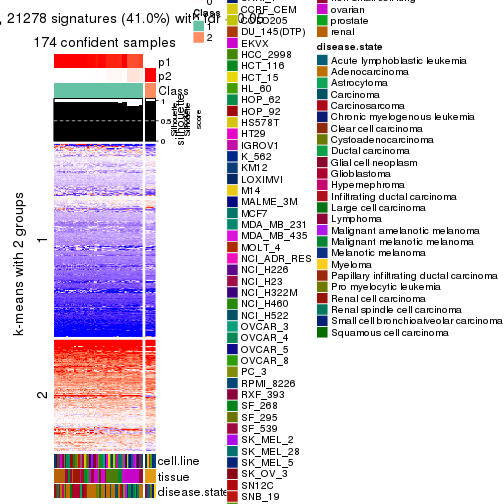</p>

</div>
<div id='tab-MAD-hclust-get-signatures-no-scale-2'>
<pre><code class="r">get_signatures(res, k = 3, scale_rows = FALSE)
</code></pre>

<p></p>

</div>
<div id='tab-MAD-hclust-get-signatures-no-scale-3'>
<pre><code class="r">get_signatures(res, k = 4, scale_rows = FALSE)
</code></pre>

<p></p>

</div>
<div id='tab-MAD-hclust-get-signatures-no-scale-4'>
<pre><code class="r">get_signatures(res, k = 5, scale_rows = FALSE)
</code></pre>

<p></p>

</div>
<div id='tab-MAD-hclust-get-signatures-no-scale-5'>
<pre><code class="r">get_signatures(res, k = 6, scale_rows = FALSE)
</code></pre>

<pre><code>#&gt; Error in mat[ceiling(1:nr/h_ratio), ceiling(1:nc/w_ratio), drop = FALSE]: subscript out of bounds
</code></pre>

<p></p>

</div>
</div>


Compare the overlap of signatures from different k:

```r
compare_signatures(res)
```


`get_signature()` returns a data frame invisibly. TO get the list of signatures, the function
call should be assigned to a variable explicitly. In following code, if `plot` argument is set
to `FALSE`, no heatmap is plotted while only the differential analysis is performed.

```r
# code only for demonstration
tb = get_signature(res, k = ..., plot = FALSE)
```

An example of the output of `tb` is:

```
#>   which_row         fdr    mean_1    mean_2 scaled_mean_1 scaled_mean_2 km
#> 1        38 0.042760348  8.373488  9.131774    -0.5533452     0.5164555  1
#> 2        40 0.018707592  7.106213  8.469186    -0.6173731     0.5762149  1
#> 3        55 0.019134737 10.221463 11.207825    -0.6159697     0.5749050  1
#> 4        59 0.006059896  5.921854  7.869574    -0.6899429     0.6439467  1
#> 5        60 0.018055526  8.928898 10.211722    -0.6204761     0.5791110  1
#> 6        98 0.009384629 15.714769 14.887706     0.6635654    -0.6193277  2
...
```

The columns in `tb` are:

1. `which_row`: row indices corresponding to the input matrix.
2. `fdr`: FDR for the differential test. 
3. `mean_x`: The mean value in group x.
4. `scaled_mean_x`: The mean value in group x after rows are scaled.
5. `km`: Row groups if k-means clustering is applied to rows.


UMAP plot which shows how samples are separated.


<script>
$( function() {
	$( '#tabs-MAD-hclust-dimension-reduction' ).tabs();
} );
</script>
<div id='tabs-MAD-hclust-dimension-reduction'>
<ul>
<li><a href='#tab-MAD-hclust-dimension-reduction-1'>k = 2</a></li>
<li><a href='#tab-MAD-hclust-dimension-reduction-2'>k = 3</a></li>
<li><a href='#tab-MAD-hclust-dimension-reduction-3'>k = 4</a></li>
<li><a href='#tab-MAD-hclust-dimension-reduction-4'>k = 5</a></li>
<li><a href='#tab-MAD-hclust-dimension-reduction-5'>k = 6</a></li>
</ul>
<div id='tab-MAD-hclust-dimension-reduction-1'>
<pre><code class="r">dimension_reduction(res, k = 2, method = &quot;UMAP&quot;)
</code></pre>

<p></p>

</div>
<div id='tab-MAD-hclust-dimension-reduction-2'>
<pre><code class="r">dimension_reduction(res, k = 3, method = &quot;UMAP&quot;)
</code></pre>

<p></p>

</div>
<div id='tab-MAD-hclust-dimension-reduction-3'>
<pre><code class="r">dimension_reduction(res, k = 4, method = &quot;UMAP&quot;)
</code></pre>

<p></p>

</div>
<div id='tab-MAD-hclust-dimension-reduction-4'>
<pre><code class="r">dimension_reduction(res, k = 5, method = &quot;UMAP&quot;)
</code></pre>

<p></p>

</div>
<div id='tab-MAD-hclust-dimension-reduction-5'>
<pre><code class="r">dimension_reduction(res, k = 6, method = &quot;UMAP&quot;)
</code></pre>

<p></p>

</div>
</div>


Following heatmap shows how subgroups are split when increasing `k`:

```r
collect_classes(res)
```


Test correlation between subgroups and known annotations. If the known
annotation is numeric, one-way ANOVA test is applied, and if the known
annotation is discrete, chi-squared contingency table test is applied.

```r
test_to_known_factors(res)
```

```
#>              n cell.line(p) tissue(p) disease.state(p) k
#> MAD:hclust 174     1.60e-13  1.87e-33         1.02e-24 2
#> MAD:hclust 174     1.41e-24  1.75e-48         6.04e-34 3
#> MAD:hclust 168     1.98e-34  1.34e-68         1.52e-46 4
#> MAD:hclust 168     2.69e-45  3.18e-76         1.41e-46 5
#> MAD:hclust 168     2.63e-56 3.94e-100         7.87e-49 6
```


If matrix rows can be associated to genes, consider to use `GO_Enrichment(res,
...)` to perform function enrichment for the signature genes.


 

---------------------------------------------------


### MAD:kmeans


The object with results only for a single top-value method and a single partition method 
can be extracted as:

```r
res = res_list["MAD", "kmeans"]
# you can also extract it by
# res = res_list["MAD:kmeans"]
```

A summary of `res` and all the functions that can be applied to it:

```r
res
```

```
#> A 'ConsensusPartition' object with k = 2, 3, 4, 5, 6.
#>   On a matrix with 51941 rows and 174 columns.
#>   Top rows (1000, 2000, 3000, 4000, 5000) are extracted by 'MAD' method.
#>   Subgroups are detected by 'kmeans' method.
#>   Performed in total 1250 partitions by row resampling.
#>   Best k for subgroups seems to be 2.
#> 
#> Following methods can be applied to this 'ConsensusPartition' object:
#>  [1] "cola_report"             "collect_classes"         "collect_plots"          
#>  [4] "collect_stats"           "colnames"                "compare_signatures"     
#>  [7] "consensus_heatmap"       "dimension_reduction"     "functional_enrichment"  
#> [10] "get_anno_col"            "get_anno"                "get_classes"            
#> [13] "get_consensus"           "get_matrix"              "get_membership"         
#> [16] "get_param"               "get_signatures"          "get_stats"              
#> [19] "is_best_k"               "is_stable_k"             "membership_heatmap"     
#> [22] "ncol"                    "nrow"                    "plot_ecdf"              
#> [25] "rownames"                "select_partition_number" "show"                   
#> [28] "suggest_best_k"          "test_to_known_factors"
```

`collect_plots()` function collects all the plots made from `res` for all `k` (number of partitions)
into one single page to provide an easy and fast comparison between different `k`.

```r
collect_plots(res)
```


The plots are:

- The first row: a plot of the ECDF (Empirical cumulative distribution
  function) curves of the consensus matrix for each `k` and the heatmap of
  predicted classes for each `k`.
- The second row: heatmaps of the consensus matrix for each `k`.
- The third row: heatmaps of the membership matrix for each `k`.
- The fouth row: heatmaps of the signatures for each `k`.

All the plots in panels can be made by individual functions and they are
plotted later in this section.

`select_partition_number()` produces several plots showing different
statistics for choosing "optimized" `k`. There are following statistics:

- ECDF curves of the consensus matrix for each `k`;
- 1-PAC. [The PAC
  score](https://en.wikipedia.org/wiki/Consensus_clustering#Over-interpretation_potential_of_consensus_clustering)
  measures the proportion of the ambiguous subgrouping.
- Mean silhouette score.
- Concordance. The mean probability of fiting the consensus class ids in all
  partitions.
- Area increased. Denote $A_k$ as the area under the ECDF curve for current
  `k`, the area increased is defined as $A_k - A_{k-1}$.
- Rand index. The percent of pairs of samples that are both in a same cluster
  or both are not in a same cluster in the partition of k and k-1.
- Jaccard index. The ratio of pairs of samples are both in a same cluster in
  the partition of k and k-1 and the pairs of samples are both in a same
  cluster in the partition k or k-1.

The detailed explanations of these statistics can be found in [the cola
vignette](http://bioconductor.org/packages/devel/bioc/vignettes/cola/inst/doc/cola.html#toc_13).

Generally speaking, lower PAC score, higher mean silhouette score or higher
concordance corresponds to better partition. Rand index and Jaccard index
measure how similar the current partition is compared to partition with `k-1`.
If they are too similar, we won't accept `k` is better than `k-1`.

```r
select_partition_number(res)
```


The numeric values for all these statistics can be obtained by `get_stats()`.

```r
get_stats(res)
```

```
#>   k 1-PAC mean_silhouette concordance area_increased  Rand Jaccard
#> 2 2 0.288           0.784       0.852         0.4502 0.519   0.519
#> 3 3 0.418           0.498       0.670         0.3652 0.731   0.527
#> 4 4 0.522           0.713       0.747         0.1246 0.819   0.576
#> 5 5 0.632           0.709       0.710         0.0899 0.899   0.694
#> 6 6 0.635           0.689       0.708         0.0513 0.917   0.664
```

`suggest_best_k()` suggests the best $k$ based on these statistics. The rules are as follows:

- All $k$ with Jaccard index larger than 0.95 are removed because the increase of
  the partition number does not provides enough extra information. If all $k$ are removed,
  the best $k$ is assigned by `NA`.
- For $k$ with 1-PAC larger than 0.9, the maximal $k$ is taken as the "best k". Other $k$ is called "optional k".
- If it does not fit the second rule. The $k$ with the highest vote of highest
  1-PAC, mean silhouette and concordance is taken as the "best k".

```r
suggest_best_k(res)
```

```
#> [1] 2
```


Following shows the table of the partitions (You need to click the **show/hide
code output** link to see it). The membership matrix (columns with name `p*`)
is inferred by
[`clue::cl_consensus()`](https://www.rdocumentation.org/link/cl_consensus?package=clue)
function with the `SE` method. Basically the value in the membership matrix
represents the probability to belong to a certain group. The finall class
label for an item is determined with the group with highest probability it
belongs to.

In `get_classes()` function, the entropy is calculated from the membership
matrix and the silhouette score is calculated from the consensus matrix.


<script>
$( function() {
	$( '#tabs-MAD-kmeans-get-classes' ).tabs();
} );
</script>
<div id='tabs-MAD-kmeans-get-classes'>
<ul>
<li><a href='#tab-MAD-kmeans-get-classes-1'>k = 2</a></li>
<li><a href='#tab-MAD-kmeans-get-classes-2'>k = 3</a></li>
<li><a href='#tab-MAD-kmeans-get-classes-3'>k = 4</a></li>
<li><a href='#tab-MAD-kmeans-get-classes-4'>k = 5</a></li>
<li><a href='#tab-MAD-kmeans-get-classes-5'>k = 6</a></li>
</ul>

<div id='tab-MAD-kmeans-get-classes-1'>
<p><a id='tab-MAD-kmeans-get-classes-1-a' style='color:#0366d6' href='#'>show/hide code output</a></p>
<pre><code class="r">cbind(get_classes(res, k = 2), get_membership(res, k = 2))
</code></pre>

<pre><code>#&gt;           class entropy silhouette    p1    p2
#&gt; GSM803615     2  0.1843      0.781 0.028 0.972
#&gt; GSM803674     2  0.1843      0.781 0.028 0.972
#&gt; GSM803733     2  0.1843      0.781 0.028 0.972
#&gt; GSM803616     2  0.1843      0.781 0.028 0.972
#&gt; GSM803675     2  0.1843      0.781 0.028 0.972
#&gt; GSM803734     2  0.1843      0.781 0.028 0.972
#&gt; GSM803617     2  0.1843      0.781 0.028 0.972
#&gt; GSM803676     2  0.1843      0.781 0.028 0.972
#&gt; GSM803735     2  0.1843      0.781 0.028 0.972
#&gt; GSM803618     2  0.1843      0.781 0.028 0.972
#&gt; GSM803677     2  0.1843      0.781 0.028 0.972
#&gt; GSM803736     2  0.1843      0.781 0.028 0.972
#&gt; GSM803619     2  0.2043      0.780 0.032 0.968
#&gt; GSM803678     2  0.2043      0.780 0.032 0.968
#&gt; GSM803737     2  0.2043      0.780 0.032 0.968
#&gt; GSM803620     2  0.1843      0.781 0.028 0.972
#&gt; GSM803679     2  0.1843      0.781 0.028 0.972
#&gt; GSM803738     2  0.1843      0.781 0.028 0.972
#&gt; GSM803621     1  0.4298      0.832 0.912 0.088
#&gt; GSM803680     1  0.4298      0.832 0.912 0.088
#&gt; GSM803739     1  0.4298      0.832 0.912 0.088
#&gt; GSM803622     1  0.4022      0.835 0.920 0.080
#&gt; GSM803681     1  0.4022      0.835 0.920 0.080
#&gt; GSM803740     1  0.4022      0.835 0.920 0.080
#&gt; GSM803623     2  0.7745      0.866 0.228 0.772
#&gt; GSM803682     2  0.7745      0.866 0.228 0.772
#&gt; GSM803741     2  0.7745      0.866 0.228 0.772
#&gt; GSM803624     1  0.7299      0.635 0.796 0.204
#&gt; GSM803683     1  0.0672      0.846 0.992 0.008
#&gt; GSM803742     1  0.0672      0.846 0.992 0.008
#&gt; GSM803625     1  0.0376      0.848 0.996 0.004
#&gt; GSM803684     1  0.0376      0.848 0.996 0.004
#&gt; GSM803743     1  0.0376      0.848 0.996 0.004
#&gt; GSM803626     1  0.9754      0.521 0.592 0.408
#&gt; GSM803685     1  0.4939      0.822 0.892 0.108
#&gt; GSM803744     1  0.9754      0.521 0.592 0.408
#&gt; GSM803627     1  0.4431      0.831 0.908 0.092
#&gt; GSM803686     1  0.4431      0.831 0.908 0.092
#&gt; GSM803745     1  0.4431      0.831 0.908 0.092
#&gt; GSM803628     1  0.4431      0.831 0.908 0.092
#&gt; GSM803687     1  0.4431      0.831 0.908 0.092
#&gt; GSM803746     1  0.4431      0.831 0.908 0.092
#&gt; GSM803629     1  0.4431      0.831 0.908 0.092
#&gt; GSM803688     1  0.4431      0.831 0.908 0.092
#&gt; GSM803747     1  0.4431      0.831 0.908 0.092
#&gt; GSM803630     1  0.4431      0.831 0.908 0.092
#&gt; GSM803689     1  0.4431      0.831 0.908 0.092
#&gt; GSM803748     1  0.4431      0.831 0.908 0.092
#&gt; GSM803631     1  0.4431      0.831 0.908 0.092
#&gt; GSM803690     1  0.4431      0.831 0.908 0.092
#&gt; GSM803749     1  0.4431      0.831 0.908 0.092
#&gt; GSM803632     1  0.4431      0.831 0.908 0.092
#&gt; GSM803691     1  0.4431      0.831 0.908 0.092
#&gt; GSM803750     1  0.4431      0.831 0.908 0.092
#&gt; GSM803633     2  0.7883      0.868 0.236 0.764
#&gt; GSM803692     2  0.7883      0.868 0.236 0.764
#&gt; GSM803751     2  0.7883      0.868 0.236 0.764
#&gt; GSM803634     2  0.7883      0.868 0.236 0.764
#&gt; GSM803693     2  0.7883      0.868 0.236 0.764
#&gt; GSM803752     2  0.7883      0.868 0.236 0.764
#&gt; GSM803635     2  0.7883      0.868 0.236 0.764
#&gt; GSM803694     2  0.7883      0.868 0.236 0.764
#&gt; GSM803753     2  0.7883      0.868 0.236 0.764
#&gt; GSM803636     2  0.7883      0.868 0.236 0.764
#&gt; GSM803695     2  0.7883      0.868 0.236 0.764
#&gt; GSM803754     2  0.7883      0.868 0.236 0.764
#&gt; GSM803637     2  0.7883      0.868 0.236 0.764
#&gt; GSM803696     2  0.7883      0.868 0.236 0.764
#&gt; GSM803755     2  0.7883      0.868 0.236 0.764
#&gt; GSM803638     2  0.7883      0.868 0.236 0.764
#&gt; GSM803697     2  0.7883      0.868 0.236 0.764
#&gt; GSM803756     2  0.7883      0.868 0.236 0.764
#&gt; GSM803639     2  0.7815      0.868 0.232 0.768
#&gt; GSM803698     2  0.7883      0.868 0.236 0.764
#&gt; GSM803757     2  0.7674      0.866 0.224 0.776
#&gt; GSM803640     1  0.0000      0.848 1.000 0.000
#&gt; GSM803699     1  0.0000      0.848 1.000 0.000
#&gt; GSM803758     1  0.0000      0.848 1.000 0.000
#&gt; GSM803641     1  0.0672      0.846 0.992 0.008
#&gt; GSM803700     1  0.0672      0.846 0.992 0.008
#&gt; GSM803759     1  0.0000      0.848 1.000 0.000
#&gt; GSM803642     1  0.0672      0.846 0.992 0.008
#&gt; GSM803701     1  0.0672      0.846 0.992 0.008
#&gt; GSM803760     1  0.0672      0.846 0.992 0.008
#&gt; GSM803643     1  0.0672      0.846 0.992 0.008
#&gt; GSM803702     1  0.0672      0.846 0.992 0.008
#&gt; GSM803644     1  0.0376      0.848 0.996 0.004
#&gt; GSM803703     1  0.0376      0.848 0.996 0.004
#&gt; GSM803761     1  0.0376      0.848 0.996 0.004
#&gt; GSM803645     1  0.0376      0.847 0.996 0.004
#&gt; GSM803704     1  0.0376      0.847 0.996 0.004
#&gt; GSM803762     1  0.0376      0.847 0.996 0.004
#&gt; GSM803646     1  0.0672      0.846 0.992 0.008
#&gt; GSM803705     1  0.0672      0.846 0.992 0.008
#&gt; GSM803763     1  0.0672      0.846 0.992 0.008
#&gt; GSM803647     1  0.0672      0.846 0.992 0.008
#&gt; GSM803706     1  0.0672      0.846 0.992 0.008
#&gt; GSM803764     1  0.0672      0.846 0.992 0.008
#&gt; GSM803648     1  0.6438      0.679 0.836 0.164
#&gt; GSM803707     1  0.6438      0.679 0.836 0.164
#&gt; GSM803765     1  0.6531      0.672 0.832 0.168
#&gt; GSM803649     1  0.0938      0.844 0.988 0.012
#&gt; GSM803708     1  0.0938      0.844 0.988 0.012
#&gt; GSM803766     1  0.0938      0.844 0.988 0.012
#&gt; GSM803650     1  0.0000      0.848 1.000 0.000
#&gt; GSM803709     1  0.0000      0.848 1.000 0.000
#&gt; GSM803767     1  0.0376      0.848 0.996 0.004
#&gt; GSM803651     1  0.0000      0.848 1.000 0.000
#&gt; GSM803710     1  0.0000      0.848 1.000 0.000
#&gt; GSM803768     1  0.0376      0.848 0.996 0.004
#&gt; GSM803652     1  0.0672      0.846 0.992 0.008
#&gt; GSM803711     1  0.0672      0.846 0.992 0.008
#&gt; GSM803653     2  0.8608      0.829 0.284 0.716
#&gt; GSM803712     2  0.8608      0.829 0.284 0.716
#&gt; GSM803769     2  0.8608      0.829 0.284 0.716
#&gt; GSM803654     2  0.8713      0.834 0.292 0.708
#&gt; GSM803713     2  0.8713      0.834 0.292 0.708
#&gt; GSM803770     2  0.8713      0.834 0.292 0.708
#&gt; GSM803655     2  0.9358      0.716 0.352 0.648
#&gt; GSM803714     2  0.9358      0.716 0.352 0.648
#&gt; GSM803771     2  0.9358      0.716 0.352 0.648
#&gt; GSM803656     2  0.6148      0.829 0.152 0.848
#&gt; GSM803715     2  0.6148      0.829 0.152 0.848
#&gt; GSM803772     2  0.6148      0.829 0.152 0.848
#&gt; GSM803657     2  0.9087      0.805 0.324 0.676
#&gt; GSM803716     2  0.9087      0.805 0.324 0.676
#&gt; GSM803773     2  0.9087      0.805 0.324 0.676
#&gt; GSM803658     2  0.9087      0.805 0.324 0.676
#&gt; GSM803717     2  0.9087      0.805 0.324 0.676
#&gt; GSM803774     2  0.9087      0.805 0.324 0.676
#&gt; GSM803659     2  0.9087      0.805 0.324 0.676
#&gt; GSM803718     2  0.9087      0.805 0.324 0.676
#&gt; GSM803775     2  0.9087      0.805 0.324 0.676
#&gt; GSM803660     1  0.0938      0.844 0.988 0.012
#&gt; GSM803719     1  0.0938      0.844 0.988 0.012
#&gt; GSM803776     1  0.0938      0.844 0.988 0.012
#&gt; GSM803661     1  0.0672      0.846 0.992 0.008
#&gt; GSM803720     1  0.0672      0.846 0.992 0.008
#&gt; GSM803777     1  0.0672      0.846 0.992 0.008
#&gt; GSM803662     1  0.1184      0.841 0.984 0.016
#&gt; GSM803732     1  0.0672      0.846 0.992 0.008
#&gt; GSM803778     1  0.0672      0.846 0.992 0.008
#&gt; GSM803663     1  0.5737      0.710 0.864 0.136
#&gt; GSM803721     1  0.5737      0.710 0.864 0.136
#&gt; GSM803779     1  0.5737      0.710 0.864 0.136
#&gt; GSM803664     2  0.9775      0.649 0.412 0.588
#&gt; GSM803722     2  0.9775      0.649 0.412 0.588
#&gt; GSM803780     2  0.9775      0.649 0.412 0.588
#&gt; GSM803665     1  0.5408      0.808 0.876 0.124
#&gt; GSM803723     1  0.5408      0.808 0.876 0.124
#&gt; GSM803781     1  0.5408      0.808 0.876 0.124
#&gt; GSM803666     1  0.9754      0.521 0.592 0.408
#&gt; GSM803724     1  0.9754      0.521 0.592 0.408
#&gt; GSM803782     1  0.9754      0.521 0.592 0.408
#&gt; GSM803667     1  0.9754      0.521 0.592 0.408
#&gt; GSM803725     1  0.9754      0.521 0.592 0.408
#&gt; GSM803783     1  0.9754      0.521 0.592 0.408
#&gt; GSM803668     1  0.9754      0.521 0.592 0.408
#&gt; GSM803726     1  0.9754      0.521 0.592 0.408
#&gt; GSM803784     1  0.9754      0.521 0.592 0.408
#&gt; GSM803669     1  0.9754      0.521 0.592 0.408
#&gt; GSM803727     1  0.9754      0.521 0.592 0.408
#&gt; GSM803670     1  0.9795      0.503 0.584 0.416
#&gt; GSM803728     1  0.9795      0.503 0.584 0.416
#&gt; GSM803785     1  0.9795      0.503 0.584 0.416
#&gt; GSM803671     1  0.9754      0.521 0.592 0.408
#&gt; GSM803729     1  0.9754      0.521 0.592 0.408
#&gt; GSM803786     1  0.9754      0.521 0.592 0.408
#&gt; GSM803672     1  0.9732      0.528 0.596 0.404
#&gt; GSM803730     1  0.9732      0.528 0.596 0.404
#&gt; GSM803787     1  0.9732      0.528 0.596 0.404
#&gt; GSM803673     2  0.7883      0.868 0.236 0.764
#&gt; GSM803731     2  0.7883      0.868 0.236 0.764
#&gt; GSM803788     2  0.7883      0.868 0.236 0.764
</code></pre>

<script>
$('#tab-MAD-kmeans-get-classes-1-a').parent().next().next().hide();
$('#tab-MAD-kmeans-get-classes-1-a').click(function(){
  $('#tab-MAD-kmeans-get-classes-1-a').parent().next().next().toggle();
  return(false);
});
</script>
</div>

<div id='tab-MAD-kmeans-get-classes-2'>
<p><a id='tab-MAD-kmeans-get-classes-2-a' style='color:#0366d6' href='#'>show/hide code output</a></p>
<pre><code class="r">cbind(get_classes(res, k = 3), get_membership(res, k = 3))
</code></pre>

<pre><code>#&gt;           class entropy silhouette    p1    p2    p3
#&gt; GSM803615     3  0.0000    0.58349 0.000 0.000 1.000
#&gt; GSM803674     3  0.0000    0.58349 0.000 0.000 1.000
#&gt; GSM803733     3  0.0000    0.58349 0.000 0.000 1.000
#&gt; GSM803616     3  0.0000    0.58349 0.000 0.000 1.000
#&gt; GSM803675     3  0.0000    0.58349 0.000 0.000 1.000
#&gt; GSM803734     3  0.0000    0.58349 0.000 0.000 1.000
#&gt; GSM803617     3  0.0000    0.58349 0.000 0.000 1.000
#&gt; GSM803676     3  0.0000    0.58349 0.000 0.000 1.000
#&gt; GSM803735     3  0.0000    0.58349 0.000 0.000 1.000
#&gt; GSM803618     3  0.0000    0.58349 0.000 0.000 1.000
#&gt; GSM803677     3  0.0000    0.58349 0.000 0.000 1.000
#&gt; GSM803736     3  0.0000    0.58349 0.000 0.000 1.000
#&gt; GSM803619     3  0.0424    0.57690 0.000 0.008 0.992
#&gt; GSM803678     3  0.0424    0.57690 0.000 0.008 0.992
#&gt; GSM803737     3  0.0424    0.57690 0.000 0.008 0.992
#&gt; GSM803620     3  0.0237    0.58435 0.000 0.004 0.996
#&gt; GSM803679     3  0.0237    0.58435 0.000 0.004 0.996
#&gt; GSM803738     3  0.0237    0.58435 0.000 0.004 0.996
#&gt; GSM803621     1  0.4121    0.79381 0.832 0.168 0.000
#&gt; GSM803680     1  0.4121    0.79381 0.832 0.168 0.000
#&gt; GSM803739     1  0.4121    0.79381 0.832 0.168 0.000
#&gt; GSM803622     1  0.4062    0.79549 0.836 0.164 0.000
#&gt; GSM803681     1  0.4062    0.79549 0.836 0.164 0.000
#&gt; GSM803740     1  0.4062    0.79549 0.836 0.164 0.000
#&gt; GSM803623     3  0.6925    0.56016 0.016 0.452 0.532
#&gt; GSM803682     3  0.6925    0.56016 0.016 0.452 0.532
#&gt; GSM803741     3  0.6925    0.56016 0.016 0.452 0.532
#&gt; GSM803624     1  0.7101    0.48350 0.704 0.216 0.080
#&gt; GSM803683     1  0.2448    0.80537 0.924 0.076 0.000
#&gt; GSM803742     1  0.2448    0.80537 0.924 0.076 0.000
#&gt; GSM803625     1  0.0237    0.83709 0.996 0.004 0.000
#&gt; GSM803684     1  0.0237    0.83709 0.996 0.004 0.000
#&gt; GSM803743     1  0.0237    0.83709 0.996 0.004 0.000
#&gt; GSM803626     2  0.9371    0.34903 0.264 0.512 0.224
#&gt; GSM803685     1  0.4555    0.76992 0.800 0.200 0.000
#&gt; GSM803744     2  0.9371    0.34903 0.264 0.512 0.224
#&gt; GSM803627     1  0.4346    0.78482 0.816 0.184 0.000
#&gt; GSM803686     1  0.4346    0.78482 0.816 0.184 0.000
#&gt; GSM803745     1  0.4346    0.78482 0.816 0.184 0.000
#&gt; GSM803628     1  0.4291    0.78659 0.820 0.180 0.000
#&gt; GSM803687     1  0.4291    0.78659 0.820 0.180 0.000
#&gt; GSM803746     1  0.4291    0.78659 0.820 0.180 0.000
#&gt; GSM803629     1  0.4346    0.78482 0.816 0.184 0.000
#&gt; GSM803688     1  0.4346    0.78482 0.816 0.184 0.000
#&gt; GSM803747     1  0.4291    0.78753 0.820 0.180 0.000
#&gt; GSM803630     1  0.4291    0.78659 0.820 0.180 0.000
#&gt; GSM803689     1  0.4291    0.78659 0.820 0.180 0.000
#&gt; GSM803748     1  0.4291    0.78659 0.820 0.180 0.000
#&gt; GSM803631     1  0.4291    0.78659 0.820 0.180 0.000
#&gt; GSM803690     1  0.4291    0.78659 0.820 0.180 0.000
#&gt; GSM803749     1  0.4291    0.78659 0.820 0.180 0.000
#&gt; GSM803632     1  0.4291    0.78659 0.820 0.180 0.000
#&gt; GSM803691     1  0.4291    0.78659 0.820 0.180 0.000
#&gt; GSM803750     1  0.4291    0.78659 0.820 0.180 0.000
#&gt; GSM803633     3  0.6925    0.56712 0.016 0.452 0.532
#&gt; GSM803692     3  0.6925    0.56712 0.016 0.452 0.532
#&gt; GSM803751     3  0.6925    0.56712 0.016 0.452 0.532
#&gt; GSM803634     3  0.6925    0.56712 0.016 0.452 0.532
#&gt; GSM803693     3  0.6925    0.56712 0.016 0.452 0.532
#&gt; GSM803752     3  0.6925    0.56712 0.016 0.452 0.532
#&gt; GSM803635     2  0.7386   -0.44697 0.032 0.508 0.460
#&gt; GSM803694     2  0.7386   -0.44697 0.032 0.508 0.460
#&gt; GSM803753     2  0.7386   -0.44697 0.032 0.508 0.460
#&gt; GSM803636     3  0.6931    0.56286 0.016 0.456 0.528
#&gt; GSM803695     3  0.6931    0.56286 0.016 0.456 0.528
#&gt; GSM803754     3  0.6931    0.56286 0.016 0.456 0.528
#&gt; GSM803637     3  0.7286    0.52961 0.028 0.464 0.508
#&gt; GSM803696     3  0.7286    0.52961 0.028 0.464 0.508
#&gt; GSM803755     3  0.7286    0.52961 0.028 0.464 0.508
#&gt; GSM803638     3  0.6925    0.56712 0.016 0.452 0.532
#&gt; GSM803697     3  0.6925    0.56712 0.016 0.452 0.532
#&gt; GSM803756     3  0.6925    0.56712 0.016 0.452 0.532
#&gt; GSM803639     3  0.6931    0.56286 0.016 0.456 0.528
#&gt; GSM803698     3  0.6931    0.56286 0.016 0.456 0.528
#&gt; GSM803757     3  0.6925    0.56712 0.016 0.452 0.532
#&gt; GSM803640     1  0.0747    0.83609 0.984 0.016 0.000
#&gt; GSM803699     1  0.0747    0.83609 0.984 0.016 0.000
#&gt; GSM803758     1  0.0747    0.83609 0.984 0.016 0.000
#&gt; GSM803641     1  0.0747    0.83597 0.984 0.016 0.000
#&gt; GSM803700     1  0.0747    0.83597 0.984 0.016 0.000
#&gt; GSM803759     1  0.0592    0.83638 0.988 0.012 0.000
#&gt; GSM803642     1  0.1289    0.83155 0.968 0.032 0.000
#&gt; GSM803701     1  0.1289    0.83155 0.968 0.032 0.000
#&gt; GSM803760     1  0.1289    0.83155 0.968 0.032 0.000
#&gt; GSM803643     1  0.1289    0.83155 0.968 0.032 0.000
#&gt; GSM803702     1  0.1289    0.83155 0.968 0.032 0.000
#&gt; GSM803644     1  0.0892    0.83637 0.980 0.020 0.000
#&gt; GSM803703     1  0.0892    0.83637 0.980 0.020 0.000
#&gt; GSM803761     1  0.0892    0.83637 0.980 0.020 0.000
#&gt; GSM803645     1  0.0747    0.83588 0.984 0.016 0.000
#&gt; GSM803704     1  0.0747    0.83588 0.984 0.016 0.000
#&gt; GSM803762     1  0.0747    0.83588 0.984 0.016 0.000
#&gt; GSM803646     1  0.2711    0.78752 0.912 0.088 0.000
#&gt; GSM803705     1  0.2711    0.78752 0.912 0.088 0.000
#&gt; GSM803763     1  0.2711    0.78752 0.912 0.088 0.000
#&gt; GSM803647     1  0.1031    0.83464 0.976 0.024 0.000
#&gt; GSM803706     1  0.1031    0.83464 0.976 0.024 0.000
#&gt; GSM803764     1  0.1031    0.83464 0.976 0.024 0.000
#&gt; GSM803648     2  0.7112    0.24737 0.424 0.552 0.024
#&gt; GSM803707     2  0.7112    0.24737 0.424 0.552 0.024
#&gt; GSM803765     2  0.7112    0.24737 0.424 0.552 0.024
#&gt; GSM803649     1  0.6468    0.07677 0.552 0.444 0.004
#&gt; GSM803708     1  0.6468    0.07677 0.552 0.444 0.004
#&gt; GSM803766     1  0.6468    0.07677 0.552 0.444 0.004
#&gt; GSM803650     1  0.0237    0.83694 0.996 0.004 0.000
#&gt; GSM803709     1  0.0237    0.83694 0.996 0.004 0.000
#&gt; GSM803767     1  0.0000    0.83696 1.000 0.000 0.000
#&gt; GSM803651     1  0.0424    0.83699 0.992 0.008 0.000
#&gt; GSM803710     1  0.0424    0.83699 0.992 0.008 0.000
#&gt; GSM803768     1  0.0237    0.83708 0.996 0.004 0.000
#&gt; GSM803652     1  0.0592    0.83638 0.988 0.012 0.000
#&gt; GSM803711     1  0.0592    0.83638 0.988 0.012 0.000
#&gt; GSM803653     2  0.8350   -0.08173 0.088 0.532 0.380
#&gt; GSM803712     2  0.8350   -0.08173 0.088 0.532 0.380
#&gt; GSM803769     2  0.8350   -0.08173 0.088 0.532 0.380
#&gt; GSM803654     2  0.7828   -0.13656 0.068 0.592 0.340
#&gt; GSM803713     2  0.7828   -0.13656 0.068 0.592 0.340
#&gt; GSM803770     2  0.7828   -0.13656 0.068 0.592 0.340
#&gt; GSM803655     2  0.8857    0.02186 0.132 0.524 0.344
#&gt; GSM803714     2  0.8857    0.02186 0.132 0.524 0.344
#&gt; GSM803771     2  0.8857    0.02186 0.132 0.524 0.344
#&gt; GSM803656     3  0.6917    0.46170 0.024 0.368 0.608
#&gt; GSM803715     3  0.6917    0.46170 0.024 0.368 0.608
#&gt; GSM803772     3  0.6917    0.46170 0.024 0.368 0.608
#&gt; GSM803657     2  0.8238   -0.00454 0.104 0.596 0.300
#&gt; GSM803716     2  0.8238   -0.00454 0.104 0.596 0.300
#&gt; GSM803773     2  0.8238   -0.00454 0.104 0.596 0.300
#&gt; GSM803658     2  0.8262   -0.00889 0.104 0.592 0.304
#&gt; GSM803717     2  0.8262   -0.00889 0.104 0.592 0.304
#&gt; GSM803774     2  0.8262   -0.00889 0.104 0.592 0.304
#&gt; GSM803659     2  0.8262   -0.00889 0.104 0.592 0.304
#&gt; GSM803718     2  0.8262   -0.00889 0.104 0.592 0.304
#&gt; GSM803775     2  0.8262   -0.00889 0.104 0.592 0.304
#&gt; GSM803660     1  0.6421    0.13091 0.572 0.424 0.004
#&gt; GSM803719     1  0.6421    0.13091 0.572 0.424 0.004
#&gt; GSM803776     1  0.6421    0.13091 0.572 0.424 0.004
#&gt; GSM803661     1  0.2625    0.79862 0.916 0.084 0.000
#&gt; GSM803720     1  0.2625    0.79862 0.916 0.084 0.000
#&gt; GSM803777     1  0.2625    0.79862 0.916 0.084 0.000
#&gt; GSM803662     1  0.5706    0.40335 0.680 0.320 0.000
#&gt; GSM803732     1  0.2066    0.80649 0.940 0.060 0.000
#&gt; GSM803778     1  0.2066    0.80649 0.940 0.060 0.000
#&gt; GSM803663     2  0.7069    0.14278 0.472 0.508 0.020
#&gt; GSM803721     2  0.7069    0.14278 0.472 0.508 0.020
#&gt; GSM803779     2  0.7069    0.14278 0.472 0.508 0.020
#&gt; GSM803664     2  0.8770    0.06146 0.156 0.572 0.272
#&gt; GSM803722     2  0.8770    0.06146 0.156 0.572 0.272
#&gt; GSM803780     2  0.8770    0.06146 0.156 0.572 0.272
#&gt; GSM803665     1  0.6201    0.71448 0.748 0.208 0.044
#&gt; GSM803723     1  0.6201    0.71448 0.748 0.208 0.044
#&gt; GSM803781     1  0.6154    0.71848 0.752 0.204 0.044
#&gt; GSM803666     2  0.9371    0.34903 0.264 0.512 0.224
#&gt; GSM803724     2  0.9371    0.34903 0.264 0.512 0.224
#&gt; GSM803782     2  0.9371    0.34903 0.264 0.512 0.224
#&gt; GSM803667     2  0.9371    0.34903 0.264 0.512 0.224
#&gt; GSM803725     2  0.9371    0.34903 0.264 0.512 0.224
#&gt; GSM803783     2  0.9371    0.34903 0.264 0.512 0.224
#&gt; GSM803668     2  0.9371    0.34903 0.264 0.512 0.224
#&gt; GSM803726     2  0.9371    0.34903 0.264 0.512 0.224
#&gt; GSM803784     2  0.9371    0.34903 0.264 0.512 0.224
#&gt; GSM803669     2  0.9371    0.34903 0.264 0.512 0.224
#&gt; GSM803727     2  0.9371    0.34903 0.264 0.512 0.224
#&gt; GSM803670     2  0.9371    0.34903 0.264 0.512 0.224
#&gt; GSM803728     2  0.9371    0.34903 0.264 0.512 0.224
#&gt; GSM803785     2  0.9371    0.34903 0.264 0.512 0.224
#&gt; GSM803671     2  0.9371    0.34903 0.264 0.512 0.224
#&gt; GSM803729     2  0.9371    0.34903 0.264 0.512 0.224
#&gt; GSM803786     2  0.9371    0.34903 0.264 0.512 0.224
#&gt; GSM803672     2  0.9371    0.34903 0.264 0.512 0.224
#&gt; GSM803730     2  0.9371    0.34903 0.264 0.512 0.224
#&gt; GSM803787     2  0.9340    0.34221 0.264 0.516 0.220
#&gt; GSM803673     2  0.7268   -0.41320 0.028 0.524 0.448
#&gt; GSM803731     2  0.7268   -0.41320 0.028 0.524 0.448
#&gt; GSM803788     2  0.7268   -0.41320 0.028 0.524 0.448
</code></pre>

<script>
$('#tab-MAD-kmeans-get-classes-2-a').parent().next().next().hide();
$('#tab-MAD-kmeans-get-classes-2-a').click(function(){
  $('#tab-MAD-kmeans-get-classes-2-a').parent().next().next().toggle();
  return(false);
});
</script>
</div>

<div id='tab-MAD-kmeans-get-classes-3'>
<p><a id='tab-MAD-kmeans-get-classes-3-a' style='color:#0366d6' href='#'>show/hide code output</a></p>
<pre><code class="r">cbind(get_classes(res, k = 4), get_membership(res, k = 4))
</code></pre>

<pre><code>#&gt;           class entropy silhouette    p1    p2    p3    p4
#&gt; GSM803615     4  0.5628     0.9807 0.000 0.144 0.132 0.724
#&gt; GSM803674     4  0.5628     0.9807 0.000 0.144 0.132 0.724
#&gt; GSM803733     4  0.5628     0.9807 0.000 0.144 0.132 0.724
#&gt; GSM803616     4  0.5581     0.9805 0.000 0.140 0.132 0.728
#&gt; GSM803675     4  0.5581     0.9805 0.000 0.140 0.132 0.728
#&gt; GSM803734     4  0.5581     0.9805 0.000 0.140 0.132 0.728
#&gt; GSM803617     4  0.5628     0.9807 0.000 0.144 0.132 0.724
#&gt; GSM803676     4  0.5628     0.9807 0.000 0.144 0.132 0.724
#&gt; GSM803735     4  0.5581     0.9805 0.000 0.140 0.132 0.728
#&gt; GSM803618     4  0.5630     0.9778 0.000 0.140 0.136 0.724
#&gt; GSM803677     4  0.5630     0.9778 0.000 0.140 0.136 0.724
#&gt; GSM803736     4  0.5630     0.9778 0.000 0.140 0.136 0.724
#&gt; GSM803619     4  0.5868     0.9536 0.004 0.116 0.168 0.712
#&gt; GSM803678     4  0.5868     0.9536 0.004 0.116 0.168 0.712
#&gt; GSM803737     4  0.5868     0.9536 0.004 0.116 0.168 0.712
#&gt; GSM803620     4  0.5578     0.9718 0.000 0.144 0.128 0.728
#&gt; GSM803679     4  0.5578     0.9718 0.000 0.144 0.128 0.728
#&gt; GSM803738     4  0.5578     0.9718 0.000 0.144 0.128 0.728
#&gt; GSM803621     1  0.5495     0.7183 0.728 0.000 0.176 0.096
#&gt; GSM803680     1  0.5495     0.7183 0.728 0.000 0.176 0.096
#&gt; GSM803739     1  0.5495     0.7183 0.728 0.000 0.176 0.096
#&gt; GSM803622     1  0.5352     0.7257 0.740 0.000 0.168 0.092
#&gt; GSM803681     1  0.5352     0.7257 0.740 0.000 0.168 0.092
#&gt; GSM803740     1  0.5352     0.7257 0.740 0.000 0.168 0.092
#&gt; GSM803623     2  0.5179     0.5651 0.000 0.728 0.052 0.220
#&gt; GSM803682     2  0.5179     0.5651 0.000 0.728 0.052 0.220
#&gt; GSM803741     2  0.5179     0.5651 0.000 0.728 0.052 0.220
#&gt; GSM803624     1  0.6333     0.5017 0.656 0.268 0.036 0.040
#&gt; GSM803683     1  0.4377     0.7183 0.824 0.124 0.020 0.032
#&gt; GSM803742     1  0.4431     0.7149 0.820 0.128 0.020 0.032
#&gt; GSM803625     1  0.1302     0.7966 0.956 0.000 0.000 0.044
#&gt; GSM803684     1  0.1302     0.7966 0.956 0.000 0.000 0.044
#&gt; GSM803743     1  0.1302     0.7966 0.956 0.000 0.000 0.044
#&gt; GSM803626     3  0.3552     0.9978 0.128 0.024 0.848 0.000
#&gt; GSM803685     1  0.5632     0.6984 0.712 0.000 0.196 0.092
#&gt; GSM803744     3  0.3552     0.9978 0.128 0.024 0.848 0.000
#&gt; GSM803627     1  0.5517     0.7125 0.724 0.000 0.184 0.092
#&gt; GSM803686     1  0.5517     0.7125 0.724 0.000 0.184 0.092
#&gt; GSM803745     1  0.5517     0.7125 0.724 0.000 0.184 0.092
#&gt; GSM803628     1  0.5457     0.7141 0.728 0.000 0.184 0.088
#&gt; GSM803687     1  0.5457     0.7141 0.728 0.000 0.184 0.088
#&gt; GSM803746     1  0.5457     0.7141 0.728 0.000 0.184 0.088
#&gt; GSM803629     1  0.5517     0.7125 0.724 0.000 0.184 0.092
#&gt; GSM803688     1  0.5517     0.7125 0.724 0.000 0.184 0.092
#&gt; GSM803747     1  0.5517     0.7125 0.724 0.000 0.184 0.092
#&gt; GSM803630     1  0.5517     0.7121 0.724 0.000 0.184 0.092
#&gt; GSM803689     1  0.5517     0.7121 0.724 0.000 0.184 0.092
#&gt; GSM803748     1  0.5517     0.7121 0.724 0.000 0.184 0.092
#&gt; GSM803631     1  0.5457     0.7141 0.728 0.000 0.184 0.088
#&gt; GSM803690     1  0.5457     0.7141 0.728 0.000 0.184 0.088
#&gt; GSM803749     1  0.5457     0.7141 0.728 0.000 0.184 0.088
#&gt; GSM803632     1  0.5517     0.7121 0.724 0.000 0.184 0.092
#&gt; GSM803691     1  0.5517     0.7121 0.724 0.000 0.184 0.092
#&gt; GSM803750     1  0.5517     0.7121 0.724 0.000 0.184 0.092
#&gt; GSM803633     2  0.4956     0.5516 0.000 0.732 0.036 0.232
#&gt; GSM803692     2  0.4956     0.5516 0.000 0.732 0.036 0.232
#&gt; GSM803751     2  0.4956     0.5516 0.000 0.732 0.036 0.232
#&gt; GSM803634     2  0.4956     0.5516 0.000 0.732 0.036 0.232
#&gt; GSM803693     2  0.4956     0.5516 0.000 0.732 0.036 0.232
#&gt; GSM803752     2  0.4956     0.5516 0.000 0.732 0.036 0.232
#&gt; GSM803635     2  0.3842     0.6176 0.000 0.836 0.036 0.128
#&gt; GSM803694     2  0.3842     0.6176 0.000 0.836 0.036 0.128
#&gt; GSM803753     2  0.3842     0.6176 0.000 0.836 0.036 0.128
#&gt; GSM803636     2  0.4956     0.5516 0.000 0.732 0.036 0.232
#&gt; GSM803695     2  0.4956     0.5516 0.000 0.732 0.036 0.232
#&gt; GSM803754     2  0.4956     0.5516 0.000 0.732 0.036 0.232
#&gt; GSM803637     2  0.4904     0.5628 0.000 0.744 0.040 0.216
#&gt; GSM803696     2  0.4904     0.5628 0.000 0.744 0.040 0.216
#&gt; GSM803755     2  0.4904     0.5628 0.000 0.744 0.040 0.216
#&gt; GSM803638     2  0.4956     0.5516 0.000 0.732 0.036 0.232
#&gt; GSM803697     2  0.4956     0.5516 0.000 0.732 0.036 0.232
#&gt; GSM803756     2  0.4956     0.5516 0.000 0.732 0.036 0.232
#&gt; GSM803639     2  0.4956     0.5516 0.000 0.732 0.036 0.232
#&gt; GSM803698     2  0.4956     0.5516 0.000 0.732 0.036 0.232
#&gt; GSM803757     2  0.4956     0.5516 0.000 0.732 0.036 0.232
#&gt; GSM803640     1  0.1661     0.7902 0.944 0.000 0.004 0.052
#&gt; GSM803699     1  0.1661     0.7902 0.944 0.000 0.004 0.052
#&gt; GSM803758     1  0.1576     0.7895 0.948 0.000 0.004 0.048
#&gt; GSM803641     1  0.1489     0.7885 0.952 0.000 0.004 0.044
#&gt; GSM803700     1  0.1489     0.7885 0.952 0.000 0.004 0.044
#&gt; GSM803759     1  0.1489     0.7885 0.952 0.000 0.004 0.044
#&gt; GSM803642     1  0.2400     0.7808 0.924 0.028 0.004 0.044
#&gt; GSM803701     1  0.2400     0.7808 0.924 0.028 0.004 0.044
#&gt; GSM803760     1  0.2400     0.7808 0.924 0.028 0.004 0.044
#&gt; GSM803643     1  0.2400     0.7808 0.924 0.028 0.004 0.044
#&gt; GSM803702     1  0.2400     0.7808 0.924 0.028 0.004 0.044
#&gt; GSM803644     1  0.2048     0.7920 0.928 0.000 0.008 0.064
#&gt; GSM803703     1  0.2048     0.7920 0.928 0.000 0.008 0.064
#&gt; GSM803761     1  0.2048     0.7920 0.928 0.000 0.008 0.064
#&gt; GSM803645     1  0.2066     0.7896 0.940 0.024 0.008 0.028
#&gt; GSM803704     1  0.2066     0.7896 0.940 0.024 0.008 0.028
#&gt; GSM803762     1  0.2066     0.7896 0.940 0.024 0.008 0.028
#&gt; GSM803646     1  0.5154     0.6696 0.776 0.148 0.016 0.060
#&gt; GSM803705     1  0.5154     0.6696 0.776 0.148 0.016 0.060
#&gt; GSM803763     1  0.5154     0.6696 0.776 0.148 0.016 0.060
#&gt; GSM803647     1  0.1953     0.7862 0.940 0.012 0.004 0.044
#&gt; GSM803706     1  0.1953     0.7862 0.940 0.012 0.004 0.044
#&gt; GSM803764     1  0.1953     0.7862 0.940 0.012 0.004 0.044
#&gt; GSM803648     2  0.6106     0.4717 0.320 0.628 0.028 0.024
#&gt; GSM803707     2  0.6106     0.4717 0.320 0.628 0.028 0.024
#&gt; GSM803765     2  0.6106     0.4717 0.320 0.628 0.028 0.024
#&gt; GSM803649     2  0.6463     0.1815 0.448 0.500 0.028 0.024
#&gt; GSM803708     2  0.6463     0.1815 0.448 0.500 0.028 0.024
#&gt; GSM803766     2  0.6463     0.1815 0.448 0.500 0.028 0.024
#&gt; GSM803650     1  0.0524     0.7963 0.988 0.000 0.004 0.008
#&gt; GSM803709     1  0.0524     0.7963 0.988 0.000 0.004 0.008
#&gt; GSM803767     1  0.1256     0.7946 0.964 0.000 0.008 0.028
#&gt; GSM803651     1  0.0921     0.7949 0.972 0.000 0.000 0.028
#&gt; GSM803710     1  0.0921     0.7949 0.972 0.000 0.000 0.028
#&gt; GSM803768     1  0.0921     0.7949 0.972 0.000 0.000 0.028
#&gt; GSM803652     1  0.1151     0.7935 0.968 0.008 0.000 0.024
#&gt; GSM803711     1  0.1151     0.7935 0.968 0.008 0.000 0.024
#&gt; GSM803653     2  0.5327     0.6063 0.040 0.788 0.084 0.088
#&gt; GSM803712     2  0.5327     0.6063 0.040 0.788 0.084 0.088
#&gt; GSM803769     2  0.5327     0.6063 0.040 0.788 0.084 0.088
#&gt; GSM803654     2  0.1993     0.6544 0.016 0.944 0.024 0.016
#&gt; GSM803713     2  0.1993     0.6544 0.016 0.944 0.024 0.016
#&gt; GSM803770     2  0.1993     0.6544 0.016 0.944 0.024 0.016
#&gt; GSM803655     2  0.6032     0.5991 0.108 0.748 0.068 0.076
#&gt; GSM803714     2  0.6032     0.5991 0.108 0.748 0.068 0.076
#&gt; GSM803771     2  0.6032     0.5991 0.108 0.748 0.068 0.076
#&gt; GSM803656     2  0.6809     0.2145 0.004 0.568 0.104 0.324
#&gt; GSM803715     2  0.6809     0.2145 0.004 0.568 0.104 0.324
#&gt; GSM803772     2  0.6809     0.2145 0.004 0.568 0.104 0.324
#&gt; GSM803657     2  0.3643     0.6461 0.032 0.876 0.060 0.032
#&gt; GSM803716     2  0.3643     0.6461 0.032 0.876 0.060 0.032
#&gt; GSM803773     2  0.3643     0.6461 0.032 0.876 0.060 0.032
#&gt; GSM803658     2  0.3659     0.6461 0.032 0.876 0.056 0.036
#&gt; GSM803717     2  0.3659     0.6461 0.032 0.876 0.056 0.036
#&gt; GSM803774     2  0.3659     0.6461 0.032 0.876 0.056 0.036
#&gt; GSM803659     2  0.3659     0.6461 0.032 0.876 0.056 0.036
#&gt; GSM803718     2  0.3659     0.6461 0.032 0.876 0.056 0.036
#&gt; GSM803775     2  0.3659     0.6461 0.032 0.876 0.056 0.036
#&gt; GSM803660     2  0.6388     0.1538 0.468 0.484 0.024 0.024
#&gt; GSM803719     2  0.6388     0.1538 0.468 0.484 0.024 0.024
#&gt; GSM803776     2  0.6388     0.1538 0.468 0.484 0.024 0.024
#&gt; GSM803661     1  0.4431     0.7149 0.820 0.128 0.020 0.032
#&gt; GSM803720     1  0.4431     0.7149 0.820 0.128 0.020 0.032
#&gt; GSM803777     1  0.4431     0.7149 0.820 0.128 0.020 0.032
#&gt; GSM803662     1  0.6746     0.0518 0.516 0.416 0.040 0.028
#&gt; GSM803732     1  0.5410     0.5954 0.724 0.228 0.024 0.024
#&gt; GSM803778     1  0.5443     0.5893 0.720 0.232 0.024 0.024
#&gt; GSM803663     2  0.6390     0.3850 0.368 0.576 0.028 0.028
#&gt; GSM803721     2  0.6390     0.3850 0.368 0.576 0.028 0.028
#&gt; GSM803779     2  0.6390     0.3850 0.368 0.576 0.028 0.028
#&gt; GSM803664     2  0.4297     0.6392 0.100 0.836 0.044 0.020
#&gt; GSM803722     2  0.4297     0.6392 0.100 0.836 0.044 0.020
#&gt; GSM803780     2  0.4297     0.6392 0.100 0.836 0.044 0.020
#&gt; GSM803665     1  0.5655     0.6811 0.704 0.000 0.212 0.084
#&gt; GSM803723     1  0.5655     0.6811 0.704 0.000 0.212 0.084
#&gt; GSM803781     1  0.5655     0.6811 0.704 0.000 0.212 0.084
#&gt; GSM803666     3  0.3736     0.9979 0.128 0.024 0.844 0.004
#&gt; GSM803724     3  0.3736     0.9979 0.128 0.024 0.844 0.004
#&gt; GSM803782     3  0.3736     0.9979 0.128 0.024 0.844 0.004
#&gt; GSM803667     3  0.3736     0.9979 0.128 0.024 0.844 0.004
#&gt; GSM803725     3  0.3736     0.9979 0.128 0.024 0.844 0.004
#&gt; GSM803783     3  0.3736     0.9979 0.128 0.024 0.844 0.004
#&gt; GSM803668     3  0.3552     0.9978 0.128 0.024 0.848 0.000
#&gt; GSM803726     3  0.3552     0.9978 0.128 0.024 0.848 0.000
#&gt; GSM803784     3  0.3552     0.9978 0.128 0.024 0.848 0.000
#&gt; GSM803669     3  0.3736     0.9979 0.128 0.024 0.844 0.004
#&gt; GSM803727     3  0.3736     0.9979 0.128 0.024 0.844 0.004
#&gt; GSM803670     3  0.3736     0.9961 0.128 0.024 0.844 0.004
#&gt; GSM803728     3  0.3736     0.9961 0.128 0.024 0.844 0.004
#&gt; GSM803785     3  0.3736     0.9961 0.128 0.024 0.844 0.004
#&gt; GSM803671     3  0.3736     0.9979 0.128 0.024 0.844 0.004
#&gt; GSM803729     3  0.3736     0.9979 0.128 0.024 0.844 0.004
#&gt; GSM803786     3  0.3736     0.9979 0.128 0.024 0.844 0.004
#&gt; GSM803672     3  0.3552     0.9978 0.128 0.024 0.848 0.000
#&gt; GSM803730     3  0.3552     0.9978 0.128 0.024 0.848 0.000
#&gt; GSM803787     3  0.3552     0.9978 0.128 0.024 0.848 0.000
#&gt; GSM803673     2  0.3991     0.6225 0.000 0.832 0.048 0.120
#&gt; GSM803731     2  0.3991     0.6225 0.000 0.832 0.048 0.120
#&gt; GSM803788     2  0.3991     0.6225 0.000 0.832 0.048 0.120
</code></pre>

<script>
$('#tab-MAD-kmeans-get-classes-3-a').parent().next().next().hide();
$('#tab-MAD-kmeans-get-classes-3-a').click(function(){
  $('#tab-MAD-kmeans-get-classes-3-a').parent().next().next().toggle();
  return(false);
});
</script>
</div>

<div id='tab-MAD-kmeans-get-classes-4'>
<p><a id='tab-MAD-kmeans-get-classes-4-a' style='color:#0366d6' href='#'>show/hide code output</a></p>
<pre><code class="r">cbind(get_classes(res, k = 5), get_membership(res, k = 5))
</code></pre>

<pre><code>#&gt;           class entropy silhouette    p1    p2    p3    p4    p5
#&gt; GSM803615     4   0.220    0.97884 0.008 0.040 0.032 0.920 0.000
#&gt; GSM803674     4   0.220    0.97884 0.008 0.040 0.032 0.920 0.000
#&gt; GSM803733     4   0.220    0.97884 0.008 0.040 0.032 0.920 0.000
#&gt; GSM803616     4   0.183    0.97927 0.000 0.040 0.028 0.932 0.000
#&gt; GSM803675     4   0.183    0.97927 0.000 0.040 0.028 0.932 0.000
#&gt; GSM803734     4   0.183    0.97927 0.000 0.040 0.028 0.932 0.000
#&gt; GSM803617     4   0.220    0.97884 0.008 0.040 0.032 0.920 0.000
#&gt; GSM803676     4   0.220    0.97884 0.008 0.040 0.032 0.920 0.000
#&gt; GSM803735     4   0.183    0.97927 0.000 0.040 0.028 0.932 0.000
#&gt; GSM803618     4   0.258    0.97387 0.016 0.044 0.036 0.904 0.000
#&gt; GSM803677     4   0.258    0.97387 0.016 0.044 0.036 0.904 0.000
#&gt; GSM803736     4   0.258    0.97387 0.016 0.044 0.036 0.904 0.000
#&gt; GSM803619     4   0.313    0.93826 0.020 0.032 0.076 0.872 0.000
#&gt; GSM803678     4   0.313    0.93826 0.020 0.032 0.076 0.872 0.000
#&gt; GSM803737     4   0.316    0.93833 0.024 0.032 0.072 0.872 0.000
#&gt; GSM803620     4   0.207    0.97734 0.000 0.048 0.032 0.920 0.000
#&gt; GSM803679     4   0.207    0.97734 0.000 0.048 0.032 0.920 0.000
#&gt; GSM803738     4   0.207    0.97734 0.000 0.048 0.032 0.920 0.000
#&gt; GSM803621     1   0.454    0.91216 0.636 0.000 0.012 0.004 0.348
#&gt; GSM803680     1   0.454    0.91216 0.636 0.000 0.012 0.004 0.348
#&gt; GSM803739     1   0.454    0.91216 0.636 0.000 0.012 0.004 0.348
#&gt; GSM803622     1   0.428    0.92367 0.616 0.000 0.004 0.000 0.380
#&gt; GSM803681     1   0.428    0.92367 0.616 0.000 0.004 0.000 0.380
#&gt; GSM803740     1   0.428    0.92367 0.616 0.000 0.004 0.000 0.380
#&gt; GSM803623     2   0.621    0.57694 0.104 0.656 0.052 0.184 0.004
#&gt; GSM803682     2   0.621    0.57694 0.104 0.656 0.052 0.184 0.004
#&gt; GSM803741     2   0.621    0.57694 0.104 0.656 0.052 0.184 0.004
#&gt; GSM803624     5   0.749    0.44252 0.148 0.276 0.060 0.012 0.504
#&gt; GSM803683     5   0.629    0.56932 0.152 0.132 0.048 0.008 0.660
#&gt; GSM803742     5   0.629    0.56932 0.152 0.132 0.048 0.008 0.660
#&gt; GSM803625     5   0.454    0.57317 0.184 0.004 0.032 0.020 0.760
#&gt; GSM803684     5   0.454    0.57317 0.184 0.004 0.032 0.020 0.760
#&gt; GSM803743     5   0.454    0.57317 0.184 0.004 0.032 0.020 0.760
#&gt; GSM803626     3   0.515    0.98826 0.180 0.008 0.732 0.052 0.028
#&gt; GSM803685     1   0.494    0.91042 0.620 0.000 0.032 0.004 0.344
#&gt; GSM803744     3   0.515    0.98826 0.180 0.008 0.732 0.052 0.028
#&gt; GSM803627     1   0.447    0.93244 0.640 0.000 0.016 0.000 0.344
#&gt; GSM803686     1   0.447    0.93244 0.640 0.000 0.016 0.000 0.344
#&gt; GSM803745     1   0.447    0.93244 0.640 0.000 0.016 0.000 0.344
#&gt; GSM803628     1   0.440    0.94495 0.620 0.000 0.004 0.004 0.372
#&gt; GSM803687     1   0.440    0.94495 0.620 0.000 0.004 0.004 0.372
#&gt; GSM803746     1   0.450    0.94459 0.620 0.000 0.008 0.004 0.368
#&gt; GSM803629     1   0.445    0.94493 0.636 0.000 0.008 0.004 0.352
#&gt; GSM803688     1   0.445    0.94493 0.636 0.000 0.008 0.004 0.352
#&gt; GSM803747     1   0.445    0.94493 0.636 0.000 0.008 0.004 0.352
#&gt; GSM803630     1   0.471    0.94035 0.608 0.000 0.016 0.004 0.372
#&gt; GSM803689     1   0.471    0.94035 0.608 0.000 0.016 0.004 0.372
#&gt; GSM803748     1   0.471    0.94035 0.608 0.000 0.016 0.004 0.372
#&gt; GSM803631     1   0.448    0.94404 0.628 0.000 0.008 0.004 0.360
#&gt; GSM803690     1   0.448    0.94404 0.628 0.000 0.008 0.004 0.360
#&gt; GSM803749     1   0.448    0.94404 0.628 0.000 0.008 0.004 0.360
#&gt; GSM803632     1   0.471    0.94035 0.608 0.000 0.016 0.004 0.372
#&gt; GSM803691     1   0.471    0.94035 0.608 0.000 0.016 0.004 0.372
#&gt; GSM803750     1   0.471    0.94035 0.608 0.000 0.016 0.004 0.372
#&gt; GSM803633     2   0.665    0.55487 0.112 0.612 0.064 0.208 0.004
#&gt; GSM803692     2   0.665    0.55487 0.112 0.612 0.064 0.208 0.004
#&gt; GSM803751     2   0.665    0.55487 0.112 0.612 0.064 0.208 0.004
#&gt; GSM803634     2   0.663    0.55483 0.108 0.612 0.064 0.212 0.004
#&gt; GSM803693     2   0.663    0.55483 0.108 0.612 0.064 0.212 0.004
#&gt; GSM803752     2   0.663    0.55483 0.108 0.612 0.064 0.212 0.004
#&gt; GSM803635     2   0.553    0.62232 0.100 0.728 0.056 0.112 0.004
#&gt; GSM803694     2   0.553    0.62232 0.100 0.728 0.056 0.112 0.004
#&gt; GSM803753     2   0.553    0.62232 0.100 0.728 0.056 0.112 0.004
#&gt; GSM803636     2   0.649    0.57335 0.108 0.632 0.064 0.192 0.004
#&gt; GSM803695     2   0.649    0.57335 0.108 0.632 0.064 0.192 0.004
#&gt; GSM803754     2   0.649    0.57335 0.108 0.632 0.064 0.192 0.004
#&gt; GSM803637     2   0.633    0.58754 0.108 0.656 0.068 0.164 0.004
#&gt; GSM803696     2   0.633    0.58754 0.108 0.656 0.068 0.164 0.004
#&gt; GSM803755     2   0.633    0.58754 0.108 0.656 0.068 0.164 0.004
#&gt; GSM803638     2   0.663    0.55483 0.108 0.612 0.064 0.212 0.004
#&gt; GSM803697     2   0.663    0.55483 0.108 0.612 0.064 0.212 0.004
#&gt; GSM803756     2   0.663    0.55483 0.108 0.612 0.064 0.212 0.004
#&gt; GSM803639     2   0.655    0.56609 0.108 0.624 0.064 0.200 0.004
#&gt; GSM803698     2   0.655    0.56609 0.108 0.624 0.064 0.200 0.004
#&gt; GSM803757     2   0.663    0.55483 0.108 0.612 0.064 0.212 0.004
#&gt; GSM803640     5   0.253    0.64696 0.088 0.000 0.008 0.012 0.892
#&gt; GSM803699     5   0.253    0.64696 0.088 0.000 0.008 0.012 0.892
#&gt; GSM803758     5   0.229    0.66290 0.072 0.000 0.008 0.012 0.908
#&gt; GSM803641     5   0.206    0.67637 0.052 0.000 0.008 0.016 0.924
#&gt; GSM803700     5   0.206    0.67637 0.052 0.000 0.008 0.016 0.924
#&gt; GSM803759     5   0.213    0.67247 0.056 0.000 0.008 0.016 0.920
#&gt; GSM803642     5   0.136    0.69434 0.012 0.004 0.016 0.008 0.960
#&gt; GSM803701     5   0.136    0.69434 0.012 0.004 0.016 0.008 0.960
#&gt; GSM803760     5   0.136    0.69434 0.012 0.004 0.016 0.008 0.960
#&gt; GSM803643     5   0.126    0.69503 0.012 0.004 0.012 0.008 0.964
#&gt; GSM803702     5   0.126    0.69503 0.012 0.004 0.012 0.008 0.964
#&gt; GSM803644     5   0.328    0.55685 0.148 0.000 0.008 0.012 0.832
#&gt; GSM803703     5   0.328    0.55685 0.148 0.000 0.008 0.012 0.832
#&gt; GSM803761     5   0.328    0.55685 0.148 0.000 0.008 0.012 0.832
#&gt; GSM803645     5   0.417    0.63674 0.156 0.008 0.036 0.008 0.792
#&gt; GSM803704     5   0.417    0.63674 0.156 0.008 0.036 0.008 0.792
#&gt; GSM803762     5   0.417    0.63674 0.156 0.008 0.036 0.008 0.792
#&gt; GSM803646     5   0.301    0.66540 0.020 0.080 0.012 0.008 0.880
#&gt; GSM803705     5   0.301    0.66540 0.020 0.080 0.012 0.008 0.880
#&gt; GSM803763     5   0.301    0.66540 0.020 0.080 0.012 0.008 0.880
#&gt; GSM803647     5   0.150    0.69021 0.024 0.000 0.016 0.008 0.952
#&gt; GSM803706     5   0.150    0.69021 0.024 0.000 0.016 0.008 0.952
#&gt; GSM803764     5   0.150    0.69021 0.024 0.000 0.016 0.008 0.952
#&gt; GSM803648     2   0.633    0.33857 0.056 0.576 0.052 0.004 0.312
#&gt; GSM803707     2   0.633    0.33857 0.056 0.576 0.052 0.004 0.312
#&gt; GSM803765     2   0.633    0.33857 0.056 0.576 0.052 0.004 0.312
#&gt; GSM803649     2   0.657    0.05028 0.056 0.464 0.052 0.004 0.424
#&gt; GSM803708     2   0.657    0.05028 0.056 0.464 0.052 0.004 0.424
#&gt; GSM803766     2   0.657    0.05028 0.056 0.464 0.052 0.004 0.424
#&gt; GSM803650     5   0.301    0.66425 0.104 0.004 0.016 0.008 0.868
#&gt; GSM803709     5   0.301    0.66425 0.104 0.004 0.016 0.008 0.868
#&gt; GSM803767     5   0.409    0.55186 0.184 0.004 0.020 0.012 0.780
#&gt; GSM803651     5   0.341    0.65998 0.116 0.000 0.020 0.020 0.844
#&gt; GSM803710     5   0.341    0.65998 0.116 0.000 0.020 0.020 0.844
#&gt; GSM803768     5   0.346    0.65585 0.120 0.000 0.020 0.020 0.840
#&gt; GSM803652     5   0.291    0.67978 0.096 0.004 0.016 0.008 0.876
#&gt; GSM803711     5   0.291    0.67978 0.096 0.004 0.016 0.008 0.876
#&gt; GSM803653     2   0.600    0.60191 0.088 0.724 0.072 0.068 0.048
#&gt; GSM803712     2   0.600    0.60191 0.088 0.724 0.072 0.068 0.048
#&gt; GSM803769     2   0.600    0.60191 0.088 0.724 0.072 0.068 0.048
#&gt; GSM803654     2   0.178    0.66594 0.020 0.944 0.012 0.004 0.020
#&gt; GSM803713     2   0.178    0.66594 0.020 0.944 0.012 0.004 0.020
#&gt; GSM803770     2   0.178    0.66594 0.020 0.944 0.012 0.004 0.020
#&gt; GSM803655     2   0.624    0.60664 0.068 0.704 0.080 0.044 0.104
#&gt; GSM803714     2   0.624    0.60664 0.068 0.704 0.080 0.044 0.104
#&gt; GSM803771     2   0.624    0.60664 0.068 0.704 0.080 0.044 0.104
#&gt; GSM803656     2   0.696    0.38627 0.084 0.556 0.056 0.288 0.016
#&gt; GSM803715     2   0.696    0.38627 0.084 0.556 0.056 0.288 0.016
#&gt; GSM803772     2   0.696    0.38627 0.084 0.556 0.056 0.288 0.016
#&gt; GSM803657     2   0.358    0.65335 0.020 0.864 0.052 0.024 0.040
#&gt; GSM803716     2   0.358    0.65335 0.020 0.864 0.052 0.024 0.040
#&gt; GSM803773     2   0.358    0.65335 0.020 0.864 0.052 0.024 0.040
#&gt; GSM803658     2   0.337    0.65595 0.024 0.876 0.044 0.024 0.032
#&gt; GSM803717     2   0.337    0.65595 0.024 0.876 0.044 0.024 0.032
#&gt; GSM803774     2   0.337    0.65595 0.024 0.876 0.044 0.024 0.032
#&gt; GSM803659     2   0.345    0.65525 0.024 0.872 0.044 0.024 0.036
#&gt; GSM803718     2   0.345    0.65525 0.024 0.872 0.044 0.024 0.036
#&gt; GSM803775     2   0.345    0.65525 0.024 0.872 0.044 0.024 0.036
#&gt; GSM803660     5   0.678   -0.00217 0.064 0.432 0.052 0.008 0.444
#&gt; GSM803719     5   0.678   -0.00217 0.064 0.432 0.052 0.008 0.444
#&gt; GSM803776     5   0.678   -0.00217 0.064 0.432 0.052 0.008 0.444
#&gt; GSM803661     5   0.629    0.56932 0.152 0.132 0.048 0.008 0.660
#&gt; GSM803720     5   0.629    0.56932 0.152 0.132 0.048 0.008 0.660
#&gt; GSM803777     5   0.629    0.56932 0.152 0.132 0.048 0.008 0.660
#&gt; GSM803662     5   0.658    0.13915 0.068 0.396 0.044 0.004 0.488
#&gt; GSM803732     5   0.656    0.45962 0.108 0.292 0.032 0.004 0.564
#&gt; GSM803778     5   0.656    0.45962 0.108 0.292 0.032 0.004 0.564
#&gt; GSM803663     2   0.663    0.15917 0.060 0.500 0.048 0.008 0.384
#&gt; GSM803721     2   0.663    0.15917 0.060 0.500 0.048 0.008 0.384
#&gt; GSM803779     2   0.663    0.15917 0.060 0.500 0.048 0.008 0.384
#&gt; GSM803664     2   0.516    0.61336 0.048 0.752 0.072 0.004 0.124
#&gt; GSM803722     2   0.516    0.61336 0.048 0.752 0.072 0.004 0.124
#&gt; GSM803780     2   0.516    0.61336 0.048 0.752 0.072 0.004 0.124
#&gt; GSM803665     1   0.512    0.85721 0.628 0.000 0.028 0.016 0.328
#&gt; GSM803723     1   0.512    0.85721 0.628 0.000 0.028 0.016 0.328
#&gt; GSM803781     1   0.512    0.85721 0.628 0.000 0.028 0.016 0.328
#&gt; GSM803666     3   0.512    0.98918 0.176 0.008 0.736 0.052 0.028
#&gt; GSM803724     3   0.512    0.98918 0.176 0.008 0.736 0.052 0.028
#&gt; GSM803782     3   0.512    0.98918 0.176 0.008 0.736 0.052 0.028
#&gt; GSM803667     3   0.515    0.98574 0.180 0.008 0.732 0.052 0.028
#&gt; GSM803725     3   0.515    0.98574 0.180 0.008 0.732 0.052 0.028
#&gt; GSM803783     3   0.515    0.98574 0.180 0.008 0.732 0.052 0.028
#&gt; GSM803668     3   0.508    0.99017 0.172 0.008 0.740 0.052 0.028
#&gt; GSM803726     3   0.508    0.99017 0.172 0.008 0.740 0.052 0.028
#&gt; GSM803784     3   0.508    0.99017 0.172 0.008 0.740 0.052 0.028
#&gt; GSM803669     3   0.505    0.98967 0.168 0.008 0.744 0.052 0.028
#&gt; GSM803727     3   0.505    0.98967 0.168 0.008 0.744 0.052 0.028
#&gt; GSM803670     3   0.504    0.99077 0.160 0.008 0.748 0.056 0.028
#&gt; GSM803728     3   0.504    0.99077 0.160 0.008 0.748 0.056 0.028
#&gt; GSM803785     3   0.504    0.99077 0.160 0.008 0.748 0.056 0.028
#&gt; GSM803671     3   0.508    0.98871 0.172 0.008 0.740 0.052 0.028
#&gt; GSM803729     3   0.508    0.98871 0.172 0.008 0.740 0.052 0.028
#&gt; GSM803786     3   0.508    0.98871 0.172 0.008 0.740 0.052 0.028
#&gt; GSM803672     3   0.505    0.99076 0.168 0.008 0.744 0.052 0.028
#&gt; GSM803730     3   0.505    0.99076 0.168 0.008 0.744 0.052 0.028
#&gt; GSM803787     3   0.505    0.99076 0.168 0.008 0.744 0.052 0.028
#&gt; GSM803673     2   0.462    0.63956 0.076 0.796 0.056 0.068 0.004
#&gt; GSM803731     2   0.462    0.63956 0.076 0.796 0.056 0.068 0.004
#&gt; GSM803788     2   0.462    0.63956 0.076 0.796 0.056 0.068 0.004
</code></pre>

<script>
$('#tab-MAD-kmeans-get-classes-4-a').parent().next().next().hide();
$('#tab-MAD-kmeans-get-classes-4-a').click(function(){
  $('#tab-MAD-kmeans-get-classes-4-a').parent().next().next().toggle();
  return(false);
});
</script>
</div>

<div id='tab-MAD-kmeans-get-classes-5'>
<p><a id='tab-MAD-kmeans-get-classes-5-a' style='color:#0366d6' href='#'>show/hide code output</a></p>
<pre><code class="r">cbind(get_classes(res, k = 6), get_membership(res, k = 6))
</code></pre>

<pre><code>#&gt;           class entropy silhouette    p1    p2    p3    p4    p5    p6
#&gt; GSM803615     4  0.3508     0.9638 0.000 0.100 0.052 0.828 0.016 0.004
#&gt; GSM803674     4  0.3508     0.9638 0.000 0.100 0.052 0.828 0.016 0.004
#&gt; GSM803733     4  0.3508     0.9638 0.000 0.100 0.052 0.828 0.016 0.004
#&gt; GSM803616     4  0.2795     0.9656 0.000 0.100 0.044 0.856 0.000 0.000
#&gt; GSM803675     4  0.2795     0.9656 0.000 0.100 0.044 0.856 0.000 0.000
#&gt; GSM803734     4  0.2795     0.9656 0.000 0.100 0.044 0.856 0.000 0.000
#&gt; GSM803617     4  0.3508     0.9638 0.000 0.100 0.052 0.828 0.016 0.004
#&gt; GSM803676     4  0.3508     0.9638 0.000 0.100 0.052 0.828 0.016 0.004
#&gt; GSM803735     4  0.2795     0.9656 0.000 0.100 0.044 0.856 0.000 0.000
#&gt; GSM803618     4  0.3953     0.9588 0.000 0.100 0.056 0.808 0.016 0.020
#&gt; GSM803677     4  0.3953     0.9588 0.000 0.100 0.056 0.808 0.016 0.020
#&gt; GSM803736     4  0.3953     0.9588 0.000 0.100 0.056 0.808 0.016 0.020
#&gt; GSM803619     4  0.4661     0.9090 0.008 0.064 0.052 0.784 0.064 0.028
#&gt; GSM803678     4  0.4661     0.9090 0.008 0.064 0.052 0.784 0.064 0.028
#&gt; GSM803737     4  0.4661     0.9090 0.008 0.064 0.052 0.784 0.064 0.028
#&gt; GSM803620     4  0.3944     0.9594 0.000 0.104 0.048 0.808 0.028 0.012
#&gt; GSM803679     4  0.3944     0.9594 0.000 0.104 0.048 0.808 0.028 0.012
#&gt; GSM803738     4  0.3944     0.9594 0.000 0.104 0.048 0.808 0.028 0.012
#&gt; GSM803621     6  0.4833     0.8501 0.236 0.000 0.004 0.024 0.052 0.684
#&gt; GSM803680     6  0.4833     0.8501 0.236 0.000 0.004 0.024 0.052 0.684
#&gt; GSM803739     6  0.4833     0.8501 0.236 0.000 0.004 0.024 0.052 0.684
#&gt; GSM803622     6  0.4099     0.8698 0.276 0.000 0.008 0.004 0.016 0.696
#&gt; GSM803681     6  0.4099     0.8698 0.276 0.000 0.008 0.004 0.016 0.696
#&gt; GSM803740     6  0.4099     0.8698 0.276 0.000 0.008 0.004 0.016 0.696
#&gt; GSM803623     2  0.4713     0.6296 0.000 0.748 0.044 0.020 0.148 0.040
#&gt; GSM803682     2  0.4713     0.6296 0.000 0.748 0.044 0.020 0.148 0.040
#&gt; GSM803741     2  0.4713     0.6296 0.000 0.748 0.044 0.020 0.148 0.040
#&gt; GSM803624     1  0.6740     0.1337 0.460 0.016 0.008 0.044 0.364 0.108
#&gt; GSM803683     1  0.6419     0.4021 0.528 0.004 0.008 0.044 0.296 0.120
#&gt; GSM803742     1  0.6419     0.4021 0.528 0.004 0.008 0.044 0.296 0.120
#&gt; GSM803625     1  0.5651     0.5822 0.632 0.000 0.004 0.048 0.092 0.224
#&gt; GSM803684     1  0.5651     0.5822 0.632 0.000 0.004 0.048 0.092 0.224
#&gt; GSM803743     1  0.5651     0.5822 0.632 0.000 0.004 0.048 0.092 0.224
#&gt; GSM803626     3  0.2646     0.9866 0.012 0.004 0.872 0.004 0.004 0.104
#&gt; GSM803685     6  0.4262     0.8965 0.224 0.000 0.020 0.012 0.016 0.728
#&gt; GSM803744     3  0.2646     0.9866 0.012 0.004 0.872 0.004 0.004 0.104
#&gt; GSM803627     6  0.4537     0.8911 0.228 0.000 0.016 0.020 0.024 0.712
#&gt; GSM803686     6  0.4537     0.8911 0.228 0.000 0.016 0.020 0.024 0.712
#&gt; GSM803745     6  0.4537     0.8911 0.228 0.000 0.016 0.020 0.024 0.712
#&gt; GSM803628     6  0.3648     0.9129 0.240 0.000 0.016 0.000 0.004 0.740
#&gt; GSM803687     6  0.3648     0.9129 0.240 0.000 0.016 0.000 0.004 0.740
#&gt; GSM803746     6  0.3648     0.9129 0.240 0.000 0.016 0.000 0.004 0.740
#&gt; GSM803629     6  0.3648     0.9131 0.240 0.000 0.016 0.000 0.004 0.740
#&gt; GSM803688     6  0.3648     0.9131 0.240 0.000 0.016 0.000 0.004 0.740
#&gt; GSM803747     6  0.3648     0.9131 0.240 0.000 0.016 0.000 0.004 0.740
#&gt; GSM803630     6  0.4257     0.9060 0.236 0.000 0.016 0.012 0.016 0.720
#&gt; GSM803689     6  0.4257     0.9060 0.236 0.000 0.016 0.012 0.016 0.720
#&gt; GSM803748     6  0.4257     0.9060 0.236 0.000 0.016 0.012 0.016 0.720
#&gt; GSM803631     6  0.3648     0.9131 0.240 0.000 0.016 0.000 0.004 0.740
#&gt; GSM803690     6  0.3648     0.9131 0.240 0.000 0.016 0.000 0.004 0.740
#&gt; GSM803749     6  0.3648     0.9131 0.240 0.000 0.016 0.000 0.004 0.740
#&gt; GSM803632     6  0.4257     0.9060 0.236 0.000 0.016 0.012 0.016 0.720
#&gt; GSM803691     6  0.4257     0.9060 0.236 0.000 0.016 0.012 0.016 0.720
#&gt; GSM803750     6  0.4257     0.9060 0.236 0.000 0.016 0.012 0.016 0.720
#&gt; GSM803633     2  0.1799     0.7423 0.000 0.928 0.008 0.052 0.004 0.008
#&gt; GSM803692     2  0.1799     0.7423 0.000 0.928 0.008 0.052 0.004 0.008
#&gt; GSM803751     2  0.1799     0.7423 0.000 0.928 0.008 0.052 0.004 0.008
#&gt; GSM803634     2  0.1655     0.7430 0.000 0.932 0.008 0.052 0.008 0.000
#&gt; GSM803693     2  0.1655     0.7430 0.000 0.932 0.008 0.052 0.008 0.000
#&gt; GSM803752     2  0.1655     0.7430 0.000 0.932 0.008 0.052 0.008 0.000
#&gt; GSM803635     2  0.2716     0.7041 0.000 0.868 0.000 0.028 0.096 0.008
#&gt; GSM803694     2  0.2716     0.7041 0.000 0.868 0.000 0.028 0.096 0.008
#&gt; GSM803753     2  0.2716     0.7041 0.000 0.868 0.000 0.028 0.096 0.008
#&gt; GSM803636     2  0.1429     0.7443 0.000 0.940 0.004 0.052 0.004 0.000
#&gt; GSM803695     2  0.1429     0.7443 0.000 0.940 0.004 0.052 0.004 0.000
#&gt; GSM803754     2  0.1429     0.7443 0.000 0.940 0.004 0.052 0.004 0.000
#&gt; GSM803637     2  0.2101     0.7401 0.000 0.920 0.008 0.040 0.016 0.016
#&gt; GSM803696     2  0.2101     0.7401 0.000 0.920 0.008 0.040 0.016 0.016
#&gt; GSM803755     2  0.2101     0.7401 0.000 0.920 0.008 0.040 0.016 0.016
#&gt; GSM803638     2  0.1542     0.7436 0.000 0.936 0.008 0.052 0.000 0.004
#&gt; GSM803697     2  0.1542     0.7436 0.000 0.936 0.008 0.052 0.000 0.004
#&gt; GSM803756     2  0.1542     0.7436 0.000 0.936 0.008 0.052 0.000 0.004
#&gt; GSM803639     2  0.1542     0.7431 0.000 0.936 0.000 0.052 0.008 0.004
#&gt; GSM803698     2  0.1542     0.7431 0.000 0.936 0.000 0.052 0.008 0.004
#&gt; GSM803757     2  0.1542     0.7431 0.000 0.936 0.000 0.052 0.008 0.004
#&gt; GSM803640     1  0.3275     0.6274 0.820 0.000 0.004 0.012 0.016 0.148
#&gt; GSM803699     1  0.3275     0.6274 0.820 0.000 0.004 0.012 0.016 0.148
#&gt; GSM803758     1  0.3197     0.6353 0.828 0.000 0.004 0.012 0.016 0.140
#&gt; GSM803641     1  0.3123     0.6594 0.844 0.000 0.004 0.016 0.020 0.116
#&gt; GSM803700     1  0.3123     0.6594 0.844 0.000 0.004 0.016 0.020 0.116
#&gt; GSM803759     1  0.3123     0.6594 0.844 0.000 0.004 0.016 0.020 0.116
#&gt; GSM803642     1  0.0806     0.7173 0.972 0.000 0.000 0.000 0.020 0.008
#&gt; GSM803701     1  0.0806     0.7173 0.972 0.000 0.000 0.000 0.020 0.008
#&gt; GSM803760     1  0.0806     0.7173 0.972 0.000 0.000 0.000 0.020 0.008
#&gt; GSM803643     1  0.0909     0.7178 0.968 0.000 0.000 0.000 0.020 0.012
#&gt; GSM803702     1  0.0909     0.7178 0.968 0.000 0.000 0.000 0.020 0.012
#&gt; GSM803644     1  0.3770     0.5460 0.768 0.000 0.004 0.012 0.020 0.196
#&gt; GSM803703     1  0.3770     0.5460 0.768 0.000 0.004 0.012 0.020 0.196
#&gt; GSM803761     1  0.3770     0.5460 0.768 0.000 0.004 0.012 0.020 0.196
#&gt; GSM803645     1  0.5826     0.6274 0.632 0.000 0.004 0.052 0.172 0.140
#&gt; GSM803704     1  0.5826     0.6274 0.632 0.000 0.004 0.052 0.172 0.140
#&gt; GSM803762     1  0.5826     0.6274 0.632 0.000 0.004 0.052 0.172 0.140
#&gt; GSM803646     1  0.1765     0.6352 0.904 0.000 0.000 0.000 0.096 0.000
#&gt; GSM803705     1  0.1765     0.6352 0.904 0.000 0.000 0.000 0.096 0.000
#&gt; GSM803763     1  0.1765     0.6352 0.904 0.000 0.000 0.000 0.096 0.000
#&gt; GSM803647     1  0.1152     0.7128 0.952 0.000 0.000 0.000 0.004 0.044
#&gt; GSM803706     1  0.1152     0.7128 0.952 0.000 0.000 0.000 0.004 0.044
#&gt; GSM803764     1  0.1152     0.7128 0.952 0.000 0.000 0.000 0.004 0.044
#&gt; GSM803648     5  0.5809     0.6130 0.316 0.132 0.004 0.000 0.536 0.012
#&gt; GSM803707     5  0.5809     0.6130 0.316 0.132 0.004 0.000 0.536 0.012
#&gt; GSM803765     5  0.5809     0.6130 0.316 0.132 0.004 0.000 0.536 0.012
#&gt; GSM803649     5  0.5671     0.5676 0.364 0.088 0.004 0.004 0.528 0.012
#&gt; GSM803708     5  0.5671     0.5676 0.364 0.088 0.004 0.004 0.528 0.012
#&gt; GSM803766     5  0.5671     0.5676 0.364 0.088 0.004 0.004 0.528 0.012
#&gt; GSM803650     1  0.4507     0.6745 0.744 0.000 0.004 0.028 0.060 0.164
#&gt; GSM803709     1  0.4507     0.6745 0.744 0.000 0.004 0.028 0.060 0.164
#&gt; GSM803767     1  0.5467     0.5064 0.624 0.000 0.004 0.040 0.068 0.264
#&gt; GSM803651     1  0.4904     0.6661 0.720 0.000 0.004 0.044 0.072 0.160
#&gt; GSM803710     1  0.4904     0.6661 0.720 0.000 0.004 0.044 0.072 0.160
#&gt; GSM803768     1  0.4937     0.6630 0.716 0.000 0.004 0.044 0.072 0.164
#&gt; GSM803652     1  0.4370     0.7015 0.780 0.000 0.008 0.044 0.068 0.100
#&gt; GSM803711     1  0.4370     0.7015 0.780 0.000 0.008 0.044 0.068 0.100
#&gt; GSM803653     5  0.5895     0.4547 0.044 0.228 0.040 0.008 0.640 0.040
#&gt; GSM803712     5  0.5895     0.4547 0.044 0.228 0.040 0.008 0.640 0.040
#&gt; GSM803769     5  0.5895     0.4547 0.044 0.228 0.040 0.008 0.640 0.040
#&gt; GSM803654     2  0.4883     0.3345 0.016 0.584 0.008 0.004 0.372 0.016
#&gt; GSM803713     2  0.4883     0.3345 0.016 0.584 0.008 0.004 0.372 0.016
#&gt; GSM803770     2  0.4883     0.3345 0.016 0.584 0.008 0.004 0.372 0.016
#&gt; GSM803655     5  0.6511     0.5090 0.096 0.256 0.032 0.012 0.572 0.032
#&gt; GSM803714     5  0.6511     0.5090 0.096 0.256 0.032 0.012 0.572 0.032
#&gt; GSM803771     5  0.6511     0.5090 0.096 0.256 0.032 0.012 0.572 0.032
#&gt; GSM803656     5  0.8046     0.0275 0.008 0.280 0.080 0.180 0.392 0.060
#&gt; GSM803715     5  0.8046     0.0275 0.008 0.280 0.080 0.180 0.392 0.060
#&gt; GSM803772     5  0.8046     0.0275 0.008 0.280 0.080 0.180 0.392 0.060
#&gt; GSM803657     5  0.6119    -0.0371 0.040 0.420 0.032 0.008 0.472 0.028
#&gt; GSM803716     5  0.6119    -0.0371 0.040 0.420 0.032 0.008 0.472 0.028
#&gt; GSM803773     5  0.6119    -0.0371 0.040 0.420 0.032 0.008 0.472 0.028
#&gt; GSM803658     2  0.6406     0.1482 0.040 0.452 0.044 0.008 0.420 0.036
#&gt; GSM803717     2  0.6406     0.1482 0.040 0.452 0.044 0.008 0.420 0.036
#&gt; GSM803774     2  0.6406     0.1482 0.040 0.452 0.044 0.008 0.420 0.036
#&gt; GSM803659     2  0.6459     0.1565 0.040 0.452 0.044 0.008 0.416 0.040
#&gt; GSM803718     2  0.6459     0.1565 0.040 0.452 0.044 0.008 0.416 0.040
#&gt; GSM803775     2  0.6459     0.1565 0.040 0.452 0.044 0.008 0.416 0.040
#&gt; GSM803660     5  0.6102     0.4493 0.424 0.092 0.004 0.008 0.448 0.024
#&gt; GSM803719     5  0.6102     0.4493 0.424 0.092 0.004 0.008 0.448 0.024
#&gt; GSM803776     5  0.6102     0.4493 0.424 0.092 0.004 0.008 0.448 0.024
#&gt; GSM803661     1  0.6406     0.4048 0.532 0.004 0.008 0.044 0.292 0.120
#&gt; GSM803720     1  0.6406     0.4048 0.532 0.004 0.008 0.044 0.292 0.120
#&gt; GSM803777     1  0.6406     0.4048 0.532 0.004 0.008 0.044 0.292 0.120
#&gt; GSM803662     5  0.5458     0.4812 0.396 0.048 0.012 0.004 0.528 0.012
#&gt; GSM803732     5  0.5373     0.2655 0.444 0.004 0.012 0.004 0.484 0.052
#&gt; GSM803778     5  0.5373     0.2655 0.444 0.004 0.012 0.004 0.484 0.052
#&gt; GSM803663     5  0.5971     0.5592 0.348 0.096 0.004 0.008 0.524 0.020
#&gt; GSM803721     5  0.5971     0.5592 0.348 0.096 0.004 0.008 0.524 0.020
#&gt; GSM803779     5  0.5971     0.5592 0.348 0.096 0.004 0.008 0.524 0.020
#&gt; GSM803664     5  0.6483     0.4082 0.096 0.340 0.008 0.016 0.504 0.036
#&gt; GSM803722     5  0.6483     0.4082 0.096 0.340 0.008 0.016 0.504 0.036
#&gt; GSM803780     5  0.6483     0.4082 0.096 0.340 0.008 0.016 0.504 0.036
#&gt; GSM803665     6  0.6209     0.7155 0.228 0.000 0.044 0.036 0.088 0.604
#&gt; GSM803723     6  0.6209     0.7155 0.228 0.000 0.044 0.036 0.088 0.604
#&gt; GSM803781     6  0.6209     0.7155 0.228 0.000 0.044 0.036 0.088 0.604
#&gt; GSM803666     3  0.2361     0.9882 0.012 0.004 0.880 0.000 0.000 0.104
#&gt; GSM803724     3  0.2361     0.9882 0.012 0.004 0.880 0.000 0.000 0.104
#&gt; GSM803782     3  0.2361     0.9882 0.012 0.004 0.880 0.000 0.000 0.104
#&gt; GSM803667     3  0.3016     0.9798 0.012 0.004 0.856 0.008 0.012 0.108
#&gt; GSM803725     3  0.3016     0.9798 0.012 0.004 0.856 0.008 0.012 0.108
#&gt; GSM803783     3  0.3016     0.9798 0.012 0.004 0.856 0.008 0.012 0.108
#&gt; GSM803668     3  0.2567     0.9869 0.012 0.004 0.876 0.000 0.008 0.100
#&gt; GSM803726     3  0.2567     0.9869 0.012 0.004 0.876 0.000 0.008 0.100
#&gt; GSM803784     3  0.2567     0.9869 0.012 0.004 0.876 0.000 0.008 0.100
#&gt; GSM803669     3  0.2361     0.9874 0.012 0.004 0.880 0.000 0.000 0.104
#&gt; GSM803727     3  0.2361     0.9874 0.012 0.004 0.880 0.000 0.000 0.104
#&gt; GSM803670     3  0.2598     0.9875 0.012 0.004 0.876 0.004 0.004 0.100
#&gt; GSM803728     3  0.2598     0.9875 0.012 0.004 0.876 0.004 0.004 0.100
#&gt; GSM803785     3  0.2598     0.9875 0.012 0.004 0.876 0.004 0.004 0.100
#&gt; GSM803671     3  0.2758     0.9846 0.012 0.004 0.868 0.008 0.004 0.104
#&gt; GSM803729     3  0.2758     0.9846 0.012 0.004 0.868 0.008 0.004 0.104
#&gt; GSM803786     3  0.2758     0.9846 0.012 0.004 0.868 0.008 0.004 0.104
#&gt; GSM803672     3  0.2693     0.9858 0.012 0.004 0.868 0.004 0.004 0.108
#&gt; GSM803730     3  0.2693     0.9858 0.012 0.004 0.868 0.004 0.004 0.108
#&gt; GSM803787     3  0.2693     0.9858 0.012 0.004 0.868 0.004 0.004 0.108
#&gt; GSM803673     2  0.5592     0.4805 0.004 0.612 0.048 0.008 0.284 0.044
#&gt; GSM803731     2  0.5592     0.4805 0.004 0.612 0.048 0.008 0.284 0.044
#&gt; GSM803788     2  0.5592     0.4805 0.004 0.612 0.048 0.008 0.284 0.044
</code></pre>

<script>
$('#tab-MAD-kmeans-get-classes-5-a').parent().next().next().hide();
$('#tab-MAD-kmeans-get-classes-5-a').click(function(){
  $('#tab-MAD-kmeans-get-classes-5-a').parent().next().next().toggle();
  return(false);
});
</script>
</div>
</div>

Heatmaps for the consensus matrix. It visualizes the probability of two
samples to be in a same group.


<script>
$( function() {
	$( '#tabs-MAD-kmeans-consensus-heatmap' ).tabs();
} );
</script>
<div id='tabs-MAD-kmeans-consensus-heatmap'>
<ul>
<li><a href='#tab-MAD-kmeans-consensus-heatmap-1'>k = 2</a></li>
<li><a href='#tab-MAD-kmeans-consensus-heatmap-2'>k = 3</a></li>
<li><a href='#tab-MAD-kmeans-consensus-heatmap-3'>k = 4</a></li>
<li><a href='#tab-MAD-kmeans-consensus-heatmap-4'>k = 5</a></li>
<li><a href='#tab-MAD-kmeans-consensus-heatmap-5'>k = 6</a></li>
</ul>
<div id='tab-MAD-kmeans-consensus-heatmap-1'>
<pre><code class="r">consensus_heatmap(res, k = 2)
</code></pre>

<p></p>

</div>
<div id='tab-MAD-kmeans-consensus-heatmap-2'>
<pre><code class="r">consensus_heatmap(res, k = 3)
</code></pre>

<p></p>

</div>
<div id='tab-MAD-kmeans-consensus-heatmap-3'>
<pre><code class="r">consensus_heatmap(res, k = 4)
</code></pre>

<p></p>

</div>
<div id='tab-MAD-kmeans-consensus-heatmap-4'>
<pre><code class="r">consensus_heatmap(res, k = 5)
</code></pre>

<p></p>

</div>
<div id='tab-MAD-kmeans-consensus-heatmap-5'>
<pre><code class="r">consensus_heatmap(res, k = 6)
</code></pre>

<p></p>

</div>
</div>

Heatmaps for the membership of samples in all partitions to see how consistent they are:


<script>
$( function() {
	$( '#tabs-MAD-kmeans-membership-heatmap' ).tabs();
} );
</script>
<div id='tabs-MAD-kmeans-membership-heatmap'>
<ul>
<li><a href='#tab-MAD-kmeans-membership-heatmap-1'>k = 2</a></li>
<li><a href='#tab-MAD-kmeans-membership-heatmap-2'>k = 3</a></li>
<li><a href='#tab-MAD-kmeans-membership-heatmap-3'>k = 4</a></li>
<li><a href='#tab-MAD-kmeans-membership-heatmap-4'>k = 5</a></li>
<li><a href='#tab-MAD-kmeans-membership-heatmap-5'>k = 6</a></li>
</ul>
<div id='tab-MAD-kmeans-membership-heatmap-1'>
<pre><code class="r">membership_heatmap(res, k = 2)
</code></pre>

<p></p>

</div>
<div id='tab-MAD-kmeans-membership-heatmap-2'>
<pre><code class="r">membership_heatmap(res, k = 3)
</code></pre>

<p></p>

</div>
<div id='tab-MAD-kmeans-membership-heatmap-3'>
<pre><code class="r">membership_heatmap(res, k = 4)
</code></pre>

<p></p>

</div>
<div id='tab-MAD-kmeans-membership-heatmap-4'>
<pre><code class="r">membership_heatmap(res, k = 5)
</code></pre>

<p></p>

</div>
<div id='tab-MAD-kmeans-membership-heatmap-5'>
<pre><code class="r">membership_heatmap(res, k = 6)
</code></pre>

<p></p>

</div>
</div>

As soon as we have had the classes for columns, we can look for signatures
which are significantly different between classes which can be candidate marks
for certain classes. Following are the heatmaps for signatures.


Signature heatmaps where rows are scaled:


<script>
$( function() {
	$( '#tabs-MAD-kmeans-get-signatures' ).tabs();
} );
</script>
<div id='tabs-MAD-kmeans-get-signatures'>
<ul>
<li><a href='#tab-MAD-kmeans-get-signatures-1'>k = 2</a></li>
<li><a href='#tab-MAD-kmeans-get-signatures-2'>k = 3</a></li>
<li><a href='#tab-MAD-kmeans-get-signatures-3'>k = 4</a></li>
<li><a href='#tab-MAD-kmeans-get-signatures-4'>k = 5</a></li>
<li><a href='#tab-MAD-kmeans-get-signatures-5'>k = 6</a></li>
</ul>
<div id='tab-MAD-kmeans-get-signatures-1'>
<pre><code class="r">get_signatures(res, k = 2)
</code></pre>

<p></p>

</div>
<div id='tab-MAD-kmeans-get-signatures-2'>
<pre><code class="r">get_signatures(res, k = 3)
</code></pre>

<pre><code>#&gt; Error: The width or height of the raster image is zero, maybe you forget to turn off the
#&gt; previous graphic device or it was corrupted. Run `dev.off()` to close it.
</code></pre>

<p></p>

</div>
<div id='tab-MAD-kmeans-get-signatures-3'>
<pre><code class="r">get_signatures(res, k = 4)
</code></pre>

<pre><code>#&gt; Error: The width or height of the raster image is zero, maybe you forget to turn off the
#&gt; previous graphic device or it was corrupted. Run `dev.off()` to close it.
</code></pre>

<p></p>

</div>
<div id='tab-MAD-kmeans-get-signatures-4'>
<pre><code class="r">get_signatures(res, k = 5)
</code></pre>

<pre><code>#&gt; Error: The width or height of the raster image is zero, maybe you forget to turn off the
#&gt; previous graphic device or it was corrupted. Run `dev.off()` to close it.
</code></pre>

<p></p>

</div>
<div id='tab-MAD-kmeans-get-signatures-5'>
<pre><code class="r">get_signatures(res, k = 6)
</code></pre>

<pre><code>#&gt; Error: The width or height of the raster image is zero, maybe you forget to turn off the
#&gt; previous graphic device or it was corrupted. Run `dev.off()` to close it.
</code></pre>

<p></p>

</div>
</div>


Signature heatmaps where rows are not scaled:


<script>
$( function() {
	$( '#tabs-MAD-kmeans-get-signatures-no-scale' ).tabs();
} );
</script>
<div id='tabs-MAD-kmeans-get-signatures-no-scale'>
<ul>
<li><a href='#tab-MAD-kmeans-get-signatures-no-scale-1'>k = 2</a></li>
<li><a href='#tab-MAD-kmeans-get-signatures-no-scale-2'>k = 3</a></li>
<li><a href='#tab-MAD-kmeans-get-signatures-no-scale-3'>k = 4</a></li>
<li><a href='#tab-MAD-kmeans-get-signatures-no-scale-4'>k = 5</a></li>
<li><a href='#tab-MAD-kmeans-get-signatures-no-scale-5'>k = 6</a></li>
</ul>
<div id='tab-MAD-kmeans-get-signatures-no-scale-1'>
<pre><code class="r">get_signatures(res, k = 2, scale_rows = FALSE)
</code></pre>

<p></p>

</div>
<div id='tab-MAD-kmeans-get-signatures-no-scale-2'>
<pre><code class="r">get_signatures(res, k = 3, scale_rows = FALSE)
</code></pre>

<p></p>

</div>
<div id='tab-MAD-kmeans-get-signatures-no-scale-3'>
<pre><code class="r">get_signatures(res, k = 4, scale_rows = FALSE)
</code></pre>

<p></p>

</div>
<div id='tab-MAD-kmeans-get-signatures-no-scale-4'>
<pre><code class="r">get_signatures(res, k = 5, scale_rows = FALSE)
</code></pre>

<p></p>

</div>
<div id='tab-MAD-kmeans-get-signatures-no-scale-5'>
<pre><code class="r">get_signatures(res, k = 6, scale_rows = FALSE)
</code></pre>

<p></p>

</div>
</div>


Compare the overlap of signatures from different k:

```r
compare_signatures(res)
```


`get_signature()` returns a data frame invisibly. TO get the list of signatures, the function
call should be assigned to a variable explicitly. In following code, if `plot` argument is set
to `FALSE`, no heatmap is plotted while only the differential analysis is performed.

```r
# code only for demonstration
tb = get_signature(res, k = ..., plot = FALSE)
```

An example of the output of `tb` is:

```
#>   which_row         fdr    mean_1    mean_2 scaled_mean_1 scaled_mean_2 km
#> 1        38 0.042760348  8.373488  9.131774    -0.5533452     0.5164555  1
#> 2        40 0.018707592  7.106213  8.469186    -0.6173731     0.5762149  1
#> 3        55 0.019134737 10.221463 11.207825    -0.6159697     0.5749050  1
#> 4        59 0.006059896  5.921854  7.869574    -0.6899429     0.6439467  1
#> 5        60 0.018055526  8.928898 10.211722    -0.6204761     0.5791110  1
#> 6        98 0.009384629 15.714769 14.887706     0.6635654    -0.6193277  2
...
```

The columns in `tb` are:

1. `which_row`: row indices corresponding to the input matrix.
2. `fdr`: FDR for the differential test. 
3. `mean_x`: The mean value in group x.
4. `scaled_mean_x`: The mean value in group x after rows are scaled.
5. `km`: Row groups if k-means clustering is applied to rows.


UMAP plot which shows how samples are separated.


<script>
$( function() {
	$( '#tabs-MAD-kmeans-dimension-reduction' ).tabs();
} );
</script>
<div id='tabs-MAD-kmeans-dimension-reduction'>
<ul>
<li><a href='#tab-MAD-kmeans-dimension-reduction-1'>k = 2</a></li>
<li><a href='#tab-MAD-kmeans-dimension-reduction-2'>k = 3</a></li>
<li><a href='#tab-MAD-kmeans-dimension-reduction-3'>k = 4</a></li>
<li><a href='#tab-MAD-kmeans-dimension-reduction-4'>k = 5</a></li>
<li><a href='#tab-MAD-kmeans-dimension-reduction-5'>k = 6</a></li>
</ul>
<div id='tab-MAD-kmeans-dimension-reduction-1'>
<pre><code class="r">dimension_reduction(res, k = 2, method = &quot;UMAP&quot;)
</code></pre>

<p></p>

</div>
<div id='tab-MAD-kmeans-dimension-reduction-2'>
<pre><code class="r">dimension_reduction(res, k = 3, method = &quot;UMAP&quot;)
</code></pre>

<p></p>

</div>
<div id='tab-MAD-kmeans-dimension-reduction-3'>
<pre><code class="r">dimension_reduction(res, k = 4, method = &quot;UMAP&quot;)
</code></pre>

<p></p>

</div>
<div id='tab-MAD-kmeans-dimension-reduction-4'>
<pre><code class="r">dimension_reduction(res, k = 5, method = &quot;UMAP&quot;)
</code></pre>

<p></p>

</div>
<div id='tab-MAD-kmeans-dimension-reduction-5'>
<pre><code class="r">dimension_reduction(res, k = 6, method = &quot;UMAP&quot;)
</code></pre>

<p></p>

</div>
</div>


Following heatmap shows how subgroups are split when increasing `k`:

```r
collect_classes(res)
```


Test correlation between subgroups and known annotations. If the known
annotation is numeric, one-way ANOVA test is applied, and if the known
annotation is discrete, chi-squared contingency table test is applied.

```r
test_to_known_factors(res)
```

```
#>              n cell.line(p) tissue(p) disease.state(p) k
#> MAD:kmeans 174     1.60e-13  5.92e-19         1.64e-10 2
#> MAD:kmeans 108     7.15e-09  2.48e-18         4.57e-07 3
#> MAD:kmeans 158     3.76e-32  9.60e-65         5.14e-45 4
#> MAD:kmeans 155     2.36e-41  6.94e-82         3.83e-59 5
#> MAD:kmeans 138     2.15e-46  1.12e-93         1.52e-52 6
```


If matrix rows can be associated to genes, consider to use `GO_Enrichment(res,
...)` to perform function enrichment for the signature genes.


 

---------------------------------------------------


### MAD:skmeans


The object with results only for a single top-value method and a single partition method 
can be extracted as:

```r
res = res_list["MAD", "skmeans"]
# you can also extract it by
# res = res_list["MAD:skmeans"]
```

A summary of `res` and all the functions that can be applied to it:

```r
res
```

```
#> A 'ConsensusPartition' object with k = 2, 3, 4, 5, 6.
#>   On a matrix with 51941 rows and 174 columns.
#>   Top rows (1000, 2000, 3000, 4000, 5000) are extracted by 'MAD' method.
#>   Subgroups are detected by 'skmeans' method.
#>   Performed in total 1250 partitions by row resampling.
#>   Best k for subgroups seems to be 2.
#> 
#> Following methods can be applied to this 'ConsensusPartition' object:
#>  [1] "cola_report"             "collect_classes"         "collect_plots"          
#>  [4] "collect_stats"           "colnames"                "compare_signatures"     
#>  [7] "consensus_heatmap"       "dimension_reduction"     "functional_enrichment"  
#> [10] "get_anno_col"            "get_anno"                "get_classes"            
#> [13] "get_consensus"           "get_matrix"              "get_membership"         
#> [16] "get_param"               "get_signatures"          "get_stats"              
#> [19] "is_best_k"               "is_stable_k"             "membership_heatmap"     
#> [22] "ncol"                    "nrow"                    "plot_ecdf"              
#> [25] "rownames"                "select_partition_number" "show"                   
#> [28] "suggest_best_k"          "test_to_known_factors"
```

`collect_plots()` function collects all the plots made from `res` for all `k` (number of partitions)
into one single page to provide an easy and fast comparison between different `k`.

```r
collect_plots(res)
```


The plots are:

- The first row: a plot of the ECDF (Empirical cumulative distribution
  function) curves of the consensus matrix for each `k` and the heatmap of
  predicted classes for each `k`.
- The second row: heatmaps of the consensus matrix for each `k`.
- The third row: heatmaps of the membership matrix for each `k`.
- The fouth row: heatmaps of the signatures for each `k`.

All the plots in panels can be made by individual functions and they are
plotted later in this section.

`select_partition_number()` produces several plots showing different
statistics for choosing "optimized" `k`. There are following statistics:

- ECDF curves of the consensus matrix for each `k`;
- 1-PAC. [The PAC
  score](https://en.wikipedia.org/wiki/Consensus_clustering#Over-interpretation_potential_of_consensus_clustering)
  measures the proportion of the ambiguous subgrouping.
- Mean silhouette score.
- Concordance. The mean probability of fiting the consensus class ids in all
  partitions.
- Area increased. Denote $A_k$ as the area under the ECDF curve for current
  `k`, the area increased is defined as $A_k - A_{k-1}$.
- Rand index. The percent of pairs of samples that are both in a same cluster
  or both are not in a same cluster in the partition of k and k-1.
- Jaccard index. The ratio of pairs of samples are both in a same cluster in
  the partition of k and k-1 and the pairs of samples are both in a same
  cluster in the partition k or k-1.

The detailed explanations of these statistics can be found in [the cola
vignette](http://bioconductor.org/packages/devel/bioc/vignettes/cola/inst/doc/cola.html#toc_13).

Generally speaking, lower PAC score, higher mean silhouette score or higher
concordance corresponds to better partition. Rand index and Jaccard index
measure how similar the current partition is compared to partition with `k-1`.
If they are too similar, we won't accept `k` is better than `k-1`.

```r
select_partition_number(res)
```


The numeric values for all these statistics can be obtained by `get_stats()`.

```r
get_stats(res)
```

```
#>   k 1-PAC mean_silhouette concordance area_increased  Rand Jaccard
#> 2 2 0.719           0.903       0.952         0.5017 0.498   0.498
#> 3 3 0.827           0.884       0.938         0.2985 0.746   0.534
#> 4 4 0.713           0.789       0.845         0.1034 0.915   0.759
#> 5 5 0.705           0.715       0.834         0.0888 0.846   0.524
#> 6 6 0.764           0.757       0.823         0.0482 0.932   0.701
```

`suggest_best_k()` suggests the best $k$ based on these statistics. The rules are as follows:

- All $k$ with Jaccard index larger than 0.95 are removed because the increase of
  the partition number does not provides enough extra information. If all $k$ are removed,
  the best $k$ is assigned by `NA`.
- For $k$ with 1-PAC larger than 0.9, the maximal $k$ is taken as the "best k". Other $k$ is called "optional k".
- If it does not fit the second rule. The $k$ with the highest vote of highest
  1-PAC, mean silhouette and concordance is taken as the "best k".

```r
suggest_best_k(res)
```

```
#> [1] 2
```


Following shows the table of the partitions (You need to click the **show/hide
code output** link to see it). The membership matrix (columns with name `p*`)
is inferred by
[`clue::cl_consensus()`](https://www.rdocumentation.org/link/cl_consensus?package=clue)
function with the `SE` method. Basically the value in the membership matrix
represents the probability to belong to a certain group. The finall class
label for an item is determined with the group with highest probability it
belongs to.

In `get_classes()` function, the entropy is calculated from the membership
matrix and the silhouette score is calculated from the consensus matrix.


<script>
$( function() {
	$( '#tabs-MAD-skmeans-get-classes' ).tabs();
} );
</script>
<div id='tabs-MAD-skmeans-get-classes'>
<ul>
<li><a href='#tab-MAD-skmeans-get-classes-1'>k = 2</a></li>
<li><a href='#tab-MAD-skmeans-get-classes-2'>k = 3</a></li>
<li><a href='#tab-MAD-skmeans-get-classes-3'>k = 4</a></li>
<li><a href='#tab-MAD-skmeans-get-classes-4'>k = 5</a></li>
<li><a href='#tab-MAD-skmeans-get-classes-5'>k = 6</a></li>
</ul>

<div id='tab-MAD-skmeans-get-classes-1'>
<p><a id='tab-MAD-skmeans-get-classes-1-a' style='color:#0366d6' href='#'>show/hide code output</a></p>
<pre><code class="r">cbind(get_classes(res, k = 2), get_membership(res, k = 2))
</code></pre>

<pre><code>#&gt;           class entropy silhouette    p1    p2
#&gt; GSM803615     2   0.000      0.935 0.000 1.000
#&gt; GSM803674     2   0.000      0.935 0.000 1.000
#&gt; GSM803733     2   0.000      0.935 0.000 1.000
#&gt; GSM803616     2   0.000      0.935 0.000 1.000
#&gt; GSM803675     2   0.000      0.935 0.000 1.000
#&gt; GSM803734     2   0.000      0.935 0.000 1.000
#&gt; GSM803617     2   0.000      0.935 0.000 1.000
#&gt; GSM803676     2   0.000      0.935 0.000 1.000
#&gt; GSM803735     2   0.000      0.935 0.000 1.000
#&gt; GSM803618     2   0.000      0.935 0.000 1.000
#&gt; GSM803677     2   0.000      0.935 0.000 1.000
#&gt; GSM803736     2   0.000      0.935 0.000 1.000
#&gt; GSM803619     2   0.000      0.935 0.000 1.000
#&gt; GSM803678     2   0.000      0.935 0.000 1.000
#&gt; GSM803737     2   0.000      0.935 0.000 1.000
#&gt; GSM803620     2   0.000      0.935 0.000 1.000
#&gt; GSM803679     2   0.000      0.935 0.000 1.000
#&gt; GSM803738     2   0.000      0.935 0.000 1.000
#&gt; GSM803621     1   0.000      0.958 1.000 0.000
#&gt; GSM803680     1   0.000      0.958 1.000 0.000
#&gt; GSM803739     1   0.000      0.958 1.000 0.000
#&gt; GSM803622     1   0.000      0.958 1.000 0.000
#&gt; GSM803681     1   0.000      0.958 1.000 0.000
#&gt; GSM803740     1   0.000      0.958 1.000 0.000
#&gt; GSM803623     2   0.000      0.935 0.000 1.000
#&gt; GSM803682     2   0.000      0.935 0.000 1.000
#&gt; GSM803741     2   0.000      0.935 0.000 1.000
#&gt; GSM803624     1   0.949      0.357 0.632 0.368
#&gt; GSM803683     1   0.000      0.958 1.000 0.000
#&gt; GSM803742     1   0.000      0.958 1.000 0.000
#&gt; GSM803625     1   0.000      0.958 1.000 0.000
#&gt; GSM803684     1   0.000      0.958 1.000 0.000
#&gt; GSM803743     1   0.000      0.958 1.000 0.000
#&gt; GSM803626     2   0.795      0.753 0.240 0.760
#&gt; GSM803685     1   0.000      0.958 1.000 0.000
#&gt; GSM803744     2   0.795      0.753 0.240 0.760
#&gt; GSM803627     1   0.000      0.958 1.000 0.000
#&gt; GSM803686     1   0.000      0.958 1.000 0.000
#&gt; GSM803745     1   0.000      0.958 1.000 0.000
#&gt; GSM803628     1   0.000      0.958 1.000 0.000
#&gt; GSM803687     1   0.000      0.958 1.000 0.000
#&gt; GSM803746     1   0.000      0.958 1.000 0.000
#&gt; GSM803629     1   0.000      0.958 1.000 0.000
#&gt; GSM803688     1   0.000      0.958 1.000 0.000
#&gt; GSM803747     1   0.000      0.958 1.000 0.000
#&gt; GSM803630     1   0.000      0.958 1.000 0.000
#&gt; GSM803689     1   0.000      0.958 1.000 0.000
#&gt; GSM803748     1   0.000      0.958 1.000 0.000
#&gt; GSM803631     1   0.000      0.958 1.000 0.000
#&gt; GSM803690     1   0.000      0.958 1.000 0.000
#&gt; GSM803749     1   0.000      0.958 1.000 0.000
#&gt; GSM803632     1   0.000      0.958 1.000 0.000
#&gt; GSM803691     1   0.000      0.958 1.000 0.000
#&gt; GSM803750     1   0.000      0.958 1.000 0.000
#&gt; GSM803633     2   0.000      0.935 0.000 1.000
#&gt; GSM803692     2   0.000      0.935 0.000 1.000
#&gt; GSM803751     2   0.000      0.935 0.000 1.000
#&gt; GSM803634     2   0.000      0.935 0.000 1.000
#&gt; GSM803693     2   0.000      0.935 0.000 1.000
#&gt; GSM803752     2   0.000      0.935 0.000 1.000
#&gt; GSM803635     2   0.000      0.935 0.000 1.000
#&gt; GSM803694     2   0.000      0.935 0.000 1.000
#&gt; GSM803753     2   0.000      0.935 0.000 1.000
#&gt; GSM803636     2   0.000      0.935 0.000 1.000
#&gt; GSM803695     2   0.000      0.935 0.000 1.000
#&gt; GSM803754     2   0.000      0.935 0.000 1.000
#&gt; GSM803637     2   0.000      0.935 0.000 1.000
#&gt; GSM803696     2   0.000      0.935 0.000 1.000
#&gt; GSM803755     2   0.000      0.935 0.000 1.000
#&gt; GSM803638     2   0.000      0.935 0.000 1.000
#&gt; GSM803697     2   0.000      0.935 0.000 1.000
#&gt; GSM803756     2   0.000      0.935 0.000 1.000
#&gt; GSM803639     2   0.000      0.935 0.000 1.000
#&gt; GSM803698     2   0.000      0.935 0.000 1.000
#&gt; GSM803757     2   0.000      0.935 0.000 1.000
#&gt; GSM803640     1   0.000      0.958 1.000 0.000
#&gt; GSM803699     1   0.000      0.958 1.000 0.000
#&gt; GSM803758     1   0.000      0.958 1.000 0.000
#&gt; GSM803641     1   0.000      0.958 1.000 0.000
#&gt; GSM803700     1   0.000      0.958 1.000 0.000
#&gt; GSM803759     1   0.000      0.958 1.000 0.000
#&gt; GSM803642     1   0.000      0.958 1.000 0.000
#&gt; GSM803701     1   0.000      0.958 1.000 0.000
#&gt; GSM803760     1   0.000      0.958 1.000 0.000
#&gt; GSM803643     1   0.000      0.958 1.000 0.000
#&gt; GSM803702     1   0.000      0.958 1.000 0.000
#&gt; GSM803644     1   0.000      0.958 1.000 0.000
#&gt; GSM803703     1   0.000      0.958 1.000 0.000
#&gt; GSM803761     1   0.000      0.958 1.000 0.000
#&gt; GSM803645     1   0.000      0.958 1.000 0.000
#&gt; GSM803704     1   0.000      0.958 1.000 0.000
#&gt; GSM803762     1   0.000      0.958 1.000 0.000
#&gt; GSM803646     1   0.000      0.958 1.000 0.000
#&gt; GSM803705     1   0.000      0.958 1.000 0.000
#&gt; GSM803763     1   0.000      0.958 1.000 0.000
#&gt; GSM803647     1   0.000      0.958 1.000 0.000
#&gt; GSM803706     1   0.000      0.958 1.000 0.000
#&gt; GSM803764     1   0.000      0.958 1.000 0.000
#&gt; GSM803648     1   0.795      0.714 0.760 0.240
#&gt; GSM803707     1   0.795      0.714 0.760 0.240
#&gt; GSM803765     1   0.795      0.714 0.760 0.240
#&gt; GSM803649     1   0.738      0.755 0.792 0.208
#&gt; GSM803708     1   0.738      0.755 0.792 0.208
#&gt; GSM803766     1   0.738      0.755 0.792 0.208
#&gt; GSM803650     1   0.000      0.958 1.000 0.000
#&gt; GSM803709     1   0.000      0.958 1.000 0.000
#&gt; GSM803767     1   0.000      0.958 1.000 0.000
#&gt; GSM803651     1   0.000      0.958 1.000 0.000
#&gt; GSM803710     1   0.000      0.958 1.000 0.000
#&gt; GSM803768     1   0.000      0.958 1.000 0.000
#&gt; GSM803652     1   0.000      0.958 1.000 0.000
#&gt; GSM803711     1   0.000      0.958 1.000 0.000
#&gt; GSM803653     2   0.000      0.935 0.000 1.000
#&gt; GSM803712     2   0.000      0.935 0.000 1.000
#&gt; GSM803769     2   0.000      0.935 0.000 1.000
#&gt; GSM803654     2   0.000      0.935 0.000 1.000
#&gt; GSM803713     2   0.000      0.935 0.000 1.000
#&gt; GSM803770     2   0.000      0.935 0.000 1.000
#&gt; GSM803655     2   0.118      0.923 0.016 0.984
#&gt; GSM803714     2   0.118      0.923 0.016 0.984
#&gt; GSM803771     2   0.118      0.923 0.016 0.984
#&gt; GSM803656     2   0.000      0.935 0.000 1.000
#&gt; GSM803715     2   0.000      0.935 0.000 1.000
#&gt; GSM803772     2   0.000      0.935 0.000 1.000
#&gt; GSM803657     2   0.000      0.935 0.000 1.000
#&gt; GSM803716     2   0.000      0.935 0.000 1.000
#&gt; GSM803773     2   0.000      0.935 0.000 1.000
#&gt; GSM803658     2   0.000      0.935 0.000 1.000
#&gt; GSM803717     2   0.000      0.935 0.000 1.000
#&gt; GSM803774     2   0.000      0.935 0.000 1.000
#&gt; GSM803659     2   0.000      0.935 0.000 1.000
#&gt; GSM803718     2   0.000      0.935 0.000 1.000
#&gt; GSM803775     2   0.000      0.935 0.000 1.000
#&gt; GSM803660     1   0.760      0.740 0.780 0.220
#&gt; GSM803719     1   0.760      0.740 0.780 0.220
#&gt; GSM803776     1   0.760      0.740 0.780 0.220
#&gt; GSM803661     1   0.000      0.958 1.000 0.000
#&gt; GSM803720     1   0.000      0.958 1.000 0.000
#&gt; GSM803777     1   0.000      0.958 1.000 0.000
#&gt; GSM803662     1   0.000      0.958 1.000 0.000
#&gt; GSM803732     1   0.000      0.958 1.000 0.000
#&gt; GSM803778     1   0.000      0.958 1.000 0.000
#&gt; GSM803663     1   0.795      0.714 0.760 0.240
#&gt; GSM803721     1   0.795      0.714 0.760 0.240
#&gt; GSM803779     1   0.795      0.714 0.760 0.240
#&gt; GSM803664     2   0.000      0.935 0.000 1.000
#&gt; GSM803722     2   0.000      0.935 0.000 1.000
#&gt; GSM803780     2   0.000      0.935 0.000 1.000
#&gt; GSM803665     1   0.000      0.958 1.000 0.000
#&gt; GSM803723     1   0.000      0.958 1.000 0.000
#&gt; GSM803781     1   0.000      0.958 1.000 0.000
#&gt; GSM803666     2   0.795      0.753 0.240 0.760
#&gt; GSM803724     2   0.795      0.753 0.240 0.760
#&gt; GSM803782     2   0.795      0.753 0.240 0.760
#&gt; GSM803667     2   0.795      0.753 0.240 0.760
#&gt; GSM803725     2   0.795      0.753 0.240 0.760
#&gt; GSM803783     2   0.795      0.753 0.240 0.760
#&gt; GSM803668     2   0.795      0.753 0.240 0.760
#&gt; GSM803726     2   0.795      0.753 0.240 0.760
#&gt; GSM803784     2   0.795      0.753 0.240 0.760
#&gt; GSM803669     2   0.795      0.753 0.240 0.760
#&gt; GSM803727     2   0.795      0.753 0.240 0.760
#&gt; GSM803670     2   0.788      0.756 0.236 0.764
#&gt; GSM803728     2   0.788      0.756 0.236 0.764
#&gt; GSM803785     2   0.788      0.756 0.236 0.764
#&gt; GSM803671     2   0.795      0.753 0.240 0.760
#&gt; GSM803729     2   0.795      0.753 0.240 0.760
#&gt; GSM803786     2   0.795      0.753 0.240 0.760
#&gt; GSM803672     2   0.795      0.753 0.240 0.760
#&gt; GSM803730     2   0.795      0.753 0.240 0.760
#&gt; GSM803787     2   0.795      0.753 0.240 0.760
#&gt; GSM803673     2   0.000      0.935 0.000 1.000
#&gt; GSM803731     2   0.000      0.935 0.000 1.000
#&gt; GSM803788     2   0.000      0.935 0.000 1.000
</code></pre>

<script>
$('#tab-MAD-skmeans-get-classes-1-a').parent().next().next().hide();
$('#tab-MAD-skmeans-get-classes-1-a').click(function(){
  $('#tab-MAD-skmeans-get-classes-1-a').parent().next().next().toggle();
  return(false);
});
</script>
</div>

<div id='tab-MAD-skmeans-get-classes-2'>
<p><a id='tab-MAD-skmeans-get-classes-2-a' style='color:#0366d6' href='#'>show/hide code output</a></p>
<pre><code class="r">cbind(get_classes(res, k = 3), get_membership(res, k = 3))
</code></pre>

<pre><code>#&gt;           class entropy silhouette    p1    p2    p3
#&gt; GSM803615     3  0.5363      0.776 0.000 0.276 0.724
#&gt; GSM803674     3  0.5363      0.776 0.000 0.276 0.724
#&gt; GSM803733     3  0.5363      0.776 0.000 0.276 0.724
#&gt; GSM803616     3  0.5363      0.776 0.000 0.276 0.724
#&gt; GSM803675     3  0.5363      0.776 0.000 0.276 0.724
#&gt; GSM803734     3  0.5363      0.776 0.000 0.276 0.724
#&gt; GSM803617     3  0.5363      0.776 0.000 0.276 0.724
#&gt; GSM803676     3  0.5363      0.776 0.000 0.276 0.724
#&gt; GSM803735     3  0.5363      0.776 0.000 0.276 0.724
#&gt; GSM803618     3  0.5363      0.776 0.000 0.276 0.724
#&gt; GSM803677     3  0.5363      0.776 0.000 0.276 0.724
#&gt; GSM803736     3  0.5363      0.776 0.000 0.276 0.724
#&gt; GSM803619     3  0.4887      0.797 0.000 0.228 0.772
#&gt; GSM803678     3  0.4887      0.797 0.000 0.228 0.772
#&gt; GSM803737     3  0.4887      0.797 0.000 0.228 0.772
#&gt; GSM803620     3  0.5363      0.776 0.000 0.276 0.724
#&gt; GSM803679     3  0.5363      0.776 0.000 0.276 0.724
#&gt; GSM803738     3  0.5363      0.776 0.000 0.276 0.724
#&gt; GSM803621     1  0.0237      0.981 0.996 0.000 0.004
#&gt; GSM803680     1  0.0237      0.981 0.996 0.000 0.004
#&gt; GSM803739     1  0.0237      0.981 0.996 0.000 0.004
#&gt; GSM803622     1  0.0237      0.981 0.996 0.000 0.004
#&gt; GSM803681     1  0.0237      0.981 0.996 0.000 0.004
#&gt; GSM803740     1  0.0237      0.981 0.996 0.000 0.004
#&gt; GSM803623     2  0.0000      0.921 0.000 1.000 0.000
#&gt; GSM803682     2  0.0000      0.921 0.000 1.000 0.000
#&gt; GSM803741     2  0.0000      0.921 0.000 1.000 0.000
#&gt; GSM803624     1  0.8158      0.209 0.556 0.080 0.364
#&gt; GSM803683     1  0.0000      0.982 1.000 0.000 0.000
#&gt; GSM803742     1  0.0000      0.982 1.000 0.000 0.000
#&gt; GSM803625     1  0.0000      0.982 1.000 0.000 0.000
#&gt; GSM803684     1  0.0000      0.982 1.000 0.000 0.000
#&gt; GSM803743     1  0.0000      0.982 1.000 0.000 0.000
#&gt; GSM803626     3  0.0000      0.849 0.000 0.000 1.000
#&gt; GSM803685     1  0.5363      0.641 0.724 0.000 0.276
#&gt; GSM803744     3  0.0000      0.849 0.000 0.000 1.000
#&gt; GSM803627     1  0.0237      0.981 0.996 0.000 0.004
#&gt; GSM803686     1  0.0237      0.981 0.996 0.000 0.004
#&gt; GSM803745     1  0.0237      0.981 0.996 0.000 0.004
#&gt; GSM803628     1  0.0237      0.981 0.996 0.000 0.004
#&gt; GSM803687     1  0.0237      0.981 0.996 0.000 0.004
#&gt; GSM803746     1  0.0237      0.981 0.996 0.000 0.004
#&gt; GSM803629     1  0.0237      0.981 0.996 0.000 0.004
#&gt; GSM803688     1  0.0237      0.981 0.996 0.000 0.004
#&gt; GSM803747     1  0.0237      0.981 0.996 0.000 0.004
#&gt; GSM803630     1  0.0237      0.981 0.996 0.000 0.004
#&gt; GSM803689     1  0.0237      0.981 0.996 0.000 0.004
#&gt; GSM803748     1  0.0237      0.981 0.996 0.000 0.004
#&gt; GSM803631     1  0.0237      0.981 0.996 0.000 0.004
#&gt; GSM803690     1  0.0237      0.981 0.996 0.000 0.004
#&gt; GSM803749     1  0.0237      0.981 0.996 0.000 0.004
#&gt; GSM803632     1  0.0237      0.981 0.996 0.000 0.004
#&gt; GSM803691     1  0.0237      0.981 0.996 0.000 0.004
#&gt; GSM803750     1  0.0237      0.981 0.996 0.000 0.004
#&gt; GSM803633     2  0.0000      0.921 0.000 1.000 0.000
#&gt; GSM803692     2  0.0000      0.921 0.000 1.000 0.000
#&gt; GSM803751     2  0.0000      0.921 0.000 1.000 0.000
#&gt; GSM803634     2  0.0000      0.921 0.000 1.000 0.000
#&gt; GSM803693     2  0.0000      0.921 0.000 1.000 0.000
#&gt; GSM803752     2  0.0000      0.921 0.000 1.000 0.000
#&gt; GSM803635     2  0.0000      0.921 0.000 1.000 0.000
#&gt; GSM803694     2  0.0000      0.921 0.000 1.000 0.000
#&gt; GSM803753     2  0.0000      0.921 0.000 1.000 0.000
#&gt; GSM803636     2  0.0000      0.921 0.000 1.000 0.000
#&gt; GSM803695     2  0.0000      0.921 0.000 1.000 0.000
#&gt; GSM803754     2  0.0000      0.921 0.000 1.000 0.000
#&gt; GSM803637     2  0.0000      0.921 0.000 1.000 0.000
#&gt; GSM803696     2  0.0000      0.921 0.000 1.000 0.000
#&gt; GSM803755     2  0.0000      0.921 0.000 1.000 0.000
#&gt; GSM803638     2  0.0000      0.921 0.000 1.000 0.000
#&gt; GSM803697     2  0.0000      0.921 0.000 1.000 0.000
#&gt; GSM803756     2  0.0000      0.921 0.000 1.000 0.000
#&gt; GSM803639     2  0.0000      0.921 0.000 1.000 0.000
#&gt; GSM803698     2  0.0000      0.921 0.000 1.000 0.000
#&gt; GSM803757     2  0.0000      0.921 0.000 1.000 0.000
#&gt; GSM803640     1  0.0000      0.982 1.000 0.000 0.000
#&gt; GSM803699     1  0.0000      0.982 1.000 0.000 0.000
#&gt; GSM803758     1  0.0000      0.982 1.000 0.000 0.000
#&gt; GSM803641     1  0.0000      0.982 1.000 0.000 0.000
#&gt; GSM803700     1  0.0000      0.982 1.000 0.000 0.000
#&gt; GSM803759     1  0.0000      0.982 1.000 0.000 0.000
#&gt; GSM803642     1  0.0000      0.982 1.000 0.000 0.000
#&gt; GSM803701     1  0.0000      0.982 1.000 0.000 0.000
#&gt; GSM803760     1  0.0000      0.982 1.000 0.000 0.000
#&gt; GSM803643     1  0.0000      0.982 1.000 0.000 0.000
#&gt; GSM803702     1  0.0000      0.982 1.000 0.000 0.000
#&gt; GSM803644     1  0.0000      0.982 1.000 0.000 0.000
#&gt; GSM803703     1  0.0000      0.982 1.000 0.000 0.000
#&gt; GSM803761     1  0.0000      0.982 1.000 0.000 0.000
#&gt; GSM803645     1  0.0000      0.982 1.000 0.000 0.000
#&gt; GSM803704     1  0.0000      0.982 1.000 0.000 0.000
#&gt; GSM803762     1  0.0000      0.982 1.000 0.000 0.000
#&gt; GSM803646     1  0.0000      0.982 1.000 0.000 0.000
#&gt; GSM803705     1  0.0000      0.982 1.000 0.000 0.000
#&gt; GSM803763     1  0.0000      0.982 1.000 0.000 0.000
#&gt; GSM803647     1  0.0000      0.982 1.000 0.000 0.000
#&gt; GSM803706     1  0.0000      0.982 1.000 0.000 0.000
#&gt; GSM803764     1  0.0000      0.982 1.000 0.000 0.000
#&gt; GSM803648     2  0.1860      0.877 0.052 0.948 0.000
#&gt; GSM803707     2  0.1860      0.877 0.052 0.948 0.000
#&gt; GSM803765     2  0.1860      0.877 0.052 0.948 0.000
#&gt; GSM803649     2  0.5560      0.604 0.300 0.700 0.000
#&gt; GSM803708     2  0.5560      0.604 0.300 0.700 0.000
#&gt; GSM803766     2  0.5560      0.604 0.300 0.700 0.000
#&gt; GSM803650     1  0.0000      0.982 1.000 0.000 0.000
#&gt; GSM803709     1  0.0000      0.982 1.000 0.000 0.000
#&gt; GSM803767     1  0.0000      0.982 1.000 0.000 0.000
#&gt; GSM803651     1  0.0000      0.982 1.000 0.000 0.000
#&gt; GSM803710     1  0.0000      0.982 1.000 0.000 0.000
#&gt; GSM803768     1  0.0000      0.982 1.000 0.000 0.000
#&gt; GSM803652     1  0.0000      0.982 1.000 0.000 0.000
#&gt; GSM803711     1  0.0000      0.982 1.000 0.000 0.000
#&gt; GSM803653     2  0.3752      0.749 0.000 0.856 0.144
#&gt; GSM803712     2  0.3752      0.749 0.000 0.856 0.144
#&gt; GSM803769     2  0.3752      0.749 0.000 0.856 0.144
#&gt; GSM803654     2  0.0000      0.921 0.000 1.000 0.000
#&gt; GSM803713     2  0.0000      0.921 0.000 1.000 0.000
#&gt; GSM803770     2  0.0000      0.921 0.000 1.000 0.000
#&gt; GSM803655     2  0.1529      0.884 0.000 0.960 0.040
#&gt; GSM803714     2  0.1529      0.884 0.000 0.960 0.040
#&gt; GSM803771     2  0.1529      0.884 0.000 0.960 0.040
#&gt; GSM803656     3  0.6079      0.605 0.000 0.388 0.612
#&gt; GSM803715     3  0.6079      0.605 0.000 0.388 0.612
#&gt; GSM803772     3  0.6079      0.605 0.000 0.388 0.612
#&gt; GSM803657     2  0.0000      0.921 0.000 1.000 0.000
#&gt; GSM803716     2  0.0000      0.921 0.000 1.000 0.000
#&gt; GSM803773     2  0.0000      0.921 0.000 1.000 0.000
#&gt; GSM803658     2  0.0000      0.921 0.000 1.000 0.000
#&gt; GSM803717     2  0.0000      0.921 0.000 1.000 0.000
#&gt; GSM803774     2  0.0000      0.921 0.000 1.000 0.000
#&gt; GSM803659     2  0.0000      0.921 0.000 1.000 0.000
#&gt; GSM803718     2  0.0000      0.921 0.000 1.000 0.000
#&gt; GSM803775     2  0.0000      0.921 0.000 1.000 0.000
#&gt; GSM803660     2  0.5497      0.617 0.292 0.708 0.000
#&gt; GSM803719     2  0.5497      0.617 0.292 0.708 0.000
#&gt; GSM803776     2  0.5497      0.617 0.292 0.708 0.000
#&gt; GSM803661     1  0.0000      0.982 1.000 0.000 0.000
#&gt; GSM803720     1  0.0000      0.982 1.000 0.000 0.000
#&gt; GSM803777     1  0.0000      0.982 1.000 0.000 0.000
#&gt; GSM803662     1  0.5835      0.436 0.660 0.340 0.000
#&gt; GSM803732     1  0.0000      0.982 1.000 0.000 0.000
#&gt; GSM803778     1  0.0000      0.982 1.000 0.000 0.000
#&gt; GSM803663     2  0.5327      0.648 0.272 0.728 0.000
#&gt; GSM803721     2  0.5327      0.648 0.272 0.728 0.000
#&gt; GSM803779     2  0.5327      0.648 0.272 0.728 0.000
#&gt; GSM803664     2  0.0000      0.921 0.000 1.000 0.000
#&gt; GSM803722     2  0.0000      0.921 0.000 1.000 0.000
#&gt; GSM803780     2  0.0000      0.921 0.000 1.000 0.000
#&gt; GSM803665     3  0.2711      0.790 0.088 0.000 0.912
#&gt; GSM803723     3  0.2711      0.790 0.088 0.000 0.912
#&gt; GSM803781     3  0.2711      0.790 0.088 0.000 0.912
#&gt; GSM803666     3  0.0000      0.849 0.000 0.000 1.000
#&gt; GSM803724     3  0.0000      0.849 0.000 0.000 1.000
#&gt; GSM803782     3  0.0000      0.849 0.000 0.000 1.000
#&gt; GSM803667     3  0.0000      0.849 0.000 0.000 1.000
#&gt; GSM803725     3  0.0000      0.849 0.000 0.000 1.000
#&gt; GSM803783     3  0.0000      0.849 0.000 0.000 1.000
#&gt; GSM803668     3  0.0000      0.849 0.000 0.000 1.000
#&gt; GSM803726     3  0.0000      0.849 0.000 0.000 1.000
#&gt; GSM803784     3  0.0000      0.849 0.000 0.000 1.000
#&gt; GSM803669     3  0.0000      0.849 0.000 0.000 1.000
#&gt; GSM803727     3  0.0000      0.849 0.000 0.000 1.000
#&gt; GSM803670     3  0.0000      0.849 0.000 0.000 1.000
#&gt; GSM803728     3  0.0000      0.849 0.000 0.000 1.000
#&gt; GSM803785     3  0.0000      0.849 0.000 0.000 1.000
#&gt; GSM803671     3  0.0000      0.849 0.000 0.000 1.000
#&gt; GSM803729     3  0.0000      0.849 0.000 0.000 1.000
#&gt; GSM803786     3  0.0000      0.849 0.000 0.000 1.000
#&gt; GSM803672     3  0.0000      0.849 0.000 0.000 1.000
#&gt; GSM803730     3  0.0000      0.849 0.000 0.000 1.000
#&gt; GSM803787     3  0.0000      0.849 0.000 0.000 1.000
#&gt; GSM803673     2  0.0000      0.921 0.000 1.000 0.000
#&gt; GSM803731     2  0.0000      0.921 0.000 1.000 0.000
#&gt; GSM803788     2  0.0000      0.921 0.000 1.000 0.000
</code></pre>

<script>
$('#tab-MAD-skmeans-get-classes-2-a').parent().next().next().hide();
$('#tab-MAD-skmeans-get-classes-2-a').click(function(){
  $('#tab-MAD-skmeans-get-classes-2-a').parent().next().next().toggle();
  return(false);
});
</script>
</div>

<div id='tab-MAD-skmeans-get-classes-3'>
<p><a id='tab-MAD-skmeans-get-classes-3-a' style='color:#0366d6' href='#'>show/hide code output</a></p>
<pre><code class="r">cbind(get_classes(res, k = 4), get_membership(res, k = 4))
</code></pre>

<pre><code>#&gt;           class entropy silhouette    p1    p2    p3    p4
#&gt; GSM803615     4  0.4344    0.88550 0.000 0.108 0.076 0.816
#&gt; GSM803674     4  0.4344    0.88550 0.000 0.108 0.076 0.816
#&gt; GSM803733     4  0.4344    0.88550 0.000 0.108 0.076 0.816
#&gt; GSM803616     4  0.4344    0.88550 0.000 0.108 0.076 0.816
#&gt; GSM803675     4  0.4344    0.88550 0.000 0.108 0.076 0.816
#&gt; GSM803734     4  0.4344    0.88550 0.000 0.108 0.076 0.816
#&gt; GSM803617     4  0.4344    0.88550 0.000 0.108 0.076 0.816
#&gt; GSM803676     4  0.4344    0.88550 0.000 0.108 0.076 0.816
#&gt; GSM803735     4  0.4344    0.88550 0.000 0.108 0.076 0.816
#&gt; GSM803618     4  0.4344    0.88550 0.000 0.108 0.076 0.816
#&gt; GSM803677     4  0.4344    0.88550 0.000 0.108 0.076 0.816
#&gt; GSM803736     4  0.4344    0.88550 0.000 0.108 0.076 0.816
#&gt; GSM803619     4  0.4359    0.87884 0.000 0.100 0.084 0.816
#&gt; GSM803678     4  0.4359    0.87884 0.000 0.100 0.084 0.816
#&gt; GSM803737     4  0.4359    0.87884 0.000 0.100 0.084 0.816
#&gt; GSM803620     4  0.4274    0.88357 0.000 0.108 0.072 0.820
#&gt; GSM803679     4  0.4274    0.88357 0.000 0.108 0.072 0.820
#&gt; GSM803738     4  0.4274    0.88357 0.000 0.108 0.072 0.820
#&gt; GSM803621     1  0.3351    0.86910 0.844 0.000 0.008 0.148
#&gt; GSM803680     1  0.3351    0.86910 0.844 0.000 0.008 0.148
#&gt; GSM803739     1  0.3351    0.86910 0.844 0.000 0.008 0.148
#&gt; GSM803622     1  0.3024    0.87162 0.852 0.000 0.000 0.148
#&gt; GSM803681     1  0.3024    0.87162 0.852 0.000 0.000 0.148
#&gt; GSM803740     1  0.3024    0.87162 0.852 0.000 0.000 0.148
#&gt; GSM803623     2  0.4679    0.59954 0.000 0.648 0.000 0.352
#&gt; GSM803682     2  0.4679    0.59954 0.000 0.648 0.000 0.352
#&gt; GSM803741     2  0.4679    0.59954 0.000 0.648 0.000 0.352
#&gt; GSM803624     4  0.7384   -0.00611 0.428 0.104 0.016 0.452
#&gt; GSM803683     1  0.2949    0.87437 0.888 0.088 0.000 0.024
#&gt; GSM803742     1  0.2949    0.87437 0.888 0.088 0.000 0.024
#&gt; GSM803625     1  0.0524    0.89828 0.988 0.008 0.000 0.004
#&gt; GSM803684     1  0.0524    0.89828 0.988 0.008 0.000 0.004
#&gt; GSM803743     1  0.0524    0.89828 0.988 0.008 0.000 0.004
#&gt; GSM803626     3  0.0000    0.94139 0.000 0.000 1.000 0.000
#&gt; GSM803685     3  0.6115    0.66008 0.172 0.000 0.680 0.148
#&gt; GSM803744     3  0.0000    0.94139 0.000 0.000 1.000 0.000
#&gt; GSM803627     1  0.3351    0.86910 0.844 0.000 0.008 0.148
#&gt; GSM803686     1  0.3351    0.86910 0.844 0.000 0.008 0.148
#&gt; GSM803745     1  0.3351    0.86910 0.844 0.000 0.008 0.148
#&gt; GSM803628     1  0.3351    0.86910 0.844 0.000 0.008 0.148
#&gt; GSM803687     1  0.3351    0.86910 0.844 0.000 0.008 0.148
#&gt; GSM803746     1  0.3351    0.86910 0.844 0.000 0.008 0.148
#&gt; GSM803629     1  0.3351    0.86910 0.844 0.000 0.008 0.148
#&gt; GSM803688     1  0.3351    0.86910 0.844 0.000 0.008 0.148
#&gt; GSM803747     1  0.3351    0.86910 0.844 0.000 0.008 0.148
#&gt; GSM803630     1  0.3479    0.86653 0.840 0.000 0.012 0.148
#&gt; GSM803689     1  0.3479    0.86653 0.840 0.000 0.012 0.148
#&gt; GSM803748     1  0.3479    0.86653 0.840 0.000 0.012 0.148
#&gt; GSM803631     1  0.3351    0.86910 0.844 0.000 0.008 0.148
#&gt; GSM803690     1  0.3351    0.86910 0.844 0.000 0.008 0.148
#&gt; GSM803749     1  0.3351    0.86910 0.844 0.000 0.008 0.148
#&gt; GSM803632     1  0.3479    0.86653 0.840 0.000 0.012 0.148
#&gt; GSM803691     1  0.3479    0.86653 0.840 0.000 0.012 0.148
#&gt; GSM803750     1  0.3479    0.86653 0.840 0.000 0.012 0.148
#&gt; GSM803633     2  0.4382    0.68014 0.000 0.704 0.000 0.296
#&gt; GSM803692     2  0.4382    0.68014 0.000 0.704 0.000 0.296
#&gt; GSM803751     2  0.4382    0.68014 0.000 0.704 0.000 0.296
#&gt; GSM803634     2  0.4382    0.68014 0.000 0.704 0.000 0.296
#&gt; GSM803693     2  0.4382    0.68014 0.000 0.704 0.000 0.296
#&gt; GSM803752     2  0.4382    0.68014 0.000 0.704 0.000 0.296
#&gt; GSM803635     2  0.4277    0.69151 0.000 0.720 0.000 0.280
#&gt; GSM803694     2  0.4277    0.69151 0.000 0.720 0.000 0.280
#&gt; GSM803753     2  0.4277    0.69151 0.000 0.720 0.000 0.280
#&gt; GSM803636     2  0.4331    0.68630 0.000 0.712 0.000 0.288
#&gt; GSM803695     2  0.4331    0.68630 0.000 0.712 0.000 0.288
#&gt; GSM803754     2  0.4331    0.68630 0.000 0.712 0.000 0.288
#&gt; GSM803637     2  0.4250    0.69347 0.000 0.724 0.000 0.276
#&gt; GSM803696     2  0.4250    0.69347 0.000 0.724 0.000 0.276
#&gt; GSM803755     2  0.4250    0.69347 0.000 0.724 0.000 0.276
#&gt; GSM803638     2  0.4382    0.68014 0.000 0.704 0.000 0.296
#&gt; GSM803697     2  0.4382    0.68014 0.000 0.704 0.000 0.296
#&gt; GSM803756     2  0.4382    0.68014 0.000 0.704 0.000 0.296
#&gt; GSM803639     2  0.4382    0.68014 0.000 0.704 0.000 0.296
#&gt; GSM803698     2  0.4382    0.68014 0.000 0.704 0.000 0.296
#&gt; GSM803757     2  0.4382    0.68014 0.000 0.704 0.000 0.296
#&gt; GSM803640     1  0.0524    0.89764 0.988 0.008 0.000 0.004
#&gt; GSM803699     1  0.0524    0.89764 0.988 0.008 0.000 0.004
#&gt; GSM803758     1  0.0779    0.89708 0.980 0.016 0.000 0.004
#&gt; GSM803641     1  0.1305    0.89368 0.960 0.036 0.000 0.004
#&gt; GSM803700     1  0.1305    0.89368 0.960 0.036 0.000 0.004
#&gt; GSM803759     1  0.0895    0.89660 0.976 0.020 0.000 0.004
#&gt; GSM803642     1  0.1938    0.88577 0.936 0.052 0.000 0.012
#&gt; GSM803701     1  0.1938    0.88577 0.936 0.052 0.000 0.012
#&gt; GSM803760     1  0.1938    0.88577 0.936 0.052 0.000 0.012
#&gt; GSM803643     1  0.1938    0.88577 0.936 0.052 0.000 0.012
#&gt; GSM803702     1  0.1938    0.88577 0.936 0.052 0.000 0.012
#&gt; GSM803644     1  0.1211    0.89519 0.960 0.000 0.000 0.040
#&gt; GSM803703     1  0.1211    0.89519 0.960 0.000 0.000 0.040
#&gt; GSM803761     1  0.1211    0.89519 0.960 0.000 0.000 0.040
#&gt; GSM803645     1  0.2256    0.89119 0.924 0.056 0.000 0.020
#&gt; GSM803704     1  0.2256    0.89119 0.924 0.056 0.000 0.020
#&gt; GSM803762     1  0.2256    0.89119 0.924 0.056 0.000 0.020
#&gt; GSM803646     1  0.4163    0.77056 0.792 0.188 0.000 0.020
#&gt; GSM803705     1  0.4163    0.77056 0.792 0.188 0.000 0.020
#&gt; GSM803763     1  0.4163    0.77056 0.792 0.188 0.000 0.020
#&gt; GSM803647     1  0.1807    0.88726 0.940 0.052 0.000 0.008
#&gt; GSM803706     1  0.1807    0.88726 0.940 0.052 0.000 0.008
#&gt; GSM803764     1  0.1807    0.88726 0.940 0.052 0.000 0.008
#&gt; GSM803648     2  0.3497    0.60330 0.124 0.852 0.000 0.024
#&gt; GSM803707     2  0.3497    0.60330 0.124 0.852 0.000 0.024
#&gt; GSM803765     2  0.3497    0.60330 0.124 0.852 0.000 0.024
#&gt; GSM803649     2  0.4182    0.55807 0.180 0.796 0.000 0.024
#&gt; GSM803708     2  0.4182    0.55807 0.180 0.796 0.000 0.024
#&gt; GSM803766     2  0.4182    0.55807 0.180 0.796 0.000 0.024
#&gt; GSM803650     1  0.1209    0.89655 0.964 0.032 0.000 0.004
#&gt; GSM803709     1  0.1209    0.89655 0.964 0.032 0.000 0.004
#&gt; GSM803767     1  0.1902    0.89113 0.932 0.004 0.000 0.064
#&gt; GSM803651     1  0.0817    0.89661 0.976 0.024 0.000 0.000
#&gt; GSM803710     1  0.0817    0.89661 0.976 0.024 0.000 0.000
#&gt; GSM803768     1  0.0000    0.89776 1.000 0.000 0.000 0.000
#&gt; GSM803652     1  0.1576    0.89004 0.948 0.048 0.000 0.004
#&gt; GSM803711     1  0.1576    0.89004 0.948 0.048 0.000 0.004
#&gt; GSM803653     4  0.4542    0.78731 0.000 0.228 0.020 0.752
#&gt; GSM803712     4  0.4542    0.78731 0.000 0.228 0.020 0.752
#&gt; GSM803769     4  0.4542    0.78731 0.000 0.228 0.020 0.752
#&gt; GSM803654     2  0.1792    0.71696 0.000 0.932 0.000 0.068
#&gt; GSM803713     2  0.1792    0.71696 0.000 0.932 0.000 0.068
#&gt; GSM803770     2  0.1792    0.71696 0.000 0.932 0.000 0.068
#&gt; GSM803655     4  0.5168    0.27898 0.000 0.492 0.004 0.504
#&gt; GSM803714     4  0.5168    0.27898 0.000 0.492 0.004 0.504
#&gt; GSM803771     4  0.5168    0.27898 0.000 0.492 0.004 0.504
#&gt; GSM803656     4  0.4149    0.84284 0.000 0.168 0.028 0.804
#&gt; GSM803715     4  0.4149    0.84284 0.000 0.168 0.028 0.804
#&gt; GSM803772     4  0.4149    0.84284 0.000 0.168 0.028 0.804
#&gt; GSM803657     2  0.1867    0.71636 0.000 0.928 0.000 0.072
#&gt; GSM803716     2  0.1867    0.71636 0.000 0.928 0.000 0.072
#&gt; GSM803773     2  0.1867    0.71636 0.000 0.928 0.000 0.072
#&gt; GSM803658     2  0.2081    0.71580 0.000 0.916 0.000 0.084
#&gt; GSM803717     2  0.2081    0.71580 0.000 0.916 0.000 0.084
#&gt; GSM803774     2  0.2081    0.71580 0.000 0.916 0.000 0.084
#&gt; GSM803659     2  0.2081    0.71580 0.000 0.916 0.000 0.084
#&gt; GSM803718     2  0.2081    0.71580 0.000 0.916 0.000 0.084
#&gt; GSM803775     2  0.2081    0.71580 0.000 0.916 0.000 0.084
#&gt; GSM803660     2  0.3958    0.57781 0.160 0.816 0.000 0.024
#&gt; GSM803719     2  0.3958    0.57781 0.160 0.816 0.000 0.024
#&gt; GSM803776     2  0.3958    0.57781 0.160 0.816 0.000 0.024
#&gt; GSM803661     1  0.2949    0.87437 0.888 0.088 0.000 0.024
#&gt; GSM803720     1  0.2949    0.87437 0.888 0.088 0.000 0.024
#&gt; GSM803777     1  0.2949    0.87437 0.888 0.088 0.000 0.024
#&gt; GSM803662     2  0.5696   -0.13292 0.480 0.496 0.000 0.024
#&gt; GSM803732     1  0.5790    0.68580 0.684 0.236 0.000 0.080
#&gt; GSM803778     1  0.5790    0.68580 0.684 0.236 0.000 0.080
#&gt; GSM803663     2  0.3910    0.58118 0.156 0.820 0.000 0.024
#&gt; GSM803721     2  0.3910    0.58118 0.156 0.820 0.000 0.024
#&gt; GSM803779     2  0.3910    0.58118 0.156 0.820 0.000 0.024
#&gt; GSM803664     2  0.1474    0.70406 0.000 0.948 0.000 0.052
#&gt; GSM803722     2  0.1474    0.70406 0.000 0.948 0.000 0.052
#&gt; GSM803780     2  0.1474    0.70406 0.000 0.948 0.000 0.052
#&gt; GSM803665     3  0.6463    0.64187 0.160 0.000 0.644 0.196
#&gt; GSM803723     3  0.6463    0.64187 0.160 0.000 0.644 0.196
#&gt; GSM803781     3  0.6463    0.64187 0.160 0.000 0.644 0.196
#&gt; GSM803666     3  0.0000    0.94139 0.000 0.000 1.000 0.000
#&gt; GSM803724     3  0.0000    0.94139 0.000 0.000 1.000 0.000
#&gt; GSM803782     3  0.0000    0.94139 0.000 0.000 1.000 0.000
#&gt; GSM803667     3  0.0000    0.94139 0.000 0.000 1.000 0.000
#&gt; GSM803725     3  0.0000    0.94139 0.000 0.000 1.000 0.000
#&gt; GSM803783     3  0.0000    0.94139 0.000 0.000 1.000 0.000
#&gt; GSM803668     3  0.0000    0.94139 0.000 0.000 1.000 0.000
#&gt; GSM803726     3  0.0000    0.94139 0.000 0.000 1.000 0.000
#&gt; GSM803784     3  0.0000    0.94139 0.000 0.000 1.000 0.000
#&gt; GSM803669     3  0.0000    0.94139 0.000 0.000 1.000 0.000
#&gt; GSM803727     3  0.0000    0.94139 0.000 0.000 1.000 0.000
#&gt; GSM803670     3  0.0000    0.94139 0.000 0.000 1.000 0.000
#&gt; GSM803728     3  0.0000    0.94139 0.000 0.000 1.000 0.000
#&gt; GSM803785     3  0.0000    0.94139 0.000 0.000 1.000 0.000
#&gt; GSM803671     3  0.0000    0.94139 0.000 0.000 1.000 0.000
#&gt; GSM803729     3  0.0000    0.94139 0.000 0.000 1.000 0.000
#&gt; GSM803786     3  0.0000    0.94139 0.000 0.000 1.000 0.000
#&gt; GSM803672     3  0.0000    0.94139 0.000 0.000 1.000 0.000
#&gt; GSM803730     3  0.0000    0.94139 0.000 0.000 1.000 0.000
#&gt; GSM803787     3  0.0000    0.94139 0.000 0.000 1.000 0.000
#&gt; GSM803673     2  0.4040    0.68776 0.000 0.752 0.000 0.248
#&gt; GSM803731     2  0.4040    0.68776 0.000 0.752 0.000 0.248
#&gt; GSM803788     2  0.4040    0.68776 0.000 0.752 0.000 0.248
</code></pre>

<script>
$('#tab-MAD-skmeans-get-classes-3-a').parent().next().next().hide();
$('#tab-MAD-skmeans-get-classes-3-a').click(function(){
  $('#tab-MAD-skmeans-get-classes-3-a').parent().next().next().toggle();
  return(false);
});
</script>
</div>

<div id='tab-MAD-skmeans-get-classes-4'>
<p><a id='tab-MAD-skmeans-get-classes-4-a' style='color:#0366d6' href='#'>show/hide code output</a></p>
<pre><code class="r">cbind(get_classes(res, k = 5), get_membership(res, k = 5))
</code></pre>

<pre><code>#&gt;           class entropy silhouette    p1    p2    p3    p4    p5
#&gt; GSM803615     4  0.1211      0.923 0.000 0.016 0.024 0.960 0.000
#&gt; GSM803674     4  0.1211      0.923 0.000 0.016 0.024 0.960 0.000
#&gt; GSM803733     4  0.1211      0.923 0.000 0.016 0.024 0.960 0.000
#&gt; GSM803616     4  0.1211      0.923 0.000 0.016 0.024 0.960 0.000
#&gt; GSM803675     4  0.1211      0.923 0.000 0.016 0.024 0.960 0.000
#&gt; GSM803734     4  0.1211      0.923 0.000 0.016 0.024 0.960 0.000
#&gt; GSM803617     4  0.1211      0.923 0.000 0.016 0.024 0.960 0.000
#&gt; GSM803676     4  0.1211      0.923 0.000 0.016 0.024 0.960 0.000
#&gt; GSM803735     4  0.1211      0.923 0.000 0.016 0.024 0.960 0.000
#&gt; GSM803618     4  0.1211      0.923 0.000 0.016 0.024 0.960 0.000
#&gt; GSM803677     4  0.1211      0.923 0.000 0.016 0.024 0.960 0.000
#&gt; GSM803736     4  0.1211      0.923 0.000 0.016 0.024 0.960 0.000
#&gt; GSM803619     4  0.1211      0.923 0.000 0.016 0.024 0.960 0.000
#&gt; GSM803678     4  0.1211      0.923 0.000 0.016 0.024 0.960 0.000
#&gt; GSM803737     4  0.1211      0.923 0.000 0.016 0.024 0.960 0.000
#&gt; GSM803620     4  0.1211      0.923 0.000 0.016 0.024 0.960 0.000
#&gt; GSM803679     4  0.1211      0.923 0.000 0.016 0.024 0.960 0.000
#&gt; GSM803738     4  0.1211      0.923 0.000 0.016 0.024 0.960 0.000
#&gt; GSM803621     1  0.0404      0.778 0.988 0.000 0.000 0.000 0.012
#&gt; GSM803680     1  0.0404      0.778 0.988 0.000 0.000 0.000 0.012
#&gt; GSM803739     1  0.0404      0.778 0.988 0.000 0.000 0.000 0.012
#&gt; GSM803622     1  0.0000      0.784 1.000 0.000 0.000 0.000 0.000
#&gt; GSM803681     1  0.0000      0.784 1.000 0.000 0.000 0.000 0.000
#&gt; GSM803740     1  0.0000      0.784 1.000 0.000 0.000 0.000 0.000
#&gt; GSM803623     2  0.3321      0.862 0.000 0.832 0.000 0.136 0.032
#&gt; GSM803682     2  0.3321      0.862 0.000 0.832 0.000 0.136 0.032
#&gt; GSM803741     2  0.3321      0.862 0.000 0.832 0.000 0.136 0.032
#&gt; GSM803624     5  0.6375      0.183 0.076 0.028 0.004 0.372 0.520
#&gt; GSM803683     5  0.4790      0.555 0.292 0.016 0.000 0.020 0.672
#&gt; GSM803742     5  0.4790      0.555 0.292 0.016 0.000 0.020 0.672
#&gt; GSM803625     1  0.4297     -0.212 0.528 0.000 0.000 0.000 0.472
#&gt; GSM803684     1  0.4297     -0.212 0.528 0.000 0.000 0.000 0.472
#&gt; GSM803743     1  0.4297     -0.212 0.528 0.000 0.000 0.000 0.472
#&gt; GSM803626     3  0.0000      1.000 0.000 0.000 1.000 0.000 0.000
#&gt; GSM803685     1  0.3949      0.372 0.668 0.000 0.332 0.000 0.000
#&gt; GSM803744     3  0.0000      1.000 0.000 0.000 1.000 0.000 0.000
#&gt; GSM803627     1  0.0510      0.776 0.984 0.000 0.000 0.000 0.016
#&gt; GSM803686     1  0.0510      0.776 0.984 0.000 0.000 0.000 0.016
#&gt; GSM803745     1  0.0510      0.776 0.984 0.000 0.000 0.000 0.016
#&gt; GSM803628     1  0.0290      0.786 0.992 0.000 0.000 0.000 0.008
#&gt; GSM803687     1  0.0290      0.786 0.992 0.000 0.000 0.000 0.008
#&gt; GSM803746     1  0.0290      0.786 0.992 0.000 0.000 0.000 0.008
#&gt; GSM803629     1  0.0162      0.785 0.996 0.000 0.000 0.000 0.004
#&gt; GSM803688     1  0.0162      0.785 0.996 0.000 0.000 0.000 0.004
#&gt; GSM803747     1  0.0162      0.785 0.996 0.000 0.000 0.000 0.004
#&gt; GSM803630     1  0.0290      0.786 0.992 0.000 0.000 0.000 0.008
#&gt; GSM803689     1  0.0290      0.786 0.992 0.000 0.000 0.000 0.008
#&gt; GSM803748     1  0.0290      0.786 0.992 0.000 0.000 0.000 0.008
#&gt; GSM803631     1  0.0290      0.786 0.992 0.000 0.000 0.000 0.008
#&gt; GSM803690     1  0.0290      0.786 0.992 0.000 0.000 0.000 0.008
#&gt; GSM803749     1  0.0290      0.786 0.992 0.000 0.000 0.000 0.008
#&gt; GSM803632     1  0.0290      0.786 0.992 0.000 0.000 0.000 0.008
#&gt; GSM803691     1  0.0290      0.786 0.992 0.000 0.000 0.000 0.008
#&gt; GSM803750     1  0.0290      0.786 0.992 0.000 0.000 0.000 0.008
#&gt; GSM803633     2  0.2377      0.890 0.000 0.872 0.000 0.128 0.000
#&gt; GSM803692     2  0.2377      0.890 0.000 0.872 0.000 0.128 0.000
#&gt; GSM803751     2  0.2377      0.890 0.000 0.872 0.000 0.128 0.000
#&gt; GSM803634     2  0.2377      0.890 0.000 0.872 0.000 0.128 0.000
#&gt; GSM803693     2  0.2377      0.890 0.000 0.872 0.000 0.128 0.000
#&gt; GSM803752     2  0.2377      0.890 0.000 0.872 0.000 0.128 0.000
#&gt; GSM803635     2  0.2179      0.894 0.000 0.888 0.000 0.112 0.000
#&gt; GSM803694     2  0.2179      0.894 0.000 0.888 0.000 0.112 0.000
#&gt; GSM803753     2  0.2179      0.894 0.000 0.888 0.000 0.112 0.000
#&gt; GSM803636     2  0.2280      0.892 0.000 0.880 0.000 0.120 0.000
#&gt; GSM803695     2  0.2280      0.892 0.000 0.880 0.000 0.120 0.000
#&gt; GSM803754     2  0.2280      0.892 0.000 0.880 0.000 0.120 0.000
#&gt; GSM803637     2  0.2127      0.893 0.000 0.892 0.000 0.108 0.000
#&gt; GSM803696     2  0.2127      0.893 0.000 0.892 0.000 0.108 0.000
#&gt; GSM803755     2  0.2127      0.893 0.000 0.892 0.000 0.108 0.000
#&gt; GSM803638     2  0.2377      0.890 0.000 0.872 0.000 0.128 0.000
#&gt; GSM803697     2  0.2377      0.890 0.000 0.872 0.000 0.128 0.000
#&gt; GSM803756     2  0.2377      0.890 0.000 0.872 0.000 0.128 0.000
#&gt; GSM803639     2  0.2377      0.890 0.000 0.872 0.000 0.128 0.000
#&gt; GSM803698     2  0.2377      0.890 0.000 0.872 0.000 0.128 0.000
#&gt; GSM803757     2  0.2377      0.890 0.000 0.872 0.000 0.128 0.000
#&gt; GSM803640     5  0.4306      0.305 0.492 0.000 0.000 0.000 0.508
#&gt; GSM803699     5  0.4306      0.305 0.492 0.000 0.000 0.000 0.508
#&gt; GSM803758     5  0.4302      0.336 0.480 0.000 0.000 0.000 0.520
#&gt; GSM803641     5  0.4219      0.470 0.416 0.000 0.000 0.000 0.584
#&gt; GSM803700     5  0.4219      0.470 0.416 0.000 0.000 0.000 0.584
#&gt; GSM803759     5  0.4256      0.434 0.436 0.000 0.000 0.000 0.564
#&gt; GSM803642     5  0.3774      0.593 0.296 0.000 0.000 0.000 0.704
#&gt; GSM803701     5  0.3774      0.593 0.296 0.000 0.000 0.000 0.704
#&gt; GSM803760     5  0.3774      0.593 0.296 0.000 0.000 0.000 0.704
#&gt; GSM803643     5  0.3816      0.589 0.304 0.000 0.000 0.000 0.696
#&gt; GSM803702     5  0.3816      0.589 0.304 0.000 0.000 0.000 0.696
#&gt; GSM803644     1  0.4273     -0.152 0.552 0.000 0.000 0.000 0.448
#&gt; GSM803703     1  0.4273     -0.152 0.552 0.000 0.000 0.000 0.448
#&gt; GSM803761     1  0.4273     -0.152 0.552 0.000 0.000 0.000 0.448
#&gt; GSM803645     5  0.4640      0.485 0.400 0.000 0.000 0.016 0.584
#&gt; GSM803704     5  0.4640      0.485 0.400 0.000 0.000 0.016 0.584
#&gt; GSM803762     5  0.4640      0.485 0.400 0.000 0.000 0.016 0.584
#&gt; GSM803646     5  0.2280      0.607 0.120 0.000 0.000 0.000 0.880
#&gt; GSM803705     5  0.2280      0.607 0.120 0.000 0.000 0.000 0.880
#&gt; GSM803763     5  0.2280      0.607 0.120 0.000 0.000 0.000 0.880
#&gt; GSM803647     5  0.3913      0.576 0.324 0.000 0.000 0.000 0.676
#&gt; GSM803706     5  0.3913      0.576 0.324 0.000 0.000 0.000 0.676
#&gt; GSM803764     5  0.3913      0.576 0.324 0.000 0.000 0.000 0.676
#&gt; GSM803648     5  0.4437      0.316 0.000 0.316 0.000 0.020 0.664
#&gt; GSM803707     5  0.4437      0.316 0.000 0.316 0.000 0.020 0.664
#&gt; GSM803765     5  0.4437      0.316 0.000 0.316 0.000 0.020 0.664
#&gt; GSM803649     5  0.3106      0.551 0.000 0.140 0.000 0.020 0.840
#&gt; GSM803708     5  0.3106      0.551 0.000 0.140 0.000 0.020 0.840
#&gt; GSM803766     5  0.3106      0.551 0.000 0.140 0.000 0.020 0.840
#&gt; GSM803650     5  0.4262      0.437 0.440 0.000 0.000 0.000 0.560
#&gt; GSM803709     5  0.4262      0.437 0.440 0.000 0.000 0.000 0.560
#&gt; GSM803767     1  0.3508      0.420 0.748 0.000 0.000 0.000 0.252
#&gt; GSM803651     5  0.4297      0.364 0.472 0.000 0.000 0.000 0.528
#&gt; GSM803710     5  0.4297      0.364 0.472 0.000 0.000 0.000 0.528
#&gt; GSM803768     1  0.4305     -0.283 0.512 0.000 0.000 0.000 0.488
#&gt; GSM803652     5  0.4138      0.519 0.384 0.000 0.000 0.000 0.616
#&gt; GSM803711     5  0.4138      0.519 0.384 0.000 0.000 0.000 0.616
#&gt; GSM803653     4  0.3543      0.822 0.000 0.112 0.000 0.828 0.060
#&gt; GSM803712     4  0.3543      0.822 0.000 0.112 0.000 0.828 0.060
#&gt; GSM803769     4  0.3543      0.822 0.000 0.112 0.000 0.828 0.060
#&gt; GSM803654     2  0.1357      0.868 0.000 0.948 0.000 0.004 0.048
#&gt; GSM803713     2  0.1357      0.868 0.000 0.948 0.000 0.004 0.048
#&gt; GSM803770     2  0.1357      0.868 0.000 0.948 0.000 0.004 0.048
#&gt; GSM803655     4  0.5816      0.570 0.000 0.228 0.000 0.608 0.164
#&gt; GSM803714     4  0.5816      0.570 0.000 0.228 0.000 0.608 0.164
#&gt; GSM803771     4  0.5816      0.570 0.000 0.228 0.000 0.608 0.164
#&gt; GSM803656     4  0.2731      0.861 0.000 0.104 0.004 0.876 0.016
#&gt; GSM803715     4  0.2731      0.861 0.000 0.104 0.004 0.876 0.016
#&gt; GSM803772     4  0.2731      0.861 0.000 0.104 0.004 0.876 0.016
#&gt; GSM803657     2  0.2969      0.823 0.000 0.852 0.000 0.020 0.128
#&gt; GSM803716     2  0.2969      0.823 0.000 0.852 0.000 0.020 0.128
#&gt; GSM803773     2  0.2969      0.823 0.000 0.852 0.000 0.020 0.128
#&gt; GSM803658     2  0.2795      0.841 0.000 0.872 0.000 0.028 0.100
#&gt; GSM803717     2  0.2795      0.841 0.000 0.872 0.000 0.028 0.100
#&gt; GSM803774     2  0.2795      0.841 0.000 0.872 0.000 0.028 0.100
#&gt; GSM803659     2  0.2900      0.838 0.000 0.864 0.000 0.028 0.108
#&gt; GSM803718     2  0.2900      0.838 0.000 0.864 0.000 0.028 0.108
#&gt; GSM803775     2  0.2900      0.838 0.000 0.864 0.000 0.028 0.108
#&gt; GSM803660     5  0.3081      0.556 0.000 0.156 0.000 0.012 0.832
#&gt; GSM803719     5  0.3081      0.556 0.000 0.156 0.000 0.012 0.832
#&gt; GSM803776     5  0.3081      0.556 0.000 0.156 0.000 0.012 0.832
#&gt; GSM803661     5  0.4790      0.555 0.292 0.016 0.000 0.020 0.672
#&gt; GSM803720     5  0.4790      0.555 0.292 0.016 0.000 0.020 0.672
#&gt; GSM803777     5  0.4790      0.555 0.292 0.016 0.000 0.020 0.672
#&gt; GSM803662     5  0.3298      0.571 0.036 0.096 0.000 0.012 0.856
#&gt; GSM803732     5  0.4871      0.307 0.368 0.024 0.000 0.004 0.604
#&gt; GSM803778     5  0.4859      0.316 0.364 0.024 0.000 0.004 0.608
#&gt; GSM803663     5  0.3650      0.532 0.000 0.176 0.000 0.028 0.796
#&gt; GSM803721     5  0.3650      0.532 0.000 0.176 0.000 0.028 0.796
#&gt; GSM803779     5  0.3650      0.532 0.000 0.176 0.000 0.028 0.796
#&gt; GSM803664     2  0.3413      0.808 0.000 0.832 0.000 0.044 0.124
#&gt; GSM803722     2  0.3413      0.808 0.000 0.832 0.000 0.044 0.124
#&gt; GSM803780     2  0.3413      0.808 0.000 0.832 0.000 0.044 0.124
#&gt; GSM803665     1  0.4583      0.485 0.696 0.000 0.272 0.020 0.012
#&gt; GSM803723     1  0.4583      0.485 0.696 0.000 0.272 0.020 0.012
#&gt; GSM803781     1  0.4583      0.485 0.696 0.000 0.272 0.020 0.012
#&gt; GSM803666     3  0.0000      1.000 0.000 0.000 1.000 0.000 0.000
#&gt; GSM803724     3  0.0000      1.000 0.000 0.000 1.000 0.000 0.000
#&gt; GSM803782     3  0.0000      1.000 0.000 0.000 1.000 0.000 0.000
#&gt; GSM803667     3  0.0000      1.000 0.000 0.000 1.000 0.000 0.000
#&gt; GSM803725     3  0.0000      1.000 0.000 0.000 1.000 0.000 0.000
#&gt; GSM803783     3  0.0000      1.000 0.000 0.000 1.000 0.000 0.000
#&gt; GSM803668     3  0.0000      1.000 0.000 0.000 1.000 0.000 0.000
#&gt; GSM803726     3  0.0000      1.000 0.000 0.000 1.000 0.000 0.000
#&gt; GSM803784     3  0.0000      1.000 0.000 0.000 1.000 0.000 0.000
#&gt; GSM803669     3  0.0000      1.000 0.000 0.000 1.000 0.000 0.000
#&gt; GSM803727     3  0.0000      1.000 0.000 0.000 1.000 0.000 0.000
#&gt; GSM803670     3  0.0000      1.000 0.000 0.000 1.000 0.000 0.000
#&gt; GSM803728     3  0.0000      1.000 0.000 0.000 1.000 0.000 0.000
#&gt; GSM803785     3  0.0000      1.000 0.000 0.000 1.000 0.000 0.000
#&gt; GSM803671     3  0.0000      1.000 0.000 0.000 1.000 0.000 0.000
#&gt; GSM803729     3  0.0000      1.000 0.000 0.000 1.000 0.000 0.000
#&gt; GSM803786     3  0.0000      1.000 0.000 0.000 1.000 0.000 0.000
#&gt; GSM803672     3  0.0000      1.000 0.000 0.000 1.000 0.000 0.000
#&gt; GSM803730     3  0.0000      1.000 0.000 0.000 1.000 0.000 0.000
#&gt; GSM803787     3  0.0000      1.000 0.000 0.000 1.000 0.000 0.000
#&gt; GSM803673     2  0.2504      0.865 0.000 0.896 0.000 0.064 0.040
#&gt; GSM803731     2  0.2504      0.865 0.000 0.896 0.000 0.064 0.040
#&gt; GSM803788     2  0.2504      0.865 0.000 0.896 0.000 0.064 0.040
</code></pre>

<script>
$('#tab-MAD-skmeans-get-classes-4-a').parent().next().next().hide();
$('#tab-MAD-skmeans-get-classes-4-a').click(function(){
  $('#tab-MAD-skmeans-get-classes-4-a').parent().next().next().toggle();
  return(false);
});
</script>
</div>

<div id='tab-MAD-skmeans-get-classes-5'>
<p><a id='tab-MAD-skmeans-get-classes-5-a' style='color:#0366d6' href='#'>show/hide code output</a></p>
<pre><code class="r">cbind(get_classes(res, k = 6), get_membership(res, k = 6))
</code></pre>

<pre><code>#&gt;           class entropy silhouette    p1    p2    p3    p4    p5    p6
#&gt; GSM803615     4  0.0972     0.9108 0.000 0.028 0.008 0.964 0.000 0.000
#&gt; GSM803674     4  0.0972     0.9108 0.000 0.028 0.008 0.964 0.000 0.000
#&gt; GSM803733     4  0.0972     0.9108 0.000 0.028 0.008 0.964 0.000 0.000
#&gt; GSM803616     4  0.0972     0.9108 0.000 0.028 0.008 0.964 0.000 0.000
#&gt; GSM803675     4  0.0972     0.9108 0.000 0.028 0.008 0.964 0.000 0.000
#&gt; GSM803734     4  0.0972     0.9108 0.000 0.028 0.008 0.964 0.000 0.000
#&gt; GSM803617     4  0.0972     0.9108 0.000 0.028 0.008 0.964 0.000 0.000
#&gt; GSM803676     4  0.0972     0.9108 0.000 0.028 0.008 0.964 0.000 0.000
#&gt; GSM803735     4  0.0972     0.9108 0.000 0.028 0.008 0.964 0.000 0.000
#&gt; GSM803618     4  0.0972     0.9108 0.000 0.028 0.008 0.964 0.000 0.000
#&gt; GSM803677     4  0.0972     0.9108 0.000 0.028 0.008 0.964 0.000 0.000
#&gt; GSM803736     4  0.0972     0.9108 0.000 0.028 0.008 0.964 0.000 0.000
#&gt; GSM803619     4  0.1149     0.9070 0.008 0.024 0.008 0.960 0.000 0.000
#&gt; GSM803678     4  0.1149     0.9070 0.008 0.024 0.008 0.960 0.000 0.000
#&gt; GSM803737     4  0.1149     0.9070 0.008 0.024 0.008 0.960 0.000 0.000
#&gt; GSM803620     4  0.0891     0.9094 0.000 0.024 0.008 0.968 0.000 0.000
#&gt; GSM803679     4  0.0891     0.9094 0.000 0.024 0.008 0.968 0.000 0.000
#&gt; GSM803738     4  0.0891     0.9094 0.000 0.024 0.008 0.968 0.000 0.000
#&gt; GSM803621     6  0.1116     0.8979 0.028 0.000 0.000 0.004 0.008 0.960
#&gt; GSM803680     6  0.1116     0.8979 0.028 0.000 0.000 0.004 0.008 0.960
#&gt; GSM803739     6  0.1194     0.8945 0.032 0.000 0.000 0.004 0.008 0.956
#&gt; GSM803622     6  0.0653     0.9116 0.012 0.000 0.000 0.004 0.004 0.980
#&gt; GSM803681     6  0.0653     0.9116 0.012 0.000 0.000 0.004 0.004 0.980
#&gt; GSM803740     6  0.0653     0.9116 0.012 0.000 0.000 0.004 0.004 0.980
#&gt; GSM803623     2  0.4379     0.7272 0.008 0.748 0.004 0.104 0.136 0.000
#&gt; GSM803682     2  0.4379     0.7272 0.008 0.748 0.004 0.104 0.136 0.000
#&gt; GSM803741     2  0.4379     0.7272 0.008 0.748 0.004 0.104 0.136 0.000
#&gt; GSM803624     1  0.6425     0.1301 0.516 0.000 0.000 0.212 0.224 0.048
#&gt; GSM803683     1  0.5078     0.4948 0.664 0.000 0.000 0.016 0.208 0.112
#&gt; GSM803742     1  0.5078     0.4948 0.664 0.000 0.000 0.016 0.208 0.112
#&gt; GSM803625     1  0.4674     0.6714 0.608 0.000 0.000 0.000 0.060 0.332
#&gt; GSM803684     1  0.4674     0.6714 0.608 0.000 0.000 0.000 0.060 0.332
#&gt; GSM803743     1  0.4674     0.6714 0.608 0.000 0.000 0.000 0.060 0.332
#&gt; GSM803626     3  0.0146     1.0000 0.000 0.000 0.996 0.000 0.000 0.004
#&gt; GSM803685     6  0.2845     0.7749 0.008 0.000 0.148 0.000 0.008 0.836
#&gt; GSM803744     3  0.0146     1.0000 0.000 0.000 0.996 0.000 0.000 0.004
#&gt; GSM803627     6  0.0891     0.9018 0.024 0.000 0.000 0.000 0.008 0.968
#&gt; GSM803686     6  0.0891     0.9018 0.024 0.000 0.000 0.000 0.008 0.968
#&gt; GSM803745     6  0.0891     0.9018 0.024 0.000 0.000 0.000 0.008 0.968
#&gt; GSM803628     6  0.0632     0.9135 0.024 0.000 0.000 0.000 0.000 0.976
#&gt; GSM803687     6  0.0632     0.9135 0.024 0.000 0.000 0.000 0.000 0.976
#&gt; GSM803746     6  0.0632     0.9135 0.024 0.000 0.000 0.000 0.000 0.976
#&gt; GSM803629     6  0.0146     0.9140 0.004 0.000 0.000 0.000 0.000 0.996
#&gt; GSM803688     6  0.0146     0.9140 0.004 0.000 0.000 0.000 0.000 0.996
#&gt; GSM803747     6  0.0146     0.9140 0.004 0.000 0.000 0.000 0.000 0.996
#&gt; GSM803630     6  0.0972     0.9108 0.028 0.000 0.000 0.000 0.008 0.964
#&gt; GSM803689     6  0.0972     0.9108 0.028 0.000 0.000 0.000 0.008 0.964
#&gt; GSM803748     6  0.0972     0.9108 0.028 0.000 0.000 0.000 0.008 0.964
#&gt; GSM803631     6  0.0632     0.9135 0.024 0.000 0.000 0.000 0.000 0.976
#&gt; GSM803690     6  0.0632     0.9135 0.024 0.000 0.000 0.000 0.000 0.976
#&gt; GSM803749     6  0.0632     0.9135 0.024 0.000 0.000 0.000 0.000 0.976
#&gt; GSM803632     6  0.0972     0.9108 0.028 0.000 0.000 0.000 0.008 0.964
#&gt; GSM803691     6  0.0972     0.9108 0.028 0.000 0.000 0.000 0.008 0.964
#&gt; GSM803750     6  0.0972     0.9108 0.028 0.000 0.000 0.000 0.008 0.964
#&gt; GSM803633     2  0.1204     0.7953 0.000 0.944 0.000 0.056 0.000 0.000
#&gt; GSM803692     2  0.1204     0.7953 0.000 0.944 0.000 0.056 0.000 0.000
#&gt; GSM803751     2  0.1204     0.7953 0.000 0.944 0.000 0.056 0.000 0.000
#&gt; GSM803634     2  0.1141     0.7962 0.000 0.948 0.000 0.052 0.000 0.000
#&gt; GSM803693     2  0.1141     0.7962 0.000 0.948 0.000 0.052 0.000 0.000
#&gt; GSM803752     2  0.1141     0.7962 0.000 0.948 0.000 0.052 0.000 0.000
#&gt; GSM803635     2  0.1152     0.7954 0.004 0.952 0.000 0.044 0.000 0.000
#&gt; GSM803694     2  0.1152     0.7954 0.004 0.952 0.000 0.044 0.000 0.000
#&gt; GSM803753     2  0.1152     0.7954 0.004 0.952 0.000 0.044 0.000 0.000
#&gt; GSM803636     2  0.1075     0.7961 0.000 0.952 0.000 0.048 0.000 0.000
#&gt; GSM803695     2  0.1075     0.7961 0.000 0.952 0.000 0.048 0.000 0.000
#&gt; GSM803754     2  0.1075     0.7961 0.000 0.952 0.000 0.048 0.000 0.000
#&gt; GSM803637     2  0.0790     0.7928 0.000 0.968 0.000 0.032 0.000 0.000
#&gt; GSM803696     2  0.0790     0.7928 0.000 0.968 0.000 0.032 0.000 0.000
#&gt; GSM803755     2  0.0790     0.7928 0.000 0.968 0.000 0.032 0.000 0.000
#&gt; GSM803638     2  0.1204     0.7953 0.000 0.944 0.000 0.056 0.000 0.000
#&gt; GSM803697     2  0.1204     0.7953 0.000 0.944 0.000 0.056 0.000 0.000
#&gt; GSM803756     2  0.1204     0.7953 0.000 0.944 0.000 0.056 0.000 0.000
#&gt; GSM803639     2  0.1349     0.7945 0.004 0.940 0.000 0.056 0.000 0.000
#&gt; GSM803698     2  0.1349     0.7945 0.004 0.940 0.000 0.056 0.000 0.000
#&gt; GSM803757     2  0.1349     0.7945 0.004 0.940 0.000 0.056 0.000 0.000
#&gt; GSM803640     1  0.3490     0.7332 0.724 0.000 0.000 0.000 0.008 0.268
#&gt; GSM803699     1  0.3490     0.7332 0.724 0.000 0.000 0.000 0.008 0.268
#&gt; GSM803758     1  0.3398     0.7407 0.740 0.000 0.000 0.000 0.008 0.252
#&gt; GSM803641     1  0.2902     0.7512 0.800 0.000 0.000 0.000 0.004 0.196
#&gt; GSM803700     1  0.2902     0.7512 0.800 0.000 0.000 0.000 0.004 0.196
#&gt; GSM803759     1  0.3133     0.7488 0.780 0.000 0.000 0.000 0.008 0.212
#&gt; GSM803642     1  0.2558     0.7214 0.868 0.000 0.000 0.000 0.028 0.104
#&gt; GSM803701     1  0.2558     0.7214 0.868 0.000 0.000 0.000 0.028 0.104
#&gt; GSM803760     1  0.2605     0.7244 0.864 0.000 0.000 0.000 0.028 0.108
#&gt; GSM803643     1  0.2605     0.7244 0.864 0.000 0.000 0.000 0.028 0.108
#&gt; GSM803702     1  0.2605     0.7244 0.864 0.000 0.000 0.000 0.028 0.108
#&gt; GSM803644     1  0.3804     0.6836 0.656 0.000 0.000 0.000 0.008 0.336
#&gt; GSM803703     1  0.3804     0.6836 0.656 0.000 0.000 0.000 0.008 0.336
#&gt; GSM803761     1  0.3804     0.6836 0.656 0.000 0.000 0.000 0.008 0.336
#&gt; GSM803645     1  0.5217     0.6353 0.648 0.000 0.000 0.012 0.152 0.188
#&gt; GSM803704     1  0.5217     0.6353 0.648 0.000 0.000 0.012 0.152 0.188
#&gt; GSM803762     1  0.5217     0.6353 0.648 0.000 0.000 0.012 0.152 0.188
#&gt; GSM803646     1  0.2487     0.6154 0.876 0.000 0.000 0.000 0.092 0.032
#&gt; GSM803705     1  0.2487     0.6154 0.876 0.000 0.000 0.000 0.092 0.032
#&gt; GSM803763     1  0.2487     0.6154 0.876 0.000 0.000 0.000 0.092 0.032
#&gt; GSM803647     1  0.2489     0.7374 0.860 0.000 0.000 0.000 0.012 0.128
#&gt; GSM803706     1  0.2489     0.7374 0.860 0.000 0.000 0.000 0.012 0.128
#&gt; GSM803764     1  0.2489     0.7374 0.860 0.000 0.000 0.000 0.012 0.128
#&gt; GSM803648     5  0.4532     0.6952 0.196 0.108 0.000 0.000 0.696 0.000
#&gt; GSM803707     5  0.4532     0.6952 0.196 0.108 0.000 0.000 0.696 0.000
#&gt; GSM803765     5  0.4532     0.6952 0.196 0.108 0.000 0.000 0.696 0.000
#&gt; GSM803649     5  0.4118     0.6956 0.312 0.028 0.000 0.000 0.660 0.000
#&gt; GSM803708     5  0.4118     0.6956 0.312 0.028 0.000 0.000 0.660 0.000
#&gt; GSM803766     5  0.4118     0.6956 0.312 0.028 0.000 0.000 0.660 0.000
#&gt; GSM803650     1  0.4165     0.7293 0.672 0.000 0.000 0.000 0.036 0.292
#&gt; GSM803709     1  0.4165     0.7293 0.672 0.000 0.000 0.000 0.036 0.292
#&gt; GSM803767     6  0.4353    -0.0508 0.384 0.000 0.000 0.000 0.028 0.588
#&gt; GSM803651     1  0.4234     0.7360 0.676 0.000 0.000 0.000 0.044 0.280
#&gt; GSM803710     1  0.4234     0.7360 0.676 0.000 0.000 0.000 0.044 0.280
#&gt; GSM803768     1  0.4361     0.7203 0.648 0.000 0.000 0.000 0.044 0.308
#&gt; GSM803652     1  0.3139     0.7529 0.812 0.000 0.000 0.000 0.028 0.160
#&gt; GSM803711     1  0.3139     0.7529 0.812 0.000 0.000 0.000 0.028 0.160
#&gt; GSM803653     4  0.4749     0.5186 0.012 0.036 0.000 0.592 0.360 0.000
#&gt; GSM803712     4  0.4749     0.5186 0.012 0.036 0.000 0.592 0.360 0.000
#&gt; GSM803769     4  0.4749     0.5186 0.012 0.036 0.000 0.592 0.360 0.000
#&gt; GSM803654     2  0.3684     0.6912 0.008 0.744 0.004 0.008 0.236 0.000
#&gt; GSM803713     2  0.3684     0.6912 0.008 0.744 0.004 0.008 0.236 0.000
#&gt; GSM803770     2  0.3684     0.6912 0.008 0.744 0.004 0.008 0.236 0.000
#&gt; GSM803655     5  0.6037     0.1655 0.008 0.196 0.000 0.336 0.460 0.000
#&gt; GSM803714     5  0.6037     0.1655 0.008 0.196 0.000 0.336 0.460 0.000
#&gt; GSM803771     5  0.6037     0.1655 0.008 0.196 0.000 0.336 0.460 0.000
#&gt; GSM803656     4  0.3802     0.7457 0.012 0.036 0.000 0.772 0.180 0.000
#&gt; GSM803715     4  0.3802     0.7457 0.012 0.036 0.000 0.772 0.180 0.000
#&gt; GSM803772     4  0.3802     0.7457 0.012 0.036 0.000 0.772 0.180 0.000
#&gt; GSM803657     2  0.5194     0.5131 0.044 0.520 0.004 0.016 0.416 0.000
#&gt; GSM803716     2  0.5194     0.5131 0.044 0.520 0.004 0.016 0.416 0.000
#&gt; GSM803773     2  0.5194     0.5131 0.044 0.520 0.004 0.016 0.416 0.000
#&gt; GSM803658     2  0.5101     0.5610 0.036 0.556 0.004 0.020 0.384 0.000
#&gt; GSM803717     2  0.5101     0.5610 0.036 0.556 0.004 0.020 0.384 0.000
#&gt; GSM803774     2  0.5101     0.5610 0.036 0.556 0.004 0.020 0.384 0.000
#&gt; GSM803659     2  0.5143     0.5647 0.040 0.560 0.004 0.020 0.376 0.000
#&gt; GSM803718     2  0.5143     0.5647 0.040 0.560 0.004 0.020 0.376 0.000
#&gt; GSM803775     2  0.5143     0.5647 0.040 0.560 0.004 0.020 0.376 0.000
#&gt; GSM803660     5  0.5019     0.5687 0.428 0.072 0.000 0.000 0.500 0.000
#&gt; GSM803719     5  0.5019     0.5687 0.428 0.072 0.000 0.000 0.500 0.000
#&gt; GSM803776     5  0.5019     0.5687 0.428 0.072 0.000 0.000 0.500 0.000
#&gt; GSM803661     1  0.5078     0.4948 0.664 0.000 0.000 0.016 0.208 0.112
#&gt; GSM803720     1  0.5078     0.4948 0.664 0.000 0.000 0.016 0.208 0.112
#&gt; GSM803777     1  0.5078     0.4948 0.664 0.000 0.000 0.016 0.208 0.112
#&gt; GSM803662     5  0.4884     0.4622 0.452 0.032 0.000 0.004 0.504 0.008
#&gt; GSM803732     5  0.6559     0.3502 0.332 0.016 0.000 0.008 0.412 0.232
#&gt; GSM803778     5  0.6559     0.3502 0.332 0.016 0.000 0.008 0.412 0.232
#&gt; GSM803663     5  0.4683     0.6875 0.312 0.056 0.000 0.004 0.628 0.000
#&gt; GSM803721     5  0.4683     0.6875 0.312 0.056 0.000 0.004 0.628 0.000
#&gt; GSM803779     5  0.4683     0.6875 0.312 0.056 0.000 0.004 0.628 0.000
#&gt; GSM803664     2  0.4138     0.4828 0.020 0.656 0.000 0.004 0.320 0.000
#&gt; GSM803722     2  0.4138     0.4828 0.020 0.656 0.000 0.004 0.320 0.000
#&gt; GSM803780     2  0.4138     0.4828 0.020 0.656 0.000 0.004 0.320 0.000
#&gt; GSM803665     6  0.4735     0.7028 0.040 0.000 0.160 0.016 0.044 0.740
#&gt; GSM803723     6  0.4735     0.7028 0.040 0.000 0.160 0.016 0.044 0.740
#&gt; GSM803781     6  0.4735     0.7028 0.040 0.000 0.160 0.016 0.044 0.740
#&gt; GSM803666     3  0.0146     1.0000 0.000 0.000 0.996 0.000 0.000 0.004
#&gt; GSM803724     3  0.0146     1.0000 0.000 0.000 0.996 0.000 0.000 0.004
#&gt; GSM803782     3  0.0146     1.0000 0.000 0.000 0.996 0.000 0.000 0.004
#&gt; GSM803667     3  0.0146     1.0000 0.000 0.000 0.996 0.000 0.000 0.004
#&gt; GSM803725     3  0.0146     1.0000 0.000 0.000 0.996 0.000 0.000 0.004
#&gt; GSM803783     3  0.0146     1.0000 0.000 0.000 0.996 0.000 0.000 0.004
#&gt; GSM803668     3  0.0146     1.0000 0.000 0.000 0.996 0.000 0.000 0.004
#&gt; GSM803726     3  0.0146     1.0000 0.000 0.000 0.996 0.000 0.000 0.004
#&gt; GSM803784     3  0.0146     1.0000 0.000 0.000 0.996 0.000 0.000 0.004
#&gt; GSM803669     3  0.0146     1.0000 0.000 0.000 0.996 0.000 0.000 0.004
#&gt; GSM803727     3  0.0146     1.0000 0.000 0.000 0.996 0.000 0.000 0.004
#&gt; GSM803670     3  0.0146     1.0000 0.000 0.000 0.996 0.000 0.000 0.004
#&gt; GSM803728     3  0.0146     1.0000 0.000 0.000 0.996 0.000 0.000 0.004
#&gt; GSM803785     3  0.0146     1.0000 0.000 0.000 0.996 0.000 0.000 0.004
#&gt; GSM803671     3  0.0146     1.0000 0.000 0.000 0.996 0.000 0.000 0.004
#&gt; GSM803729     3  0.0146     1.0000 0.000 0.000 0.996 0.000 0.000 0.004
#&gt; GSM803786     3  0.0146     1.0000 0.000 0.000 0.996 0.000 0.000 0.004
#&gt; GSM803672     3  0.0146     1.0000 0.000 0.000 0.996 0.000 0.000 0.004
#&gt; GSM803730     3  0.0146     1.0000 0.000 0.000 0.996 0.000 0.000 0.004
#&gt; GSM803787     3  0.0146     1.0000 0.000 0.000 0.996 0.000 0.000 0.004
#&gt; GSM803673     2  0.4474     0.7141 0.012 0.732 0.004 0.072 0.180 0.000
#&gt; GSM803731     2  0.4474     0.7141 0.012 0.732 0.004 0.072 0.180 0.000
#&gt; GSM803788     2  0.4474     0.7141 0.012 0.732 0.004 0.072 0.180 0.000
</code></pre>

<script>
$('#tab-MAD-skmeans-get-classes-5-a').parent().next().next().hide();
$('#tab-MAD-skmeans-get-classes-5-a').click(function(){
  $('#tab-MAD-skmeans-get-classes-5-a').parent().next().next().toggle();
  return(false);
});
</script>
</div>
</div>

Heatmaps for the consensus matrix. It visualizes the probability of two
samples to be in a same group.


<script>
$( function() {
	$( '#tabs-MAD-skmeans-consensus-heatmap' ).tabs();
} );
</script>
<div id='tabs-MAD-skmeans-consensus-heatmap'>
<ul>
<li><a href='#tab-MAD-skmeans-consensus-heatmap-1'>k = 2</a></li>
<li><a href='#tab-MAD-skmeans-consensus-heatmap-2'>k = 3</a></li>
<li><a href='#tab-MAD-skmeans-consensus-heatmap-3'>k = 4</a></li>
<li><a href='#tab-MAD-skmeans-consensus-heatmap-4'>k = 5</a></li>
<li><a href='#tab-MAD-skmeans-consensus-heatmap-5'>k = 6</a></li>
</ul>
<div id='tab-MAD-skmeans-consensus-heatmap-1'>
<pre><code class="r">consensus_heatmap(res, k = 2)
</code></pre>

<p></p>

</div>
<div id='tab-MAD-skmeans-consensus-heatmap-2'>
<pre><code class="r">consensus_heatmap(res, k = 3)
</code></pre>

<p></p>

</div>
<div id='tab-MAD-skmeans-consensus-heatmap-3'>
<pre><code class="r">consensus_heatmap(res, k = 4)
</code></pre>

<p></p>

</div>
<div id='tab-MAD-skmeans-consensus-heatmap-4'>
<pre><code class="r">consensus_heatmap(res, k = 5)
</code></pre>

<p></p>

</div>
<div id='tab-MAD-skmeans-consensus-heatmap-5'>
<pre><code class="r">consensus_heatmap(res, k = 6)
</code></pre>

<p></p>

</div>
</div>

Heatmaps for the membership of samples in all partitions to see how consistent they are:


<script>
$( function() {
	$( '#tabs-MAD-skmeans-membership-heatmap' ).tabs();
} );
</script>
<div id='tabs-MAD-skmeans-membership-heatmap'>
<ul>
<li><a href='#tab-MAD-skmeans-membership-heatmap-1'>k = 2</a></li>
<li><a href='#tab-MAD-skmeans-membership-heatmap-2'>k = 3</a></li>
<li><a href='#tab-MAD-skmeans-membership-heatmap-3'>k = 4</a></li>
<li><a href='#tab-MAD-skmeans-membership-heatmap-4'>k = 5</a></li>
<li><a href='#tab-MAD-skmeans-membership-heatmap-5'>k = 6</a></li>
</ul>
<div id='tab-MAD-skmeans-membership-heatmap-1'>
<pre><code class="r">membership_heatmap(res, k = 2)
</code></pre>

<p></p>

</div>
<div id='tab-MAD-skmeans-membership-heatmap-2'>
<pre><code class="r">membership_heatmap(res, k = 3)
</code></pre>

<p></p>

</div>
<div id='tab-MAD-skmeans-membership-heatmap-3'>
<pre><code class="r">membership_heatmap(res, k = 4)
</code></pre>

<p></p>

</div>
<div id='tab-MAD-skmeans-membership-heatmap-4'>
<pre><code class="r">membership_heatmap(res, k = 5)
</code></pre>

<p></p>

</div>
<div id='tab-MAD-skmeans-membership-heatmap-5'>
<pre><code class="r">membership_heatmap(res, k = 6)
</code></pre>

<p></p>

</div>
</div>

As soon as we have had the classes for columns, we can look for signatures
which are significantly different between classes which can be candidate marks
for certain classes. Following are the heatmaps for signatures.


Signature heatmaps where rows are scaled:


<script>
$( function() {
	$( '#tabs-MAD-skmeans-get-signatures' ).tabs();
} );
</script>
<div id='tabs-MAD-skmeans-get-signatures'>
<ul>
<li><a href='#tab-MAD-skmeans-get-signatures-1'>k = 2</a></li>
<li><a href='#tab-MAD-skmeans-get-signatures-2'>k = 3</a></li>
<li><a href='#tab-MAD-skmeans-get-signatures-3'>k = 4</a></li>
<li><a href='#tab-MAD-skmeans-get-signatures-4'>k = 5</a></li>
<li><a href='#tab-MAD-skmeans-get-signatures-5'>k = 6</a></li>
</ul>
<div id='tab-MAD-skmeans-get-signatures-1'>
<pre><code class="r">get_signatures(res, k = 2)
</code></pre>

<pre><code>#&gt; Error: The width or height of the raster image is zero, maybe you forget to turn off the
#&gt; previous graphic device or it was corrupted. Run `dev.off()` to close it.
</code></pre>

<p></p>

</div>
<div id='tab-MAD-skmeans-get-signatures-2'>
<pre><code class="r">get_signatures(res, k = 3)
</code></pre>

<pre><code>#&gt; Error: The width or height of the raster image is zero, maybe you forget to turn off the
#&gt; previous graphic device or it was corrupted. Run `dev.off()` to close it.
</code></pre>

<p></p>

</div>
<div id='tab-MAD-skmeans-get-signatures-3'>
<pre><code class="r">get_signatures(res, k = 4)
</code></pre>

<pre><code>#&gt; Error: The width or height of the raster image is zero, maybe you forget to turn off the
#&gt; previous graphic device or it was corrupted. Run `dev.off()` to close it.
</code></pre>

<p></p>

</div>
<div id='tab-MAD-skmeans-get-signatures-4'>
<pre><code class="r">get_signatures(res, k = 5)
</code></pre>

<pre><code>#&gt; Error: The width or height of the raster image is zero, maybe you forget to turn off the
#&gt; previous graphic device or it was corrupted. Run `dev.off()` to close it.
</code></pre>

<p></p>

</div>
<div id='tab-MAD-skmeans-get-signatures-5'>
<pre><code class="r">get_signatures(res, k = 6)
</code></pre>

<pre><code>#&gt; Error: The width or height of the raster image is zero, maybe you forget to turn off the
#&gt; previous graphic device or it was corrupted. Run `dev.off()` to close it.
</code></pre>

<p></p>

</div>
</div>


Signature heatmaps where rows are not scaled:


<script>
$( function() {
	$( '#tabs-MAD-skmeans-get-signatures-no-scale' ).tabs();
} );
</script>
<div id='tabs-MAD-skmeans-get-signatures-no-scale'>
<ul>
<li><a href='#tab-MAD-skmeans-get-signatures-no-scale-1'>k = 2</a></li>
<li><a href='#tab-MAD-skmeans-get-signatures-no-scale-2'>k = 3</a></li>
<li><a href='#tab-MAD-skmeans-get-signatures-no-scale-3'>k = 4</a></li>
<li><a href='#tab-MAD-skmeans-get-signatures-no-scale-4'>k = 5</a></li>
<li><a href='#tab-MAD-skmeans-get-signatures-no-scale-5'>k = 6</a></li>
</ul>
<div id='tab-MAD-skmeans-get-signatures-no-scale-1'>
<pre><code class="r">get_signatures(res, k = 2, scale_rows = FALSE)
</code></pre>

<pre><code>#&gt; Error in mat[ceiling(1:nr/h_ratio), ceiling(1:nc/w_ratio), drop = FALSE]: subscript out of bounds
</code></pre>

<p></p>

</div>
<div id='tab-MAD-skmeans-get-signatures-no-scale-2'>
<pre><code class="r">get_signatures(res, k = 3, scale_rows = FALSE)
</code></pre>

<pre><code>#&gt; Error in mat[ceiling(1:nr/h_ratio), ceiling(1:nc/w_ratio), drop = FALSE]: subscript out of bounds
</code></pre>

<p></p>

</div>
<div id='tab-MAD-skmeans-get-signatures-no-scale-3'>
<pre><code class="r">get_signatures(res, k = 4, scale_rows = FALSE)
</code></pre>

<p>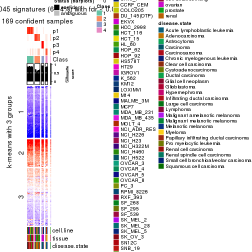</p>

</div>
<div id='tab-MAD-skmeans-get-signatures-no-scale-4'>
<pre><code class="r">get_signatures(res, k = 5, scale_rows = FALSE)
</code></pre>

<p></p>

</div>
<div id='tab-MAD-skmeans-get-signatures-no-scale-5'>
<pre><code class="r">get_signatures(res, k = 6, scale_rows = FALSE)
</code></pre>

<p></p>

</div>
</div>


Compare the overlap of signatures from different k:

```r
compare_signatures(res)
```


`get_signature()` returns a data frame invisibly. TO get the list of signatures, the function
call should be assigned to a variable explicitly. In following code, if `plot` argument is set
to `FALSE`, no heatmap is plotted while only the differential analysis is performed.

```r
# code only for demonstration
tb = get_signature(res, k = ..., plot = FALSE)
```

An example of the output of `tb` is:

```
#>   which_row         fdr    mean_1    mean_2 scaled_mean_1 scaled_mean_2 km
#> 1        38 0.042760348  8.373488  9.131774    -0.5533452     0.5164555  1
#> 2        40 0.018707592  7.106213  8.469186    -0.6173731     0.5762149  1
#> 3        55 0.019134737 10.221463 11.207825    -0.6159697     0.5749050  1
#> 4        59 0.006059896  5.921854  7.869574    -0.6899429     0.6439467  1
#> 5        60 0.018055526  8.928898 10.211722    -0.6204761     0.5791110  1
#> 6        98 0.009384629 15.714769 14.887706     0.6635654    -0.6193277  2
...
```

The columns in `tb` are:

1. `which_row`: row indices corresponding to the input matrix.
2. `fdr`: FDR for the differential test. 
3. `mean_x`: The mean value in group x.
4. `scaled_mean_x`: The mean value in group x after rows are scaled.
5. `km`: Row groups if k-means clustering is applied to rows.


UMAP plot which shows how samples are separated.


<script>
$( function() {
	$( '#tabs-MAD-skmeans-dimension-reduction' ).tabs();
} );
</script>
<div id='tabs-MAD-skmeans-dimension-reduction'>
<ul>
<li><a href='#tab-MAD-skmeans-dimension-reduction-1'>k = 2</a></li>
<li><a href='#tab-MAD-skmeans-dimension-reduction-2'>k = 3</a></li>
<li><a href='#tab-MAD-skmeans-dimension-reduction-3'>k = 4</a></li>
<li><a href='#tab-MAD-skmeans-dimension-reduction-4'>k = 5</a></li>
<li><a href='#tab-MAD-skmeans-dimension-reduction-5'>k = 6</a></li>
</ul>
<div id='tab-MAD-skmeans-dimension-reduction-1'>
<pre><code class="r">dimension_reduction(res, k = 2, method = &quot;UMAP&quot;)
</code></pre>

<p></p>

</div>
<div id='tab-MAD-skmeans-dimension-reduction-2'>
<pre><code class="r">dimension_reduction(res, k = 3, method = &quot;UMAP&quot;)
</code></pre>

<p></p>

</div>
<div id='tab-MAD-skmeans-dimension-reduction-3'>
<pre><code class="r">dimension_reduction(res, k = 4, method = &quot;UMAP&quot;)
</code></pre>

<p></p>

</div>
<div id='tab-MAD-skmeans-dimension-reduction-4'>
<pre><code class="r">dimension_reduction(res, k = 5, method = &quot;UMAP&quot;)
</code></pre>

<p></p>

</div>
<div id='tab-MAD-skmeans-dimension-reduction-5'>
<pre><code class="r">dimension_reduction(res, k = 6, method = &quot;UMAP&quot;)
</code></pre>

<p></p>

</div>
</div>


Following heatmap shows how subgroups are split when increasing `k`:

```r
collect_classes(res)
```


Test correlation between subgroups and known annotations. If the known
annotation is numeric, one-way ANOVA test is applied, and if the known
annotation is discrete, chi-squared contingency table test is applied.

```r
test_to_known_factors(res)
```

```
#>               n cell.line(p) tissue(p) disease.state(p) k
#> MAD:skmeans 173     5.58e-13  1.04e-16         1.36e-10 2
#> MAD:skmeans 172     8.07e-24  2.61e-44         1.17e-27 3
#> MAD:skmeans 169     5.41e-35  1.15e-69         5.20e-44 4
#> MAD:skmeans 143     1.80e-38  5.03e-74         1.99e-49 5
#> MAD:skmeans 158     2.14e-52  3.11e-89         6.35e-54 6
```


If matrix rows can be associated to genes, consider to use `GO_Enrichment(res,
...)` to perform function enrichment for the signature genes.


 

---------------------------------------------------


### MAD:pam**


The object with results only for a single top-value method and a single partition method 
can be extracted as:

```r
res = res_list["MAD", "pam"]
# you can also extract it by
# res = res_list["MAD:pam"]
```

A summary of `res` and all the functions that can be applied to it:

```r
res
```

```
#> A 'ConsensusPartition' object with k = 2, 3, 4, 5, 6.
#>   On a matrix with 51941 rows and 174 columns.
#>   Top rows (1000, 2000, 3000, 4000, 5000) are extracted by 'MAD' method.
#>   Subgroups are detected by 'pam' method.
#>   Performed in total 1250 partitions by row resampling.
#>   Best k for subgroups seems to be 4.
#> 
#> Following methods can be applied to this 'ConsensusPartition' object:
#>  [1] "cola_report"             "collect_classes"         "collect_plots"          
#>  [4] "collect_stats"           "colnames"                "compare_signatures"     
#>  [7] "consensus_heatmap"       "dimension_reduction"     "functional_enrichment"  
#> [10] "get_anno_col"            "get_anno"                "get_classes"            
#> [13] "get_consensus"           "get_matrix"              "get_membership"         
#> [16] "get_param"               "get_signatures"          "get_stats"              
#> [19] "is_best_k"               "is_stable_k"             "membership_heatmap"     
#> [22] "ncol"                    "nrow"                    "plot_ecdf"              
#> [25] "rownames"                "select_partition_number" "show"                   
#> [28] "suggest_best_k"          "test_to_known_factors"
```

`collect_plots()` function collects all the plots made from `res` for all `k` (number of partitions)
into one single page to provide an easy and fast comparison between different `k`.

```r
collect_plots(res)
```


The plots are:

- The first row: a plot of the ECDF (Empirical cumulative distribution
  function) curves of the consensus matrix for each `k` and the heatmap of
  predicted classes for each `k`.
- The second row: heatmaps of the consensus matrix for each `k`.
- The third row: heatmaps of the membership matrix for each `k`.
- The fouth row: heatmaps of the signatures for each `k`.

All the plots in panels can be made by individual functions and they are
plotted later in this section.

`select_partition_number()` produces several plots showing different
statistics for choosing "optimized" `k`. There are following statistics:

- ECDF curves of the consensus matrix for each `k`;
- 1-PAC. [The PAC
  score](https://en.wikipedia.org/wiki/Consensus_clustering#Over-interpretation_potential_of_consensus_clustering)
  measures the proportion of the ambiguous subgrouping.
- Mean silhouette score.
- Concordance. The mean probability of fiting the consensus class ids in all
  partitions.
- Area increased. Denote $A_k$ as the area under the ECDF curve for current
  `k`, the area increased is defined as $A_k - A_{k-1}$.
- Rand index. The percent of pairs of samples that are both in a same cluster
  or both are not in a same cluster in the partition of k and k-1.
- Jaccard index. The ratio of pairs of samples are both in a same cluster in
  the partition of k and k-1 and the pairs of samples are both in a same
  cluster in the partition k or k-1.

The detailed explanations of these statistics can be found in [the cola
vignette](http://bioconductor.org/packages/devel/bioc/vignettes/cola/inst/doc/cola.html#toc_13).

Generally speaking, lower PAC score, higher mean silhouette score or higher
concordance corresponds to better partition. Rand index and Jaccard index
measure how similar the current partition is compared to partition with `k-1`.
If they are too similar, we won't accept `k` is better than `k-1`.

```r
select_partition_number(res)
```


The numeric values for all these statistics can be obtained by `get_stats()`.

```r
get_stats(res)
```

```
#>   k 1-PAC mean_silhouette concordance area_increased  Rand Jaccard
#> 2 2 0.858           0.913       0.963         0.4574 0.553   0.553
#> 3 3 0.995           0.953       0.977         0.3051 0.848   0.728
#> 4 4 0.991           0.955       0.978         0.0904 0.937   0.849
#> 5 5 0.857           0.914       0.921         0.1469 0.868   0.635
#> 6 6 0.758           0.728       0.829         0.0805 0.940   0.748
```

`suggest_best_k()` suggests the best $k$ based on these statistics. The rules are as follows:

- All $k$ with Jaccard index larger than 0.95 are removed because the increase of
  the partition number does not provides enough extra information. If all $k$ are removed,
  the best $k$ is assigned by `NA`.
- For $k$ with 1-PAC larger than 0.9, the maximal $k$ is taken as the "best k". Other $k$ is called "optional k".
- If it does not fit the second rule. The $k$ with the highest vote of highest
  1-PAC, mean silhouette and concordance is taken as the "best k".

```r
suggest_best_k(res)
```

```
#> [1] 4
#> attr(,"optional")
#> [1] 3
```

There is also optional best $k$ = 3 that is worth to check.

Following shows the table of the partitions (You need to click the **show/hide
code output** link to see it). The membership matrix (columns with name `p*`)
is inferred by
[`clue::cl_consensus()`](https://www.rdocumentation.org/link/cl_consensus?package=clue)
function with the `SE` method. Basically the value in the membership matrix
represents the probability to belong to a certain group. The finall class
label for an item is determined with the group with highest probability it
belongs to.

In `get_classes()` function, the entropy is calculated from the membership
matrix and the silhouette score is calculated from the consensus matrix.


<script>
$( function() {
	$( '#tabs-MAD-pam-get-classes' ).tabs();
} );
</script>
<div id='tabs-MAD-pam-get-classes'>
<ul>
<li><a href='#tab-MAD-pam-get-classes-1'>k = 2</a></li>
<li><a href='#tab-MAD-pam-get-classes-2'>k = 3</a></li>
<li><a href='#tab-MAD-pam-get-classes-3'>k = 4</a></li>
<li><a href='#tab-MAD-pam-get-classes-4'>k = 5</a></li>
<li><a href='#tab-MAD-pam-get-classes-5'>k = 6</a></li>
</ul>

<div id='tab-MAD-pam-get-classes-1'>
<p><a id='tab-MAD-pam-get-classes-1-a' style='color:#0366d6' href='#'>show/hide code output</a></p>
<pre><code class="r">cbind(get_classes(res, k = 2), get_membership(res, k = 2))
</code></pre>

<pre><code>#&gt;           class entropy silhouette    p1    p2
#&gt; GSM803615     2  0.0000      0.972 0.000 1.000
#&gt; GSM803674     2  0.0000      0.972 0.000 1.000
#&gt; GSM803733     2  0.0000      0.972 0.000 1.000
#&gt; GSM803616     2  0.0000      0.972 0.000 1.000
#&gt; GSM803675     2  0.0000      0.972 0.000 1.000
#&gt; GSM803734     2  0.0000      0.972 0.000 1.000
#&gt; GSM803617     2  0.0000      0.972 0.000 1.000
#&gt; GSM803676     2  0.0000      0.972 0.000 1.000
#&gt; GSM803735     2  0.0000      0.972 0.000 1.000
#&gt; GSM803618     2  0.0000      0.972 0.000 1.000
#&gt; GSM803677     2  0.0000      0.972 0.000 1.000
#&gt; GSM803736     2  0.0000      0.972 0.000 1.000
#&gt; GSM803619     1  0.0672      0.949 0.992 0.008
#&gt; GSM803678     1  0.0376      0.952 0.996 0.004
#&gt; GSM803737     1  0.0672      0.949 0.992 0.008
#&gt; GSM803620     2  0.0000      0.972 0.000 1.000
#&gt; GSM803679     2  0.0000      0.972 0.000 1.000
#&gt; GSM803738     2  0.0000      0.972 0.000 1.000
#&gt; GSM803621     1  0.0000      0.955 1.000 0.000
#&gt; GSM803680     1  0.0000      0.955 1.000 0.000
#&gt; GSM803739     1  0.0000      0.955 1.000 0.000
#&gt; GSM803622     1  0.0000      0.955 1.000 0.000
#&gt; GSM803681     1  0.0000      0.955 1.000 0.000
#&gt; GSM803740     1  0.0000      0.955 1.000 0.000
#&gt; GSM803623     2  0.0000      0.972 0.000 1.000
#&gt; GSM803682     2  0.0000      0.972 0.000 1.000
#&gt; GSM803741     2  0.0000      0.972 0.000 1.000
#&gt; GSM803624     1  0.1633      0.936 0.976 0.024
#&gt; GSM803683     1  0.0000      0.955 1.000 0.000
#&gt; GSM803742     1  0.0000      0.955 1.000 0.000
#&gt; GSM803625     1  0.0000      0.955 1.000 0.000
#&gt; GSM803684     1  0.0000      0.955 1.000 0.000
#&gt; GSM803743     1  0.0000      0.955 1.000 0.000
#&gt; GSM803626     1  0.0000      0.955 1.000 0.000
#&gt; GSM803685     1  0.0000      0.955 1.000 0.000
#&gt; GSM803744     1  0.0376      0.952 0.996 0.004
#&gt; GSM803627     1  0.0000      0.955 1.000 0.000
#&gt; GSM803686     1  0.0000      0.955 1.000 0.000
#&gt; GSM803745     1  0.0000      0.955 1.000 0.000
#&gt; GSM803628     1  0.0000      0.955 1.000 0.000
#&gt; GSM803687     1  0.0000      0.955 1.000 0.000
#&gt; GSM803746     1  0.0000      0.955 1.000 0.000
#&gt; GSM803629     1  0.0000      0.955 1.000 0.000
#&gt; GSM803688     1  0.0000      0.955 1.000 0.000
#&gt; GSM803747     1  0.0000      0.955 1.000 0.000
#&gt; GSM803630     1  0.0000      0.955 1.000 0.000
#&gt; GSM803689     1  0.0000      0.955 1.000 0.000
#&gt; GSM803748     1  0.0000      0.955 1.000 0.000
#&gt; GSM803631     1  0.0000      0.955 1.000 0.000
#&gt; GSM803690     1  0.0000      0.955 1.000 0.000
#&gt; GSM803749     1  0.0000      0.955 1.000 0.000
#&gt; GSM803632     1  0.0000      0.955 1.000 0.000
#&gt; GSM803691     1  0.0000      0.955 1.000 0.000
#&gt; GSM803750     1  0.0000      0.955 1.000 0.000
#&gt; GSM803633     2  0.0000      0.972 0.000 1.000
#&gt; GSM803692     2  0.0000      0.972 0.000 1.000
#&gt; GSM803751     2  0.0000      0.972 0.000 1.000
#&gt; GSM803634     2  0.0000      0.972 0.000 1.000
#&gt; GSM803693     2  0.0000      0.972 0.000 1.000
#&gt; GSM803752     2  0.0000      0.972 0.000 1.000
#&gt; GSM803635     2  0.0000      0.972 0.000 1.000
#&gt; GSM803694     2  0.0000      0.972 0.000 1.000
#&gt; GSM803753     2  0.0000      0.972 0.000 1.000
#&gt; GSM803636     2  0.0000      0.972 0.000 1.000
#&gt; GSM803695     2  0.0000      0.972 0.000 1.000
#&gt; GSM803754     2  0.0000      0.972 0.000 1.000
#&gt; GSM803637     2  0.0000      0.972 0.000 1.000
#&gt; GSM803696     2  0.0000      0.972 0.000 1.000
#&gt; GSM803755     2  0.0000      0.972 0.000 1.000
#&gt; GSM803638     2  0.0000      0.972 0.000 1.000
#&gt; GSM803697     2  0.0000      0.972 0.000 1.000
#&gt; GSM803756     2  0.0000      0.972 0.000 1.000
#&gt; GSM803639     2  0.0000      0.972 0.000 1.000
#&gt; GSM803698     2  0.0000      0.972 0.000 1.000
#&gt; GSM803757     2  0.0000      0.972 0.000 1.000
#&gt; GSM803640     1  0.0000      0.955 1.000 0.000
#&gt; GSM803699     1  0.0000      0.955 1.000 0.000
#&gt; GSM803758     1  0.0000      0.955 1.000 0.000
#&gt; GSM803641     1  0.0000      0.955 1.000 0.000
#&gt; GSM803700     1  0.0000      0.955 1.000 0.000
#&gt; GSM803759     1  0.0000      0.955 1.000 0.000
#&gt; GSM803642     1  0.0000      0.955 1.000 0.000
#&gt; GSM803701     1  0.0000      0.955 1.000 0.000
#&gt; GSM803760     1  0.0000      0.955 1.000 0.000
#&gt; GSM803643     1  0.0000      0.955 1.000 0.000
#&gt; GSM803702     1  0.0000      0.955 1.000 0.000
#&gt; GSM803644     1  0.0000      0.955 1.000 0.000
#&gt; GSM803703     1  0.0000      0.955 1.000 0.000
#&gt; GSM803761     1  0.0000      0.955 1.000 0.000
#&gt; GSM803645     1  0.0000      0.955 1.000 0.000
#&gt; GSM803704     1  0.0000      0.955 1.000 0.000
#&gt; GSM803762     1  0.0000      0.955 1.000 0.000
#&gt; GSM803646     1  0.4022      0.887 0.920 0.080
#&gt; GSM803705     1  0.4939      0.860 0.892 0.108
#&gt; GSM803763     1  0.9686      0.400 0.604 0.396
#&gt; GSM803647     1  0.0000      0.955 1.000 0.000
#&gt; GSM803706     1  0.0000      0.955 1.000 0.000
#&gt; GSM803764     1  0.0000      0.955 1.000 0.000
#&gt; GSM803648     1  0.0938      0.946 0.988 0.012
#&gt; GSM803707     1  0.0376      0.952 0.996 0.004
#&gt; GSM803765     1  0.9686      0.400 0.604 0.396
#&gt; GSM803649     1  0.0000      0.955 1.000 0.000
#&gt; GSM803708     1  0.0000      0.955 1.000 0.000
#&gt; GSM803766     1  0.0000      0.955 1.000 0.000
#&gt; GSM803650     1  0.0000      0.955 1.000 0.000
#&gt; GSM803709     1  0.0000      0.955 1.000 0.000
#&gt; GSM803767     1  0.0000      0.955 1.000 0.000
#&gt; GSM803651     1  0.0000      0.955 1.000 0.000
#&gt; GSM803710     1  0.0000      0.955 1.000 0.000
#&gt; GSM803768     1  0.0000      0.955 1.000 0.000
#&gt; GSM803652     1  0.0000      0.955 1.000 0.000
#&gt; GSM803711     1  0.0000      0.955 1.000 0.000
#&gt; GSM803653     1  0.9000      0.567 0.684 0.316
#&gt; GSM803712     1  0.9087      0.552 0.676 0.324
#&gt; GSM803769     1  0.9491      0.463 0.632 0.368
#&gt; GSM803654     2  0.0000      0.972 0.000 1.000
#&gt; GSM803713     2  0.0000      0.972 0.000 1.000
#&gt; GSM803770     2  0.0000      0.972 0.000 1.000
#&gt; GSM803655     1  0.0000      0.955 1.000 0.000
#&gt; GSM803714     1  0.0000      0.955 1.000 0.000
#&gt; GSM803771     1  0.0000      0.955 1.000 0.000
#&gt; GSM803656     2  0.7815      0.699 0.232 0.768
#&gt; GSM803715     2  0.5629      0.843 0.132 0.868
#&gt; GSM803772     2  0.4562      0.885 0.096 0.904
#&gt; GSM803657     2  0.0000      0.972 0.000 1.000
#&gt; GSM803716     2  0.0000      0.972 0.000 1.000
#&gt; GSM803773     2  0.0000      0.972 0.000 1.000
#&gt; GSM803658     2  0.4022      0.899 0.080 0.920
#&gt; GSM803717     2  0.3879      0.903 0.076 0.924
#&gt; GSM803774     2  0.8144      0.645 0.252 0.748
#&gt; GSM803659     2  0.5294      0.857 0.120 0.880
#&gt; GSM803718     2  0.4022      0.901 0.080 0.920
#&gt; GSM803775     2  0.0376      0.969 0.004 0.996
#&gt; GSM803660     1  0.8955      0.576 0.688 0.312
#&gt; GSM803719     1  0.9686      0.400 0.604 0.396
#&gt; GSM803776     1  0.9686      0.400 0.604 0.396
#&gt; GSM803661     1  0.0000      0.955 1.000 0.000
#&gt; GSM803720     1  0.5629      0.833 0.868 0.132
#&gt; GSM803777     1  0.5629      0.834 0.868 0.132
#&gt; GSM803662     1  0.0376      0.952 0.996 0.004
#&gt; GSM803732     1  0.0000      0.955 1.000 0.000
#&gt; GSM803778     1  0.0000      0.955 1.000 0.000
#&gt; GSM803663     1  0.9710      0.390 0.600 0.400
#&gt; GSM803721     2  0.9815      0.210 0.420 0.580
#&gt; GSM803779     1  0.9686      0.400 0.604 0.396
#&gt; GSM803664     1  0.5294      0.848 0.880 0.120
#&gt; GSM803722     1  0.8327      0.660 0.736 0.264
#&gt; GSM803780     1  0.9522      0.457 0.628 0.372
#&gt; GSM803665     1  0.0000      0.955 1.000 0.000
#&gt; GSM803723     1  0.0000      0.955 1.000 0.000
#&gt; GSM803781     1  0.0000      0.955 1.000 0.000
#&gt; GSM803666     1  0.0000      0.955 1.000 0.000
#&gt; GSM803724     1  0.0000      0.955 1.000 0.000
#&gt; GSM803782     1  0.0000      0.955 1.000 0.000
#&gt; GSM803667     1  0.0000      0.955 1.000 0.000
#&gt; GSM803725     1  0.0000      0.955 1.000 0.000
#&gt; GSM803783     1  0.0000      0.955 1.000 0.000
#&gt; GSM803668     1  0.0000      0.955 1.000 0.000
#&gt; GSM803726     1  0.0000      0.955 1.000 0.000
#&gt; GSM803784     1  0.0000      0.955 1.000 0.000
#&gt; GSM803669     1  0.0000      0.955 1.000 0.000
#&gt; GSM803727     1  0.0000      0.955 1.000 0.000
#&gt; GSM803670     1  0.0000      0.955 1.000 0.000
#&gt; GSM803728     1  0.0000      0.955 1.000 0.000
#&gt; GSM803785     1  0.0000      0.955 1.000 0.000
#&gt; GSM803671     1  0.0000      0.955 1.000 0.000
#&gt; GSM803729     1  0.0000      0.955 1.000 0.000
#&gt; GSM803786     1  0.0000      0.955 1.000 0.000
#&gt; GSM803672     1  0.0000      0.955 1.000 0.000
#&gt; GSM803730     1  0.0000      0.955 1.000 0.000
#&gt; GSM803787     1  0.0000      0.955 1.000 0.000
#&gt; GSM803673     2  0.0000      0.972 0.000 1.000
#&gt; GSM803731     2  0.0000      0.972 0.000 1.000
#&gt; GSM803788     2  0.0000      0.972 0.000 1.000
</code></pre>

<script>
$('#tab-MAD-pam-get-classes-1-a').parent().next().next().hide();
$('#tab-MAD-pam-get-classes-1-a').click(function(){
  $('#tab-MAD-pam-get-classes-1-a').parent().next().next().toggle();
  return(false);
});
</script>
</div>

<div id='tab-MAD-pam-get-classes-2'>
<p><a id='tab-MAD-pam-get-classes-2-a' style='color:#0366d6' href='#'>show/hide code output</a></p>
<pre><code class="r">cbind(get_classes(res, k = 3), get_membership(res, k = 3))
</code></pre>

<pre><code>#&gt;           class entropy silhouette    p1    p2    p3
#&gt; GSM803615     2  0.0000      0.986 0.000 1.000 0.000
#&gt; GSM803674     2  0.0000      0.986 0.000 1.000 0.000
#&gt; GSM803733     2  0.0424      0.980 0.000 0.992 0.008
#&gt; GSM803616     2  0.0000      0.986 0.000 1.000 0.000
#&gt; GSM803675     2  0.0000      0.986 0.000 1.000 0.000
#&gt; GSM803734     2  0.0000      0.986 0.000 1.000 0.000
#&gt; GSM803617     2  0.0000      0.986 0.000 1.000 0.000
#&gt; GSM803676     2  0.0000      0.986 0.000 1.000 0.000
#&gt; GSM803735     2  0.0000      0.986 0.000 1.000 0.000
#&gt; GSM803618     2  0.0000      0.986 0.000 1.000 0.000
#&gt; GSM803677     2  0.0000      0.986 0.000 1.000 0.000
#&gt; GSM803736     2  0.0000      0.986 0.000 1.000 0.000
#&gt; GSM803619     1  0.5580      0.684 0.736 0.008 0.256
#&gt; GSM803678     1  0.5517      0.669 0.728 0.004 0.268
#&gt; GSM803737     1  0.2356      0.927 0.928 0.000 0.072
#&gt; GSM803620     2  0.0000      0.986 0.000 1.000 0.000
#&gt; GSM803679     2  0.0000      0.986 0.000 1.000 0.000
#&gt; GSM803738     2  0.0000      0.986 0.000 1.000 0.000
#&gt; GSM803621     1  0.1289      0.957 0.968 0.000 0.032
#&gt; GSM803680     1  0.1289      0.957 0.968 0.000 0.032
#&gt; GSM803739     1  0.1289      0.957 0.968 0.000 0.032
#&gt; GSM803622     1  0.1289      0.957 0.968 0.000 0.032
#&gt; GSM803681     1  0.1289      0.957 0.968 0.000 0.032
#&gt; GSM803740     1  0.1289      0.957 0.968 0.000 0.032
#&gt; GSM803623     2  0.0000      0.986 0.000 1.000 0.000
#&gt; GSM803682     2  0.0000      0.986 0.000 1.000 0.000
#&gt; GSM803741     2  0.0000      0.986 0.000 1.000 0.000
#&gt; GSM803624     1  0.0000      0.963 1.000 0.000 0.000
#&gt; GSM803683     1  0.0000      0.963 1.000 0.000 0.000
#&gt; GSM803742     1  0.0000      0.963 1.000 0.000 0.000
#&gt; GSM803625     1  0.1289      0.957 0.968 0.000 0.032
#&gt; GSM803684     1  0.1289      0.957 0.968 0.000 0.032
#&gt; GSM803743     1  0.1289      0.957 0.968 0.000 0.032
#&gt; GSM803626     3  0.0000      1.000 0.000 0.000 1.000
#&gt; GSM803685     3  0.0000      1.000 0.000 0.000 1.000
#&gt; GSM803744     3  0.0000      1.000 0.000 0.000 1.000
#&gt; GSM803627     1  0.1289      0.957 0.968 0.000 0.032
#&gt; GSM803686     1  0.1289      0.957 0.968 0.000 0.032
#&gt; GSM803745     1  0.1289      0.957 0.968 0.000 0.032
#&gt; GSM803628     1  0.1289      0.957 0.968 0.000 0.032
#&gt; GSM803687     1  0.1289      0.957 0.968 0.000 0.032
#&gt; GSM803746     1  0.1289      0.957 0.968 0.000 0.032
#&gt; GSM803629     1  0.1289      0.957 0.968 0.000 0.032
#&gt; GSM803688     1  0.1289      0.957 0.968 0.000 0.032
#&gt; GSM803747     1  0.1289      0.957 0.968 0.000 0.032
#&gt; GSM803630     1  0.1289      0.957 0.968 0.000 0.032
#&gt; GSM803689     1  0.1289      0.957 0.968 0.000 0.032
#&gt; GSM803748     1  0.1289      0.957 0.968 0.000 0.032
#&gt; GSM803631     1  0.1289      0.957 0.968 0.000 0.032
#&gt; GSM803690     1  0.1289      0.957 0.968 0.000 0.032
#&gt; GSM803749     1  0.1289      0.957 0.968 0.000 0.032
#&gt; GSM803632     1  0.1289      0.957 0.968 0.000 0.032
#&gt; GSM803691     1  0.1289      0.957 0.968 0.000 0.032
#&gt; GSM803750     1  0.1289      0.957 0.968 0.000 0.032
#&gt; GSM803633     2  0.0000      0.986 0.000 1.000 0.000
#&gt; GSM803692     2  0.0000      0.986 0.000 1.000 0.000
#&gt; GSM803751     2  0.0000      0.986 0.000 1.000 0.000
#&gt; GSM803634     2  0.0000      0.986 0.000 1.000 0.000
#&gt; GSM803693     2  0.0000      0.986 0.000 1.000 0.000
#&gt; GSM803752     2  0.0000      0.986 0.000 1.000 0.000
#&gt; GSM803635     2  0.0000      0.986 0.000 1.000 0.000
#&gt; GSM803694     2  0.0000      0.986 0.000 1.000 0.000
#&gt; GSM803753     2  0.0000      0.986 0.000 1.000 0.000
#&gt; GSM803636     2  0.0000      0.986 0.000 1.000 0.000
#&gt; GSM803695     2  0.0000      0.986 0.000 1.000 0.000
#&gt; GSM803754     2  0.0000      0.986 0.000 1.000 0.000
#&gt; GSM803637     2  0.0000      0.986 0.000 1.000 0.000
#&gt; GSM803696     2  0.0000      0.986 0.000 1.000 0.000
#&gt; GSM803755     2  0.0000      0.986 0.000 1.000 0.000
#&gt; GSM803638     2  0.0000      0.986 0.000 1.000 0.000
#&gt; GSM803697     2  0.0000      0.986 0.000 1.000 0.000
#&gt; GSM803756     2  0.0000      0.986 0.000 1.000 0.000
#&gt; GSM803639     2  0.0000      0.986 0.000 1.000 0.000
#&gt; GSM803698     2  0.0000      0.986 0.000 1.000 0.000
#&gt; GSM803757     2  0.0000      0.986 0.000 1.000 0.000
#&gt; GSM803640     1  0.0000      0.963 1.000 0.000 0.000
#&gt; GSM803699     1  0.0000      0.963 1.000 0.000 0.000
#&gt; GSM803758     1  0.0000      0.963 1.000 0.000 0.000
#&gt; GSM803641     1  0.0000      0.963 1.000 0.000 0.000
#&gt; GSM803700     1  0.0000      0.963 1.000 0.000 0.000
#&gt; GSM803759     1  0.0000      0.963 1.000 0.000 0.000
#&gt; GSM803642     1  0.0000      0.963 1.000 0.000 0.000
#&gt; GSM803701     1  0.0000      0.963 1.000 0.000 0.000
#&gt; GSM803760     1  0.0000      0.963 1.000 0.000 0.000
#&gt; GSM803643     1  0.0000      0.963 1.000 0.000 0.000
#&gt; GSM803702     1  0.0000      0.963 1.000 0.000 0.000
#&gt; GSM803644     1  0.0000      0.963 1.000 0.000 0.000
#&gt; GSM803703     1  0.0000      0.963 1.000 0.000 0.000
#&gt; GSM803761     1  0.0000      0.963 1.000 0.000 0.000
#&gt; GSM803645     1  0.0000      0.963 1.000 0.000 0.000
#&gt; GSM803704     1  0.0000      0.963 1.000 0.000 0.000
#&gt; GSM803762     1  0.0000      0.963 1.000 0.000 0.000
#&gt; GSM803646     1  0.0000      0.963 1.000 0.000 0.000
#&gt; GSM803705     1  0.0000      0.963 1.000 0.000 0.000
#&gt; GSM803763     1  0.0000      0.963 1.000 0.000 0.000
#&gt; GSM803647     1  0.0000      0.963 1.000 0.000 0.000
#&gt; GSM803706     1  0.0000      0.963 1.000 0.000 0.000
#&gt; GSM803764     1  0.0000      0.963 1.000 0.000 0.000
#&gt; GSM803648     1  0.0000      0.963 1.000 0.000 0.000
#&gt; GSM803707     1  0.0000      0.963 1.000 0.000 0.000
#&gt; GSM803765     1  0.0000      0.963 1.000 0.000 0.000
#&gt; GSM803649     1  0.0000      0.963 1.000 0.000 0.000
#&gt; GSM803708     1  0.0000      0.963 1.000 0.000 0.000
#&gt; GSM803766     1  0.0000      0.963 1.000 0.000 0.000
#&gt; GSM803650     1  0.0000      0.963 1.000 0.000 0.000
#&gt; GSM803709     1  0.0000      0.963 1.000 0.000 0.000
#&gt; GSM803767     1  0.1289      0.957 0.968 0.000 0.032
#&gt; GSM803651     1  0.0000      0.963 1.000 0.000 0.000
#&gt; GSM803710     1  0.0000      0.963 1.000 0.000 0.000
#&gt; GSM803768     1  0.1289      0.957 0.968 0.000 0.032
#&gt; GSM803652     1  0.0000      0.963 1.000 0.000 0.000
#&gt; GSM803711     1  0.0000      0.963 1.000 0.000 0.000
#&gt; GSM803653     1  0.1482      0.954 0.968 0.020 0.012
#&gt; GSM803712     1  0.1482      0.954 0.968 0.020 0.012
#&gt; GSM803769     1  0.1399      0.950 0.968 0.028 0.004
#&gt; GSM803654     2  0.0000      0.986 0.000 1.000 0.000
#&gt; GSM803713     2  0.0000      0.986 0.000 1.000 0.000
#&gt; GSM803770     2  0.0000      0.986 0.000 1.000 0.000
#&gt; GSM803655     1  0.1529      0.952 0.960 0.000 0.040
#&gt; GSM803714     1  0.3649      0.900 0.896 0.036 0.068
#&gt; GSM803771     1  0.5947      0.742 0.776 0.172 0.052
#&gt; GSM803656     2  0.2050      0.939 0.020 0.952 0.028
#&gt; GSM803715     2  0.1031      0.962 0.000 0.976 0.024
#&gt; GSM803772     2  0.2261      0.904 0.068 0.932 0.000
#&gt; GSM803657     2  0.0000      0.986 0.000 1.000 0.000
#&gt; GSM803716     2  0.0000      0.986 0.000 1.000 0.000
#&gt; GSM803773     2  0.0000      0.986 0.000 1.000 0.000
#&gt; GSM803658     2  0.2537      0.888 0.080 0.920 0.000
#&gt; GSM803717     2  0.2448      0.893 0.076 0.924 0.000
#&gt; GSM803774     2  0.5098      0.623 0.248 0.752 0.000
#&gt; GSM803659     2  0.0892      0.967 0.000 0.980 0.020
#&gt; GSM803718     2  0.0747      0.971 0.000 0.984 0.016
#&gt; GSM803775     2  0.0000      0.986 0.000 1.000 0.000
#&gt; GSM803660     1  0.0000      0.963 1.000 0.000 0.000
#&gt; GSM803719     1  0.0000      0.963 1.000 0.000 0.000
#&gt; GSM803776     1  0.0000      0.963 1.000 0.000 0.000
#&gt; GSM803661     1  0.0000      0.963 1.000 0.000 0.000
#&gt; GSM803720     1  0.0000      0.963 1.000 0.000 0.000
#&gt; GSM803777     1  0.0000      0.963 1.000 0.000 0.000
#&gt; GSM803662     1  0.0000      0.963 1.000 0.000 0.000
#&gt; GSM803732     1  0.0000      0.963 1.000 0.000 0.000
#&gt; GSM803778     1  0.0000      0.963 1.000 0.000 0.000
#&gt; GSM803663     1  0.0000      0.963 1.000 0.000 0.000
#&gt; GSM803721     1  0.4235      0.764 0.824 0.176 0.000
#&gt; GSM803779     1  0.0000      0.963 1.000 0.000 0.000
#&gt; GSM803664     1  0.1636      0.954 0.964 0.016 0.020
#&gt; GSM803722     1  0.1950      0.939 0.952 0.040 0.008
#&gt; GSM803780     1  0.1267      0.953 0.972 0.024 0.004
#&gt; GSM803665     1  0.6140      0.388 0.596 0.000 0.404
#&gt; GSM803723     1  0.6140      0.388 0.596 0.000 0.404
#&gt; GSM803781     1  0.6140      0.388 0.596 0.000 0.404
#&gt; GSM803666     3  0.0000      1.000 0.000 0.000 1.000
#&gt; GSM803724     3  0.0000      1.000 0.000 0.000 1.000
#&gt; GSM803782     3  0.0000      1.000 0.000 0.000 1.000
#&gt; GSM803667     3  0.0000      1.000 0.000 0.000 1.000
#&gt; GSM803725     3  0.0000      1.000 0.000 0.000 1.000
#&gt; GSM803783     3  0.0000      1.000 0.000 0.000 1.000
#&gt; GSM803668     3  0.0000      1.000 0.000 0.000 1.000
#&gt; GSM803726     3  0.0000      1.000 0.000 0.000 1.000
#&gt; GSM803784     3  0.0000      1.000 0.000 0.000 1.000
#&gt; GSM803669     3  0.0000      1.000 0.000 0.000 1.000
#&gt; GSM803727     3  0.0000      1.000 0.000 0.000 1.000
#&gt; GSM803670     3  0.0000      1.000 0.000 0.000 1.000
#&gt; GSM803728     3  0.0000      1.000 0.000 0.000 1.000
#&gt; GSM803785     3  0.0000      1.000 0.000 0.000 1.000
#&gt; GSM803671     3  0.0000      1.000 0.000 0.000 1.000
#&gt; GSM803729     3  0.0000      1.000 0.000 0.000 1.000
#&gt; GSM803786     3  0.0000      1.000 0.000 0.000 1.000
#&gt; GSM803672     3  0.0000      1.000 0.000 0.000 1.000
#&gt; GSM803730     3  0.0000      1.000 0.000 0.000 1.000
#&gt; GSM803787     3  0.0000      1.000 0.000 0.000 1.000
#&gt; GSM803673     2  0.0000      0.986 0.000 1.000 0.000
#&gt; GSM803731     2  0.0000      0.986 0.000 1.000 0.000
#&gt; GSM803788     2  0.0000      0.986 0.000 1.000 0.000
</code></pre>

<script>
$('#tab-MAD-pam-get-classes-2-a').parent().next().next().hide();
$('#tab-MAD-pam-get-classes-2-a').click(function(){
  $('#tab-MAD-pam-get-classes-2-a').parent().next().next().toggle();
  return(false);
});
</script>
</div>

<div id='tab-MAD-pam-get-classes-3'>
<p><a id='tab-MAD-pam-get-classes-3-a' style='color:#0366d6' href='#'>show/hide code output</a></p>
<pre><code class="r">cbind(get_classes(res, k = 4), get_membership(res, k = 4))
</code></pre>

<pre><code>#&gt;           class entropy silhouette    p1    p2    p3    p4
#&gt; GSM803615     4  0.0000      0.991 0.000 0.000 0.000 1.000
#&gt; GSM803674     4  0.0000      0.991 0.000 0.000 0.000 1.000
#&gt; GSM803733     4  0.0000      0.991 0.000 0.000 0.000 1.000
#&gt; GSM803616     4  0.0000      0.991 0.000 0.000 0.000 1.000
#&gt; GSM803675     4  0.0000      0.991 0.000 0.000 0.000 1.000
#&gt; GSM803734     4  0.0000      0.991 0.000 0.000 0.000 1.000
#&gt; GSM803617     4  0.0000      0.991 0.000 0.000 0.000 1.000
#&gt; GSM803676     4  0.0000      0.991 0.000 0.000 0.000 1.000
#&gt; GSM803735     4  0.0000      0.991 0.000 0.000 0.000 1.000
#&gt; GSM803618     4  0.0336      0.985 0.000 0.008 0.000 0.992
#&gt; GSM803677     4  0.0188      0.988 0.000 0.004 0.000 0.996
#&gt; GSM803736     4  0.0188      0.988 0.000 0.004 0.000 0.996
#&gt; GSM803619     4  0.0921      0.961 0.028 0.000 0.000 0.972
#&gt; GSM803678     4  0.0921      0.961 0.028 0.000 0.000 0.972
#&gt; GSM803737     4  0.0921      0.961 0.028 0.000 0.000 0.972
#&gt; GSM803620     4  0.0000      0.991 0.000 0.000 0.000 1.000
#&gt; GSM803679     4  0.0000      0.991 0.000 0.000 0.000 1.000
#&gt; GSM803738     4  0.0000      0.991 0.000 0.000 0.000 1.000
#&gt; GSM803621     1  0.1022      0.961 0.968 0.000 0.032 0.000
#&gt; GSM803680     1  0.1022      0.961 0.968 0.000 0.032 0.000
#&gt; GSM803739     1  0.1022      0.961 0.968 0.000 0.032 0.000
#&gt; GSM803622     1  0.1022      0.961 0.968 0.000 0.032 0.000
#&gt; GSM803681     1  0.1022      0.961 0.968 0.000 0.032 0.000
#&gt; GSM803740     1  0.1022      0.961 0.968 0.000 0.032 0.000
#&gt; GSM803623     2  0.0000      0.973 0.000 1.000 0.000 0.000
#&gt; GSM803682     2  0.0000      0.973 0.000 1.000 0.000 0.000
#&gt; GSM803741     2  0.0000      0.973 0.000 1.000 0.000 0.000
#&gt; GSM803624     1  0.0000      0.967 1.000 0.000 0.000 0.000
#&gt; GSM803683     1  0.0000      0.967 1.000 0.000 0.000 0.000
#&gt; GSM803742     1  0.0000      0.967 1.000 0.000 0.000 0.000
#&gt; GSM803625     1  0.1022      0.961 0.968 0.000 0.032 0.000
#&gt; GSM803684     1  0.1022      0.961 0.968 0.000 0.032 0.000
#&gt; GSM803743     1  0.1022      0.961 0.968 0.000 0.032 0.000
#&gt; GSM803626     3  0.0000      1.000 0.000 0.000 1.000 0.000
#&gt; GSM803685     3  0.0000      1.000 0.000 0.000 1.000 0.000
#&gt; GSM803744     3  0.0000      1.000 0.000 0.000 1.000 0.000
#&gt; GSM803627     1  0.1022      0.961 0.968 0.000 0.032 0.000
#&gt; GSM803686     1  0.1022      0.961 0.968 0.000 0.032 0.000
#&gt; GSM803745     1  0.1022      0.961 0.968 0.000 0.032 0.000
#&gt; GSM803628     1  0.1022      0.961 0.968 0.000 0.032 0.000
#&gt; GSM803687     1  0.1022      0.961 0.968 0.000 0.032 0.000
#&gt; GSM803746     1  0.1022      0.961 0.968 0.000 0.032 0.000
#&gt; GSM803629     1  0.1022      0.961 0.968 0.000 0.032 0.000
#&gt; GSM803688     1  0.1022      0.961 0.968 0.000 0.032 0.000
#&gt; GSM803747     1  0.1022      0.961 0.968 0.000 0.032 0.000
#&gt; GSM803630     1  0.1022      0.961 0.968 0.000 0.032 0.000
#&gt; GSM803689     1  0.1022      0.961 0.968 0.000 0.032 0.000
#&gt; GSM803748     1  0.1022      0.961 0.968 0.000 0.032 0.000
#&gt; GSM803631     1  0.1022      0.961 0.968 0.000 0.032 0.000
#&gt; GSM803690     1  0.1022      0.961 0.968 0.000 0.032 0.000
#&gt; GSM803749     1  0.1022      0.961 0.968 0.000 0.032 0.000
#&gt; GSM803632     1  0.1022      0.961 0.968 0.000 0.032 0.000
#&gt; GSM803691     1  0.1022      0.961 0.968 0.000 0.032 0.000
#&gt; GSM803750     1  0.1022      0.961 0.968 0.000 0.032 0.000
#&gt; GSM803633     2  0.0000      0.973 0.000 1.000 0.000 0.000
#&gt; GSM803692     2  0.0000      0.973 0.000 1.000 0.000 0.000
#&gt; GSM803751     2  0.0000      0.973 0.000 1.000 0.000 0.000
#&gt; GSM803634     2  0.0000      0.973 0.000 1.000 0.000 0.000
#&gt; GSM803693     2  0.0000      0.973 0.000 1.000 0.000 0.000
#&gt; GSM803752     2  0.0000      0.973 0.000 1.000 0.000 0.000
#&gt; GSM803635     2  0.0000      0.973 0.000 1.000 0.000 0.000
#&gt; GSM803694     2  0.0000      0.973 0.000 1.000 0.000 0.000
#&gt; GSM803753     2  0.0000      0.973 0.000 1.000 0.000 0.000
#&gt; GSM803636     2  0.0000      0.973 0.000 1.000 0.000 0.000
#&gt; GSM803695     2  0.0000      0.973 0.000 1.000 0.000 0.000
#&gt; GSM803754     2  0.0000      0.973 0.000 1.000 0.000 0.000
#&gt; GSM803637     2  0.0000      0.973 0.000 1.000 0.000 0.000
#&gt; GSM803696     2  0.0000      0.973 0.000 1.000 0.000 0.000
#&gt; GSM803755     2  0.0000      0.973 0.000 1.000 0.000 0.000
#&gt; GSM803638     2  0.0000      0.973 0.000 1.000 0.000 0.000
#&gt; GSM803697     2  0.0000      0.973 0.000 1.000 0.000 0.000
#&gt; GSM803756     2  0.0000      0.973 0.000 1.000 0.000 0.000
#&gt; GSM803639     2  0.0000      0.973 0.000 1.000 0.000 0.000
#&gt; GSM803698     2  0.0000      0.973 0.000 1.000 0.000 0.000
#&gt; GSM803757     2  0.0000      0.973 0.000 1.000 0.000 0.000
#&gt; GSM803640     1  0.0000      0.967 1.000 0.000 0.000 0.000
#&gt; GSM803699     1  0.0000      0.967 1.000 0.000 0.000 0.000
#&gt; GSM803758     1  0.0000      0.967 1.000 0.000 0.000 0.000
#&gt; GSM803641     1  0.0000      0.967 1.000 0.000 0.000 0.000
#&gt; GSM803700     1  0.0000      0.967 1.000 0.000 0.000 0.000
#&gt; GSM803759     1  0.0000      0.967 1.000 0.000 0.000 0.000
#&gt; GSM803642     1  0.0000      0.967 1.000 0.000 0.000 0.000
#&gt; GSM803701     1  0.0000      0.967 1.000 0.000 0.000 0.000
#&gt; GSM803760     1  0.0000      0.967 1.000 0.000 0.000 0.000
#&gt; GSM803643     1  0.0000      0.967 1.000 0.000 0.000 0.000
#&gt; GSM803702     1  0.0000      0.967 1.000 0.000 0.000 0.000
#&gt; GSM803644     1  0.0000      0.967 1.000 0.000 0.000 0.000
#&gt; GSM803703     1  0.0000      0.967 1.000 0.000 0.000 0.000
#&gt; GSM803761     1  0.0000      0.967 1.000 0.000 0.000 0.000
#&gt; GSM803645     1  0.0000      0.967 1.000 0.000 0.000 0.000
#&gt; GSM803704     1  0.0000      0.967 1.000 0.000 0.000 0.000
#&gt; GSM803762     1  0.0000      0.967 1.000 0.000 0.000 0.000
#&gt; GSM803646     1  0.0000      0.967 1.000 0.000 0.000 0.000
#&gt; GSM803705     1  0.0000      0.967 1.000 0.000 0.000 0.000
#&gt; GSM803763     1  0.0000      0.967 1.000 0.000 0.000 0.000
#&gt; GSM803647     1  0.0000      0.967 1.000 0.000 0.000 0.000
#&gt; GSM803706     1  0.0000      0.967 1.000 0.000 0.000 0.000
#&gt; GSM803764     1  0.0000      0.967 1.000 0.000 0.000 0.000
#&gt; GSM803648     1  0.0000      0.967 1.000 0.000 0.000 0.000
#&gt; GSM803707     1  0.0000      0.967 1.000 0.000 0.000 0.000
#&gt; GSM803765     1  0.0000      0.967 1.000 0.000 0.000 0.000
#&gt; GSM803649     1  0.0000      0.967 1.000 0.000 0.000 0.000
#&gt; GSM803708     1  0.0000      0.967 1.000 0.000 0.000 0.000
#&gt; GSM803766     1  0.0000      0.967 1.000 0.000 0.000 0.000
#&gt; GSM803650     1  0.0000      0.967 1.000 0.000 0.000 0.000
#&gt; GSM803709     1  0.0000      0.967 1.000 0.000 0.000 0.000
#&gt; GSM803767     1  0.1022      0.961 0.968 0.000 0.032 0.000
#&gt; GSM803651     1  0.0000      0.967 1.000 0.000 0.000 0.000
#&gt; GSM803710     1  0.0000      0.967 1.000 0.000 0.000 0.000
#&gt; GSM803768     1  0.1022      0.961 0.968 0.000 0.032 0.000
#&gt; GSM803652     1  0.0000      0.967 1.000 0.000 0.000 0.000
#&gt; GSM803711     1  0.0000      0.967 1.000 0.000 0.000 0.000
#&gt; GSM803653     1  0.1174      0.959 0.968 0.020 0.012 0.000
#&gt; GSM803712     1  0.1174      0.959 0.968 0.020 0.012 0.000
#&gt; GSM803769     1  0.1109      0.956 0.968 0.028 0.004 0.000
#&gt; GSM803654     2  0.0000      0.973 0.000 1.000 0.000 0.000
#&gt; GSM803713     2  0.0000      0.973 0.000 1.000 0.000 0.000
#&gt; GSM803770     2  0.0000      0.973 0.000 1.000 0.000 0.000
#&gt; GSM803655     1  0.1211      0.957 0.960 0.000 0.040 0.000
#&gt; GSM803714     1  0.2892      0.903 0.896 0.036 0.068 0.000
#&gt; GSM803771     1  0.4713      0.751 0.776 0.172 0.052 0.000
#&gt; GSM803656     2  0.3391      0.877 0.020 0.884 0.028 0.068
#&gt; GSM803715     2  0.2813      0.886 0.000 0.896 0.024 0.080
#&gt; GSM803772     2  0.3761      0.832 0.068 0.852 0.000 0.080
#&gt; GSM803657     2  0.0000      0.973 0.000 1.000 0.000 0.000
#&gt; GSM803716     2  0.0000      0.973 0.000 1.000 0.000 0.000
#&gt; GSM803773     2  0.0000      0.973 0.000 1.000 0.000 0.000
#&gt; GSM803658     2  0.2345      0.846 0.100 0.900 0.000 0.000
#&gt; GSM803717     2  0.2281      0.852 0.096 0.904 0.000 0.000
#&gt; GSM803774     2  0.4164      0.576 0.264 0.736 0.000 0.000
#&gt; GSM803659     2  0.0707      0.954 0.000 0.980 0.020 0.000
#&gt; GSM803718     2  0.0592      0.958 0.000 0.984 0.016 0.000
#&gt; GSM803775     2  0.0000      0.973 0.000 1.000 0.000 0.000
#&gt; GSM803660     1  0.0000      0.967 1.000 0.000 0.000 0.000
#&gt; GSM803719     1  0.0000      0.967 1.000 0.000 0.000 0.000
#&gt; GSM803776     1  0.0000      0.967 1.000 0.000 0.000 0.000
#&gt; GSM803661     1  0.0000      0.967 1.000 0.000 0.000 0.000
#&gt; GSM803720     1  0.0000      0.967 1.000 0.000 0.000 0.000
#&gt; GSM803777     1  0.0000      0.967 1.000 0.000 0.000 0.000
#&gt; GSM803662     1  0.0000      0.967 1.000 0.000 0.000 0.000
#&gt; GSM803732     1  0.0000      0.967 1.000 0.000 0.000 0.000
#&gt; GSM803778     1  0.0000      0.967 1.000 0.000 0.000 0.000
#&gt; GSM803663     1  0.0000      0.967 1.000 0.000 0.000 0.000
#&gt; GSM803721     1  0.3356      0.770 0.824 0.176 0.000 0.000
#&gt; GSM803779     1  0.0000      0.967 1.000 0.000 0.000 0.000
#&gt; GSM803664     1  0.1624      0.950 0.952 0.028 0.020 0.000
#&gt; GSM803722     1  0.1807      0.933 0.940 0.052 0.008 0.000
#&gt; GSM803780     1  0.1305      0.949 0.960 0.036 0.004 0.000
#&gt; GSM803665     1  0.4866      0.386 0.596 0.000 0.404 0.000
#&gt; GSM803723     1  0.4866      0.386 0.596 0.000 0.404 0.000
#&gt; GSM803781     1  0.4866      0.386 0.596 0.000 0.404 0.000
#&gt; GSM803666     3  0.0000      1.000 0.000 0.000 1.000 0.000
#&gt; GSM803724     3  0.0000      1.000 0.000 0.000 1.000 0.000
#&gt; GSM803782     3  0.0000      1.000 0.000 0.000 1.000 0.000
#&gt; GSM803667     3  0.0000      1.000 0.000 0.000 1.000 0.000
#&gt; GSM803725     3  0.0000      1.000 0.000 0.000 1.000 0.000
#&gt; GSM803783     3  0.0000      1.000 0.000 0.000 1.000 0.000
#&gt; GSM803668     3  0.0000      1.000 0.000 0.000 1.000 0.000
#&gt; GSM803726     3  0.0000      1.000 0.000 0.000 1.000 0.000
#&gt; GSM803784     3  0.0000      1.000 0.000 0.000 1.000 0.000
#&gt; GSM803669     3  0.0000      1.000 0.000 0.000 1.000 0.000
#&gt; GSM803727     3  0.0000      1.000 0.000 0.000 1.000 0.000
#&gt; GSM803670     3  0.0000      1.000 0.000 0.000 1.000 0.000
#&gt; GSM803728     3  0.0000      1.000 0.000 0.000 1.000 0.000
#&gt; GSM803785     3  0.0000      1.000 0.000 0.000 1.000 0.000
#&gt; GSM803671     3  0.0000      1.000 0.000 0.000 1.000 0.000
#&gt; GSM803729     3  0.0000      1.000 0.000 0.000 1.000 0.000
#&gt; GSM803786     3  0.0000      1.000 0.000 0.000 1.000 0.000
#&gt; GSM803672     3  0.0000      1.000 0.000 0.000 1.000 0.000
#&gt; GSM803730     3  0.0000      1.000 0.000 0.000 1.000 0.000
#&gt; GSM803787     3  0.0000      1.000 0.000 0.000 1.000 0.000
#&gt; GSM803673     2  0.0000      0.973 0.000 1.000 0.000 0.000
#&gt; GSM803731     2  0.0000      0.973 0.000 1.000 0.000 0.000
#&gt; GSM803788     2  0.0000      0.973 0.000 1.000 0.000 0.000
</code></pre>

<script>
$('#tab-MAD-pam-get-classes-3-a').parent().next().next().hide();
$('#tab-MAD-pam-get-classes-3-a').click(function(){
  $('#tab-MAD-pam-get-classes-3-a').parent().next().next().toggle();
  return(false);
});
</script>
</div>

<div id='tab-MAD-pam-get-classes-4'>
<p><a id='tab-MAD-pam-get-classes-4-a' style='color:#0366d6' href='#'>show/hide code output</a></p>
<pre><code class="r">cbind(get_classes(res, k = 5), get_membership(res, k = 5))
</code></pre>

<pre><code>#&gt;           class entropy silhouette    p1    p2    p3    p4    p5
#&gt; GSM803615     4  0.0000      0.992 0.000 0.000 0.000 1.000 0.000
#&gt; GSM803674     4  0.0000      0.992 0.000 0.000 0.000 1.000 0.000
#&gt; GSM803733     4  0.0000      0.992 0.000 0.000 0.000 1.000 0.000
#&gt; GSM803616     4  0.0000      0.992 0.000 0.000 0.000 1.000 0.000
#&gt; GSM803675     4  0.0000      0.992 0.000 0.000 0.000 1.000 0.000
#&gt; GSM803734     4  0.0000      0.992 0.000 0.000 0.000 1.000 0.000
#&gt; GSM803617     4  0.0000      0.992 0.000 0.000 0.000 1.000 0.000
#&gt; GSM803676     4  0.0000      0.992 0.000 0.000 0.000 1.000 0.000
#&gt; GSM803735     4  0.0000      0.992 0.000 0.000 0.000 1.000 0.000
#&gt; GSM803618     4  0.0290      0.986 0.000 0.008 0.000 0.992 0.000
#&gt; GSM803677     4  0.0162      0.990 0.000 0.004 0.000 0.996 0.000
#&gt; GSM803736     4  0.0162      0.990 0.000 0.004 0.000 0.996 0.000
#&gt; GSM803619     4  0.0880      0.960 0.000 0.000 0.000 0.968 0.032
#&gt; GSM803678     4  0.0794      0.965 0.000 0.000 0.000 0.972 0.028
#&gt; GSM803737     4  0.0703      0.970 0.000 0.000 0.000 0.976 0.024
#&gt; GSM803620     4  0.0000      0.992 0.000 0.000 0.000 1.000 0.000
#&gt; GSM803679     4  0.0000      0.992 0.000 0.000 0.000 1.000 0.000
#&gt; GSM803738     4  0.0000      0.992 0.000 0.000 0.000 1.000 0.000
#&gt; GSM803621     1  0.3336      0.981 0.772 0.000 0.000 0.000 0.228
#&gt; GSM803680     1  0.3336      0.981 0.772 0.000 0.000 0.000 0.228
#&gt; GSM803739     1  0.4219      0.667 0.584 0.000 0.000 0.000 0.416
#&gt; GSM803622     1  0.3336      0.981 0.772 0.000 0.000 0.000 0.228
#&gt; GSM803681     1  0.3336      0.981 0.772 0.000 0.000 0.000 0.228
#&gt; GSM803740     1  0.3336      0.981 0.772 0.000 0.000 0.000 0.228
#&gt; GSM803623     2  0.0000      0.926 0.000 1.000 0.000 0.000 0.000
#&gt; GSM803682     2  0.0000      0.926 0.000 1.000 0.000 0.000 0.000
#&gt; GSM803741     2  0.0000      0.926 0.000 1.000 0.000 0.000 0.000
#&gt; GSM803624     5  0.0609      0.946 0.020 0.000 0.000 0.000 0.980
#&gt; GSM803683     5  0.0162      0.956 0.004 0.000 0.000 0.000 0.996
#&gt; GSM803742     5  0.0162      0.956 0.004 0.000 0.000 0.000 0.996
#&gt; GSM803625     5  0.1197      0.918 0.048 0.000 0.000 0.000 0.952
#&gt; GSM803684     5  0.1197      0.918 0.048 0.000 0.000 0.000 0.952
#&gt; GSM803743     5  0.1341      0.910 0.056 0.000 0.000 0.000 0.944
#&gt; GSM803626     3  0.0000      0.906 0.000 0.000 1.000 0.000 0.000
#&gt; GSM803685     3  0.4150      0.392 0.388 0.000 0.612 0.000 0.000
#&gt; GSM803744     3  0.0000      0.906 0.000 0.000 1.000 0.000 0.000
#&gt; GSM803627     1  0.3336      0.981 0.772 0.000 0.000 0.000 0.228
#&gt; GSM803686     1  0.3336      0.981 0.772 0.000 0.000 0.000 0.228
#&gt; GSM803745     1  0.4126      0.745 0.620 0.000 0.000 0.000 0.380
#&gt; GSM803628     1  0.3336      0.981 0.772 0.000 0.000 0.000 0.228
#&gt; GSM803687     1  0.3336      0.981 0.772 0.000 0.000 0.000 0.228
#&gt; GSM803746     1  0.3366      0.977 0.768 0.000 0.000 0.000 0.232
#&gt; GSM803629     1  0.3336      0.981 0.772 0.000 0.000 0.000 0.228
#&gt; GSM803688     1  0.3336      0.981 0.772 0.000 0.000 0.000 0.228
#&gt; GSM803747     1  0.3336      0.981 0.772 0.000 0.000 0.000 0.228
#&gt; GSM803630     1  0.3336      0.981 0.772 0.000 0.000 0.000 0.228
#&gt; GSM803689     1  0.3336      0.981 0.772 0.000 0.000 0.000 0.228
#&gt; GSM803748     1  0.3336      0.981 0.772 0.000 0.000 0.000 0.228
#&gt; GSM803631     1  0.3336      0.981 0.772 0.000 0.000 0.000 0.228
#&gt; GSM803690     1  0.3336      0.981 0.772 0.000 0.000 0.000 0.228
#&gt; GSM803749     1  0.3336      0.981 0.772 0.000 0.000 0.000 0.228
#&gt; GSM803632     1  0.3336      0.981 0.772 0.000 0.000 0.000 0.228
#&gt; GSM803691     1  0.3336      0.981 0.772 0.000 0.000 0.000 0.228
#&gt; GSM803750     1  0.3336      0.981 0.772 0.000 0.000 0.000 0.228
#&gt; GSM803633     2  0.0000      0.926 0.000 1.000 0.000 0.000 0.000
#&gt; GSM803692     2  0.0000      0.926 0.000 1.000 0.000 0.000 0.000
#&gt; GSM803751     2  0.0000      0.926 0.000 1.000 0.000 0.000 0.000
#&gt; GSM803634     2  0.0000      0.926 0.000 1.000 0.000 0.000 0.000
#&gt; GSM803693     2  0.0000      0.926 0.000 1.000 0.000 0.000 0.000
#&gt; GSM803752     2  0.0000      0.926 0.000 1.000 0.000 0.000 0.000
#&gt; GSM803635     2  0.0000      0.926 0.000 1.000 0.000 0.000 0.000
#&gt; GSM803694     2  0.0000      0.926 0.000 1.000 0.000 0.000 0.000
#&gt; GSM803753     2  0.0000      0.926 0.000 1.000 0.000 0.000 0.000
#&gt; GSM803636     2  0.0000      0.926 0.000 1.000 0.000 0.000 0.000
#&gt; GSM803695     2  0.0000      0.926 0.000 1.000 0.000 0.000 0.000
#&gt; GSM803754     2  0.0000      0.926 0.000 1.000 0.000 0.000 0.000
#&gt; GSM803637     2  0.0000      0.926 0.000 1.000 0.000 0.000 0.000
#&gt; GSM803696     2  0.0000      0.926 0.000 1.000 0.000 0.000 0.000
#&gt; GSM803755     2  0.0000      0.926 0.000 1.000 0.000 0.000 0.000
#&gt; GSM803638     2  0.0000      0.926 0.000 1.000 0.000 0.000 0.000
#&gt; GSM803697     2  0.0000      0.926 0.000 1.000 0.000 0.000 0.000
#&gt; GSM803756     2  0.0000      0.926 0.000 1.000 0.000 0.000 0.000
#&gt; GSM803639     2  0.0000      0.926 0.000 1.000 0.000 0.000 0.000
#&gt; GSM803698     2  0.0000      0.926 0.000 1.000 0.000 0.000 0.000
#&gt; GSM803757     2  0.0000      0.926 0.000 1.000 0.000 0.000 0.000
#&gt; GSM803640     5  0.0162      0.954 0.004 0.000 0.000 0.000 0.996
#&gt; GSM803699     5  0.0000      0.956 0.000 0.000 0.000 0.000 1.000
#&gt; GSM803758     5  0.0000      0.956 0.000 0.000 0.000 0.000 1.000
#&gt; GSM803641     5  0.0000      0.956 0.000 0.000 0.000 0.000 1.000
#&gt; GSM803700     5  0.0000      0.956 0.000 0.000 0.000 0.000 1.000
#&gt; GSM803759     5  0.3932      0.232 0.328 0.000 0.000 0.000 0.672
#&gt; GSM803642     5  0.0162      0.956 0.004 0.000 0.000 0.000 0.996
#&gt; GSM803701     5  0.0162      0.956 0.004 0.000 0.000 0.000 0.996
#&gt; GSM803760     5  0.0000      0.956 0.000 0.000 0.000 0.000 1.000
#&gt; GSM803643     5  0.0000      0.956 0.000 0.000 0.000 0.000 1.000
#&gt; GSM803702     5  0.0000      0.956 0.000 0.000 0.000 0.000 1.000
#&gt; GSM803644     1  0.3336      0.981 0.772 0.000 0.000 0.000 0.228
#&gt; GSM803703     1  0.3336      0.981 0.772 0.000 0.000 0.000 0.228
#&gt; GSM803761     1  0.3395      0.972 0.764 0.000 0.000 0.000 0.236
#&gt; GSM803645     5  0.0162      0.956 0.004 0.000 0.000 0.000 0.996
#&gt; GSM803704     5  0.0162      0.956 0.004 0.000 0.000 0.000 0.996
#&gt; GSM803762     5  0.0162      0.956 0.004 0.000 0.000 0.000 0.996
#&gt; GSM803646     5  0.0963      0.937 0.036 0.000 0.000 0.000 0.964
#&gt; GSM803705     5  0.0963      0.937 0.036 0.000 0.000 0.000 0.964
#&gt; GSM803763     5  0.0609      0.947 0.020 0.000 0.000 0.000 0.980
#&gt; GSM803647     5  0.0000      0.956 0.000 0.000 0.000 0.000 1.000
#&gt; GSM803706     5  0.0000      0.956 0.000 0.000 0.000 0.000 1.000
#&gt; GSM803764     5  0.0000      0.956 0.000 0.000 0.000 0.000 1.000
#&gt; GSM803648     5  0.0404      0.953 0.012 0.000 0.000 0.000 0.988
#&gt; GSM803707     5  0.0404      0.953 0.012 0.000 0.000 0.000 0.988
#&gt; GSM803765     5  0.0404      0.953 0.012 0.000 0.000 0.000 0.988
#&gt; GSM803649     5  0.0404      0.953 0.012 0.000 0.000 0.000 0.988
#&gt; GSM803708     5  0.0404      0.953 0.012 0.000 0.000 0.000 0.988
#&gt; GSM803766     5  0.0404      0.953 0.012 0.000 0.000 0.000 0.988
#&gt; GSM803650     5  0.0000      0.956 0.000 0.000 0.000 0.000 1.000
#&gt; GSM803709     5  0.0000      0.956 0.000 0.000 0.000 0.000 1.000
#&gt; GSM803767     5  0.1410      0.906 0.060 0.000 0.000 0.000 0.940
#&gt; GSM803651     5  0.0000      0.956 0.000 0.000 0.000 0.000 1.000
#&gt; GSM803710     5  0.0000      0.956 0.000 0.000 0.000 0.000 1.000
#&gt; GSM803768     5  0.1410      0.906 0.060 0.000 0.000 0.000 0.940
#&gt; GSM803652     5  0.0000      0.956 0.000 0.000 0.000 0.000 1.000
#&gt; GSM803711     5  0.0000      0.956 0.000 0.000 0.000 0.000 1.000
#&gt; GSM803653     5  0.1809      0.906 0.012 0.060 0.000 0.000 0.928
#&gt; GSM803712     5  0.1914      0.905 0.016 0.060 0.000 0.000 0.924
#&gt; GSM803769     5  0.1809      0.906 0.012 0.060 0.000 0.000 0.928
#&gt; GSM803654     2  0.1341      0.917 0.056 0.944 0.000 0.000 0.000
#&gt; GSM803713     2  0.2280      0.902 0.120 0.880 0.000 0.000 0.000
#&gt; GSM803770     2  0.1410      0.916 0.060 0.940 0.000 0.000 0.000
#&gt; GSM803655     5  0.1883      0.915 0.012 0.008 0.048 0.000 0.932
#&gt; GSM803714     5  0.3256      0.841 0.012 0.060 0.064 0.000 0.864
#&gt; GSM803771     5  0.4173      0.644 0.012 0.212 0.020 0.000 0.756
#&gt; GSM803656     2  0.3398      0.871 0.216 0.780 0.000 0.000 0.004
#&gt; GSM803715     2  0.3455      0.873 0.208 0.784 0.000 0.008 0.000
#&gt; GSM803772     2  0.4082      0.862 0.200 0.768 0.000 0.016 0.016
#&gt; GSM803657     2  0.3305      0.870 0.224 0.776 0.000 0.000 0.000
#&gt; GSM803716     2  0.3305      0.870 0.224 0.776 0.000 0.000 0.000
#&gt; GSM803773     2  0.3305      0.870 0.224 0.776 0.000 0.000 0.000
#&gt; GSM803658     2  0.3210      0.875 0.212 0.788 0.000 0.000 0.000
#&gt; GSM803717     2  0.3210      0.875 0.212 0.788 0.000 0.000 0.000
#&gt; GSM803774     2  0.4333      0.835 0.212 0.740 0.000 0.000 0.048
#&gt; GSM803659     2  0.3242      0.873 0.216 0.784 0.000 0.000 0.000
#&gt; GSM803718     2  0.3242      0.873 0.216 0.784 0.000 0.000 0.000
#&gt; GSM803775     2  0.3242      0.873 0.216 0.784 0.000 0.000 0.000
#&gt; GSM803660     5  0.0404      0.953 0.012 0.000 0.000 0.000 0.988
#&gt; GSM803719     5  0.0404      0.953 0.012 0.000 0.000 0.000 0.988
#&gt; GSM803776     5  0.0000      0.956 0.000 0.000 0.000 0.000 1.000
#&gt; GSM803661     5  0.0162      0.956 0.004 0.000 0.000 0.000 0.996
#&gt; GSM803720     5  0.0290      0.955 0.008 0.000 0.000 0.000 0.992
#&gt; GSM803777     5  0.0162      0.956 0.004 0.000 0.000 0.000 0.996
#&gt; GSM803662     5  0.3305      0.672 0.224 0.000 0.000 0.000 0.776
#&gt; GSM803732     5  0.0000      0.956 0.000 0.000 0.000 0.000 1.000
#&gt; GSM803778     5  0.0162      0.956 0.004 0.000 0.000 0.000 0.996
#&gt; GSM803663     5  0.0510      0.952 0.016 0.000 0.000 0.000 0.984
#&gt; GSM803721     5  0.1300      0.933 0.016 0.028 0.000 0.000 0.956
#&gt; GSM803779     5  0.0671      0.951 0.016 0.004 0.000 0.000 0.980
#&gt; GSM803664     5  0.1872      0.908 0.020 0.052 0.000 0.000 0.928
#&gt; GSM803722     5  0.1943      0.904 0.020 0.056 0.000 0.000 0.924
#&gt; GSM803780     5  0.1845      0.907 0.016 0.056 0.000 0.000 0.928
#&gt; GSM803665     3  0.4242      0.253 0.000 0.000 0.572 0.000 0.428
#&gt; GSM803723     3  0.4242      0.253 0.000 0.000 0.572 0.000 0.428
#&gt; GSM803781     3  0.4242      0.253 0.000 0.000 0.572 0.000 0.428
#&gt; GSM803666     3  0.0000      0.906 0.000 0.000 1.000 0.000 0.000
#&gt; GSM803724     3  0.0000      0.906 0.000 0.000 1.000 0.000 0.000
#&gt; GSM803782     3  0.0000      0.906 0.000 0.000 1.000 0.000 0.000
#&gt; GSM803667     3  0.0000      0.906 0.000 0.000 1.000 0.000 0.000
#&gt; GSM803725     3  0.0000      0.906 0.000 0.000 1.000 0.000 0.000
#&gt; GSM803783     3  0.0000      0.906 0.000 0.000 1.000 0.000 0.000
#&gt; GSM803668     3  0.0000      0.906 0.000 0.000 1.000 0.000 0.000
#&gt; GSM803726     3  0.0000      0.906 0.000 0.000 1.000 0.000 0.000
#&gt; GSM803784     3  0.0000      0.906 0.000 0.000 1.000 0.000 0.000
#&gt; GSM803669     3  0.0000      0.906 0.000 0.000 1.000 0.000 0.000
#&gt; GSM803727     3  0.0000      0.906 0.000 0.000 1.000 0.000 0.000
#&gt; GSM803670     3  0.0000      0.906 0.000 0.000 1.000 0.000 0.000
#&gt; GSM803728     3  0.0000      0.906 0.000 0.000 1.000 0.000 0.000
#&gt; GSM803785     3  0.0000      0.906 0.000 0.000 1.000 0.000 0.000
#&gt; GSM803671     3  0.0000      0.906 0.000 0.000 1.000 0.000 0.000
#&gt; GSM803729     3  0.0000      0.906 0.000 0.000 1.000 0.000 0.000
#&gt; GSM803786     3  0.0000      0.906 0.000 0.000 1.000 0.000 0.000
#&gt; GSM803672     3  0.0000      0.906 0.000 0.000 1.000 0.000 0.000
#&gt; GSM803730     3  0.0000      0.906 0.000 0.000 1.000 0.000 0.000
#&gt; GSM803787     3  0.0000      0.906 0.000 0.000 1.000 0.000 0.000
#&gt; GSM803673     2  0.3210      0.875 0.212 0.788 0.000 0.000 0.000
#&gt; GSM803731     2  0.3210      0.875 0.212 0.788 0.000 0.000 0.000
#&gt; GSM803788     2  0.3210      0.875 0.212 0.788 0.000 0.000 0.000
</code></pre>

<script>
$('#tab-MAD-pam-get-classes-4-a').parent().next().next().hide();
$('#tab-MAD-pam-get-classes-4-a').click(function(){
  $('#tab-MAD-pam-get-classes-4-a').parent().next().next().toggle();
  return(false);
});
</script>
</div>

<div id='tab-MAD-pam-get-classes-5'>
<p><a id='tab-MAD-pam-get-classes-5-a' style='color:#0366d6' href='#'>show/hide code output</a></p>
<pre><code class="r">cbind(get_classes(res, k = 6), get_membership(res, k = 6))
</code></pre>

<pre><code>#&gt;           class entropy silhouette    p1    p2    p3    p4    p5    p6
#&gt; GSM803615     4  0.0000     0.9948 0.000 0.000 0.000 1.000 0.000 0.000
#&gt; GSM803674     4  0.0000     0.9948 0.000 0.000 0.000 1.000 0.000 0.000
#&gt; GSM803733     4  0.0000     0.9948 0.000 0.000 0.000 1.000 0.000 0.000
#&gt; GSM803616     4  0.0000     0.9948 0.000 0.000 0.000 1.000 0.000 0.000
#&gt; GSM803675     4  0.0000     0.9948 0.000 0.000 0.000 1.000 0.000 0.000
#&gt; GSM803734     4  0.0000     0.9948 0.000 0.000 0.000 1.000 0.000 0.000
#&gt; GSM803617     4  0.0000     0.9948 0.000 0.000 0.000 1.000 0.000 0.000
#&gt; GSM803676     4  0.0000     0.9948 0.000 0.000 0.000 1.000 0.000 0.000
#&gt; GSM803735     4  0.0000     0.9948 0.000 0.000 0.000 1.000 0.000 0.000
#&gt; GSM803618     4  0.0146     0.9919 0.000 0.004 0.000 0.996 0.000 0.000
#&gt; GSM803677     4  0.0000     0.9948 0.000 0.000 0.000 1.000 0.000 0.000
#&gt; GSM803736     4  0.0146     0.9919 0.000 0.004 0.000 0.996 0.000 0.000
#&gt; GSM803619     4  0.0632     0.9708 0.024 0.000 0.000 0.976 0.000 0.000
#&gt; GSM803678     4  0.0547     0.9756 0.020 0.000 0.000 0.980 0.000 0.000
#&gt; GSM803737     4  0.0458     0.9802 0.016 0.000 0.000 0.984 0.000 0.000
#&gt; GSM803620     4  0.0000     0.9948 0.000 0.000 0.000 1.000 0.000 0.000
#&gt; GSM803679     4  0.0000     0.9948 0.000 0.000 0.000 1.000 0.000 0.000
#&gt; GSM803738     4  0.0000     0.9948 0.000 0.000 0.000 1.000 0.000 0.000
#&gt; GSM803621     6  0.2003     0.9342 0.116 0.000 0.000 0.000 0.000 0.884
#&gt; GSM803680     6  0.2003     0.9342 0.116 0.000 0.000 0.000 0.000 0.884
#&gt; GSM803739     6  0.3765     0.4325 0.404 0.000 0.000 0.000 0.000 0.596
#&gt; GSM803622     6  0.2003     0.9342 0.116 0.000 0.000 0.000 0.000 0.884
#&gt; GSM803681     6  0.2003     0.9342 0.116 0.000 0.000 0.000 0.000 0.884
#&gt; GSM803740     6  0.2003     0.9342 0.116 0.000 0.000 0.000 0.000 0.884
#&gt; GSM803623     2  0.0000     0.8591 0.000 1.000 0.000 0.000 0.000 0.000
#&gt; GSM803682     2  0.0000     0.8591 0.000 1.000 0.000 0.000 0.000 0.000
#&gt; GSM803741     2  0.0000     0.8591 0.000 1.000 0.000 0.000 0.000 0.000
#&gt; GSM803624     1  0.3103     0.6217 0.784 0.000 0.000 0.000 0.208 0.008
#&gt; GSM803683     1  0.2597     0.6642 0.824 0.000 0.000 0.000 0.176 0.000
#&gt; GSM803742     1  0.2883     0.6273 0.788 0.000 0.000 0.000 0.212 0.000
#&gt; GSM803625     1  0.2668     0.6104 0.828 0.000 0.000 0.000 0.004 0.168
#&gt; GSM803684     1  0.2805     0.5905 0.812 0.000 0.000 0.000 0.004 0.184
#&gt; GSM803743     1  0.3190     0.5402 0.772 0.000 0.000 0.000 0.008 0.220
#&gt; GSM803626     3  0.0000     0.9241 0.000 0.000 1.000 0.000 0.000 0.000
#&gt; GSM803685     6  0.3868    -0.0388 0.000 0.000 0.496 0.000 0.000 0.504
#&gt; GSM803744     3  0.0000     0.9241 0.000 0.000 1.000 0.000 0.000 0.000
#&gt; GSM803627     6  0.2300     0.9116 0.144 0.000 0.000 0.000 0.000 0.856
#&gt; GSM803686     6  0.2340     0.9074 0.148 0.000 0.000 0.000 0.000 0.852
#&gt; GSM803745     6  0.3684     0.5144 0.372 0.000 0.000 0.000 0.000 0.628
#&gt; GSM803628     6  0.2003     0.9342 0.116 0.000 0.000 0.000 0.000 0.884
#&gt; GSM803687     6  0.2003     0.9342 0.116 0.000 0.000 0.000 0.000 0.884
#&gt; GSM803746     6  0.2527     0.8826 0.168 0.000 0.000 0.000 0.000 0.832
#&gt; GSM803629     6  0.2003     0.9342 0.116 0.000 0.000 0.000 0.000 0.884
#&gt; GSM803688     6  0.2003     0.9342 0.116 0.000 0.000 0.000 0.000 0.884
#&gt; GSM803747     6  0.2003     0.9342 0.116 0.000 0.000 0.000 0.000 0.884
#&gt; GSM803630     6  0.1814     0.9287 0.100 0.000 0.000 0.000 0.000 0.900
#&gt; GSM803689     6  0.1814     0.9287 0.100 0.000 0.000 0.000 0.000 0.900
#&gt; GSM803748     6  0.1814     0.9287 0.100 0.000 0.000 0.000 0.000 0.900
#&gt; GSM803631     6  0.1814     0.9287 0.100 0.000 0.000 0.000 0.000 0.900
#&gt; GSM803690     6  0.1814     0.9287 0.100 0.000 0.000 0.000 0.000 0.900
#&gt; GSM803749     6  0.1814     0.9287 0.100 0.000 0.000 0.000 0.000 0.900
#&gt; GSM803632     6  0.1814     0.9287 0.100 0.000 0.000 0.000 0.000 0.900
#&gt; GSM803691     6  0.1814     0.9287 0.100 0.000 0.000 0.000 0.000 0.900
#&gt; GSM803750     6  0.1814     0.9287 0.100 0.000 0.000 0.000 0.000 0.900
#&gt; GSM803633     2  0.0000     0.8591 0.000 1.000 0.000 0.000 0.000 0.000
#&gt; GSM803692     2  0.0000     0.8591 0.000 1.000 0.000 0.000 0.000 0.000
#&gt; GSM803751     2  0.0000     0.8591 0.000 1.000 0.000 0.000 0.000 0.000
#&gt; GSM803634     2  0.0000     0.8591 0.000 1.000 0.000 0.000 0.000 0.000
#&gt; GSM803693     2  0.0000     0.8591 0.000 1.000 0.000 0.000 0.000 0.000
#&gt; GSM803752     2  0.0000     0.8591 0.000 1.000 0.000 0.000 0.000 0.000
#&gt; GSM803635     2  0.0000     0.8591 0.000 1.000 0.000 0.000 0.000 0.000
#&gt; GSM803694     2  0.0000     0.8591 0.000 1.000 0.000 0.000 0.000 0.000
#&gt; GSM803753     2  0.0000     0.8591 0.000 1.000 0.000 0.000 0.000 0.000
#&gt; GSM803636     2  0.0000     0.8591 0.000 1.000 0.000 0.000 0.000 0.000
#&gt; GSM803695     2  0.0000     0.8591 0.000 1.000 0.000 0.000 0.000 0.000
#&gt; GSM803754     2  0.0000     0.8591 0.000 1.000 0.000 0.000 0.000 0.000
#&gt; GSM803637     2  0.0000     0.8591 0.000 1.000 0.000 0.000 0.000 0.000
#&gt; GSM803696     2  0.0000     0.8591 0.000 1.000 0.000 0.000 0.000 0.000
#&gt; GSM803755     2  0.0000     0.8591 0.000 1.000 0.000 0.000 0.000 0.000
#&gt; GSM803638     2  0.0000     0.8591 0.000 1.000 0.000 0.000 0.000 0.000
#&gt; GSM803697     2  0.0000     0.8591 0.000 1.000 0.000 0.000 0.000 0.000
#&gt; GSM803756     2  0.0000     0.8591 0.000 1.000 0.000 0.000 0.000 0.000
#&gt; GSM803639     2  0.0000     0.8591 0.000 1.000 0.000 0.000 0.000 0.000
#&gt; GSM803698     2  0.0000     0.8591 0.000 1.000 0.000 0.000 0.000 0.000
#&gt; GSM803757     2  0.0000     0.8591 0.000 1.000 0.000 0.000 0.000 0.000
#&gt; GSM803640     1  0.0146     0.7630 0.996 0.000 0.000 0.000 0.000 0.004
#&gt; GSM803699     1  0.0000     0.7643 1.000 0.000 0.000 0.000 0.000 0.000
#&gt; GSM803758     1  0.0000     0.7643 1.000 0.000 0.000 0.000 0.000 0.000
#&gt; GSM803641     1  0.0000     0.7643 1.000 0.000 0.000 0.000 0.000 0.000
#&gt; GSM803700     1  0.0000     0.7643 1.000 0.000 0.000 0.000 0.000 0.000
#&gt; GSM803759     1  0.2631     0.6092 0.820 0.000 0.000 0.000 0.000 0.180
#&gt; GSM803642     1  0.0458     0.7587 0.984 0.000 0.000 0.000 0.016 0.000
#&gt; GSM803701     1  0.0458     0.7587 0.984 0.000 0.000 0.000 0.016 0.000
#&gt; GSM803760     1  0.0458     0.7586 0.984 0.000 0.000 0.000 0.016 0.000
#&gt; GSM803643     1  0.0000     0.7643 1.000 0.000 0.000 0.000 0.000 0.000
#&gt; GSM803702     1  0.0000     0.7643 1.000 0.000 0.000 0.000 0.000 0.000
#&gt; GSM803644     6  0.2340     0.9116 0.148 0.000 0.000 0.000 0.000 0.852
#&gt; GSM803703     6  0.2003     0.9342 0.116 0.000 0.000 0.000 0.000 0.884
#&gt; GSM803761     6  0.2416     0.9019 0.156 0.000 0.000 0.000 0.000 0.844
#&gt; GSM803645     1  0.2178     0.6993 0.868 0.000 0.000 0.000 0.132 0.000
#&gt; GSM803704     1  0.2260     0.6939 0.860 0.000 0.000 0.000 0.140 0.000
#&gt; GSM803762     1  0.2416     0.6789 0.844 0.000 0.000 0.000 0.156 0.000
#&gt; GSM803646     1  0.3052     0.5530 0.780 0.000 0.000 0.000 0.216 0.004
#&gt; GSM803705     1  0.2838     0.5825 0.808 0.000 0.000 0.000 0.188 0.004
#&gt; GSM803763     1  0.2320     0.6958 0.864 0.000 0.000 0.000 0.132 0.004
#&gt; GSM803647     1  0.0000     0.7643 1.000 0.000 0.000 0.000 0.000 0.000
#&gt; GSM803706     1  0.0000     0.7643 1.000 0.000 0.000 0.000 0.000 0.000
#&gt; GSM803764     1  0.0000     0.7643 1.000 0.000 0.000 0.000 0.000 0.000
#&gt; GSM803648     5  0.3828     0.6016 0.440 0.000 0.000 0.000 0.560 0.000
#&gt; GSM803707     5  0.3828     0.6016 0.440 0.000 0.000 0.000 0.560 0.000
#&gt; GSM803765     5  0.3828     0.6016 0.440 0.000 0.000 0.000 0.560 0.000
#&gt; GSM803649     5  0.3864     0.5466 0.480 0.000 0.000 0.000 0.520 0.000
#&gt; GSM803708     5  0.3864     0.5466 0.480 0.000 0.000 0.000 0.520 0.000
#&gt; GSM803766     5  0.3864     0.5466 0.480 0.000 0.000 0.000 0.520 0.000
#&gt; GSM803650     1  0.0000     0.7643 1.000 0.000 0.000 0.000 0.000 0.000
#&gt; GSM803709     1  0.0000     0.7643 1.000 0.000 0.000 0.000 0.000 0.000
#&gt; GSM803767     1  0.3636     0.3949 0.676 0.000 0.000 0.000 0.004 0.320
#&gt; GSM803651     1  0.0000     0.7643 1.000 0.000 0.000 0.000 0.000 0.000
#&gt; GSM803710     1  0.0000     0.7643 1.000 0.000 0.000 0.000 0.000 0.000
#&gt; GSM803768     1  0.3409     0.4288 0.700 0.000 0.000 0.000 0.000 0.300
#&gt; GSM803652     1  0.0000     0.7643 1.000 0.000 0.000 0.000 0.000 0.000
#&gt; GSM803711     1  0.0000     0.7643 1.000 0.000 0.000 0.000 0.000 0.000
#&gt; GSM803653     5  0.3309     0.6286 0.280 0.000 0.000 0.000 0.720 0.000
#&gt; GSM803712     5  0.3330     0.6273 0.284 0.000 0.000 0.000 0.716 0.000
#&gt; GSM803769     5  0.3309     0.6212 0.280 0.000 0.000 0.000 0.720 0.000
#&gt; GSM803654     2  0.3897     0.6551 0.000 0.696 0.000 0.000 0.280 0.024
#&gt; GSM803713     2  0.4704     0.4152 0.000 0.488 0.000 0.000 0.468 0.044
#&gt; GSM803770     2  0.2462     0.8154 0.000 0.876 0.000 0.000 0.096 0.028
#&gt; GSM803655     5  0.3619     0.6392 0.316 0.004 0.000 0.000 0.680 0.000
#&gt; GSM803714     5  0.3601     0.6383 0.312 0.004 0.000 0.000 0.684 0.000
#&gt; GSM803771     5  0.3670     0.6263 0.284 0.012 0.000 0.000 0.704 0.000
#&gt; GSM803656     5  0.4704    -0.0951 0.000 0.236 0.000 0.000 0.664 0.100
#&gt; GSM803715     5  0.4875    -0.0600 0.000 0.224 0.000 0.008 0.668 0.100
#&gt; GSM803772     5  0.5597    -0.4092 0.000 0.380 0.000 0.016 0.508 0.096
#&gt; GSM803657     2  0.5083     0.6327 0.000 0.580 0.000 0.000 0.320 0.100
#&gt; GSM803716     2  0.5144     0.6141 0.000 0.560 0.000 0.000 0.340 0.100
#&gt; GSM803773     2  0.5260     0.4554 0.000 0.464 0.000 0.000 0.440 0.096
#&gt; GSM803658     2  0.5027     0.6582 0.000 0.596 0.000 0.000 0.304 0.100
#&gt; GSM803717     2  0.4963     0.6712 0.000 0.612 0.000 0.000 0.288 0.100
#&gt; GSM803774     2  0.5393     0.6548 0.016 0.592 0.000 0.000 0.292 0.100
#&gt; GSM803659     2  0.5282     0.5311 0.000 0.484 0.000 0.000 0.416 0.100
#&gt; GSM803718     2  0.5288     0.5194 0.000 0.476 0.000 0.000 0.424 0.100
#&gt; GSM803775     2  0.5282     0.5311 0.000 0.484 0.000 0.000 0.416 0.100
#&gt; GSM803660     1  0.3774    -0.2181 0.592 0.000 0.000 0.000 0.408 0.000
#&gt; GSM803719     1  0.3828    -0.3378 0.560 0.000 0.000 0.000 0.440 0.000
#&gt; GSM803776     1  0.3482     0.1492 0.684 0.000 0.000 0.000 0.316 0.000
#&gt; GSM803661     1  0.2597     0.6642 0.824 0.000 0.000 0.000 0.176 0.000
#&gt; GSM803720     1  0.2631     0.6608 0.820 0.000 0.000 0.000 0.180 0.000
#&gt; GSM803777     1  0.2597     0.6642 0.824 0.000 0.000 0.000 0.176 0.000
#&gt; GSM803662     1  0.5217     0.0554 0.512 0.000 0.000 0.000 0.392 0.096
#&gt; GSM803732     1  0.0000     0.7643 1.000 0.000 0.000 0.000 0.000 0.000
#&gt; GSM803778     1  0.0146     0.7628 0.996 0.000 0.000 0.000 0.004 0.000
#&gt; GSM803663     5  0.3756     0.5967 0.400 0.000 0.000 0.000 0.600 0.000
#&gt; GSM803721     5  0.3756     0.5967 0.400 0.000 0.000 0.000 0.600 0.000
#&gt; GSM803779     5  0.3695     0.5950 0.376 0.000 0.000 0.000 0.624 0.000
#&gt; GSM803664     1  0.5408    -0.3488 0.524 0.108 0.000 0.000 0.364 0.004
#&gt; GSM803722     1  0.5232    -0.4812 0.488 0.080 0.000 0.000 0.428 0.004
#&gt; GSM803780     1  0.5440    -0.0481 0.576 0.200 0.000 0.000 0.224 0.000
#&gt; GSM803665     3  0.5007     0.1096 0.416 0.000 0.512 0.000 0.072 0.000
#&gt; GSM803723     3  0.5050     0.1029 0.416 0.000 0.508 0.000 0.076 0.000
#&gt; GSM803781     3  0.5050     0.1029 0.416 0.000 0.508 0.000 0.076 0.000
#&gt; GSM803666     3  0.0000     0.9241 0.000 0.000 1.000 0.000 0.000 0.000
#&gt; GSM803724     3  0.0000     0.9241 0.000 0.000 1.000 0.000 0.000 0.000
#&gt; GSM803782     3  0.0000     0.9241 0.000 0.000 1.000 0.000 0.000 0.000
#&gt; GSM803667     3  0.0000     0.9241 0.000 0.000 1.000 0.000 0.000 0.000
#&gt; GSM803725     3  0.0000     0.9241 0.000 0.000 1.000 0.000 0.000 0.000
#&gt; GSM803783     3  0.0000     0.9241 0.000 0.000 1.000 0.000 0.000 0.000
#&gt; GSM803668     3  0.0000     0.9241 0.000 0.000 1.000 0.000 0.000 0.000
#&gt; GSM803726     3  0.0000     0.9241 0.000 0.000 1.000 0.000 0.000 0.000
#&gt; GSM803784     3  0.0000     0.9241 0.000 0.000 1.000 0.000 0.000 0.000
#&gt; GSM803669     3  0.0000     0.9241 0.000 0.000 1.000 0.000 0.000 0.000
#&gt; GSM803727     3  0.0000     0.9241 0.000 0.000 1.000 0.000 0.000 0.000
#&gt; GSM803670     3  0.0000     0.9241 0.000 0.000 1.000 0.000 0.000 0.000
#&gt; GSM803728     3  0.0000     0.9241 0.000 0.000 1.000 0.000 0.000 0.000
#&gt; GSM803785     3  0.0000     0.9241 0.000 0.000 1.000 0.000 0.000 0.000
#&gt; GSM803671     3  0.0000     0.9241 0.000 0.000 1.000 0.000 0.000 0.000
#&gt; GSM803729     3  0.0000     0.9241 0.000 0.000 1.000 0.000 0.000 0.000
#&gt; GSM803786     3  0.0000     0.9241 0.000 0.000 1.000 0.000 0.000 0.000
#&gt; GSM803672     3  0.0000     0.9241 0.000 0.000 1.000 0.000 0.000 0.000
#&gt; GSM803730     3  0.0000     0.9241 0.000 0.000 1.000 0.000 0.000 0.000
#&gt; GSM803787     3  0.0000     0.9241 0.000 0.000 1.000 0.000 0.000 0.000
#&gt; GSM803673     2  0.4358     0.7367 0.000 0.716 0.000 0.000 0.184 0.100
#&gt; GSM803731     2  0.4358     0.7367 0.000 0.716 0.000 0.000 0.184 0.100
#&gt; GSM803788     2  0.4358     0.7367 0.000 0.716 0.000 0.000 0.184 0.100
</code></pre>

<script>
$('#tab-MAD-pam-get-classes-5-a').parent().next().next().hide();
$('#tab-MAD-pam-get-classes-5-a').click(function(){
  $('#tab-MAD-pam-get-classes-5-a').parent().next().next().toggle();
  return(false);
});
</script>
</div>
</div>

Heatmaps for the consensus matrix. It visualizes the probability of two
samples to be in a same group.


<script>
$( function() {
	$( '#tabs-MAD-pam-consensus-heatmap' ).tabs();
} );
</script>
<div id='tabs-MAD-pam-consensus-heatmap'>
<ul>
<li><a href='#tab-MAD-pam-consensus-heatmap-1'>k = 2</a></li>
<li><a href='#tab-MAD-pam-consensus-heatmap-2'>k = 3</a></li>
<li><a href='#tab-MAD-pam-consensus-heatmap-3'>k = 4</a></li>
<li><a href='#tab-MAD-pam-consensus-heatmap-4'>k = 5</a></li>
<li><a href='#tab-MAD-pam-consensus-heatmap-5'>k = 6</a></li>
</ul>
<div id='tab-MAD-pam-consensus-heatmap-1'>
<pre><code class="r">consensus_heatmap(res, k = 2)
</code></pre>

<p></p>

</div>
<div id='tab-MAD-pam-consensus-heatmap-2'>
<pre><code class="r">consensus_heatmap(res, k = 3)
</code></pre>

<p></p>

</div>
<div id='tab-MAD-pam-consensus-heatmap-3'>
<pre><code class="r">consensus_heatmap(res, k = 4)
</code></pre>

<p></p>

</div>
<div id='tab-MAD-pam-consensus-heatmap-4'>
<pre><code class="r">consensus_heatmap(res, k = 5)
</code></pre>

<p></p>

</div>
<div id='tab-MAD-pam-consensus-heatmap-5'>
<pre><code class="r">consensus_heatmap(res, k = 6)
</code></pre>

<p></p>

</div>
</div>

Heatmaps for the membership of samples in all partitions to see how consistent they are:


<script>
$( function() {
	$( '#tabs-MAD-pam-membership-heatmap' ).tabs();
} );
</script>
<div id='tabs-MAD-pam-membership-heatmap'>
<ul>
<li><a href='#tab-MAD-pam-membership-heatmap-1'>k = 2</a></li>
<li><a href='#tab-MAD-pam-membership-heatmap-2'>k = 3</a></li>
<li><a href='#tab-MAD-pam-membership-heatmap-3'>k = 4</a></li>
<li><a href='#tab-MAD-pam-membership-heatmap-4'>k = 5</a></li>
<li><a href='#tab-MAD-pam-membership-heatmap-5'>k = 6</a></li>
</ul>
<div id='tab-MAD-pam-membership-heatmap-1'>
<pre><code class="r">membership_heatmap(res, k = 2)
</code></pre>

<p></p>

</div>
<div id='tab-MAD-pam-membership-heatmap-2'>
<pre><code class="r">membership_heatmap(res, k = 3)
</code></pre>

<p></p>

</div>
<div id='tab-MAD-pam-membership-heatmap-3'>
<pre><code class="r">membership_heatmap(res, k = 4)
</code></pre>

<p></p>

</div>
<div id='tab-MAD-pam-membership-heatmap-4'>
<pre><code class="r">membership_heatmap(res, k = 5)
</code></pre>

<p></p>

</div>
<div id='tab-MAD-pam-membership-heatmap-5'>
<pre><code class="r">membership_heatmap(res, k = 6)
</code></pre>

<p></p>

</div>
</div>

As soon as we have had the classes for columns, we can look for signatures
which are significantly different between classes which can be candidate marks
for certain classes. Following are the heatmaps for signatures.


Signature heatmaps where rows are scaled:


<script>
$( function() {
	$( '#tabs-MAD-pam-get-signatures' ).tabs();
} );
</script>
<div id='tabs-MAD-pam-get-signatures'>
<ul>
<li><a href='#tab-MAD-pam-get-signatures-1'>k = 2</a></li>
<li><a href='#tab-MAD-pam-get-signatures-2'>k = 3</a></li>
<li><a href='#tab-MAD-pam-get-signatures-3'>k = 4</a></li>
<li><a href='#tab-MAD-pam-get-signatures-4'>k = 5</a></li>
<li><a href='#tab-MAD-pam-get-signatures-5'>k = 6</a></li>
</ul>
<div id='tab-MAD-pam-get-signatures-1'>
<pre><code class="r">get_signatures(res, k = 2)
</code></pre>

<pre><code>#&gt; Error: The width or height of the raster image is zero, maybe you forget to turn off the
#&gt; previous graphic device or it was corrupted. Run `dev.off()` to close it.
</code></pre>

<p></p>

</div>
<div id='tab-MAD-pam-get-signatures-2'>
<pre><code class="r">get_signatures(res, k = 3)
</code></pre>

<pre><code>#&gt; Error: The width or height of the raster image is zero, maybe you forget to turn off the
#&gt; previous graphic device or it was corrupted. Run `dev.off()` to close it.
</code></pre>

<p></p>

</div>
<div id='tab-MAD-pam-get-signatures-3'>
<pre><code class="r">get_signatures(res, k = 4)
</code></pre>

<pre><code>#&gt; Error: The width or height of the raster image is zero, maybe you forget to turn off the
#&gt; previous graphic device or it was corrupted. Run `dev.off()` to close it.
</code></pre>

<p></p>

</div>
<div id='tab-MAD-pam-get-signatures-4'>
<pre><code class="r">get_signatures(res, k = 5)
</code></pre>

<pre><code>#&gt; Error: The width or height of the raster image is zero, maybe you forget to turn off the
#&gt; previous graphic device or it was corrupted. Run `dev.off()` to close it.
</code></pre>

<p></p>

</div>
<div id='tab-MAD-pam-get-signatures-5'>
<pre><code class="r">get_signatures(res, k = 6)
</code></pre>

<pre><code>#&gt; Error: The width or height of the raster image is zero, maybe you forget to turn off the
#&gt; previous graphic device or it was corrupted. Run `dev.off()` to close it.
</code></pre>

<p></p>

</div>
</div>


Signature heatmaps where rows are not scaled:


<script>
$( function() {
	$( '#tabs-MAD-pam-get-signatures-no-scale' ).tabs();
} );
</script>
<div id='tabs-MAD-pam-get-signatures-no-scale'>
<ul>
<li><a href='#tab-MAD-pam-get-signatures-no-scale-1'>k = 2</a></li>
<li><a href='#tab-MAD-pam-get-signatures-no-scale-2'>k = 3</a></li>
<li><a href='#tab-MAD-pam-get-signatures-no-scale-3'>k = 4</a></li>
<li><a href='#tab-MAD-pam-get-signatures-no-scale-4'>k = 5</a></li>
<li><a href='#tab-MAD-pam-get-signatures-no-scale-5'>k = 6</a></li>
</ul>
<div id='tab-MAD-pam-get-signatures-no-scale-1'>
<pre><code class="r">get_signatures(res, k = 2, scale_rows = FALSE)
</code></pre>

<p></p>

</div>
<div id='tab-MAD-pam-get-signatures-no-scale-2'>
<pre><code class="r">get_signatures(res, k = 3, scale_rows = FALSE)
</code></pre>

<pre><code>#&gt; Error in mat[ceiling(1:nr/h_ratio), ceiling(1:nc/w_ratio), drop = FALSE]: subscript out of bounds
</code></pre>

<p></p>

</div>
<div id='tab-MAD-pam-get-signatures-no-scale-3'>
<pre><code class="r">get_signatures(res, k = 4, scale_rows = FALSE)
</code></pre>

<pre><code>#&gt; Error in mat[ceiling(1:nr/h_ratio), ceiling(1:nc/w_ratio), drop = FALSE]: subscript out of bounds
</code></pre>

<p></p>

</div>
<div id='tab-MAD-pam-get-signatures-no-scale-4'>
<pre><code class="r">get_signatures(res, k = 5, scale_rows = FALSE)
</code></pre>

<p></p>

</div>
<div id='tab-MAD-pam-get-signatures-no-scale-5'>
<pre><code class="r">get_signatures(res, k = 6, scale_rows = FALSE)
</code></pre>

<p></p>

</div>
</div>


Compare the overlap of signatures from different k:

```r
compare_signatures(res)
```


`get_signature()` returns a data frame invisibly. TO get the list of signatures, the function
call should be assigned to a variable explicitly. In following code, if `plot` argument is set
to `FALSE`, no heatmap is plotted while only the differential analysis is performed.

```r
# code only for demonstration
tb = get_signature(res, k = ..., plot = FALSE)
```

An example of the output of `tb` is:

```
#>   which_row         fdr    mean_1    mean_2 scaled_mean_1 scaled_mean_2 km
#> 1        38 0.042760348  8.373488  9.131774    -0.5533452     0.5164555  1
#> 2        40 0.018707592  7.106213  8.469186    -0.6173731     0.5762149  1
#> 3        55 0.019134737 10.221463 11.207825    -0.6159697     0.5749050  1
#> 4        59 0.006059896  5.921854  7.869574    -0.6899429     0.6439467  1
#> 5        60 0.018055526  8.928898 10.211722    -0.6204761     0.5791110  1
#> 6        98 0.009384629 15.714769 14.887706     0.6635654    -0.6193277  2
...
```

The columns in `tb` are:

1. `which_row`: row indices corresponding to the input matrix.
2. `fdr`: FDR for the differential test. 
3. `mean_x`: The mean value in group x.
4. `scaled_mean_x`: The mean value in group x after rows are scaled.
5. `km`: Row groups if k-means clustering is applied to rows.


UMAP plot which shows how samples are separated.


<script>
$( function() {
	$( '#tabs-MAD-pam-dimension-reduction' ).tabs();
} );
</script>
<div id='tabs-MAD-pam-dimension-reduction'>
<ul>
<li><a href='#tab-MAD-pam-dimension-reduction-1'>k = 2</a></li>
<li><a href='#tab-MAD-pam-dimension-reduction-2'>k = 3</a></li>
<li><a href='#tab-MAD-pam-dimension-reduction-3'>k = 4</a></li>
<li><a href='#tab-MAD-pam-dimension-reduction-4'>k = 5</a></li>
<li><a href='#tab-MAD-pam-dimension-reduction-5'>k = 6</a></li>
</ul>
<div id='tab-MAD-pam-dimension-reduction-1'>
<pre><code class="r">dimension_reduction(res, k = 2, method = &quot;UMAP&quot;)
</code></pre>

<p></p>

</div>
<div id='tab-MAD-pam-dimension-reduction-2'>
<pre><code class="r">dimension_reduction(res, k = 3, method = &quot;UMAP&quot;)
</code></pre>

<p></p>

</div>
<div id='tab-MAD-pam-dimension-reduction-3'>
<pre><code class="r">dimension_reduction(res, k = 4, method = &quot;UMAP&quot;)
</code></pre>

<p></p>

</div>
<div id='tab-MAD-pam-dimension-reduction-4'>
<pre><code class="r">dimension_reduction(res, k = 5, method = &quot;UMAP&quot;)
</code></pre>

<p></p>

</div>
<div id='tab-MAD-pam-dimension-reduction-5'>
<pre><code class="r">dimension_reduction(res, k = 6, method = &quot;UMAP&quot;)
</code></pre>

<p></p>

</div>
</div>


Following heatmap shows how subgroups are split when increasing `k`:

```r
collect_classes(res)
```


Test correlation between subgroups and known annotations. If the known
annotation is numeric, one-way ANOVA test is applied, and if the known
annotation is discrete, chi-squared contingency table test is applied.

```r
test_to_known_factors(res)
```

```
#>           n cell.line(p) tissue(p) disease.state(p) k
#> MAD:pam 165     1.94e-12  1.61e-17         6.85e-11 2
#> MAD:pam 171     1.26e-24  5.12e-47         8.70e-32 3
#> MAD:pam 171     7.23e-36  1.44e-76         1.85e-50 4
#> MAD:pam 169     6.36e-46  5.23e-94         8.51e-69 5
#> MAD:pam 155     2.65e-50 2.27e-100         6.57e-58 6
```


If matrix rows can be associated to genes, consider to use `GO_Enrichment(res,
...)` to perform function enrichment for the signature genes.


 

---------------------------------------------------


### MAD:mclust


The object with results only for a single top-value method and a single partition method 
can be extracted as:

```r
res = res_list["MAD", "mclust"]
# you can also extract it by
# res = res_list["MAD:mclust"]
```

A summary of `res` and all the functions that can be applied to it:

```r
res
```

```
#> A 'ConsensusPartition' object with k = 2, 3, 4, 5, 6.
#>   On a matrix with 51941 rows and 174 columns.
#>   Top rows (1000, 2000, 3000, 4000, 5000) are extracted by 'MAD' method.
#>   Subgroups are detected by 'mclust' method.
#>   Performed in total 1250 partitions by row resampling.
#>   Best k for subgroups seems to be 4.
#> 
#> Following methods can be applied to this 'ConsensusPartition' object:
#>  [1] "cola_report"             "collect_classes"         "collect_plots"          
#>  [4] "collect_stats"           "colnames"                "compare_signatures"     
#>  [7] "consensus_heatmap"       "dimension_reduction"     "functional_enrichment"  
#> [10] "get_anno_col"            "get_anno"                "get_classes"            
#> [13] "get_consensus"           "get_matrix"              "get_membership"         
#> [16] "get_param"               "get_signatures"          "get_stats"              
#> [19] "is_best_k"               "is_stable_k"             "membership_heatmap"     
#> [22] "ncol"                    "nrow"                    "plot_ecdf"              
#> [25] "rownames"                "select_partition_number" "show"                   
#> [28] "suggest_best_k"          "test_to_known_factors"
```

`collect_plots()` function collects all the plots made from `res` for all `k` (number of partitions)
into one single page to provide an easy and fast comparison between different `k`.

```r
collect_plots(res)
```


The plots are:

- The first row: a plot of the ECDF (Empirical cumulative distribution
  function) curves of the consensus matrix for each `k` and the heatmap of
  predicted classes for each `k`.
- The second row: heatmaps of the consensus matrix for each `k`.
- The third row: heatmaps of the membership matrix for each `k`.
- The fouth row: heatmaps of the signatures for each `k`.

All the plots in panels can be made by individual functions and they are
plotted later in this section.

`select_partition_number()` produces several plots showing different
statistics for choosing "optimized" `k`. There are following statistics:

- ECDF curves of the consensus matrix for each `k`;
- 1-PAC. [The PAC
  score](https://en.wikipedia.org/wiki/Consensus_clustering#Over-interpretation_potential_of_consensus_clustering)
  measures the proportion of the ambiguous subgrouping.
- Mean silhouette score.
- Concordance. The mean probability of fiting the consensus class ids in all
  partitions.
- Area increased. Denote $A_k$ as the area under the ECDF curve for current
  `k`, the area increased is defined as $A_k - A_{k-1}$.
- Rand index. The percent of pairs of samples that are both in a same cluster
  or both are not in a same cluster in the partition of k and k-1.
- Jaccard index. The ratio of pairs of samples are both in a same cluster in
  the partition of k and k-1 and the pairs of samples are both in a same
  cluster in the partition k or k-1.

The detailed explanations of these statistics can be found in [the cola
vignette](http://bioconductor.org/packages/devel/bioc/vignettes/cola/inst/doc/cola.html#toc_13).

Generally speaking, lower PAC score, higher mean silhouette score or higher
concordance corresponds to better partition. Rand index and Jaccard index
measure how similar the current partition is compared to partition with `k-1`.
If they are too similar, we won't accept `k` is better than `k-1`.

```r
select_partition_number(res)
```


The numeric values for all these statistics can be obtained by `get_stats()`.

```r
get_stats(res)
```

```
#>   k 1-PAC mean_silhouette concordance area_increased  Rand Jaccard
#> 2 2 0.612           0.869       0.937         0.3315 0.657   0.657
#> 3 3 0.430           0.579       0.745         0.7572 0.621   0.469
#> 4 4 0.732           0.853       0.919         0.1715 0.817   0.577
#> 5 5 0.764           0.818       0.855         0.1273 0.881   0.622
#> 6 6 0.878           0.849       0.919         0.0724 0.926   0.679
```

`suggest_best_k()` suggests the best $k$ based on these statistics. The rules are as follows:

- All $k$ with Jaccard index larger than 0.95 are removed because the increase of
  the partition number does not provides enough extra information. If all $k$ are removed,
  the best $k$ is assigned by `NA`.
- For $k$ with 1-PAC larger than 0.9, the maximal $k$ is taken as the "best k". Other $k$ is called "optional k".
- If it does not fit the second rule. The $k$ with the highest vote of highest
  1-PAC, mean silhouette and concordance is taken as the "best k".

```r
suggest_best_k(res)
```

```
#> [1] 4
```


Following shows the table of the partitions (You need to click the **show/hide
code output** link to see it). The membership matrix (columns with name `p*`)
is inferred by
[`clue::cl_consensus()`](https://www.rdocumentation.org/link/cl_consensus?package=clue)
function with the `SE` method. Basically the value in the membership matrix
represents the probability to belong to a certain group. The finall class
label for an item is determined with the group with highest probability it
belongs to.

In `get_classes()` function, the entropy is calculated from the membership
matrix and the silhouette score is calculated from the consensus matrix.


<script>
$( function() {
	$( '#tabs-MAD-mclust-get-classes' ).tabs();
} );
</script>
<div id='tabs-MAD-mclust-get-classes'>
<ul>
<li><a href='#tab-MAD-mclust-get-classes-1'>k = 2</a></li>
<li><a href='#tab-MAD-mclust-get-classes-2'>k = 3</a></li>
<li><a href='#tab-MAD-mclust-get-classes-3'>k = 4</a></li>
<li><a href='#tab-MAD-mclust-get-classes-4'>k = 5</a></li>
<li><a href='#tab-MAD-mclust-get-classes-5'>k = 6</a></li>
</ul>

<div id='tab-MAD-mclust-get-classes-1'>
<p><a id='tab-MAD-mclust-get-classes-1-a' style='color:#0366d6' href='#'>show/hide code output</a></p>
<pre><code class="r">cbind(get_classes(res, k = 2), get_membership(res, k = 2))
</code></pre>

<pre><code>#&gt;           class entropy silhouette    p1    p2
#&gt; GSM803615     2   0.963      0.625 0.388 0.612
#&gt; GSM803674     2   0.963      0.625 0.388 0.612
#&gt; GSM803733     2   0.963      0.625 0.388 0.612
#&gt; GSM803616     2   0.963      0.625 0.388 0.612
#&gt; GSM803675     2   0.963      0.625 0.388 0.612
#&gt; GSM803734     2   0.963      0.625 0.388 0.612
#&gt; GSM803617     2   0.963      0.625 0.388 0.612
#&gt; GSM803676     2   0.963      0.625 0.388 0.612
#&gt; GSM803735     2   0.963      0.625 0.388 0.612
#&gt; GSM803618     2   0.963      0.625 0.388 0.612
#&gt; GSM803677     2   0.963      0.625 0.388 0.612
#&gt; GSM803736     2   0.963      0.625 0.388 0.612
#&gt; GSM803619     1   0.995     -0.212 0.540 0.460
#&gt; GSM803678     1   0.995     -0.212 0.540 0.460
#&gt; GSM803737     1   0.995     -0.212 0.540 0.460
#&gt; GSM803620     2   0.963      0.625 0.388 0.612
#&gt; GSM803679     2   0.963      0.625 0.388 0.612
#&gt; GSM803738     2   0.963      0.625 0.388 0.612
#&gt; GSM803621     1   0.000      0.954 1.000 0.000
#&gt; GSM803680     1   0.000      0.954 1.000 0.000
#&gt; GSM803739     1   0.000      0.954 1.000 0.000
#&gt; GSM803622     1   0.605      0.816 0.852 0.148
#&gt; GSM803681     1   0.605      0.816 0.852 0.148
#&gt; GSM803740     1   0.605      0.816 0.852 0.148
#&gt; GSM803623     1   0.000      0.954 1.000 0.000
#&gt; GSM803682     1   0.000      0.954 1.000 0.000
#&gt; GSM803741     1   0.000      0.954 1.000 0.000
#&gt; GSM803624     1   0.000      0.954 1.000 0.000
#&gt; GSM803683     1   0.000      0.954 1.000 0.000
#&gt; GSM803742     1   0.000      0.954 1.000 0.000
#&gt; GSM803625     1   0.000      0.954 1.000 0.000
#&gt; GSM803684     1   0.000      0.954 1.000 0.000
#&gt; GSM803743     1   0.000      0.954 1.000 0.000
#&gt; GSM803626     2   0.000      0.827 0.000 1.000
#&gt; GSM803685     2   0.827      0.654 0.260 0.740
#&gt; GSM803744     2   0.000      0.827 0.000 1.000
#&gt; GSM803627     1   0.605      0.816 0.852 0.148
#&gt; GSM803686     1   0.605      0.816 0.852 0.148
#&gt; GSM803745     1   0.605      0.816 0.852 0.148
#&gt; GSM803628     1   0.605      0.816 0.852 0.148
#&gt; GSM803687     1   0.605      0.816 0.852 0.148
#&gt; GSM803746     1   0.605      0.816 0.852 0.148
#&gt; GSM803629     1   0.605      0.816 0.852 0.148
#&gt; GSM803688     1   0.584      0.825 0.860 0.140
#&gt; GSM803747     1   0.563      0.833 0.868 0.132
#&gt; GSM803630     1   0.605      0.816 0.852 0.148
#&gt; GSM803689     1   0.605      0.816 0.852 0.148
#&gt; GSM803748     1   0.605      0.816 0.852 0.148
#&gt; GSM803631     1   0.605      0.816 0.852 0.148
#&gt; GSM803690     1   0.605      0.816 0.852 0.148
#&gt; GSM803749     1   0.605      0.816 0.852 0.148
#&gt; GSM803632     1   0.605      0.816 0.852 0.148
#&gt; GSM803691     1   0.605      0.816 0.852 0.148
#&gt; GSM803750     1   0.605      0.816 0.852 0.148
#&gt; GSM803633     1   0.000      0.954 1.000 0.000
#&gt; GSM803692     1   0.000      0.954 1.000 0.000
#&gt; GSM803751     1   0.000      0.954 1.000 0.000
#&gt; GSM803634     1   0.000      0.954 1.000 0.000
#&gt; GSM803693     1   0.000      0.954 1.000 0.000
#&gt; GSM803752     1   0.000      0.954 1.000 0.000
#&gt; GSM803635     1   0.000      0.954 1.000 0.000
#&gt; GSM803694     1   0.000      0.954 1.000 0.000
#&gt; GSM803753     1   0.000      0.954 1.000 0.000
#&gt; GSM803636     1   0.000      0.954 1.000 0.000
#&gt; GSM803695     1   0.000      0.954 1.000 0.000
#&gt; GSM803754     1   0.000      0.954 1.000 0.000
#&gt; GSM803637     1   0.000      0.954 1.000 0.000
#&gt; GSM803696     1   0.000      0.954 1.000 0.000
#&gt; GSM803755     1   0.000      0.954 1.000 0.000
#&gt; GSM803638     1   0.000      0.954 1.000 0.000
#&gt; GSM803697     1   0.000      0.954 1.000 0.000
#&gt; GSM803756     1   0.000      0.954 1.000 0.000
#&gt; GSM803639     1   0.000      0.954 1.000 0.000
#&gt; GSM803698     1   0.000      0.954 1.000 0.000
#&gt; GSM803757     1   0.000      0.954 1.000 0.000
#&gt; GSM803640     1   0.000      0.954 1.000 0.000
#&gt; GSM803699     1   0.000      0.954 1.000 0.000
#&gt; GSM803758     1   0.000      0.954 1.000 0.000
#&gt; GSM803641     1   0.000      0.954 1.000 0.000
#&gt; GSM803700     1   0.000      0.954 1.000 0.000
#&gt; GSM803759     1   0.000      0.954 1.000 0.000
#&gt; GSM803642     1   0.000      0.954 1.000 0.000
#&gt; GSM803701     1   0.000      0.954 1.000 0.000
#&gt; GSM803760     1   0.000      0.954 1.000 0.000
#&gt; GSM803643     1   0.000      0.954 1.000 0.000
#&gt; GSM803702     1   0.000      0.954 1.000 0.000
#&gt; GSM803644     1   0.000      0.954 1.000 0.000
#&gt; GSM803703     1   0.000      0.954 1.000 0.000
#&gt; GSM803761     1   0.000      0.954 1.000 0.000
#&gt; GSM803645     1   0.000      0.954 1.000 0.000
#&gt; GSM803704     1   0.000      0.954 1.000 0.000
#&gt; GSM803762     1   0.000      0.954 1.000 0.000
#&gt; GSM803646     1   0.000      0.954 1.000 0.000
#&gt; GSM803705     1   0.000      0.954 1.000 0.000
#&gt; GSM803763     1   0.000      0.954 1.000 0.000
#&gt; GSM803647     1   0.000      0.954 1.000 0.000
#&gt; GSM803706     1   0.000      0.954 1.000 0.000
#&gt; GSM803764     1   0.000      0.954 1.000 0.000
#&gt; GSM803648     1   0.000      0.954 1.000 0.000
#&gt; GSM803707     1   0.000      0.954 1.000 0.000
#&gt; GSM803765     1   0.000      0.954 1.000 0.000
#&gt; GSM803649     1   0.000      0.954 1.000 0.000
#&gt; GSM803708     1   0.000      0.954 1.000 0.000
#&gt; GSM803766     1   0.000      0.954 1.000 0.000
#&gt; GSM803650     1   0.000      0.954 1.000 0.000
#&gt; GSM803709     1   0.000      0.954 1.000 0.000
#&gt; GSM803767     1   0.000      0.954 1.000 0.000
#&gt; GSM803651     1   0.000      0.954 1.000 0.000
#&gt; GSM803710     1   0.000      0.954 1.000 0.000
#&gt; GSM803768     1   0.000      0.954 1.000 0.000
#&gt; GSM803652     1   0.000      0.954 1.000 0.000
#&gt; GSM803711     1   0.000      0.954 1.000 0.000
#&gt; GSM803653     1   0.000      0.954 1.000 0.000
#&gt; GSM803712     1   0.000      0.954 1.000 0.000
#&gt; GSM803769     1   0.000      0.954 1.000 0.000
#&gt; GSM803654     1   0.000      0.954 1.000 0.000
#&gt; GSM803713     1   0.000      0.954 1.000 0.000
#&gt; GSM803770     1   0.000      0.954 1.000 0.000
#&gt; GSM803655     1   0.000      0.954 1.000 0.000
#&gt; GSM803714     1   0.000      0.954 1.000 0.000
#&gt; GSM803771     1   0.000      0.954 1.000 0.000
#&gt; GSM803656     1   0.000      0.954 1.000 0.000
#&gt; GSM803715     1   0.000      0.954 1.000 0.000
#&gt; GSM803772     1   0.000      0.954 1.000 0.000
#&gt; GSM803657     1   0.000      0.954 1.000 0.000
#&gt; GSM803716     1   0.000      0.954 1.000 0.000
#&gt; GSM803773     1   0.000      0.954 1.000 0.000
#&gt; GSM803658     1   0.000      0.954 1.000 0.000
#&gt; GSM803717     1   0.000      0.954 1.000 0.000
#&gt; GSM803774     1   0.000      0.954 1.000 0.000
#&gt; GSM803659     1   0.000      0.954 1.000 0.000
#&gt; GSM803718     1   0.000      0.954 1.000 0.000
#&gt; GSM803775     1   0.000      0.954 1.000 0.000
#&gt; GSM803660     1   0.000      0.954 1.000 0.000
#&gt; GSM803719     1   0.000      0.954 1.000 0.000
#&gt; GSM803776     1   0.000      0.954 1.000 0.000
#&gt; GSM803661     1   0.000      0.954 1.000 0.000
#&gt; GSM803720     1   0.000      0.954 1.000 0.000
#&gt; GSM803777     1   0.000      0.954 1.000 0.000
#&gt; GSM803662     1   0.000      0.954 1.000 0.000
#&gt; GSM803732     1   0.000      0.954 1.000 0.000
#&gt; GSM803778     1   0.000      0.954 1.000 0.000
#&gt; GSM803663     1   0.000      0.954 1.000 0.000
#&gt; GSM803721     1   0.000      0.954 1.000 0.000
#&gt; GSM803779     1   0.000      0.954 1.000 0.000
#&gt; GSM803664     1   0.000      0.954 1.000 0.000
#&gt; GSM803722     1   0.000      0.954 1.000 0.000
#&gt; GSM803780     1   0.000      0.954 1.000 0.000
#&gt; GSM803665     1   0.605      0.816 0.852 0.148
#&gt; GSM803723     1   0.605      0.816 0.852 0.148
#&gt; GSM803781     1   0.605      0.816 0.852 0.148
#&gt; GSM803666     2   0.000      0.827 0.000 1.000
#&gt; GSM803724     2   0.000      0.827 0.000 1.000
#&gt; GSM803782     2   0.000      0.827 0.000 1.000
#&gt; GSM803667     2   0.000      0.827 0.000 1.000
#&gt; GSM803725     2   0.000      0.827 0.000 1.000
#&gt; GSM803783     2   0.000      0.827 0.000 1.000
#&gt; GSM803668     2   0.000      0.827 0.000 1.000
#&gt; GSM803726     2   0.000      0.827 0.000 1.000
#&gt; GSM803784     2   0.000      0.827 0.000 1.000
#&gt; GSM803669     2   0.000      0.827 0.000 1.000
#&gt; GSM803727     2   0.000      0.827 0.000 1.000
#&gt; GSM803670     2   0.000      0.827 0.000 1.000
#&gt; GSM803728     2   0.000      0.827 0.000 1.000
#&gt; GSM803785     2   0.000      0.827 0.000 1.000
#&gt; GSM803671     2   0.000      0.827 0.000 1.000
#&gt; GSM803729     2   0.000      0.827 0.000 1.000
#&gt; GSM803786     2   0.000      0.827 0.000 1.000
#&gt; GSM803672     2   0.000      0.827 0.000 1.000
#&gt; GSM803730     2   0.000      0.827 0.000 1.000
#&gt; GSM803787     2   0.000      0.827 0.000 1.000
#&gt; GSM803673     1   0.000      0.954 1.000 0.000
#&gt; GSM803731     1   0.000      0.954 1.000 0.000
#&gt; GSM803788     1   0.000      0.954 1.000 0.000
</code></pre>

<script>
$('#tab-MAD-mclust-get-classes-1-a').parent().next().next().hide();
$('#tab-MAD-mclust-get-classes-1-a').click(function(){
  $('#tab-MAD-mclust-get-classes-1-a').parent().next().next().toggle();
  return(false);
});
</script>
</div>

<div id='tab-MAD-mclust-get-classes-2'>
<p><a id='tab-MAD-mclust-get-classes-2-a' style='color:#0366d6' href='#'>show/hide code output</a></p>
<pre><code class="r">cbind(get_classes(res, k = 3), get_membership(res, k = 3))
</code></pre>

<pre><code>#&gt;           class entropy silhouette    p1    p2    p3
#&gt; GSM803615     2  0.3116      0.502 0.108 0.892 0.000
#&gt; GSM803674     2  0.3116      0.502 0.108 0.892 0.000
#&gt; GSM803733     2  0.3116      0.502 0.108 0.892 0.000
#&gt; GSM803616     2  0.3116      0.502 0.108 0.892 0.000
#&gt; GSM803675     2  0.3116      0.502 0.108 0.892 0.000
#&gt; GSM803734     2  0.3116      0.502 0.108 0.892 0.000
#&gt; GSM803617     2  0.3116      0.502 0.108 0.892 0.000
#&gt; GSM803676     2  0.3116      0.502 0.108 0.892 0.000
#&gt; GSM803735     2  0.3116      0.502 0.108 0.892 0.000
#&gt; GSM803618     2  0.3116      0.502 0.108 0.892 0.000
#&gt; GSM803677     2  0.3116      0.502 0.108 0.892 0.000
#&gt; GSM803736     2  0.3116      0.502 0.108 0.892 0.000
#&gt; GSM803619     2  0.3116      0.502 0.108 0.892 0.000
#&gt; GSM803678     2  0.3116      0.502 0.108 0.892 0.000
#&gt; GSM803737     2  0.3116      0.502 0.108 0.892 0.000
#&gt; GSM803620     2  0.3116      0.502 0.108 0.892 0.000
#&gt; GSM803679     2  0.3116      0.502 0.108 0.892 0.000
#&gt; GSM803738     2  0.3116      0.502 0.108 0.892 0.000
#&gt; GSM803621     1  0.6129      0.455 0.668 0.008 0.324
#&gt; GSM803680     1  0.6473      0.438 0.652 0.016 0.332
#&gt; GSM803739     1  0.6473      0.438 0.652 0.016 0.332
#&gt; GSM803622     1  0.7084      0.410 0.628 0.036 0.336
#&gt; GSM803681     1  0.7084      0.410 0.628 0.036 0.336
#&gt; GSM803740     1  0.7084      0.410 0.628 0.036 0.336
#&gt; GSM803623     2  0.5926      0.625 0.356 0.644 0.000
#&gt; GSM803682     2  0.5926      0.625 0.356 0.644 0.000
#&gt; GSM803741     2  0.5926      0.625 0.356 0.644 0.000
#&gt; GSM803624     1  0.5926     -0.273 0.644 0.356 0.000
#&gt; GSM803683     1  0.1643      0.605 0.956 0.044 0.000
#&gt; GSM803742     1  0.2448      0.559 0.924 0.076 0.000
#&gt; GSM803625     1  0.0892      0.633 0.980 0.020 0.000
#&gt; GSM803684     1  0.0892      0.633 0.980 0.020 0.000
#&gt; GSM803743     1  0.1289      0.621 0.968 0.032 0.000
#&gt; GSM803626     3  0.0000      0.982 0.000 0.000 1.000
#&gt; GSM803685     3  0.8675      0.450 0.184 0.220 0.596
#&gt; GSM803744     3  0.0000      0.982 0.000 0.000 1.000
#&gt; GSM803627     1  0.7061      0.417 0.632 0.036 0.332
#&gt; GSM803686     1  0.7061      0.417 0.632 0.036 0.332
#&gt; GSM803745     1  0.7061      0.417 0.632 0.036 0.332
#&gt; GSM803628     1  0.6955      0.421 0.636 0.032 0.332
#&gt; GSM803687     1  0.7061      0.417 0.632 0.036 0.332
#&gt; GSM803746     1  0.7107      0.403 0.624 0.036 0.340
#&gt; GSM803629     1  0.7061      0.417 0.632 0.036 0.332
#&gt; GSM803688     1  0.7061      0.417 0.632 0.036 0.332
#&gt; GSM803747     1  0.7061      0.417 0.632 0.036 0.332
#&gt; GSM803630     1  0.7080      0.258 0.564 0.024 0.412
#&gt; GSM803689     1  0.7080      0.258 0.564 0.024 0.412
#&gt; GSM803748     1  0.7181      0.262 0.564 0.028 0.408
#&gt; GSM803631     1  0.7339      0.288 0.572 0.036 0.392
#&gt; GSM803690     1  0.7339      0.288 0.572 0.036 0.392
#&gt; GSM803749     1  0.7311      0.308 0.580 0.036 0.384
#&gt; GSM803632     1  0.7080      0.258 0.564 0.024 0.412
#&gt; GSM803691     1  0.7080      0.258 0.564 0.024 0.412
#&gt; GSM803750     1  0.7181      0.262 0.564 0.028 0.408
#&gt; GSM803633     2  0.6286      0.643 0.464 0.536 0.000
#&gt; GSM803692     2  0.6286      0.643 0.464 0.536 0.000
#&gt; GSM803751     2  0.6286      0.643 0.464 0.536 0.000
#&gt; GSM803634     2  0.6286      0.643 0.464 0.536 0.000
#&gt; GSM803693     2  0.6286      0.643 0.464 0.536 0.000
#&gt; GSM803752     2  0.6286      0.643 0.464 0.536 0.000
#&gt; GSM803635     2  0.6299      0.633 0.476 0.524 0.000
#&gt; GSM803694     2  0.6295      0.637 0.472 0.528 0.000
#&gt; GSM803753     2  0.6295      0.637 0.472 0.528 0.000
#&gt; GSM803636     2  0.6235      0.647 0.436 0.564 0.000
#&gt; GSM803695     2  0.6244      0.647 0.440 0.560 0.000
#&gt; GSM803754     2  0.6215      0.647 0.428 0.572 0.000
#&gt; GSM803637     2  0.6235      0.645 0.436 0.564 0.000
#&gt; GSM803696     2  0.6235      0.645 0.436 0.564 0.000
#&gt; GSM803755     2  0.6235      0.645 0.436 0.564 0.000
#&gt; GSM803638     2  0.6286      0.643 0.464 0.536 0.000
#&gt; GSM803697     2  0.6286      0.643 0.464 0.536 0.000
#&gt; GSM803756     2  0.6286      0.643 0.464 0.536 0.000
#&gt; GSM803639     2  0.6291      0.641 0.468 0.532 0.000
#&gt; GSM803698     2  0.6291      0.641 0.468 0.532 0.000
#&gt; GSM803757     2  0.6286      0.643 0.464 0.536 0.000
#&gt; GSM803640     1  0.0000      0.644 1.000 0.000 0.000
#&gt; GSM803699     1  0.0000      0.644 1.000 0.000 0.000
#&gt; GSM803758     1  0.0000      0.644 1.000 0.000 0.000
#&gt; GSM803641     1  0.0747      0.639 0.984 0.016 0.000
#&gt; GSM803700     1  0.0747      0.639 0.984 0.016 0.000
#&gt; GSM803759     1  0.0747      0.639 0.984 0.016 0.000
#&gt; GSM803642     1  0.0892      0.637 0.980 0.020 0.000
#&gt; GSM803701     1  0.1031      0.634 0.976 0.024 0.000
#&gt; GSM803760     1  0.1031      0.634 0.976 0.024 0.000
#&gt; GSM803643     1  0.1031      0.634 0.976 0.024 0.000
#&gt; GSM803702     1  0.0892      0.637 0.980 0.020 0.000
#&gt; GSM803644     1  0.0000      0.644 1.000 0.000 0.000
#&gt; GSM803703     1  0.0000      0.644 1.000 0.000 0.000
#&gt; GSM803761     1  0.0000      0.644 1.000 0.000 0.000
#&gt; GSM803645     1  0.0237      0.642 0.996 0.004 0.000
#&gt; GSM803704     1  0.0424      0.640 0.992 0.008 0.000
#&gt; GSM803762     1  0.0424      0.640 0.992 0.008 0.000
#&gt; GSM803646     1  0.4555      0.397 0.800 0.200 0.000
#&gt; GSM803705     1  0.4555      0.397 0.800 0.200 0.000
#&gt; GSM803763     1  0.4605      0.389 0.796 0.204 0.000
#&gt; GSM803647     1  0.0592      0.641 0.988 0.012 0.000
#&gt; GSM803706     1  0.0592      0.641 0.988 0.012 0.000
#&gt; GSM803764     1  0.0747      0.639 0.984 0.016 0.000
#&gt; GSM803648     2  0.6295      0.636 0.472 0.528 0.000
#&gt; GSM803707     2  0.6295      0.636 0.472 0.528 0.000
#&gt; GSM803765     2  0.6299      0.633 0.476 0.524 0.000
#&gt; GSM803649     1  0.5291      0.216 0.732 0.268 0.000
#&gt; GSM803708     1  0.5291      0.216 0.732 0.268 0.000
#&gt; GSM803766     1  0.5291      0.216 0.732 0.268 0.000
#&gt; GSM803650     1  0.0000      0.644 1.000 0.000 0.000
#&gt; GSM803709     1  0.0000      0.644 1.000 0.000 0.000
#&gt; GSM803767     1  0.0000      0.644 1.000 0.000 0.000
#&gt; GSM803651     1  0.0000      0.644 1.000 0.000 0.000
#&gt; GSM803710     1  0.0000      0.644 1.000 0.000 0.000
#&gt; GSM803768     1  0.0000      0.644 1.000 0.000 0.000
#&gt; GSM803652     1  0.0592      0.641 0.988 0.012 0.000
#&gt; GSM803711     1  0.0592      0.641 0.988 0.012 0.000
#&gt; GSM803653     2  0.5497      0.514 0.292 0.708 0.000
#&gt; GSM803712     2  0.5497      0.514 0.292 0.708 0.000
#&gt; GSM803769     2  0.5497      0.514 0.292 0.708 0.000
#&gt; GSM803654     2  0.6299      0.633 0.476 0.524 0.000
#&gt; GSM803713     2  0.6299      0.633 0.476 0.524 0.000
#&gt; GSM803770     2  0.6299      0.633 0.476 0.524 0.000
#&gt; GSM803655     2  0.5254      0.535 0.264 0.736 0.000
#&gt; GSM803714     2  0.5254      0.535 0.264 0.736 0.000
#&gt; GSM803771     2  0.5254      0.535 0.264 0.736 0.000
#&gt; GSM803656     2  0.3192      0.504 0.112 0.888 0.000
#&gt; GSM803715     2  0.3192      0.504 0.112 0.888 0.000
#&gt; GSM803772     2  0.3192      0.504 0.112 0.888 0.000
#&gt; GSM803657     2  0.6299      0.633 0.476 0.524 0.000
#&gt; GSM803716     2  0.6299      0.633 0.476 0.524 0.000
#&gt; GSM803773     2  0.6299      0.633 0.476 0.524 0.000
#&gt; GSM803658     2  0.6299      0.633 0.476 0.524 0.000
#&gt; GSM803717     2  0.6299      0.633 0.476 0.524 0.000
#&gt; GSM803774     2  0.6299      0.633 0.476 0.524 0.000
#&gt; GSM803659     2  0.6299      0.633 0.476 0.524 0.000
#&gt; GSM803718     2  0.6299      0.633 0.476 0.524 0.000
#&gt; GSM803775     2  0.6299      0.633 0.476 0.524 0.000
#&gt; GSM803660     1  0.5397      0.174 0.720 0.280 0.000
#&gt; GSM803719     1  0.5431      0.159 0.716 0.284 0.000
#&gt; GSM803776     1  0.5397      0.174 0.720 0.280 0.000
#&gt; GSM803661     1  0.2066      0.584 0.940 0.060 0.000
#&gt; GSM803720     1  0.2165      0.578 0.936 0.064 0.000
#&gt; GSM803777     1  0.1964      0.589 0.944 0.056 0.000
#&gt; GSM803662     1  0.4974      0.313 0.764 0.236 0.000
#&gt; GSM803732     1  0.4452      0.413 0.808 0.192 0.000
#&gt; GSM803778     1  0.4654      0.380 0.792 0.208 0.000
#&gt; GSM803663     1  0.4931      0.323 0.768 0.232 0.000
#&gt; GSM803721     1  0.4974      0.313 0.764 0.236 0.000
#&gt; GSM803779     1  0.4974      0.313 0.764 0.236 0.000
#&gt; GSM803664     2  0.6215      0.641 0.428 0.572 0.000
#&gt; GSM803722     2  0.6225      0.642 0.432 0.568 0.000
#&gt; GSM803780     2  0.6244      0.642 0.440 0.560 0.000
#&gt; GSM803665     1  0.9793      0.199 0.416 0.244 0.340
#&gt; GSM803723     1  0.9793      0.199 0.416 0.244 0.340
#&gt; GSM803781     1  0.9793      0.199 0.416 0.244 0.340
#&gt; GSM803666     3  0.0000      0.982 0.000 0.000 1.000
#&gt; GSM803724     3  0.0000      0.982 0.000 0.000 1.000
#&gt; GSM803782     3  0.0000      0.982 0.000 0.000 1.000
#&gt; GSM803667     3  0.0000      0.982 0.000 0.000 1.000
#&gt; GSM803725     3  0.0000      0.982 0.000 0.000 1.000
#&gt; GSM803783     3  0.0000      0.982 0.000 0.000 1.000
#&gt; GSM803668     3  0.0000      0.982 0.000 0.000 1.000
#&gt; GSM803726     3  0.0000      0.982 0.000 0.000 1.000
#&gt; GSM803784     3  0.0000      0.982 0.000 0.000 1.000
#&gt; GSM803669     3  0.0000      0.982 0.000 0.000 1.000
#&gt; GSM803727     3  0.0000      0.982 0.000 0.000 1.000
#&gt; GSM803670     3  0.0000      0.982 0.000 0.000 1.000
#&gt; GSM803728     3  0.0000      0.982 0.000 0.000 1.000
#&gt; GSM803785     3  0.0000      0.982 0.000 0.000 1.000
#&gt; GSM803671     3  0.0000      0.982 0.000 0.000 1.000
#&gt; GSM803729     3  0.0000      0.982 0.000 0.000 1.000
#&gt; GSM803786     3  0.0000      0.982 0.000 0.000 1.000
#&gt; GSM803672     3  0.0000      0.982 0.000 0.000 1.000
#&gt; GSM803730     3  0.0000      0.982 0.000 0.000 1.000
#&gt; GSM803787     3  0.0000      0.982 0.000 0.000 1.000
#&gt; GSM803673     2  0.6215      0.647 0.428 0.572 0.000
#&gt; GSM803731     2  0.6244      0.647 0.440 0.560 0.000
#&gt; GSM803788     2  0.6154      0.642 0.408 0.592 0.000
</code></pre>

<script>
$('#tab-MAD-mclust-get-classes-2-a').parent().next().next().hide();
$('#tab-MAD-mclust-get-classes-2-a').click(function(){
  $('#tab-MAD-mclust-get-classes-2-a').parent().next().next().toggle();
  return(false);
});
</script>
</div>

<div id='tab-MAD-mclust-get-classes-3'>
<p><a id='tab-MAD-mclust-get-classes-3-a' style='color:#0366d6' href='#'>show/hide code output</a></p>
<pre><code class="r">cbind(get_classes(res, k = 4), get_membership(res, k = 4))
</code></pre>

<pre><code>#&gt;           class entropy silhouette    p1    p2    p3    p4
#&gt; GSM803615     4  0.0000     0.8851 0.000 0.000 0.000 1.000
#&gt; GSM803674     4  0.0000     0.8851 0.000 0.000 0.000 1.000
#&gt; GSM803733     4  0.0000     0.8851 0.000 0.000 0.000 1.000
#&gt; GSM803616     4  0.0000     0.8851 0.000 0.000 0.000 1.000
#&gt; GSM803675     4  0.0000     0.8851 0.000 0.000 0.000 1.000
#&gt; GSM803734     4  0.0000     0.8851 0.000 0.000 0.000 1.000
#&gt; GSM803617     4  0.0000     0.8851 0.000 0.000 0.000 1.000
#&gt; GSM803676     4  0.0000     0.8851 0.000 0.000 0.000 1.000
#&gt; GSM803735     4  0.0000     0.8851 0.000 0.000 0.000 1.000
#&gt; GSM803618     4  0.0000     0.8851 0.000 0.000 0.000 1.000
#&gt; GSM803677     4  0.0000     0.8851 0.000 0.000 0.000 1.000
#&gt; GSM803736     4  0.0000     0.8851 0.000 0.000 0.000 1.000
#&gt; GSM803619     4  0.0336     0.8820 0.008 0.000 0.000 0.992
#&gt; GSM803678     4  0.0336     0.8820 0.008 0.000 0.000 0.992
#&gt; GSM803737     4  0.0336     0.8820 0.008 0.000 0.000 0.992
#&gt; GSM803620     4  0.0000     0.8851 0.000 0.000 0.000 1.000
#&gt; GSM803679     4  0.0000     0.8851 0.000 0.000 0.000 1.000
#&gt; GSM803738     4  0.0000     0.8851 0.000 0.000 0.000 1.000
#&gt; GSM803621     1  0.0188     0.8027 0.996 0.004 0.000 0.000
#&gt; GSM803680     1  0.0188     0.8027 0.996 0.004 0.000 0.000
#&gt; GSM803739     1  0.0188     0.8027 0.996 0.004 0.000 0.000
#&gt; GSM803622     1  0.0000     0.8012 1.000 0.000 0.000 0.000
#&gt; GSM803681     1  0.0000     0.8012 1.000 0.000 0.000 0.000
#&gt; GSM803740     1  0.0000     0.8012 1.000 0.000 0.000 0.000
#&gt; GSM803623     2  0.0000     0.9584 0.000 1.000 0.000 0.000
#&gt; GSM803682     2  0.0000     0.9584 0.000 1.000 0.000 0.000
#&gt; GSM803741     2  0.0000     0.9584 0.000 1.000 0.000 0.000
#&gt; GSM803624     2  0.6437     0.4975 0.184 0.648 0.000 0.168
#&gt; GSM803683     1  0.4868     0.7438 0.684 0.304 0.000 0.012
#&gt; GSM803742     1  0.4868     0.7438 0.684 0.304 0.000 0.012
#&gt; GSM803625     1  0.4868     0.7438 0.684 0.304 0.000 0.012
#&gt; GSM803684     1  0.4868     0.7438 0.684 0.304 0.000 0.012
#&gt; GSM803743     1  0.4868     0.7438 0.684 0.304 0.000 0.012
#&gt; GSM803626     3  0.0000     0.9775 0.000 0.000 1.000 0.000
#&gt; GSM803685     3  0.4948     0.4083 0.440 0.000 0.560 0.000
#&gt; GSM803744     3  0.0000     0.9775 0.000 0.000 1.000 0.000
#&gt; GSM803627     1  0.0000     0.8012 1.000 0.000 0.000 0.000
#&gt; GSM803686     1  0.0000     0.8012 1.000 0.000 0.000 0.000
#&gt; GSM803745     1  0.0000     0.8012 1.000 0.000 0.000 0.000
#&gt; GSM803628     1  0.0000     0.8012 1.000 0.000 0.000 0.000
#&gt; GSM803687     1  0.0000     0.8012 1.000 0.000 0.000 0.000
#&gt; GSM803746     1  0.0000     0.8012 1.000 0.000 0.000 0.000
#&gt; GSM803629     1  0.0000     0.8012 1.000 0.000 0.000 0.000
#&gt; GSM803688     1  0.0000     0.8012 1.000 0.000 0.000 0.000
#&gt; GSM803747     1  0.0000     0.8012 1.000 0.000 0.000 0.000
#&gt; GSM803630     1  0.0000     0.8012 1.000 0.000 0.000 0.000
#&gt; GSM803689     1  0.0000     0.8012 1.000 0.000 0.000 0.000
#&gt; GSM803748     1  0.0000     0.8012 1.000 0.000 0.000 0.000
#&gt; GSM803631     1  0.0000     0.8012 1.000 0.000 0.000 0.000
#&gt; GSM803690     1  0.0000     0.8012 1.000 0.000 0.000 0.000
#&gt; GSM803749     1  0.0000     0.8012 1.000 0.000 0.000 0.000
#&gt; GSM803632     1  0.0000     0.8012 1.000 0.000 0.000 0.000
#&gt; GSM803691     1  0.0000     0.8012 1.000 0.000 0.000 0.000
#&gt; GSM803750     1  0.0000     0.8012 1.000 0.000 0.000 0.000
#&gt; GSM803633     2  0.0000     0.9584 0.000 1.000 0.000 0.000
#&gt; GSM803692     2  0.0000     0.9584 0.000 1.000 0.000 0.000
#&gt; GSM803751     2  0.0000     0.9584 0.000 1.000 0.000 0.000
#&gt; GSM803634     2  0.0000     0.9584 0.000 1.000 0.000 0.000
#&gt; GSM803693     2  0.0000     0.9584 0.000 1.000 0.000 0.000
#&gt; GSM803752     2  0.0000     0.9584 0.000 1.000 0.000 0.000
#&gt; GSM803635     2  0.0000     0.9584 0.000 1.000 0.000 0.000
#&gt; GSM803694     2  0.0000     0.9584 0.000 1.000 0.000 0.000
#&gt; GSM803753     2  0.0000     0.9584 0.000 1.000 0.000 0.000
#&gt; GSM803636     2  0.0000     0.9584 0.000 1.000 0.000 0.000
#&gt; GSM803695     2  0.0000     0.9584 0.000 1.000 0.000 0.000
#&gt; GSM803754     2  0.0000     0.9584 0.000 1.000 0.000 0.000
#&gt; GSM803637     2  0.0000     0.9584 0.000 1.000 0.000 0.000
#&gt; GSM803696     2  0.0000     0.9584 0.000 1.000 0.000 0.000
#&gt; GSM803755     2  0.0000     0.9584 0.000 1.000 0.000 0.000
#&gt; GSM803638     2  0.0000     0.9584 0.000 1.000 0.000 0.000
#&gt; GSM803697     2  0.0000     0.9584 0.000 1.000 0.000 0.000
#&gt; GSM803756     2  0.0000     0.9584 0.000 1.000 0.000 0.000
#&gt; GSM803639     2  0.0707     0.9437 0.000 0.980 0.000 0.020
#&gt; GSM803698     2  0.0707     0.9437 0.000 0.980 0.000 0.020
#&gt; GSM803757     2  0.0707     0.9437 0.000 0.980 0.000 0.020
#&gt; GSM803640     1  0.3688     0.8402 0.792 0.208 0.000 0.000
#&gt; GSM803699     1  0.3688     0.8402 0.792 0.208 0.000 0.000
#&gt; GSM803758     1  0.3688     0.8402 0.792 0.208 0.000 0.000
#&gt; GSM803641     1  0.3688     0.8402 0.792 0.208 0.000 0.000
#&gt; GSM803700     1  0.3688     0.8402 0.792 0.208 0.000 0.000
#&gt; GSM803759     1  0.3688     0.8402 0.792 0.208 0.000 0.000
#&gt; GSM803642     1  0.3688     0.8402 0.792 0.208 0.000 0.000
#&gt; GSM803701     1  0.3688     0.8402 0.792 0.208 0.000 0.000
#&gt; GSM803760     1  0.3688     0.8402 0.792 0.208 0.000 0.000
#&gt; GSM803643     1  0.3688     0.8402 0.792 0.208 0.000 0.000
#&gt; GSM803702     1  0.3688     0.8402 0.792 0.208 0.000 0.000
#&gt; GSM803644     1  0.3688     0.8402 0.792 0.208 0.000 0.000
#&gt; GSM803703     1  0.3688     0.8402 0.792 0.208 0.000 0.000
#&gt; GSM803761     1  0.3688     0.8402 0.792 0.208 0.000 0.000
#&gt; GSM803645     1  0.4697     0.7555 0.696 0.296 0.000 0.008
#&gt; GSM803704     1  0.4868     0.7438 0.684 0.304 0.000 0.012
#&gt; GSM803762     1  0.4844     0.7486 0.688 0.300 0.000 0.012
#&gt; GSM803646     2  0.5161    -0.2632 0.476 0.520 0.000 0.004
#&gt; GSM803705     2  0.5080    -0.0397 0.420 0.576 0.000 0.004
#&gt; GSM803763     2  0.4761     0.1764 0.372 0.628 0.000 0.000
#&gt; GSM803647     1  0.3688     0.8402 0.792 0.208 0.000 0.000
#&gt; GSM803706     1  0.3688     0.8402 0.792 0.208 0.000 0.000
#&gt; GSM803764     1  0.3688     0.8402 0.792 0.208 0.000 0.000
#&gt; GSM803648     2  0.0188     0.9566 0.000 0.996 0.000 0.004
#&gt; GSM803707     2  0.0188     0.9566 0.000 0.996 0.000 0.004
#&gt; GSM803765     2  0.0188     0.9566 0.000 0.996 0.000 0.004
#&gt; GSM803649     2  0.0188     0.9566 0.000 0.996 0.000 0.004
#&gt; GSM803708     2  0.0188     0.9566 0.000 0.996 0.000 0.004
#&gt; GSM803766     2  0.0188     0.9566 0.000 0.996 0.000 0.004
#&gt; GSM803650     1  0.3688     0.8402 0.792 0.208 0.000 0.000
#&gt; GSM803709     1  0.3688     0.8402 0.792 0.208 0.000 0.000
#&gt; GSM803767     1  0.3649     0.8403 0.796 0.204 0.000 0.000
#&gt; GSM803651     1  0.3688     0.8402 0.792 0.208 0.000 0.000
#&gt; GSM803710     1  0.3688     0.8402 0.792 0.208 0.000 0.000
#&gt; GSM803768     1  0.3528     0.8403 0.808 0.192 0.000 0.000
#&gt; GSM803652     1  0.4008     0.8115 0.756 0.244 0.000 0.000
#&gt; GSM803711     1  0.4103     0.8006 0.744 0.256 0.000 0.000
#&gt; GSM803653     4  0.4608     0.5872 0.004 0.304 0.000 0.692
#&gt; GSM803712     4  0.4632     0.5815 0.004 0.308 0.000 0.688
#&gt; GSM803769     4  0.4632     0.5815 0.004 0.308 0.000 0.688
#&gt; GSM803654     2  0.0000     0.9584 0.000 1.000 0.000 0.000
#&gt; GSM803713     2  0.0000     0.9584 0.000 1.000 0.000 0.000
#&gt; GSM803770     2  0.0000     0.9584 0.000 1.000 0.000 0.000
#&gt; GSM803655     4  0.4632     0.5832 0.004 0.308 0.000 0.688
#&gt; GSM803714     4  0.4632     0.5832 0.004 0.308 0.000 0.688
#&gt; GSM803771     4  0.4632     0.5832 0.004 0.308 0.000 0.688
#&gt; GSM803656     4  0.1151     0.8701 0.008 0.024 0.000 0.968
#&gt; GSM803715     4  0.1151     0.8701 0.008 0.024 0.000 0.968
#&gt; GSM803772     4  0.1151     0.8701 0.008 0.024 0.000 0.968
#&gt; GSM803657     2  0.0000     0.9584 0.000 1.000 0.000 0.000
#&gt; GSM803716     2  0.0000     0.9584 0.000 1.000 0.000 0.000
#&gt; GSM803773     2  0.0000     0.9584 0.000 1.000 0.000 0.000
#&gt; GSM803658     2  0.0000     0.9584 0.000 1.000 0.000 0.000
#&gt; GSM803717     2  0.0000     0.9584 0.000 1.000 0.000 0.000
#&gt; GSM803774     2  0.0000     0.9584 0.000 1.000 0.000 0.000
#&gt; GSM803659     2  0.0000     0.9584 0.000 1.000 0.000 0.000
#&gt; GSM803718     2  0.0000     0.9584 0.000 1.000 0.000 0.000
#&gt; GSM803775     2  0.0000     0.9584 0.000 1.000 0.000 0.000
#&gt; GSM803660     2  0.0469     0.9513 0.000 0.988 0.000 0.012
#&gt; GSM803719     2  0.0469     0.9513 0.000 0.988 0.000 0.012
#&gt; GSM803776     2  0.0469     0.9513 0.000 0.988 0.000 0.012
#&gt; GSM803661     1  0.4868     0.7438 0.684 0.304 0.000 0.012
#&gt; GSM803720     1  0.4868     0.7438 0.684 0.304 0.000 0.012
#&gt; GSM803777     1  0.4868     0.7438 0.684 0.304 0.000 0.012
#&gt; GSM803662     2  0.0524     0.9518 0.004 0.988 0.000 0.008
#&gt; GSM803732     1  0.5183     0.5609 0.584 0.408 0.000 0.008
#&gt; GSM803778     1  0.5452     0.5021 0.556 0.428 0.000 0.016
#&gt; GSM803663     2  0.0188     0.9555 0.004 0.996 0.000 0.000
#&gt; GSM803721     2  0.0188     0.9555 0.004 0.996 0.000 0.000
#&gt; GSM803779     2  0.0188     0.9555 0.004 0.996 0.000 0.000
#&gt; GSM803664     2  0.1716     0.9001 0.000 0.936 0.000 0.064
#&gt; GSM803722     2  0.1474     0.9132 0.000 0.948 0.000 0.052
#&gt; GSM803780     2  0.1389     0.9174 0.000 0.952 0.000 0.048
#&gt; GSM803665     1  0.2124     0.7535 0.932 0.000 0.028 0.040
#&gt; GSM803723     1  0.2124     0.7535 0.932 0.000 0.028 0.040
#&gt; GSM803781     1  0.2124     0.7535 0.932 0.000 0.028 0.040
#&gt; GSM803666     3  0.0000     0.9775 0.000 0.000 1.000 0.000
#&gt; GSM803724     3  0.0000     0.9775 0.000 0.000 1.000 0.000
#&gt; GSM803782     3  0.0000     0.9775 0.000 0.000 1.000 0.000
#&gt; GSM803667     3  0.0000     0.9775 0.000 0.000 1.000 0.000
#&gt; GSM803725     3  0.0000     0.9775 0.000 0.000 1.000 0.000
#&gt; GSM803783     3  0.0000     0.9775 0.000 0.000 1.000 0.000
#&gt; GSM803668     3  0.0000     0.9775 0.000 0.000 1.000 0.000
#&gt; GSM803726     3  0.0000     0.9775 0.000 0.000 1.000 0.000
#&gt; GSM803784     3  0.0000     0.9775 0.000 0.000 1.000 0.000
#&gt; GSM803669     3  0.0000     0.9775 0.000 0.000 1.000 0.000
#&gt; GSM803727     3  0.0000     0.9775 0.000 0.000 1.000 0.000
#&gt; GSM803670     3  0.0000     0.9775 0.000 0.000 1.000 0.000
#&gt; GSM803728     3  0.0000     0.9775 0.000 0.000 1.000 0.000
#&gt; GSM803785     3  0.0000     0.9775 0.000 0.000 1.000 0.000
#&gt; GSM803671     3  0.0000     0.9775 0.000 0.000 1.000 0.000
#&gt; GSM803729     3  0.0000     0.9775 0.000 0.000 1.000 0.000
#&gt; GSM803786     3  0.0000     0.9775 0.000 0.000 1.000 0.000
#&gt; GSM803672     3  0.0000     0.9775 0.000 0.000 1.000 0.000
#&gt; GSM803730     3  0.0000     0.9775 0.000 0.000 1.000 0.000
#&gt; GSM803787     3  0.0000     0.9775 0.000 0.000 1.000 0.000
#&gt; GSM803673     2  0.0000     0.9584 0.000 1.000 0.000 0.000
#&gt; GSM803731     2  0.0000     0.9584 0.000 1.000 0.000 0.000
#&gt; GSM803788     2  0.0000     0.9584 0.000 1.000 0.000 0.000
</code></pre>

<script>
$('#tab-MAD-mclust-get-classes-3-a').parent().next().next().hide();
$('#tab-MAD-mclust-get-classes-3-a').click(function(){
  $('#tab-MAD-mclust-get-classes-3-a').parent().next().next().toggle();
  return(false);
});
</script>
</div>

<div id='tab-MAD-mclust-get-classes-4'>
<p><a id='tab-MAD-mclust-get-classes-4-a' style='color:#0366d6' href='#'>show/hide code output</a></p>
<pre><code class="r">cbind(get_classes(res, k = 5), get_membership(res, k = 5))
</code></pre>

<pre><code>#&gt;           class entropy silhouette    p1    p2    p3    p4    p5
#&gt; GSM803615     4  0.0000     0.9143 0.000 0.000 0.000 1.000 0.000
#&gt; GSM803674     4  0.0000     0.9143 0.000 0.000 0.000 1.000 0.000
#&gt; GSM803733     4  0.0000     0.9143 0.000 0.000 0.000 1.000 0.000
#&gt; GSM803616     4  0.0000     0.9143 0.000 0.000 0.000 1.000 0.000
#&gt; GSM803675     4  0.0000     0.9143 0.000 0.000 0.000 1.000 0.000
#&gt; GSM803734     4  0.0000     0.9143 0.000 0.000 0.000 1.000 0.000
#&gt; GSM803617     4  0.0000     0.9143 0.000 0.000 0.000 1.000 0.000
#&gt; GSM803676     4  0.0000     0.9143 0.000 0.000 0.000 1.000 0.000
#&gt; GSM803735     4  0.0000     0.9143 0.000 0.000 0.000 1.000 0.000
#&gt; GSM803618     4  0.0000     0.9143 0.000 0.000 0.000 1.000 0.000
#&gt; GSM803677     4  0.0000     0.9143 0.000 0.000 0.000 1.000 0.000
#&gt; GSM803736     4  0.0000     0.9143 0.000 0.000 0.000 1.000 0.000
#&gt; GSM803619     4  0.0451     0.9105 0.004 0.000 0.000 0.988 0.008
#&gt; GSM803678     4  0.0451     0.9105 0.004 0.000 0.000 0.988 0.008
#&gt; GSM803737     4  0.0451     0.9105 0.004 0.000 0.000 0.988 0.008
#&gt; GSM803620     4  0.0000     0.9143 0.000 0.000 0.000 1.000 0.000
#&gt; GSM803679     4  0.0000     0.9143 0.000 0.000 0.000 1.000 0.000
#&gt; GSM803738     4  0.0000     0.9143 0.000 0.000 0.000 1.000 0.000
#&gt; GSM803621     1  0.1544     0.8937 0.932 0.000 0.000 0.000 0.068
#&gt; GSM803680     1  0.1478     0.8996 0.936 0.000 0.000 0.000 0.064
#&gt; GSM803739     1  0.1478     0.8996 0.936 0.000 0.000 0.000 0.064
#&gt; GSM803622     1  0.0000     0.9728 1.000 0.000 0.000 0.000 0.000
#&gt; GSM803681     1  0.0000     0.9728 1.000 0.000 0.000 0.000 0.000
#&gt; GSM803740     1  0.0000     0.9728 1.000 0.000 0.000 0.000 0.000
#&gt; GSM803623     2  0.1121     0.8067 0.000 0.956 0.000 0.000 0.044
#&gt; GSM803682     2  0.1121     0.8067 0.000 0.956 0.000 0.000 0.044
#&gt; GSM803741     2  0.1121     0.8067 0.000 0.956 0.000 0.000 0.044
#&gt; GSM803624     5  0.6421     0.1946 0.020 0.244 0.000 0.160 0.576
#&gt; GSM803683     5  0.3521     0.7641 0.172 0.012 0.000 0.008 0.808
#&gt; GSM803742     5  0.3443     0.7600 0.164 0.012 0.000 0.008 0.816
#&gt; GSM803625     5  0.3456     0.7805 0.204 0.004 0.000 0.004 0.788
#&gt; GSM803684     5  0.3544     0.7793 0.200 0.004 0.000 0.008 0.788
#&gt; GSM803743     5  0.3544     0.7793 0.200 0.004 0.000 0.008 0.788
#&gt; GSM803626     3  0.0000     1.0000 0.000 0.000 1.000 0.000 0.000
#&gt; GSM803685     1  0.4015     0.4138 0.652 0.000 0.348 0.000 0.000
#&gt; GSM803744     3  0.0000     1.0000 0.000 0.000 1.000 0.000 0.000
#&gt; GSM803627     1  0.0000     0.9728 1.000 0.000 0.000 0.000 0.000
#&gt; GSM803686     1  0.0000     0.9728 1.000 0.000 0.000 0.000 0.000
#&gt; GSM803745     1  0.0000     0.9728 1.000 0.000 0.000 0.000 0.000
#&gt; GSM803628     1  0.0000     0.9728 1.000 0.000 0.000 0.000 0.000
#&gt; GSM803687     1  0.0000     0.9728 1.000 0.000 0.000 0.000 0.000
#&gt; GSM803746     1  0.0000     0.9728 1.000 0.000 0.000 0.000 0.000
#&gt; GSM803629     1  0.0000     0.9728 1.000 0.000 0.000 0.000 0.000
#&gt; GSM803688     1  0.0000     0.9728 1.000 0.000 0.000 0.000 0.000
#&gt; GSM803747     1  0.0000     0.9728 1.000 0.000 0.000 0.000 0.000
#&gt; GSM803630     1  0.0000     0.9728 1.000 0.000 0.000 0.000 0.000
#&gt; GSM803689     1  0.0000     0.9728 1.000 0.000 0.000 0.000 0.000
#&gt; GSM803748     1  0.0000     0.9728 1.000 0.000 0.000 0.000 0.000
#&gt; GSM803631     1  0.0000     0.9728 1.000 0.000 0.000 0.000 0.000
#&gt; GSM803690     1  0.0000     0.9728 1.000 0.000 0.000 0.000 0.000
#&gt; GSM803749     1  0.0000     0.9728 1.000 0.000 0.000 0.000 0.000
#&gt; GSM803632     1  0.0000     0.9728 1.000 0.000 0.000 0.000 0.000
#&gt; GSM803691     1  0.0000     0.9728 1.000 0.000 0.000 0.000 0.000
#&gt; GSM803750     1  0.0000     0.9728 1.000 0.000 0.000 0.000 0.000
#&gt; GSM803633     2  0.0404     0.7926 0.000 0.988 0.000 0.000 0.012
#&gt; GSM803692     2  0.0404     0.7926 0.000 0.988 0.000 0.000 0.012
#&gt; GSM803751     2  0.0404     0.7926 0.000 0.988 0.000 0.000 0.012
#&gt; GSM803634     2  0.0162     0.7929 0.000 0.996 0.000 0.000 0.004
#&gt; GSM803693     2  0.0162     0.7946 0.000 0.996 0.000 0.000 0.004
#&gt; GSM803752     2  0.0290     0.7960 0.000 0.992 0.000 0.000 0.008
#&gt; GSM803635     2  0.3336     0.8261 0.000 0.772 0.000 0.000 0.228
#&gt; GSM803694     2  0.3109     0.8277 0.000 0.800 0.000 0.000 0.200
#&gt; GSM803753     2  0.3143     0.8277 0.000 0.796 0.000 0.000 0.204
#&gt; GSM803636     2  0.0794     0.8027 0.000 0.972 0.000 0.000 0.028
#&gt; GSM803695     2  0.0703     0.8015 0.000 0.976 0.000 0.000 0.024
#&gt; GSM803754     2  0.0794     0.8027 0.000 0.972 0.000 0.000 0.028
#&gt; GSM803637     2  0.0404     0.7884 0.000 0.988 0.000 0.000 0.012
#&gt; GSM803696     2  0.0404     0.7884 0.000 0.988 0.000 0.000 0.012
#&gt; GSM803755     2  0.0404     0.7884 0.000 0.988 0.000 0.000 0.012
#&gt; GSM803638     2  0.0404     0.7926 0.000 0.988 0.000 0.000 0.012
#&gt; GSM803697     2  0.0290     0.7901 0.000 0.992 0.000 0.000 0.008
#&gt; GSM803756     2  0.0290     0.7901 0.000 0.992 0.000 0.000 0.008
#&gt; GSM803639     2  0.2519     0.8163 0.000 0.884 0.000 0.016 0.100
#&gt; GSM803698     2  0.2416     0.8177 0.000 0.888 0.000 0.012 0.100
#&gt; GSM803757     2  0.2233     0.8113 0.000 0.904 0.000 0.016 0.080
#&gt; GSM803640     5  0.3796     0.7816 0.300 0.000 0.000 0.000 0.700
#&gt; GSM803699     5  0.3796     0.7816 0.300 0.000 0.000 0.000 0.700
#&gt; GSM803758     5  0.3796     0.7816 0.300 0.000 0.000 0.000 0.700
#&gt; GSM803641     5  0.3730     0.7887 0.288 0.000 0.000 0.000 0.712
#&gt; GSM803700     5  0.3730     0.7887 0.288 0.000 0.000 0.000 0.712
#&gt; GSM803759     5  0.3752     0.7862 0.292 0.000 0.000 0.000 0.708
#&gt; GSM803642     5  0.3730     0.7887 0.288 0.000 0.000 0.000 0.712
#&gt; GSM803701     5  0.3730     0.7887 0.288 0.000 0.000 0.000 0.712
#&gt; GSM803760     5  0.3730     0.7887 0.288 0.000 0.000 0.000 0.712
#&gt; GSM803643     5  0.3730     0.7887 0.288 0.000 0.000 0.000 0.712
#&gt; GSM803702     5  0.3730     0.7887 0.288 0.000 0.000 0.000 0.712
#&gt; GSM803644     5  0.3876     0.7665 0.316 0.000 0.000 0.000 0.684
#&gt; GSM803703     5  0.3857     0.7709 0.312 0.000 0.000 0.000 0.688
#&gt; GSM803761     5  0.3876     0.7665 0.316 0.000 0.000 0.000 0.684
#&gt; GSM803645     5  0.3643     0.7821 0.212 0.004 0.000 0.008 0.776
#&gt; GSM803704     5  0.3578     0.7804 0.204 0.004 0.000 0.008 0.784
#&gt; GSM803762     5  0.3699     0.7795 0.204 0.008 0.000 0.008 0.780
#&gt; GSM803646     5  0.3266     0.3003 0.004 0.200 0.000 0.000 0.796
#&gt; GSM803705     5  0.3300     0.2900 0.004 0.204 0.000 0.000 0.792
#&gt; GSM803763     5  0.3300     0.2900 0.004 0.204 0.000 0.000 0.792
#&gt; GSM803647     5  0.3730     0.7887 0.288 0.000 0.000 0.000 0.712
#&gt; GSM803706     5  0.3730     0.7887 0.288 0.000 0.000 0.000 0.712
#&gt; GSM803764     5  0.3730     0.7887 0.288 0.000 0.000 0.000 0.712
#&gt; GSM803648     2  0.4225     0.7993 0.000 0.632 0.000 0.004 0.364
#&gt; GSM803707     2  0.4225     0.7993 0.000 0.632 0.000 0.004 0.364
#&gt; GSM803765     2  0.4225     0.7993 0.000 0.632 0.000 0.004 0.364
#&gt; GSM803649     2  0.4201     0.7603 0.000 0.592 0.000 0.000 0.408
#&gt; GSM803708     2  0.4182     0.7696 0.000 0.600 0.000 0.000 0.400
#&gt; GSM803766     2  0.4201     0.7603 0.000 0.592 0.000 0.000 0.408
#&gt; GSM803650     5  0.3752     0.7862 0.292 0.000 0.000 0.000 0.708
#&gt; GSM803709     5  0.3752     0.7862 0.292 0.000 0.000 0.000 0.708
#&gt; GSM803767     5  0.3837     0.7729 0.308 0.000 0.000 0.000 0.692
#&gt; GSM803651     5  0.3752     0.7862 0.292 0.000 0.000 0.000 0.708
#&gt; GSM803710     5  0.3752     0.7862 0.292 0.000 0.000 0.000 0.708
#&gt; GSM803768     5  0.3752     0.7862 0.292 0.000 0.000 0.000 0.708
#&gt; GSM803652     5  0.3636     0.7895 0.272 0.000 0.000 0.000 0.728
#&gt; GSM803711     5  0.3612     0.7894 0.268 0.000 0.000 0.000 0.732
#&gt; GSM803653     4  0.5036     0.6891 0.004 0.092 0.000 0.704 0.200
#&gt; GSM803712     4  0.5036     0.6891 0.004 0.092 0.000 0.704 0.200
#&gt; GSM803769     4  0.5036     0.6891 0.004 0.092 0.000 0.704 0.200
#&gt; GSM803654     2  0.3816     0.8142 0.000 0.696 0.000 0.000 0.304
#&gt; GSM803713     2  0.3857     0.8122 0.000 0.688 0.000 0.000 0.312
#&gt; GSM803770     2  0.3966     0.8079 0.000 0.664 0.000 0.000 0.336
#&gt; GSM803655     4  0.5183     0.6714 0.004 0.104 0.000 0.692 0.200
#&gt; GSM803714     4  0.5183     0.6714 0.004 0.104 0.000 0.692 0.200
#&gt; GSM803771     4  0.5183     0.6714 0.004 0.104 0.000 0.692 0.200
#&gt; GSM803656     4  0.1082     0.9002 0.000 0.028 0.000 0.964 0.008
#&gt; GSM803715     4  0.1082     0.9002 0.000 0.028 0.000 0.964 0.008
#&gt; GSM803772     4  0.1082     0.9002 0.000 0.028 0.000 0.964 0.008
#&gt; GSM803657     2  0.4030     0.8038 0.000 0.648 0.000 0.000 0.352
#&gt; GSM803716     2  0.4045     0.8034 0.000 0.644 0.000 0.000 0.356
#&gt; GSM803773     2  0.4182     0.8030 0.000 0.644 0.000 0.004 0.352
#&gt; GSM803658     2  0.4060     0.8021 0.000 0.640 0.000 0.000 0.360
#&gt; GSM803717     2  0.4060     0.8021 0.000 0.640 0.000 0.000 0.360
#&gt; GSM803774     2  0.4060     0.8021 0.000 0.640 0.000 0.000 0.360
#&gt; GSM803659     2  0.4074     0.8004 0.000 0.636 0.000 0.000 0.364
#&gt; GSM803718     2  0.4074     0.8004 0.000 0.636 0.000 0.000 0.364
#&gt; GSM803775     2  0.4074     0.8004 0.000 0.636 0.000 0.000 0.364
#&gt; GSM803660     2  0.4310     0.7751 0.000 0.604 0.000 0.004 0.392
#&gt; GSM803719     2  0.4299     0.7791 0.000 0.608 0.000 0.004 0.388
#&gt; GSM803776     2  0.4341     0.7617 0.000 0.592 0.000 0.004 0.404
#&gt; GSM803661     5  0.3443     0.7600 0.164 0.012 0.000 0.008 0.816
#&gt; GSM803720     5  0.3443     0.7600 0.164 0.012 0.000 0.008 0.816
#&gt; GSM803777     5  0.3443     0.7600 0.164 0.012 0.000 0.008 0.816
#&gt; GSM803662     5  0.4482    -0.3037 0.000 0.376 0.000 0.012 0.612
#&gt; GSM803732     5  0.4178     0.6479 0.084 0.088 0.000 0.020 0.808
#&gt; GSM803778     5  0.3787     0.6015 0.048 0.088 0.000 0.028 0.836
#&gt; GSM803663     5  0.3752     0.0167 0.000 0.292 0.000 0.000 0.708
#&gt; GSM803721     5  0.3857    -0.0623 0.000 0.312 0.000 0.000 0.688
#&gt; GSM803779     5  0.3857    -0.0623 0.000 0.312 0.000 0.000 0.688
#&gt; GSM803664     2  0.5687     0.7551 0.004 0.620 0.000 0.112 0.264
#&gt; GSM803722     2  0.5644     0.7595 0.004 0.624 0.000 0.108 0.264
#&gt; GSM803780     2  0.5600     0.7636 0.004 0.628 0.000 0.104 0.264
#&gt; GSM803665     1  0.0324     0.9662 0.992 0.004 0.000 0.004 0.000
#&gt; GSM803723     1  0.0324     0.9662 0.992 0.004 0.000 0.004 0.000
#&gt; GSM803781     1  0.0324     0.9662 0.992 0.004 0.000 0.004 0.000
#&gt; GSM803666     3  0.0000     1.0000 0.000 0.000 1.000 0.000 0.000
#&gt; GSM803724     3  0.0000     1.0000 0.000 0.000 1.000 0.000 0.000
#&gt; GSM803782     3  0.0000     1.0000 0.000 0.000 1.000 0.000 0.000
#&gt; GSM803667     3  0.0000     1.0000 0.000 0.000 1.000 0.000 0.000
#&gt; GSM803725     3  0.0000     1.0000 0.000 0.000 1.000 0.000 0.000
#&gt; GSM803783     3  0.0000     1.0000 0.000 0.000 1.000 0.000 0.000
#&gt; GSM803668     3  0.0000     1.0000 0.000 0.000 1.000 0.000 0.000
#&gt; GSM803726     3  0.0000     1.0000 0.000 0.000 1.000 0.000 0.000
#&gt; GSM803784     3  0.0000     1.0000 0.000 0.000 1.000 0.000 0.000
#&gt; GSM803669     3  0.0000     1.0000 0.000 0.000 1.000 0.000 0.000
#&gt; GSM803727     3  0.0000     1.0000 0.000 0.000 1.000 0.000 0.000
#&gt; GSM803670     3  0.0000     1.0000 0.000 0.000 1.000 0.000 0.000
#&gt; GSM803728     3  0.0000     1.0000 0.000 0.000 1.000 0.000 0.000
#&gt; GSM803785     3  0.0000     1.0000 0.000 0.000 1.000 0.000 0.000
#&gt; GSM803671     3  0.0000     1.0000 0.000 0.000 1.000 0.000 0.000
#&gt; GSM803729     3  0.0000     1.0000 0.000 0.000 1.000 0.000 0.000
#&gt; GSM803786     3  0.0000     1.0000 0.000 0.000 1.000 0.000 0.000
#&gt; GSM803672     3  0.0000     1.0000 0.000 0.000 1.000 0.000 0.000
#&gt; GSM803730     3  0.0000     1.0000 0.000 0.000 1.000 0.000 0.000
#&gt; GSM803787     3  0.0000     1.0000 0.000 0.000 1.000 0.000 0.000
#&gt; GSM803673     2  0.2732     0.8277 0.000 0.840 0.000 0.000 0.160
#&gt; GSM803731     2  0.2773     0.8277 0.000 0.836 0.000 0.000 0.164
#&gt; GSM803788     2  0.2561     0.8273 0.000 0.856 0.000 0.000 0.144
</code></pre>

<script>
$('#tab-MAD-mclust-get-classes-4-a').parent().next().next().hide();
$('#tab-MAD-mclust-get-classes-4-a').click(function(){
  $('#tab-MAD-mclust-get-classes-4-a').parent().next().next().toggle();
  return(false);
});
</script>
</div>

<div id='tab-MAD-mclust-get-classes-5'>
<p><a id='tab-MAD-mclust-get-classes-5-a' style='color:#0366d6' href='#'>show/hide code output</a></p>
<pre><code class="r">cbind(get_classes(res, k = 6), get_membership(res, k = 6))
</code></pre>

<pre><code>#&gt;           class entropy silhouette    p1    p2    p3    p4    p5    p6
#&gt; GSM803615     4  0.0000     0.9137 0.000 0.000 0.000 1.000 0.000 0.000
#&gt; GSM803674     4  0.0000     0.9137 0.000 0.000 0.000 1.000 0.000 0.000
#&gt; GSM803733     4  0.0000     0.9137 0.000 0.000 0.000 1.000 0.000 0.000
#&gt; GSM803616     4  0.0000     0.9137 0.000 0.000 0.000 1.000 0.000 0.000
#&gt; GSM803675     4  0.0000     0.9137 0.000 0.000 0.000 1.000 0.000 0.000
#&gt; GSM803734     4  0.0000     0.9137 0.000 0.000 0.000 1.000 0.000 0.000
#&gt; GSM803617     4  0.0000     0.9137 0.000 0.000 0.000 1.000 0.000 0.000
#&gt; GSM803676     4  0.0000     0.9137 0.000 0.000 0.000 1.000 0.000 0.000
#&gt; GSM803735     4  0.0000     0.9137 0.000 0.000 0.000 1.000 0.000 0.000
#&gt; GSM803618     4  0.0146     0.9130 0.000 0.000 0.000 0.996 0.000 0.004
#&gt; GSM803677     4  0.0146     0.9130 0.000 0.000 0.000 0.996 0.000 0.004
#&gt; GSM803736     4  0.0000     0.9137 0.000 0.000 0.000 1.000 0.000 0.000
#&gt; GSM803619     4  0.0748     0.9075 0.004 0.000 0.000 0.976 0.004 0.016
#&gt; GSM803678     4  0.0748     0.9075 0.004 0.000 0.000 0.976 0.004 0.016
#&gt; GSM803737     4  0.0748     0.9075 0.004 0.000 0.000 0.976 0.004 0.016
#&gt; GSM803620     4  0.0000     0.9137 0.000 0.000 0.000 1.000 0.000 0.000
#&gt; GSM803679     4  0.0000     0.9137 0.000 0.000 0.000 1.000 0.000 0.000
#&gt; GSM803738     4  0.0000     0.9137 0.000 0.000 0.000 1.000 0.000 0.000
#&gt; GSM803621     6  0.3531     0.5595 0.328 0.000 0.000 0.000 0.000 0.672
#&gt; GSM803680     6  0.3515     0.5678 0.324 0.000 0.000 0.000 0.000 0.676
#&gt; GSM803739     6  0.3578     0.5333 0.340 0.000 0.000 0.000 0.000 0.660
#&gt; GSM803622     6  0.0937     0.9343 0.040 0.000 0.000 0.000 0.000 0.960
#&gt; GSM803681     6  0.0937     0.9343 0.040 0.000 0.000 0.000 0.000 0.960
#&gt; GSM803740     6  0.0937     0.9343 0.040 0.000 0.000 0.000 0.000 0.960
#&gt; GSM803623     2  0.1141     0.8527 0.000 0.948 0.000 0.000 0.052 0.000
#&gt; GSM803682     2  0.1267     0.8494 0.000 0.940 0.000 0.000 0.060 0.000
#&gt; GSM803741     2  0.1141     0.8527 0.000 0.948 0.000 0.000 0.052 0.000
#&gt; GSM803624     1  0.6897     0.0315 0.396 0.040 0.000 0.196 0.356 0.012
#&gt; GSM803683     1  0.1633     0.9000 0.932 0.000 0.000 0.000 0.044 0.024
#&gt; GSM803742     1  0.1700     0.8976 0.928 0.000 0.000 0.000 0.048 0.024
#&gt; GSM803625     1  0.1168     0.9181 0.956 0.000 0.000 0.000 0.016 0.028
#&gt; GSM803684     1  0.1168     0.9181 0.956 0.000 0.000 0.000 0.016 0.028
#&gt; GSM803743     1  0.1176     0.9152 0.956 0.000 0.000 0.000 0.020 0.024
#&gt; GSM803626     3  0.0000     1.0000 0.000 0.000 1.000 0.000 0.000 0.000
#&gt; GSM803685     6  0.4167     0.4737 0.008 0.000 0.344 0.012 0.000 0.636
#&gt; GSM803744     3  0.0000     1.0000 0.000 0.000 1.000 0.000 0.000 0.000
#&gt; GSM803627     6  0.0790     0.9369 0.032 0.000 0.000 0.000 0.000 0.968
#&gt; GSM803686     6  0.0790     0.9369 0.032 0.000 0.000 0.000 0.000 0.968
#&gt; GSM803745     6  0.0790     0.9369 0.032 0.000 0.000 0.000 0.000 0.968
#&gt; GSM803628     6  0.0790     0.9369 0.032 0.000 0.000 0.000 0.000 0.968
#&gt; GSM803687     6  0.0790     0.9369 0.032 0.000 0.000 0.000 0.000 0.968
#&gt; GSM803746     6  0.0790     0.9369 0.032 0.000 0.000 0.000 0.000 0.968
#&gt; GSM803629     6  0.0790     0.9369 0.032 0.000 0.000 0.000 0.000 0.968
#&gt; GSM803688     6  0.0790     0.9369 0.032 0.000 0.000 0.000 0.000 0.968
#&gt; GSM803747     6  0.0937     0.9341 0.040 0.000 0.000 0.000 0.000 0.960
#&gt; GSM803630     6  0.0713     0.9304 0.028 0.000 0.000 0.000 0.000 0.972
#&gt; GSM803689     6  0.0713     0.9304 0.028 0.000 0.000 0.000 0.000 0.972
#&gt; GSM803748     6  0.0790     0.9314 0.032 0.000 0.000 0.000 0.000 0.968
#&gt; GSM803631     6  0.0713     0.9360 0.028 0.000 0.000 0.000 0.000 0.972
#&gt; GSM803690     6  0.0713     0.9360 0.028 0.000 0.000 0.000 0.000 0.972
#&gt; GSM803749     6  0.0713     0.9360 0.028 0.000 0.000 0.000 0.000 0.972
#&gt; GSM803632     6  0.0865     0.9320 0.036 0.000 0.000 0.000 0.000 0.964
#&gt; GSM803691     6  0.0865     0.9320 0.036 0.000 0.000 0.000 0.000 0.964
#&gt; GSM803750     6  0.0865     0.9320 0.036 0.000 0.000 0.000 0.000 0.964
#&gt; GSM803633     2  0.0000     0.8617 0.000 1.000 0.000 0.000 0.000 0.000
#&gt; GSM803692     2  0.0000     0.8617 0.000 1.000 0.000 0.000 0.000 0.000
#&gt; GSM803751     2  0.0000     0.8617 0.000 1.000 0.000 0.000 0.000 0.000
#&gt; GSM803634     2  0.0260     0.8635 0.000 0.992 0.000 0.000 0.008 0.000
#&gt; GSM803693     2  0.0260     0.8635 0.000 0.992 0.000 0.000 0.008 0.000
#&gt; GSM803752     2  0.0458     0.8641 0.000 0.984 0.000 0.000 0.016 0.000
#&gt; GSM803635     5  0.3756     0.3032 0.000 0.400 0.000 0.000 0.600 0.000
#&gt; GSM803694     5  0.3804     0.2254 0.000 0.424 0.000 0.000 0.576 0.000
#&gt; GSM803753     5  0.3804     0.2254 0.000 0.424 0.000 0.000 0.576 0.000
#&gt; GSM803636     2  0.1007     0.8593 0.000 0.956 0.000 0.000 0.044 0.000
#&gt; GSM803695     2  0.1007     0.8593 0.000 0.956 0.000 0.000 0.044 0.000
#&gt; GSM803754     2  0.1075     0.8577 0.000 0.952 0.000 0.000 0.048 0.000
#&gt; GSM803637     2  0.0547     0.8627 0.000 0.980 0.000 0.000 0.020 0.000
#&gt; GSM803696     2  0.0547     0.8627 0.000 0.980 0.000 0.000 0.020 0.000
#&gt; GSM803755     2  0.0547     0.8627 0.000 0.980 0.000 0.000 0.020 0.000
#&gt; GSM803638     2  0.0000     0.8617 0.000 1.000 0.000 0.000 0.000 0.000
#&gt; GSM803697     2  0.0000     0.8617 0.000 1.000 0.000 0.000 0.000 0.000
#&gt; GSM803756     2  0.0000     0.8617 0.000 1.000 0.000 0.000 0.000 0.000
#&gt; GSM803639     2  0.4105     0.4657 0.004 0.640 0.000 0.008 0.344 0.004
#&gt; GSM803698     2  0.4169     0.4205 0.004 0.620 0.000 0.008 0.364 0.004
#&gt; GSM803757     2  0.3779     0.6788 0.004 0.760 0.000 0.028 0.204 0.004
#&gt; GSM803640     1  0.0713     0.9210 0.972 0.000 0.000 0.000 0.000 0.028
#&gt; GSM803699     1  0.0713     0.9210 0.972 0.000 0.000 0.000 0.000 0.028
#&gt; GSM803758     1  0.0790     0.9211 0.968 0.000 0.000 0.000 0.000 0.032
#&gt; GSM803641     1  0.0603     0.9236 0.980 0.000 0.000 0.000 0.004 0.016
#&gt; GSM803700     1  0.0603     0.9236 0.980 0.000 0.000 0.000 0.004 0.016
#&gt; GSM803759     1  0.0458     0.9232 0.984 0.000 0.000 0.000 0.000 0.016
#&gt; GSM803642     1  0.0717     0.9233 0.976 0.000 0.000 0.000 0.008 0.016
#&gt; GSM803701     1  0.0717     0.9233 0.976 0.000 0.000 0.000 0.008 0.016
#&gt; GSM803760     1  0.0603     0.9236 0.980 0.000 0.000 0.000 0.004 0.016
#&gt; GSM803643     1  0.0692     0.9232 0.976 0.000 0.000 0.000 0.004 0.020
#&gt; GSM803702     1  0.0603     0.9236 0.980 0.000 0.000 0.000 0.004 0.016
#&gt; GSM803644     1  0.2491     0.8018 0.836 0.000 0.000 0.000 0.000 0.164
#&gt; GSM803703     1  0.2454     0.8067 0.840 0.000 0.000 0.000 0.000 0.160
#&gt; GSM803761     1  0.2597     0.7862 0.824 0.000 0.000 0.000 0.000 0.176
#&gt; GSM803645     1  0.0820     0.9191 0.972 0.000 0.000 0.000 0.012 0.016
#&gt; GSM803704     1  0.0914     0.9167 0.968 0.000 0.000 0.000 0.016 0.016
#&gt; GSM803762     1  0.0914     0.9167 0.968 0.000 0.000 0.000 0.016 0.016
#&gt; GSM803646     5  0.2454     0.7541 0.160 0.000 0.000 0.000 0.840 0.000
#&gt; GSM803705     5  0.2454     0.7541 0.160 0.000 0.000 0.000 0.840 0.000
#&gt; GSM803763     5  0.2454     0.7541 0.160 0.000 0.000 0.000 0.840 0.000
#&gt; GSM803647     1  0.0692     0.9232 0.976 0.000 0.000 0.000 0.004 0.020
#&gt; GSM803706     1  0.0603     0.9236 0.980 0.000 0.000 0.000 0.004 0.016
#&gt; GSM803764     1  0.0603     0.9236 0.980 0.000 0.000 0.000 0.004 0.016
#&gt; GSM803648     5  0.0363     0.8706 0.000 0.012 0.000 0.000 0.988 0.000
#&gt; GSM803707     5  0.0363     0.8706 0.000 0.012 0.000 0.000 0.988 0.000
#&gt; GSM803765     5  0.0363     0.8706 0.000 0.012 0.000 0.000 0.988 0.000
#&gt; GSM803649     5  0.0713     0.8678 0.028 0.000 0.000 0.000 0.972 0.000
#&gt; GSM803708     5  0.0713     0.8678 0.028 0.000 0.000 0.000 0.972 0.000
#&gt; GSM803766     5  0.0713     0.8678 0.028 0.000 0.000 0.000 0.972 0.000
#&gt; GSM803650     1  0.0458     0.9232 0.984 0.000 0.000 0.000 0.000 0.016
#&gt; GSM803709     1  0.0363     0.9234 0.988 0.000 0.000 0.000 0.000 0.012
#&gt; GSM803767     1  0.2454     0.8119 0.840 0.000 0.000 0.000 0.000 0.160
#&gt; GSM803651     1  0.0865     0.9197 0.964 0.000 0.000 0.000 0.000 0.036
#&gt; GSM803710     1  0.0713     0.9217 0.972 0.000 0.000 0.000 0.000 0.028
#&gt; GSM803768     1  0.0937     0.9177 0.960 0.000 0.000 0.000 0.000 0.040
#&gt; GSM803652     1  0.0363     0.9232 0.988 0.000 0.000 0.000 0.000 0.012
#&gt; GSM803711     1  0.0363     0.9232 0.988 0.000 0.000 0.000 0.000 0.012
#&gt; GSM803653     4  0.4857     0.6810 0.024 0.036 0.000 0.680 0.248 0.012
#&gt; GSM803712     4  0.4834     0.6858 0.024 0.036 0.000 0.684 0.244 0.012
#&gt; GSM803769     4  0.4857     0.6810 0.024 0.036 0.000 0.680 0.248 0.012
#&gt; GSM803654     5  0.2527     0.7719 0.000 0.168 0.000 0.000 0.832 0.000
#&gt; GSM803713     5  0.2527     0.7719 0.000 0.168 0.000 0.000 0.832 0.000
#&gt; GSM803770     5  0.2219     0.8078 0.000 0.136 0.000 0.000 0.864 0.000
#&gt; GSM803655     4  0.4987     0.6611 0.024 0.040 0.000 0.664 0.260 0.012
#&gt; GSM803714     4  0.4987     0.6611 0.024 0.040 0.000 0.664 0.260 0.012
#&gt; GSM803771     4  0.4987     0.6611 0.024 0.040 0.000 0.664 0.260 0.012
#&gt; GSM803656     4  0.1917     0.8888 0.004 0.016 0.000 0.928 0.036 0.016
#&gt; GSM803715     4  0.1917     0.8888 0.004 0.016 0.000 0.928 0.036 0.016
#&gt; GSM803772     4  0.1917     0.8888 0.004 0.016 0.000 0.928 0.036 0.016
#&gt; GSM803657     5  0.1267     0.8690 0.000 0.060 0.000 0.000 0.940 0.000
#&gt; GSM803716     5  0.1267     0.8690 0.000 0.060 0.000 0.000 0.940 0.000
#&gt; GSM803773     5  0.1327     0.8680 0.000 0.064 0.000 0.000 0.936 0.000
#&gt; GSM803658     5  0.1204     0.8703 0.000 0.056 0.000 0.000 0.944 0.000
#&gt; GSM803717     5  0.1267     0.8692 0.000 0.060 0.000 0.000 0.940 0.000
#&gt; GSM803774     5  0.1267     0.8692 0.000 0.060 0.000 0.000 0.940 0.000
#&gt; GSM803659     5  0.1204     0.8703 0.000 0.056 0.000 0.000 0.944 0.000
#&gt; GSM803718     5  0.1204     0.8703 0.000 0.056 0.000 0.000 0.944 0.000
#&gt; GSM803775     5  0.1204     0.8703 0.000 0.056 0.000 0.000 0.944 0.000
#&gt; GSM803660     5  0.0632     0.8683 0.024 0.000 0.000 0.000 0.976 0.000
#&gt; GSM803719     5  0.0632     0.8683 0.024 0.000 0.000 0.000 0.976 0.000
#&gt; GSM803776     5  0.0632     0.8683 0.024 0.000 0.000 0.000 0.976 0.000
#&gt; GSM803661     1  0.2706     0.8424 0.852 0.000 0.000 0.000 0.124 0.024
#&gt; GSM803720     1  0.3025     0.8084 0.820 0.000 0.000 0.000 0.156 0.024
#&gt; GSM803777     1  0.2748     0.8385 0.848 0.000 0.000 0.000 0.128 0.024
#&gt; GSM803662     5  0.2009     0.8555 0.068 0.024 0.000 0.000 0.908 0.000
#&gt; GSM803732     1  0.3183     0.7492 0.788 0.004 0.000 0.000 0.200 0.008
#&gt; GSM803778     1  0.3672     0.6255 0.712 0.004 0.000 0.000 0.276 0.008
#&gt; GSM803663     5  0.1500     0.8584 0.052 0.012 0.000 0.000 0.936 0.000
#&gt; GSM803721     5  0.1500     0.8584 0.052 0.012 0.000 0.000 0.936 0.000
#&gt; GSM803779     5  0.1500     0.8584 0.052 0.012 0.000 0.000 0.936 0.000
#&gt; GSM803664     5  0.3328     0.7828 0.004 0.060 0.000 0.100 0.832 0.004
#&gt; GSM803722     5  0.3328     0.7828 0.004 0.060 0.000 0.100 0.832 0.004
#&gt; GSM803780     5  0.3328     0.7828 0.004 0.060 0.000 0.100 0.832 0.004
#&gt; GSM803665     6  0.1313     0.9176 0.028 0.000 0.000 0.016 0.004 0.952
#&gt; GSM803723     6  0.1313     0.9176 0.028 0.000 0.000 0.016 0.004 0.952
#&gt; GSM803781     6  0.1313     0.9176 0.028 0.000 0.000 0.016 0.004 0.952
#&gt; GSM803666     3  0.0000     1.0000 0.000 0.000 1.000 0.000 0.000 0.000
#&gt; GSM803724     3  0.0000     1.0000 0.000 0.000 1.000 0.000 0.000 0.000
#&gt; GSM803782     3  0.0000     1.0000 0.000 0.000 1.000 0.000 0.000 0.000
#&gt; GSM803667     3  0.0000     1.0000 0.000 0.000 1.000 0.000 0.000 0.000
#&gt; GSM803725     3  0.0000     1.0000 0.000 0.000 1.000 0.000 0.000 0.000
#&gt; GSM803783     3  0.0000     1.0000 0.000 0.000 1.000 0.000 0.000 0.000
#&gt; GSM803668     3  0.0000     1.0000 0.000 0.000 1.000 0.000 0.000 0.000
#&gt; GSM803726     3  0.0000     1.0000 0.000 0.000 1.000 0.000 0.000 0.000
#&gt; GSM803784     3  0.0000     1.0000 0.000 0.000 1.000 0.000 0.000 0.000
#&gt; GSM803669     3  0.0000     1.0000 0.000 0.000 1.000 0.000 0.000 0.000
#&gt; GSM803727     3  0.0000     1.0000 0.000 0.000 1.000 0.000 0.000 0.000
#&gt; GSM803670     3  0.0000     1.0000 0.000 0.000 1.000 0.000 0.000 0.000
#&gt; GSM803728     3  0.0000     1.0000 0.000 0.000 1.000 0.000 0.000 0.000
#&gt; GSM803785     3  0.0000     1.0000 0.000 0.000 1.000 0.000 0.000 0.000
#&gt; GSM803671     3  0.0000     1.0000 0.000 0.000 1.000 0.000 0.000 0.000
#&gt; GSM803729     3  0.0000     1.0000 0.000 0.000 1.000 0.000 0.000 0.000
#&gt; GSM803786     3  0.0000     1.0000 0.000 0.000 1.000 0.000 0.000 0.000
#&gt; GSM803672     3  0.0000     1.0000 0.000 0.000 1.000 0.000 0.000 0.000
#&gt; GSM803730     3  0.0000     1.0000 0.000 0.000 1.000 0.000 0.000 0.000
#&gt; GSM803787     3  0.0000     1.0000 0.000 0.000 1.000 0.000 0.000 0.000
#&gt; GSM803673     2  0.3866     0.1310 0.000 0.516 0.000 0.000 0.484 0.000
#&gt; GSM803731     2  0.3866     0.1310 0.000 0.516 0.000 0.000 0.484 0.000
#&gt; GSM803788     2  0.3860     0.1735 0.000 0.528 0.000 0.000 0.472 0.000
</code></pre>

<script>
$('#tab-MAD-mclust-get-classes-5-a').parent().next().next().hide();
$('#tab-MAD-mclust-get-classes-5-a').click(function(){
  $('#tab-MAD-mclust-get-classes-5-a').parent().next().next().toggle();
  return(false);
});
</script>
</div>
</div>

Heatmaps for the consensus matrix. It visualizes the probability of two
samples to be in a same group.


<script>
$( function() {
	$( '#tabs-MAD-mclust-consensus-heatmap' ).tabs();
} );
</script>
<div id='tabs-MAD-mclust-consensus-heatmap'>
<ul>
<li><a href='#tab-MAD-mclust-consensus-heatmap-1'>k = 2</a></li>
<li><a href='#tab-MAD-mclust-consensus-heatmap-2'>k = 3</a></li>
<li><a href='#tab-MAD-mclust-consensus-heatmap-3'>k = 4</a></li>
<li><a href='#tab-MAD-mclust-consensus-heatmap-4'>k = 5</a></li>
<li><a href='#tab-MAD-mclust-consensus-heatmap-5'>k = 6</a></li>
</ul>
<div id='tab-MAD-mclust-consensus-heatmap-1'>
<pre><code class="r">consensus_heatmap(res, k = 2)
</code></pre>

<p></p>

</div>
<div id='tab-MAD-mclust-consensus-heatmap-2'>
<pre><code class="r">consensus_heatmap(res, k = 3)
</code></pre>

<p></p>

</div>
<div id='tab-MAD-mclust-consensus-heatmap-3'>
<pre><code class="r">consensus_heatmap(res, k = 4)
</code></pre>

<p></p>

</div>
<div id='tab-MAD-mclust-consensus-heatmap-4'>
<pre><code class="r">consensus_heatmap(res, k = 5)
</code></pre>

<p></p>

</div>
<div id='tab-MAD-mclust-consensus-heatmap-5'>
<pre><code class="r">consensus_heatmap(res, k = 6)
</code></pre>

<p></p>

</div>
</div>

Heatmaps for the membership of samples in all partitions to see how consistent they are:


<script>
$( function() {
	$( '#tabs-MAD-mclust-membership-heatmap' ).tabs();
} );
</script>
<div id='tabs-MAD-mclust-membership-heatmap'>
<ul>
<li><a href='#tab-MAD-mclust-membership-heatmap-1'>k = 2</a></li>
<li><a href='#tab-MAD-mclust-membership-heatmap-2'>k = 3</a></li>
<li><a href='#tab-MAD-mclust-membership-heatmap-3'>k = 4</a></li>
<li><a href='#tab-MAD-mclust-membership-heatmap-4'>k = 5</a></li>
<li><a href='#tab-MAD-mclust-membership-heatmap-5'>k = 6</a></li>
</ul>
<div id='tab-MAD-mclust-membership-heatmap-1'>
<pre><code class="r">membership_heatmap(res, k = 2)
</code></pre>

<p></p>

</div>
<div id='tab-MAD-mclust-membership-heatmap-2'>
<pre><code class="r">membership_heatmap(res, k = 3)
</code></pre>

<p></p>

</div>
<div id='tab-MAD-mclust-membership-heatmap-3'>
<pre><code class="r">membership_heatmap(res, k = 4)
</code></pre>

<p></p>

</div>
<div id='tab-MAD-mclust-membership-heatmap-4'>
<pre><code class="r">membership_heatmap(res, k = 5)
</code></pre>

<p></p>

</div>
<div id='tab-MAD-mclust-membership-heatmap-5'>
<pre><code class="r">membership_heatmap(res, k = 6)
</code></pre>

<p></p>

</div>
</div>

As soon as we have had the classes for columns, we can look for signatures
which are significantly different between classes which can be candidate marks
for certain classes. Following are the heatmaps for signatures.


Signature heatmaps where rows are scaled:


<script>
$( function() {
	$( '#tabs-MAD-mclust-get-signatures' ).tabs();
} );
</script>
<div id='tabs-MAD-mclust-get-signatures'>
<ul>
<li><a href='#tab-MAD-mclust-get-signatures-1'>k = 2</a></li>
<li><a href='#tab-MAD-mclust-get-signatures-2'>k = 3</a></li>
<li><a href='#tab-MAD-mclust-get-signatures-3'>k = 4</a></li>
<li><a href='#tab-MAD-mclust-get-signatures-4'>k = 5</a></li>
<li><a href='#tab-MAD-mclust-get-signatures-5'>k = 6</a></li>
</ul>
<div id='tab-MAD-mclust-get-signatures-1'>
<pre><code class="r">get_signatures(res, k = 2)
</code></pre>

<pre><code>#&gt; Error: The width or height of the raster image is zero, maybe you forget to turn off the
#&gt; previous graphic device or it was corrupted. Run `dev.off()` to close it.
</code></pre>

<p></p>

</div>
<div id='tab-MAD-mclust-get-signatures-2'>
<pre><code class="r">get_signatures(res, k = 3)
</code></pre>

<pre><code>#&gt; Error: The width or height of the raster image is zero, maybe you forget to turn off the
#&gt; previous graphic device or it was corrupted. Run `dev.off()` to close it.
</code></pre>

<p></p>

</div>
<div id='tab-MAD-mclust-get-signatures-3'>
<pre><code class="r">get_signatures(res, k = 4)
</code></pre>

<pre><code>#&gt; Error: The width or height of the raster image is zero, maybe you forget to turn off the
#&gt; previous graphic device or it was corrupted. Run `dev.off()` to close it.
</code></pre>

<p></p>

</div>
<div id='tab-MAD-mclust-get-signatures-4'>
<pre><code class="r">get_signatures(res, k = 5)
</code></pre>

<pre><code>#&gt; Error: The width or height of the raster image is zero, maybe you forget to turn off the
#&gt; previous graphic device or it was corrupted. Run `dev.off()` to close it.
</code></pre>

<p></p>

</div>
<div id='tab-MAD-mclust-get-signatures-5'>
<pre><code class="r">get_signatures(res, k = 6)
</code></pre>

<pre><code>#&gt; Error: The width or height of the raster image is zero, maybe you forget to turn off the
#&gt; previous graphic device or it was corrupted. Run `dev.off()` to close it.
</code></pre>

<p></p>

</div>
</div>


Signature heatmaps where rows are not scaled:


<script>
$( function() {
	$( '#tabs-MAD-mclust-get-signatures-no-scale' ).tabs();
} );
</script>
<div id='tabs-MAD-mclust-get-signatures-no-scale'>
<ul>
<li><a href='#tab-MAD-mclust-get-signatures-no-scale-1'>k = 2</a></li>
<li><a href='#tab-MAD-mclust-get-signatures-no-scale-2'>k = 3</a></li>
<li><a href='#tab-MAD-mclust-get-signatures-no-scale-3'>k = 4</a></li>
<li><a href='#tab-MAD-mclust-get-signatures-no-scale-4'>k = 5</a></li>
<li><a href='#tab-MAD-mclust-get-signatures-no-scale-5'>k = 6</a></li>
</ul>
<div id='tab-MAD-mclust-get-signatures-no-scale-1'>
<pre><code class="r">get_signatures(res, k = 2, scale_rows = FALSE)
</code></pre>

<pre><code>#&gt; Error in mat[ceiling(1:nr/h_ratio), ceiling(1:nc/w_ratio), drop = FALSE]: subscript out of bounds
</code></pre>

<p></p>

</div>
<div id='tab-MAD-mclust-get-signatures-no-scale-2'>
<pre><code class="r">get_signatures(res, k = 3, scale_rows = FALSE)
</code></pre>

<p></p>

</div>
<div id='tab-MAD-mclust-get-signatures-no-scale-3'>
<pre><code class="r">get_signatures(res, k = 4, scale_rows = FALSE)
</code></pre>

<p></p>

</div>
<div id='tab-MAD-mclust-get-signatures-no-scale-4'>
<pre><code class="r">get_signatures(res, k = 5, scale_rows = FALSE)
</code></pre>

<p></p>

</div>
<div id='tab-MAD-mclust-get-signatures-no-scale-5'>
<pre><code class="r">get_signatures(res, k = 6, scale_rows = FALSE)
</code></pre>

<p></p>

</div>
</div>


Compare the overlap of signatures from different k:

```r
compare_signatures(res)
```


`get_signature()` returns a data frame invisibly. TO get the list of signatures, the function
call should be assigned to a variable explicitly. In following code, if `plot` argument is set
to `FALSE`, no heatmap is plotted while only the differential analysis is performed.

```r
# code only for demonstration
tb = get_signature(res, k = ..., plot = FALSE)
```

An example of the output of `tb` is:

```
#>   which_row         fdr    mean_1    mean_2 scaled_mean_1 scaled_mean_2 km
#> 1        38 0.042760348  8.373488  9.131774    -0.5533452     0.5164555  1
#> 2        40 0.018707592  7.106213  8.469186    -0.6173731     0.5762149  1
#> 3        55 0.019134737 10.221463 11.207825    -0.6159697     0.5749050  1
#> 4        59 0.006059896  5.921854  7.869574    -0.6899429     0.6439467  1
#> 5        60 0.018055526  8.928898 10.211722    -0.6204761     0.5791110  1
#> 6        98 0.009384629 15.714769 14.887706     0.6635654    -0.6193277  2
...
```

The columns in `tb` are:

1. `which_row`: row indices corresponding to the input matrix.
2. `fdr`: FDR for the differential test. 
3. `mean_x`: The mean value in group x.
4. `scaled_mean_x`: The mean value in group x after rows are scaled.
5. `km`: Row groups if k-means clustering is applied to rows.


UMAP plot which shows how samples are separated.


<script>
$( function() {
	$( '#tabs-MAD-mclust-dimension-reduction' ).tabs();
} );
</script>
<div id='tabs-MAD-mclust-dimension-reduction'>
<ul>
<li><a href='#tab-MAD-mclust-dimension-reduction-1'>k = 2</a></li>
<li><a href='#tab-MAD-mclust-dimension-reduction-2'>k = 3</a></li>
<li><a href='#tab-MAD-mclust-dimension-reduction-3'>k = 4</a></li>
<li><a href='#tab-MAD-mclust-dimension-reduction-4'>k = 5</a></li>
<li><a href='#tab-MAD-mclust-dimension-reduction-5'>k = 6</a></li>
</ul>
<div id='tab-MAD-mclust-dimension-reduction-1'>
<pre><code class="r">dimension_reduction(res, k = 2, method = &quot;UMAP&quot;)
</code></pre>

<p></p>

</div>
<div id='tab-MAD-mclust-dimension-reduction-2'>
<pre><code class="r">dimension_reduction(res, k = 3, method = &quot;UMAP&quot;)
</code></pre>

<p></p>

</div>
<div id='tab-MAD-mclust-dimension-reduction-3'>
<pre><code class="r">dimension_reduction(res, k = 4, method = &quot;UMAP&quot;)
</code></pre>

<p></p>

</div>
<div id='tab-MAD-mclust-dimension-reduction-4'>
<pre><code class="r">dimension_reduction(res, k = 5, method = &quot;UMAP&quot;)
</code></pre>

<p></p>

</div>
<div id='tab-MAD-mclust-dimension-reduction-5'>
<pre><code class="r">dimension_reduction(res, k = 6, method = &quot;UMAP&quot;)
</code></pre>

<p></p>

</div>
</div>


Following heatmap shows how subgroups are split when increasing `k`:

```r
collect_classes(res)
```


Test correlation between subgroups and known annotations. If the known
annotation is numeric, one-way ANOVA test is applied, and if the known
annotation is discrete, chi-squared contingency table test is applied.

```r
test_to_known_factors(res)
```

```
#>              n cell.line(p) tissue(p) disease.state(p) k
#> MAD:mclust 171     2.53e-13  1.30e-29         1.36e-24 2
#> MAD:mclust 130     6.79e-19  1.06e-35         6.12e-23 3
#> MAD:mclust 169     1.91e-34  1.52e-62         1.54e-43 4
#> MAD:mclust 165     1.47e-44  8.66e-79         7.44e-58 5
#> MAD:mclust 164     1.70e-53  2.07e-96         1.85e-54 6
```


If matrix rows can be associated to genes, consider to use `GO_Enrichment(res,
...)` to perform function enrichment for the signature genes.


 

---------------------------------------------------


### MAD:NMF*


The object with results only for a single top-value method and a single partition method 
can be extracted as:

```r
res = res_list["MAD", "NMF"]
# you can also extract it by
# res = res_list["MAD:NMF"]
```

A summary of `res` and all the functions that can be applied to it:

```r
res
```

```
#> A 'ConsensusPartition' object with k = 2, 3, 4, 5, 6.
#>   On a matrix with 51941 rows and 174 columns.
#>   Top rows (1000, 2000, 3000, 4000, 5000) are extracted by 'MAD' method.
#>   Subgroups are detected by 'NMF' method.
#>   Performed in total 1250 partitions by row resampling.
#>   Best k for subgroups seems to be 5.
#> 
#> Following methods can be applied to this 'ConsensusPartition' object:
#>  [1] "cola_report"             "collect_classes"         "collect_plots"          
#>  [4] "collect_stats"           "colnames"                "compare_signatures"     
#>  [7] "consensus_heatmap"       "dimension_reduction"     "functional_enrichment"  
#> [10] "get_anno_col"            "get_anno"                "get_classes"            
#> [13] "get_consensus"           "get_matrix"              "get_membership"         
#> [16] "get_param"               "get_signatures"          "get_stats"              
#> [19] "is_best_k"               "is_stable_k"             "membership_heatmap"     
#> [22] "ncol"                    "nrow"                    "plot_ecdf"              
#> [25] "rownames"                "select_partition_number" "show"                   
#> [28] "suggest_best_k"          "test_to_known_factors"
```

`collect_plots()` function collects all the plots made from `res` for all `k` (number of partitions)
into one single page to provide an easy and fast comparison between different `k`.

```r
collect_plots(res)
```


The plots are:

- The first row: a plot of the ECDF (Empirical cumulative distribution
  function) curves of the consensus matrix for each `k` and the heatmap of
  predicted classes for each `k`.
- The second row: heatmaps of the consensus matrix for each `k`.
- The third row: heatmaps of the membership matrix for each `k`.
- The fouth row: heatmaps of the signatures for each `k`.

All the plots in panels can be made by individual functions and they are
plotted later in this section.

`select_partition_number()` produces several plots showing different
statistics for choosing "optimized" `k`. There are following statistics:

- ECDF curves of the consensus matrix for each `k`;
- 1-PAC. [The PAC
  score](https://en.wikipedia.org/wiki/Consensus_clustering#Over-interpretation_potential_of_consensus_clustering)
  measures the proportion of the ambiguous subgrouping.
- Mean silhouette score.
- Concordance. The mean probability of fiting the consensus class ids in all
  partitions.
- Area increased. Denote $A_k$ as the area under the ECDF curve for current
  `k`, the area increased is defined as $A_k - A_{k-1}$.
- Rand index. The percent of pairs of samples that are both in a same cluster
  or both are not in a same cluster in the partition of k and k-1.
- Jaccard index. The ratio of pairs of samples are both in a same cluster in
  the partition of k and k-1 and the pairs of samples are both in a same
  cluster in the partition k or k-1.

The detailed explanations of these statistics can be found in [the cola
vignette](http://bioconductor.org/packages/devel/bioc/vignettes/cola/inst/doc/cola.html#toc_13).

Generally speaking, lower PAC score, higher mean silhouette score or higher
concordance corresponds to better partition. Rand index and Jaccard index
measure how similar the current partition is compared to partition with `k-1`.
If they are too similar, we won't accept `k` is better than `k-1`.

```r
select_partition_number(res)
```


The numeric values for all these statistics can be obtained by `get_stats()`.

```r
get_stats(res)
```

```
#>   k 1-PAC mean_silhouette concordance area_increased  Rand Jaccard
#> 2 2 0.795           0.900       0.956         0.4908 0.501   0.501
#> 3 3 0.897           0.910       0.963         0.3338 0.782   0.591
#> 4 4 0.964           0.946       0.972         0.0524 0.957   0.876
#> 5 5 0.914           0.921       0.952         0.1065 0.897   0.683
#> 6 6 0.812           0.828       0.884         0.0721 0.920   0.671
```

`suggest_best_k()` suggests the best $k$ based on these statistics. The rules are as follows:

- All $k$ with Jaccard index larger than 0.95 are removed because the increase of
  the partition number does not provides enough extra information. If all $k$ are removed,
  the best $k$ is assigned by `NA`.
- For $k$ with 1-PAC larger than 0.9, the maximal $k$ is taken as the "best k". Other $k$ is called "optional k".
- If it does not fit the second rule. The $k$ with the highest vote of highest
  1-PAC, mean silhouette and concordance is taken as the "best k".

```r
suggest_best_k(res)
```

```
#> [1] 5
#> attr(,"optional")
#> [1] 4
```

There is also optional best $k$ = 4 that is worth to check.

Following shows the table of the partitions (You need to click the **show/hide
code output** link to see it). The membership matrix (columns with name `p*`)
is inferred by
[`clue::cl_consensus()`](https://www.rdocumentation.org/link/cl_consensus?package=clue)
function with the `SE` method. Basically the value in the membership matrix
represents the probability to belong to a certain group. The finall class
label for an item is determined with the group with highest probability it
belongs to.

In `get_classes()` function, the entropy is calculated from the membership
matrix and the silhouette score is calculated from the consensus matrix.


<script>
$( function() {
	$( '#tabs-MAD-NMF-get-classes' ).tabs();
} );
</script>
<div id='tabs-MAD-NMF-get-classes'>
<ul>
<li><a href='#tab-MAD-NMF-get-classes-1'>k = 2</a></li>
<li><a href='#tab-MAD-NMF-get-classes-2'>k = 3</a></li>
<li><a href='#tab-MAD-NMF-get-classes-3'>k = 4</a></li>
<li><a href='#tab-MAD-NMF-get-classes-4'>k = 5</a></li>
<li><a href='#tab-MAD-NMF-get-classes-5'>k = 6</a></li>
</ul>

<div id='tab-MAD-NMF-get-classes-1'>
<p><a id='tab-MAD-NMF-get-classes-1-a' style='color:#0366d6' href='#'>show/hide code output</a></p>
<pre><code class="r">cbind(get_classes(res, k = 2), get_membership(res, k = 2))
</code></pre>

<pre><code>#&gt;           class entropy silhouette    p1    p2
#&gt; GSM803615     2  0.9393     0.5339 0.356 0.644
#&gt; GSM803674     2  0.9393     0.5339 0.356 0.644
#&gt; GSM803733     2  0.9286     0.5572 0.344 0.656
#&gt; GSM803616     2  0.7219     0.7711 0.200 0.800
#&gt; GSM803675     2  0.7219     0.7711 0.200 0.800
#&gt; GSM803734     2  0.7219     0.7711 0.200 0.800
#&gt; GSM803617     2  0.9358     0.5419 0.352 0.648
#&gt; GSM803676     2  0.9393     0.5341 0.356 0.644
#&gt; GSM803735     2  0.7219     0.7711 0.200 0.800
#&gt; GSM803618     2  0.3114     0.8869 0.056 0.944
#&gt; GSM803677     2  0.3274     0.8844 0.060 0.940
#&gt; GSM803736     2  0.0000     0.9171 0.000 1.000
#&gt; GSM803619     1  0.9552     0.2989 0.624 0.376
#&gt; GSM803678     1  0.9552     0.2989 0.624 0.376
#&gt; GSM803737     1  0.9608     0.2741 0.616 0.384
#&gt; GSM803620     2  0.0672     0.9135 0.008 0.992
#&gt; GSM803679     2  0.0376     0.9154 0.004 0.996
#&gt; GSM803738     2  0.0000     0.9171 0.000 1.000
#&gt; GSM803621     1  0.0000     0.9815 1.000 0.000
#&gt; GSM803680     1  0.0000     0.9815 1.000 0.000
#&gt; GSM803739     1  0.0000     0.9815 1.000 0.000
#&gt; GSM803622     1  0.0000     0.9815 1.000 0.000
#&gt; GSM803681     1  0.0000     0.9815 1.000 0.000
#&gt; GSM803740     1  0.0000     0.9815 1.000 0.000
#&gt; GSM803623     2  0.0000     0.9171 0.000 1.000
#&gt; GSM803682     2  0.0000     0.9171 0.000 1.000
#&gt; GSM803741     2  0.0000     0.9171 0.000 1.000
#&gt; GSM803624     1  0.0000     0.9815 1.000 0.000
#&gt; GSM803683     1  0.0000     0.9815 1.000 0.000
#&gt; GSM803742     1  0.0000     0.9815 1.000 0.000
#&gt; GSM803625     1  0.0000     0.9815 1.000 0.000
#&gt; GSM803684     1  0.0000     0.9815 1.000 0.000
#&gt; GSM803743     1  0.0000     0.9815 1.000 0.000
#&gt; GSM803626     1  0.0000     0.9815 1.000 0.000
#&gt; GSM803685     1  0.0000     0.9815 1.000 0.000
#&gt; GSM803744     1  0.0000     0.9815 1.000 0.000
#&gt; GSM803627     1  0.0000     0.9815 1.000 0.000
#&gt; GSM803686     1  0.0000     0.9815 1.000 0.000
#&gt; GSM803745     1  0.0000     0.9815 1.000 0.000
#&gt; GSM803628     1  0.0000     0.9815 1.000 0.000
#&gt; GSM803687     1  0.0000     0.9815 1.000 0.000
#&gt; GSM803746     1  0.0000     0.9815 1.000 0.000
#&gt; GSM803629     1  0.0000     0.9815 1.000 0.000
#&gt; GSM803688     1  0.0000     0.9815 1.000 0.000
#&gt; GSM803747     1  0.0000     0.9815 1.000 0.000
#&gt; GSM803630     1  0.0000     0.9815 1.000 0.000
#&gt; GSM803689     1  0.0000     0.9815 1.000 0.000
#&gt; GSM803748     1  0.0000     0.9815 1.000 0.000
#&gt; GSM803631     1  0.0000     0.9815 1.000 0.000
#&gt; GSM803690     1  0.0000     0.9815 1.000 0.000
#&gt; GSM803749     1  0.0000     0.9815 1.000 0.000
#&gt; GSM803632     1  0.0000     0.9815 1.000 0.000
#&gt; GSM803691     1  0.0000     0.9815 1.000 0.000
#&gt; GSM803750     1  0.0000     0.9815 1.000 0.000
#&gt; GSM803633     2  0.0000     0.9171 0.000 1.000
#&gt; GSM803692     2  0.0000     0.9171 0.000 1.000
#&gt; GSM803751     2  0.0000     0.9171 0.000 1.000
#&gt; GSM803634     2  0.0000     0.9171 0.000 1.000
#&gt; GSM803693     2  0.0000     0.9171 0.000 1.000
#&gt; GSM803752     2  0.0000     0.9171 0.000 1.000
#&gt; GSM803635     2  0.0000     0.9171 0.000 1.000
#&gt; GSM803694     2  0.0000     0.9171 0.000 1.000
#&gt; GSM803753     2  0.0000     0.9171 0.000 1.000
#&gt; GSM803636     2  0.0000     0.9171 0.000 1.000
#&gt; GSM803695     2  0.0000     0.9171 0.000 1.000
#&gt; GSM803754     2  0.0000     0.9171 0.000 1.000
#&gt; GSM803637     2  0.0000     0.9171 0.000 1.000
#&gt; GSM803696     2  0.0000     0.9171 0.000 1.000
#&gt; GSM803755     2  0.0000     0.9171 0.000 1.000
#&gt; GSM803638     2  0.0000     0.9171 0.000 1.000
#&gt; GSM803697     2  0.0000     0.9171 0.000 1.000
#&gt; GSM803756     2  0.0000     0.9171 0.000 1.000
#&gt; GSM803639     2  0.0000     0.9171 0.000 1.000
#&gt; GSM803698     2  0.0000     0.9171 0.000 1.000
#&gt; GSM803757     2  0.0000     0.9171 0.000 1.000
#&gt; GSM803640     1  0.0000     0.9815 1.000 0.000
#&gt; GSM803699     1  0.0000     0.9815 1.000 0.000
#&gt; GSM803758     1  0.0000     0.9815 1.000 0.000
#&gt; GSM803641     1  0.0000     0.9815 1.000 0.000
#&gt; GSM803700     1  0.0000     0.9815 1.000 0.000
#&gt; GSM803759     1  0.0000     0.9815 1.000 0.000
#&gt; GSM803642     1  0.0000     0.9815 1.000 0.000
#&gt; GSM803701     1  0.0000     0.9815 1.000 0.000
#&gt; GSM803760     1  0.0000     0.9815 1.000 0.000
#&gt; GSM803643     1  0.0000     0.9815 1.000 0.000
#&gt; GSM803702     1  0.0000     0.9815 1.000 0.000
#&gt; GSM803644     1  0.0000     0.9815 1.000 0.000
#&gt; GSM803703     1  0.0000     0.9815 1.000 0.000
#&gt; GSM803761     1  0.0000     0.9815 1.000 0.000
#&gt; GSM803645     1  0.0000     0.9815 1.000 0.000
#&gt; GSM803704     1  0.0000     0.9815 1.000 0.000
#&gt; GSM803762     1  0.0000     0.9815 1.000 0.000
#&gt; GSM803646     1  0.4431     0.8793 0.908 0.092
#&gt; GSM803705     1  0.5946     0.8115 0.856 0.144
#&gt; GSM803763     1  0.6048     0.8058 0.852 0.148
#&gt; GSM803647     1  0.0000     0.9815 1.000 0.000
#&gt; GSM803706     1  0.0000     0.9815 1.000 0.000
#&gt; GSM803764     1  0.0000     0.9815 1.000 0.000
#&gt; GSM803648     2  0.0000     0.9171 0.000 1.000
#&gt; GSM803707     2  0.0000     0.9171 0.000 1.000
#&gt; GSM803765     2  0.0000     0.9171 0.000 1.000
#&gt; GSM803649     2  0.9866     0.2769 0.432 0.568
#&gt; GSM803708     2  0.9833     0.2999 0.424 0.576
#&gt; GSM803766     2  0.9815     0.3110 0.420 0.580
#&gt; GSM803650     1  0.0000     0.9815 1.000 0.000
#&gt; GSM803709     1  0.0000     0.9815 1.000 0.000
#&gt; GSM803767     1  0.0000     0.9815 1.000 0.000
#&gt; GSM803651     1  0.0000     0.9815 1.000 0.000
#&gt; GSM803710     1  0.0000     0.9815 1.000 0.000
#&gt; GSM803768     1  0.0000     0.9815 1.000 0.000
#&gt; GSM803652     1  0.0000     0.9815 1.000 0.000
#&gt; GSM803711     1  0.0000     0.9815 1.000 0.000
#&gt; GSM803653     2  0.7950     0.7241 0.240 0.760
#&gt; GSM803712     2  0.7674     0.7443 0.224 0.776
#&gt; GSM803769     2  0.8909     0.6230 0.308 0.692
#&gt; GSM803654     2  0.0000     0.9171 0.000 1.000
#&gt; GSM803713     2  0.0000     0.9171 0.000 1.000
#&gt; GSM803770     2  0.0000     0.9171 0.000 1.000
#&gt; GSM803655     2  0.6973     0.7843 0.188 0.812
#&gt; GSM803714     2  0.6148     0.8175 0.152 0.848
#&gt; GSM803771     2  0.6623     0.8000 0.172 0.828
#&gt; GSM803656     2  0.5842     0.8277 0.140 0.860
#&gt; GSM803715     2  0.5842     0.8277 0.140 0.860
#&gt; GSM803772     2  0.5519     0.8374 0.128 0.872
#&gt; GSM803657     2  0.0000     0.9171 0.000 1.000
#&gt; GSM803716     2  0.0000     0.9171 0.000 1.000
#&gt; GSM803773     2  0.0000     0.9171 0.000 1.000
#&gt; GSM803658     2  0.0000     0.9171 0.000 1.000
#&gt; GSM803717     2  0.0000     0.9171 0.000 1.000
#&gt; GSM803774     2  0.0000     0.9171 0.000 1.000
#&gt; GSM803659     2  0.0000     0.9171 0.000 1.000
#&gt; GSM803718     2  0.0000     0.9171 0.000 1.000
#&gt; GSM803775     2  0.0000     0.9171 0.000 1.000
#&gt; GSM803660     2  0.0672     0.9131 0.008 0.992
#&gt; GSM803719     2  0.0672     0.9131 0.008 0.992
#&gt; GSM803776     2  0.0000     0.9171 0.000 1.000
#&gt; GSM803661     1  0.0000     0.9815 1.000 0.000
#&gt; GSM803720     1  0.0000     0.9815 1.000 0.000
#&gt; GSM803777     1  0.0000     0.9815 1.000 0.000
#&gt; GSM803662     2  1.0000     0.0664 0.496 0.504
#&gt; GSM803732     1  0.0000     0.9815 1.000 0.000
#&gt; GSM803778     1  0.0376     0.9774 0.996 0.004
#&gt; GSM803663     2  0.0000     0.9171 0.000 1.000
#&gt; GSM803721     2  0.0000     0.9171 0.000 1.000
#&gt; GSM803779     2  0.0000     0.9171 0.000 1.000
#&gt; GSM803664     2  0.0000     0.9171 0.000 1.000
#&gt; GSM803722     2  0.0000     0.9171 0.000 1.000
#&gt; GSM803780     2  0.0000     0.9171 0.000 1.000
#&gt; GSM803665     1  0.0000     0.9815 1.000 0.000
#&gt; GSM803723     1  0.0000     0.9815 1.000 0.000
#&gt; GSM803781     1  0.0000     0.9815 1.000 0.000
#&gt; GSM803666     1  0.0000     0.9815 1.000 0.000
#&gt; GSM803724     1  0.0000     0.9815 1.000 0.000
#&gt; GSM803782     1  0.0000     0.9815 1.000 0.000
#&gt; GSM803667     1  0.0000     0.9815 1.000 0.000
#&gt; GSM803725     1  0.0000     0.9815 1.000 0.000
#&gt; GSM803783     1  0.0000     0.9815 1.000 0.000
#&gt; GSM803668     1  0.0000     0.9815 1.000 0.000
#&gt; GSM803726     1  0.0000     0.9815 1.000 0.000
#&gt; GSM803784     1  0.0000     0.9815 1.000 0.000
#&gt; GSM803669     1  0.0000     0.9815 1.000 0.000
#&gt; GSM803727     1  0.0000     0.9815 1.000 0.000
#&gt; GSM803670     1  0.0000     0.9815 1.000 0.000
#&gt; GSM803728     1  0.0000     0.9815 1.000 0.000
#&gt; GSM803785     1  0.0000     0.9815 1.000 0.000
#&gt; GSM803671     1  0.0000     0.9815 1.000 0.000
#&gt; GSM803729     1  0.0000     0.9815 1.000 0.000
#&gt; GSM803786     1  0.0000     0.9815 1.000 0.000
#&gt; GSM803672     1  0.0000     0.9815 1.000 0.000
#&gt; GSM803730     1  0.0000     0.9815 1.000 0.000
#&gt; GSM803787     1  0.0000     0.9815 1.000 0.000
#&gt; GSM803673     2  0.0000     0.9171 0.000 1.000
#&gt; GSM803731     2  0.0000     0.9171 0.000 1.000
#&gt; GSM803788     2  0.0000     0.9171 0.000 1.000
</code></pre>

<script>
$('#tab-MAD-NMF-get-classes-1-a').parent().next().next().hide();
$('#tab-MAD-NMF-get-classes-1-a').click(function(){
  $('#tab-MAD-NMF-get-classes-1-a').parent().next().next().toggle();
  return(false);
});
</script>
</div>

<div id='tab-MAD-NMF-get-classes-2'>
<p><a id='tab-MAD-NMF-get-classes-2-a' style='color:#0366d6' href='#'>show/hide code output</a></p>
<pre><code class="r">cbind(get_classes(res, k = 3), get_membership(res, k = 3))
</code></pre>

<pre><code>#&gt;           class entropy silhouette    p1    p2    p3
#&gt; GSM803615     3  0.0000      0.967 0.000 0.000 1.000
#&gt; GSM803674     3  0.0000      0.967 0.000 0.000 1.000
#&gt; GSM803733     3  0.0000      0.967 0.000 0.000 1.000
#&gt; GSM803616     3  0.0000      0.967 0.000 0.000 1.000
#&gt; GSM803675     3  0.0000      0.967 0.000 0.000 1.000
#&gt; GSM803734     3  0.0000      0.967 0.000 0.000 1.000
#&gt; GSM803617     3  0.0000      0.967 0.000 0.000 1.000
#&gt; GSM803676     3  0.0000      0.967 0.000 0.000 1.000
#&gt; GSM803735     3  0.0000      0.967 0.000 0.000 1.000
#&gt; GSM803618     3  0.0000      0.967 0.000 0.000 1.000
#&gt; GSM803677     3  0.0000      0.967 0.000 0.000 1.000
#&gt; GSM803736     3  0.0000      0.967 0.000 0.000 1.000
#&gt; GSM803619     3  0.0000      0.967 0.000 0.000 1.000
#&gt; GSM803678     3  0.0000      0.967 0.000 0.000 1.000
#&gt; GSM803737     3  0.0000      0.967 0.000 0.000 1.000
#&gt; GSM803620     3  0.0000      0.967 0.000 0.000 1.000
#&gt; GSM803679     3  0.0000      0.967 0.000 0.000 1.000
#&gt; GSM803738     3  0.0000      0.967 0.000 0.000 1.000
#&gt; GSM803621     1  0.0000      0.979 1.000 0.000 0.000
#&gt; GSM803680     1  0.0000      0.979 1.000 0.000 0.000
#&gt; GSM803739     1  0.0000      0.979 1.000 0.000 0.000
#&gt; GSM803622     1  0.0000      0.979 1.000 0.000 0.000
#&gt; GSM803681     1  0.0000      0.979 1.000 0.000 0.000
#&gt; GSM803740     1  0.0000      0.979 1.000 0.000 0.000
#&gt; GSM803623     2  0.0000      0.932 0.000 1.000 0.000
#&gt; GSM803682     2  0.0000      0.932 0.000 1.000 0.000
#&gt; GSM803741     2  0.0000      0.932 0.000 1.000 0.000
#&gt; GSM803624     1  0.0237      0.976 0.996 0.004 0.000
#&gt; GSM803683     1  0.0000      0.979 1.000 0.000 0.000
#&gt; GSM803742     1  0.0000      0.979 1.000 0.000 0.000
#&gt; GSM803625     1  0.0000      0.979 1.000 0.000 0.000
#&gt; GSM803684     1  0.0000      0.979 1.000 0.000 0.000
#&gt; GSM803743     1  0.0000      0.979 1.000 0.000 0.000
#&gt; GSM803626     3  0.0237      0.966 0.004 0.000 0.996
#&gt; GSM803685     3  0.6260      0.232 0.448 0.000 0.552
#&gt; GSM803744     3  0.0000      0.967 0.000 0.000 1.000
#&gt; GSM803627     1  0.0000      0.979 1.000 0.000 0.000
#&gt; GSM803686     1  0.0000      0.979 1.000 0.000 0.000
#&gt; GSM803745     1  0.0000      0.979 1.000 0.000 0.000
#&gt; GSM803628     1  0.0000      0.979 1.000 0.000 0.000
#&gt; GSM803687     1  0.0000      0.979 1.000 0.000 0.000
#&gt; GSM803746     1  0.0000      0.979 1.000 0.000 0.000
#&gt; GSM803629     1  0.0000      0.979 1.000 0.000 0.000
#&gt; GSM803688     1  0.0000      0.979 1.000 0.000 0.000
#&gt; GSM803747     1  0.0000      0.979 1.000 0.000 0.000
#&gt; GSM803630     1  0.0000      0.979 1.000 0.000 0.000
#&gt; GSM803689     1  0.0000      0.979 1.000 0.000 0.000
#&gt; GSM803748     1  0.0000      0.979 1.000 0.000 0.000
#&gt; GSM803631     1  0.0000      0.979 1.000 0.000 0.000
#&gt; GSM803690     1  0.0000      0.979 1.000 0.000 0.000
#&gt; GSM803749     1  0.0000      0.979 1.000 0.000 0.000
#&gt; GSM803632     1  0.0000      0.979 1.000 0.000 0.000
#&gt; GSM803691     1  0.0000      0.979 1.000 0.000 0.000
#&gt; GSM803750     1  0.0000      0.979 1.000 0.000 0.000
#&gt; GSM803633     2  0.0000      0.932 0.000 1.000 0.000
#&gt; GSM803692     2  0.0000      0.932 0.000 1.000 0.000
#&gt; GSM803751     2  0.0000      0.932 0.000 1.000 0.000
#&gt; GSM803634     2  0.0000      0.932 0.000 1.000 0.000
#&gt; GSM803693     2  0.0000      0.932 0.000 1.000 0.000
#&gt; GSM803752     2  0.0000      0.932 0.000 1.000 0.000
#&gt; GSM803635     2  0.0000      0.932 0.000 1.000 0.000
#&gt; GSM803694     2  0.0000      0.932 0.000 1.000 0.000
#&gt; GSM803753     2  0.0000      0.932 0.000 1.000 0.000
#&gt; GSM803636     2  0.0000      0.932 0.000 1.000 0.000
#&gt; GSM803695     2  0.0000      0.932 0.000 1.000 0.000
#&gt; GSM803754     2  0.0000      0.932 0.000 1.000 0.000
#&gt; GSM803637     2  0.0000      0.932 0.000 1.000 0.000
#&gt; GSM803696     2  0.0000      0.932 0.000 1.000 0.000
#&gt; GSM803755     2  0.0000      0.932 0.000 1.000 0.000
#&gt; GSM803638     2  0.0000      0.932 0.000 1.000 0.000
#&gt; GSM803697     2  0.0000      0.932 0.000 1.000 0.000
#&gt; GSM803756     2  0.0000      0.932 0.000 1.000 0.000
#&gt; GSM803639     2  0.0000      0.932 0.000 1.000 0.000
#&gt; GSM803698     2  0.0000      0.932 0.000 1.000 0.000
#&gt; GSM803757     2  0.0237      0.929 0.000 0.996 0.004
#&gt; GSM803640     1  0.0000      0.979 1.000 0.000 0.000
#&gt; GSM803699     1  0.0000      0.979 1.000 0.000 0.000
#&gt; GSM803758     1  0.0000      0.979 1.000 0.000 0.000
#&gt; GSM803641     1  0.0000      0.979 1.000 0.000 0.000
#&gt; GSM803700     1  0.0000      0.979 1.000 0.000 0.000
#&gt; GSM803759     1  0.0000      0.979 1.000 0.000 0.000
#&gt; GSM803642     1  0.0000      0.979 1.000 0.000 0.000
#&gt; GSM803701     1  0.0000      0.979 1.000 0.000 0.000
#&gt; GSM803760     1  0.0000      0.979 1.000 0.000 0.000
#&gt; GSM803643     1  0.0000      0.979 1.000 0.000 0.000
#&gt; GSM803702     1  0.0000      0.979 1.000 0.000 0.000
#&gt; GSM803644     1  0.0000      0.979 1.000 0.000 0.000
#&gt; GSM803703     1  0.0000      0.979 1.000 0.000 0.000
#&gt; GSM803761     1  0.0000      0.979 1.000 0.000 0.000
#&gt; GSM803645     1  0.0000      0.979 1.000 0.000 0.000
#&gt; GSM803704     1  0.0000      0.979 1.000 0.000 0.000
#&gt; GSM803762     1  0.0000      0.979 1.000 0.000 0.000
#&gt; GSM803646     1  0.5216      0.634 0.740 0.260 0.000
#&gt; GSM803705     1  0.5497      0.571 0.708 0.292 0.000
#&gt; GSM803763     1  0.5178      0.641 0.744 0.256 0.000
#&gt; GSM803647     1  0.0000      0.979 1.000 0.000 0.000
#&gt; GSM803706     1  0.0000      0.979 1.000 0.000 0.000
#&gt; GSM803764     1  0.0000      0.979 1.000 0.000 0.000
#&gt; GSM803648     2  0.0237      0.929 0.004 0.996 0.000
#&gt; GSM803707     2  0.0237      0.929 0.004 0.996 0.000
#&gt; GSM803765     2  0.0000      0.932 0.000 1.000 0.000
#&gt; GSM803649     2  0.6154      0.337 0.408 0.592 0.000
#&gt; GSM803708     2  0.6062      0.401 0.384 0.616 0.000
#&gt; GSM803766     2  0.5905      0.476 0.352 0.648 0.000
#&gt; GSM803650     1  0.0000      0.979 1.000 0.000 0.000
#&gt; GSM803709     1  0.0000      0.979 1.000 0.000 0.000
#&gt; GSM803767     1  0.0000      0.979 1.000 0.000 0.000
#&gt; GSM803651     1  0.0000      0.979 1.000 0.000 0.000
#&gt; GSM803710     1  0.0000      0.979 1.000 0.000 0.000
#&gt; GSM803768     1  0.0000      0.979 1.000 0.000 0.000
#&gt; GSM803652     1  0.0000      0.979 1.000 0.000 0.000
#&gt; GSM803711     1  0.0000      0.979 1.000 0.000 0.000
#&gt; GSM803653     2  0.5407      0.772 0.156 0.804 0.040
#&gt; GSM803712     2  0.4326      0.799 0.144 0.844 0.012
#&gt; GSM803769     2  0.5692      0.751 0.176 0.784 0.040
#&gt; GSM803654     2  0.0000      0.932 0.000 1.000 0.000
#&gt; GSM803713     2  0.0000      0.932 0.000 1.000 0.000
#&gt; GSM803770     2  0.0000      0.932 0.000 1.000 0.000
#&gt; GSM803655     2  0.7721      0.649 0.168 0.680 0.152
#&gt; GSM803714     2  0.7180      0.692 0.168 0.716 0.116
#&gt; GSM803771     2  0.7670      0.654 0.164 0.684 0.152
#&gt; GSM803656     2  0.6941      0.154 0.016 0.520 0.464
#&gt; GSM803715     2  0.7029      0.223 0.020 0.540 0.440
#&gt; GSM803772     2  0.6931      0.180 0.016 0.528 0.456
#&gt; GSM803657     2  0.0000      0.932 0.000 1.000 0.000
#&gt; GSM803716     2  0.0000      0.932 0.000 1.000 0.000
#&gt; GSM803773     2  0.0000      0.932 0.000 1.000 0.000
#&gt; GSM803658     2  0.0000      0.932 0.000 1.000 0.000
#&gt; GSM803717     2  0.0000      0.932 0.000 1.000 0.000
#&gt; GSM803774     2  0.0000      0.932 0.000 1.000 0.000
#&gt; GSM803659     2  0.0000      0.932 0.000 1.000 0.000
#&gt; GSM803718     2  0.0000      0.932 0.000 1.000 0.000
#&gt; GSM803775     2  0.0000      0.932 0.000 1.000 0.000
#&gt; GSM803660     2  0.0000      0.932 0.000 1.000 0.000
#&gt; GSM803719     2  0.0000      0.932 0.000 1.000 0.000
#&gt; GSM803776     2  0.0000      0.932 0.000 1.000 0.000
#&gt; GSM803661     1  0.0237      0.976 0.996 0.004 0.000
#&gt; GSM803720     1  0.0592      0.968 0.988 0.012 0.000
#&gt; GSM803777     1  0.0237      0.976 0.996 0.004 0.000
#&gt; GSM803662     1  0.6154      0.284 0.592 0.408 0.000
#&gt; GSM803732     1  0.0000      0.979 1.000 0.000 0.000
#&gt; GSM803778     1  0.0000      0.979 1.000 0.000 0.000
#&gt; GSM803663     2  0.0000      0.932 0.000 1.000 0.000
#&gt; GSM803721     2  0.0000      0.932 0.000 1.000 0.000
#&gt; GSM803779     2  0.0000      0.932 0.000 1.000 0.000
#&gt; GSM803664     2  0.0000      0.932 0.000 1.000 0.000
#&gt; GSM803722     2  0.0000      0.932 0.000 1.000 0.000
#&gt; GSM803780     2  0.0000      0.932 0.000 1.000 0.000
#&gt; GSM803665     1  0.0747      0.965 0.984 0.000 0.016
#&gt; GSM803723     1  0.1031      0.957 0.976 0.000 0.024
#&gt; GSM803781     1  0.0592      0.968 0.988 0.000 0.012
#&gt; GSM803666     3  0.0237      0.966 0.004 0.000 0.996
#&gt; GSM803724     3  0.0237      0.966 0.004 0.000 0.996
#&gt; GSM803782     3  0.0000      0.967 0.000 0.000 1.000
#&gt; GSM803667     3  0.0237      0.966 0.004 0.000 0.996
#&gt; GSM803725     3  0.0424      0.963 0.008 0.000 0.992
#&gt; GSM803783     3  0.0424      0.963 0.008 0.000 0.992
#&gt; GSM803668     3  0.0237      0.966 0.004 0.000 0.996
#&gt; GSM803726     3  0.0237      0.966 0.004 0.000 0.996
#&gt; GSM803784     3  0.0000      0.967 0.000 0.000 1.000
#&gt; GSM803669     3  0.0237      0.966 0.004 0.000 0.996
#&gt; GSM803727     3  0.0237      0.966 0.004 0.000 0.996
#&gt; GSM803670     3  0.0000      0.967 0.000 0.000 1.000
#&gt; GSM803728     3  0.0000      0.967 0.000 0.000 1.000
#&gt; GSM803785     3  0.0000      0.967 0.000 0.000 1.000
#&gt; GSM803671     3  0.0000      0.967 0.000 0.000 1.000
#&gt; GSM803729     3  0.0237      0.966 0.004 0.000 0.996
#&gt; GSM803786     3  0.0000      0.967 0.000 0.000 1.000
#&gt; GSM803672     3  0.5859      0.502 0.344 0.000 0.656
#&gt; GSM803730     3  0.4291      0.782 0.180 0.000 0.820
#&gt; GSM803787     3  0.3752      0.828 0.144 0.000 0.856
#&gt; GSM803673     2  0.0000      0.932 0.000 1.000 0.000
#&gt; GSM803731     2  0.0000      0.932 0.000 1.000 0.000
#&gt; GSM803788     2  0.0000      0.932 0.000 1.000 0.000
</code></pre>

<script>
$('#tab-MAD-NMF-get-classes-2-a').parent().next().next().hide();
$('#tab-MAD-NMF-get-classes-2-a').click(function(){
  $('#tab-MAD-NMF-get-classes-2-a').parent().next().next().toggle();
  return(false);
});
</script>
</div>

<div id='tab-MAD-NMF-get-classes-3'>
<p><a id='tab-MAD-NMF-get-classes-3-a' style='color:#0366d6' href='#'>show/hide code output</a></p>
<pre><code class="r">cbind(get_classes(res, k = 4), get_membership(res, k = 4))
</code></pre>

<pre><code>#&gt;           class entropy silhouette    p1    p2    p3    p4
#&gt; GSM803615     4  0.1022      0.928 0.000 0.000 0.032 0.968
#&gt; GSM803674     4  0.1022      0.928 0.000 0.000 0.032 0.968
#&gt; GSM803733     4  0.1022      0.928 0.000 0.000 0.032 0.968
#&gt; GSM803616     4  0.1022      0.928 0.000 0.000 0.032 0.968
#&gt; GSM803675     4  0.1022      0.928 0.000 0.000 0.032 0.968
#&gt; GSM803734     4  0.1022      0.928 0.000 0.000 0.032 0.968
#&gt; GSM803617     4  0.0921      0.926 0.000 0.000 0.028 0.972
#&gt; GSM803676     4  0.0921      0.926 0.000 0.000 0.028 0.972
#&gt; GSM803735     4  0.1022      0.928 0.000 0.000 0.032 0.968
#&gt; GSM803618     4  0.1022      0.928 0.000 0.000 0.032 0.968
#&gt; GSM803677     4  0.1022      0.928 0.000 0.000 0.032 0.968
#&gt; GSM803736     4  0.1022      0.928 0.000 0.000 0.032 0.968
#&gt; GSM803619     4  0.1022      0.928 0.000 0.000 0.032 0.968
#&gt; GSM803678     4  0.1022      0.928 0.000 0.000 0.032 0.968
#&gt; GSM803737     4  0.1022      0.928 0.000 0.000 0.032 0.968
#&gt; GSM803620     4  0.0921      0.926 0.000 0.000 0.028 0.972
#&gt; GSM803679     4  0.0921      0.926 0.000 0.000 0.028 0.972
#&gt; GSM803738     4  0.0921      0.926 0.000 0.000 0.028 0.972
#&gt; GSM803621     1  0.0000      0.992 1.000 0.000 0.000 0.000
#&gt; GSM803680     1  0.0000      0.992 1.000 0.000 0.000 0.000
#&gt; GSM803739     1  0.0000      0.992 1.000 0.000 0.000 0.000
#&gt; GSM803622     1  0.0000      0.992 1.000 0.000 0.000 0.000
#&gt; GSM803681     1  0.0000      0.992 1.000 0.000 0.000 0.000
#&gt; GSM803740     1  0.0000      0.992 1.000 0.000 0.000 0.000
#&gt; GSM803623     2  0.1022      0.940 0.000 0.968 0.000 0.032
#&gt; GSM803682     2  0.1022      0.940 0.000 0.968 0.000 0.032
#&gt; GSM803741     2  0.0921      0.941 0.000 0.972 0.000 0.028
#&gt; GSM803624     1  0.0817      0.971 0.976 0.000 0.000 0.024
#&gt; GSM803683     1  0.0592      0.978 0.984 0.000 0.000 0.016
#&gt; GSM803742     1  0.0817      0.971 0.976 0.000 0.000 0.024
#&gt; GSM803625     1  0.0000      0.992 1.000 0.000 0.000 0.000
#&gt; GSM803684     1  0.0000      0.992 1.000 0.000 0.000 0.000
#&gt; GSM803743     1  0.0000      0.992 1.000 0.000 0.000 0.000
#&gt; GSM803626     3  0.0000      1.000 0.000 0.000 1.000 0.000
#&gt; GSM803685     3  0.0188      0.993 0.004 0.000 0.996 0.000
#&gt; GSM803744     3  0.0000      1.000 0.000 0.000 1.000 0.000
#&gt; GSM803627     1  0.0000      0.992 1.000 0.000 0.000 0.000
#&gt; GSM803686     1  0.0000      0.992 1.000 0.000 0.000 0.000
#&gt; GSM803745     1  0.0000      0.992 1.000 0.000 0.000 0.000
#&gt; GSM803628     1  0.0000      0.992 1.000 0.000 0.000 0.000
#&gt; GSM803687     1  0.0000      0.992 1.000 0.000 0.000 0.000
#&gt; GSM803746     1  0.0000      0.992 1.000 0.000 0.000 0.000
#&gt; GSM803629     1  0.0000      0.992 1.000 0.000 0.000 0.000
#&gt; GSM803688     1  0.0000      0.992 1.000 0.000 0.000 0.000
#&gt; GSM803747     1  0.0000      0.992 1.000 0.000 0.000 0.000
#&gt; GSM803630     1  0.0000      0.992 1.000 0.000 0.000 0.000
#&gt; GSM803689     1  0.0000      0.992 1.000 0.000 0.000 0.000
#&gt; GSM803748     1  0.0000      0.992 1.000 0.000 0.000 0.000
#&gt; GSM803631     1  0.0000      0.992 1.000 0.000 0.000 0.000
#&gt; GSM803690     1  0.0000      0.992 1.000 0.000 0.000 0.000
#&gt; GSM803749     1  0.0000      0.992 1.000 0.000 0.000 0.000
#&gt; GSM803632     1  0.0000      0.992 1.000 0.000 0.000 0.000
#&gt; GSM803691     1  0.0000      0.992 1.000 0.000 0.000 0.000
#&gt; GSM803750     1  0.0000      0.992 1.000 0.000 0.000 0.000
#&gt; GSM803633     2  0.0000      0.948 0.000 1.000 0.000 0.000
#&gt; GSM803692     2  0.0000      0.948 0.000 1.000 0.000 0.000
#&gt; GSM803751     2  0.0000      0.948 0.000 1.000 0.000 0.000
#&gt; GSM803634     2  0.0000      0.948 0.000 1.000 0.000 0.000
#&gt; GSM803693     2  0.0000      0.948 0.000 1.000 0.000 0.000
#&gt; GSM803752     2  0.0000      0.948 0.000 1.000 0.000 0.000
#&gt; GSM803635     2  0.0000      0.948 0.000 1.000 0.000 0.000
#&gt; GSM803694     2  0.0000      0.948 0.000 1.000 0.000 0.000
#&gt; GSM803753     2  0.0000      0.948 0.000 1.000 0.000 0.000
#&gt; GSM803636     2  0.0000      0.948 0.000 1.000 0.000 0.000
#&gt; GSM803695     2  0.0000      0.948 0.000 1.000 0.000 0.000
#&gt; GSM803754     2  0.0000      0.948 0.000 1.000 0.000 0.000
#&gt; GSM803637     2  0.0000      0.948 0.000 1.000 0.000 0.000
#&gt; GSM803696     2  0.0000      0.948 0.000 1.000 0.000 0.000
#&gt; GSM803755     2  0.0000      0.948 0.000 1.000 0.000 0.000
#&gt; GSM803638     2  0.0000      0.948 0.000 1.000 0.000 0.000
#&gt; GSM803697     2  0.0000      0.948 0.000 1.000 0.000 0.000
#&gt; GSM803756     2  0.0000      0.948 0.000 1.000 0.000 0.000
#&gt; GSM803639     2  0.0000      0.948 0.000 1.000 0.000 0.000
#&gt; GSM803698     2  0.0000      0.948 0.000 1.000 0.000 0.000
#&gt; GSM803757     2  0.0000      0.948 0.000 1.000 0.000 0.000
#&gt; GSM803640     1  0.0000      0.992 1.000 0.000 0.000 0.000
#&gt; GSM803699     1  0.0000      0.992 1.000 0.000 0.000 0.000
#&gt; GSM803758     1  0.0000      0.992 1.000 0.000 0.000 0.000
#&gt; GSM803641     1  0.0000      0.992 1.000 0.000 0.000 0.000
#&gt; GSM803700     1  0.0000      0.992 1.000 0.000 0.000 0.000
#&gt; GSM803759     1  0.0000      0.992 1.000 0.000 0.000 0.000
#&gt; GSM803642     1  0.0000      0.992 1.000 0.000 0.000 0.000
#&gt; GSM803701     1  0.0000      0.992 1.000 0.000 0.000 0.000
#&gt; GSM803760     1  0.0000      0.992 1.000 0.000 0.000 0.000
#&gt; GSM803643     1  0.0000      0.992 1.000 0.000 0.000 0.000
#&gt; GSM803702     1  0.0000      0.992 1.000 0.000 0.000 0.000
#&gt; GSM803644     1  0.0000      0.992 1.000 0.000 0.000 0.000
#&gt; GSM803703     1  0.0000      0.992 1.000 0.000 0.000 0.000
#&gt; GSM803761     1  0.0000      0.992 1.000 0.000 0.000 0.000
#&gt; GSM803645     1  0.0000      0.992 1.000 0.000 0.000 0.000
#&gt; GSM803704     1  0.0000      0.992 1.000 0.000 0.000 0.000
#&gt; GSM803762     1  0.0000      0.992 1.000 0.000 0.000 0.000
#&gt; GSM803646     1  0.0188      0.988 0.996 0.004 0.000 0.000
#&gt; GSM803705     1  0.0336      0.984 0.992 0.008 0.000 0.000
#&gt; GSM803763     1  0.0188      0.988 0.996 0.004 0.000 0.000
#&gt; GSM803647     1  0.0000      0.992 1.000 0.000 0.000 0.000
#&gt; GSM803706     1  0.0000      0.992 1.000 0.000 0.000 0.000
#&gt; GSM803764     1  0.0000      0.992 1.000 0.000 0.000 0.000
#&gt; GSM803648     2  0.0469      0.946 0.000 0.988 0.000 0.012
#&gt; GSM803707     2  0.0469      0.946 0.000 0.988 0.000 0.012
#&gt; GSM803765     2  0.0469      0.946 0.000 0.988 0.000 0.012
#&gt; GSM803649     2  0.4671      0.691 0.220 0.752 0.000 0.028
#&gt; GSM803708     2  0.4524      0.715 0.204 0.768 0.000 0.028
#&gt; GSM803766     2  0.4459      0.735 0.188 0.780 0.000 0.032
#&gt; GSM803650     1  0.0000      0.992 1.000 0.000 0.000 0.000
#&gt; GSM803709     1  0.0000      0.992 1.000 0.000 0.000 0.000
#&gt; GSM803767     1  0.0000      0.992 1.000 0.000 0.000 0.000
#&gt; GSM803651     1  0.0000      0.992 1.000 0.000 0.000 0.000
#&gt; GSM803710     1  0.0000      0.992 1.000 0.000 0.000 0.000
#&gt; GSM803768     1  0.0000      0.992 1.000 0.000 0.000 0.000
#&gt; GSM803652     1  0.0000      0.992 1.000 0.000 0.000 0.000
#&gt; GSM803711     1  0.0000      0.992 1.000 0.000 0.000 0.000
#&gt; GSM803653     2  0.5528      0.704 0.144 0.732 0.000 0.124
#&gt; GSM803712     2  0.4364      0.783 0.136 0.808 0.000 0.056
#&gt; GSM803769     2  0.6075      0.623 0.192 0.680 0.000 0.128
#&gt; GSM803654     2  0.0000      0.948 0.000 1.000 0.000 0.000
#&gt; GSM803713     2  0.0000      0.948 0.000 1.000 0.000 0.000
#&gt; GSM803770     2  0.0000      0.948 0.000 1.000 0.000 0.000
#&gt; GSM803655     2  0.4677      0.709 0.192 0.768 0.000 0.040
#&gt; GSM803714     2  0.4163      0.731 0.188 0.792 0.000 0.020
#&gt; GSM803771     2  0.5556      0.656 0.188 0.720 0.000 0.092
#&gt; GSM803656     4  0.5951      0.522 0.064 0.300 0.000 0.636
#&gt; GSM803715     4  0.6141      0.510 0.076 0.300 0.000 0.624
#&gt; GSM803772     4  0.6004      0.558 0.076 0.276 0.000 0.648
#&gt; GSM803657     2  0.1022      0.940 0.000 0.968 0.000 0.032
#&gt; GSM803716     2  0.1022      0.940 0.000 0.968 0.000 0.032
#&gt; GSM803773     2  0.1022      0.940 0.000 0.968 0.000 0.032
#&gt; GSM803658     2  0.1022      0.940 0.000 0.968 0.000 0.032
#&gt; GSM803717     2  0.1022      0.940 0.000 0.968 0.000 0.032
#&gt; GSM803774     2  0.1022      0.940 0.000 0.968 0.000 0.032
#&gt; GSM803659     2  0.1022      0.940 0.000 0.968 0.000 0.032
#&gt; GSM803718     2  0.1022      0.940 0.000 0.968 0.000 0.032
#&gt; GSM803775     2  0.1022      0.940 0.000 0.968 0.000 0.032
#&gt; GSM803660     2  0.0000      0.948 0.000 1.000 0.000 0.000
#&gt; GSM803719     2  0.0000      0.948 0.000 1.000 0.000 0.000
#&gt; GSM803776     2  0.0000      0.948 0.000 1.000 0.000 0.000
#&gt; GSM803661     1  0.0707      0.974 0.980 0.000 0.000 0.020
#&gt; GSM803720     1  0.0921      0.967 0.972 0.000 0.000 0.028
#&gt; GSM803777     1  0.0817      0.971 0.976 0.000 0.000 0.024
#&gt; GSM803662     1  0.5384      0.451 0.648 0.324 0.000 0.028
#&gt; GSM803732     1  0.0000      0.992 1.000 0.000 0.000 0.000
#&gt; GSM803778     1  0.0000      0.992 1.000 0.000 0.000 0.000
#&gt; GSM803663     2  0.0188      0.948 0.000 0.996 0.000 0.004
#&gt; GSM803721     2  0.0188      0.948 0.000 0.996 0.000 0.004
#&gt; GSM803779     2  0.0188      0.948 0.000 0.996 0.000 0.004
#&gt; GSM803664     2  0.0000      0.948 0.000 1.000 0.000 0.000
#&gt; GSM803722     2  0.0000      0.948 0.000 1.000 0.000 0.000
#&gt; GSM803780     2  0.0000      0.948 0.000 1.000 0.000 0.000
#&gt; GSM803665     1  0.0000      0.992 1.000 0.000 0.000 0.000
#&gt; GSM803723     1  0.0000      0.992 1.000 0.000 0.000 0.000
#&gt; GSM803781     1  0.0000      0.992 1.000 0.000 0.000 0.000
#&gt; GSM803666     3  0.0000      1.000 0.000 0.000 1.000 0.000
#&gt; GSM803724     3  0.0000      1.000 0.000 0.000 1.000 0.000
#&gt; GSM803782     3  0.0000      1.000 0.000 0.000 1.000 0.000
#&gt; GSM803667     3  0.0000      1.000 0.000 0.000 1.000 0.000
#&gt; GSM803725     3  0.0000      1.000 0.000 0.000 1.000 0.000
#&gt; GSM803783     3  0.0000      1.000 0.000 0.000 1.000 0.000
#&gt; GSM803668     3  0.0000      1.000 0.000 0.000 1.000 0.000
#&gt; GSM803726     3  0.0000      1.000 0.000 0.000 1.000 0.000
#&gt; GSM803784     3  0.0000      1.000 0.000 0.000 1.000 0.000
#&gt; GSM803669     3  0.0000      1.000 0.000 0.000 1.000 0.000
#&gt; GSM803727     3  0.0000      1.000 0.000 0.000 1.000 0.000
#&gt; GSM803670     3  0.0000      1.000 0.000 0.000 1.000 0.000
#&gt; GSM803728     3  0.0000      1.000 0.000 0.000 1.000 0.000
#&gt; GSM803785     3  0.0000      1.000 0.000 0.000 1.000 0.000
#&gt; GSM803671     3  0.0000      1.000 0.000 0.000 1.000 0.000
#&gt; GSM803729     3  0.0000      1.000 0.000 0.000 1.000 0.000
#&gt; GSM803786     3  0.0000      1.000 0.000 0.000 1.000 0.000
#&gt; GSM803672     3  0.0000      1.000 0.000 0.000 1.000 0.000
#&gt; GSM803730     3  0.0000      1.000 0.000 0.000 1.000 0.000
#&gt; GSM803787     3  0.0000      1.000 0.000 0.000 1.000 0.000
#&gt; GSM803673     2  0.1022      0.940 0.000 0.968 0.000 0.032
#&gt; GSM803731     2  0.1022      0.940 0.000 0.968 0.000 0.032
#&gt; GSM803788     2  0.1022      0.940 0.000 0.968 0.000 0.032
</code></pre>

<script>
$('#tab-MAD-NMF-get-classes-3-a').parent().next().next().hide();
$('#tab-MAD-NMF-get-classes-3-a').click(function(){
  $('#tab-MAD-NMF-get-classes-3-a').parent().next().next().toggle();
  return(false);
});
</script>
</div>

<div id='tab-MAD-NMF-get-classes-4'>
<p><a id='tab-MAD-NMF-get-classes-4-a' style='color:#0366d6' href='#'>show/hide code output</a></p>
<pre><code class="r">cbind(get_classes(res, k = 5), get_membership(res, k = 5))
</code></pre>

<pre><code>#&gt;           class entropy silhouette    p1    p2    p3    p4    p5
#&gt; GSM803615     4  0.0162      0.997 0.000 0.000 0.000 0.996 0.004
#&gt; GSM803674     4  0.0162      0.997 0.000 0.000 0.000 0.996 0.004
#&gt; GSM803733     4  0.0162      0.997 0.000 0.000 0.000 0.996 0.004
#&gt; GSM803616     4  0.0000      0.998 0.000 0.000 0.000 1.000 0.000
#&gt; GSM803675     4  0.0000      0.998 0.000 0.000 0.000 1.000 0.000
#&gt; GSM803734     4  0.0000      0.998 0.000 0.000 0.000 1.000 0.000
#&gt; GSM803617     4  0.0162      0.997 0.000 0.000 0.000 0.996 0.004
#&gt; GSM803676     4  0.0162      0.997 0.000 0.000 0.000 0.996 0.004
#&gt; GSM803735     4  0.0000      0.998 0.000 0.000 0.000 1.000 0.000
#&gt; GSM803618     4  0.0162      0.997 0.000 0.000 0.000 0.996 0.004
#&gt; GSM803677     4  0.0162      0.997 0.000 0.000 0.000 0.996 0.004
#&gt; GSM803736     4  0.0162      0.997 0.000 0.000 0.000 0.996 0.004
#&gt; GSM803619     4  0.0162      0.997 0.000 0.000 0.000 0.996 0.004
#&gt; GSM803678     4  0.0162      0.997 0.000 0.000 0.000 0.996 0.004
#&gt; GSM803737     4  0.0162      0.997 0.000 0.000 0.000 0.996 0.004
#&gt; GSM803620     4  0.0000      0.998 0.000 0.000 0.000 1.000 0.000
#&gt; GSM803679     4  0.0000      0.998 0.000 0.000 0.000 1.000 0.000
#&gt; GSM803738     4  0.0162      0.997 0.000 0.000 0.000 0.996 0.004
#&gt; GSM803621     1  0.1341      0.953 0.944 0.000 0.000 0.000 0.056
#&gt; GSM803680     1  0.1341      0.953 0.944 0.000 0.000 0.000 0.056
#&gt; GSM803739     1  0.1341      0.953 0.944 0.000 0.000 0.000 0.056
#&gt; GSM803622     1  0.0404      0.965 0.988 0.000 0.000 0.000 0.012
#&gt; GSM803681     1  0.0404      0.965 0.988 0.000 0.000 0.000 0.012
#&gt; GSM803740     1  0.0404      0.965 0.988 0.000 0.000 0.000 0.012
#&gt; GSM803623     5  0.3480      0.732 0.000 0.248 0.000 0.000 0.752
#&gt; GSM803682     5  0.3336      0.757 0.000 0.228 0.000 0.000 0.772
#&gt; GSM803741     5  0.3534      0.719 0.000 0.256 0.000 0.000 0.744
#&gt; GSM803624     5  0.3003      0.777 0.188 0.000 0.000 0.000 0.812
#&gt; GSM803683     5  0.3210      0.737 0.212 0.000 0.000 0.000 0.788
#&gt; GSM803742     5  0.2127      0.833 0.108 0.000 0.000 0.000 0.892
#&gt; GSM803625     1  0.0000      0.965 1.000 0.000 0.000 0.000 0.000
#&gt; GSM803684     1  0.0000      0.965 1.000 0.000 0.000 0.000 0.000
#&gt; GSM803743     1  0.0000      0.965 1.000 0.000 0.000 0.000 0.000
#&gt; GSM803626     3  0.0000      0.999 0.000 0.000 1.000 0.000 0.000
#&gt; GSM803685     3  0.0671      0.977 0.004 0.000 0.980 0.000 0.016
#&gt; GSM803744     3  0.0000      0.999 0.000 0.000 1.000 0.000 0.000
#&gt; GSM803627     1  0.1478      0.949 0.936 0.000 0.000 0.000 0.064
#&gt; GSM803686     1  0.1478      0.949 0.936 0.000 0.000 0.000 0.064
#&gt; GSM803745     1  0.1608      0.945 0.928 0.000 0.000 0.000 0.072
#&gt; GSM803628     1  0.1197      0.956 0.952 0.000 0.000 0.000 0.048
#&gt; GSM803687     1  0.1197      0.956 0.952 0.000 0.000 0.000 0.048
#&gt; GSM803746     1  0.1341      0.953 0.944 0.000 0.000 0.000 0.056
#&gt; GSM803629     1  0.1341      0.953 0.944 0.000 0.000 0.000 0.056
#&gt; GSM803688     1  0.1341      0.953 0.944 0.000 0.000 0.000 0.056
#&gt; GSM803747     1  0.1197      0.956 0.952 0.000 0.000 0.000 0.048
#&gt; GSM803630     1  0.2020      0.925 0.900 0.000 0.000 0.000 0.100
#&gt; GSM803689     1  0.2020      0.925 0.900 0.000 0.000 0.000 0.100
#&gt; GSM803748     1  0.2020      0.925 0.900 0.000 0.000 0.000 0.100
#&gt; GSM803631     1  0.1410      0.951 0.940 0.000 0.000 0.000 0.060
#&gt; GSM803690     1  0.1410      0.951 0.940 0.000 0.000 0.000 0.060
#&gt; GSM803749     1  0.1410      0.951 0.940 0.000 0.000 0.000 0.060
#&gt; GSM803632     1  0.1671      0.943 0.924 0.000 0.000 0.000 0.076
#&gt; GSM803691     1  0.1671      0.943 0.924 0.000 0.000 0.000 0.076
#&gt; GSM803750     1  0.1671      0.943 0.924 0.000 0.000 0.000 0.076
#&gt; GSM803633     2  0.0000      0.930 0.000 1.000 0.000 0.000 0.000
#&gt; GSM803692     2  0.0000      0.930 0.000 1.000 0.000 0.000 0.000
#&gt; GSM803751     2  0.0000      0.930 0.000 1.000 0.000 0.000 0.000
#&gt; GSM803634     2  0.0000      0.930 0.000 1.000 0.000 0.000 0.000
#&gt; GSM803693     2  0.0000      0.930 0.000 1.000 0.000 0.000 0.000
#&gt; GSM803752     2  0.0000      0.930 0.000 1.000 0.000 0.000 0.000
#&gt; GSM803635     2  0.0000      0.930 0.000 1.000 0.000 0.000 0.000
#&gt; GSM803694     2  0.0000      0.930 0.000 1.000 0.000 0.000 0.000
#&gt; GSM803753     2  0.0000      0.930 0.000 1.000 0.000 0.000 0.000
#&gt; GSM803636     2  0.0162      0.929 0.000 0.996 0.000 0.000 0.004
#&gt; GSM803695     2  0.0162      0.929 0.000 0.996 0.000 0.000 0.004
#&gt; GSM803754     2  0.0000      0.930 0.000 1.000 0.000 0.000 0.000
#&gt; GSM803637     2  0.0000      0.930 0.000 1.000 0.000 0.000 0.000
#&gt; GSM803696     2  0.0000      0.930 0.000 1.000 0.000 0.000 0.000
#&gt; GSM803755     2  0.0000      0.930 0.000 1.000 0.000 0.000 0.000
#&gt; GSM803638     2  0.0000      0.930 0.000 1.000 0.000 0.000 0.000
#&gt; GSM803697     2  0.0000      0.930 0.000 1.000 0.000 0.000 0.000
#&gt; GSM803756     2  0.0000      0.930 0.000 1.000 0.000 0.000 0.000
#&gt; GSM803639     2  0.0000      0.930 0.000 1.000 0.000 0.000 0.000
#&gt; GSM803698     2  0.0000      0.930 0.000 1.000 0.000 0.000 0.000
#&gt; GSM803757     2  0.0000      0.930 0.000 1.000 0.000 0.000 0.000
#&gt; GSM803640     1  0.0000      0.965 1.000 0.000 0.000 0.000 0.000
#&gt; GSM803699     1  0.0000      0.965 1.000 0.000 0.000 0.000 0.000
#&gt; GSM803758     1  0.0162      0.964 0.996 0.000 0.000 0.000 0.004
#&gt; GSM803641     1  0.0162      0.964 0.996 0.000 0.000 0.000 0.004
#&gt; GSM803700     1  0.0162      0.964 0.996 0.000 0.000 0.000 0.004
#&gt; GSM803759     1  0.0000      0.965 1.000 0.000 0.000 0.000 0.000
#&gt; GSM803642     1  0.0290      0.964 0.992 0.000 0.000 0.000 0.008
#&gt; GSM803701     1  0.0510      0.961 0.984 0.000 0.000 0.000 0.016
#&gt; GSM803760     1  0.0290      0.964 0.992 0.000 0.000 0.000 0.008
#&gt; GSM803643     1  0.0404      0.963 0.988 0.000 0.000 0.000 0.012
#&gt; GSM803702     1  0.0404      0.963 0.988 0.000 0.000 0.000 0.012
#&gt; GSM803644     1  0.0000      0.965 1.000 0.000 0.000 0.000 0.000
#&gt; GSM803703     1  0.0000      0.965 1.000 0.000 0.000 0.000 0.000
#&gt; GSM803761     1  0.0000      0.965 1.000 0.000 0.000 0.000 0.000
#&gt; GSM803645     1  0.0880      0.952 0.968 0.000 0.000 0.000 0.032
#&gt; GSM803704     1  0.0794      0.955 0.972 0.000 0.000 0.000 0.028
#&gt; GSM803762     1  0.0880      0.952 0.968 0.000 0.000 0.000 0.032
#&gt; GSM803646     1  0.1211      0.948 0.960 0.016 0.000 0.000 0.024
#&gt; GSM803705     1  0.1579      0.935 0.944 0.032 0.000 0.000 0.024
#&gt; GSM803763     1  0.1310      0.944 0.956 0.024 0.000 0.000 0.020
#&gt; GSM803647     1  0.0290      0.964 0.992 0.000 0.000 0.000 0.008
#&gt; GSM803706     1  0.0290      0.964 0.992 0.000 0.000 0.000 0.008
#&gt; GSM803764     1  0.0290      0.964 0.992 0.000 0.000 0.000 0.008
#&gt; GSM803648     2  0.1341      0.896 0.000 0.944 0.000 0.000 0.056
#&gt; GSM803707     2  0.1792      0.873 0.000 0.916 0.000 0.000 0.084
#&gt; GSM803765     2  0.1478      0.891 0.000 0.936 0.000 0.000 0.064
#&gt; GSM803649     5  0.2516      0.854 0.000 0.140 0.000 0.000 0.860
#&gt; GSM803708     5  0.2471      0.857 0.000 0.136 0.000 0.000 0.864
#&gt; GSM803766     5  0.2516      0.854 0.000 0.140 0.000 0.000 0.860
#&gt; GSM803650     1  0.0162      0.965 0.996 0.000 0.000 0.000 0.004
#&gt; GSM803709     1  0.0162      0.965 0.996 0.000 0.000 0.000 0.004
#&gt; GSM803767     1  0.0609      0.963 0.980 0.000 0.000 0.000 0.020
#&gt; GSM803651     1  0.0162      0.964 0.996 0.000 0.000 0.000 0.004
#&gt; GSM803710     1  0.0162      0.964 0.996 0.000 0.000 0.000 0.004
#&gt; GSM803768     1  0.0000      0.965 1.000 0.000 0.000 0.000 0.000
#&gt; GSM803652     1  0.0162      0.964 0.996 0.000 0.000 0.000 0.004
#&gt; GSM803711     1  0.0162      0.964 0.996 0.000 0.000 0.000 0.004
#&gt; GSM803653     5  0.0162      0.876 0.000 0.004 0.000 0.000 0.996
#&gt; GSM803712     5  0.0162      0.876 0.000 0.004 0.000 0.000 0.996
#&gt; GSM803769     5  0.0162      0.874 0.000 0.000 0.000 0.004 0.996
#&gt; GSM803654     2  0.0290      0.927 0.000 0.992 0.000 0.000 0.008
#&gt; GSM803713     2  0.0290      0.927 0.000 0.992 0.000 0.000 0.008
#&gt; GSM803770     2  0.0290      0.927 0.000 0.992 0.000 0.000 0.008
#&gt; GSM803655     2  0.6787      0.543 0.140 0.612 0.000 0.136 0.112
#&gt; GSM803714     2  0.5811      0.640 0.144 0.696 0.000 0.084 0.076
#&gt; GSM803771     2  0.6809      0.545 0.128 0.608 0.000 0.156 0.108
#&gt; GSM803656     5  0.0404      0.871 0.000 0.000 0.000 0.012 0.988
#&gt; GSM803715     5  0.0404      0.871 0.000 0.000 0.000 0.012 0.988
#&gt; GSM803772     5  0.0404      0.871 0.000 0.000 0.000 0.012 0.988
#&gt; GSM803657     5  0.1544      0.885 0.000 0.068 0.000 0.000 0.932
#&gt; GSM803716     5  0.1544      0.885 0.000 0.068 0.000 0.000 0.932
#&gt; GSM803773     5  0.1410      0.886 0.000 0.060 0.000 0.000 0.940
#&gt; GSM803658     5  0.1121      0.888 0.000 0.044 0.000 0.000 0.956
#&gt; GSM803717     5  0.1197      0.888 0.000 0.048 0.000 0.000 0.952
#&gt; GSM803774     5  0.1043      0.887 0.000 0.040 0.000 0.000 0.960
#&gt; GSM803659     5  0.0963      0.886 0.000 0.036 0.000 0.000 0.964
#&gt; GSM803718     5  0.1197      0.888 0.000 0.048 0.000 0.000 0.952
#&gt; GSM803775     5  0.0963      0.886 0.000 0.036 0.000 0.000 0.964
#&gt; GSM803660     2  0.0324      0.928 0.004 0.992 0.000 0.000 0.004
#&gt; GSM803719     2  0.0324      0.928 0.004 0.992 0.000 0.000 0.004
#&gt; GSM803776     2  0.0324      0.928 0.004 0.992 0.000 0.000 0.004
#&gt; GSM803661     5  0.2852      0.793 0.172 0.000 0.000 0.000 0.828
#&gt; GSM803720     5  0.2424      0.827 0.132 0.000 0.000 0.000 0.868
#&gt; GSM803777     5  0.2732      0.804 0.160 0.000 0.000 0.000 0.840
#&gt; GSM803662     5  0.5611      0.617 0.212 0.152 0.000 0.000 0.636
#&gt; GSM803732     1  0.3730      0.682 0.712 0.000 0.000 0.000 0.288
#&gt; GSM803778     1  0.3534      0.735 0.744 0.000 0.000 0.000 0.256
#&gt; GSM803663     2  0.4235      0.473 0.008 0.656 0.000 0.000 0.336
#&gt; GSM803721     2  0.4235      0.473 0.008 0.656 0.000 0.000 0.336
#&gt; GSM803779     2  0.4147      0.519 0.008 0.676 0.000 0.000 0.316
#&gt; GSM803664     2  0.1478      0.889 0.000 0.936 0.000 0.000 0.064
#&gt; GSM803722     2  0.1478      0.891 0.000 0.936 0.000 0.000 0.064
#&gt; GSM803780     2  0.1410      0.893 0.000 0.940 0.000 0.000 0.060
#&gt; GSM803665     1  0.0162      0.965 0.996 0.000 0.000 0.000 0.004
#&gt; GSM803723     1  0.0451      0.964 0.988 0.000 0.008 0.000 0.004
#&gt; GSM803781     1  0.0162      0.965 0.996 0.000 0.000 0.000 0.004
#&gt; GSM803666     3  0.0000      0.999 0.000 0.000 1.000 0.000 0.000
#&gt; GSM803724     3  0.0000      0.999 0.000 0.000 1.000 0.000 0.000
#&gt; GSM803782     3  0.0000      0.999 0.000 0.000 1.000 0.000 0.000
#&gt; GSM803667     3  0.0000      0.999 0.000 0.000 1.000 0.000 0.000
#&gt; GSM803725     3  0.0000      0.999 0.000 0.000 1.000 0.000 0.000
#&gt; GSM803783     3  0.0000      0.999 0.000 0.000 1.000 0.000 0.000
#&gt; GSM803668     3  0.0000      0.999 0.000 0.000 1.000 0.000 0.000
#&gt; GSM803726     3  0.0000      0.999 0.000 0.000 1.000 0.000 0.000
#&gt; GSM803784     3  0.0000      0.999 0.000 0.000 1.000 0.000 0.000
#&gt; GSM803669     3  0.0000      0.999 0.000 0.000 1.000 0.000 0.000
#&gt; GSM803727     3  0.0000      0.999 0.000 0.000 1.000 0.000 0.000
#&gt; GSM803670     3  0.0000      0.999 0.000 0.000 1.000 0.000 0.000
#&gt; GSM803728     3  0.0000      0.999 0.000 0.000 1.000 0.000 0.000
#&gt; GSM803785     3  0.0000      0.999 0.000 0.000 1.000 0.000 0.000
#&gt; GSM803671     3  0.0000      0.999 0.000 0.000 1.000 0.000 0.000
#&gt; GSM803729     3  0.0000      0.999 0.000 0.000 1.000 0.000 0.000
#&gt; GSM803786     3  0.0000      0.999 0.000 0.000 1.000 0.000 0.000
#&gt; GSM803672     3  0.0000      0.999 0.000 0.000 1.000 0.000 0.000
#&gt; GSM803730     3  0.0000      0.999 0.000 0.000 1.000 0.000 0.000
#&gt; GSM803787     3  0.0000      0.999 0.000 0.000 1.000 0.000 0.000
#&gt; GSM803673     5  0.2424      0.859 0.000 0.132 0.000 0.000 0.868
#&gt; GSM803731     5  0.2471      0.856 0.000 0.136 0.000 0.000 0.864
#&gt; GSM803788     5  0.2471      0.856 0.000 0.136 0.000 0.000 0.864
</code></pre>

<script>
$('#tab-MAD-NMF-get-classes-4-a').parent().next().next().hide();
$('#tab-MAD-NMF-get-classes-4-a').click(function(){
  $('#tab-MAD-NMF-get-classes-4-a').parent().next().next().toggle();
  return(false);
});
</script>
</div>

<div id='tab-MAD-NMF-get-classes-5'>
<p><a id='tab-MAD-NMF-get-classes-5-a' style='color:#0366d6' href='#'>show/hide code output</a></p>
<pre><code class="r">cbind(get_classes(res, k = 6), get_membership(res, k = 6))
</code></pre>

<pre><code>#&gt;           class entropy silhouette    p1    p2    p3    p4    p5    p6
#&gt; GSM803615     4  0.1007     0.9782 0.000 0.000 0.000 0.956 0.000 0.044
#&gt; GSM803674     4  0.1007     0.9782 0.000 0.000 0.000 0.956 0.000 0.044
#&gt; GSM803733     4  0.1075     0.9766 0.000 0.000 0.000 0.952 0.000 0.048
#&gt; GSM803616     4  0.0260     0.9868 0.000 0.000 0.000 0.992 0.000 0.008
#&gt; GSM803675     4  0.0363     0.9864 0.000 0.000 0.000 0.988 0.000 0.012
#&gt; GSM803734     4  0.0547     0.9850 0.000 0.000 0.000 0.980 0.000 0.020
#&gt; GSM803617     4  0.1075     0.9766 0.000 0.000 0.000 0.952 0.000 0.048
#&gt; GSM803676     4  0.1007     0.9782 0.000 0.000 0.000 0.956 0.000 0.044
#&gt; GSM803735     4  0.0260     0.9868 0.000 0.000 0.000 0.992 0.000 0.008
#&gt; GSM803618     4  0.0260     0.9865 0.000 0.000 0.000 0.992 0.000 0.008
#&gt; GSM803677     4  0.0260     0.9865 0.000 0.000 0.000 0.992 0.000 0.008
#&gt; GSM803736     4  0.0260     0.9865 0.000 0.000 0.000 0.992 0.000 0.008
#&gt; GSM803619     4  0.0260     0.9865 0.000 0.000 0.000 0.992 0.000 0.008
#&gt; GSM803678     4  0.0260     0.9865 0.000 0.000 0.000 0.992 0.000 0.008
#&gt; GSM803737     4  0.0260     0.9865 0.000 0.000 0.000 0.992 0.000 0.008
#&gt; GSM803620     4  0.0260     0.9862 0.000 0.000 0.000 0.992 0.000 0.008
#&gt; GSM803679     4  0.0260     0.9862 0.000 0.000 0.000 0.992 0.000 0.008
#&gt; GSM803738     4  0.0260     0.9865 0.000 0.000 0.000 0.992 0.000 0.008
#&gt; GSM803621     6  0.3126     0.8895 0.248 0.000 0.000 0.000 0.000 0.752
#&gt; GSM803680     6  0.3126     0.8895 0.248 0.000 0.000 0.000 0.000 0.752
#&gt; GSM803739     6  0.3126     0.8807 0.248 0.000 0.000 0.000 0.000 0.752
#&gt; GSM803622     6  0.3428     0.8173 0.304 0.000 0.000 0.000 0.000 0.696
#&gt; GSM803681     6  0.3428     0.8173 0.304 0.000 0.000 0.000 0.000 0.696
#&gt; GSM803740     6  0.3390     0.8297 0.296 0.000 0.000 0.000 0.000 0.704
#&gt; GSM803623     5  0.1765     0.8152 0.000 0.052 0.000 0.000 0.924 0.024
#&gt; GSM803682     5  0.1713     0.8180 0.000 0.044 0.000 0.000 0.928 0.028
#&gt; GSM803741     5  0.2009     0.8091 0.000 0.068 0.000 0.000 0.908 0.024
#&gt; GSM803624     5  0.4184     0.5047 0.408 0.000 0.000 0.000 0.576 0.016
#&gt; GSM803683     5  0.3766     0.6656 0.304 0.000 0.000 0.000 0.684 0.012
#&gt; GSM803742     5  0.3617     0.7281 0.244 0.000 0.000 0.000 0.736 0.020
#&gt; GSM803625     1  0.1501     0.8394 0.924 0.000 0.000 0.000 0.000 0.076
#&gt; GSM803684     1  0.1663     0.8308 0.912 0.000 0.000 0.000 0.000 0.088
#&gt; GSM803743     1  0.1663     0.8315 0.912 0.000 0.000 0.000 0.000 0.088
#&gt; GSM803626     3  0.0000     1.0000 0.000 0.000 1.000 0.000 0.000 0.000
#&gt; GSM803685     6  0.3446     0.4927 0.000 0.000 0.308 0.000 0.000 0.692
#&gt; GSM803744     3  0.0000     1.0000 0.000 0.000 1.000 0.000 0.000 0.000
#&gt; GSM803627     6  0.2871     0.9044 0.192 0.000 0.000 0.000 0.004 0.804
#&gt; GSM803686     6  0.2871     0.9044 0.192 0.000 0.000 0.000 0.004 0.804
#&gt; GSM803745     6  0.2738     0.8951 0.176 0.000 0.000 0.000 0.004 0.820
#&gt; GSM803628     6  0.3076     0.8969 0.240 0.000 0.000 0.000 0.000 0.760
#&gt; GSM803687     6  0.3050     0.8996 0.236 0.000 0.000 0.000 0.000 0.764
#&gt; GSM803746     6  0.2969     0.9054 0.224 0.000 0.000 0.000 0.000 0.776
#&gt; GSM803629     6  0.3023     0.9025 0.232 0.000 0.000 0.000 0.000 0.768
#&gt; GSM803688     6  0.3023     0.9025 0.232 0.000 0.000 0.000 0.000 0.768
#&gt; GSM803747     6  0.3101     0.8935 0.244 0.000 0.000 0.000 0.000 0.756
#&gt; GSM803630     6  0.2320     0.8630 0.132 0.000 0.000 0.000 0.004 0.864
#&gt; GSM803689     6  0.2320     0.8630 0.132 0.000 0.000 0.000 0.004 0.864
#&gt; GSM803748     6  0.2320     0.8630 0.132 0.000 0.000 0.000 0.004 0.864
#&gt; GSM803631     6  0.2854     0.9088 0.208 0.000 0.000 0.000 0.000 0.792
#&gt; GSM803690     6  0.2854     0.9088 0.208 0.000 0.000 0.000 0.000 0.792
#&gt; GSM803749     6  0.2854     0.9088 0.208 0.000 0.000 0.000 0.000 0.792
#&gt; GSM803632     6  0.2730     0.9066 0.192 0.000 0.000 0.000 0.000 0.808
#&gt; GSM803691     6  0.2730     0.9066 0.192 0.000 0.000 0.000 0.000 0.808
#&gt; GSM803750     6  0.2730     0.9066 0.192 0.000 0.000 0.000 0.000 0.808
#&gt; GSM803633     2  0.0000     0.8957 0.000 1.000 0.000 0.000 0.000 0.000
#&gt; GSM803692     2  0.0000     0.8957 0.000 1.000 0.000 0.000 0.000 0.000
#&gt; GSM803751     2  0.0000     0.8957 0.000 1.000 0.000 0.000 0.000 0.000
#&gt; GSM803634     2  0.0000     0.8957 0.000 1.000 0.000 0.000 0.000 0.000
#&gt; GSM803693     2  0.0000     0.8957 0.000 1.000 0.000 0.000 0.000 0.000
#&gt; GSM803752     2  0.0000     0.8957 0.000 1.000 0.000 0.000 0.000 0.000
#&gt; GSM803635     2  0.0000     0.8957 0.000 1.000 0.000 0.000 0.000 0.000
#&gt; GSM803694     2  0.0000     0.8957 0.000 1.000 0.000 0.000 0.000 0.000
#&gt; GSM803753     2  0.0000     0.8957 0.000 1.000 0.000 0.000 0.000 0.000
#&gt; GSM803636     2  0.0000     0.8957 0.000 1.000 0.000 0.000 0.000 0.000
#&gt; GSM803695     2  0.0000     0.8957 0.000 1.000 0.000 0.000 0.000 0.000
#&gt; GSM803754     2  0.0000     0.8957 0.000 1.000 0.000 0.000 0.000 0.000
#&gt; GSM803637     2  0.0000     0.8957 0.000 1.000 0.000 0.000 0.000 0.000
#&gt; GSM803696     2  0.0000     0.8957 0.000 1.000 0.000 0.000 0.000 0.000
#&gt; GSM803755     2  0.0000     0.8957 0.000 1.000 0.000 0.000 0.000 0.000
#&gt; GSM803638     2  0.0000     0.8957 0.000 1.000 0.000 0.000 0.000 0.000
#&gt; GSM803697     2  0.0000     0.8957 0.000 1.000 0.000 0.000 0.000 0.000
#&gt; GSM803756     2  0.0000     0.8957 0.000 1.000 0.000 0.000 0.000 0.000
#&gt; GSM803639     2  0.0000     0.8957 0.000 1.000 0.000 0.000 0.000 0.000
#&gt; GSM803698     2  0.0000     0.8957 0.000 1.000 0.000 0.000 0.000 0.000
#&gt; GSM803757     2  0.0146     0.8940 0.000 0.996 0.000 0.000 0.000 0.004
#&gt; GSM803640     1  0.0937     0.8575 0.960 0.000 0.000 0.000 0.000 0.040
#&gt; GSM803699     1  0.0937     0.8575 0.960 0.000 0.000 0.000 0.000 0.040
#&gt; GSM803758     1  0.0937     0.8573 0.960 0.000 0.000 0.000 0.000 0.040
#&gt; GSM803641     1  0.1007     0.8563 0.956 0.000 0.000 0.000 0.000 0.044
#&gt; GSM803700     1  0.0937     0.8571 0.960 0.000 0.000 0.000 0.000 0.040
#&gt; GSM803759     1  0.1663     0.8336 0.912 0.000 0.000 0.000 0.000 0.088
#&gt; GSM803642     1  0.0622     0.8492 0.980 0.000 0.000 0.000 0.012 0.008
#&gt; GSM803701     1  0.0806     0.8446 0.972 0.000 0.000 0.000 0.020 0.008
#&gt; GSM803760     1  0.0291     0.8506 0.992 0.000 0.000 0.000 0.004 0.004
#&gt; GSM803643     1  0.0508     0.8540 0.984 0.000 0.000 0.000 0.004 0.012
#&gt; GSM803702     1  0.0508     0.8540 0.984 0.000 0.000 0.000 0.004 0.012
#&gt; GSM803644     1  0.2378     0.7711 0.848 0.000 0.000 0.000 0.000 0.152
#&gt; GSM803703     1  0.2260     0.7850 0.860 0.000 0.000 0.000 0.000 0.140
#&gt; GSM803761     1  0.2631     0.7346 0.820 0.000 0.000 0.000 0.000 0.180
#&gt; GSM803645     1  0.1151     0.8352 0.956 0.000 0.000 0.000 0.032 0.012
#&gt; GSM803704     1  0.1196     0.8273 0.952 0.000 0.000 0.000 0.040 0.008
#&gt; GSM803762     1  0.1151     0.8352 0.956 0.000 0.000 0.000 0.032 0.012
#&gt; GSM803646     1  0.0806     0.8337 0.972 0.008 0.000 0.000 0.020 0.000
#&gt; GSM803705     1  0.1168     0.8197 0.956 0.016 0.000 0.000 0.028 0.000
#&gt; GSM803763     1  0.1176     0.8194 0.956 0.020 0.000 0.000 0.024 0.000
#&gt; GSM803647     1  0.0363     0.8550 0.988 0.000 0.000 0.000 0.000 0.012
#&gt; GSM803706     1  0.0363     0.8550 0.988 0.000 0.000 0.000 0.000 0.012
#&gt; GSM803764     1  0.0363     0.8550 0.988 0.000 0.000 0.000 0.000 0.012
#&gt; GSM803648     2  0.5694     0.3155 0.368 0.484 0.000 0.000 0.144 0.004
#&gt; GSM803707     2  0.5927     0.2469 0.352 0.456 0.000 0.000 0.188 0.004
#&gt; GSM803765     2  0.5573     0.3938 0.288 0.536 0.000 0.000 0.176 0.000
#&gt; GSM803649     5  0.2882     0.7800 0.180 0.000 0.000 0.000 0.812 0.008
#&gt; GSM803708     5  0.2706     0.7895 0.160 0.000 0.000 0.000 0.832 0.008
#&gt; GSM803766     5  0.2593     0.7942 0.148 0.000 0.000 0.000 0.844 0.008
#&gt; GSM803650     1  0.3563     0.3922 0.664 0.000 0.000 0.000 0.000 0.336
#&gt; GSM803709     1  0.3499     0.4362 0.680 0.000 0.000 0.000 0.000 0.320
#&gt; GSM803767     1  0.3866    -0.2192 0.516 0.000 0.000 0.000 0.000 0.484
#&gt; GSM803651     1  0.1444     0.8445 0.928 0.000 0.000 0.000 0.000 0.072
#&gt; GSM803710     1  0.1204     0.8524 0.944 0.000 0.000 0.000 0.000 0.056
#&gt; GSM803768     1  0.1663     0.8334 0.912 0.000 0.000 0.000 0.000 0.088
#&gt; GSM803652     1  0.1075     0.8564 0.952 0.000 0.000 0.000 0.000 0.048
#&gt; GSM803711     1  0.0937     0.8578 0.960 0.000 0.000 0.000 0.000 0.040
#&gt; GSM803653     5  0.0858     0.8243 0.004 0.000 0.000 0.000 0.968 0.028
#&gt; GSM803712     5  0.0972     0.8243 0.008 0.000 0.000 0.000 0.964 0.028
#&gt; GSM803769     5  0.0935     0.8245 0.004 0.000 0.000 0.000 0.964 0.032
#&gt; GSM803654     2  0.0725     0.8868 0.000 0.976 0.000 0.000 0.012 0.012
#&gt; GSM803713     2  0.0725     0.8868 0.000 0.976 0.000 0.000 0.012 0.012
#&gt; GSM803770     2  0.0405     0.8912 0.000 0.988 0.000 0.000 0.004 0.008
#&gt; GSM803655     2  0.7028     0.5475 0.144 0.572 0.000 0.064 0.120 0.100
#&gt; GSM803714     2  0.5672     0.6534 0.160 0.672 0.000 0.016 0.088 0.064
#&gt; GSM803771     2  0.6547     0.6040 0.144 0.616 0.000 0.048 0.100 0.092
#&gt; GSM803656     5  0.2003     0.8092 0.000 0.000 0.000 0.000 0.884 0.116
#&gt; GSM803715     5  0.1957     0.8106 0.000 0.000 0.000 0.000 0.888 0.112
#&gt; GSM803772     5  0.2092     0.8064 0.000 0.000 0.000 0.000 0.876 0.124
#&gt; GSM803657     5  0.1462     0.8257 0.008 0.000 0.000 0.000 0.936 0.056
#&gt; GSM803716     5  0.1462     0.8257 0.008 0.000 0.000 0.000 0.936 0.056
#&gt; GSM803773     5  0.2698     0.8194 0.016 0.020 0.000 0.000 0.872 0.092
#&gt; GSM803658     5  0.2118     0.8114 0.000 0.008 0.000 0.000 0.888 0.104
#&gt; GSM803717     5  0.2020     0.8139 0.000 0.008 0.000 0.000 0.896 0.096
#&gt; GSM803774     5  0.2312     0.8079 0.000 0.012 0.000 0.000 0.876 0.112
#&gt; GSM803659     5  0.2847     0.8056 0.012 0.016 0.000 0.000 0.852 0.120
#&gt; GSM803718     5  0.2426     0.8188 0.012 0.012 0.000 0.000 0.884 0.092
#&gt; GSM803775     5  0.2711     0.8096 0.012 0.012 0.000 0.000 0.860 0.116
#&gt; GSM803660     2  0.1714     0.8421 0.092 0.908 0.000 0.000 0.000 0.000
#&gt; GSM803719     2  0.2178     0.8102 0.132 0.868 0.000 0.000 0.000 0.000
#&gt; GSM803776     2  0.1501     0.8536 0.076 0.924 0.000 0.000 0.000 0.000
#&gt; GSM803661     5  0.3867     0.6365 0.328 0.000 0.000 0.000 0.660 0.012
#&gt; GSM803720     5  0.3586     0.7053 0.268 0.000 0.000 0.000 0.720 0.012
#&gt; GSM803777     5  0.3672     0.6678 0.304 0.000 0.000 0.000 0.688 0.008
#&gt; GSM803662     5  0.5281     0.7171 0.116 0.068 0.000 0.000 0.692 0.124
#&gt; GSM803732     6  0.3757     0.7940 0.136 0.000 0.000 0.000 0.084 0.780
#&gt; GSM803778     6  0.3978     0.7818 0.160 0.000 0.000 0.000 0.084 0.756
#&gt; GSM803663     5  0.4647     0.3925 0.460 0.020 0.000 0.000 0.508 0.012
#&gt; GSM803721     5  0.4776     0.4121 0.448 0.028 0.000 0.000 0.512 0.012
#&gt; GSM803779     5  0.4699     0.3687 0.468 0.028 0.000 0.000 0.496 0.008
#&gt; GSM803664     2  0.3469     0.7231 0.004 0.792 0.000 0.012 0.180 0.012
#&gt; GSM803722     2  0.3371     0.7259 0.004 0.796 0.000 0.008 0.180 0.012
#&gt; GSM803780     2  0.3273     0.7291 0.004 0.800 0.000 0.008 0.180 0.008
#&gt; GSM803665     1  0.3950     0.0167 0.564 0.000 0.004 0.000 0.000 0.432
#&gt; GSM803723     1  0.4123     0.0548 0.568 0.000 0.012 0.000 0.000 0.420
#&gt; GSM803781     1  0.3841     0.2431 0.616 0.000 0.000 0.004 0.000 0.380
#&gt; GSM803666     3  0.0000     1.0000 0.000 0.000 1.000 0.000 0.000 0.000
#&gt; GSM803724     3  0.0000     1.0000 0.000 0.000 1.000 0.000 0.000 0.000
#&gt; GSM803782     3  0.0000     1.0000 0.000 0.000 1.000 0.000 0.000 0.000
#&gt; GSM803667     3  0.0000     1.0000 0.000 0.000 1.000 0.000 0.000 0.000
#&gt; GSM803725     3  0.0000     1.0000 0.000 0.000 1.000 0.000 0.000 0.000
#&gt; GSM803783     3  0.0000     1.0000 0.000 0.000 1.000 0.000 0.000 0.000
#&gt; GSM803668     3  0.0000     1.0000 0.000 0.000 1.000 0.000 0.000 0.000
#&gt; GSM803726     3  0.0000     1.0000 0.000 0.000 1.000 0.000 0.000 0.000
#&gt; GSM803784     3  0.0000     1.0000 0.000 0.000 1.000 0.000 0.000 0.000
#&gt; GSM803669     3  0.0000     1.0000 0.000 0.000 1.000 0.000 0.000 0.000
#&gt; GSM803727     3  0.0000     1.0000 0.000 0.000 1.000 0.000 0.000 0.000
#&gt; GSM803670     3  0.0000     1.0000 0.000 0.000 1.000 0.000 0.000 0.000
#&gt; GSM803728     3  0.0000     1.0000 0.000 0.000 1.000 0.000 0.000 0.000
#&gt; GSM803785     3  0.0000     1.0000 0.000 0.000 1.000 0.000 0.000 0.000
#&gt; GSM803671     3  0.0000     1.0000 0.000 0.000 1.000 0.000 0.000 0.000
#&gt; GSM803729     3  0.0000     1.0000 0.000 0.000 1.000 0.000 0.000 0.000
#&gt; GSM803786     3  0.0000     1.0000 0.000 0.000 1.000 0.000 0.000 0.000
#&gt; GSM803672     3  0.0000     1.0000 0.000 0.000 1.000 0.000 0.000 0.000
#&gt; GSM803730     3  0.0000     1.0000 0.000 0.000 1.000 0.000 0.000 0.000
#&gt; GSM803787     3  0.0000     1.0000 0.000 0.000 1.000 0.000 0.000 0.000
#&gt; GSM803673     5  0.1074     0.8230 0.000 0.012 0.000 0.000 0.960 0.028
#&gt; GSM803731     5  0.1074     0.8230 0.000 0.012 0.000 0.000 0.960 0.028
#&gt; GSM803788     5  0.1074     0.8230 0.000 0.012 0.000 0.000 0.960 0.028
</code></pre>

<script>
$('#tab-MAD-NMF-get-classes-5-a').parent().next().next().hide();
$('#tab-MAD-NMF-get-classes-5-a').click(function(){
  $('#tab-MAD-NMF-get-classes-5-a').parent().next().next().toggle();
  return(false);
});
</script>
</div>
</div>

Heatmaps for the consensus matrix. It visualizes the probability of two
samples to be in a same group.


<script>
$( function() {
	$( '#tabs-MAD-NMF-consensus-heatmap' ).tabs();
} );
</script>
<div id='tabs-MAD-NMF-consensus-heatmap'>
<ul>
<li><a href='#tab-MAD-NMF-consensus-heatmap-1'>k = 2</a></li>
<li><a href='#tab-MAD-NMF-consensus-heatmap-2'>k = 3</a></li>
<li><a href='#tab-MAD-NMF-consensus-heatmap-3'>k = 4</a></li>
<li><a href='#tab-MAD-NMF-consensus-heatmap-4'>k = 5</a></li>
<li><a href='#tab-MAD-NMF-consensus-heatmap-5'>k = 6</a></li>
</ul>
<div id='tab-MAD-NMF-consensus-heatmap-1'>
<pre><code class="r">consensus_heatmap(res, k = 2)
</code></pre>

<p></p>

</div>
<div id='tab-MAD-NMF-consensus-heatmap-2'>
<pre><code class="r">consensus_heatmap(res, k = 3)
</code></pre>

<p></p>

</div>
<div id='tab-MAD-NMF-consensus-heatmap-3'>
<pre><code class="r">consensus_heatmap(res, k = 4)
</code></pre>

<p></p>

</div>
<div id='tab-MAD-NMF-consensus-heatmap-4'>
<pre><code class="r">consensus_heatmap(res, k = 5)
</code></pre>

<p></p>

</div>
<div id='tab-MAD-NMF-consensus-heatmap-5'>
<pre><code class="r">consensus_heatmap(res, k = 6)
</code></pre>

<p></p>

</div>
</div>

Heatmaps for the membership of samples in all partitions to see how consistent they are:


<script>
$( function() {
	$( '#tabs-MAD-NMF-membership-heatmap' ).tabs();
} );
</script>
<div id='tabs-MAD-NMF-membership-heatmap'>
<ul>
<li><a href='#tab-MAD-NMF-membership-heatmap-1'>k = 2</a></li>
<li><a href='#tab-MAD-NMF-membership-heatmap-2'>k = 3</a></li>
<li><a href='#tab-MAD-NMF-membership-heatmap-3'>k = 4</a></li>
<li><a href='#tab-MAD-NMF-membership-heatmap-4'>k = 5</a></li>
<li><a href='#tab-MAD-NMF-membership-heatmap-5'>k = 6</a></li>
</ul>
<div id='tab-MAD-NMF-membership-heatmap-1'>
<pre><code class="r">membership_heatmap(res, k = 2)
</code></pre>

<p>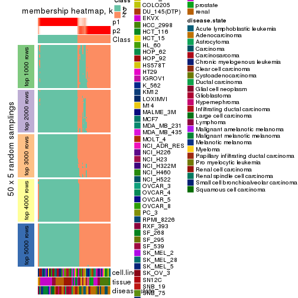</p>

</div>
<div id='tab-MAD-NMF-membership-heatmap-2'>
<pre><code class="r">membership_heatmap(res, k = 3)
</code></pre>

<p></p>

</div>
<div id='tab-MAD-NMF-membership-heatmap-3'>
<pre><code class="r">membership_heatmap(res, k = 4)
</code></pre>

<p></p>

</div>
<div id='tab-MAD-NMF-membership-heatmap-4'>
<pre><code class="r">membership_heatmap(res, k = 5)
</code></pre>

<p></p>

</div>
<div id='tab-MAD-NMF-membership-heatmap-5'>
<pre><code class="r">membership_heatmap(res, k = 6)
</code></pre>

<p></p>

</div>
</div>

As soon as we have had the classes for columns, we can look for signatures
which are significantly different between classes which can be candidate marks
for certain classes. Following are the heatmaps for signatures.


Signature heatmaps where rows are scaled:


<script>
$( function() {
	$( '#tabs-MAD-NMF-get-signatures' ).tabs();
} );
</script>
<div id='tabs-MAD-NMF-get-signatures'>
<ul>
<li><a href='#tab-MAD-NMF-get-signatures-1'>k = 2</a></li>
<li><a href='#tab-MAD-NMF-get-signatures-2'>k = 3</a></li>
<li><a href='#tab-MAD-NMF-get-signatures-3'>k = 4</a></li>
<li><a href='#tab-MAD-NMF-get-signatures-4'>k = 5</a></li>
<li><a href='#tab-MAD-NMF-get-signatures-5'>k = 6</a></li>
</ul>
<div id='tab-MAD-NMF-get-signatures-1'>
<pre><code class="r">get_signatures(res, k = 2)
</code></pre>

<pre><code>#&gt; Error: The width or height of the raster image is zero, maybe you forget to turn off the
#&gt; previous graphic device or it was corrupted. Run `dev.off()` to close it.
</code></pre>

<p></p>

</div>
<div id='tab-MAD-NMF-get-signatures-2'>
<pre><code class="r">get_signatures(res, k = 3)
</code></pre>

<pre><code>#&gt; Error: The width or height of the raster image is zero, maybe you forget to turn off the
#&gt; previous graphic device or it was corrupted. Run `dev.off()` to close it.
</code></pre>

<p></p>

</div>
<div id='tab-MAD-NMF-get-signatures-3'>
<pre><code class="r">get_signatures(res, k = 4)
</code></pre>

<pre><code>#&gt; Error: The width or height of the raster image is zero, maybe you forget to turn off the
#&gt; previous graphic device or it was corrupted. Run `dev.off()` to close it.
</code></pre>

<p></p>

</div>
<div id='tab-MAD-NMF-get-signatures-4'>
<pre><code class="r">get_signatures(res, k = 5)
</code></pre>

<pre><code>#&gt; Error: The width or height of the raster image is zero, maybe you forget to turn off the
#&gt; previous graphic device or it was corrupted. Run `dev.off()` to close it.
</code></pre>

<p></p>

</div>
<div id='tab-MAD-NMF-get-signatures-5'>
<pre><code class="r">get_signatures(res, k = 6)
</code></pre>

<pre><code>#&gt; Error: The width or height of the raster image is zero, maybe you forget to turn off the
#&gt; previous graphic device or it was corrupted. Run `dev.off()` to close it.
</code></pre>

<p></p>

</div>
</div>


Signature heatmaps where rows are not scaled:


<script>
$( function() {
	$( '#tabs-MAD-NMF-get-signatures-no-scale' ).tabs();
} );
</script>
<div id='tabs-MAD-NMF-get-signatures-no-scale'>
<ul>
<li><a href='#tab-MAD-NMF-get-signatures-no-scale-1'>k = 2</a></li>
<li><a href='#tab-MAD-NMF-get-signatures-no-scale-2'>k = 3</a></li>
<li><a href='#tab-MAD-NMF-get-signatures-no-scale-3'>k = 4</a></li>
<li><a href='#tab-MAD-NMF-get-signatures-no-scale-4'>k = 5</a></li>
<li><a href='#tab-MAD-NMF-get-signatures-no-scale-5'>k = 6</a></li>
</ul>
<div id='tab-MAD-NMF-get-signatures-no-scale-1'>
<pre><code class="r">get_signatures(res, k = 2, scale_rows = FALSE)
</code></pre>

<p></p>

</div>
<div id='tab-MAD-NMF-get-signatures-no-scale-2'>
<pre><code class="r">get_signatures(res, k = 3, scale_rows = FALSE)
</code></pre>

<p></p>

</div>
<div id='tab-MAD-NMF-get-signatures-no-scale-3'>
<pre><code class="r">get_signatures(res, k = 4, scale_rows = FALSE)
</code></pre>

<pre><code>#&gt; Error in mat[ceiling(1:nr/h_ratio), ceiling(1:nc/w_ratio), drop = FALSE]: subscript out of bounds
</code></pre>

<p></p>

</div>
<div id='tab-MAD-NMF-get-signatures-no-scale-4'>
<pre><code class="r">get_signatures(res, k = 5, scale_rows = FALSE)
</code></pre>

<pre><code>#&gt; Error in mat[ceiling(1:nr/h_ratio), ceiling(1:nc/w_ratio), drop = FALSE]: subscript out of bounds
</code></pre>

<p></p>

</div>
<div id='tab-MAD-NMF-get-signatures-no-scale-5'>
<pre><code class="r">get_signatures(res, k = 6, scale_rows = FALSE)
</code></pre>

<p></p>

</div>
</div>


Compare the overlap of signatures from different k:

```r
compare_signatures(res)
```


`get_signature()` returns a data frame invisibly. TO get the list of signatures, the function
call should be assigned to a variable explicitly. In following code, if `plot` argument is set
to `FALSE`, no heatmap is plotted while only the differential analysis is performed.

```r
# code only for demonstration
tb = get_signature(res, k = ..., plot = FALSE)
```

An example of the output of `tb` is:

```
#>   which_row         fdr    mean_1    mean_2 scaled_mean_1 scaled_mean_2 km
#> 1        38 0.042760348  8.373488  9.131774    -0.5533452     0.5164555  1
#> 2        40 0.018707592  7.106213  8.469186    -0.6173731     0.5762149  1
#> 3        55 0.019134737 10.221463 11.207825    -0.6159697     0.5749050  1
#> 4        59 0.006059896  5.921854  7.869574    -0.6899429     0.6439467  1
#> 5        60 0.018055526  8.928898 10.211722    -0.6204761     0.5791110  1
#> 6        98 0.009384629 15.714769 14.887706     0.6635654    -0.6193277  2
...
```

The columns in `tb` are:

1. `which_row`: row indices corresponding to the input matrix.
2. `fdr`: FDR for the differential test. 
3. `mean_x`: The mean value in group x.
4. `scaled_mean_x`: The mean value in group x after rows are scaled.
5. `km`: Row groups if k-means clustering is applied to rows.


UMAP plot which shows how samples are separated.


<script>
$( function() {
	$( '#tabs-MAD-NMF-dimension-reduction' ).tabs();
} );
</script>
<div id='tabs-MAD-NMF-dimension-reduction'>
<ul>
<li><a href='#tab-MAD-NMF-dimension-reduction-1'>k = 2</a></li>
<li><a href='#tab-MAD-NMF-dimension-reduction-2'>k = 3</a></li>
<li><a href='#tab-MAD-NMF-dimension-reduction-3'>k = 4</a></li>
<li><a href='#tab-MAD-NMF-dimension-reduction-4'>k = 5</a></li>
<li><a href='#tab-MAD-NMF-dimension-reduction-5'>k = 6</a></li>
</ul>
<div id='tab-MAD-NMF-dimension-reduction-1'>
<pre><code class="r">dimension_reduction(res, k = 2, method = &quot;UMAP&quot;)
</code></pre>

<p></p>

</div>
<div id='tab-MAD-NMF-dimension-reduction-2'>
<pre><code class="r">dimension_reduction(res, k = 3, method = &quot;UMAP&quot;)
</code></pre>

<p></p>

</div>
<div id='tab-MAD-NMF-dimension-reduction-3'>
<pre><code class="r">dimension_reduction(res, k = 4, method = &quot;UMAP&quot;)
</code></pre>

<p></p>

</div>
<div id='tab-MAD-NMF-dimension-reduction-4'>
<pre><code class="r">dimension_reduction(res, k = 5, method = &quot;UMAP&quot;)
</code></pre>

<p></p>

</div>
<div id='tab-MAD-NMF-dimension-reduction-5'>
<pre><code class="r">dimension_reduction(res, k = 6, method = &quot;UMAP&quot;)
</code></pre>

<p></p>

</div>
</div>


Following heatmap shows how subgroups are split when increasing `k`:

```r
collect_classes(res)
```


Test correlation between subgroups and known annotations. If the known
annotation is numeric, one-way ANOVA test is applied, and if the known
annotation is discrete, chi-squared contingency table test is applied.

```r
test_to_known_factors(res)
```

```
#>           n cell.line(p) tissue(p) disease.state(p) k
#> MAD:NMF 167     5.64e-13  1.51e-20         2.86e-12 2
#> MAD:NMF 166     1.21e-23  6.96e-43         3.18e-29 3
#> MAD:NMF 173     5.08e-36  2.00e-68         3.25e-48 4
#> MAD:NMF 172     6.52e-46  4.34e-89         2.06e-53 5
#> MAD:NMF 161     1.62e-53 1.22e-109         8.02e-66 6
```


If matrix rows can be associated to genes, consider to use `GO_Enrichment(res,
...)` to perform function enrichment for the signature genes.


 

---------------------------------------------------


### ATC:hclust*


The object with results only for a single top-value method and a single partition method 
can be extracted as:

```r
res = res_list["ATC", "hclust"]
# you can also extract it by
# res = res_list["ATC:hclust"]
```

A summary of `res` and all the functions that can be applied to it:

```r
res
```

```
#> A 'ConsensusPartition' object with k = 2, 3, 4, 5, 6.
#>   On a matrix with 51941 rows and 174 columns.
#>   Top rows (1000, 2000, 3000, 4000, 5000) are extracted by 'ATC' method.
#>   Subgroups are detected by 'hclust' method.
#>   Performed in total 1250 partitions by row resampling.
#>   Best k for subgroups seems to be 6.
#> 
#> Following methods can be applied to this 'ConsensusPartition' object:
#>  [1] "cola_report"             "collect_classes"         "collect_plots"          
#>  [4] "collect_stats"           "colnames"                "compare_signatures"     
#>  [7] "consensus_heatmap"       "dimension_reduction"     "functional_enrichment"  
#> [10] "get_anno_col"            "get_anno"                "get_classes"            
#> [13] "get_consensus"           "get_matrix"              "get_membership"         
#> [16] "get_param"               "get_signatures"          "get_stats"              
#> [19] "is_best_k"               "is_stable_k"             "membership_heatmap"     
#> [22] "ncol"                    "nrow"                    "plot_ecdf"              
#> [25] "rownames"                "select_partition_number" "show"                   
#> [28] "suggest_best_k"          "test_to_known_factors"
```

`collect_plots()` function collects all the plots made from `res` for all `k` (number of partitions)
into one single page to provide an easy and fast comparison between different `k`.

```r
collect_plots(res)
```


The plots are:

- The first row: a plot of the ECDF (Empirical cumulative distribution
  function) curves of the consensus matrix for each `k` and the heatmap of
  predicted classes for each `k`.
- The second row: heatmaps of the consensus matrix for each `k`.
- The third row: heatmaps of the membership matrix for each `k`.
- The fouth row: heatmaps of the signatures for each `k`.

All the plots in panels can be made by individual functions and they are
plotted later in this section.

`select_partition_number()` produces several plots showing different
statistics for choosing "optimized" `k`. There are following statistics:

- ECDF curves of the consensus matrix for each `k`;
- 1-PAC. [The PAC
  score](https://en.wikipedia.org/wiki/Consensus_clustering#Over-interpretation_potential_of_consensus_clustering)
  measures the proportion of the ambiguous subgrouping.
- Mean silhouette score.
- Concordance. The mean probability of fiting the consensus class ids in all
  partitions.
- Area increased. Denote $A_k$ as the area under the ECDF curve for current
  `k`, the area increased is defined as $A_k - A_{k-1}$.
- Rand index. The percent of pairs of samples that are both in a same cluster
  or both are not in a same cluster in the partition of k and k-1.
- Jaccard index. The ratio of pairs of samples are both in a same cluster in
  the partition of k and k-1 and the pairs of samples are both in a same
  cluster in the partition k or k-1.

The detailed explanations of these statistics can be found in [the cola
vignette](http://bioconductor.org/packages/devel/bioc/vignettes/cola/inst/doc/cola.html#toc_13).

Generally speaking, lower PAC score, higher mean silhouette score or higher
concordance corresponds to better partition. Rand index and Jaccard index
measure how similar the current partition is compared to partition with `k-1`.
If they are too similar, we won't accept `k` is better than `k-1`.

```r
select_partition_number(res)
```


The numeric values for all these statistics can be obtained by `get_stats()`.

```r
get_stats(res)
```

```
#>   k 1-PAC mean_silhouette concordance area_increased  Rand Jaccard
#> 2 2 0.733           0.938       0.942         0.3174 0.614   0.614
#> 3 3 0.702           0.881       0.939         0.4317 0.970   0.951
#> 4 4 0.609           0.829       0.879         0.2985 0.778   0.624
#> 5 5 0.795           0.849       0.912         0.1962 0.837   0.615
#> 6 6 0.902           0.951       0.974         0.0533 0.952   0.844
```

`suggest_best_k()` suggests the best $k$ based on these statistics. The rules are as follows:

- All $k$ with Jaccard index larger than 0.95 are removed because the increase of
  the partition number does not provides enough extra information. If all $k$ are removed,
  the best $k$ is assigned by `NA`.
- For $k$ with 1-PAC larger than 0.9, the maximal $k$ is taken as the "best k". Other $k$ is called "optional k".
- If it does not fit the second rule. The $k$ with the highest vote of highest
  1-PAC, mean silhouette and concordance is taken as the "best k".

```r
suggest_best_k(res)
```

```
#> [1] 6
```


Following shows the table of the partitions (You need to click the **show/hide
code output** link to see it). The membership matrix (columns with name `p*`)
is inferred by
[`clue::cl_consensus()`](https://www.rdocumentation.org/link/cl_consensus?package=clue)
function with the `SE` method. Basically the value in the membership matrix
represents the probability to belong to a certain group. The finall class
label for an item is determined with the group with highest probability it
belongs to.

In `get_classes()` function, the entropy is calculated from the membership
matrix and the silhouette score is calculated from the consensus matrix.


<script>
$( function() {
	$( '#tabs-ATC-hclust-get-classes' ).tabs();
} );
</script>
<div id='tabs-ATC-hclust-get-classes'>
<ul>
<li><a href='#tab-ATC-hclust-get-classes-1'>k = 2</a></li>
<li><a href='#tab-ATC-hclust-get-classes-2'>k = 3</a></li>
<li><a href='#tab-ATC-hclust-get-classes-3'>k = 4</a></li>
<li><a href='#tab-ATC-hclust-get-classes-4'>k = 5</a></li>
<li><a href='#tab-ATC-hclust-get-classes-5'>k = 6</a></li>
</ul>

<div id='tab-ATC-hclust-get-classes-1'>
<p><a id='tab-ATC-hclust-get-classes-1-a' style='color:#0366d6' href='#'>show/hide code output</a></p>
<pre><code class="r">cbind(get_classes(res, k = 2), get_membership(res, k = 2))
</code></pre>

<pre><code>#&gt;           class entropy silhouette    p1    p2
#&gt; GSM803615     2  0.0000      0.767 0.000 1.000
#&gt; GSM803674     2  0.0000      0.767 0.000 1.000
#&gt; GSM803733     2  0.0000      0.767 0.000 1.000
#&gt; GSM803616     2  0.0000      0.767 0.000 1.000
#&gt; GSM803675     2  0.0000      0.767 0.000 1.000
#&gt; GSM803734     2  0.0000      0.767 0.000 1.000
#&gt; GSM803617     2  0.0000      0.767 0.000 1.000
#&gt; GSM803676     2  0.0000      0.767 0.000 1.000
#&gt; GSM803735     2  0.0000      0.767 0.000 1.000
#&gt; GSM803618     2  0.0000      0.767 0.000 1.000
#&gt; GSM803677     2  0.0000      0.767 0.000 1.000
#&gt; GSM803736     2  0.0000      0.767 0.000 1.000
#&gt; GSM803619     2  0.9963      0.521 0.464 0.536
#&gt; GSM803678     2  0.9963      0.521 0.464 0.536
#&gt; GSM803737     2  0.9963      0.521 0.464 0.536
#&gt; GSM803620     2  0.0000      0.767 0.000 1.000
#&gt; GSM803679     2  0.0000      0.767 0.000 1.000
#&gt; GSM803738     2  0.0000      0.767 0.000 1.000
#&gt; GSM803621     1  0.0000      0.995 1.000 0.000
#&gt; GSM803680     1  0.0000      0.995 1.000 0.000
#&gt; GSM803739     1  0.0000      0.995 1.000 0.000
#&gt; GSM803622     1  0.0000      0.995 1.000 0.000
#&gt; GSM803681     1  0.0000      0.995 1.000 0.000
#&gt; GSM803740     1  0.0000      0.995 1.000 0.000
#&gt; GSM803623     2  0.8763      0.831 0.296 0.704
#&gt; GSM803682     2  0.8763      0.831 0.296 0.704
#&gt; GSM803741     2  0.8763      0.831 0.296 0.704
#&gt; GSM803624     1  0.0000      0.995 1.000 0.000
#&gt; GSM803683     1  0.0000      0.995 1.000 0.000
#&gt; GSM803742     1  0.0000      0.995 1.000 0.000
#&gt; GSM803625     1  0.0000      0.995 1.000 0.000
#&gt; GSM803684     1  0.0000      0.995 1.000 0.000
#&gt; GSM803743     1  0.0000      0.995 1.000 0.000
#&gt; GSM803626     1  0.0000      0.995 1.000 0.000
#&gt; GSM803685     1  0.0000      0.995 1.000 0.000
#&gt; GSM803744     1  0.0000      0.995 1.000 0.000
#&gt; GSM803627     1  0.0000      0.995 1.000 0.000
#&gt; GSM803686     1  0.0000      0.995 1.000 0.000
#&gt; GSM803745     1  0.0000      0.995 1.000 0.000
#&gt; GSM803628     1  0.0000      0.995 1.000 0.000
#&gt; GSM803687     1  0.0000      0.995 1.000 0.000
#&gt; GSM803746     1  0.0000      0.995 1.000 0.000
#&gt; GSM803629     1  0.0000      0.995 1.000 0.000
#&gt; GSM803688     1  0.0000      0.995 1.000 0.000
#&gt; GSM803747     1  0.0000      0.995 1.000 0.000
#&gt; GSM803630     1  0.0000      0.995 1.000 0.000
#&gt; GSM803689     1  0.0000      0.995 1.000 0.000
#&gt; GSM803748     1  0.0000      0.995 1.000 0.000
#&gt; GSM803631     1  0.0000      0.995 1.000 0.000
#&gt; GSM803690     1  0.0000      0.995 1.000 0.000
#&gt; GSM803749     1  0.0000      0.995 1.000 0.000
#&gt; GSM803632     1  0.0000      0.995 1.000 0.000
#&gt; GSM803691     1  0.0000      0.995 1.000 0.000
#&gt; GSM803750     1  0.0000      0.995 1.000 0.000
#&gt; GSM803633     2  0.8763      0.831 0.296 0.704
#&gt; GSM803692     2  0.8763      0.831 0.296 0.704
#&gt; GSM803751     2  0.8763      0.831 0.296 0.704
#&gt; GSM803634     2  0.8763      0.831 0.296 0.704
#&gt; GSM803693     2  0.8763      0.831 0.296 0.704
#&gt; GSM803752     2  0.8763      0.831 0.296 0.704
#&gt; GSM803635     2  0.9170      0.790 0.332 0.668
#&gt; GSM803694     2  0.9170      0.790 0.332 0.668
#&gt; GSM803753     2  0.9170      0.790 0.332 0.668
#&gt; GSM803636     2  0.8955      0.815 0.312 0.688
#&gt; GSM803695     2  0.8955      0.815 0.312 0.688
#&gt; GSM803754     2  0.8955      0.815 0.312 0.688
#&gt; GSM803637     2  0.8763      0.831 0.296 0.704
#&gt; GSM803696     2  0.8763      0.831 0.296 0.704
#&gt; GSM803755     2  0.8763      0.831 0.296 0.704
#&gt; GSM803638     2  0.8763      0.831 0.296 0.704
#&gt; GSM803697     2  0.8763      0.831 0.296 0.704
#&gt; GSM803756     2  0.8763      0.831 0.296 0.704
#&gt; GSM803639     2  0.8763      0.831 0.296 0.704
#&gt; GSM803698     2  0.8763      0.831 0.296 0.704
#&gt; GSM803757     2  0.8763      0.831 0.296 0.704
#&gt; GSM803640     1  0.0000      0.995 1.000 0.000
#&gt; GSM803699     1  0.0000      0.995 1.000 0.000
#&gt; GSM803758     1  0.0000      0.995 1.000 0.000
#&gt; GSM803641     1  0.0000      0.995 1.000 0.000
#&gt; GSM803700     1  0.0000      0.995 1.000 0.000
#&gt; GSM803759     1  0.0000      0.995 1.000 0.000
#&gt; GSM803642     1  0.0000      0.995 1.000 0.000
#&gt; GSM803701     1  0.0000      0.995 1.000 0.000
#&gt; GSM803760     1  0.0000      0.995 1.000 0.000
#&gt; GSM803643     1  0.0000      0.995 1.000 0.000
#&gt; GSM803702     1  0.0000      0.995 1.000 0.000
#&gt; GSM803644     1  0.0000      0.995 1.000 0.000
#&gt; GSM803703     1  0.0000      0.995 1.000 0.000
#&gt; GSM803761     1  0.0000      0.995 1.000 0.000
#&gt; GSM803645     1  0.0000      0.995 1.000 0.000
#&gt; GSM803704     1  0.0000      0.995 1.000 0.000
#&gt; GSM803762     1  0.0000      0.995 1.000 0.000
#&gt; GSM803646     1  0.0000      0.995 1.000 0.000
#&gt; GSM803705     1  0.0000      0.995 1.000 0.000
#&gt; GSM803763     1  0.0000      0.995 1.000 0.000
#&gt; GSM803647     1  0.0000      0.995 1.000 0.000
#&gt; GSM803706     1  0.0000      0.995 1.000 0.000
#&gt; GSM803764     1  0.0000      0.995 1.000 0.000
#&gt; GSM803648     1  0.0000      0.995 1.000 0.000
#&gt; GSM803707     1  0.0000      0.995 1.000 0.000
#&gt; GSM803765     1  0.0000      0.995 1.000 0.000
#&gt; GSM803649     1  0.0000      0.995 1.000 0.000
#&gt; GSM803708     1  0.0000      0.995 1.000 0.000
#&gt; GSM803766     1  0.0000      0.995 1.000 0.000
#&gt; GSM803650     1  0.0000      0.995 1.000 0.000
#&gt; GSM803709     1  0.0000      0.995 1.000 0.000
#&gt; GSM803767     1  0.0000      0.995 1.000 0.000
#&gt; GSM803651     1  0.0000      0.995 1.000 0.000
#&gt; GSM803710     1  0.0000      0.995 1.000 0.000
#&gt; GSM803768     1  0.0000      0.995 1.000 0.000
#&gt; GSM803652     1  0.0000      0.995 1.000 0.000
#&gt; GSM803711     1  0.0000      0.995 1.000 0.000
#&gt; GSM803653     1  0.1414      0.977 0.980 0.020
#&gt; GSM803712     1  0.1414      0.977 0.980 0.020
#&gt; GSM803769     1  0.1414      0.977 0.980 0.020
#&gt; GSM803654     1  0.0938      0.985 0.988 0.012
#&gt; GSM803713     1  0.0938      0.985 0.988 0.012
#&gt; GSM803770     1  0.0938      0.985 0.988 0.012
#&gt; GSM803655     1  0.1414      0.977 0.980 0.020
#&gt; GSM803714     1  0.1414      0.977 0.980 0.020
#&gt; GSM803771     1  0.1414      0.977 0.980 0.020
#&gt; GSM803656     1  0.1414      0.977 0.980 0.020
#&gt; GSM803715     1  0.1414      0.977 0.980 0.020
#&gt; GSM803772     1  0.1414      0.977 0.980 0.020
#&gt; GSM803657     1  0.1414      0.977 0.980 0.020
#&gt; GSM803716     1  0.1414      0.977 0.980 0.020
#&gt; GSM803773     1  0.1414      0.977 0.980 0.020
#&gt; GSM803658     1  0.0938      0.985 0.988 0.012
#&gt; GSM803717     1  0.0938      0.985 0.988 0.012
#&gt; GSM803774     1  0.0938      0.985 0.988 0.012
#&gt; GSM803659     1  0.0938      0.985 0.988 0.012
#&gt; GSM803718     1  0.0938      0.985 0.988 0.012
#&gt; GSM803775     1  0.0938      0.985 0.988 0.012
#&gt; GSM803660     1  0.0000      0.995 1.000 0.000
#&gt; GSM803719     1  0.0000      0.995 1.000 0.000
#&gt; GSM803776     1  0.0000      0.995 1.000 0.000
#&gt; GSM803661     1  0.0000      0.995 1.000 0.000
#&gt; GSM803720     1  0.0000      0.995 1.000 0.000
#&gt; GSM803777     1  0.0000      0.995 1.000 0.000
#&gt; GSM803662     1  0.0000      0.995 1.000 0.000
#&gt; GSM803732     1  0.0000      0.995 1.000 0.000
#&gt; GSM803778     1  0.0000      0.995 1.000 0.000
#&gt; GSM803663     1  0.0000      0.995 1.000 0.000
#&gt; GSM803721     1  0.0000      0.995 1.000 0.000
#&gt; GSM803779     1  0.0000      0.995 1.000 0.000
#&gt; GSM803664     1  0.2423      0.952 0.960 0.040
#&gt; GSM803722     1  0.2423      0.952 0.960 0.040
#&gt; GSM803780     1  0.2423      0.952 0.960 0.040
#&gt; GSM803665     1  0.0000      0.995 1.000 0.000
#&gt; GSM803723     1  0.0000      0.995 1.000 0.000
#&gt; GSM803781     1  0.0000      0.995 1.000 0.000
#&gt; GSM803666     1  0.0000      0.995 1.000 0.000
#&gt; GSM803724     1  0.0000      0.995 1.000 0.000
#&gt; GSM803782     1  0.0000      0.995 1.000 0.000
#&gt; GSM803667     1  0.0000      0.995 1.000 0.000
#&gt; GSM803725     1  0.0000      0.995 1.000 0.000
#&gt; GSM803783     1  0.0000      0.995 1.000 0.000
#&gt; GSM803668     1  0.0000      0.995 1.000 0.000
#&gt; GSM803726     1  0.0000      0.995 1.000 0.000
#&gt; GSM803784     1  0.0000      0.995 1.000 0.000
#&gt; GSM803669     1  0.0000      0.995 1.000 0.000
#&gt; GSM803727     1  0.0000      0.995 1.000 0.000
#&gt; GSM803670     1  0.0000      0.995 1.000 0.000
#&gt; GSM803728     1  0.0000      0.995 1.000 0.000
#&gt; GSM803785     1  0.0000      0.995 1.000 0.000
#&gt; GSM803671     1  0.0000      0.995 1.000 0.000
#&gt; GSM803729     1  0.0000      0.995 1.000 0.000
#&gt; GSM803786     1  0.0000      0.995 1.000 0.000
#&gt; GSM803672     1  0.0000      0.995 1.000 0.000
#&gt; GSM803730     1  0.0000      0.995 1.000 0.000
#&gt; GSM803787     1  0.0000      0.995 1.000 0.000
#&gt; GSM803673     2  0.8813      0.828 0.300 0.700
#&gt; GSM803731     2  0.8813      0.828 0.300 0.700
#&gt; GSM803788     2  0.8813      0.828 0.300 0.700
</code></pre>

<script>
$('#tab-ATC-hclust-get-classes-1-a').parent().next().next().hide();
$('#tab-ATC-hclust-get-classes-1-a').click(function(){
  $('#tab-ATC-hclust-get-classes-1-a').parent().next().next().toggle();
  return(false);
});
</script>
</div>

<div id='tab-ATC-hclust-get-classes-2'>
<p><a id='tab-ATC-hclust-get-classes-2-a' style='color:#0366d6' href='#'>show/hide code output</a></p>
<pre><code class="r">cbind(get_classes(res, k = 3), get_membership(res, k = 3))
</code></pre>

<pre><code>#&gt;           class entropy silhouette    p1    p2    p3
#&gt; GSM803615     3  0.0000      1.000 0.000 0.000 1.000
#&gt; GSM803674     3  0.0000      1.000 0.000 0.000 1.000
#&gt; GSM803733     3  0.0000      1.000 0.000 0.000 1.000
#&gt; GSM803616     3  0.0000      1.000 0.000 0.000 1.000
#&gt; GSM803675     3  0.0000      1.000 0.000 0.000 1.000
#&gt; GSM803734     3  0.0000      1.000 0.000 0.000 1.000
#&gt; GSM803617     3  0.0000      1.000 0.000 0.000 1.000
#&gt; GSM803676     3  0.0000      1.000 0.000 0.000 1.000
#&gt; GSM803735     3  0.0000      1.000 0.000 0.000 1.000
#&gt; GSM803618     3  0.0000      1.000 0.000 0.000 1.000
#&gt; GSM803677     3  0.0000      1.000 0.000 0.000 1.000
#&gt; GSM803736     3  0.0000      1.000 0.000 0.000 1.000
#&gt; GSM803619     2  0.5627      0.671 0.188 0.780 0.032
#&gt; GSM803678     2  0.5627      0.671 0.188 0.780 0.032
#&gt; GSM803737     2  0.5627      0.671 0.188 0.780 0.032
#&gt; GSM803620     3  0.0000      1.000 0.000 0.000 1.000
#&gt; GSM803679     3  0.0000      1.000 0.000 0.000 1.000
#&gt; GSM803738     3  0.0000      1.000 0.000 0.000 1.000
#&gt; GSM803621     1  0.0000      0.916 1.000 0.000 0.000
#&gt; GSM803680     1  0.0000      0.916 1.000 0.000 0.000
#&gt; GSM803739     1  0.0000      0.916 1.000 0.000 0.000
#&gt; GSM803622     1  0.0000      0.916 1.000 0.000 0.000
#&gt; GSM803681     1  0.0000      0.916 1.000 0.000 0.000
#&gt; GSM803740     1  0.0000      0.916 1.000 0.000 0.000
#&gt; GSM803623     2  0.0000      0.953 0.000 1.000 0.000
#&gt; GSM803682     2  0.0000      0.953 0.000 1.000 0.000
#&gt; GSM803741     2  0.0000      0.953 0.000 1.000 0.000
#&gt; GSM803624     1  0.4654      0.773 0.792 0.208 0.000
#&gt; GSM803683     1  0.4654      0.773 0.792 0.208 0.000
#&gt; GSM803742     1  0.4654      0.773 0.792 0.208 0.000
#&gt; GSM803625     1  0.0000      0.916 1.000 0.000 0.000
#&gt; GSM803684     1  0.0000      0.916 1.000 0.000 0.000
#&gt; GSM803743     1  0.0000      0.916 1.000 0.000 0.000
#&gt; GSM803626     1  0.0592      0.915 0.988 0.012 0.000
#&gt; GSM803685     1  0.0000      0.916 1.000 0.000 0.000
#&gt; GSM803744     1  0.0592      0.915 0.988 0.012 0.000
#&gt; GSM803627     1  0.0000      0.916 1.000 0.000 0.000
#&gt; GSM803686     1  0.0000      0.916 1.000 0.000 0.000
#&gt; GSM803745     1  0.0000      0.916 1.000 0.000 0.000
#&gt; GSM803628     1  0.0000      0.916 1.000 0.000 0.000
#&gt; GSM803687     1  0.0000      0.916 1.000 0.000 0.000
#&gt; GSM803746     1  0.0000      0.916 1.000 0.000 0.000
#&gt; GSM803629     1  0.0000      0.916 1.000 0.000 0.000
#&gt; GSM803688     1  0.0000      0.916 1.000 0.000 0.000
#&gt; GSM803747     1  0.0000      0.916 1.000 0.000 0.000
#&gt; GSM803630     1  0.0000      0.916 1.000 0.000 0.000
#&gt; GSM803689     1  0.0000      0.916 1.000 0.000 0.000
#&gt; GSM803748     1  0.0000      0.916 1.000 0.000 0.000
#&gt; GSM803631     1  0.0000      0.916 1.000 0.000 0.000
#&gt; GSM803690     1  0.0000      0.916 1.000 0.000 0.000
#&gt; GSM803749     1  0.0000      0.916 1.000 0.000 0.000
#&gt; GSM803632     1  0.0000      0.916 1.000 0.000 0.000
#&gt; GSM803691     1  0.0000      0.916 1.000 0.000 0.000
#&gt; GSM803750     1  0.0000      0.916 1.000 0.000 0.000
#&gt; GSM803633     2  0.0000      0.953 0.000 1.000 0.000
#&gt; GSM803692     2  0.0000      0.953 0.000 1.000 0.000
#&gt; GSM803751     2  0.0000      0.953 0.000 1.000 0.000
#&gt; GSM803634     2  0.0000      0.953 0.000 1.000 0.000
#&gt; GSM803693     2  0.0000      0.953 0.000 1.000 0.000
#&gt; GSM803752     2  0.0000      0.953 0.000 1.000 0.000
#&gt; GSM803635     2  0.1411      0.918 0.036 0.964 0.000
#&gt; GSM803694     2  0.1411      0.918 0.036 0.964 0.000
#&gt; GSM803753     2  0.1411      0.918 0.036 0.964 0.000
#&gt; GSM803636     2  0.0747      0.941 0.016 0.984 0.000
#&gt; GSM803695     2  0.0747      0.941 0.016 0.984 0.000
#&gt; GSM803754     2  0.0747      0.941 0.016 0.984 0.000
#&gt; GSM803637     2  0.0000      0.953 0.000 1.000 0.000
#&gt; GSM803696     2  0.0000      0.953 0.000 1.000 0.000
#&gt; GSM803755     2  0.0000      0.953 0.000 1.000 0.000
#&gt; GSM803638     2  0.0000      0.953 0.000 1.000 0.000
#&gt; GSM803697     2  0.0000      0.953 0.000 1.000 0.000
#&gt; GSM803756     2  0.0000      0.953 0.000 1.000 0.000
#&gt; GSM803639     2  0.0000      0.953 0.000 1.000 0.000
#&gt; GSM803698     2  0.0000      0.953 0.000 1.000 0.000
#&gt; GSM803757     2  0.0000      0.953 0.000 1.000 0.000
#&gt; GSM803640     1  0.0000      0.916 1.000 0.000 0.000
#&gt; GSM803699     1  0.0000      0.916 1.000 0.000 0.000
#&gt; GSM803758     1  0.0000      0.916 1.000 0.000 0.000
#&gt; GSM803641     1  0.0000      0.916 1.000 0.000 0.000
#&gt; GSM803700     1  0.0000      0.916 1.000 0.000 0.000
#&gt; GSM803759     1  0.0000      0.916 1.000 0.000 0.000
#&gt; GSM803642     1  0.0000      0.916 1.000 0.000 0.000
#&gt; GSM803701     1  0.0000      0.916 1.000 0.000 0.000
#&gt; GSM803760     1  0.0000      0.916 1.000 0.000 0.000
#&gt; GSM803643     1  0.0000      0.916 1.000 0.000 0.000
#&gt; GSM803702     1  0.0000      0.916 1.000 0.000 0.000
#&gt; GSM803644     1  0.0000      0.916 1.000 0.000 0.000
#&gt; GSM803703     1  0.0000      0.916 1.000 0.000 0.000
#&gt; GSM803761     1  0.0000      0.916 1.000 0.000 0.000
#&gt; GSM803645     1  0.0000      0.916 1.000 0.000 0.000
#&gt; GSM803704     1  0.0000      0.916 1.000 0.000 0.000
#&gt; GSM803762     1  0.0000      0.916 1.000 0.000 0.000
#&gt; GSM803646     1  0.1964      0.891 0.944 0.056 0.000
#&gt; GSM803705     1  0.1964      0.891 0.944 0.056 0.000
#&gt; GSM803763     1  0.1964      0.891 0.944 0.056 0.000
#&gt; GSM803647     1  0.0000      0.916 1.000 0.000 0.000
#&gt; GSM803706     1  0.0000      0.916 1.000 0.000 0.000
#&gt; GSM803764     1  0.0000      0.916 1.000 0.000 0.000
#&gt; GSM803648     1  0.0747      0.913 0.984 0.016 0.000
#&gt; GSM803707     1  0.0747      0.913 0.984 0.016 0.000
#&gt; GSM803765     1  0.0747      0.913 0.984 0.016 0.000
#&gt; GSM803649     1  0.0747      0.913 0.984 0.016 0.000
#&gt; GSM803708     1  0.0747      0.913 0.984 0.016 0.000
#&gt; GSM803766     1  0.0747      0.913 0.984 0.016 0.000
#&gt; GSM803650     1  0.0000      0.916 1.000 0.000 0.000
#&gt; GSM803709     1  0.0000      0.916 1.000 0.000 0.000
#&gt; GSM803767     1  0.0000      0.916 1.000 0.000 0.000
#&gt; GSM803651     1  0.0000      0.916 1.000 0.000 0.000
#&gt; GSM803710     1  0.0000      0.916 1.000 0.000 0.000
#&gt; GSM803768     1  0.0000      0.916 1.000 0.000 0.000
#&gt; GSM803652     1  0.0000      0.916 1.000 0.000 0.000
#&gt; GSM803711     1  0.0000      0.916 1.000 0.000 0.000
#&gt; GSM803653     1  0.5621      0.662 0.692 0.308 0.000
#&gt; GSM803712     1  0.5621      0.662 0.692 0.308 0.000
#&gt; GSM803769     1  0.5621      0.662 0.692 0.308 0.000
#&gt; GSM803654     1  0.5621      0.662 0.692 0.308 0.000
#&gt; GSM803713     1  0.5621      0.662 0.692 0.308 0.000
#&gt; GSM803770     1  0.5621      0.662 0.692 0.308 0.000
#&gt; GSM803655     1  0.5621      0.662 0.692 0.308 0.000
#&gt; GSM803714     1  0.5621      0.662 0.692 0.308 0.000
#&gt; GSM803771     1  0.5621      0.662 0.692 0.308 0.000
#&gt; GSM803656     1  0.5621      0.662 0.692 0.308 0.000
#&gt; GSM803715     1  0.5621      0.662 0.692 0.308 0.000
#&gt; GSM803772     1  0.5621      0.662 0.692 0.308 0.000
#&gt; GSM803657     1  0.5621      0.662 0.692 0.308 0.000
#&gt; GSM803716     1  0.5621      0.662 0.692 0.308 0.000
#&gt; GSM803773     1  0.5621      0.662 0.692 0.308 0.000
#&gt; GSM803658     1  0.5621      0.662 0.692 0.308 0.000
#&gt; GSM803717     1  0.5621      0.662 0.692 0.308 0.000
#&gt; GSM803774     1  0.5621      0.662 0.692 0.308 0.000
#&gt; GSM803659     1  0.5621      0.662 0.692 0.308 0.000
#&gt; GSM803718     1  0.5621      0.662 0.692 0.308 0.000
#&gt; GSM803775     1  0.5621      0.662 0.692 0.308 0.000
#&gt; GSM803660     1  0.0747      0.913 0.984 0.016 0.000
#&gt; GSM803719     1  0.0747      0.913 0.984 0.016 0.000
#&gt; GSM803776     1  0.0747      0.913 0.984 0.016 0.000
#&gt; GSM803661     1  0.4654      0.773 0.792 0.208 0.000
#&gt; GSM803720     1  0.4654      0.773 0.792 0.208 0.000
#&gt; GSM803777     1  0.4654      0.773 0.792 0.208 0.000
#&gt; GSM803662     1  0.0000      0.916 1.000 0.000 0.000
#&gt; GSM803732     1  0.0000      0.916 1.000 0.000 0.000
#&gt; GSM803778     1  0.0000      0.916 1.000 0.000 0.000
#&gt; GSM803663     1  0.0747      0.913 0.984 0.016 0.000
#&gt; GSM803721     1  0.0747      0.913 0.984 0.016 0.000
#&gt; GSM803779     1  0.0747      0.913 0.984 0.016 0.000
#&gt; GSM803664     1  0.5760      0.631 0.672 0.328 0.000
#&gt; GSM803722     1  0.5760      0.631 0.672 0.328 0.000
#&gt; GSM803780     1  0.5760      0.631 0.672 0.328 0.000
#&gt; GSM803665     1  0.4235      0.802 0.824 0.176 0.000
#&gt; GSM803723     1  0.4235      0.802 0.824 0.176 0.000
#&gt; GSM803781     1  0.4235      0.802 0.824 0.176 0.000
#&gt; GSM803666     1  0.0592      0.915 0.988 0.012 0.000
#&gt; GSM803724     1  0.0592      0.915 0.988 0.012 0.000
#&gt; GSM803782     1  0.0592      0.915 0.988 0.012 0.000
#&gt; GSM803667     1  0.0592      0.915 0.988 0.012 0.000
#&gt; GSM803725     1  0.0592      0.915 0.988 0.012 0.000
#&gt; GSM803783     1  0.0592      0.915 0.988 0.012 0.000
#&gt; GSM803668     1  0.0592      0.915 0.988 0.012 0.000
#&gt; GSM803726     1  0.0592      0.915 0.988 0.012 0.000
#&gt; GSM803784     1  0.0592      0.915 0.988 0.012 0.000
#&gt; GSM803669     1  0.0592      0.915 0.988 0.012 0.000
#&gt; GSM803727     1  0.0592      0.915 0.988 0.012 0.000
#&gt; GSM803670     1  0.0592      0.915 0.988 0.012 0.000
#&gt; GSM803728     1  0.0592      0.915 0.988 0.012 0.000
#&gt; GSM803785     1  0.0592      0.915 0.988 0.012 0.000
#&gt; GSM803671     1  0.0592      0.915 0.988 0.012 0.000
#&gt; GSM803729     1  0.0592      0.915 0.988 0.012 0.000
#&gt; GSM803786     1  0.0592      0.915 0.988 0.012 0.000
#&gt; GSM803672     1  0.0592      0.915 0.988 0.012 0.000
#&gt; GSM803730     1  0.0592      0.915 0.988 0.012 0.000
#&gt; GSM803787     1  0.0592      0.915 0.988 0.012 0.000
#&gt; GSM803673     2  0.0237      0.951 0.004 0.996 0.000
#&gt; GSM803731     2  0.0237      0.951 0.004 0.996 0.000
#&gt; GSM803788     2  0.0237      0.951 0.004 0.996 0.000
</code></pre>

<script>
$('#tab-ATC-hclust-get-classes-2-a').parent().next().next().hide();
$('#tab-ATC-hclust-get-classes-2-a').click(function(){
  $('#tab-ATC-hclust-get-classes-2-a').parent().next().next().toggle();
  return(false);
});
</script>
</div>

<div id='tab-ATC-hclust-get-classes-3'>
<p><a id='tab-ATC-hclust-get-classes-3-a' style='color:#0366d6' href='#'>show/hide code output</a></p>
<pre><code class="r">cbind(get_classes(res, k = 4), get_membership(res, k = 4))
</code></pre>

<pre><code>#&gt;           class entropy silhouette    p1    p2    p3    p4
#&gt; GSM803615     4  0.0000      1.000 0.000 0.000 0.000 1.000
#&gt; GSM803674     4  0.0000      1.000 0.000 0.000 0.000 1.000
#&gt; GSM803733     4  0.0000      1.000 0.000 0.000 0.000 1.000
#&gt; GSM803616     4  0.0000      1.000 0.000 0.000 0.000 1.000
#&gt; GSM803675     4  0.0000      1.000 0.000 0.000 0.000 1.000
#&gt; GSM803734     4  0.0000      1.000 0.000 0.000 0.000 1.000
#&gt; GSM803617     4  0.0000      1.000 0.000 0.000 0.000 1.000
#&gt; GSM803676     4  0.0000      1.000 0.000 0.000 0.000 1.000
#&gt; GSM803735     4  0.0000      1.000 0.000 0.000 0.000 1.000
#&gt; GSM803618     4  0.0000      1.000 0.000 0.000 0.000 1.000
#&gt; GSM803677     4  0.0000      1.000 0.000 0.000 0.000 1.000
#&gt; GSM803736     4  0.0000      1.000 0.000 0.000 0.000 1.000
#&gt; GSM803619     3  0.4770     -0.132 0.000 0.288 0.700 0.012
#&gt; GSM803678     3  0.4770     -0.132 0.000 0.288 0.700 0.012
#&gt; GSM803737     3  0.4770     -0.132 0.000 0.288 0.700 0.012
#&gt; GSM803620     4  0.0000      1.000 0.000 0.000 0.000 1.000
#&gt; GSM803679     4  0.0000      1.000 0.000 0.000 0.000 1.000
#&gt; GSM803738     4  0.0000      1.000 0.000 0.000 0.000 1.000
#&gt; GSM803621     1  0.0188      0.883 0.996 0.000 0.004 0.000
#&gt; GSM803680     1  0.0188      0.883 0.996 0.000 0.004 0.000
#&gt; GSM803739     1  0.0188      0.883 0.996 0.000 0.004 0.000
#&gt; GSM803622     1  0.0000      0.884 1.000 0.000 0.000 0.000
#&gt; GSM803681     1  0.0000      0.884 1.000 0.000 0.000 0.000
#&gt; GSM803740     1  0.0000      0.884 1.000 0.000 0.000 0.000
#&gt; GSM803623     2  0.0000      0.978 0.000 1.000 0.000 0.000
#&gt; GSM803682     2  0.0000      0.978 0.000 1.000 0.000 0.000
#&gt; GSM803741     2  0.0000      0.978 0.000 1.000 0.000 0.000
#&gt; GSM803624     3  0.5110      0.785 0.328 0.016 0.656 0.000
#&gt; GSM803683     3  0.5110      0.785 0.328 0.016 0.656 0.000
#&gt; GSM803742     3  0.5110      0.785 0.328 0.016 0.656 0.000
#&gt; GSM803625     1  0.0188      0.883 0.996 0.000 0.004 0.000
#&gt; GSM803684     1  0.0188      0.883 0.996 0.000 0.004 0.000
#&gt; GSM803743     1  0.0188      0.883 0.996 0.000 0.004 0.000
#&gt; GSM803626     1  0.4477      0.474 0.688 0.000 0.312 0.000
#&gt; GSM803685     1  0.0000      0.884 1.000 0.000 0.000 0.000
#&gt; GSM803744     1  0.4477      0.474 0.688 0.000 0.312 0.000
#&gt; GSM803627     1  0.0188      0.883 0.996 0.000 0.004 0.000
#&gt; GSM803686     1  0.0188      0.883 0.996 0.000 0.004 0.000
#&gt; GSM803745     1  0.0188      0.883 0.996 0.000 0.004 0.000
#&gt; GSM803628     1  0.0000      0.884 1.000 0.000 0.000 0.000
#&gt; GSM803687     1  0.0000      0.884 1.000 0.000 0.000 0.000
#&gt; GSM803746     1  0.0000      0.884 1.000 0.000 0.000 0.000
#&gt; GSM803629     1  0.0000      0.884 1.000 0.000 0.000 0.000
#&gt; GSM803688     1  0.0000      0.884 1.000 0.000 0.000 0.000
#&gt; GSM803747     1  0.0000      0.884 1.000 0.000 0.000 0.000
#&gt; GSM803630     1  0.0000      0.884 1.000 0.000 0.000 0.000
#&gt; GSM803689     1  0.0000      0.884 1.000 0.000 0.000 0.000
#&gt; GSM803748     1  0.0000      0.884 1.000 0.000 0.000 0.000
#&gt; GSM803631     1  0.0000      0.884 1.000 0.000 0.000 0.000
#&gt; GSM803690     1  0.0000      0.884 1.000 0.000 0.000 0.000
#&gt; GSM803749     1  0.0000      0.884 1.000 0.000 0.000 0.000
#&gt; GSM803632     1  0.0000      0.884 1.000 0.000 0.000 0.000
#&gt; GSM803691     1  0.0000      0.884 1.000 0.000 0.000 0.000
#&gt; GSM803750     1  0.0000      0.884 1.000 0.000 0.000 0.000
#&gt; GSM803633     2  0.0000      0.978 0.000 1.000 0.000 0.000
#&gt; GSM803692     2  0.0000      0.978 0.000 1.000 0.000 0.000
#&gt; GSM803751     2  0.0000      0.978 0.000 1.000 0.000 0.000
#&gt; GSM803634     2  0.0000      0.978 0.000 1.000 0.000 0.000
#&gt; GSM803693     2  0.0000      0.978 0.000 1.000 0.000 0.000
#&gt; GSM803752     2  0.0000      0.978 0.000 1.000 0.000 0.000
#&gt; GSM803635     2  0.1792      0.929 0.000 0.932 0.068 0.000
#&gt; GSM803694     2  0.1792      0.929 0.000 0.932 0.068 0.000
#&gt; GSM803753     2  0.1792      0.929 0.000 0.932 0.068 0.000
#&gt; GSM803636     2  0.1118      0.959 0.000 0.964 0.036 0.000
#&gt; GSM803695     2  0.1118      0.959 0.000 0.964 0.036 0.000
#&gt; GSM803754     2  0.1118      0.959 0.000 0.964 0.036 0.000
#&gt; GSM803637     2  0.1118      0.960 0.000 0.964 0.036 0.000
#&gt; GSM803696     2  0.1118      0.960 0.000 0.964 0.036 0.000
#&gt; GSM803755     2  0.1118      0.960 0.000 0.964 0.036 0.000
#&gt; GSM803638     2  0.0000      0.978 0.000 1.000 0.000 0.000
#&gt; GSM803697     2  0.0000      0.978 0.000 1.000 0.000 0.000
#&gt; GSM803756     2  0.0000      0.978 0.000 1.000 0.000 0.000
#&gt; GSM803639     2  0.0000      0.978 0.000 1.000 0.000 0.000
#&gt; GSM803698     2  0.0000      0.978 0.000 1.000 0.000 0.000
#&gt; GSM803757     2  0.0000      0.978 0.000 1.000 0.000 0.000
#&gt; GSM803640     1  0.0000      0.884 1.000 0.000 0.000 0.000
#&gt; GSM803699     1  0.0000      0.884 1.000 0.000 0.000 0.000
#&gt; GSM803758     1  0.0000      0.884 1.000 0.000 0.000 0.000
#&gt; GSM803641     1  0.0000      0.884 1.000 0.000 0.000 0.000
#&gt; GSM803700     1  0.0000      0.884 1.000 0.000 0.000 0.000
#&gt; GSM803759     1  0.0000      0.884 1.000 0.000 0.000 0.000
#&gt; GSM803642     1  0.0000      0.884 1.000 0.000 0.000 0.000
#&gt; GSM803701     1  0.0000      0.884 1.000 0.000 0.000 0.000
#&gt; GSM803760     1  0.0000      0.884 1.000 0.000 0.000 0.000
#&gt; GSM803643     1  0.0000      0.884 1.000 0.000 0.000 0.000
#&gt; GSM803702     1  0.0000      0.884 1.000 0.000 0.000 0.000
#&gt; GSM803644     1  0.0000      0.884 1.000 0.000 0.000 0.000
#&gt; GSM803703     1  0.0000      0.884 1.000 0.000 0.000 0.000
#&gt; GSM803761     1  0.0000      0.884 1.000 0.000 0.000 0.000
#&gt; GSM803645     1  0.0000      0.884 1.000 0.000 0.000 0.000
#&gt; GSM803704     1  0.0000      0.884 1.000 0.000 0.000 0.000
#&gt; GSM803762     1  0.0000      0.884 1.000 0.000 0.000 0.000
#&gt; GSM803646     1  0.2480      0.803 0.904 0.008 0.088 0.000
#&gt; GSM803705     1  0.2480      0.803 0.904 0.008 0.088 0.000
#&gt; GSM803763     1  0.2480      0.803 0.904 0.008 0.088 0.000
#&gt; GSM803647     1  0.0000      0.884 1.000 0.000 0.000 0.000
#&gt; GSM803706     1  0.0000      0.884 1.000 0.000 0.000 0.000
#&gt; GSM803764     1  0.0000      0.884 1.000 0.000 0.000 0.000
#&gt; GSM803648     1  0.1022      0.867 0.968 0.000 0.032 0.000
#&gt; GSM803707     1  0.1022      0.867 0.968 0.000 0.032 0.000
#&gt; GSM803765     1  0.1022      0.867 0.968 0.000 0.032 0.000
#&gt; GSM803649     1  0.1022      0.867 0.968 0.000 0.032 0.000
#&gt; GSM803708     1  0.1022      0.867 0.968 0.000 0.032 0.000
#&gt; GSM803766     1  0.1022      0.867 0.968 0.000 0.032 0.000
#&gt; GSM803650     1  0.0000      0.884 1.000 0.000 0.000 0.000
#&gt; GSM803709     1  0.0000      0.884 1.000 0.000 0.000 0.000
#&gt; GSM803767     1  0.0000      0.884 1.000 0.000 0.000 0.000
#&gt; GSM803651     1  0.0000      0.884 1.000 0.000 0.000 0.000
#&gt; GSM803710     1  0.0000      0.884 1.000 0.000 0.000 0.000
#&gt; GSM803768     1  0.0000      0.884 1.000 0.000 0.000 0.000
#&gt; GSM803652     1  0.0000      0.884 1.000 0.000 0.000 0.000
#&gt; GSM803711     1  0.0000      0.884 1.000 0.000 0.000 0.000
#&gt; GSM803653     3  0.6178      0.886 0.228 0.112 0.660 0.000
#&gt; GSM803712     3  0.6178      0.886 0.228 0.112 0.660 0.000
#&gt; GSM803769     3  0.6178      0.886 0.228 0.112 0.660 0.000
#&gt; GSM803654     3  0.6238      0.886 0.236 0.112 0.652 0.000
#&gt; GSM803713     3  0.6238      0.886 0.236 0.112 0.652 0.000
#&gt; GSM803770     3  0.6238      0.886 0.236 0.112 0.652 0.000
#&gt; GSM803655     3  0.6178      0.886 0.228 0.112 0.660 0.000
#&gt; GSM803714     3  0.6178      0.886 0.228 0.112 0.660 0.000
#&gt; GSM803771     3  0.6178      0.886 0.228 0.112 0.660 0.000
#&gt; GSM803656     3  0.6178      0.886 0.228 0.112 0.660 0.000
#&gt; GSM803715     3  0.6178      0.886 0.228 0.112 0.660 0.000
#&gt; GSM803772     3  0.6178      0.886 0.228 0.112 0.660 0.000
#&gt; GSM803657     3  0.6209      0.887 0.232 0.112 0.656 0.000
#&gt; GSM803716     3  0.6209      0.887 0.232 0.112 0.656 0.000
#&gt; GSM803773     3  0.6209      0.887 0.232 0.112 0.656 0.000
#&gt; GSM803658     3  0.6238      0.886 0.236 0.112 0.652 0.000
#&gt; GSM803717     3  0.6238      0.886 0.236 0.112 0.652 0.000
#&gt; GSM803774     3  0.6238      0.886 0.236 0.112 0.652 0.000
#&gt; GSM803659     3  0.6238      0.886 0.236 0.112 0.652 0.000
#&gt; GSM803718     3  0.6238      0.886 0.236 0.112 0.652 0.000
#&gt; GSM803775     3  0.6238      0.886 0.236 0.112 0.652 0.000
#&gt; GSM803660     1  0.1022      0.867 0.968 0.000 0.032 0.000
#&gt; GSM803719     1  0.1022      0.867 0.968 0.000 0.032 0.000
#&gt; GSM803776     1  0.1022      0.867 0.968 0.000 0.032 0.000
#&gt; GSM803661     3  0.5110      0.785 0.328 0.016 0.656 0.000
#&gt; GSM803720     3  0.5110      0.785 0.328 0.016 0.656 0.000
#&gt; GSM803777     3  0.5110      0.785 0.328 0.016 0.656 0.000
#&gt; GSM803662     1  0.0000      0.884 1.000 0.000 0.000 0.000
#&gt; GSM803732     1  0.0000      0.884 1.000 0.000 0.000 0.000
#&gt; GSM803778     1  0.0000      0.884 1.000 0.000 0.000 0.000
#&gt; GSM803663     1  0.1022      0.867 0.968 0.000 0.032 0.000
#&gt; GSM803721     1  0.1022      0.867 0.968 0.000 0.032 0.000
#&gt; GSM803779     1  0.1022      0.867 0.968 0.000 0.032 0.000
#&gt; GSM803664     3  0.6509      0.872 0.228 0.140 0.632 0.000
#&gt; GSM803722     3  0.6509      0.872 0.228 0.140 0.632 0.000
#&gt; GSM803780     3  0.6509      0.872 0.228 0.140 0.632 0.000
#&gt; GSM803665     3  0.4990      0.736 0.352 0.008 0.640 0.000
#&gt; GSM803723     3  0.4990      0.736 0.352 0.008 0.640 0.000
#&gt; GSM803781     3  0.4990      0.736 0.352 0.008 0.640 0.000
#&gt; GSM803666     1  0.4477      0.474 0.688 0.000 0.312 0.000
#&gt; GSM803724     1  0.4477      0.474 0.688 0.000 0.312 0.000
#&gt; GSM803782     1  0.4477      0.474 0.688 0.000 0.312 0.000
#&gt; GSM803667     1  0.4477      0.474 0.688 0.000 0.312 0.000
#&gt; GSM803725     1  0.4477      0.474 0.688 0.000 0.312 0.000
#&gt; GSM803783     1  0.4477      0.474 0.688 0.000 0.312 0.000
#&gt; GSM803668     1  0.4477      0.474 0.688 0.000 0.312 0.000
#&gt; GSM803726     1  0.4477      0.474 0.688 0.000 0.312 0.000
#&gt; GSM803784     1  0.4477      0.474 0.688 0.000 0.312 0.000
#&gt; GSM803669     1  0.4477      0.474 0.688 0.000 0.312 0.000
#&gt; GSM803727     1  0.4477      0.474 0.688 0.000 0.312 0.000
#&gt; GSM803670     1  0.4477      0.474 0.688 0.000 0.312 0.000
#&gt; GSM803728     1  0.4477      0.474 0.688 0.000 0.312 0.000
#&gt; GSM803785     1  0.4477      0.474 0.688 0.000 0.312 0.000
#&gt; GSM803671     1  0.4477      0.474 0.688 0.000 0.312 0.000
#&gt; GSM803729     1  0.4477      0.474 0.688 0.000 0.312 0.000
#&gt; GSM803786     1  0.4477      0.474 0.688 0.000 0.312 0.000
#&gt; GSM803672     1  0.4477      0.474 0.688 0.000 0.312 0.000
#&gt; GSM803730     1  0.4477      0.474 0.688 0.000 0.312 0.000
#&gt; GSM803787     1  0.4477      0.474 0.688 0.000 0.312 0.000
#&gt; GSM803673     2  0.0469      0.974 0.000 0.988 0.012 0.000
#&gt; GSM803731     2  0.0469      0.974 0.000 0.988 0.012 0.000
#&gt; GSM803788     2  0.0469      0.974 0.000 0.988 0.012 0.000
</code></pre>

<script>
$('#tab-ATC-hclust-get-classes-3-a').parent().next().next().hide();
$('#tab-ATC-hclust-get-classes-3-a').click(function(){
  $('#tab-ATC-hclust-get-classes-3-a').parent().next().next().toggle();
  return(false);
});
</script>
</div>

<div id='tab-ATC-hclust-get-classes-4'>
<p><a id='tab-ATC-hclust-get-classes-4-a' style='color:#0366d6' href='#'>show/hide code output</a></p>
<pre><code class="r">cbind(get_classes(res, k = 5), get_membership(res, k = 5))
</code></pre>

<pre><code>#&gt;           class entropy silhouette    p1    p2    p3 p4    p5
#&gt; GSM803615     4  0.0000      1.000 0.000 0.000 0.000  1 0.000
#&gt; GSM803674     4  0.0000      1.000 0.000 0.000 0.000  1 0.000
#&gt; GSM803733     4  0.0000      1.000 0.000 0.000 0.000  1 0.000
#&gt; GSM803616     4  0.0000      1.000 0.000 0.000 0.000  1 0.000
#&gt; GSM803675     4  0.0000      1.000 0.000 0.000 0.000  1 0.000
#&gt; GSM803734     4  0.0000      1.000 0.000 0.000 0.000  1 0.000
#&gt; GSM803617     4  0.0000      1.000 0.000 0.000 0.000  1 0.000
#&gt; GSM803676     4  0.0000      1.000 0.000 0.000 0.000  1 0.000
#&gt; GSM803735     4  0.0000      1.000 0.000 0.000 0.000  1 0.000
#&gt; GSM803618     4  0.0000      1.000 0.000 0.000 0.000  1 0.000
#&gt; GSM803677     4  0.0000      1.000 0.000 0.000 0.000  1 0.000
#&gt; GSM803736     4  0.0000      1.000 0.000 0.000 0.000  1 0.000
#&gt; GSM803619     5  0.0000      1.000 0.000 0.000 0.000  0 1.000
#&gt; GSM803678     5  0.0000      1.000 0.000 0.000 0.000  0 1.000
#&gt; GSM803737     5  0.0000      1.000 0.000 0.000 0.000  0 1.000
#&gt; GSM803620     4  0.0000      1.000 0.000 0.000 0.000  1 0.000
#&gt; GSM803679     4  0.0000      1.000 0.000 0.000 0.000  1 0.000
#&gt; GSM803738     4  0.0000      1.000 0.000 0.000 0.000  1 0.000
#&gt; GSM803621     1  0.0162      0.961 0.996 0.000 0.004  0 0.000
#&gt; GSM803680     1  0.0162      0.961 0.996 0.000 0.004  0 0.000
#&gt; GSM803739     1  0.0162      0.961 0.996 0.000 0.004  0 0.000
#&gt; GSM803622     1  0.0000      0.963 1.000 0.000 0.000  0 0.000
#&gt; GSM803681     1  0.0000      0.963 1.000 0.000 0.000  0 0.000
#&gt; GSM803740     1  0.0000      0.963 1.000 0.000 0.000  0 0.000
#&gt; GSM803623     2  0.0000      0.973 0.000 1.000 0.000  0 0.000
#&gt; GSM803682     2  0.0000      0.973 0.000 1.000 0.000  0 0.000
#&gt; GSM803741     2  0.0000      0.973 0.000 1.000 0.000  0 0.000
#&gt; GSM803624     3  0.4599      0.644 0.020 0.000 0.624  0 0.356
#&gt; GSM803683     3  0.4599      0.644 0.020 0.000 0.624  0 0.356
#&gt; GSM803742     3  0.4599      0.644 0.020 0.000 0.624  0 0.356
#&gt; GSM803625     1  0.0162      0.961 0.996 0.000 0.004  0 0.000
#&gt; GSM803684     1  0.0162      0.961 0.996 0.000 0.004  0 0.000
#&gt; GSM803743     1  0.0162      0.961 0.996 0.000 0.004  0 0.000
#&gt; GSM803626     3  0.0880      0.608 0.032 0.000 0.968  0 0.000
#&gt; GSM803685     1  0.0000      0.963 1.000 0.000 0.000  0 0.000
#&gt; GSM803744     3  0.0880      0.608 0.032 0.000 0.968  0 0.000
#&gt; GSM803627     1  0.0162      0.961 0.996 0.000 0.004  0 0.000
#&gt; GSM803686     1  0.0162      0.961 0.996 0.000 0.004  0 0.000
#&gt; GSM803745     1  0.0162      0.961 0.996 0.000 0.004  0 0.000
#&gt; GSM803628     1  0.0000      0.963 1.000 0.000 0.000  0 0.000
#&gt; GSM803687     1  0.0000      0.963 1.000 0.000 0.000  0 0.000
#&gt; GSM803746     1  0.0000      0.963 1.000 0.000 0.000  0 0.000
#&gt; GSM803629     1  0.0000      0.963 1.000 0.000 0.000  0 0.000
#&gt; GSM803688     1  0.0000      0.963 1.000 0.000 0.000  0 0.000
#&gt; GSM803747     1  0.0000      0.963 1.000 0.000 0.000  0 0.000
#&gt; GSM803630     1  0.0000      0.963 1.000 0.000 0.000  0 0.000
#&gt; GSM803689     1  0.0000      0.963 1.000 0.000 0.000  0 0.000
#&gt; GSM803748     1  0.0000      0.963 1.000 0.000 0.000  0 0.000
#&gt; GSM803631     1  0.0000      0.963 1.000 0.000 0.000  0 0.000
#&gt; GSM803690     1  0.0000      0.963 1.000 0.000 0.000  0 0.000
#&gt; GSM803749     1  0.0000      0.963 1.000 0.000 0.000  0 0.000
#&gt; GSM803632     1  0.0000      0.963 1.000 0.000 0.000  0 0.000
#&gt; GSM803691     1  0.0000      0.963 1.000 0.000 0.000  0 0.000
#&gt; GSM803750     1  0.0000      0.963 1.000 0.000 0.000  0 0.000
#&gt; GSM803633     2  0.0000      0.973 0.000 1.000 0.000  0 0.000
#&gt; GSM803692     2  0.0000      0.973 0.000 1.000 0.000  0 0.000
#&gt; GSM803751     2  0.0000      0.973 0.000 1.000 0.000  0 0.000
#&gt; GSM803634     2  0.0000      0.973 0.000 1.000 0.000  0 0.000
#&gt; GSM803693     2  0.0000      0.973 0.000 1.000 0.000  0 0.000
#&gt; GSM803752     2  0.0000      0.973 0.000 1.000 0.000  0 0.000
#&gt; GSM803635     2  0.1845      0.912 0.000 0.928 0.056  0 0.016
#&gt; GSM803694     2  0.1845      0.912 0.000 0.928 0.056  0 0.016
#&gt; GSM803753     2  0.1845      0.912 0.000 0.928 0.056  0 0.016
#&gt; GSM803636     2  0.1043      0.949 0.000 0.960 0.040  0 0.000
#&gt; GSM803695     2  0.1043      0.949 0.000 0.960 0.040  0 0.000
#&gt; GSM803754     2  0.1043      0.949 0.000 0.960 0.040  0 0.000
#&gt; GSM803637     2  0.1117      0.953 0.000 0.964 0.016  0 0.020
#&gt; GSM803696     2  0.1117      0.953 0.000 0.964 0.016  0 0.020
#&gt; GSM803755     2  0.1117      0.953 0.000 0.964 0.016  0 0.020
#&gt; GSM803638     2  0.0000      0.973 0.000 1.000 0.000  0 0.000
#&gt; GSM803697     2  0.0000      0.973 0.000 1.000 0.000  0 0.000
#&gt; GSM803756     2  0.0000      0.973 0.000 1.000 0.000  0 0.000
#&gt; GSM803639     2  0.0000      0.973 0.000 1.000 0.000  0 0.000
#&gt; GSM803698     2  0.0000      0.973 0.000 1.000 0.000  0 0.000
#&gt; GSM803757     2  0.0000      0.973 0.000 1.000 0.000  0 0.000
#&gt; GSM803640     1  0.0000      0.963 1.000 0.000 0.000  0 0.000
#&gt; GSM803699     1  0.0000      0.963 1.000 0.000 0.000  0 0.000
#&gt; GSM803758     1  0.0162      0.961 0.996 0.000 0.004  0 0.000
#&gt; GSM803641     1  0.0000      0.963 1.000 0.000 0.000  0 0.000
#&gt; GSM803700     1  0.0000      0.963 1.000 0.000 0.000  0 0.000
#&gt; GSM803759     1  0.0000      0.963 1.000 0.000 0.000  0 0.000
#&gt; GSM803642     1  0.0000      0.963 1.000 0.000 0.000  0 0.000
#&gt; GSM803701     1  0.0000      0.963 1.000 0.000 0.000  0 0.000
#&gt; GSM803760     1  0.0000      0.963 1.000 0.000 0.000  0 0.000
#&gt; GSM803643     1  0.0000      0.963 1.000 0.000 0.000  0 0.000
#&gt; GSM803702     1  0.0000      0.963 1.000 0.000 0.000  0 0.000
#&gt; GSM803644     1  0.0000      0.963 1.000 0.000 0.000  0 0.000
#&gt; GSM803703     1  0.0000      0.963 1.000 0.000 0.000  0 0.000
#&gt; GSM803761     1  0.0000      0.963 1.000 0.000 0.000  0 0.000
#&gt; GSM803645     1  0.0000      0.963 1.000 0.000 0.000  0 0.000
#&gt; GSM803704     1  0.0000      0.963 1.000 0.000 0.000  0 0.000
#&gt; GSM803762     1  0.0000      0.963 1.000 0.000 0.000  0 0.000
#&gt; GSM803646     1  0.4268      0.718 0.772 0.008 0.172  0 0.048
#&gt; GSM803705     1  0.4268      0.718 0.772 0.008 0.172  0 0.048
#&gt; GSM803763     1  0.4268      0.718 0.772 0.008 0.172  0 0.048
#&gt; GSM803647     1  0.0000      0.963 1.000 0.000 0.000  0 0.000
#&gt; GSM803706     1  0.0000      0.963 1.000 0.000 0.000  0 0.000
#&gt; GSM803764     1  0.0000      0.963 1.000 0.000 0.000  0 0.000
#&gt; GSM803648     1  0.2522      0.868 0.880 0.000 0.108  0 0.012
#&gt; GSM803707     1  0.2522      0.868 0.880 0.000 0.108  0 0.012
#&gt; GSM803765     1  0.2522      0.868 0.880 0.000 0.108  0 0.012
#&gt; GSM803649     1  0.2522      0.868 0.880 0.000 0.108  0 0.012
#&gt; GSM803708     1  0.2522      0.868 0.880 0.000 0.108  0 0.012
#&gt; GSM803766     1  0.2522      0.868 0.880 0.000 0.108  0 0.012
#&gt; GSM803650     1  0.0000      0.963 1.000 0.000 0.000  0 0.000
#&gt; GSM803709     1  0.0000      0.963 1.000 0.000 0.000  0 0.000
#&gt; GSM803767     1  0.0000      0.963 1.000 0.000 0.000  0 0.000
#&gt; GSM803651     1  0.0000      0.963 1.000 0.000 0.000  0 0.000
#&gt; GSM803710     1  0.0000      0.963 1.000 0.000 0.000  0 0.000
#&gt; GSM803768     1  0.0000      0.963 1.000 0.000 0.000  0 0.000
#&gt; GSM803652     1  0.0000      0.963 1.000 0.000 0.000  0 0.000
#&gt; GSM803711     1  0.0000      0.963 1.000 0.000 0.000  0 0.000
#&gt; GSM803653     3  0.5730      0.642 0.000 0.096 0.548  0 0.356
#&gt; GSM803712     3  0.5730      0.642 0.000 0.096 0.548  0 0.356
#&gt; GSM803769     3  0.5730      0.642 0.000 0.096 0.548  0 0.356
#&gt; GSM803654     3  0.5990      0.637 0.008 0.096 0.540  0 0.356
#&gt; GSM803713     3  0.5990      0.637 0.008 0.096 0.540  0 0.356
#&gt; GSM803770     3  0.5990      0.637 0.008 0.096 0.540  0 0.356
#&gt; GSM803655     3  0.5730      0.642 0.000 0.096 0.548  0 0.356
#&gt; GSM803714     3  0.5730      0.642 0.000 0.096 0.548  0 0.356
#&gt; GSM803771     3  0.5730      0.642 0.000 0.096 0.548  0 0.356
#&gt; GSM803656     3  0.5730      0.642 0.000 0.096 0.548  0 0.356
#&gt; GSM803715     3  0.5730      0.642 0.000 0.096 0.548  0 0.356
#&gt; GSM803772     3  0.5730      0.642 0.000 0.096 0.548  0 0.356
#&gt; GSM803657     3  0.5877      0.640 0.004 0.096 0.544  0 0.356
#&gt; GSM803716     3  0.5877      0.640 0.004 0.096 0.544  0 0.356
#&gt; GSM803773     3  0.5877      0.640 0.004 0.096 0.544  0 0.356
#&gt; GSM803658     3  0.5990      0.637 0.008 0.096 0.540  0 0.356
#&gt; GSM803717     3  0.5990      0.637 0.008 0.096 0.540  0 0.356
#&gt; GSM803774     3  0.5990      0.637 0.008 0.096 0.540  0 0.356
#&gt; GSM803659     3  0.5990      0.637 0.008 0.096 0.540  0 0.356
#&gt; GSM803718     3  0.5990      0.637 0.008 0.096 0.540  0 0.356
#&gt; GSM803775     3  0.5990      0.637 0.008 0.096 0.540  0 0.356
#&gt; GSM803660     1  0.2522      0.868 0.880 0.000 0.108  0 0.012
#&gt; GSM803719     1  0.2522      0.868 0.880 0.000 0.108  0 0.012
#&gt; GSM803776     1  0.2522      0.868 0.880 0.000 0.108  0 0.012
#&gt; GSM803661     3  0.4599      0.644 0.020 0.000 0.624  0 0.356
#&gt; GSM803720     3  0.4599      0.644 0.020 0.000 0.624  0 0.356
#&gt; GSM803777     3  0.4599      0.644 0.020 0.000 0.624  0 0.356
#&gt; GSM803662     1  0.0880      0.941 0.968 0.000 0.032  0 0.000
#&gt; GSM803732     1  0.0880      0.941 0.968 0.000 0.032  0 0.000
#&gt; GSM803778     1  0.0880      0.941 0.968 0.000 0.032  0 0.000
#&gt; GSM803663     1  0.2522      0.868 0.880 0.000 0.108  0 0.012
#&gt; GSM803721     1  0.2522      0.868 0.880 0.000 0.108  0 0.012
#&gt; GSM803779     1  0.2522      0.868 0.880 0.000 0.108  0 0.012
#&gt; GSM803664     3  0.5928      0.627 0.000 0.124 0.548  0 0.328
#&gt; GSM803722     3  0.5928      0.627 0.000 0.124 0.548  0 0.328
#&gt; GSM803780     3  0.5928      0.627 0.000 0.124 0.548  0 0.328
#&gt; GSM803665     3  0.4473      0.645 0.020 0.000 0.656  0 0.324
#&gt; GSM803723     3  0.4473      0.645 0.020 0.000 0.656  0 0.324
#&gt; GSM803781     3  0.4473      0.645 0.020 0.000 0.656  0 0.324
#&gt; GSM803666     3  0.0880      0.608 0.032 0.000 0.968  0 0.000
#&gt; GSM803724     3  0.0880      0.608 0.032 0.000 0.968  0 0.000
#&gt; GSM803782     3  0.0880      0.608 0.032 0.000 0.968  0 0.000
#&gt; GSM803667     3  0.0880      0.608 0.032 0.000 0.968  0 0.000
#&gt; GSM803725     3  0.0880      0.608 0.032 0.000 0.968  0 0.000
#&gt; GSM803783     3  0.0880      0.608 0.032 0.000 0.968  0 0.000
#&gt; GSM803668     3  0.0880      0.608 0.032 0.000 0.968  0 0.000
#&gt; GSM803726     3  0.0880      0.608 0.032 0.000 0.968  0 0.000
#&gt; GSM803784     3  0.0880      0.608 0.032 0.000 0.968  0 0.000
#&gt; GSM803669     3  0.0880      0.608 0.032 0.000 0.968  0 0.000
#&gt; GSM803727     3  0.0880      0.608 0.032 0.000 0.968  0 0.000
#&gt; GSM803670     3  0.0880      0.608 0.032 0.000 0.968  0 0.000
#&gt; GSM803728     3  0.0880      0.608 0.032 0.000 0.968  0 0.000
#&gt; GSM803785     3  0.0880      0.608 0.032 0.000 0.968  0 0.000
#&gt; GSM803671     3  0.0880      0.608 0.032 0.000 0.968  0 0.000
#&gt; GSM803729     3  0.0880      0.608 0.032 0.000 0.968  0 0.000
#&gt; GSM803786     3  0.0880      0.608 0.032 0.000 0.968  0 0.000
#&gt; GSM803672     3  0.0880      0.608 0.032 0.000 0.968  0 0.000
#&gt; GSM803730     3  0.0880      0.608 0.032 0.000 0.968  0 0.000
#&gt; GSM803787     3  0.0880      0.608 0.032 0.000 0.968  0 0.000
#&gt; GSM803673     2  0.0510      0.967 0.000 0.984 0.016  0 0.000
#&gt; GSM803731     2  0.0510      0.967 0.000 0.984 0.016  0 0.000
#&gt; GSM803788     2  0.0510      0.967 0.000 0.984 0.016  0 0.000
</code></pre>

<script>
$('#tab-ATC-hclust-get-classes-4-a').parent().next().next().hide();
$('#tab-ATC-hclust-get-classes-4-a').click(function(){
  $('#tab-ATC-hclust-get-classes-4-a').parent().next().next().toggle();
  return(false);
});
</script>
</div>

<div id='tab-ATC-hclust-get-classes-5'>
<p><a id='tab-ATC-hclust-get-classes-5-a' style='color:#0366d6' href='#'>show/hide code output</a></p>
<pre><code class="r">cbind(get_classes(res, k = 6), get_membership(res, k = 6))
</code></pre>

<pre><code>#&gt;           class entropy silhouette    p1    p2    p3 p4    p5 p6
#&gt; GSM803615     4  0.0000      1.000 0.000 0.000 0.000  1 0.000  0
#&gt; GSM803674     4  0.0000      1.000 0.000 0.000 0.000  1 0.000  0
#&gt; GSM803733     4  0.0000      1.000 0.000 0.000 0.000  1 0.000  0
#&gt; GSM803616     4  0.0000      1.000 0.000 0.000 0.000  1 0.000  0
#&gt; GSM803675     4  0.0000      1.000 0.000 0.000 0.000  1 0.000  0
#&gt; GSM803734     4  0.0000      1.000 0.000 0.000 0.000  1 0.000  0
#&gt; GSM803617     4  0.0000      1.000 0.000 0.000 0.000  1 0.000  0
#&gt; GSM803676     4  0.0000      1.000 0.000 0.000 0.000  1 0.000  0
#&gt; GSM803735     4  0.0000      1.000 0.000 0.000 0.000  1 0.000  0
#&gt; GSM803618     4  0.0000      1.000 0.000 0.000 0.000  1 0.000  0
#&gt; GSM803677     4  0.0000      1.000 0.000 0.000 0.000  1 0.000  0
#&gt; GSM803736     4  0.0000      1.000 0.000 0.000 0.000  1 0.000  0
#&gt; GSM803619     6  0.0000      1.000 0.000 0.000 0.000  0 0.000  1
#&gt; GSM803678     6  0.0000      1.000 0.000 0.000 0.000  0 0.000  1
#&gt; GSM803737     6  0.0000      1.000 0.000 0.000 0.000  0 0.000  1
#&gt; GSM803620     4  0.0000      1.000 0.000 0.000 0.000  1 0.000  0
#&gt; GSM803679     4  0.0000      1.000 0.000 0.000 0.000  1 0.000  0
#&gt; GSM803738     4  0.0000      1.000 0.000 0.000 0.000  1 0.000  0
#&gt; GSM803621     1  0.0146      0.961 0.996 0.000 0.000  0 0.004  0
#&gt; GSM803680     1  0.0146      0.961 0.996 0.000 0.000  0 0.004  0
#&gt; GSM803739     1  0.0146      0.961 0.996 0.000 0.000  0 0.004  0
#&gt; GSM803622     1  0.0000      0.963 1.000 0.000 0.000  0 0.000  0
#&gt; GSM803681     1  0.0000      0.963 1.000 0.000 0.000  0 0.000  0
#&gt; GSM803740     1  0.0000      0.963 1.000 0.000 0.000  0 0.000  0
#&gt; GSM803623     2  0.0000      0.958 0.000 1.000 0.000  0 0.000  0
#&gt; GSM803682     2  0.0000      0.958 0.000 1.000 0.000  0 0.000  0
#&gt; GSM803741     2  0.0000      0.958 0.000 1.000 0.000  0 0.000  0
#&gt; GSM803624     5  0.2019      0.902 0.012 0.000 0.088  0 0.900  0
#&gt; GSM803683     5  0.2019      0.902 0.012 0.000 0.088  0 0.900  0
#&gt; GSM803742     5  0.2019      0.902 0.012 0.000 0.088  0 0.900  0
#&gt; GSM803625     1  0.0146      0.961 0.996 0.000 0.000  0 0.004  0
#&gt; GSM803684     1  0.0146      0.961 0.996 0.000 0.000  0 0.004  0
#&gt; GSM803743     1  0.0146      0.961 0.996 0.000 0.000  0 0.004  0
#&gt; GSM803626     3  0.0000      1.000 0.000 0.000 1.000  0 0.000  0
#&gt; GSM803685     1  0.0000      0.963 1.000 0.000 0.000  0 0.000  0
#&gt; GSM803744     3  0.0000      1.000 0.000 0.000 1.000  0 0.000  0
#&gt; GSM803627     1  0.0146      0.961 0.996 0.000 0.000  0 0.004  0
#&gt; GSM803686     1  0.0146      0.961 0.996 0.000 0.000  0 0.004  0
#&gt; GSM803745     1  0.0146      0.961 0.996 0.000 0.000  0 0.004  0
#&gt; GSM803628     1  0.0000      0.963 1.000 0.000 0.000  0 0.000  0
#&gt; GSM803687     1  0.0000      0.963 1.000 0.000 0.000  0 0.000  0
#&gt; GSM803746     1  0.0000      0.963 1.000 0.000 0.000  0 0.000  0
#&gt; GSM803629     1  0.0000      0.963 1.000 0.000 0.000  0 0.000  0
#&gt; GSM803688     1  0.0000      0.963 1.000 0.000 0.000  0 0.000  0
#&gt; GSM803747     1  0.0000      0.963 1.000 0.000 0.000  0 0.000  0
#&gt; GSM803630     1  0.0000      0.963 1.000 0.000 0.000  0 0.000  0
#&gt; GSM803689     1  0.0000      0.963 1.000 0.000 0.000  0 0.000  0
#&gt; GSM803748     1  0.0000      0.963 1.000 0.000 0.000  0 0.000  0
#&gt; GSM803631     1  0.0000      0.963 1.000 0.000 0.000  0 0.000  0
#&gt; GSM803690     1  0.0000      0.963 1.000 0.000 0.000  0 0.000  0
#&gt; GSM803749     1  0.0000      0.963 1.000 0.000 0.000  0 0.000  0
#&gt; GSM803632     1  0.0000      0.963 1.000 0.000 0.000  0 0.000  0
#&gt; GSM803691     1  0.0000      0.963 1.000 0.000 0.000  0 0.000  0
#&gt; GSM803750     1  0.0000      0.963 1.000 0.000 0.000  0 0.000  0
#&gt; GSM803633     2  0.0000      0.958 0.000 1.000 0.000  0 0.000  0
#&gt; GSM803692     2  0.0000      0.958 0.000 1.000 0.000  0 0.000  0
#&gt; GSM803751     2  0.0000      0.958 0.000 1.000 0.000  0 0.000  0
#&gt; GSM803634     2  0.0000      0.958 0.000 1.000 0.000  0 0.000  0
#&gt; GSM803693     2  0.0000      0.958 0.000 1.000 0.000  0 0.000  0
#&gt; GSM803752     2  0.0000      0.958 0.000 1.000 0.000  0 0.000  0
#&gt; GSM803635     2  0.1556      0.906 0.000 0.920 0.000  0 0.080  0
#&gt; GSM803694     2  0.1556      0.906 0.000 0.920 0.000  0 0.080  0
#&gt; GSM803753     2  0.1556      0.906 0.000 0.920 0.000  0 0.080  0
#&gt; GSM803636     2  0.0937      0.942 0.000 0.960 0.000  0 0.040  0
#&gt; GSM803695     2  0.0937      0.942 0.000 0.960 0.000  0 0.040  0
#&gt; GSM803754     2  0.0937      0.942 0.000 0.960 0.000  0 0.040  0
#&gt; GSM803637     2  0.0865      0.943 0.000 0.964 0.000  0 0.036  0
#&gt; GSM803696     2  0.0865      0.943 0.000 0.964 0.000  0 0.036  0
#&gt; GSM803755     2  0.0865      0.943 0.000 0.964 0.000  0 0.036  0
#&gt; GSM803638     2  0.0000      0.958 0.000 1.000 0.000  0 0.000  0
#&gt; GSM803697     2  0.0000      0.958 0.000 1.000 0.000  0 0.000  0
#&gt; GSM803756     2  0.0000      0.958 0.000 1.000 0.000  0 0.000  0
#&gt; GSM803639     2  0.0000      0.958 0.000 1.000 0.000  0 0.000  0
#&gt; GSM803698     2  0.0000      0.958 0.000 1.000 0.000  0 0.000  0
#&gt; GSM803757     2  0.0000      0.958 0.000 1.000 0.000  0 0.000  0
#&gt; GSM803640     1  0.0000      0.963 1.000 0.000 0.000  0 0.000  0
#&gt; GSM803699     1  0.0000      0.963 1.000 0.000 0.000  0 0.000  0
#&gt; GSM803758     1  0.0146      0.961 0.996 0.000 0.004  0 0.000  0
#&gt; GSM803641     1  0.0000      0.963 1.000 0.000 0.000  0 0.000  0
#&gt; GSM803700     1  0.0000      0.963 1.000 0.000 0.000  0 0.000  0
#&gt; GSM803759     1  0.0000      0.963 1.000 0.000 0.000  0 0.000  0
#&gt; GSM803642     1  0.0000      0.963 1.000 0.000 0.000  0 0.000  0
#&gt; GSM803701     1  0.0000      0.963 1.000 0.000 0.000  0 0.000  0
#&gt; GSM803760     1  0.0000      0.963 1.000 0.000 0.000  0 0.000  0
#&gt; GSM803643     1  0.0000      0.963 1.000 0.000 0.000  0 0.000  0
#&gt; GSM803702     1  0.0000      0.963 1.000 0.000 0.000  0 0.000  0
#&gt; GSM803644     1  0.0000      0.963 1.000 0.000 0.000  0 0.000  0
#&gt; GSM803703     1  0.0000      0.963 1.000 0.000 0.000  0 0.000  0
#&gt; GSM803761     1  0.0000      0.963 1.000 0.000 0.000  0 0.000  0
#&gt; GSM803645     1  0.0000      0.963 1.000 0.000 0.000  0 0.000  0
#&gt; GSM803704     1  0.0000      0.963 1.000 0.000 0.000  0 0.000  0
#&gt; GSM803762     1  0.0000      0.963 1.000 0.000 0.000  0 0.000  0
#&gt; GSM803646     1  0.3136      0.729 0.768 0.000 0.004  0 0.228  0
#&gt; GSM803705     1  0.3136      0.729 0.768 0.000 0.004  0 0.228  0
#&gt; GSM803763     1  0.3136      0.729 0.768 0.000 0.004  0 0.228  0
#&gt; GSM803647     1  0.0000      0.963 1.000 0.000 0.000  0 0.000  0
#&gt; GSM803706     1  0.0000      0.963 1.000 0.000 0.000  0 0.000  0
#&gt; GSM803764     1  0.0000      0.963 1.000 0.000 0.000  0 0.000  0
#&gt; GSM803648     1  0.2191      0.870 0.876 0.000 0.004  0 0.120  0
#&gt; GSM803707     1  0.2191      0.870 0.876 0.000 0.004  0 0.120  0
#&gt; GSM803765     1  0.2191      0.870 0.876 0.000 0.004  0 0.120  0
#&gt; GSM803649     1  0.2191      0.870 0.876 0.000 0.004  0 0.120  0
#&gt; GSM803708     1  0.2191      0.870 0.876 0.000 0.004  0 0.120  0
#&gt; GSM803766     1  0.2191      0.870 0.876 0.000 0.004  0 0.120  0
#&gt; GSM803650     1  0.0000      0.963 1.000 0.000 0.000  0 0.000  0
#&gt; GSM803709     1  0.0000      0.963 1.000 0.000 0.000  0 0.000  0
#&gt; GSM803767     1  0.0000      0.963 1.000 0.000 0.000  0 0.000  0
#&gt; GSM803651     1  0.0000      0.963 1.000 0.000 0.000  0 0.000  0
#&gt; GSM803710     1  0.0000      0.963 1.000 0.000 0.000  0 0.000  0
#&gt; GSM803768     1  0.0000      0.963 1.000 0.000 0.000  0 0.000  0
#&gt; GSM803652     1  0.0000      0.963 1.000 0.000 0.000  0 0.000  0
#&gt; GSM803711     1  0.0000      0.963 1.000 0.000 0.000  0 0.000  0
#&gt; GSM803653     5  0.0520      0.953 0.000 0.008 0.008  0 0.984  0
#&gt; GSM803712     5  0.0520      0.953 0.000 0.008 0.008  0 0.984  0
#&gt; GSM803769     5  0.0520      0.953 0.000 0.008 0.008  0 0.984  0
#&gt; GSM803654     5  0.0146      0.951 0.004 0.000 0.000  0 0.996  0
#&gt; GSM803713     5  0.0146      0.951 0.004 0.000 0.000  0 0.996  0
#&gt; GSM803770     5  0.0146      0.951 0.004 0.000 0.000  0 0.996  0
#&gt; GSM803655     5  0.0520      0.953 0.000 0.008 0.008  0 0.984  0
#&gt; GSM803714     5  0.0520      0.953 0.000 0.008 0.008  0 0.984  0
#&gt; GSM803771     5  0.0520      0.953 0.000 0.008 0.008  0 0.984  0
#&gt; GSM803656     5  0.0520      0.953 0.000 0.008 0.008  0 0.984  0
#&gt; GSM803715     5  0.0520      0.953 0.000 0.008 0.008  0 0.984  0
#&gt; GSM803772     5  0.0520      0.953 0.000 0.008 0.008  0 0.984  0
#&gt; GSM803657     5  0.0665      0.953 0.004 0.008 0.008  0 0.980  0
#&gt; GSM803716     5  0.0665      0.953 0.004 0.008 0.008  0 0.980  0
#&gt; GSM803773     5  0.0665      0.953 0.004 0.008 0.008  0 0.980  0
#&gt; GSM803658     5  0.0146      0.951 0.004 0.000 0.000  0 0.996  0
#&gt; GSM803717     5  0.0146      0.951 0.004 0.000 0.000  0 0.996  0
#&gt; GSM803774     5  0.0146      0.951 0.004 0.000 0.000  0 0.996  0
#&gt; GSM803659     5  0.0146      0.951 0.004 0.000 0.000  0 0.996  0
#&gt; GSM803718     5  0.0146      0.951 0.004 0.000 0.000  0 0.996  0
#&gt; GSM803775     5  0.0146      0.951 0.004 0.000 0.000  0 0.996  0
#&gt; GSM803660     1  0.2191      0.870 0.876 0.000 0.004  0 0.120  0
#&gt; GSM803719     1  0.2191      0.870 0.876 0.000 0.004  0 0.120  0
#&gt; GSM803776     1  0.2191      0.870 0.876 0.000 0.004  0 0.120  0
#&gt; GSM803661     5  0.2019      0.902 0.012 0.000 0.088  0 0.900  0
#&gt; GSM803720     5  0.2019      0.902 0.012 0.000 0.088  0 0.900  0
#&gt; GSM803777     5  0.2019      0.902 0.012 0.000 0.088  0 0.900  0
#&gt; GSM803662     1  0.0858      0.943 0.968 0.000 0.004  0 0.028  0
#&gt; GSM803732     1  0.0858      0.943 0.968 0.000 0.004  0 0.028  0
#&gt; GSM803778     1  0.0858      0.943 0.968 0.000 0.004  0 0.028  0
#&gt; GSM803663     1  0.2191      0.870 0.876 0.000 0.004  0 0.120  0
#&gt; GSM803721     1  0.2191      0.870 0.876 0.000 0.004  0 0.120  0
#&gt; GSM803779     1  0.2191      0.870 0.876 0.000 0.004  0 0.120  0
#&gt; GSM803664     5  0.1124      0.934 0.000 0.036 0.008  0 0.956  0
#&gt; GSM803722     5  0.1124      0.934 0.000 0.036 0.008  0 0.956  0
#&gt; GSM803780     5  0.1124      0.934 0.000 0.036 0.008  0 0.956  0
#&gt; GSM803665     5  0.2402      0.871 0.012 0.000 0.120  0 0.868  0
#&gt; GSM803723     5  0.2402      0.871 0.012 0.000 0.120  0 0.868  0
#&gt; GSM803781     5  0.2402      0.871 0.012 0.000 0.120  0 0.868  0
#&gt; GSM803666     3  0.0000      1.000 0.000 0.000 1.000  0 0.000  0
#&gt; GSM803724     3  0.0000      1.000 0.000 0.000 1.000  0 0.000  0
#&gt; GSM803782     3  0.0000      1.000 0.000 0.000 1.000  0 0.000  0
#&gt; GSM803667     3  0.0000      1.000 0.000 0.000 1.000  0 0.000  0
#&gt; GSM803725     3  0.0000      1.000 0.000 0.000 1.000  0 0.000  0
#&gt; GSM803783     3  0.0000      1.000 0.000 0.000 1.000  0 0.000  0
#&gt; GSM803668     3  0.0000      1.000 0.000 0.000 1.000  0 0.000  0
#&gt; GSM803726     3  0.0000      1.000 0.000 0.000 1.000  0 0.000  0
#&gt; GSM803784     3  0.0000      1.000 0.000 0.000 1.000  0 0.000  0
#&gt; GSM803669     3  0.0000      1.000 0.000 0.000 1.000  0 0.000  0
#&gt; GSM803727     3  0.0000      1.000 0.000 0.000 1.000  0 0.000  0
#&gt; GSM803670     3  0.0000      1.000 0.000 0.000 1.000  0 0.000  0
#&gt; GSM803728     3  0.0000      1.000 0.000 0.000 1.000  0 0.000  0
#&gt; GSM803785     3  0.0000      1.000 0.000 0.000 1.000  0 0.000  0
#&gt; GSM803671     3  0.0000      1.000 0.000 0.000 1.000  0 0.000  0
#&gt; GSM803729     3  0.0000      1.000 0.000 0.000 1.000  0 0.000  0
#&gt; GSM803786     3  0.0000      1.000 0.000 0.000 1.000  0 0.000  0
#&gt; GSM803672     3  0.0000      1.000 0.000 0.000 1.000  0 0.000  0
#&gt; GSM803730     3  0.0000      1.000 0.000 0.000 1.000  0 0.000  0
#&gt; GSM803787     3  0.0000      1.000 0.000 0.000 1.000  0 0.000  0
#&gt; GSM803673     2  0.1957      0.867 0.000 0.888 0.000  0 0.112  0
#&gt; GSM803731     2  0.1957      0.867 0.000 0.888 0.000  0 0.112  0
#&gt; GSM803788     2  0.1957      0.867 0.000 0.888 0.000  0 0.112  0
</code></pre>

<script>
$('#tab-ATC-hclust-get-classes-5-a').parent().next().next().hide();
$('#tab-ATC-hclust-get-classes-5-a').click(function(){
  $('#tab-ATC-hclust-get-classes-5-a').parent().next().next().toggle();
  return(false);
});
</script>
</div>
</div>

Heatmaps for the consensus matrix. It visualizes the probability of two
samples to be in a same group.


<script>
$( function() {
	$( '#tabs-ATC-hclust-consensus-heatmap' ).tabs();
} );
</script>
<div id='tabs-ATC-hclust-consensus-heatmap'>
<ul>
<li><a href='#tab-ATC-hclust-consensus-heatmap-1'>k = 2</a></li>
<li><a href='#tab-ATC-hclust-consensus-heatmap-2'>k = 3</a></li>
<li><a href='#tab-ATC-hclust-consensus-heatmap-3'>k = 4</a></li>
<li><a href='#tab-ATC-hclust-consensus-heatmap-4'>k = 5</a></li>
<li><a href='#tab-ATC-hclust-consensus-heatmap-5'>k = 6</a></li>
</ul>
<div id='tab-ATC-hclust-consensus-heatmap-1'>
<pre><code class="r">consensus_heatmap(res, k = 2)
</code></pre>

<p></p>

</div>
<div id='tab-ATC-hclust-consensus-heatmap-2'>
<pre><code class="r">consensus_heatmap(res, k = 3)
</code></pre>

<p></p>

</div>
<div id='tab-ATC-hclust-consensus-heatmap-3'>
<pre><code class="r">consensus_heatmap(res, k = 4)
</code></pre>

<p></p>

</div>
<div id='tab-ATC-hclust-consensus-heatmap-4'>
<pre><code class="r">consensus_heatmap(res, k = 5)
</code></pre>

<p></p>

</div>
<div id='tab-ATC-hclust-consensus-heatmap-5'>
<pre><code class="r">consensus_heatmap(res, k = 6)
</code></pre>

<p></p>

</div>
</div>

Heatmaps for the membership of samples in all partitions to see how consistent they are:


<script>
$( function() {
	$( '#tabs-ATC-hclust-membership-heatmap' ).tabs();
} );
</script>
<div id='tabs-ATC-hclust-membership-heatmap'>
<ul>
<li><a href='#tab-ATC-hclust-membership-heatmap-1'>k = 2</a></li>
<li><a href='#tab-ATC-hclust-membership-heatmap-2'>k = 3</a></li>
<li><a href='#tab-ATC-hclust-membership-heatmap-3'>k = 4</a></li>
<li><a href='#tab-ATC-hclust-membership-heatmap-4'>k = 5</a></li>
<li><a href='#tab-ATC-hclust-membership-heatmap-5'>k = 6</a></li>
</ul>
<div id='tab-ATC-hclust-membership-heatmap-1'>
<pre><code class="r">membership_heatmap(res, k = 2)
</code></pre>

<p></p>

</div>
<div id='tab-ATC-hclust-membership-heatmap-2'>
<pre><code class="r">membership_heatmap(res, k = 3)
</code></pre>

<p></p>

</div>
<div id='tab-ATC-hclust-membership-heatmap-3'>
<pre><code class="r">membership_heatmap(res, k = 4)
</code></pre>

<p></p>

</div>
<div id='tab-ATC-hclust-membership-heatmap-4'>
<pre><code class="r">membership_heatmap(res, k = 5)
</code></pre>

<p></p>

</div>
<div id='tab-ATC-hclust-membership-heatmap-5'>
<pre><code class="r">membership_heatmap(res, k = 6)
</code></pre>

<p></p>

</div>
</div>

As soon as we have had the classes for columns, we can look for signatures
which are significantly different between classes which can be candidate marks
for certain classes. Following are the heatmaps for signatures.


Signature heatmaps where rows are scaled:


<script>
$( function() {
	$( '#tabs-ATC-hclust-get-signatures' ).tabs();
} );
</script>
<div id='tabs-ATC-hclust-get-signatures'>
<ul>
<li><a href='#tab-ATC-hclust-get-signatures-1'>k = 2</a></li>
<li><a href='#tab-ATC-hclust-get-signatures-2'>k = 3</a></li>
<li><a href='#tab-ATC-hclust-get-signatures-3'>k = 4</a></li>
<li><a href='#tab-ATC-hclust-get-signatures-4'>k = 5</a></li>
<li><a href='#tab-ATC-hclust-get-signatures-5'>k = 6</a></li>
</ul>
<div id='tab-ATC-hclust-get-signatures-1'>
<pre><code class="r">get_signatures(res, k = 2)
</code></pre>

<p></p>

</div>
<div id='tab-ATC-hclust-get-signatures-2'>
<pre><code class="r">get_signatures(res, k = 3)
</code></pre>

<p></p>

</div>
<div id='tab-ATC-hclust-get-signatures-3'>
<pre><code class="r">get_signatures(res, k = 4)
</code></pre>

<pre><code>#&gt; Error: The width or height of the raster image is zero, maybe you forget to turn off the
#&gt; previous graphic device or it was corrupted. Run `dev.off()` to close it.
</code></pre>

<p></p>

</div>
<div id='tab-ATC-hclust-get-signatures-4'>
<pre><code class="r">get_signatures(res, k = 5)
</code></pre>

<pre><code>#&gt; Error in mat[ceiling(1:nr/h_ratio), ceiling(1:nc/w_ratio), drop = FALSE]: subscript out of bounds
</code></pre>

<p></p>

</div>
<div id='tab-ATC-hclust-get-signatures-5'>
<pre><code class="r">get_signatures(res, k = 6)
</code></pre>

<pre><code>#&gt; Error in mat[ceiling(1:nr/h_ratio), ceiling(1:nc/w_ratio), drop = FALSE]: subscript out of bounds
</code></pre>

<p></p>

</div>
</div>


Signature heatmaps where rows are not scaled:


<script>
$( function() {
	$( '#tabs-ATC-hclust-get-signatures-no-scale' ).tabs();
} );
</script>
<div id='tabs-ATC-hclust-get-signatures-no-scale'>
<ul>
<li><a href='#tab-ATC-hclust-get-signatures-no-scale-1'>k = 2</a></li>
<li><a href='#tab-ATC-hclust-get-signatures-no-scale-2'>k = 3</a></li>
<li><a href='#tab-ATC-hclust-get-signatures-no-scale-3'>k = 4</a></li>
<li><a href='#tab-ATC-hclust-get-signatures-no-scale-4'>k = 5</a></li>
<li><a href='#tab-ATC-hclust-get-signatures-no-scale-5'>k = 6</a></li>
</ul>
<div id='tab-ATC-hclust-get-signatures-no-scale-1'>
<pre><code class="r">get_signatures(res, k = 2, scale_rows = FALSE)
</code></pre>

<p></p>

</div>
<div id='tab-ATC-hclust-get-signatures-no-scale-2'>
<pre><code class="r">get_signatures(res, k = 3, scale_rows = FALSE)
</code></pre>

<p></p>

</div>
<div id='tab-ATC-hclust-get-signatures-no-scale-3'>
<pre><code class="r">get_signatures(res, k = 4, scale_rows = FALSE)
</code></pre>

<p></p>

</div>
<div id='tab-ATC-hclust-get-signatures-no-scale-4'>
<pre><code class="r">get_signatures(res, k = 5, scale_rows = FALSE)
</code></pre>

<p>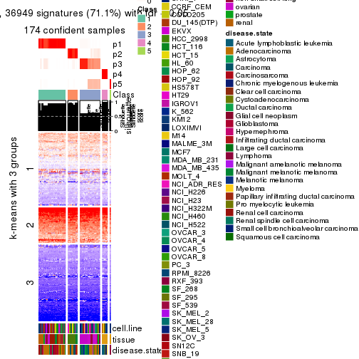</p>

</div>
<div id='tab-ATC-hclust-get-signatures-no-scale-5'>
<pre><code class="r">get_signatures(res, k = 6, scale_rows = FALSE)
</code></pre>

<p></p>

</div>
</div>


Compare the overlap of signatures from different k:

```r
compare_signatures(res)
```


`get_signature()` returns a data frame invisibly. TO get the list of signatures, the function
call should be assigned to a variable explicitly. In following code, if `plot` argument is set
to `FALSE`, no heatmap is plotted while only the differential analysis is performed.

```r
# code only for demonstration
tb = get_signature(res, k = ..., plot = FALSE)
```

An example of the output of `tb` is:

```
#>   which_row         fdr    mean_1    mean_2 scaled_mean_1 scaled_mean_2 km
#> 1        38 0.042760348  8.373488  9.131774    -0.5533452     0.5164555  1
#> 2        40 0.018707592  7.106213  8.469186    -0.6173731     0.5762149  1
#> 3        55 0.019134737 10.221463 11.207825    -0.6159697     0.5749050  1
#> 4        59 0.006059896  5.921854  7.869574    -0.6899429     0.6439467  1
#> 5        60 0.018055526  8.928898 10.211722    -0.6204761     0.5791110  1
#> 6        98 0.009384629 15.714769 14.887706     0.6635654    -0.6193277  2
...
```

The columns in `tb` are:

1. `which_row`: row indices corresponding to the input matrix.
2. `fdr`: FDR for the differential test. 
3. `mean_x`: The mean value in group x.
4. `scaled_mean_x`: The mean value in group x after rows are scaled.
5. `km`: Row groups if k-means clustering is applied to rows.


UMAP plot which shows how samples are separated.


<script>
$( function() {
	$( '#tabs-ATC-hclust-dimension-reduction' ).tabs();
} );
</script>
<div id='tabs-ATC-hclust-dimension-reduction'>
<ul>
<li><a href='#tab-ATC-hclust-dimension-reduction-1'>k = 2</a></li>
<li><a href='#tab-ATC-hclust-dimension-reduction-2'>k = 3</a></li>
<li><a href='#tab-ATC-hclust-dimension-reduction-3'>k = 4</a></li>
<li><a href='#tab-ATC-hclust-dimension-reduction-4'>k = 5</a></li>
<li><a href='#tab-ATC-hclust-dimension-reduction-5'>k = 6</a></li>
</ul>
<div id='tab-ATC-hclust-dimension-reduction-1'>
<pre><code class="r">dimension_reduction(res, k = 2, method = &quot;UMAP&quot;)
</code></pre>

<p></p>

</div>
<div id='tab-ATC-hclust-dimension-reduction-2'>
<pre><code class="r">dimension_reduction(res, k = 3, method = &quot;UMAP&quot;)
</code></pre>

<p></p>

</div>
<div id='tab-ATC-hclust-dimension-reduction-3'>
<pre><code class="r">dimension_reduction(res, k = 4, method = &quot;UMAP&quot;)
</code></pre>

<p></p>

</div>
<div id='tab-ATC-hclust-dimension-reduction-4'>
<pre><code class="r">dimension_reduction(res, k = 5, method = &quot;UMAP&quot;)
</code></pre>

<p></p>

</div>
<div id='tab-ATC-hclust-dimension-reduction-5'>
<pre><code class="r">dimension_reduction(res, k = 6, method = &quot;UMAP&quot;)
</code></pre>

<p></p>

</div>
</div>


Following heatmap shows how subgroups are split when increasing `k`:

```r
collect_classes(res)
```


Test correlation between subgroups and known annotations. If the known
annotation is numeric, one-way ANOVA test is applied, and if the known
annotation is discrete, chi-squared contingency table test is applied.

```r
test_to_known_factors(res)
```

```
#>              n cell.line(p) tissue(p) disease.state(p) k
#> ATC:hclust 174     1.60e-13  1.59e-29         7.29e-12 2
#> ATC:hclust 174     5.09e-25  6.26e-50         2.25e-29 3
#> ATC:hclust 149     2.73e-31  1.39e-56         1.00e-26 4
#> ATC:hclust 174     2.45e-47  1.13e-68         1.33e-58 5
#> ATC:hclust 174     2.80e-58  2.07e-86         5.40e-74 6
```


If matrix rows can be associated to genes, consider to use `GO_Enrichment(res,
...)` to perform function enrichment for the signature genes.


 

---------------------------------------------------


### ATC:kmeans**


The object with results only for a single top-value method and a single partition method 
can be extracted as:

```r
res = res_list["ATC", "kmeans"]
# you can also extract it by
# res = res_list["ATC:kmeans"]
```

A summary of `res` and all the functions that can be applied to it:

```r
res
```

```
#> A 'ConsensusPartition' object with k = 2, 3, 4, 5, 6.
#>   On a matrix with 51941 rows and 174 columns.
#>   Top rows (1000, 2000, 3000, 4000, 5000) are extracted by 'ATC' method.
#>   Subgroups are detected by 'kmeans' method.
#>   Performed in total 1250 partitions by row resampling.
#>   Best k for subgroups seems to be 2.
#> 
#> Following methods can be applied to this 'ConsensusPartition' object:
#>  [1] "cola_report"             "collect_classes"         "collect_plots"          
#>  [4] "collect_stats"           "colnames"                "compare_signatures"     
#>  [7] "consensus_heatmap"       "dimension_reduction"     "functional_enrichment"  
#> [10] "get_anno_col"            "get_anno"                "get_classes"            
#> [13] "get_consensus"           "get_matrix"              "get_membership"         
#> [16] "get_param"               "get_signatures"          "get_stats"              
#> [19] "is_best_k"               "is_stable_k"             "membership_heatmap"     
#> [22] "ncol"                    "nrow"                    "plot_ecdf"              
#> [25] "rownames"                "select_partition_number" "show"                   
#> [28] "suggest_best_k"          "test_to_known_factors"
```

`collect_plots()` function collects all the plots made from `res` for all `k` (number of partitions)
into one single page to provide an easy and fast comparison between different `k`.

```r
collect_plots(res)
```


The plots are:

- The first row: a plot of the ECDF (Empirical cumulative distribution
  function) curves of the consensus matrix for each `k` and the heatmap of
  predicted classes for each `k`.
- The second row: heatmaps of the consensus matrix for each `k`.
- The third row: heatmaps of the membership matrix for each `k`.
- The fouth row: heatmaps of the signatures for each `k`.

All the plots in panels can be made by individual functions and they are
plotted later in this section.

`select_partition_number()` produces several plots showing different
statistics for choosing "optimized" `k`. There are following statistics:

- ECDF curves of the consensus matrix for each `k`;
- 1-PAC. [The PAC
  score](https://en.wikipedia.org/wiki/Consensus_clustering#Over-interpretation_potential_of_consensus_clustering)
  measures the proportion of the ambiguous subgrouping.
- Mean silhouette score.
- Concordance. The mean probability of fiting the consensus class ids in all
  partitions.
- Area increased. Denote $A_k$ as the area under the ECDF curve for current
  `k`, the area increased is defined as $A_k - A_{k-1}$.
- Rand index. The percent of pairs of samples that are both in a same cluster
  or both are not in a same cluster in the partition of k and k-1.
- Jaccard index. The ratio of pairs of samples are both in a same cluster in
  the partition of k and k-1 and the pairs of samples are both in a same
  cluster in the partition k or k-1.

The detailed explanations of these statistics can be found in [the cola
vignette](http://bioconductor.org/packages/devel/bioc/vignettes/cola/inst/doc/cola.html#toc_13).

Generally speaking, lower PAC score, higher mean silhouette score or higher
concordance corresponds to better partition. Rand index and Jaccard index
measure how similar the current partition is compared to partition with `k-1`.
If they are too similar, we won't accept `k` is better than `k-1`.

```r
select_partition_number(res)
```


The numeric values for all these statistics can be obtained by `get_stats()`.

```r
get_stats(res)
```

```
#>   k 1-PAC mean_silhouette concordance area_increased  Rand Jaccard
#> 2 2 0.955           0.958       0.975         0.4102 0.578   0.578
#> 3 3 0.503           0.553       0.788         0.4617 0.651   0.478
#> 4 4 0.766           0.856       0.893         0.1269 0.891   0.742
#> 5 5 0.733           0.714       0.809         0.1067 0.892   0.684
#> 6 6 0.750           0.676       0.781         0.0553 0.879   0.562
```

`suggest_best_k()` suggests the best $k$ based on these statistics. The rules are as follows:

- All $k$ with Jaccard index larger than 0.95 are removed because the increase of
  the partition number does not provides enough extra information. If all $k$ are removed,
  the best $k$ is assigned by `NA`.
- For $k$ with 1-PAC larger than 0.9, the maximal $k$ is taken as the "best k". Other $k$ is called "optional k".
- If it does not fit the second rule. The $k$ with the highest vote of highest
  1-PAC, mean silhouette and concordance is taken as the "best k".

```r
suggest_best_k(res)
```

```
#> [1] 2
```


Following shows the table of the partitions (You need to click the **show/hide
code output** link to see it). The membership matrix (columns with name `p*`)
is inferred by
[`clue::cl_consensus()`](https://www.rdocumentation.org/link/cl_consensus?package=clue)
function with the `SE` method. Basically the value in the membership matrix
represents the probability to belong to a certain group. The finall class
label for an item is determined with the group with highest probability it
belongs to.

In `get_classes()` function, the entropy is calculated from the membership
matrix and the silhouette score is calculated from the consensus matrix.


<script>
$( function() {
	$( '#tabs-ATC-kmeans-get-classes' ).tabs();
} );
</script>
<div id='tabs-ATC-kmeans-get-classes'>
<ul>
<li><a href='#tab-ATC-kmeans-get-classes-1'>k = 2</a></li>
<li><a href='#tab-ATC-kmeans-get-classes-2'>k = 3</a></li>
<li><a href='#tab-ATC-kmeans-get-classes-3'>k = 4</a></li>
<li><a href='#tab-ATC-kmeans-get-classes-4'>k = 5</a></li>
<li><a href='#tab-ATC-kmeans-get-classes-5'>k = 6</a></li>
</ul>

<div id='tab-ATC-kmeans-get-classes-1'>
<p><a id='tab-ATC-kmeans-get-classes-1-a' style='color:#0366d6' href='#'>show/hide code output</a></p>
<pre><code class="r">cbind(get_classes(res, k = 2), get_membership(res, k = 2))
</code></pre>

<pre><code>#&gt;           class entropy silhouette    p1    p2
#&gt; GSM803615     2  0.1414      0.955 0.020 0.980
#&gt; GSM803674     2  0.1414      0.955 0.020 0.980
#&gt; GSM803733     2  0.1414      0.955 0.020 0.980
#&gt; GSM803616     2  0.1414      0.955 0.020 0.980
#&gt; GSM803675     2  0.1414      0.955 0.020 0.980
#&gt; GSM803734     2  0.1414      0.955 0.020 0.980
#&gt; GSM803617     2  0.1414      0.955 0.020 0.980
#&gt; GSM803676     2  0.1414      0.955 0.020 0.980
#&gt; GSM803735     2  0.1414      0.955 0.020 0.980
#&gt; GSM803618     2  0.1414      0.955 0.020 0.980
#&gt; GSM803677     2  0.1414      0.955 0.020 0.980
#&gt; GSM803736     2  0.1414      0.955 0.020 0.980
#&gt; GSM803619     2  0.1414      0.955 0.020 0.980
#&gt; GSM803678     2  0.1414      0.955 0.020 0.980
#&gt; GSM803737     2  0.1414      0.955 0.020 0.980
#&gt; GSM803620     2  0.1414      0.955 0.020 0.980
#&gt; GSM803679     2  0.1414      0.955 0.020 0.980
#&gt; GSM803738     2  0.1414      0.955 0.020 0.980
#&gt; GSM803621     1  0.0000      0.990 1.000 0.000
#&gt; GSM803680     1  0.0000      0.990 1.000 0.000
#&gt; GSM803739     1  0.0000      0.990 1.000 0.000
#&gt; GSM803622     1  0.0000      0.990 1.000 0.000
#&gt; GSM803681     1  0.0000      0.990 1.000 0.000
#&gt; GSM803740     1  0.0000      0.990 1.000 0.000
#&gt; GSM803623     2  0.1414      0.955 0.020 0.980
#&gt; GSM803682     2  0.1414      0.955 0.020 0.980
#&gt; GSM803741     2  0.1414      0.955 0.020 0.980
#&gt; GSM803624     1  0.0000      0.990 1.000 0.000
#&gt; GSM803683     1  0.0000      0.990 1.000 0.000
#&gt; GSM803742     1  0.0000      0.990 1.000 0.000
#&gt; GSM803625     1  0.0000      0.990 1.000 0.000
#&gt; GSM803684     1  0.0000      0.990 1.000 0.000
#&gt; GSM803743     1  0.0000      0.990 1.000 0.000
#&gt; GSM803626     1  0.1414      0.977 0.980 0.020
#&gt; GSM803685     1  0.1414      0.977 0.980 0.020
#&gt; GSM803744     1  0.1414      0.977 0.980 0.020
#&gt; GSM803627     1  0.0000      0.990 1.000 0.000
#&gt; GSM803686     1  0.0000      0.990 1.000 0.000
#&gt; GSM803745     1  0.0000      0.990 1.000 0.000
#&gt; GSM803628     1  0.0000      0.990 1.000 0.000
#&gt; GSM803687     1  0.0000      0.990 1.000 0.000
#&gt; GSM803746     1  0.0000      0.990 1.000 0.000
#&gt; GSM803629     1  0.0000      0.990 1.000 0.000
#&gt; GSM803688     1  0.0000      0.990 1.000 0.000
#&gt; GSM803747     1  0.0000      0.990 1.000 0.000
#&gt; GSM803630     1  0.0000      0.990 1.000 0.000
#&gt; GSM803689     1  0.0000      0.990 1.000 0.000
#&gt; GSM803748     1  0.0000      0.990 1.000 0.000
#&gt; GSM803631     1  0.0376      0.987 0.996 0.004
#&gt; GSM803690     1  0.0376      0.987 0.996 0.004
#&gt; GSM803749     1  0.0376      0.987 0.996 0.004
#&gt; GSM803632     1  0.0000      0.990 1.000 0.000
#&gt; GSM803691     1  0.0000      0.990 1.000 0.000
#&gt; GSM803750     1  0.0000      0.990 1.000 0.000
#&gt; GSM803633     2  0.1414      0.955 0.020 0.980
#&gt; GSM803692     2  0.1414      0.955 0.020 0.980
#&gt; GSM803751     2  0.1414      0.955 0.020 0.980
#&gt; GSM803634     2  0.1414      0.955 0.020 0.980
#&gt; GSM803693     2  0.1414      0.955 0.020 0.980
#&gt; GSM803752     2  0.1414      0.955 0.020 0.980
#&gt; GSM803635     2  0.1414      0.955 0.020 0.980
#&gt; GSM803694     2  0.1414      0.955 0.020 0.980
#&gt; GSM803753     2  0.1414      0.955 0.020 0.980
#&gt; GSM803636     2  0.1414      0.955 0.020 0.980
#&gt; GSM803695     2  0.1414      0.955 0.020 0.980
#&gt; GSM803754     2  0.1414      0.955 0.020 0.980
#&gt; GSM803637     2  0.1414      0.955 0.020 0.980
#&gt; GSM803696     2  0.1414      0.955 0.020 0.980
#&gt; GSM803755     2  0.1414      0.955 0.020 0.980
#&gt; GSM803638     2  0.1414      0.955 0.020 0.980
#&gt; GSM803697     2  0.1414      0.955 0.020 0.980
#&gt; GSM803756     2  0.1414      0.955 0.020 0.980
#&gt; GSM803639     2  0.1414      0.955 0.020 0.980
#&gt; GSM803698     2  0.1414      0.955 0.020 0.980
#&gt; GSM803757     2  0.1414      0.955 0.020 0.980
#&gt; GSM803640     1  0.0000      0.990 1.000 0.000
#&gt; GSM803699     1  0.0000      0.990 1.000 0.000
#&gt; GSM803758     1  0.0000      0.990 1.000 0.000
#&gt; GSM803641     1  0.0000      0.990 1.000 0.000
#&gt; GSM803700     1  0.0000      0.990 1.000 0.000
#&gt; GSM803759     1  0.0000      0.990 1.000 0.000
#&gt; GSM803642     1  0.0000      0.990 1.000 0.000
#&gt; GSM803701     1  0.0000      0.990 1.000 0.000
#&gt; GSM803760     1  0.0000      0.990 1.000 0.000
#&gt; GSM803643     1  0.0000      0.990 1.000 0.000
#&gt; GSM803702     1  0.0000      0.990 1.000 0.000
#&gt; GSM803644     1  0.0000      0.990 1.000 0.000
#&gt; GSM803703     1  0.0000      0.990 1.000 0.000
#&gt; GSM803761     1  0.0000      0.990 1.000 0.000
#&gt; GSM803645     1  0.0000      0.990 1.000 0.000
#&gt; GSM803704     1  0.0000      0.990 1.000 0.000
#&gt; GSM803762     1  0.0000      0.990 1.000 0.000
#&gt; GSM803646     1  0.0000      0.990 1.000 0.000
#&gt; GSM803705     1  0.0000      0.990 1.000 0.000
#&gt; GSM803763     1  0.0000      0.990 1.000 0.000
#&gt; GSM803647     1  0.0000      0.990 1.000 0.000
#&gt; GSM803706     1  0.0000      0.990 1.000 0.000
#&gt; GSM803764     1  0.0000      0.990 1.000 0.000
#&gt; GSM803648     1  0.0000      0.990 1.000 0.000
#&gt; GSM803707     1  0.0000      0.990 1.000 0.000
#&gt; GSM803765     1  0.0000      0.990 1.000 0.000
#&gt; GSM803649     1  0.0000      0.990 1.000 0.000
#&gt; GSM803708     1  0.0000      0.990 1.000 0.000
#&gt; GSM803766     1  0.0000      0.990 1.000 0.000
#&gt; GSM803650     1  0.0000      0.990 1.000 0.000
#&gt; GSM803709     1  0.0000      0.990 1.000 0.000
#&gt; GSM803767     1  0.0000      0.990 1.000 0.000
#&gt; GSM803651     1  0.0000      0.990 1.000 0.000
#&gt; GSM803710     1  0.0000      0.990 1.000 0.000
#&gt; GSM803768     1  0.0000      0.990 1.000 0.000
#&gt; GSM803652     1  0.0000      0.990 1.000 0.000
#&gt; GSM803711     1  0.0000      0.990 1.000 0.000
#&gt; GSM803653     1  0.0000      0.990 1.000 0.000
#&gt; GSM803712     1  0.0000      0.990 1.000 0.000
#&gt; GSM803769     1  0.4161      0.902 0.916 0.084
#&gt; GSM803654     1  0.0000      0.990 1.000 0.000
#&gt; GSM803713     1  0.0000      0.990 1.000 0.000
#&gt; GSM803770     1  0.0000      0.990 1.000 0.000
#&gt; GSM803655     2  0.8763      0.647 0.296 0.704
#&gt; GSM803714     2  0.7883      0.740 0.236 0.764
#&gt; GSM803771     2  0.3733      0.914 0.072 0.928
#&gt; GSM803656     2  0.8861      0.632 0.304 0.696
#&gt; GSM803715     2  0.8661      0.660 0.288 0.712
#&gt; GSM803772     2  0.7139      0.790 0.196 0.804
#&gt; GSM803657     1  0.5519      0.845 0.872 0.128
#&gt; GSM803716     1  0.6887      0.760 0.816 0.184
#&gt; GSM803773     1  0.4161      0.902 0.916 0.084
#&gt; GSM803658     1  0.0000      0.990 1.000 0.000
#&gt; GSM803717     1  0.0000      0.990 1.000 0.000
#&gt; GSM803774     1  0.0000      0.990 1.000 0.000
#&gt; GSM803659     1  0.0000      0.990 1.000 0.000
#&gt; GSM803718     1  0.0000      0.990 1.000 0.000
#&gt; GSM803775     1  0.0000      0.990 1.000 0.000
#&gt; GSM803660     1  0.0000      0.990 1.000 0.000
#&gt; GSM803719     1  0.0000      0.990 1.000 0.000
#&gt; GSM803776     1  0.0000      0.990 1.000 0.000
#&gt; GSM803661     1  0.0000      0.990 1.000 0.000
#&gt; GSM803720     1  0.0000      0.990 1.000 0.000
#&gt; GSM803777     1  0.0000      0.990 1.000 0.000
#&gt; GSM803662     1  0.0000      0.990 1.000 0.000
#&gt; GSM803732     1  0.0000      0.990 1.000 0.000
#&gt; GSM803778     1  0.0000      0.990 1.000 0.000
#&gt; GSM803663     1  0.0000      0.990 1.000 0.000
#&gt; GSM803721     1  0.0000      0.990 1.000 0.000
#&gt; GSM803779     1  0.0000      0.990 1.000 0.000
#&gt; GSM803664     1  0.4690      0.882 0.900 0.100
#&gt; GSM803722     1  0.4815      0.877 0.896 0.104
#&gt; GSM803780     2  0.9998      0.134 0.492 0.508
#&gt; GSM803665     1  0.0000      0.990 1.000 0.000
#&gt; GSM803723     1  0.0000      0.990 1.000 0.000
#&gt; GSM803781     1  0.0000      0.990 1.000 0.000
#&gt; GSM803666     1  0.1414      0.977 0.980 0.020
#&gt; GSM803724     1  0.1414      0.977 0.980 0.020
#&gt; GSM803782     1  0.1414      0.977 0.980 0.020
#&gt; GSM803667     1  0.1414      0.977 0.980 0.020
#&gt; GSM803725     1  0.1414      0.977 0.980 0.020
#&gt; GSM803783     1  0.1414      0.977 0.980 0.020
#&gt; GSM803668     1  0.1414      0.977 0.980 0.020
#&gt; GSM803726     1  0.1414      0.977 0.980 0.020
#&gt; GSM803784     1  0.1414      0.977 0.980 0.020
#&gt; GSM803669     1  0.1414      0.977 0.980 0.020
#&gt; GSM803727     1  0.1414      0.977 0.980 0.020
#&gt; GSM803670     1  0.1414      0.977 0.980 0.020
#&gt; GSM803728     1  0.1414      0.977 0.980 0.020
#&gt; GSM803785     1  0.1414      0.977 0.980 0.020
#&gt; GSM803671     1  0.1414      0.977 0.980 0.020
#&gt; GSM803729     1  0.1414      0.977 0.980 0.020
#&gt; GSM803786     1  0.1414      0.977 0.980 0.020
#&gt; GSM803672     1  0.1414      0.977 0.980 0.020
#&gt; GSM803730     1  0.1414      0.977 0.980 0.020
#&gt; GSM803787     1  0.1414      0.977 0.980 0.020
#&gt; GSM803673     2  0.8016      0.729 0.244 0.756
#&gt; GSM803731     2  0.8016      0.729 0.244 0.756
#&gt; GSM803788     2  0.1414      0.955 0.020 0.980
</code></pre>

<script>
$('#tab-ATC-kmeans-get-classes-1-a').parent().next().next().hide();
$('#tab-ATC-kmeans-get-classes-1-a').click(function(){
  $('#tab-ATC-kmeans-get-classes-1-a').parent().next().next().toggle();
  return(false);
});
</script>
</div>

<div id='tab-ATC-kmeans-get-classes-2'>
<p><a id='tab-ATC-kmeans-get-classes-2-a' style='color:#0366d6' href='#'>show/hide code output</a></p>
<pre><code class="r">cbind(get_classes(res, k = 3), get_membership(res, k = 3))
</code></pre>

<pre><code>#&gt;           class entropy silhouette    p1    p2    p3
#&gt; GSM803615     3  0.4887    0.93162 0.000 0.228 0.772
#&gt; GSM803674     3  0.4887    0.93162 0.000 0.228 0.772
#&gt; GSM803733     3  0.4887    0.93162 0.000 0.228 0.772
#&gt; GSM803616     3  0.4887    0.93162 0.000 0.228 0.772
#&gt; GSM803675     3  0.4887    0.93162 0.000 0.228 0.772
#&gt; GSM803734     3  0.4887    0.93162 0.000 0.228 0.772
#&gt; GSM803617     3  0.4887    0.93162 0.000 0.228 0.772
#&gt; GSM803676     3  0.4887    0.93162 0.000 0.228 0.772
#&gt; GSM803735     3  0.4887    0.93162 0.000 0.228 0.772
#&gt; GSM803618     3  0.4887    0.93162 0.000 0.228 0.772
#&gt; GSM803677     3  0.4887    0.93162 0.000 0.228 0.772
#&gt; GSM803736     3  0.4887    0.93162 0.000 0.228 0.772
#&gt; GSM803619     3  0.6309    0.56060 0.000 0.496 0.504
#&gt; GSM803678     3  0.6309    0.56060 0.000 0.496 0.504
#&gt; GSM803737     3  0.6309    0.56060 0.000 0.496 0.504
#&gt; GSM803620     3  0.4887    0.93162 0.000 0.228 0.772
#&gt; GSM803679     3  0.4887    0.93162 0.000 0.228 0.772
#&gt; GSM803738     3  0.4887    0.93162 0.000 0.228 0.772
#&gt; GSM803621     1  0.0424    0.91434 0.992 0.008 0.000
#&gt; GSM803680     1  0.0424    0.91434 0.992 0.008 0.000
#&gt; GSM803739     1  0.0424    0.91434 0.992 0.008 0.000
#&gt; GSM803622     1  0.0424    0.91434 0.992 0.008 0.000
#&gt; GSM803681     1  0.0424    0.91434 0.992 0.008 0.000
#&gt; GSM803740     1  0.0424    0.91434 0.992 0.008 0.000
#&gt; GSM803623     2  0.6280   -0.49025 0.000 0.540 0.460
#&gt; GSM803682     2  0.6267   -0.47645 0.000 0.548 0.452
#&gt; GSM803741     2  0.6280   -0.49025 0.000 0.540 0.460
#&gt; GSM803624     2  0.5016    0.46351 0.240 0.760 0.000
#&gt; GSM803683     1  0.4062    0.78437 0.836 0.164 0.000
#&gt; GSM803742     1  0.6280    0.17531 0.540 0.460 0.000
#&gt; GSM803625     1  0.0237    0.91594 0.996 0.004 0.000
#&gt; GSM803684     1  0.0237    0.91594 0.996 0.004 0.000
#&gt; GSM803743     1  0.0237    0.91594 0.996 0.004 0.000
#&gt; GSM803626     2  0.9519    0.34985 0.292 0.484 0.224
#&gt; GSM803685     1  0.3989    0.78844 0.864 0.012 0.124
#&gt; GSM803744     2  0.9461    0.36064 0.280 0.496 0.224
#&gt; GSM803627     1  0.0424    0.91434 0.992 0.008 0.000
#&gt; GSM803686     1  0.0424    0.91434 0.992 0.008 0.000
#&gt; GSM803745     1  0.0424    0.91434 0.992 0.008 0.000
#&gt; GSM803628     1  0.0424    0.91434 0.992 0.008 0.000
#&gt; GSM803687     1  0.0424    0.91434 0.992 0.008 0.000
#&gt; GSM803746     1  0.0424    0.91434 0.992 0.008 0.000
#&gt; GSM803629     1  0.0424    0.91434 0.992 0.008 0.000
#&gt; GSM803688     1  0.0424    0.91434 0.992 0.008 0.000
#&gt; GSM803747     1  0.0424    0.91434 0.992 0.008 0.000
#&gt; GSM803630     1  0.0424    0.91434 0.992 0.008 0.000
#&gt; GSM803689     1  0.0424    0.91434 0.992 0.008 0.000
#&gt; GSM803748     1  0.0424    0.91434 0.992 0.008 0.000
#&gt; GSM803631     1  0.0424    0.91434 0.992 0.008 0.000
#&gt; GSM803690     1  0.0424    0.91434 0.992 0.008 0.000
#&gt; GSM803749     1  0.0424    0.91434 0.992 0.008 0.000
#&gt; GSM803632     1  0.0424    0.91434 0.992 0.008 0.000
#&gt; GSM803691     1  0.0424    0.91434 0.992 0.008 0.000
#&gt; GSM803750     1  0.0424    0.91434 0.992 0.008 0.000
#&gt; GSM803633     2  0.6280   -0.49025 0.000 0.540 0.460
#&gt; GSM803692     2  0.6280   -0.49025 0.000 0.540 0.460
#&gt; GSM803751     2  0.6280   -0.49025 0.000 0.540 0.460
#&gt; GSM803634     2  0.6267   -0.47645 0.000 0.548 0.452
#&gt; GSM803693     2  0.6267   -0.47645 0.000 0.548 0.452
#&gt; GSM803752     2  0.6274   -0.48336 0.000 0.544 0.456
#&gt; GSM803635     2  0.4062    0.21144 0.000 0.836 0.164
#&gt; GSM803694     2  0.4062    0.21144 0.000 0.836 0.164
#&gt; GSM803753     2  0.4178    0.19627 0.000 0.828 0.172
#&gt; GSM803636     2  0.5138    0.00341 0.000 0.748 0.252
#&gt; GSM803695     2  0.5138    0.00341 0.000 0.748 0.252
#&gt; GSM803754     2  0.5138    0.00341 0.000 0.748 0.252
#&gt; GSM803637     2  0.4842    0.08091 0.000 0.776 0.224
#&gt; GSM803696     2  0.4842    0.08091 0.000 0.776 0.224
#&gt; GSM803755     2  0.5138    0.00341 0.000 0.748 0.252
#&gt; GSM803638     2  0.6280   -0.49025 0.000 0.540 0.460
#&gt; GSM803697     2  0.6280   -0.49025 0.000 0.540 0.460
#&gt; GSM803756     2  0.6280   -0.49025 0.000 0.540 0.460
#&gt; GSM803639     2  0.6244   -0.45736 0.000 0.560 0.440
#&gt; GSM803698     2  0.6252   -0.46392 0.000 0.556 0.444
#&gt; GSM803757     2  0.6280   -0.49025 0.000 0.540 0.460
#&gt; GSM803640     1  0.0237    0.91594 0.996 0.004 0.000
#&gt; GSM803699     1  0.0237    0.91594 0.996 0.004 0.000
#&gt; GSM803758     1  0.0237    0.91594 0.996 0.004 0.000
#&gt; GSM803641     1  0.0000    0.91603 1.000 0.000 0.000
#&gt; GSM803700     1  0.0000    0.91603 1.000 0.000 0.000
#&gt; GSM803759     1  0.0000    0.91603 1.000 0.000 0.000
#&gt; GSM803642     1  0.0237    0.91594 0.996 0.004 0.000
#&gt; GSM803701     1  0.0237    0.91594 0.996 0.004 0.000
#&gt; GSM803760     1  0.0237    0.91594 0.996 0.004 0.000
#&gt; GSM803643     1  0.0237    0.91594 0.996 0.004 0.000
#&gt; GSM803702     1  0.0237    0.91594 0.996 0.004 0.000
#&gt; GSM803644     1  0.0000    0.91603 1.000 0.000 0.000
#&gt; GSM803703     1  0.0000    0.91603 1.000 0.000 0.000
#&gt; GSM803761     1  0.0000    0.91603 1.000 0.000 0.000
#&gt; GSM803645     1  0.0237    0.91594 0.996 0.004 0.000
#&gt; GSM803704     1  0.0237    0.91594 0.996 0.004 0.000
#&gt; GSM803762     1  0.0237    0.91594 0.996 0.004 0.000
#&gt; GSM803646     1  0.2165    0.87472 0.936 0.064 0.000
#&gt; GSM803705     1  0.2165    0.87472 0.936 0.064 0.000
#&gt; GSM803763     1  0.3941    0.79324 0.844 0.156 0.000
#&gt; GSM803647     1  0.0237    0.91594 0.996 0.004 0.000
#&gt; GSM803706     1  0.0237    0.91594 0.996 0.004 0.000
#&gt; GSM803764     1  0.0237    0.91594 0.996 0.004 0.000
#&gt; GSM803648     1  0.6079    0.37025 0.612 0.388 0.000
#&gt; GSM803707     1  0.6079    0.37025 0.612 0.388 0.000
#&gt; GSM803765     1  0.6154    0.31675 0.592 0.408 0.000
#&gt; GSM803649     1  0.1163    0.90007 0.972 0.028 0.000
#&gt; GSM803708     1  0.1163    0.90007 0.972 0.028 0.000
#&gt; GSM803766     1  0.1163    0.90007 0.972 0.028 0.000
#&gt; GSM803650     1  0.0237    0.91594 0.996 0.004 0.000
#&gt; GSM803709     1  0.0237    0.91594 0.996 0.004 0.000
#&gt; GSM803767     1  0.0000    0.91603 1.000 0.000 0.000
#&gt; GSM803651     1  0.0000    0.91603 1.000 0.000 0.000
#&gt; GSM803710     1  0.0000    0.91603 1.000 0.000 0.000
#&gt; GSM803768     1  0.0000    0.91603 1.000 0.000 0.000
#&gt; GSM803652     1  0.0237    0.91594 0.996 0.004 0.000
#&gt; GSM803711     1  0.0237    0.91594 0.996 0.004 0.000
#&gt; GSM803653     2  0.3412    0.48294 0.124 0.876 0.000
#&gt; GSM803712     2  0.3412    0.48294 0.124 0.876 0.000
#&gt; GSM803769     2  0.2448    0.47059 0.076 0.924 0.000
#&gt; GSM803654     2  0.4796    0.46962 0.220 0.780 0.000
#&gt; GSM803713     2  0.4796    0.46962 0.220 0.780 0.000
#&gt; GSM803770     2  0.5016    0.46351 0.240 0.760 0.000
#&gt; GSM803655     2  0.0829    0.42669 0.012 0.984 0.004
#&gt; GSM803714     2  0.0829    0.42669 0.012 0.984 0.004
#&gt; GSM803771     2  0.0592    0.41261 0.000 0.988 0.012
#&gt; GSM803656     2  0.0747    0.43078 0.016 0.984 0.000
#&gt; GSM803715     2  0.0747    0.43078 0.016 0.984 0.000
#&gt; GSM803772     2  0.0829    0.42669 0.012 0.984 0.004
#&gt; GSM803657     2  0.2066    0.46308 0.060 0.940 0.000
#&gt; GSM803716     2  0.1860    0.45842 0.052 0.948 0.000
#&gt; GSM803773     2  0.2625    0.47329 0.084 0.916 0.000
#&gt; GSM803658     2  0.3619    0.48311 0.136 0.864 0.000
#&gt; GSM803717     2  0.3551    0.48320 0.132 0.868 0.000
#&gt; GSM803774     2  0.3340    0.48242 0.120 0.880 0.000
#&gt; GSM803659     2  0.4121    0.48031 0.168 0.832 0.000
#&gt; GSM803718     2  0.4121    0.48031 0.168 0.832 0.000
#&gt; GSM803775     2  0.3340    0.48242 0.120 0.880 0.000
#&gt; GSM803660     1  0.4062    0.78437 0.836 0.164 0.000
#&gt; GSM803719     1  0.4062    0.78437 0.836 0.164 0.000
#&gt; GSM803776     1  0.4062    0.78437 0.836 0.164 0.000
#&gt; GSM803661     1  0.4062    0.78437 0.836 0.164 0.000
#&gt; GSM803720     1  0.4178    0.77391 0.828 0.172 0.000
#&gt; GSM803777     1  0.4121    0.77923 0.832 0.168 0.000
#&gt; GSM803662     1  0.1411    0.89808 0.964 0.036 0.000
#&gt; GSM803732     1  0.0424    0.91388 0.992 0.008 0.000
#&gt; GSM803778     1  0.0592    0.91288 0.988 0.012 0.000
#&gt; GSM803663     1  0.3816    0.80138 0.852 0.148 0.000
#&gt; GSM803721     1  0.4062    0.78437 0.836 0.164 0.000
#&gt; GSM803779     1  0.4062    0.78437 0.836 0.164 0.000
#&gt; GSM803664     2  0.2165    0.46575 0.064 0.936 0.000
#&gt; GSM803722     2  0.2165    0.46575 0.064 0.936 0.000
#&gt; GSM803780     2  0.1289    0.44503 0.032 0.968 0.000
#&gt; GSM803665     1  0.7901    0.06674 0.504 0.440 0.056
#&gt; GSM803723     1  0.7901    0.06674 0.504 0.440 0.056
#&gt; GSM803781     1  0.7757    0.04565 0.488 0.464 0.048
#&gt; GSM803666     2  0.9719    0.23830 0.360 0.416 0.224
#&gt; GSM803724     2  0.9719    0.23830 0.360 0.416 0.224
#&gt; GSM803782     2  0.9692    0.26338 0.344 0.432 0.224
#&gt; GSM803667     2  0.9719    0.23830 0.360 0.416 0.224
#&gt; GSM803725     2  0.9719    0.23830 0.360 0.416 0.224
#&gt; GSM803783     2  0.9707    0.25128 0.352 0.424 0.224
#&gt; GSM803668     2  0.9707    0.25128 0.352 0.424 0.224
#&gt; GSM803726     2  0.9707    0.25128 0.352 0.424 0.224
#&gt; GSM803784     2  0.9700    0.25603 0.348 0.428 0.224
#&gt; GSM803669     2  0.9719    0.23830 0.360 0.416 0.224
#&gt; GSM803727     2  0.9719    0.23830 0.360 0.416 0.224
#&gt; GSM803670     2  0.9519    0.34985 0.292 0.484 0.224
#&gt; GSM803728     2  0.9519    0.34985 0.292 0.484 0.224
#&gt; GSM803785     2  0.9519    0.34985 0.292 0.484 0.224
#&gt; GSM803671     2  0.9707    0.25128 0.352 0.424 0.224
#&gt; GSM803729     2  0.9707    0.25128 0.352 0.424 0.224
#&gt; GSM803786     2  0.9707    0.25128 0.352 0.424 0.224
#&gt; GSM803672     2  0.9693    0.19092 0.380 0.404 0.216
#&gt; GSM803730     2  0.9706    0.22097 0.368 0.412 0.220
#&gt; GSM803787     2  0.9706    0.22097 0.368 0.412 0.220
#&gt; GSM803673     2  0.1163    0.44138 0.028 0.972 0.000
#&gt; GSM803731     2  0.1163    0.44138 0.028 0.972 0.000
#&gt; GSM803788     2  0.0661    0.42119 0.008 0.988 0.004
</code></pre>

<script>
$('#tab-ATC-kmeans-get-classes-2-a').parent().next().next().hide();
$('#tab-ATC-kmeans-get-classes-2-a').click(function(){
  $('#tab-ATC-kmeans-get-classes-2-a').parent().next().next().toggle();
  return(false);
});
</script>
</div>

<div id='tab-ATC-kmeans-get-classes-3'>
<p><a id='tab-ATC-kmeans-get-classes-3-a' style='color:#0366d6' href='#'>show/hide code output</a></p>
<pre><code class="r">cbind(get_classes(res, k = 4), get_membership(res, k = 4))
</code></pre>

<pre><code>#&gt;           class entropy silhouette    p1    p2    p3    p4
#&gt; GSM803615     4  0.1022      0.997 0.000 0.032 0.000 0.968
#&gt; GSM803674     4  0.1022      0.997 0.000 0.032 0.000 0.968
#&gt; GSM803733     4  0.1022      0.997 0.000 0.032 0.000 0.968
#&gt; GSM803616     4  0.1022      0.997 0.000 0.032 0.000 0.968
#&gt; GSM803675     4  0.1022      0.997 0.000 0.032 0.000 0.968
#&gt; GSM803734     4  0.1022      0.997 0.000 0.032 0.000 0.968
#&gt; GSM803617     4  0.1022      0.997 0.000 0.032 0.000 0.968
#&gt; GSM803676     4  0.1022      0.997 0.000 0.032 0.000 0.968
#&gt; GSM803735     4  0.1022      0.997 0.000 0.032 0.000 0.968
#&gt; GSM803618     4  0.1488      0.995 0.000 0.032 0.012 0.956
#&gt; GSM803677     4  0.1488      0.995 0.000 0.032 0.012 0.956
#&gt; GSM803736     4  0.1488      0.995 0.000 0.032 0.012 0.956
#&gt; GSM803619     2  0.6532      0.403 0.000 0.548 0.084 0.368
#&gt; GSM803678     2  0.6532      0.403 0.000 0.548 0.084 0.368
#&gt; GSM803737     2  0.6532      0.403 0.000 0.548 0.084 0.368
#&gt; GSM803620     4  0.1488      0.995 0.000 0.032 0.012 0.956
#&gt; GSM803679     4  0.1488      0.995 0.000 0.032 0.012 0.956
#&gt; GSM803738     4  0.1488      0.995 0.000 0.032 0.012 0.956
#&gt; GSM803621     1  0.0336      0.923 0.992 0.000 0.000 0.008
#&gt; GSM803680     1  0.0336      0.923 0.992 0.000 0.000 0.008
#&gt; GSM803739     1  0.0336      0.923 0.992 0.000 0.000 0.008
#&gt; GSM803622     1  0.0336      0.923 0.992 0.000 0.000 0.008
#&gt; GSM803681     1  0.0336      0.923 0.992 0.000 0.000 0.008
#&gt; GSM803740     1  0.0336      0.923 0.992 0.000 0.000 0.008
#&gt; GSM803623     2  0.4332      0.734 0.000 0.792 0.032 0.176
#&gt; GSM803682     2  0.4152      0.749 0.000 0.808 0.032 0.160
#&gt; GSM803741     2  0.4332      0.734 0.000 0.792 0.032 0.176
#&gt; GSM803624     2  0.3561      0.811 0.012 0.856 0.120 0.012
#&gt; GSM803683     1  0.5159      0.786 0.772 0.152 0.064 0.012
#&gt; GSM803742     1  0.6467      0.648 0.676 0.168 0.144 0.012
#&gt; GSM803625     1  0.1082      0.918 0.972 0.004 0.020 0.004
#&gt; GSM803684     1  0.1082      0.918 0.972 0.004 0.020 0.004
#&gt; GSM803743     1  0.1191      0.917 0.968 0.004 0.024 0.004
#&gt; GSM803626     3  0.3648      0.915 0.056 0.068 0.868 0.008
#&gt; GSM803685     1  0.5018      0.392 0.656 0.000 0.332 0.012
#&gt; GSM803744     3  0.3641      0.911 0.052 0.072 0.868 0.008
#&gt; GSM803627     1  0.0336      0.923 0.992 0.000 0.000 0.008
#&gt; GSM803686     1  0.0336      0.923 0.992 0.000 0.000 0.008
#&gt; GSM803745     1  0.0336      0.923 0.992 0.000 0.000 0.008
#&gt; GSM803628     1  0.0336      0.923 0.992 0.000 0.000 0.008
#&gt; GSM803687     1  0.0336      0.923 0.992 0.000 0.000 0.008
#&gt; GSM803746     1  0.0336      0.923 0.992 0.000 0.000 0.008
#&gt; GSM803629     1  0.0336      0.923 0.992 0.000 0.000 0.008
#&gt; GSM803688     1  0.0336      0.923 0.992 0.000 0.000 0.008
#&gt; GSM803747     1  0.0336      0.923 0.992 0.000 0.000 0.008
#&gt; GSM803630     1  0.0336      0.923 0.992 0.000 0.000 0.008
#&gt; GSM803689     1  0.0336      0.923 0.992 0.000 0.000 0.008
#&gt; GSM803748     1  0.0336      0.923 0.992 0.000 0.000 0.008
#&gt; GSM803631     1  0.0336      0.923 0.992 0.000 0.000 0.008
#&gt; GSM803690     1  0.0336      0.923 0.992 0.000 0.000 0.008
#&gt; GSM803749     1  0.0336      0.923 0.992 0.000 0.000 0.008
#&gt; GSM803632     1  0.0336      0.923 0.992 0.000 0.000 0.008
#&gt; GSM803691     1  0.0336      0.923 0.992 0.000 0.000 0.008
#&gt; GSM803750     1  0.0336      0.923 0.992 0.000 0.000 0.008
#&gt; GSM803633     2  0.4238      0.736 0.000 0.796 0.028 0.176
#&gt; GSM803692     2  0.4238      0.736 0.000 0.796 0.028 0.176
#&gt; GSM803751     2  0.4238      0.736 0.000 0.796 0.028 0.176
#&gt; GSM803634     2  0.3958      0.752 0.000 0.816 0.024 0.160
#&gt; GSM803693     2  0.3958      0.752 0.000 0.816 0.024 0.160
#&gt; GSM803752     2  0.3958      0.752 0.000 0.816 0.024 0.160
#&gt; GSM803635     2  0.0895      0.836 0.000 0.976 0.020 0.004
#&gt; GSM803694     2  0.0895      0.836 0.000 0.976 0.020 0.004
#&gt; GSM803753     2  0.1042      0.835 0.000 0.972 0.020 0.008
#&gt; GSM803636     2  0.1520      0.830 0.000 0.956 0.020 0.024
#&gt; GSM803695     2  0.1520      0.830 0.000 0.956 0.020 0.024
#&gt; GSM803754     2  0.1520      0.830 0.000 0.956 0.020 0.024
#&gt; GSM803637     2  0.1411      0.831 0.000 0.960 0.020 0.020
#&gt; GSM803696     2  0.1411      0.831 0.000 0.960 0.020 0.020
#&gt; GSM803755     2  0.1520      0.830 0.000 0.956 0.020 0.024
#&gt; GSM803638     2  0.4139      0.738 0.000 0.800 0.024 0.176
#&gt; GSM803697     2  0.4139      0.738 0.000 0.800 0.024 0.176
#&gt; GSM803756     2  0.4139      0.738 0.000 0.800 0.024 0.176
#&gt; GSM803639     2  0.3497      0.778 0.000 0.852 0.024 0.124
#&gt; GSM803698     2  0.3552      0.775 0.000 0.848 0.024 0.128
#&gt; GSM803757     2  0.4139      0.738 0.000 0.800 0.024 0.176
#&gt; GSM803640     1  0.0376      0.923 0.992 0.000 0.004 0.004
#&gt; GSM803699     1  0.0376      0.923 0.992 0.000 0.004 0.004
#&gt; GSM803758     1  0.1575      0.915 0.956 0.004 0.028 0.012
#&gt; GSM803641     1  0.0376      0.923 0.992 0.000 0.004 0.004
#&gt; GSM803700     1  0.0376      0.923 0.992 0.000 0.004 0.004
#&gt; GSM803759     1  0.0524      0.923 0.988 0.000 0.004 0.008
#&gt; GSM803642     1  0.1953      0.910 0.940 0.004 0.044 0.012
#&gt; GSM803701     1  0.1953      0.910 0.940 0.004 0.044 0.012
#&gt; GSM803760     1  0.1863      0.911 0.944 0.004 0.040 0.012
#&gt; GSM803643     1  0.1863      0.911 0.944 0.004 0.040 0.012
#&gt; GSM803702     1  0.1863      0.911 0.944 0.004 0.040 0.012
#&gt; GSM803644     1  0.0524      0.923 0.988 0.000 0.004 0.008
#&gt; GSM803703     1  0.0524      0.923 0.988 0.000 0.004 0.008
#&gt; GSM803761     1  0.0524      0.923 0.988 0.000 0.004 0.008
#&gt; GSM803645     1  0.1863      0.910 0.944 0.004 0.040 0.012
#&gt; GSM803704     1  0.1863      0.910 0.944 0.004 0.040 0.012
#&gt; GSM803762     1  0.1953      0.908 0.940 0.004 0.044 0.012
#&gt; GSM803646     1  0.4602      0.826 0.812 0.120 0.056 0.012
#&gt; GSM803705     1  0.4602      0.826 0.812 0.120 0.056 0.012
#&gt; GSM803763     1  0.5111      0.793 0.776 0.148 0.064 0.012
#&gt; GSM803647     1  0.0188      0.923 0.996 0.000 0.004 0.000
#&gt; GSM803706     1  0.0188      0.923 0.996 0.000 0.004 0.000
#&gt; GSM803764     1  0.0188      0.923 0.996 0.000 0.004 0.000
#&gt; GSM803648     1  0.6197      0.688 0.700 0.160 0.128 0.012
#&gt; GSM803707     1  0.6197      0.688 0.700 0.160 0.128 0.012
#&gt; GSM803765     1  0.6399      0.656 0.680 0.180 0.128 0.012
#&gt; GSM803649     1  0.2465      0.902 0.924 0.020 0.044 0.012
#&gt; GSM803708     1  0.2465      0.902 0.924 0.020 0.044 0.012
#&gt; GSM803766     1  0.2465      0.902 0.924 0.020 0.044 0.012
#&gt; GSM803650     1  0.0000      0.923 1.000 0.000 0.000 0.000
#&gt; GSM803709     1  0.0000      0.923 1.000 0.000 0.000 0.000
#&gt; GSM803767     1  0.0336      0.923 0.992 0.000 0.000 0.008
#&gt; GSM803651     1  0.0376      0.923 0.992 0.000 0.004 0.004
#&gt; GSM803710     1  0.0376      0.923 0.992 0.000 0.004 0.004
#&gt; GSM803768     1  0.0376      0.923 0.992 0.000 0.004 0.004
#&gt; GSM803652     1  0.0000      0.923 1.000 0.000 0.000 0.000
#&gt; GSM803711     1  0.0000      0.923 1.000 0.000 0.000 0.000
#&gt; GSM803653     2  0.2999      0.821 0.004 0.864 0.132 0.000
#&gt; GSM803712     2  0.2999      0.821 0.004 0.864 0.132 0.000
#&gt; GSM803769     2  0.2999      0.821 0.004 0.864 0.132 0.000
#&gt; GSM803654     2  0.3161      0.821 0.012 0.864 0.124 0.000
#&gt; GSM803713     2  0.3032      0.824 0.008 0.868 0.124 0.000
#&gt; GSM803770     2  0.3161      0.821 0.012 0.864 0.124 0.000
#&gt; GSM803655     2  0.2704      0.829 0.000 0.876 0.124 0.000
#&gt; GSM803714     2  0.2704      0.829 0.000 0.876 0.124 0.000
#&gt; GSM803771     2  0.2647      0.830 0.000 0.880 0.120 0.000
#&gt; GSM803656     2  0.2704      0.829 0.000 0.876 0.124 0.000
#&gt; GSM803715     2  0.2704      0.829 0.000 0.876 0.124 0.000
#&gt; GSM803772     2  0.2704      0.829 0.000 0.876 0.124 0.000
#&gt; GSM803657     2  0.2773      0.829 0.004 0.880 0.116 0.000
#&gt; GSM803716     2  0.2773      0.829 0.004 0.880 0.116 0.000
#&gt; GSM803773     2  0.2773      0.829 0.004 0.880 0.116 0.000
#&gt; GSM803658     2  0.2831      0.828 0.004 0.876 0.120 0.000
#&gt; GSM803717     2  0.2831      0.828 0.004 0.876 0.120 0.000
#&gt; GSM803774     2  0.2831      0.828 0.004 0.876 0.120 0.000
#&gt; GSM803659     2  0.3088      0.820 0.008 0.864 0.128 0.000
#&gt; GSM803718     2  0.3088      0.820 0.008 0.864 0.128 0.000
#&gt; GSM803775     2  0.2944      0.823 0.004 0.868 0.128 0.000
#&gt; GSM803660     1  0.5086      0.790 0.776 0.152 0.060 0.012
#&gt; GSM803719     1  0.5086      0.790 0.776 0.152 0.060 0.012
#&gt; GSM803776     1  0.5086      0.790 0.776 0.152 0.060 0.012
#&gt; GSM803661     1  0.5086      0.790 0.776 0.152 0.060 0.012
#&gt; GSM803720     1  0.5159      0.786 0.772 0.152 0.064 0.012
#&gt; GSM803777     1  0.5159      0.786 0.772 0.152 0.064 0.012
#&gt; GSM803662     1  0.3026      0.890 0.900 0.032 0.056 0.012
#&gt; GSM803732     1  0.2438      0.902 0.924 0.016 0.048 0.012
#&gt; GSM803778     1  0.2522      0.900 0.920 0.016 0.052 0.012
#&gt; GSM803663     1  0.5011      0.794 0.780 0.152 0.056 0.012
#&gt; GSM803721     1  0.5086      0.790 0.776 0.152 0.060 0.012
#&gt; GSM803779     1  0.5086      0.790 0.776 0.152 0.060 0.012
#&gt; GSM803664     2  0.2831      0.829 0.004 0.876 0.120 0.000
#&gt; GSM803722     2  0.2831      0.829 0.004 0.876 0.120 0.000
#&gt; GSM803780     2  0.2081      0.835 0.000 0.916 0.084 0.000
#&gt; GSM803665     3  0.7544      0.462 0.224 0.292 0.484 0.000
#&gt; GSM803723     3  0.7544      0.462 0.224 0.292 0.484 0.000
#&gt; GSM803781     3  0.7874      0.276 0.280 0.348 0.372 0.000
#&gt; GSM803666     3  0.3504      0.926 0.068 0.056 0.872 0.004
#&gt; GSM803724     3  0.3504      0.926 0.068 0.056 0.872 0.004
#&gt; GSM803782     3  0.3508      0.923 0.064 0.060 0.872 0.004
#&gt; GSM803667     3  0.3504      0.925 0.068 0.056 0.872 0.004
#&gt; GSM803725     3  0.3504      0.925 0.068 0.056 0.872 0.004
#&gt; GSM803783     3  0.3504      0.925 0.068 0.056 0.872 0.004
#&gt; GSM803668     3  0.3504      0.926 0.068 0.056 0.872 0.004
#&gt; GSM803726     3  0.3504      0.926 0.068 0.056 0.872 0.004
#&gt; GSM803784     3  0.3504      0.926 0.068 0.056 0.872 0.004
#&gt; GSM803669     3  0.3320      0.926 0.068 0.056 0.876 0.000
#&gt; GSM803727     3  0.3320      0.926 0.068 0.056 0.876 0.000
#&gt; GSM803670     3  0.3320      0.916 0.056 0.068 0.876 0.000
#&gt; GSM803728     3  0.3320      0.916 0.056 0.068 0.876 0.000
#&gt; GSM803785     3  0.3320      0.916 0.056 0.068 0.876 0.000
#&gt; GSM803671     3  0.3504      0.926 0.068 0.056 0.872 0.004
#&gt; GSM803729     3  0.3504      0.926 0.068 0.056 0.872 0.004
#&gt; GSM803786     3  0.3504      0.926 0.068 0.056 0.872 0.004
#&gt; GSM803672     3  0.3496      0.921 0.072 0.052 0.872 0.004
#&gt; GSM803730     3  0.3504      0.926 0.068 0.056 0.872 0.004
#&gt; GSM803787     3  0.3504      0.926 0.068 0.056 0.872 0.004
#&gt; GSM803673     2  0.1118      0.837 0.000 0.964 0.036 0.000
#&gt; GSM803731     2  0.1118      0.837 0.000 0.964 0.036 0.000
#&gt; GSM803788     2  0.1118      0.837 0.000 0.964 0.036 0.000
</code></pre>

<script>
$('#tab-ATC-kmeans-get-classes-3-a').parent().next().next().hide();
$('#tab-ATC-kmeans-get-classes-3-a').click(function(){
  $('#tab-ATC-kmeans-get-classes-3-a').parent().next().next().toggle();
  return(false);
});
</script>
</div>

<div id='tab-ATC-kmeans-get-classes-4'>
<p><a id='tab-ATC-kmeans-get-classes-4-a' style='color:#0366d6' href='#'>show/hide code output</a></p>
<pre><code class="r">cbind(get_classes(res, k = 5), get_membership(res, k = 5))
</code></pre>

<pre><code>#&gt;           class entropy silhouette    p1    p2    p3    p4    p5
#&gt; GSM803615     4  0.1082      0.990 0.000 0.028 0.000 0.964 0.008
#&gt; GSM803674     4  0.1082      0.990 0.000 0.028 0.000 0.964 0.008
#&gt; GSM803733     4  0.1082      0.990 0.000 0.028 0.000 0.964 0.008
#&gt; GSM803616     4  0.0794      0.991 0.000 0.028 0.000 0.972 0.000
#&gt; GSM803675     4  0.0794      0.991 0.000 0.028 0.000 0.972 0.000
#&gt; GSM803734     4  0.0794      0.991 0.000 0.028 0.000 0.972 0.000
#&gt; GSM803617     4  0.1082      0.990 0.000 0.028 0.000 0.964 0.008
#&gt; GSM803676     4  0.1082      0.990 0.000 0.028 0.000 0.964 0.008
#&gt; GSM803735     4  0.0794      0.991 0.000 0.028 0.000 0.972 0.000
#&gt; GSM803618     4  0.1686      0.987 0.000 0.028 0.008 0.944 0.020
#&gt; GSM803677     4  0.1686      0.987 0.000 0.028 0.008 0.944 0.020
#&gt; GSM803736     4  0.1686      0.987 0.000 0.028 0.008 0.944 0.020
#&gt; GSM803619     2  0.7256      0.367 0.000 0.436 0.028 0.272 0.264
#&gt; GSM803678     2  0.7256      0.367 0.000 0.436 0.028 0.272 0.264
#&gt; GSM803737     2  0.7256      0.367 0.000 0.436 0.028 0.272 0.264
#&gt; GSM803620     4  0.1560      0.988 0.000 0.028 0.004 0.948 0.020
#&gt; GSM803679     4  0.1560      0.988 0.000 0.028 0.004 0.948 0.020
#&gt; GSM803738     4  0.1560      0.988 0.000 0.028 0.004 0.948 0.020
#&gt; GSM803621     1  0.1074      0.853 0.968 0.000 0.004 0.012 0.016
#&gt; GSM803680     1  0.1074      0.853 0.968 0.000 0.004 0.012 0.016
#&gt; GSM803739     1  0.1074      0.853 0.968 0.000 0.004 0.012 0.016
#&gt; GSM803622     1  0.0162      0.854 0.996 0.000 0.000 0.000 0.004
#&gt; GSM803681     1  0.0162      0.854 0.996 0.000 0.000 0.000 0.004
#&gt; GSM803740     1  0.0162      0.854 0.996 0.000 0.000 0.000 0.004
#&gt; GSM803623     2  0.1372      0.676 0.000 0.956 0.004 0.024 0.016
#&gt; GSM803682     2  0.1372      0.676 0.000 0.956 0.004 0.024 0.016
#&gt; GSM803741     2  0.1372      0.676 0.000 0.956 0.004 0.024 0.016
#&gt; GSM803624     5  0.4799      0.308 0.004 0.228 0.060 0.000 0.708
#&gt; GSM803683     5  0.3252      0.755 0.156 0.008 0.008 0.000 0.828
#&gt; GSM803742     5  0.3556      0.735 0.132 0.008 0.032 0.000 0.828
#&gt; GSM803625     1  0.3398      0.748 0.780 0.000 0.004 0.000 0.216
#&gt; GSM803684     1  0.3398      0.748 0.780 0.000 0.004 0.000 0.216
#&gt; GSM803743     1  0.3790      0.688 0.724 0.000 0.004 0.000 0.272
#&gt; GSM803626     3  0.1917      0.971 0.016 0.008 0.936 0.004 0.036
#&gt; GSM803685     1  0.2699      0.766 0.880 0.000 0.100 0.012 0.008
#&gt; GSM803744     3  0.1917      0.971 0.016 0.008 0.936 0.004 0.036
#&gt; GSM803627     1  0.0854      0.855 0.976 0.000 0.004 0.012 0.008
#&gt; GSM803686     1  0.0854      0.855 0.976 0.000 0.004 0.012 0.008
#&gt; GSM803745     1  0.0854      0.855 0.976 0.000 0.004 0.012 0.008
#&gt; GSM803628     1  0.0693      0.855 0.980 0.000 0.000 0.012 0.008
#&gt; GSM803687     1  0.0693      0.855 0.980 0.000 0.000 0.012 0.008
#&gt; GSM803746     1  0.0693      0.855 0.980 0.000 0.000 0.012 0.008
#&gt; GSM803629     1  0.0693      0.855 0.980 0.000 0.000 0.012 0.008
#&gt; GSM803688     1  0.0693      0.855 0.980 0.000 0.000 0.012 0.008
#&gt; GSM803747     1  0.0693      0.855 0.980 0.000 0.000 0.012 0.008
#&gt; GSM803630     1  0.0693      0.855 0.980 0.000 0.000 0.012 0.008
#&gt; GSM803689     1  0.0693      0.855 0.980 0.000 0.000 0.012 0.008
#&gt; GSM803748     1  0.0693      0.855 0.980 0.000 0.000 0.012 0.008
#&gt; GSM803631     1  0.0693      0.855 0.980 0.000 0.000 0.012 0.008
#&gt; GSM803690     1  0.0693      0.855 0.980 0.000 0.000 0.012 0.008
#&gt; GSM803749     1  0.0693      0.855 0.980 0.000 0.000 0.012 0.008
#&gt; GSM803632     1  0.0693      0.855 0.980 0.000 0.000 0.012 0.008
#&gt; GSM803691     1  0.0693      0.855 0.980 0.000 0.000 0.012 0.008
#&gt; GSM803750     1  0.0693      0.855 0.980 0.000 0.000 0.012 0.008
#&gt; GSM803633     2  0.0992      0.680 0.000 0.968 0.000 0.024 0.008
#&gt; GSM803692     2  0.0992      0.680 0.000 0.968 0.000 0.024 0.008
#&gt; GSM803751     2  0.0992      0.680 0.000 0.968 0.000 0.024 0.008
#&gt; GSM803634     2  0.0865      0.680 0.000 0.972 0.000 0.024 0.004
#&gt; GSM803693     2  0.0865      0.680 0.000 0.972 0.000 0.024 0.004
#&gt; GSM803752     2  0.0865      0.680 0.000 0.972 0.000 0.024 0.004
#&gt; GSM803635     2  0.0912      0.681 0.000 0.972 0.016 0.000 0.012
#&gt; GSM803694     2  0.0912      0.681 0.000 0.972 0.016 0.000 0.012
#&gt; GSM803753     2  0.0912      0.681 0.000 0.972 0.016 0.000 0.012
#&gt; GSM803636     2  0.0613      0.683 0.000 0.984 0.004 0.004 0.008
#&gt; GSM803695     2  0.0613      0.683 0.000 0.984 0.004 0.004 0.008
#&gt; GSM803754     2  0.0613      0.683 0.000 0.984 0.004 0.004 0.008
#&gt; GSM803637     2  0.0566      0.682 0.000 0.984 0.004 0.000 0.012
#&gt; GSM803696     2  0.0566      0.682 0.000 0.984 0.004 0.000 0.012
#&gt; GSM803755     2  0.0566      0.682 0.000 0.984 0.004 0.000 0.012
#&gt; GSM803638     2  0.0865      0.680 0.000 0.972 0.000 0.024 0.004
#&gt; GSM803697     2  0.0865      0.680 0.000 0.972 0.000 0.024 0.004
#&gt; GSM803756     2  0.0865      0.680 0.000 0.972 0.000 0.024 0.004
#&gt; GSM803639     2  0.0671      0.682 0.000 0.980 0.000 0.016 0.004
#&gt; GSM803698     2  0.0671      0.682 0.000 0.980 0.000 0.016 0.004
#&gt; GSM803757     2  0.0865      0.680 0.000 0.972 0.000 0.024 0.004
#&gt; GSM803640     1  0.1952      0.843 0.912 0.000 0.004 0.000 0.084
#&gt; GSM803699     1  0.1952      0.843 0.912 0.000 0.004 0.000 0.084
#&gt; GSM803758     1  0.4009      0.644 0.684 0.000 0.004 0.000 0.312
#&gt; GSM803641     1  0.1892      0.844 0.916 0.000 0.000 0.004 0.080
#&gt; GSM803700     1  0.1892      0.844 0.916 0.000 0.000 0.004 0.080
#&gt; GSM803759     1  0.0451      0.854 0.988 0.000 0.000 0.004 0.008
#&gt; GSM803642     1  0.4101      0.557 0.628 0.000 0.000 0.000 0.372
#&gt; GSM803701     1  0.4126      0.541 0.620 0.000 0.000 0.000 0.380
#&gt; GSM803760     1  0.4135      0.605 0.656 0.000 0.000 0.004 0.340
#&gt; GSM803643     1  0.3932      0.626 0.672 0.000 0.000 0.000 0.328
#&gt; GSM803702     1  0.3983      0.608 0.660 0.000 0.000 0.000 0.340
#&gt; GSM803644     1  0.0740      0.855 0.980 0.000 0.004 0.008 0.008
#&gt; GSM803703     1  0.0740      0.855 0.980 0.000 0.004 0.008 0.008
#&gt; GSM803761     1  0.0740      0.855 0.980 0.000 0.004 0.008 0.008
#&gt; GSM803645     1  0.4015      0.598 0.652 0.000 0.000 0.000 0.348
#&gt; GSM803704     1  0.4015      0.598 0.652 0.000 0.000 0.000 0.348
#&gt; GSM803762     1  0.4015      0.598 0.652 0.000 0.000 0.000 0.348
#&gt; GSM803646     5  0.3551      0.703 0.220 0.008 0.000 0.000 0.772
#&gt; GSM803705     5  0.3551      0.703 0.220 0.008 0.000 0.000 0.772
#&gt; GSM803763     5  0.3511      0.751 0.184 0.012 0.004 0.000 0.800
#&gt; GSM803647     1  0.2020      0.837 0.900 0.000 0.000 0.000 0.100
#&gt; GSM803706     1  0.2020      0.837 0.900 0.000 0.000 0.000 0.100
#&gt; GSM803764     1  0.2020      0.837 0.900 0.000 0.000 0.000 0.100
#&gt; GSM803648     5  0.3599      0.755 0.160 0.008 0.020 0.000 0.812
#&gt; GSM803707     5  0.3599      0.755 0.160 0.008 0.020 0.000 0.812
#&gt; GSM803765     5  0.3667      0.754 0.156 0.012 0.020 0.000 0.812
#&gt; GSM803649     1  0.4415      0.392 0.552 0.004 0.000 0.000 0.444
#&gt; GSM803708     1  0.4415      0.392 0.552 0.004 0.000 0.000 0.444
#&gt; GSM803766     1  0.4415      0.392 0.552 0.004 0.000 0.000 0.444
#&gt; GSM803650     1  0.1965      0.837 0.904 0.000 0.000 0.000 0.096
#&gt; GSM803709     1  0.1965      0.837 0.904 0.000 0.000 0.000 0.096
#&gt; GSM803767     1  0.0451      0.856 0.988 0.000 0.004 0.000 0.008
#&gt; GSM803651     1  0.2052      0.844 0.912 0.000 0.004 0.004 0.080
#&gt; GSM803710     1  0.2052      0.844 0.912 0.000 0.004 0.004 0.080
#&gt; GSM803768     1  0.1662      0.849 0.936 0.000 0.004 0.004 0.056
#&gt; GSM803652     1  0.1965      0.837 0.904 0.000 0.000 0.000 0.096
#&gt; GSM803711     1  0.1965      0.837 0.904 0.000 0.000 0.000 0.096
#&gt; GSM803653     5  0.5960     -0.390 0.004 0.444 0.092 0.000 0.460
#&gt; GSM803712     5  0.5960     -0.390 0.004 0.444 0.092 0.000 0.460
#&gt; GSM803769     5  0.5818     -0.401 0.000 0.448 0.092 0.000 0.460
#&gt; GSM803654     2  0.5960      0.394 0.004 0.460 0.092 0.000 0.444
#&gt; GSM803713     2  0.5960      0.394 0.004 0.460 0.092 0.000 0.444
#&gt; GSM803770     5  0.5956     -0.359 0.004 0.432 0.092 0.000 0.472
#&gt; GSM803655     2  0.5785      0.474 0.000 0.504 0.092 0.000 0.404
#&gt; GSM803714     2  0.5785      0.474 0.000 0.504 0.092 0.000 0.404
#&gt; GSM803771     2  0.5697      0.480 0.000 0.512 0.084 0.000 0.404
#&gt; GSM803656     2  0.5790      0.468 0.000 0.500 0.092 0.000 0.408
#&gt; GSM803715     2  0.5790      0.468 0.000 0.500 0.092 0.000 0.408
#&gt; GSM803772     2  0.5790      0.468 0.000 0.500 0.092 0.000 0.408
#&gt; GSM803657     2  0.5663      0.473 0.000 0.508 0.080 0.000 0.412
#&gt; GSM803716     2  0.5663      0.473 0.000 0.508 0.080 0.000 0.412
#&gt; GSM803773     2  0.5673      0.462 0.000 0.500 0.080 0.000 0.420
#&gt; GSM803658     2  0.5930      0.463 0.004 0.500 0.092 0.000 0.404
#&gt; GSM803717     2  0.5930      0.463 0.004 0.500 0.092 0.000 0.404
#&gt; GSM803774     2  0.5930      0.463 0.004 0.500 0.092 0.000 0.404
#&gt; GSM803659     2  0.5939      0.451 0.004 0.492 0.092 0.000 0.412
#&gt; GSM803718     2  0.5939      0.451 0.004 0.492 0.092 0.000 0.412
#&gt; GSM803775     2  0.5939      0.451 0.004 0.492 0.092 0.000 0.412
#&gt; GSM803660     5  0.3475      0.754 0.180 0.012 0.004 0.000 0.804
#&gt; GSM803719     5  0.3475      0.754 0.180 0.012 0.004 0.000 0.804
#&gt; GSM803776     5  0.3475      0.754 0.180 0.012 0.004 0.000 0.804
#&gt; GSM803661     5  0.3252      0.757 0.156 0.008 0.008 0.000 0.828
#&gt; GSM803720     5  0.3252      0.757 0.156 0.008 0.008 0.000 0.828
#&gt; GSM803777     5  0.3252      0.757 0.156 0.008 0.008 0.000 0.828
#&gt; GSM803662     5  0.4251      0.312 0.372 0.004 0.000 0.000 0.624
#&gt; GSM803732     1  0.4306      0.249 0.508 0.000 0.000 0.000 0.492
#&gt; GSM803778     5  0.4171      0.217 0.396 0.000 0.000 0.000 0.604
#&gt; GSM803663     5  0.3391      0.749 0.188 0.012 0.000 0.000 0.800
#&gt; GSM803721     5  0.3511      0.753 0.184 0.012 0.004 0.000 0.800
#&gt; GSM803779     5  0.3511      0.753 0.184 0.012 0.004 0.000 0.800
#&gt; GSM803664     2  0.5591      0.489 0.000 0.528 0.076 0.000 0.396
#&gt; GSM803722     2  0.5591      0.489 0.000 0.528 0.076 0.000 0.396
#&gt; GSM803780     2  0.5272      0.499 0.000 0.552 0.052 0.000 0.396
#&gt; GSM803665     5  0.6525      0.331 0.072 0.072 0.276 0.000 0.580
#&gt; GSM803723     5  0.6525      0.331 0.072 0.072 0.276 0.000 0.580
#&gt; GSM803781     5  0.5504      0.458 0.052 0.088 0.144 0.000 0.716
#&gt; GSM803666     3  0.0865      0.983 0.024 0.004 0.972 0.000 0.000
#&gt; GSM803724     3  0.0865      0.983 0.024 0.004 0.972 0.000 0.000
#&gt; GSM803782     3  0.0798      0.978 0.016 0.008 0.976 0.000 0.000
#&gt; GSM803667     3  0.0865      0.983 0.024 0.004 0.972 0.000 0.000
#&gt; GSM803725     3  0.0865      0.983 0.024 0.004 0.972 0.000 0.000
#&gt; GSM803783     3  0.0865      0.983 0.024 0.004 0.972 0.000 0.000
#&gt; GSM803668     3  0.2172      0.962 0.020 0.004 0.916 0.000 0.060
#&gt; GSM803726     3  0.2172      0.962 0.020 0.004 0.916 0.000 0.060
#&gt; GSM803784     3  0.2172      0.962 0.020 0.004 0.916 0.000 0.060
#&gt; GSM803669     3  0.0865      0.983 0.024 0.004 0.972 0.000 0.000
#&gt; GSM803727     3  0.0865      0.983 0.024 0.004 0.972 0.000 0.000
#&gt; GSM803670     3  0.1996      0.970 0.016 0.008 0.932 0.004 0.040
#&gt; GSM803728     3  0.1996      0.970 0.016 0.008 0.932 0.004 0.040
#&gt; GSM803785     3  0.1996      0.970 0.016 0.008 0.932 0.004 0.040
#&gt; GSM803671     3  0.0865      0.983 0.024 0.004 0.972 0.000 0.000
#&gt; GSM803729     3  0.0865      0.983 0.024 0.004 0.972 0.000 0.000
#&gt; GSM803786     3  0.0865      0.983 0.024 0.004 0.972 0.000 0.000
#&gt; GSM803672     3  0.0865      0.983 0.024 0.004 0.972 0.000 0.000
#&gt; GSM803730     3  0.0865      0.983 0.024 0.004 0.972 0.000 0.000
#&gt; GSM803787     3  0.0865      0.983 0.024 0.004 0.972 0.000 0.000
#&gt; GSM803673     2  0.4540      0.572 0.000 0.656 0.024 0.000 0.320
#&gt; GSM803731     2  0.4540      0.572 0.000 0.656 0.024 0.000 0.320
#&gt; GSM803788     2  0.4540      0.572 0.000 0.656 0.024 0.000 0.320
</code></pre>

<script>
$('#tab-ATC-kmeans-get-classes-4-a').parent().next().next().hide();
$('#tab-ATC-kmeans-get-classes-4-a').click(function(){
  $('#tab-ATC-kmeans-get-classes-4-a').parent().next().next().toggle();
  return(false);
});
</script>
</div>

<div id='tab-ATC-kmeans-get-classes-5'>
<p><a id='tab-ATC-kmeans-get-classes-5-a' style='color:#0366d6' href='#'>show/hide code output</a></p>
<pre><code class="r">cbind(get_classes(res, k = 6), get_membership(res, k = 6))
</code></pre>

<pre><code>#&gt;           class entropy silhouette    p1    p2    p3    p4    p5    p6
#&gt; GSM803615     4  0.0291    0.97531 0.000 0.004 0.004 0.992 0.000 0.000
#&gt; GSM803674     4  0.0291    0.97531 0.000 0.004 0.004 0.992 0.000 0.000
#&gt; GSM803733     4  0.0291    0.97531 0.000 0.004 0.004 0.992 0.000 0.000
#&gt; GSM803616     4  0.0508    0.97494 0.012 0.004 0.000 0.984 0.000 0.000
#&gt; GSM803675     4  0.0508    0.97494 0.012 0.004 0.000 0.984 0.000 0.000
#&gt; GSM803734     4  0.0508    0.97494 0.012 0.004 0.000 0.984 0.000 0.000
#&gt; GSM803617     4  0.0291    0.97531 0.000 0.004 0.004 0.992 0.000 0.000
#&gt; GSM803676     4  0.0291    0.97531 0.000 0.004 0.004 0.992 0.000 0.000
#&gt; GSM803735     4  0.0508    0.97494 0.012 0.004 0.000 0.984 0.000 0.000
#&gt; GSM803618     4  0.2113    0.95757 0.092 0.004 0.000 0.896 0.008 0.000
#&gt; GSM803677     4  0.2113    0.95757 0.092 0.004 0.000 0.896 0.008 0.000
#&gt; GSM803736     4  0.2113    0.95757 0.092 0.004 0.000 0.896 0.008 0.000
#&gt; GSM803619     5  0.7678    0.14833 0.164 0.280 0.004 0.224 0.328 0.000
#&gt; GSM803678     5  0.7678    0.14833 0.164 0.280 0.004 0.224 0.328 0.000
#&gt; GSM803737     5  0.7678    0.14833 0.164 0.280 0.004 0.224 0.328 0.000
#&gt; GSM803620     4  0.1555    0.96674 0.060 0.004 0.000 0.932 0.004 0.000
#&gt; GSM803679     4  0.1555    0.96674 0.060 0.004 0.000 0.932 0.004 0.000
#&gt; GSM803738     4  0.1555    0.96674 0.060 0.004 0.000 0.932 0.004 0.000
#&gt; GSM803621     6  0.1405    0.80365 0.024 0.000 0.004 0.000 0.024 0.948
#&gt; GSM803680     6  0.1405    0.80365 0.024 0.000 0.004 0.000 0.024 0.948
#&gt; GSM803739     6  0.1562    0.80119 0.032 0.000 0.004 0.000 0.024 0.940
#&gt; GSM803622     6  0.2149    0.81256 0.080 0.000 0.000 0.004 0.016 0.900
#&gt; GSM803681     6  0.2149    0.81256 0.080 0.000 0.000 0.004 0.016 0.900
#&gt; GSM803740     6  0.2203    0.81260 0.084 0.000 0.000 0.004 0.016 0.896
#&gt; GSM803623     2  0.1334    0.88910 0.032 0.948 0.000 0.000 0.020 0.000
#&gt; GSM803682     2  0.1334    0.88910 0.032 0.948 0.000 0.000 0.020 0.000
#&gt; GSM803741     2  0.1334    0.88910 0.032 0.948 0.000 0.000 0.020 0.000
#&gt; GSM803624     5  0.4236    0.52755 0.188 0.060 0.012 0.000 0.740 0.000
#&gt; GSM803683     5  0.4666   -0.13507 0.420 0.000 0.000 0.000 0.536 0.044
#&gt; GSM803742     5  0.4603    0.16187 0.324 0.000 0.008 0.000 0.628 0.040
#&gt; GSM803625     6  0.4226    0.51195 0.264 0.000 0.000 0.004 0.040 0.692
#&gt; GSM803684     6  0.4226    0.51195 0.264 0.000 0.000 0.004 0.040 0.692
#&gt; GSM803743     6  0.4365    0.44704 0.292 0.000 0.000 0.004 0.040 0.664
#&gt; GSM803626     3  0.1921    0.95966 0.032 0.000 0.916 0.000 0.052 0.000
#&gt; GSM803685     6  0.2022    0.76268 0.008 0.000 0.052 0.000 0.024 0.916
#&gt; GSM803744     3  0.1921    0.95966 0.032 0.000 0.916 0.000 0.052 0.000
#&gt; GSM803627     6  0.1381    0.80840 0.020 0.000 0.004 0.004 0.020 0.952
#&gt; GSM803686     6  0.1381    0.80840 0.020 0.000 0.004 0.004 0.020 0.952
#&gt; GSM803745     6  0.1465    0.80747 0.024 0.000 0.004 0.004 0.020 0.948
#&gt; GSM803628     6  0.0603    0.81631 0.000 0.000 0.004 0.000 0.016 0.980
#&gt; GSM803687     6  0.0603    0.81631 0.000 0.000 0.004 0.000 0.016 0.980
#&gt; GSM803746     6  0.0951    0.81419 0.008 0.000 0.004 0.000 0.020 0.968
#&gt; GSM803629     6  0.0508    0.81698 0.000 0.000 0.004 0.000 0.012 0.984
#&gt; GSM803688     6  0.0508    0.81698 0.000 0.000 0.004 0.000 0.012 0.984
#&gt; GSM803747     6  0.0653    0.81668 0.004 0.000 0.004 0.000 0.012 0.980
#&gt; GSM803630     6  0.0692    0.81530 0.000 0.000 0.004 0.000 0.020 0.976
#&gt; GSM803689     6  0.0692    0.81530 0.000 0.000 0.004 0.000 0.020 0.976
#&gt; GSM803748     6  0.0951    0.81419 0.008 0.000 0.004 0.000 0.020 0.968
#&gt; GSM803631     6  0.0508    0.81698 0.000 0.000 0.004 0.000 0.012 0.984
#&gt; GSM803690     6  0.0508    0.81698 0.000 0.000 0.004 0.000 0.012 0.984
#&gt; GSM803749     6  0.0653    0.81668 0.004 0.000 0.004 0.000 0.012 0.980
#&gt; GSM803632     6  0.0603    0.81631 0.000 0.000 0.004 0.000 0.016 0.980
#&gt; GSM803691     6  0.0603    0.81631 0.000 0.000 0.004 0.000 0.016 0.980
#&gt; GSM803750     6  0.0748    0.81574 0.004 0.000 0.004 0.000 0.016 0.976
#&gt; GSM803633     2  0.0260    0.90831 0.008 0.992 0.000 0.000 0.000 0.000
#&gt; GSM803692     2  0.0260    0.90831 0.008 0.992 0.000 0.000 0.000 0.000
#&gt; GSM803751     2  0.0260    0.90831 0.008 0.992 0.000 0.000 0.000 0.000
#&gt; GSM803634     2  0.0000    0.90881 0.000 1.000 0.000 0.000 0.000 0.000
#&gt; GSM803693     2  0.0000    0.90881 0.000 1.000 0.000 0.000 0.000 0.000
#&gt; GSM803752     2  0.0000    0.90881 0.000 1.000 0.000 0.000 0.000 0.000
#&gt; GSM803635     2  0.1080    0.88985 0.004 0.960 0.004 0.000 0.032 0.000
#&gt; GSM803694     2  0.1080    0.88985 0.004 0.960 0.004 0.000 0.032 0.000
#&gt; GSM803753     2  0.1080    0.88985 0.004 0.960 0.004 0.000 0.032 0.000
#&gt; GSM803636     2  0.0405    0.90769 0.004 0.988 0.000 0.000 0.008 0.000
#&gt; GSM803695     2  0.0405    0.90769 0.004 0.988 0.000 0.000 0.008 0.000
#&gt; GSM803754     2  0.0405    0.90769 0.004 0.988 0.000 0.000 0.008 0.000
#&gt; GSM803637     2  0.0820    0.90484 0.016 0.972 0.000 0.000 0.012 0.000
#&gt; GSM803696     2  0.0820    0.90484 0.016 0.972 0.000 0.000 0.012 0.000
#&gt; GSM803755     2  0.0820    0.90484 0.016 0.972 0.000 0.000 0.012 0.000
#&gt; GSM803638     2  0.0000    0.90881 0.000 1.000 0.000 0.000 0.000 0.000
#&gt; GSM803697     2  0.0000    0.90881 0.000 1.000 0.000 0.000 0.000 0.000
#&gt; GSM803756     2  0.0000    0.90881 0.000 1.000 0.000 0.000 0.000 0.000
#&gt; GSM803639     2  0.0291    0.90779 0.004 0.992 0.000 0.000 0.004 0.000
#&gt; GSM803698     2  0.0291    0.90779 0.004 0.992 0.000 0.000 0.004 0.000
#&gt; GSM803757     2  0.0291    0.90779 0.004 0.992 0.000 0.000 0.004 0.000
#&gt; GSM803640     6  0.3314    0.73667 0.224 0.000 0.000 0.000 0.012 0.764
#&gt; GSM803699     6  0.3314    0.73667 0.224 0.000 0.000 0.000 0.012 0.764
#&gt; GSM803758     6  0.4179   -0.00389 0.472 0.000 0.000 0.000 0.012 0.516
#&gt; GSM803641     6  0.3539    0.73677 0.220 0.000 0.000 0.000 0.024 0.756
#&gt; GSM803700     6  0.3539    0.73677 0.220 0.000 0.000 0.000 0.024 0.756
#&gt; GSM803759     6  0.3025    0.78213 0.156 0.000 0.000 0.000 0.024 0.820
#&gt; GSM803642     1  0.4179    0.15044 0.516 0.000 0.000 0.000 0.012 0.472
#&gt; GSM803701     1  0.4179    0.15044 0.516 0.000 0.000 0.000 0.012 0.472
#&gt; GSM803760     6  0.4335    0.04750 0.472 0.000 0.000 0.000 0.020 0.508
#&gt; GSM803643     1  0.4097    0.08664 0.504 0.000 0.000 0.000 0.008 0.488
#&gt; GSM803702     1  0.4097    0.08664 0.504 0.000 0.000 0.000 0.008 0.488
#&gt; GSM803644     6  0.2163    0.81013 0.092 0.000 0.000 0.000 0.016 0.892
#&gt; GSM803703     6  0.2163    0.81013 0.092 0.000 0.000 0.000 0.016 0.892
#&gt; GSM803761     6  0.2263    0.80962 0.100 0.000 0.000 0.000 0.016 0.884
#&gt; GSM803645     1  0.4596    0.14788 0.508 0.000 0.000 0.004 0.028 0.460
#&gt; GSM803704     1  0.4596    0.14788 0.508 0.000 0.000 0.004 0.028 0.460
#&gt; GSM803762     1  0.4588    0.15861 0.520 0.000 0.000 0.004 0.028 0.448
#&gt; GSM803646     1  0.5011    0.42346 0.552 0.000 0.000 0.000 0.368 0.080
#&gt; GSM803705     1  0.5011    0.42346 0.552 0.000 0.000 0.000 0.368 0.080
#&gt; GSM803763     1  0.4921    0.33874 0.516 0.000 0.000 0.000 0.420 0.064
#&gt; GSM803647     6  0.3534    0.71158 0.244 0.000 0.000 0.000 0.016 0.740
#&gt; GSM803706     6  0.3534    0.71158 0.244 0.000 0.000 0.000 0.016 0.740
#&gt; GSM803764     6  0.3641    0.71127 0.248 0.000 0.000 0.000 0.020 0.732
#&gt; GSM803648     5  0.4895   -0.19717 0.444 0.000 0.000 0.000 0.496 0.060
#&gt; GSM803707     5  0.4895   -0.19717 0.444 0.000 0.000 0.000 0.496 0.060
#&gt; GSM803765     5  0.4977   -0.18118 0.444 0.000 0.004 0.000 0.496 0.056
#&gt; GSM803649     1  0.5250    0.48652 0.540 0.000 0.000 0.000 0.108 0.352
#&gt; GSM803708     1  0.5250    0.48652 0.540 0.000 0.000 0.000 0.108 0.352
#&gt; GSM803766     1  0.5240    0.48753 0.544 0.000 0.000 0.000 0.108 0.348
#&gt; GSM803650     6  0.3596    0.72329 0.232 0.000 0.000 0.004 0.016 0.748
#&gt; GSM803709     6  0.3596    0.72329 0.232 0.000 0.000 0.004 0.016 0.748
#&gt; GSM803767     6  0.1909    0.81500 0.052 0.000 0.000 0.004 0.024 0.920
#&gt; GSM803651     6  0.3678    0.73367 0.220 0.000 0.000 0.004 0.024 0.752
#&gt; GSM803710     6  0.3678    0.73367 0.220 0.000 0.000 0.004 0.024 0.752
#&gt; GSM803768     6  0.3473    0.75947 0.192 0.000 0.000 0.004 0.024 0.780
#&gt; GSM803652     6  0.3622    0.71578 0.236 0.000 0.000 0.004 0.016 0.744
#&gt; GSM803711     6  0.3622    0.71578 0.236 0.000 0.000 0.004 0.016 0.744
#&gt; GSM803653     5  0.4618    0.69483 0.056 0.240 0.016 0.000 0.688 0.000
#&gt; GSM803712     5  0.4618    0.69483 0.056 0.240 0.016 0.000 0.688 0.000
#&gt; GSM803769     5  0.4618    0.69483 0.056 0.240 0.016 0.000 0.688 0.000
#&gt; GSM803654     5  0.4696    0.68661 0.060 0.244 0.016 0.000 0.680 0.000
#&gt; GSM803713     5  0.4696    0.68661 0.060 0.244 0.016 0.000 0.680 0.000
#&gt; GSM803770     5  0.4802    0.68317 0.084 0.212 0.016 0.000 0.688 0.000
#&gt; GSM803655     5  0.4135    0.67873 0.012 0.292 0.016 0.000 0.680 0.000
#&gt; GSM803714     5  0.4135    0.67873 0.012 0.292 0.016 0.000 0.680 0.000
#&gt; GSM803771     5  0.4135    0.67873 0.012 0.292 0.016 0.000 0.680 0.000
#&gt; GSM803656     5  0.4222    0.67789 0.016 0.292 0.016 0.000 0.676 0.000
#&gt; GSM803715     5  0.4222    0.67789 0.016 0.292 0.016 0.000 0.676 0.000
#&gt; GSM803772     5  0.4222    0.67789 0.016 0.292 0.016 0.000 0.676 0.000
#&gt; GSM803657     5  0.4395    0.68848 0.028 0.280 0.016 0.000 0.676 0.000
#&gt; GSM803716     5  0.4395    0.68848 0.028 0.280 0.016 0.000 0.676 0.000
#&gt; GSM803773     5  0.4312    0.69428 0.028 0.264 0.016 0.000 0.692 0.000
#&gt; GSM803658     5  0.4259    0.68030 0.016 0.300 0.016 0.000 0.668 0.000
#&gt; GSM803717     5  0.4259    0.68030 0.016 0.300 0.016 0.000 0.668 0.000
#&gt; GSM803774     5  0.4259    0.68030 0.016 0.300 0.016 0.000 0.668 0.000
#&gt; GSM803659     5  0.4259    0.68132 0.016 0.300 0.016 0.000 0.668 0.000
#&gt; GSM803718     5  0.4259    0.68132 0.016 0.300 0.016 0.000 0.668 0.000
#&gt; GSM803775     5  0.4259    0.68132 0.016 0.300 0.016 0.000 0.668 0.000
#&gt; GSM803660     1  0.4988    0.29370 0.484 0.000 0.000 0.000 0.448 0.068
#&gt; GSM803719     1  0.4988    0.29370 0.484 0.000 0.000 0.000 0.448 0.068
#&gt; GSM803776     1  0.4988    0.29370 0.484 0.000 0.000 0.000 0.448 0.068
#&gt; GSM803661     5  0.4695   -0.17155 0.448 0.000 0.000 0.000 0.508 0.044
#&gt; GSM803720     5  0.4695   -0.17155 0.448 0.000 0.000 0.000 0.508 0.044
#&gt; GSM803777     5  0.4695   -0.17155 0.448 0.000 0.000 0.000 0.508 0.044
#&gt; GSM803662     1  0.5618    0.57105 0.540 0.000 0.000 0.000 0.252 0.208
#&gt; GSM803732     1  0.5528    0.51597 0.508 0.000 0.000 0.000 0.144 0.348
#&gt; GSM803778     1  0.5754    0.56858 0.512 0.000 0.000 0.000 0.248 0.240
#&gt; GSM803663     1  0.4897    0.28132 0.492 0.000 0.000 0.000 0.448 0.060
#&gt; GSM803721     1  0.4899    0.27145 0.488 0.000 0.000 0.000 0.452 0.060
#&gt; GSM803779     1  0.4899    0.27145 0.488 0.000 0.000 0.000 0.452 0.060
#&gt; GSM803664     5  0.4605    0.67653 0.036 0.296 0.016 0.000 0.652 0.000
#&gt; GSM803722     5  0.4605    0.67653 0.036 0.296 0.016 0.000 0.652 0.000
#&gt; GSM803780     5  0.4536    0.67286 0.036 0.300 0.012 0.000 0.652 0.000
#&gt; GSM803665     5  0.4970    0.49037 0.108 0.028 0.128 0.000 0.724 0.012
#&gt; GSM803723     5  0.4970    0.49037 0.108 0.028 0.128 0.000 0.724 0.012
#&gt; GSM803781     5  0.4529    0.48722 0.172 0.032 0.052 0.000 0.740 0.004
#&gt; GSM803666     3  0.0622    0.97208 0.008 0.000 0.980 0.000 0.012 0.000
#&gt; GSM803724     3  0.0622    0.97208 0.008 0.000 0.980 0.000 0.012 0.000
#&gt; GSM803782     3  0.0717    0.97203 0.008 0.000 0.976 0.000 0.016 0.000
#&gt; GSM803667     3  0.0806    0.96855 0.020 0.000 0.972 0.000 0.008 0.000
#&gt; GSM803725     3  0.0806    0.96855 0.020 0.000 0.972 0.000 0.008 0.000
#&gt; GSM803783     3  0.0909    0.96935 0.020 0.000 0.968 0.000 0.012 0.000
#&gt; GSM803668     3  0.2106    0.95273 0.032 0.000 0.904 0.000 0.064 0.000
#&gt; GSM803726     3  0.2106    0.95273 0.032 0.000 0.904 0.000 0.064 0.000
#&gt; GSM803784     3  0.2106    0.95273 0.032 0.000 0.904 0.000 0.064 0.000
#&gt; GSM803669     3  0.0363    0.97206 0.000 0.000 0.988 0.000 0.012 0.000
#&gt; GSM803727     3  0.0363    0.97206 0.000 0.000 0.988 0.000 0.012 0.000
#&gt; GSM803670     3  0.1794    0.96363 0.036 0.000 0.924 0.000 0.040 0.000
#&gt; GSM803728     3  0.1794    0.96363 0.036 0.000 0.924 0.000 0.040 0.000
#&gt; GSM803785     3  0.1794    0.96363 0.036 0.000 0.924 0.000 0.040 0.000
#&gt; GSM803671     3  0.0622    0.97193 0.012 0.000 0.980 0.000 0.008 0.000
#&gt; GSM803729     3  0.0622    0.97193 0.012 0.000 0.980 0.000 0.008 0.000
#&gt; GSM803786     3  0.0622    0.97193 0.012 0.000 0.980 0.000 0.008 0.000
#&gt; GSM803672     3  0.0858    0.97026 0.028 0.000 0.968 0.000 0.004 0.000
#&gt; GSM803730     3  0.0858    0.97026 0.028 0.000 0.968 0.000 0.004 0.000
#&gt; GSM803787     3  0.0858    0.97026 0.028 0.000 0.968 0.000 0.004 0.000
#&gt; GSM803673     2  0.5457   -0.20770 0.104 0.448 0.004 0.000 0.444 0.000
#&gt; GSM803731     2  0.5457   -0.20770 0.104 0.448 0.004 0.000 0.444 0.000
#&gt; GSM803788     2  0.5457   -0.20770 0.104 0.448 0.004 0.000 0.444 0.000
</code></pre>

<script>
$('#tab-ATC-kmeans-get-classes-5-a').parent().next().next().hide();
$('#tab-ATC-kmeans-get-classes-5-a').click(function(){
  $('#tab-ATC-kmeans-get-classes-5-a').parent().next().next().toggle();
  return(false);
});
</script>
</div>
</div>

Heatmaps for the consensus matrix. It visualizes the probability of two
samples to be in a same group.


<script>
$( function() {
	$( '#tabs-ATC-kmeans-consensus-heatmap' ).tabs();
} );
</script>
<div id='tabs-ATC-kmeans-consensus-heatmap'>
<ul>
<li><a href='#tab-ATC-kmeans-consensus-heatmap-1'>k = 2</a></li>
<li><a href='#tab-ATC-kmeans-consensus-heatmap-2'>k = 3</a></li>
<li><a href='#tab-ATC-kmeans-consensus-heatmap-3'>k = 4</a></li>
<li><a href='#tab-ATC-kmeans-consensus-heatmap-4'>k = 5</a></li>
<li><a href='#tab-ATC-kmeans-consensus-heatmap-5'>k = 6</a></li>
</ul>
<div id='tab-ATC-kmeans-consensus-heatmap-1'>
<pre><code class="r">consensus_heatmap(res, k = 2)
</code></pre>

<p></p>

</div>
<div id='tab-ATC-kmeans-consensus-heatmap-2'>
<pre><code class="r">consensus_heatmap(res, k = 3)
</code></pre>

<p></p>

</div>
<div id='tab-ATC-kmeans-consensus-heatmap-3'>
<pre><code class="r">consensus_heatmap(res, k = 4)
</code></pre>

<p></p>

</div>
<div id='tab-ATC-kmeans-consensus-heatmap-4'>
<pre><code class="r">consensus_heatmap(res, k = 5)
</code></pre>

<p></p>

</div>
<div id='tab-ATC-kmeans-consensus-heatmap-5'>
<pre><code class="r">consensus_heatmap(res, k = 6)
</code></pre>

<p></p>

</div>
</div>

Heatmaps for the membership of samples in all partitions to see how consistent they are:


<script>
$( function() {
	$( '#tabs-ATC-kmeans-membership-heatmap' ).tabs();
} );
</script>
<div id='tabs-ATC-kmeans-membership-heatmap'>
<ul>
<li><a href='#tab-ATC-kmeans-membership-heatmap-1'>k = 2</a></li>
<li><a href='#tab-ATC-kmeans-membership-heatmap-2'>k = 3</a></li>
<li><a href='#tab-ATC-kmeans-membership-heatmap-3'>k = 4</a></li>
<li><a href='#tab-ATC-kmeans-membership-heatmap-4'>k = 5</a></li>
<li><a href='#tab-ATC-kmeans-membership-heatmap-5'>k = 6</a></li>
</ul>
<div id='tab-ATC-kmeans-membership-heatmap-1'>
<pre><code class="r">membership_heatmap(res, k = 2)
</code></pre>

<p></p>

</div>
<div id='tab-ATC-kmeans-membership-heatmap-2'>
<pre><code class="r">membership_heatmap(res, k = 3)
</code></pre>

<p></p>

</div>
<div id='tab-ATC-kmeans-membership-heatmap-3'>
<pre><code class="r">membership_heatmap(res, k = 4)
</code></pre>

<p></p>

</div>
<div id='tab-ATC-kmeans-membership-heatmap-4'>
<pre><code class="r">membership_heatmap(res, k = 5)
</code></pre>

<p></p>

</div>
<div id='tab-ATC-kmeans-membership-heatmap-5'>
<pre><code class="r">membership_heatmap(res, k = 6)
</code></pre>

<p></p>

</div>
</div>

As soon as we have had the classes for columns, we can look for signatures
which are significantly different between classes which can be candidate marks
for certain classes. Following are the heatmaps for signatures.


Signature heatmaps where rows are scaled:


<script>
$( function() {
	$( '#tabs-ATC-kmeans-get-signatures' ).tabs();
} );
</script>
<div id='tabs-ATC-kmeans-get-signatures'>
<ul>
<li><a href='#tab-ATC-kmeans-get-signatures-1'>k = 2</a></li>
<li><a href='#tab-ATC-kmeans-get-signatures-2'>k = 3</a></li>
<li><a href='#tab-ATC-kmeans-get-signatures-3'>k = 4</a></li>
<li><a href='#tab-ATC-kmeans-get-signatures-4'>k = 5</a></li>
<li><a href='#tab-ATC-kmeans-get-signatures-5'>k = 6</a></li>
</ul>
<div id='tab-ATC-kmeans-get-signatures-1'>
<pre><code class="r">get_signatures(res, k = 2)
</code></pre>

<pre><code>#&gt; Error: The width or height of the raster image is zero, maybe you forget to turn off the
#&gt; previous graphic device or it was corrupted. Run `dev.off()` to close it.
</code></pre>

<p></p>

</div>
<div id='tab-ATC-kmeans-get-signatures-2'>
<pre><code class="r">get_signatures(res, k = 3)
</code></pre>

<pre><code>#&gt; Error: The width or height of the raster image is zero, maybe you forget to turn off the
#&gt; previous graphic device or it was corrupted. Run `dev.off()` to close it.
</code></pre>

<p></p>

</div>
<div id='tab-ATC-kmeans-get-signatures-3'>
<pre><code class="r">get_signatures(res, k = 4)
</code></pre>

<pre><code>#&gt; Error: The width or height of the raster image is zero, maybe you forget to turn off the
#&gt; previous graphic device or it was corrupted. Run `dev.off()` to close it.
</code></pre>

<p></p>

</div>
<div id='tab-ATC-kmeans-get-signatures-4'>
<pre><code class="r">get_signatures(res, k = 5)
</code></pre>

<pre><code>#&gt; Error: The width or height of the raster image is zero, maybe you forget to turn off the
#&gt; previous graphic device or it was corrupted. Run `dev.off()` to close it.
</code></pre>

<p></p>

</div>
<div id='tab-ATC-kmeans-get-signatures-5'>
<pre><code class="r">get_signatures(res, k = 6)
</code></pre>

<pre><code>#&gt; Error: The width or height of the raster image is zero, maybe you forget to turn off the
#&gt; previous graphic device or it was corrupted. Run `dev.off()` to close it.
</code></pre>

<p></p>

</div>
</div>


Signature heatmaps where rows are not scaled:


<script>
$( function() {
	$( '#tabs-ATC-kmeans-get-signatures-no-scale' ).tabs();
} );
</script>
<div id='tabs-ATC-kmeans-get-signatures-no-scale'>
<ul>
<li><a href='#tab-ATC-kmeans-get-signatures-no-scale-1'>k = 2</a></li>
<li><a href='#tab-ATC-kmeans-get-signatures-no-scale-2'>k = 3</a></li>
<li><a href='#tab-ATC-kmeans-get-signatures-no-scale-3'>k = 4</a></li>
<li><a href='#tab-ATC-kmeans-get-signatures-no-scale-4'>k = 5</a></li>
<li><a href='#tab-ATC-kmeans-get-signatures-no-scale-5'>k = 6</a></li>
</ul>
<div id='tab-ATC-kmeans-get-signatures-no-scale-1'>
<pre><code class="r">get_signatures(res, k = 2, scale_rows = FALSE)
</code></pre>

<pre><code>#&gt; Error in mat[ceiling(1:nr/h_ratio), ceiling(1:nc/w_ratio), drop = FALSE]: subscript out of bounds
</code></pre>

<p></p>

</div>
<div id='tab-ATC-kmeans-get-signatures-no-scale-2'>
<pre><code class="r">get_signatures(res, k = 3, scale_rows = FALSE)
</code></pre>

<p></p>

</div>
<div id='tab-ATC-kmeans-get-signatures-no-scale-3'>
<pre><code class="r">get_signatures(res, k = 4, scale_rows = FALSE)
</code></pre>

<p></p>

</div>
<div id='tab-ATC-kmeans-get-signatures-no-scale-4'>
<pre><code class="r">get_signatures(res, k = 5, scale_rows = FALSE)
</code></pre>

<p></p>

</div>
<div id='tab-ATC-kmeans-get-signatures-no-scale-5'>
<pre><code class="r">get_signatures(res, k = 6, scale_rows = FALSE)
</code></pre>

<pre><code>#&gt; Error in mat[ceiling(1:nr/h_ratio), ceiling(1:nc/w_ratio), drop = FALSE]: subscript out of bounds
</code></pre>

<p></p>

</div>
</div>


Compare the overlap of signatures from different k:

```r
compare_signatures(res)
```

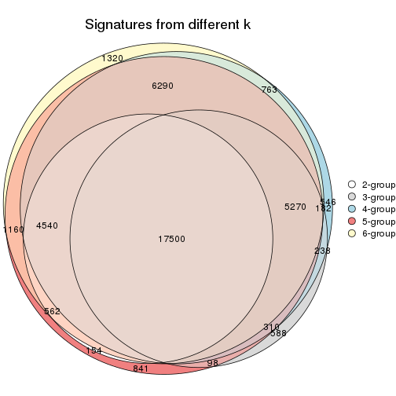

`get_signature()` returns a data frame invisibly. TO get the list of signatures, the function
call should be assigned to a variable explicitly. In following code, if `plot` argument is set
to `FALSE`, no heatmap is plotted while only the differential analysis is performed.

```r
# code only for demonstration
tb = get_signature(res, k = ..., plot = FALSE)
```

An example of the output of `tb` is:

```
#>   which_row         fdr    mean_1    mean_2 scaled_mean_1 scaled_mean_2 km
#> 1        38 0.042760348  8.373488  9.131774    -0.5533452     0.5164555  1
#> 2        40 0.018707592  7.106213  8.469186    -0.6173731     0.5762149  1
#> 3        55 0.019134737 10.221463 11.207825    -0.6159697     0.5749050  1
#> 4        59 0.006059896  5.921854  7.869574    -0.6899429     0.6439467  1
#> 5        60 0.018055526  8.928898 10.211722    -0.6204761     0.5791110  1
#> 6        98 0.009384629 15.714769 14.887706     0.6635654    -0.6193277  2
...
```

The columns in `tb` are:

1. `which_row`: row indices corresponding to the input matrix.
2. `fdr`: FDR for the differential test. 
3. `mean_x`: The mean value in group x.
4. `scaled_mean_x`: The mean value in group x after rows are scaled.
5. `km`: Row groups if k-means clustering is applied to rows.


UMAP plot which shows how samples are separated.


<script>
$( function() {
	$( '#tabs-ATC-kmeans-dimension-reduction' ).tabs();
} );
</script>
<div id='tabs-ATC-kmeans-dimension-reduction'>
<ul>
<li><a href='#tab-ATC-kmeans-dimension-reduction-1'>k = 2</a></li>
<li><a href='#tab-ATC-kmeans-dimension-reduction-2'>k = 3</a></li>
<li><a href='#tab-ATC-kmeans-dimension-reduction-3'>k = 4</a></li>
<li><a href='#tab-ATC-kmeans-dimension-reduction-4'>k = 5</a></li>
<li><a href='#tab-ATC-kmeans-dimension-reduction-5'>k = 6</a></li>
</ul>
<div id='tab-ATC-kmeans-dimension-reduction-1'>
<pre><code class="r">dimension_reduction(res, k = 2, method = &quot;UMAP&quot;)
</code></pre>

<p></p>

</div>
<div id='tab-ATC-kmeans-dimension-reduction-2'>
<pre><code class="r">dimension_reduction(res, k = 3, method = &quot;UMAP&quot;)
</code></pre>

<p></p>

</div>
<div id='tab-ATC-kmeans-dimension-reduction-3'>
<pre><code class="r">dimension_reduction(res, k = 4, method = &quot;UMAP&quot;)
</code></pre>

<p></p>

</div>
<div id='tab-ATC-kmeans-dimension-reduction-4'>
<pre><code class="r">dimension_reduction(res, k = 5, method = &quot;UMAP&quot;)
</code></pre>

<p></p>

</div>
<div id='tab-ATC-kmeans-dimension-reduction-5'>
<pre><code class="r">dimension_reduction(res, k = 6, method = &quot;UMAP&quot;)
</code></pre>

<p></p>

</div>
</div>


Following heatmap shows how subgroups are split when increasing `k`:

```r
collect_classes(res)
```


Test correlation between subgroups and known annotations. If the known
annotation is numeric, one-way ANOVA test is applied, and if the known
annotation is discrete, chi-squared contingency table test is applied.

```r
test_to_known_factors(res)
```

```
#>              n cell.line(p) tissue(p) disease.state(p) k
#> ATC:kmeans 173     2.25e-13  5.36e-25         2.29e-10 2
#> ATC:kmeans  93     7.31e-08  2.99e-17         4.16e-12 3
#> ATC:kmeans 167     2.55e-34  3.98e-72         1.98e-49 4
#> ATC:kmeans 137     5.25e-37  9.61e-78         3.42e-41 5
#> ATC:kmeans 135     1.95e-44  4.73e-79         1.30e-38 6
```


If matrix rows can be associated to genes, consider to use `GO_Enrichment(res,
...)` to perform function enrichment for the signature genes.


 

---------------------------------------------------


### ATC:skmeans**


The object with results only for a single top-value method and a single partition method 
can be extracted as:

```r
res = res_list["ATC", "skmeans"]
# you can also extract it by
# res = res_list["ATC:skmeans"]
```

A summary of `res` and all the functions that can be applied to it:

```r
res
```

```
#> A 'ConsensusPartition' object with k = 2, 3, 4, 5, 6.
#>   On a matrix with 51941 rows and 174 columns.
#>   Top rows (1000, 2000, 3000, 4000, 5000) are extracted by 'ATC' method.
#>   Subgroups are detected by 'skmeans' method.
#>   Performed in total 1250 partitions by row resampling.
#>   Best k for subgroups seems to be 3.
#> 
#> Following methods can be applied to this 'ConsensusPartition' object:
#>  [1] "cola_report"             "collect_classes"         "collect_plots"          
#>  [4] "collect_stats"           "colnames"                "compare_signatures"     
#>  [7] "consensus_heatmap"       "dimension_reduction"     "functional_enrichment"  
#> [10] "get_anno_col"            "get_anno"                "get_classes"            
#> [13] "get_consensus"           "get_matrix"              "get_membership"         
#> [16] "get_param"               "get_signatures"          "get_stats"              
#> [19] "is_best_k"               "is_stable_k"             "membership_heatmap"     
#> [22] "ncol"                    "nrow"                    "plot_ecdf"              
#> [25] "rownames"                "select_partition_number" "show"                   
#> [28] "suggest_best_k"          "test_to_known_factors"
```

`collect_plots()` function collects all the plots made from `res` for all `k` (number of partitions)
into one single page to provide an easy and fast comparison between different `k`.

```r
collect_plots(res)
```


The plots are:

- The first row: a plot of the ECDF (Empirical cumulative distribution
  function) curves of the consensus matrix for each `k` and the heatmap of
  predicted classes for each `k`.
- The second row: heatmaps of the consensus matrix for each `k`.
- The third row: heatmaps of the membership matrix for each `k`.
- The fouth row: heatmaps of the signatures for each `k`.

All the plots in panels can be made by individual functions and they are
plotted later in this section.

`select_partition_number()` produces several plots showing different
statistics for choosing "optimized" `k`. There are following statistics:

- ECDF curves of the consensus matrix for each `k`;
- 1-PAC. [The PAC
  score](https://en.wikipedia.org/wiki/Consensus_clustering#Over-interpretation_potential_of_consensus_clustering)
  measures the proportion of the ambiguous subgrouping.
- Mean silhouette score.
- Concordance. The mean probability of fiting the consensus class ids in all
  partitions.
- Area increased. Denote $A_k$ as the area under the ECDF curve for current
  `k`, the area increased is defined as $A_k - A_{k-1}$.
- Rand index. The percent of pairs of samples that are both in a same cluster
  or both are not in a same cluster in the partition of k and k-1.
- Jaccard index. The ratio of pairs of samples are both in a same cluster in
  the partition of k and k-1 and the pairs of samples are both in a same
  cluster in the partition k or k-1.

The detailed explanations of these statistics can be found in [the cola
vignette](http://bioconductor.org/packages/devel/bioc/vignettes/cola/inst/doc/cola.html#toc_13).

Generally speaking, lower PAC score, higher mean silhouette score or higher
concordance corresponds to better partition. Rand index and Jaccard index
measure how similar the current partition is compared to partition with `k-1`.
If they are too similar, we won't accept `k` is better than `k-1`.

```r
select_partition_number(res)
```


The numeric values for all these statistics can be obtained by `get_stats()`.

```r
get_stats(res)
```

```
#>   k 1-PAC mean_silhouette concordance area_increased  Rand Jaccard
#> 2 2 1.000           0.982       0.992         0.4889 0.514   0.514
#> 3 3 1.000           0.991       0.997         0.2629 0.864   0.737
#> 4 4 0.790           0.744       0.832         0.1307 0.943   0.850
#> 5 5 0.833           0.696       0.849         0.1096 0.843   0.548
#> 6 6 0.802           0.757       0.851         0.0331 0.934   0.722
```

`suggest_best_k()` suggests the best $k$ based on these statistics. The rules are as follows:

- All $k$ with Jaccard index larger than 0.95 are removed because the increase of
  the partition number does not provides enough extra information. If all $k$ are removed,
  the best $k$ is assigned by `NA`.
- For $k$ with 1-PAC larger than 0.9, the maximal $k$ is taken as the "best k". Other $k$ is called "optional k".
- If it does not fit the second rule. The $k$ with the highest vote of highest
  1-PAC, mean silhouette and concordance is taken as the "best k".

```r
suggest_best_k(res)
```

```
#> [1] 3
#> attr(,"optional")
#> [1] 2
```

There is also optional best $k$ = 2 that is worth to check.

Following shows the table of the partitions (You need to click the **show/hide
code output** link to see it). The membership matrix (columns with name `p*`)
is inferred by
[`clue::cl_consensus()`](https://www.rdocumentation.org/link/cl_consensus?package=clue)
function with the `SE` method. Basically the value in the membership matrix
represents the probability to belong to a certain group. The finall class
label for an item is determined with the group with highest probability it
belongs to.

In `get_classes()` function, the entropy is calculated from the membership
matrix and the silhouette score is calculated from the consensus matrix.


<script>
$( function() {
	$( '#tabs-ATC-skmeans-get-classes' ).tabs();
} );
</script>
<div id='tabs-ATC-skmeans-get-classes'>
<ul>
<li><a href='#tab-ATC-skmeans-get-classes-1'>k = 2</a></li>
<li><a href='#tab-ATC-skmeans-get-classes-2'>k = 3</a></li>
<li><a href='#tab-ATC-skmeans-get-classes-3'>k = 4</a></li>
<li><a href='#tab-ATC-skmeans-get-classes-4'>k = 5</a></li>
<li><a href='#tab-ATC-skmeans-get-classes-5'>k = 6</a></li>
</ul>

<div id='tab-ATC-skmeans-get-classes-1'>
<p><a id='tab-ATC-skmeans-get-classes-1-a' style='color:#0366d6' href='#'>show/hide code output</a></p>
<pre><code class="r">cbind(get_classes(res, k = 2), get_membership(res, k = 2))
</code></pre>

<pre><code>#&gt;           class entropy silhouette    p1    p2
#&gt; GSM803615     2  0.0000      1.000 0.000 1.000
#&gt; GSM803674     2  0.0000      1.000 0.000 1.000
#&gt; GSM803733     2  0.0000      1.000 0.000 1.000
#&gt; GSM803616     2  0.0000      1.000 0.000 1.000
#&gt; GSM803675     2  0.0000      1.000 0.000 1.000
#&gt; GSM803734     2  0.0000      1.000 0.000 1.000
#&gt; GSM803617     2  0.0000      1.000 0.000 1.000
#&gt; GSM803676     2  0.0000      1.000 0.000 1.000
#&gt; GSM803735     2  0.0000      1.000 0.000 1.000
#&gt; GSM803618     2  0.0000      1.000 0.000 1.000
#&gt; GSM803677     2  0.0000      1.000 0.000 1.000
#&gt; GSM803736     2  0.0000      1.000 0.000 1.000
#&gt; GSM803619     2  0.0000      1.000 0.000 1.000
#&gt; GSM803678     2  0.0000      1.000 0.000 1.000
#&gt; GSM803737     2  0.0000      1.000 0.000 1.000
#&gt; GSM803620     2  0.0000      1.000 0.000 1.000
#&gt; GSM803679     2  0.0000      1.000 0.000 1.000
#&gt; GSM803738     2  0.0000      1.000 0.000 1.000
#&gt; GSM803621     1  0.0000      0.987 1.000 0.000
#&gt; GSM803680     1  0.0000      0.987 1.000 0.000
#&gt; GSM803739     1  0.0000      0.987 1.000 0.000
#&gt; GSM803622     1  0.0000      0.987 1.000 0.000
#&gt; GSM803681     1  0.0000      0.987 1.000 0.000
#&gt; GSM803740     1  0.0000      0.987 1.000 0.000
#&gt; GSM803623     2  0.0000      1.000 0.000 1.000
#&gt; GSM803682     2  0.0000      1.000 0.000 1.000
#&gt; GSM803741     2  0.0000      1.000 0.000 1.000
#&gt; GSM803624     2  0.0000      1.000 0.000 1.000
#&gt; GSM803683     1  0.0000      0.987 1.000 0.000
#&gt; GSM803742     1  0.0000      0.987 1.000 0.000
#&gt; GSM803625     1  0.0000      0.987 1.000 0.000
#&gt; GSM803684     1  0.0000      0.987 1.000 0.000
#&gt; GSM803743     1  0.0000      0.987 1.000 0.000
#&gt; GSM803626     1  0.8861      0.577 0.696 0.304
#&gt; GSM803685     1  0.0000      0.987 1.000 0.000
#&gt; GSM803744     2  0.0000      1.000 0.000 1.000
#&gt; GSM803627     1  0.0000      0.987 1.000 0.000
#&gt; GSM803686     1  0.0000      0.987 1.000 0.000
#&gt; GSM803745     1  0.0000      0.987 1.000 0.000
#&gt; GSM803628     1  0.0000      0.987 1.000 0.000
#&gt; GSM803687     1  0.0000      0.987 1.000 0.000
#&gt; GSM803746     1  0.0000      0.987 1.000 0.000
#&gt; GSM803629     1  0.0000      0.987 1.000 0.000
#&gt; GSM803688     1  0.0000      0.987 1.000 0.000
#&gt; GSM803747     1  0.0000      0.987 1.000 0.000
#&gt; GSM803630     1  0.0000      0.987 1.000 0.000
#&gt; GSM803689     1  0.0000      0.987 1.000 0.000
#&gt; GSM803748     1  0.0000      0.987 1.000 0.000
#&gt; GSM803631     1  0.0000      0.987 1.000 0.000
#&gt; GSM803690     1  0.0000      0.987 1.000 0.000
#&gt; GSM803749     1  0.0000      0.987 1.000 0.000
#&gt; GSM803632     1  0.0000      0.987 1.000 0.000
#&gt; GSM803691     1  0.0000      0.987 1.000 0.000
#&gt; GSM803750     1  0.0000      0.987 1.000 0.000
#&gt; GSM803633     2  0.0000      1.000 0.000 1.000
#&gt; GSM803692     2  0.0000      1.000 0.000 1.000
#&gt; GSM803751     2  0.0000      1.000 0.000 1.000
#&gt; GSM803634     2  0.0000      1.000 0.000 1.000
#&gt; GSM803693     2  0.0000      1.000 0.000 1.000
#&gt; GSM803752     2  0.0000      1.000 0.000 1.000
#&gt; GSM803635     2  0.0000      1.000 0.000 1.000
#&gt; GSM803694     2  0.0000      1.000 0.000 1.000
#&gt; GSM803753     2  0.0000      1.000 0.000 1.000
#&gt; GSM803636     2  0.0000      1.000 0.000 1.000
#&gt; GSM803695     2  0.0000      1.000 0.000 1.000
#&gt; GSM803754     2  0.0000      1.000 0.000 1.000
#&gt; GSM803637     2  0.0000      1.000 0.000 1.000
#&gt; GSM803696     2  0.0000      1.000 0.000 1.000
#&gt; GSM803755     2  0.0000      1.000 0.000 1.000
#&gt; GSM803638     2  0.0000      1.000 0.000 1.000
#&gt; GSM803697     2  0.0000      1.000 0.000 1.000
#&gt; GSM803756     2  0.0000      1.000 0.000 1.000
#&gt; GSM803639     2  0.0000      1.000 0.000 1.000
#&gt; GSM803698     2  0.0000      1.000 0.000 1.000
#&gt; GSM803757     2  0.0000      1.000 0.000 1.000
#&gt; GSM803640     1  0.0000      0.987 1.000 0.000
#&gt; GSM803699     1  0.0000      0.987 1.000 0.000
#&gt; GSM803758     1  0.0000      0.987 1.000 0.000
#&gt; GSM803641     1  0.0000      0.987 1.000 0.000
#&gt; GSM803700     1  0.0000      0.987 1.000 0.000
#&gt; GSM803759     1  0.0000      0.987 1.000 0.000
#&gt; GSM803642     1  0.0000      0.987 1.000 0.000
#&gt; GSM803701     1  0.0000      0.987 1.000 0.000
#&gt; GSM803760     1  0.0000      0.987 1.000 0.000
#&gt; GSM803643     1  0.0000      0.987 1.000 0.000
#&gt; GSM803702     1  0.0000      0.987 1.000 0.000
#&gt; GSM803644     1  0.0000      0.987 1.000 0.000
#&gt; GSM803703     1  0.0000      0.987 1.000 0.000
#&gt; GSM803761     1  0.0000      0.987 1.000 0.000
#&gt; GSM803645     1  0.0000      0.987 1.000 0.000
#&gt; GSM803704     1  0.0000      0.987 1.000 0.000
#&gt; GSM803762     1  0.0000      0.987 1.000 0.000
#&gt; GSM803646     1  0.0000      0.987 1.000 0.000
#&gt; GSM803705     1  0.0000      0.987 1.000 0.000
#&gt; GSM803763     1  0.0000      0.987 1.000 0.000
#&gt; GSM803647     1  0.0000      0.987 1.000 0.000
#&gt; GSM803706     1  0.0000      0.987 1.000 0.000
#&gt; GSM803764     1  0.0000      0.987 1.000 0.000
#&gt; GSM803648     1  0.0000      0.987 1.000 0.000
#&gt; GSM803707     1  0.0000      0.987 1.000 0.000
#&gt; GSM803765     1  0.0000      0.987 1.000 0.000
#&gt; GSM803649     1  0.0000      0.987 1.000 0.000
#&gt; GSM803708     1  0.0000      0.987 1.000 0.000
#&gt; GSM803766     1  0.0000      0.987 1.000 0.000
#&gt; GSM803650     1  0.0000      0.987 1.000 0.000
#&gt; GSM803709     1  0.0000      0.987 1.000 0.000
#&gt; GSM803767     1  0.0000      0.987 1.000 0.000
#&gt; GSM803651     1  0.0000      0.987 1.000 0.000
#&gt; GSM803710     1  0.0000      0.987 1.000 0.000
#&gt; GSM803768     1  0.0000      0.987 1.000 0.000
#&gt; GSM803652     1  0.0000      0.987 1.000 0.000
#&gt; GSM803711     1  0.0000      0.987 1.000 0.000
#&gt; GSM803653     2  0.0000      1.000 0.000 1.000
#&gt; GSM803712     2  0.0000      1.000 0.000 1.000
#&gt; GSM803769     2  0.0000      1.000 0.000 1.000
#&gt; GSM803654     2  0.0000      1.000 0.000 1.000
#&gt; GSM803713     2  0.0000      1.000 0.000 1.000
#&gt; GSM803770     2  0.0672      0.992 0.008 0.992
#&gt; GSM803655     2  0.0000      1.000 0.000 1.000
#&gt; GSM803714     2  0.0000      1.000 0.000 1.000
#&gt; GSM803771     2  0.0000      1.000 0.000 1.000
#&gt; GSM803656     2  0.0000      1.000 0.000 1.000
#&gt; GSM803715     2  0.0000      1.000 0.000 1.000
#&gt; GSM803772     2  0.0000      1.000 0.000 1.000
#&gt; GSM803657     2  0.0000      1.000 0.000 1.000
#&gt; GSM803716     2  0.0000      1.000 0.000 1.000
#&gt; GSM803773     2  0.0000      1.000 0.000 1.000
#&gt; GSM803658     2  0.0000      1.000 0.000 1.000
#&gt; GSM803717     2  0.0000      1.000 0.000 1.000
#&gt; GSM803774     2  0.0000      1.000 0.000 1.000
#&gt; GSM803659     2  0.0000      1.000 0.000 1.000
#&gt; GSM803718     2  0.0000      1.000 0.000 1.000
#&gt; GSM803775     2  0.0000      1.000 0.000 1.000
#&gt; GSM803660     1  0.0000      0.987 1.000 0.000
#&gt; GSM803719     1  0.0000      0.987 1.000 0.000
#&gt; GSM803776     1  0.0000      0.987 1.000 0.000
#&gt; GSM803661     1  0.0000      0.987 1.000 0.000
#&gt; GSM803720     1  0.0000      0.987 1.000 0.000
#&gt; GSM803777     1  0.0000      0.987 1.000 0.000
#&gt; GSM803662     1  0.0000      0.987 1.000 0.000
#&gt; GSM803732     1  0.0000      0.987 1.000 0.000
#&gt; GSM803778     1  0.0000      0.987 1.000 0.000
#&gt; GSM803663     1  0.0000      0.987 1.000 0.000
#&gt; GSM803721     1  0.0000      0.987 1.000 0.000
#&gt; GSM803779     1  0.0000      0.987 1.000 0.000
#&gt; GSM803664     2  0.0000      1.000 0.000 1.000
#&gt; GSM803722     2  0.0000      1.000 0.000 1.000
#&gt; GSM803780     2  0.0000      1.000 0.000 1.000
#&gt; GSM803665     1  0.0000      0.987 1.000 0.000
#&gt; GSM803723     1  0.0000      0.987 1.000 0.000
#&gt; GSM803781     1  0.2948      0.937 0.948 0.052
#&gt; GSM803666     1  0.0000      0.987 1.000 0.000
#&gt; GSM803724     1  0.0000      0.987 1.000 0.000
#&gt; GSM803782     1  0.2948      0.937 0.948 0.052
#&gt; GSM803667     1  0.0000      0.987 1.000 0.000
#&gt; GSM803725     1  0.0000      0.987 1.000 0.000
#&gt; GSM803783     1  0.0000      0.987 1.000 0.000
#&gt; GSM803668     1  0.0000      0.987 1.000 0.000
#&gt; GSM803726     1  0.0000      0.987 1.000 0.000
#&gt; GSM803784     1  0.0000      0.987 1.000 0.000
#&gt; GSM803669     1  0.0000      0.987 1.000 0.000
#&gt; GSM803727     1  0.0000      0.987 1.000 0.000
#&gt; GSM803670     1  0.8661      0.607 0.712 0.288
#&gt; GSM803728     1  0.8661      0.607 0.712 0.288
#&gt; GSM803785     1  0.9491      0.436 0.632 0.368
#&gt; GSM803671     1  0.0000      0.987 1.000 0.000
#&gt; GSM803729     1  0.0000      0.987 1.000 0.000
#&gt; GSM803786     1  0.0000      0.987 1.000 0.000
#&gt; GSM803672     1  0.0000      0.987 1.000 0.000
#&gt; GSM803730     1  0.0000      0.987 1.000 0.000
#&gt; GSM803787     1  0.0000      0.987 1.000 0.000
#&gt; GSM803673     2  0.0000      1.000 0.000 1.000
#&gt; GSM803731     2  0.0000      1.000 0.000 1.000
#&gt; GSM803788     2  0.0000      1.000 0.000 1.000
</code></pre>

<script>
$('#tab-ATC-skmeans-get-classes-1-a').parent().next().next().hide();
$('#tab-ATC-skmeans-get-classes-1-a').click(function(){
  $('#tab-ATC-skmeans-get-classes-1-a').parent().next().next().toggle();
  return(false);
});
</script>
</div>

<div id='tab-ATC-skmeans-get-classes-2'>
<p><a id='tab-ATC-skmeans-get-classes-2-a' style='color:#0366d6' href='#'>show/hide code output</a></p>
<pre><code class="r">cbind(get_classes(res, k = 3), get_membership(res, k = 3))
</code></pre>

<pre><code>#&gt;           class entropy silhouette    p1    p2    p3
#&gt; GSM803615     2   0.000      0.996 0.000 1.000 0.000
#&gt; GSM803674     2   0.000      0.996 0.000 1.000 0.000
#&gt; GSM803733     2   0.000      0.996 0.000 1.000 0.000
#&gt; GSM803616     2   0.000      0.996 0.000 1.000 0.000
#&gt; GSM803675     2   0.000      0.996 0.000 1.000 0.000
#&gt; GSM803734     2   0.000      0.996 0.000 1.000 0.000
#&gt; GSM803617     2   0.000      0.996 0.000 1.000 0.000
#&gt; GSM803676     2   0.000      0.996 0.000 1.000 0.000
#&gt; GSM803735     2   0.000      0.996 0.000 1.000 0.000
#&gt; GSM803618     2   0.000      0.996 0.000 1.000 0.000
#&gt; GSM803677     2   0.000      0.996 0.000 1.000 0.000
#&gt; GSM803736     2   0.000      0.996 0.000 1.000 0.000
#&gt; GSM803619     2   0.000      0.996 0.000 1.000 0.000
#&gt; GSM803678     2   0.000      0.996 0.000 1.000 0.000
#&gt; GSM803737     2   0.000      0.996 0.000 1.000 0.000
#&gt; GSM803620     2   0.000      0.996 0.000 1.000 0.000
#&gt; GSM803679     2   0.000      0.996 0.000 1.000 0.000
#&gt; GSM803738     2   0.000      0.996 0.000 1.000 0.000
#&gt; GSM803621     1   0.000      1.000 1.000 0.000 0.000
#&gt; GSM803680     1   0.000      1.000 1.000 0.000 0.000
#&gt; GSM803739     1   0.000      1.000 1.000 0.000 0.000
#&gt; GSM803622     1   0.000      1.000 1.000 0.000 0.000
#&gt; GSM803681     1   0.000      1.000 1.000 0.000 0.000
#&gt; GSM803740     1   0.000      1.000 1.000 0.000 0.000
#&gt; GSM803623     2   0.000      0.996 0.000 1.000 0.000
#&gt; GSM803682     2   0.000      0.996 0.000 1.000 0.000
#&gt; GSM803741     2   0.000      0.996 0.000 1.000 0.000
#&gt; GSM803624     2   0.000      0.996 0.000 1.000 0.000
#&gt; GSM803683     1   0.000      1.000 1.000 0.000 0.000
#&gt; GSM803742     1   0.000      1.000 1.000 0.000 0.000
#&gt; GSM803625     1   0.000      1.000 1.000 0.000 0.000
#&gt; GSM803684     1   0.000      1.000 1.000 0.000 0.000
#&gt; GSM803743     1   0.000      1.000 1.000 0.000 0.000
#&gt; GSM803626     3   0.000      0.985 0.000 0.000 1.000
#&gt; GSM803685     3   0.593      0.448 0.356 0.000 0.644
#&gt; GSM803744     3   0.000      0.985 0.000 0.000 1.000
#&gt; GSM803627     1   0.000      1.000 1.000 0.000 0.000
#&gt; GSM803686     1   0.000      1.000 1.000 0.000 0.000
#&gt; GSM803745     1   0.000      1.000 1.000 0.000 0.000
#&gt; GSM803628     1   0.000      1.000 1.000 0.000 0.000
#&gt; GSM803687     1   0.000      1.000 1.000 0.000 0.000
#&gt; GSM803746     1   0.000      1.000 1.000 0.000 0.000
#&gt; GSM803629     1   0.000      1.000 1.000 0.000 0.000
#&gt; GSM803688     1   0.000      1.000 1.000 0.000 0.000
#&gt; GSM803747     1   0.000      1.000 1.000 0.000 0.000
#&gt; GSM803630     1   0.000      1.000 1.000 0.000 0.000
#&gt; GSM803689     1   0.000      1.000 1.000 0.000 0.000
#&gt; GSM803748     1   0.000      1.000 1.000 0.000 0.000
#&gt; GSM803631     1   0.000      1.000 1.000 0.000 0.000
#&gt; GSM803690     1   0.000      1.000 1.000 0.000 0.000
#&gt; GSM803749     1   0.000      1.000 1.000 0.000 0.000
#&gt; GSM803632     1   0.000      1.000 1.000 0.000 0.000
#&gt; GSM803691     1   0.000      1.000 1.000 0.000 0.000
#&gt; GSM803750     1   0.000      1.000 1.000 0.000 0.000
#&gt; GSM803633     2   0.000      0.996 0.000 1.000 0.000
#&gt; GSM803692     2   0.000      0.996 0.000 1.000 0.000
#&gt; GSM803751     2   0.000      0.996 0.000 1.000 0.000
#&gt; GSM803634     2   0.000      0.996 0.000 1.000 0.000
#&gt; GSM803693     2   0.000      0.996 0.000 1.000 0.000
#&gt; GSM803752     2   0.000      0.996 0.000 1.000 0.000
#&gt; GSM803635     2   0.000      0.996 0.000 1.000 0.000
#&gt; GSM803694     2   0.000      0.996 0.000 1.000 0.000
#&gt; GSM803753     2   0.000      0.996 0.000 1.000 0.000
#&gt; GSM803636     2   0.000      0.996 0.000 1.000 0.000
#&gt; GSM803695     2   0.000      0.996 0.000 1.000 0.000
#&gt; GSM803754     2   0.000      0.996 0.000 1.000 0.000
#&gt; GSM803637     2   0.000      0.996 0.000 1.000 0.000
#&gt; GSM803696     2   0.000      0.996 0.000 1.000 0.000
#&gt; GSM803755     2   0.000      0.996 0.000 1.000 0.000
#&gt; GSM803638     2   0.000      0.996 0.000 1.000 0.000
#&gt; GSM803697     2   0.000      0.996 0.000 1.000 0.000
#&gt; GSM803756     2   0.000      0.996 0.000 1.000 0.000
#&gt; GSM803639     2   0.000      0.996 0.000 1.000 0.000
#&gt; GSM803698     2   0.000      0.996 0.000 1.000 0.000
#&gt; GSM803757     2   0.000      0.996 0.000 1.000 0.000
#&gt; GSM803640     1   0.000      1.000 1.000 0.000 0.000
#&gt; GSM803699     1   0.000      1.000 1.000 0.000 0.000
#&gt; GSM803758     1   0.000      1.000 1.000 0.000 0.000
#&gt; GSM803641     1   0.000      1.000 1.000 0.000 0.000
#&gt; GSM803700     1   0.000      1.000 1.000 0.000 0.000
#&gt; GSM803759     1   0.000      1.000 1.000 0.000 0.000
#&gt; GSM803642     1   0.000      1.000 1.000 0.000 0.000
#&gt; GSM803701     1   0.000      1.000 1.000 0.000 0.000
#&gt; GSM803760     1   0.000      1.000 1.000 0.000 0.000
#&gt; GSM803643     1   0.000      1.000 1.000 0.000 0.000
#&gt; GSM803702     1   0.000      1.000 1.000 0.000 0.000
#&gt; GSM803644     1   0.000      1.000 1.000 0.000 0.000
#&gt; GSM803703     1   0.000      1.000 1.000 0.000 0.000
#&gt; GSM803761     1   0.000      1.000 1.000 0.000 0.000
#&gt; GSM803645     1   0.000      1.000 1.000 0.000 0.000
#&gt; GSM803704     1   0.000      1.000 1.000 0.000 0.000
#&gt; GSM803762     1   0.000      1.000 1.000 0.000 0.000
#&gt; GSM803646     1   0.000      1.000 1.000 0.000 0.000
#&gt; GSM803705     1   0.000      1.000 1.000 0.000 0.000
#&gt; GSM803763     1   0.000      1.000 1.000 0.000 0.000
#&gt; GSM803647     1   0.000      1.000 1.000 0.000 0.000
#&gt; GSM803706     1   0.000      1.000 1.000 0.000 0.000
#&gt; GSM803764     1   0.000      1.000 1.000 0.000 0.000
#&gt; GSM803648     1   0.000      1.000 1.000 0.000 0.000
#&gt; GSM803707     1   0.000      1.000 1.000 0.000 0.000
#&gt; GSM803765     1   0.000      1.000 1.000 0.000 0.000
#&gt; GSM803649     1   0.000      1.000 1.000 0.000 0.000
#&gt; GSM803708     1   0.000      1.000 1.000 0.000 0.000
#&gt; GSM803766     1   0.000      1.000 1.000 0.000 0.000
#&gt; GSM803650     1   0.000      1.000 1.000 0.000 0.000
#&gt; GSM803709     1   0.000      1.000 1.000 0.000 0.000
#&gt; GSM803767     1   0.000      1.000 1.000 0.000 0.000
#&gt; GSM803651     1   0.000      1.000 1.000 0.000 0.000
#&gt; GSM803710     1   0.000      1.000 1.000 0.000 0.000
#&gt; GSM803768     1   0.000      1.000 1.000 0.000 0.000
#&gt; GSM803652     1   0.000      1.000 1.000 0.000 0.000
#&gt; GSM803711     1   0.000      1.000 1.000 0.000 0.000
#&gt; GSM803653     2   0.000      0.996 0.000 1.000 0.000
#&gt; GSM803712     2   0.000      0.996 0.000 1.000 0.000
#&gt; GSM803769     2   0.000      0.996 0.000 1.000 0.000
#&gt; GSM803654     2   0.000      0.996 0.000 1.000 0.000
#&gt; GSM803713     2   0.000      0.996 0.000 1.000 0.000
#&gt; GSM803770     2   0.497      0.658 0.236 0.764 0.000
#&gt; GSM803655     2   0.000      0.996 0.000 1.000 0.000
#&gt; GSM803714     2   0.000      0.996 0.000 1.000 0.000
#&gt; GSM803771     2   0.000      0.996 0.000 1.000 0.000
#&gt; GSM803656     2   0.000      0.996 0.000 1.000 0.000
#&gt; GSM803715     2   0.000      0.996 0.000 1.000 0.000
#&gt; GSM803772     2   0.000      0.996 0.000 1.000 0.000
#&gt; GSM803657     2   0.000      0.996 0.000 1.000 0.000
#&gt; GSM803716     2   0.000      0.996 0.000 1.000 0.000
#&gt; GSM803773     2   0.000      0.996 0.000 1.000 0.000
#&gt; GSM803658     2   0.000      0.996 0.000 1.000 0.000
#&gt; GSM803717     2   0.000      0.996 0.000 1.000 0.000
#&gt; GSM803774     2   0.000      0.996 0.000 1.000 0.000
#&gt; GSM803659     2   0.000      0.996 0.000 1.000 0.000
#&gt; GSM803718     2   0.000      0.996 0.000 1.000 0.000
#&gt; GSM803775     2   0.000      0.996 0.000 1.000 0.000
#&gt; GSM803660     1   0.000      1.000 1.000 0.000 0.000
#&gt; GSM803719     1   0.000      1.000 1.000 0.000 0.000
#&gt; GSM803776     1   0.000      1.000 1.000 0.000 0.000
#&gt; GSM803661     1   0.000      1.000 1.000 0.000 0.000
#&gt; GSM803720     1   0.000      1.000 1.000 0.000 0.000
#&gt; GSM803777     1   0.000      1.000 1.000 0.000 0.000
#&gt; GSM803662     1   0.000      1.000 1.000 0.000 0.000
#&gt; GSM803732     1   0.000      1.000 1.000 0.000 0.000
#&gt; GSM803778     1   0.000      1.000 1.000 0.000 0.000
#&gt; GSM803663     1   0.000      1.000 1.000 0.000 0.000
#&gt; GSM803721     1   0.000      1.000 1.000 0.000 0.000
#&gt; GSM803779     1   0.000      1.000 1.000 0.000 0.000
#&gt; GSM803664     2   0.000      0.996 0.000 1.000 0.000
#&gt; GSM803722     2   0.000      0.996 0.000 1.000 0.000
#&gt; GSM803780     2   0.000      0.996 0.000 1.000 0.000
#&gt; GSM803665     3   0.000      0.985 0.000 0.000 1.000
#&gt; GSM803723     3   0.000      0.985 0.000 0.000 1.000
#&gt; GSM803781     3   0.000      0.985 0.000 0.000 1.000
#&gt; GSM803666     3   0.000      0.985 0.000 0.000 1.000
#&gt; GSM803724     3   0.000      0.985 0.000 0.000 1.000
#&gt; GSM803782     3   0.000      0.985 0.000 0.000 1.000
#&gt; GSM803667     3   0.000      0.985 0.000 0.000 1.000
#&gt; GSM803725     3   0.000      0.985 0.000 0.000 1.000
#&gt; GSM803783     3   0.000      0.985 0.000 0.000 1.000
#&gt; GSM803668     3   0.000      0.985 0.000 0.000 1.000
#&gt; GSM803726     3   0.000      0.985 0.000 0.000 1.000
#&gt; GSM803784     3   0.000      0.985 0.000 0.000 1.000
#&gt; GSM803669     3   0.000      0.985 0.000 0.000 1.000
#&gt; GSM803727     3   0.000      0.985 0.000 0.000 1.000
#&gt; GSM803670     3   0.000      0.985 0.000 0.000 1.000
#&gt; GSM803728     3   0.000      0.985 0.000 0.000 1.000
#&gt; GSM803785     3   0.000      0.985 0.000 0.000 1.000
#&gt; GSM803671     3   0.000      0.985 0.000 0.000 1.000
#&gt; GSM803729     3   0.000      0.985 0.000 0.000 1.000
#&gt; GSM803786     3   0.000      0.985 0.000 0.000 1.000
#&gt; GSM803672     3   0.000      0.985 0.000 0.000 1.000
#&gt; GSM803730     3   0.000      0.985 0.000 0.000 1.000
#&gt; GSM803787     3   0.000      0.985 0.000 0.000 1.000
#&gt; GSM803673     2   0.000      0.996 0.000 1.000 0.000
#&gt; GSM803731     2   0.000      0.996 0.000 1.000 0.000
#&gt; GSM803788     2   0.000      0.996 0.000 1.000 0.000
</code></pre>

<script>
$('#tab-ATC-skmeans-get-classes-2-a').parent().next().next().hide();
$('#tab-ATC-skmeans-get-classes-2-a').click(function(){
  $('#tab-ATC-skmeans-get-classes-2-a').parent().next().next().toggle();
  return(false);
});
</script>
</div>

<div id='tab-ATC-skmeans-get-classes-3'>
<p><a id='tab-ATC-skmeans-get-classes-3-a' style='color:#0366d6' href='#'>show/hide code output</a></p>
<pre><code class="r">cbind(get_classes(res, k = 4), get_membership(res, k = 4))
</code></pre>

<pre><code>#&gt;           class entropy silhouette    p1    p2    p3    p4
#&gt; GSM803615     2  0.0000     0.5737 0.000 1.000 0.000 0.000
#&gt; GSM803674     2  0.0000     0.5737 0.000 1.000 0.000 0.000
#&gt; GSM803733     2  0.0000     0.5737 0.000 1.000 0.000 0.000
#&gt; GSM803616     2  0.0000     0.5737 0.000 1.000 0.000 0.000
#&gt; GSM803675     2  0.0000     0.5737 0.000 1.000 0.000 0.000
#&gt; GSM803734     2  0.0000     0.5737 0.000 1.000 0.000 0.000
#&gt; GSM803617     2  0.0000     0.5737 0.000 1.000 0.000 0.000
#&gt; GSM803676     2  0.0000     0.5737 0.000 1.000 0.000 0.000
#&gt; GSM803735     2  0.0000     0.5737 0.000 1.000 0.000 0.000
#&gt; GSM803618     2  0.0000     0.5737 0.000 1.000 0.000 0.000
#&gt; GSM803677     2  0.0000     0.5737 0.000 1.000 0.000 0.000
#&gt; GSM803736     2  0.0000     0.5737 0.000 1.000 0.000 0.000
#&gt; GSM803619     2  0.0000     0.5737 0.000 1.000 0.000 0.000
#&gt; GSM803678     2  0.0000     0.5737 0.000 1.000 0.000 0.000
#&gt; GSM803737     2  0.0000     0.5737 0.000 1.000 0.000 0.000
#&gt; GSM803620     2  0.0000     0.5737 0.000 1.000 0.000 0.000
#&gt; GSM803679     2  0.0000     0.5737 0.000 1.000 0.000 0.000
#&gt; GSM803738     2  0.0000     0.5737 0.000 1.000 0.000 0.000
#&gt; GSM803621     1  0.0000     0.9172 1.000 0.000 0.000 0.000
#&gt; GSM803680     1  0.0000     0.9172 1.000 0.000 0.000 0.000
#&gt; GSM803739     1  0.0000     0.9172 1.000 0.000 0.000 0.000
#&gt; GSM803622     1  0.0000     0.9172 1.000 0.000 0.000 0.000
#&gt; GSM803681     1  0.0000     0.9172 1.000 0.000 0.000 0.000
#&gt; GSM803740     1  0.0000     0.9172 1.000 0.000 0.000 0.000
#&gt; GSM803623     2  0.4866     0.4664 0.000 0.596 0.000 0.404
#&gt; GSM803682     2  0.4866     0.4664 0.000 0.596 0.000 0.404
#&gt; GSM803741     2  0.4866     0.4664 0.000 0.596 0.000 0.404
#&gt; GSM803624     4  0.1557     0.6062 0.000 0.056 0.000 0.944
#&gt; GSM803683     1  0.4134     0.8149 0.740 0.000 0.000 0.260
#&gt; GSM803742     1  0.4304     0.7989 0.716 0.000 0.000 0.284
#&gt; GSM803625     1  0.0000     0.9172 1.000 0.000 0.000 0.000
#&gt; GSM803684     1  0.0000     0.9172 1.000 0.000 0.000 0.000
#&gt; GSM803743     1  0.0000     0.9172 1.000 0.000 0.000 0.000
#&gt; GSM803626     3  0.0000     0.9775 0.000 0.000 1.000 0.000
#&gt; GSM803685     3  0.4916     0.2352 0.424 0.000 0.576 0.000
#&gt; GSM803744     3  0.0000     0.9775 0.000 0.000 1.000 0.000
#&gt; GSM803627     1  0.0000     0.9172 1.000 0.000 0.000 0.000
#&gt; GSM803686     1  0.0000     0.9172 1.000 0.000 0.000 0.000
#&gt; GSM803745     1  0.0000     0.9172 1.000 0.000 0.000 0.000
#&gt; GSM803628     1  0.0000     0.9172 1.000 0.000 0.000 0.000
#&gt; GSM803687     1  0.0000     0.9172 1.000 0.000 0.000 0.000
#&gt; GSM803746     1  0.0000     0.9172 1.000 0.000 0.000 0.000
#&gt; GSM803629     1  0.0000     0.9172 1.000 0.000 0.000 0.000
#&gt; GSM803688     1  0.0000     0.9172 1.000 0.000 0.000 0.000
#&gt; GSM803747     1  0.0000     0.9172 1.000 0.000 0.000 0.000
#&gt; GSM803630     1  0.0000     0.9172 1.000 0.000 0.000 0.000
#&gt; GSM803689     1  0.0000     0.9172 1.000 0.000 0.000 0.000
#&gt; GSM803748     1  0.0000     0.9172 1.000 0.000 0.000 0.000
#&gt; GSM803631     1  0.0000     0.9172 1.000 0.000 0.000 0.000
#&gt; GSM803690     1  0.0000     0.9172 1.000 0.000 0.000 0.000
#&gt; GSM803749     1  0.0000     0.9172 1.000 0.000 0.000 0.000
#&gt; GSM803632     1  0.0000     0.9172 1.000 0.000 0.000 0.000
#&gt; GSM803691     1  0.0000     0.9172 1.000 0.000 0.000 0.000
#&gt; GSM803750     1  0.0000     0.9172 1.000 0.000 0.000 0.000
#&gt; GSM803633     2  0.4855     0.4718 0.000 0.600 0.000 0.400
#&gt; GSM803692     2  0.4855     0.4718 0.000 0.600 0.000 0.400
#&gt; GSM803751     2  0.4855     0.4718 0.000 0.600 0.000 0.400
#&gt; GSM803634     2  0.4855     0.4718 0.000 0.600 0.000 0.400
#&gt; GSM803693     2  0.4855     0.4718 0.000 0.600 0.000 0.400
#&gt; GSM803752     2  0.4855     0.4718 0.000 0.600 0.000 0.400
#&gt; GSM803635     2  0.4898     0.4474 0.000 0.584 0.000 0.416
#&gt; GSM803694     2  0.4898     0.4474 0.000 0.584 0.000 0.416
#&gt; GSM803753     2  0.4898     0.4474 0.000 0.584 0.000 0.416
#&gt; GSM803636     2  0.4898     0.4474 0.000 0.584 0.000 0.416
#&gt; GSM803695     2  0.4898     0.4474 0.000 0.584 0.000 0.416
#&gt; GSM803754     2  0.4898     0.4474 0.000 0.584 0.000 0.416
#&gt; GSM803637     2  0.4925     0.4206 0.000 0.572 0.000 0.428
#&gt; GSM803696     2  0.4925     0.4206 0.000 0.572 0.000 0.428
#&gt; GSM803755     2  0.4925     0.4206 0.000 0.572 0.000 0.428
#&gt; GSM803638     2  0.4855     0.4718 0.000 0.600 0.000 0.400
#&gt; GSM803697     2  0.4855     0.4718 0.000 0.600 0.000 0.400
#&gt; GSM803756     2  0.4855     0.4718 0.000 0.600 0.000 0.400
#&gt; GSM803639     2  0.4855     0.4718 0.000 0.600 0.000 0.400
#&gt; GSM803698     2  0.4855     0.4718 0.000 0.600 0.000 0.400
#&gt; GSM803757     2  0.4790     0.4795 0.000 0.620 0.000 0.380
#&gt; GSM803640     1  0.0000     0.9172 1.000 0.000 0.000 0.000
#&gt; GSM803699     1  0.0000     0.9172 1.000 0.000 0.000 0.000
#&gt; GSM803758     1  0.0000     0.9172 1.000 0.000 0.000 0.000
#&gt; GSM803641     1  0.0000     0.9172 1.000 0.000 0.000 0.000
#&gt; GSM803700     1  0.0000     0.9172 1.000 0.000 0.000 0.000
#&gt; GSM803759     1  0.0000     0.9172 1.000 0.000 0.000 0.000
#&gt; GSM803642     1  0.3801     0.8354 0.780 0.000 0.000 0.220
#&gt; GSM803701     1  0.3837     0.8334 0.776 0.000 0.000 0.224
#&gt; GSM803760     1  0.1557     0.9031 0.944 0.000 0.000 0.056
#&gt; GSM803643     1  0.3123     0.8653 0.844 0.000 0.000 0.156
#&gt; GSM803702     1  0.3172     0.8636 0.840 0.000 0.000 0.160
#&gt; GSM803644     1  0.0000     0.9172 1.000 0.000 0.000 0.000
#&gt; GSM803703     1  0.0000     0.9172 1.000 0.000 0.000 0.000
#&gt; GSM803761     1  0.0000     0.9172 1.000 0.000 0.000 0.000
#&gt; GSM803645     1  0.1557     0.9032 0.944 0.000 0.000 0.056
#&gt; GSM803704     1  0.1557     0.9032 0.944 0.000 0.000 0.056
#&gt; GSM803762     1  0.1557     0.9032 0.944 0.000 0.000 0.056
#&gt; GSM803646     1  0.4134     0.8142 0.740 0.000 0.000 0.260
#&gt; GSM803705     1  0.4134     0.8142 0.740 0.000 0.000 0.260
#&gt; GSM803763     1  0.4164     0.8119 0.736 0.000 0.000 0.264
#&gt; GSM803647     1  0.0188     0.9165 0.996 0.000 0.000 0.004
#&gt; GSM803706     1  0.0188     0.9165 0.996 0.000 0.000 0.004
#&gt; GSM803764     1  0.0188     0.9165 0.996 0.000 0.000 0.004
#&gt; GSM803648     1  0.4500     0.7689 0.684 0.000 0.000 0.316
#&gt; GSM803707     1  0.4500     0.7689 0.684 0.000 0.000 0.316
#&gt; GSM803765     1  0.4605     0.7484 0.664 0.000 0.000 0.336
#&gt; GSM803649     1  0.4193     0.8092 0.732 0.000 0.000 0.268
#&gt; GSM803708     1  0.4193     0.8092 0.732 0.000 0.000 0.268
#&gt; GSM803766     1  0.4193     0.8092 0.732 0.000 0.000 0.268
#&gt; GSM803650     1  0.0000     0.9172 1.000 0.000 0.000 0.000
#&gt; GSM803709     1  0.0000     0.9172 1.000 0.000 0.000 0.000
#&gt; GSM803767     1  0.0000     0.9172 1.000 0.000 0.000 0.000
#&gt; GSM803651     1  0.0000     0.9172 1.000 0.000 0.000 0.000
#&gt; GSM803710     1  0.0000     0.9172 1.000 0.000 0.000 0.000
#&gt; GSM803768     1  0.0000     0.9172 1.000 0.000 0.000 0.000
#&gt; GSM803652     1  0.0188     0.9165 0.996 0.000 0.000 0.004
#&gt; GSM803711     1  0.0188     0.9165 0.996 0.000 0.000 0.004
#&gt; GSM803653     2  0.4948    -0.0788 0.000 0.560 0.000 0.440
#&gt; GSM803712     2  0.4948    -0.0788 0.000 0.560 0.000 0.440
#&gt; GSM803769     2  0.4948    -0.0788 0.000 0.560 0.000 0.440
#&gt; GSM803654     4  0.1118     0.6342 0.000 0.036 0.000 0.964
#&gt; GSM803713     4  0.1118     0.6342 0.000 0.036 0.000 0.964
#&gt; GSM803770     4  0.1118     0.6342 0.000 0.036 0.000 0.964
#&gt; GSM803655     2  0.2704     0.5568 0.000 0.876 0.000 0.124
#&gt; GSM803714     2  0.2704     0.5568 0.000 0.876 0.000 0.124
#&gt; GSM803771     2  0.2704     0.5568 0.000 0.876 0.000 0.124
#&gt; GSM803656     2  0.4605     0.1946 0.000 0.664 0.000 0.336
#&gt; GSM803715     2  0.4605     0.1946 0.000 0.664 0.000 0.336
#&gt; GSM803772     2  0.4605     0.1946 0.000 0.664 0.000 0.336
#&gt; GSM803657     4  0.4134     0.7951 0.000 0.260 0.000 0.740
#&gt; GSM803716     4  0.4134     0.7951 0.000 0.260 0.000 0.740
#&gt; GSM803773     4  0.4134     0.7951 0.000 0.260 0.000 0.740
#&gt; GSM803658     4  0.4040     0.8161 0.000 0.248 0.000 0.752
#&gt; GSM803717     4  0.4040     0.8161 0.000 0.248 0.000 0.752
#&gt; GSM803774     4  0.4040     0.8161 0.000 0.248 0.000 0.752
#&gt; GSM803659     4  0.4040     0.8161 0.000 0.248 0.000 0.752
#&gt; GSM803718     4  0.4040     0.8161 0.000 0.248 0.000 0.752
#&gt; GSM803775     4  0.4040     0.8161 0.000 0.248 0.000 0.752
#&gt; GSM803660     1  0.4277     0.8004 0.720 0.000 0.000 0.280
#&gt; GSM803719     1  0.4277     0.8004 0.720 0.000 0.000 0.280
#&gt; GSM803776     1  0.4277     0.8004 0.720 0.000 0.000 0.280
#&gt; GSM803661     1  0.4134     0.8149 0.740 0.000 0.000 0.260
#&gt; GSM803720     1  0.4134     0.8149 0.740 0.000 0.000 0.260
#&gt; GSM803777     1  0.4134     0.8149 0.740 0.000 0.000 0.260
#&gt; GSM803662     1  0.4040     0.8210 0.752 0.000 0.000 0.248
#&gt; GSM803732     1  0.1867     0.8978 0.928 0.000 0.000 0.072
#&gt; GSM803778     1  0.1716     0.9006 0.936 0.000 0.000 0.064
#&gt; GSM803663     1  0.4643     0.7396 0.656 0.000 0.000 0.344
#&gt; GSM803721     1  0.4643     0.7396 0.656 0.000 0.000 0.344
#&gt; GSM803779     1  0.4643     0.7396 0.656 0.000 0.000 0.344
#&gt; GSM803664     2  0.4999     0.2169 0.000 0.508 0.000 0.492
#&gt; GSM803722     2  0.4999     0.2169 0.000 0.508 0.000 0.492
#&gt; GSM803780     2  0.4999     0.2169 0.000 0.508 0.000 0.492
#&gt; GSM803665     3  0.0000     0.9775 0.000 0.000 1.000 0.000
#&gt; GSM803723     3  0.0000     0.9775 0.000 0.000 1.000 0.000
#&gt; GSM803781     3  0.0000     0.9775 0.000 0.000 1.000 0.000
#&gt; GSM803666     3  0.0000     0.9775 0.000 0.000 1.000 0.000
#&gt; GSM803724     3  0.0000     0.9775 0.000 0.000 1.000 0.000
#&gt; GSM803782     3  0.0000     0.9775 0.000 0.000 1.000 0.000
#&gt; GSM803667     3  0.0000     0.9775 0.000 0.000 1.000 0.000
#&gt; GSM803725     3  0.0000     0.9775 0.000 0.000 1.000 0.000
#&gt; GSM803783     3  0.0000     0.9775 0.000 0.000 1.000 0.000
#&gt; GSM803668     3  0.0000     0.9775 0.000 0.000 1.000 0.000
#&gt; GSM803726     3  0.0000     0.9775 0.000 0.000 1.000 0.000
#&gt; GSM803784     3  0.0000     0.9775 0.000 0.000 1.000 0.000
#&gt; GSM803669     3  0.0000     0.9775 0.000 0.000 1.000 0.000
#&gt; GSM803727     3  0.0000     0.9775 0.000 0.000 1.000 0.000
#&gt; GSM803670     3  0.0000     0.9775 0.000 0.000 1.000 0.000
#&gt; GSM803728     3  0.0000     0.9775 0.000 0.000 1.000 0.000
#&gt; GSM803785     3  0.0000     0.9775 0.000 0.000 1.000 0.000
#&gt; GSM803671     3  0.0000     0.9775 0.000 0.000 1.000 0.000
#&gt; GSM803729     3  0.0000     0.9775 0.000 0.000 1.000 0.000
#&gt; GSM803786     3  0.0000     0.9775 0.000 0.000 1.000 0.000
#&gt; GSM803672     3  0.0000     0.9775 0.000 0.000 1.000 0.000
#&gt; GSM803730     3  0.0000     0.9775 0.000 0.000 1.000 0.000
#&gt; GSM803787     3  0.0000     0.9775 0.000 0.000 1.000 0.000
#&gt; GSM803673     4  0.3873     0.8095 0.000 0.228 0.000 0.772
#&gt; GSM803731     4  0.3873     0.8095 0.000 0.228 0.000 0.772
#&gt; GSM803788     4  0.3873     0.8095 0.000 0.228 0.000 0.772
</code></pre>

<script>
$('#tab-ATC-skmeans-get-classes-3-a').parent().next().next().hide();
$('#tab-ATC-skmeans-get-classes-3-a').click(function(){
  $('#tab-ATC-skmeans-get-classes-3-a').parent().next().next().toggle();
  return(false);
});
</script>
</div>

<div id='tab-ATC-skmeans-get-classes-4'>
<p><a id='tab-ATC-skmeans-get-classes-4-a' style='color:#0366d6' href='#'>show/hide code output</a></p>
<pre><code class="r">cbind(get_classes(res, k = 5), get_membership(res, k = 5))
</code></pre>

<pre><code>#&gt;           class entropy silhouette    p1    p2    p3    p4    p5
#&gt; GSM803615     4  0.0000     0.6301 0.000 0.000 0.000 1.000 0.000
#&gt; GSM803674     4  0.0000     0.6301 0.000 0.000 0.000 1.000 0.000
#&gt; GSM803733     4  0.0000     0.6301 0.000 0.000 0.000 1.000 0.000
#&gt; GSM803616     4  0.0000     0.6301 0.000 0.000 0.000 1.000 0.000
#&gt; GSM803675     4  0.0000     0.6301 0.000 0.000 0.000 1.000 0.000
#&gt; GSM803734     4  0.0000     0.6301 0.000 0.000 0.000 1.000 0.000
#&gt; GSM803617     4  0.0000     0.6301 0.000 0.000 0.000 1.000 0.000
#&gt; GSM803676     4  0.0000     0.6301 0.000 0.000 0.000 1.000 0.000
#&gt; GSM803735     4  0.0000     0.6301 0.000 0.000 0.000 1.000 0.000
#&gt; GSM803618     4  0.0000     0.6301 0.000 0.000 0.000 1.000 0.000
#&gt; GSM803677     4  0.0000     0.6301 0.000 0.000 0.000 1.000 0.000
#&gt; GSM803736     4  0.0000     0.6301 0.000 0.000 0.000 1.000 0.000
#&gt; GSM803619     4  0.0000     0.6301 0.000 0.000 0.000 1.000 0.000
#&gt; GSM803678     4  0.0000     0.6301 0.000 0.000 0.000 1.000 0.000
#&gt; GSM803737     4  0.0000     0.6301 0.000 0.000 0.000 1.000 0.000
#&gt; GSM803620     4  0.0000     0.6301 0.000 0.000 0.000 1.000 0.000
#&gt; GSM803679     4  0.0000     0.6301 0.000 0.000 0.000 1.000 0.000
#&gt; GSM803738     4  0.0000     0.6301 0.000 0.000 0.000 1.000 0.000
#&gt; GSM803621     1  0.0000     0.9376 1.000 0.000 0.000 0.000 0.000
#&gt; GSM803680     1  0.0000     0.9376 1.000 0.000 0.000 0.000 0.000
#&gt; GSM803739     1  0.0000     0.9376 1.000 0.000 0.000 0.000 0.000
#&gt; GSM803622     1  0.0000     0.9376 1.000 0.000 0.000 0.000 0.000
#&gt; GSM803681     1  0.0000     0.9376 1.000 0.000 0.000 0.000 0.000
#&gt; GSM803740     1  0.0000     0.9376 1.000 0.000 0.000 0.000 0.000
#&gt; GSM803623     4  0.4307     0.2089 0.000 0.496 0.000 0.504 0.000
#&gt; GSM803682     4  0.4307     0.2089 0.000 0.496 0.000 0.504 0.000
#&gt; GSM803741     4  0.4307     0.2089 0.000 0.496 0.000 0.504 0.000
#&gt; GSM803624     5  0.4675     0.3919 0.000 0.380 0.000 0.020 0.600
#&gt; GSM803683     5  0.2769     0.9080 0.092 0.032 0.000 0.000 0.876
#&gt; GSM803742     5  0.2830     0.9040 0.080 0.044 0.000 0.000 0.876
#&gt; GSM803625     1  0.0162     0.9364 0.996 0.000 0.000 0.000 0.004
#&gt; GSM803684     1  0.0162     0.9364 0.996 0.000 0.000 0.000 0.004
#&gt; GSM803743     1  0.0162     0.9364 0.996 0.000 0.000 0.000 0.004
#&gt; GSM803626     3  0.0000     0.9959 0.000 0.000 1.000 0.000 0.000
#&gt; GSM803685     1  0.4161     0.3534 0.608 0.000 0.392 0.000 0.000
#&gt; GSM803744     3  0.0000     0.9959 0.000 0.000 1.000 0.000 0.000
#&gt; GSM803627     1  0.0000     0.9376 1.000 0.000 0.000 0.000 0.000
#&gt; GSM803686     1  0.0000     0.9376 1.000 0.000 0.000 0.000 0.000
#&gt; GSM803745     1  0.0000     0.9376 1.000 0.000 0.000 0.000 0.000
#&gt; GSM803628     1  0.0000     0.9376 1.000 0.000 0.000 0.000 0.000
#&gt; GSM803687     1  0.0000     0.9376 1.000 0.000 0.000 0.000 0.000
#&gt; GSM803746     1  0.0000     0.9376 1.000 0.000 0.000 0.000 0.000
#&gt; GSM803629     1  0.0000     0.9376 1.000 0.000 0.000 0.000 0.000
#&gt; GSM803688     1  0.0000     0.9376 1.000 0.000 0.000 0.000 0.000
#&gt; GSM803747     1  0.0000     0.9376 1.000 0.000 0.000 0.000 0.000
#&gt; GSM803630     1  0.0000     0.9376 1.000 0.000 0.000 0.000 0.000
#&gt; GSM803689     1  0.0000     0.9376 1.000 0.000 0.000 0.000 0.000
#&gt; GSM803748     1  0.0000     0.9376 1.000 0.000 0.000 0.000 0.000
#&gt; GSM803631     1  0.0000     0.9376 1.000 0.000 0.000 0.000 0.000
#&gt; GSM803690     1  0.0000     0.9376 1.000 0.000 0.000 0.000 0.000
#&gt; GSM803749     1  0.0000     0.9376 1.000 0.000 0.000 0.000 0.000
#&gt; GSM803632     1  0.0000     0.9376 1.000 0.000 0.000 0.000 0.000
#&gt; GSM803691     1  0.0000     0.9376 1.000 0.000 0.000 0.000 0.000
#&gt; GSM803750     1  0.0000     0.9376 1.000 0.000 0.000 0.000 0.000
#&gt; GSM803633     4  0.4305     0.2280 0.000 0.488 0.000 0.512 0.000
#&gt; GSM803692     4  0.4305     0.2280 0.000 0.488 0.000 0.512 0.000
#&gt; GSM803751     4  0.4305     0.2280 0.000 0.488 0.000 0.512 0.000
#&gt; GSM803634     4  0.4306     0.2204 0.000 0.492 0.000 0.508 0.000
#&gt; GSM803693     4  0.4306     0.2204 0.000 0.492 0.000 0.508 0.000
#&gt; GSM803752     4  0.4306     0.2204 0.000 0.492 0.000 0.508 0.000
#&gt; GSM803635     2  0.4294    -0.1192 0.000 0.532 0.000 0.468 0.000
#&gt; GSM803694     2  0.4294    -0.1192 0.000 0.532 0.000 0.468 0.000
#&gt; GSM803753     2  0.4294    -0.1192 0.000 0.532 0.000 0.468 0.000
#&gt; GSM803636     2  0.4294    -0.1192 0.000 0.532 0.000 0.468 0.000
#&gt; GSM803695     2  0.4294    -0.1192 0.000 0.532 0.000 0.468 0.000
#&gt; GSM803754     2  0.4294    -0.1192 0.000 0.532 0.000 0.468 0.000
#&gt; GSM803637     2  0.4201     0.0698 0.000 0.592 0.000 0.408 0.000
#&gt; GSM803696     2  0.4201     0.0698 0.000 0.592 0.000 0.408 0.000
#&gt; GSM803755     2  0.4201     0.0698 0.000 0.592 0.000 0.408 0.000
#&gt; GSM803638     4  0.4306     0.2204 0.000 0.492 0.000 0.508 0.000
#&gt; GSM803697     4  0.4306     0.2204 0.000 0.492 0.000 0.508 0.000
#&gt; GSM803756     4  0.4306     0.2204 0.000 0.492 0.000 0.508 0.000
#&gt; GSM803639     4  0.4305     0.2280 0.000 0.488 0.000 0.512 0.000
#&gt; GSM803698     4  0.4305     0.2280 0.000 0.488 0.000 0.512 0.000
#&gt; GSM803757     4  0.4294     0.2503 0.000 0.468 0.000 0.532 0.000
#&gt; GSM803640     1  0.0510     0.9312 0.984 0.000 0.000 0.000 0.016
#&gt; GSM803699     1  0.0510     0.9312 0.984 0.000 0.000 0.000 0.016
#&gt; GSM803758     1  0.3003     0.7489 0.812 0.000 0.000 0.000 0.188
#&gt; GSM803641     1  0.0404     0.9331 0.988 0.000 0.000 0.000 0.012
#&gt; GSM803700     1  0.0404     0.9331 0.988 0.000 0.000 0.000 0.012
#&gt; GSM803759     1  0.0000     0.9376 1.000 0.000 0.000 0.000 0.000
#&gt; GSM803642     5  0.3074     0.8357 0.196 0.000 0.000 0.000 0.804
#&gt; GSM803701     5  0.3074     0.8357 0.196 0.000 0.000 0.000 0.804
#&gt; GSM803760     1  0.3816     0.5436 0.696 0.000 0.000 0.000 0.304
#&gt; GSM803643     5  0.3707     0.7059 0.284 0.000 0.000 0.000 0.716
#&gt; GSM803702     5  0.3636     0.7275 0.272 0.000 0.000 0.000 0.728
#&gt; GSM803644     1  0.0000     0.9376 1.000 0.000 0.000 0.000 0.000
#&gt; GSM803703     1  0.0000     0.9376 1.000 0.000 0.000 0.000 0.000
#&gt; GSM803761     1  0.0000     0.9376 1.000 0.000 0.000 0.000 0.000
#&gt; GSM803645     1  0.3999     0.4515 0.656 0.000 0.000 0.000 0.344
#&gt; GSM803704     1  0.3999     0.4515 0.656 0.000 0.000 0.000 0.344
#&gt; GSM803762     1  0.3999     0.4515 0.656 0.000 0.000 0.000 0.344
#&gt; GSM803646     5  0.1792     0.9269 0.084 0.000 0.000 0.000 0.916
#&gt; GSM803705     5  0.1792     0.9269 0.084 0.000 0.000 0.000 0.916
#&gt; GSM803763     5  0.1792     0.9269 0.084 0.000 0.000 0.000 0.916
#&gt; GSM803647     1  0.1121     0.9129 0.956 0.000 0.000 0.000 0.044
#&gt; GSM803706     1  0.1121     0.9129 0.956 0.000 0.000 0.000 0.044
#&gt; GSM803764     1  0.1121     0.9129 0.956 0.000 0.000 0.000 0.044
#&gt; GSM803648     5  0.1270     0.9215 0.052 0.000 0.000 0.000 0.948
#&gt; GSM803707     5  0.1270     0.9215 0.052 0.000 0.000 0.000 0.948
#&gt; GSM803765     5  0.1270     0.9215 0.052 0.000 0.000 0.000 0.948
#&gt; GSM803649     5  0.1965     0.9232 0.096 0.000 0.000 0.000 0.904
#&gt; GSM803708     5  0.1965     0.9232 0.096 0.000 0.000 0.000 0.904
#&gt; GSM803766     5  0.1965     0.9232 0.096 0.000 0.000 0.000 0.904
#&gt; GSM803650     1  0.0880     0.9217 0.968 0.000 0.000 0.000 0.032
#&gt; GSM803709     1  0.0880     0.9217 0.968 0.000 0.000 0.000 0.032
#&gt; GSM803767     1  0.0000     0.9376 1.000 0.000 0.000 0.000 0.000
#&gt; GSM803651     1  0.0510     0.9312 0.984 0.000 0.000 0.000 0.016
#&gt; GSM803710     1  0.0510     0.9312 0.984 0.000 0.000 0.000 0.016
#&gt; GSM803768     1  0.0000     0.9376 1.000 0.000 0.000 0.000 0.000
#&gt; GSM803652     1  0.1043     0.9161 0.960 0.000 0.000 0.000 0.040
#&gt; GSM803711     1  0.1043     0.9161 0.960 0.000 0.000 0.000 0.040
#&gt; GSM803653     2  0.5256     0.2354 0.000 0.532 0.000 0.420 0.048
#&gt; GSM803712     2  0.5256     0.2354 0.000 0.532 0.000 0.420 0.048
#&gt; GSM803769     2  0.5267     0.2299 0.000 0.524 0.000 0.428 0.048
#&gt; GSM803654     2  0.2011     0.5841 0.000 0.908 0.000 0.004 0.088
#&gt; GSM803713     2  0.2011     0.5841 0.000 0.908 0.000 0.004 0.088
#&gt; GSM803770     2  0.2011     0.5841 0.000 0.908 0.000 0.004 0.088
#&gt; GSM803655     4  0.3210     0.5152 0.000 0.212 0.000 0.788 0.000
#&gt; GSM803714     4  0.3210     0.5152 0.000 0.212 0.000 0.788 0.000
#&gt; GSM803771     4  0.3210     0.5152 0.000 0.212 0.000 0.788 0.000
#&gt; GSM803656     2  0.4980     0.1548 0.000 0.488 0.000 0.484 0.028
#&gt; GSM803715     2  0.4979     0.1587 0.000 0.492 0.000 0.480 0.028
#&gt; GSM803772     2  0.4980     0.1548 0.000 0.488 0.000 0.484 0.028
#&gt; GSM803657     2  0.1493     0.5941 0.000 0.948 0.000 0.024 0.028
#&gt; GSM803716     2  0.1493     0.5941 0.000 0.948 0.000 0.024 0.028
#&gt; GSM803773     2  0.1493     0.5941 0.000 0.948 0.000 0.024 0.028
#&gt; GSM803658     2  0.1357     0.5947 0.000 0.948 0.000 0.004 0.048
#&gt; GSM803717     2  0.1357     0.5947 0.000 0.948 0.000 0.004 0.048
#&gt; GSM803774     2  0.1357     0.5947 0.000 0.948 0.000 0.004 0.048
#&gt; GSM803659     2  0.1197     0.5936 0.000 0.952 0.000 0.000 0.048
#&gt; GSM803718     2  0.1197     0.5936 0.000 0.952 0.000 0.000 0.048
#&gt; GSM803775     2  0.1197     0.5936 0.000 0.952 0.000 0.000 0.048
#&gt; GSM803660     5  0.1341     0.9234 0.056 0.000 0.000 0.000 0.944
#&gt; GSM803719     5  0.1341     0.9234 0.056 0.000 0.000 0.000 0.944
#&gt; GSM803776     5  0.1341     0.9234 0.056 0.000 0.000 0.000 0.944
#&gt; GSM803661     5  0.2172     0.9187 0.076 0.016 0.000 0.000 0.908
#&gt; GSM803720     5  0.2172     0.9187 0.076 0.016 0.000 0.000 0.908
#&gt; GSM803777     5  0.2172     0.9187 0.076 0.016 0.000 0.000 0.908
#&gt; GSM803662     5  0.2179     0.9150 0.112 0.000 0.000 0.000 0.888
#&gt; GSM803732     1  0.3949     0.4635 0.668 0.000 0.000 0.000 0.332
#&gt; GSM803778     1  0.3508     0.6285 0.748 0.000 0.000 0.000 0.252
#&gt; GSM803663     5  0.1270     0.9217 0.052 0.000 0.000 0.000 0.948
#&gt; GSM803721     5  0.1270     0.9217 0.052 0.000 0.000 0.000 0.948
#&gt; GSM803779     5  0.1270     0.9217 0.052 0.000 0.000 0.000 0.948
#&gt; GSM803664     2  0.3966     0.2361 0.000 0.664 0.000 0.336 0.000
#&gt; GSM803722     2  0.3966     0.2361 0.000 0.664 0.000 0.336 0.000
#&gt; GSM803780     2  0.3983     0.2287 0.000 0.660 0.000 0.340 0.000
#&gt; GSM803665     3  0.1211     0.9695 0.000 0.024 0.960 0.000 0.016
#&gt; GSM803723     3  0.1211     0.9695 0.000 0.024 0.960 0.000 0.016
#&gt; GSM803781     3  0.1211     0.9695 0.000 0.024 0.960 0.000 0.016
#&gt; GSM803666     3  0.0000     0.9959 0.000 0.000 1.000 0.000 0.000
#&gt; GSM803724     3  0.0000     0.9959 0.000 0.000 1.000 0.000 0.000
#&gt; GSM803782     3  0.0000     0.9959 0.000 0.000 1.000 0.000 0.000
#&gt; GSM803667     3  0.0000     0.9959 0.000 0.000 1.000 0.000 0.000
#&gt; GSM803725     3  0.0000     0.9959 0.000 0.000 1.000 0.000 0.000
#&gt; GSM803783     3  0.0000     0.9959 0.000 0.000 1.000 0.000 0.000
#&gt; GSM803668     3  0.0000     0.9959 0.000 0.000 1.000 0.000 0.000
#&gt; GSM803726     3  0.0000     0.9959 0.000 0.000 1.000 0.000 0.000
#&gt; GSM803784     3  0.0000     0.9959 0.000 0.000 1.000 0.000 0.000
#&gt; GSM803669     3  0.0000     0.9959 0.000 0.000 1.000 0.000 0.000
#&gt; GSM803727     3  0.0000     0.9959 0.000 0.000 1.000 0.000 0.000
#&gt; GSM803670     3  0.0000     0.9959 0.000 0.000 1.000 0.000 0.000
#&gt; GSM803728     3  0.0000     0.9959 0.000 0.000 1.000 0.000 0.000
#&gt; GSM803785     3  0.0000     0.9959 0.000 0.000 1.000 0.000 0.000
#&gt; GSM803671     3  0.0000     0.9959 0.000 0.000 1.000 0.000 0.000
#&gt; GSM803729     3  0.0000     0.9959 0.000 0.000 1.000 0.000 0.000
#&gt; GSM803786     3  0.0000     0.9959 0.000 0.000 1.000 0.000 0.000
#&gt; GSM803672     3  0.0000     0.9959 0.000 0.000 1.000 0.000 0.000
#&gt; GSM803730     3  0.0000     0.9959 0.000 0.000 1.000 0.000 0.000
#&gt; GSM803787     3  0.0000     0.9959 0.000 0.000 1.000 0.000 0.000
#&gt; GSM803673     2  0.2054     0.5808 0.000 0.920 0.000 0.052 0.028
#&gt; GSM803731     2  0.2054     0.5808 0.000 0.920 0.000 0.052 0.028
#&gt; GSM803788     2  0.2054     0.5808 0.000 0.920 0.000 0.052 0.028
</code></pre>

<script>
$('#tab-ATC-skmeans-get-classes-4-a').parent().next().next().hide();
$('#tab-ATC-skmeans-get-classes-4-a').click(function(){
  $('#tab-ATC-skmeans-get-classes-4-a').parent().next().next().toggle();
  return(false);
});
</script>
</div>

<div id='tab-ATC-skmeans-get-classes-5'>
<p><a id='tab-ATC-skmeans-get-classes-5-a' style='color:#0366d6' href='#'>show/hide code output</a></p>
<pre><code class="r">cbind(get_classes(res, k = 6), get_membership(res, k = 6))
</code></pre>

<pre><code>#&gt;           class entropy silhouette    p1    p2    p3    p4    p5    p6
#&gt; GSM803615     4  0.0000    0.83213 0.000 0.000 0.000 1.000 0.000 0.000
#&gt; GSM803674     4  0.0000    0.83213 0.000 0.000 0.000 1.000 0.000 0.000
#&gt; GSM803733     4  0.0000    0.83213 0.000 0.000 0.000 1.000 0.000 0.000
#&gt; GSM803616     4  0.0000    0.83213 0.000 0.000 0.000 1.000 0.000 0.000
#&gt; GSM803675     4  0.0000    0.83213 0.000 0.000 0.000 1.000 0.000 0.000
#&gt; GSM803734     4  0.0000    0.83213 0.000 0.000 0.000 1.000 0.000 0.000
#&gt; GSM803617     4  0.0000    0.83213 0.000 0.000 0.000 1.000 0.000 0.000
#&gt; GSM803676     4  0.0000    0.83213 0.000 0.000 0.000 1.000 0.000 0.000
#&gt; GSM803735     4  0.0000    0.83213 0.000 0.000 0.000 1.000 0.000 0.000
#&gt; GSM803618     4  0.0000    0.83213 0.000 0.000 0.000 1.000 0.000 0.000
#&gt; GSM803677     4  0.0000    0.83213 0.000 0.000 0.000 1.000 0.000 0.000
#&gt; GSM803736     4  0.0000    0.83213 0.000 0.000 0.000 1.000 0.000 0.000
#&gt; GSM803619     4  0.0146    0.83007 0.000 0.000 0.000 0.996 0.004 0.000
#&gt; GSM803678     4  0.0146    0.83007 0.000 0.000 0.000 0.996 0.004 0.000
#&gt; GSM803737     4  0.0146    0.83007 0.000 0.000 0.000 0.996 0.004 0.000
#&gt; GSM803620     4  0.0000    0.83213 0.000 0.000 0.000 1.000 0.000 0.000
#&gt; GSM803679     4  0.0000    0.83213 0.000 0.000 0.000 1.000 0.000 0.000
#&gt; GSM803738     4  0.0000    0.83213 0.000 0.000 0.000 1.000 0.000 0.000
#&gt; GSM803621     6  0.0405    0.91367 0.000 0.004 0.000 0.000 0.008 0.988
#&gt; GSM803680     6  0.0405    0.91367 0.000 0.004 0.000 0.000 0.008 0.988
#&gt; GSM803739     6  0.0405    0.91367 0.000 0.004 0.000 0.000 0.008 0.988
#&gt; GSM803622     6  0.0146    0.91545 0.000 0.000 0.000 0.000 0.004 0.996
#&gt; GSM803681     6  0.0146    0.91545 0.000 0.000 0.000 0.000 0.004 0.996
#&gt; GSM803740     6  0.0146    0.91545 0.000 0.000 0.000 0.000 0.004 0.996
#&gt; GSM803623     2  0.2941    0.84541 0.000 0.780 0.000 0.220 0.000 0.000
#&gt; GSM803682     2  0.2912    0.84541 0.000 0.784 0.000 0.216 0.000 0.000
#&gt; GSM803741     2  0.2941    0.84541 0.000 0.780 0.000 0.220 0.000 0.000
#&gt; GSM803624     5  0.5308   -0.26105 0.352 0.100 0.000 0.004 0.544 0.000
#&gt; GSM803683     1  0.4435    0.61803 0.580 0.004 0.000 0.000 0.392 0.024
#&gt; GSM803742     1  0.4199    0.55224 0.544 0.004 0.000 0.000 0.444 0.008
#&gt; GSM803625     6  0.0909    0.91061 0.020 0.000 0.000 0.000 0.012 0.968
#&gt; GSM803684     6  0.0909    0.91061 0.020 0.000 0.000 0.000 0.012 0.968
#&gt; GSM803743     6  0.0909    0.91061 0.020 0.000 0.000 0.000 0.012 0.968
#&gt; GSM803626     3  0.0000    0.95488 0.000 0.000 1.000 0.000 0.000 0.000
#&gt; GSM803685     6  0.3795    0.42678 0.000 0.004 0.364 0.000 0.000 0.632
#&gt; GSM803744     3  0.0000    0.95488 0.000 0.000 1.000 0.000 0.000 0.000
#&gt; GSM803627     6  0.0405    0.91367 0.000 0.004 0.000 0.000 0.008 0.988
#&gt; GSM803686     6  0.0405    0.91367 0.000 0.004 0.000 0.000 0.008 0.988
#&gt; GSM803745     6  0.0405    0.91367 0.000 0.004 0.000 0.000 0.008 0.988
#&gt; GSM803628     6  0.0146    0.91567 0.000 0.004 0.000 0.000 0.000 0.996
#&gt; GSM803687     6  0.0146    0.91567 0.000 0.004 0.000 0.000 0.000 0.996
#&gt; GSM803746     6  0.0146    0.91567 0.000 0.004 0.000 0.000 0.000 0.996
#&gt; GSM803629     6  0.0146    0.91567 0.000 0.004 0.000 0.000 0.000 0.996
#&gt; GSM803688     6  0.0146    0.91567 0.000 0.004 0.000 0.000 0.000 0.996
#&gt; GSM803747     6  0.0146    0.91567 0.000 0.004 0.000 0.000 0.000 0.996
#&gt; GSM803630     6  0.0146    0.91567 0.000 0.004 0.000 0.000 0.000 0.996
#&gt; GSM803689     6  0.0146    0.91567 0.000 0.004 0.000 0.000 0.000 0.996
#&gt; GSM803748     6  0.0146    0.91567 0.000 0.004 0.000 0.000 0.000 0.996
#&gt; GSM803631     6  0.0146    0.91567 0.000 0.004 0.000 0.000 0.000 0.996
#&gt; GSM803690     6  0.0146    0.91567 0.000 0.004 0.000 0.000 0.000 0.996
#&gt; GSM803749     6  0.0146    0.91567 0.000 0.004 0.000 0.000 0.000 0.996
#&gt; GSM803632     6  0.0146    0.91567 0.000 0.004 0.000 0.000 0.000 0.996
#&gt; GSM803691     6  0.0146    0.91567 0.000 0.004 0.000 0.000 0.000 0.996
#&gt; GSM803750     6  0.0146    0.91567 0.000 0.004 0.000 0.000 0.000 0.996
#&gt; GSM803633     2  0.3126    0.83660 0.000 0.752 0.000 0.248 0.000 0.000
#&gt; GSM803692     2  0.3126    0.83660 0.000 0.752 0.000 0.248 0.000 0.000
#&gt; GSM803751     2  0.3126    0.83660 0.000 0.752 0.000 0.248 0.000 0.000
#&gt; GSM803634     2  0.3076    0.84208 0.000 0.760 0.000 0.240 0.000 0.000
#&gt; GSM803693     2  0.3076    0.84208 0.000 0.760 0.000 0.240 0.000 0.000
#&gt; GSM803752     2  0.3076    0.84208 0.000 0.760 0.000 0.240 0.000 0.000
#&gt; GSM803635     2  0.2823    0.84361 0.000 0.796 0.000 0.204 0.000 0.000
#&gt; GSM803694     2  0.2823    0.84361 0.000 0.796 0.000 0.204 0.000 0.000
#&gt; GSM803753     2  0.2823    0.84361 0.000 0.796 0.000 0.204 0.000 0.000
#&gt; GSM803636     2  0.2854    0.84447 0.000 0.792 0.000 0.208 0.000 0.000
#&gt; GSM803695     2  0.2854    0.84447 0.000 0.792 0.000 0.208 0.000 0.000
#&gt; GSM803754     2  0.2854    0.84447 0.000 0.792 0.000 0.208 0.000 0.000
#&gt; GSM803637     2  0.2762    0.83801 0.000 0.804 0.000 0.196 0.000 0.000
#&gt; GSM803696     2  0.2762    0.83801 0.000 0.804 0.000 0.196 0.000 0.000
#&gt; GSM803755     2  0.2762    0.83801 0.000 0.804 0.000 0.196 0.000 0.000
#&gt; GSM803638     2  0.3076    0.84208 0.000 0.760 0.000 0.240 0.000 0.000
#&gt; GSM803697     2  0.3076    0.84208 0.000 0.760 0.000 0.240 0.000 0.000
#&gt; GSM803756     2  0.3076    0.84208 0.000 0.760 0.000 0.240 0.000 0.000
#&gt; GSM803639     2  0.3126    0.83660 0.000 0.752 0.000 0.248 0.000 0.000
#&gt; GSM803698     2  0.3126    0.83660 0.000 0.752 0.000 0.248 0.000 0.000
#&gt; GSM803757     2  0.3266    0.80862 0.000 0.728 0.000 0.272 0.000 0.000
#&gt; GSM803640     6  0.1563    0.89417 0.056 0.000 0.000 0.000 0.012 0.932
#&gt; GSM803699     6  0.1563    0.89417 0.056 0.000 0.000 0.000 0.012 0.932
#&gt; GSM803758     6  0.3709    0.71522 0.204 0.000 0.000 0.000 0.040 0.756
#&gt; GSM803641     6  0.1500    0.89608 0.052 0.000 0.000 0.000 0.012 0.936
#&gt; GSM803700     6  0.1500    0.89608 0.052 0.000 0.000 0.000 0.012 0.936
#&gt; GSM803759     6  0.0622    0.91227 0.012 0.000 0.000 0.000 0.008 0.980
#&gt; GSM803642     1  0.3892    0.73732 0.752 0.000 0.000 0.000 0.060 0.188
#&gt; GSM803701     1  0.3892    0.73732 0.752 0.000 0.000 0.000 0.060 0.188
#&gt; GSM803760     6  0.4423    0.56303 0.272 0.000 0.000 0.000 0.060 0.668
#&gt; GSM803643     1  0.4646    0.52237 0.616 0.000 0.000 0.000 0.060 0.324
#&gt; GSM803702     1  0.4585    0.55721 0.632 0.000 0.000 0.000 0.060 0.308
#&gt; GSM803644     6  0.0000    0.91563 0.000 0.000 0.000 0.000 0.000 1.000
#&gt; GSM803703     6  0.0000    0.91563 0.000 0.000 0.000 0.000 0.000 1.000
#&gt; GSM803761     6  0.0000    0.91563 0.000 0.000 0.000 0.000 0.000 1.000
#&gt; GSM803645     6  0.4634    0.51916 0.284 0.000 0.000 0.000 0.072 0.644
#&gt; GSM803704     6  0.4634    0.51916 0.284 0.000 0.000 0.000 0.072 0.644
#&gt; GSM803762     6  0.4634    0.51916 0.284 0.000 0.000 0.000 0.072 0.644
#&gt; GSM803646     1  0.2801    0.81982 0.860 0.000 0.000 0.000 0.068 0.072
#&gt; GSM803705     1  0.2801    0.81982 0.860 0.000 0.000 0.000 0.068 0.072
#&gt; GSM803763     1  0.2801    0.81982 0.860 0.000 0.000 0.000 0.068 0.072
#&gt; GSM803647     6  0.2266    0.85854 0.108 0.000 0.000 0.000 0.012 0.880
#&gt; GSM803706     6  0.2266    0.85854 0.108 0.000 0.000 0.000 0.012 0.880
#&gt; GSM803764     6  0.2266    0.85854 0.108 0.000 0.000 0.000 0.012 0.880
#&gt; GSM803648     1  0.1644    0.82020 0.932 0.000 0.000 0.000 0.040 0.028
#&gt; GSM803707     1  0.1644    0.82020 0.932 0.000 0.000 0.000 0.040 0.028
#&gt; GSM803765     1  0.1644    0.82020 0.932 0.000 0.000 0.000 0.040 0.028
#&gt; GSM803649     1  0.1082    0.83395 0.956 0.000 0.000 0.000 0.004 0.040
#&gt; GSM803708     1  0.1082    0.83395 0.956 0.000 0.000 0.000 0.004 0.040
#&gt; GSM803766     1  0.1082    0.83395 0.956 0.000 0.000 0.000 0.004 0.040
#&gt; GSM803650     6  0.2020    0.87097 0.096 0.000 0.000 0.000 0.008 0.896
#&gt; GSM803709     6  0.2020    0.87097 0.096 0.000 0.000 0.000 0.008 0.896
#&gt; GSM803767     6  0.0146    0.91567 0.000 0.004 0.000 0.000 0.000 0.996
#&gt; GSM803651     6  0.1745    0.88713 0.068 0.000 0.000 0.000 0.012 0.920
#&gt; GSM803710     6  0.1745    0.88713 0.068 0.000 0.000 0.000 0.012 0.920
#&gt; GSM803768     6  0.0520    0.91318 0.008 0.000 0.000 0.000 0.008 0.984
#&gt; GSM803652     6  0.2170    0.86525 0.100 0.000 0.000 0.000 0.012 0.888
#&gt; GSM803711     6  0.2170    0.86525 0.100 0.000 0.000 0.000 0.012 0.888
#&gt; GSM803653     5  0.6730    0.34539 0.036 0.304 0.000 0.280 0.380 0.000
#&gt; GSM803712     5  0.6730    0.34539 0.036 0.304 0.000 0.280 0.380 0.000
#&gt; GSM803769     5  0.6736    0.33667 0.036 0.304 0.000 0.284 0.376 0.000
#&gt; GSM803654     5  0.4901    0.69876 0.060 0.456 0.000 0.000 0.484 0.000
#&gt; GSM803713     5  0.4901    0.69876 0.060 0.456 0.000 0.000 0.484 0.000
#&gt; GSM803770     5  0.4901    0.69876 0.060 0.456 0.000 0.000 0.484 0.000
#&gt; GSM803655     4  0.5656    0.04117 0.004 0.380 0.000 0.480 0.136 0.000
#&gt; GSM803714     4  0.5656    0.04117 0.004 0.380 0.000 0.480 0.136 0.000
#&gt; GSM803771     4  0.5656    0.04117 0.004 0.380 0.000 0.480 0.136 0.000
#&gt; GSM803656     4  0.6201   -0.19662 0.004 0.272 0.000 0.380 0.344 0.000
#&gt; GSM803715     4  0.6201   -0.19662 0.004 0.272 0.000 0.380 0.344 0.000
#&gt; GSM803772     4  0.6201   -0.19662 0.004 0.272 0.000 0.380 0.344 0.000
#&gt; GSM803657     2  0.2996    0.00135 0.000 0.772 0.000 0.000 0.228 0.000
#&gt; GSM803716     2  0.2996    0.00135 0.000 0.772 0.000 0.000 0.228 0.000
#&gt; GSM803773     2  0.3023   -0.01621 0.000 0.768 0.000 0.000 0.232 0.000
#&gt; GSM803658     5  0.3862    0.72462 0.000 0.476 0.000 0.000 0.524 0.000
#&gt; GSM803717     5  0.3862    0.72462 0.000 0.476 0.000 0.000 0.524 0.000
#&gt; GSM803774     5  0.3862    0.72462 0.000 0.476 0.000 0.000 0.524 0.000
#&gt; GSM803659     5  0.3862    0.72462 0.000 0.476 0.000 0.000 0.524 0.000
#&gt; GSM803718     5  0.3862    0.72462 0.000 0.476 0.000 0.000 0.524 0.000
#&gt; GSM803775     5  0.3862    0.72462 0.000 0.476 0.000 0.000 0.524 0.000
#&gt; GSM803660     1  0.1151    0.83246 0.956 0.000 0.000 0.000 0.012 0.032
#&gt; GSM803719     1  0.1151    0.83246 0.956 0.000 0.000 0.000 0.012 0.032
#&gt; GSM803776     1  0.1151    0.83246 0.956 0.000 0.000 0.000 0.012 0.032
#&gt; GSM803661     1  0.4161    0.66337 0.632 0.004 0.000 0.000 0.348 0.016
#&gt; GSM803720     1  0.4161    0.66337 0.632 0.004 0.000 0.000 0.348 0.016
#&gt; GSM803777     1  0.4161    0.66337 0.632 0.004 0.000 0.000 0.348 0.016
#&gt; GSM803662     1  0.2954    0.80405 0.844 0.000 0.000 0.000 0.048 0.108
#&gt; GSM803732     6  0.4182    0.47720 0.312 0.004 0.000 0.000 0.024 0.660
#&gt; GSM803778     6  0.3680    0.65226 0.232 0.004 0.000 0.000 0.020 0.744
#&gt; GSM803663     1  0.1168    0.82957 0.956 0.000 0.000 0.000 0.016 0.028
#&gt; GSM803721     1  0.1168    0.82957 0.956 0.000 0.000 0.000 0.016 0.028
#&gt; GSM803779     1  0.1168    0.82957 0.956 0.000 0.000 0.000 0.016 0.028
#&gt; GSM803664     2  0.3254    0.74333 0.000 0.820 0.000 0.124 0.056 0.000
#&gt; GSM803722     2  0.3295    0.74860 0.000 0.816 0.000 0.128 0.056 0.000
#&gt; GSM803780     2  0.3356    0.76286 0.000 0.808 0.000 0.140 0.052 0.000
#&gt; GSM803665     3  0.4367    0.58563 0.032 0.000 0.604 0.000 0.364 0.000
#&gt; GSM803723     3  0.4367    0.58563 0.032 0.000 0.604 0.000 0.364 0.000
#&gt; GSM803781     3  0.4389    0.57594 0.032 0.000 0.596 0.000 0.372 0.000
#&gt; GSM803666     3  0.0000    0.95488 0.000 0.000 1.000 0.000 0.000 0.000
#&gt; GSM803724     3  0.0000    0.95488 0.000 0.000 1.000 0.000 0.000 0.000
#&gt; GSM803782     3  0.0000    0.95488 0.000 0.000 1.000 0.000 0.000 0.000
#&gt; GSM803667     3  0.0000    0.95488 0.000 0.000 1.000 0.000 0.000 0.000
#&gt; GSM803725     3  0.0000    0.95488 0.000 0.000 1.000 0.000 0.000 0.000
#&gt; GSM803783     3  0.0000    0.95488 0.000 0.000 1.000 0.000 0.000 0.000
#&gt; GSM803668     3  0.0000    0.95488 0.000 0.000 1.000 0.000 0.000 0.000
#&gt; GSM803726     3  0.0000    0.95488 0.000 0.000 1.000 0.000 0.000 0.000
#&gt; GSM803784     3  0.0000    0.95488 0.000 0.000 1.000 0.000 0.000 0.000
#&gt; GSM803669     3  0.0000    0.95488 0.000 0.000 1.000 0.000 0.000 0.000
#&gt; GSM803727     3  0.0000    0.95488 0.000 0.000 1.000 0.000 0.000 0.000
#&gt; GSM803670     3  0.0000    0.95488 0.000 0.000 1.000 0.000 0.000 0.000
#&gt; GSM803728     3  0.0000    0.95488 0.000 0.000 1.000 0.000 0.000 0.000
#&gt; GSM803785     3  0.0000    0.95488 0.000 0.000 1.000 0.000 0.000 0.000
#&gt; GSM803671     3  0.0000    0.95488 0.000 0.000 1.000 0.000 0.000 0.000
#&gt; GSM803729     3  0.0000    0.95488 0.000 0.000 1.000 0.000 0.000 0.000
#&gt; GSM803786     3  0.0000    0.95488 0.000 0.000 1.000 0.000 0.000 0.000
#&gt; GSM803672     3  0.0000    0.95488 0.000 0.000 1.000 0.000 0.000 0.000
#&gt; GSM803730     3  0.0000    0.95488 0.000 0.000 1.000 0.000 0.000 0.000
#&gt; GSM803787     3  0.0000    0.95488 0.000 0.000 1.000 0.000 0.000 0.000
#&gt; GSM803673     2  0.4055   -0.00515 0.020 0.728 0.000 0.020 0.232 0.000
#&gt; GSM803731     2  0.4055   -0.00515 0.020 0.728 0.000 0.020 0.232 0.000
#&gt; GSM803788     2  0.4055   -0.00515 0.020 0.728 0.000 0.020 0.232 0.000
</code></pre>

<script>
$('#tab-ATC-skmeans-get-classes-5-a').parent().next().next().hide();
$('#tab-ATC-skmeans-get-classes-5-a').click(function(){
  $('#tab-ATC-skmeans-get-classes-5-a').parent().next().next().toggle();
  return(false);
});
</script>
</div>
</div>

Heatmaps for the consensus matrix. It visualizes the probability of two
samples to be in a same group.


<script>
$( function() {
	$( '#tabs-ATC-skmeans-consensus-heatmap' ).tabs();
} );
</script>
<div id='tabs-ATC-skmeans-consensus-heatmap'>
<ul>
<li><a href='#tab-ATC-skmeans-consensus-heatmap-1'>k = 2</a></li>
<li><a href='#tab-ATC-skmeans-consensus-heatmap-2'>k = 3</a></li>
<li><a href='#tab-ATC-skmeans-consensus-heatmap-3'>k = 4</a></li>
<li><a href='#tab-ATC-skmeans-consensus-heatmap-4'>k = 5</a></li>
<li><a href='#tab-ATC-skmeans-consensus-heatmap-5'>k = 6</a></li>
</ul>
<div id='tab-ATC-skmeans-consensus-heatmap-1'>
<pre><code class="r">consensus_heatmap(res, k = 2)
</code></pre>

<p></p>

</div>
<div id='tab-ATC-skmeans-consensus-heatmap-2'>
<pre><code class="r">consensus_heatmap(res, k = 3)
</code></pre>

<p></p>

</div>
<div id='tab-ATC-skmeans-consensus-heatmap-3'>
<pre><code class="r">consensus_heatmap(res, k = 4)
</code></pre>

<p></p>

</div>
<div id='tab-ATC-skmeans-consensus-heatmap-4'>
<pre><code class="r">consensus_heatmap(res, k = 5)
</code></pre>

<p></p>

</div>
<div id='tab-ATC-skmeans-consensus-heatmap-5'>
<pre><code class="r">consensus_heatmap(res, k = 6)
</code></pre>

<p></p>

</div>
</div>

Heatmaps for the membership of samples in all partitions to see how consistent they are:


<script>
$( function() {
	$( '#tabs-ATC-skmeans-membership-heatmap' ).tabs();
} );
</script>
<div id='tabs-ATC-skmeans-membership-heatmap'>
<ul>
<li><a href='#tab-ATC-skmeans-membership-heatmap-1'>k = 2</a></li>
<li><a href='#tab-ATC-skmeans-membership-heatmap-2'>k = 3</a></li>
<li><a href='#tab-ATC-skmeans-membership-heatmap-3'>k = 4</a></li>
<li><a href='#tab-ATC-skmeans-membership-heatmap-4'>k = 5</a></li>
<li><a href='#tab-ATC-skmeans-membership-heatmap-5'>k = 6</a></li>
</ul>
<div id='tab-ATC-skmeans-membership-heatmap-1'>
<pre><code class="r">membership_heatmap(res, k = 2)
</code></pre>

<p></p>

</div>
<div id='tab-ATC-skmeans-membership-heatmap-2'>
<pre><code class="r">membership_heatmap(res, k = 3)
</code></pre>

<p></p>

</div>
<div id='tab-ATC-skmeans-membership-heatmap-3'>
<pre><code class="r">membership_heatmap(res, k = 4)
</code></pre>

<p></p>

</div>
<div id='tab-ATC-skmeans-membership-heatmap-4'>
<pre><code class="r">membership_heatmap(res, k = 5)
</code></pre>

<p></p>

</div>
<div id='tab-ATC-skmeans-membership-heatmap-5'>
<pre><code class="r">membership_heatmap(res, k = 6)
</code></pre>

<p></p>

</div>
</div>

As soon as we have had the classes for columns, we can look for signatures
which are significantly different between classes which can be candidate marks
for certain classes. Following are the heatmaps for signatures.


Signature heatmaps where rows are scaled:


<script>
$( function() {
	$( '#tabs-ATC-skmeans-get-signatures' ).tabs();
} );
</script>
<div id='tabs-ATC-skmeans-get-signatures'>
<ul>
<li><a href='#tab-ATC-skmeans-get-signatures-1'>k = 2</a></li>
<li><a href='#tab-ATC-skmeans-get-signatures-2'>k = 3</a></li>
<li><a href='#tab-ATC-skmeans-get-signatures-3'>k = 4</a></li>
<li><a href='#tab-ATC-skmeans-get-signatures-4'>k = 5</a></li>
<li><a href='#tab-ATC-skmeans-get-signatures-5'>k = 6</a></li>
</ul>
<div id='tab-ATC-skmeans-get-signatures-1'>
<pre><code class="r">get_signatures(res, k = 2)
</code></pre>

<pre><code>#&gt; Error: The width or height of the raster image is zero, maybe you forget to turn off the
#&gt; previous graphic device or it was corrupted. Run `dev.off()` to close it.
</code></pre>

<p></p>

</div>
<div id='tab-ATC-skmeans-get-signatures-2'>
<pre><code class="r">get_signatures(res, k = 3)
</code></pre>

<pre><code>#&gt; Error: The width or height of the raster image is zero, maybe you forget to turn off the
#&gt; previous graphic device or it was corrupted. Run `dev.off()` to close it.
</code></pre>

<p></p>

</div>
<div id='tab-ATC-skmeans-get-signatures-3'>
<pre><code class="r">get_signatures(res, k = 4)
</code></pre>

<pre><code>#&gt; Error: The width or height of the raster image is zero, maybe you forget to turn off the
#&gt; previous graphic device or it was corrupted. Run `dev.off()` to close it.
</code></pre>

<p></p>

</div>
<div id='tab-ATC-skmeans-get-signatures-4'>
<pre><code class="r">get_signatures(res, k = 5)
</code></pre>

<pre><code>#&gt; Error: The width or height of the raster image is zero, maybe you forget to turn off the
#&gt; previous graphic device or it was corrupted. Run `dev.off()` to close it.
</code></pre>

<p></p>

</div>
<div id='tab-ATC-skmeans-get-signatures-5'>
<pre><code class="r">get_signatures(res, k = 6)
</code></pre>

<pre><code>#&gt; Error: The width or height of the raster image is zero, maybe you forget to turn off the
#&gt; previous graphic device or it was corrupted. Run `dev.off()` to close it.
</code></pre>

<p></p>

</div>
</div>


Signature heatmaps where rows are not scaled:


<script>
$( function() {
	$( '#tabs-ATC-skmeans-get-signatures-no-scale' ).tabs();
} );
</script>
<div id='tabs-ATC-skmeans-get-signatures-no-scale'>
<ul>
<li><a href='#tab-ATC-skmeans-get-signatures-no-scale-1'>k = 2</a></li>
<li><a href='#tab-ATC-skmeans-get-signatures-no-scale-2'>k = 3</a></li>
<li><a href='#tab-ATC-skmeans-get-signatures-no-scale-3'>k = 4</a></li>
<li><a href='#tab-ATC-skmeans-get-signatures-no-scale-4'>k = 5</a></li>
<li><a href='#tab-ATC-skmeans-get-signatures-no-scale-5'>k = 6</a></li>
</ul>
<div id='tab-ATC-skmeans-get-signatures-no-scale-1'>
<pre><code class="r">get_signatures(res, k = 2, scale_rows = FALSE)
</code></pre>

<pre><code>#&gt; Error in mat[ceiling(1:nr/h_ratio), ceiling(1:nc/w_ratio), drop = FALSE]: subscript out of bounds
</code></pre>

<p></p>

</div>
<div id='tab-ATC-skmeans-get-signatures-no-scale-2'>
<pre><code class="r">get_signatures(res, k = 3, scale_rows = FALSE)
</code></pre>

<pre><code>#&gt; Error in mat[ceiling(1:nr/h_ratio), ceiling(1:nc/w_ratio), drop = FALSE]: subscript out of bounds
</code></pre>

<p></p>

</div>
<div id='tab-ATC-skmeans-get-signatures-no-scale-3'>
<pre><code class="r">get_signatures(res, k = 4, scale_rows = FALSE)
</code></pre>

<p></p>

</div>
<div id='tab-ATC-skmeans-get-signatures-no-scale-4'>
<pre><code class="r">get_signatures(res, k = 5, scale_rows = FALSE)
</code></pre>

<p></p>

</div>
<div id='tab-ATC-skmeans-get-signatures-no-scale-5'>
<pre><code class="r">get_signatures(res, k = 6, scale_rows = FALSE)
</code></pre>

<p></p>

</div>
</div>


Compare the overlap of signatures from different k:

```r
compare_signatures(res)
```


`get_signature()` returns a data frame invisibly. TO get the list of signatures, the function
call should be assigned to a variable explicitly. In following code, if `plot` argument is set
to `FALSE`, no heatmap is plotted while only the differential analysis is performed.

```r
# code only for demonstration
tb = get_signature(res, k = ..., plot = FALSE)
```

An example of the output of `tb` is:

```
#>   which_row         fdr    mean_1    mean_2 scaled_mean_1 scaled_mean_2 km
#> 1        38 0.042760348  8.373488  9.131774    -0.5533452     0.5164555  1
#> 2        40 0.018707592  7.106213  8.469186    -0.6173731     0.5762149  1
#> 3        55 0.019134737 10.221463 11.207825    -0.6159697     0.5749050  1
#> 4        59 0.006059896  5.921854  7.869574    -0.6899429     0.6439467  1
#> 5        60 0.018055526  8.928898 10.211722    -0.6204761     0.5791110  1
#> 6        98 0.009384629 15.714769 14.887706     0.6635654    -0.6193277  2
...
```

The columns in `tb` are:

1. `which_row`: row indices corresponding to the input matrix.
2. `fdr`: FDR for the differential test. 
3. `mean_x`: The mean value in group x.
4. `scaled_mean_x`: The mean value in group x after rows are scaled.
5. `km`: Row groups if k-means clustering is applied to rows.


UMAP plot which shows how samples are separated.


<script>
$( function() {
	$( '#tabs-ATC-skmeans-dimension-reduction' ).tabs();
} );
</script>
<div id='tabs-ATC-skmeans-dimension-reduction'>
<ul>
<li><a href='#tab-ATC-skmeans-dimension-reduction-1'>k = 2</a></li>
<li><a href='#tab-ATC-skmeans-dimension-reduction-2'>k = 3</a></li>
<li><a href='#tab-ATC-skmeans-dimension-reduction-3'>k = 4</a></li>
<li><a href='#tab-ATC-skmeans-dimension-reduction-4'>k = 5</a></li>
<li><a href='#tab-ATC-skmeans-dimension-reduction-5'>k = 6</a></li>
</ul>
<div id='tab-ATC-skmeans-dimension-reduction-1'>
<pre><code class="r">dimension_reduction(res, k = 2, method = &quot;UMAP&quot;)
</code></pre>

<p></p>

</div>
<div id='tab-ATC-skmeans-dimension-reduction-2'>
<pre><code class="r">dimension_reduction(res, k = 3, method = &quot;UMAP&quot;)
</code></pre>

<p></p>

</div>
<div id='tab-ATC-skmeans-dimension-reduction-3'>
<pre><code class="r">dimension_reduction(res, k = 4, method = &quot;UMAP&quot;)
</code></pre>

<p></p>

</div>
<div id='tab-ATC-skmeans-dimension-reduction-4'>
<pre><code class="r">dimension_reduction(res, k = 5, method = &quot;UMAP&quot;)
</code></pre>

<p></p>

</div>
<div id='tab-ATC-skmeans-dimension-reduction-5'>
<pre><code class="r">dimension_reduction(res, k = 6, method = &quot;UMAP&quot;)
</code></pre>

<p></p>

</div>
</div>


Following heatmap shows how subgroups are split when increasing `k`:

```r
collect_classes(res)
```


Test correlation between subgroups and known annotations. If the known
annotation is numeric, one-way ANOVA test is applied, and if the known
annotation is discrete, chi-squared contingency table test is applied.

```r
test_to_known_factors(res)
```

```
#>               n cell.line(p) tissue(p) disease.state(p) k
#> ATC:skmeans 173     1.45e-12  5.14e-18         4.89e-10 2
#> ATC:skmeans 173     2.86e-24  1.50e-47         1.46e-30 3
#> ATC:skmeans 140     1.70e-28  4.84e-50         9.15e-38 4
#> ATC:skmeans 135     2.56e-35  2.16e-53         2.57e-39 5
#> ATC:skmeans 156     1.23e-50  7.77e-86         3.85e-48 6
```


If matrix rows can be associated to genes, consider to use `GO_Enrichment(res,
...)` to perform function enrichment for the signature genes.


 

---------------------------------------------------


### ATC:pam**


The object with results only for a single top-value method and a single partition method 
can be extracted as:

```r
res = res_list["ATC", "pam"]
# you can also extract it by
# res = res_list["ATC:pam"]
```

A summary of `res` and all the functions that can be applied to it:

```r
res
```

```
#> A 'ConsensusPartition' object with k = 2, 3, 4, 5, 6.
#>   On a matrix with 51941 rows and 174 columns.
#>   Top rows (1000, 2000, 3000, 4000, 5000) are extracted by 'ATC' method.
#>   Subgroups are detected by 'pam' method.
#>   Performed in total 1250 partitions by row resampling.
#>   Best k for subgroups seems to be 4.
#> 
#> Following methods can be applied to this 'ConsensusPartition' object:
#>  [1] "cola_report"             "collect_classes"         "collect_plots"          
#>  [4] "collect_stats"           "colnames"                "compare_signatures"     
#>  [7] "consensus_heatmap"       "dimension_reduction"     "functional_enrichment"  
#> [10] "get_anno_col"            "get_anno"                "get_classes"            
#> [13] "get_consensus"           "get_matrix"              "get_membership"         
#> [16] "get_param"               "get_signatures"          "get_stats"              
#> [19] "is_best_k"               "is_stable_k"             "membership_heatmap"     
#> [22] "ncol"                    "nrow"                    "plot_ecdf"              
#> [25] "rownames"                "select_partition_number" "show"                   
#> [28] "suggest_best_k"          "test_to_known_factors"
```

`collect_plots()` function collects all the plots made from `res` for all `k` (number of partitions)
into one single page to provide an easy and fast comparison between different `k`.

```r
collect_plots(res)
```


The plots are:

- The first row: a plot of the ECDF (Empirical cumulative distribution
  function) curves of the consensus matrix for each `k` and the heatmap of
  predicted classes for each `k`.
- The second row: heatmaps of the consensus matrix for each `k`.
- The third row: heatmaps of the membership matrix for each `k`.
- The fouth row: heatmaps of the signatures for each `k`.

All the plots in panels can be made by individual functions and they are
plotted later in this section.

`select_partition_number()` produces several plots showing different
statistics for choosing "optimized" `k`. There are following statistics:

- ECDF curves of the consensus matrix for each `k`;
- 1-PAC. [The PAC
  score](https://en.wikipedia.org/wiki/Consensus_clustering#Over-interpretation_potential_of_consensus_clustering)
  measures the proportion of the ambiguous subgrouping.
- Mean silhouette score.
- Concordance. The mean probability of fiting the consensus class ids in all
  partitions.
- Area increased. Denote $A_k$ as the area under the ECDF curve for current
  `k`, the area increased is defined as $A_k - A_{k-1}$.
- Rand index. The percent of pairs of samples that are both in a same cluster
  or both are not in a same cluster in the partition of k and k-1.
- Jaccard index. The ratio of pairs of samples are both in a same cluster in
  the partition of k and k-1 and the pairs of samples are both in a same
  cluster in the partition k or k-1.

The detailed explanations of these statistics can be found in [the cola
vignette](http://bioconductor.org/packages/devel/bioc/vignettes/cola/inst/doc/cola.html#toc_13).

Generally speaking, lower PAC score, higher mean silhouette score or higher
concordance corresponds to better partition. Rand index and Jaccard index
measure how similar the current partition is compared to partition with `k-1`.
If they are too similar, we won't accept `k` is better than `k-1`.

```r
select_partition_number(res)
```


The numeric values for all these statistics can be obtained by `get_stats()`.

```r
get_stats(res)
```

```
#>   k 1-PAC mean_silhouette concordance area_increased  Rand Jaccard
#> 2 2 0.975           0.961       0.983         0.4942 0.508   0.508
#> 3 3 0.833           0.934       0.937         0.2243 0.862   0.731
#> 4 4 1.000           0.985       0.994         0.1122 0.945   0.856
#> 5 5 0.821           0.887       0.943         0.1377 0.852   0.580
#> 6 6 0.812           0.856       0.906         0.0608 0.944   0.762
```

`suggest_best_k()` suggests the best $k$ based on these statistics. The rules are as follows:

- All $k$ with Jaccard index larger than 0.95 are removed because the increase of
  the partition number does not provides enough extra information. If all $k$ are removed,
  the best $k$ is assigned by `NA`.
- For $k$ with 1-PAC larger than 0.9, the maximal $k$ is taken as the "best k". Other $k$ is called "optional k".
- If it does not fit the second rule. The $k$ with the highest vote of highest
  1-PAC, mean silhouette and concordance is taken as the "best k".

```r
suggest_best_k(res)
```

```
#> [1] 4
#> attr(,"optional")
#> [1] 2
```

There is also optional best $k$ = 2 that is worth to check.

Following shows the table of the partitions (You need to click the **show/hide
code output** link to see it). The membership matrix (columns with name `p*`)
is inferred by
[`clue::cl_consensus()`](https://www.rdocumentation.org/link/cl_consensus?package=clue)
function with the `SE` method. Basically the value in the membership matrix
represents the probability to belong to a certain group. The finall class
label for an item is determined with the group with highest probability it
belongs to.

In `get_classes()` function, the entropy is calculated from the membership
matrix and the silhouette score is calculated from the consensus matrix.


<script>
$( function() {
	$( '#tabs-ATC-pam-get-classes' ).tabs();
} );
</script>
<div id='tabs-ATC-pam-get-classes'>
<ul>
<li><a href='#tab-ATC-pam-get-classes-1'>k = 2</a></li>
<li><a href='#tab-ATC-pam-get-classes-2'>k = 3</a></li>
<li><a href='#tab-ATC-pam-get-classes-3'>k = 4</a></li>
<li><a href='#tab-ATC-pam-get-classes-4'>k = 5</a></li>
<li><a href='#tab-ATC-pam-get-classes-5'>k = 6</a></li>
</ul>

<div id='tab-ATC-pam-get-classes-1'>
<p><a id='tab-ATC-pam-get-classes-1-a' style='color:#0366d6' href='#'>show/hide code output</a></p>
<pre><code class="r">cbind(get_classes(res, k = 2), get_membership(res, k = 2))
</code></pre>

<pre><code>#&gt;           class entropy silhouette    p1    p2
#&gt; GSM803615     2  0.0000      0.989 0.000 1.000
#&gt; GSM803674     2  0.0000      0.989 0.000 1.000
#&gt; GSM803733     2  0.0000      0.989 0.000 1.000
#&gt; GSM803616     2  0.0000      0.989 0.000 1.000
#&gt; GSM803675     2  0.0000      0.989 0.000 1.000
#&gt; GSM803734     2  0.0000      0.989 0.000 1.000
#&gt; GSM803617     2  0.0000      0.989 0.000 1.000
#&gt; GSM803676     2  0.0000      0.989 0.000 1.000
#&gt; GSM803735     2  0.0000      0.989 0.000 1.000
#&gt; GSM803618     2  0.0000      0.989 0.000 1.000
#&gt; GSM803677     2  0.0000      0.989 0.000 1.000
#&gt; GSM803736     2  0.0000      0.989 0.000 1.000
#&gt; GSM803619     2  0.0000      0.989 0.000 1.000
#&gt; GSM803678     2  0.0000      0.989 0.000 1.000
#&gt; GSM803737     2  0.0000      0.989 0.000 1.000
#&gt; GSM803620     2  0.0000      0.989 0.000 1.000
#&gt; GSM803679     2  0.0000      0.989 0.000 1.000
#&gt; GSM803738     2  0.0000      0.989 0.000 1.000
#&gt; GSM803621     1  0.0000      0.977 1.000 0.000
#&gt; GSM803680     1  0.0000      0.977 1.000 0.000
#&gt; GSM803739     1  0.0000      0.977 1.000 0.000
#&gt; GSM803622     1  0.0000      0.977 1.000 0.000
#&gt; GSM803681     1  0.0000      0.977 1.000 0.000
#&gt; GSM803740     1  0.0000      0.977 1.000 0.000
#&gt; GSM803623     2  0.0000      0.989 0.000 1.000
#&gt; GSM803682     2  0.0000      0.989 0.000 1.000
#&gt; GSM803741     2  0.0000      0.989 0.000 1.000
#&gt; GSM803624     2  0.0000      0.989 0.000 1.000
#&gt; GSM803683     1  0.0000      0.977 1.000 0.000
#&gt; GSM803742     1  0.6887      0.784 0.816 0.184
#&gt; GSM803625     1  0.0000      0.977 1.000 0.000
#&gt; GSM803684     1  0.0000      0.977 1.000 0.000
#&gt; GSM803743     1  0.0000      0.977 1.000 0.000
#&gt; GSM803626     2  0.7950      0.686 0.240 0.760
#&gt; GSM803685     1  0.0000      0.977 1.000 0.000
#&gt; GSM803744     2  0.1184      0.974 0.016 0.984
#&gt; GSM803627     1  0.0000      0.977 1.000 0.000
#&gt; GSM803686     1  0.0000      0.977 1.000 0.000
#&gt; GSM803745     1  0.0000      0.977 1.000 0.000
#&gt; GSM803628     1  0.0000      0.977 1.000 0.000
#&gt; GSM803687     1  0.0000      0.977 1.000 0.000
#&gt; GSM803746     1  0.0000      0.977 1.000 0.000
#&gt; GSM803629     1  0.0000      0.977 1.000 0.000
#&gt; GSM803688     1  0.0000      0.977 1.000 0.000
#&gt; GSM803747     1  0.0000      0.977 1.000 0.000
#&gt; GSM803630     1  0.0000      0.977 1.000 0.000
#&gt; GSM803689     1  0.0000      0.977 1.000 0.000
#&gt; GSM803748     1  0.0000      0.977 1.000 0.000
#&gt; GSM803631     1  0.0000      0.977 1.000 0.000
#&gt; GSM803690     1  0.0000      0.977 1.000 0.000
#&gt; GSM803749     1  0.0000      0.977 1.000 0.000
#&gt; GSM803632     1  0.0000      0.977 1.000 0.000
#&gt; GSM803691     1  0.0000      0.977 1.000 0.000
#&gt; GSM803750     1  0.0000      0.977 1.000 0.000
#&gt; GSM803633     2  0.0000      0.989 0.000 1.000
#&gt; GSM803692     2  0.0000      0.989 0.000 1.000
#&gt; GSM803751     2  0.0000      0.989 0.000 1.000
#&gt; GSM803634     2  0.0000      0.989 0.000 1.000
#&gt; GSM803693     2  0.0000      0.989 0.000 1.000
#&gt; GSM803752     2  0.0000      0.989 0.000 1.000
#&gt; GSM803635     2  0.0000      0.989 0.000 1.000
#&gt; GSM803694     2  0.0000      0.989 0.000 1.000
#&gt; GSM803753     2  0.0000      0.989 0.000 1.000
#&gt; GSM803636     2  0.0000      0.989 0.000 1.000
#&gt; GSM803695     2  0.0000      0.989 0.000 1.000
#&gt; GSM803754     2  0.0000      0.989 0.000 1.000
#&gt; GSM803637     2  0.0000      0.989 0.000 1.000
#&gt; GSM803696     2  0.0000      0.989 0.000 1.000
#&gt; GSM803755     2  0.0000      0.989 0.000 1.000
#&gt; GSM803638     2  0.0000      0.989 0.000 1.000
#&gt; GSM803697     2  0.0000      0.989 0.000 1.000
#&gt; GSM803756     2  0.0000      0.989 0.000 1.000
#&gt; GSM803639     2  0.0000      0.989 0.000 1.000
#&gt; GSM803698     2  0.0000      0.989 0.000 1.000
#&gt; GSM803757     2  0.0000      0.989 0.000 1.000
#&gt; GSM803640     1  0.0000      0.977 1.000 0.000
#&gt; GSM803699     1  0.0000      0.977 1.000 0.000
#&gt; GSM803758     1  0.0000      0.977 1.000 0.000
#&gt; GSM803641     1  0.0000      0.977 1.000 0.000
#&gt; GSM803700     1  0.0000      0.977 1.000 0.000
#&gt; GSM803759     1  0.0000      0.977 1.000 0.000
#&gt; GSM803642     1  0.0000      0.977 1.000 0.000
#&gt; GSM803701     1  0.0000      0.977 1.000 0.000
#&gt; GSM803760     1  0.0000      0.977 1.000 0.000
#&gt; GSM803643     1  0.0000      0.977 1.000 0.000
#&gt; GSM803702     1  0.0000      0.977 1.000 0.000
#&gt; GSM803644     1  0.0000      0.977 1.000 0.000
#&gt; GSM803703     1  0.0000      0.977 1.000 0.000
#&gt; GSM803761     1  0.0000      0.977 1.000 0.000
#&gt; GSM803645     1  0.0000      0.977 1.000 0.000
#&gt; GSM803704     1  0.0000      0.977 1.000 0.000
#&gt; GSM803762     1  0.0000      0.977 1.000 0.000
#&gt; GSM803646     1  0.0000      0.977 1.000 0.000
#&gt; GSM803705     1  0.0000      0.977 1.000 0.000
#&gt; GSM803763     1  0.5737      0.843 0.864 0.136
#&gt; GSM803647     1  0.0000      0.977 1.000 0.000
#&gt; GSM803706     1  0.0000      0.977 1.000 0.000
#&gt; GSM803764     1  0.0000      0.977 1.000 0.000
#&gt; GSM803648     1  0.0000      0.977 1.000 0.000
#&gt; GSM803707     1  0.0000      0.977 1.000 0.000
#&gt; GSM803765     1  0.3879      0.911 0.924 0.076
#&gt; GSM803649     1  0.0000      0.977 1.000 0.000
#&gt; GSM803708     1  0.0000      0.977 1.000 0.000
#&gt; GSM803766     1  0.0000      0.977 1.000 0.000
#&gt; GSM803650     1  0.0000      0.977 1.000 0.000
#&gt; GSM803709     1  0.0000      0.977 1.000 0.000
#&gt; GSM803767     1  0.0000      0.977 1.000 0.000
#&gt; GSM803651     1  0.0000      0.977 1.000 0.000
#&gt; GSM803710     1  0.0000      0.977 1.000 0.000
#&gt; GSM803768     1  0.0000      0.977 1.000 0.000
#&gt; GSM803652     1  0.0000      0.977 1.000 0.000
#&gt; GSM803711     1  0.0000      0.977 1.000 0.000
#&gt; GSM803653     2  0.0000      0.989 0.000 1.000
#&gt; GSM803712     2  0.0000      0.989 0.000 1.000
#&gt; GSM803769     2  0.0000      0.989 0.000 1.000
#&gt; GSM803654     2  0.0000      0.989 0.000 1.000
#&gt; GSM803713     2  0.0000      0.989 0.000 1.000
#&gt; GSM803770     2  0.0000      0.989 0.000 1.000
#&gt; GSM803655     2  0.0000      0.989 0.000 1.000
#&gt; GSM803714     2  0.0000      0.989 0.000 1.000
#&gt; GSM803771     2  0.0000      0.989 0.000 1.000
#&gt; GSM803656     2  0.0000      0.989 0.000 1.000
#&gt; GSM803715     2  0.0000      0.989 0.000 1.000
#&gt; GSM803772     2  0.0000      0.989 0.000 1.000
#&gt; GSM803657     2  0.0000      0.989 0.000 1.000
#&gt; GSM803716     2  0.0000      0.989 0.000 1.000
#&gt; GSM803773     2  0.0000      0.989 0.000 1.000
#&gt; GSM803658     2  0.0000      0.989 0.000 1.000
#&gt; GSM803717     2  0.0000      0.989 0.000 1.000
#&gt; GSM803774     2  0.0000      0.989 0.000 1.000
#&gt; GSM803659     2  0.1184      0.974 0.016 0.984
#&gt; GSM803718     2  0.0000      0.989 0.000 1.000
#&gt; GSM803775     2  0.0000      0.989 0.000 1.000
#&gt; GSM803660     1  0.0000      0.977 1.000 0.000
#&gt; GSM803719     1  0.0000      0.977 1.000 0.000
#&gt; GSM803776     1  0.0000      0.977 1.000 0.000
#&gt; GSM803661     1  0.0000      0.977 1.000 0.000
#&gt; GSM803720     1  0.0672      0.971 0.992 0.008
#&gt; GSM803777     1  0.5178      0.867 0.884 0.116
#&gt; GSM803662     1  0.0000      0.977 1.000 0.000
#&gt; GSM803732     1  0.0000      0.977 1.000 0.000
#&gt; GSM803778     1  0.0000      0.977 1.000 0.000
#&gt; GSM803663     1  0.0000      0.977 1.000 0.000
#&gt; GSM803721     1  0.4431      0.894 0.908 0.092
#&gt; GSM803779     1  0.7674      0.721 0.776 0.224
#&gt; GSM803664     2  0.0000      0.989 0.000 1.000
#&gt; GSM803722     2  0.0000      0.989 0.000 1.000
#&gt; GSM803780     2  0.0000      0.989 0.000 1.000
#&gt; GSM803665     1  0.3584      0.918 0.932 0.068
#&gt; GSM803723     1  0.3584      0.918 0.932 0.068
#&gt; GSM803781     1  0.7139      0.763 0.804 0.196
#&gt; GSM803666     1  0.0000      0.977 1.000 0.000
#&gt; GSM803724     1  0.0000      0.977 1.000 0.000
#&gt; GSM803782     2  0.8443      0.629 0.272 0.728
#&gt; GSM803667     1  0.0000      0.977 1.000 0.000
#&gt; GSM803725     1  0.0000      0.977 1.000 0.000
#&gt; GSM803783     1  0.0000      0.977 1.000 0.000
#&gt; GSM803668     1  0.0000      0.977 1.000 0.000
#&gt; GSM803726     1  0.0000      0.977 1.000 0.000
#&gt; GSM803784     1  0.1843      0.955 0.972 0.028
#&gt; GSM803669     1  0.0000      0.977 1.000 0.000
#&gt; GSM803727     1  0.0000      0.977 1.000 0.000
#&gt; GSM803670     1  0.9710      0.338 0.600 0.400
#&gt; GSM803728     1  0.9944      0.165 0.544 0.456
#&gt; GSM803785     2  0.8016      0.679 0.244 0.756
#&gt; GSM803671     1  0.0000      0.977 1.000 0.000
#&gt; GSM803729     1  0.0000      0.977 1.000 0.000
#&gt; GSM803786     1  0.5519      0.851 0.872 0.128
#&gt; GSM803672     1  0.0000      0.977 1.000 0.000
#&gt; GSM803730     1  0.0000      0.977 1.000 0.000
#&gt; GSM803787     1  0.0000      0.977 1.000 0.000
#&gt; GSM803673     2  0.0000      0.989 0.000 1.000
#&gt; GSM803731     2  0.0000      0.989 0.000 1.000
#&gt; GSM803788     2  0.0000      0.989 0.000 1.000
</code></pre>

<script>
$('#tab-ATC-pam-get-classes-1-a').parent().next().next().hide();
$('#tab-ATC-pam-get-classes-1-a').click(function(){
  $('#tab-ATC-pam-get-classes-1-a').parent().next().next().toggle();
  return(false);
});
</script>
</div>

<div id='tab-ATC-pam-get-classes-2'>
<p><a id='tab-ATC-pam-get-classes-2-a' style='color:#0366d6' href='#'>show/hide code output</a></p>
<pre><code class="r">cbind(get_classes(res, k = 3), get_membership(res, k = 3))
</code></pre>

<pre><code>#&gt;           class entropy silhouette    p1    p2    p3
#&gt; GSM803615     2  0.4654      0.822 0.000 0.792 0.208
#&gt; GSM803674     2  0.4654      0.822 0.000 0.792 0.208
#&gt; GSM803733     2  0.4654      0.822 0.000 0.792 0.208
#&gt; GSM803616     2  0.4654      0.822 0.000 0.792 0.208
#&gt; GSM803675     2  0.4654      0.822 0.000 0.792 0.208
#&gt; GSM803734     2  0.4654      0.822 0.000 0.792 0.208
#&gt; GSM803617     2  0.4654      0.822 0.000 0.792 0.208
#&gt; GSM803676     2  0.4654      0.822 0.000 0.792 0.208
#&gt; GSM803735     2  0.4654      0.822 0.000 0.792 0.208
#&gt; GSM803618     2  0.4654      0.822 0.000 0.792 0.208
#&gt; GSM803677     2  0.4654      0.822 0.000 0.792 0.208
#&gt; GSM803736     2  0.4654      0.822 0.000 0.792 0.208
#&gt; GSM803619     2  0.1289      0.938 0.000 0.968 0.032
#&gt; GSM803678     2  0.1289      0.938 0.000 0.968 0.032
#&gt; GSM803737     2  0.0592      0.940 0.000 0.988 0.012
#&gt; GSM803620     2  0.4654      0.822 0.000 0.792 0.208
#&gt; GSM803679     2  0.4654      0.822 0.000 0.792 0.208
#&gt; GSM803738     2  0.4654      0.822 0.000 0.792 0.208
#&gt; GSM803621     1  0.0000      0.979 1.000 0.000 0.000
#&gt; GSM803680     1  0.0000      0.979 1.000 0.000 0.000
#&gt; GSM803739     1  0.0000      0.979 1.000 0.000 0.000
#&gt; GSM803622     1  0.0000      0.979 1.000 0.000 0.000
#&gt; GSM803681     1  0.0000      0.979 1.000 0.000 0.000
#&gt; GSM803740     1  0.0000      0.979 1.000 0.000 0.000
#&gt; GSM803623     2  0.0000      0.940 0.000 1.000 0.000
#&gt; GSM803682     2  0.0000      0.940 0.000 1.000 0.000
#&gt; GSM803741     2  0.0000      0.940 0.000 1.000 0.000
#&gt; GSM803624     2  0.1289      0.938 0.000 0.968 0.032
#&gt; GSM803683     1  0.1289      0.970 0.968 0.000 0.032
#&gt; GSM803742     1  0.4591      0.782 0.848 0.120 0.032
#&gt; GSM803625     1  0.1031      0.973 0.976 0.000 0.024
#&gt; GSM803684     1  0.1289      0.970 0.968 0.000 0.032
#&gt; GSM803743     1  0.1289      0.970 0.968 0.000 0.032
#&gt; GSM803626     3  0.5631      0.778 0.044 0.164 0.792
#&gt; GSM803685     3  0.5016      0.892 0.240 0.000 0.760
#&gt; GSM803744     3  0.5167      0.732 0.016 0.192 0.792
#&gt; GSM803627     1  0.0000      0.979 1.000 0.000 0.000
#&gt; GSM803686     1  0.0000      0.979 1.000 0.000 0.000
#&gt; GSM803745     1  0.0000      0.979 1.000 0.000 0.000
#&gt; GSM803628     1  0.0000      0.979 1.000 0.000 0.000
#&gt; GSM803687     1  0.0000      0.979 1.000 0.000 0.000
#&gt; GSM803746     1  0.0000      0.979 1.000 0.000 0.000
#&gt; GSM803629     1  0.0000      0.979 1.000 0.000 0.000
#&gt; GSM803688     1  0.0000      0.979 1.000 0.000 0.000
#&gt; GSM803747     1  0.0000      0.979 1.000 0.000 0.000
#&gt; GSM803630     1  0.0000      0.979 1.000 0.000 0.000
#&gt; GSM803689     1  0.0000      0.979 1.000 0.000 0.000
#&gt; GSM803748     1  0.0000      0.979 1.000 0.000 0.000
#&gt; GSM803631     1  0.0000      0.979 1.000 0.000 0.000
#&gt; GSM803690     1  0.0000      0.979 1.000 0.000 0.000
#&gt; GSM803749     1  0.0000      0.979 1.000 0.000 0.000
#&gt; GSM803632     1  0.0000      0.979 1.000 0.000 0.000
#&gt; GSM803691     1  0.0000      0.979 1.000 0.000 0.000
#&gt; GSM803750     1  0.0000      0.979 1.000 0.000 0.000
#&gt; GSM803633     2  0.0000      0.940 0.000 1.000 0.000
#&gt; GSM803692     2  0.0000      0.940 0.000 1.000 0.000
#&gt; GSM803751     2  0.0000      0.940 0.000 1.000 0.000
#&gt; GSM803634     2  0.0000      0.940 0.000 1.000 0.000
#&gt; GSM803693     2  0.0000      0.940 0.000 1.000 0.000
#&gt; GSM803752     2  0.0000      0.940 0.000 1.000 0.000
#&gt; GSM803635     2  0.0000      0.940 0.000 1.000 0.000
#&gt; GSM803694     2  0.0000      0.940 0.000 1.000 0.000
#&gt; GSM803753     2  0.0000      0.940 0.000 1.000 0.000
#&gt; GSM803636     2  0.0000      0.940 0.000 1.000 0.000
#&gt; GSM803695     2  0.0000      0.940 0.000 1.000 0.000
#&gt; GSM803754     2  0.0000      0.940 0.000 1.000 0.000
#&gt; GSM803637     2  0.0000      0.940 0.000 1.000 0.000
#&gt; GSM803696     2  0.0000      0.940 0.000 1.000 0.000
#&gt; GSM803755     2  0.0000      0.940 0.000 1.000 0.000
#&gt; GSM803638     2  0.0000      0.940 0.000 1.000 0.000
#&gt; GSM803697     2  0.0000      0.940 0.000 1.000 0.000
#&gt; GSM803756     2  0.0000      0.940 0.000 1.000 0.000
#&gt; GSM803639     2  0.0000      0.940 0.000 1.000 0.000
#&gt; GSM803698     2  0.0000      0.940 0.000 1.000 0.000
#&gt; GSM803757     2  0.0000      0.940 0.000 1.000 0.000
#&gt; GSM803640     1  0.0000      0.979 1.000 0.000 0.000
#&gt; GSM803699     1  0.0000      0.979 1.000 0.000 0.000
#&gt; GSM803758     1  0.0892      0.974 0.980 0.000 0.020
#&gt; GSM803641     1  0.0000      0.979 1.000 0.000 0.000
#&gt; GSM803700     1  0.0000      0.979 1.000 0.000 0.000
#&gt; GSM803759     1  0.0000      0.979 1.000 0.000 0.000
#&gt; GSM803642     1  0.1031      0.973 0.976 0.000 0.024
#&gt; GSM803701     1  0.1031      0.973 0.976 0.000 0.024
#&gt; GSM803760     1  0.1289      0.970 0.968 0.000 0.032
#&gt; GSM803643     1  0.0237      0.978 0.996 0.000 0.004
#&gt; GSM803702     1  0.1031      0.973 0.976 0.000 0.024
#&gt; GSM803644     1  0.0000      0.979 1.000 0.000 0.000
#&gt; GSM803703     1  0.0000      0.979 1.000 0.000 0.000
#&gt; GSM803761     1  0.0000      0.979 1.000 0.000 0.000
#&gt; GSM803645     1  0.1031      0.973 0.976 0.000 0.024
#&gt; GSM803704     1  0.1289      0.970 0.968 0.000 0.032
#&gt; GSM803762     1  0.1289      0.970 0.968 0.000 0.032
#&gt; GSM803646     1  0.1289      0.970 0.968 0.000 0.032
#&gt; GSM803705     1  0.1289      0.970 0.968 0.000 0.032
#&gt; GSM803763     1  0.1289      0.970 0.968 0.000 0.032
#&gt; GSM803647     1  0.0000      0.979 1.000 0.000 0.000
#&gt; GSM803706     1  0.0000      0.979 1.000 0.000 0.000
#&gt; GSM803764     1  0.0000      0.979 1.000 0.000 0.000
#&gt; GSM803648     1  0.1289      0.970 0.968 0.000 0.032
#&gt; GSM803707     1  0.1289      0.970 0.968 0.000 0.032
#&gt; GSM803765     1  0.2176      0.950 0.948 0.020 0.032
#&gt; GSM803649     1  0.1289      0.970 0.968 0.000 0.032
#&gt; GSM803708     1  0.1289      0.970 0.968 0.000 0.032
#&gt; GSM803766     1  0.1289      0.970 0.968 0.000 0.032
#&gt; GSM803650     1  0.0000      0.979 1.000 0.000 0.000
#&gt; GSM803709     1  0.0000      0.979 1.000 0.000 0.000
#&gt; GSM803767     1  0.0000      0.979 1.000 0.000 0.000
#&gt; GSM803651     1  0.0000      0.979 1.000 0.000 0.000
#&gt; GSM803710     1  0.0000      0.979 1.000 0.000 0.000
#&gt; GSM803768     1  0.0000      0.979 1.000 0.000 0.000
#&gt; GSM803652     1  0.0000      0.979 1.000 0.000 0.000
#&gt; GSM803711     1  0.0000      0.979 1.000 0.000 0.000
#&gt; GSM803653     2  0.1289      0.938 0.000 0.968 0.032
#&gt; GSM803712     2  0.1289      0.938 0.000 0.968 0.032
#&gt; GSM803769     2  0.1289      0.938 0.000 0.968 0.032
#&gt; GSM803654     2  0.1289      0.938 0.000 0.968 0.032
#&gt; GSM803713     2  0.1289      0.938 0.000 0.968 0.032
#&gt; GSM803770     2  0.1289      0.938 0.000 0.968 0.032
#&gt; GSM803655     2  0.1289      0.938 0.000 0.968 0.032
#&gt; GSM803714     2  0.1289      0.938 0.000 0.968 0.032
#&gt; GSM803771     2  0.1289      0.938 0.000 0.968 0.032
#&gt; GSM803656     2  0.1289      0.938 0.000 0.968 0.032
#&gt; GSM803715     2  0.1289      0.938 0.000 0.968 0.032
#&gt; GSM803772     2  0.0592      0.940 0.000 0.988 0.012
#&gt; GSM803657     2  0.1289      0.938 0.000 0.968 0.032
#&gt; GSM803716     2  0.1289      0.938 0.000 0.968 0.032
#&gt; GSM803773     2  0.1289      0.938 0.000 0.968 0.032
#&gt; GSM803658     2  0.1289      0.938 0.000 0.968 0.032
#&gt; GSM803717     2  0.1289      0.938 0.000 0.968 0.032
#&gt; GSM803774     2  0.1289      0.938 0.000 0.968 0.032
#&gt; GSM803659     2  0.2031      0.924 0.016 0.952 0.032
#&gt; GSM803718     2  0.1289      0.938 0.000 0.968 0.032
#&gt; GSM803775     2  0.1289      0.938 0.000 0.968 0.032
#&gt; GSM803660     1  0.1289      0.970 0.968 0.000 0.032
#&gt; GSM803719     1  0.1289      0.970 0.968 0.000 0.032
#&gt; GSM803776     1  0.1289      0.970 0.968 0.000 0.032
#&gt; GSM803661     1  0.1289      0.970 0.968 0.000 0.032
#&gt; GSM803720     1  0.1289      0.970 0.968 0.000 0.032
#&gt; GSM803777     1  0.1525      0.967 0.964 0.004 0.032
#&gt; GSM803662     1  0.1289      0.970 0.968 0.000 0.032
#&gt; GSM803732     1  0.1289      0.970 0.968 0.000 0.032
#&gt; GSM803778     1  0.1289      0.970 0.968 0.000 0.032
#&gt; GSM803663     1  0.1289      0.970 0.968 0.000 0.032
#&gt; GSM803721     1  0.1525      0.967 0.964 0.004 0.032
#&gt; GSM803779     1  0.2176      0.951 0.948 0.020 0.032
#&gt; GSM803664     2  0.1289      0.938 0.000 0.968 0.032
#&gt; GSM803722     2  0.1289      0.938 0.000 0.968 0.032
#&gt; GSM803780     2  0.1289      0.938 0.000 0.968 0.032
#&gt; GSM803665     3  0.6908      0.771 0.308 0.036 0.656
#&gt; GSM803723     3  0.5455      0.909 0.204 0.020 0.776
#&gt; GSM803781     3  0.5956      0.852 0.264 0.016 0.720
#&gt; GSM803666     3  0.4750      0.916 0.216 0.000 0.784
#&gt; GSM803724     3  0.4702      0.918 0.212 0.000 0.788
#&gt; GSM803782     3  0.5851      0.807 0.068 0.140 0.792
#&gt; GSM803667     3  0.4654      0.919 0.208 0.000 0.792
#&gt; GSM803725     3  0.4654      0.919 0.208 0.000 0.792
#&gt; GSM803783     3  0.4654      0.919 0.208 0.000 0.792
#&gt; GSM803668     3  0.4654      0.919 0.208 0.000 0.792
#&gt; GSM803726     3  0.4654      0.919 0.208 0.000 0.792
#&gt; GSM803784     3  0.4963      0.916 0.200 0.008 0.792
#&gt; GSM803669     3  0.4842      0.909 0.224 0.000 0.776
#&gt; GSM803727     3  0.4702      0.918 0.212 0.000 0.788
#&gt; GSM803670     3  0.5631      0.778 0.044 0.164 0.792
#&gt; GSM803728     3  0.5631      0.778 0.044 0.164 0.792
#&gt; GSM803785     3  0.5331      0.746 0.024 0.184 0.792
#&gt; GSM803671     3  0.4654      0.919 0.208 0.000 0.792
#&gt; GSM803729     3  0.4654      0.919 0.208 0.000 0.792
#&gt; GSM803786     3  0.4702      0.918 0.212 0.000 0.788
#&gt; GSM803672     3  0.4750      0.916 0.216 0.000 0.784
#&gt; GSM803730     3  0.4750      0.916 0.216 0.000 0.784
#&gt; GSM803787     3  0.4750      0.916 0.216 0.000 0.784
#&gt; GSM803673     2  0.1289      0.938 0.000 0.968 0.032
#&gt; GSM803731     2  0.1289      0.938 0.000 0.968 0.032
#&gt; GSM803788     2  0.0592      0.940 0.000 0.988 0.012
</code></pre>

<script>
$('#tab-ATC-pam-get-classes-2-a').parent().next().next().hide();
$('#tab-ATC-pam-get-classes-2-a').click(function(){
  $('#tab-ATC-pam-get-classes-2-a').parent().next().next().toggle();
  return(false);
});
</script>
</div>

<div id='tab-ATC-pam-get-classes-3'>
<p><a id='tab-ATC-pam-get-classes-3-a' style='color:#0366d6' href='#'>show/hide code output</a></p>
<pre><code class="r">cbind(get_classes(res, k = 4), get_membership(res, k = 4))
</code></pre>

<pre><code>#&gt;           class entropy silhouette    p1    p2    p3    p4
#&gt; GSM803615     4  0.0000      0.973 0.000 0.000 0.000 1.000
#&gt; GSM803674     4  0.0000      0.973 0.000 0.000 0.000 1.000
#&gt; GSM803733     4  0.0000      0.973 0.000 0.000 0.000 1.000
#&gt; GSM803616     4  0.0000      0.973 0.000 0.000 0.000 1.000
#&gt; GSM803675     4  0.0000      0.973 0.000 0.000 0.000 1.000
#&gt; GSM803734     4  0.0000      0.973 0.000 0.000 0.000 1.000
#&gt; GSM803617     4  0.0000      0.973 0.000 0.000 0.000 1.000
#&gt; GSM803676     4  0.0000      0.973 0.000 0.000 0.000 1.000
#&gt; GSM803735     4  0.0000      0.973 0.000 0.000 0.000 1.000
#&gt; GSM803618     4  0.3219      0.789 0.000 0.164 0.000 0.836
#&gt; GSM803677     4  0.2647      0.844 0.000 0.120 0.000 0.880
#&gt; GSM803736     4  0.0000      0.973 0.000 0.000 0.000 1.000
#&gt; GSM803619     2  0.0000      0.995 0.000 1.000 0.000 0.000
#&gt; GSM803678     2  0.0000      0.995 0.000 1.000 0.000 0.000
#&gt; GSM803737     2  0.0000      0.995 0.000 1.000 0.000 0.000
#&gt; GSM803620     4  0.0000      0.973 0.000 0.000 0.000 1.000
#&gt; GSM803679     4  0.0000      0.973 0.000 0.000 0.000 1.000
#&gt; GSM803738     4  0.0000      0.973 0.000 0.000 0.000 1.000
#&gt; GSM803621     1  0.0000      0.997 1.000 0.000 0.000 0.000
#&gt; GSM803680     1  0.0000      0.997 1.000 0.000 0.000 0.000
#&gt; GSM803739     1  0.0000      0.997 1.000 0.000 0.000 0.000
#&gt; GSM803622     1  0.0000      0.997 1.000 0.000 0.000 0.000
#&gt; GSM803681     1  0.0000      0.997 1.000 0.000 0.000 0.000
#&gt; GSM803740     1  0.0000      0.997 1.000 0.000 0.000 0.000
#&gt; GSM803623     2  0.0000      0.995 0.000 1.000 0.000 0.000
#&gt; GSM803682     2  0.0000      0.995 0.000 1.000 0.000 0.000
#&gt; GSM803741     2  0.0000      0.995 0.000 1.000 0.000 0.000
#&gt; GSM803624     2  0.0188      0.991 0.000 0.996 0.004 0.000
#&gt; GSM803683     1  0.0000      0.997 1.000 0.000 0.000 0.000
#&gt; GSM803742     1  0.4827      0.727 0.784 0.124 0.092 0.000
#&gt; GSM803625     1  0.0000      0.997 1.000 0.000 0.000 0.000
#&gt; GSM803684     1  0.0000      0.997 1.000 0.000 0.000 0.000
#&gt; GSM803743     1  0.0000      0.997 1.000 0.000 0.000 0.000
#&gt; GSM803626     3  0.0000      0.985 0.000 0.000 1.000 0.000
#&gt; GSM803685     3  0.0336      0.976 0.008 0.000 0.992 0.000
#&gt; GSM803744     3  0.0000      0.985 0.000 0.000 1.000 0.000
#&gt; GSM803627     1  0.0000      0.997 1.000 0.000 0.000 0.000
#&gt; GSM803686     1  0.0000      0.997 1.000 0.000 0.000 0.000
#&gt; GSM803745     1  0.0000      0.997 1.000 0.000 0.000 0.000
#&gt; GSM803628     1  0.0000      0.997 1.000 0.000 0.000 0.000
#&gt; GSM803687     1  0.0000      0.997 1.000 0.000 0.000 0.000
#&gt; GSM803746     1  0.0000      0.997 1.000 0.000 0.000 0.000
#&gt; GSM803629     1  0.0000      0.997 1.000 0.000 0.000 0.000
#&gt; GSM803688     1  0.0000      0.997 1.000 0.000 0.000 0.000
#&gt; GSM803747     1  0.0000      0.997 1.000 0.000 0.000 0.000
#&gt; GSM803630     1  0.0000      0.997 1.000 0.000 0.000 0.000
#&gt; GSM803689     1  0.0000      0.997 1.000 0.000 0.000 0.000
#&gt; GSM803748     1  0.0000      0.997 1.000 0.000 0.000 0.000
#&gt; GSM803631     1  0.0000      0.997 1.000 0.000 0.000 0.000
#&gt; GSM803690     1  0.0000      0.997 1.000 0.000 0.000 0.000
#&gt; GSM803749     1  0.0000      0.997 1.000 0.000 0.000 0.000
#&gt; GSM803632     1  0.0000      0.997 1.000 0.000 0.000 0.000
#&gt; GSM803691     1  0.0000      0.997 1.000 0.000 0.000 0.000
#&gt; GSM803750     1  0.0000      0.997 1.000 0.000 0.000 0.000
#&gt; GSM803633     2  0.0000      0.995 0.000 1.000 0.000 0.000
#&gt; GSM803692     2  0.0000      0.995 0.000 1.000 0.000 0.000
#&gt; GSM803751     2  0.0000      0.995 0.000 1.000 0.000 0.000
#&gt; GSM803634     2  0.0000      0.995 0.000 1.000 0.000 0.000
#&gt; GSM803693     2  0.0000      0.995 0.000 1.000 0.000 0.000
#&gt; GSM803752     2  0.0000      0.995 0.000 1.000 0.000 0.000
#&gt; GSM803635     2  0.0000      0.995 0.000 1.000 0.000 0.000
#&gt; GSM803694     2  0.0000      0.995 0.000 1.000 0.000 0.000
#&gt; GSM803753     2  0.0000      0.995 0.000 1.000 0.000 0.000
#&gt; GSM803636     2  0.0000      0.995 0.000 1.000 0.000 0.000
#&gt; GSM803695     2  0.0000      0.995 0.000 1.000 0.000 0.000
#&gt; GSM803754     2  0.0000      0.995 0.000 1.000 0.000 0.000
#&gt; GSM803637     2  0.0000      0.995 0.000 1.000 0.000 0.000
#&gt; GSM803696     2  0.0000      0.995 0.000 1.000 0.000 0.000
#&gt; GSM803755     2  0.0000      0.995 0.000 1.000 0.000 0.000
#&gt; GSM803638     2  0.0000      0.995 0.000 1.000 0.000 0.000
#&gt; GSM803697     2  0.0000      0.995 0.000 1.000 0.000 0.000
#&gt; GSM803756     2  0.0000      0.995 0.000 1.000 0.000 0.000
#&gt; GSM803639     2  0.0000      0.995 0.000 1.000 0.000 0.000
#&gt; GSM803698     2  0.0000      0.995 0.000 1.000 0.000 0.000
#&gt; GSM803757     2  0.0000      0.995 0.000 1.000 0.000 0.000
#&gt; GSM803640     1  0.0000      0.997 1.000 0.000 0.000 0.000
#&gt; GSM803699     1  0.0000      0.997 1.000 0.000 0.000 0.000
#&gt; GSM803758     1  0.0000      0.997 1.000 0.000 0.000 0.000
#&gt; GSM803641     1  0.0000      0.997 1.000 0.000 0.000 0.000
#&gt; GSM803700     1  0.0000      0.997 1.000 0.000 0.000 0.000
#&gt; GSM803759     1  0.0000      0.997 1.000 0.000 0.000 0.000
#&gt; GSM803642     1  0.0000      0.997 1.000 0.000 0.000 0.000
#&gt; GSM803701     1  0.0000      0.997 1.000 0.000 0.000 0.000
#&gt; GSM803760     1  0.0000      0.997 1.000 0.000 0.000 0.000
#&gt; GSM803643     1  0.0000      0.997 1.000 0.000 0.000 0.000
#&gt; GSM803702     1  0.0000      0.997 1.000 0.000 0.000 0.000
#&gt; GSM803644     1  0.0000      0.997 1.000 0.000 0.000 0.000
#&gt; GSM803703     1  0.0000      0.997 1.000 0.000 0.000 0.000
#&gt; GSM803761     1  0.0000      0.997 1.000 0.000 0.000 0.000
#&gt; GSM803645     1  0.0000      0.997 1.000 0.000 0.000 0.000
#&gt; GSM803704     1  0.0000      0.997 1.000 0.000 0.000 0.000
#&gt; GSM803762     1  0.0000      0.997 1.000 0.000 0.000 0.000
#&gt; GSM803646     1  0.0000      0.997 1.000 0.000 0.000 0.000
#&gt; GSM803705     1  0.0000      0.997 1.000 0.000 0.000 0.000
#&gt; GSM803763     1  0.0000      0.997 1.000 0.000 0.000 0.000
#&gt; GSM803647     1  0.0000      0.997 1.000 0.000 0.000 0.000
#&gt; GSM803706     1  0.0000      0.997 1.000 0.000 0.000 0.000
#&gt; GSM803764     1  0.0000      0.997 1.000 0.000 0.000 0.000
#&gt; GSM803648     1  0.0188      0.993 0.996 0.000 0.004 0.000
#&gt; GSM803707     1  0.0336      0.989 0.992 0.000 0.008 0.000
#&gt; GSM803765     1  0.0592      0.980 0.984 0.000 0.016 0.000
#&gt; GSM803649     1  0.0000      0.997 1.000 0.000 0.000 0.000
#&gt; GSM803708     1  0.0000      0.997 1.000 0.000 0.000 0.000
#&gt; GSM803766     1  0.0000      0.997 1.000 0.000 0.000 0.000
#&gt; GSM803650     1  0.0000      0.997 1.000 0.000 0.000 0.000
#&gt; GSM803709     1  0.0000      0.997 1.000 0.000 0.000 0.000
#&gt; GSM803767     1  0.0000      0.997 1.000 0.000 0.000 0.000
#&gt; GSM803651     1  0.0000      0.997 1.000 0.000 0.000 0.000
#&gt; GSM803710     1  0.0000      0.997 1.000 0.000 0.000 0.000
#&gt; GSM803768     1  0.0000      0.997 1.000 0.000 0.000 0.000
#&gt; GSM803652     1  0.0000      0.997 1.000 0.000 0.000 0.000
#&gt; GSM803711     1  0.0000      0.997 1.000 0.000 0.000 0.000
#&gt; GSM803653     2  0.1211      0.956 0.000 0.960 0.040 0.000
#&gt; GSM803712     2  0.1940      0.916 0.000 0.924 0.076 0.000
#&gt; GSM803769     2  0.0000      0.995 0.000 1.000 0.000 0.000
#&gt; GSM803654     2  0.0000      0.995 0.000 1.000 0.000 0.000
#&gt; GSM803713     2  0.0000      0.995 0.000 1.000 0.000 0.000
#&gt; GSM803770     2  0.0000      0.995 0.000 1.000 0.000 0.000
#&gt; GSM803655     2  0.0000      0.995 0.000 1.000 0.000 0.000
#&gt; GSM803714     2  0.0000      0.995 0.000 1.000 0.000 0.000
#&gt; GSM803771     2  0.0000      0.995 0.000 1.000 0.000 0.000
#&gt; GSM803656     2  0.0000      0.995 0.000 1.000 0.000 0.000
#&gt; GSM803715     2  0.0000      0.995 0.000 1.000 0.000 0.000
#&gt; GSM803772     2  0.0000      0.995 0.000 1.000 0.000 0.000
#&gt; GSM803657     2  0.0000      0.995 0.000 1.000 0.000 0.000
#&gt; GSM803716     2  0.0000      0.995 0.000 1.000 0.000 0.000
#&gt; GSM803773     2  0.0000      0.995 0.000 1.000 0.000 0.000
#&gt; GSM803658     2  0.0000      0.995 0.000 1.000 0.000 0.000
#&gt; GSM803717     2  0.0000      0.995 0.000 1.000 0.000 0.000
#&gt; GSM803774     2  0.0000      0.995 0.000 1.000 0.000 0.000
#&gt; GSM803659     2  0.1792      0.925 0.000 0.932 0.068 0.000
#&gt; GSM803718     2  0.1557      0.939 0.000 0.944 0.056 0.000
#&gt; GSM803775     2  0.0000      0.995 0.000 1.000 0.000 0.000
#&gt; GSM803660     1  0.0000      0.997 1.000 0.000 0.000 0.000
#&gt; GSM803719     1  0.0000      0.997 1.000 0.000 0.000 0.000
#&gt; GSM803776     1  0.0000      0.997 1.000 0.000 0.000 0.000
#&gt; GSM803661     1  0.0000      0.997 1.000 0.000 0.000 0.000
#&gt; GSM803720     1  0.0000      0.997 1.000 0.000 0.000 0.000
#&gt; GSM803777     1  0.0188      0.992 0.996 0.004 0.000 0.000
#&gt; GSM803662     1  0.0000      0.997 1.000 0.000 0.000 0.000
#&gt; GSM803732     1  0.0000      0.997 1.000 0.000 0.000 0.000
#&gt; GSM803778     1  0.0000      0.997 1.000 0.000 0.000 0.000
#&gt; GSM803663     1  0.0000      0.997 1.000 0.000 0.000 0.000
#&gt; GSM803721     1  0.0000      0.997 1.000 0.000 0.000 0.000
#&gt; GSM803779     1  0.0000      0.997 1.000 0.000 0.000 0.000
#&gt; GSM803664     2  0.0000      0.995 0.000 1.000 0.000 0.000
#&gt; GSM803722     2  0.0000      0.995 0.000 1.000 0.000 0.000
#&gt; GSM803780     2  0.0000      0.995 0.000 1.000 0.000 0.000
#&gt; GSM803665     3  0.2868      0.775 0.136 0.000 0.864 0.000
#&gt; GSM803723     3  0.0592      0.965 0.016 0.000 0.984 0.000
#&gt; GSM803781     3  0.1867      0.882 0.072 0.000 0.928 0.000
#&gt; GSM803666     3  0.0000      0.985 0.000 0.000 1.000 0.000
#&gt; GSM803724     3  0.0000      0.985 0.000 0.000 1.000 0.000
#&gt; GSM803782     3  0.0000      0.985 0.000 0.000 1.000 0.000
#&gt; GSM803667     3  0.0000      0.985 0.000 0.000 1.000 0.000
#&gt; GSM803725     3  0.0000      0.985 0.000 0.000 1.000 0.000
#&gt; GSM803783     3  0.0000      0.985 0.000 0.000 1.000 0.000
#&gt; GSM803668     3  0.0000      0.985 0.000 0.000 1.000 0.000
#&gt; GSM803726     3  0.0000      0.985 0.000 0.000 1.000 0.000
#&gt; GSM803784     3  0.0000      0.985 0.000 0.000 1.000 0.000
#&gt; GSM803669     3  0.0000      0.985 0.000 0.000 1.000 0.000
#&gt; GSM803727     3  0.0000      0.985 0.000 0.000 1.000 0.000
#&gt; GSM803670     3  0.0000      0.985 0.000 0.000 1.000 0.000
#&gt; GSM803728     3  0.0000      0.985 0.000 0.000 1.000 0.000
#&gt; GSM803785     3  0.0000      0.985 0.000 0.000 1.000 0.000
#&gt; GSM803671     3  0.0000      0.985 0.000 0.000 1.000 0.000
#&gt; GSM803729     3  0.0000      0.985 0.000 0.000 1.000 0.000
#&gt; GSM803786     3  0.0000      0.985 0.000 0.000 1.000 0.000
#&gt; GSM803672     3  0.0000      0.985 0.000 0.000 1.000 0.000
#&gt; GSM803730     3  0.0000      0.985 0.000 0.000 1.000 0.000
#&gt; GSM803787     3  0.0000      0.985 0.000 0.000 1.000 0.000
#&gt; GSM803673     2  0.0000      0.995 0.000 1.000 0.000 0.000
#&gt; GSM803731     2  0.0000      0.995 0.000 1.000 0.000 0.000
#&gt; GSM803788     2  0.0000      0.995 0.000 1.000 0.000 0.000
</code></pre>

<script>
$('#tab-ATC-pam-get-classes-3-a').parent().next().next().hide();
$('#tab-ATC-pam-get-classes-3-a').click(function(){
  $('#tab-ATC-pam-get-classes-3-a').parent().next().next().toggle();
  return(false);
});
</script>
</div>

<div id='tab-ATC-pam-get-classes-4'>
<p><a id='tab-ATC-pam-get-classes-4-a' style='color:#0366d6' href='#'>show/hide code output</a></p>
<pre><code class="r">cbind(get_classes(res, k = 5), get_membership(res, k = 5))
</code></pre>

<pre><code>#&gt;           class entropy silhouette    p1    p2    p3    p4    p5
#&gt; GSM803615     4  0.0000      0.976 0.000 0.000 0.000 1.000 0.000
#&gt; GSM803674     4  0.0000      0.976 0.000 0.000 0.000 1.000 0.000
#&gt; GSM803733     4  0.0000      0.976 0.000 0.000 0.000 1.000 0.000
#&gt; GSM803616     4  0.0000      0.976 0.000 0.000 0.000 1.000 0.000
#&gt; GSM803675     4  0.0000      0.976 0.000 0.000 0.000 1.000 0.000
#&gt; GSM803734     4  0.0000      0.976 0.000 0.000 0.000 1.000 0.000
#&gt; GSM803617     4  0.0000      0.976 0.000 0.000 0.000 1.000 0.000
#&gt; GSM803676     4  0.0000      0.976 0.000 0.000 0.000 1.000 0.000
#&gt; GSM803735     4  0.0000      0.976 0.000 0.000 0.000 1.000 0.000
#&gt; GSM803618     4  0.2773      0.810 0.000 0.164 0.000 0.836 0.000
#&gt; GSM803677     4  0.2280      0.860 0.000 0.120 0.000 0.880 0.000
#&gt; GSM803736     4  0.0000      0.976 0.000 0.000 0.000 1.000 0.000
#&gt; GSM803619     2  0.3336      0.703 0.000 0.772 0.000 0.000 0.228
#&gt; GSM803678     5  0.4268      0.230 0.000 0.444 0.000 0.000 0.556
#&gt; GSM803737     2  0.0290      0.946 0.000 0.992 0.000 0.000 0.008
#&gt; GSM803620     4  0.0000      0.976 0.000 0.000 0.000 1.000 0.000
#&gt; GSM803679     4  0.0000      0.976 0.000 0.000 0.000 1.000 0.000
#&gt; GSM803738     4  0.0000      0.976 0.000 0.000 0.000 1.000 0.000
#&gt; GSM803621     1  0.0000      0.936 1.000 0.000 0.000 0.000 0.000
#&gt; GSM803680     1  0.0000      0.936 1.000 0.000 0.000 0.000 0.000
#&gt; GSM803739     1  0.0000      0.936 1.000 0.000 0.000 0.000 0.000
#&gt; GSM803622     1  0.0290      0.937 0.992 0.000 0.000 0.000 0.008
#&gt; GSM803681     1  0.0290      0.937 0.992 0.000 0.000 0.000 0.008
#&gt; GSM803740     1  0.0290      0.937 0.992 0.000 0.000 0.000 0.008
#&gt; GSM803623     2  0.0000      0.949 0.000 1.000 0.000 0.000 0.000
#&gt; GSM803682     2  0.0000      0.949 0.000 1.000 0.000 0.000 0.000
#&gt; GSM803741     2  0.0000      0.949 0.000 1.000 0.000 0.000 0.000
#&gt; GSM803624     2  0.4182      0.382 0.000 0.600 0.000 0.000 0.400
#&gt; GSM803683     5  0.2471      0.779 0.136 0.000 0.000 0.000 0.864
#&gt; GSM803742     5  0.0000      0.849 0.000 0.000 0.000 0.000 1.000
#&gt; GSM803625     1  0.2516      0.841 0.860 0.000 0.000 0.000 0.140
#&gt; GSM803684     1  0.2648      0.830 0.848 0.000 0.000 0.000 0.152
#&gt; GSM803743     1  0.2852      0.812 0.828 0.000 0.000 0.000 0.172
#&gt; GSM803626     3  0.0000      0.997 0.000 0.000 1.000 0.000 0.000
#&gt; GSM803685     3  0.1121      0.942 0.044 0.000 0.956 0.000 0.000
#&gt; GSM803744     3  0.0000      0.997 0.000 0.000 1.000 0.000 0.000
#&gt; GSM803627     1  0.0000      0.936 1.000 0.000 0.000 0.000 0.000
#&gt; GSM803686     1  0.0000      0.936 1.000 0.000 0.000 0.000 0.000
#&gt; GSM803745     1  0.0000      0.936 1.000 0.000 0.000 0.000 0.000
#&gt; GSM803628     1  0.0000      0.936 1.000 0.000 0.000 0.000 0.000
#&gt; GSM803687     1  0.0000      0.936 1.000 0.000 0.000 0.000 0.000
#&gt; GSM803746     1  0.0000      0.936 1.000 0.000 0.000 0.000 0.000
#&gt; GSM803629     1  0.0000      0.936 1.000 0.000 0.000 0.000 0.000
#&gt; GSM803688     1  0.0000      0.936 1.000 0.000 0.000 0.000 0.000
#&gt; GSM803747     1  0.0000      0.936 1.000 0.000 0.000 0.000 0.000
#&gt; GSM803630     1  0.0000      0.936 1.000 0.000 0.000 0.000 0.000
#&gt; GSM803689     1  0.0000      0.936 1.000 0.000 0.000 0.000 0.000
#&gt; GSM803748     1  0.0000      0.936 1.000 0.000 0.000 0.000 0.000
#&gt; GSM803631     1  0.0000      0.936 1.000 0.000 0.000 0.000 0.000
#&gt; GSM803690     1  0.0000      0.936 1.000 0.000 0.000 0.000 0.000
#&gt; GSM803749     1  0.0000      0.936 1.000 0.000 0.000 0.000 0.000
#&gt; GSM803632     1  0.0000      0.936 1.000 0.000 0.000 0.000 0.000
#&gt; GSM803691     1  0.0000      0.936 1.000 0.000 0.000 0.000 0.000
#&gt; GSM803750     1  0.0000      0.936 1.000 0.000 0.000 0.000 0.000
#&gt; GSM803633     2  0.0000      0.949 0.000 1.000 0.000 0.000 0.000
#&gt; GSM803692     2  0.0000      0.949 0.000 1.000 0.000 0.000 0.000
#&gt; GSM803751     2  0.0000      0.949 0.000 1.000 0.000 0.000 0.000
#&gt; GSM803634     2  0.0000      0.949 0.000 1.000 0.000 0.000 0.000
#&gt; GSM803693     2  0.0000      0.949 0.000 1.000 0.000 0.000 0.000
#&gt; GSM803752     2  0.0000      0.949 0.000 1.000 0.000 0.000 0.000
#&gt; GSM803635     2  0.0000      0.949 0.000 1.000 0.000 0.000 0.000
#&gt; GSM803694     2  0.0000      0.949 0.000 1.000 0.000 0.000 0.000
#&gt; GSM803753     2  0.0000      0.949 0.000 1.000 0.000 0.000 0.000
#&gt; GSM803636     2  0.0000      0.949 0.000 1.000 0.000 0.000 0.000
#&gt; GSM803695     2  0.0000      0.949 0.000 1.000 0.000 0.000 0.000
#&gt; GSM803754     2  0.0000      0.949 0.000 1.000 0.000 0.000 0.000
#&gt; GSM803637     2  0.0000      0.949 0.000 1.000 0.000 0.000 0.000
#&gt; GSM803696     2  0.0000      0.949 0.000 1.000 0.000 0.000 0.000
#&gt; GSM803755     2  0.0000      0.949 0.000 1.000 0.000 0.000 0.000
#&gt; GSM803638     2  0.0000      0.949 0.000 1.000 0.000 0.000 0.000
#&gt; GSM803697     2  0.0000      0.949 0.000 1.000 0.000 0.000 0.000
#&gt; GSM803756     2  0.0000      0.949 0.000 1.000 0.000 0.000 0.000
#&gt; GSM803639     2  0.0000      0.949 0.000 1.000 0.000 0.000 0.000
#&gt; GSM803698     2  0.0000      0.949 0.000 1.000 0.000 0.000 0.000
#&gt; GSM803757     2  0.0000      0.949 0.000 1.000 0.000 0.000 0.000
#&gt; GSM803640     1  0.0290      0.937 0.992 0.000 0.000 0.000 0.008
#&gt; GSM803699     1  0.0290      0.937 0.992 0.000 0.000 0.000 0.008
#&gt; GSM803758     1  0.2605      0.837 0.852 0.000 0.000 0.000 0.148
#&gt; GSM803641     1  0.0290      0.937 0.992 0.000 0.000 0.000 0.008
#&gt; GSM803700     1  0.0290      0.937 0.992 0.000 0.000 0.000 0.008
#&gt; GSM803759     1  0.0290      0.937 0.992 0.000 0.000 0.000 0.008
#&gt; GSM803642     1  0.2891      0.807 0.824 0.000 0.000 0.000 0.176
#&gt; GSM803701     1  0.2891      0.807 0.824 0.000 0.000 0.000 0.176
#&gt; GSM803760     1  0.3480      0.718 0.752 0.000 0.000 0.000 0.248
#&gt; GSM803643     1  0.2471      0.846 0.864 0.000 0.000 0.000 0.136
#&gt; GSM803702     1  0.2891      0.807 0.824 0.000 0.000 0.000 0.176
#&gt; GSM803644     1  0.0290      0.937 0.992 0.000 0.000 0.000 0.008
#&gt; GSM803703     1  0.0290      0.937 0.992 0.000 0.000 0.000 0.008
#&gt; GSM803761     1  0.0290      0.937 0.992 0.000 0.000 0.000 0.008
#&gt; GSM803645     1  0.2852      0.812 0.828 0.000 0.000 0.000 0.172
#&gt; GSM803704     1  0.3366      0.753 0.768 0.000 0.000 0.000 0.232
#&gt; GSM803762     1  0.3452      0.739 0.756 0.000 0.000 0.000 0.244
#&gt; GSM803646     1  0.4114      0.503 0.624 0.000 0.000 0.000 0.376
#&gt; GSM803705     5  0.2230      0.801 0.116 0.000 0.000 0.000 0.884
#&gt; GSM803763     5  0.4235      0.165 0.424 0.000 0.000 0.000 0.576
#&gt; GSM803647     1  0.0290      0.937 0.992 0.000 0.000 0.000 0.008
#&gt; GSM803706     1  0.0290      0.937 0.992 0.000 0.000 0.000 0.008
#&gt; GSM803764     1  0.0290      0.937 0.992 0.000 0.000 0.000 0.008
#&gt; GSM803648     5  0.0703      0.852 0.024 0.000 0.000 0.000 0.976
#&gt; GSM803707     5  0.0162      0.850 0.004 0.000 0.000 0.000 0.996
#&gt; GSM803765     5  0.0000      0.849 0.000 0.000 0.000 0.000 1.000
#&gt; GSM803649     5  0.3109      0.746 0.200 0.000 0.000 0.000 0.800
#&gt; GSM803708     5  0.2966      0.762 0.184 0.000 0.000 0.000 0.816
#&gt; GSM803766     5  0.2966      0.761 0.184 0.000 0.000 0.000 0.816
#&gt; GSM803650     1  0.0290      0.937 0.992 0.000 0.000 0.000 0.008
#&gt; GSM803709     1  0.0290      0.937 0.992 0.000 0.000 0.000 0.008
#&gt; GSM803767     1  0.0000      0.936 1.000 0.000 0.000 0.000 0.000
#&gt; GSM803651     1  0.0290      0.937 0.992 0.000 0.000 0.000 0.008
#&gt; GSM803710     1  0.0290      0.937 0.992 0.000 0.000 0.000 0.008
#&gt; GSM803768     1  0.0290      0.937 0.992 0.000 0.000 0.000 0.008
#&gt; GSM803652     1  0.0290      0.937 0.992 0.000 0.000 0.000 0.008
#&gt; GSM803711     1  0.0290      0.937 0.992 0.000 0.000 0.000 0.008
#&gt; GSM803653     5  0.0404      0.849 0.000 0.012 0.000 0.000 0.988
#&gt; GSM803712     5  0.1774      0.847 0.000 0.052 0.016 0.000 0.932
#&gt; GSM803769     5  0.1732      0.841 0.000 0.080 0.000 0.000 0.920
#&gt; GSM803654     5  0.2074      0.832 0.000 0.104 0.000 0.000 0.896
#&gt; GSM803713     5  0.2074      0.832 0.000 0.104 0.000 0.000 0.896
#&gt; GSM803770     5  0.2074      0.832 0.000 0.104 0.000 0.000 0.896
#&gt; GSM803655     5  0.2074      0.832 0.000 0.104 0.000 0.000 0.896
#&gt; GSM803714     5  0.2074      0.832 0.000 0.104 0.000 0.000 0.896
#&gt; GSM803771     5  0.2074      0.832 0.000 0.104 0.000 0.000 0.896
#&gt; GSM803656     2  0.3210      0.727 0.000 0.788 0.000 0.000 0.212
#&gt; GSM803715     2  0.3857      0.538 0.000 0.688 0.000 0.000 0.312
#&gt; GSM803772     2  0.0290      0.946 0.000 0.992 0.000 0.000 0.008
#&gt; GSM803657     2  0.0290      0.946 0.000 0.992 0.000 0.000 0.008
#&gt; GSM803716     2  0.0404      0.944 0.000 0.988 0.000 0.000 0.012
#&gt; GSM803773     2  0.2280      0.853 0.000 0.880 0.000 0.000 0.120
#&gt; GSM803658     5  0.2074      0.832 0.000 0.104 0.000 0.000 0.896
#&gt; GSM803717     5  0.2280      0.821 0.000 0.120 0.000 0.000 0.880
#&gt; GSM803774     2  0.2516      0.829 0.000 0.860 0.000 0.000 0.140
#&gt; GSM803659     5  0.0290      0.849 0.000 0.008 0.000 0.000 0.992
#&gt; GSM803718     5  0.0703      0.850 0.000 0.024 0.000 0.000 0.976
#&gt; GSM803775     2  0.2773      0.810 0.000 0.836 0.000 0.000 0.164
#&gt; GSM803660     5  0.1544      0.840 0.068 0.000 0.000 0.000 0.932
#&gt; GSM803719     5  0.1197      0.847 0.048 0.000 0.000 0.000 0.952
#&gt; GSM803776     5  0.0609      0.851 0.020 0.000 0.000 0.000 0.980
#&gt; GSM803661     1  0.4015      0.562 0.652 0.000 0.000 0.000 0.348
#&gt; GSM803720     5  0.2329      0.795 0.124 0.000 0.000 0.000 0.876
#&gt; GSM803777     1  0.4522      0.590 0.660 0.024 0.000 0.000 0.316
#&gt; GSM803662     5  0.3534      0.636 0.256 0.000 0.000 0.000 0.744
#&gt; GSM803732     5  0.3636      0.663 0.272 0.000 0.000 0.000 0.728
#&gt; GSM803778     5  0.3143      0.742 0.204 0.000 0.000 0.000 0.796
#&gt; GSM803663     5  0.0290      0.849 0.008 0.000 0.000 0.000 0.992
#&gt; GSM803721     5  0.0290      0.849 0.008 0.000 0.000 0.000 0.992
#&gt; GSM803779     5  0.0000      0.849 0.000 0.000 0.000 0.000 1.000
#&gt; GSM803664     5  0.3366      0.662 0.000 0.232 0.000 0.000 0.768
#&gt; GSM803722     2  0.2020      0.874 0.000 0.900 0.000 0.000 0.100
#&gt; GSM803780     2  0.0290      0.946 0.000 0.992 0.000 0.000 0.008
#&gt; GSM803665     5  0.3132      0.762 0.008 0.000 0.172 0.000 0.820
#&gt; GSM803723     5  0.3171      0.758 0.008 0.000 0.176 0.000 0.816
#&gt; GSM803781     5  0.1831      0.824 0.004 0.000 0.076 0.000 0.920
#&gt; GSM803666     3  0.0000      0.997 0.000 0.000 1.000 0.000 0.000
#&gt; GSM803724     3  0.0000      0.997 0.000 0.000 1.000 0.000 0.000
#&gt; GSM803782     3  0.0000      0.997 0.000 0.000 1.000 0.000 0.000
#&gt; GSM803667     3  0.0000      0.997 0.000 0.000 1.000 0.000 0.000
#&gt; GSM803725     3  0.0000      0.997 0.000 0.000 1.000 0.000 0.000
#&gt; GSM803783     3  0.0000      0.997 0.000 0.000 1.000 0.000 0.000
#&gt; GSM803668     3  0.0000      0.997 0.000 0.000 1.000 0.000 0.000
#&gt; GSM803726     3  0.0000      0.997 0.000 0.000 1.000 0.000 0.000
#&gt; GSM803784     3  0.0000      0.997 0.000 0.000 1.000 0.000 0.000
#&gt; GSM803669     3  0.0000      0.997 0.000 0.000 1.000 0.000 0.000
#&gt; GSM803727     3  0.0000      0.997 0.000 0.000 1.000 0.000 0.000
#&gt; GSM803670     3  0.0000      0.997 0.000 0.000 1.000 0.000 0.000
#&gt; GSM803728     3  0.0000      0.997 0.000 0.000 1.000 0.000 0.000
#&gt; GSM803785     3  0.0000      0.997 0.000 0.000 1.000 0.000 0.000
#&gt; GSM803671     3  0.0000      0.997 0.000 0.000 1.000 0.000 0.000
#&gt; GSM803729     3  0.0000      0.997 0.000 0.000 1.000 0.000 0.000
#&gt; GSM803786     3  0.0000      0.997 0.000 0.000 1.000 0.000 0.000
#&gt; GSM803672     3  0.0000      0.997 0.000 0.000 1.000 0.000 0.000
#&gt; GSM803730     3  0.0000      0.997 0.000 0.000 1.000 0.000 0.000
#&gt; GSM803787     3  0.0000      0.997 0.000 0.000 1.000 0.000 0.000
#&gt; GSM803673     2  0.0290      0.946 0.000 0.992 0.000 0.000 0.008
#&gt; GSM803731     2  0.0290      0.946 0.000 0.992 0.000 0.000 0.008
#&gt; GSM803788     2  0.0290      0.946 0.000 0.992 0.000 0.000 0.008
</code></pre>

<script>
$('#tab-ATC-pam-get-classes-4-a').parent().next().next().hide();
$('#tab-ATC-pam-get-classes-4-a').click(function(){
  $('#tab-ATC-pam-get-classes-4-a').parent().next().next().toggle();
  return(false);
});
</script>
</div>

<div id='tab-ATC-pam-get-classes-5'>
<p><a id='tab-ATC-pam-get-classes-5-a' style='color:#0366d6' href='#'>show/hide code output</a></p>
<pre><code class="r">cbind(get_classes(res, k = 6), get_membership(res, k = 6))
</code></pre>

<pre><code>#&gt;           class entropy silhouette    p1    p2    p3    p4    p5    p6
#&gt; GSM803615     4  0.0000     0.9758 0.000 0.000 0.000 1.000 0.000 0.000
#&gt; GSM803674     4  0.0000     0.9758 0.000 0.000 0.000 1.000 0.000 0.000
#&gt; GSM803733     4  0.0000     0.9758 0.000 0.000 0.000 1.000 0.000 0.000
#&gt; GSM803616     4  0.0000     0.9758 0.000 0.000 0.000 1.000 0.000 0.000
#&gt; GSM803675     4  0.0000     0.9758 0.000 0.000 0.000 1.000 0.000 0.000
#&gt; GSM803734     4  0.0000     0.9758 0.000 0.000 0.000 1.000 0.000 0.000
#&gt; GSM803617     4  0.0000     0.9758 0.000 0.000 0.000 1.000 0.000 0.000
#&gt; GSM803676     4  0.0000     0.9758 0.000 0.000 0.000 1.000 0.000 0.000
#&gt; GSM803735     4  0.0000     0.9758 0.000 0.000 0.000 1.000 0.000 0.000
#&gt; GSM803618     4  0.2491     0.8080 0.000 0.164 0.000 0.836 0.000 0.000
#&gt; GSM803677     4  0.2048     0.8586 0.000 0.120 0.000 0.880 0.000 0.000
#&gt; GSM803736     4  0.0000     0.9758 0.000 0.000 0.000 1.000 0.000 0.000
#&gt; GSM803619     2  0.5324     0.5180 0.000 0.592 0.000 0.000 0.236 0.172
#&gt; GSM803678     5  0.5455     0.4697 0.000 0.264 0.000 0.000 0.564 0.172
#&gt; GSM803737     2  0.2814     0.8077 0.000 0.820 0.000 0.000 0.008 0.172
#&gt; GSM803620     4  0.0000     0.9758 0.000 0.000 0.000 1.000 0.000 0.000
#&gt; GSM803679     4  0.0000     0.9758 0.000 0.000 0.000 1.000 0.000 0.000
#&gt; GSM803738     4  0.0000     0.9758 0.000 0.000 0.000 1.000 0.000 0.000
#&gt; GSM803621     6  0.3684     0.6638 0.372 0.000 0.000 0.000 0.000 0.628
#&gt; GSM803680     6  0.3672     0.6733 0.368 0.000 0.000 0.000 0.000 0.632
#&gt; GSM803739     6  0.3620     0.7090 0.352 0.000 0.000 0.000 0.000 0.648
#&gt; GSM803622     1  0.3244     0.5753 0.732 0.000 0.000 0.000 0.000 0.268
#&gt; GSM803681     1  0.3221     0.5827 0.736 0.000 0.000 0.000 0.000 0.264
#&gt; GSM803740     1  0.3198     0.5924 0.740 0.000 0.000 0.000 0.000 0.260
#&gt; GSM803623     2  0.0000     0.9420 0.000 1.000 0.000 0.000 0.000 0.000
#&gt; GSM803682     2  0.0000     0.9420 0.000 1.000 0.000 0.000 0.000 0.000
#&gt; GSM803741     2  0.0000     0.9420 0.000 1.000 0.000 0.000 0.000 0.000
#&gt; GSM803624     2  0.4109     0.3899 0.008 0.596 0.000 0.000 0.392 0.004
#&gt; GSM803683     5  0.2442     0.7783 0.144 0.000 0.000 0.000 0.852 0.004
#&gt; GSM803742     5  0.0405     0.8596 0.008 0.000 0.000 0.000 0.988 0.004
#&gt; GSM803625     1  0.3023     0.7653 0.836 0.000 0.000 0.000 0.120 0.044
#&gt; GSM803684     1  0.3315     0.7385 0.804 0.000 0.000 0.000 0.156 0.040
#&gt; GSM803743     1  0.3642     0.6987 0.760 0.000 0.000 0.000 0.204 0.036
#&gt; GSM803626     3  0.0000     1.0000 0.000 0.000 1.000 0.000 0.000 0.000
#&gt; GSM803685     6  0.4362     0.2785 0.028 0.000 0.388 0.000 0.000 0.584
#&gt; GSM803744     3  0.0000     1.0000 0.000 0.000 1.000 0.000 0.000 0.000
#&gt; GSM803627     6  0.2597     0.9276 0.176 0.000 0.000 0.000 0.000 0.824
#&gt; GSM803686     6  0.2597     0.9276 0.176 0.000 0.000 0.000 0.000 0.824
#&gt; GSM803745     6  0.2597     0.9276 0.176 0.000 0.000 0.000 0.000 0.824
#&gt; GSM803628     6  0.2631     0.9240 0.180 0.000 0.000 0.000 0.000 0.820
#&gt; GSM803687     6  0.2631     0.9240 0.180 0.000 0.000 0.000 0.000 0.820
#&gt; GSM803746     6  0.2597     0.9276 0.176 0.000 0.000 0.000 0.000 0.824
#&gt; GSM803629     6  0.2597     0.9276 0.176 0.000 0.000 0.000 0.000 0.824
#&gt; GSM803688     6  0.2597     0.9276 0.176 0.000 0.000 0.000 0.000 0.824
#&gt; GSM803747     6  0.2597     0.9276 0.176 0.000 0.000 0.000 0.000 0.824
#&gt; GSM803630     6  0.2597     0.9276 0.176 0.000 0.000 0.000 0.000 0.824
#&gt; GSM803689     6  0.2597     0.9276 0.176 0.000 0.000 0.000 0.000 0.824
#&gt; GSM803748     6  0.2597     0.9276 0.176 0.000 0.000 0.000 0.000 0.824
#&gt; GSM803631     6  0.2597     0.9276 0.176 0.000 0.000 0.000 0.000 0.824
#&gt; GSM803690     6  0.2597     0.9276 0.176 0.000 0.000 0.000 0.000 0.824
#&gt; GSM803749     6  0.2597     0.9276 0.176 0.000 0.000 0.000 0.000 0.824
#&gt; GSM803632     6  0.2597     0.9276 0.176 0.000 0.000 0.000 0.000 0.824
#&gt; GSM803691     6  0.2597     0.9276 0.176 0.000 0.000 0.000 0.000 0.824
#&gt; GSM803750     6  0.2597     0.9276 0.176 0.000 0.000 0.000 0.000 0.824
#&gt; GSM803633     2  0.0000     0.9420 0.000 1.000 0.000 0.000 0.000 0.000
#&gt; GSM803692     2  0.0000     0.9420 0.000 1.000 0.000 0.000 0.000 0.000
#&gt; GSM803751     2  0.0000     0.9420 0.000 1.000 0.000 0.000 0.000 0.000
#&gt; GSM803634     2  0.0000     0.9420 0.000 1.000 0.000 0.000 0.000 0.000
#&gt; GSM803693     2  0.0000     0.9420 0.000 1.000 0.000 0.000 0.000 0.000
#&gt; GSM803752     2  0.0000     0.9420 0.000 1.000 0.000 0.000 0.000 0.000
#&gt; GSM803635     2  0.0000     0.9420 0.000 1.000 0.000 0.000 0.000 0.000
#&gt; GSM803694     2  0.0000     0.9420 0.000 1.000 0.000 0.000 0.000 0.000
#&gt; GSM803753     2  0.0000     0.9420 0.000 1.000 0.000 0.000 0.000 0.000
#&gt; GSM803636     2  0.0000     0.9420 0.000 1.000 0.000 0.000 0.000 0.000
#&gt; GSM803695     2  0.0000     0.9420 0.000 1.000 0.000 0.000 0.000 0.000
#&gt; GSM803754     2  0.0000     0.9420 0.000 1.000 0.000 0.000 0.000 0.000
#&gt; GSM803637     2  0.0000     0.9420 0.000 1.000 0.000 0.000 0.000 0.000
#&gt; GSM803696     2  0.0000     0.9420 0.000 1.000 0.000 0.000 0.000 0.000
#&gt; GSM803755     2  0.0000     0.9420 0.000 1.000 0.000 0.000 0.000 0.000
#&gt; GSM803638     2  0.0000     0.9420 0.000 1.000 0.000 0.000 0.000 0.000
#&gt; GSM803697     2  0.0000     0.9420 0.000 1.000 0.000 0.000 0.000 0.000
#&gt; GSM803756     2  0.0000     0.9420 0.000 1.000 0.000 0.000 0.000 0.000
#&gt; GSM803639     2  0.0000     0.9420 0.000 1.000 0.000 0.000 0.000 0.000
#&gt; GSM803698     2  0.0000     0.9420 0.000 1.000 0.000 0.000 0.000 0.000
#&gt; GSM803757     2  0.0000     0.9420 0.000 1.000 0.000 0.000 0.000 0.000
#&gt; GSM803640     1  0.0547     0.8506 0.980 0.000 0.000 0.000 0.000 0.020
#&gt; GSM803699     1  0.1007     0.8406 0.956 0.000 0.000 0.000 0.000 0.044
#&gt; GSM803758     1  0.0972     0.8492 0.964 0.000 0.000 0.000 0.028 0.008
#&gt; GSM803641     1  0.0260     0.8528 0.992 0.000 0.000 0.000 0.000 0.008
#&gt; GSM803700     1  0.0260     0.8528 0.992 0.000 0.000 0.000 0.000 0.008
#&gt; GSM803759     1  0.1663     0.8081 0.912 0.000 0.000 0.000 0.000 0.088
#&gt; GSM803642     1  0.0713     0.8483 0.972 0.000 0.000 0.000 0.028 0.000
#&gt; GSM803701     1  0.0713     0.8483 0.972 0.000 0.000 0.000 0.028 0.000
#&gt; GSM803760     1  0.0790     0.8484 0.968 0.000 0.000 0.000 0.032 0.000
#&gt; GSM803643     1  0.0458     0.8514 0.984 0.000 0.000 0.000 0.016 0.000
#&gt; GSM803702     1  0.0713     0.8483 0.972 0.000 0.000 0.000 0.028 0.000
#&gt; GSM803644     1  0.2823     0.6830 0.796 0.000 0.000 0.000 0.000 0.204
#&gt; GSM803703     1  0.2219     0.7678 0.864 0.000 0.000 0.000 0.000 0.136
#&gt; GSM803761     1  0.2416     0.7463 0.844 0.000 0.000 0.000 0.000 0.156
#&gt; GSM803645     1  0.0858     0.8465 0.968 0.000 0.000 0.000 0.028 0.004
#&gt; GSM803704     1  0.1753     0.8066 0.912 0.000 0.000 0.000 0.084 0.004
#&gt; GSM803762     1  0.1908     0.7952 0.900 0.000 0.000 0.000 0.096 0.004
#&gt; GSM803646     1  0.3584     0.5747 0.688 0.000 0.000 0.000 0.308 0.004
#&gt; GSM803705     5  0.2703     0.7632 0.172 0.000 0.000 0.000 0.824 0.004
#&gt; GSM803763     5  0.3995     0.0102 0.480 0.000 0.000 0.000 0.516 0.004
#&gt; GSM803647     1  0.0260     0.8528 0.992 0.000 0.000 0.000 0.000 0.008
#&gt; GSM803706     1  0.0260     0.8528 0.992 0.000 0.000 0.000 0.000 0.008
#&gt; GSM803764     1  0.0260     0.8528 0.992 0.000 0.000 0.000 0.000 0.008
#&gt; GSM803648     5  0.0632     0.8630 0.024 0.000 0.000 0.000 0.976 0.000
#&gt; GSM803707     5  0.0146     0.8622 0.004 0.000 0.000 0.000 0.996 0.000
#&gt; GSM803765     5  0.0000     0.8610 0.000 0.000 0.000 0.000 1.000 0.000
#&gt; GSM803649     5  0.2178     0.8021 0.132 0.000 0.000 0.000 0.868 0.000
#&gt; GSM803708     5  0.2003     0.8184 0.116 0.000 0.000 0.000 0.884 0.000
#&gt; GSM803766     5  0.2092     0.8093 0.124 0.000 0.000 0.000 0.876 0.000
#&gt; GSM803650     1  0.0865     0.8445 0.964 0.000 0.000 0.000 0.000 0.036
#&gt; GSM803709     1  0.1075     0.8376 0.952 0.000 0.000 0.000 0.000 0.048
#&gt; GSM803767     6  0.3684     0.6808 0.372 0.000 0.000 0.000 0.000 0.628
#&gt; GSM803651     1  0.0260     0.8528 0.992 0.000 0.000 0.000 0.000 0.008
#&gt; GSM803710     1  0.0260     0.8528 0.992 0.000 0.000 0.000 0.000 0.008
#&gt; GSM803768     1  0.1141     0.8351 0.948 0.000 0.000 0.000 0.000 0.052
#&gt; GSM803652     1  0.2454     0.7251 0.840 0.000 0.000 0.000 0.000 0.160
#&gt; GSM803711     1  0.2491     0.7205 0.836 0.000 0.000 0.000 0.000 0.164
#&gt; GSM803653     5  0.0146     0.8617 0.000 0.004 0.000 0.000 0.996 0.000
#&gt; GSM803712     5  0.1461     0.8591 0.000 0.044 0.016 0.000 0.940 0.000
#&gt; GSM803769     5  0.1444     0.8531 0.000 0.072 0.000 0.000 0.928 0.000
#&gt; GSM803654     5  0.1765     0.8440 0.000 0.096 0.000 0.000 0.904 0.000
#&gt; GSM803713     5  0.1765     0.8440 0.000 0.096 0.000 0.000 0.904 0.000
#&gt; GSM803770     5  0.1765     0.8440 0.000 0.096 0.000 0.000 0.904 0.000
#&gt; GSM803655     5  0.1765     0.8440 0.000 0.096 0.000 0.000 0.904 0.000
#&gt; GSM803714     5  0.1765     0.8440 0.000 0.096 0.000 0.000 0.904 0.000
#&gt; GSM803771     5  0.1765     0.8440 0.000 0.096 0.000 0.000 0.904 0.000
#&gt; GSM803656     2  0.2912     0.7150 0.000 0.784 0.000 0.000 0.216 0.000
#&gt; GSM803715     2  0.3482     0.5257 0.000 0.684 0.000 0.000 0.316 0.000
#&gt; GSM803772     2  0.0260     0.9391 0.000 0.992 0.000 0.000 0.008 0.000
#&gt; GSM803657     2  0.0260     0.9391 0.000 0.992 0.000 0.000 0.008 0.000
#&gt; GSM803716     2  0.0363     0.9371 0.000 0.988 0.000 0.000 0.012 0.000
#&gt; GSM803773     2  0.2048     0.8502 0.000 0.880 0.000 0.000 0.120 0.000
#&gt; GSM803658     5  0.1765     0.8447 0.000 0.096 0.000 0.000 0.904 0.000
#&gt; GSM803717     5  0.1957     0.8338 0.000 0.112 0.000 0.000 0.888 0.000
#&gt; GSM803774     2  0.2260     0.8260 0.000 0.860 0.000 0.000 0.140 0.000
#&gt; GSM803659     5  0.0291     0.8602 0.004 0.000 0.000 0.000 0.992 0.004
#&gt; GSM803718     5  0.0603     0.8628 0.004 0.016 0.000 0.000 0.980 0.000
#&gt; GSM803775     2  0.2595     0.8116 0.004 0.836 0.000 0.000 0.160 0.000
#&gt; GSM803660     5  0.1471     0.8512 0.064 0.000 0.000 0.000 0.932 0.004
#&gt; GSM803719     5  0.1152     0.8587 0.044 0.000 0.000 0.000 0.952 0.004
#&gt; GSM803776     5  0.0603     0.8622 0.016 0.000 0.000 0.000 0.980 0.004
#&gt; GSM803661     1  0.3699     0.5155 0.660 0.000 0.000 0.000 0.336 0.004
#&gt; GSM803720     5  0.2668     0.7637 0.168 0.000 0.000 0.000 0.828 0.004
#&gt; GSM803777     1  0.4302     0.5695 0.668 0.036 0.000 0.000 0.292 0.004
#&gt; GSM803662     5  0.3426     0.5958 0.276 0.000 0.000 0.000 0.720 0.004
#&gt; GSM803732     5  0.5590     0.3858 0.220 0.000 0.000 0.000 0.548 0.232
#&gt; GSM803778     5  0.4462     0.6722 0.136 0.000 0.000 0.000 0.712 0.152
#&gt; GSM803663     5  0.0291     0.8602 0.004 0.000 0.000 0.000 0.992 0.004
#&gt; GSM803721     5  0.0291     0.8602 0.004 0.000 0.000 0.000 0.992 0.004
#&gt; GSM803779     5  0.0291     0.8602 0.004 0.000 0.000 0.000 0.992 0.004
#&gt; GSM803664     5  0.3081     0.6790 0.004 0.220 0.000 0.000 0.776 0.000
#&gt; GSM803722     2  0.1814     0.8710 0.000 0.900 0.000 0.000 0.100 0.000
#&gt; GSM803780     2  0.0260     0.9391 0.000 0.992 0.000 0.000 0.008 0.000
#&gt; GSM803665     5  0.2562     0.7745 0.000 0.000 0.172 0.000 0.828 0.000
#&gt; GSM803723     5  0.2597     0.7704 0.000 0.000 0.176 0.000 0.824 0.000
#&gt; GSM803781     5  0.1728     0.8411 0.008 0.000 0.064 0.000 0.924 0.004
#&gt; GSM803666     3  0.0000     1.0000 0.000 0.000 1.000 0.000 0.000 0.000
#&gt; GSM803724     3  0.0000     1.0000 0.000 0.000 1.000 0.000 0.000 0.000
#&gt; GSM803782     3  0.0000     1.0000 0.000 0.000 1.000 0.000 0.000 0.000
#&gt; GSM803667     3  0.0000     1.0000 0.000 0.000 1.000 0.000 0.000 0.000
#&gt; GSM803725     3  0.0000     1.0000 0.000 0.000 1.000 0.000 0.000 0.000
#&gt; GSM803783     3  0.0000     1.0000 0.000 0.000 1.000 0.000 0.000 0.000
#&gt; GSM803668     3  0.0000     1.0000 0.000 0.000 1.000 0.000 0.000 0.000
#&gt; GSM803726     3  0.0000     1.0000 0.000 0.000 1.000 0.000 0.000 0.000
#&gt; GSM803784     3  0.0000     1.0000 0.000 0.000 1.000 0.000 0.000 0.000
#&gt; GSM803669     3  0.0000     1.0000 0.000 0.000 1.000 0.000 0.000 0.000
#&gt; GSM803727     3  0.0000     1.0000 0.000 0.000 1.000 0.000 0.000 0.000
#&gt; GSM803670     3  0.0000     1.0000 0.000 0.000 1.000 0.000 0.000 0.000
#&gt; GSM803728     3  0.0000     1.0000 0.000 0.000 1.000 0.000 0.000 0.000
#&gt; GSM803785     3  0.0000     1.0000 0.000 0.000 1.000 0.000 0.000 0.000
#&gt; GSM803671     3  0.0000     1.0000 0.000 0.000 1.000 0.000 0.000 0.000
#&gt; GSM803729     3  0.0000     1.0000 0.000 0.000 1.000 0.000 0.000 0.000
#&gt; GSM803786     3  0.0000     1.0000 0.000 0.000 1.000 0.000 0.000 0.000
#&gt; GSM803672     3  0.0000     1.0000 0.000 0.000 1.000 0.000 0.000 0.000
#&gt; GSM803730     3  0.0000     1.0000 0.000 0.000 1.000 0.000 0.000 0.000
#&gt; GSM803787     3  0.0000     1.0000 0.000 0.000 1.000 0.000 0.000 0.000
#&gt; GSM803673     2  0.0260     0.9391 0.000 0.992 0.000 0.000 0.008 0.000
#&gt; GSM803731     2  0.0260     0.9391 0.000 0.992 0.000 0.000 0.008 0.000
#&gt; GSM803788     2  0.0260     0.9391 0.000 0.992 0.000 0.000 0.008 0.000
</code></pre>

<script>
$('#tab-ATC-pam-get-classes-5-a').parent().next().next().hide();
$('#tab-ATC-pam-get-classes-5-a').click(function(){
  $('#tab-ATC-pam-get-classes-5-a').parent().next().next().toggle();
  return(false);
});
</script>
</div>
</div>

Heatmaps for the consensus matrix. It visualizes the probability of two
samples to be in a same group.


<script>
$( function() {
	$( '#tabs-ATC-pam-consensus-heatmap' ).tabs();
} );
</script>
<div id='tabs-ATC-pam-consensus-heatmap'>
<ul>
<li><a href='#tab-ATC-pam-consensus-heatmap-1'>k = 2</a></li>
<li><a href='#tab-ATC-pam-consensus-heatmap-2'>k = 3</a></li>
<li><a href='#tab-ATC-pam-consensus-heatmap-3'>k = 4</a></li>
<li><a href='#tab-ATC-pam-consensus-heatmap-4'>k = 5</a></li>
<li><a href='#tab-ATC-pam-consensus-heatmap-5'>k = 6</a></li>
</ul>
<div id='tab-ATC-pam-consensus-heatmap-1'>
<pre><code class="r">consensus_heatmap(res, k = 2)
</code></pre>

<p></p>

</div>
<div id='tab-ATC-pam-consensus-heatmap-2'>
<pre><code class="r">consensus_heatmap(res, k = 3)
</code></pre>

<p>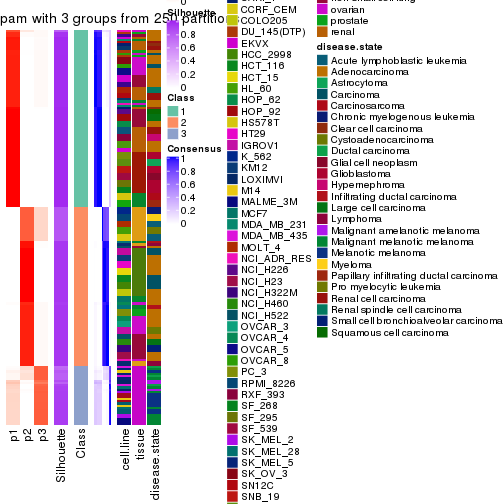</p>

</div>
<div id='tab-ATC-pam-consensus-heatmap-3'>
<pre><code class="r">consensus_heatmap(res, k = 4)
</code></pre>

<p></p>

</div>
<div id='tab-ATC-pam-consensus-heatmap-4'>
<pre><code class="r">consensus_heatmap(res, k = 5)
</code></pre>

<p></p>

</div>
<div id='tab-ATC-pam-consensus-heatmap-5'>
<pre><code class="r">consensus_heatmap(res, k = 6)
</code></pre>

<p></p>

</div>
</div>

Heatmaps for the membership of samples in all partitions to see how consistent they are:


<script>
$( function() {
	$( '#tabs-ATC-pam-membership-heatmap' ).tabs();
} );
</script>
<div id='tabs-ATC-pam-membership-heatmap'>
<ul>
<li><a href='#tab-ATC-pam-membership-heatmap-1'>k = 2</a></li>
<li><a href='#tab-ATC-pam-membership-heatmap-2'>k = 3</a></li>
<li><a href='#tab-ATC-pam-membership-heatmap-3'>k = 4</a></li>
<li><a href='#tab-ATC-pam-membership-heatmap-4'>k = 5</a></li>
<li><a href='#tab-ATC-pam-membership-heatmap-5'>k = 6</a></li>
</ul>
<div id='tab-ATC-pam-membership-heatmap-1'>
<pre><code class="r">membership_heatmap(res, k = 2)
</code></pre>

<p></p>

</div>
<div id='tab-ATC-pam-membership-heatmap-2'>
<pre><code class="r">membership_heatmap(res, k = 3)
</code></pre>

<p></p>

</div>
<div id='tab-ATC-pam-membership-heatmap-3'>
<pre><code class="r">membership_heatmap(res, k = 4)
</code></pre>

<p></p>

</div>
<div id='tab-ATC-pam-membership-heatmap-4'>
<pre><code class="r">membership_heatmap(res, k = 5)
</code></pre>

<p></p>

</div>
<div id='tab-ATC-pam-membership-heatmap-5'>
<pre><code class="r">membership_heatmap(res, k = 6)
</code></pre>

<p></p>

</div>
</div>

As soon as we have had the classes for columns, we can look for signatures
which are significantly different between classes which can be candidate marks
for certain classes. Following are the heatmaps for signatures.


Signature heatmaps where rows are scaled:


<script>
$( function() {
	$( '#tabs-ATC-pam-get-signatures' ).tabs();
} );
</script>
<div id='tabs-ATC-pam-get-signatures'>
<ul>
<li><a href='#tab-ATC-pam-get-signatures-1'>k = 2</a></li>
<li><a href='#tab-ATC-pam-get-signatures-2'>k = 3</a></li>
<li><a href='#tab-ATC-pam-get-signatures-3'>k = 4</a></li>
<li><a href='#tab-ATC-pam-get-signatures-4'>k = 5</a></li>
<li><a href='#tab-ATC-pam-get-signatures-5'>k = 6</a></li>
</ul>
<div id='tab-ATC-pam-get-signatures-1'>
<pre><code class="r">get_signatures(res, k = 2)
</code></pre>

<pre><code>#&gt; Error: The width or height of the raster image is zero, maybe you forget to turn off the
#&gt; previous graphic device or it was corrupted. Run `dev.off()` to close it.
</code></pre>

<p></p>

</div>
<div id='tab-ATC-pam-get-signatures-2'>
<pre><code class="r">get_signatures(res, k = 3)
</code></pre>

<p></p>

</div>
<div id='tab-ATC-pam-get-signatures-3'>
<pre><code class="r">get_signatures(res, k = 4)
</code></pre>

<p></p>

</div>
<div id='tab-ATC-pam-get-signatures-4'>
<pre><code class="r">get_signatures(res, k = 5)
</code></pre>

<pre><code>#&gt; Error: The width or height of the raster image is zero, maybe you forget to turn off the
#&gt; previous graphic device or it was corrupted. Run `dev.off()` to close it.
</code></pre>

<p></p>

</div>
<div id='tab-ATC-pam-get-signatures-5'>
<pre><code class="r">get_signatures(res, k = 6)
</code></pre>

<pre><code>#&gt; Error: The width or height of the raster image is zero, maybe you forget to turn off the
#&gt; previous graphic device or it was corrupted. Run `dev.off()` to close it.
</code></pre>

<p></p>

</div>
</div>


Signature heatmaps where rows are not scaled:


<script>
$( function() {
	$( '#tabs-ATC-pam-get-signatures-no-scale' ).tabs();
} );
</script>
<div id='tabs-ATC-pam-get-signatures-no-scale'>
<ul>
<li><a href='#tab-ATC-pam-get-signatures-no-scale-1'>k = 2</a></li>
<li><a href='#tab-ATC-pam-get-signatures-no-scale-2'>k = 3</a></li>
<li><a href='#tab-ATC-pam-get-signatures-no-scale-3'>k = 4</a></li>
<li><a href='#tab-ATC-pam-get-signatures-no-scale-4'>k = 5</a></li>
<li><a href='#tab-ATC-pam-get-signatures-no-scale-5'>k = 6</a></li>
</ul>
<div id='tab-ATC-pam-get-signatures-no-scale-1'>
<pre><code class="r">get_signatures(res, k = 2, scale_rows = FALSE)
</code></pre>

<pre><code>#&gt; Error in mat[ceiling(1:nr/h_ratio), ceiling(1:nc/w_ratio), drop = FALSE]: subscript out of bounds
</code></pre>

<p></p>

</div>
<div id='tab-ATC-pam-get-signatures-no-scale-2'>
<pre><code class="r">get_signatures(res, k = 3, scale_rows = FALSE)
</code></pre>

<p></p>

</div>
<div id='tab-ATC-pam-get-signatures-no-scale-3'>
<pre><code class="r">get_signatures(res, k = 4, scale_rows = FALSE)
</code></pre>

<p></p>

</div>
<div id='tab-ATC-pam-get-signatures-no-scale-4'>
<pre><code class="r">get_signatures(res, k = 5, scale_rows = FALSE)
</code></pre>

<pre><code>#&gt; Error in mat[ceiling(1:nr/h_ratio), ceiling(1:nc/w_ratio), drop = FALSE]: subscript out of bounds
</code></pre>

<p></p>

</div>
<div id='tab-ATC-pam-get-signatures-no-scale-5'>
<pre><code class="r">get_signatures(res, k = 6, scale_rows = FALSE)
</code></pre>

<p>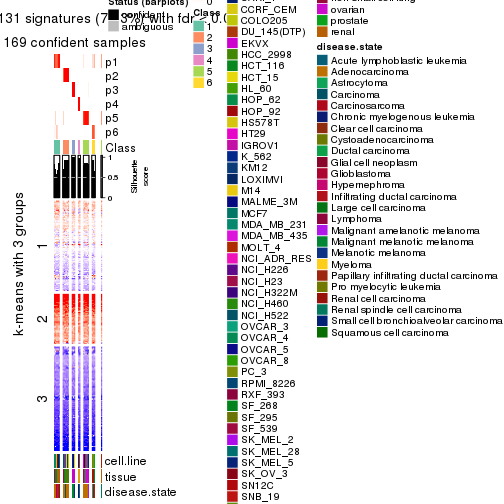</p>

</div>
</div>


Compare the overlap of signatures from different k:

```r
compare_signatures(res)
```


`get_signature()` returns a data frame invisibly. TO get the list of signatures, the function
call should be assigned to a variable explicitly. In following code, if `plot` argument is set
to `FALSE`, no heatmap is plotted while only the differential analysis is performed.

```r
# code only for demonstration
tb = get_signature(res, k = ..., plot = FALSE)
```

An example of the output of `tb` is:

```
#>   which_row         fdr    mean_1    mean_2 scaled_mean_1 scaled_mean_2 km
#> 1        38 0.042760348  8.373488  9.131774    -0.5533452     0.5164555  1
#> 2        40 0.018707592  7.106213  8.469186    -0.6173731     0.5762149  1
#> 3        55 0.019134737 10.221463 11.207825    -0.6159697     0.5749050  1
#> 4        59 0.006059896  5.921854  7.869574    -0.6899429     0.6439467  1
#> 5        60 0.018055526  8.928898 10.211722    -0.6204761     0.5791110  1
#> 6        98 0.009384629 15.714769 14.887706     0.6635654    -0.6193277  2
...
```

The columns in `tb` are:

1. `which_row`: row indices corresponding to the input matrix.
2. `fdr`: FDR for the differential test. 
3. `mean_x`: The mean value in group x.
4. `scaled_mean_x`: The mean value in group x after rows are scaled.
5. `km`: Row groups if k-means clustering is applied to rows.


UMAP plot which shows how samples are separated.


<script>
$( function() {
	$( '#tabs-ATC-pam-dimension-reduction' ).tabs();
} );
</script>
<div id='tabs-ATC-pam-dimension-reduction'>
<ul>
<li><a href='#tab-ATC-pam-dimension-reduction-1'>k = 2</a></li>
<li><a href='#tab-ATC-pam-dimension-reduction-2'>k = 3</a></li>
<li><a href='#tab-ATC-pam-dimension-reduction-3'>k = 4</a></li>
<li><a href='#tab-ATC-pam-dimension-reduction-4'>k = 5</a></li>
<li><a href='#tab-ATC-pam-dimension-reduction-5'>k = 6</a></li>
</ul>
<div id='tab-ATC-pam-dimension-reduction-1'>
<pre><code class="r">dimension_reduction(res, k = 2, method = &quot;UMAP&quot;)
</code></pre>

<p></p>

</div>
<div id='tab-ATC-pam-dimension-reduction-2'>
<pre><code class="r">dimension_reduction(res, k = 3, method = &quot;UMAP&quot;)
</code></pre>

<p></p>

</div>
<div id='tab-ATC-pam-dimension-reduction-3'>
<pre><code class="r">dimension_reduction(res, k = 4, method = &quot;UMAP&quot;)
</code></pre>

<p></p>

</div>
<div id='tab-ATC-pam-dimension-reduction-4'>
<pre><code class="r">dimension_reduction(res, k = 5, method = &quot;UMAP&quot;)
</code></pre>

<p>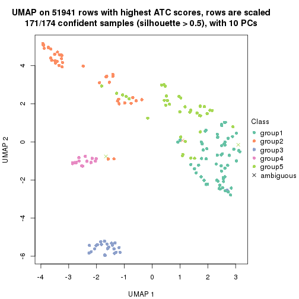</p>

</div>
<div id='tab-ATC-pam-dimension-reduction-5'>
<pre><code class="r">dimension_reduction(res, k = 6, method = &quot;UMAP&quot;)
</code></pre>

<p></p>

</div>
</div>


Following heatmap shows how subgroups are split when increasing `k`:

```r
collect_classes(res)
```


Test correlation between subgroups and known annotations. If the known
annotation is numeric, one-way ANOVA test is applied, and if the known
annotation is discrete, chi-squared contingency table test is applied.

```r
test_to_known_factors(res)
```

```
#>           n cell.line(p) tissue(p) disease.state(p) k
#> ATC:pam 172     4.91e-12  4.94e-16         7.59e-09 2
#> ATC:pam 174     1.47e-24  7.20e-48         7.89e-31 3
#> ATC:pam 174     6.20e-36  1.03e-68         9.31e-51 4
#> ATC:pam 171     3.10e-42  1.30e-80         1.42e-54 5
#> ATC:pam 169     2.55e-50  1.43e-99         9.88e-70 6
```


If matrix rows can be associated to genes, consider to use `GO_Enrichment(res,
...)` to perform function enrichment for the signature genes.


 

---------------------------------------------------


### ATC:mclust**


The object with results only for a single top-value method and a single partition method 
can be extracted as:

```r
res = res_list["ATC", "mclust"]
# you can also extract it by
# res = res_list["ATC:mclust"]
```

A summary of `res` and all the functions that can be applied to it:

```r
res
```

```
#> A 'ConsensusPartition' object with k = 2, 3, 4, 5, 6.
#>   On a matrix with 51941 rows and 174 columns.
#>   Top rows (1000, 2000, 3000, 4000, 5000) are extracted by 'ATC' method.
#>   Subgroups are detected by 'mclust' method.
#>   Performed in total 1250 partitions by row resampling.
#>   Best k for subgroups seems to be 4.
#> 
#> Following methods can be applied to this 'ConsensusPartition' object:
#>  [1] "cola_report"             "collect_classes"         "collect_plots"          
#>  [4] "collect_stats"           "colnames"                "compare_signatures"     
#>  [7] "consensus_heatmap"       "dimension_reduction"     "functional_enrichment"  
#> [10] "get_anno_col"            "get_anno"                "get_classes"            
#> [13] "get_consensus"           "get_matrix"              "get_membership"         
#> [16] "get_param"               "get_signatures"          "get_stats"              
#> [19] "is_best_k"               "is_stable_k"             "membership_heatmap"     
#> [22] "ncol"                    "nrow"                    "plot_ecdf"              
#> [25] "rownames"                "select_partition_number" "show"                   
#> [28] "suggest_best_k"          "test_to_known_factors"
```

`collect_plots()` function collects all the plots made from `res` for all `k` (number of partitions)
into one single page to provide an easy and fast comparison between different `k`.

```r
collect_plots(res)
```


The plots are:

- The first row: a plot of the ECDF (Empirical cumulative distribution
  function) curves of the consensus matrix for each `k` and the heatmap of
  predicted classes for each `k`.
- The second row: heatmaps of the consensus matrix for each `k`.
- The third row: heatmaps of the membership matrix for each `k`.
- The fouth row: heatmaps of the signatures for each `k`.

All the plots in panels can be made by individual functions and they are
plotted later in this section.

`select_partition_number()` produces several plots showing different
statistics for choosing "optimized" `k`. There are following statistics:

- ECDF curves of the consensus matrix for each `k`;
- 1-PAC. [The PAC
  score](https://en.wikipedia.org/wiki/Consensus_clustering#Over-interpretation_potential_of_consensus_clustering)
  measures the proportion of the ambiguous subgrouping.
- Mean silhouette score.
- Concordance. The mean probability of fiting the consensus class ids in all
  partitions.
- Area increased. Denote $A_k$ as the area under the ECDF curve for current
  `k`, the area increased is defined as $A_k - A_{k-1}$.
- Rand index. The percent of pairs of samples that are both in a same cluster
  or both are not in a same cluster in the partition of k and k-1.
- Jaccard index. The ratio of pairs of samples are both in a same cluster in
  the partition of k and k-1 and the pairs of samples are both in a same
  cluster in the partition k or k-1.

The detailed explanations of these statistics can be found in [the cola
vignette](http://bioconductor.org/packages/devel/bioc/vignettes/cola/inst/doc/cola.html#toc_13).

Generally speaking, lower PAC score, higher mean silhouette score or higher
concordance corresponds to better partition. Rand index and Jaccard index
measure how similar the current partition is compared to partition with `k-1`.
If they are too similar, we won't accept `k` is better than `k-1`.

```r
select_partition_number(res)
```

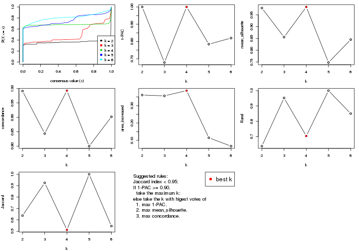

The numeric values for all these statistics can be obtained by `get_stats()`.

```r
get_stats(res)
```

```
#>   k 1-PAC mean_silhouette concordance area_increased  Rand Jaccard
#> 2 2 1.000           0.979       0.991         0.3610 0.638   0.638
#> 3 3 0.678           0.856       0.844         0.3564 0.952   0.925
#> 4 4 1.000           0.984       0.993         0.3865 0.704   0.513
#> 5 5 0.784           0.748       0.800         0.1152 1.000   1.000
#> 6 6 0.820           0.845       0.902         0.0668 0.850   0.546
```

`suggest_best_k()` suggests the best $k$ based on these statistics. The rules are as follows:

- All $k$ with Jaccard index larger than 0.95 are removed because the increase of
  the partition number does not provides enough extra information. If all $k$ are removed,
  the best $k$ is assigned by `NA`.
- For $k$ with 1-PAC larger than 0.9, the maximal $k$ is taken as the "best k". Other $k$ is called "optional k".
- If it does not fit the second rule. The $k$ with the highest vote of highest
  1-PAC, mean silhouette and concordance is taken as the "best k".

```r
suggest_best_k(res)
```

```
#> [1] 4
#> attr(,"optional")
#> [1] 2
```

There is also optional best $k$ = 2 that is worth to check.

Following shows the table of the partitions (You need to click the **show/hide
code output** link to see it). The membership matrix (columns with name `p*`)
is inferred by
[`clue::cl_consensus()`](https://www.rdocumentation.org/link/cl_consensus?package=clue)
function with the `SE` method. Basically the value in the membership matrix
represents the probability to belong to a certain group. The finall class
label for an item is determined with the group with highest probability it
belongs to.

In `get_classes()` function, the entropy is calculated from the membership
matrix and the silhouette score is calculated from the consensus matrix.


<script>
$( function() {
	$( '#tabs-ATC-mclust-get-classes' ).tabs();
} );
</script>
<div id='tabs-ATC-mclust-get-classes'>
<ul>
<li><a href='#tab-ATC-mclust-get-classes-1'>k = 2</a></li>
<li><a href='#tab-ATC-mclust-get-classes-2'>k = 3</a></li>
<li><a href='#tab-ATC-mclust-get-classes-3'>k = 4</a></li>
<li><a href='#tab-ATC-mclust-get-classes-4'>k = 5</a></li>
<li><a href='#tab-ATC-mclust-get-classes-5'>k = 6</a></li>
</ul>

<div id='tab-ATC-mclust-get-classes-1'>
<p><a id='tab-ATC-mclust-get-classes-1-a' style='color:#0366d6' href='#'>show/hide code output</a></p>
<pre><code class="r">cbind(get_classes(res, k = 2), get_membership(res, k = 2))
</code></pre>

<pre><code>#&gt;           class entropy silhouette    p1    p2
#&gt; GSM803615     2   0.000      0.977 0.000 1.000
#&gt; GSM803674     2   0.000      0.977 0.000 1.000
#&gt; GSM803733     2   0.000      0.977 0.000 1.000
#&gt; GSM803616     2   0.000      0.977 0.000 1.000
#&gt; GSM803675     2   0.000      0.977 0.000 1.000
#&gt; GSM803734     2   0.000      0.977 0.000 1.000
#&gt; GSM803617     2   0.000      0.977 0.000 1.000
#&gt; GSM803676     2   0.000      0.977 0.000 1.000
#&gt; GSM803735     2   0.000      0.977 0.000 1.000
#&gt; GSM803618     2   0.000      0.977 0.000 1.000
#&gt; GSM803677     2   0.000      0.977 0.000 1.000
#&gt; GSM803736     2   0.000      0.977 0.000 1.000
#&gt; GSM803619     2   0.634      0.814 0.160 0.840
#&gt; GSM803678     2   0.634      0.814 0.160 0.840
#&gt; GSM803737     2   0.634      0.814 0.160 0.840
#&gt; GSM803620     2   0.000      0.977 0.000 1.000
#&gt; GSM803679     2   0.000      0.977 0.000 1.000
#&gt; GSM803738     2   0.000      0.977 0.000 1.000
#&gt; GSM803621     1   0.000      0.995 1.000 0.000
#&gt; GSM803680     1   0.000      0.995 1.000 0.000
#&gt; GSM803739     1   0.000      0.995 1.000 0.000
#&gt; GSM803622     1   0.000      0.995 1.000 0.000
#&gt; GSM803681     1   0.000      0.995 1.000 0.000
#&gt; GSM803740     1   0.000      0.995 1.000 0.000
#&gt; GSM803623     1   0.000      0.995 1.000 0.000
#&gt; GSM803682     1   0.000      0.995 1.000 0.000
#&gt; GSM803741     1   0.000      0.995 1.000 0.000
#&gt; GSM803624     1   0.000      0.995 1.000 0.000
#&gt; GSM803683     1   0.000      0.995 1.000 0.000
#&gt; GSM803742     1   0.000      0.995 1.000 0.000
#&gt; GSM803625     1   0.000      0.995 1.000 0.000
#&gt; GSM803684     1   0.000      0.995 1.000 0.000
#&gt; GSM803743     1   0.000      0.995 1.000 0.000
#&gt; GSM803626     2   0.000      0.977 0.000 1.000
#&gt; GSM803685     2   0.978      0.316 0.412 0.588
#&gt; GSM803744     2   0.000      0.977 0.000 1.000
#&gt; GSM803627     1   0.000      0.995 1.000 0.000
#&gt; GSM803686     1   0.000      0.995 1.000 0.000
#&gt; GSM803745     1   0.000      0.995 1.000 0.000
#&gt; GSM803628     1   0.000      0.995 1.000 0.000
#&gt; GSM803687     1   0.000      0.995 1.000 0.000
#&gt; GSM803746     1   0.000      0.995 1.000 0.000
#&gt; GSM803629     1   0.000      0.995 1.000 0.000
#&gt; GSM803688     1   0.000      0.995 1.000 0.000
#&gt; GSM803747     1   0.000      0.995 1.000 0.000
#&gt; GSM803630     1   0.000      0.995 1.000 0.000
#&gt; GSM803689     1   0.000      0.995 1.000 0.000
#&gt; GSM803748     1   0.000      0.995 1.000 0.000
#&gt; GSM803631     1   0.000      0.995 1.000 0.000
#&gt; GSM803690     1   0.000      0.995 1.000 0.000
#&gt; GSM803749     1   0.000      0.995 1.000 0.000
#&gt; GSM803632     1   0.000      0.995 1.000 0.000
#&gt; GSM803691     1   0.000      0.995 1.000 0.000
#&gt; GSM803750     1   0.000      0.995 1.000 0.000
#&gt; GSM803633     1   0.000      0.995 1.000 0.000
#&gt; GSM803692     1   0.000      0.995 1.000 0.000
#&gt; GSM803751     1   0.000      0.995 1.000 0.000
#&gt; GSM803634     1   0.000      0.995 1.000 0.000
#&gt; GSM803693     1   0.000      0.995 1.000 0.000
#&gt; GSM803752     1   0.000      0.995 1.000 0.000
#&gt; GSM803635     1   0.000      0.995 1.000 0.000
#&gt; GSM803694     1   0.000      0.995 1.000 0.000
#&gt; GSM803753     1   0.000      0.995 1.000 0.000
#&gt; GSM803636     1   0.000      0.995 1.000 0.000
#&gt; GSM803695     1   0.000      0.995 1.000 0.000
#&gt; GSM803754     1   0.000      0.995 1.000 0.000
#&gt; GSM803637     1   0.000      0.995 1.000 0.000
#&gt; GSM803696     1   0.000      0.995 1.000 0.000
#&gt; GSM803755     1   0.000      0.995 1.000 0.000
#&gt; GSM803638     1   0.000      0.995 1.000 0.000
#&gt; GSM803697     1   0.000      0.995 1.000 0.000
#&gt; GSM803756     1   0.000      0.995 1.000 0.000
#&gt; GSM803639     1   0.000      0.995 1.000 0.000
#&gt; GSM803698     1   0.000      0.995 1.000 0.000
#&gt; GSM803757     1   0.000      0.995 1.000 0.000
#&gt; GSM803640     1   0.000      0.995 1.000 0.000
#&gt; GSM803699     1   0.000      0.995 1.000 0.000
#&gt; GSM803758     1   0.000      0.995 1.000 0.000
#&gt; GSM803641     1   0.000      0.995 1.000 0.000
#&gt; GSM803700     1   0.000      0.995 1.000 0.000
#&gt; GSM803759     1   0.000      0.995 1.000 0.000
#&gt; GSM803642     1   0.000      0.995 1.000 0.000
#&gt; GSM803701     1   0.000      0.995 1.000 0.000
#&gt; GSM803760     1   0.000      0.995 1.000 0.000
#&gt; GSM803643     1   0.000      0.995 1.000 0.000
#&gt; GSM803702     1   0.000      0.995 1.000 0.000
#&gt; GSM803644     1   0.000      0.995 1.000 0.000
#&gt; GSM803703     1   0.000      0.995 1.000 0.000
#&gt; GSM803761     1   0.000      0.995 1.000 0.000
#&gt; GSM803645     1   0.000      0.995 1.000 0.000
#&gt; GSM803704     1   0.000      0.995 1.000 0.000
#&gt; GSM803762     1   0.000      0.995 1.000 0.000
#&gt; GSM803646     1   0.000      0.995 1.000 0.000
#&gt; GSM803705     1   0.000      0.995 1.000 0.000
#&gt; GSM803763     1   0.000      0.995 1.000 0.000
#&gt; GSM803647     1   0.000      0.995 1.000 0.000
#&gt; GSM803706     1   0.000      0.995 1.000 0.000
#&gt; GSM803764     1   0.000      0.995 1.000 0.000
#&gt; GSM803648     1   0.000      0.995 1.000 0.000
#&gt; GSM803707     1   0.000      0.995 1.000 0.000
#&gt; GSM803765     1   0.000      0.995 1.000 0.000
#&gt; GSM803649     1   0.000      0.995 1.000 0.000
#&gt; GSM803708     1   0.000      0.995 1.000 0.000
#&gt; GSM803766     1   0.000      0.995 1.000 0.000
#&gt; GSM803650     1   0.000      0.995 1.000 0.000
#&gt; GSM803709     1   0.000      0.995 1.000 0.000
#&gt; GSM803767     1   0.000      0.995 1.000 0.000
#&gt; GSM803651     1   0.000      0.995 1.000 0.000
#&gt; GSM803710     1   0.000      0.995 1.000 0.000
#&gt; GSM803768     1   0.000      0.995 1.000 0.000
#&gt; GSM803652     1   0.000      0.995 1.000 0.000
#&gt; GSM803711     1   0.000      0.995 1.000 0.000
#&gt; GSM803653     1   0.000      0.995 1.000 0.000
#&gt; GSM803712     1   0.000      0.995 1.000 0.000
#&gt; GSM803769     1   0.000      0.995 1.000 0.000
#&gt; GSM803654     1   0.000      0.995 1.000 0.000
#&gt; GSM803713     1   0.000      0.995 1.000 0.000
#&gt; GSM803770     1   0.000      0.995 1.000 0.000
#&gt; GSM803655     1   0.000      0.995 1.000 0.000
#&gt; GSM803714     1   0.000      0.995 1.000 0.000
#&gt; GSM803771     1   0.000      0.995 1.000 0.000
#&gt; GSM803656     1   0.000      0.995 1.000 0.000
#&gt; GSM803715     1   0.000      0.995 1.000 0.000
#&gt; GSM803772     1   0.000      0.995 1.000 0.000
#&gt; GSM803657     1   0.000      0.995 1.000 0.000
#&gt; GSM803716     1   0.000      0.995 1.000 0.000
#&gt; GSM803773     1   0.000      0.995 1.000 0.000
#&gt; GSM803658     1   0.000      0.995 1.000 0.000
#&gt; GSM803717     1   0.000      0.995 1.000 0.000
#&gt; GSM803774     1   0.000      0.995 1.000 0.000
#&gt; GSM803659     1   0.000      0.995 1.000 0.000
#&gt; GSM803718     1   0.000      0.995 1.000 0.000
#&gt; GSM803775     1   0.000      0.995 1.000 0.000
#&gt; GSM803660     1   0.000      0.995 1.000 0.000
#&gt; GSM803719     1   0.000      0.995 1.000 0.000
#&gt; GSM803776     1   0.000      0.995 1.000 0.000
#&gt; GSM803661     1   0.000      0.995 1.000 0.000
#&gt; GSM803720     1   0.000      0.995 1.000 0.000
#&gt; GSM803777     1   0.000      0.995 1.000 0.000
#&gt; GSM803662     1   0.000      0.995 1.000 0.000
#&gt; GSM803732     1   0.000      0.995 1.000 0.000
#&gt; GSM803778     1   0.000      0.995 1.000 0.000
#&gt; GSM803663     1   0.000      0.995 1.000 0.000
#&gt; GSM803721     1   0.000      0.995 1.000 0.000
#&gt; GSM803779     1   0.000      0.995 1.000 0.000
#&gt; GSM803664     1   0.000      0.995 1.000 0.000
#&gt; GSM803722     1   0.000      0.995 1.000 0.000
#&gt; GSM803780     1   0.000      0.995 1.000 0.000
#&gt; GSM803665     1   0.929      0.457 0.656 0.344
#&gt; GSM803723     1   0.844      0.613 0.728 0.272
#&gt; GSM803781     1   0.000      0.995 1.000 0.000
#&gt; GSM803666     2   0.000      0.977 0.000 1.000
#&gt; GSM803724     2   0.000      0.977 0.000 1.000
#&gt; GSM803782     2   0.000      0.977 0.000 1.000
#&gt; GSM803667     2   0.000      0.977 0.000 1.000
#&gt; GSM803725     2   0.000      0.977 0.000 1.000
#&gt; GSM803783     2   0.000      0.977 0.000 1.000
#&gt; GSM803668     2   0.000      0.977 0.000 1.000
#&gt; GSM803726     2   0.000      0.977 0.000 1.000
#&gt; GSM803784     2   0.000      0.977 0.000 1.000
#&gt; GSM803669     2   0.000      0.977 0.000 1.000
#&gt; GSM803727     2   0.000      0.977 0.000 1.000
#&gt; GSM803670     2   0.000      0.977 0.000 1.000
#&gt; GSM803728     2   0.000      0.977 0.000 1.000
#&gt; GSM803785     2   0.000      0.977 0.000 1.000
#&gt; GSM803671     2   0.000      0.977 0.000 1.000
#&gt; GSM803729     2   0.000      0.977 0.000 1.000
#&gt; GSM803786     2   0.000      0.977 0.000 1.000
#&gt; GSM803672     2   0.000      0.977 0.000 1.000
#&gt; GSM803730     2   0.000      0.977 0.000 1.000
#&gt; GSM803787     2   0.000      0.977 0.000 1.000
#&gt; GSM803673     1   0.000      0.995 1.000 0.000
#&gt; GSM803731     1   0.000      0.995 1.000 0.000
#&gt; GSM803788     1   0.000      0.995 1.000 0.000
</code></pre>

<script>
$('#tab-ATC-mclust-get-classes-1-a').parent().next().next().hide();
$('#tab-ATC-mclust-get-classes-1-a').click(function(){
  $('#tab-ATC-mclust-get-classes-1-a').parent().next().next().toggle();
  return(false);
});
</script>
</div>

<div id='tab-ATC-mclust-get-classes-2'>
<p><a id='tab-ATC-mclust-get-classes-2-a' style='color:#0366d6' href='#'>show/hide code output</a></p>
<pre><code class="r">cbind(get_classes(res, k = 3), get_membership(res, k = 3))
</code></pre>

<pre><code>#&gt;           class entropy silhouette    p1    p2    p3
#&gt; GSM803615     2  0.0000      1.000 0.000 1.000 0.000
#&gt; GSM803674     2  0.0000      1.000 0.000 1.000 0.000
#&gt; GSM803733     2  0.0000      1.000 0.000 1.000 0.000
#&gt; GSM803616     2  0.0000      1.000 0.000 1.000 0.000
#&gt; GSM803675     2  0.0000      1.000 0.000 1.000 0.000
#&gt; GSM803734     2  0.0000      1.000 0.000 1.000 0.000
#&gt; GSM803617     2  0.0000      1.000 0.000 1.000 0.000
#&gt; GSM803676     2  0.0000      1.000 0.000 1.000 0.000
#&gt; GSM803735     2  0.0000      1.000 0.000 1.000 0.000
#&gt; GSM803618     2  0.0000      1.000 0.000 1.000 0.000
#&gt; GSM803677     2  0.0000      1.000 0.000 1.000 0.000
#&gt; GSM803736     2  0.0000      1.000 0.000 1.000 0.000
#&gt; GSM803619     2  0.0000      1.000 0.000 1.000 0.000
#&gt; GSM803678     2  0.0000      1.000 0.000 1.000 0.000
#&gt; GSM803737     2  0.0000      1.000 0.000 1.000 0.000
#&gt; GSM803620     2  0.0000      1.000 0.000 1.000 0.000
#&gt; GSM803679     2  0.0000      1.000 0.000 1.000 0.000
#&gt; GSM803738     2  0.0000      1.000 0.000 1.000 0.000
#&gt; GSM803621     1  0.0424      0.837 0.992 0.000 0.008
#&gt; GSM803680     1  0.0592      0.835 0.988 0.000 0.012
#&gt; GSM803739     1  0.0747      0.840 0.984 0.000 0.016
#&gt; GSM803622     1  0.0592      0.835 0.988 0.000 0.012
#&gt; GSM803681     1  0.0592      0.835 0.988 0.000 0.012
#&gt; GSM803740     1  0.0424      0.837 0.992 0.000 0.008
#&gt; GSM803623     1  0.6553      0.806 0.656 0.020 0.324
#&gt; GSM803682     1  0.6553      0.806 0.656 0.020 0.324
#&gt; GSM803741     1  0.6553      0.806 0.656 0.020 0.324
#&gt; GSM803624     1  0.5733      0.818 0.676 0.000 0.324
#&gt; GSM803683     1  0.2356      0.849 0.928 0.000 0.072
#&gt; GSM803742     1  0.3551      0.845 0.868 0.000 0.132
#&gt; GSM803625     1  0.0000      0.839 1.000 0.000 0.000
#&gt; GSM803684     1  0.0000      0.839 1.000 0.000 0.000
#&gt; GSM803743     1  0.0000      0.839 1.000 0.000 0.000
#&gt; GSM803626     3  0.5733      0.946 0.000 0.324 0.676
#&gt; GSM803685     3  0.6337      0.789 0.028 0.264 0.708
#&gt; GSM803744     3  0.5733      0.946 0.000 0.324 0.676
#&gt; GSM803627     1  0.0747      0.833 0.984 0.000 0.016
#&gt; GSM803686     1  0.0747      0.833 0.984 0.000 0.016
#&gt; GSM803745     1  0.0747      0.833 0.984 0.000 0.016
#&gt; GSM803628     1  0.0237      0.838 0.996 0.000 0.004
#&gt; GSM803687     1  0.0237      0.838 0.996 0.000 0.004
#&gt; GSM803746     1  0.4346      0.697 0.816 0.000 0.184
#&gt; GSM803629     1  0.0592      0.835 0.988 0.000 0.012
#&gt; GSM803688     1  0.0592      0.835 0.988 0.000 0.012
#&gt; GSM803747     1  0.2356      0.787 0.928 0.000 0.072
#&gt; GSM803630     1  0.0592      0.835 0.988 0.000 0.012
#&gt; GSM803689     1  0.0592      0.835 0.988 0.000 0.012
#&gt; GSM803748     1  0.2537      0.847 0.920 0.000 0.080
#&gt; GSM803631     1  0.0592      0.835 0.988 0.000 0.012
#&gt; GSM803690     1  0.0592      0.835 0.988 0.000 0.012
#&gt; GSM803749     1  0.0592      0.835 0.988 0.000 0.012
#&gt; GSM803632     1  0.0424      0.837 0.992 0.000 0.008
#&gt; GSM803691     1  0.0424      0.837 0.992 0.000 0.008
#&gt; GSM803750     1  0.0424      0.837 0.992 0.000 0.008
#&gt; GSM803633     1  0.6553      0.806 0.656 0.020 0.324
#&gt; GSM803692     1  0.6553      0.806 0.656 0.020 0.324
#&gt; GSM803751     1  0.6553      0.806 0.656 0.020 0.324
#&gt; GSM803634     1  0.5733      0.818 0.676 0.000 0.324
#&gt; GSM803693     1  0.5733      0.818 0.676 0.000 0.324
#&gt; GSM803752     1  0.6282      0.811 0.664 0.012 0.324
#&gt; GSM803635     1  0.5733      0.818 0.676 0.000 0.324
#&gt; GSM803694     1  0.5733      0.818 0.676 0.000 0.324
#&gt; GSM803753     1  0.5733      0.818 0.676 0.000 0.324
#&gt; GSM803636     1  0.5733      0.818 0.676 0.000 0.324
#&gt; GSM803695     1  0.5733      0.818 0.676 0.000 0.324
#&gt; GSM803754     1  0.5733      0.818 0.676 0.000 0.324
#&gt; GSM803637     1  0.5733      0.818 0.676 0.000 0.324
#&gt; GSM803696     1  0.5733      0.818 0.676 0.000 0.324
#&gt; GSM803755     1  0.5733      0.818 0.676 0.000 0.324
#&gt; GSM803638     1  0.6553      0.806 0.656 0.020 0.324
#&gt; GSM803697     1  0.6553      0.806 0.656 0.020 0.324
#&gt; GSM803756     1  0.6422      0.808 0.660 0.016 0.324
#&gt; GSM803639     1  0.6553      0.806 0.656 0.020 0.324
#&gt; GSM803698     1  0.6553      0.806 0.656 0.020 0.324
#&gt; GSM803757     1  0.6553      0.806 0.656 0.020 0.324
#&gt; GSM803640     1  0.0000      0.839 1.000 0.000 0.000
#&gt; GSM803699     1  0.0000      0.839 1.000 0.000 0.000
#&gt; GSM803758     1  0.4796      0.579 0.780 0.000 0.220
#&gt; GSM803641     1  0.2356      0.849 0.928 0.000 0.072
#&gt; GSM803700     1  0.2356      0.849 0.928 0.000 0.072
#&gt; GSM803759     1  0.2356      0.849 0.928 0.000 0.072
#&gt; GSM803642     1  0.0000      0.839 1.000 0.000 0.000
#&gt; GSM803701     1  0.0000      0.839 1.000 0.000 0.000
#&gt; GSM803760     1  0.2356      0.849 0.928 0.000 0.072
#&gt; GSM803643     1  0.0000      0.839 1.000 0.000 0.000
#&gt; GSM803702     1  0.0000      0.839 1.000 0.000 0.000
#&gt; GSM803644     1  0.0592      0.835 0.988 0.000 0.012
#&gt; GSM803703     1  0.0592      0.835 0.988 0.000 0.012
#&gt; GSM803761     1  0.0747      0.833 0.984 0.000 0.016
#&gt; GSM803645     1  0.0000      0.839 1.000 0.000 0.000
#&gt; GSM803704     1  0.0000      0.839 1.000 0.000 0.000
#&gt; GSM803762     1  0.2356      0.849 0.928 0.000 0.072
#&gt; GSM803646     1  0.2066      0.848 0.940 0.000 0.060
#&gt; GSM803705     1  0.2066      0.848 0.940 0.000 0.060
#&gt; GSM803763     1  0.2448      0.849 0.924 0.000 0.076
#&gt; GSM803647     1  0.2356      0.849 0.928 0.000 0.072
#&gt; GSM803706     1  0.2356      0.849 0.928 0.000 0.072
#&gt; GSM803764     1  0.2356      0.849 0.928 0.000 0.072
#&gt; GSM803648     1  0.5733      0.818 0.676 0.000 0.324
#&gt; GSM803707     1  0.5733      0.818 0.676 0.000 0.324
#&gt; GSM803765     1  0.5733      0.818 0.676 0.000 0.324
#&gt; GSM803649     1  0.0747      0.843 0.984 0.000 0.016
#&gt; GSM803708     1  0.0747      0.843 0.984 0.000 0.016
#&gt; GSM803766     1  0.0747      0.843 0.984 0.000 0.016
#&gt; GSM803650     1  0.0000      0.839 1.000 0.000 0.000
#&gt; GSM803709     1  0.0000      0.839 1.000 0.000 0.000
#&gt; GSM803767     1  0.2356      0.849 0.928 0.000 0.072
#&gt; GSM803651     1  0.2356      0.849 0.928 0.000 0.072
#&gt; GSM803710     1  0.2356      0.849 0.928 0.000 0.072
#&gt; GSM803768     1  0.2356      0.849 0.928 0.000 0.072
#&gt; GSM803652     1  0.0000      0.839 1.000 0.000 0.000
#&gt; GSM803711     1  0.0000      0.839 1.000 0.000 0.000
#&gt; GSM803653     1  0.5733      0.818 0.676 0.000 0.324
#&gt; GSM803712     1  0.5733      0.818 0.676 0.000 0.324
#&gt; GSM803769     1  0.5733      0.818 0.676 0.000 0.324
#&gt; GSM803654     1  0.5733      0.818 0.676 0.000 0.324
#&gt; GSM803713     1  0.5733      0.818 0.676 0.000 0.324
#&gt; GSM803770     1  0.5733      0.818 0.676 0.000 0.324
#&gt; GSM803655     1  0.5733      0.818 0.676 0.000 0.324
#&gt; GSM803714     1  0.5733      0.818 0.676 0.000 0.324
#&gt; GSM803771     1  0.5733      0.818 0.676 0.000 0.324
#&gt; GSM803656     1  0.5733      0.818 0.676 0.000 0.324
#&gt; GSM803715     1  0.5733      0.818 0.676 0.000 0.324
#&gt; GSM803772     1  0.5733      0.818 0.676 0.000 0.324
#&gt; GSM803657     1  0.5733      0.818 0.676 0.000 0.324
#&gt; GSM803716     1  0.5733      0.818 0.676 0.000 0.324
#&gt; GSM803773     1  0.5733      0.818 0.676 0.000 0.324
#&gt; GSM803658     1  0.5733      0.818 0.676 0.000 0.324
#&gt; GSM803717     1  0.5733      0.818 0.676 0.000 0.324
#&gt; GSM803774     1  0.5733      0.818 0.676 0.000 0.324
#&gt; GSM803659     1  0.5733      0.818 0.676 0.000 0.324
#&gt; GSM803718     1  0.5733      0.818 0.676 0.000 0.324
#&gt; GSM803775     1  0.5733      0.818 0.676 0.000 0.324
#&gt; GSM803660     1  0.1860      0.847 0.948 0.000 0.052
#&gt; GSM803719     1  0.2356      0.849 0.928 0.000 0.072
#&gt; GSM803776     1  0.0000      0.839 1.000 0.000 0.000
#&gt; GSM803661     1  0.0000      0.839 1.000 0.000 0.000
#&gt; GSM803720     1  0.0000      0.839 1.000 0.000 0.000
#&gt; GSM803777     1  0.0000      0.839 1.000 0.000 0.000
#&gt; GSM803662     1  0.4974      0.832 0.764 0.000 0.236
#&gt; GSM803732     1  0.1031      0.844 0.976 0.000 0.024
#&gt; GSM803778     1  0.2796      0.849 0.908 0.000 0.092
#&gt; GSM803663     1  0.0000      0.839 1.000 0.000 0.000
#&gt; GSM803721     1  0.0000      0.839 1.000 0.000 0.000
#&gt; GSM803779     1  0.0000      0.839 1.000 0.000 0.000
#&gt; GSM803664     1  0.5733      0.818 0.676 0.000 0.324
#&gt; GSM803722     1  0.5733      0.818 0.676 0.000 0.324
#&gt; GSM803780     1  0.5733      0.818 0.676 0.000 0.324
#&gt; GSM803665     3  0.6705      0.537 0.084 0.176 0.740
#&gt; GSM803723     3  0.7097      0.484 0.108 0.172 0.720
#&gt; GSM803781     1  0.7002      0.804 0.672 0.048 0.280
#&gt; GSM803666     3  0.5733      0.946 0.000 0.324 0.676
#&gt; GSM803724     3  0.5733      0.946 0.000 0.324 0.676
#&gt; GSM803782     3  0.5733      0.946 0.000 0.324 0.676
#&gt; GSM803667     3  0.5733      0.946 0.000 0.324 0.676
#&gt; GSM803725     3  0.5733      0.946 0.000 0.324 0.676
#&gt; GSM803783     3  0.5733      0.946 0.000 0.324 0.676
#&gt; GSM803668     3  0.5733      0.946 0.000 0.324 0.676
#&gt; GSM803726     3  0.5733      0.946 0.000 0.324 0.676
#&gt; GSM803784     3  0.5733      0.946 0.000 0.324 0.676
#&gt; GSM803669     3  0.5733      0.946 0.000 0.324 0.676
#&gt; GSM803727     3  0.5733      0.946 0.000 0.324 0.676
#&gt; GSM803670     3  0.5733      0.946 0.000 0.324 0.676
#&gt; GSM803728     3  0.5733      0.946 0.000 0.324 0.676
#&gt; GSM803785     3  0.5733      0.946 0.000 0.324 0.676
#&gt; GSM803671     3  0.5733      0.946 0.000 0.324 0.676
#&gt; GSM803729     3  0.5733      0.946 0.000 0.324 0.676
#&gt; GSM803786     3  0.5733      0.946 0.000 0.324 0.676
#&gt; GSM803672     3  0.5733      0.946 0.000 0.324 0.676
#&gt; GSM803730     3  0.5733      0.946 0.000 0.324 0.676
#&gt; GSM803787     3  0.5733      0.946 0.000 0.324 0.676
#&gt; GSM803673     1  0.5733      0.818 0.676 0.000 0.324
#&gt; GSM803731     1  0.5733      0.818 0.676 0.000 0.324
#&gt; GSM803788     1  0.5733      0.818 0.676 0.000 0.324
</code></pre>

<script>
$('#tab-ATC-mclust-get-classes-2-a').parent().next().next().hide();
$('#tab-ATC-mclust-get-classes-2-a').click(function(){
  $('#tab-ATC-mclust-get-classes-2-a').parent().next().next().toggle();
  return(false);
});
</script>
</div>

<div id='tab-ATC-mclust-get-classes-3'>
<p><a id='tab-ATC-mclust-get-classes-3-a' style='color:#0366d6' href='#'>show/hide code output</a></p>
<pre><code class="r">cbind(get_classes(res, k = 4), get_membership(res, k = 4))
</code></pre>

<pre><code>#&gt;           class entropy silhouette    p1    p2    p3    p4
#&gt; GSM803615     4  0.0000      1.000 0.000 0.000 0.000 1.000
#&gt; GSM803674     4  0.0000      1.000 0.000 0.000 0.000 1.000
#&gt; GSM803733     4  0.0000      1.000 0.000 0.000 0.000 1.000
#&gt; GSM803616     4  0.0000      1.000 0.000 0.000 0.000 1.000
#&gt; GSM803675     4  0.0000      1.000 0.000 0.000 0.000 1.000
#&gt; GSM803734     4  0.0000      1.000 0.000 0.000 0.000 1.000
#&gt; GSM803617     4  0.0000      1.000 0.000 0.000 0.000 1.000
#&gt; GSM803676     4  0.0000      1.000 0.000 0.000 0.000 1.000
#&gt; GSM803735     4  0.0000      1.000 0.000 0.000 0.000 1.000
#&gt; GSM803618     4  0.0000      1.000 0.000 0.000 0.000 1.000
#&gt; GSM803677     4  0.0000      1.000 0.000 0.000 0.000 1.000
#&gt; GSM803736     4  0.0000      1.000 0.000 0.000 0.000 1.000
#&gt; GSM803619     4  0.0000      1.000 0.000 0.000 0.000 1.000
#&gt; GSM803678     4  0.0000      1.000 0.000 0.000 0.000 1.000
#&gt; GSM803737     4  0.0000      1.000 0.000 0.000 0.000 1.000
#&gt; GSM803620     4  0.0000      1.000 0.000 0.000 0.000 1.000
#&gt; GSM803679     4  0.0000      1.000 0.000 0.000 0.000 1.000
#&gt; GSM803738     4  0.0000      1.000 0.000 0.000 0.000 1.000
#&gt; GSM803621     1  0.0000      0.995 1.000 0.000 0.000 0.000
#&gt; GSM803680     1  0.0000      0.995 1.000 0.000 0.000 0.000
#&gt; GSM803739     1  0.0000      0.995 1.000 0.000 0.000 0.000
#&gt; GSM803622     1  0.0000      0.995 1.000 0.000 0.000 0.000
#&gt; GSM803681     1  0.0000      0.995 1.000 0.000 0.000 0.000
#&gt; GSM803740     1  0.0000      0.995 1.000 0.000 0.000 0.000
#&gt; GSM803623     2  0.0000      0.983 0.000 1.000 0.000 0.000
#&gt; GSM803682     2  0.0000      0.983 0.000 1.000 0.000 0.000
#&gt; GSM803741     2  0.0000      0.983 0.000 1.000 0.000 0.000
#&gt; GSM803624     2  0.0188      0.981 0.000 0.996 0.000 0.004
#&gt; GSM803683     1  0.0000      0.995 1.000 0.000 0.000 0.000
#&gt; GSM803742     2  0.5478      0.430 0.344 0.628 0.000 0.028
#&gt; GSM803625     1  0.0000      0.995 1.000 0.000 0.000 0.000
#&gt; GSM803684     1  0.0000      0.995 1.000 0.000 0.000 0.000
#&gt; GSM803743     1  0.0000      0.995 1.000 0.000 0.000 0.000
#&gt; GSM803626     3  0.0000      1.000 0.000 0.000 1.000 0.000
#&gt; GSM803685     2  0.3726      0.737 0.000 0.788 0.212 0.000
#&gt; GSM803744     3  0.0000      1.000 0.000 0.000 1.000 0.000
#&gt; GSM803627     1  0.0000      0.995 1.000 0.000 0.000 0.000
#&gt; GSM803686     1  0.0000      0.995 1.000 0.000 0.000 0.000
#&gt; GSM803745     1  0.0000      0.995 1.000 0.000 0.000 0.000
#&gt; GSM803628     1  0.0000      0.995 1.000 0.000 0.000 0.000
#&gt; GSM803687     1  0.0000      0.995 1.000 0.000 0.000 0.000
#&gt; GSM803746     1  0.0000      0.995 1.000 0.000 0.000 0.000
#&gt; GSM803629     1  0.0000      0.995 1.000 0.000 0.000 0.000
#&gt; GSM803688     1  0.0000      0.995 1.000 0.000 0.000 0.000
#&gt; GSM803747     1  0.0000      0.995 1.000 0.000 0.000 0.000
#&gt; GSM803630     1  0.0000      0.995 1.000 0.000 0.000 0.000
#&gt; GSM803689     1  0.0000      0.995 1.000 0.000 0.000 0.000
#&gt; GSM803748     1  0.0000      0.995 1.000 0.000 0.000 0.000
#&gt; GSM803631     1  0.0000      0.995 1.000 0.000 0.000 0.000
#&gt; GSM803690     1  0.0000      0.995 1.000 0.000 0.000 0.000
#&gt; GSM803749     1  0.0000      0.995 1.000 0.000 0.000 0.000
#&gt; GSM803632     1  0.0000      0.995 1.000 0.000 0.000 0.000
#&gt; GSM803691     1  0.0000      0.995 1.000 0.000 0.000 0.000
#&gt; GSM803750     1  0.0000      0.995 1.000 0.000 0.000 0.000
#&gt; GSM803633     2  0.0000      0.983 0.000 1.000 0.000 0.000
#&gt; GSM803692     2  0.0000      0.983 0.000 1.000 0.000 0.000
#&gt; GSM803751     2  0.0000      0.983 0.000 1.000 0.000 0.000
#&gt; GSM803634     2  0.0000      0.983 0.000 1.000 0.000 0.000
#&gt; GSM803693     2  0.0000      0.983 0.000 1.000 0.000 0.000
#&gt; GSM803752     2  0.0000      0.983 0.000 1.000 0.000 0.000
#&gt; GSM803635     2  0.0000      0.983 0.000 1.000 0.000 0.000
#&gt; GSM803694     2  0.0000      0.983 0.000 1.000 0.000 0.000
#&gt; GSM803753     2  0.0000      0.983 0.000 1.000 0.000 0.000
#&gt; GSM803636     2  0.0000      0.983 0.000 1.000 0.000 0.000
#&gt; GSM803695     2  0.0000      0.983 0.000 1.000 0.000 0.000
#&gt; GSM803754     2  0.0000      0.983 0.000 1.000 0.000 0.000
#&gt; GSM803637     2  0.0000      0.983 0.000 1.000 0.000 0.000
#&gt; GSM803696     2  0.0000      0.983 0.000 1.000 0.000 0.000
#&gt; GSM803755     2  0.0000      0.983 0.000 1.000 0.000 0.000
#&gt; GSM803638     2  0.0000      0.983 0.000 1.000 0.000 0.000
#&gt; GSM803697     2  0.0000      0.983 0.000 1.000 0.000 0.000
#&gt; GSM803756     2  0.0000      0.983 0.000 1.000 0.000 0.000
#&gt; GSM803639     2  0.0000      0.983 0.000 1.000 0.000 0.000
#&gt; GSM803698     2  0.0000      0.983 0.000 1.000 0.000 0.000
#&gt; GSM803757     2  0.0000      0.983 0.000 1.000 0.000 0.000
#&gt; GSM803640     1  0.0000      0.995 1.000 0.000 0.000 0.000
#&gt; GSM803699     1  0.0000      0.995 1.000 0.000 0.000 0.000
#&gt; GSM803758     1  0.0000      0.995 1.000 0.000 0.000 0.000
#&gt; GSM803641     1  0.0000      0.995 1.000 0.000 0.000 0.000
#&gt; GSM803700     1  0.0000      0.995 1.000 0.000 0.000 0.000
#&gt; GSM803759     1  0.0000      0.995 1.000 0.000 0.000 0.000
#&gt; GSM803642     1  0.0000      0.995 1.000 0.000 0.000 0.000
#&gt; GSM803701     1  0.0000      0.995 1.000 0.000 0.000 0.000
#&gt; GSM803760     1  0.1022      0.959 0.968 0.032 0.000 0.000
#&gt; GSM803643     1  0.0000      0.995 1.000 0.000 0.000 0.000
#&gt; GSM803702     1  0.0000      0.995 1.000 0.000 0.000 0.000
#&gt; GSM803644     1  0.0000      0.995 1.000 0.000 0.000 0.000
#&gt; GSM803703     1  0.0000      0.995 1.000 0.000 0.000 0.000
#&gt; GSM803761     1  0.0000      0.995 1.000 0.000 0.000 0.000
#&gt; GSM803645     1  0.0000      0.995 1.000 0.000 0.000 0.000
#&gt; GSM803704     1  0.0000      0.995 1.000 0.000 0.000 0.000
#&gt; GSM803762     1  0.0000      0.995 1.000 0.000 0.000 0.000
#&gt; GSM803646     1  0.0000      0.995 1.000 0.000 0.000 0.000
#&gt; GSM803705     1  0.0000      0.995 1.000 0.000 0.000 0.000
#&gt; GSM803763     1  0.1792      0.914 0.932 0.068 0.000 0.000
#&gt; GSM803647     1  0.0000      0.995 1.000 0.000 0.000 0.000
#&gt; GSM803706     1  0.0000      0.995 1.000 0.000 0.000 0.000
#&gt; GSM803764     1  0.0000      0.995 1.000 0.000 0.000 0.000
#&gt; GSM803648     2  0.0000      0.983 0.000 1.000 0.000 0.000
#&gt; GSM803707     2  0.0000      0.983 0.000 1.000 0.000 0.000
#&gt; GSM803765     2  0.0000      0.983 0.000 1.000 0.000 0.000
#&gt; GSM803649     1  0.0188      0.991 0.996 0.004 0.000 0.000
#&gt; GSM803708     1  0.0188      0.991 0.996 0.004 0.000 0.000
#&gt; GSM803766     1  0.0188      0.991 0.996 0.004 0.000 0.000
#&gt; GSM803650     1  0.0000      0.995 1.000 0.000 0.000 0.000
#&gt; GSM803709     1  0.0000      0.995 1.000 0.000 0.000 0.000
#&gt; GSM803767     1  0.0000      0.995 1.000 0.000 0.000 0.000
#&gt; GSM803651     1  0.0000      0.995 1.000 0.000 0.000 0.000
#&gt; GSM803710     1  0.0000      0.995 1.000 0.000 0.000 0.000
#&gt; GSM803768     1  0.0000      0.995 1.000 0.000 0.000 0.000
#&gt; GSM803652     1  0.0000      0.995 1.000 0.000 0.000 0.000
#&gt; GSM803711     1  0.0000      0.995 1.000 0.000 0.000 0.000
#&gt; GSM803653     2  0.0921      0.966 0.000 0.972 0.000 0.028
#&gt; GSM803712     2  0.0921      0.966 0.000 0.972 0.000 0.028
#&gt; GSM803769     2  0.0921      0.966 0.000 0.972 0.000 0.028
#&gt; GSM803654     2  0.0000      0.983 0.000 1.000 0.000 0.000
#&gt; GSM803713     2  0.0000      0.983 0.000 1.000 0.000 0.000
#&gt; GSM803770     2  0.0000      0.983 0.000 1.000 0.000 0.000
#&gt; GSM803655     2  0.0921      0.966 0.000 0.972 0.000 0.028
#&gt; GSM803714     2  0.0921      0.966 0.000 0.972 0.000 0.028
#&gt; GSM803771     2  0.0921      0.966 0.000 0.972 0.000 0.028
#&gt; GSM803656     2  0.0921      0.966 0.000 0.972 0.000 0.028
#&gt; GSM803715     2  0.0921      0.966 0.000 0.972 0.000 0.028
#&gt; GSM803772     2  0.0921      0.966 0.000 0.972 0.000 0.028
#&gt; GSM803657     2  0.0000      0.983 0.000 1.000 0.000 0.000
#&gt; GSM803716     2  0.0000      0.983 0.000 1.000 0.000 0.000
#&gt; GSM803773     2  0.0000      0.983 0.000 1.000 0.000 0.000
#&gt; GSM803658     2  0.0000      0.983 0.000 1.000 0.000 0.000
#&gt; GSM803717     2  0.0000      0.983 0.000 1.000 0.000 0.000
#&gt; GSM803774     2  0.0000      0.983 0.000 1.000 0.000 0.000
#&gt; GSM803659     2  0.0000      0.983 0.000 1.000 0.000 0.000
#&gt; GSM803718     2  0.0000      0.983 0.000 1.000 0.000 0.000
#&gt; GSM803775     2  0.0000      0.983 0.000 1.000 0.000 0.000
#&gt; GSM803660     1  0.0000      0.995 1.000 0.000 0.000 0.000
#&gt; GSM803719     1  0.0000      0.995 1.000 0.000 0.000 0.000
#&gt; GSM803776     1  0.0000      0.995 1.000 0.000 0.000 0.000
#&gt; GSM803661     1  0.0000      0.995 1.000 0.000 0.000 0.000
#&gt; GSM803720     1  0.0000      0.995 1.000 0.000 0.000 0.000
#&gt; GSM803777     1  0.0000      0.995 1.000 0.000 0.000 0.000
#&gt; GSM803662     1  0.3486      0.741 0.812 0.188 0.000 0.000
#&gt; GSM803732     1  0.0336      0.986 0.992 0.008 0.000 0.000
#&gt; GSM803778     1  0.0592      0.978 0.984 0.016 0.000 0.000
#&gt; GSM803663     1  0.0000      0.995 1.000 0.000 0.000 0.000
#&gt; GSM803721     1  0.0000      0.995 1.000 0.000 0.000 0.000
#&gt; GSM803779     1  0.0000      0.995 1.000 0.000 0.000 0.000
#&gt; GSM803664     2  0.0000      0.983 0.000 1.000 0.000 0.000
#&gt; GSM803722     2  0.0000      0.983 0.000 1.000 0.000 0.000
#&gt; GSM803780     2  0.0000      0.983 0.000 1.000 0.000 0.000
#&gt; GSM803665     2  0.0921      0.964 0.000 0.972 0.028 0.000
#&gt; GSM803723     2  0.0921      0.964 0.000 0.972 0.028 0.000
#&gt; GSM803781     2  0.0921      0.964 0.000 0.972 0.028 0.000
#&gt; GSM803666     3  0.0000      1.000 0.000 0.000 1.000 0.000
#&gt; GSM803724     3  0.0000      1.000 0.000 0.000 1.000 0.000
#&gt; GSM803782     3  0.0000      1.000 0.000 0.000 1.000 0.000
#&gt; GSM803667     3  0.0000      1.000 0.000 0.000 1.000 0.000
#&gt; GSM803725     3  0.0000      1.000 0.000 0.000 1.000 0.000
#&gt; GSM803783     3  0.0000      1.000 0.000 0.000 1.000 0.000
#&gt; GSM803668     3  0.0000      1.000 0.000 0.000 1.000 0.000
#&gt; GSM803726     3  0.0000      1.000 0.000 0.000 1.000 0.000
#&gt; GSM803784     3  0.0000      1.000 0.000 0.000 1.000 0.000
#&gt; GSM803669     3  0.0000      1.000 0.000 0.000 1.000 0.000
#&gt; GSM803727     3  0.0000      1.000 0.000 0.000 1.000 0.000
#&gt; GSM803670     3  0.0000      1.000 0.000 0.000 1.000 0.000
#&gt; GSM803728     3  0.0000      1.000 0.000 0.000 1.000 0.000
#&gt; GSM803785     3  0.0000      1.000 0.000 0.000 1.000 0.000
#&gt; GSM803671     3  0.0000      1.000 0.000 0.000 1.000 0.000
#&gt; GSM803729     3  0.0000      1.000 0.000 0.000 1.000 0.000
#&gt; GSM803786     3  0.0000      1.000 0.000 0.000 1.000 0.000
#&gt; GSM803672     3  0.0000      1.000 0.000 0.000 1.000 0.000
#&gt; GSM803730     3  0.0000      1.000 0.000 0.000 1.000 0.000
#&gt; GSM803787     3  0.0000      1.000 0.000 0.000 1.000 0.000
#&gt; GSM803673     2  0.0000      0.983 0.000 1.000 0.000 0.000
#&gt; GSM803731     2  0.0000      0.983 0.000 1.000 0.000 0.000
#&gt; GSM803788     2  0.0000      0.983 0.000 1.000 0.000 0.000
</code></pre>

<script>
$('#tab-ATC-mclust-get-classes-3-a').parent().next().next().hide();
$('#tab-ATC-mclust-get-classes-3-a').click(function(){
  $('#tab-ATC-mclust-get-classes-3-a').parent().next().next().toggle();
  return(false);
});
</script>
</div>

<div id='tab-ATC-mclust-get-classes-4'>
<p><a id='tab-ATC-mclust-get-classes-4-a' style='color:#0366d6' href='#'>show/hide code output</a></p>
<pre><code class="r">cbind(get_classes(res, k = 5), get_membership(res, k = 5))
</code></pre>

<pre><code>#&gt;           class entropy silhouette    p1    p2    p3    p4 p5
#&gt; GSM803615     4  0.0000      0.989 0.000 0.000 0.000 1.000 NA
#&gt; GSM803674     4  0.0000      0.989 0.000 0.000 0.000 1.000 NA
#&gt; GSM803733     4  0.0000      0.989 0.000 0.000 0.000 1.000 NA
#&gt; GSM803616     4  0.0000      0.989 0.000 0.000 0.000 1.000 NA
#&gt; GSM803675     4  0.0000      0.989 0.000 0.000 0.000 1.000 NA
#&gt; GSM803734     4  0.0000      0.989 0.000 0.000 0.000 1.000 NA
#&gt; GSM803617     4  0.0000      0.989 0.000 0.000 0.000 1.000 NA
#&gt; GSM803676     4  0.0000      0.989 0.000 0.000 0.000 1.000 NA
#&gt; GSM803735     4  0.0000      0.989 0.000 0.000 0.000 1.000 NA
#&gt; GSM803618     4  0.0000      0.989 0.000 0.000 0.000 1.000 NA
#&gt; GSM803677     4  0.0000      0.989 0.000 0.000 0.000 1.000 NA
#&gt; GSM803736     4  0.0000      0.989 0.000 0.000 0.000 1.000 NA
#&gt; GSM803619     4  0.1478      0.944 0.000 0.064 0.000 0.936 NA
#&gt; GSM803678     4  0.1478      0.944 0.000 0.064 0.000 0.936 NA
#&gt; GSM803737     4  0.1478      0.944 0.000 0.064 0.000 0.936 NA
#&gt; GSM803620     4  0.0000      0.989 0.000 0.000 0.000 1.000 NA
#&gt; GSM803679     4  0.0000      0.989 0.000 0.000 0.000 1.000 NA
#&gt; GSM803738     4  0.0000      0.989 0.000 0.000 0.000 1.000 NA
#&gt; GSM803621     1  0.4227      0.651 0.580 0.000 0.000 0.000 NA
#&gt; GSM803680     1  0.4227      0.651 0.580 0.000 0.000 0.000 NA
#&gt; GSM803739     1  0.4210      0.653 0.588 0.000 0.000 0.000 NA
#&gt; GSM803622     1  0.4182      0.658 0.600 0.000 0.000 0.000 NA
#&gt; GSM803681     1  0.4182      0.658 0.600 0.000 0.000 0.000 NA
#&gt; GSM803740     1  0.4171      0.659 0.604 0.000 0.000 0.000 NA
#&gt; GSM803623     2  0.4304      0.721 0.000 0.516 0.000 0.000 NA
#&gt; GSM803682     2  0.4305      0.720 0.000 0.512 0.000 0.000 NA
#&gt; GSM803741     2  0.4304      0.721 0.000 0.516 0.000 0.000 NA
#&gt; GSM803624     2  0.0566      0.740 0.004 0.984 0.000 0.000 NA
#&gt; GSM803683     1  0.5342      0.461 0.612 0.312 0.000 0.000 NA
#&gt; GSM803742     2  0.5819     -0.217 0.452 0.456 0.000 0.000 NA
#&gt; GSM803625     1  0.1851      0.728 0.912 0.000 0.000 0.000 NA
#&gt; GSM803684     1  0.1851      0.728 0.912 0.000 0.000 0.000 NA
#&gt; GSM803743     1  0.1851      0.728 0.912 0.000 0.000 0.000 NA
#&gt; GSM803626     3  0.0000      1.000 0.000 0.000 1.000 0.000 NA
#&gt; GSM803685     2  0.4798      0.315 0.020 0.540 0.440 0.000 NA
#&gt; GSM803744     3  0.0000      1.000 0.000 0.000 1.000 0.000 NA
#&gt; GSM803627     1  0.4227      0.651 0.580 0.000 0.000 0.000 NA
#&gt; GSM803686     1  0.4227      0.651 0.580 0.000 0.000 0.000 NA
#&gt; GSM803745     1  0.4227      0.651 0.580 0.000 0.000 0.000 NA
#&gt; GSM803628     1  0.4227      0.651 0.580 0.000 0.000 0.000 NA
#&gt; GSM803687     1  0.4227      0.651 0.580 0.000 0.000 0.000 NA
#&gt; GSM803746     1  0.4227      0.651 0.580 0.000 0.000 0.000 NA
#&gt; GSM803629     1  0.4227      0.651 0.580 0.000 0.000 0.000 NA
#&gt; GSM803688     1  0.4227      0.651 0.580 0.000 0.000 0.000 NA
#&gt; GSM803747     1  0.4171      0.659 0.604 0.000 0.000 0.000 NA
#&gt; GSM803630     1  0.4227      0.651 0.580 0.000 0.000 0.000 NA
#&gt; GSM803689     1  0.4227      0.651 0.580 0.000 0.000 0.000 NA
#&gt; GSM803748     1  0.4227      0.651 0.580 0.000 0.000 0.000 NA
#&gt; GSM803631     1  0.4227      0.651 0.580 0.000 0.000 0.000 NA
#&gt; GSM803690     1  0.4227      0.651 0.580 0.000 0.000 0.000 NA
#&gt; GSM803749     1  0.4227      0.651 0.580 0.000 0.000 0.000 NA
#&gt; GSM803632     1  0.4227      0.651 0.580 0.000 0.000 0.000 NA
#&gt; GSM803691     1  0.4227      0.651 0.580 0.000 0.000 0.000 NA
#&gt; GSM803750     1  0.4227      0.651 0.580 0.000 0.000 0.000 NA
#&gt; GSM803633     2  0.4305      0.720 0.000 0.512 0.000 0.000 NA
#&gt; GSM803692     2  0.4305      0.720 0.000 0.512 0.000 0.000 NA
#&gt; GSM803751     2  0.4305      0.720 0.000 0.512 0.000 0.000 NA
#&gt; GSM803634     2  0.4249      0.733 0.000 0.568 0.000 0.000 NA
#&gt; GSM803693     2  0.4249      0.733 0.000 0.568 0.000 0.000 NA
#&gt; GSM803752     2  0.4287      0.729 0.000 0.540 0.000 0.000 NA
#&gt; GSM803635     2  0.4283      0.730 0.000 0.544 0.000 0.000 NA
#&gt; GSM803694     2  0.4291      0.729 0.000 0.536 0.000 0.000 NA
#&gt; GSM803753     2  0.4297      0.726 0.000 0.528 0.000 0.000 NA
#&gt; GSM803636     2  0.4304      0.723 0.000 0.516 0.000 0.000 NA
#&gt; GSM803695     2  0.4304      0.723 0.000 0.516 0.000 0.000 NA
#&gt; GSM803754     2  0.4304      0.723 0.000 0.516 0.000 0.000 NA
#&gt; GSM803637     2  0.4304      0.723 0.000 0.516 0.000 0.000 NA
#&gt; GSM803696     2  0.4305      0.721 0.000 0.512 0.000 0.000 NA
#&gt; GSM803755     2  0.4305      0.721 0.000 0.512 0.000 0.000 NA
#&gt; GSM803638     2  0.4294      0.728 0.000 0.532 0.000 0.000 NA
#&gt; GSM803697     2  0.4297      0.726 0.000 0.528 0.000 0.000 NA
#&gt; GSM803756     2  0.4297      0.726 0.000 0.528 0.000 0.000 NA
#&gt; GSM803639     2  0.4304      0.722 0.000 0.516 0.000 0.000 NA
#&gt; GSM803698     2  0.4305      0.720 0.000 0.512 0.000 0.000 NA
#&gt; GSM803757     2  0.4305      0.720 0.000 0.512 0.000 0.000 NA
#&gt; GSM803640     1  0.0162      0.732 0.996 0.000 0.000 0.000 NA
#&gt; GSM803699     1  0.0794      0.733 0.972 0.000 0.000 0.000 NA
#&gt; GSM803758     1  0.1121      0.732 0.956 0.000 0.000 0.000 NA
#&gt; GSM803641     1  0.0162      0.732 0.996 0.000 0.000 0.000 NA
#&gt; GSM803700     1  0.0162      0.732 0.996 0.000 0.000 0.000 NA
#&gt; GSM803759     1  0.0609      0.733 0.980 0.000 0.000 0.000 NA
#&gt; GSM803642     1  0.0000      0.732 1.000 0.000 0.000 0.000 NA
#&gt; GSM803701     1  0.0000      0.732 1.000 0.000 0.000 0.000 NA
#&gt; GSM803760     1  0.0162      0.731 0.996 0.004 0.000 0.000 NA
#&gt; GSM803643     1  0.0000      0.732 1.000 0.000 0.000 0.000 NA
#&gt; GSM803702     1  0.0000      0.732 1.000 0.000 0.000 0.000 NA
#&gt; GSM803644     1  0.4015      0.671 0.652 0.000 0.000 0.000 NA
#&gt; GSM803703     1  0.4126      0.662 0.620 0.000 0.000 0.000 NA
#&gt; GSM803761     1  0.4126      0.662 0.620 0.000 0.000 0.000 NA
#&gt; GSM803645     1  0.0000      0.732 1.000 0.000 0.000 0.000 NA
#&gt; GSM803704     1  0.0000      0.732 1.000 0.000 0.000 0.000 NA
#&gt; GSM803762     1  0.0000      0.732 1.000 0.000 0.000 0.000 NA
#&gt; GSM803646     1  0.5491      0.451 0.600 0.312 0.000 0.000 NA
#&gt; GSM803705     1  0.5491      0.451 0.600 0.312 0.000 0.000 NA
#&gt; GSM803763     1  0.5708      0.338 0.528 0.384 0.000 0.000 NA
#&gt; GSM803647     1  0.0000      0.732 1.000 0.000 0.000 0.000 NA
#&gt; GSM803706     1  0.0000      0.732 1.000 0.000 0.000 0.000 NA
#&gt; GSM803764     1  0.0000      0.732 1.000 0.000 0.000 0.000 NA
#&gt; GSM803648     2  0.0162      0.745 0.000 0.996 0.000 0.000 NA
#&gt; GSM803707     2  0.0324      0.745 0.004 0.992 0.000 0.000 NA
#&gt; GSM803765     2  0.0162      0.745 0.000 0.996 0.000 0.000 NA
#&gt; GSM803649     1  0.2628      0.683 0.884 0.028 0.000 0.000 NA
#&gt; GSM803708     1  0.2628      0.683 0.884 0.028 0.000 0.000 NA
#&gt; GSM803766     1  0.2793      0.679 0.876 0.036 0.000 0.000 NA
#&gt; GSM803650     1  0.0000      0.732 1.000 0.000 0.000 0.000 NA
#&gt; GSM803709     1  0.0000      0.732 1.000 0.000 0.000 0.000 NA
#&gt; GSM803767     1  0.2605      0.717 0.852 0.000 0.000 0.000 NA
#&gt; GSM803651     1  0.0510      0.733 0.984 0.000 0.000 0.000 NA
#&gt; GSM803710     1  0.0290      0.732 0.992 0.000 0.000 0.000 NA
#&gt; GSM803768     1  0.0794      0.732 0.972 0.000 0.000 0.000 NA
#&gt; GSM803652     1  0.0000      0.732 1.000 0.000 0.000 0.000 NA
#&gt; GSM803711     1  0.0000      0.732 1.000 0.000 0.000 0.000 NA
#&gt; GSM803653     2  0.0290      0.745 0.000 0.992 0.000 0.000 NA
#&gt; GSM803712     2  0.0290      0.745 0.000 0.992 0.000 0.000 NA
#&gt; GSM803769     2  0.0162      0.745 0.000 0.996 0.000 0.000 NA
#&gt; GSM803654     2  0.1197      0.754 0.000 0.952 0.000 0.000 NA
#&gt; GSM803713     2  0.1544      0.755 0.000 0.932 0.000 0.000 NA
#&gt; GSM803770     2  0.0290      0.748 0.000 0.992 0.000 0.000 NA
#&gt; GSM803655     2  0.1478      0.758 0.000 0.936 0.000 0.000 NA
#&gt; GSM803714     2  0.1478      0.758 0.000 0.936 0.000 0.000 NA
#&gt; GSM803771     2  0.1478      0.758 0.000 0.936 0.000 0.000 NA
#&gt; GSM803656     2  0.0290      0.746 0.000 0.992 0.000 0.000 NA
#&gt; GSM803715     2  0.1270      0.757 0.000 0.948 0.000 0.000 NA
#&gt; GSM803772     2  0.0794      0.752 0.000 0.972 0.000 0.000 NA
#&gt; GSM803657     2  0.1544      0.758 0.000 0.932 0.000 0.000 NA
#&gt; GSM803716     2  0.1544      0.758 0.000 0.932 0.000 0.000 NA
#&gt; GSM803773     2  0.0404      0.747 0.000 0.988 0.000 0.000 NA
#&gt; GSM803658     2  0.0162      0.747 0.000 0.996 0.000 0.000 NA
#&gt; GSM803717     2  0.0162      0.747 0.000 0.996 0.000 0.000 NA
#&gt; GSM803774     2  0.0290      0.748 0.000 0.992 0.000 0.000 NA
#&gt; GSM803659     2  0.0000      0.745 0.000 1.000 0.000 0.000 NA
#&gt; GSM803718     2  0.0000      0.745 0.000 1.000 0.000 0.000 NA
#&gt; GSM803775     2  0.0162      0.747 0.000 0.996 0.000 0.000 NA
#&gt; GSM803660     1  0.5491      0.451 0.600 0.312 0.000 0.000 NA
#&gt; GSM803719     1  0.5491      0.451 0.600 0.312 0.000 0.000 NA
#&gt; GSM803776     1  0.5491      0.451 0.600 0.312 0.000 0.000 NA
#&gt; GSM803661     1  0.5252      0.485 0.632 0.292 0.000 0.000 NA
#&gt; GSM803720     1  0.5393      0.457 0.608 0.312 0.000 0.000 NA
#&gt; GSM803777     1  0.5393      0.457 0.608 0.312 0.000 0.000 NA
#&gt; GSM803662     1  0.4403      0.278 0.560 0.436 0.000 0.000 NA
#&gt; GSM803732     1  0.3169      0.678 0.856 0.060 0.000 0.000 NA
#&gt; GSM803778     1  0.4428      0.609 0.756 0.160 0.000 0.000 NA
#&gt; GSM803663     1  0.5238      0.507 0.652 0.260 0.000 0.000 NA
#&gt; GSM803721     1  0.5491      0.451 0.600 0.312 0.000 0.000 NA
#&gt; GSM803779     1  0.5491      0.451 0.600 0.312 0.000 0.000 NA
#&gt; GSM803664     2  0.0290      0.748 0.000 0.992 0.000 0.000 NA
#&gt; GSM803722     2  0.1121      0.757 0.000 0.956 0.000 0.000 NA
#&gt; GSM803780     2  0.1478      0.759 0.000 0.936 0.000 0.000 NA
#&gt; GSM803665     2  0.3346      0.736 0.000 0.844 0.092 0.000 NA
#&gt; GSM803723     2  0.3346      0.736 0.000 0.844 0.092 0.000 NA
#&gt; GSM803781     2  0.1544      0.757 0.000 0.932 0.000 0.000 NA
#&gt; GSM803666     3  0.0000      1.000 0.000 0.000 1.000 0.000 NA
#&gt; GSM803724     3  0.0000      1.000 0.000 0.000 1.000 0.000 NA
#&gt; GSM803782     3  0.0000      1.000 0.000 0.000 1.000 0.000 NA
#&gt; GSM803667     3  0.0000      1.000 0.000 0.000 1.000 0.000 NA
#&gt; GSM803725     3  0.0000      1.000 0.000 0.000 1.000 0.000 NA
#&gt; GSM803783     3  0.0000      1.000 0.000 0.000 1.000 0.000 NA
#&gt; GSM803668     3  0.0000      1.000 0.000 0.000 1.000 0.000 NA
#&gt; GSM803726     3  0.0000      1.000 0.000 0.000 1.000 0.000 NA
#&gt; GSM803784     3  0.0000      1.000 0.000 0.000 1.000 0.000 NA
#&gt; GSM803669     3  0.0000      1.000 0.000 0.000 1.000 0.000 NA
#&gt; GSM803727     3  0.0000      1.000 0.000 0.000 1.000 0.000 NA
#&gt; GSM803670     3  0.0000      1.000 0.000 0.000 1.000 0.000 NA
#&gt; GSM803728     3  0.0000      1.000 0.000 0.000 1.000 0.000 NA
#&gt; GSM803785     3  0.0000      1.000 0.000 0.000 1.000 0.000 NA
#&gt; GSM803671     3  0.0000      1.000 0.000 0.000 1.000 0.000 NA
#&gt; GSM803729     3  0.0000      1.000 0.000 0.000 1.000 0.000 NA
#&gt; GSM803786     3  0.0000      1.000 0.000 0.000 1.000 0.000 NA
#&gt; GSM803672     3  0.0000      1.000 0.000 0.000 1.000 0.000 NA
#&gt; GSM803730     3  0.0000      1.000 0.000 0.000 1.000 0.000 NA
#&gt; GSM803787     3  0.0000      1.000 0.000 0.000 1.000 0.000 NA
#&gt; GSM803673     2  0.4273      0.731 0.000 0.552 0.000 0.000 NA
#&gt; GSM803731     2  0.4273      0.731 0.000 0.552 0.000 0.000 NA
#&gt; GSM803788     2  0.4291      0.729 0.000 0.536 0.000 0.000 NA
</code></pre>

<script>
$('#tab-ATC-mclust-get-classes-4-a').parent().next().next().hide();
$('#tab-ATC-mclust-get-classes-4-a').click(function(){
  $('#tab-ATC-mclust-get-classes-4-a').parent().next().next().toggle();
  return(false);
});
</script>
</div>

<div id='tab-ATC-mclust-get-classes-5'>
<p><a id='tab-ATC-mclust-get-classes-5-a' style='color:#0366d6' href='#'>show/hide code output</a></p>
<pre><code class="r">cbind(get_classes(res, k = 6), get_membership(res, k = 6))
</code></pre>

<pre><code>#&gt;           class entropy silhouette    p1    p2    p3    p4    p5    p6
#&gt; GSM803615     4  0.0000     0.9550 0.000 0.000 0.000 1.000 0.000 0.000
#&gt; GSM803674     4  0.0000     0.9550 0.000 0.000 0.000 1.000 0.000 0.000
#&gt; GSM803733     4  0.0000     0.9550 0.000 0.000 0.000 1.000 0.000 0.000
#&gt; GSM803616     4  0.0000     0.9550 0.000 0.000 0.000 1.000 0.000 0.000
#&gt; GSM803675     4  0.0000     0.9550 0.000 0.000 0.000 1.000 0.000 0.000
#&gt; GSM803734     4  0.0000     0.9550 0.000 0.000 0.000 1.000 0.000 0.000
#&gt; GSM803617     4  0.0000     0.9550 0.000 0.000 0.000 1.000 0.000 0.000
#&gt; GSM803676     4  0.0000     0.9550 0.000 0.000 0.000 1.000 0.000 0.000
#&gt; GSM803735     4  0.0000     0.9550 0.000 0.000 0.000 1.000 0.000 0.000
#&gt; GSM803618     4  0.1814     0.9527 0.000 0.000 0.000 0.900 0.100 0.000
#&gt; GSM803677     4  0.1814     0.9527 0.000 0.000 0.000 0.900 0.100 0.000
#&gt; GSM803736     4  0.1814     0.9527 0.000 0.000 0.000 0.900 0.100 0.000
#&gt; GSM803619     4  0.2257     0.9419 0.000 0.000 0.000 0.876 0.116 0.008
#&gt; GSM803678     4  0.2257     0.9419 0.000 0.000 0.000 0.876 0.116 0.008
#&gt; GSM803737     4  0.2257     0.9419 0.000 0.000 0.000 0.876 0.116 0.008
#&gt; GSM803620     4  0.1814     0.9527 0.000 0.000 0.000 0.900 0.100 0.000
#&gt; GSM803679     4  0.1814     0.9527 0.000 0.000 0.000 0.900 0.100 0.000
#&gt; GSM803738     4  0.1814     0.9527 0.000 0.000 0.000 0.900 0.100 0.000
#&gt; GSM803621     6  0.0260     0.8564 0.000 0.008 0.000 0.000 0.000 0.992
#&gt; GSM803680     6  0.0260     0.8564 0.000 0.008 0.000 0.000 0.000 0.992
#&gt; GSM803739     6  0.0806     0.8598 0.020 0.008 0.000 0.000 0.000 0.972
#&gt; GSM803622     6  0.0547     0.8601 0.020 0.000 0.000 0.000 0.000 0.980
#&gt; GSM803681     6  0.0547     0.8601 0.020 0.000 0.000 0.000 0.000 0.980
#&gt; GSM803740     6  0.0547     0.8601 0.020 0.000 0.000 0.000 0.000 0.980
#&gt; GSM803623     2  0.0547     0.9279 0.000 0.980 0.000 0.000 0.020 0.000
#&gt; GSM803682     2  0.0547     0.9280 0.000 0.980 0.000 0.000 0.020 0.000
#&gt; GSM803741     2  0.0632     0.9284 0.000 0.976 0.000 0.000 0.024 0.000
#&gt; GSM803624     5  0.3265     0.6655 0.248 0.004 0.000 0.000 0.748 0.000
#&gt; GSM803683     1  0.0935     0.8625 0.964 0.000 0.000 0.000 0.004 0.032
#&gt; GSM803742     1  0.2398     0.7972 0.876 0.000 0.000 0.000 0.104 0.020
#&gt; GSM803625     6  0.2520     0.8385 0.152 0.000 0.000 0.000 0.004 0.844
#&gt; GSM803684     6  0.2558     0.8381 0.156 0.000 0.000 0.000 0.004 0.840
#&gt; GSM803743     6  0.2706     0.8356 0.160 0.000 0.000 0.000 0.008 0.832
#&gt; GSM803626     3  0.0000     0.9750 0.000 0.000 1.000 0.000 0.000 0.000
#&gt; GSM803685     3  0.7406     0.1987 0.176 0.004 0.428 0.000 0.220 0.172
#&gt; GSM803744     3  0.0000     0.9750 0.000 0.000 1.000 0.000 0.000 0.000
#&gt; GSM803627     6  0.0260     0.8564 0.000 0.008 0.000 0.000 0.000 0.992
#&gt; GSM803686     6  0.0260     0.8564 0.000 0.008 0.000 0.000 0.000 0.992
#&gt; GSM803745     6  0.0260     0.8564 0.000 0.008 0.000 0.000 0.000 0.992
#&gt; GSM803628     6  0.0260     0.8564 0.000 0.008 0.000 0.000 0.000 0.992
#&gt; GSM803687     6  0.0405     0.8572 0.004 0.008 0.000 0.000 0.000 0.988
#&gt; GSM803746     6  0.0405     0.8565 0.004 0.008 0.000 0.000 0.000 0.988
#&gt; GSM803629     6  0.0260     0.8564 0.000 0.008 0.000 0.000 0.000 0.992
#&gt; GSM803688     6  0.0260     0.8564 0.000 0.008 0.000 0.000 0.000 0.992
#&gt; GSM803747     6  0.0632     0.8602 0.024 0.000 0.000 0.000 0.000 0.976
#&gt; GSM803630     6  0.0260     0.8564 0.000 0.008 0.000 0.000 0.000 0.992
#&gt; GSM803689     6  0.0260     0.8564 0.000 0.008 0.000 0.000 0.000 0.992
#&gt; GSM803748     6  0.0405     0.8546 0.004 0.008 0.000 0.000 0.000 0.988
#&gt; GSM803631     6  0.0260     0.8564 0.000 0.008 0.000 0.000 0.000 0.992
#&gt; GSM803690     6  0.0260     0.8564 0.000 0.008 0.000 0.000 0.000 0.992
#&gt; GSM803749     6  0.0260     0.8564 0.000 0.008 0.000 0.000 0.000 0.992
#&gt; GSM803632     6  0.0260     0.8564 0.000 0.008 0.000 0.000 0.000 0.992
#&gt; GSM803691     6  0.0260     0.8564 0.000 0.008 0.000 0.000 0.000 0.992
#&gt; GSM803750     6  0.0260     0.8564 0.000 0.008 0.000 0.000 0.000 0.992
#&gt; GSM803633     2  0.0363     0.9241 0.000 0.988 0.000 0.000 0.012 0.000
#&gt; GSM803692     2  0.0363     0.9241 0.000 0.988 0.000 0.000 0.012 0.000
#&gt; GSM803751     2  0.0363     0.9241 0.000 0.988 0.000 0.000 0.012 0.000
#&gt; GSM803634     2  0.0790     0.9257 0.000 0.968 0.000 0.000 0.032 0.000
#&gt; GSM803693     2  0.0790     0.9257 0.000 0.968 0.000 0.000 0.032 0.000
#&gt; GSM803752     2  0.0713     0.9266 0.000 0.972 0.000 0.000 0.028 0.000
#&gt; GSM803635     2  0.2048     0.8955 0.000 0.880 0.000 0.000 0.120 0.000
#&gt; GSM803694     2  0.1910     0.9057 0.000 0.892 0.000 0.000 0.108 0.000
#&gt; GSM803753     2  0.1814     0.9109 0.000 0.900 0.000 0.000 0.100 0.000
#&gt; GSM803636     2  0.1714     0.9142 0.000 0.908 0.000 0.000 0.092 0.000
#&gt; GSM803695     2  0.1714     0.9142 0.000 0.908 0.000 0.000 0.092 0.000
#&gt; GSM803754     2  0.1714     0.9142 0.000 0.908 0.000 0.000 0.092 0.000
#&gt; GSM803637     2  0.1957     0.9018 0.000 0.888 0.000 0.000 0.112 0.000
#&gt; GSM803696     2  0.1765     0.9124 0.000 0.904 0.000 0.000 0.096 0.000
#&gt; GSM803755     2  0.1765     0.9124 0.000 0.904 0.000 0.000 0.096 0.000
#&gt; GSM803638     2  0.0632     0.9269 0.000 0.976 0.000 0.000 0.024 0.000
#&gt; GSM803697     2  0.0632     0.9269 0.000 0.976 0.000 0.000 0.024 0.000
#&gt; GSM803756     2  0.0632     0.9269 0.000 0.976 0.000 0.000 0.024 0.000
#&gt; GSM803639     2  0.0547     0.9279 0.000 0.980 0.000 0.000 0.020 0.000
#&gt; GSM803698     2  0.0547     0.9279 0.000 0.980 0.000 0.000 0.020 0.000
#&gt; GSM803757     2  0.0547     0.9256 0.000 0.980 0.000 0.000 0.020 0.000
#&gt; GSM803640     6  0.2595     0.8371 0.160 0.000 0.000 0.000 0.004 0.836
#&gt; GSM803699     6  0.2595     0.8371 0.160 0.000 0.000 0.000 0.004 0.836
#&gt; GSM803758     6  0.3534     0.7298 0.276 0.000 0.000 0.000 0.008 0.716
#&gt; GSM803641     6  0.3636     0.7049 0.320 0.004 0.000 0.000 0.000 0.676
#&gt; GSM803700     6  0.3636     0.7049 0.320 0.004 0.000 0.000 0.000 0.676
#&gt; GSM803759     6  0.3601     0.7117 0.312 0.004 0.000 0.000 0.000 0.684
#&gt; GSM803642     6  0.3583     0.7628 0.260 0.004 0.000 0.000 0.008 0.728
#&gt; GSM803701     6  0.3583     0.7628 0.260 0.004 0.000 0.000 0.008 0.728
#&gt; GSM803760     1  0.3955     0.3087 0.648 0.004 0.000 0.000 0.008 0.340
#&gt; GSM803643     6  0.3650     0.7531 0.272 0.004 0.000 0.000 0.008 0.716
#&gt; GSM803702     6  0.3628     0.7543 0.268 0.004 0.000 0.000 0.008 0.720
#&gt; GSM803644     6  0.0935     0.8596 0.032 0.000 0.000 0.000 0.004 0.964
#&gt; GSM803703     6  0.0858     0.8598 0.028 0.000 0.000 0.000 0.004 0.968
#&gt; GSM803761     6  0.0858     0.8598 0.028 0.000 0.000 0.000 0.004 0.968
#&gt; GSM803645     6  0.3606     0.7582 0.264 0.004 0.000 0.000 0.008 0.724
#&gt; GSM803704     6  0.3861     0.6954 0.316 0.004 0.000 0.000 0.008 0.672
#&gt; GSM803762     1  0.4208    -0.1301 0.536 0.004 0.000 0.000 0.008 0.452
#&gt; GSM803646     1  0.0972     0.8641 0.964 0.000 0.000 0.000 0.008 0.028
#&gt; GSM803705     1  0.0891     0.8644 0.968 0.000 0.000 0.000 0.008 0.024
#&gt; GSM803763     1  0.1168     0.8627 0.956 0.000 0.000 0.000 0.016 0.028
#&gt; GSM803647     6  0.3104     0.8164 0.204 0.004 0.000 0.000 0.004 0.788
#&gt; GSM803706     6  0.3163     0.8115 0.212 0.004 0.000 0.000 0.004 0.780
#&gt; GSM803764     6  0.3192     0.8084 0.216 0.004 0.000 0.000 0.004 0.776
#&gt; GSM803648     1  0.4610     0.1583 0.568 0.044 0.000 0.000 0.388 0.000
#&gt; GSM803707     1  0.4353     0.2223 0.588 0.028 0.000 0.000 0.384 0.000
#&gt; GSM803765     1  0.4465    -0.0245 0.512 0.028 0.000 0.000 0.460 0.000
#&gt; GSM803649     1  0.1265     0.8486 0.948 0.000 0.000 0.000 0.008 0.044
#&gt; GSM803708     1  0.0891     0.8603 0.968 0.000 0.000 0.000 0.008 0.024
#&gt; GSM803766     1  0.0622     0.8598 0.980 0.000 0.000 0.000 0.008 0.012
#&gt; GSM803650     6  0.2632     0.8359 0.164 0.000 0.000 0.000 0.004 0.832
#&gt; GSM803709     6  0.2632     0.8359 0.164 0.000 0.000 0.000 0.004 0.832
#&gt; GSM803767     6  0.3151     0.7772 0.252 0.000 0.000 0.000 0.000 0.748
#&gt; GSM803651     6  0.3482     0.7118 0.316 0.000 0.000 0.000 0.000 0.684
#&gt; GSM803710     6  0.3499     0.7084 0.320 0.000 0.000 0.000 0.000 0.680
#&gt; GSM803768     6  0.3446     0.7172 0.308 0.000 0.000 0.000 0.000 0.692
#&gt; GSM803652     6  0.2700     0.8370 0.156 0.004 0.000 0.000 0.004 0.836
#&gt; GSM803711     6  0.2979     0.8219 0.188 0.004 0.000 0.000 0.004 0.804
#&gt; GSM803653     5  0.2558     0.7770 0.156 0.004 0.000 0.000 0.840 0.000
#&gt; GSM803712     5  0.2402     0.7924 0.140 0.004 0.000 0.000 0.856 0.000
#&gt; GSM803769     5  0.3265     0.6621 0.248 0.004 0.000 0.000 0.748 0.000
#&gt; GSM803654     5  0.3578     0.8239 0.052 0.164 0.000 0.000 0.784 0.000
#&gt; GSM803713     5  0.3712     0.8044 0.052 0.180 0.000 0.000 0.768 0.000
#&gt; GSM803770     5  0.3548     0.8413 0.068 0.136 0.000 0.000 0.796 0.000
#&gt; GSM803655     5  0.0865     0.8760 0.000 0.036 0.000 0.000 0.964 0.000
#&gt; GSM803714     5  0.0865     0.8760 0.000 0.036 0.000 0.000 0.964 0.000
#&gt; GSM803771     5  0.0865     0.8760 0.000 0.036 0.000 0.000 0.964 0.000
#&gt; GSM803656     5  0.0865     0.8760 0.000 0.036 0.000 0.000 0.964 0.000
#&gt; GSM803715     5  0.0865     0.8760 0.000 0.036 0.000 0.000 0.964 0.000
#&gt; GSM803772     5  0.0865     0.8760 0.000 0.036 0.000 0.000 0.964 0.000
#&gt; GSM803657     5  0.1957     0.8885 0.000 0.112 0.000 0.000 0.888 0.000
#&gt; GSM803716     5  0.1957     0.8885 0.000 0.112 0.000 0.000 0.888 0.000
#&gt; GSM803773     5  0.2312     0.8873 0.012 0.112 0.000 0.000 0.876 0.000
#&gt; GSM803658     5  0.2003     0.8877 0.000 0.116 0.000 0.000 0.884 0.000
#&gt; GSM803717     5  0.2003     0.8877 0.000 0.116 0.000 0.000 0.884 0.000
#&gt; GSM803774     5  0.2003     0.8877 0.000 0.116 0.000 0.000 0.884 0.000
#&gt; GSM803659     5  0.1957     0.8885 0.000 0.112 0.000 0.000 0.888 0.000
#&gt; GSM803718     5  0.1957     0.8885 0.000 0.112 0.000 0.000 0.888 0.000
#&gt; GSM803775     5  0.1957     0.8885 0.000 0.112 0.000 0.000 0.888 0.000
#&gt; GSM803660     1  0.0603     0.8620 0.980 0.000 0.000 0.000 0.004 0.016
#&gt; GSM803719     1  0.0717     0.8615 0.976 0.000 0.000 0.000 0.008 0.016
#&gt; GSM803776     1  0.0777     0.8639 0.972 0.000 0.000 0.000 0.004 0.024
#&gt; GSM803661     1  0.1010     0.8624 0.960 0.000 0.000 0.000 0.004 0.036
#&gt; GSM803720     1  0.1010     0.8624 0.960 0.000 0.000 0.000 0.004 0.036
#&gt; GSM803777     1  0.1010     0.8624 0.960 0.000 0.000 0.000 0.004 0.036
#&gt; GSM803662     1  0.2009     0.8003 0.904 0.004 0.000 0.000 0.084 0.008
#&gt; GSM803732     1  0.3566     0.6148 0.744 0.000 0.000 0.000 0.020 0.236
#&gt; GSM803778     1  0.1176     0.8591 0.956 0.000 0.000 0.000 0.020 0.024
#&gt; GSM803663     1  0.0806     0.8630 0.972 0.000 0.000 0.000 0.008 0.020
#&gt; GSM803721     1  0.0806     0.8630 0.972 0.000 0.000 0.000 0.008 0.020
#&gt; GSM803779     1  0.0891     0.8641 0.968 0.000 0.000 0.000 0.008 0.024
#&gt; GSM803664     5  0.2003     0.8877 0.000 0.116 0.000 0.000 0.884 0.000
#&gt; GSM803722     5  0.2003     0.8877 0.000 0.116 0.000 0.000 0.884 0.000
#&gt; GSM803780     5  0.2003     0.8877 0.000 0.116 0.000 0.000 0.884 0.000
#&gt; GSM803665     5  0.2558     0.7363 0.156 0.000 0.004 0.000 0.840 0.000
#&gt; GSM803723     5  0.2558     0.7363 0.156 0.000 0.004 0.000 0.840 0.000
#&gt; GSM803781     5  0.3023     0.6574 0.212 0.000 0.004 0.000 0.784 0.000
#&gt; GSM803666     3  0.0000     0.9750 0.000 0.000 1.000 0.000 0.000 0.000
#&gt; GSM803724     3  0.0000     0.9750 0.000 0.000 1.000 0.000 0.000 0.000
#&gt; GSM803782     3  0.0000     0.9750 0.000 0.000 1.000 0.000 0.000 0.000
#&gt; GSM803667     3  0.0000     0.9750 0.000 0.000 1.000 0.000 0.000 0.000
#&gt; GSM803725     3  0.0000     0.9750 0.000 0.000 1.000 0.000 0.000 0.000
#&gt; GSM803783     3  0.0000     0.9750 0.000 0.000 1.000 0.000 0.000 0.000
#&gt; GSM803668     3  0.0000     0.9750 0.000 0.000 1.000 0.000 0.000 0.000
#&gt; GSM803726     3  0.0000     0.9750 0.000 0.000 1.000 0.000 0.000 0.000
#&gt; GSM803784     3  0.0000     0.9750 0.000 0.000 1.000 0.000 0.000 0.000
#&gt; GSM803669     3  0.0000     0.9750 0.000 0.000 1.000 0.000 0.000 0.000
#&gt; GSM803727     3  0.0000     0.9750 0.000 0.000 1.000 0.000 0.000 0.000
#&gt; GSM803670     3  0.0000     0.9750 0.000 0.000 1.000 0.000 0.000 0.000
#&gt; GSM803728     3  0.0000     0.9750 0.000 0.000 1.000 0.000 0.000 0.000
#&gt; GSM803785     3  0.0000     0.9750 0.000 0.000 1.000 0.000 0.000 0.000
#&gt; GSM803671     3  0.0000     0.9750 0.000 0.000 1.000 0.000 0.000 0.000
#&gt; GSM803729     3  0.0000     0.9750 0.000 0.000 1.000 0.000 0.000 0.000
#&gt; GSM803786     3  0.0000     0.9750 0.000 0.000 1.000 0.000 0.000 0.000
#&gt; GSM803672     3  0.0000     0.9750 0.000 0.000 1.000 0.000 0.000 0.000
#&gt; GSM803730     3  0.0000     0.9750 0.000 0.000 1.000 0.000 0.000 0.000
#&gt; GSM803787     3  0.0000     0.9750 0.000 0.000 1.000 0.000 0.000 0.000
#&gt; GSM803673     2  0.3563     0.5510 0.000 0.664 0.000 0.000 0.336 0.000
#&gt; GSM803731     2  0.3244     0.6962 0.000 0.732 0.000 0.000 0.268 0.000
#&gt; GSM803788     2  0.2912     0.7817 0.000 0.784 0.000 0.000 0.216 0.000
</code></pre>

<script>
$('#tab-ATC-mclust-get-classes-5-a').parent().next().next().hide();
$('#tab-ATC-mclust-get-classes-5-a').click(function(){
  $('#tab-ATC-mclust-get-classes-5-a').parent().next().next().toggle();
  return(false);
});
</script>
</div>
</div>

Heatmaps for the consensus matrix. It visualizes the probability of two
samples to be in a same group.


<script>
$( function() {
	$( '#tabs-ATC-mclust-consensus-heatmap' ).tabs();
} );
</script>
<div id='tabs-ATC-mclust-consensus-heatmap'>
<ul>
<li><a href='#tab-ATC-mclust-consensus-heatmap-1'>k = 2</a></li>
<li><a href='#tab-ATC-mclust-consensus-heatmap-2'>k = 3</a></li>
<li><a href='#tab-ATC-mclust-consensus-heatmap-3'>k = 4</a></li>
<li><a href='#tab-ATC-mclust-consensus-heatmap-4'>k = 5</a></li>
<li><a href='#tab-ATC-mclust-consensus-heatmap-5'>k = 6</a></li>
</ul>
<div id='tab-ATC-mclust-consensus-heatmap-1'>
<pre><code class="r">consensus_heatmap(res, k = 2)
</code></pre>

<p></p>

</div>
<div id='tab-ATC-mclust-consensus-heatmap-2'>
<pre><code class="r">consensus_heatmap(res, k = 3)
</code></pre>

<p></p>

</div>
<div id='tab-ATC-mclust-consensus-heatmap-3'>
<pre><code class="r">consensus_heatmap(res, k = 4)
</code></pre>

<p></p>

</div>
<div id='tab-ATC-mclust-consensus-heatmap-4'>
<pre><code class="r">consensus_heatmap(res, k = 5)
</code></pre>

<p></p>

</div>
<div id='tab-ATC-mclust-consensus-heatmap-5'>
<pre><code class="r">consensus_heatmap(res, k = 6)
</code></pre>

<p></p>

</div>
</div>

Heatmaps for the membership of samples in all partitions to see how consistent they are:


<script>
$( function() {
	$( '#tabs-ATC-mclust-membership-heatmap' ).tabs();
} );
</script>
<div id='tabs-ATC-mclust-membership-heatmap'>
<ul>
<li><a href='#tab-ATC-mclust-membership-heatmap-1'>k = 2</a></li>
<li><a href='#tab-ATC-mclust-membership-heatmap-2'>k = 3</a></li>
<li><a href='#tab-ATC-mclust-membership-heatmap-3'>k = 4</a></li>
<li><a href='#tab-ATC-mclust-membership-heatmap-4'>k = 5</a></li>
<li><a href='#tab-ATC-mclust-membership-heatmap-5'>k = 6</a></li>
</ul>
<div id='tab-ATC-mclust-membership-heatmap-1'>
<pre><code class="r">membership_heatmap(res, k = 2)
</code></pre>

<p></p>

</div>
<div id='tab-ATC-mclust-membership-heatmap-2'>
<pre><code class="r">membership_heatmap(res, k = 3)
</code></pre>

<p></p>

</div>
<div id='tab-ATC-mclust-membership-heatmap-3'>
<pre><code class="r">membership_heatmap(res, k = 4)
</code></pre>

<p></p>

</div>
<div id='tab-ATC-mclust-membership-heatmap-4'>
<pre><code class="r">membership_heatmap(res, k = 5)
</code></pre>

<p></p>

</div>
<div id='tab-ATC-mclust-membership-heatmap-5'>
<pre><code class="r">membership_heatmap(res, k = 6)
</code></pre>

<p></p>

</div>
</div>

As soon as we have had the classes for columns, we can look for signatures
which are significantly different between classes which can be candidate marks
for certain classes. Following are the heatmaps for signatures.


Signature heatmaps where rows are scaled:


<script>
$( function() {
	$( '#tabs-ATC-mclust-get-signatures' ).tabs();
} );
</script>
<div id='tabs-ATC-mclust-get-signatures'>
<ul>
<li><a href='#tab-ATC-mclust-get-signatures-1'>k = 2</a></li>
<li><a href='#tab-ATC-mclust-get-signatures-2'>k = 3</a></li>
<li><a href='#tab-ATC-mclust-get-signatures-3'>k = 4</a></li>
<li><a href='#tab-ATC-mclust-get-signatures-4'>k = 5</a></li>
<li><a href='#tab-ATC-mclust-get-signatures-5'>k = 6</a></li>
</ul>
<div id='tab-ATC-mclust-get-signatures-1'>
<pre><code class="r">get_signatures(res, k = 2)
</code></pre>

<pre><code>#&gt; Error: The width or height of the raster image is zero, maybe you forget to turn off the
#&gt; previous graphic device or it was corrupted. Run `dev.off()` to close it.
</code></pre>

<p></p>

</div>
<div id='tab-ATC-mclust-get-signatures-2'>
<pre><code class="r">get_signatures(res, k = 3)
</code></pre>

<pre><code>#&gt; Error: The width or height of the raster image is zero, maybe you forget to turn off the
#&gt; previous graphic device or it was corrupted. Run `dev.off()` to close it.
</code></pre>

<p></p>

</div>
<div id='tab-ATC-mclust-get-signatures-3'>
<pre><code class="r">get_signatures(res, k = 4)
</code></pre>

<pre><code>#&gt; Error: The width or height of the raster image is zero, maybe you forget to turn off the
#&gt; previous graphic device or it was corrupted. Run `dev.off()` to close it.
</code></pre>

<p></p>

</div>
<div id='tab-ATC-mclust-get-signatures-4'>
<pre><code class="r">get_signatures(res, k = 5)
</code></pre>

<pre><code>#&gt; Error: The width or height of the raster image is zero, maybe you forget to turn off the
#&gt; previous graphic device or it was corrupted. Run `dev.off()` to close it.
</code></pre>

<p></p>

</div>
<div id='tab-ATC-mclust-get-signatures-5'>
<pre><code class="r">get_signatures(res, k = 6)
</code></pre>

<pre><code>#&gt; Error: The width or height of the raster image is zero, maybe you forget to turn off the
#&gt; previous graphic device or it was corrupted. Run `dev.off()` to close it.
</code></pre>

<p></p>

</div>
</div>


Signature heatmaps where rows are not scaled:


<script>
$( function() {
	$( '#tabs-ATC-mclust-get-signatures-no-scale' ).tabs();
} );
</script>
<div id='tabs-ATC-mclust-get-signatures-no-scale'>
<ul>
<li><a href='#tab-ATC-mclust-get-signatures-no-scale-1'>k = 2</a></li>
<li><a href='#tab-ATC-mclust-get-signatures-no-scale-2'>k = 3</a></li>
<li><a href='#tab-ATC-mclust-get-signatures-no-scale-3'>k = 4</a></li>
<li><a href='#tab-ATC-mclust-get-signatures-no-scale-4'>k = 5</a></li>
<li><a href='#tab-ATC-mclust-get-signatures-no-scale-5'>k = 6</a></li>
</ul>
<div id='tab-ATC-mclust-get-signatures-no-scale-1'>
<pre><code class="r">get_signatures(res, k = 2, scale_rows = FALSE)
</code></pre>

<pre><code>#&gt; Error in mat[ceiling(1:nr/h_ratio), ceiling(1:nc/w_ratio), drop = FALSE]: subscript out of bounds
</code></pre>

<p></p>

</div>
<div id='tab-ATC-mclust-get-signatures-no-scale-2'>
<pre><code class="r">get_signatures(res, k = 3, scale_rows = FALSE)
</code></pre>

<pre><code>#&gt; Error in mat[ceiling(1:nr/h_ratio), ceiling(1:nc/w_ratio), drop = FALSE]: subscript out of bounds
</code></pre>

<p></p>

</div>
<div id='tab-ATC-mclust-get-signatures-no-scale-3'>
<pre><code class="r">get_signatures(res, k = 4, scale_rows = FALSE)
</code></pre>

<pre><code>#&gt; Error in mat[ceiling(1:nr/h_ratio), ceiling(1:nc/w_ratio), drop = FALSE]: subscript out of bounds
</code></pre>

<p></p>

</div>
<div id='tab-ATC-mclust-get-signatures-no-scale-4'>
<pre><code class="r">get_signatures(res, k = 5, scale_rows = FALSE)
</code></pre>

<p></p>

</div>
<div id='tab-ATC-mclust-get-signatures-no-scale-5'>
<pre><code class="r">get_signatures(res, k = 6, scale_rows = FALSE)
</code></pre>

<p></p>

</div>
</div>


Compare the overlap of signatures from different k:

```r
compare_signatures(res)
```


`get_signature()` returns a data frame invisibly. TO get the list of signatures, the function
call should be assigned to a variable explicitly. In following code, if `plot` argument is set
to `FALSE`, no heatmap is plotted while only the differential analysis is performed.

```r
# code only for demonstration
tb = get_signature(res, k = ..., plot = FALSE)
```

An example of the output of `tb` is:

```
#>   which_row         fdr    mean_1    mean_2 scaled_mean_1 scaled_mean_2 km
#> 1        38 0.042760348  8.373488  9.131774    -0.5533452     0.5164555  1
#> 2        40 0.018707592  7.106213  8.469186    -0.6173731     0.5762149  1
#> 3        55 0.019134737 10.221463 11.207825    -0.6159697     0.5749050  1
#> 4        59 0.006059896  5.921854  7.869574    -0.6899429     0.6439467  1
#> 5        60 0.018055526  8.928898 10.211722    -0.6204761     0.5791110  1
#> 6        98 0.009384629 15.714769 14.887706     0.6635654    -0.6193277  2
...
```

The columns in `tb` are:

1. `which_row`: row indices corresponding to the input matrix.
2. `fdr`: FDR for the differential test. 
3. `mean_x`: The mean value in group x.
4. `scaled_mean_x`: The mean value in group x after rows are scaled.
5. `km`: Row groups if k-means clustering is applied to rows.


UMAP plot which shows how samples are separated.


<script>
$( function() {
	$( '#tabs-ATC-mclust-dimension-reduction' ).tabs();
} );
</script>
<div id='tabs-ATC-mclust-dimension-reduction'>
<ul>
<li><a href='#tab-ATC-mclust-dimension-reduction-1'>k = 2</a></li>
<li><a href='#tab-ATC-mclust-dimension-reduction-2'>k = 3</a></li>
<li><a href='#tab-ATC-mclust-dimension-reduction-3'>k = 4</a></li>
<li><a href='#tab-ATC-mclust-dimension-reduction-4'>k = 5</a></li>
<li><a href='#tab-ATC-mclust-dimension-reduction-5'>k = 6</a></li>
</ul>
<div id='tab-ATC-mclust-dimension-reduction-1'>
<pre><code class="r">dimension_reduction(res, k = 2, method = &quot;UMAP&quot;)
</code></pre>

<p></p>

</div>
<div id='tab-ATC-mclust-dimension-reduction-2'>
<pre><code class="r">dimension_reduction(res, k = 3, method = &quot;UMAP&quot;)
</code></pre>

<p></p>

</div>
<div id='tab-ATC-mclust-dimension-reduction-3'>
<pre><code class="r">dimension_reduction(res, k = 4, method = &quot;UMAP&quot;)
</code></pre>

<p></p>

</div>
<div id='tab-ATC-mclust-dimension-reduction-4'>
<pre><code class="r">dimension_reduction(res, k = 5, method = &quot;UMAP&quot;)
</code></pre>

<p></p>

</div>
<div id='tab-ATC-mclust-dimension-reduction-5'>
<pre><code class="r">dimension_reduction(res, k = 6, method = &quot;UMAP&quot;)
</code></pre>

<p></p>

</div>
</div>


Following heatmap shows how subgroups are split when increasing `k`:

```r
collect_classes(res)
```


Test correlation between subgroups and known annotations. If the known
annotation is numeric, one-way ANOVA test is applied, and if the known
annotation is discrete, chi-squared contingency table test is applied.

```r
test_to_known_factors(res)
```

```
#>              n cell.line(p) tissue(p) disease.state(p) k
#> ATC:mclust 172     3.16e-13  6.96e-31         2.44e-24 2
#> ATC:mclust 173     4.18e-24  3.58e-62         6.22e-46 3
#> ATC:mclust 173     1.35e-34  5.49e-69         6.97e-50 4
#> ATC:mclust 159     4.43e-32  1.10e-66         3.22e-49 5
#> ATC:mclust 168     9.78e-55  5.09e-95         5.05e-54 6
```


If matrix rows can be associated to genes, consider to use `GO_Enrichment(res,
...)` to perform function enrichment for the signature genes.


 

---------------------------------------------------


### ATC:NMF*


The object with results only for a single top-value method and a single partition method 
can be extracted as:

```r
res = res_list["ATC", "NMF"]
# you can also extract it by
# res = res_list["ATC:NMF"]
```

A summary of `res` and all the functions that can be applied to it:

```r
res
```

```
#> A 'ConsensusPartition' object with k = 2, 3, 4, 5, 6.
#>   On a matrix with 51941 rows and 174 columns.
#>   Top rows (1000, 2000, 3000, 4000, 5000) are extracted by 'ATC' method.
#>   Subgroups are detected by 'NMF' method.
#>   Performed in total 1250 partitions by row resampling.
#>   Best k for subgroups seems to be 4.
#> 
#> Following methods can be applied to this 'ConsensusPartition' object:
#>  [1] "cola_report"             "collect_classes"         "collect_plots"          
#>  [4] "collect_stats"           "colnames"                "compare_signatures"     
#>  [7] "consensus_heatmap"       "dimension_reduction"     "functional_enrichment"  
#> [10] "get_anno_col"            "get_anno"                "get_classes"            
#> [13] "get_consensus"           "get_matrix"              "get_membership"         
#> [16] "get_param"               "get_signatures"          "get_stats"              
#> [19] "is_best_k"               "is_stable_k"             "membership_heatmap"     
#> [22] "ncol"                    "nrow"                    "plot_ecdf"              
#> [25] "rownames"                "select_partition_number" "show"                   
#> [28] "suggest_best_k"          "test_to_known_factors"
```

`collect_plots()` function collects all the plots made from `res` for all `k` (number of partitions)
into one single page to provide an easy and fast comparison between different `k`.

```r
collect_plots(res)
```


The plots are:

- The first row: a plot of the ECDF (Empirical cumulative distribution
  function) curves of the consensus matrix for each `k` and the heatmap of
  predicted classes for each `k`.
- The second row: heatmaps of the consensus matrix for each `k`.
- The third row: heatmaps of the membership matrix for each `k`.
- The fouth row: heatmaps of the signatures for each `k`.

All the plots in panels can be made by individual functions and they are
plotted later in this section.

`select_partition_number()` produces several plots showing different
statistics for choosing "optimized" `k`. There are following statistics:

- ECDF curves of the consensus matrix for each `k`;
- 1-PAC. [The PAC
  score](https://en.wikipedia.org/wiki/Consensus_clustering#Over-interpretation_potential_of_consensus_clustering)
  measures the proportion of the ambiguous subgrouping.
- Mean silhouette score.
- Concordance. The mean probability of fiting the consensus class ids in all
  partitions.
- Area increased. Denote $A_k$ as the area under the ECDF curve for current
  `k`, the area increased is defined as $A_k - A_{k-1}$.
- Rand index. The percent of pairs of samples that are both in a same cluster
  or both are not in a same cluster in the partition of k and k-1.
- Jaccard index. The ratio of pairs of samples are both in a same cluster in
  the partition of k and k-1 and the pairs of samples are both in a same
  cluster in the partition k or k-1.

The detailed explanations of these statistics can be found in [the cola
vignette](http://bioconductor.org/packages/devel/bioc/vignettes/cola/inst/doc/cola.html#toc_13).

Generally speaking, lower PAC score, higher mean silhouette score or higher
concordance corresponds to better partition. Rand index and Jaccard index
measure how similar the current partition is compared to partition with `k-1`.
If they are too similar, we won't accept `k` is better than `k-1`.

```r
select_partition_number(res)
```


The numeric values for all these statistics can be obtained by `get_stats()`.

```r
get_stats(res)
```

```
#>   k 1-PAC mean_silhouette concordance area_increased  Rand Jaccard
#> 2 2 0.874           0.912       0.963         0.4606 0.529   0.529
#> 3 3 0.553           0.660       0.840         0.3395 0.721   0.520
#> 4 4 0.925           0.894       0.961         0.1282 0.908   0.753
#> 5 5 0.773           0.724       0.870         0.0879 0.864   0.600
#> 6 6 0.740           0.695       0.822         0.0555 0.899   0.624
```

`suggest_best_k()` suggests the best $k$ based on these statistics. The rules are as follows:

- All $k$ with Jaccard index larger than 0.95 are removed because the increase of
  the partition number does not provides enough extra information. If all $k$ are removed,
  the best $k$ is assigned by `NA`.
- For $k$ with 1-PAC larger than 0.9, the maximal $k$ is taken as the "best k". Other $k$ is called "optional k".
- If it does not fit the second rule. The $k$ with the highest vote of highest
  1-PAC, mean silhouette and concordance is taken as the "best k".

```r
suggest_best_k(res)
```

```
#> [1] 4
```


Following shows the table of the partitions (You need to click the **show/hide
code output** link to see it). The membership matrix (columns with name `p*`)
is inferred by
[`clue::cl_consensus()`](https://www.rdocumentation.org/link/cl_consensus?package=clue)
function with the `SE` method. Basically the value in the membership matrix
represents the probability to belong to a certain group. The finall class
label for an item is determined with the group with highest probability it
belongs to.

In `get_classes()` function, the entropy is calculated from the membership
matrix and the silhouette score is calculated from the consensus matrix.


<script>
$( function() {
	$( '#tabs-ATC-NMF-get-classes' ).tabs();
} );
</script>
<div id='tabs-ATC-NMF-get-classes'>
<ul>
<li><a href='#tab-ATC-NMF-get-classes-1'>k = 2</a></li>
<li><a href='#tab-ATC-NMF-get-classes-2'>k = 3</a></li>
<li><a href='#tab-ATC-NMF-get-classes-3'>k = 4</a></li>
<li><a href='#tab-ATC-NMF-get-classes-4'>k = 5</a></li>
<li><a href='#tab-ATC-NMF-get-classes-5'>k = 6</a></li>
</ul>

<div id='tab-ATC-NMF-get-classes-1'>
<p><a id='tab-ATC-NMF-get-classes-1-a' style='color:#0366d6' href='#'>show/hide code output</a></p>
<pre><code class="r">cbind(get_classes(res, k = 2), get_membership(res, k = 2))
</code></pre>

<pre><code>#&gt;           class entropy silhouette    p1    p2
#&gt; GSM803615     2  0.0000     0.9297 0.000 1.000
#&gt; GSM803674     2  0.0000     0.9297 0.000 1.000
#&gt; GSM803733     2  0.0000     0.9297 0.000 1.000
#&gt; GSM803616     2  0.0000     0.9297 0.000 1.000
#&gt; GSM803675     2  0.0000     0.9297 0.000 1.000
#&gt; GSM803734     2  0.0000     0.9297 0.000 1.000
#&gt; GSM803617     2  0.0000     0.9297 0.000 1.000
#&gt; GSM803676     2  0.0000     0.9297 0.000 1.000
#&gt; GSM803735     2  0.0000     0.9297 0.000 1.000
#&gt; GSM803618     2  0.0000     0.9297 0.000 1.000
#&gt; GSM803677     2  0.0000     0.9297 0.000 1.000
#&gt; GSM803736     2  0.0000     0.9297 0.000 1.000
#&gt; GSM803619     2  0.0000     0.9297 0.000 1.000
#&gt; GSM803678     2  0.0000     0.9297 0.000 1.000
#&gt; GSM803737     2  0.0000     0.9297 0.000 1.000
#&gt; GSM803620     2  0.0000     0.9297 0.000 1.000
#&gt; GSM803679     2  0.0000     0.9297 0.000 1.000
#&gt; GSM803738     2  0.0000     0.9297 0.000 1.000
#&gt; GSM803621     1  0.0000     0.9788 1.000 0.000
#&gt; GSM803680     1  0.0000     0.9788 1.000 0.000
#&gt; GSM803739     1  0.0000     0.9788 1.000 0.000
#&gt; GSM803622     1  0.0000     0.9788 1.000 0.000
#&gt; GSM803681     1  0.0000     0.9788 1.000 0.000
#&gt; GSM803740     1  0.0000     0.9788 1.000 0.000
#&gt; GSM803623     2  0.0000     0.9297 0.000 1.000
#&gt; GSM803682     2  0.0000     0.9297 0.000 1.000
#&gt; GSM803741     2  0.0000     0.9297 0.000 1.000
#&gt; GSM803624     1  0.9393     0.3781 0.644 0.356
#&gt; GSM803683     1  0.0000     0.9788 1.000 0.000
#&gt; GSM803742     1  0.0000     0.9788 1.000 0.000
#&gt; GSM803625     1  0.0000     0.9788 1.000 0.000
#&gt; GSM803684     1  0.0000     0.9788 1.000 0.000
#&gt; GSM803743     1  0.0000     0.9788 1.000 0.000
#&gt; GSM803626     1  0.0000     0.9788 1.000 0.000
#&gt; GSM803685     1  0.0000     0.9788 1.000 0.000
#&gt; GSM803744     1  0.9460     0.3571 0.636 0.364
#&gt; GSM803627     1  0.0000     0.9788 1.000 0.000
#&gt; GSM803686     1  0.0000     0.9788 1.000 0.000
#&gt; GSM803745     1  0.0000     0.9788 1.000 0.000
#&gt; GSM803628     1  0.0000     0.9788 1.000 0.000
#&gt; GSM803687     1  0.0000     0.9788 1.000 0.000
#&gt; GSM803746     1  0.0000     0.9788 1.000 0.000
#&gt; GSM803629     1  0.0000     0.9788 1.000 0.000
#&gt; GSM803688     1  0.0000     0.9788 1.000 0.000
#&gt; GSM803747     1  0.0000     0.9788 1.000 0.000
#&gt; GSM803630     1  0.0000     0.9788 1.000 0.000
#&gt; GSM803689     1  0.0000     0.9788 1.000 0.000
#&gt; GSM803748     1  0.0000     0.9788 1.000 0.000
#&gt; GSM803631     1  0.0000     0.9788 1.000 0.000
#&gt; GSM803690     1  0.0000     0.9788 1.000 0.000
#&gt; GSM803749     1  0.0000     0.9788 1.000 0.000
#&gt; GSM803632     1  0.0000     0.9788 1.000 0.000
#&gt; GSM803691     1  0.0000     0.9788 1.000 0.000
#&gt; GSM803750     1  0.0000     0.9788 1.000 0.000
#&gt; GSM803633     2  0.0000     0.9297 0.000 1.000
#&gt; GSM803692     2  0.0000     0.9297 0.000 1.000
#&gt; GSM803751     2  0.0000     0.9297 0.000 1.000
#&gt; GSM803634     2  0.0000     0.9297 0.000 1.000
#&gt; GSM803693     2  0.0000     0.9297 0.000 1.000
#&gt; GSM803752     2  0.0000     0.9297 0.000 1.000
#&gt; GSM803635     2  0.0000     0.9297 0.000 1.000
#&gt; GSM803694     2  0.0000     0.9297 0.000 1.000
#&gt; GSM803753     2  0.0000     0.9297 0.000 1.000
#&gt; GSM803636     2  0.0000     0.9297 0.000 1.000
#&gt; GSM803695     2  0.0000     0.9297 0.000 1.000
#&gt; GSM803754     2  0.0000     0.9297 0.000 1.000
#&gt; GSM803637     2  0.0000     0.9297 0.000 1.000
#&gt; GSM803696     2  0.0000     0.9297 0.000 1.000
#&gt; GSM803755     2  0.0000     0.9297 0.000 1.000
#&gt; GSM803638     2  0.0000     0.9297 0.000 1.000
#&gt; GSM803697     2  0.0000     0.9297 0.000 1.000
#&gt; GSM803756     2  0.0000     0.9297 0.000 1.000
#&gt; GSM803639     2  0.0000     0.9297 0.000 1.000
#&gt; GSM803698     2  0.0000     0.9297 0.000 1.000
#&gt; GSM803757     2  0.0000     0.9297 0.000 1.000
#&gt; GSM803640     1  0.0000     0.9788 1.000 0.000
#&gt; GSM803699     1  0.0000     0.9788 1.000 0.000
#&gt; GSM803758     1  0.0000     0.9788 1.000 0.000
#&gt; GSM803641     1  0.0000     0.9788 1.000 0.000
#&gt; GSM803700     1  0.0000     0.9788 1.000 0.000
#&gt; GSM803759     1  0.0000     0.9788 1.000 0.000
#&gt; GSM803642     1  0.0000     0.9788 1.000 0.000
#&gt; GSM803701     1  0.0000     0.9788 1.000 0.000
#&gt; GSM803760     1  0.0000     0.9788 1.000 0.000
#&gt; GSM803643     1  0.0000     0.9788 1.000 0.000
#&gt; GSM803702     1  0.0000     0.9788 1.000 0.000
#&gt; GSM803644     1  0.0000     0.9788 1.000 0.000
#&gt; GSM803703     1  0.0000     0.9788 1.000 0.000
#&gt; GSM803761     1  0.0000     0.9788 1.000 0.000
#&gt; GSM803645     1  0.0000     0.9788 1.000 0.000
#&gt; GSM803704     1  0.0000     0.9788 1.000 0.000
#&gt; GSM803762     1  0.0000     0.9788 1.000 0.000
#&gt; GSM803646     1  0.0000     0.9788 1.000 0.000
#&gt; GSM803705     1  0.0000     0.9788 1.000 0.000
#&gt; GSM803763     1  0.0000     0.9788 1.000 0.000
#&gt; GSM803647     1  0.0000     0.9788 1.000 0.000
#&gt; GSM803706     1  0.0000     0.9788 1.000 0.000
#&gt; GSM803764     1  0.0000     0.9788 1.000 0.000
#&gt; GSM803648     1  0.0000     0.9788 1.000 0.000
#&gt; GSM803707     1  0.0000     0.9788 1.000 0.000
#&gt; GSM803765     1  0.0000     0.9788 1.000 0.000
#&gt; GSM803649     1  0.0000     0.9788 1.000 0.000
#&gt; GSM803708     1  0.0000     0.9788 1.000 0.000
#&gt; GSM803766     1  0.0000     0.9788 1.000 0.000
#&gt; GSM803650     1  0.0000     0.9788 1.000 0.000
#&gt; GSM803709     1  0.0000     0.9788 1.000 0.000
#&gt; GSM803767     1  0.0000     0.9788 1.000 0.000
#&gt; GSM803651     1  0.0000     0.9788 1.000 0.000
#&gt; GSM803710     1  0.0000     0.9788 1.000 0.000
#&gt; GSM803768     1  0.0000     0.9788 1.000 0.000
#&gt; GSM803652     1  0.0000     0.9788 1.000 0.000
#&gt; GSM803711     1  0.0000     0.9788 1.000 0.000
#&gt; GSM803653     2  0.9732     0.4092 0.404 0.596
#&gt; GSM803712     2  0.9286     0.5443 0.344 0.656
#&gt; GSM803769     2  0.7219     0.7704 0.200 0.800
#&gt; GSM803654     1  0.9909     0.0924 0.556 0.444
#&gt; GSM803713     2  0.9896     0.3106 0.440 0.560
#&gt; GSM803770     1  0.1184     0.9622 0.984 0.016
#&gt; GSM803655     2  0.4690     0.8627 0.100 0.900
#&gt; GSM803714     2  0.0672     0.9258 0.008 0.992
#&gt; GSM803771     2  0.0376     0.9278 0.004 0.996
#&gt; GSM803656     2  0.2236     0.9095 0.036 0.964
#&gt; GSM803715     2  0.0938     0.9237 0.012 0.988
#&gt; GSM803772     2  0.0000     0.9297 0.000 1.000
#&gt; GSM803657     2  0.7299     0.7658 0.204 0.796
#&gt; GSM803716     2  0.7139     0.7747 0.196 0.804
#&gt; GSM803773     2  0.8327     0.6856 0.264 0.736
#&gt; GSM803658     2  0.9998     0.1395 0.492 0.508
#&gt; GSM803717     2  0.9661     0.4389 0.392 0.608
#&gt; GSM803774     2  0.8081     0.7090 0.248 0.752
#&gt; GSM803659     1  0.9580     0.3097 0.620 0.380
#&gt; GSM803718     1  0.9996    -0.0852 0.512 0.488
#&gt; GSM803775     2  0.8443     0.6732 0.272 0.728
#&gt; GSM803660     1  0.0000     0.9788 1.000 0.000
#&gt; GSM803719     1  0.0000     0.9788 1.000 0.000
#&gt; GSM803776     1  0.0000     0.9788 1.000 0.000
#&gt; GSM803661     1  0.0000     0.9788 1.000 0.000
#&gt; GSM803720     1  0.0000     0.9788 1.000 0.000
#&gt; GSM803777     1  0.0000     0.9788 1.000 0.000
#&gt; GSM803662     1  0.0000     0.9788 1.000 0.000
#&gt; GSM803732     1  0.0000     0.9788 1.000 0.000
#&gt; GSM803778     1  0.0000     0.9788 1.000 0.000
#&gt; GSM803663     1  0.0000     0.9788 1.000 0.000
#&gt; GSM803721     1  0.0000     0.9788 1.000 0.000
#&gt; GSM803779     1  0.0000     0.9788 1.000 0.000
#&gt; GSM803664     2  0.7674     0.7411 0.224 0.776
#&gt; GSM803722     2  0.7219     0.7704 0.200 0.800
#&gt; GSM803780     2  0.7056     0.7789 0.192 0.808
#&gt; GSM803665     1  0.0000     0.9788 1.000 0.000
#&gt; GSM803723     1  0.0000     0.9788 1.000 0.000
#&gt; GSM803781     1  0.0376     0.9748 0.996 0.004
#&gt; GSM803666     1  0.0000     0.9788 1.000 0.000
#&gt; GSM803724     1  0.0000     0.9788 1.000 0.000
#&gt; GSM803782     1  0.0000     0.9788 1.000 0.000
#&gt; GSM803667     1  0.0000     0.9788 1.000 0.000
#&gt; GSM803725     1  0.0000     0.9788 1.000 0.000
#&gt; GSM803783     1  0.0000     0.9788 1.000 0.000
#&gt; GSM803668     1  0.0000     0.9788 1.000 0.000
#&gt; GSM803726     1  0.0000     0.9788 1.000 0.000
#&gt; GSM803784     1  0.0000     0.9788 1.000 0.000
#&gt; GSM803669     1  0.0000     0.9788 1.000 0.000
#&gt; GSM803727     1  0.0000     0.9788 1.000 0.000
#&gt; GSM803670     1  0.0000     0.9788 1.000 0.000
#&gt; GSM803728     1  0.0000     0.9788 1.000 0.000
#&gt; GSM803785     1  0.0000     0.9788 1.000 0.000
#&gt; GSM803671     1  0.0000     0.9788 1.000 0.000
#&gt; GSM803729     1  0.0000     0.9788 1.000 0.000
#&gt; GSM803786     1  0.0000     0.9788 1.000 0.000
#&gt; GSM803672     1  0.0000     0.9788 1.000 0.000
#&gt; GSM803730     1  0.0000     0.9788 1.000 0.000
#&gt; GSM803787     1  0.0000     0.9788 1.000 0.000
#&gt; GSM803673     2  0.2778     0.9015 0.048 0.952
#&gt; GSM803731     2  0.1633     0.9169 0.024 0.976
#&gt; GSM803788     2  0.0000     0.9297 0.000 1.000
</code></pre>

<script>
$('#tab-ATC-NMF-get-classes-1-a').parent().next().next().hide();
$('#tab-ATC-NMF-get-classes-1-a').click(function(){
  $('#tab-ATC-NMF-get-classes-1-a').parent().next().next().toggle();
  return(false);
});
</script>
</div>

<div id='tab-ATC-NMF-get-classes-2'>
<p><a id='tab-ATC-NMF-get-classes-2-a' style='color:#0366d6' href='#'>show/hide code output</a></p>
<pre><code class="r">cbind(get_classes(res, k = 3), get_membership(res, k = 3))
</code></pre>

<pre><code>#&gt;           class entropy silhouette    p1    p2    p3
#&gt; GSM803615     3  0.6309     0.2114 0.000 0.496 0.504
#&gt; GSM803674     3  0.6309     0.2114 0.000 0.496 0.504
#&gt; GSM803733     3  0.6309     0.2114 0.000 0.496 0.504
#&gt; GSM803616     3  0.6309     0.2114 0.000 0.496 0.504
#&gt; GSM803675     3  0.6309     0.2114 0.000 0.496 0.504
#&gt; GSM803734     3  0.6309     0.2114 0.000 0.496 0.504
#&gt; GSM803617     3  0.6309     0.2114 0.000 0.496 0.504
#&gt; GSM803676     3  0.6309     0.2114 0.000 0.496 0.504
#&gt; GSM803735     3  0.6309     0.2114 0.000 0.496 0.504
#&gt; GSM803618     3  0.6309     0.2114 0.000 0.496 0.504
#&gt; GSM803677     3  0.6309     0.2114 0.000 0.496 0.504
#&gt; GSM803736     3  0.6309     0.2114 0.000 0.496 0.504
#&gt; GSM803619     3  0.6309     0.2114 0.000 0.496 0.504
#&gt; GSM803678     3  0.6309     0.2114 0.000 0.496 0.504
#&gt; GSM803737     3  0.6309     0.2114 0.000 0.496 0.504
#&gt; GSM803620     3  0.6309     0.2114 0.000 0.496 0.504
#&gt; GSM803679     3  0.6309     0.2114 0.000 0.496 0.504
#&gt; GSM803738     3  0.6309     0.2114 0.000 0.496 0.504
#&gt; GSM803621     1  0.0000     0.8698 1.000 0.000 0.000
#&gt; GSM803680     1  0.0000     0.8698 1.000 0.000 0.000
#&gt; GSM803739     1  0.0000     0.8698 1.000 0.000 0.000
#&gt; GSM803622     1  0.0000     0.8698 1.000 0.000 0.000
#&gt; GSM803681     1  0.0000     0.8698 1.000 0.000 0.000
#&gt; GSM803740     1  0.0000     0.8698 1.000 0.000 0.000
#&gt; GSM803623     2  0.0592     0.8428 0.000 0.988 0.012
#&gt; GSM803682     2  0.0592     0.8428 0.000 0.988 0.012
#&gt; GSM803741     2  0.0592     0.8428 0.000 0.988 0.012
#&gt; GSM803624     2  0.5859     0.4117 0.344 0.656 0.000
#&gt; GSM803683     1  0.1163     0.8581 0.972 0.028 0.000
#&gt; GSM803742     1  0.5178     0.6621 0.744 0.256 0.000
#&gt; GSM803625     1  0.0237     0.8695 0.996 0.004 0.000
#&gt; GSM803684     1  0.0237     0.8695 0.996 0.004 0.000
#&gt; GSM803743     1  0.0424     0.8684 0.992 0.008 0.000
#&gt; GSM803626     3  0.4178     0.5897 0.172 0.000 0.828
#&gt; GSM803685     1  0.6307    -0.1114 0.512 0.000 0.488
#&gt; GSM803744     3  0.4121     0.5899 0.168 0.000 0.832
#&gt; GSM803627     1  0.0424     0.8639 0.992 0.000 0.008
#&gt; GSM803686     1  0.0424     0.8639 0.992 0.000 0.008
#&gt; GSM803745     1  0.0424     0.8639 0.992 0.000 0.008
#&gt; GSM803628     1  0.0000     0.8698 1.000 0.000 0.000
#&gt; GSM803687     1  0.0000     0.8698 1.000 0.000 0.000
#&gt; GSM803746     1  0.0892     0.8539 0.980 0.000 0.020
#&gt; GSM803629     1  0.0592     0.8603 0.988 0.000 0.012
#&gt; GSM803688     1  0.0592     0.8603 0.988 0.000 0.012
#&gt; GSM803747     1  0.0000     0.8698 1.000 0.000 0.000
#&gt; GSM803630     1  0.0000     0.8698 1.000 0.000 0.000
#&gt; GSM803689     1  0.0000     0.8698 1.000 0.000 0.000
#&gt; GSM803748     1  0.0000     0.8698 1.000 0.000 0.000
#&gt; GSM803631     1  0.0237     0.8670 0.996 0.000 0.004
#&gt; GSM803690     1  0.0000     0.8698 1.000 0.000 0.000
#&gt; GSM803749     1  0.0237     0.8670 0.996 0.000 0.004
#&gt; GSM803632     1  0.0000     0.8698 1.000 0.000 0.000
#&gt; GSM803691     1  0.0000     0.8698 1.000 0.000 0.000
#&gt; GSM803750     1  0.0000     0.8698 1.000 0.000 0.000
#&gt; GSM803633     2  0.0592     0.8428 0.000 0.988 0.012
#&gt; GSM803692     2  0.0592     0.8428 0.000 0.988 0.012
#&gt; GSM803751     2  0.0892     0.8370 0.000 0.980 0.020
#&gt; GSM803634     2  0.0592     0.8444 0.000 0.988 0.012
#&gt; GSM803693     2  0.0592     0.8444 0.000 0.988 0.012
#&gt; GSM803752     2  0.0424     0.8440 0.000 0.992 0.008
#&gt; GSM803635     2  0.0237     0.8458 0.000 0.996 0.004
#&gt; GSM803694     2  0.0237     0.8458 0.000 0.996 0.004
#&gt; GSM803753     2  0.0237     0.8458 0.000 0.996 0.004
#&gt; GSM803636     2  0.0237     0.8458 0.000 0.996 0.004
#&gt; GSM803695     2  0.0237     0.8458 0.000 0.996 0.004
#&gt; GSM803754     2  0.0424     0.8440 0.000 0.992 0.008
#&gt; GSM803637     2  0.0000     0.8458 0.000 1.000 0.000
#&gt; GSM803696     2  0.0000     0.8458 0.000 1.000 0.000
#&gt; GSM803755     2  0.0000     0.8458 0.000 1.000 0.000
#&gt; GSM803638     2  0.0592     0.8428 0.000 0.988 0.012
#&gt; GSM803697     2  0.0592     0.8428 0.000 0.988 0.012
#&gt; GSM803756     2  0.0592     0.8428 0.000 0.988 0.012
#&gt; GSM803639     2  0.0592     0.8428 0.000 0.988 0.012
#&gt; GSM803698     2  0.0592     0.8428 0.000 0.988 0.012
#&gt; GSM803757     2  0.1031     0.8335 0.000 0.976 0.024
#&gt; GSM803640     1  0.0000     0.8698 1.000 0.000 0.000
#&gt; GSM803699     1  0.0000     0.8698 1.000 0.000 0.000
#&gt; GSM803758     1  0.1753     0.8443 0.952 0.048 0.000
#&gt; GSM803641     1  0.0000     0.8698 1.000 0.000 0.000
#&gt; GSM803700     1  0.0000     0.8698 1.000 0.000 0.000
#&gt; GSM803759     1  0.0000     0.8698 1.000 0.000 0.000
#&gt; GSM803642     1  0.0747     0.8646 0.984 0.016 0.000
#&gt; GSM803701     1  0.1643     0.8473 0.956 0.044 0.000
#&gt; GSM803760     1  0.0424     0.8684 0.992 0.008 0.000
#&gt; GSM803643     1  0.0424     0.8684 0.992 0.008 0.000
#&gt; GSM803702     1  0.0424     0.8684 0.992 0.008 0.000
#&gt; GSM803644     1  0.0000     0.8698 1.000 0.000 0.000
#&gt; GSM803703     1  0.0000     0.8698 1.000 0.000 0.000
#&gt; GSM803761     1  0.0000     0.8698 1.000 0.000 0.000
#&gt; GSM803645     1  0.0424     0.8684 0.992 0.008 0.000
#&gt; GSM803704     1  0.0424     0.8684 0.992 0.008 0.000
#&gt; GSM803762     1  0.0424     0.8684 0.992 0.008 0.000
#&gt; GSM803646     1  0.5835     0.5390 0.660 0.340 0.000
#&gt; GSM803705     1  0.5859     0.5318 0.656 0.344 0.000
#&gt; GSM803763     1  0.5882     0.5242 0.652 0.348 0.000
#&gt; GSM803647     1  0.0237     0.8695 0.996 0.004 0.000
#&gt; GSM803706     1  0.0237     0.8695 0.996 0.004 0.000
#&gt; GSM803764     1  0.0237     0.8695 0.996 0.004 0.000
#&gt; GSM803648     1  0.5835     0.5391 0.660 0.340 0.000
#&gt; GSM803707     1  0.5988     0.4832 0.632 0.368 0.000
#&gt; GSM803765     2  0.6309    -0.1056 0.496 0.504 0.000
#&gt; GSM803649     1  0.4555     0.7151 0.800 0.200 0.000
#&gt; GSM803708     1  0.4654     0.7077 0.792 0.208 0.000
#&gt; GSM803766     1  0.5363     0.6399 0.724 0.276 0.000
#&gt; GSM803650     1  0.0424     0.8684 0.992 0.008 0.000
#&gt; GSM803709     1  0.0424     0.8684 0.992 0.008 0.000
#&gt; GSM803767     1  0.0000     0.8698 1.000 0.000 0.000
#&gt; GSM803651     1  0.0000     0.8698 1.000 0.000 0.000
#&gt; GSM803710     1  0.0000     0.8698 1.000 0.000 0.000
#&gt; GSM803768     1  0.0000     0.8698 1.000 0.000 0.000
#&gt; GSM803652     1  0.0237     0.8695 0.996 0.004 0.000
#&gt; GSM803711     1  0.0237     0.8695 0.996 0.004 0.000
#&gt; GSM803653     2  0.3375     0.7727 0.100 0.892 0.008
#&gt; GSM803712     2  0.2063     0.8268 0.044 0.948 0.008
#&gt; GSM803769     2  0.1315     0.8418 0.020 0.972 0.008
#&gt; GSM803654     2  0.6275     0.3948 0.348 0.644 0.008
#&gt; GSM803713     2  0.5831     0.5387 0.284 0.708 0.008
#&gt; GSM803770     2  0.6682    -0.0859 0.488 0.504 0.008
#&gt; GSM803655     2  0.3879     0.6749 0.000 0.848 0.152
#&gt; GSM803714     2  0.5098     0.4781 0.000 0.752 0.248
#&gt; GSM803771     2  0.4504     0.5946 0.000 0.804 0.196
#&gt; GSM803656     2  0.4121     0.6367 0.000 0.832 0.168
#&gt; GSM803715     2  0.4121     0.6371 0.000 0.832 0.168
#&gt; GSM803772     2  0.4121     0.6367 0.000 0.832 0.168
#&gt; GSM803657     2  0.1950     0.8290 0.040 0.952 0.008
#&gt; GSM803716     2  0.1315     0.8418 0.020 0.972 0.008
#&gt; GSM803773     2  0.3375     0.7727 0.100 0.892 0.008
#&gt; GSM803658     2  0.4755     0.6714 0.184 0.808 0.008
#&gt; GSM803717     2  0.3682     0.7551 0.116 0.876 0.008
#&gt; GSM803774     2  0.1832     0.8321 0.036 0.956 0.008
#&gt; GSM803659     2  0.5202     0.6253 0.220 0.772 0.008
#&gt; GSM803718     2  0.3965     0.7381 0.132 0.860 0.008
#&gt; GSM803775     2  0.1585     0.8375 0.028 0.964 0.008
#&gt; GSM803660     1  0.5859     0.5318 0.656 0.344 0.000
#&gt; GSM803719     1  0.5905     0.5163 0.648 0.352 0.000
#&gt; GSM803776     1  0.6140     0.3974 0.596 0.404 0.000
#&gt; GSM803661     1  0.6008     0.4746 0.628 0.372 0.000
#&gt; GSM803720     1  0.6244     0.2970 0.560 0.440 0.000
#&gt; GSM803777     1  0.6280     0.2344 0.540 0.460 0.000
#&gt; GSM803662     1  0.5327     0.6455 0.728 0.272 0.000
#&gt; GSM803732     1  0.1031     0.8605 0.976 0.024 0.000
#&gt; GSM803778     1  0.1411     0.8527 0.964 0.036 0.000
#&gt; GSM803663     1  0.6008     0.4747 0.628 0.372 0.000
#&gt; GSM803721     1  0.6302     0.1665 0.520 0.480 0.000
#&gt; GSM803779     2  0.6309    -0.1056 0.496 0.504 0.000
#&gt; GSM803664     2  0.1315     0.8418 0.020 0.972 0.008
#&gt; GSM803722     2  0.1170     0.8432 0.016 0.976 0.008
#&gt; GSM803780     2  0.1170     0.8432 0.016 0.976 0.008
#&gt; GSM803665     3  0.5363     0.5384 0.276 0.000 0.724
#&gt; GSM803723     3  0.5327     0.5419 0.272 0.000 0.728
#&gt; GSM803781     3  0.5443     0.5513 0.260 0.004 0.736
#&gt; GSM803666     3  0.5529     0.5172 0.296 0.000 0.704
#&gt; GSM803724     3  0.5560     0.5126 0.300 0.000 0.700
#&gt; GSM803782     3  0.4178     0.5897 0.172 0.000 0.828
#&gt; GSM803667     3  0.5905     0.4379 0.352 0.000 0.648
#&gt; GSM803725     3  0.5785     0.4691 0.332 0.000 0.668
#&gt; GSM803783     3  0.5291     0.5447 0.268 0.000 0.732
#&gt; GSM803668     3  0.5291     0.5447 0.268 0.000 0.732
#&gt; GSM803726     3  0.4887     0.5680 0.228 0.000 0.772
#&gt; GSM803784     3  0.4291     0.5872 0.180 0.000 0.820
#&gt; GSM803669     3  0.5926     0.4313 0.356 0.000 0.644
#&gt; GSM803727     3  0.5650     0.4972 0.312 0.000 0.688
#&gt; GSM803670     3  0.4178     0.5897 0.172 0.000 0.828
#&gt; GSM803728     3  0.4178     0.5897 0.172 0.000 0.828
#&gt; GSM803785     3  0.4178     0.5897 0.172 0.000 0.828
#&gt; GSM803671     3  0.5431     0.5303 0.284 0.000 0.716
#&gt; GSM803729     3  0.5363     0.5382 0.276 0.000 0.724
#&gt; GSM803786     3  0.4750     0.5737 0.216 0.000 0.784
#&gt; GSM803672     1  0.6309    -0.1330 0.504 0.000 0.496
#&gt; GSM803730     3  0.6302     0.1647 0.480 0.000 0.520
#&gt; GSM803787     3  0.5988     0.4104 0.368 0.000 0.632
#&gt; GSM803673     2  0.1129     0.8427 0.020 0.976 0.004
#&gt; GSM803731     2  0.1129     0.8427 0.020 0.976 0.004
#&gt; GSM803788     2  0.0237     0.8458 0.000 0.996 0.004
</code></pre>

<script>
$('#tab-ATC-NMF-get-classes-2-a').parent().next().next().hide();
$('#tab-ATC-NMF-get-classes-2-a').click(function(){
  $('#tab-ATC-NMF-get-classes-2-a').parent().next().next().toggle();
  return(false);
});
</script>
</div>

<div id='tab-ATC-NMF-get-classes-3'>
<p><a id='tab-ATC-NMF-get-classes-3-a' style='color:#0366d6' href='#'>show/hide code output</a></p>
<pre><code class="r">cbind(get_classes(res, k = 4), get_membership(res, k = 4))
</code></pre>

<pre><code>#&gt;           class entropy silhouette    p1    p2    p3    p4
#&gt; GSM803615     4  0.0000     0.9251 0.000 0.000 0.000 1.000
#&gt; GSM803674     4  0.0000     0.9251 0.000 0.000 0.000 1.000
#&gt; GSM803733     4  0.0000     0.9251 0.000 0.000 0.000 1.000
#&gt; GSM803616     4  0.0000     0.9251 0.000 0.000 0.000 1.000
#&gt; GSM803675     4  0.0000     0.9251 0.000 0.000 0.000 1.000
#&gt; GSM803734     4  0.0000     0.9251 0.000 0.000 0.000 1.000
#&gt; GSM803617     4  0.0000     0.9251 0.000 0.000 0.000 1.000
#&gt; GSM803676     4  0.0000     0.9251 0.000 0.000 0.000 1.000
#&gt; GSM803735     4  0.0000     0.9251 0.000 0.000 0.000 1.000
#&gt; GSM803618     4  0.0000     0.9251 0.000 0.000 0.000 1.000
#&gt; GSM803677     4  0.0000     0.9251 0.000 0.000 0.000 1.000
#&gt; GSM803736     4  0.0000     0.9251 0.000 0.000 0.000 1.000
#&gt; GSM803619     4  0.0000     0.9251 0.000 0.000 0.000 1.000
#&gt; GSM803678     4  0.0000     0.9251 0.000 0.000 0.000 1.000
#&gt; GSM803737     4  0.0000     0.9251 0.000 0.000 0.000 1.000
#&gt; GSM803620     4  0.0000     0.9251 0.000 0.000 0.000 1.000
#&gt; GSM803679     4  0.0000     0.9251 0.000 0.000 0.000 1.000
#&gt; GSM803738     4  0.0000     0.9251 0.000 0.000 0.000 1.000
#&gt; GSM803621     1  0.0000     0.9602 1.000 0.000 0.000 0.000
#&gt; GSM803680     1  0.0000     0.9602 1.000 0.000 0.000 0.000
#&gt; GSM803739     1  0.0000     0.9602 1.000 0.000 0.000 0.000
#&gt; GSM803622     1  0.0000     0.9602 1.000 0.000 0.000 0.000
#&gt; GSM803681     1  0.0000     0.9602 1.000 0.000 0.000 0.000
#&gt; GSM803740     1  0.0000     0.9602 1.000 0.000 0.000 0.000
#&gt; GSM803623     2  0.0000     0.9307 0.000 1.000 0.000 0.000
#&gt; GSM803682     2  0.0000     0.9307 0.000 1.000 0.000 0.000
#&gt; GSM803741     2  0.0000     0.9307 0.000 1.000 0.000 0.000
#&gt; GSM803624     2  0.0188     0.9274 0.004 0.996 0.000 0.000
#&gt; GSM803683     1  0.0000     0.9602 1.000 0.000 0.000 0.000
#&gt; GSM803742     1  0.0921     0.9330 0.972 0.028 0.000 0.000
#&gt; GSM803625     1  0.0000     0.9602 1.000 0.000 0.000 0.000
#&gt; GSM803684     1  0.0000     0.9602 1.000 0.000 0.000 0.000
#&gt; GSM803743     1  0.0000     0.9602 1.000 0.000 0.000 0.000
#&gt; GSM803626     3  0.0000     0.9996 0.000 0.000 1.000 0.000
#&gt; GSM803685     3  0.0000     0.9996 0.000 0.000 1.000 0.000
#&gt; GSM803744     3  0.0000     0.9996 0.000 0.000 1.000 0.000
#&gt; GSM803627     1  0.0000     0.9602 1.000 0.000 0.000 0.000
#&gt; GSM803686     1  0.0000     0.9602 1.000 0.000 0.000 0.000
#&gt; GSM803745     1  0.0000     0.9602 1.000 0.000 0.000 0.000
#&gt; GSM803628     1  0.0000     0.9602 1.000 0.000 0.000 0.000
#&gt; GSM803687     1  0.0000     0.9602 1.000 0.000 0.000 0.000
#&gt; GSM803746     1  0.0000     0.9602 1.000 0.000 0.000 0.000
#&gt; GSM803629     1  0.0000     0.9602 1.000 0.000 0.000 0.000
#&gt; GSM803688     1  0.0000     0.9602 1.000 0.000 0.000 0.000
#&gt; GSM803747     1  0.0000     0.9602 1.000 0.000 0.000 0.000
#&gt; GSM803630     1  0.0000     0.9602 1.000 0.000 0.000 0.000
#&gt; GSM803689     1  0.0000     0.9602 1.000 0.000 0.000 0.000
#&gt; GSM803748     1  0.0000     0.9602 1.000 0.000 0.000 0.000
#&gt; GSM803631     1  0.0000     0.9602 1.000 0.000 0.000 0.000
#&gt; GSM803690     1  0.0000     0.9602 1.000 0.000 0.000 0.000
#&gt; GSM803749     1  0.0000     0.9602 1.000 0.000 0.000 0.000
#&gt; GSM803632     1  0.0000     0.9602 1.000 0.000 0.000 0.000
#&gt; GSM803691     1  0.0000     0.9602 1.000 0.000 0.000 0.000
#&gt; GSM803750     1  0.0000     0.9602 1.000 0.000 0.000 0.000
#&gt; GSM803633     2  0.0000     0.9307 0.000 1.000 0.000 0.000
#&gt; GSM803692     2  0.0000     0.9307 0.000 1.000 0.000 0.000
#&gt; GSM803751     2  0.0000     0.9307 0.000 1.000 0.000 0.000
#&gt; GSM803634     2  0.0000     0.9307 0.000 1.000 0.000 0.000
#&gt; GSM803693     2  0.0000     0.9307 0.000 1.000 0.000 0.000
#&gt; GSM803752     2  0.0000     0.9307 0.000 1.000 0.000 0.000
#&gt; GSM803635     2  0.0000     0.9307 0.000 1.000 0.000 0.000
#&gt; GSM803694     2  0.0000     0.9307 0.000 1.000 0.000 0.000
#&gt; GSM803753     2  0.0000     0.9307 0.000 1.000 0.000 0.000
#&gt; GSM803636     2  0.0000     0.9307 0.000 1.000 0.000 0.000
#&gt; GSM803695     2  0.0000     0.9307 0.000 1.000 0.000 0.000
#&gt; GSM803754     2  0.0000     0.9307 0.000 1.000 0.000 0.000
#&gt; GSM803637     2  0.0000     0.9307 0.000 1.000 0.000 0.000
#&gt; GSM803696     2  0.0000     0.9307 0.000 1.000 0.000 0.000
#&gt; GSM803755     2  0.0000     0.9307 0.000 1.000 0.000 0.000
#&gt; GSM803638     2  0.0000     0.9307 0.000 1.000 0.000 0.000
#&gt; GSM803697     2  0.0000     0.9307 0.000 1.000 0.000 0.000
#&gt; GSM803756     2  0.0000     0.9307 0.000 1.000 0.000 0.000
#&gt; GSM803639     2  0.0000     0.9307 0.000 1.000 0.000 0.000
#&gt; GSM803698     2  0.0000     0.9307 0.000 1.000 0.000 0.000
#&gt; GSM803757     2  0.1474     0.8865 0.000 0.948 0.000 0.052
#&gt; GSM803640     1  0.0000     0.9602 1.000 0.000 0.000 0.000
#&gt; GSM803699     1  0.0000     0.9602 1.000 0.000 0.000 0.000
#&gt; GSM803758     1  0.0000     0.9602 1.000 0.000 0.000 0.000
#&gt; GSM803641     1  0.0000     0.9602 1.000 0.000 0.000 0.000
#&gt; GSM803700     1  0.0000     0.9602 1.000 0.000 0.000 0.000
#&gt; GSM803759     1  0.0000     0.9602 1.000 0.000 0.000 0.000
#&gt; GSM803642     1  0.0000     0.9602 1.000 0.000 0.000 0.000
#&gt; GSM803701     1  0.0000     0.9602 1.000 0.000 0.000 0.000
#&gt; GSM803760     1  0.0000     0.9602 1.000 0.000 0.000 0.000
#&gt; GSM803643     1  0.0000     0.9602 1.000 0.000 0.000 0.000
#&gt; GSM803702     1  0.0000     0.9602 1.000 0.000 0.000 0.000
#&gt; GSM803644     1  0.0000     0.9602 1.000 0.000 0.000 0.000
#&gt; GSM803703     1  0.0000     0.9602 1.000 0.000 0.000 0.000
#&gt; GSM803761     1  0.0000     0.9602 1.000 0.000 0.000 0.000
#&gt; GSM803645     1  0.0000     0.9602 1.000 0.000 0.000 0.000
#&gt; GSM803704     1  0.0000     0.9602 1.000 0.000 0.000 0.000
#&gt; GSM803762     1  0.0000     0.9602 1.000 0.000 0.000 0.000
#&gt; GSM803646     1  0.4996     0.0625 0.516 0.484 0.000 0.000
#&gt; GSM803705     1  0.4977     0.1479 0.540 0.460 0.000 0.000
#&gt; GSM803763     2  0.4679     0.4484 0.352 0.648 0.000 0.000
#&gt; GSM803647     1  0.0000     0.9602 1.000 0.000 0.000 0.000
#&gt; GSM803706     1  0.0000     0.9602 1.000 0.000 0.000 0.000
#&gt; GSM803764     1  0.0000     0.9602 1.000 0.000 0.000 0.000
#&gt; GSM803648     2  0.4222     0.5989 0.272 0.728 0.000 0.000
#&gt; GSM803707     2  0.3837     0.6666 0.224 0.776 0.000 0.000
#&gt; GSM803765     2  0.0188     0.9272 0.004 0.996 0.000 0.000
#&gt; GSM803649     1  0.0000     0.9602 1.000 0.000 0.000 0.000
#&gt; GSM803708     1  0.0188     0.9567 0.996 0.004 0.000 0.000
#&gt; GSM803766     1  0.2081     0.8717 0.916 0.084 0.000 0.000
#&gt; GSM803650     1  0.0000     0.9602 1.000 0.000 0.000 0.000
#&gt; GSM803709     1  0.0000     0.9602 1.000 0.000 0.000 0.000
#&gt; GSM803767     1  0.0000     0.9602 1.000 0.000 0.000 0.000
#&gt; GSM803651     1  0.0000     0.9602 1.000 0.000 0.000 0.000
#&gt; GSM803710     1  0.0000     0.9602 1.000 0.000 0.000 0.000
#&gt; GSM803768     1  0.0000     0.9602 1.000 0.000 0.000 0.000
#&gt; GSM803652     1  0.0000     0.9602 1.000 0.000 0.000 0.000
#&gt; GSM803711     1  0.0000     0.9602 1.000 0.000 0.000 0.000
#&gt; GSM803653     2  0.0469     0.9216 0.000 0.988 0.000 0.012
#&gt; GSM803712     2  0.0469     0.9216 0.000 0.988 0.000 0.012
#&gt; GSM803769     2  0.4103     0.6116 0.000 0.744 0.000 0.256
#&gt; GSM803654     2  0.0000     0.9307 0.000 1.000 0.000 0.000
#&gt; GSM803713     2  0.0000     0.9307 0.000 1.000 0.000 0.000
#&gt; GSM803770     2  0.0000     0.9307 0.000 1.000 0.000 0.000
#&gt; GSM803655     2  0.3172     0.7641 0.000 0.840 0.000 0.160
#&gt; GSM803714     2  0.2647     0.8144 0.000 0.880 0.000 0.120
#&gt; GSM803771     2  0.4898     0.2231 0.000 0.584 0.000 0.416
#&gt; GSM803656     4  0.4948     0.2362 0.000 0.440 0.000 0.560
#&gt; GSM803715     2  0.4994    -0.0043 0.000 0.520 0.000 0.480
#&gt; GSM803772     4  0.4941     0.2486 0.000 0.436 0.000 0.564
#&gt; GSM803657     2  0.0000     0.9307 0.000 1.000 0.000 0.000
#&gt; GSM803716     2  0.0000     0.9307 0.000 1.000 0.000 0.000
#&gt; GSM803773     2  0.0000     0.9307 0.000 1.000 0.000 0.000
#&gt; GSM803658     2  0.0000     0.9307 0.000 1.000 0.000 0.000
#&gt; GSM803717     2  0.0000     0.9307 0.000 1.000 0.000 0.000
#&gt; GSM803774     2  0.0000     0.9307 0.000 1.000 0.000 0.000
#&gt; GSM803659     2  0.0000     0.9307 0.000 1.000 0.000 0.000
#&gt; GSM803718     2  0.0000     0.9307 0.000 1.000 0.000 0.000
#&gt; GSM803775     2  0.0000     0.9307 0.000 1.000 0.000 0.000
#&gt; GSM803660     1  0.4356     0.5756 0.708 0.292 0.000 0.000
#&gt; GSM803719     1  0.4972     0.1624 0.544 0.456 0.000 0.000
#&gt; GSM803776     1  0.4994     0.0720 0.520 0.480 0.000 0.000
#&gt; GSM803661     1  0.0000     0.9602 1.000 0.000 0.000 0.000
#&gt; GSM803720     1  0.0921     0.9338 0.972 0.028 0.000 0.000
#&gt; GSM803777     1  0.0469     0.9490 0.988 0.012 0.000 0.000
#&gt; GSM803662     1  0.0817     0.9377 0.976 0.024 0.000 0.000
#&gt; GSM803732     1  0.0000     0.9602 1.000 0.000 0.000 0.000
#&gt; GSM803778     1  0.0000     0.9602 1.000 0.000 0.000 0.000
#&gt; GSM803663     2  0.4477     0.5397 0.312 0.688 0.000 0.000
#&gt; GSM803721     2  0.3688     0.6882 0.208 0.792 0.000 0.000
#&gt; GSM803779     2  0.3528     0.7089 0.192 0.808 0.000 0.000
#&gt; GSM803664     2  0.0000     0.9307 0.000 1.000 0.000 0.000
#&gt; GSM803722     2  0.0000     0.9307 0.000 1.000 0.000 0.000
#&gt; GSM803780     2  0.0000     0.9307 0.000 1.000 0.000 0.000
#&gt; GSM803665     3  0.0188     0.9958 0.000 0.000 0.996 0.004
#&gt; GSM803723     3  0.0188     0.9958 0.000 0.000 0.996 0.004
#&gt; GSM803781     4  0.5855     0.3864 0.044 0.000 0.356 0.600
#&gt; GSM803666     3  0.0000     0.9996 0.000 0.000 1.000 0.000
#&gt; GSM803724     3  0.0000     0.9996 0.000 0.000 1.000 0.000
#&gt; GSM803782     3  0.0000     0.9996 0.000 0.000 1.000 0.000
#&gt; GSM803667     3  0.0000     0.9996 0.000 0.000 1.000 0.000
#&gt; GSM803725     3  0.0000     0.9996 0.000 0.000 1.000 0.000
#&gt; GSM803783     3  0.0000     0.9996 0.000 0.000 1.000 0.000
#&gt; GSM803668     3  0.0000     0.9996 0.000 0.000 1.000 0.000
#&gt; GSM803726     3  0.0000     0.9996 0.000 0.000 1.000 0.000
#&gt; GSM803784     3  0.0000     0.9996 0.000 0.000 1.000 0.000
#&gt; GSM803669     3  0.0000     0.9996 0.000 0.000 1.000 0.000
#&gt; GSM803727     3  0.0000     0.9996 0.000 0.000 1.000 0.000
#&gt; GSM803670     3  0.0000     0.9996 0.000 0.000 1.000 0.000
#&gt; GSM803728     3  0.0000     0.9996 0.000 0.000 1.000 0.000
#&gt; GSM803785     3  0.0000     0.9996 0.000 0.000 1.000 0.000
#&gt; GSM803671     3  0.0000     0.9996 0.000 0.000 1.000 0.000
#&gt; GSM803729     3  0.0000     0.9996 0.000 0.000 1.000 0.000
#&gt; GSM803786     3  0.0000     0.9996 0.000 0.000 1.000 0.000
#&gt; GSM803672     3  0.0000     0.9996 0.000 0.000 1.000 0.000
#&gt; GSM803730     3  0.0000     0.9996 0.000 0.000 1.000 0.000
#&gt; GSM803787     3  0.0000     0.9996 0.000 0.000 1.000 0.000
#&gt; GSM803673     2  0.0000     0.9307 0.000 1.000 0.000 0.000
#&gt; GSM803731     2  0.0000     0.9307 0.000 1.000 0.000 0.000
#&gt; GSM803788     2  0.0000     0.9307 0.000 1.000 0.000 0.000
</code></pre>

<script>
$('#tab-ATC-NMF-get-classes-3-a').parent().next().next().hide();
$('#tab-ATC-NMF-get-classes-3-a').click(function(){
  $('#tab-ATC-NMF-get-classes-3-a').parent().next().next().toggle();
  return(false);
});
</script>
</div>

<div id='tab-ATC-NMF-get-classes-4'>
<p><a id='tab-ATC-NMF-get-classes-4-a' style='color:#0366d6' href='#'>show/hide code output</a></p>
<pre><code class="r">cbind(get_classes(res, k = 5), get_membership(res, k = 5))
</code></pre>

<pre><code>#&gt;           class entropy silhouette    p1    p2    p3    p4    p5
#&gt; GSM803615     4  0.0000     0.9976 0.000 0.000 0.000 1.000 0.000
#&gt; GSM803674     4  0.0000     0.9976 0.000 0.000 0.000 1.000 0.000
#&gt; GSM803733     4  0.0000     0.9976 0.000 0.000 0.000 1.000 0.000
#&gt; GSM803616     4  0.0000     0.9976 0.000 0.000 0.000 1.000 0.000
#&gt; GSM803675     4  0.0000     0.9976 0.000 0.000 0.000 1.000 0.000
#&gt; GSM803734     4  0.0000     0.9976 0.000 0.000 0.000 1.000 0.000
#&gt; GSM803617     4  0.0000     0.9976 0.000 0.000 0.000 1.000 0.000
#&gt; GSM803676     4  0.0000     0.9976 0.000 0.000 0.000 1.000 0.000
#&gt; GSM803735     4  0.0000     0.9976 0.000 0.000 0.000 1.000 0.000
#&gt; GSM803618     4  0.0000     0.9976 0.000 0.000 0.000 1.000 0.000
#&gt; GSM803677     4  0.0000     0.9976 0.000 0.000 0.000 1.000 0.000
#&gt; GSM803736     4  0.0703     0.9769 0.000 0.024 0.000 0.976 0.000
#&gt; GSM803619     4  0.0324     0.9936 0.000 0.004 0.000 0.992 0.004
#&gt; GSM803678     4  0.0324     0.9936 0.000 0.004 0.000 0.992 0.004
#&gt; GSM803737     4  0.0324     0.9936 0.000 0.004 0.000 0.992 0.004
#&gt; GSM803620     4  0.0000     0.9976 0.000 0.000 0.000 1.000 0.000
#&gt; GSM803679     4  0.0000     0.9976 0.000 0.000 0.000 1.000 0.000
#&gt; GSM803738     4  0.0000     0.9976 0.000 0.000 0.000 1.000 0.000
#&gt; GSM803621     1  0.0000     0.9362 1.000 0.000 0.000 0.000 0.000
#&gt; GSM803680     1  0.0000     0.9362 1.000 0.000 0.000 0.000 0.000
#&gt; GSM803739     1  0.0703     0.9207 0.976 0.024 0.000 0.000 0.000
#&gt; GSM803622     1  0.0000     0.9362 1.000 0.000 0.000 0.000 0.000
#&gt; GSM803681     1  0.0000     0.9362 1.000 0.000 0.000 0.000 0.000
#&gt; GSM803740     1  0.0000     0.9362 1.000 0.000 0.000 0.000 0.000
#&gt; GSM803623     5  0.3949     0.3023 0.000 0.332 0.000 0.000 0.668
#&gt; GSM803682     5  0.4305    -0.0899 0.000 0.488 0.000 0.000 0.512
#&gt; GSM803741     5  0.4126     0.2237 0.000 0.380 0.000 0.000 0.620
#&gt; GSM803624     5  0.5039     0.3688 0.080 0.244 0.000 0.000 0.676
#&gt; GSM803683     1  0.1485     0.9177 0.948 0.020 0.000 0.000 0.032
#&gt; GSM803742     1  0.3928     0.5861 0.700 0.296 0.000 0.000 0.004
#&gt; GSM803625     1  0.0000     0.9362 1.000 0.000 0.000 0.000 0.000
#&gt; GSM803684     1  0.0000     0.9362 1.000 0.000 0.000 0.000 0.000
#&gt; GSM803743     1  0.0000     0.9362 1.000 0.000 0.000 0.000 0.000
#&gt; GSM803626     3  0.0000     0.9972 0.000 0.000 1.000 0.000 0.000
#&gt; GSM803685     3  0.1121     0.9362 0.044 0.000 0.956 0.000 0.000
#&gt; GSM803744     3  0.0000     0.9972 0.000 0.000 1.000 0.000 0.000
#&gt; GSM803627     1  0.0000     0.9362 1.000 0.000 0.000 0.000 0.000
#&gt; GSM803686     1  0.0000     0.9362 1.000 0.000 0.000 0.000 0.000
#&gt; GSM803745     1  0.0000     0.9362 1.000 0.000 0.000 0.000 0.000
#&gt; GSM803628     1  0.0000     0.9362 1.000 0.000 0.000 0.000 0.000
#&gt; GSM803687     1  0.0000     0.9362 1.000 0.000 0.000 0.000 0.000
#&gt; GSM803746     1  0.0162     0.9346 0.996 0.004 0.000 0.000 0.000
#&gt; GSM803629     1  0.0000     0.9362 1.000 0.000 0.000 0.000 0.000
#&gt; GSM803688     1  0.0000     0.9362 1.000 0.000 0.000 0.000 0.000
#&gt; GSM803747     1  0.0000     0.9362 1.000 0.000 0.000 0.000 0.000
#&gt; GSM803630     1  0.0000     0.9362 1.000 0.000 0.000 0.000 0.000
#&gt; GSM803689     1  0.0000     0.9362 1.000 0.000 0.000 0.000 0.000
#&gt; GSM803748     1  0.0162     0.9346 0.996 0.004 0.000 0.000 0.000
#&gt; GSM803631     1  0.0000     0.9362 1.000 0.000 0.000 0.000 0.000
#&gt; GSM803690     1  0.0000     0.9362 1.000 0.000 0.000 0.000 0.000
#&gt; GSM803749     1  0.0000     0.9362 1.000 0.000 0.000 0.000 0.000
#&gt; GSM803632     1  0.0000     0.9362 1.000 0.000 0.000 0.000 0.000
#&gt; GSM803691     1  0.0000     0.9362 1.000 0.000 0.000 0.000 0.000
#&gt; GSM803750     1  0.0000     0.9362 1.000 0.000 0.000 0.000 0.000
#&gt; GSM803633     2  0.4015     0.4795 0.000 0.652 0.000 0.000 0.348
#&gt; GSM803692     2  0.4030     0.4715 0.000 0.648 0.000 0.000 0.352
#&gt; GSM803751     2  0.3612     0.6002 0.000 0.732 0.000 0.000 0.268
#&gt; GSM803634     2  0.3752     0.5753 0.000 0.708 0.000 0.000 0.292
#&gt; GSM803693     2  0.3366     0.6421 0.000 0.768 0.000 0.000 0.232
#&gt; GSM803752     2  0.3395     0.6387 0.000 0.764 0.000 0.000 0.236
#&gt; GSM803635     5  0.4291    -0.0336 0.000 0.464 0.000 0.000 0.536
#&gt; GSM803694     2  0.4305     0.1534 0.000 0.512 0.000 0.000 0.488
#&gt; GSM803753     2  0.4235     0.3228 0.000 0.576 0.000 0.000 0.424
#&gt; GSM803636     5  0.4278     0.0437 0.000 0.452 0.000 0.000 0.548
#&gt; GSM803695     5  0.4242     0.1170 0.000 0.428 0.000 0.000 0.572
#&gt; GSM803754     5  0.4297    -0.0268 0.000 0.472 0.000 0.000 0.528
#&gt; GSM803637     5  0.4161     0.2043 0.000 0.392 0.000 0.000 0.608
#&gt; GSM803696     5  0.4219     0.1503 0.000 0.416 0.000 0.000 0.584
#&gt; GSM803755     5  0.4256     0.0941 0.000 0.436 0.000 0.000 0.564
#&gt; GSM803638     2  0.3210     0.6524 0.000 0.788 0.000 0.000 0.212
#&gt; GSM803697     2  0.3274     0.6486 0.000 0.780 0.000 0.000 0.220
#&gt; GSM803756     2  0.3210     0.6524 0.000 0.788 0.000 0.000 0.212
#&gt; GSM803639     2  0.4278     0.2305 0.000 0.548 0.000 0.000 0.452
#&gt; GSM803698     2  0.3395     0.6389 0.000 0.764 0.000 0.000 0.236
#&gt; GSM803757     2  0.2249     0.6775 0.000 0.896 0.000 0.008 0.096
#&gt; GSM803640     1  0.0000     0.9362 1.000 0.000 0.000 0.000 0.000
#&gt; GSM803699     1  0.0162     0.9353 0.996 0.000 0.000 0.000 0.004
#&gt; GSM803758     1  0.1544     0.8991 0.932 0.000 0.000 0.000 0.068
#&gt; GSM803641     1  0.0703     0.9287 0.976 0.000 0.000 0.000 0.024
#&gt; GSM803700     1  0.0703     0.9287 0.976 0.000 0.000 0.000 0.024
#&gt; GSM803759     1  0.0162     0.9346 0.996 0.004 0.000 0.000 0.000
#&gt; GSM803642     1  0.4074     0.4498 0.636 0.000 0.000 0.000 0.364
#&gt; GSM803701     1  0.4291     0.1647 0.536 0.000 0.000 0.000 0.464
#&gt; GSM803760     1  0.1041     0.9245 0.964 0.004 0.000 0.000 0.032
#&gt; GSM803643     1  0.1908     0.8761 0.908 0.000 0.000 0.000 0.092
#&gt; GSM803702     1  0.2424     0.8336 0.868 0.000 0.000 0.000 0.132
#&gt; GSM803644     1  0.0000     0.9362 1.000 0.000 0.000 0.000 0.000
#&gt; GSM803703     1  0.0000     0.9362 1.000 0.000 0.000 0.000 0.000
#&gt; GSM803761     1  0.0000     0.9362 1.000 0.000 0.000 0.000 0.000
#&gt; GSM803645     1  0.2074     0.8631 0.896 0.000 0.000 0.000 0.104
#&gt; GSM803704     1  0.2127     0.8588 0.892 0.000 0.000 0.000 0.108
#&gt; GSM803762     1  0.1831     0.8899 0.920 0.004 0.000 0.000 0.076
#&gt; GSM803646     5  0.4047     0.4764 0.320 0.004 0.000 0.000 0.676
#&gt; GSM803705     5  0.4166     0.4250 0.348 0.004 0.000 0.000 0.648
#&gt; GSM803763     5  0.5306     0.4531 0.316 0.072 0.000 0.000 0.612
#&gt; GSM803647     1  0.0794     0.9269 0.972 0.000 0.000 0.000 0.028
#&gt; GSM803706     1  0.0880     0.9248 0.968 0.000 0.000 0.000 0.032
#&gt; GSM803764     1  0.0609     0.9303 0.980 0.000 0.000 0.000 0.020
#&gt; GSM803648     1  0.6327     0.1775 0.520 0.200 0.000 0.000 0.280
#&gt; GSM803707     5  0.5778     0.3578 0.376 0.096 0.000 0.000 0.528
#&gt; GSM803765     5  0.0963     0.5643 0.000 0.036 0.000 0.000 0.964
#&gt; GSM803649     5  0.4074     0.3493 0.364 0.000 0.000 0.000 0.636
#&gt; GSM803708     5  0.3876     0.4550 0.316 0.000 0.000 0.000 0.684
#&gt; GSM803766     5  0.3730     0.4883 0.288 0.000 0.000 0.000 0.712
#&gt; GSM803650     1  0.0880     0.9250 0.968 0.000 0.000 0.000 0.032
#&gt; GSM803709     1  0.1043     0.9198 0.960 0.000 0.000 0.000 0.040
#&gt; GSM803767     1  0.0290     0.9324 0.992 0.008 0.000 0.000 0.000
#&gt; GSM803651     1  0.0794     0.9269 0.972 0.000 0.000 0.000 0.028
#&gt; GSM803710     1  0.0794     0.9269 0.972 0.000 0.000 0.000 0.028
#&gt; GSM803768     1  0.0162     0.9346 0.996 0.004 0.000 0.000 0.000
#&gt; GSM803652     1  0.0794     0.9271 0.972 0.000 0.000 0.000 0.028
#&gt; GSM803711     1  0.0794     0.9271 0.972 0.000 0.000 0.000 0.028
#&gt; GSM803653     5  0.2648     0.5063 0.000 0.152 0.000 0.000 0.848
#&gt; GSM803712     5  0.2286     0.5360 0.000 0.108 0.000 0.004 0.888
#&gt; GSM803769     5  0.4627     0.4118 0.000 0.080 0.000 0.188 0.732
#&gt; GSM803654     5  0.3752     0.3036 0.000 0.292 0.000 0.000 0.708
#&gt; GSM803713     5  0.3508     0.3741 0.000 0.252 0.000 0.000 0.748
#&gt; GSM803770     5  0.4262    -0.1518 0.000 0.440 0.000 0.000 0.560
#&gt; GSM803655     2  0.0162     0.6717 0.000 0.996 0.000 0.004 0.000
#&gt; GSM803714     2  0.0162     0.6717 0.000 0.996 0.000 0.004 0.000
#&gt; GSM803771     2  0.0609     0.6657 0.000 0.980 0.000 0.020 0.000
#&gt; GSM803656     2  0.4832     0.5012 0.000 0.720 0.000 0.104 0.176
#&gt; GSM803715     2  0.3882     0.5561 0.000 0.788 0.000 0.044 0.168
#&gt; GSM803772     2  0.3875     0.5670 0.000 0.792 0.000 0.048 0.160
#&gt; GSM803657     5  0.1792     0.5557 0.000 0.084 0.000 0.000 0.916
#&gt; GSM803716     5  0.2605     0.5250 0.000 0.148 0.000 0.000 0.852
#&gt; GSM803773     5  0.2605     0.5225 0.000 0.148 0.000 0.000 0.852
#&gt; GSM803658     2  0.3039     0.6190 0.000 0.808 0.000 0.000 0.192
#&gt; GSM803717     2  0.3074     0.6205 0.000 0.804 0.000 0.000 0.196
#&gt; GSM803774     2  0.1792     0.6752 0.000 0.916 0.000 0.000 0.084
#&gt; GSM803659     2  0.1571     0.6694 0.004 0.936 0.000 0.000 0.060
#&gt; GSM803718     2  0.1732     0.6778 0.000 0.920 0.000 0.000 0.080
#&gt; GSM803775     2  0.1205     0.6807 0.004 0.956 0.000 0.000 0.040
#&gt; GSM803660     5  0.4015     0.4085 0.348 0.000 0.000 0.000 0.652
#&gt; GSM803719     5  0.3876     0.4730 0.316 0.000 0.000 0.000 0.684
#&gt; GSM803776     5  0.3636     0.5047 0.272 0.000 0.000 0.000 0.728
#&gt; GSM803661     1  0.4449     0.1413 0.512 0.004 0.000 0.000 0.484
#&gt; GSM803720     5  0.3715     0.4927 0.260 0.004 0.000 0.000 0.736
#&gt; GSM803777     1  0.4552     0.1781 0.524 0.008 0.000 0.000 0.468
#&gt; GSM803662     5  0.3508     0.5006 0.252 0.000 0.000 0.000 0.748
#&gt; GSM803732     1  0.0404     0.9334 0.988 0.000 0.000 0.000 0.012
#&gt; GSM803778     1  0.0162     0.9346 0.996 0.004 0.000 0.000 0.000
#&gt; GSM803663     5  0.1205     0.5700 0.040 0.004 0.000 0.000 0.956
#&gt; GSM803721     5  0.0880     0.5705 0.032 0.000 0.000 0.000 0.968
#&gt; GSM803779     5  0.0880     0.5705 0.032 0.000 0.000 0.000 0.968
#&gt; GSM803664     5  0.3109     0.4844 0.000 0.200 0.000 0.000 0.800
#&gt; GSM803722     5  0.3143     0.4773 0.000 0.204 0.000 0.000 0.796
#&gt; GSM803780     5  0.3242     0.4614 0.000 0.216 0.000 0.000 0.784
#&gt; GSM803665     2  0.5661     0.3920 0.208 0.644 0.144 0.004 0.000
#&gt; GSM803723     2  0.5589     0.3897 0.220 0.648 0.128 0.004 0.000
#&gt; GSM803781     2  0.7692     0.1241 0.272 0.452 0.084 0.192 0.000
#&gt; GSM803666     3  0.0000     0.9972 0.000 0.000 1.000 0.000 0.000
#&gt; GSM803724     3  0.0000     0.9972 0.000 0.000 1.000 0.000 0.000
#&gt; GSM803782     3  0.0000     0.9972 0.000 0.000 1.000 0.000 0.000
#&gt; GSM803667     3  0.0000     0.9972 0.000 0.000 1.000 0.000 0.000
#&gt; GSM803725     3  0.0000     0.9972 0.000 0.000 1.000 0.000 0.000
#&gt; GSM803783     3  0.0000     0.9972 0.000 0.000 1.000 0.000 0.000
#&gt; GSM803668     3  0.0000     0.9972 0.000 0.000 1.000 0.000 0.000
#&gt; GSM803726     3  0.0000     0.9972 0.000 0.000 1.000 0.000 0.000
#&gt; GSM803784     3  0.0000     0.9972 0.000 0.000 1.000 0.000 0.000
#&gt; GSM803669     3  0.0000     0.9972 0.000 0.000 1.000 0.000 0.000
#&gt; GSM803727     3  0.0000     0.9972 0.000 0.000 1.000 0.000 0.000
#&gt; GSM803670     3  0.0000     0.9972 0.000 0.000 1.000 0.000 0.000
#&gt; GSM803728     3  0.0000     0.9972 0.000 0.000 1.000 0.000 0.000
#&gt; GSM803785     3  0.0000     0.9972 0.000 0.000 1.000 0.000 0.000
#&gt; GSM803671     3  0.0000     0.9972 0.000 0.000 1.000 0.000 0.000
#&gt; GSM803729     3  0.0000     0.9972 0.000 0.000 1.000 0.000 0.000
#&gt; GSM803786     3  0.0000     0.9972 0.000 0.000 1.000 0.000 0.000
#&gt; GSM803672     3  0.0000     0.9972 0.000 0.000 1.000 0.000 0.000
#&gt; GSM803730     3  0.0000     0.9972 0.000 0.000 1.000 0.000 0.000
#&gt; GSM803787     3  0.0000     0.9972 0.000 0.000 1.000 0.000 0.000
#&gt; GSM803673     5  0.0703     0.5614 0.000 0.024 0.000 0.000 0.976
#&gt; GSM803731     5  0.0703     0.5614 0.000 0.024 0.000 0.000 0.976
#&gt; GSM803788     5  0.1121     0.5570 0.000 0.044 0.000 0.000 0.956
</code></pre>

<script>
$('#tab-ATC-NMF-get-classes-4-a').parent().next().next().hide();
$('#tab-ATC-NMF-get-classes-4-a').click(function(){
  $('#tab-ATC-NMF-get-classes-4-a').parent().next().next().toggle();
  return(false);
});
</script>
</div>

<div id='tab-ATC-NMF-get-classes-5'>
<p><a id='tab-ATC-NMF-get-classes-5-a' style='color:#0366d6' href='#'>show/hide code output</a></p>
<pre><code class="r">cbind(get_classes(res, k = 6), get_membership(res, k = 6))
</code></pre>

<pre><code>#&gt;           class entropy silhouette    p1    p2    p3    p4    p5    p6
#&gt; GSM803615     4  0.0000     0.9896 0.000 0.000 0.000 1.000 0.000 0.000
#&gt; GSM803674     4  0.0000     0.9896 0.000 0.000 0.000 1.000 0.000 0.000
#&gt; GSM803733     4  0.0146     0.9882 0.000 0.000 0.000 0.996 0.000 0.004
#&gt; GSM803616     4  0.0000     0.9896 0.000 0.000 0.000 1.000 0.000 0.000
#&gt; GSM803675     4  0.0000     0.9896 0.000 0.000 0.000 1.000 0.000 0.000
#&gt; GSM803734     4  0.0000     0.9896 0.000 0.000 0.000 1.000 0.000 0.000
#&gt; GSM803617     4  0.0000     0.9896 0.000 0.000 0.000 1.000 0.000 0.000
#&gt; GSM803676     4  0.0146     0.9882 0.000 0.000 0.000 0.996 0.000 0.004
#&gt; GSM803735     4  0.0000     0.9896 0.000 0.000 0.000 1.000 0.000 0.000
#&gt; GSM803618     4  0.0146     0.9882 0.000 0.000 0.000 0.996 0.000 0.004
#&gt; GSM803677     4  0.0146     0.9882 0.000 0.000 0.000 0.996 0.000 0.004
#&gt; GSM803736     4  0.0260     0.9844 0.000 0.000 0.000 0.992 0.000 0.008
#&gt; GSM803619     4  0.1528     0.9529 0.000 0.000 0.000 0.936 0.016 0.048
#&gt; GSM803678     4  0.1528     0.9529 0.000 0.000 0.000 0.936 0.016 0.048
#&gt; GSM803737     4  0.1461     0.9554 0.000 0.000 0.000 0.940 0.016 0.044
#&gt; GSM803620     4  0.0000     0.9896 0.000 0.000 0.000 1.000 0.000 0.000
#&gt; GSM803679     4  0.0000     0.9896 0.000 0.000 0.000 1.000 0.000 0.000
#&gt; GSM803738     4  0.0000     0.9896 0.000 0.000 0.000 1.000 0.000 0.000
#&gt; GSM803621     1  0.0777     0.8430 0.972 0.000 0.000 0.000 0.004 0.024
#&gt; GSM803680     1  0.0603     0.8453 0.980 0.000 0.000 0.000 0.004 0.016
#&gt; GSM803739     1  0.1765     0.7931 0.904 0.000 0.000 0.000 0.000 0.096
#&gt; GSM803622     1  0.1049     0.8471 0.960 0.000 0.000 0.000 0.008 0.032
#&gt; GSM803681     1  0.1196     0.8459 0.952 0.000 0.000 0.000 0.008 0.040
#&gt; GSM803740     1  0.0935     0.8485 0.964 0.000 0.000 0.000 0.004 0.032
#&gt; GSM803623     2  0.3725     0.5762 0.000 0.676 0.000 0.000 0.316 0.008
#&gt; GSM803682     2  0.2482     0.7162 0.000 0.848 0.000 0.000 0.148 0.004
#&gt; GSM803741     2  0.3490     0.6327 0.000 0.724 0.000 0.000 0.268 0.008
#&gt; GSM803624     5  0.6741     0.2452 0.036 0.156 0.000 0.016 0.420 0.372
#&gt; GSM803683     6  0.5852    -0.1797 0.388 0.000 0.000 0.000 0.192 0.420
#&gt; GSM803742     6  0.5497     0.2672 0.208 0.036 0.000 0.004 0.104 0.648
#&gt; GSM803625     1  0.0914     0.8483 0.968 0.000 0.000 0.000 0.016 0.016
#&gt; GSM803684     1  0.0914     0.8483 0.968 0.000 0.000 0.000 0.016 0.016
#&gt; GSM803743     1  0.0909     0.8466 0.968 0.000 0.000 0.000 0.012 0.020
#&gt; GSM803626     3  0.0000     0.9932 0.000 0.000 1.000 0.000 0.000 0.000
#&gt; GSM803685     3  0.1814     0.8400 0.100 0.000 0.900 0.000 0.000 0.000
#&gt; GSM803744     3  0.0000     0.9932 0.000 0.000 1.000 0.000 0.000 0.000
#&gt; GSM803627     1  0.0935     0.8400 0.964 0.000 0.000 0.000 0.004 0.032
#&gt; GSM803686     1  0.0858     0.8416 0.968 0.000 0.000 0.000 0.004 0.028
#&gt; GSM803745     1  0.1643     0.8138 0.924 0.000 0.000 0.000 0.008 0.068
#&gt; GSM803628     1  0.0458     0.8456 0.984 0.000 0.000 0.000 0.000 0.016
#&gt; GSM803687     1  0.0458     0.8456 0.984 0.000 0.000 0.000 0.000 0.016
#&gt; GSM803746     1  0.0547     0.8448 0.980 0.000 0.000 0.000 0.000 0.020
#&gt; GSM803629     1  0.0858     0.8414 0.968 0.000 0.000 0.000 0.004 0.028
#&gt; GSM803688     1  0.0777     0.8426 0.972 0.000 0.000 0.000 0.004 0.024
#&gt; GSM803747     1  0.0547     0.8448 0.980 0.000 0.000 0.000 0.000 0.020
#&gt; GSM803630     1  0.0777     0.8426 0.972 0.000 0.000 0.000 0.004 0.024
#&gt; GSM803689     1  0.0777     0.8426 0.972 0.000 0.000 0.000 0.004 0.024
#&gt; GSM803748     1  0.0363     0.8461 0.988 0.000 0.000 0.000 0.000 0.012
#&gt; GSM803631     1  0.0692     0.8438 0.976 0.000 0.000 0.000 0.004 0.020
#&gt; GSM803690     1  0.0692     0.8438 0.976 0.000 0.000 0.000 0.004 0.020
#&gt; GSM803749     1  0.0777     0.8426 0.972 0.000 0.000 0.000 0.004 0.024
#&gt; GSM803632     1  0.0858     0.8413 0.968 0.000 0.000 0.000 0.004 0.028
#&gt; GSM803691     1  0.0858     0.8413 0.968 0.000 0.000 0.000 0.004 0.028
#&gt; GSM803750     1  0.0858     0.8413 0.968 0.000 0.000 0.000 0.004 0.028
#&gt; GSM803633     2  0.0790     0.7099 0.000 0.968 0.000 0.000 0.032 0.000
#&gt; GSM803692     2  0.0790     0.7099 0.000 0.968 0.000 0.000 0.032 0.000
#&gt; GSM803751     2  0.0622     0.6941 0.000 0.980 0.000 0.000 0.012 0.008
#&gt; GSM803634     2  0.0603     0.7008 0.000 0.980 0.000 0.000 0.016 0.004
#&gt; GSM803693     2  0.0790     0.6729 0.000 0.968 0.000 0.000 0.000 0.032
#&gt; GSM803752     2  0.0547     0.6829 0.000 0.980 0.000 0.000 0.000 0.020
#&gt; GSM803635     2  0.2494     0.7178 0.000 0.864 0.000 0.000 0.120 0.016
#&gt; GSM803694     2  0.2230     0.7168 0.000 0.892 0.000 0.000 0.084 0.024
#&gt; GSM803753     2  0.1921     0.7097 0.000 0.916 0.000 0.000 0.052 0.032
#&gt; GSM803636     2  0.2454     0.7102 0.000 0.840 0.000 0.000 0.160 0.000
#&gt; GSM803695     2  0.2762     0.6966 0.000 0.804 0.000 0.000 0.196 0.000
#&gt; GSM803754     2  0.2340     0.7126 0.000 0.852 0.000 0.000 0.148 0.000
#&gt; GSM803637     2  0.2996     0.6791 0.000 0.772 0.000 0.000 0.228 0.000
#&gt; GSM803696     2  0.2883     0.6900 0.000 0.788 0.000 0.000 0.212 0.000
#&gt; GSM803755     2  0.2597     0.7046 0.000 0.824 0.000 0.000 0.176 0.000
#&gt; GSM803638     2  0.1141     0.6547 0.000 0.948 0.000 0.000 0.000 0.052
#&gt; GSM803697     2  0.1007     0.6630 0.000 0.956 0.000 0.000 0.000 0.044
#&gt; GSM803756     2  0.1075     0.6591 0.000 0.952 0.000 0.000 0.000 0.048
#&gt; GSM803639     2  0.1411     0.7162 0.000 0.936 0.000 0.000 0.060 0.004
#&gt; GSM803698     2  0.1075     0.6624 0.000 0.952 0.000 0.000 0.000 0.048
#&gt; GSM803757     2  0.2773     0.5174 0.000 0.836 0.000 0.004 0.008 0.152
#&gt; GSM803640     1  0.2831     0.8032 0.840 0.000 0.000 0.000 0.024 0.136
#&gt; GSM803699     1  0.2624     0.8112 0.856 0.000 0.000 0.000 0.020 0.124
#&gt; GSM803758     1  0.3163     0.7969 0.820 0.000 0.000 0.000 0.040 0.140
#&gt; GSM803641     1  0.3841     0.7538 0.764 0.000 0.000 0.000 0.068 0.168
#&gt; GSM803700     1  0.3894     0.7503 0.760 0.000 0.000 0.000 0.072 0.168
#&gt; GSM803759     1  0.3445     0.7760 0.796 0.000 0.000 0.000 0.048 0.156
#&gt; GSM803642     5  0.5649     0.2390 0.356 0.000 0.000 0.000 0.484 0.160
#&gt; GSM803701     5  0.5547     0.3530 0.312 0.000 0.000 0.000 0.528 0.160
#&gt; GSM803760     1  0.4486     0.6934 0.704 0.000 0.000 0.000 0.112 0.184
#&gt; GSM803643     1  0.4950     0.6105 0.652 0.000 0.000 0.000 0.184 0.164
#&gt; GSM803702     1  0.5336     0.4860 0.588 0.000 0.000 0.000 0.244 0.168
#&gt; GSM803644     1  0.0291     0.8478 0.992 0.000 0.000 0.000 0.004 0.004
#&gt; GSM803703     1  0.1411     0.8415 0.936 0.000 0.000 0.000 0.004 0.060
#&gt; GSM803761     1  0.0000     0.8470 1.000 0.000 0.000 0.000 0.000 0.000
#&gt; GSM803645     1  0.5304     0.5287 0.600 0.000 0.000 0.000 0.200 0.200
#&gt; GSM803704     1  0.5227     0.5527 0.612 0.000 0.000 0.000 0.188 0.200
#&gt; GSM803762     1  0.5015     0.6072 0.640 0.000 0.000 0.000 0.152 0.208
#&gt; GSM803646     5  0.6851     0.1777 0.372 0.072 0.000 0.000 0.384 0.172
#&gt; GSM803705     5  0.6792     0.1805 0.372 0.064 0.000 0.000 0.388 0.176
#&gt; GSM803763     1  0.7641    -0.2939 0.308 0.220 0.000 0.000 0.280 0.192
#&gt; GSM803647     1  0.3860     0.7535 0.764 0.000 0.000 0.000 0.072 0.164
#&gt; GSM803706     1  0.3963     0.7468 0.756 0.000 0.000 0.000 0.080 0.164
#&gt; GSM803764     1  0.3752     0.7594 0.772 0.000 0.000 0.000 0.064 0.164
#&gt; GSM803648     5  0.7348     0.3050 0.292 0.140 0.000 0.000 0.380 0.188
#&gt; GSM803707     5  0.6638     0.4935 0.176 0.120 0.000 0.000 0.540 0.164
#&gt; GSM803765     5  0.3487     0.5290 0.000 0.168 0.000 0.000 0.788 0.044
#&gt; GSM803649     5  0.3659     0.5835 0.224 0.012 0.000 0.000 0.752 0.012
#&gt; GSM803708     5  0.3702     0.6165 0.164 0.044 0.000 0.000 0.784 0.008
#&gt; GSM803766     5  0.4182     0.6019 0.156 0.052 0.000 0.000 0.764 0.028
#&gt; GSM803650     1  0.0806     0.8483 0.972 0.000 0.000 0.000 0.020 0.008
#&gt; GSM803709     1  0.1074     0.8473 0.960 0.000 0.000 0.000 0.028 0.012
#&gt; GSM803767     1  0.1265     0.8461 0.948 0.000 0.000 0.000 0.008 0.044
#&gt; GSM803651     1  0.3996     0.7427 0.752 0.000 0.000 0.000 0.080 0.168
#&gt; GSM803710     1  0.4111     0.7333 0.740 0.000 0.000 0.000 0.084 0.176
#&gt; GSM803768     1  0.3646     0.7636 0.776 0.000 0.000 0.000 0.052 0.172
#&gt; GSM803652     1  0.2651     0.8142 0.860 0.000 0.000 0.000 0.028 0.112
#&gt; GSM803711     1  0.3054     0.7975 0.828 0.000 0.000 0.000 0.036 0.136
#&gt; GSM803653     5  0.4394     0.5003 0.024 0.044 0.000 0.000 0.724 0.208
#&gt; GSM803712     5  0.4352     0.5215 0.020 0.040 0.000 0.008 0.744 0.188
#&gt; GSM803769     5  0.5135     0.4801 0.032 0.056 0.000 0.012 0.680 0.220
#&gt; GSM803654     2  0.4144     0.5011 0.000 0.620 0.000 0.000 0.360 0.020
#&gt; GSM803713     2  0.4057     0.4721 0.000 0.600 0.000 0.000 0.388 0.012
#&gt; GSM803770     2  0.4703     0.4391 0.000 0.620 0.000 0.000 0.312 0.068
#&gt; GSM803655     6  0.4358     0.5545 0.000 0.380 0.000 0.016 0.008 0.596
#&gt; GSM803714     6  0.4144     0.5210 0.000 0.408 0.000 0.008 0.004 0.580
#&gt; GSM803771     6  0.4200     0.5358 0.000 0.392 0.000 0.012 0.004 0.592
#&gt; GSM803656     6  0.5968     0.6126 0.012 0.148 0.000 0.052 0.156 0.632
#&gt; GSM803715     6  0.5610     0.6289 0.000 0.192 0.000 0.044 0.128 0.636
#&gt; GSM803772     6  0.5428     0.6309 0.000 0.200 0.000 0.036 0.116 0.648
#&gt; GSM803657     5  0.3686     0.5669 0.000 0.124 0.000 0.000 0.788 0.088
#&gt; GSM803716     5  0.4374     0.4946 0.000 0.192 0.000 0.000 0.712 0.096
#&gt; GSM803773     5  0.3992     0.5578 0.000 0.136 0.000 0.000 0.760 0.104
#&gt; GSM803658     6  0.5983     0.4198 0.004 0.368 0.000 0.000 0.196 0.432
#&gt; GSM803717     2  0.5929    -0.3958 0.004 0.412 0.000 0.000 0.180 0.404
#&gt; GSM803774     6  0.5653     0.4993 0.004 0.360 0.000 0.000 0.140 0.496
#&gt; GSM803659     2  0.5493    -0.2718 0.004 0.488 0.000 0.000 0.112 0.396
#&gt; GSM803718     2  0.5422    -0.0887 0.004 0.540 0.000 0.000 0.116 0.340
#&gt; GSM803775     2  0.5232    -0.3189 0.004 0.488 0.000 0.000 0.080 0.428
#&gt; GSM803660     5  0.4958     0.5839 0.216 0.060 0.000 0.000 0.684 0.040
#&gt; GSM803719     5  0.4874     0.6004 0.180 0.068 0.000 0.000 0.708 0.044
#&gt; GSM803776     5  0.5269     0.5924 0.136 0.132 0.000 0.000 0.684 0.048
#&gt; GSM803661     5  0.4998     0.5195 0.112 0.008 0.000 0.000 0.656 0.224
#&gt; GSM803720     5  0.4457     0.5445 0.056 0.012 0.000 0.000 0.704 0.228
#&gt; GSM803777     5  0.4843     0.5100 0.092 0.004 0.000 0.000 0.652 0.252
#&gt; GSM803662     5  0.4562     0.5896 0.092 0.024 0.000 0.000 0.736 0.148
#&gt; GSM803732     1  0.4904     0.2339 0.600 0.000 0.000 0.000 0.316 0.084
#&gt; GSM803778     1  0.3313     0.7196 0.816 0.000 0.000 0.000 0.060 0.124
#&gt; GSM803663     5  0.1956     0.5969 0.008 0.080 0.000 0.000 0.908 0.004
#&gt; GSM803721     5  0.1700     0.5906 0.000 0.080 0.000 0.000 0.916 0.004
#&gt; GSM803779     5  0.2149     0.5754 0.004 0.104 0.000 0.000 0.888 0.004
#&gt; GSM803664     2  0.5146     0.3492 0.000 0.516 0.000 0.000 0.396 0.088
#&gt; GSM803722     2  0.5100     0.3624 0.000 0.524 0.000 0.000 0.392 0.084
#&gt; GSM803780     2  0.4939     0.2721 0.000 0.496 0.000 0.000 0.440 0.064
#&gt; GSM803665     6  0.5072     0.6323 0.028 0.196 0.076 0.008 0.000 0.692
#&gt; GSM803723     6  0.5214     0.6326 0.036 0.204 0.072 0.008 0.000 0.680
#&gt; GSM803781     6  0.6391     0.5357 0.104 0.076 0.032 0.132 0.012 0.644
#&gt; GSM803666     3  0.0000     0.9932 0.000 0.000 1.000 0.000 0.000 0.000
#&gt; GSM803724     3  0.0000     0.9932 0.000 0.000 1.000 0.000 0.000 0.000
#&gt; GSM803782     3  0.0000     0.9932 0.000 0.000 1.000 0.000 0.000 0.000
#&gt; GSM803667     3  0.0000     0.9932 0.000 0.000 1.000 0.000 0.000 0.000
#&gt; GSM803725     3  0.0000     0.9932 0.000 0.000 1.000 0.000 0.000 0.000
#&gt; GSM803783     3  0.0000     0.9932 0.000 0.000 1.000 0.000 0.000 0.000
#&gt; GSM803668     3  0.0000     0.9932 0.000 0.000 1.000 0.000 0.000 0.000
#&gt; GSM803726     3  0.0000     0.9932 0.000 0.000 1.000 0.000 0.000 0.000
#&gt; GSM803784     3  0.0000     0.9932 0.000 0.000 1.000 0.000 0.000 0.000
#&gt; GSM803669     3  0.0000     0.9932 0.000 0.000 1.000 0.000 0.000 0.000
#&gt; GSM803727     3  0.0000     0.9932 0.000 0.000 1.000 0.000 0.000 0.000
#&gt; GSM803670     3  0.0000     0.9932 0.000 0.000 1.000 0.000 0.000 0.000
#&gt; GSM803728     3  0.0000     0.9932 0.000 0.000 1.000 0.000 0.000 0.000
#&gt; GSM803785     3  0.0000     0.9932 0.000 0.000 1.000 0.000 0.000 0.000
#&gt; GSM803671     3  0.0000     0.9932 0.000 0.000 1.000 0.000 0.000 0.000
#&gt; GSM803729     3  0.0000     0.9932 0.000 0.000 1.000 0.000 0.000 0.000
#&gt; GSM803786     3  0.0000     0.9932 0.000 0.000 1.000 0.000 0.000 0.000
#&gt; GSM803672     3  0.0000     0.9932 0.000 0.000 1.000 0.000 0.000 0.000
#&gt; GSM803730     3  0.0000     0.9932 0.000 0.000 1.000 0.000 0.000 0.000
#&gt; GSM803787     3  0.0000     0.9932 0.000 0.000 1.000 0.000 0.000 0.000
#&gt; GSM803673     5  0.3541     0.3770 0.000 0.260 0.000 0.000 0.728 0.012
#&gt; GSM803731     5  0.3650     0.3366 0.000 0.280 0.000 0.000 0.708 0.012
#&gt; GSM803788     5  0.4088     0.1086 0.000 0.368 0.000 0.000 0.616 0.016
</code></pre>

<script>
$('#tab-ATC-NMF-get-classes-5-a').parent().next().next().hide();
$('#tab-ATC-NMF-get-classes-5-a').click(function(){
  $('#tab-ATC-NMF-get-classes-5-a').parent().next().next().toggle();
  return(false);
});
</script>
</div>
</div>

Heatmaps for the consensus matrix. It visualizes the probability of two
samples to be in a same group.


<script>
$( function() {
	$( '#tabs-ATC-NMF-consensus-heatmap' ).tabs();
} );
</script>
<div id='tabs-ATC-NMF-consensus-heatmap'>
<ul>
<li><a href='#tab-ATC-NMF-consensus-heatmap-1'>k = 2</a></li>
<li><a href='#tab-ATC-NMF-consensus-heatmap-2'>k = 3</a></li>
<li><a href='#tab-ATC-NMF-consensus-heatmap-3'>k = 4</a></li>
<li><a href='#tab-ATC-NMF-consensus-heatmap-4'>k = 5</a></li>
<li><a href='#tab-ATC-NMF-consensus-heatmap-5'>k = 6</a></li>
</ul>
<div id='tab-ATC-NMF-consensus-heatmap-1'>
<pre><code class="r">consensus_heatmap(res, k = 2)
</code></pre>

<p></p>

</div>
<div id='tab-ATC-NMF-consensus-heatmap-2'>
<pre><code class="r">consensus_heatmap(res, k = 3)
</code></pre>

<p></p>

</div>
<div id='tab-ATC-NMF-consensus-heatmap-3'>
<pre><code class="r">consensus_heatmap(res, k = 4)
</code></pre>

<p></p>

</div>
<div id='tab-ATC-NMF-consensus-heatmap-4'>
<pre><code class="r">consensus_heatmap(res, k = 5)
</code></pre>

<p></p>

</div>
<div id='tab-ATC-NMF-consensus-heatmap-5'>
<pre><code class="r">consensus_heatmap(res, k = 6)
</code></pre>

<p></p>

</div>
</div>

Heatmaps for the membership of samples in all partitions to see how consistent they are:


<script>
$( function() {
	$( '#tabs-ATC-NMF-membership-heatmap' ).tabs();
} );
</script>
<div id='tabs-ATC-NMF-membership-heatmap'>
<ul>
<li><a href='#tab-ATC-NMF-membership-heatmap-1'>k = 2</a></li>
<li><a href='#tab-ATC-NMF-membership-heatmap-2'>k = 3</a></li>
<li><a href='#tab-ATC-NMF-membership-heatmap-3'>k = 4</a></li>
<li><a href='#tab-ATC-NMF-membership-heatmap-4'>k = 5</a></li>
<li><a href='#tab-ATC-NMF-membership-heatmap-5'>k = 6</a></li>
</ul>
<div id='tab-ATC-NMF-membership-heatmap-1'>
<pre><code class="r">membership_heatmap(res, k = 2)
</code></pre>

<p></p>

</div>
<div id='tab-ATC-NMF-membership-heatmap-2'>
<pre><code class="r">membership_heatmap(res, k = 3)
</code></pre>

<p></p>

</div>
<div id='tab-ATC-NMF-membership-heatmap-3'>
<pre><code class="r">membership_heatmap(res, k = 4)
</code></pre>

<p></p>

</div>
<div id='tab-ATC-NMF-membership-heatmap-4'>
<pre><code class="r">membership_heatmap(res, k = 5)
</code></pre>

<p></p>

</div>
<div id='tab-ATC-NMF-membership-heatmap-5'>
<pre><code class="r">membership_heatmap(res, k = 6)
</code></pre>

<p></p>

</div>
</div>

As soon as we have had the classes for columns, we can look for signatures
which are significantly different between classes which can be candidate marks
for certain classes. Following are the heatmaps for signatures.


Signature heatmaps where rows are scaled:


<script>
$( function() {
	$( '#tabs-ATC-NMF-get-signatures' ).tabs();
} );
</script>
<div id='tabs-ATC-NMF-get-signatures'>
<ul>
<li><a href='#tab-ATC-NMF-get-signatures-1'>k = 2</a></li>
<li><a href='#tab-ATC-NMF-get-signatures-2'>k = 3</a></li>
<li><a href='#tab-ATC-NMF-get-signatures-3'>k = 4</a></li>
<li><a href='#tab-ATC-NMF-get-signatures-4'>k = 5</a></li>
<li><a href='#tab-ATC-NMF-get-signatures-5'>k = 6</a></li>
</ul>
<div id='tab-ATC-NMF-get-signatures-1'>
<pre><code class="r">get_signatures(res, k = 2)
</code></pre>

<pre><code>#&gt; Error: The width or height of the raster image is zero, maybe you forget to turn off the
#&gt; previous graphic device or it was corrupted. Run `dev.off()` to close it.
</code></pre>

<p></p>

</div>
<div id='tab-ATC-NMF-get-signatures-2'>
<pre><code class="r">get_signatures(res, k = 3)
</code></pre>

<pre><code>#&gt; Error: The width or height of the raster image is zero, maybe you forget to turn off the
#&gt; previous graphic device or it was corrupted. Run `dev.off()` to close it.
</code></pre>

<p></p>

</div>
<div id='tab-ATC-NMF-get-signatures-3'>
<pre><code class="r">get_signatures(res, k = 4)
</code></pre>

<pre><code>#&gt; Error: The width or height of the raster image is zero, maybe you forget to turn off the
#&gt; previous graphic device or it was corrupted. Run `dev.off()` to close it.
</code></pre>

<p></p>

</div>
<div id='tab-ATC-NMF-get-signatures-4'>
<pre><code class="r">get_signatures(res, k = 5)
</code></pre>

<pre><code>#&gt; Error: The width or height of the raster image is zero, maybe you forget to turn off the
#&gt; previous graphic device or it was corrupted. Run `dev.off()` to close it.
</code></pre>

<p></p>

</div>
<div id='tab-ATC-NMF-get-signatures-5'>
<pre><code class="r">get_signatures(res, k = 6)
</code></pre>

<pre><code>#&gt; Error: The width or height of the raster image is zero, maybe you forget to turn off the
#&gt; previous graphic device or it was corrupted. Run `dev.off()` to close it.
</code></pre>

<p></p>

</div>
</div>


Signature heatmaps where rows are not scaled:


<script>
$( function() {
	$( '#tabs-ATC-NMF-get-signatures-no-scale' ).tabs();
} );
</script>
<div id='tabs-ATC-NMF-get-signatures-no-scale'>
<ul>
<li><a href='#tab-ATC-NMF-get-signatures-no-scale-1'>k = 2</a></li>
<li><a href='#tab-ATC-NMF-get-signatures-no-scale-2'>k = 3</a></li>
<li><a href='#tab-ATC-NMF-get-signatures-no-scale-3'>k = 4</a></li>
<li><a href='#tab-ATC-NMF-get-signatures-no-scale-4'>k = 5</a></li>
<li><a href='#tab-ATC-NMF-get-signatures-no-scale-5'>k = 6</a></li>
</ul>
<div id='tab-ATC-NMF-get-signatures-no-scale-1'>
<pre><code class="r">get_signatures(res, k = 2, scale_rows = FALSE)
</code></pre>

<p></p>

</div>
<div id='tab-ATC-NMF-get-signatures-no-scale-2'>
<pre><code class="r">get_signatures(res, k = 3, scale_rows = FALSE)
</code></pre>

<p></p>

</div>
<div id='tab-ATC-NMF-get-signatures-no-scale-3'>
<pre><code class="r">get_signatures(res, k = 4, scale_rows = FALSE)
</code></pre>

<p></p>

</div>
<div id='tab-ATC-NMF-get-signatures-no-scale-4'>
<pre><code class="r">get_signatures(res, k = 5, scale_rows = FALSE)
</code></pre>

<p></p>

</div>
<div id='tab-ATC-NMF-get-signatures-no-scale-5'>
<pre><code class="r">get_signatures(res, k = 6, scale_rows = FALSE)
</code></pre>

<p></p>

</div>
</div>


Compare the overlap of signatures from different k:

```r
compare_signatures(res)
```


`get_signature()` returns a data frame invisibly. TO get the list of signatures, the function
call should be assigned to a variable explicitly. In following code, if `plot` argument is set
to `FALSE`, no heatmap is plotted while only the differential analysis is performed.

```r
# code only for demonstration
tb = get_signature(res, k = ..., plot = FALSE)
```

An example of the output of `tb` is:

```
#>   which_row         fdr    mean_1    mean_2 scaled_mean_1 scaled_mean_2 km
#> 1        38 0.042760348  8.373488  9.131774    -0.5533452     0.5164555  1
#> 2        40 0.018707592  7.106213  8.469186    -0.6173731     0.5762149  1
#> 3        55 0.019134737 10.221463 11.207825    -0.6159697     0.5749050  1
#> 4        59 0.006059896  5.921854  7.869574    -0.6899429     0.6439467  1
#> 5        60 0.018055526  8.928898 10.211722    -0.6204761     0.5791110  1
#> 6        98 0.009384629 15.714769 14.887706     0.6635654    -0.6193277  2
...
```

The columns in `tb` are:

1. `which_row`: row indices corresponding to the input matrix.
2. `fdr`: FDR for the differential test. 
3. `mean_x`: The mean value in group x.
4. `scaled_mean_x`: The mean value in group x after rows are scaled.
5. `km`: Row groups if k-means clustering is applied to rows.


UMAP plot which shows how samples are separated.


<script>
$( function() {
	$( '#tabs-ATC-NMF-dimension-reduction' ).tabs();
} );
</script>
<div id='tabs-ATC-NMF-dimension-reduction'>
<ul>
<li><a href='#tab-ATC-NMF-dimension-reduction-1'>k = 2</a></li>
<li><a href='#tab-ATC-NMF-dimension-reduction-2'>k = 3</a></li>
<li><a href='#tab-ATC-NMF-dimension-reduction-3'>k = 4</a></li>
<li><a href='#tab-ATC-NMF-dimension-reduction-4'>k = 5</a></li>
<li><a href='#tab-ATC-NMF-dimension-reduction-5'>k = 6</a></li>
</ul>
<div id='tab-ATC-NMF-dimension-reduction-1'>
<pre><code class="r">dimension_reduction(res, k = 2, method = &quot;UMAP&quot;)
</code></pre>

<p></p>

</div>
<div id='tab-ATC-NMF-dimension-reduction-2'>
<pre><code class="r">dimension_reduction(res, k = 3, method = &quot;UMAP&quot;)
</code></pre>

<p></p>

</div>
<div id='tab-ATC-NMF-dimension-reduction-3'>
<pre><code class="r">dimension_reduction(res, k = 4, method = &quot;UMAP&quot;)
</code></pre>

<p></p>

</div>
<div id='tab-ATC-NMF-dimension-reduction-4'>
<pre><code class="r">dimension_reduction(res, k = 5, method = &quot;UMAP&quot;)
</code></pre>

<p></p>

</div>
<div id='tab-ATC-NMF-dimension-reduction-5'>
<pre><code class="r">dimension_reduction(res, k = 6, method = &quot;UMAP&quot;)
</code></pre>

<p></p>

</div>
</div>


Following heatmap shows how subgroups are split when increasing `k`:

```r
collect_classes(res)
```


Test correlation between subgroups and known annotations. If the known
annotation is numeric, one-way ANOVA test is applied, and if the known
annotation is discrete, chi-squared contingency table test is applied.

```r
test_to_known_factors(res)
```

```
#>           n cell.line(p) tissue(p) disease.state(p) k
#> ATC:NMF 165     3.34e-12  2.56e-19         8.81e-10 2
#> ATC:NMF 135     1.85e-18  6.18e-37         2.87e-24 3
#> ATC:NMF 164     5.24e-33  3.68e-73         1.83e-48 4
#> ATC:NMF 133     1.31e-32  2.28e-62         4.64e-40 5
#> ATC:NMF 146     1.87e-45  2.63e-84         1.38e-45 6
```


If matrix rows can be associated to genes, consider to use `GO_Enrichment(res,
...)` to perform function enrichment for the signature genes.


 

## Session info


```r
sessionInfo()
```

```
#> R version 3.6.0 (2019-04-26)
#> Platform: x86_64-pc-linux-gnu (64-bit)
#> Running under: CentOS Linux 7 (Core)
#> 
#> Matrix products: default
#> BLAS:   /usr/lib64/libblas.so.3.4.2
#> LAPACK: /usr/lib64/liblapack.so.3.4.2
#> 
#> locale:
#>  [1] LC_CTYPE=en_GB.UTF-8       LC_NUMERIC=C               LC_TIME=en_GB.UTF-8       
#>  [4] LC_COLLATE=en_GB.UTF-8     LC_MONETARY=en_GB.UTF-8    LC_MESSAGES=en_GB.UTF-8   
#>  [7] LC_PAPER=en_GB.UTF-8       LC_NAME=C                  LC_ADDRESS=C              
#> [10] LC_TELEPHONE=C             LC_MEASUREMENT=en_GB.UTF-8 LC_IDENTIFICATION=C       
#> 
#> attached base packages:
#> [1] grid      parallel  stats     graphics  grDevices utils     datasets  methods   base     
#> 
#> other attached packages:
#>  [1] genefilter_1.66.0     ComplexHeatmap_2.1.1  markdown_1.1          knitr_1.26           
#>  [5] preprocessCore_1.46.0 cola_1.3.2            GEOquery_2.52.0       Biobase_2.44.0       
#>  [9] BiocGenerics_0.30.0   GetoptLong_0.1.7     
#> 
#> loaded via a namespace (and not attached):
#>  [1] bitops_1.0-6         matrixStats_0.55.0   bit64_0.9-7          doParallel_1.0.15   
#>  [5] RColorBrewer_1.1-2   httr_1.4.1           tools_3.6.0          backports_1.1.5     
#>  [9] R6_2.4.1             DBI_1.0.0            lazyeval_0.2.2       colorspace_1.4-1    
#> [13] withr_2.1.2          tidyselect_0.2.5     gridExtra_2.3        bit_1.1-14          
#> [17] compiler_3.6.0       xml2_1.2.2           microbenchmark_1.4-7 pkgmaker_0.28       
#> [21] slam_0.1-46          scales_1.1.0         readr_1.3.1          NMF_0.23.6          
#> [25] stringr_1.4.0        digest_0.6.23        pkgconfig_2.0.3      bibtex_0.4.2        
#> [29] highr_0.8            limma_3.40.6         rlang_0.4.2          GlobalOptions_0.1.1 
#> [33] RSQLite_2.1.2        impute_1.58.0        shape_1.4.4          mclust_5.4.5        
#> [37] dendextend_1.12.0    dplyr_0.8.3          RCurl_1.95-4.12      magrittr_1.5        
#> [41] Matrix_1.2-17        Rcpp_1.0.3           munsell_0.5.0        S4Vectors_0.22.1    
#> [45] viridis_0.5.1        lifecycle_0.1.0      stringi_1.4.3        plyr_1.8.4          
#> [49] blob_1.2.0           crayon_1.3.4         lattice_0.20-38      splines_3.6.0       
#> [53] annotate_1.62.0      circlize_0.4.9       hms_0.5.2            zeallot_0.1.0       
#> [57] pillar_1.4.2         rjson_0.2.20         rngtools_1.4         reshape2_1.4.3      
#> [61] codetools_0.2-16     stats4_3.6.0         XML_3.98-1.20        glue_1.3.1          
#> [65] evaluate_0.14        png_0.1-7            vctrs_0.2.0          foreach_1.4.7       
#> [69] polyclip_1.10-0      gtable_0.3.0         purrr_0.3.3          tidyr_1.0.0         
#> [73] clue_0.3-57          assertthat_0.2.1     ggplot2_3.2.1        xfun_0.11           
#> [77] gridBase_0.4-7       eulerr_6.0.0         xtable_1.8-4         skmeans_0.2-11      
#> [81] survival_2.44-1.1    viridisLite_0.3.0    tibble_2.1.3         iterators_1.0.12    
#> [85] AnnotationDbi_1.46.1 registry_0.5-1       memoise_1.1.0        IRanges_2.18.3      
#> [89] cluster_2.1.0        brew_1.0-6
```


